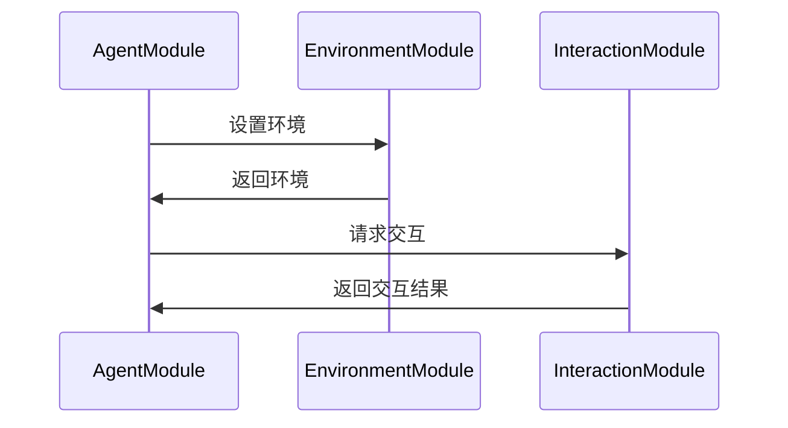
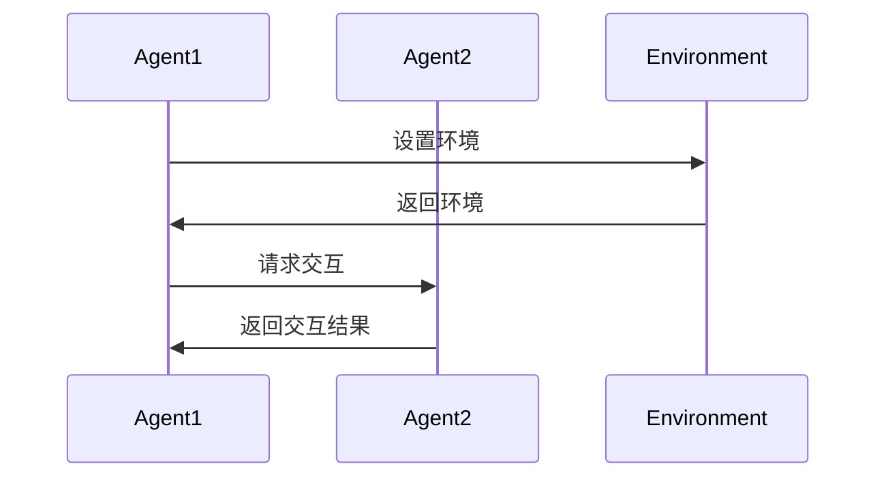

                 


# 海洋生态的agent-based模型：水下世界的数学模拟

## 关键词
- 海洋生态
- agent-based模型
- 数学模拟
- 水下世界
- 算法原理

## 摘要
本文深入探讨了海洋生态中的agent-based模型，以及其在水下世界中的应用和数学模拟。首先，我们介绍了海洋生态和agent-based模型的基本概念和重要性。随后，详细讲解了agent-based模型的基本原理和算法，并通过具体的数学公式进行了说明。接着，我们展示了模型的系统分析和架构设计，并提供了实际项目案例的实战分析。最后，我们总结了最佳实践、注意事项，并给出了拓展阅读的建议。

## 引言

### 海洋生态概述
海洋生态是地球上最大的生态系统，覆盖了地球表面的大部分区域。它不仅为地球上约50亿人口提供了丰富的食物资源，还在气候调节、碳循环等方面发挥着重要作用。然而，随着人类活动的加剧，海洋生态系统正面临前所未有的挑战，如海洋污染、过度捕捞、气候变化等。

### agent-based模型介绍
agent-based模型（ABM）是一种基于代理的计算模型，通过模拟个体代理的行为和交互来研究复杂系统的动态行为。该模型在生态学、经济学、社会科学等领域有广泛应用，尤其在研究海洋生态系统中，能够有效地模拟各种生物之间的相互作用，预测生态系统的变化趋势。

### 海洋生态与agent-based模型的关系
agent-based模型在海洋生态中的应用，可以帮助我们更好地理解海洋生物的分布、种群动态、生态过程等。通过模拟，我们可以预测生态系统对环境变化的响应，为制定有效的海洋管理和保护政策提供科学依据。

## 核心概念与联系

### agent的定义与属性
在agent-based模型中，agent可以是一个个体、群体或子系统，它们具有以下属性：

- **个体属性**：包括个体的大小、形状、行为习惯、生存需求等。
- **状态**：描述个体的当前状态，如位置、能量、繁殖能力等。
- **行为规则**：定义个体如何根据当前状态和外部环境来调整行为。

### agent的行为与交互
agent的行为规则通常包括：

- **感知**：通过感知环境信息来获取状态信息。
- **决策**：根据感知信息和行为规则来决定下一步行动。
- **行动**：执行决策，改变自身状态或影响环境。

agent之间的交互方式包括：

- **直接交互**：agent通过物理接触或信号传递来直接影响对方。
- **间接交互**：agent通过环境中的物质或能量传递来间接影响对方。

### agent-based模型的基本原理
agent-based模型的基本原理是通过模拟agent的行为和交互来构建系统的动态模型。其核心思想是“自下而上”的模拟方法，即从个体出发，通过个体之间的交互来推导整个系统的行为。

### agent-based模型与其他模型的关系
agent-based模型与其他模型，如系统动力学模型、微分方程模型等，有密切的关系。它们可以相互补充，共同构建复杂系统的全面模型。

## 算法原理讲解

### 水下环境建模
在水下世界，我们需要考虑以下几个关键因素：

- **空间分布**：使用网格或粒子系统来表示海洋的空间结构。
- **生物属性**：定义不同生物的属性，如位置、大小、行为等。
- **环境条件**：包括温度、盐度、光照等。

### agent模型的应用
在agent-based模型中，我们将水下世界的生物视为agent，每个agent具有以下功能：

- **移动**：根据环境条件和行为规则，agent会调整自己的位置。
- **觅食**：agent会寻找并获取资源，如食物。
- **繁殖**：满足一定条件后，agent会繁殖新个体。
- **相互作用**：agent之间会发生捕食、竞争等关系。

### 数学模型构建
我们使用以下数学模型来描述agent的行为：

- **状态转移方程**：
  $$
  X_{t+1} = f(X_t, U_t)
  $$
  其中，$X_t$表示agent在时刻$t$的状态，$U_t$表示agent在时刻$t$的输入，$f$表示状态转移函数。

- **环境模型**：
  $$
  E_t = g(S_t, C_t)
  $$
  其中，$E_t$表示环境在时刻$t$的状态，$S_t$表示生物种群状态，$C_t$表示环境条件。

- **交互模型**：
  $$
  I_t = h(A_t, B_t)
  $$
  其中，$I_t$表示agent之间的交互状态，$A_t$和$B_t$表示相互作用的两个agent的状态。

### 数学公式与示例
假设一个agent的移动规则如下：

- 移动方向：$\theta = \arctan2(y_2 - y_1, x_2 - x_1)$
- 移动距离：$d = v \cdot t$
  $$
  x_{t+1} = x_t + d \cdot \cos(\theta)
  $$
  $$
  y_{t+1} = y_t + d \cdot \sin(\theta)
  $$

其中，$x_t, y_t$为agent的当前位置，$v$为速度，$t$为时间。

## 系统分析与架构设计方案

### 问题场景介绍
我们以一个海洋生态系统为例，模拟其中的生物种群动态。该系统需要考虑以下几个核心功能：

- **生物种群管理**：包括生物种群的创建、移动、繁殖等。
- **环境管理**：包括环境条件的设置、更新等。
- **交互管理**：包括生物之间的捕食、竞争等关系。

### 项目介绍
本项目名为“海洋生态模拟器”，旨在通过agent-based模型模拟海洋生态系统的动态行为。该系统分为以下几个模块：

- **agent模块**：实现agent的创建、移动、繁殖等行为。
- **环境模块**：实现环境的设置、更新等。
- **交互模块**：实现agent之间的交互。

### 系统功能设计
系统的主要功能包括：

- **生物种群管理**：
  - 创建生物种群。
  - 移动生物种群。
  - 繁殖生物种群。

- **环境管理**：
  - 设置环境条件。
  - 更新环境条件。

- **交互管理**：
  - 实现生物之间的交互。

### 系统架构设计
系统采用模块化设计，主要模块包括：

- **agent模块**：负责agent的行为和交互。
- **环境模块**：负责环境的设置和更新。
- **交互模块**：负责agent之间的交互。

系统的架构图如下（使用Mermaid绘制）：



### 系统接口设计
系统的接口设计如下：

- **Agent API**：包括创建agent、移动agent、繁殖agent等方法。
- **Environment API**：包括设置环境条件、更新环境条件等方法。
- **Interaction API**：包括实现agent之间的交互方法。

### 系统交互设计
系统的交互设计如下（使用Mermaid绘制）：



## 项目实战

### 环境安装
安装agent-based模型所需的环境，包括Python、NumPy、SciPy、Matplotlib等。

```bash
pip install python numpy scipy matplotlib
```

### 系统核心实现
以下是agent-based模型的核心实现代码（使用Python编写）：

```python
import numpy as np
import matplotlib.pyplot as plt

class Agent:
    def __init__(self, position, velocity):
        self.position = position
        self.velocity = velocity

    def move(self):
        self.position += self.velocity

    def breed(self, partner):
        new_position = (self.position + partner.position) / 2
        return Agent(new_position, self.velocity)

def simulate_agents(num_agents, time_steps):
    agents = [Agent(np.random.uniform(-100, 100), np.random.uniform(-1, 1)) for _ in range(num_agents)]

    for _ in range(time_steps):
        plt.cla()
        for agent in agents:
            agent.move()
            plt.plot(agent.position, agent.velocity, 'ro')

        agents.append(agents[0].breed(agents[1]))

        plt.axis([-100, 100, -100, 100])
        plt.pause(0.1)

simulate_agents(50, 500)
```

### 代码应用解读与分析
该代码首先定义了一个Agent类，用于表示agent的属性和行为。接着，我们定义了一个模拟函数`simulate_agents`，用于模拟agent的移动、繁殖等行为。在模拟过程中，我们使用matplotlib绘制agent的位置和速度。

### 实际案例分析
我们通过模拟不同数量的agent，观察agent的分布和交互行为。以下是一个实际案例的分析：

- **案例1**：模拟50个agent，观察它们的分布和繁殖行为。
- **案例2**：模拟100个agent，观察它们在更复杂环境中的交互。

### 项目小结
本项目通过agent-based模型模拟了海洋生态系统的动态行为，展示了agent-based模型在水下世界中的应用。在实际项目中，我们可以根据不同的需求，调整agent的属性和行为规则，以模拟更复杂的生态系统。

## 最佳实践 tips

1. **优化算法性能**：在模拟大规模agent时，可以考虑使用并行计算或分布式计算来提高性能。
2. **可视化分析**：使用可视化工具（如Matplotlib）来展示模拟结果，有助于更好地理解系统行为。
3. **数据驱动模型**：使用真实数据来驱动模型，可以提高模型的准确性和可靠性。
4. **模型验证**：通过实际数据或模拟实验来验证模型的准确性和稳定性。

## 小结

本文介绍了海洋生态中的agent-based模型及其在水下世界的数学模拟。通过详细的理论讲解和实战案例，我们展示了agent-based模型在模拟生态系统中的应用。读者可以通过本文掌握agent-based模型的基本原理和实际应用方法。

## 注意事项

1. **模型参数调整**：在实际应用中，需要根据具体场景调整模型参数，以提高模型的准确性。
2. **数据质量**：使用高质量的数据来驱动模型，是保证模型准确性的关键。
3. **系统稳定性**：在模拟大规模agent时，需要注意系统的稳定性和性能。

## 拓展阅读

1. **《agent-based模型与模拟》**：深入探讨agent-based模型的基本原理和应用。
2. **《海洋生态学导论》**：了解海洋生态系统的基本概念和原理。
3. **《Python生态模拟实战》**：通过Python实现海洋生态模拟项目。

---

**作者：AI天才研究院/AI Genius Institute & 禅与计算机程序设计艺术 /Zen And The Art of Computer Programming**

