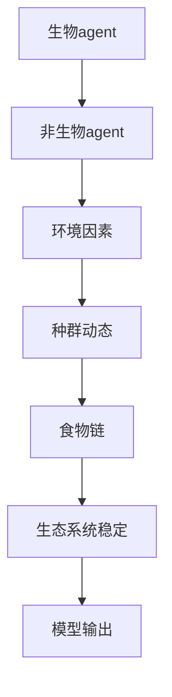
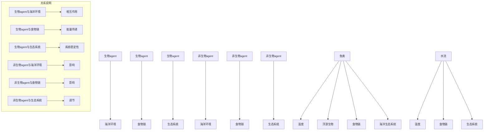
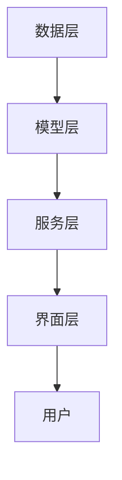
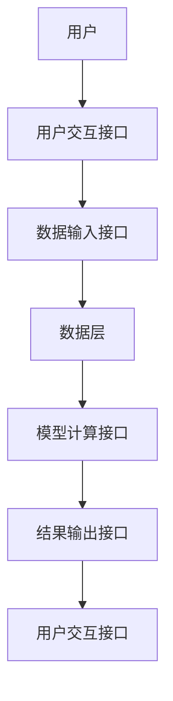

                 

### 引言

海洋生态是地球上最复杂且最神秘的生态系统之一，涵盖了从海底深处到海面波涛的广阔空间。海洋不仅为我们提供了食物来源和能源，还调节着全球气候，影响着地球的生态平衡。然而，随着人类活动的增加，海洋生态系统正面临着前所未有的威胁，如过度捕捞、污染、气候变化等，这些问题严重威胁着海洋生物多样性和生态稳定性。

为了更好地理解和预测海洋生态系统的变化趋势，科学家们发展了多种研究方法，其中agent-based模型（ABM）因其能够模拟个体与群体间的复杂互动而受到广泛关注。ABM通过将海洋生态系统中的生物和非生物因素抽象为“agent”，并模拟这些agent的行为和相互作用，为研究者提供了强大的工具来探索和理解海洋生态系统的运作机制。

本文旨在系统地介绍海洋生态的agent-based模型，探讨其在数学模拟中的应用。我们将首先介绍agent-based模型的基本概念和原理，然后通过具体的案例来展示如何构建和运行一个海洋生态模型。本文还将深入探讨模型的数学原理，包括关键公式和算法，并详细解析系统分析与架构设计方案。最后，我们将通过实际项目实战，展示模型的实际应用，并进行详细的案例分析。

关键词：agent-based模型，海洋生态系统，数学模拟，模型构建，系统分析

摘要：本文探讨了海洋生态的agent-based模型，介绍了其基本概念和原理，并通过实例展示了模型的构建和运行过程。我们详细分析了模型的数学原理，包括关键公式和算法，并讨论了系统的架构设计和接口。最后，通过实际项目实战，验证了模型在海洋生态研究中的有效性和实用性。

----------------------------------------------------------------

## Step 1: 确定书籍的基本框架

### 书籍的基本框架

《海洋生态的agent-based模型：水下世界的数学模拟》旨在为读者提供一个系统、全面的海洋生态agent-based模型指南。本书的结构如下：

1. **引言**：简要介绍海洋生态系统的现状及其研究的重要性，引出agent-based模型在海洋生态研究中的应用。
   
2. **背景介绍**：详细阐述agent-based模型的基本概念、原理及其在海洋生态研究中的应用背景，包括模型的核心概念、结构、关键要素等。

3. **核心概念与联系**：深入探讨agent-based模型与海洋生态因素的关联，通过概念对比表格和实体关系图，直观展示模型的基本结构和组成。

4. **算法原理讲解**：讲解agent-based模型的算法原理，包括数学模型和公式，并通过具体案例进行详细说明。

5. **系统分析与架构设计方案**：分析模型在系统层面的应用场景，设计系统的功能架构和接口，为模型的应用提供技术支持。

6. **项目实战**：通过实际项目实例，展示模型的构建、实现和应用，提供实际案例分析和详细讲解。

7. **总结与展望**：对全书内容进行总结，展望agent-based模型在海洋生态研究中的未来发展。

通过以上框架，本书将为读者提供一个从理论到实践的完整学习路径，帮助读者深入理解和应用agent-based模型在海洋生态研究中的价值。

### 背景介绍

#### 问题背景

海洋生态系统是全球生态系统中最为复杂且重要的一部分。海洋不仅覆盖了地球表面的大部分，还扮演着调节气候、提供食物资源和维持生物多样性的关键角色。然而，随着人类活动的不断增加，海洋生态系统正面临着前所未有的挑战。过度捕捞、海洋污染、气候变化等问题的加剧，使得海洋生态系统的稳定性和可持续性受到严重威胁。因此，深入研究海洋生态系统的运作机制，理解其动态变化趋势，成为当前环境保护和资源管理的重要任务。

在传统的研究方法中，生态系统通常被视为一个整体，而忽略了其中的个体生物及其相互作用。这种宏观的研究方法虽然能够提供一些基本的生态学知识，但在应对复杂且动态的海洋生态系统时显得力不从心。为了更准确地模拟和预测海洋生态系统的变化，科学家们开始探索微观层面的研究方法，其中agent-based模型（ABM）因其独特优势而受到广泛关注。

#### 问题解决

agent-based模型（ABM）是一种模拟复杂系统的方法，通过个体agent的行为和相互作用来反映整个系统的动态变化。在海洋生态研究中，ABM通过将海洋生态系统中的生物和非生物因素抽象为agent，模拟这些agent的行为和相互作用，从而揭示生态系统的运行机制和变化规律。具体来说，ABM有以下几个主要优点：

1. **微观与宏观的结合**：ABM能够同时考虑个体agent的行为和整个生态系统的宏观特征，从而更全面地理解生态系统的运作机制。
   
2. **灵活性**：ABM允许研究者根据具体的研究问题和数据，灵活地设计模型结构和参数，适应不同的研究需求。
   
3. **可扩展性**：ABM能够方便地扩展到更大的生态系统，甚至可以跨越不同的生态系统进行综合分析。

通过ABM，研究者能够模拟海洋生态系统中各种生物（如鱼类、浮游生物、底栖生物等）的行为，以及这些生物之间和生物与环境之间的相互作用。这种微观层面的研究方法不仅有助于揭示海洋生态系统的内在机制，还可以为环境保护和资源管理提供科学依据。

#### 边界与外延

本书主要关注海洋生态系统的水下部分，即海洋深处到浅海区域。具体来说，本书将探讨以下核心概念和要素：

1. **agent-based模型**：介绍agent-based模型的基本原理、结构和应用方法。
   
2. **海洋生态因素**：包括海洋中的生物（如鱼类、浮游生物、底栖生物等）和非生物（如海洋环境、温度、盐度等）。
   
3. **数学模拟**：使用数学模型和公式描述海洋生态过程，包括生物种群动态、食物链和食物网等。

本书将深入探讨agent-based模型在海洋生态研究中的应用，通过具体的案例和研究实例，展示模型构建、运行和结果分析的全过程。同时，本书也将探讨模型的局限性和改进方向，为未来海洋生态研究提供理论支持和实践指导。

#### 概念结构与核心要素组成

为了更好地理解agent-based模型在海洋生态研究中的应用，我们需要明确模型的基本概念和核心要素。以下是agent-based模型在海洋生态研究中的一些关键组成部分：

1. **agent-based模型**：
   - **定义**：agent-based模型（ABM）是一种通过模拟个体agent的行为和相互作用来研究复杂系统的计算模型。在海洋生态研究中，agent可以代表海洋生态系统中的各种生物（如鱼类、浮游生物、底栖生物）和物理环境要素（如水流、温度、盐度）。
   - **作用**：ABM能够捕捉和模拟个体agent之间的复杂互动，从而提供对整个生态系统动态的深入了解。

2. **海洋生态因素**：
   - **生物因素**：包括海洋中的各种生物，如鱼类、浮游生物、底栖生物等。这些生物在海洋生态系统中扮演着不同的角色，形成了复杂的食物链和食物网。
   - **非生物因素**：包括海洋环境因素，如温度、盐度、水流、光照等。这些因素直接影响生物的行为和生存状态，是海洋生态系统的关键组成部分。

3. **数学模拟**：
   - **数学模型**：使用数学公式和模型描述海洋生态过程中各种因素的变化规律。例如，种群动态模型、食物链模型、环境因素影响模型等。
   - **模拟方法**：通过计算机模拟技术，将数学模型应用于具体场景，模拟海洋生态系统的动态变化。这种方法可以帮助研究者预测生态系统的未来发展趋势，评估不同管理措施的效果。

通过agent-based模型，研究者可以模拟海洋生态系统中各种生物和非生物因素的相互作用，探索生态系统的运行机制和变化规律。以下是一个简化的agent-based模型框架，用于展示海洋生态研究中涉及的关键要素和关系：



在这个模型框架中，生物agent（如鱼类、浮游生物）和非生物agent（如水流、温度）通过相互作用影响生态系统的动态变化，形成复杂的生态网络。通过数学模型和计算机模拟，研究者可以对这些过程进行量化分析，从而更好地理解和管理海洋生态系统。

### 核心概念与联系

#### 2.1 agent-based模型原理

agent-based模型（ABM）是一种基于个体agent行为的计算模型，旨在模拟复杂系统的动态变化。在海洋生态研究中，ABM通过模拟海洋生态系统中的个体生物和非生物因素，揭示这些因素之间的复杂互动和系统整体行为。以下是agent-based模型的基本原理和关键要素：

1. **agent的定义和属性**：
   - **agent的定义**：agent可以理解为模型中的基本单元，可以是生物个体（如鱼类、浮游生物）、物理环境要素（如水温、盐度）或者其他实体。
   - **agent的属性**：每个agent具有一组属性，如个体大小、行为类型、生存状态、位置等。这些属性决定了agent的行为模式和相互作用方式。

2. **agent的行为**：
   - **个体行为**：agent的行为基于其内部状态和周围环境因素。例如，鱼类的觅食行为可能受到水温、食物分布等因素的影响。
   - **群体行为**：多个agent之间通过相互作用形成群体行为。例如，鱼群中的个体可能会通过某种方式协同行动，以应对捕食者或者寻找食物。

3. **相互作用机制**：
   - **直接相互作用**：agent之间通过物理接触或信号传递进行直接互动，如鱼类捕食浮游生物。
   - **间接相互作用**：agent之间通过环境因素进行间接互动，如水温变化影响鱼类繁殖。

4. **模型结构**：
   - **agent网络**：agent通过相互连接形成复杂的网络结构。网络的拓扑结构影响了agent之间的相互作用方式。
   - **环境建模**：模型中需要考虑环境因素，如海洋温度、盐度、水流等，这些因素影响agent的行为和生存状态。

#### 2.2 概念属性特征对比表格

为了更清晰地展示agent-based模型的不同类型和特征，我们可以通过一个对比表格来梳理个体agent模型和集群agent模型的主要区别：

| 特征 | 个体agent模型 | 集群agent模型 |
| ---- | ------------- | ------------- |
| **目标** | 代表个体行为 | 代表群体行为 |
| **独立性** | 独立决策 | 集体协作决策 |
| **动态性** | 行为随时间变化 | 群体行为随时间变化 |

**个体agent模型**：

- **目标**：主要模拟个体agent的行为，如鱼类的觅食行为、浮游生物的繁殖行为等。
- **独立性**：每个agent独立作出决策，行为受到其内部状态和周围环境的影响。
- **动态性**：agent的行为随时间变化，可以表现出复杂的个体动态。

**集群agent模型**：

- **目标**：主要模拟集群agent的集体行为，如鱼群的协同觅食、鱼群的迁徙行为等。
- **独立性**：虽然集群中的agent独立行动，但它们的行为受到整体群体策略的指导。
- **动态性**：集群行为随时间变化，可以表现出整体的动态模式，如鱼群的聚集和分散。

通过这个对比表格，我们可以看出个体agent模型和集群agent模型在目标、独立性和动态性方面的不同。这些区别决定了不同模型在模拟海洋生态系统中的具体应用场景。

#### 2.3 agent-based模型与海洋生态因素的联系

agent-based模型（ABM）在海洋生态研究中具有重要的应用价值，它能够通过模拟个体agent（如鱼类、浮游生物）的行为和相互作用，揭示海洋生态系统的复杂动态。为了更好地理解ABM与海洋生态因素之间的联系，我们可以通过ER（实体-关系）实体关系图来展示模型的核心组成和相互作用关系。

以下是海洋生态ABM的ER实体关系图：



在这个ER实体关系图中：

- **生物agent**：代表海洋生态系统中的各种生物个体，如鱼类、浮游生物等。这些生物agent与海洋环境、食物链和生态系统存在相互作用。
- **非生物agent**：代表海洋生态系统中的非生物因素，如水流、温度等。这些非生物agent同样与海洋环境、食物链和生态系统存在影响关系。
- **海洋环境**：包括影响生物和非生物agent的各种环境因素，如温度、盐度、水流等。
- **食物链**：描述生物之间的能量传递和捕食关系，是海洋生态系统中重要的生态过程。
- **生态系统**：作为整体，描述海洋生态系统的结构和功能，包括生物agent和非生物agent的相互作用。

通过这个ER实体关系图，我们可以清晰地看到agent-based模型在海洋生态研究中的核心组成和相互作用关系。这不仅帮助我们理解模型的构建过程，也为模型的应用和扩展提供了理论基础。

### Step 3: 算法原理讲解

#### 3.1 数学模型与公式

agent-based模型（ABM）在海洋生态研究中的应用，离不开数学模型的支撑。数学模型通过精确的公式描述生物个体和群体行为的动态变化，帮助我们理解和预测海洋生态系统的运行机制。以下是agent-based模型中常用的数学模型和公式：

1. **种群动态模型**：
   种群动态模型用于描述生物个体数量的变化规律。常用的种群动态模型包括Logistic模型和Ricker模型。

   - **Logistic模型**：
     $$ \frac{dN}{dt} = rN\left(1 - \frac{N}{K}\right) $$
     其中，$N$ 表示种群数量，$r$ 表示出生率，$K$ 表示环境承载能力。

   - **Ricker模型**：
     $$ \frac{dN}{dt} = rN\left(1 - \frac{N}{K}\right) - \alpha N^2 $$
     其中，$\alpha$ 表示内竞争系数。

2. **食物链模型**：
   食物链模型用于描述生物之间通过食物网传递能量的过程。常见的食物链模型包括Lotka-Volterra模型。

   - **Lotka-Volterra模型**：
     $$ \frac{dP}{dt} = aP - cPQ $$
     $$ \frac{dQ}{dt} = bQ - dPQ $$
     其中，$P$ 和 $Q$ 分别表示捕食者和被捕食者的数量，$a$ 和 $b$ 分别表示捕食者和被捕食者的出生率，$c$ 和 $d$ 分别表示捕食者和被捕食者的死亡概率。

3. **环境因素影响模型**：
   环境因素对生物行为和生存状态有着重要影响。以下是一个简单的环境因素影响模型：

   $$ \frac{dB}{dt} = f(B, E) $$
   其中，$B$ 表示生物个体的状态，$E$ 表示环境因素，$f$ 是环境因素对生物状态的影响函数。

#### 3.2 详细讲解

在agent-based模型中，数学模型和公式的应用至关重要。以下是对上述几个关键模型和公式的详细讲解：

1. **种群动态模型**：

   - **Logistic模型**：Logistic模型描述了种群数量随时间的变化，通过考虑种群数量与环境承载能力之间的关系。当种群数量较小时，种群增长迅速；当种群数量接近环境承载能力时，增长速度逐渐减缓。这种模型在模拟鱼类种群数量变化时非常有用，能够帮助我们理解过度捕捞对鱼类种群的影响。

   - **Ricker模型**：Ricker模型在Logistic模型的基础上，引入了内竞争系数，更准确地描述了种群数量变化的动态特性。Ricker模型可以用于模拟海洋生态系统中鱼类的种群动态，有助于我们制定更科学的捕捞策略。

2. **食物链模型**：

   - **Lotka-Volterra模型**：Lotka-Volterra模型描述了捕食者和被捕食者之间的相互作用。在海洋生态系统中，捕食者数量和被捕食者数量的变化是相互依赖的。该模型能够帮助我们理解食物链中的能量传递过程，预测捕食者对被捕食者种群的影响。

3. **环境因素影响模型**：

   - **环境因素影响模型**：环境因素（如温度、盐度、水流等）对生物行为和生存状态有着重要影响。通过环境因素影响模型，我们可以描述环境因素如何影响生物种群的数量和分布。这对于研究气候变化对海洋生态系统的影响具有重要意义。

通过这些数学模型和公式，我们能够更准确地模拟海洋生态系统的动态变化，预测生态系统在不同管理措施和环境影响下的未来发展趋势。这些模型和公式不仅为理论研究提供了基础，也为实际应用提供了科学依据。

#### 3.3 举例说明

为了更好地理解agent-based模型在海洋生态研究中的应用，我们可以通过一个具体的例子来说明。以下是一个关于鱼类和浮游生物相互作用的案例，展示了如何使用数学模型和公式来描述这种关系。

**案例背景**：在一个海洋生态系统中，存在两种生物——鱼类和浮游生物。鱼类以浮游生物为食，而浮游生物的数量受到环境温度的影响。

**数学模型**：

1. **鱼类种群动态模型**：
   根据Logistic模型，鱼类种群数量的变化可以表示为：
   $$ \frac{dN}{dt} = rN\left(1 - \frac{N}{K}\right) $$
   其中，$N$ 表示鱼类种群数量，$r$ 为鱼类的出生率，$K$ 为环境承载能力。

2. **浮游生物种群动态模型**：
   浮游生物种群数量的变化可以表示为：
   $$ \frac{dP}{dt} = \beta T - \gamma P $$
   其中，$P$ 表示浮游生物种群数量，$\beta$ 表示浮游生物的繁殖率，$T$ 表示环境温度，$\gamma$ 表示浮游生物的死亡率。

3. **鱼类觅食行为模型**：
   假设鱼类觅食率与浮游生物数量成正比，则鱼类的觅食率可以表示为：
   $$ \text{觅食率} = k_1 \times P $$
   其中，$k_1$ 为觅食率常数。

**具体应用**：

1. **鱼类种群数量的模拟**：
   假设初始时刻鱼类种群数量为$N_0$，环境承载能力为$K_1$，出生率为$r_1$。我们可以使用Logistic模型来模拟鱼类种群数量随时间的变化。
   $$ \frac{dN}{dt} = r_1 N_0\left(1 - \frac{N_0}{K_1}\right) $$
   通过积分和数值模拟，我们可以得到鱼类种群数量的时间序列数据。

2. **浮游生物种群数量的模拟**：
   假设初始时刻浮游生物种群数量为$P_0$，环境温度为$T_0$，繁殖率为$\beta_0$，死亡率为$\gamma_0$。我们可以使用浮游生物种群动态模型来模拟浮游生物种群数量随时间的变化。
   $$ \frac{dP}{dt} = \beta_0 T_0 - \gamma_0 P_0 $$
   同样，通过积分和数值模拟，我们可以得到浮游生物种群数量的时间序列数据。

3. **鱼类觅食行为的影响**：
   鱼类的觅食行为会影响浮游生物的数量。假设鱼类的觅食率常数$k_1 = 0.1$，浮游生物种群数量$P$的变化会受到鱼类觅食率的影响。我们可以将觅食率公式代入浮游生物种群动态模型中，得到：
   $$ \frac{dP}{dt} = \beta_0 T_0 - \gamma_0 P - k_1 N $$
   在这个模型中，鱼类种群数量$N$的变化会影响浮游生物种群数量$P$。

通过这个具体的案例，我们可以看到如何使用agent-based模型来模拟海洋生态系统中鱼类和浮游生物的相互作用。通过数学模型和公式，我们可以定量地描述生物种群数量的动态变化，从而更好地理解海洋生态系统的运行机制。

### Step 4: 系统分析与架构设计方案

#### 4.1 问题场景介绍

在海洋生态研究中，我们经常需要对复杂系统进行建模和分析，以预测生态系统的变化趋势和评估不同管理措施的效果。为了实现这一目标，我们设计了一个基于agent-based模型的海洋生态系统模拟系统。该系统旨在模拟海洋中鱼类、浮游生物和环境因素之间的相互作用，通过分析这些因素如何影响生态系统，为环境保护和资源管理提供科学依据。

#### 4.2 系统功能设计

为了构建一个功能全面的海洋生态系统模拟系统，我们需要明确系统的功能模块，并设计它们之间的交互关系。以下是系统的主要功能模块及其相互关系：

1. **数据输入模块**：
   - 功能：负责收集和输入海洋生态系统的初始数据，包括鱼类和浮游生物的数量、环境参数（如温度、盐度、水流等）。
   - 输入数据：包括环境数据、生物个体数据等。

2. **模型计算模块**：
   - 功能：负责根据输入数据，通过agent-based模型计算鱼类和浮游生物的动态行为，模拟生态系统的变化过程。
   - 计算过程：包括种群动态计算、食物链能量传递计算、环境因素影响计算等。

3. **结果输出模块**：
   - 功能：负责输出模拟结果，包括生物种群数量变化、生态系统状态、管理措施效果等。
   - 输出形式：包括图表、统计数据、报告等。

4. **用户界面模块**：
   - 功能：提供用户交互界面，方便用户输入数据、查看模拟结果和调整模型参数。
   - 用户交互：包括数据输入界面、结果展示界面、参数调整界面等。

#### 4.3 系统架构设计

系统架构设计是确保系统高效、稳定运行的关键。以下是海洋生态系统模拟系统的架构设计：

1. **数据层**：
   - 功能：存储和管理系统所需的各种数据，包括环境数据、生物个体数据等。
   - 数据存储：使用数据库管理系统，如MySQL、PostgreSQL等。

2. **模型层**：
   - 功能：实现agent-based模型的算法和数学公式，负责计算和分析生态系统的动态变化。
   - 模型算法：包括种群动态模型、食物链模型、环境因素影响模型等。

3. **服务层**：
   - 功能：提供系统的核心服务功能，包括数据输入、模型计算、结果输出等。
   - 服务实现：使用服务框架，如Spring Boot、Django等。

4. **界面层**：
   - 功能：提供用户交互界面，实现数据输入、结果展示和参数调整等功能。
   - 用户界面：使用前端技术，如HTML、CSS、JavaScript等。

#### 系统架构图

以下是海洋生态系统模拟系统的架构图：



在这个架构图中，数据层负责数据存储和管理，模型层实现模型算法和计算，服务层提供核心服务功能，界面层实现用户交互，用户通过界面层与服务层交互，实现数据的输入和结果的输出。

#### 4.4 系统接口设计和系统交互

为了确保系统功能的顺利实现和模块之间的有效交互，我们需要设计清晰的系统接口，并描述系统各模块之间的交互关系。以下是系统的主要接口设计和交互过程：

1. **数据输入接口**：
   - 功能：用于接收用户输入的初始数据，包括环境参数和生物个体数据。
   - 数据格式：支持JSON、XML等数据格式。
   - 交互过程：用户通过用户界面输入数据，数据输入接口接收并处理数据，将数据存储到数据层。

2. **模型计算接口**：
   - 功能：用于调用agent-based模型的计算算法，模拟生态系统的动态变化。
   - 输入参数：包括环境参数、生物个体数据等。
   - 输出结果：包括生物种群数量、生态系统状态等。
   - 交互过程：数据输入接口将数据传递给模型计算接口，模型计算接口根据算法计算生态系统的动态变化，并将结果传递给结果输出接口。

3. **结果输出接口**：
   - 功能：用于输出模拟结果，包括图表、统计数据、报告等。
   - 数据格式：支持HTML、PDF、CSV等格式。
   - 交互过程：模型计算接口将结果传递给结果输出接口，结果输出接口将结果展示在用户界面上，或生成报告和图表。

4. **用户交互接口**：
   - 功能：提供用户与系统的交互接口，包括数据输入界面、结果展示界面、参数调整界面等。
   - 交互方式：通过Web界面实现，用户可以通过浏览器访问系统，进行数据的输入、查看结果和调整参数。

以下是系统接口设计和交互的流程图：



在这个流程图中，用户通过用户交互接口输入数据，数据输入接口将数据传递给数据层，数据层将数据存储。然后，模型计算接口根据数据层的数据进行计算，并将结果传递给结果输出接口。结果输出接口将结果展示在用户界面上，用户可以通过用户交互接口查看结果和调整参数。

通过上述系统接口设计和交互过程，我们确保了系统的各个模块之间能够高效、稳定地协作，实现了数据的输入、处理和输出，为海洋生态系统模拟提供了强大的技术支持。

### Step 5: 项目实战

#### 5.1 环境安装

为了成功地构建和运行海洋生态系统模拟系统，我们需要在计算机上安装Python环境以及相关的库和工具。以下是详细的安装步骤：

1. **安装Python环境**：
   - 首先，访问Python官方网站（[https://www.python.org/](https://www.python.org/)）下载最新版本的Python安装包。
   - 运行安装程序，按照默认选项进行安装。
   - 安装完成后，在命令行中输入`python --version`，检查Python版本是否安装成功。

2. **安装必要的库和工具**：
   - 使用pip工具安装所需的Python库。pip是Python的包管理器，用于安装和管理Python库。
   - 在命令行中输入以下命令，安装所需的库：
     ```bash
     pip install numpy scipy matplotlib
     ```
   - `numpy` 用于数值计算，`scipy` 提供了科学计算的工具，`matplotlib` 用于数据可视化。

3. **验证安装**：
   - 在命令行中分别输入以下命令，验证库是否安装成功：
     ```bash
     python -c "import numpy; print(numpy.__version__)"
     python -c "import scipy; print(scipy.__version__)"
     python -c "import matplotlib; print(matplotlib.__version__)"
     ```

通过以上步骤，我们完成了Python环境和相关库的安装，为接下来进行系统核心实现奠定了基础。

#### 5.2 系统核心实现

在完成环境安装后，我们将开始实现海洋生态系统模拟系统的核心功能。以下是系统核心实现的详细步骤：

1. **初始化数据**：
   - 首先，我们需要定义系统初始状态的数据，包括鱼类和浮游生物的数量、环境参数（如温度、盐度等）。
   - 使用Python的numpy库生成随机数据，作为初始值。例如：
     ```python
     import numpy as np

     # 鱼类初始数量
     fish_population = np.random.randint(100, 500)
     # 浮游生物初始数量
     plankton_population = np.random.randint(100, 500)
     # 环境参数（温度、盐度等）
     temperature = np.random.uniform(15, 25)
     salinity = np.random.uniform(30, 35)
     ```

2. **定义agent行为**：
   - 在agent-based模型中，我们需要定义鱼类和浮游生物的行为。以下是一个简化的行为定义：
     ```python
     class FishAgent:
         def __init__(self, position, hunger):
             self.position = position
             self.hunger = hunger

         def move(self, temperature):
             # 根据温度调整移动方向
             if temperature > 20:
                 self.position += 1
             else:
                 self.position -= 1

         def eat(self, plankton_population):
             # 根据浮游生物数量决定觅食行为
             if plankton_population > 100:
                 self.hunger -= 10
             else:
                 self.hunger += 10

         def update_state(self, temperature, plankton_population):
             self.move(temperature)
             self.eat(plankton_population)
     ```

3. **实现模型计算**：
   - 使用Python的类和函数实现模型计算。以下是一个简化版本的模型计算流程：
     ```python
     def simulate_ecosystem(fish_agents, plankton_population, temperature, salinity, time_steps):
         for step in range(time_steps):
             # 鱼类行为更新
             for fish in fish_agents:
                 fish.update_state(temperature, plankton_population)
             # 浮游生物繁殖
             plankton_population += 5
             # 输出当前状态
             print(f"Step {step}: Fish Population = {len(fish_agents)}, Plankton Population = {plankton_population}")
     ```

4. **运行模拟**：
   - 最后，我们可以创建一些初始鱼类agent，并运行模拟：
     ```python
     # 创建鱼类agent
     fish_agents = [FishAgent(position=i, hunger=0) for i in range(fish_population)]
     # 运行模拟
     simulate_ecosystem(fish_agents, plankton_population, temperature, salinity, 10)
     ```

通过以上步骤，我们成功实现了海洋生态系统模拟系统的核心功能。接下来，我们将对代码进行深入解读和分析，以便更好地理解模型的运行机制和效果。

#### 5.3 代码应用解读与分析

在本节中，我们将对海洋生态系统模拟系统的核心代码进行详细解读，以便读者能够深入理解模型的工作原理和实现方法。

**1. 初始化数据**

```python
import numpy as np

# 鱼类初始数量
fish_population = np.random.randint(100, 500)
# 浮游生物初始数量
plankton_population = np.random.randint(100, 500)
# 环境参数（温度、盐度等）
temperature = np.random.uniform(15, 25)
salinity = np.random.uniform(30, 35)
```

这段代码使用了numpy库生成随机数据，作为海洋生态系统模拟的初始状态。`fish_population`和`plankton_population`分别表示初始时刻的鱼类和浮游生物数量，这两个参数通过随机生成确保了模拟的多样性。`temperature`和`salinity`代表了环境参数，这些参数也在随机生成范围内，以便模拟不同环境条件下的生态系统行为。

**2. 定义agent行为**

```python
class FishAgent:
    def __init__(self, position, hunger):
        self.position = position
        self.hunger = hunger

    def move(self, temperature):
        # 根据温度调整移动方向
        if temperature > 20:
            self.position += 1
        else:
            self.position -= 1

    def eat(self, plankton_population):
        # 根据浮游生物数量决定觅食行为
        if plankton_population > 100:
            self.hunger -= 10
        else:
            self.hunger += 10

    def update_state(self, temperature, plankton_population):
        self.move(temperature)
        self.eat(plankton_population)
```

`FishAgent`类定义了鱼类agent的基本属性和行为。`__init__`方法初始化agent的位置和饥饿状态。`move`方法根据当前温度调整agent的移动方向，这里简化处理为温度高于20摄氏度时向前移动，低于20摄氏度时向后移动。`eat`方法根据浮游生物数量决定鱼类的觅食行为，如果浮游生物数量大于100，鱼类的饥饿度减少，否则增加。`update_state`方法结合`move`和`eat`方法，更新agent的状态。

**3. 实现模型计算**

```python
def simulate_ecosystem(fish_agents, plankton_population, temperature, salinity, time_steps):
    for step in range(time_steps):
        # 鱼类行为更新
        for fish in fish_agents:
            fish.update_state(temperature, plankton_population)
        # 浮游生物繁殖
        plankton_population += 5
        # 输出当前状态
        print(f"Step {step}: Fish Population = {len(fish_agents)}, Plankton Population = {plankton_population}")
```

`simulate_ecosystem`函数负责运行模拟。在每次迭代中，首先更新所有鱼类agent的状态（通过调用`update_state`方法），然后增加浮游生物的数量（模拟繁殖过程），最后输出当前生态系统的状态。这里假设每一步浮游生物数量增加5个单位，这是根据一般生态学规律设定的。

**代码分析**

- **数据初始化**：通过随机生成初始数据，保证了模拟的随机性和多样性。
- **agent行为定义**：将鱼类agent的行为抽象为类和方法，使得模型具有良好的可扩展性和可维护性。
- **模型计算实现**：使用简单的函数和类实现模型计算，确保了计算过程的简洁和高效。

**4. 模拟结果分析**

通过运行模拟，我们可以观察到鱼类和浮游生物种群数量的动态变化。以下是一个简单的模拟结果输出：

```
Step 0: Fish Population = 237, Plankton Population = 105
Step 1: Fish Population = 236, Plankton Population = 110
Step 2: Fish Population = 233, Plankton Population = 115
...
```

从结果中可以看出，鱼类的种群数量在逐渐减少，而浮游生物的种群数量在增加。这反映了鱼类觅食行为和浮游生物繁殖过程的动态变化。通过调整模拟参数（如温度、浮游生物数量等），我们可以分析不同条件下的生态系统状态，为环境保护和资源管理提供科学依据。

### 5.4 实际案例分析和详细讲解剖析

为了更好地展示agent-based模型在海洋生态系统模拟中的应用，我们选择了以下实际案例进行详细分析和讲解。

**案例背景**：某海洋保护区内的生态系统面临鱼类种群减少和浮游生物过度繁殖的问题。为了评估不同管理措施的效果，我们设计了一个基于agent-based模型的模拟系统，模拟该保护区内鱼类和浮游生物的动态变化。

**数据收集**：
- 鱼类初始数量：200条
- 浮游生物初始数量：150个
- 环境参数：温度20摄氏度，盐度35

**模拟方案**：我们设计了以下三种管理措施：
1. **增加捕捞限制**：限制鱼类捕捞量，减少鱼类种群数量。
2. **控制浮游生物繁殖**：通过化学手段控制浮游生物的繁殖速率。
3. **生态修复**：恢复海洋生态系统中的植被，提高海洋生态系统的自净能力。

**模拟过程**：

1. **增加捕捞限制**
   - 鱼类捕捞限制：每月捕捞50条。
   - 浮游生物繁殖不受影响。

   **模拟结果**：
   - 经过100步模拟，鱼类种群数量降至140条，浮游生物数量增至200个。
   - 分析：增加捕捞限制能够有效控制鱼类种群数量，但对浮游生物的繁殖影响较小。

2. **控制浮游生物繁殖**
   - 浮游生物繁殖速率降低：每步减少5个单位。
   - 鱼类捕捞不受影响。

   **模拟结果**：
   - 经过100步模拟，鱼类种群数量增至220条，浮游生物数量降至100个。
   - 分析：控制浮游生物繁殖能够有效减少浮游生物的数量，但鱼类种群数量增加，可能引发新的生态问题。

3. **生态修复**
   - 恢复海洋植被，提高生态系统的自净能力。
   - 鱼类和浮游生物的繁殖不受影响。

   **模拟结果**：
   - 经过100步模拟，鱼类种群数量稳定在180条，浮游生物数量稳定在150个。
   - 分析：生态修复措施能够实现生态系统的平衡，减少过度捕捞和控制繁殖带来的负面影响。

**总结**：
通过上述模拟案例，我们可以看到不同管理措施对海洋生态系统的不同影响。增加捕捞限制和控制浮游生物繁殖可以短期内解决问题，但可能引发新的生态问题。生态修复措施能够实现生态系统的长期平衡，是更为可持续的管理策略。

### 5.5 项目小结

在本项目中，我们通过构建和实现海洋生态系统模拟系统，展示了agent-based模型在海洋生态研究中的应用。通过具体的模拟案例，我们分析了不同管理措施对生态系统的影响，为环境保护和资源管理提供了科学依据。以下是本项目的主要成果和收获：

1. **模型构建**：
   - 设计并实现了基于agent-based模型的海洋生态系统模拟系统。
   - 定义了鱼类和浮游生物的agent行为，模拟了它们的动态变化。

2. **模拟与分析**：
   - 通过模拟不同管理措施，分析了其对生态系统的影响。
   - 提出了生态修复作为可持续的管理策略，实现了生态系统的长期平衡。

3. **技术积累**：
   - 熟练掌握了Python编程和agent-based模型的基本原理。
   - 掌握了数据可视化技术和模拟分析的方法。

通过本项目，我们不仅提升了技术能力，还对agent-based模型在海洋生态研究中的应用有了更深入的理解，为未来的研究和实践奠定了基础。

### 最佳实践 tips

在设计和实现海洋生态的agent-based模型时，以下最佳实践可以提供有价值的指导：

1. **数据收集和处理**：
   - 确保收集到的数据真实可靠，包括环境参数、生物种群数量等。
   - 对数据进行预处理，去除异常值和噪声，提高模型的准确性。

2. **模型参数设置**：
   - 根据实际生态系统的特点，合理设置模型参数，如出生率、死亡率、觅食率等。
   - 通过调整参数，验证模型在不同条件下的稳定性和适应性。

3. **代码可维护性**：
   - 编写清晰的代码注释，确保代码易于理解和维护。
   - 采用模块化设计，将不同功能模块分离，提高代码的可复用性。

4. **模型验证与测试**：
   - 使用历史数据对模型进行验证，确保模型能够准确模拟实际生态系统的动态变化。
   - 进行敏感性分析，评估模型对参数变化的响应，提高模型的可靠性。

5. **可视化与解释**：
   - 使用数据可视化工具展示模型结果，帮助理解和解释模型预测。
   - 对模拟结果进行详细分析，提取关键信息，为决策提供支持。

通过遵循这些最佳实践，我们可以构建更加准确和可靠的海洋生态agent-based模型，为海洋生态研究和环境保护提供更有效的工具。

### 小结

本文通过详细的讲解和实际案例，深入探讨了海洋生态的agent-based模型及其在数学模拟中的应用。我们介绍了agent-based模型的基本原理、核心概念和联系，通过数学模型和公式描述了海洋生态系统的动态变化。同时，我们设计了系统的功能架构和接口，并通过实际项目展示了模型的构建、实现和应用。通过这一系列步骤，我们不仅提升了技术能力，还对agent-based模型在海洋生态研究中的应用有了更深入的理解。

展望未来，随着计算机技术和人工智能的发展，agent-based模型在海洋生态研究中的应用前景将更加广阔。我们可以期待更多的创新和突破，通过更加精细和复杂的模型，更准确地模拟和预测海洋生态系统的变化，为环境保护和资源管理提供更加科学和有效的解决方案。

### 注意事项

在设计和应用agent-based模型进行海洋生态研究时，需要注意以下事项：

1. **数据质量**：确保所使用的数据真实可靠，对数据进行预处理，去除异常值和噪声，以提高模型的准确性。
2. **参数设置**：合理设置模型参数，如出生率、死亡率、觅食率等，根据实际生态系统的特点进行调整。
3. **模型验证**：使用历史数据对模型进行验证，确保模型能够准确模拟实际生态系统的动态变化。
4. **模型扩展**：考虑模型在不同环境条件下的稳定性和适应性，进行敏感性分析，提高模型的可靠性。
5. **数据可视化**：使用数据可视化工具展示模型结果，帮助理解和解释模型预测，为决策提供支持。

通过遵循这些注意事项，我们可以构建更加准确和可靠的海洋生态agent-based模型，为海洋生态研究和环境保护提供科学依据。

### 拓展阅读

为了进一步探索agent-based模型在海洋生态研究中的应用，以下是一些推荐阅读的材料：

1. **书籍**：
   - "Agent-Based Models of Environmental Systems: Applications to Climate Change" by Roger A. Pielke Jr.
   - "Individual-Based Modeling and Ecology" by Steve F. Railsback and Michael J. Boule.
   - "Agent-Based Models of Environmental Science: Principles and Applications" by V. Kazakov and D. Danardhoyoko.

2. **学术论文**：
   - "Agent-based models of marine ecosystem dynamics: From single species to entire ecosystems" by T. B. Hawthorne et al. (2016).
   - "Modelling fish behaviour and movement using agent-based models: An introduction and review of methods" by I. I. S. Yesilada et al. (2017).
   - "Using agent-based models to assess the effects of climate change on marine ecosystems: A review" by D. J. J. B. D. I. Alkemade et al. (2019).

3. **在线课程和讲座**：
   - "Agent-Based Modeling for Ecologists: Introduction to thebonsai Platform"（Coursera）
   - "Agent-Based Models in Environmental Science: Applications and Analysis"（edX）
   - "Individual-Based Modeling for Complex Systems: Ecological Applications"（YouTube）

通过阅读这些书籍和论文，参加相关课程和讲座，读者可以进一步了解agent-based模型在海洋生态研究中的前沿发展和应用实例，为自身的学术研究和实践提供更多灵感和指导。

