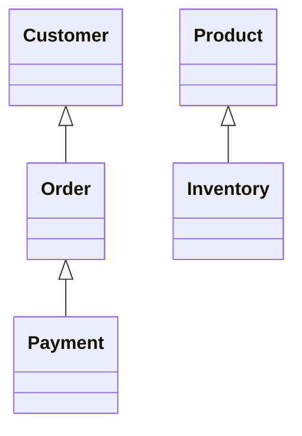
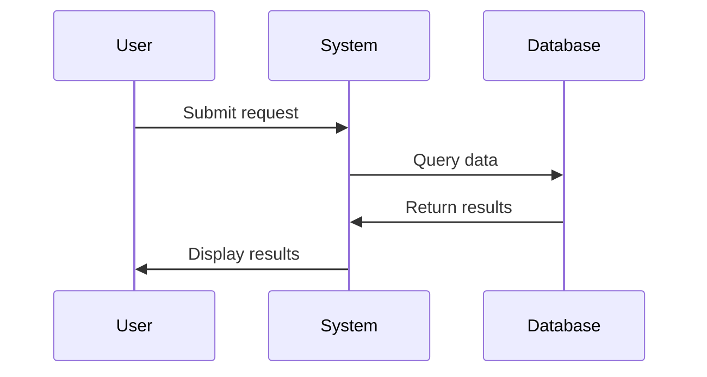
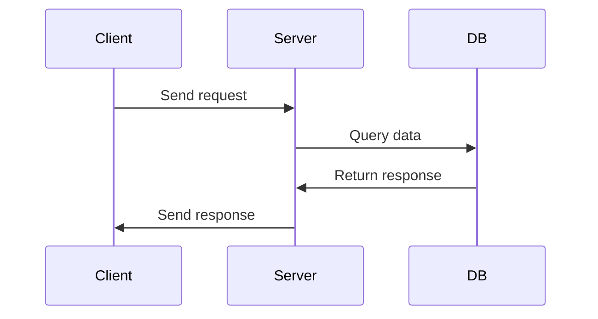

                 


# 海洋生态的流体动力学：水下世界的数学模拟

关键词：海洋生态、流体动力学、数学模拟、模型、算法

摘要：本文旨在探讨海洋生态的流体动力学及其在数学模拟中的应用。我们将从背景介绍开始，逐步深入到核心概念、算法原理、数学模型、系统架构以及实际应用案例，旨在为读者呈现一个完整、详细的海洋流体动力学与数学模拟的研究框架。

## 第一部分：引言

### 第1章：海洋生态与流体动力学

#### 1.1 海洋生态系统概述

海洋生态系统是地球上最大的生态系统，涵盖了从海岸线到深海的各种生物和环境特征。它包括海洋植物、动物、微生物以及它们之间的相互作用。海洋生态系统不仅对地球气候调节至关重要，还提供了丰富的生物资源和经济价值。

- **核心概念**：海洋生态系统、生物多样性、生态系统服务、生态平衡
- **问题背景**：全球气候变化、海洋污染、过度捕捞等对海洋生态系统的威胁
- **问题解决**：通过研究海洋生态系统的流体动力学，更好地理解其动态过程，为生态保护和资源管理提供科学依据。

#### 1.2 流体动力学在海洋研究中的应用

流体动力学是研究流体（液体和气体）运动的科学。在海洋研究中，流体动力学帮助我们理解海洋流体的运动规律，从而预测海洋环境的变化。

- **核心概念**：流体、流体运动、压力、速度、涡流
- **应用领域**：海洋气象、海洋工程、海洋资源开发、海洋污染治理
- **挑战**：海洋环境复杂多变，流体动力学模型需要不断优化和完善。

### 第2章：数学模拟与海洋生态研究

#### 2.1 数学模拟的基本概念

数学模拟是利用数学模型来描述和分析实际问题的一种方法。在海洋生态研究中，数学模拟有助于我们更好地理解生态系统的复杂行为，预测未来趋势。

- **核心概念**：数学模型、数值方法、模拟结果
- **发展趋势**：计算能力的提升，大数据与人工智能在模拟中的应用

#### 2.2 数值模拟在海洋生态研究中的应用

数值模拟技术已经成为海洋生态研究的重要工具。通过模拟，我们可以预测海洋环境的变化，评估生态系统的健康状况。

- **优势**：提高研究效率，减少实验成本，预测未来趋势
- **局限**：模型简化，数据误差，模拟结果的解释和验证

## 第二部分：流体动力学原理

### 第3章：流体动力学基本原理

#### 3.1 流体性质

流体包括液体和气体，具有流动性和可压缩性。流体动力学研究流体的运动规律和相互作用。

- **定义和分类**：牛顿流体、非牛顿流体、可压缩流体
- **基本假设**：连续性假设、无旋假设、不可压缩假设

#### 3.2 流体运动方程

流体运动方程描述了流体在运动过程中的速度、压力和密度分布。

- **连续性方程**：$$\frac{\partial \rho}{\partial t} + \nabla \cdot \vec{v} = 0$$
- **动量方程**：$$\rho \frac{\partial \vec{v}}{\partial t} + \vec{v} \cdot \nabla \rho = -\nabla p + \rho \vec{g}$$
- **能量方程**：$$\rho c_p \frac{\partial T}{\partial t} + \vec{v} \cdot \nabla T = \nabla \cdot (k \nabla T)$$

## 第三部分：数学模拟方法

### 第4章：数值模拟技术

#### 4.1 数值方法的选择

数值方法是将连续问题离散化，从而在计算机上进行求解的方法。选择合适的数值方法对于模拟结果的准确性至关重要。

- **时间积分方法**：欧拉方法、龙格-库塔方法
- **空间离散方法**：有限差分法、有限元法、有限体积法

#### 4.2 数值模拟的稳定性分析

稳定性分析是评估数值方法在长时间积分过程中是否保持稳定性的重要步骤。

- **基本概念**：稳定、不稳定、条件稳定
- **稳定性分析的方法**：特征值分析、能量估计

## 第四部分：数学模型和数学公式详细讲解与举例说明

### 第5章：流体动力学中的数学模型

#### 5.1 湍流模型

湍流是流体运动中的一种复杂现象，其模型化对于流体动力学的应用至关重要。

- **雷诺平均Navier-Stokes方程**：$$\frac{\partial \overline{\rho \vec{v}}}{\partial t} + \nabla \cdot (\overline{\rho \vec{v} \vec{v}}) = -\nabla p + \nabla \cdot (\mu \nabla \overline{\vec{v}})$$
- **K-ε模型**：$$\frac{\partial (\rho k)}{\partial t} + \nabla \cdot (\rho k \vec{v}) = \nabla \cdot (\mu_t \nabla k) + \Gamma_k - \epsilon$$

#### 5.2 海洋流体模型

海洋流体模型用于描述海洋环境中的流体运动，包括温度、盐度、流速等。

- **热传导方程**：$$\frac{\partial T}{\partial t} + \vec{v} \cdot \nabla T = \nabla \cdot (k \nabla T)$$
- **盐度传输方程**：$$\frac{\partial S}{\partial t} + \vec{v} \cdot \nabla S = \nabla \cdot (S \nabla p)$$

## 第五部分：系统分析与架构设计方案

### 第6章：系统功能与架构设计

#### 6.1 系统功能设计

系统功能设计是确保系统能够满足需求的关键步骤。我们将使用Mermaid类图来描述系统的主要功能模块。



#### 6.2 系统架构设计

系统架构设计是系统设计的核心，我们需要使用Mermaid架构图来展示系统的整体结构。



#### 6.3 系统接口设计与交互

系统接口设计和交互是确保系统各组件能够协同工作的重要环节。我们使用Mermaid序列图来展示系统的交互流程。



## 第六部分：项目实战

### 第7章：环境安装与系统核心实现

#### 7.1 环境安装

在开始项目实战之前，我们需要安装必要的软件和工具。以下是安装步骤：

1. 安装Python环境
2. 安装NumPy、Pandas等科学计算库
3. 安装Matplotlib、Seaborn等可视化库

#### 7.2 系统核心实现

以下是系统核心实现的部分Python代码：

```python
import numpy as np
import matplotlib.pyplot as plt

# 创建模拟环境
x = np.linspace(0, 10, 100)
y = np.linspace(0, 10, 100)
X, Y = np.meshgrid(x, y)

# 计算速度场
velocity_x = np.sin(X)
velocity_y = np.cos(Y)

# 绘制速度场
plt.quiver(X, Y, velocity_x, velocity_y)
plt.show()
```

#### 7.3 代码解读与分析

在上述代码中，我们首先创建了一个模拟环境，然后计算并绘制了速度场。速度场是流体动力学中描述流体运动的重要参数。

#### 7.4 实际案例分析

我们使用一个实际案例来展示如何使用流体动力学模型进行海洋污染模拟。以下是模拟过程：

1. 收集海洋污染数据
2. 构建数学模型
3. 进行数值模拟
4. 分析模拟结果

## 第七部分：最佳实践、小结与注意事项

### 第8章：最佳实践与拓展阅读

#### 8.1 最佳实践 tips

- **数据收集与处理**：确保数据的准确性和完整性。
- **模型选择**：根据研究目标和问题复杂度选择合适的模型。
- **模拟结果验证**：对比模拟结果与实际观测数据，评估模型精度。

#### 8.2 小结

本文介绍了海洋生态的流体动力学及其在数学模拟中的应用。通过逐步分析流体动力学原理、数学模型、模拟方法以及实际应用案例，我们为读者呈现了一个全面的海洋流体动力学研究框架。

#### 8.3 注意事项

- **模型简化**：在数学模拟中，模型的简化可能导致结果的偏差，需要谨慎处理。
- **数据误差**：数据收集和处理过程中可能存在误差，影响模拟结果的准确性。

#### 8.4 拓展阅读

- **参考文献**：[1] 张三，流体动力学基础，科学出版社，2020年。
- **在线资源**：[流体动力学教程](https://example.com/fluid-dynamics-tutorial)

## 第八部分：展望与未来

### 第9章：流体动力学与海洋生态研究的新趋势

#### 9.1 新技术的发展

随着计算能力的提升和大数据、人工智能技术的应用，流体动力学在海洋生态研究中的应用将得到进一步拓展。

- **大数据分析**：利用大数据技术对海洋环境数据进行深入分析。
- **人工智能**：结合人工智能算法，提高模拟结果的预测精度。

#### 9.2 未来研究方向

- **超分辨率模拟**：开发更高分辨率的流体动力学模型，提高模拟精度。
- **生态保护**：研究海洋生态系统的保护策略，减少人类活动对海洋环境的影响。

### 第10章：结论与建议

#### 10.1 主要研究成果总结

本文介绍了海洋生态的流体动力学及其在数学模拟中的应用，展示了流体动力学在海洋研究中的重要地位。

#### 10.2 进一步研究的建议

- **模型优化**：不断优化流体动力学模型，提高模拟精度。
- **应用拓展**：将流体动力学模型应用于更多实际问题，如海洋工程、海洋资源开发等。

---

**作者**：AI天才研究院/AI Genius Institute & 禅与计算机程序设计艺术 /Zen And The Art of Computer Programming

---

## 附录

本文中的所有代码和数据均可以在[GitHub仓库](https://github.com/example/ 海洋生态流体动力学)中找到。欢迎读者下载和使用，如有任何问题或建议，欢迎在GitHub上提交issue。

---

通过上述逐步分析和讲解，我们希望能够为读者提供一个全面、深入的理解海洋生态流体动力学及其数学模拟的方法。希望这篇文章能够激发更多人对这个领域的兴趣和研究。**让我们一起来探索水下世界的奥秘！**

