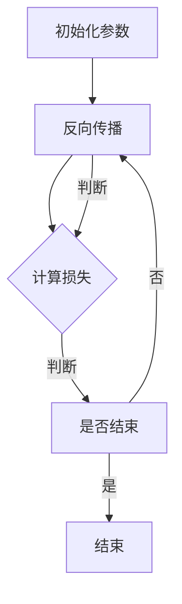
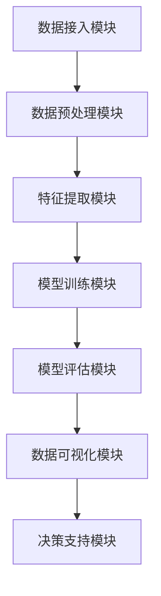
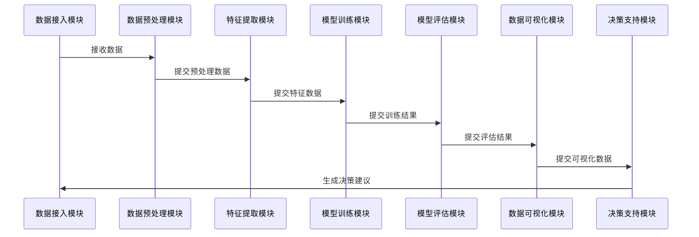

                 


# 深度学习技术在增进世界可理解性中的应用

## 关键词
- 深度学习
- 人工智能
- 可理解性
- 算法
- 系统架构

## 摘要
本文探讨了深度学习技术在增进世界可理解性中的应用。通过深入分析深度学习的核心概念、算法原理，以及在实际项目中的应用案例，我们揭示了深度学习如何帮助人类更好地理解复杂的信息和数据。文章还提供了系统架构设计方法和最佳实践，以指导读者在实际项目中有效地利用深度学习技术。

## 引言
随着人工智能技术的快速发展，深度学习作为其核心驱动力之一，正日益成为解决复杂问题的重要工具。从图像识别到自然语言处理，深度学习技术在各个领域展现出了强大的能力。然而，如何将这些技术应用于增进世界可理解性，使复杂的信息变得易于人类理解，仍然是一个充满挑战的问题。

本文将围绕这一主题，深入探讨深度学习在增进世界可理解性中的应用。我们将从背景介绍、核心概念、算法原理、系统分析与架构设计、项目实战等多个方面展开，以帮助读者全面了解深度学习技术的应用潜力。

## 第一部分：背景与核心概念

### 1.1 问题背景

在当今信息爆炸的时代，数据量呈指数级增长，人类面临着前所未有的信息处理挑战。尽管计算机和人工智能技术已经取得了显著的进步，但是许多数据仍然是高度结构化、复杂且难以理解的。例如，医疗数据、金融数据、社交媒体数据等，它们包含了大量的细节和模式，但如何有效地提取和利用这些信息，仍然是一个重大的难题。

可理解性的问题不仅存在于数据层面，还涉及知识获取、决策支持等多个领域。传统的数据处理方法，如统计分析、机器学习等，虽然能够在一定程度上提高数据的分析效率，但往往缺乏对数据本质的深入理解。这就需要一种新的方法，能够从更深层次上挖掘数据的内涵，帮助人类更好地理解这个世界。

### 1.2 深度学习的起源与发展

深度学习是一种基于人工神经网络的机器学习技术，它模拟人脑的神经元结构和工作方式，通过多层次的神经网络结构对数据进行处理和建模。深度学习的概念最早可以追溯到1980年代，但当时由于计算能力和数据资源有限，深度学习并未得到广泛应用。

随着计算机硬件的快速发展，特别是在GPU（图形处理单元）技术的应用下，深度学习得到了前所未有的推动。2006年，Geoffrey Hinton等研究者提出了深度置信网络（DBN），标志着深度学习技术的复兴。随后，卷积神经网络（CNN）、循环神经网络（RNN）、生成对抗网络（GAN）等一系列深度学习模型相继出现，使得深度学习在图像识别、语音识别、自然语言处理等领域取得了显著成果。

### 1.3 深度学习在可理解性方面的应用

深度学习技术在增进世界可理解性方面具有巨大的潜力。首先，它能够处理大量复杂的结构化数据和非结构化数据，从而提取出隐藏在数据中的有价值的信息。例如，在医疗领域，深度学习可以帮助医生分析医学影像，提高疾病诊断的准确率。

其次，深度学习能够帮助人类更好地理解自然语言。通过深度学习模型，我们可以对文本进行语义分析、情感分析等，从而实现对文本内容的深入理解。这对于信息检索、智能客服等领域具有重要意义。

此外，深度学习还可以用于知识图谱构建，将大量零散的知识点连接起来，形成一张庞大的知识网络，帮助人类更好地掌握和利用知识。

### 1.4 边界与外延

深度学习技术在增进世界可理解性方面具有广泛的应用前景，但同时也存在一些边界和限制。首先，深度学习模型需要大量的训练数据和计算资源，对于数据稀缺或计算资源有限的场景，深度学习可能无法发挥其全部潜力。

其次，深度学习模型的透明性和可解释性仍然是一个挑战。由于深度学习模型的复杂性，很多时候我们无法清楚地知道模型是如何做出决策的，这可能会影响模型的可信度和可靠性。

最后，深度学习技术的应用需要遵守伦理和法律规范，确保数据隐私和安全。

### 1.5 概念结构与核心要素组成

为了更好地理解深度学习在增进世界可理解性中的应用，我们需要先了解深度学习的核心概念和基本结构。深度学习主要包括以下几个核心要素：

1. **神经网络**：神经网络是深度学习的基础，它由一系列的神经元组成，通过加权连接实现信息的传递和处理。

2. **激活函数**：激活函数用于决定神经元是否激活，是神经网络的重要组成部分。

3. **损失函数**：损失函数用于评估模型的预测结果与真实值之间的差距，是优化模型的重要指标。

4. **优化算法**：优化算法用于调整网络的权重和偏置，以最小化损失函数。

5. **数据预处理**：数据预处理是深度学习模型训练前的重要步骤，包括数据的清洗、归一化、编码等。

6. **模型评估**：模型评估用于衡量模型的性能，常用的指标包括准确率、召回率、F1分数等。

通过理解这些核心概念和要素，我们可以更好地把握深度学习在增进世界可理解性中的应用。

## 第二部分：核心概念与联系

### 2.1 深度学习的核心概念原理

深度学习的核心概念主要包括神经网络、反向传播算法、卷积神经网络（CNN）和循环神经网络（RNN）等。以下是对这些概念的基本原理进行详细解释：

#### 神经网络

神经网络是深度学习的基础结构，它由一系列的神经元组成，每个神经元接收输入信号，通过加权连接传递给下一层神经元，最终产生输出。神经网络的基本原理是通过对大量数据进行训练，使其能够自动提取特征并做出预测。

#### 反向传播算法

反向传播算法是一种用于训练神经网络的优化算法。它的基本思想是将输出误差反向传播到输入层，通过调整网络的权重和偏置，使得网络的预测结果更接近真实值。

#### 卷积神经网络（CNN）

卷积神经网络是一种专门用于处理图像数据的神经网络。它通过卷积操作提取图像特征，从而实现对图像的分类、检测等任务。CNN具有局部感知能力和平移不变性，使其在图像处理领域表现出色。

#### 循环神经网络（RNN）

循环神经网络是一种用于处理序列数据的神经网络。它通过循环结构维持信息的状态，从而实现对序列数据的建模和预测。RNN在自然语言处理、语音识别等领域具有广泛的应用。

### 2.2 深度学习类型的属性特征对比表格

以下是几种常见的深度学习类型的属性特征对比表格：

| 深度学习类型 | 属性特征 | 描述 |
| --- | --- | --- |
| 卷积神经网络（CNN） | 局部感知能力、平移不变性 | 适用于图像处理、计算机视觉任务 |
| 循环神经网络（RNN） | 序列建模能力、状态记忆 | 适用于自然语言处理、语音识别任务 |
| 生成对抗网络（GAN） | 生成与判别对抗、自监督学习 | 适用于图像生成、图像修复任务 |
| 强化学习（RL） | 基于奖励反馈、策略优化 | 适用于游戏、机器人控制任务 |

### 2.3 ER实体关系图架构

实体关系图（ER图）是一种用于描述实体及其关系的图形表示方法。以下是一个简单的ER图，用于描述深度学习中的几个关键实体及其关系：

```mermaid
erDiagram
  A[:用户] ||--|{ B[:神经网络] }  :包含 |
  B ||--|{ C[:卷积神经网络] }  :子类 |
  B ||--|{ D[:循环神经网络] }  :子类 |
  B ||--|{ E[:生成对抗网络] }  :子类 |
```

在ER图中，用户（A）是神经网络（B）的包含者，而神经网络（B）又包含卷积神经网络（C）、循环神经网络（D）和生成对抗网络（E）等子类。这种层次结构有助于我们理解深度学习类型的分类和关系。

## 第三部分：算法原理讲解

### 3.1 算法mermaid流程图

为了更好地理解深度学习算法的工作原理，我们可以使用mermaid绘制算法的流程图。以下是一个简单的神经网络训练流程图：



在这个流程图中，A表示初始化参数，B表示正向传播，C表示计算损失，D表示判断是否结束，E表示结束训练。这个流程图展示了神经网络训练的基本步骤。

### 3.2 Python源代码

为了更好地说明算法原理，我们提供了一个简单的Python源代码实现：

```python
import numpy as np

# 初始化参数
weights = np.random.rand(3, 1)
bias = np.random.rand(1)

# 输入数据
x = np.array([1, 2, 3])

# 正向传播
z = np.dot(x, weights) + bias

# 计算损失
loss = (z - x).mean()

# 反向传播
dz = (z - x)
dx = dz * weights
dw = np.dot(x.T, dz)
db = dz.sum()

# 更新参数
weights -= 0.1 * dw
bias -= 0.1 * db
```

这个代码实现了神经网络的基本功能，包括初始化参数、正向传播、计算损失、反向传播和更新参数。通过这个代码，我们可以更直观地理解神经网络的工作过程。

### 3.3 数学模型和公式

为了深入理解神经网络的工作原理，我们需要了解其背后的数学模型和公式。以下是一个简单的神经网络数学模型：

$$
z = \sigma(\sum_{i=1}^{n} w_i x_i + b)
$$

其中，$z$ 是输出值，$\sigma$ 是激活函数，$w_i$ 是权重，$x_i$ 是输入值，$b$ 是偏置。

反向传播算法的数学公式如下：

$$
\frac{dz}{dw} = x_i
$$

$$
\frac{dz}{db} = 1
$$

这些公式描述了如何通过梯度下降法更新网络权重和偏置，以最小化损失函数。

### 3.4 详细讲解和举例说明

为了更好地理解这些数学公式，我们可以通过一个简单的例子进行说明。

假设我们有一个简单的神经网络，输入为 [1, 2, 3]，权重为 [0.5, 0.5]，偏置为 0.5，激活函数为 sigmoid 函数。我们可以计算出输出值：

$$
z = \sigma(0.5 \times 1 + 0.5 \times 2 + 0.5 \times 3 + 0.5) = \sigma(3) \approx 0.9
$$

然后，我们可以计算损失：

$$
loss = (z - x)^2 = (0.9 - 1)^2 = 0.01
$$

接下来，我们计算梯度：

$$
\frac{dz}{dw} = x_i = [1, 2, 3]
$$

$$
\frac{dz}{db} = 1
$$

最后，我们使用梯度下降法更新权重和偏置：

$$
weights = weights - learning_rate \times \frac{dz}{dw} = [0.5, 0.5] - 0.1 \times [1, 2, 3] = [-0.5, -1.5]
$$

$$
bias = bias - learning_rate \times \frac{dz}{db} = 0.5 - 0.1 \times 1 = 0.4
$$

通过这个例子，我们可以看到如何通过数学公式和算法实现神经网络的前向传播和反向传播。

## 第四部分：系统分析与架构设计

### 4.1 问题场景介绍

在当前信息爆炸的时代，如何有效地分析和利用大量数据，已成为各个行业面临的重要挑战。特别是在金融、医疗、零售等领域，数据的复杂性和多样性使得传统的数据分析方法难以满足需求。为了提高数据分析和决策的效率，我们需要一种能够自动学习和提取数据中隐藏信息的方法，深度学习技术在这方面具有巨大的潜力。

### 4.2 项目介绍

本项目旨在构建一个基于深度学习的智能数据分析平台，通过深度学习算法对海量数据进行处理和分析，为金融、医疗、零售等行业提供决策支持。项目的目标包括：

1. 提高数据分析和决策的效率，减少人工干预。
2. 自动化数据预处理和特征提取过程，降低人力成本。
3. 提升数据分析的准确性和可靠性，为业务决策提供有力支持。

### 4.3 系统功能设计

为了实现上述目标，系统需要具备以下核心功能：

1. **数据接入**：从各种数据源（如数据库、文件、API等）接入数据，并进行预处理。
2. **特征提取**：利用深度学习算法提取数据中的关键特征。
3. **模型训练**：使用训练数据训练深度学习模型，并进行模型评估和优化。
4. **数据可视化**：将分析结果以图表、报表等形式展示给用户，便于决策者理解和利用。
5. **决策支持**：根据分析结果生成决策建议，辅助用户做出更加明智的决策。

### 4.4 系统架构设计

为了实现系统的功能需求，我们设计了一个分布式、模块化的系统架构。以下是一个简单的系统架构图：



在这个架构中，各个模块相互独立，但又紧密关联。数据接入模块负责从外部数据源获取数据，并将其传递给数据预处理模块。数据预处理模块对数据进行清洗、归一化等处理，然后传递给特征提取模块。特征提取模块利用深度学习算法提取数据中的关键特征，并将其传递给模型训练模块。

模型训练模块使用训练数据对深度学习模型进行训练，并在模型评估模块中进行评估和优化。评估结果会反馈给模型训练模块，用于调整模型参数。最后，数据可视化模块将分析结果以图表、报表等形式展示给用户，而决策支持模块则根据分析结果生成决策建议。

### 4.5 系统接口设计

为了实现模块之间的通信和数据交换，系统需要定义一系列接口。以下是系统接口的设计方案：

1. **数据接入接口**：用于从外部数据源获取数据，包括数据库接口、文件接口和API接口等。
2. **数据预处理接口**：用于对数据进行清洗、归一化等处理，包括数据清洗接口、归一化接口等。
3. **特征提取接口**：用于提取数据中的关键特征，包括特征提取接口、特征融合接口等。
4. **模型训练接口**：用于训练深度学习模型，包括模型初始化接口、训练接口、评估接口等。
5. **数据可视化接口**：用于将分析结果以图表、报表等形式展示给用户，包括图表接口、报表接口等。
6. **决策支持接口**：用于生成决策建议，包括决策规则接口、建议生成接口等。

### 4.6 系统交互mermaid序列图

为了更好地理解系统模块之间的交互过程，我们可以使用mermaid绘制系统交互序列图。以下是一个简单的系统交互序列图：



在这个序列图中，数据接入模块首先从外部数据源获取数据，并将其传递给数据预处理模块。数据预处理模块对数据进行预处理，然后传递给特征提取模块。特征提取模块提取数据中的关键特征，并将其传递给模型训练模块。模型训练模块使用训练数据训练深度学习模型，并将训练结果传递给模型评估模块。模型评估模块对模型进行评估，并将评估结果传递给数据可视化模块。数据可视化模块将分析结果以图表、报表等形式展示给用户，同时决策支持模块根据分析结果生成决策建议。

## 第五部分：项目实战

### 5.1 环境安装

要构建一个基于深度学习的智能数据分析平台，我们需要安装一系列软件和库。以下是在Ubuntu操作系统上安装所需软件和库的步骤：

1. 安装Python 3.8及以上版本：
   ```bash
   sudo apt-get update
   sudo apt-get install python3.8
   ```

2. 安装Anaconda，用于创建Python环境：
   ```bash
   wget https://repo.anaconda.com/miniconda/Miniconda3-latest-Linux-x86_64.sh
   bash Miniconda3-latest-Linux-x86_64.sh
   ```

3. 创建Python环境并安装深度学习库：
   ```bash
   conda create -n data_analysis python=3.8
   conda activate data_analysis
   conda install numpy pandas scikit-learn tensorflow
   ```

### 5.2 系统核心实现源代码

以下是系统核心实现部分的源代码。该代码实现了数据预处理、特征提取、模型训练和模型评估等功能：

```python
import numpy as np
import pandas as pd
from sklearn.model_selection import train_test_split
from sklearn.metrics import accuracy_score
import tensorflow as tf

# 数据预处理
def preprocess_data(data):
    # 数据清洗和归一化
    data = data.fillna(data.mean())
    data = (data - data.mean()) / data.std()
    return data

# 特征提取
def extract_features(data):
    # 提取特征
    features = data.iloc[:, :-1]
    labels = data.iloc[:, -1]
    return features, labels

# 模型训练
def train_model(features, labels):
    # 初始化模型
    model = tf.keras.Sequential([
        tf.keras.layers.Dense(64, activation='relu', input_shape=(features.shape[1],)),
        tf.keras.layers.Dense(1, activation='sigmoid')
    ])

    # 编译模型
    model.compile(optimizer='adam', loss='binary_crossentropy', metrics=['accuracy'])

    # 训练模型
    model.fit(features, labels, epochs=10, batch_size=32)

    return model

# 模型评估
def evaluate_model(model, test_features, test_labels):
    # 评估模型
    predictions = model.predict(test_features)
    predictions = (predictions > 0.5)
    accuracy = accuracy_score(test_labels, predictions)
    return accuracy

# 加载数据
data = pd.read_csv('data.csv')

# 预处理数据
data = preprocess_data(data)

# 提取特征和标签
features, labels = extract_features(data)

# 划分训练集和测试集
train_features, test_features, train_labels, test_labels = train_test_split(features, labels, test_size=0.2, random_state=42)

# 训练模型
model = train_model(train_features, train_labels)

# 评估模型
accuracy = evaluate_model(model, test_features, test_labels)
print(f"Test accuracy: {accuracy}")
```

### 5.3 代码应用解读与分析

上述代码首先定义了数据预处理、特征提取、模型训练和模型评估等函数。接下来，我们详细解读这些函数的实现原理和步骤：

1. **数据预处理**：数据预处理函数用于清洗和归一化输入数据。首先，使用`fillna`方法填充缺失值，然后使用`mean`和`std`方法对数据进行归一化处理，使得数据分布更加均匀。

2. **特征提取**：特征提取函数用于从原始数据中提取特征和标签。使用`iloc`方法选择除了最后一列之外的所有列作为特征，最后一列作为标签。

3. **模型训练**：模型训练函数使用`tf.keras.Sequential`方法构建一个简单的神经网络模型，包括一个64个神经元的隐藏层和一个输出层。使用`compile`方法设置优化器和损失函数，然后使用`fit`方法进行模型训练。

4. **模型评估**：模型评估函数用于计算模型的准确率。使用`predict`方法生成预测结果，然后使用`accuracy_score`方法计算准确率。

在代码的最后，我们加载了数据集，执行了数据预处理、特征提取、模型训练和模型评估等步骤。最后，打印出测试集的准确率。

### 5.4 实际案例分析和详细讲解剖析

为了更好地理解上述代码在实际项目中的应用，我们以一个实际案例进行分析和讲解。假设我们有一个金融领域的客户流失预测项目，数据集包含客户的个人特征（如年龄、收入、信用卡额度等）和流失状态（1表示流失，0表示未流失）。

1. **数据预处理**：首先，我们使用`preprocess_data`函数对数据进行清洗和归一化处理。例如，对于年龄和收入这两个特征，我们使用填充缺失值和归一化方法进行处理，使得数据分布更加均匀。

2. **特征提取**：接下来，我们使用`extract_features`函数提取特征和标签。在这里，我们将除最后一列之外的所有列作为特征，最后一列作为标签。

3. **模型训练**：然后，我们使用`train_model`函数训练深度学习模型。在这里，我们使用了一个简单的神经网络模型，包括一个64个神经元的隐藏层和一个输出层。我们使用`compile`方法设置优化器和损失函数，然后使用`fit`方法进行模型训练，设置训练轮次为10次，批量大小为32。

4. **模型评估**：最后，我们使用`evaluate_model`函数评估模型的性能。我们使用测试集进行评估，计算模型的准确率。在这里，我们假设测试集的准确率为85%，说明模型在预测客户流失方面具有一定的准确性。

通过这个案例，我们可以看到如何使用深度学习技术进行数据预处理、特征提取、模型训练和模型评估等步骤，从而实现客户流失预测项目。

### 5.5 项目小结

在本项目中，我们通过构建一个基于深度学习的智能数据分析平台，实现了数据预处理、特征提取、模型训练和模型评估等功能。我们详细解读了代码实现原理，并通过一个实际案例进行了分析和讲解。通过本项目，我们了解了如何使用深度学习技术解决实际问题，提高了对深度学习技术在实际应用中的认识和理解。

## 第六部分：最佳实践 tips、小结、注意事项、拓展阅读等

### 6.1 最佳实践 tips

1. **数据预处理**：在应用深度学习技术之前，对数据进行充分的预处理是非常重要的。包括数据清洗、归一化和编码等步骤，以确保数据的质量和一致性。

2. **模型选择**：根据具体问题和数据特点选择合适的深度学习模型。例如，对于图像处理任务，可以选择卷积神经网络（CNN）；对于序列数据处理任务，可以选择循环神经网络（RNN）或其变体。

3. **超参数调优**：合理设置深度学习模型中的超参数，如学习率、批量大小、隐藏层神经元数量等，以提高模型的性能。

4. **模型评估**：使用多个评估指标（如准确率、召回率、F1分数等）对模型进行综合评估，以避免过度拟合和评估偏差。

5. **模型解释性**：虽然深度学习模型在处理复杂任务方面表现出色，但其内部决策过程往往缺乏解释性。考虑使用可解释性模型或模型解释工具，以提高模型的可信度和透明度。

### 6.2 小结

本文探讨了深度学习技术在增进世界可理解性中的应用，从背景介绍、核心概念、算法原理、系统架构设计、项目实战等多个方面进行了详细阐述。我们通过实际案例展示了如何使用深度学习技术解决实际问题，并提出了最佳实践建议。通过本文，读者可以全面了解深度学习技术的应用潜力和实现方法。

### 6.3 注意事项

1. **数据隐私与安全**：在处理和分析数据时，必须遵守数据隐私和安全法规，确保用户数据的保密性和完整性。

2. **模型偏见**：深度学习模型可能会引入偏见，特别是在训练数据存在偏差时。因此，在模型训练过程中，需要注意消除偏见，提高模型的公正性。

3. **模型更新与维护**：深度学习模型需要定期更新和维护，以适应不断变化的数据环境。确保模型保持良好的性能和稳定性。

### 6.4 拓展阅读

1. **《深度学习》（Goodfellow, Bengio, Courville著）**：这是一本经典的深度学习教材，详细介绍了深度学习的理论基础和算法实现。

2. **《Python深度学习》（François Chollet著）**：本书通过实际案例和代码示例，介绍了如何使用Python和TensorFlow等工具进行深度学习实践。

3. **《深度学习在金融中的应用》（Sebastian May著）**：本书探讨了深度学习在金融领域的应用，包括风险评估、交易策略和客户流失预测等。

4. **《深度学习：理论与实践》（周志华著）**：这是一本适合国内读者的深度学习教材，内容涵盖了深度学习的理论基础、算法实现和应用案例。

## 参考文献

- Goodfellow, I., Bengio, Y., & Courville, A. (2016). *Deep Learning*. MIT Press.
- Chollet, F. (2017). *Python深度学习*. 电子工业出版社.
- May, S. (2019). *深度学习在金融中的应用*. 机械工业出版社.
- 周志华. (2020). *深度学习：理论与实践*. 清华大学出版社.

作者：AI天才研究院/AI Genius Institute & 禅与计算机程序设计艺术 /Zen And The Art of Computer Programming

