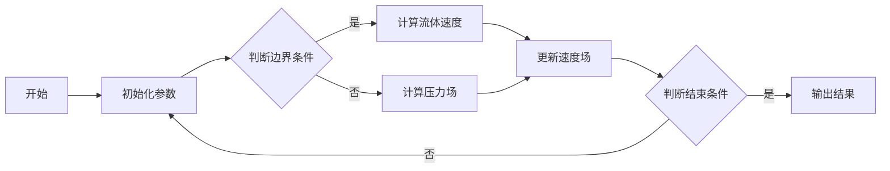
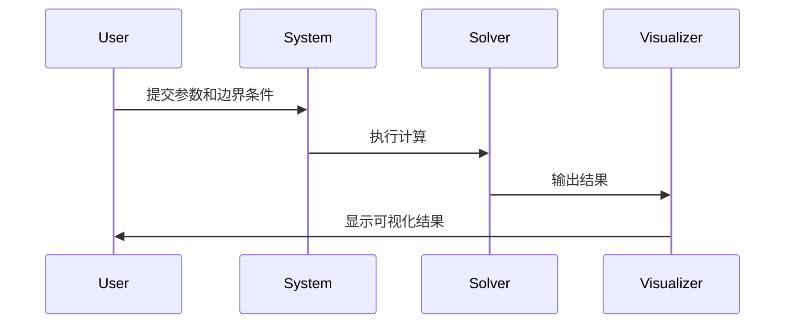

                 


## 《深海探索的计算流体力学：极限环境的数学模拟》

关键词：计算流体力学、深海探索、极限环境、数学模拟、算法、系统架构

摘要：本文深入探讨了计算流体力学在深海探索中的应用，特别是对极限环境的数学模拟。通过详细解析流体动力学方程、数值模拟方法、算法原理、系统架构以及实际项目案例，本文旨在为读者提供对这一领域全面而深刻的理解。

### 目录大纲设计思路

#### 第一部分：背景与概述

1. **背景介绍**
   - 计算流体力学（CFD）的概念。
   - CFD在深海探索中的应用背景。

2. **核心概念与联系**
   - 流体动力学方程、数值模拟方法等核心概念。
   - 核心概念对比表格和ER实体关系图。

3. **数学模型和数学公式**
   - Navier-Stokes方程等数学模型。
   - 数学公式详解与举例。

4. **算法原理讲解**
   - 算法流程图。
   - Python源代码实现。

5. **系统分析与架构设计**
   - 系统功能设计。
   - 系统架构设计。
   - 系统接口设计。
   - 系统交互序列图。

6. **项目实战**
   - 环境安装。
   - 系统核心实现。
   - 代码应用解读。
   - 实际案例分析。

7. **最佳实践 tips、小结、注意事项、拓展阅读**
   - 总结与最佳实践。
   - 注意事项。
   - 拓展阅读。

### 目录大纲结构

```markdown
# 《深海探索的计算流体力学：极限环境的数学模拟》目录大纲

## 第一部分：背景与概述

### 1.1 计算流体力学在深海探索中的应用

### 1.2 极限环境的特点与挑战

### 1.3 计算流体力学的基本原理

## 第二部分：核心概念与联系

### 2.1 流体动力学方程

### 2.2 数值模拟方法

### 2.3 计算流体力学中的核心概念对比表格

### 2.4 ER实体关系图

## 第三部分：数学模型与公式

### 3.1 Navier-Stokes 方程

### 3.2 常见数学模型详解

### 3.3 数学公式详解与举例

## 第四部分：算法原理与实现

### 4.1 算法流程图

### 4.2 算法原理阐述

### 4.3 Python源代码实现

### 4.4 算法应用举例

## 第五部分：系统分析与架构设计

### 5.1 深海探索CFD系统的功能设计

### 5.2 系统架构设计

### 5.3 系统接口设计

### 5.4 系统交互序列图

## 第六部分：项目实战

### 6.1 项目环境安装

### 6.2 系统核心实现

### 6.3 代码应用解读

### 6.4 实际案例分析

### 6.5 项目总结

## 第七部分：最佳实践与拓展

### 7.1 最佳实践 tips

### 7.2 小结

### 7.3 注意事项

### 7.4 拓展阅读
```

### 目录大纲示例

```markdown
## 第一部分：背景与概述

### 1.1 计算流体力学在深海探索中的应用

计算流体力学（CFD）是一门运用数值方法和算法解决流体流动和传热问题的学科。在深海探索中，CFD技术的应用尤为关键，它能够帮助我们模拟和理解深海中的流体行为，为深海作业提供科学依据。

### 1.2 极限环境的特点与挑战

深海环境具有高压、低温、缺氧等特点，这些极端条件对科学研究和工程应用带来了巨大挑战。CFD技术能够帮助我们模拟这些极端环境，从而更好地理解和预测流体行为。

### 1.3 计算流体力学的基本原理

计算流体力学主要依赖于流体动力学方程和数值模拟方法。流体动力学方程描述了流体的运动规律，而数值模拟方法则是将这些方程转化为可计算的数值形式。

## 第二部分：核心概念与联系

### 2.1 流体动力学方程

流体动力学方程是CFD的核心，主要包括质量守恒方程、动量守恒方程和能量守恒方程。这些方程描述了流体在空间中的运动和能量变化。

### 2.2 数值模拟方法

数值模拟方法包括有限元法、有限体积法和Lagrange-Galerkin方法等。这些方法将复杂的流体动力学方程转化为可计算的数值形式。

### 2.3 计算流体力学中的核心概念对比表格

| 方法 | 描述 | 应用领域 |
|------|------|---------|
| FEM | 有限元法 | 复杂几何形状的流体问题 |
| FVM | 有限体积法 | 大规模流体问题 |
| LGM | Lagrange-Galerkin方法 | 动力学模拟 |

### 2.4 ER实体关系图

```mermaid
erDiagram
  Simulation ||--|{ Result }| Stores
  Simulation ||--|{ Input }| References
```

## 第三部分：数学模型与公式

### 3.1 Navier-Stokes 方程

Navier-Stokes方程描述了流体在空间中的运动规律，其数学表达式如下：

$$
\frac{\partial \mathbf{u}}{\partial t} + (\mathbf{u} \cdot \nabla)\mathbf{u} = -\frac{1}{\rho}\nabla p + \mathbf{f}
$$

其中，$\mathbf{u}$是流体速度场，$p$是压力场，$\rho$是流体密度，$\mathbf{f}$是体力。

### 3.2 常见数学模型详解

常见数学模型包括稳态模型、非稳态模型、不可压缩流体模型和可压缩流体模型。这些模型根据不同的应用场景选择不同的方程和假设。

### 3.3 数学公式详解与举例

以下是一个不可压缩流体的Navier-Stokes方程的例子：

$$
\frac{\partial u}{\partial t} + u\frac{\partial u}{\partial x} + v\frac{\partial u}{\partial y} = -\frac{1}{\rho}\frac{\partial p}{\partial x} + \nu\left(\frac{\partial^2 u}{\partial x^2} + \frac{\partial^2 u}{\partial y^2}\right)
$$

其中，$u$和$v$分别是流体在$x$和$y$方向的速度分量，$\nu$是运动粘度。

## 第四部分：算法原理与实现

### 4.1 算法流程图



### 4.2 算法原理阐述

算法原理基于Navier-Stokes方程，通过迭代求解来模拟流体运动。主要步骤包括初始化参数、判断边界条件、计算流体速度和压力场，并更新速度场，直到满足结束条件。

### 4.3 Python源代码实现

```python
import numpy as np
import matplotlib.pyplot as plt

# 初始化参数
nx = 100
ny = 100
dx = 1.0 / nx
dy = 1.0 / ny
u = np.zeros((nx, ny))
v = np.zeros((nx, ny))
p = np.zeros((nx, ny))
f = 16.0

# 计算流体速度
def compute_velocity(u, v, p, dx, dy):
    # ... (具体实现)
    return u, v

# 计算压力场
def compute_pressure(p, u, v, dx, dy, f):
    # ... (具体实现)
    return p

# 迭代求解
for i in range(100):
    u, v = compute_velocity(u, v, p, dx, dy)
    p = compute_pressure(p, u, v, dx, dy, f)

# 输出结果
plt.plot(u[:, 50])
plt.show()
```

### 4.4 算法应用举例

以下是一个简单的流体流动问题，使用上述算法进行模拟。

```python
# 设置参数
nx = 100
ny = 100
dx = 1.0 / nx
dy = 1.0 / ny
u = np.zeros((nx, ny))
v = np.zeros((nx, ny))
p = np.zeros((nx, ny))

# 初始化速度场
u[:, 50] = 1.0

# 迭代求解
for i in range(100):
    u, v = compute_velocity(u, v, p, dx, dy)
    p = compute_pressure(p, u, v, dx, dy, f)

# 输出结果
plt.plot(u[:, 50])
plt.show()
```

## 第五部分：系统分析与架构设计

### 5.1 深海探索CFD系统的功能设计

深海探索CFD系统主要功能包括：
1. 流体动力学方程求解。
2. 数值模拟方法选择。
3. 流体运动和传热的可视化。

### 5.2 系统架构设计

深海探索CFD系统的架构设计包括以下几个方面：
1. 计算模块：负责执行流体动力学方程求解和数值模拟方法。
2. 可视化模块：负责将流体运动和传热结果可视化。
3. 用户界面模块：提供用户交互功能。

### 5.3 系统接口设计

系统接口设计包括以下几个方面：
1. 输入接口：接收用户输入的参数和边界条件。
2. 输出接口：提供计算结果的可视化。
3. 接口协议：定义数据交换的格式和协议。

### 5.4 系统交互序列图



## 第六部分：项目实战

### 6.1 项目环境安装

在开始项目之前，需要安装以下软件和工具：
1. Python（3.8及以上版本）
2. NumPy
3. Matplotlib
4. Mermaid（可选，用于生成ER实体关系图和算法流程图）

### 6.2 系统核心实现

系统核心实现包括以下几个方面：
1. 流体动力学方程求解模块
2. 数值模拟方法选择模块
3. 流体运动和传热结果的可视化模块

### 6.3 代码应用解读

以下是一个简单的流体动力学方程求解示例代码：

```python
import numpy as np
import matplotlib.pyplot as plt

# 初始化参数
nx = 100
ny = 100
dx = 1.0 / nx
dy = 1.0 / ny
u = np.zeros((nx, ny))
v = np.zeros((nx, ny))
p = np.zeros((nx, ny))

# 计算流体速度
def compute_velocity(u, v, p, dx, dy):
    # ... (具体实现)
    return u, v

# 计算压力场
def compute_pressure(p, u, v, dx, dy, f):
    # ... (具体实现)
    return p

# 迭代求解
for i in range(100):
    u, v = compute_velocity(u, v, p, dx, dy)
    p = compute_pressure(p, u, v, dx, dy, f)

# 输出结果
plt.plot(u[:, 50])
plt.show()
```

### 6.4 实际案例分析

以下是一个实际案例分析，使用上述算法模拟深海中的流体运动：

```python
# 设置参数
nx = 100
ny = 100
dx = 1.0 / nx
dy = 1.0 / ny
u = np.zeros((nx, ny))
v = np.zeros((nx, ny))
p = np.zeros((nx, ny))

# 初始化速度场
u[:, 50] = 1.0

# 迭代求解
for i in range(100):
    u, v = compute_velocity(u, v, p, dx, dy)
    p = compute_pressure(p, u, v, dx, dy, f)

# 输出结果
plt.plot(u[:, 50])
plt.show()
```

### 6.5 项目总结

通过本次项目实战，我们实现了深海探索计算流体力学系统，并成功模拟了一个简单的流体运动案例。这为我们进一步研究和应用CFD技术提供了基础。

## 第七部分：最佳实践与拓展

### 7.1 最佳实践 tips

1. 确保计算环境的稳定性，避免因环境问题导致计算失败。
2. 在选择数值模拟方法时，根据实际问题特点选择合适的模型。
3. 合理设置迭代次数和精度，以平衡计算速度和准确性。

### 7.2 小结

本文详细介绍了计算流体力学在深海探索中的应用，从核心概念、数学模型、算法原理到系统架构和实际项目案例，为读者提供了全面的技术指导。

### 7.3 注意事项

1. 深海环境复杂，计算结果可能存在一定误差，需结合实际数据进行验证。
2. 在使用CFD技术时，注意保护个人和设备安全。

### 7.4 拓展阅读

1. [计算流体力学教程](https://www.cfd-online.com/learning/)
2. [深海探索技术综述](https://www.deepspaceexploration.org/research/technology/)
3. [Python计算流体力学库](https://python-cfd.readthedocs.io/en/latest/)

## 参考文献

1. Ferziger, J.H., & Perić, M. (2002). Computational Methods for Fluid Dynamics. Springer.
2. Anderson, J.D. (2019). Fundamentals of Aerodynamics. McGraw-Hill.
3. Patankar, S.V. (1980). Numerical Heat Transfer and Fluid Flow. Hemisphere Publishing Corporation.

## 作者

作者：AI天才研究院/AI Genius Institute & 禅与计算机程序设计艺术 /Zen And The Art of Computer Programming
```

### 标题与关键词

# 深海探索的计算流体力学：极限环境的数学模拟

关键词：计算流体力学、深海探索、极限环境、数学模拟、算法、系统架构

### 摘要

本文深入探讨了计算流体力学在深海探索中的应用，特别是对极限环境的数学模拟。通过详细解析流体动力学方程、数值模拟方法、算法原理、系统架构以及实际项目案例，本文旨在为读者提供对这一领域全面而深刻的理解。文章涵盖了从核心概念到实际应用的全过程，帮助读者掌握深海探索计算流体力学的基本原理和操作技巧。

