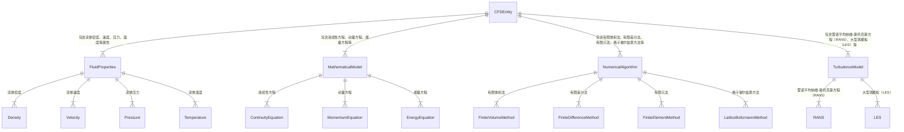

                 

## 深海探索的计算流体力学：极限环境的数学模拟

### 关键词：
- 计算流体力学
- 极限环境模拟
- 数学建模
- 深海流体动力学
- 湍流模拟

### 摘要：
本文深入探讨了计算流体力学（CFD）在深海探索中的应用，特别是对极限环境的数学模拟。文章首先介绍了CFD的基本概念和流体力学基础，然后详细描述了深海环境的特性以及对应的流体动力学模型。接着，文章讲解了用于模拟极限环境的多种数学方法，包括数值方法、蒙特卡洛方法、粒子方法和机器学习方法。通过模拟结果的分析，本文展示了CFD在深海探测、采矿、油气开发和海洋工程等领域的应用。最后，文章展望了CFD技术的发展趋势及其在未来的前景。通过这一步步的分析，读者可以系统地理解CFD在极限环境模拟中的关键作用及其应用前景。

### 目录大纲

#### 第一部分：问题背景与介绍

1. **引言**
   - **问题背景**
   - **问题描述**
   - **问题解决**
   - **边界与外延**
   - **核心要素组成**

2. **核心概念与联系**
   - **计算流体力学概述**
   - **核心概念原理**
   - **概念属性特征对比**
   - **ER实体关系图架构**

#### 第二部分：计算流体力学基础

3. **流体力学基础**
   - **流体基本性质**
   - **连续性方程**
   - **动量方程**
   - **能量方程**

4. **计算流体力学算法**
   - **有限体积法**
   - **有限差分法**
   - **有限元法**
   - **格子玻尔兹曼方法**

#### 第三部分：深海环境模拟

5. **深海环境概述**
   - **深海环境特点**
   - **深海压力**
   - **深海温度**
   - **深海盐度**

6. **深海流体动力学模型**
   - **流体流动方程**
   - **湍流模拟**
   - **热传输**
   - **质量传输**

#### 第四部分：极限环境数学模拟

7. **数学模拟方法**
   - **数值方法**
   - **蒙特卡洛方法**
   - **粒子方法**
   - **机器学习方法**

8. **模拟结果分析**
   - **流场分析**
   - **温度场分析**
   - **压力场分析**
   - **颗粒传输分析**

#### 第五部分：应用案例与最佳实践

9. **应用案例**
   - **深海探测器**
   - **深海采矿**
   - **深海油气开发**
   - **海洋工程**

10. **最佳实践**
    - **数据处理技巧**
    - **模拟优化策略**
    - **安全性保障**

#### 第六部分：未来展望与趋势

11. **未来展望**
    - **技术发展趋势**
    - **行业应用前景**
    - **挑战与机遇**

12. **小结**
    - **内容回顾**
    - **关键点总结**
    - **拓展阅读**

### 第一部分：问题背景与介绍

#### 1.1 引言

随着科技的不断发展，深海探索逐渐成为各国科研机构和企业的关注焦点。深海不仅蕴藏着丰富的资源，如矿物、油气和生物资源，还是地球上最神秘的区域之一。然而，深海环境的极端条件，如高压、低温、高盐度和黑暗，给科学研究和技术应用带来了巨大的挑战。为了更好地理解和利用这些资源，计算流体力学（Computational Fluid Dynamics, CFD）作为一种重要的数值模拟方法，被广泛应用于深海环境的研究。

#### 1.2 问题背景

深海探索涉及到许多科学和技术问题，如深海探测器的运动控制、深海采矿工艺的优化、深海油气资源的开采以及海洋工程的设计与施工等。这些问题的解决依赖于对深海流体动力学的精确模拟和理解。流体动力学研究的是流体在流动过程中的运动规律，而深海环境具有复杂和极端的特性，这使得传统的实验方法难以满足需求。因此，计算流体力学作为一种高效的数值模拟工具，在深海探索中发挥了关键作用。

#### 1.3 问题描述

深海环境的极端条件包括：

- **压力**：深海压力随着深度的增加而增加，最大可达数百个大气压。这种高压环境对设备的结构和材料提出了极高的要求。
- **温度**：深海温度通常较低，且变化范围较大，从极寒的冰层到温暖的海洋底层。温度差异会影响流体的物理性质，如密度、粘度和热传导率。
- **盐度**：深海盐度较高，会影响流体的密度和粘度，进而影响流体动力学特性。
- **黑暗**：深海光线极弱，甚至完全黑暗，这限制了人类在深海的活动，需要依赖声波、电磁波等非视觉手段进行探测。

#### 1.4 问题解决

为了解决深海探索中的这些问题，科学家和工程师们利用计算流体力学进行数学模拟。CFD方法通过建立流体运动的数学模型，将复杂的物理现象转化为可计算的数学方程，然后使用数值方法进行求解。这种方法可以模拟深海中的流体流动、热传导和质量传输等过程，为深海设备的设计和优化提供科学依据。

#### 1.5 边界与外延

计算流体力学在深海探索中的应用不仅限于流体动力学模拟，还涉及到其他领域，如材料力学、热力学和电磁学等。这些领域的知识共同构成了对深海环境全面理解的基础。此外，CFD方法还可以与其他技术相结合，如大数据分析、机器学习和人工智能等，进一步提高模拟的准确性和效率。

#### 1.6 核心要素组成

计算流体力学在深海探索中的核心要素包括：

- **数学模型**：描述流体运动、热传导和质量传输的基本方程，如连续性方程、动量方程和能量方程。
- **数值方法**：用于求解数学模型的一系列数值算法，如有限体积法、有限差分法和有限元法。
- **计算机硬件**：高性能计算设备，用于高效进行大规模计算。
- **软件工具**：用于建立数学模型、求解数值方程和可视化结果的计算软件，如OpenFOAM、FLUENT和ANSYS等。
- **应用领域**：深海流体动力学、材料力学、热力学和电磁学等。

通过这些核心要素的有机结合，计算流体力学为深海探索提供了强有力的技术支持。

### 第二部分：核心概念与联系

#### 2.1 计算流体力学概述

计算流体力学（Computational Fluid Dynamics，CFD）是一门结合了流体力学、计算科学和数值分析的技术科学。它的主要目的是通过数值方法求解流体流动和传热的数学模型，从而对流体系统进行模拟和分析。CFD在许多工程领域都有广泛应用，包括航空航天、汽车制造、能源工程、生物医学工程和海洋工程等。

#### 2.2 核心概念原理

CFD的核心概念包括以下几个：

1. **流体基本性质**：流体是指能够流动的物质，具有质量、密度、粘度和压力等物理性质。流体的运动可以通过连续性方程、动量方程和能量方程来描述。

   - **连续性方程**：描述流体在流动过程中质量守恒的方程，数学表达式为：
     $$ \frac{\partial \rho}{\partial t} + \nabla \cdot (\rho \mathbf{v}) = 0 $$
     其中，$\rho$ 是流体密度，$\mathbf{v}$ 是流体速度。

   - **动量方程**：描述流体在流动过程中动量守恒的方程，数学表达式为：
     $$ \rho \left( \frac{\partial \mathbf{v}}{\partial t} + (\mathbf{v} \cdot \nabla) \mathbf{v} \right) = -\nabla p + \mu \nabla^2 \mathbf{v} $$
     其中，$p$ 是流体压力，$\mu$ 是流体动力粘度。

   - **能量方程**：描述流体在流动过程中能量守恒的方程，数学表达式为：
     $$ \rho c_p \frac{\partial T}{\partial t} + \nabla \cdot (\rho c_p \mathbf{v} T) = \Phi - k \nabla^2 T $$
     其中，$c_p$ 是流体比热容，$T$ 是流体温度，$\Phi$ 是热源项，$k$ 是流体热导率。

2. **CFD算法**：CFD算法是指用于求解上述流体动力学方程的数值方法。常见的CFD算法包括有限体积法、有限差分法、有限元法和格子玻尔兹曼方法等。

   - **有限体积法**：将流体区域划分为若干个体积单元，在每个单元内部求解流体方程，并通过单元之间的界面传递信息。
   - **有限差分法**：将流体区域离散为网格点，通过差分方程来近似连续方程，从而在网格点上求解流体参数。
   - **有限元法**：将流体区域划分为有限数量的元素，如三角形或四面体，并在每个元素上建立方程，通过全局组装和求解来获得整个流场的解。
   - **格子玻尔兹曼方法**：基于粒子物理学中的玻尔兹曼方程，通过离散化的格子结构来模拟流体流动。

3. **湍流模拟**：湍流是一种复杂的流体运动现象，其特点是流线曲折、速度分布不均匀和能量级联。湍流模拟是CFD中的一个重要课题，常用的湍流模型包括雷诺平均纳维-斯托克斯方程（RANS）和大型涡模拟（LES）。

   - **RANS模型**：通过雷诺时均化方法将湍流运动分解为平均流和脉动流，然后求解平均流运动方程。
   - **LES模型**：直接模拟湍流的瞬时运动，通过尺度的分解来捕捉不同尺度的涡流结构。

#### 2.3 概念属性特征对比

| 算法类型        | 特点                                                         | 应用场景                                           |
| ------------- | ------------------------------------------------------------ | -------------------------------------------------- |
| 有限体积法      | 计算量较小，适合复杂几何形状的模拟                           | 航空航天、汽车制造、流体机械                                     |
| 有限差分法      | 算法简单，适用于简单几何形状和简单流场的模拟                 | 化工过程、热传导问题                                           |
| 有限元法        | 可以处理复杂几何形状和非线性问题，适合大规模计算             | 桥梁结构、建筑结构分析、材料力学分析                             |
| 格子玻尔兹曼方法 | 基于粒子动力学，适合高速流场和复杂几何形状的模拟             | 高速流体、多相流、热传输问题                                     |
| 湍流模拟        | 雷诺平均纳维-斯托克斯方程（RANS）适用于简单流场，大型涡模拟（LES）适用于复杂流场 | 工业设计、航空航天、气象学、环境工程等                           |

#### 2.4 ER实体关系图架构

为了更好地理解CFD中的核心概念和联系，我们可以使用ER（实体-关系）图来描述不同概念之间的关系。以下是一个简化的ER图，展示了CFD中的一些关键实体及其关系：

通过这个ER图，我们可以清晰地看到CFD中各个核心概念之间的关系，从而更好地理解CFD的原理和应用。

### 第三部分：计算流体力学基础

#### 3.1 流体力学基础

流体力学是研究流体（液体和气体）在各种力作用下的运动规律和力学特性的学科。流体力学的基本理论主要包括连续性方程、动量方程和能量方程，这些方程描述了流体在流动过程中的质量守恒、动量传递和能量转换。

**流体基本性质**

流体具有以下基本性质：

- **质量**：流体具有质量，其质量密度是流体密度的一个重要参数。
- **密度**：流体密度是指单位体积内流体的质量，通常用符号$\rho$表示。
- **速度**：流体速度是指流体内部任意点的速度矢量，通常用符号$\mathbf{v}$表示。
- **压力**：压力是流体单位面积上的作用力，通常用符号$p$表示。
- **粘度**：粘度是流体抵抗变形的能力，描述流体内部摩擦特性，通常用符号$\mu$表示。
- **温度**：温度是流体热运动的度量，通常用符号$T$表示。

**连续性方程**

连续性方程描述了流体在流动过程中质量的守恒。其数学表达式为：

$$ \frac{\partial \rho}{\partial t} + \nabla \cdot (\rho \mathbf{v}) = 0 $$

其中，$\frac{\partial \rho}{\partial t}$表示密度随时间的变化率，$\nabla \cdot (\rho \mathbf{v})$表示密度和速度散度的乘积。这个方程表示在任一固定空间中，流体密度的减少率等于流出该空间的流体质量流量。

**动量方程**

动量方程描述了流体在流动过程中动量的变化。其数学表达式为：

$$ \rho \left( \frac{\partial \mathbf{v}}{\partial t} + (\mathbf{v} \cdot \nabla) \mathbf{v} \right) = -\nabla p + \mu \nabla^2 \mathbf{v} $$

其中，$\frac{\partial \mathbf{v}}{\partial t}$表示速度随时间的变化率，$(\mathbf{v} \cdot \nabla) \mathbf{v}$表示速度梯度的散度，$-\nabla p$表示压力梯度力，$\mu \nabla^2 \mathbf{v}$表示粘性力。这个方程表示在任一固定空间中，流体动量的变化率等于作用在流体上的外力减去粘性力。

**能量方程**

能量方程描述了流体在流动过程中能量的转换。其数学表达式为：

$$ \rho c_p \frac{\partial T}{\partial t} + \nabla \cdot (\rho c_p \mathbf{v} T) = \Phi - k \nabla^2 T $$

其中，$\frac{\partial T}{\partial t}$表示温度随时间的变化率，$\nabla \cdot (\rho c_p \mathbf{v} T)$表示热流密度，$\Phi$表示热源项，$k \nabla^2 T$表示热传导项。这个方程表示在任一固定空间中，流体内部能量的变化率等于热传导、热源和热流密度的变化率之和。

#### 3.2 计算流体力学算法

计算流体力学算法是用于求解流体力学方程的一系列数值方法。这些算法通过离散化和数值逼近，将连续的流体力学问题转化为可以在计算机上求解的离散问题。常见的CFD算法包括有限体积法、有限差分法、有限元法和格子玻尔兹曼方法。

**有限体积法**

有限体积法（Finite Volume Method，FVM）是一种广泛应用于CFD的数值方法。它将流体区域划分为多个体积单元，并在每个单元内部求解流体方程。FVM的核心思想是在每个单元的边界上传递物理量，从而保证整体守恒。FVM的主要步骤如下：

1. **网格划分**：将流体区域划分为多个均匀或非均匀的体积单元。
2. **离散化方程**：将连续的流体方程（如连续性方程、动量方程和能量方程）在网格节点上离散化。
3. **求解方程**：在每个体积单元内，通过代数方程组求解流体的物理量。
4. **迭代求解**：通过迭代方法（如高斯-赛德尔迭代或共轭梯度法）求解离散化方程，直到满足收敛条件。

**有限差分法**

有限差分法（Finite Difference Method，FDM）是一种基于差分方程的数值方法。它通过将连续的流体方程在网格节点上离散化，形成差分方程，然后求解差分方程以获得流体的数值解。FDM的主要步骤如下：

1. **网格划分**：将流体区域划分为多个均匀或非均匀的网格点。
2. **离散化方程**：将连续的流体方程（如连续性方程、动量方程和能量方程）在网格点附近进行泰勒级数展开，并忽略高阶项，形成差分方程。
3. **求解方程**：在网格点上形成代数方程组，并通过迭代方法求解差分方程。
4. **迭代求解**：通过迭代方法（如点松弛法或显式迭代法）求解离散化方程，直到满足收敛条件。

**有限元法**

有限元法（Finite Element Method，FEM）是一种基于变分原理的数值方法。它将流体区域划分为多个有限元元素，并在每个元素上建立局部方程，然后通过全局组装求解流体的全局方程。FEM的主要步骤如下：

1. **网格划分**：将流体区域划分为多个有限元元素（如三角形、四面体或矩形体）。
2. **形函数定义**：在每个有限元元素上定义形函数，用于近似元素内部的物理量。
3. **局部方程建立**：在每个有限元元素上，将连续的流体方程（如连续性方程、动量方程和能量方程）转化为局部方程。
4. **全局组装**：将局部方程组装成全局方程，形成代数方程组。
5. **求解方程**：通过迭代方法（如高斯-赛德尔迭代或共轭梯度法）求解全局方程。
6. **迭代求解**：通过迭代方法（如高斯-赛德尔迭代或共轭梯度法）求解全局方程，直到满足收敛条件。

**格子玻尔兹曼方法**

格子玻尔兹曼方法（Lattice Boltzmann Method，LBM）是一种基于粒子动力学的数值方法。它通过将流体划分为离散的粒子，并模拟粒子的运动和碰撞，来求解流体的流动和传热问题。LBM的主要步骤如下：

1. **网格划分**：将流体区域划分为离散的格子。
2. **分布函数定义**：定义粒子的分布函数，用于描述粒子的速度分布。
3. **碰撞和流扩散**：通过模拟粒子的碰撞和流扩散过程，更新分布函数。
4. **流场求解**：通过分布函数求解流体的速度、压力和温度等物理量。
5. **迭代求解**：通过迭代方法（如迭代求解流场方程或分布函数更新方程），直到满足收敛条件。

#### 3.3 不同算法的对比与适用性

| 算法类型        | 特点                                                         | 适用场景                                       |
| ------------- | ------------------------------------------------------------ | ---------------------------------------------- |
| 有限体积法      | 计算量较小，适合复杂几何形状的模拟                           | 航空航天、汽车制造、流体机械                                     |
| 有限差分法      | 算法简单，适用于简单几何形状和简单流场的模拟                 | 化工过程、热传导问题                                           |
| 有限元法        | 可以处理复杂几何形状和非线性问题，适合大规模计算             | 桥梁结构、建筑结构分析、材料力学分析                             |
| 格子玻尔兹曼方法 | 基于粒子动力学，适合高速流场和复杂几何形状的模拟             | 高速流体、多相流、热传输问题                                     |

通过上述对比，可以看出不同CFD算法具有各自的特点和适用场景，选择合适的算法取决于具体问题的需求和计算资源的限制。

### 第四部分：深海环境模拟

#### 4.1 深海环境概述

深海环境是指地球表面以下广阔的海洋区域，其深度通常超过200米。深海环境具有以下几个显著特点：

- **深海压力**：深海压力随着深度的增加而增大。在海洋深处，压力可以高达几千个大气压，这对设备和材料的耐压性能提出了极高的要求。
- **深海温度**：深海温度通常较低，且变化范围较大。从冰冷的极地冰层到温暖的海洋底层，温度差异对流体的物理性质和流动行为有重要影响。
- **深海盐度**：深海盐度较高，平均盐度约为3.5%，在某些地区甚至更高。盐度会影响流体的密度、粘度和热导率，从而影响流体的运动和传热过程。
- **深海黑暗**：深海光线极弱，甚至完全黑暗。这限制了人类在深海的活动，需要依赖声波、电磁波等非视觉手段进行探测。

#### 4.2 深海流体动力学模型

深海流体动力学模型描述了深海环境中流体的运动规律，包括流体流动、湍流模拟、热传输和质量传输等。这些模型基于流体力学的基本原理，通过数学方程和数值方法进行模拟。

**流体流动方程**

深海流体流动方程主要包括连续性方程、动量方程和湍流模型。以下是对这些方程的详细描述：

- **连续性方程**：
  $$ \frac{\partial \rho}{\partial t} + \nabla \cdot (\rho \mathbf{v}) = 0 $$
  这个方程表示在任一固定空间中，流体密度的减少率等于流出该空间的流体质量流量。

- **动量方程**：
  $$ \rho \left( \frac{\partial \mathbf{v}}{\partial t} + (\mathbf{v} \cdot \nabla) \mathbf{v} \right) = -\nabla p + \mu \nabla^2 \mathbf{v} $$
  这个方程表示在任一固定空间中，流体动量的变化率等于作用在流体上的外力减去粘性力。

- **湍流模型**：
  湍流模型用于描述流体中复杂的涡流结构和流动行为。常用的湍流模型包括雷诺平均纳维-斯托克斯方程（RANS）和大型涡模拟（LES）。

  - **雷诺平均纳维-斯托克斯方程（RANS）**：
    $$ \rho \left( \frac{\partial \bar{\mathbf{v}}}{\partial t} + \bar{\mathbf{v}} \cdot \nabla \bar{\mathbf{v}} \right) = -\nabla p + \mu \nabla^2 \bar{\mathbf{v}} + \rho \bar{\mathbf{v}} \cdot \nabla \bar{v}_{t} $$
    其中，$\bar{\mathbf{v}}$表示时均速度，$\bar{v}_{t}$表示湍流速度。

  - **大型涡模拟（LES）**：
    $$ \rho \left( \frac{\partial \mathbf{v}}{\partial t} + \mathbf{v} \cdot \nabla \mathbf{v} \right) = -\nabla p + \mu_{t} \nabla^2 \mathbf{v} $$
    其中，$\mathbf{v}$表示瞬时速度，$\mu_{t}$表示湍流粘度。

**热传输**

深海环境中的热传输主要通过流体对流和热传导实现。热传输方程如下：

$$ \rho c_p \frac{\partial T}{\partial t} + \nabla \cdot (\rho c_p \mathbf{v} T) = \Phi - k \nabla^2 T $$

其中，$c_p$表示比热容，$\Phi$表示热源项，$k$表示热导率。

**质量传输**

深海环境中的质量传输主要通过流体流动和扩散实现。质量传输方程如下：

$$ \frac{\partial \rho}{\partial t} + \nabla \cdot (\rho \mathbf{v}) = 0 $$

这个方程表示在任一固定空间中，流体密度的减少率等于流出该空间的流体质量流量。

#### 4.3 湍流模拟

湍流是流体中常见的流动现象，其特点是流线曲折、速度分布不均匀和能量级联。湍流模拟是深海流体动力学模型中的重要一环，它通过捕捉流体的瞬时运动和涡流结构，提高模拟的准确性和精度。

**雷诺平均纳维-斯托克斯方程（RANS）**

雷诺平均纳维-斯托克斯方程（RANS）是一种常用的湍流模拟方法。它通过雷诺时均化方法将湍流运动分解为平均流和脉动流，然后求解平均流运动方程。RANS模型的主要步骤如下：

1. **雷诺时均化**：将瞬时流体方程（如动量方程和能量方程）进行时均化处理，得到平均流方程。

2. **湍流模型**：通过湍流模型（如$k$-ε模型或$k$-ω模型）模拟湍流特性，补充时均化方程中的缺失项。

3. **求解方程**：求解平均流方程和湍流模型方程，获得流场的平均速度、压力和温度等物理量。

**大型涡模拟（LES）**

大型涡模拟（LES）是一种直接模拟湍流瞬时运动的方法。它通过尺度的分解来捕捉不同尺度的涡流结构，从而提高湍流模拟的精度。LES模型的主要步骤如下：

1. **尺度分解**：将湍流场分解为大型涡流（尺度较大）和中小型涡流（尺度较小）。

2. **涡流模拟**：通过直接模拟大型涡流和中小型涡流的运动，获得流场的瞬时速度和压力等物理量。

3. **数值方法**：采用合适的数值方法（如有限体积法或有限差分法）进行涡流模拟，提高模拟的稳定性和精度。

#### 4.4 深海流体动力学模型的构建与应用

深海流体动力学模型的构建涉及以下几个关键步骤：

1. **模型选择**：根据具体问题的需求和条件，选择合适的流体力学方程和湍流模型。

2. **参数设置**：根据实验数据和经验公式，设置流体参数（如密度、粘度、热导率等）和边界条件。

3. **网格划分**：将流体区域划分为合适的网格，保证网格的精度和计算效率。

4. **数值求解**：采用合适的数值方法（如有限体积法或有限差分法）求解流体方程，获得流场的数值解。

5. **结果分析**：对模拟结果进行分析和验证，评估模型的精度和可靠性。

深海流体动力学模型在深海勘探、采矿、油气开发和海洋工程等领域具有广泛的应用。通过模拟深海流体动力学现象，可以预测和优化深海设备的设计和运行，提高深海作业的安全性和效率。

### 第五部分：极限环境数学模拟

#### 5.1 数学模拟方法

在深海探索中，极限环境的数学模拟至关重要。这些模拟方法包括数值方法、蒙特卡洛方法、粒子方法和机器学习方法，每种方法都有其独特的原理和应用场景。

**数值方法**

数值方法是通过离散化数学模型，利用计算机进行数值计算的方法。它包括有限体积法、有限差分法、有限元法和格子玻尔兹曼方法等。数值方法的基本原理是将连续的物理问题转化为离散的数值问题，然后通过迭代求解来获得精确的解。

- **有限体积法（FVM）**：FVM将流体区域划分为多个体积单元，在每个单元内部求解流体方程，并通过单元之间的边界传递信息。这种方法适用于复杂几何形状和复杂流场的模拟。

- **有限差分法（FDM）**：FDM通过将连续的流体方程在网格节点上离散化，形成差分方程，然后求解差分方程来获得流体的数值解。这种方法适用于简单几何形状和简单流场的模拟。

- **有限元法（FEM）**：FEM将流体区域划分为多个有限元元素，并在每个元素上建立局部方程，然后通过全局组装和求解来获得整个流场的解。这种方法适用于处理复杂几何形状和非线性问题。

- **格子玻尔兹曼方法（LBM）**：LBM基于粒子动力学，通过模拟粒子的运动和碰撞来求解流体的流动和传热问题。这种方法适用于高速流场和复杂几何形状的模拟。

**蒙特卡洛方法**

蒙特卡洛方法是一种基于概率统计的数值模拟方法。它通过大量随机抽样和统计计算来近似求解复杂的数学问题。蒙特卡洛方法的基本原理是利用随机变量的统计特性来模拟物理过程，从而获得问题的数值解。

- **基本原理**：蒙特卡洛方法首先生成大量的随机样本，然后通过统计这些样本的分布来近似求解数学问题。例如，在流体动力学模拟中，可以通过生成随机速度矢量来模拟湍流现象。

- **应用场景**：蒙特卡洛方法适用于模拟复杂流场中的湍流、多相流和化学反应等。它常用于工程计算中的概率分析和不确定性评估。

**粒子方法**

粒子方法是一种基于粒子的数值模拟方法。它通过将流体划分为大量的粒子，并模拟粒子的运动来求解流体的动力学行为。粒子方法的基本原理是将连续的流体场离散化为大量粒子，然后通过粒子的运动和相互作用来模拟流体的运动。

- **基本原理**：粒子方法通过模拟粒子的运动轨迹来追踪流体的流动行为。每个粒子携带流体的物理量（如速度、压力和温度），并通过粒子间的相互作用来传递这些量。这种方法适用于处理复杂流场和高速流体的模拟。

- **应用场景**：粒子方法适用于模拟多相流、湍流和喷雾等复杂流体现象。它广泛应用于流体力学、化学工程和材料科学等领域。

**机器学习方法**

机器学习方法是一种基于数据驱动的数值模拟方法。它通过学习大量数据中的规律，建立预测模型来模拟物理现象。机器学习方法的基本原理是利用数据挖掘技术，从历史数据中提取有用的信息和规律，然后利用这些规律来预测新的数据。

- **基本原理**：机器学习方法包括监督学习、无监督学习和强化学习等。在流体动力学模拟中，可以通过训练神经网络或深度学习模型，从历史流场数据中学习流体的动力学规律，然后利用这些模型进行实时模拟和预测。

- **应用场景**：机器学习方法适用于处理大规模数据和复杂流场问题。它可以在复杂流体力学模拟中提高计算效率和精度，例如在气象预报、海洋工程和环境工程等领域。

#### 5.2 不同数学模拟方法的比较与选择

不同数学模拟方法各有优缺点，选择合适的模拟方法取决于具体问题的需求和计算资源的限制。以下是比较不同数学模拟方法的一些关键因素：

| 模拟方法        | 优点                                                         | 缺点                                                         | 适用场景                                       |
| ------------- | ------------------------------------------------------------ | ------------------------------------------------------------ | ---------------------------------------------- |
| 数值方法        | 精度较高，适用于复杂几何形状和复杂流场                         | 计算量较大，可能需要高性能计算资源                           | 航空航天、汽车制造、流体机械                                     |
| 蒙特卡洛方法    | 基于概率统计，可以处理复杂问题，适用于不确定性分析和概率预测   | 结果受随机样本影响，可能需要大量计算资源来保证精度           | 工程计算中的概率分析和不确定性评估                               |
| 粒子方法        | 粒子离散化，可以处理复杂流体现象，适用于多相流和湍流模拟       | 计算量较大，需要大量粒子来保证精度                           | 多相流、湍流和喷雾等复杂流体现象                               |
| 机器学习方法    | 高效处理大规模数据，可以自动提取规律，适用于复杂流体现象的模拟 | 需要大量训练数据，模型解释性较差                             | 气象预报、海洋工程和环境工程等复杂流体力学模拟                 |

通过上述比较，可以看出不同数学模拟方法各有优势和适用场景。在实际应用中，可以根据具体问题的需求，结合不同模拟方法的特点，选择最合适的模拟方法，以提高模拟的效率和精度。

### 第六部分：模拟结果分析

#### 6.1 流场分析

流场分析是计算流体力学（CFD）模拟中最重要的部分之一。通过对流场的详细分析，我们可以了解流体的运动规律、速度分布和压力分布等关键信息。以下是对流场分析方法的详细介绍：

**流场分析步骤**

1. **网格划分**：首先，需要将流体区域划分为合适的网格。网格的精度直接影响到流场分析的结果。常用的网格划分方法包括结构网格和非结构网格。

2. **求解流体方程**：使用数值方法（如有限体积法、有限差分法或有限元法）求解流体方程，获得流场的速度、压力和温度等物理量的分布。

3. **数据后处理**：对流场数据进行后处理，生成各种图表和可视化结果，如速度矢量图、流线图、压力云图和温度云图等。

**流场分析方法**

- **速度矢量图**：速度矢量图显示了流体在各个位置的速度大小和方向。通过速度矢量图，可以直观地了解流体的流动路径和速度分布。

- **流线图**：流线图显示了流体流动的路径和方向。流线密集区域通常表示流体速度较快，流线稀疏区域表示流体速度较慢。流线图有助于分析流体的流动特性和涡流结构。

- **压力云图**：压力云图显示了流场中各个位置的压力分布。通过压力云图，可以了解流体的压力变化规律和压力梯度。

- **温度云图**：温度云图显示了流场中各个位置的温度分布。对于热传导问题，温度云图有助于分析流体的热传导特性和温度变化规律。

**流场分析的应用**

- **深海探测器的运动控制**：通过流场分析，可以预测深海探测器在不同速度和方向下的运动轨迹，优化其运动控制策略，提高探测效率和安全性。

- **深海采矿工艺的优化**：流场分析有助于理解流体在采矿过程中的流动行为，优化采矿工艺，提高采矿效率和降低成本。

- **深海油气资源的开采**：流场分析可以预测油气在深海中的流动规律，优化油气开采设备和工艺，提高开采效率和安全性。

#### 6.2 温度场分析

温度场分析是计算流体力学（CFD）模拟中的另一个重要方面。通过对温度场的详细分析，我们可以了解流体中的温度分布、热传导特性和温度梯度。以下是对温度场分析方法的详细介绍：

**温度场分析步骤**

1. **网格划分**：与流场分析类似，首先需要将流体区域划分为合适的网格。

2. **求解能量方程**：使用数值方法（如有限体积法、有限差分法或有限元法）求解能量方程，获得流场中的温度分布。

3. **数据后处理**：对流场数据进行后处理，生成温度云图、热流密度图和温度梯度图等，以便直观地了解温度分布和热传导特性。

**温度场分析方法**

- **温度云图**：温度云图显示了流场中各个位置的温度分布。通过温度云图，可以直观地了解流体的温度变化规律和热传导特性。

- **热流密度图**：热流密度图显示了流场中的热流密度分布。热流密度表示单位时间内通过单位面积的热量，它有助于分析流体的热传导特性和温度梯度。

- **温度梯度图**：温度梯度图显示了流场中温度梯度的分布。温度梯度表示单位距离上的温度变化，它有助于分析流体中的温度变化规律和热传导机制。

**温度场分析的应用**

- **深海探测器的热管理**：通过温度场分析，可以预测深海探测器在不同工作条件下的温度变化，优化其热管理策略，防止过热和设备损坏。

- **深海采矿的热力学分析**：温度场分析有助于理解流体在采矿过程中的热传导特性，优化采矿工艺，提高采矿效率和安全性。

- **深海油气资源的热传导分析**：温度场分析可以预测油气在深海中的热传导规律，优化油气开采设备和工艺，提高开采效率和安全性。

#### 6.3 压力场分析

压力场分析是计算流体力学（CFD）模拟中的关键部分，它涉及对流体压力分布的详细分析。通过对压力场的分析，我们可以了解流体的压力分布、压力梯度和流体流动行为。以下是对压力场分析方法的详细介绍：

**压力场分析步骤**

1. **网格划分**：与流场和温度场分析类似，首先需要将流体区域划分为合适的网格。

2. **求解动量方程**：使用数值方法（如有限体积法、有限差分法或有限元法）求解动量方程，获得流场中的压力分布。

3. **数据后处理**：对流场数据进行后处理，生成压力云图、压力梯度图和压力分布图等，以便直观地了解压力分布和流体流动行为。

**压力场分析方法**

- **压力云图**：压力云图显示了流场中各个位置的压力分布。通过压力云图，可以直观地了解流体的压力变化规律和压力梯度。

- **压力梯度图**：压力梯度图显示了流场中压力梯度的分布。压力梯度表示单位距离上的压力变化，它有助于分析流体中的压力变化规律和流动机制。

- **压力分布图**：压力分布图显示了流体在不同位置的压力分布情况。通过压力分布图，可以了解流体的压力分布特性，预测流体流动行为。

**压力场分析的应用**

- **深海探测器的流体力学分析**：通过压力场分析，可以预测深海探测器在不同工作条件下的压力变化，优化其流体力学性能，提高探测效率和安全性。

- **深海采矿的流体动力学分析**：压力场分析有助于理解流体在采矿过程中的压力分布和流动行为，优化采矿工艺，提高采矿效率和安全性。

- **深海油气资源开发**：压力场分析可以预测油气在深海中的流动规律，优化油气开采设备和工艺，提高开采效率和安全性。

#### 6.4 颗粒传输分析

在深海环境中，颗粒传输是一个复杂的过程，它涉及到流体的流动、颗粒的沉降和扩散等。颗粒传输分析是计算流体力学（CFD）模拟中的一个重要方面，以下是对颗粒传输分析方法的详细介绍：

**颗粒传输分析步骤**

1. **网格划分**：与流场、温度场和压力场分析类似，首先需要将流体区域和颗粒区域划分为合适的网格。

2. **求解流体方程**：使用数值方法（如有限体积法、有限差分法或有限元法）求解流体方程，获得流场的速度、压力和温度等物理量的分布。

3. **颗粒动力学模型**：建立颗粒的动力学模型，描述颗粒的运动规律，包括颗粒的沉降、碰撞、反弹和扩散等。

4. **颗粒传输方程**：根据颗粒动力学模型，求解颗粒传输方程，描述颗粒在流体中的传输行为。

5. **数据后处理**：对流场和颗粒传输数据进行后处理，生成颗粒分布图、沉降速度图和颗粒碰撞频率图等，以便直观地了解颗粒传输行为。

**颗粒传输分析方法**

- **颗粒分布图**：颗粒分布图显示了颗粒在流场中的分布情况。通过颗粒分布图，可以直观地了解颗粒的传输路径和分布特性。

- **沉降速度图**：沉降速度图显示了颗粒在不同位置上的沉降速度。沉降速度受流体速度和颗粒密度的影响，它有助于分析颗粒的沉降行为。

- **颗粒碰撞频率图**：颗粒碰撞频率图显示了颗粒在不同位置上的碰撞频率。颗粒碰撞会影响颗粒的传输路径和分布，它有助于分析颗粒的相互作用。

**颗粒传输分析的应用**

- **深海采矿**：颗粒传输分析有助于理解颗粒在采矿过程中的传输行为，优化采矿工艺，提高采矿效率和安全性。

- **深海油气资源开发**：颗粒传输分析可以预测油气开采过程中的颗粒传输规律，优化开采设备和工艺，提高开采效率和安全性。

- **海洋环境保护**：颗粒传输分析可以预测海洋环境中颗粒的扩散和沉降行为，评估污染物对环境的影响，制定有效的环境保护措施。

### 第七部分：应用案例与最佳实践

#### 7.1 深海探测器

深海探测器是进行深海科学考察和资源开发的重要设备。以下是对深海探测器中CFD应用的详细介绍：

**应用背景**：

深海探测器在深海环境中进行科学考察和资源开发时，需要克服极端的流体力学条件，如高压、低温和高盐度等。CFD模拟可以预测探测器在不同工作条件下的流体力学行为，优化设计以提高探测效率和安全性。

**CFD应用**：

1. **流体力学性能优化**：通过CFD模拟，分析探测器在不同速度和方向下的运动轨迹和流体阻力，优化探测器的流线型设计，降低流体阻力，提高运动效率。

2. **热管理**：深海探测器在工作过程中会产生热量，CFD模拟可以预测探测器的温度分布，优化散热设计和冷却系统，防止过热。

3. **流体干扰分析**：深海探测器在运动过程中可能会干扰周围的流体流动，CFD模拟可以分析探测器对流体流动的影响，评估探测器的运动对流体力学环境的影响。

**最佳实践**：

- **多物理场耦合模拟**：结合流体力学、热力学和材料力学等多物理场，进行耦合模拟，全面分析探测器在不同工作条件下的行为。

- **大数据分析**：利用大数据分析技术，对模拟结果进行深度分析，发现潜在问题，优化设计。

- **多尺度模拟**：结合宏观尺度和微观尺度的CFD模拟，对探测器进行全面的流体力学性能分析。

#### 7.2 深海采矿

深海采矿是近年来发展迅速的新兴产业，涉及海底矿物的开采和加工。以下是对深海采矿中CFD应用的详细介绍：

**应用背景**：

深海采矿面临复杂的流体力学问题，如颗粒传输、流体干扰和高温高压环境等。CFD模拟可以优化采矿工艺，提高采矿效率和安全性。

**CFD应用**：

1. **颗粒传输模拟**：深海采矿过程中，矿物颗粒的传输行为对采矿效率有重要影响。CFD模拟可以预测颗粒的沉降、扩散和碰撞行为，优化采矿工艺。

2. **流体干扰分析**：深海采矿设备在作业过程中可能会干扰周围的流体流动，CFD模拟可以分析流体干扰的影响，优化设备布局。

3. **热传输分析**：深海采矿过程中，设备会产生大量热量，CFD模拟可以预测热传导规律，优化冷却系统设计。

**最佳实践**：

- **耦合多物理场模拟**：结合流体力学、热力学和湍流模拟，进行多物理场耦合模拟，全面分析采矿过程中的流体力学和热力学行为。

- **实时数据监测**：利用实时数据监测技术，对采矿过程进行实时监测，及时调整采矿参数，优化采矿工艺。

- **机器学习辅助**：利用机器学习方法，从大量历史数据中提取规律，预测采矿过程中的流体力学行为，优化采矿策略。

#### 7.3 深海油气开发

深海油气开发是海洋资源开发的重要领域，涉及深海油气田的勘探、开发和生产。以下是对深海油气开发中CFD应用的详细介绍：

**应用背景**：

深海油气开发面临高压、低温和高盐度等极端环境，流体力学问题对油气开采效率和安全有重要影响。CFD模拟可以优化油气开采工艺，提高开采效率和安全性。

**CFD应用**：

1. **流体流动模拟**：CFD模拟可以预测油气在深海中的流动规律，优化开采设备和工艺，提高油气开采效率。

2. **湍流模拟**：深海油气开采过程中，流体的湍流现象对开采效率有重要影响。CFD湍流模拟可以预测流体的湍流结构和流动特性，优化开采工艺。

3. **颗粒传输模拟**：深海开采过程中，颗粒（如沙粒、污泥等）的传输行为会影响开采效率和安全性。CFD颗粒传输模拟可以预测颗粒的沉降、扩散和碰撞行为，优化开采工艺。

**最佳实践**：

- **多尺度模拟**：结合宏观尺度和微观尺度的CFD模拟，对油气开采过程进行全面的流体力学分析。

- **耦合多物理场模拟**：结合流体力学、热力学和化学动力学，进行多物理场耦合模拟，全面分析油气开采过程中的流体力学和热力学行为。

- **数据驱动优化**：利用大数据分析和机器学习方法，从大量历史数据中提取规律，优化油气开采工艺。

#### 7.4 海洋工程

海洋工程涉及海洋基础设施的设计、建造和维护，包括海底管道、海洋平台和海上风电设施等。以下是对海洋工程中CFD应用的详细介绍：

**应用背景**：

海洋工程面临复杂的流体力学和环境力学问题，如流体干扰、湍流和海浪等。CFD模拟可以优化海洋工程设计，提高结构稳定性和安全性。

**CFD应用**：

1. **流体干扰分析**：海洋工程设施在运动过程中可能会干扰周围的流体流动，CFD模拟可以分析流体干扰的影响，优化结构设计。

2. **湍流模拟**：海洋工程设施在湍流环境中运行时，湍流现象对结构稳定性有重要影响。CFD湍流模拟可以预测流体的湍流结构和流动特性，优化结构设计。

3. **波浪载荷分析**：海洋工程设施会受到波浪载荷的影响，CFD模拟可以预测波浪载荷的分布和变化规律，优化结构设计。

**最佳实践**：

- **多尺度模拟**：结合宏观尺度和微观尺度的CFD模拟，对海洋工程设施进行全面的流体力学分析。

- **耦合多物理场模拟**：结合流体力学、热力学和材料力学，进行多物理场耦合模拟，全面分析海洋工程设施在极端环境中的行为。

- **实验验证与优化**：结合实验数据，对CFD模拟结果进行验证和优化，提高模拟的精度和可靠性。

### 第八部分：未来展望与趋势

#### 8.1 技术发展趋势

计算流体力学（CFD）在深海探索中的应用正迎来新的技术发展趋势。随着计算机性能的提升和算法的优化，CFD模拟的精度和效率得到了显著提高。以下是一些关键的技术发展趋势：

1. **高性能计算**：随着云计算和分布式计算技术的发展，CFD模拟逐渐向高性能计算（HPC）领域扩展。HPC技术能够处理更大规模的模拟问题，提高CFD模拟的精度和效率。

2. **机器学习与人工智能**：机器学习和人工智能（AI）技术在CFD中的应用日益增多。通过训练深度学习模型，可以从大量历史数据中提取规律，自动优化CFD模型和参数设置，提高模拟的准确性和效率。

3. **多物理场耦合**：深海探索涉及多个物理场，如流体力学、热力学、电磁学和材料力学等。多物理场耦合模拟能够更全面地分析深海环境中的复杂现象，提高模拟的精度。

4. **实时仿真与预测**：实时仿真和预测技术在深海探索中的应用逐渐增多。通过实时数据采集和实时模拟，可以实时分析深海环境的变化，预测潜在的风险和问题，为深海作业提供决策支持。

#### 8.2 行业应用前景

CFD在深海探索中的应用前景广阔，以下是一些关键领域的应用前景：

1. **深海油气开发**：随着深海油气资源的不断发现，CFD模拟在深海油气开发中发挥了关键作用。通过CFD模拟，可以优化油气开采工艺，提高开采效率和安全性。

2. **深海采矿**：深海采矿是新兴的产业，CFD模拟可以预测矿物颗粒的传输行为，优化采矿工艺，提高采矿效率和安全性。

3. **海洋工程**：海洋工程涉及大量水下设施的设计和建造，CFD模拟可以优化结构设计，提高结构稳定性和安全性，减少工程风险。

4. **深海探测器**：深海探测器在深海科学考察和资源开发中扮演重要角色，CFD模拟可以预测探测器的流体力学性能，优化设计以提高探测效率和安全性。

#### 8.3 挑战与机遇

尽管CFD在深海探索中的应用前景广阔，但仍然面临一些挑战：

1. **计算精度**：深海环境的复杂性和极端条件要求CFD模拟具有高精度。提高计算精度需要优化算法和提升计算机性能。

2. **数据获取**：深海环境的数据获取难度较大，数据质量直接影响CFD模拟的精度。需要开发高效的数据采集技术和方法，提高数据质量。

3. **多物理场耦合**：深海探索涉及多个物理场，多物理场耦合模拟的复杂性和计算量较大。需要发展高效的多物理场耦合算法和计算方法。

然而，这些挑战也带来了机遇：

1. **技术创新**：为了应对挑战，需要不断进行技术创新，如高性能计算、机器学习和人工智能、多物理场耦合等。

2. **跨学科合作**：深海探索涉及到多个学科领域，如流体力学、材料力学、热力学和海洋工程等。跨学科合作可以促进技术的融合和创新，提高CFD在深海探索中的应用效果。

3. **政策支持**：政府和企业需要加大对深海探索的支持力度，推动相关技术的发展和应用，为深海资源的开发和利用提供保障。

### 第九部分：小结

#### 9.1 内容回顾

本文系统地介绍了计算流体力学（CFD）在深海探索中的应用，分为以下几个部分：

1. **问题背景与介绍**：介绍了深海探索的背景、问题描述、问题解决方法以及核心要素组成。
2. **核心概念与联系**：详细阐述了CFD的基本概念、原理、算法以及湍流模拟方法，并通过ER图展示了核心概念之间的关系。
3. **计算流体力学基础**：讲解了流体力学的基本性质、连续性方程、动量方程和能量方程，以及CFD算法，如有限体积法、有限差分法、有限元法和格子玻尔兹曼方法。
4. **深海环境模拟**：介绍了深海环境的特性、深海流体动力学模型以及湍流模拟方法。
5. **极限环境数学模拟**：探讨了数值方法、蒙特卡洛方法、粒子方法和机器学习方法在极限环境模拟中的应用。
6. **模拟结果分析**：详细分析了流场分析、温度场分析、压力场分析和颗粒传输分析。
7. **应用案例与最佳实践**：介绍了CFD在深海探测器、深海采矿、深海油气开发和海洋工程等领域的应用，并提供了最佳实践建议。
8. **未来展望与趋势**：展望了CFD技术的发展趋势、行业应用前景以及面临的挑战与机遇。

#### 9.2 关键点总结

本文的关键点包括：

1. **计算流体力学（CFD）**：作为数值模拟方法，CFD在深海探索中发挥了关键作用。
2. **深海环境**：深海压力、温度、盐度和黑暗等特点对流体动力学行为有重要影响。
3. **流体力学基础**：连续性方程、动量方程和能量方程是流体动力学模拟的基础。
4. **CFD算法**：有限体积法、有限差分法、有限元法和格子玻尔兹曼方法是常用的CFD算法。
5. **湍流模拟**：雷诺平均纳维-斯托克斯方程（RANS）和大型涡模拟（LES）是常用的湍流模型。
6. **极限环境数学模拟**：数值方法、蒙特卡洛方法、粒子方法和机器学习方法在极限环境模拟中的应用。
7. **应用案例**：CFD在深海探测器、深海采矿、深海油气开发和海洋工程等领域的实际应用。
8. **未来展望**：CFD技术的发展趋势、行业应用前景以及面临的挑战与机遇。

#### 9.3 拓展阅读

为了深入了解计算流体力学（CFD）在深海探索中的应用，读者可以参考以下拓展阅读：

1. **《计算流体力学基础教程》**：本书详细介绍了CFD的基本概念、原理和算法，适合初学者系统学习CFD知识。
2. **《深海流体动力学》**：本书专注于深海流体动力学的研究，包括深海流体流动、湍流模拟和热传输等内容。
3. **《计算流体力学在海洋工程中的应用》**：本书介绍了CFD在海洋工程中的应用，包括海洋平台设计、海底管道流动和波浪载荷分析等。
4. **《机器学习与计算流体力学》**：本书探讨了机器学习技术在CFD中的应用，包括数据驱动的CFD建模和优化方法。
5. **相关科研论文和报告**：可以通过学术数据库和期刊，查阅最新的科研论文和报告，了解CFD在深海探索中的最新研究成果和进展。

