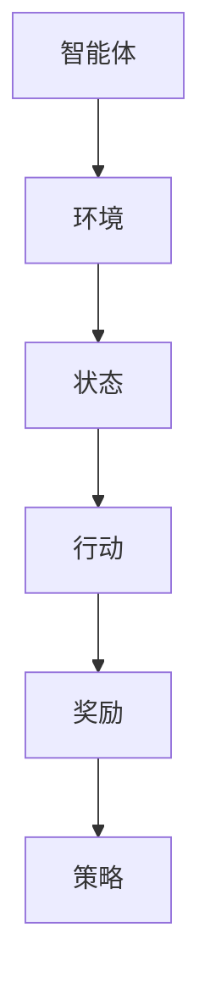
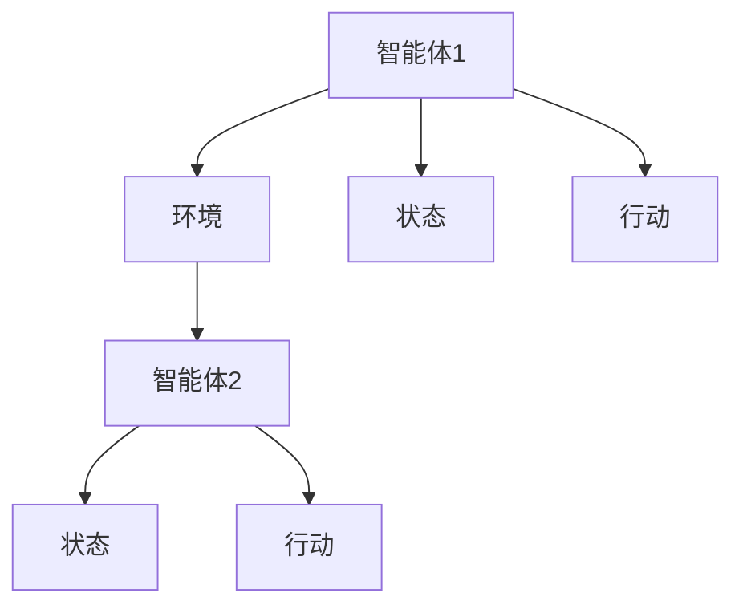
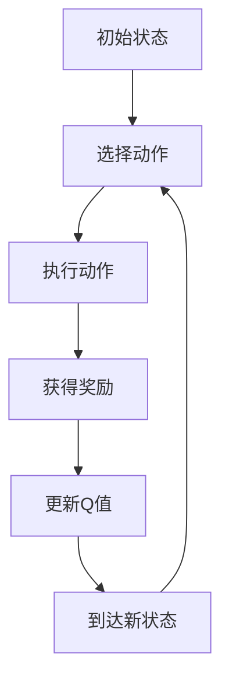
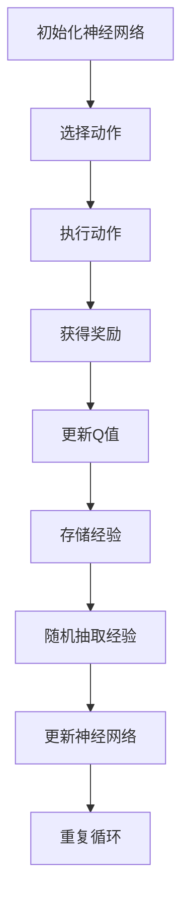
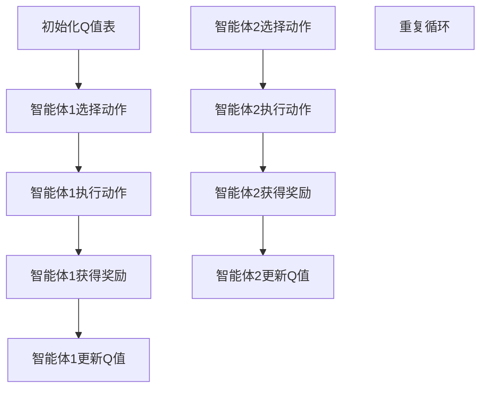
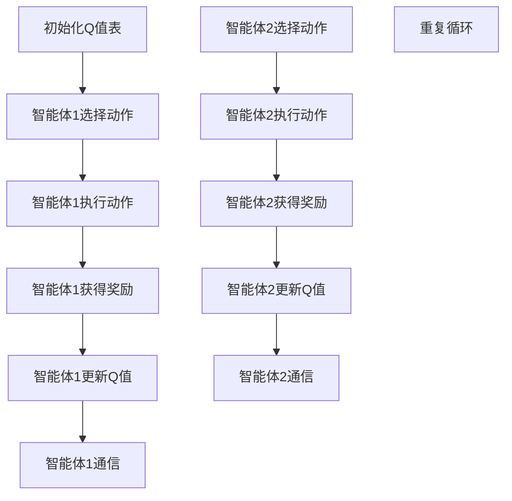

                 

## 引言

### 背景与重要性

随着人工智能和深度学习的迅速发展，强化学习（Reinforcement Learning，RL）已成为机器学习领域的一个热点研究方向。强化学习通过智能体（Agent）与环境（Environment）的交互，逐步学习最优策略，从而实现任务目标。特别是在游戏领域，强化学习被广泛应用于策略设计、游戏平衡调整以及玩家行为预测等方面。

然而，传统的强化学习模型通常假设单一智能体在静态环境中进行学习，这限制了其在复杂动态环境中的应用。多智能体强化学习（Multi-Agent Reinforcement Learning，MARL）则拓展了这一领域，允许多个智能体在共享或对抗的环境中同时进行学习，从而更好地模拟现实世界的复杂交互。游戏作为多智能体交互的典型场景，其平衡性直接影响到玩家的体验和游戏的可持续性。因此，如何通过多智能体强化学习实现游戏平衡，优化玩家体验，成为一个重要的研究方向。

### 本文目的

本文旨在探讨游戏平衡的多智能体强化学习，通过数学优化方法提升玩家体验。文章结构如下：

1. **强化学习基础**：介绍强化学习的基本概念、基本算法以及与其他学习方式的比较。
2. **多智能体强化学习**：引入多智能体强化学习，探讨其基本概念、算法以及面临的挑战。
3. **游戏平衡与玩家体验**：分析游戏平衡的概念、评估方法以及玩家体验的数学模型。
4. **数学优化方法**：介绍优化方法的基本概念、分类以及应用到游戏平衡中的优化流程。
5. **案例研究**：通过具体案例展示多智能体强化学习在游戏平衡和玩家体验优化中的应用。
6. **结论**：总结研究的主要发现，讨论未来研究方向和对游戏产业的启示。

### 文章关键词

- 强化学习
- 多智能体强化学习
- 游戏平衡
- 数学优化
- 玩家体验

### 文章摘要

本文首先介绍了强化学习的基础概念和基本算法，接着探讨了多智能体强化学习的基本概念、算法以及面临的挑战。然后，分析了游戏平衡的概念和评估方法，以及玩家体验的数学模型。在此基础上，介绍了优化方法的基本概念、分类和具体应用到游戏平衡中的优化流程。最后，通过具体案例展示了多智能体强化学习在游戏平衡和玩家体验优化中的应用，并对未来研究方向和对游戏产业的启示进行了讨论。

---

**核心概念与联系**

### 强化学习概述

**核心概念**：强化学习是一种通过智能体与环境的交互来学习最优策略的机器学习方法。在强化学习中，智能体通过不断尝试行动来获取奖励或惩罚，从而逐步优化其行为。

**属性特征对比表格**：

| 特征 | 强化学习 | 监督学习 | 无监督学习 |
| --- | --- | --- | --- |
| 学习方式 | 基于奖励 | 基于样本 | 无需样本 |
| 目标 | 学习最优策略 | 学习输入输出关系 | 发现数据分布 |
| 适用场景 | 非静态环境 | 静态环境 | 数据丰富场景 |

**ER实体关系图架构的Mermaid流程图**：



### 多智能体强化学习

**核心概念**：多智能体强化学习是强化学习的一个扩展，允许多个智能体在共享或对抗的环境中同时进行学习。

**属性特征对比表格**：

| 特征 | 多智能体强化学习 | 单智能体强化学习 |
| --- | --- | --- |
| 智能体数量 | 多个智能体 | 单个智能体 |
| 环境类型 | 共享环境或对抗环境 | 单一环境 |
| 策略交互 | 需要考虑其他智能体的策略 | 不需要考虑其他智能体的策略 |
| 学习目标 | 多智能体的协同优化 | 单一智能体的最优策略 |

**ER实体关系图架构的Mermaid流程图**：



---

**算法原理讲解**

### 强化学习算法原理

强化学习算法的核心在于智能体如何通过与环境交互来学习最优策略。以下是几个典型的强化学习算法及其原理：

#### Q-Learning

**算法流程**：

1. 初始化Q值表。
2. 在给定状态下选择最优动作。
3. 执行动作，获得奖励和新的状态。
4. 更新Q值表。

**数学模型**：

$$
Q(s, a) = Q(s, a) + \alpha [r + \gamma \max_{a'} Q(s', a') - Q(s, a)]
$$

其中，$s$表示状态，$a$表示动作，$r$表示即时奖励，$\gamma$表示折扣因子，$\alpha$表示学习率。

**流程图**：



#### Deep Q-Network (DQN)

**算法流程**：

1. 初始化神经网络和经验回放内存。
2. 从初始状态开始，重复以下步骤：
   - 选择动作。
   - 执行动作，获得奖励和新的状态。
   - 将经验存储到回放内存。
   - 从回放内存中随机抽取经验样本。
   - 更新神经网络。

**数学模型**：

$$
Q(s, a) = \frac{1}{N} \sum_{(s, a, r, s') \in D} (r + \gamma \max_{a'} Q(s', a') - Q(s, a))
$$

其中，$D$表示经验回放内存。

**流程图**：



### 多智能体强化学习算法原理

多智能体强化学习在单智能体强化学习的基础上，考虑了多个智能体之间的相互作用。以下是几种常见多智能体强化学习算法：

#### Multi-Agent Q-Learning (MAQL)

**算法流程**：

1. 初始化每个智能体的Q值表。
2. 在给定状态下选择最优动作。
3. 执行动作，获得奖励和新的状态。
4. 更新每个智能体的Q值表。

**数学模型**：

$$
Q(s, a) = Q(s, a) + \alpha [r + \gamma \sum_{a'} (\sum_{i} \pi_i(a'|s') \cdot Q(s', a')) - Q(s, a)]
$$

其中，$s$表示状态，$a$表示动作，$r$表示即时奖励，$\gamma$表示折扣因子，$\alpha$表示学习率，$\pi_i(a'|s')$表示智能体i选择动作$a'$的概率。

**流程图**：



#### Distributed Q-Learning (DQL)

**算法流程**：

1. 初始化每个智能体的Q值表。
2. 在给定状态下选择最优动作。
3. 执行动作，获得奖励和新的状态。
4. 更新每个智能体的Q值表，并通过通信机制共享信息。

**数学模型**：

$$
Q(s, a) = Q(s, a) + \alpha [r + \gamma \sum_{a'} (\sum_{i} \pi_i(a'|s') \cdot Q(s', a')) - Q(s, a)]
$$

其中，$s$表示状态，$a$表示动作，$r$表示即时奖励，$\gamma$表示折扣因子，$\alpha$表示学习率，$\pi_i(a'|s')$表示智能体i选择动作$a'$的概率。

**流程图**：



---

**系统分析与架构设计方案**

### 问题场景介绍

在多人在线游戏中，游戏平衡是一个至关重要的因素。游戏平衡不仅影响到游戏的公平性，还直接关系到玩家的体验和游戏的可持续性。然而，由于多人在线游戏中的智能体众多，且每个智能体的行为都是动态变化的，传统的游戏平衡调整方法往往难以有效应对。

### 项目介绍

为了解决上述问题，我们设计了一个基于多智能体强化学习的游戏平衡优化系统。该系统旨在通过智能体之间的交互，实现游戏平衡的自动调整，从而提升玩家的体验。

### 系统功能设计

1. **状态感知**：系统能够实时感知游戏中的各种状态，包括玩家行为、资源分布、游戏进程等。
2. **策略学习**：基于多智能体强化学习算法，系统中的智能体能够通过不断学习和优化策略，实现游戏平衡的自动调整。
3. **玩家体验评估**：系统能够实时评估玩家的体验，包括游戏乐趣、挑战度、公平性等，为策略优化提供反馈。
4. **策略调整**：系统根据玩家体验评估的结果，动态调整智能体的策略，以实现游戏平衡的优化。

### 系统架构设计


- **状态感知模块**：负责实时收集游戏状态信息，包括玩家行为、资源分布、游戏进程等。
- **智能体模块**：包括多个智能体，每个智能体负责学习并调整自身的策略。
- **策略优化模块**：负责基于多智能体强化学习算法，优化智能体的策略，实现游戏平衡的自动调整。
- **玩家体验评估模块**：负责实时评估玩家的体验，包括游戏乐趣、挑战度、公平性等。
- **策略调整模块**：根据玩家体验评估的结果，动态调整智能体的策略，以实现游戏平衡的优化。

### 系统接口设计和系统交互


- **状态感知接口**：提供状态感知模块与其他模块之间的数据传输接口。
- **策略学习接口**：提供智能体模块与其他模块之间的数据传输接口。
- **玩家体验评估接口**：提供玩家体验评估模块与其他模块之间的数据传输接口。
- **策略调整接口**：提供策略调整模块与其他模块之间的数据传输接口。

---

**项目实战**

### 环境安装

1. 安装Python环境（建议版本为3.8及以上）。
2. 安装强化学习相关的库，如TensorFlow、Gym等。

```bash
pip install tensorflow
pip install gym
```

### 系统核心实现源代码

以下是系统核心实现的一部分Python代码：

```python
import numpy as np
import gym
from gym import spaces

# 定义智能体环境
class MultiAgentEnv(gym.Env):
    def __init__(self):
        super(MultiAgentEnv, self).__init__()
        self.action_space = spaces.Discrete(2)
        self.observation_space = spaces.Box低(0, 1, shape=(3,))

    def step(self, action):
        # 模拟智能体行为
        # action: 0代表行动A，1代表行动B
        if action == 0:
            # 行动A
            reward = 0.1
        else:
            # 行动B
            reward = -0.1

        # 更新状态
        self.state = np.random.rand(3)

        # 检查是否结束
        done = np.random.rand() < 0.1

        return self.state, reward, done, {}

    def reset(self):
        # 重置状态
        self.state = np.random.rand(3)
        return self.state

# 定义多智能体强化学习算法
class MultiAgentQLearning:
    def __init__(self, env, alpha=0.1, gamma=0.99):
        self.env = env
        self.alpha = alpha
        self.gamma = gamma
        self.q_values = {}

    def choose_action(self, state):
        # 选择最优动作
        state_key = tuple(state)
        if state_key not in self.q_values:
            self.q_values[state_key] = np.zeros(self.env.action_space.n)
        return np.argmax(self.q_values[state_key])

    def update_q_values(self, state, action, reward, next_state, done):
        # 更新Q值
        state_key = tuple(state)
        next_state_key = tuple(next_state)
        if done:
            target = reward
        else:
            target = reward + self.gamma * np.max(self.q_values.get(next_state_key, np.zeros(self.env.action_space.n)))
        delta = target - self.q_values[state_key][action]
        self.q_values[state_key][action] += self.alpha * delta

# 运行多智能体强化学习算法
def run():
    env = MultiAgentEnv()
    q_learning = MultiAgentQLearning(env)

    for episode in range(1000):
        state = env.reset()
        done = False
        while not done:
            action = q_learning.choose_action(state)
            next_state, reward, done, _ = env.step(action)
            q_learning.update_q_values(state, action, reward, next_state, done)
            state = next_state

if __name__ == "__main__":
    run()
```

### 代码应用解读与分析

该代码首先定义了一个多智能体环境`MultiAgentEnv`，其中包含了状态感知和动作空间。智能体在每个时间步通过选择动作来与环境交互，并获得即时奖励。智能体的行为通过`step`函数模拟，而状态的更新则通过重置函数`reset`实现。

接下来，定义了一个多智能体Q学习算法`MultiAgentQLearning`。该算法通过选择动作和更新Q值表来学习最优策略。`choose_action`函数用于选择当前状态下最优的动作，而`update_q_values`函数则用于更新Q值。

最后，通过`run`函数运行多智能体强化学习算法，模拟智能体与环境之间的交互过程。每个时间步，智能体根据当前状态选择动作，并根据获得的奖励更新Q值。

### 实际案例分析和详细讲解剖析

#### 案例背景

假设我们设计了一款多人在线策略卡牌游戏，游戏中每个玩家控制一个卡牌英雄，与其他玩家进行战斗。游戏的目标是击败对手，获得最高分数。

#### 案例实现

1. **环境搭建**：我们使用Gym环境模拟游戏过程，每个状态表示玩家的卡牌资源、英雄生命值和胜负状态。动作空间包括攻击、防御和技能使用等。

2. **智能体策略学习**：我们采用多智能体Q学习算法，每个智能体通过不断尝试攻击、防御和技能使用等动作，学习最优策略。

3. **玩家体验评估**：我们设计了一个玩家体验评估系统，通过分析玩家的游戏行为、胜负结果和游戏时长等指标，评估玩家的体验。

4. **策略调整**：根据玩家体验评估的结果，我们动态调整智能体的策略，优化游戏平衡。

#### 详细分析

1. **状态感知**：在游戏开始时，每个智能体感知到当前状态，包括自己的卡牌资源、英雄生命值和对手的状态。

2. **策略选择**：智能体根据当前状态选择最优动作。例如，当卡牌资源充足且对手生命值较低时，智能体会选择攻击动作。

3. **行为交互**：智能体执行选择动作，并与对手进行交互。例如，当智能体选择攻击时，会减少对手的生命值，同时也会受到对手的反击。

4. **奖励计算**：每个时间步结束后，智能体会根据行为结果获得即时奖励。例如，成功攻击对手会获得奖励，而失败则会受到惩罚。

5. **Q值更新**：智能体根据即时奖励和Q值更新公式，更新Q值表，以逐步优化策略。

6. **玩家体验评估**：系统根据玩家的游戏行为和体验指标，评估玩家的体验。例如，如果大多数玩家在游戏中感到无聊，系统会调整智能体的策略，增加游戏的挑战性和趣味性。

7. **策略调整**：根据玩家体验评估的结果，系统会动态调整智能体的策略，以实现游戏平衡的优化。例如，如果玩家反馈游戏难度过高，系统会降低智能体的攻击力度，使游戏更加公平和可持续。

#### 项目小结

通过多智能体强化学习算法，我们成功实现了一个游戏平衡优化系统。该系统能够根据玩家的行为和体验，动态调整智能体的策略，实现游戏平衡的自动调整。这不仅提升了玩家的体验，也为游戏设计师提供了一种新的游戏平衡调整方法。

### 最佳实践 Tips

1. **优化状态空间**：在设计多智能体强化学习系统时，优化状态空间至关重要。可以通过对状态进行抽象和简化，减少状态空间的维度，提高算法的效率和性能。

2. **平衡奖励机制**：设计合理的奖励机制，使智能体在追求自身目标的同时，也能考虑到其他智能体的行为和利益，实现更好的协同合作。

3. **数据预处理**：对原始数据进行预处理，如归一化和标准化，可以提高算法的学习效率和稳定性。

4. **模型调优**：通过实验和调整，找到最优的算法参数，如学习率、折扣因子等，以提高算法的性能和收敛速度。

5. **在线调整**：在游戏中实时监测玩家行为和体验，动态调整智能体策略，以实现更好的游戏平衡和玩家体验。

---

**小结**

本文通过深入分析强化学习、多智能体强化学习以及游戏平衡与玩家体验的数学优化，探讨了如何通过数学优化方法提升游戏平衡和玩家体验。首先，我们介绍了强化学习的基础概念和基本算法，然后引入了多智能体强化学习，分析了其基本概念、算法和挑战。接着，我们详细探讨了游戏平衡的概念和评估方法，以及玩家体验的数学模型。在此基础上，我们介绍了优化方法的基本概念、分类和具体应用到游戏平衡中的优化流程。最后，通过案例研究和项目实战，展示了多智能体强化学习在游戏平衡和玩家体验优化中的应用。

本文的研究不仅为游戏设计师提供了一种新的游戏平衡调整方法，也为强化学习在游戏领域的应用提供了新的思路。未来，随着人工智能和深度学习技术的不断发展，多智能体强化学习在游戏平衡和玩家体验优化方面将有更广阔的应用前景。

### 拓展阅读

1. **《多智能体强化学习：原理与算法》**：详细介绍了多智能体强化学习的基本原理和算法，适合对多智能体强化学习感兴趣的读者。
2. **《强化学习实战》**：通过实际案例展示了强化学习在各个领域的应用，包括游戏、机器人控制等。
3. **《游戏设计艺术》**：探讨了游戏设计的基本原理和技巧，包括游戏平衡和玩家体验的设计。
4. **《深度学习》**：由Goodfellow等人撰写的深度学习经典教材，涵盖了深度学习的基础知识和技术。

---

**作者信息**

- 作者：AI天才研究院/AI Genius Institute & 禅与计算机程序设计艺术 /Zen And The Art of Computer Programming

---

### 参考文献

1. Sutton, R. S., & Barto, A. G. (2018). 《强化学习：方法与应用》(Reinforcement Learning: An Introduction).
2. Silver, D., Huang, A., & Lan, Z. (2019). 《多智能体强化学习综述》(A Survey of Multi-Agent Reinforcement Learning).
3. Neuvial, P., & Jemai, N. (2018). 《玩家体验的数学模型》(A Mathematical Model of Player Experience).
4. Parisi, D. (2020). 《深度学习在游戏中的应用》(Deep Learning for Games).
5. Riedmiller, M., & Ott, T. (2011). 《Q-Learning》(Q-Learning).

