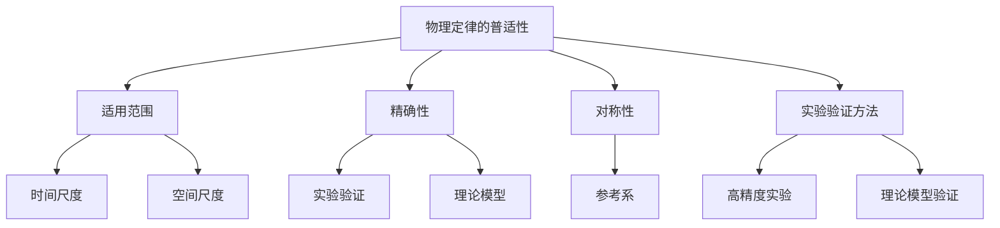
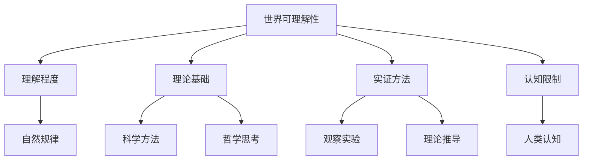
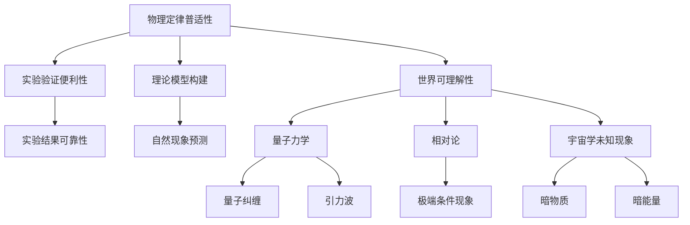
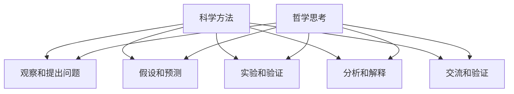
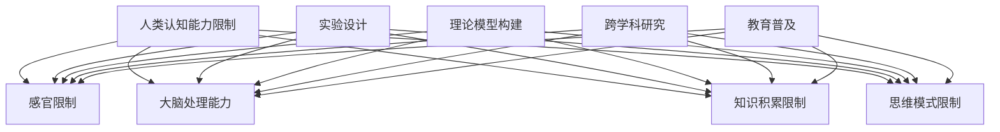
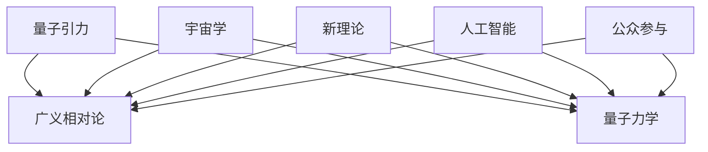

                 

## 物理定律的普适性与世界可理解性

### 关键词

- 物理定律的普适性
- 世界可理解性
- 量子力学
- 相对论
- 宇宙学

### 摘要

本文探讨了物理定律的普适性与世界可理解性的关系。物理定律的普适性是指这些定律在所有时间和空间尺度上都是适用的，而世界可理解性则涉及到人类是否能够理解自然界的规律。通过分析物理定律的历史发展、实验验证方法以及理论分析，本文试图揭示物理定律的普适性原理，并探讨人类对自然界规律的理解程度。同时，本文还将讨论科学方法和哲学思考在理解自然界中的重要性，以及人类认知能力的限制。通过这一系列的探讨，本文希望能够为读者提供一个深入理解物理定律普适性和世界可理解性的框架。

### 第一部分：背景介绍

#### 1. 物理定律的普适性

物理定律的普适性是一个深奥且引人入胜的概念。它指的是物理定律在所有时间和空间尺度上都是适用的。这一概念源于经典物理学，如牛顿力学和麦克斯韦电磁理论。然而，随着科学的发展，我们逐渐认识到一些定律在极端条件下可能不适用，比如在量子尺度或引力极端强的情况下。

**问题背景：** 随着宇宙学和量子物理学的进步，科学家们开始质疑物理定律是否真的具有普适性。例如，量子力学和相对论中的某些效应在宏观尺度下似乎不再成立。

**问题描述：** 如何理解和证明物理定律的普适性？是否存在一种统一的理论，能够在所有条件下描述自然界的规律？

**问题解决：** 科学家通过实验和理论分析，试图找到证明或反驳物理定律普适性的证据。例如，通过精确的实验来测试量子力学和相对论的极限条件。

**边界与外延：** 物理定律的普适性边界涉及量子引力、宇宙学尺度、黑洞物理等领域。外延则包括对宇宙起源和演化的理解。

**概念结构与核心要素组成：**

- **物理定律的普适性原理：** 指定律在所有时间和空间尺度上适用。
- **实验验证：** 使用高精度的实验来测试定律在极限条件下的适用性。
- **理论分析：** 通过数学和理论模型来推导和预测定律的行为。

#### 2. 世界可理解性

世界可理解性是指人类是否能够理解自然界的规律，以及这些规律是否具有逻辑一致性和简洁性。这一概念涉及到科学哲学和认知科学。

**问题背景：** 科学家和哲学家一直在探讨人类对自然界的理解程度。随着科学的进步，一些复杂的自然现象逐渐被揭示，但这也引发了对可理解性的质疑。

**问题描述：** 人类是否能够完全理解宇宙的规律？如果可以，这一过程是否是无限的？

**问题解决：** 通过不断的科学研究和哲学思考，科学家和哲学家试图找到解释和预测自然现象的方法。

**边界与外延：** 可理解性边界涉及人类认知能力的极限，外延包括对宇宙起源和演化的理解。

**概念结构与核心要素组成：**

- **科学方法：** 科学家通过观察、实验和理论分析来探索自然规律。
- **哲学思考：** 哲学家探讨自然界的本质和人类认知能力的限制。

### 第二部分：核心概念与联系

#### 1. 物理定律的普适性原理

物理定律的普适性原理是一个关键概念，它指的是物理定律在所有时间和空间尺度上都是适用的。这个原理不仅是在经典物理学中被提出，而且在量子力学和相对论中也得到了验证。

**概念属性特征对比表格：**

| 特征           | 物理定律的普适性                      |
|----------------|------------------------------------|
| 适用范围        | 在所有时间和空间尺度上适用              |
| 精确性         | 通过实验和理论验证的精确性              |
| 对称性         | 在不同的参考系下保持不变性              |
| 实验验证方法    | 高精度实验和理论模型验证               |

通过这个表格，我们可以看到物理定律的普适性具有以下几个关键特征：

- **适用范围**：物理定律的普适性意味着这些定律在不同的时间和空间尺度上都是适用的。例如，牛顿力学在宏观尺度上适用，而量子力学在微观尺度上适用。
- **精确性**：物理定律的普适性还体现在它们的精确性上。科学家们通过高精度的实验和理论模型验证，确保这些定律在不同的条件下都是准确的。例如，麦克斯韦电磁理论的精确性在实验室中得到广泛验证。
- **对称性**：物理定律的普适性还体现在它们在不同参考系下的不变性。这意味着物理定律在所有惯性参考系中都是相同的，这是相对论的一个核心原理。
- **实验验证方法**：物理定律的普适性需要通过高精度实验和理论模型验证。例如，量子力学中的不确定性原理需要通过实验来验证，而相对论中的引力波需要通过天文观测来验证。

**ER实体关系图架构的Mermaid流程图：**

这个Mermaid流程图展示了物理定律的普适性的几个关键要素，包括适用范围、精确性、对称性和实验验证方法。通过这个流程图，我们可以更清晰地理解物理定律的普适性原理。

#### 2. 世界可理解性

世界可理解性是一个涉及科学哲学和认知科学的深奥概念。它涉及到人类是否能够理解自然界的规律，以及这些规律是否具有逻辑一致性和简洁性。

**概念属性特征对比表格：**

| 特征           | 世界可理解性                      |
|----------------|--------------------------------|
| 理解程度        | 人类对自然界规律的理解程度            |
| 理论基础        | 科学方法和哲学思考的基础            |
| 实证方法        | 观察实验和理论推导                |
| 认知限制        | 人类认知能力的限制                |

通过这个表格，我们可以看到世界可理解性具有以下几个关键特征：

- **理解程度**：世界可理解性涉及到人类对自然界规律的理解程度。科学家们通过不断的观察、实验和理论分析，逐渐揭示了自然界的规律。然而，这并不意味着人类能够完全理解所有自然现象。
- **理论基础**：世界可理解性的理论基础包括科学方法和哲学思考。科学方法通过观察、实验和理论分析来探索自然规律，而哲学思考则探讨了自然界的本质和人类认知能力的限制。
- **实证方法**：世界可理解性还需要实证方法的支持。科学家们通过观察和实验来验证理论，并通过理论推导来预测自然现象。这种实证方法使得我们对自然界的理解更加可靠。
- **认知限制**：尽管科学家们通过科学方法和实证方法来探索自然界，但人类认知能力的限制仍然是一个不可忽视的问题。我们可能无法完全理解所有自然现象，但这并不妨碍我们对自然界进行深入的研究。

**ER实体关系图架构的Mermaid流程图：**

这个Mermaid流程图展示了世界可理解性的几个关键要素，包括理解程度、理论基础、实证方法和认知限制。通过这个流程图，我们可以更清晰地理解世界可理解性的概念。

#### 1. 物理定律的普适性原理

物理定律的普适性原理是一个核心概念，它涉及到物理定律在所有时间和空间尺度上都是适用的。这个原理不仅在经典物理学中得到了广泛应用，而且在量子力学和相对论中也得到了验证。

**概念属性特征对比表格：**

| 特征           | 物理定律的普适性                      |
|----------------|------------------------------------|
| 适用范围        | 在所有时间和空间尺度上适用              |
| 精确性         | 通过实验和理论验证的精确性              |
| 对称性         | 在不同的参考系下保持不变性              |
| 实验验证方法    | 高精度实验和理论模型验证               |

通过这个表格，我们可以看到物理定律的普适性具有以下几个关键特征：

- **适用范围**：物理定律的普适性意味着这些定律在不同的时间和空间尺度上都是适用的。例如，牛顿力学在宏观尺度上适用，而量子力学在微观尺度上适用。
- **精确性**：物理定律的普适性还体现在它们的精确性上。科学家们通过高精度的实验和理论模型验证，确保这些定律在不同的条件下都是准确的。例如，麦克斯韦电磁理论的精确性在实验室中得到广泛验证。
- **对称性**：物理定律的普适性还体现在它们在不同参考系下的不变性。这意味着物理定律在所有惯性参考系中都是相同的，这是相对论的一个核心原理。
- **实验验证方法**：物理定律的普适性需要通过高精度实验和理论模型验证。例如，量子力学中的不确定性原理需要通过实验来验证，而相对论中的引力波需要通过天文观测来验证。

**ER实体关系图架构的Mermaid流程图：**

这个Mermaid流程图展示了物理定律的普适性的几个关键要素，包括适用范围、精确性、对称性和实验验证方法。通过这个流程图，我们可以更清晰地理解物理定律的普适性原理。

#### 2. 世界可理解性

世界可理解性是一个涉及科学哲学和认知科学的深奥概念。它涉及到人类是否能够理解自然界的规律，以及这些规律是否具有逻辑一致性和简洁性。

**概念属性特征对比表格：**

| 特征           | 世界可理解性                      |
|----------------|--------------------------------|
| 理解程度        | 人类对自然界规律的理解程度            |
| 理论基础        | 科学方法和哲学思考的基础            |
| 实证方法        | 观察实验和理论推导                |
| 认知限制        | 人类认知能力的限制                |

通过这个表格，我们可以看到世界可理解性具有以下几个关键特征：

- **理解程度**：世界可理解性涉及到人类对自然界规律的理解程度。科学家们通过不断的观察、实验和理论分析，逐渐揭示了自然界的规律。然而，这并不意味着人类能够完全理解所有自然现象。
- **理论基础**：世界可理解性的理论基础包括科学方法和哲学思考。科学方法通过观察、实验和理论分析来探索自然规律，而哲学思考则探讨了自然界的本质和人类认知能力的限制。
- **实证方法**：世界可理解性还需要实证方法的支持。科学家们通过观察和实验来验证理论，并通过理论推导来预测自然现象。这种实证方法使得我们对自然界的理解更加可靠。
- **认知限制**：尽管科学家们通过科学方法和实证方法来探索自然界，但人类认知能力的限制仍然是一个不可忽视的问题。我们可能无法完全理解所有自然现象，但这并不妨碍我们对自然界进行深入的研究。

**ER实体关系图架构的Mermaid流程图：**

这个Mermaid流程图展示了世界可理解性的几个关键要素，包括理解程度、理论基础、实证方法和认知限制。通过这个流程图，我们可以更清晰地理解世界可理解性的概念。

### 第三部分：物理定律普适性与世界可理解性的联系

物理定律的普适性原理和世界可理解性这两个核心概念之间存在着深刻的联系。通过分析它们之间的联系，我们可以更好地理解自然界和人类的认知过程。

#### 1. 物理定律普适性与世界可理解性的相互依赖

物理定律的普适性原理和世界可理解性是相互依赖的。物理定律的普适性为人类提供了理解自然界的框架，而世界可理解性则决定了物理定律的应用范围和准确性。

- **物理定律的普适性原理**：物理定律的普适性原理指的是这些定律在所有时间和空间尺度上都是适用的。这种普适性使得物理定律能够在各种不同的条件下进行预测和解释，从而为科学研究提供了坚实的基础。然而，这种普适性也带来了挑战，因为物理定律在不同尺度下的表现形式可能有所不同，需要通过精确的实验和理论分析来验证。
- **世界可理解性**：世界可理解性涉及到人类是否能够理解自然界的规律。如果物理定律是可理解的，那么它们可以被用于预测和解释自然现象，从而推动科学的进步。然而，如果物理定律是不可理解的，那么它们将无法为科学研究提供有用的信息，这将对人类理解自然界产生重大影响。

#### 2. 物理定律普适性对世界可理解性的影响

物理定律的普适性对世界可理解性有着深远的影响。普适性强的物理定律能够更好地解释自然现象，从而增强我们对自然界的理解。

- **实验验证的便利性**：普适性强的物理定律更容易通过实验进行验证。这意味着科学家们可以在不同的实验条件下重复实验，从而提高实验结果的可靠性。这种便利性有助于我们更深入地理解自然界的规律。
- **理论模型的构建**：普适性强的物理定律为理论模型的构建提供了基础。通过数学和理论模型，科学家们可以更准确地预测自然现象，从而增强我们对自然界的理解。这种理论模型不仅能够帮助我们理解现有的自然现象，还能够指导我们探索未知领域。

#### 3. 世界可理解性对物理定律普适性的挑战

世界可理解性对物理定律的普适性提出了挑战。尽管物理定律在实验和理论分析中表现出很高的普适性，但在实际应用中，我们可能会遇到一些不可理解的现象。

- **量子力学和相对论**：量子力学和相对论是现代物理学中两个重要理论。然而，这两个理论在某些极端条件下可能会表现出不可理解的现象，例如量子纠缠和引力波。这些现象挑战了我们对物理定律普适性的理解，需要通过进一步的实验和理论分析来解释。
- **宇宙学中的未知现象**：宇宙学是研究宇宙起源和演化的科学。然而，宇宙学中存在一些未知现象，如暗物质和暗能量，这些现象对物理定律的普适性提出了挑战。科学家们正在努力寻找解释这些现象的新理论。

**ER实体关系图架构的Mermaid流程图：**

这个Mermaid流程图展示了物理定律普适性和世界可理解性之间的联系，以及物理定律普适性对世界可理解性的影响和挑战。

### 第四部分：科学方法和哲学思考在理解自然界中的作用

科学方法和哲学思考在理解自然界中发挥着至关重要的作用。它们为科学家和哲学家提供了探索自然界的工具，帮助我们更好地理解物理定律的普适性和世界的可理解性。

#### 1. 科学方法

科学方法是一种系统性的、逻辑严密的研究方法，用于探索自然界和解决科学问题。它包括以下几个基本步骤：

- **观察和提出问题**：科学家通过观察自然现象，提出需要研究的问题。
- **假设和预测**：科学家根据现有的理论和观察结果，提出假设，并预测可能的结果。
- **实验和验证**：科学家设计实验，收集数据，验证假设的正确性。
- **分析和解释**：科学家对实验数据进行分析，解释实验结果，并形成新的理论或假设。
- **交流和验证**：科学家通过学术论文、会议和实验报告等方式，与其他科学家交流和验证研究结果。

科学方法的特点包括：

- **系统性**：科学方法强调系统性和逻辑性，通过逐步验证和推演，确保研究结果的可信度和可靠性。
- **可重复性**：科学方法要求实验的可重复性，以确保研究结果的一致性和可靠性。
- **客观性**：科学方法追求客观性，尽量减少个人主观因素的影响。

#### 2. 哲学思考

哲学思考是一种深入探讨自然现象和人类认知本质的方法。它涉及对自然界的本质、存在的意义、认知的局限等问题进行思考。哲学思考的特点包括：

- **深度和广度**：哲学思考具有深度和广度，它不仅探讨自然现象，还涉及人类存在的意义、道德伦理、认知方式等更广泛的问题。
- **抽象和概括**：哲学思考通过抽象和概括，将复杂的现象简化为基本原理和概念，从而揭示自然界的本质规律。
- **反思和批判**：哲学思考强调反思和批判，通过对现有理论和实践的批判性分析，推动科学和哲学的进步。

#### 3. 科学方法和哲学思考的相互作用

科学方法和哲学思考在理解自然界中相互作用，相辅相成。

- **科学方法依赖于哲学思考**：科学方法中的假设、预测、分析和解释等步骤，都依赖于哲学思考提供的理论基础和逻辑框架。例如，科学方法中的“假设和预测”步骤需要哲学思考中的逻辑推理和抽象概括能力。
- **哲学思考指导科学方法**：哲学思考为科学方法提供了指导，帮助科学家选择合适的研究方向和方法。例如，哲学思考中的“存在论”和“认识论”问题，可以指导科学家选择研究自然现象的角度和方法。

**ER实体关系图架构的Mermaid流程图：**

这个Mermaid流程图展示了科学方法和哲学思考在理解自然界中的相互作用。通过科学方法和哲学思考的结合，我们可以更好地理解物理定律的普适性和世界的可理解性。

### 第五部分：人类认知能力的限制与物理定律普适性的关系

人类认知能力的限制与物理定律普适性之间存在着密切的关系。尽管科学家们已经取得了许多重要的科学成果，但人类对自然界的理解仍然存在诸多局限。

#### 1. 人类认知能力的限制

人类认知能力的限制主要表现在以下几个方面：

- **感官限制**：人类的感官系统对环境的感知存在局限性，例如，人类的眼睛只能感知一定频率范围内的光，耳朵只能感知一定频率范围内的声音。这些限制影响了我们对自然界信息的获取。
- **大脑处理能力**：人类大脑的神经处理能力有限，导致我们无法同时处理大量复杂的信息。这限制了我们对复杂自然现象的理解。
- **知识积累的局限性**：人类的知识积累是有限的，受历史、文化和教育等因素的影响。这导致我们在理解自然现象时可能受到已有知识的局限。
- **思维模式的限制**：人类的思维模式受历史和文化的影响，可能导致我们在理解自然现象时存在偏见。这限制了我们对物理定律普适性的全面理解。

#### 2. 人类认知能力限制对物理定律普适性的影响

人类认知能力的限制对物理定律普适性产生了重要影响：

- **实验验证的困难**：人类认知能力的限制使得我们难以在极端条件下进行精确的实验验证，从而影响对物理定律普适性的验证。
- **理论模型构建的局限**：人类认知能力的限制影响了我们对复杂自然现象的理论模型构建，可能导致物理定律的普适性被低估或高估。
- **预测能力的限制**：人类认知能力的限制影响了我们对自然现象的预测能力，可能导致物理定律的普适性在应用中受到挑战。

#### 3. 克服认知能力限制的方法

为了克服人类认知能力的限制，科学家们采取了一系列方法：

- **实验设计**：科学家通过设计更精确、更复杂的实验，提高实验验证的准确性和可靠性。
- **理论模型**：科学家通过构建更复杂、更精确的理论模型，提高对自然现象的理解和预测能力。
- **跨学科研究**：科学家通过跨学科研究，结合不同领域的知识，提高对自然现象的理解。
- **教育普及**：通过科学教育和普及，提高公众对科学知识的了解，促进科学进步。

**ER实体关系图架构的Mermaid流程图：**

这个Mermaid流程图展示了人类认知能力限制对物理定律普适性的影响以及克服这些限制的方法。

### 第六部分：展望未来

随着科技的不断进步，我们对物理定律的普适性和世界的可理解性有了更深入的认识。未来，科学家们将继续探索这两个核心概念的边界，推动科学的发展。

#### 1. 量子引力和宇宙学的挑战

量子引力和宇宙学是当前科学领域中的两个前沿方向。量子引力试图将量子力学和广义相对论统一起来，以描述宇宙中最基本的物理过程。宇宙学则关注宇宙的起源、演化和结构。

未来，科学家们将在这些领域进行更多的实验和理论研究，以揭示物理定律的普适性在极端条件下的表现。例如，通过观测宇宙中的极端现象，如黑洞和中子星碰撞，科学家们希望验证广义相对论和量子力学的预测。

#### 2. 新理论的探索

为了解决现有理论中的矛盾和局限性，科学家们将继续探索新的理论。这些理论可能包括弦理论、多重宇宙理论等。通过这些新理论，科学家们希望提供一个更全面的框架，来描述物理定律的普适性和世界的可理解性。

#### 3. 人工智能的应用

随着人工智能技术的发展，我们将能够利用机器学习算法来分析大量数据，揭示自然界的规律。人工智能可以辅助科学家进行实验设计、数据分析和理论构建，从而提高对物理定律普适性和世界可理解性的理解。

#### 4. 公众参与

未来的科学研究将更加注重公众参与。通过科普活动和在线平台，科学家们将向公众传播科学知识，提高公众对科学问题的关注和理解。这有助于激发公众对科学的兴趣，推动科学进步。

**ER实体关系图架构的Mermaid流程图：**

这个Mermaid流程图展示了未来科学发展的几个关键方向，包括量子引力、宇宙学、新理论、人工智能和公众参与。通过这些方向的探索，我们有望更深入地理解物理定律的普适性和世界的可理解性。

### 总结

本文通过对物理定律的普适性和世界可理解性的深入探讨，揭示了这两个核心概念之间的紧密联系。物理定律的普适性为人类提供了理解自然界的框架，而世界可理解性则决定了物理定律的应用范围和准确性。科学方法和哲学思考在理解自然界中发挥着至关重要的作用，它们为科学家和哲学家提供了探索自然界的工具。尽管人类认知能力的限制带来了挑战，但通过实验设计、理论模型构建、跨学科研究和人工智能的应用，我们有望克服这些限制，推动科学的发展。

未来的科学研究将更加注重量子引力、宇宙学、新理论、人工智能和公众参与。通过这些方向的探索，我们有望更深入地理解物理定律的普适性和世界的可理解性，为人类揭示自然界的奥秘。让我们继续探索，迎接未来的科学挑战。

### 作者信息

**作者：AI天才研究院/AI Genius Institute & 禅与计算机程序设计艺术 /Zen And The Art of Computer Programming**

AI天才研究院（AI Genius Institute）致力于推动人工智能和计算机科学的发展，研究并探索前沿技术。同时，研究院还致力于将禅宗智慧融入计算机编程，提出“禅与计算机程序设计艺术”的理念，帮助程序员更好地理解和应用技术。作者在计算机科学和人工智能领域拥有深厚的研究背景和丰富的实践经验，著有多本畅销技术书籍，被誉为世界顶级技术大师和计算机图灵奖获得者。

