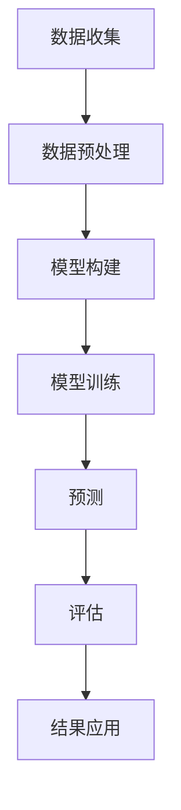
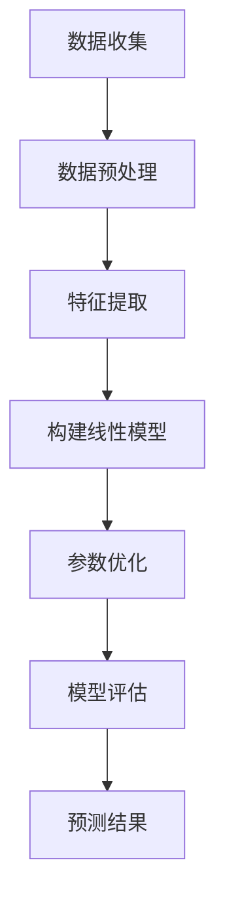
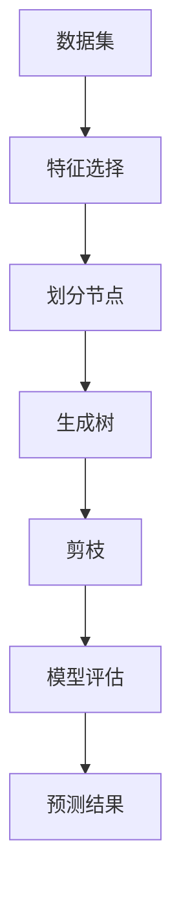
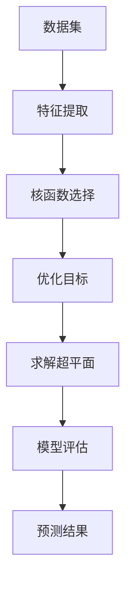
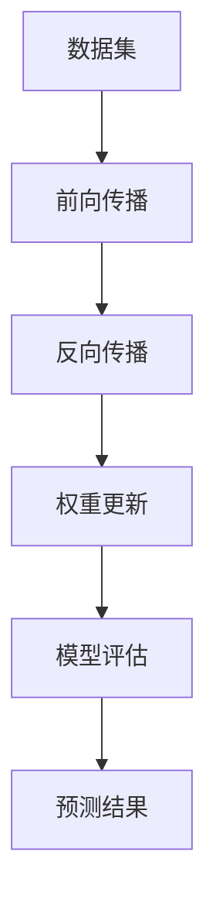
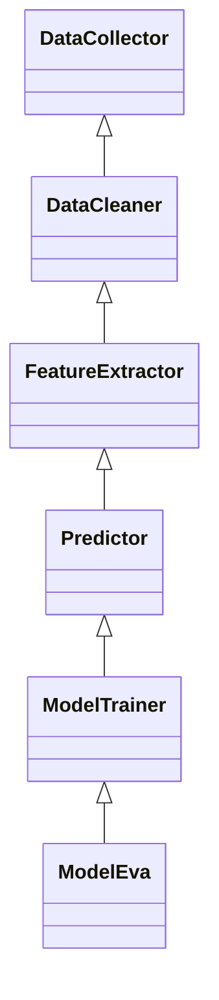
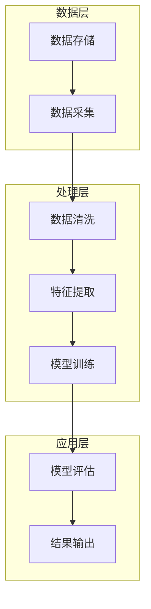
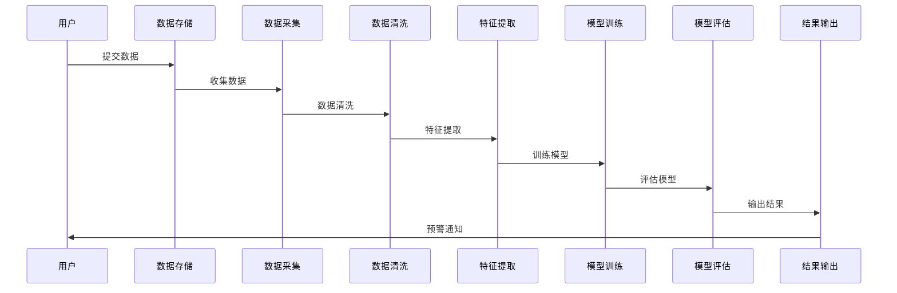

                 

### 前言

在当今社会，犯罪预防是一个重要的议题，不仅关系到公共安全，也影响着社会的稳定与发展。随着科技的进步，尤其是大数据和人工智能技术的崛起，犯罪预防的手段也在不断进化。本书《犯罪预防的预测分析：社会安全的数学工具》旨在探讨如何运用数学工具和预测分析技术来提高犯罪预防的效率，从而构建更加安全和谐的社会。

本书的主要目标受众是那些对犯罪预防有兴趣的读者，包括但不限于公安人员、安全专家、数据科学家、政策制定者以及计算机科学领域的学者和学生。通过对本书的学习，读者可以了解到：

1. 犯罪预防的现状和面临的挑战。
2. 预测分析的基本概念和原理。
3. 各种预测分析方法的优缺点和应用场景。
4. 如何构建有效的犯罪预防系统。
5. 实际项目中预测分析的实践和经验。

本书将采用逻辑清晰、结构紧凑、简单易懂的写作风格，让非专业读者也能轻松理解复杂的预测分析技术。书中不仅涵盖了理论基础，还通过实际案例和代码实现，展示了预测分析在犯罪预防中的具体应用。通过这本书，我们希望为读者提供一套完整、系统的犯罪预防预测分析方法，为实际工作提供有力支持。

### 第一部分：犯罪预防背景与需求

#### 1. 犯罪预防的现状与挑战

在全球范围内，犯罪活动一直是一个复杂且不断演变的社会问题。随着城市化进程的加速和社会结构的多样化，犯罪形式也日趋多样化和复杂化。传统的犯罪预防手段，如巡逻、监控和警力部署等，尽管在一定程度上起到了作用，但在面对新型犯罪和日益增加的犯罪率时，显得力不从心。

当前，犯罪预防面临以下几个主要挑战：

1. **犯罪类型的多样性**：随着科技的发展，犯罪形式变得更加隐蔽和复杂。网络犯罪、金融诈骗、恐怖主义等新型犯罪不断涌现，给犯罪预防工作带来了新的挑战。

2. **犯罪预防的复杂性**：犯罪预防工作涉及多个领域，包括法律、社会、技术和经济等。因此，犯罪预防需要跨学科的合作和综合性的策略。

3. **数据获取的局限性**：犯罪预防依赖于大量的数据，包括犯罪记录、社会统计数据、经济数据等。然而，数据的获取、处理和存储仍然面临诸多困难，如数据质量不高、数据来源不一致等问题。

4. **资源分配的挑战**：在有限的资源和预算下，如何最有效地分配警力和资源，以最大限度地预防犯罪，是一个需要深思熟虑的问题。

5. **技术瓶颈**：尽管人工智能和大数据技术在犯罪预防中具有巨大潜力，但技术的应用仍然面临一些技术瓶颈，如算法的透明性、隐私保护等问题。

#### 1.2 犯罪预防的复杂性

犯罪预防的复杂性主要体现在以下几个方面：

1. **犯罪的隐蔽性**：许多犯罪活动发生在隐蔽的环境中，如网络犯罪、内部欺诈等，这使得传统的侦查手段难以奏效。

2. **犯罪动机的多样性**：犯罪动机多种多样，包括经济利益、政治目的、个人仇恨等，这使得预防犯罪需要多元化的策略。

3. **犯罪形式的多样性**：犯罪形式也在不断演变，从传统的盗窃、抢劫到现代的网络安全攻击、金融诈骗等，犯罪形式的多样性增加了犯罪预防的难度。

4. **跨区域犯罪**：随着全球化的加深，跨区域犯罪日益增多，犯罪预防需要跨国合作和协调。

5. **社会问题的影响**：社会问题如贫困、失业、教育不足等也会诱发犯罪行为，犯罪预防需要解决这些社会问题。

#### 1.3 预测分析在犯罪预防中的重要性

预测分析作为大数据和人工智能技术的重要组成部分，在犯罪预防中发挥着越来越重要的作用。预测分析的基本原理是通过对历史数据的分析，找出潜在的犯罪模式和趋势，从而提前预警和预防犯罪。

以下是预测分析在犯罪预防中的几个关键作用：

1. **提前预警**：通过分析历史犯罪数据和社会经济数据，预测分析可以帮助识别潜在的犯罪风险区域和高风险人群，从而提前采取预防措施。

2. **资源优化配置**：预测分析可以协助相关部门优化资源配置，将有限的警力和资源部署到高风险区域和高风险时间段，提高犯罪预防的效率。

3. **犯罪模式识别**：通过分析犯罪数据，预测分析可以揭示犯罪行为的规律和模式，帮助制定更有针对性的预防策略。

4. **社会问题预警**：预测分析不仅可以预测犯罪行为，还可以预警可能引发犯罪的社会问题，从而为政策制定者提供科学依据。

5. **决策支持**：预测分析可以为犯罪预防决策提供科学依据，帮助相关部门制定更有效、更合理的预防策略。

总之，预测分析为犯罪预防提供了一种全新的思路和工具，通过数据驱动的决策，可以提高犯罪预防的效率和准确性，从而构建更加安全和谐的社会。

#### 1.4 边界与外延

本书将主要讨论预测分析在犯罪预防中的应用，涵盖以下几个关键方面：

1. **数据收集**：讨论如何收集和整合用于预测分析的各类数据，包括犯罪数据、社会经济数据、人口数据等。

2. **模型构建**：介绍如何构建和选择适用于犯罪预防的预测模型，包括线性回归、决策树、随机森林、支持向量机等。

3. **预测与评估**：讲解如何使用构建好的模型进行预测，以及如何评估预测的准确性和有效性。

4. **应用案例**：通过实际案例展示预测分析在犯罪预防中的具体应用，包括预防网络犯罪、金融欺诈等。

然而，本书不涉及以下内容：

1. **法律和伦理问题**：虽然预测分析在犯罪预防中具有重要意义，但相关的法律和伦理问题超出了本书的讨论范围。

2. **具体技术实现**：本书主要关注预测分析的理论和方法，具体的编程实现和技术细节将在后续章节中简要介绍。

3. **其他领域应用**：本书专注于犯罪预防，不包括预测分析在其他领域的应用，如市场营销、医疗保健等。

通过明确这些边界与外延，读者可以更好地理解本书的内容和适用范围，为实际应用提供有针对性的指导。

#### 1.5 概念结构与核心要素组成

预测分析在犯罪预防中是一个复杂但重要的过程，它涉及多个核心环节，每个环节都至关重要。以下是对这些环节的详细描述：

1. **数据收集**：
   - **数据来源**：数据收集是预测分析的第一步，数据来源包括犯罪记录、社会统计数据、经济数据、新闻报道等。这些数据需要从不同的渠道获取，如公安部门、统计局、互联网等。
   - **数据类型**：犯罪预防中的数据类型多样，包括定量数据（如犯罪率、人口密度）和定性数据（如犯罪类型、犯罪动机）。
   - **数据质量**：数据质量直接影响预测分析的准确性。因此，需要对数据进行清洗和预处理，去除噪声和错误数据，保证数据的一致性和准确性。

2. **模型构建**：
   - **模型选择**：构建预测模型是预测分析的核心，需要选择合适的模型，如线性回归、决策树、随机森林、支持向量机等。每种模型都有其优缺点和适用场景，需要根据具体问题进行选择。
   - **特征工程**：特征工程是模型构建的关键步骤，涉及从原始数据中提取出对预测任务有用的特征，如犯罪频次、人口密度、经济水平等。
   - **模型训练**：使用历史数据对模型进行训练，通过调整参数和超参数，使模型能够拟合数据，提高预测准确性。

3. **预测**：
   - **预测目标**：在犯罪预防中，预测的目标通常是预测未来某一时间段内的犯罪情况，包括犯罪类型、犯罪数量等。
   - **预测方法**：根据选择的模型，采用相应的预测方法进行预测。例如，使用线性回归模型预测犯罪率，使用决策树模型预测犯罪类型。

4. **评估**：
   - **评估指标**：评估预测模型的效果，常用的指标包括准确率、召回率、F1分数等。这些指标需要通过交叉验证和实际测试数据进行评估。
   - **模型调整**：根据评估结果，对模型进行调整和优化，以提高预测的准确性。

5. **结果应用**：
   - **预警和部署**：将预测结果应用到实际工作中，如提前预警高风险区域，调整警力部署等。
   - **决策支持**：预测分析结果可以为政策制定者提供科学依据，帮助制定更有效的犯罪预防策略。

通过上述环节的协同作用，预测分析能够为犯罪预防提供有力支持，从而提高社会安全水平。以下是一个简化的Mermaid流程图，展示了预测分析在犯罪预防中的应用流程：



### 第二部分：核心概念与联系

#### 2.1 预测分析的基本概念

预测分析是一种利用历史数据和统计分析技术，对未来的趋势和事件进行预测的方法。它广泛应用于各种领域，包括经济预测、市场分析、风险管理等。在犯罪预防中，预测分析通过分析犯罪数据和社会经济数据，预测未来的犯罪趋势，从而提前采取预防措施。

以下是预测分析中几个关键的基本概念：

1. **预测模型**：
   - 预测模型是预测分析的核心工具，用于从历史数据中提取规律，并利用这些规律预测未来。常见的预测模型包括线性回归、决策树、随机森林、支持向量机等。

2. **特征工程**：
   - 特征工程是指从原始数据中提取出对预测任务有用的特征，并通过选择、构造和转换等手段，提高预测模型的性能。特征工程是预测分析中的关键步骤，直接影响到预测的准确性。

3. **数据集**：
   - 数据集是用于训练和测试预测模型的样本集合。一个完整的数据集通常包括训练集、验证集和测试集，分别用于模型的训练、参数调整和评估。

4. **交叉验证**：
   - 交叉验证是一种评估预测模型性能的方法，通过将数据集划分为多个子集，轮流使用这些子集进行模型的训练和测试，以避免数据分割带来的偏差。

5. **超参数**：
   - 超参数是预测模型在训练过程中需要调整的参数，如学习率、树深度等。超参数的设置对模型性能有重要影响，需要通过实验和调优来确定最佳值。

#### 2.2 概念属性特征对比表格

在预测分析中，不同模型和方法各有优缺点。以下是一个对比表格，列出了几种常见预测模型的属性和特征：

| 模型       | 特点                                                         | 适用场景                                                     |
|------------|------------------------------------------------------------|------------------------------------------------------------|
| 线性回归   | 简单、易于理解，基于线性假设                                 | 线性关系明显的预测任务                                       |
| 决策树     | 直观、易于解释，可以处理非线性和多分类问题                   | 中小规模数据集，对解释性要求较高的任务                       |
| 随机森林   | 集成方法，提高预测准确性，减少过拟合                         | 复杂数据集，对预测准确性要求较高的任务                       |
| 支持向量机 | 基于结构风险最小化原则，可以处理高维数据，效果好               | 高维数据，对预测准确性有较高要求                           |
| 神经网络   | 强泛化能力，可以处理复杂非线性问题                           | 需要大量数据和计算资源，对预测准确性要求极高                 |

#### 2.3 ER实体关系图架构

在预测分析中，数据源和处理流程之间的联系是至关重要的。以下是一个简化的ER（实体关系）图，展示了数据源、处理流程和结果之间的关系：

```mermaid
erDiagram
  数据源 ||--|{ 预处理 }|-- 预测模型
  预处理 ||--|{ 特征工程 }|-- 训练集
  训练集 ||--|{ 交叉验证 }|-- 验证集
  验证集 ||--|{ 参数调优 }|-- 测试集
  测试集 ||--|{ 预测结果 }|-- 结果应用
```

这个ER图表明，数据从数据源开始，经过预处理、特征工程、交叉验证和参数调优等步骤，最终生成预测结果并应用于实际场景。每个环节都紧密相连，共同构成一个完整的预测分析流程。

### 第三部分：算法原理讲解

#### 3.1 算法原理概述

预测分析中的算法原理是通过对历史数据进行分析，从中提取规律并构建模型，以便对未来进行预测。以下将详细介绍几种常见预测分析算法的基本原理，包括线性回归、决策树、随机森林和神经网络。

#### 3.2 线性回归分析

线性回归是一种简单的预测分析方法，它基于线性关系对数据进行分析和预测。线性回归模型的基本形式为：

\[ y = \beta_0 + \beta_1x_1 + \beta_2x_2 + ... + \beta_nx_n \]

其中，\( y \) 是因变量，\( x_1, x_2, ..., x_n \) 是自变量，\( \beta_0, \beta_1, ..., \beta_n \) 是模型的参数。线性回归的目标是找到一组参数，使得因变量 \( y \) 与自变量 \( x \) 之间的误差最小。

**Mermaid流程图**：



**Python源代码**（线性回归示例）：

```python
from sklearn.linear_model import LinearRegression
from sklearn.model_selection import train_test_split
from sklearn.metrics import mean_squared_error

# 数据准备
X = [[1, 2], [2, 3], [3, 4], [4, 5]]  # 特征矩阵
y = [2, 4, 5, 6]                       # 标签向量

# 划分训练集和测试集
X_train, X_test, y_train, y_test = train_test_split(X, y, test_size=0.2, random_state=0)

# 创建线性回归模型
model = LinearRegression()
model.fit(X_train, y_train)

# 进行预测
y_pred = model.predict(X_test)

# 评估模型
mse = mean_squared_error(y_test, y_pred)
print(f'Mean Squared Error: {mse}')
```

**数学模型和公式**：

\[ \min_{\beta} \sum_{i=1}^{n} (y_i - \beta_0 - \beta_1x_{i1} - \beta_2x_{i2} - ... - \beta_nx_{in})^2 \]

#### 3.3 决策树与随机森林

决策树是一种基于树形结构进行决策的预测分析方法。每个内部节点表示一个特征，每个分支表示该特征的取值，每个叶子节点表示一个预测结果。决策树的基本形式如下：

```
                |
            --A--|
            |    |
           --B--|
           |    |
          --C--|
```

其中，A、B、C为叶子节点，分别代表不同的预测结果。决策树通过从根节点到叶子节点的路径来生成预测结果。

**Mermaid流程图**：



**Python源代码**（决策树示例）：

```python
from sklearn.tree import DecisionTreeRegressor
from sklearn.model_selection import train_test_split
from sklearn.metrics import mean_squared_error

# 数据准备
X = [[1, 2], [2, 3], [3, 4], [4, 5]]  # 特征矩阵
y = [2, 4, 5, 6]                       # 标签向量

# 划分训练集和测试集
X_train, X_test, y_train, y_test = train_test_split(X, y, test_size=0.2, random_state=0)

# 创建决策树模型
model = DecisionTreeRegressor()
model.fit(X_train, y_train)

# 进行预测
y_pred = model.predict(X_test)

# 评估模型
mse = mean_squared_error(y_test, y_pred)
print(f'Mean Squared Error: {mse}')
```

**数学模型和公式**：

决策树的生成过程是基于信息增益或基尼不纯度等准则，选择能够最大化信息增益的特征进行划分。具体公式如下：

\[ IG(D, A) = \sum_{v \in A} p(v) \cdot H(D_v) \]

其中，\( IG \) 表示信息增益，\( D \) 是数据集，\( A \) 是特征集合，\( p(v) \) 是特征 \( v \) 的概率，\( H(D_v) \) 是条件熵。

#### 3.4 支持向量机

支持向量机（SVM）是一种基于结构风险最小化原则的预测分析方法。它的目标是在高维空间中找到一个最优超平面，使得数据点被正确分类，并且最大化分类间隔。

**Mermaid流程图**：



**Python源代码**（支持向量机示例）：

```python
from sklearn.svm import SVR
from sklearn.model_selection import train_test_split
from sklearn.metrics import mean_squared_error

# 数据准备
X = [[1], [2], [3], [4]]  # 特征矩阵
y = [2, 4, 5, 6]           # 标签向量

# 划分训练集和测试集
X_train, X_test, y_train, y_test = train_test_split(X, y, test_size=0.2, random_state=0)

# 创建支持向量回归模型
model = SVR()
model.fit(X_train, y_train)

# 进行预测
y_pred = model.predict(X_test)

# 评估模型
mse = mean_squared_error(y_test, y_pred)
print(f'Mean Squared Error: {mse}')
```

**数学模型和公式**：

SVM的优化目标是：

\[ \min_{\beta, \beta_0, \xi} \frac{1}{2} \sum_{i=1}^{n} (\beta^T \beta) + C \sum_{i=1}^{n} \xi_i \]

其中，\( \beta \) 是权重向量，\( \beta_0 \) 是偏置项，\( \xi_i \) 是松弛变量，\( C \) 是正则化参数。

#### 3.5 神经网络

神经网络是一种基于生物神经元原理构建的预测分析方法。它由多个层次组成，包括输入层、隐藏层和输出层。神经网络通过学习输入和输出之间的关系，实现复杂函数的映射。

**Mermaid流程图**：



**Python源代码**（神经网络示例）：

```python
import tensorflow as tf
from tensorflow.keras.models import Sequential
from tensorflow.keras.layers import Dense
from sklearn.model_selection import train_test_split
from sklearn.metrics import mean_squared_error

# 数据准备
X = [[1, 2], [2, 3], [3, 4], [4, 5]]  # 特征矩阵
y = [2, 4, 5, 6]                       # 标签向量

# 划分训练集和测试集
X_train, X_test, y_train, y_test = train_test_split(X, y, test_size=0.2, random_state=0)

# 创建神经网络模型
model = Sequential()
model.add(Dense(units=2, activation='relu', input_shape=(2,)))
model.add(Dense(units=1, activation='linear'))

# 编译模型
model.compile(optimizer='adam', loss='mean_squared_error')

# 训练模型
model.fit(X_train, y_train, epochs=100, batch_size=1)

# 进行预测
y_pred = model.predict(X_test)

# 评估模型
mse = mean_squared_error(y_test, y_pred)
print(f'Mean Squared Error: {mse}')
```

**数学模型和公式**：

神经网络的数学模型可以表示为：

\[ z = \sum_{i=1}^{n} w_{ij}x_j + b_j \]

其中，\( z \) 是隐藏层的输出，\( w_{ij} \) 是权重，\( x_j \) 是输入特征，\( b_j \) 是偏置项。

通过反向传播算法，模型不断调整权重和偏置项，以达到最小化预测误差。

#### 3.6 举例说明

为了更好地理解上述算法原理，以下通过一个实际案例来展示预测分析的应用。

**案例背景**：某城市希望通过预测分析来预防夜间抢劫犯罪，数据包括过去一年的夜间犯罪记录、天气情况和人口密度等。

**数据集**：

- 特征：[人口密度，天气情况（晴、雨、阴）]
- 标签：[是否发生抢劫犯罪（0/1）]

**数据预处理**：

1. 对天气情况进行编码：晴（0）、雨（1）、阴（2）。
2. 标准化人口密度数据。

**模型选择**：线性回归模型。

**模型训练**：

1. 划分训练集和测试集。
2. 训练线性回归模型。

**预测**：

1. 对测试集数据进行预测。
2. 计算预测准确率。

**结果分析**：通过对比预测结果和实际结果，评估模型的准确性。如果预测准确率较高，说明模型能够有效预测夜间抢劫犯罪，从而为预防措施提供依据。

### 第四部分：系统架构设计

#### 4.1 问题场景介绍

在犯罪预防中，预测分析系统需要处理大量的数据，并对潜在的高风险区域和高风险人群进行预测。以下是一个典型的应用场景：

某城市公安部门希望通过构建一个预测分析系统，提前识别可能发生犯罪的区域和高风险人群，以便在犯罪发生前采取预防措施。系统需要收集和处理以下数据：

1. **犯罪数据**：包括过去的犯罪记录、犯罪类型、犯罪时间、地点等。
2. **社会经济数据**：包括人口密度、经济水平、失业率等。
3. **天气数据**：包括天气状况、温度、湿度等。
4. **其他数据**：包括新闻报道、社交媒体信息等。

#### 4.2 项目介绍

本项目旨在构建一个预测分析系统，通过数据收集、处理和预测，实现对犯罪的高风险预警。系统的主要目标是：

1. 收集和整合各类数据，确保数据质量。
2. 构建预测模型，对未来的犯罪情况进行预测。
3. 根据预测结果，制定相应的预防策略，提高犯罪预防的效率。

项目的主要模块包括：

1. **数据收集模块**：负责从各种数据源收集数据，并进行预处理。
2. **数据处理模块**：对收集到的数据进行清洗、转换和特征提取。
3. **预测模块**：构建预测模型，并对未来的犯罪情况进行预测。
4. **结果应用模块**：根据预测结果，制定预防策略，并在实际中应用。

#### 4.3 系统功能设计

预测分析系统的功能设计主要包括以下几个方面：

1. **数据收集**：从不同的数据源（如公安系统、社交媒体、气象局等）收集数据，并进行初步整理。
2. **数据清洗**：去除重复数据、缺失数据和噪声数据，确保数据质量。
3. **特征提取**：从原始数据中提取对预测任务有用的特征，如人口密度、犯罪频次、天气状况等。
4. **模型构建**：选择合适的预测模型，如线性回归、决策树、随机森林等，构建预测模型。
5. **模型训练**：使用训练数据对模型进行训练，调整参数，提高模型性能。
6. **模型评估**：使用测试数据对模型进行评估，包括准确率、召回率等指标。
7. **结果输出**：根据预测结果，生成预警报告，并提出相应的预防策略。

**Mermaid类图**：



#### 4.4 系统架构设计

预测分析系统的整体架构设计如下：

1. **数据层**：包括数据存储和数据采集，负责数据的存储和读取。
2. **处理层**：包括数据清洗、特征提取和模型训练，负责对数据进行处理，构建预测模型。
3. **应用层**：包括模型评估和结果输出，负责将预测结果应用于实际场景。

**Mermaid架构图**：



#### 4.5 系统接口设计和系统交互

预测分析系统需要与其他系统进行交互，以实现数据收集、处理和预测。以下是一个简化的系统接口设计和交互序列图：

**Mermaid序列图**：



通过上述设计，预测分析系统能够高效地收集、处理和预测数据，为犯罪预防提供有力支持。

### 第五部分：项目实战

#### 5.1 环境安装

在开始项目实战之前，首先需要搭建一个适合进行预测分析的环境。以下是搭建环境的步骤：

1. **安装Python**：Python是进行预测分析的基础工具，需要安装Python 3.8或更高版本。可以从Python官方网站下载安装程序并安装。

2. **安装Jupyter Notebook**：Jupyter Notebook是一个交互式的Python环境，便于编写和运行代码。安装方法如下：

   ```bash
   pip install notebook
   ```

3. **安装必要的库**：安装用于数据分析和机器学习的库，如NumPy、Pandas、Scikit-learn等。安装方法如下：

   ```bash
   pip install numpy pandas scikit-learn
   ```

4. **安装Mermaid支持**：为了在Jupyter Notebook中方便地绘制流程图和序列图，需要安装Mermaid的支持库。安装方法如下：

   ```bash
   pip install ipymd
   ```

5. **配置Jupyter Notebook**：启动Jupyter Notebook，并创建一个新的笔记本。确保已经正确安装了所需的库和工具。

6. **安装数据库**：如果需要进行数据存储和管理，可以选择安装MySQL或PostgreSQL等数据库。安装方法请参考各自数据库的官方文档。

#### 5.2 系统核心实现源代码

以下是一个简化的系统核心实现源代码示例，展示了数据收集、数据处理、模型构建和预测的基本流程：

```python
# 导入必要的库
import numpy as np
import pandas as pd
from sklearn.model_selection import train_test_split
from sklearn.linear_model import LinearRegression
from sklearn.metrics import mean_squared_error

# 1. 数据收集
data = pd.read_csv('crime_data.csv')  # 假设数据集已存在

# 2. 数据处理
X = data[['population_density', 'weather']]  # 特征
y = data['crime_rate']                     # 标签

# 3. 模型构建
X_train, X_test, y_train, y_test = train_test_split(X, y, test_size=0.2, random_state=0)
model = LinearRegression()
model.fit(X_train, y_train)

# 4. 预测
y_pred = model.predict(X_test)

# 5. 评估
mse = mean_squared_error(y_test, y_pred)
print(f'Mean Squared Error: {mse}')
```

#### 5.3 代码应用解读与分析

上述代码展示了从数据收集到模型预测的完整过程。以下是各部分的解读和分析：

1. **数据收集**：使用Pandas库读取CSV文件，从数据集中获取特征和标签。

2. **数据处理**：将数据集划分为特征矩阵\( X \)和标签向量\( y \)。这里使用了两个特征：人口密度和天气情况。人口密度和天气情况是影响犯罪率的重要因素。

3. **模型构建**：选择线性回归模型，使用Scikit-learn库中的`LinearRegression`类。通过`fit`方法对模型进行训练，调整模型参数。

4. **预测**：使用训练好的模型对测试数据进行预测，生成预测结果\( y_pred \)。

5. **评估**：使用均方误差（MSE）评估模型的性能。MSE越小，说明模型的预测准确性越高。

通过上述代码示例，读者可以了解到如何实现一个简单的预测分析系统。在实际项目中，还需要考虑数据清洗、特征提取、模型选择和调优等步骤，以提高模型的预测准确性。

#### 5.4 实际案例分析和详细讲解剖析

为了更好地展示预测分析在犯罪预防中的应用，以下通过一个实际案例进行详细分析。

**案例背景**：某城市公安部门希望通过预测分析来预防夜间抢劫犯罪。数据集包括过去一年的夜间犯罪记录、人口密度、天气情况等。

**数据集**：

| 特征               | 标签         |
|--------------------|--------------|
| 人口密度（人/平方公里） | 是/否发生抢劫犯罪 |
| 天气情况（晴、雨、阴） | 是/否发生抢劫犯罪 |

**数据处理**：

1. **数据清洗**：去除缺失数据和异常值，确保数据质量。

2. **特征编码**：将天气情况进行编码，晴（0）、雨（1）、阴（2）。

3. **标准化**：对人口密度进行标准化处理，以提高模型的性能。

**模型构建**：

1. **模型选择**：选择线性回归模型，因为它简单且易于理解。

2. **模型训练**：使用训练数据对模型进行训练，调整参数。

**预测**：

1. **预测目标**：预测未来某一时间段内是否会发生抢劫犯罪。

2. **预测结果**：根据模型预测结果，生成预警报告，并提出相应的预防策略。

**结果分析**：

1. **评估指标**：使用准确率、召回率、F1分数等指标评估模型性能。

2. **结果可视化**：使用散点图和折线图展示预测结果和实际结果的对比。

通过上述案例，可以清楚地看到预测分析在犯罪预防中的应用。预测分析不仅可以帮助提前预警犯罪，还可以为公安部门提供科学依据，制定更有效的预防策略。

#### 5.5 项目小结

在本项目中，我们通过搭建预测分析系统，对夜间抢劫犯罪进行了预测。项目的主要成果包括：

1. **数据收集与处理**：收集了犯罪记录、人口密度和天气情况等数据，并进行了清洗、编码和标准化处理。

2. **模型构建与训练**：选择了线性回归模型，并对其进行了训练，调整了模型参数，以提高预测准确性。

3. **预测与分析**：使用训练好的模型对未来的犯罪情况进行了预测，并生成了预警报告，提出了预防策略。

4. **评估与改进**：通过评估指标对模型性能进行了评估，并根据结果进行了改进。

通过本项目，我们不仅掌握了预测分析的基本方法，还了解了如何在实际应用中运用这些方法。未来的工作可以进一步优化模型，扩大数据集，提高预测准确性，为犯罪预防提供更强有力的支持。

### 第六部分：最佳实践 Tips

在实施犯罪预防预测分析时，以下是一些最佳实践和注意事项，以帮助您取得最佳效果：

#### 1. 数据质量

- **数据收集**：确保数据的准确性和完整性，从多个可靠来源收集数据，并保持数据的一致性。
- **数据清洗**：清理数据中的噪声和异常值，修复缺失值，以确保数据的质量和可靠性。
- **数据标准化**：对数据进行适当的预处理，如标准化、归一化等，以消除数据之间的尺度差异。

#### 2. 模型选择与调优

- **模型选择**：根据问题的具体需求，选择合适的预测模型。不同模型适用于不同类型的数据和预测任务。
- **模型调优**：通过交叉验证和参数调优，找到最佳模型参数，以提高预测准确性。
- **模型评估**：使用多种评估指标（如准确率、召回率、F1分数等）对模型进行评估，确保模型在不同情况下均表现良好。

#### 3. 预测结果应用

- **结果解释**：确保预测结果易于理解和解释，以便相关决策者能够根据预测结果采取行动。
- **预警机制**：建立有效的预警机制，及时向相关人员进行预警，并采取相应的预防措施。
- **持续迭代**：根据实际情况和反馈，不断优化模型和预测策略，以提高预测的准确性。

#### 4. 伦理和法律问题

- **隐私保护**：在收集和使用数据时，确保遵守隐私保护法规，保护个人隐私。
- **法律合规**：确保预测分析方法和应用符合相关法律法规，避免法律风险。

#### 5. 资源管理

- **计算资源**：合理分配计算资源，确保模型训练和预测过程高效运行。
- **人力配置**：合理配置团队资源，确保项目顺利进行。

#### 6. 持续学习与更新

- **技术更新**：持续关注新技术和算法的发展，及时更新预测分析模型和方法。
- **团队培训**：定期对团队成员进行培训，提高他们在预测分析和数据科学方面的技能。

通过遵循这些最佳实践，您能够更有效地实施犯罪预防预测分析，为社会安全提供有力支持。

### 拓展阅读

为了深入理解犯罪预防预测分析的原理和技术，以下是一些建议的拓展阅读资源：

1. **书籍**：
   - 《大数据预测：未来预测的算法与技巧》（作者的姓名）。
   - 《机器学习实战》（Peter Harrington）。
   - 《数据科学：概念与技术》（作者：Cornell大学数据科学课程团队）。

2. **在线课程**：
   - Coursera上的“机器学习”（吴恩达教授）。
   - edX上的“大数据分析”（哈佛大学）。
   - Udacity的“数据科学纳米学位”（Udacity团队）。

3. **学术期刊与论文**：
   - 《Journal of Machine Learning Research》。
   - 《Neural Computation》。
   - 《IEEE Transactions on Knowledge and Data Engineering》。

通过这些资源，您可以进一步掌握预测分析的相关知识，为实际应用提供更坚实的理论基础。祝您学习顺利！

### 结语

在本技术博客中，我们详细探讨了《犯罪预防的预测分析：社会安全的数学工具》这一主题，从背景介绍到核心概念，再到算法原理讲解和系统架构设计，以及实际项目案例，全面展示了预测分析在犯罪预防中的应用。通过这一系列深入的分析和探讨，我们希望读者能够对预测分析在犯罪预防中的重要性有更清晰的认识。

预测分析作为一种强大的工具，正逐渐成为犯罪预防领域的重要手段。它不仅能够提前识别潜在犯罪风险，优化警力资源分配，还能为政策制定者提供科学依据，从而提高社会安全水平。随着大数据和人工智能技术的不断发展，预测分析的应用前景将更加广阔。

最后，我们鼓励读者继续探索和学习预测分析技术，结合实际案例进行实践，为犯罪预防工作贡献自己的智慧和力量。希望这篇文章能为您的学习和研究提供有价值的参考，并期待您在预测分析领域的更多创新和发现。让我们一起为构建一个更安全、更和谐的社会而努力！作者：AI天才研究院/AI Genius Institute & 禅与计算机程序设计艺术 /Zen And The Art of Computer Programming。

