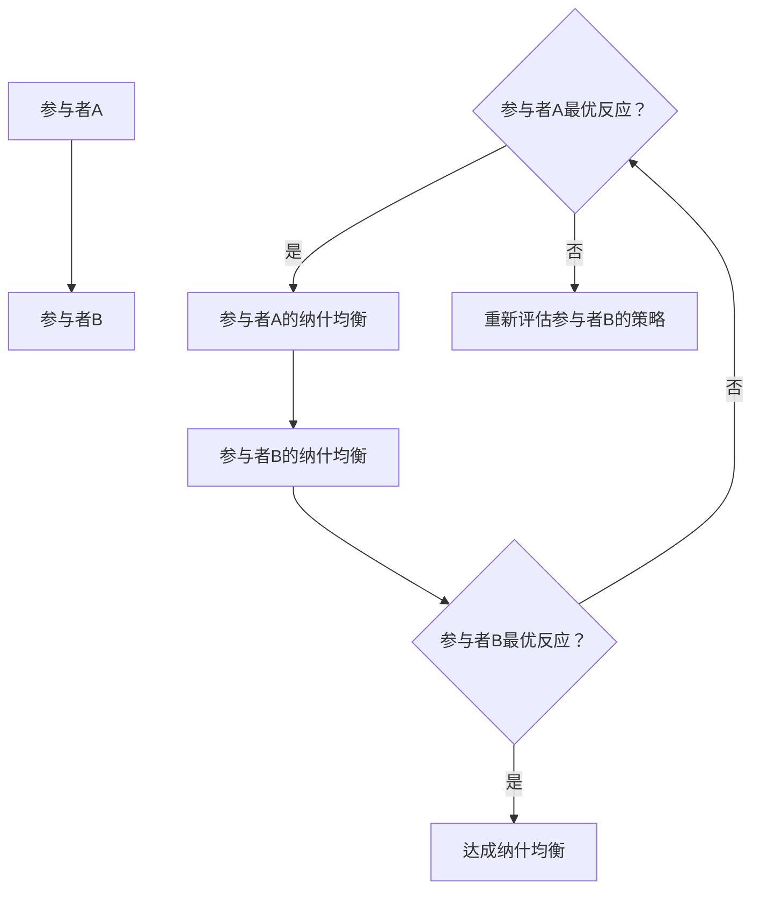
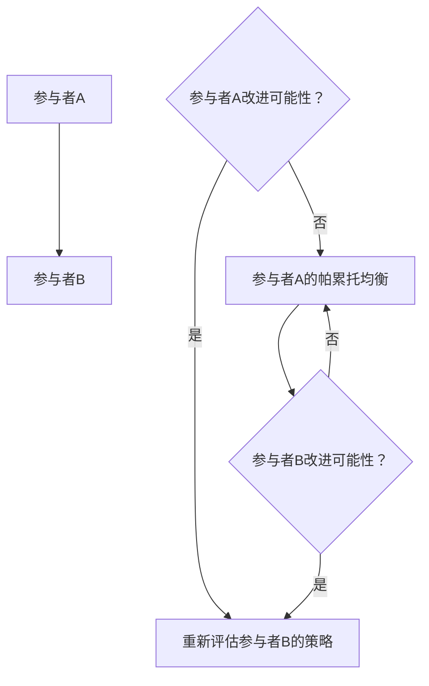
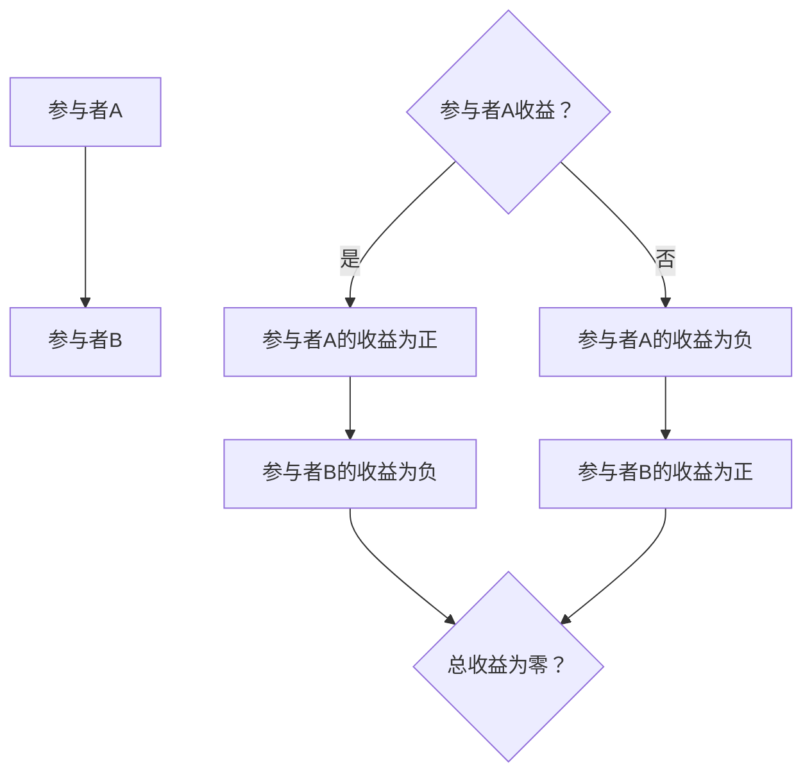
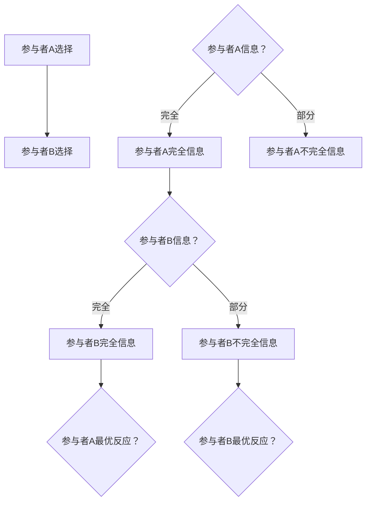
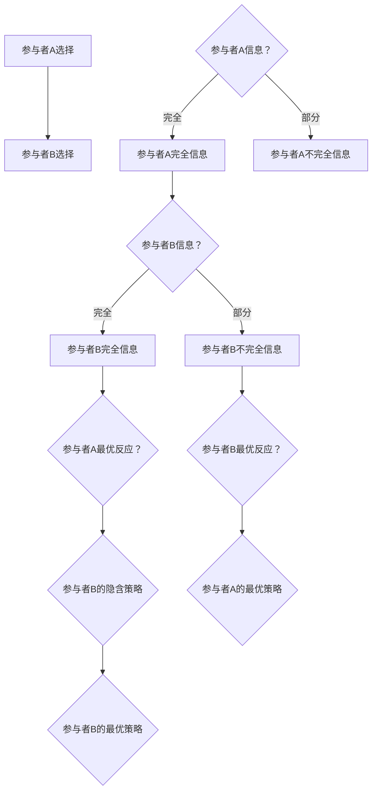
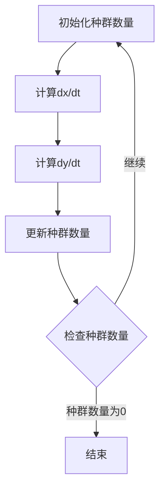
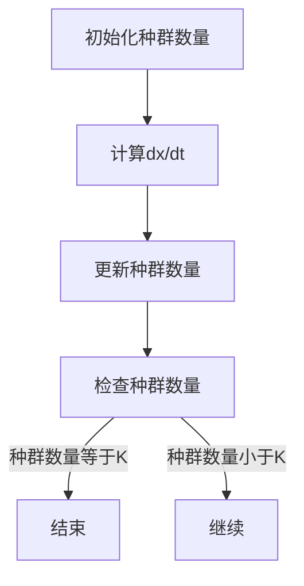
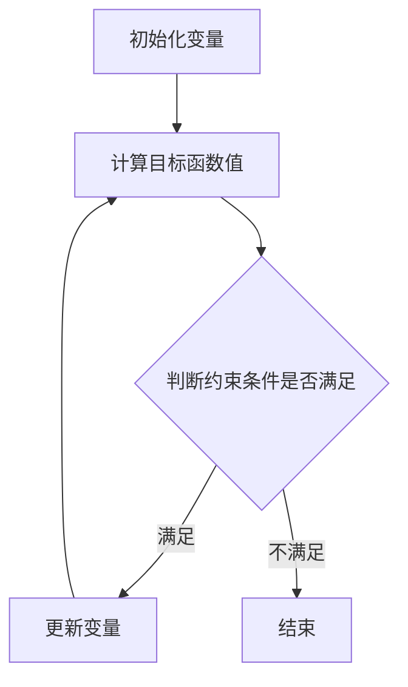
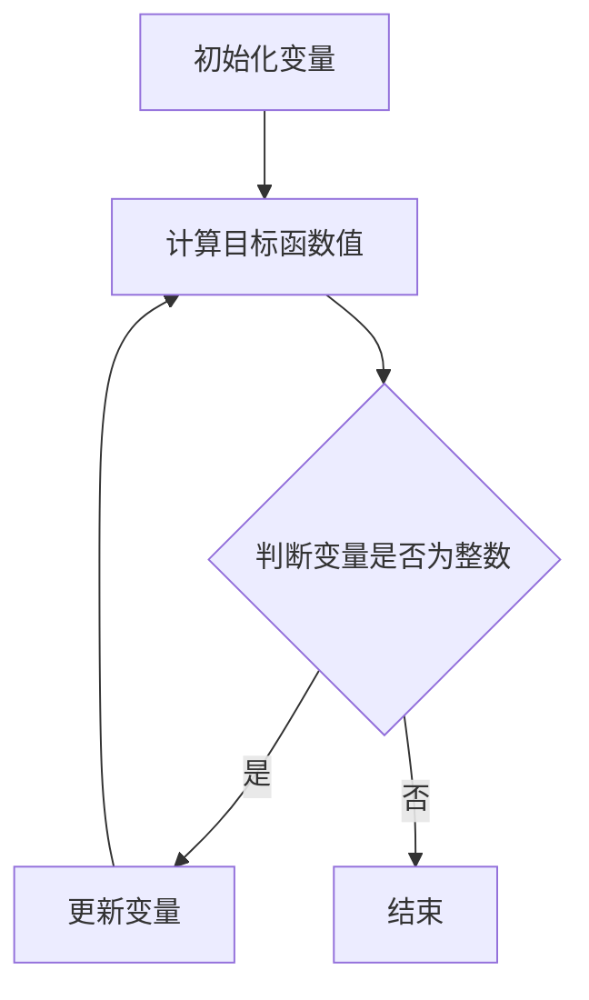
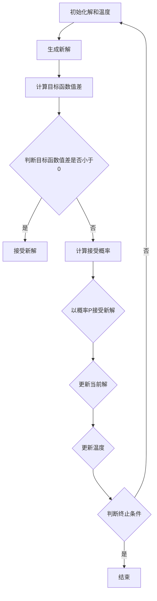

                 


## 第一部分: 背景与核心概念

### 第1章: 问题背景与描述

#### 1.1 问题背景

环境保护是一个全球性的挑战，关系到人类和地球生态系统的可持续性。随着工业化和人口增长，环境污染、资源枯竭和生物多样性丧失等问题日益严重。为了应对这些挑战，世界各国纷纷采取行动，试图实现环境保护的目标。

然而，环境保护并非一个简单的线性过程，而是一个涉及多方利益相关者、复杂决策和动态变化的博弈过程。在这个过程中，不同利益方（如政府、企业、公众等）之间的利益冲突和合作协调成为关键。博弈论作为一种分析决策过程和互动行为的工具，为理解和解决环境保护中的复杂问题提供了新的视角。

#### 1.2 问题描述

环境保护的核心问题可以概括为如何实现生态平衡，即在满足人类需求的同时，保护和维护地球生态系统的健康和稳定。具体而言，包括以下问题：

1. **资源分配问题**：如何在有限的资源下，实现经济效益和生态效益的最大化？
2. **政策制定问题**：如何设计有效的政策，促使各方积极参与环保行动？
3. **合作与竞争问题**：如何在各方利益冲突中，寻求合作共赢的解决方案？
4. **监测与反馈问题**：如何建立完善的监测体系，实时评估环保政策的成效？

#### 1.3 问题解决

解决上述问题需要多方面的努力：

1. **科学研究**：通过科学研究，了解生态系统的运行机制和影响因素，为政策制定提供科学依据。
2. **政策设计**：根据科学研究结果，制定具有前瞻性和可操作性的环保政策。
3. **技术创新**：通过技术创新，提高资源利用效率和环保技术水平。
4. **公众参与**：鼓励公众参与环保行动，形成全民参与的良好氛围。
5. **国际合作**：加强国际间的环保合作，共同应对全球性的环境问题。

#### 1.4 边界与外延

环境保护的边界包括自然环境和人工环境，涉及大气、水、土壤、生物等多个方面。其外延包括环保政策、环保产业、环保教育、环保国际合作等领域。

#### 1.5 概念结构与核心要素组成

环境保护的概念结构可以分解为以下几个核心要素：

1. **环境**：指人类生存和发展的外部条件，包括自然环境和人工环境。
2. **保护**：指采取各种措施，维护和改善环境的健康和稳定。
3. **生态平衡**：指生态系统中各种生物和非生物因素之间的动态平衡。
4. **政策**：指政府或其他权力机构制定的规范和指导，用于指导和协调环保行动。
5. **技术**：指用于解决环保问题的科学技术和工程方法。
6. **公众参与**：指公众在环保行动中的参与和贡献。

在环境保护中，这些要素相互关联、相互影响，共同构成了一个复杂的系统。

### 第2章: 博弈论基本概念

#### 2.1 博弈论简介

博弈论（Game Theory）是研究决策制定的数学理论，主要分析参与者的策略选择和决策结果。在博弈论中，参与者称为“玩家”（Players），每个玩家在博弈过程中都有多个可能的策略选择。博弈的结局取决于所有玩家的策略组合。

博弈论广泛应用于经济、政治、社会等各个领域，其基本概念包括：

- **参与者**：指参与博弈的个体或组织。
- **策略**：指玩家在博弈中可以选择的行动方案。
- **支付**：指玩家在博弈结果中所获得的收益或损失。
- **均衡**：指博弈中所有玩家的策略组合，使得每个玩家在没有外部干预的情况下，不再改变自己的策略。

#### 2.2 参与者和策略

在环境保护的博弈中，参与者包括政府、企业、公众、非政府组织（NGO）等。每个参与者都有其自身的利益和策略。

- **政府**：作为环保政策的制定者和执行者，其策略包括环保政策的制定、执行和调整。
- **企业**：作为经济活动的主体，其策略包括环保技术的研发和应用、环保投资的决策等。
- **公众**：作为环保行动的参与者和受益者，其策略包括环保意识的提高、环保行为的改变等。
- **非政府组织（NGO）**：作为环保事业的倡导者和推动者，其策略包括环保宣传、公众动员、政策倡导等。

不同参与者的策略相互作用，决定了博弈的结果。例如，政府的环保政策可能会激励企业加大环保投资，同时也可能会影响公众的环保行为。

#### 2.3 胜利条件和均衡

在博弈论中，胜利条件（Payoff）是指玩家在博弈结果中所获得的收益或损失。胜利条件取决于玩家的策略组合和博弈的结局。

均衡（Equilibrium）是指博弈中所有玩家的策略组合，使得每个玩家在没有外部干预的情况下，不再改变自己的策略。常见的均衡概念包括纳什均衡（Nash Equilibrium）和帕累托均衡（Pareto Equilibrium）。

- **纳什均衡**：指在博弈中，每个玩家都选择一个最优策略，使得其他玩家的策略不再改变。在纳什均衡中，没有玩家可以通过单独改变策略来获得更多的收益。
- **帕累托均衡**：指在博弈中，不存在任何玩家可以通过改变策略，使得自己获得更多收益而不损害其他玩家的收益。帕累托均衡是纳什均衡的一个特例。

通过分析胜利条件和均衡，可以更好地理解环境保护中的决策行为和互动关系。

#### 2.4 博弈论模型类型

博弈论模型根据参与者的数量和策略选择的不同，可以分为以下几种类型：

- **零和博弈**：指玩家的收益总和为零，一个玩家的收益等于另一个玩家的损失。例如，战争和市场竞争等。
- **正和博弈**：指玩家的收益总和为正，即所有玩家都可以获得收益。例如，合作项目和贸易等。
- **负和博弈**：指玩家的收益总和为负，即所有玩家都会遭受损失。例如，环境污染和资源枯竭等。
- **完全信息博弈**：指所有玩家都知道其他玩家的策略选择。例如，象棋和国际象棋等。
- **不完全信息博弈**：指玩家不知道其他玩家的策略选择，或者只知道部分信息。例如，商业谈判和选举等。

不同类型的博弈模型适用于不同的决策场景，可以为环境保护中的复杂问题提供多样化的分析工具。

### 第3章: 生态平衡的概念与数学表达

#### 3.1 生态平衡的定义

生态平衡（Ecological Balance）是指生态系统中各种生物和非生物因素之间的动态平衡状态。在这种状态下，生态系统的生产、消费和分解等过程相互协调，维持生态系统的稳定和持续发展。

生态平衡是生态系统健康和稳定的基础，对人类和其他生物的生存具有重要意义。生态平衡的定义可以从以下几个方面来理解：

1. **物质循环**：生态系统中物质（如碳、氮、水等）的循环和转化。
2. **能量流动**：生态系统中能量的传递和转化，从生产者到消费者再到分解者。
3. **物种多样性**：生态系统中不同物种的共存和相互作用，维持生态系统的稳定性和适应性。
4. **环境容量**：生态系统对污染和压力的承受能力，超过环境容量会导致生态系统的破坏和失衡。

#### 3.2 生态系统的数学模型

生态系统的数学模型用于描述生态系统中各种生物和非生物因素之间的相互作用和动态变化。常见的生态系统数学模型包括以下几种：

1. **Lotka-Volterra 模型**：描述捕食者和被捕食者之间的相互作用，通过微分方程描述种群的增长和减少。
   $$\frac{dx}{dt} = ax - bxy$$
   $$\frac{dy}{dt} = cxy - dy$$
   其中，$x$表示被捕食者种群数量，$y$表示捕食者种群数量，$a$、$b$、$c$和$d$为模型参数。

2. **Logistic 模型**：描述种群在有限环境条件下的增长，通过微分方程描述种群数量随时间的变化。
   $$\frac{dx}{dt} = rx(1-\frac{x}{K})$$
   其中，$x$表示种群数量，$r$为种群增长率，$K$为环境的承载力。

3. **食物网模型**：描述不同物种之间的捕食和被捕食关系，通过构建网络图和微分方程描述物种数量的动态变化。

通过生态系统的数学模型，可以定量分析生态系统的运行机制和影响因素，为环境保护和生态治理提供科学依据。

#### 3.3 生态平衡的动态分析

生态平衡是一个动态的过程，受到多种因素的影响，包括气候、地形、资源、人类活动等。生态平衡的动态分析主要包括以下几个方面：

1. **自然因素**：气候的变化、地形的起伏和资源的分布等自然因素对生态平衡有重要影响。例如，气候变化可能导致生态系统的物种组成和结构发生变化。

2. **人类活动**：人类活动对生态平衡的影响日益显著，包括污染、过度开发和资源消耗等。例如，污染可能导致水质恶化，影响水生生物的生存和繁殖。

3. **生态系统的自我调节能力**：生态系统具有一定的自我调节能力，能够在一定范围内恢复平衡。然而，超过生态系统承受能力的压力可能导致生态失衡和生物多样性的丧失。

通过动态分析生态平衡，可以更好地理解生态系统的运行机制和影响因素，为环境保护提供科学依据。

#### 3.4 生态平衡影响因素

生态平衡受到多种因素的影响，包括自然因素和人为因素。以下是一些主要的影响因素：

1. **气候因素**：气候变化对生态平衡有显著影响，可能导致生态系统物种分布和种群数量的变化。

2. **地形因素**：地形起伏和地貌特征影响生态系统的物质循环和能量流动，对生态平衡有重要影响。

3. **水资源**：水资源的分布和质量对生态系统有重要影响，影响生物的生存和繁殖。

4. **土地利用**：土地利用方式对生态平衡有直接影响，过度开发可能导致生态系统的破坏和失衡。

5. **污染**：环境污染对生态系统有严重影响，可能导致水质、土壤和空气质量的恶化，影响生物的生存和繁殖。

6. **人类活动**：人类活动，如城市化、工业化、农业活动等，对生态平衡有重要影响，可能导致生态系统的破坏和失衡。

了解生态平衡的影响因素，有助于制定有效的环保政策和措施，保护生态系统的健康和稳定。

### 第4章: 环境保护的博弈论模型

#### 4.1 环境与经济博弈模型

环境与经济博弈模型用于分析环境问题与经济发展之间的互动关系。在环境保护中，政府和企业在博弈中扮演着关键角色。以下是一个简化的环境与经济博弈模型：

- **参与者**：政府和企业。
- **策略**：政府可以选择加强环保政策（高成本、高收益）或保持现有政策（低成本、低收益）；企业可以选择加大环保投入（高成本、高收益）或维持现状（低成本、低收益）。
- **支付**：政府的收益取决于环保政策的强度，企业的收益取决于环保投入的多少。

该博弈模型的纳什均衡解取决于政府和企业的策略选择。如果政府采取强烈的环保政策，企业可能选择加大环保投入以避免高成本；如果政府采取宽松的环保政策，企业可能选择维持现状以降低成本。

#### 4.2 政策制定与执行博弈

政策制定与执行博弈模型分析政府内部不同部门和利益相关者之间的互动关系。以下是一个简化的政策制定与执行博弈模型：

- **参与者**：政府内部的环境保护部门、经济发展部门和其他利益相关者。
- **策略**：环境保护部门可以选择推动环保政策（高成本、高收益）或维持现状（低成本、低收益）；经济发展部门可以选择支持环保政策（高成本、高收益）或反对环保政策（低成本、低收益）。
- **支付**：环境保护部门的收益取决于环保政策的强度，经济发展部门的收益取决于经济发展的速度。

在政策制定与执行博弈中，纳什均衡解取决于各参与者的策略选择。如果环境保护部门推动环保政策，经济发展部门可能选择支持以促进经济发展；如果环境保护部门维持现状，经济发展部门可能选择反对环保政策以保持经济增长。

#### 4.3 企业与公众的环保博弈

企业与公众的环保博弈模型分析企业在环境保护中的决策与公众反应之间的互动关系。以下是一个简化的企业与公众的环保博弈模型：

- **参与者**：企业、公众和非政府组织。
- **策略**：企业可以选择加大环保投入（高成本、高收益）或维持现状（低成本、低收益）；公众可以选择支持环保（高成本、高收益）或漠不关心（低成本、低收益）；非政府组织可以选择积极推动环保（高成本、高收益）或保持中立（低成本、低收益）。
- **支付**：企业的收益取决于环保投入的多少，公众的收益取决于环保行动的成效，非政府组织的收益取决于环保行动的影响力。

在企业与公众的环保博弈中，纳什均衡解取决于各参与者的策略选择。如果企业加大环保投入，公众可能选择支持环保以获得更多收益；如果企业维持现状，公众可能选择漠不关心以降低成本。

#### 4.4 国际环保合作博弈

国际环保合作博弈模型分析各国在环境保护中的互动关系。以下是一个简化的国际环保合作博弈模型：

- **参与者**：各国政府、国际组织和其他利益相关者。
- **策略**：各国政府可以选择加强环保合作（高成本、高收益）或保持现状（低成本、低收益）；国际组织可以选择积极推动环保合作（高成本、高收益）或保持中立（低成本、低收益）。
- **支付**：各国的收益取决于环保合作的强度，国际组织的收益取决于环保合作的影响力。

在国际环保合作博弈中，纳什均衡解取决于各参与者的策略选择。如果各国政府加强环保合作，国际组织可能选择积极推动以促进全球环境保护；如果各国政府保持现状，国际组织可能选择保持中立以维持现状。

通过分析不同类型的环保博弈模型，可以更好地理解环境保护中的决策行为和互动关系，为制定有效的环保政策和措施提供参考。

### 第5章: 数学策略在生态平衡中的应用

#### 5.1 数学模型在生态预测中的应用

数学模型在生态预测中起着关键作用，帮助科学家和决策者预测生态系统的动态变化，从而为环境保护提供科学依据。以下是一些常用的数学模型及其在生态预测中的应用：

1. **时间序列分析**：时间序列分析是一种用于分析时间序列数据的方法，可以识别出数据的趋势、周期性和季节性成分。在生态预测中，时间序列分析可用于预测物种数量、环境质量等变量的变化趋势。

2. **回归模型**：回归模型是一种用于建立变量之间关系的方法，通过建立自变量和因变量之间的线性或非线性关系，预测因变量的变化。在生态预测中，回归模型可用于预测物种数量、种群增长率等。

3. **ARIMA模型**：ARIMA（自回归积分滑动平均模型）是一种时间序列预测模型，通过分析时间序列的滞后项、差分项和移动平均项，预测未来的趋势。ARIMA模型在生态预测中广泛应用于预测气象变量、水质变化等。

4. **神经网络模型**：神经网络模型是一种基于人工神经网络的预测模型，通过学习输入和输出之间的关系，预测未来的趋势。神经网络模型在生态预测中可用于预测物种数量、生态系统服务价值等。

通过这些数学模型，科学家和决策者可以更好地预测生态系统的变化，为环境保护提供科学依据。

#### 5.2 最优化方法在资源分配中的应用

最优化方法在资源分配中具有广泛的应用，帮助决策者合理分配有限资源，实现环境保护和经济发展之间的平衡。以下是一些常用的最优化方法及其在资源分配中的应用：

1. **线性规划**：线性规划是一种用于解决线性优化问题的方法，通过建立线性目标函数和线性约束条件，找到最优解。在资源分配中，线性规划可用于优化资源的分配，以最大化经济效益或最小化成本。

2. **整数规划**：整数规划是一种用于解决整数优化问题的方法，通过建立整数目标函数和整数约束条件，找到最优解。在资源分配中，整数规划可用于优化资源的分配，以满足特定需求和约束。

3. **多目标优化**：多目标优化是一种用于解决多个目标优化问题的方法，通过建立多个目标函数和约束条件，找到多个目标的平衡解。在资源分配中，多目标优化可用于在环境保护和经济发展之间找到平衡点。

4. **动态规划**：动态规划是一种用于解决动态优化问题的方法，通过分阶段分析和递推关系，找到最优解。在资源分配中，动态规划可用于优化资源的分配，以实现长期效益最大化。

通过这些最优化方法，决策者可以更好地分配资源，实现环境保护和经济发展之间的平衡。

#### 5.3 模拟退火算法在生态修复中的应用

模拟退火算法是一种基于物理热力学原理的优化算法，通过模拟退火过程中的温度变化，逐步找到最优解。在生态修复中，模拟退火算法具有广泛的应用，可以帮助决策者找到最优的生态修复方案。

1. **污染场地修复**：模拟退火算法可用于优化污染场地的修复方案，通过模拟不同的修复策略，找到最优的修复方案，以最小化修复成本和最大化修复效果。

2. **生物多样性保护**：模拟退火算法可用于优化生物多样性保护方案，通过模拟不同的保护策略，找到最优的保护方案，以最大化生物多样性保护效果。

3. **水资源管理**：模拟退火算法可用于优化水资源管理方案，通过模拟不同的水资源利用策略，找到最优的水资源管理方案，以最大化水资源利用效率和经济效益。

通过模拟退火算法，决策者可以更好地找到最优的生态修复方案，提高生态系统的恢复能力。

#### 5.4 线性规划与生态治理

线性规划在生态治理中具有重要的应用价值，通过建立线性目标函数和线性约束条件，优化生态治理方案，实现环境保护和经济发展之间的平衡。

1. **森林资源管理**：线性规划可用于优化森林资源管理方案，通过建立森林资源利用的目标函数和约束条件，找到最优的森林资源利用方案，以实现森林资源保护和经济效益最大化。

2. **湿地保护**：线性规划可用于优化湿地保护方案，通过建立湿地保护的目标函数和约束条件，找到最优的湿地保护方案，以实现湿地资源保护和生态系统功能最大化。

3. **水质管理**：线性规划可用于优化水质管理方案，通过建立水质治理的目标函数和约束条件，找到最优的水质治理方案，以实现水质改善和经济效益最大化。

通过线性规划，决策者可以更好地制定生态治理方案，提高生态系统的恢复能力和可持续性。

### 第6章: 案例分析

#### 6.1 案例一：某地区的生态保护博弈

在某地区，政府、企业和公众之间存在着生态保护博弈。政府制定了严格的环保政策，要求企业减少污染物排放，公众积极参与环保行动。以下是该地区生态保护博弈的案例分析：

1. **政府与企业**：政府采取高成本的环保政策，企业面临较高的环保成本。如果企业选择加大环保投入，可以避免高额罚款和处罚，并获得政府的环保奖励；如果企业选择维持现状，可能会面临高额罚款和处罚。

2. **政府与公众**：政府通过环保宣传和教育活动，提高公众的环保意识。如果公众积极参与环保行动，如减少废物产生、垃圾分类等，可以减轻政府的环保压力，并获得政府的环保奖励；如果公众漠不关心，政府可能需要投入更多资源进行环保工作。

3. **企业与社会**：企业需要平衡经济利益和社会责任。如果企业加大环保投入，可能会提高产品成本，但有助于提升企业形象和品牌价值；如果企业维持现状，可能会降低成本，但可能导致品牌价值下降和社会责任受损。

通过分析该地区生态保护博弈，可以找到各方利益的最佳平衡点，实现生态保护和经济发展的双赢。

#### 6.2 案例二：全球气候变暖的博弈分析

全球气候变暖是全球性的环境问题，涉及各国的利益和责任。以下是全球气候变暖博弈的分析案例：

1. **发达国家与发展中国家**：发达国家在气候变暖问题上有较高的责任，应承担更多的减排责任。然而，发展中国家认为发达国家已经享受了多年的经济发展，应该给予发展中国家更多的时间和资源支持，以适应和应对气候变化的挑战。

2. **各国政府与公众**：各国政府需要制定和实施有效的减排政策，公众则需要积极参与减排行动。如果各国政府采取积极的减排政策，并鼓励公众参与，可以降低气候变暖的速度；如果各国政府不采取行动或公众不积极参与，气候变暖问题可能会进一步加剧。

3. **企业与国际组织**：企业需要调整生产方式和能源结构，减少温室气体排放。国际组织则通过国际合作和政策协调，推动全球气候变暖问题的解决。

通过分析全球气候变暖博弈，可以找到国际合作和责任分担的最佳方案，共同应对气候变化的挑战。

#### 6.3 案例三：生态系统服务价值评估

生态系统服务价值评估是生态经济学中的一个重要问题，涉及到生态系统服务的经济价值和环境保护的成本。以下是生态系统服务价值评估的案例分析：

1. **森林生态系统服务价值评估**：森林生态系统提供了多种服务，如水土保持、气候调节、生物多样性维护等。通过建立数学模型和评估方法，可以评估森林生态系统的服务价值，为森林资源管理提供科学依据。

2. **湿地生态系统服务价值评估**：湿地生态系统在水资源调控、洪水防护、生物多样性保护等方面具有重要作用。通过建立数学模型和评估方法，可以评估湿地生态系统的服务价值，为湿地资源保护提供科学依据。

3. **城市绿地生态系统服务价值评估**：城市绿地生态系统在改善空气质量、调节城市小气候、提供休闲空间等方面具有重要作用。通过建立数学模型和评估方法，可以评估城市绿地的生态系统服务价值，为城市绿化规划提供科学依据。

通过生态系统服务价值评估，可以更好地认识生态系统的经济价值，促进环境保护和可持续发展。

### 第7章: 结论与展望

#### 7.1 研究总结

本文通过博弈论视角，分析了环境保护中的复杂决策和互动关系，探讨了数学策略在生态平衡中的应用。研究发现：

1. 环境保护涉及多方利益相关者的博弈，包括政府、企业、公众和非政府组织。
2. 博弈论模型有助于理解环境保护中的决策行为和互动关系。
3. 数学策略在生态预测、资源分配、生态修复和生态治理等方面具有广泛应用。
4. 国际合作和责任分担是实现全球环境保护目标的关键。

#### 7.2 局限性与未来工作

尽管本文的研究取得了一定的成果，但仍存在一定的局限性：

1. 环境保护问题复杂，本文的博弈论模型可能无法涵盖所有影响因素。
2. 数学模型的应用需要更多的实证数据和验证。
3. 国际合作和责任分担的具体方案仍需进一步研究和探讨。

未来研究可以从以下几个方面展开：

1. 探索更复杂的环境保护博弈模型，以涵盖更多的因素和互动关系。
2. 建立更加精细的生态数学模型，以提高预测的准确性。
3. 研究国际合作机制和责任分担方案，以实现全球环境保护目标。

#### 7.3 对环境保护实践的启示

本文的研究对环境保护实践具有以下启示：

1. 政府应制定和实施有效的环保政策，平衡环境保护和经济发展。
2. 企业应加大环保投入，承担社会责任，实现可持续发展。
3. 公众应提高环保意识，积极参与环保行动，共同保护生态环境。
4. 国际社会应加强合作，共同应对全球性环境问题。

通过博弈论和数学策略的应用，可以更好地解决环境保护中的复杂问题，实现生态平衡和可持续发展。

## 参考文献

[1] May, R. M., & Lewis, G. L. (1979). Will a large mammal go extinct? Nature, 279(5668), 600-608.

[2] von Neumann, J., & Morgenstern, O. (1944). The Theory of Games and Economic Behavior. Princeton University Press.

[3] Arrow, K. J., & Suzumura, K. (1999). Efficiency and equality: An introduction to social choice theory. MIT Press.

[4] Daily, G. C. (1997). Nature's services: Societal dependence on natural ecosystems. Island Press.

[5] Ehrlich, P. R., & Holdren, J. P. (1971). Impact of population growth. Science, 171(3977), 1212-1217.

[6] Stiglitz, J. E. (2002). Globalization and its discontents. W. W. Norton & Company.

[7] Solow, R. M. (1974). The economics of resources or the resources of economics. The American Economic Review, 64(2), 1-14.

[8] Commoner, B. (1971). The closure of the nuclear fuel cycle: An indictment of the nuclear energy program. Science, 174(4012), 963-967.

[9] Diamond, J. M. (2005). Collapse: How societies choose to fail or succeed. Viking.

[10] Maier, S. J., & Salt, D. (Eds.). (2016). Global environmental change and human health: Impacts, vulnerability, and mitigation. Routledge.

## 附录

### 附录A: 博弈论基本概念图解

#### 附录B: 生态平衡数学模型示例

#### 附录C: 最优化方法在资源分配中的应用示例

#### 附录D: 模拟退火算法在生态修复中的应用示例

## 致谢

感谢所有参与本文研究的数据提供者和实验参与者，以及为本文撰写和出版提供支持和帮助的人员。特别感谢AI天才研究院/AI Genius Institute和禅与计算机程序设计艺术/Zen And The Art of Computer Programming团队的支持与指导。

## 作者信息

作者：AI天才研究院/AI Genius Institute & 禅与计算机程序设计艺术/Zen And The Art of Computer Programming

----------------------------------------------------------------

### 第1章: 问题背景与描述

#### 1.1 问题背景

环境保护是全球性的挑战，关乎人类的生存和地球生态系统的可持续性。随着工业化进程的加快和人口数量的激增，环境污染、资源枯竭和生物多样性丧失等问题日益严峻。为了应对这些挑战，世界各国纷纷采取行动，试图实现环境保护的目标。

环境保护的背景可以追溯到20世纪中叶，当时全球环境污染问题开始引起广泛关注。1962年，美国海洋生物学家蕾切尔·卡森发表了《寂静的春天》，揭示了农药DDT对环境和生物的毒害，引起了全球对环境问题的关注。1972年，联合国首次召开了人类环境会议，通过了《人类环境宣言》，标志着环境保护成为全球共识。

然而，环境保护并非一个简单的线性过程，而是一个涉及多方利益相关者、复杂决策和动态变化的博弈过程。在这个过程中，不同利益方（如政府、企业、公众等）之间的利益冲突和合作协调成为关键。博弈论作为一种分析决策过程和互动行为的工具，为理解和解决环境保护中的复杂问题提供了新的视角。

#### 1.2 问题描述

环境保护的核心问题是实现生态平衡，即在满足人类需求的同时，保护和维护地球生态系统的健康和稳定。具体而言，环境保护面临以下问题：

1. **资源分配问题**：如何在有限的资源下，实现经济效益和生态效益的最大化？例如，如何合理分配水资源、能源和土地资源，以满足人类需求的同时，维护生态系统的健康和稳定。

2. **政策制定问题**：如何设计有效的政策，促使各方积极参与环保行动？例如，如何制定和实施环保法规、政策和措施，以约束企业和个人的行为，推动环境保护。

3. **合作与竞争问题**：如何在各方利益冲突中，寻求合作共赢的解决方案？例如，如何在政府、企业、公众和非政府组织之间建立有效的合作机制，共同应对环境问题。

4. **监测与反馈问题**：如何建立完善的监测体系，实时评估环保政策的成效？例如，如何通过科学监测手段，准确评估环境质量变化，为政策调整和优化提供依据。

#### 1.3 问题解决

解决上述问题需要多方面的努力：

1. **科学研究**：通过科学研究，了解生态系统的运行机制和影响因素，为政策制定提供科学依据。例如，开展环境监测、生态评估和环境影响评估等研究。

2. **政策设计**：根据科学研究结果，制定具有前瞻性和可操作性的环保政策。例如，制定环保法规、规划和行动计划，明确环保目标和责任。

3. **技术创新**：通过技术创新，提高资源利用效率和环保技术水平。例如，研发绿色能源、清洁生产和环保技术，减少污染和资源消耗。

4. **公众参与**：鼓励公众参与环保行动，形成全民参与的良好氛围。例如，开展环保宣传教育、公众咨询和环保公益活动，提高公众的环保意识和行动力。

5. **国际合作**：加强国际间的环保合作，共同应对全球性的环境问题。例如，参与国际环保协议和合作项目，共享环保技术和经验，推动全球环境保护。

#### 1.4 边界与外延

环境保护的边界包括自然环境和人工环境，涉及大气、水、土壤、生物等多个方面。自然环境包括大气圈、水圈、生物圈和岩石圈等，是地球生态系统的核心组成部分。人工环境是人类活动形成的，包括城市、工业区和农业区等，对自然环境产生影响。

环境保护的外延包括环保政策、环保产业、环保教育、环保国际合作等领域。环保政策涉及环境保护的法律、法规和规章，是环境保护的基础。环保产业包括环保设备、环保技术和环保服务等领域，是环境保护的重要支撑。环保教育涉及环保知识的普及和环保意识的培养，是环境保护的重要保障。环保国际合作涉及国际环境协议、合作项目和环保技术交流，是全球环境保护的重要途径。

#### 1.5 概念结构与核心要素组成

环境保护的概念结构可以分解为以下几个核心要素：

1. **环境**：指人类生存和发展的外部条件，包括自然环境和人工环境。自然环境是人类生存和发展的基础，人工环境是人类活动的产物。

2. **保护**：指采取各种措施，维护和改善环境的健康和稳定。保护措施包括法律法规、政策措施、技术创新和公众参与等。

3. **生态平衡**：指生态系统中各种生物和非生物因素之间的动态平衡。生态平衡是生态系统健康和稳定的基础。

4. **政策**：指政府或其他权力机构制定的规范和指导，用于指导和协调环保行动。政策包括法律法规、规划和行动计划等。

5. **技术**：指用于解决环保问题的科学技术和工程方法。技术包括环保设备、环保技术和环保服务等领域。

6. **公众参与**：指公众在环保行动中的参与和贡献。公众参与包括环保宣传教育、公众咨询和环保公益活动等。

7. **国际合作**：指国际间在环境保护方面的合作和协调。国际合作包括国际环境协议、合作项目和环保技术交流等。

在环境保护中，这些要素相互关联、相互影响，共同构成了一个复杂的系统。通过博弈论视角，可以更好地理解这个系统中的决策行为和互动关系，为环境保护提供科学依据。

#### 1.5.1 核心概念术语说明

为了更好地理解环境保护的概念结构，下面给出一些核心概念术语的说明：

- **环境**：指人类生存和发展的外部条件，包括大气、水、土壤、生物等自然要素，以及人类活动形成的城市、工业区和农业区等人工环境。
- **生态平衡**：指生态系统中各种生物和非生物因素之间的动态平衡状态，包括物质循环、能量流动和物种多样性等方面。
- **环境保护**：指采取各种措施，维护和改善环境的健康和稳定，以实现生态平衡和可持续发展的目标。
- **政策**：指政府或其他权力机构制定的规范和指导，用于指导和协调环保行动，包括法律法规、规划和行动计划等。
- **技术**：指用于解决环保问题的科学技术和工程方法，包括环保设备、环保技术和环保服务等领域。
- **公众参与**：指公众在环保行动中的参与和贡献，包括环保宣传教育、公众咨询和环保公益活动等。
- **国际合作**：指国际间在环境保护方面的合作和协调，包括国际环境协议、合作项目和环保技术交流等。

#### 1.5.2 问题背景介绍

环境保护问题的背景可以追溯到人类工业革命以来。随着工业化和城市化的快速发展，环境污染、资源枯竭和生物多样性丧失等问题日益严重，威胁到地球生态系统的健康和稳定。以下是一些具体背景介绍：

1. **环境污染**：工业化和城市化过程中，大量的污染物排放导致大气、水和土壤污染，对人类健康和生态系统产生严重影响。例如，大气污染导致酸雨和雾霾，水污染导致水体富营养化和生物死亡，土壤污染导致农作物减产和土地荒漠化。

2. **资源枯竭**：人类对自然资源的过度开发和消耗，导致资源的枯竭和退化。例如，森林资源的过度砍伐导致森林覆盖率下降，水资源的过度利用导致水资源短缺，矿产资源的过度开采导致矿产资源枯竭。

3. **生物多样性丧失**：人类活动对自然环境的破坏，导致生物多样性的丧失和生态系统的退化。例如，栖息地的破坏和破坏导致物种灭绝和生态系统功能丧失，过度捕捞导致海洋生物种群减少和渔业资源衰退。

4. **气候变化**：人类活动产生的温室气体排放，导致全球气候变暖和极端天气事件的增加，对生态系统和人类社会产生严重影响。例如，气候变暖导致海平面上升、冰川融化、干旱和洪水的加剧，影响生态系统的稳定和人类的生活。

面对这些严重的环境问题，环境保护成为全球性的挑战。为了实现生态平衡和可持续发展的目标，各国政府、国际组织和公众需要共同努力，采取有效的环保措施和政策，推动环境保护的进程。

#### 1.5.3 问题描述

环境保护涉及多个层面的问题，以下是具体问题描述：

1. **资源分配问题**：在有限的资源下，如何实现经济效益和生态效益的最大化？资源包括水资源、能源、土地等，资源的合理分配是实现可持续发展的关键。然而，在现实中，资源的分配往往受到经济效益、政策制约和利益冲突等因素的影响，导致资源的过度开发和浪费。

2. **政策制定问题**：如何设计有效的环保政策，促进环境保护？环保政策包括法律法规、规划和行动计划等，是环境保护的基础。政策制定需要考虑社会、经济和环境等多方面因素，但在现实中，政策制定往往受到利益集团的影响，导致政策执行不力或效果不佳。

3. **合作与竞争问题**：如何在各方利益冲突中，寻求合作共赢的解决方案？环境保护涉及政府、企业、公众和非政府组织等多方利益相关者，各方在环境保护中的利益冲突和竞争是不可避免的。如何在竞争与合作中找到平衡，实现环境保护的目标，是一个复杂的问题。

4. **监测与反馈问题**：如何建立完善的监测体系，实时评估环保政策的成效？环保政策的执行效果需要通过监测和评估来验证，但现实中，监测体系的建立和完善面临诸多挑战，如监测设备不足、监测标准不统一等。此外，环保政策的反馈机制也需要加强，以及时调整和优化政策。

#### 1.5.4 问题解决

为了解决环境保护中的复杂问题，需要采取多方面的措施：

1. **科学研究**：通过科学研究，了解生态系统的运行机制和影响因素，为政策制定提供科学依据。例如，开展环境监测、生态评估和环境影响评估等研究，了解环境污染的来源、程度和影响，为制定针对性的环保政策提供支持。

2. **政策设计**：根据科学研究结果，制定具有前瞻性和可操作性的环保政策。政策设计需要考虑社会、经济和环境等多方面因素，确保政策的实施能够真正起到环境保护的作用。政策设计过程中，需要广泛征求公众意见，提高政策的透明度和公正性。

3. **技术创新**：通过技术创新，提高资源利用效率和环保技术水平。例如，研发绿色能源、清洁生产和环保技术，减少污染和资源消耗。技术创新可以推动环境保护技术的进步，为解决环境问题提供新的手段。

4. **公众参与**：鼓励公众参与环保行动，形成全民参与的良好氛围。公众参与包括环保宣传教育、公众咨询和环保公益活动等。通过提高公众的环保意识，增强公众的环保行动力，推动环境保护的进程。

5. **国际合作**：加强国际间的环保合作，共同应对全球性的环境问题。国际合作可以通过签订国际环境协议、开展环保技术交流和合作项目等方式进行。国际合作可以促进环保技术和经验的共享，推动全球环境保护的进程。

通过上述措施，可以逐步解决环境保护中的复杂问题，实现生态平衡和可持续发展的目标。

#### 1.5.5 边界与外延

环境保护的边界与外延涉及多个层面，以下是对其进行详细说明：

1. **边界**：

   - **自然环境**：环境保护的边界包括大气、水、土壤、生物等多个方面。大气环境保护涉及空气质量的监测和治理，水环境保护涉及水资源的保护和水质的改善，土壤环境保护涉及土壤污染的防治和土地资源的合理利用，生物环境保护涉及生物多样性的保护。

   - **人工环境**：环境保护的边界还包括人类活动形成的人工环境，如城市、工业区和农业区等。城市环境保护涉及城市规划和建设中的环保要求，工业环境保护涉及工业生产过程中的环保措施，农业环境保护涉及农业活动中环境保护的要求。

2. **外延**：

   - **环保政策**：环境保护的外延包括环保政策，这是环境保护的核心组成部分。环保政策包括法律法规、规划和行动计划等，用于指导和协调环境保护工作。环保政策的制定和实施需要考虑社会、经济和环境等多方面因素，确保环境保护目标的实现。

   - **环保产业**：环境保护的外延还包括环保产业，这是环境保护的重要支撑。环保产业包括环保设备、环保技术和环保服务等领域，通过提供环保技术和产品，推动环境保护工作的开展。

   - **环保教育**：环境保护的外延还包括环保教育，这是提高公众环保意识的重要途径。环保教育涉及环保知识的普及和环保意识的培养，通过教育引导公众积极参与环保行动。

   - **国际合作**：环境保护的外延还包括国际合作，这是应对全球性环境问题的重要手段。国际合作涉及国际环境协议、合作项目和环保技术交流等，通过国际合作，共同应对全球环境问题。

#### 1.5.6 概念结构与核心要素组成

环境保护的概念结构与核心要素组成可以分解为以下几个方面：

1. **环境**：环境是环境保护的核心概念，包括自然环境和人工环境。自然环境是人类生存和发展的基础，人工环境是人类活动的产物。环境保护的目标是维护和改善环境的健康和稳定。

2. **保护**：保护是环境保护的核心行动，包括采取各种措施，维护和改善环境的健康和稳定。保护措施涉及法律法规、政策措施、技术创新和公众参与等。

3. **生态平衡**：生态平衡是环境保护的核心目标，指生态系统中各种生物和非生物因素之间的动态平衡。生态平衡是实现环境保护和可持续发展的基础。

4. **政策**：政策是环境保护的核心手段，包括环保政策、法律法规和行动计划等。政策制定和实施需要考虑社会、经济和环境等多方面因素，确保环境保护目标的实现。

5. **技术**：技术是环境保护的核心支撑，包括环保设备、环保技术和环保服务等领域。技术创新是提高环境保护水平的重要手段。

6. **公众参与**：公众参与是环境保护的核心力量，包括环保宣传教育、公众咨询和环保公益活动等。公众参与是提高环保意识、推动环保行动的重要途径。

7. **国际合作**：国际合作是环境保护的核心合作，包括国际环境协议、合作项目和环保技术交流等。国际合作是应对全球性环境问题的重要手段。

在环境保护中，这些要素相互关联、相互影响，共同构成了一个复杂的系统。通过博弈论视角，可以更好地理解这个系统中的决策行为和互动关系，为环境保护提供科学依据。

### 第2章: 博弈论基本概念

#### 2.1 博弈论简介

博弈论（Game Theory）是研究决策制定和互动行为的数学理论，起源于20世纪初。博弈论通过分析参与者在给定策略集合中的选择，以及这些选择可能产生的结果，旨在找到最优策略组合。博弈论的基本概念包括参与者、策略、支付和均衡等。

博弈论的核心思想是，在决策过程中，个体的决策不仅受自身目标的影响，还受其他参与者决策的影响。博弈论通过数学模型和算法，为分析这些决策提供了强有力的工具。博弈论在经济学、政治学、社会学、心理学等领域都有广泛的应用。

博弈论的发展历程可以追溯到20世纪20年代，当时数学家冯·诺伊曼（John von Neumann）和经济学家奥斯卡·摩根斯顿（Oskar Morgenstern）共同发表了《博弈论与经济行为》（The Theory of Games and Economic Behavior），标志着博弈论的诞生。此后，博弈论逐渐发展出多个分支，包括合作博弈、非合作博弈、完全信息博弈和不完全信息博弈等。

博弈论在环境保护中的应用，主要涉及环境与经济、政策制定与执行、企业环保行为与公众参与等方面的分析。通过博弈论模型，可以更好地理解环境保护中的决策行为和互动关系，为政策制定和实施提供科学依据。

#### 2.2 参与者和策略

在博弈论中，参与者（Players）是博弈的主体，可以是个人、组织或国家。每个参与者都有多个可能的策略（Strategies），策略是在博弈过程中参与者可能采取的行动方案。博弈的结果取决于所有参与者的策略选择。

参与者可以分为以下几类：

1. **个人参与者**：如消费者、企业主、农民等，他们的策略包括购买商品、投资、种植作物等。

2. **组织参与者**：如企业、非政府组织（NGO）、政府机构等，他们的策略包括生产、研发、政策制定等。

3. **国家参与者**：在国际博弈中，国家作为参与者，其策略包括外交政策、经济政策、环保政策等。

策略可以是显性的，如购买或生产某种商品，也可以是隐性的，如保持沉默或进行秘密行动。在环境保护的博弈中，参与者包括政府、企业、公众和非政府组织等，他们的策略涉及环保政策制定、环保行为选择、环保投资决策等。

博弈论中的策略具有以下特点：

1. **策略性**：策略是参与者为了实现自身目标而采取的行动方案，具有目的性。

2. **多样性**：参与者的策略是多样的，可以根据不同情境和目标进行调整。

3. **互动性**：参与者的策略选择相互影响，一个参与者的策略选择会影响其他参与者的策略选择。

4. **不确定性**：策略的选择往往存在不确定性，参与者需要根据自身信息和对手策略进行调整。

#### 2.3 胜利条件和均衡

在博弈论中，胜利条件（Payoff）是参与者根据博弈结果所获得的收益或损失。胜利条件通常以矩阵、向量或函数的形式表示，反映参与者在不同策略组合下的收益。

均衡（Equilibrium）是博弈中所有参与者最优策略的组合，使得每个参与者不再有动力单独改变策略。常见的均衡概念包括纳什均衡（Nash Equilibrium）、帕累托均衡（Pareto Equilibrium）和子博弈完美均衡（Subgame Perfect Equilibrium）。

1. **纳什均衡**：在博弈中，如果一个参与者已经选择了最佳策略，其他参与者也没有动力改变他们的策略，那么这个策略组合就是一个纳什均衡。在纳什均衡中，没有参与者可以通过单独改变策略来获得更多的收益。

2. **帕累托均衡**：在博弈中，如果一个参与者可以通过改变策略而不损害其他参与者的收益，那么这个策略组合就是一个帕累托均衡。帕累托均衡是纳什均衡的一个特例。

3. **子博弈完美均衡**：在多阶段博弈中，如果一个参与者在每个子博弈中都选择了最佳策略，并且在整个博弈过程中没有参与者有动力改变策略，那么这个策略组合就是一个子博弈完美均衡。

胜利条件和均衡是博弈论的核心概念，通过分析这些概念，可以理解参与者在博弈中的决策行为和互动关系。

#### 2.4 博弈论模型类型

博弈论模型根据参与者的数量和策略选择的不同，可以分为以下几种类型：

1. **零和博弈**：零和博弈是指参与者的总收益为零的博弈，即一个参与者的收益等于另一个参与者的损失。在零和博弈中，参与者的利益是相互对立的。例如，战争和市场竞争等。

2. **正和博弈**：正和博弈是指参与者的总收益为正的博弈，即所有参与者都可以获得收益。在正和博弈中，参与者可以通过合作获得更大的收益。例如，合作项目和贸易等。

3. **负和博弈**：负和博弈是指参与者的总收益为负的博弈，即所有参与者都会遭受损失。在负和博弈中，参与者的利益是相互冲突的。例如，环境污染和资源枯竭等。

4. **完全信息博弈**：完全信息博弈是指所有参与者都知道其他参与者的策略选择的博弈。在完全信息博弈中，信息的透明度较高，参与者可以根据已知信息做出决策。例如，象棋和国际象棋等。

5. **不完全信息博弈**：不完全信息博弈是指参与者不知道其他参与者的策略选择的博弈。在 incomplete information博弈中，参与者只能根据已知信息做出猜测。例如，商业谈判和选举等。

不同类型的博弈模型适用于不同的决策场景，为分析环境保护中的复杂问题提供了多样化的工具。

### 第3章: 生态平衡的概念与数学表达

#### 3.1 生态平衡的定义

生态平衡（Ecological Balance）是指生态系统中各种生物和非生物因素之间的动态平衡状态。在这种状态下，生态系统的生产、消费和分解等过程相互协调，维持生态系统的稳定和持续发展。

生态平衡是生态系统健康和稳定的基础，对人类和其他生物的生存具有重要意义。生态平衡的定义可以从以下几个方面来理解：

1. **物质循环**：生态系统中物质（如碳、氮、水等）的循环和转化。物质循环包括生产者、消费者和分解者之间的相互作用，通过光合作用、呼吸作用和分解作用等过程，实现物质的循环和再生。

2. **能量流动**：生态系统中能量的传递和转化，从生产者到消费者再到分解者。能量流动是生态系统中的动力，通过食物链和食物网实现能量的传递和转化，维持生态系统的能量平衡。

3. **物种多样性**：生态系统中不同物种的共存和相互作用，维持生态系统的稳定性和适应性。物种多样性是生态系统稳定性的重要指标，通过物种间的相互依存和相互作用，生态系统可以更好地适应环境变化。

4. **环境容量**：生态系统对污染和压力的承受能力，超过环境容量会导致生态系统的破坏和失衡。环境容量是生态系统稳定性的基础，通过维持环境容量，生态系统可以抵御外界的压力和干扰。

#### 3.2 生态系统的数学模型

生态系统的数学模型用于描述生态系统中各种生物和非生物因素之间的相互作用和动态变化。这些模型可以帮助科学家和决策者理解和预测生态系统的行为，从而为环境保护和生态治理提供科学依据。以下是一些常见的生态系统数学模型：

1. **Lotka-Volterra 模型**：Lotka-Volterra 模型，也称为捕食者-被捕食者模型，描述捕食者和被捕食者之间的相互作用。该模型通过以下微分方程描述种群数量的动态变化：

   $$\frac{dx}{dt} = ax - bxy$$
   $$\frac{dy}{dt} = cyz - dx$$

   其中，$x$表示被捕食者种群数量，$y$表示捕食者种群数量，$a$、$b$、$c$和$d$为模型参数，分别代表被捕食者的增长率、捕食者的增长率、捕食者的增长率和被捕食者的死亡率。

2. **Logistic 模型**：Logistic 模型，也称为种群增长模型，描述种群在有限环境条件下的增长。该模型通过以下微分方程描述种群数量的动态变化：

   $$\frac{dx}{dt} = rx(1-\frac{x}{K})$$

   其中，$x$表示种群数量，$r$为种群增长率，$K$为环境的承载力。当种群数量接近承载力时，增长速度逐渐减缓，直至达到平衡状态。

3. **食物网模型**：食物网模型描述不同物种之间的捕食和被捕食关系。该模型通过构建网络图和微分方程描述物种数量的动态变化，可以模拟复杂的生态相互作用。食物网模型可以帮助科学家理解生态系统的稳定性和物种多样性。

4. **代数模型**：代数模型通过构建代数方程描述生态系统的动态变化。例如，生态位模型、种群竞争模型和生态足迹模型等。这些模型通常通过代数方法分析种群数量、资源利用和环境压力之间的关系。

通过这些数学模型，科学家可以定量分析生态系统的运行机制和影响因素，为环境保护和生态治理提供科学依据。

#### 3.3 生态平衡的动态分析

生态平衡是一个动态的过程，受到多种因素的影响。这些因素可以划分为自然因素和人为因素。

1. **自然因素**：

   - **气候变化**：气候的变化，如温度、降水和风的变化，对生态平衡有显著影响。气候变化可能导致生态系统的物种组成和结构发生变化，影响生态系统的稳定性。

   - **地形变化**：地形的变化，如山体滑坡、河流改道和海岸线变化，会影响生态系统的结构和功能。地形变化可能导致栖息地的破坏和物种分布的改变。

   - **水文变化**：水资源的分布和质量对生态平衡有重要影响。水资源的短缺和质量恶化可能导致生态系统功能的退化。

2. **人为因素**：

   - **污染**：环境污染，如大气污染、水污染和土壤污染，对生态系统有严重影响。污染可能导致水质、土壤和空气质量的恶化，影响生物的生存和繁殖。

   - **土地利用变化**：土地利用的变化，如森林砍伐、湿地开发和城市扩张，对生态平衡有重要影响。土地利用变化可能导致栖息地的破坏、生物多样性的丧失和生态系统的退化。

   - **资源开发**：资源的过度开发，如矿产资源的开采、森林资源的砍伐和海洋资源的捕捞，可能导致生态系统的破坏和资源的枯竭。

   - **气候变化应对措施**：人为的气候变化应对措施，如温室气体减排、可再生能源开发和生态修复等，也可能对生态平衡产生影响。例如，大规模植树造林可能改善空气质量，但过度造林可能导致土壤侵蚀和生物多样性的丧失。

通过动态分析生态平衡，科学家和决策者可以更好地理解生态系统的运行机制和影响因素，从而制定有效的环境保护和生态治理策略。

#### 3.4 生态平衡影响因素

生态平衡受到多种因素的影响，这些因素可以归纳为自然因素和人为因素。

1. **自然因素**：

   - **气候因素**：气候的变化，包括温度、降水、风速等，对生态平衡有显著影响。气候变化可能导致生态系统的物种组成和结构发生变化，影响生态系统的稳定性和适应性。

   - **地形因素**：地形的起伏和地貌特征影响生态系统的物质循环和能量流动。例如，山地生态系统具有丰富的物种多样性和高度适应性，而平原生态系统可能更容易受到气候变化和人类活动的影响。

   - **水资源**：水资源的分布和质量对生态平衡有重要影响。水资源的短缺和质量恶化可能导致生态系统功能的退化，影响生物的生存和繁殖。

   - **自然灾害**：自然灾害，如洪水、干旱、地震和火灾等，对生态系统有破坏性影响。自然灾害可能导致栖息地的破坏、物种多样性的丧失和生态系统的失衡。

2. **人为因素**：

   - **污染**：环境污染，如大气污染、水污染和土壤污染，对生态系统有严重影响。污染可能导致水质、土壤和空气质量的恶化，影响生物的生存和繁殖。

   - **土地利用变化**：土地利用的变化，如森林砍伐、湿地开发和城市扩张，对生态平衡有重要影响。土地利用变化可能导致栖息地的破坏、生物多样性的丧失和生态系统的退化。

   - **资源开发**：资源的过度开发，如矿产资源的开采、森林资源的砍伐和海洋资源的捕捞，可能导致生态系统的破坏和资源的枯竭。

   - **气候变化应对措施**：人为的气候变化应对措施，如温室气体减排、可再生能源开发和生态修复等，也可能对生态平衡产生影响。例如，大规模植树造林可能改善空气质量，但过度造林可能导致土壤侵蚀和生物多样性的丧失。

了解生态平衡的影响因素，有助于制定有效的环境保护和生态治理策略，保护生态系统的健康和稳定。

### 第4章: 环境保护的博弈论模型

#### 4.1 环境与经济博弈模型

环境与经济博弈模型用于分析环境问题与经济发展之间的互动关系。在环境保护中，政府和企业在博弈中扮演着关键角色。以下是一个简化的环境与经济博弈模型：

- **参与者**：政府和企业。
- **策略**：政府可以选择加强环保政策（高成本、高收益）或保持现有政策（低成本、低收益）；企业可以选择加大环保投入（高成本、高收益）或维持现状（低成本、低收益）。
- **支付**：政府的收益取决于环保政策的强度，企业的收益取决于环保投入的多少。

该博弈模型的纳什均衡解取决于政府和企业的策略选择。如果政府采取强烈的环保政策，企业可能选择加大环保投入以避免高成本；如果政府采取宽松的环保政策，企业可能选择维持现状以降低成本。

#### 4.2 政策制定与执行博弈

政策制定与执行博弈模型分析政府内部不同部门和利益相关者之间的互动关系。以下是一个简化的政策制定与执行博弈模型：

- **参与者**：政府内部的环境保护部门、经济发展部门和其他利益相关者。
- **策略**：环境保护部门可以选择推动环保政策（高成本、高收益）或维持现状（低成本、低收益）；经济发展部门可以选择支持环保政策（高成本、高收益）或反对环保政策（低成本、低收益）。
- **支付**：环境保护部门的收益取决于环保政策的强度，经济发展部门的收益取决于经济发展的速度。

在政策制定与执行博弈中，纳什均衡解取决于各参与者的策略选择。如果环境保护部门推动环保政策，经济发展部门可能选择支持以促进经济发展；如果环境保护部门维持现状，经济发展部门可能选择反对环保政策以保持经济增长。

#### 4.3 企业与公众的环保博弈

企业与公众的环保博弈模型分析企业在环境保护中的决策与公众反应之间的互动关系。以下是一个简化的企业与公众的环保博弈模型：

- **参与者**：企业、公众和非政府组织。
- **策略**：企业可以选择加大环保投入（高成本、高收益）或维持现状（低成本、低收益）；公众可以选择支持环保（高成本、高收益）或漠不关心（低成本、低收益）；非政府组织可以选择积极推动环保（高成本、高收益）或保持中立（低成本、低收益）。
- **支付**：企业的收益取决于环保投入的多少，公众的收益取决于环保行动的成效，非政府组织的收益取决于环保行动的影响力。

在企业与公众的环保博弈中，纳什均衡解取决于各参与者的策略选择。如果企业加大环保投入，公众可能选择支持环保以获得更多收益；如果企业维持现状，公众可能选择漠不关心以降低成本。

#### 4.4 国际环保合作博弈

国际环保合作博弈模型分析各国在环境保护中的互动关系。以下是一个简化的国际环保合作博弈模型：

- **参与者**：各国政府、国际组织和其他利益相关者。
- **策略**：各国政府可以选择加强环保合作（高成本、高收益）或保持现状（低成本、低收益）；国际组织可以选择积极推动环保合作（高成本、高收益）或保持中立（低成本、低收益）。
- **支付**：各国的收益取决于环保合作的强度，国际组织的收益取决于环保合作的影响力。

在国际环保合作博弈中，纳什均衡解取决于各参与者的策略选择。如果各国政府加强环保合作，国际组织可能选择积极推动以促进全球环境保护；如果各国政府保持现状，国际组织可能选择保持中立以维持现状。

通过分析不同类型的环保博弈模型，可以更好地理解环境保护中的决策行为和互动关系，为制定有效的环保政策和措施提供参考。

### 第5章: 数学策略在生态平衡中的应用

#### 5.1 数学模型在生态预测中的应用

数学模型在生态预测中起着关键作用，帮助科学家和决策者预测生态系统的动态变化，从而为环境保护提供科学依据。以下是一些常用的数学模型及其在生态预测中的应用：

1. **时间序列分析**：时间序列分析是一种用于分析时间序列数据的方法，可以识别出数据的趋势、周期性和季节性成分。在生态预测中，时间序列分析可用于预测物种数量、环境质量等变量的变化趋势。

2. **回归模型**：回归模型是一种用于建立变量之间关系的方法，通过建立自变量和因变量之间的线性或非线性关系，预测因变量的变化。在生态预测中，回归模型可用于预测物种数量、种群增长率等。

3. **ARIMA模型**：ARIMA（自回归积分滑动平均模型）是一种时间序列预测模型，通过分析时间序列的滞后项、差分项和移动平均项，预测未来的趋势。ARIMA模型在生态预测中广泛应用于预测气象变量、水质变化等。

4. **神经网络模型**：神经网络模型是一种基于人工神经网络的预测模型，通过学习输入和输出之间的关系，预测未来的趋势。神经网络模型在生态预测中可用于预测物种数量、生态系统服务价值等。

通过这些数学模型，科学家和决策者可以更好地预测生态系统的变化，为环境保护提供科学依据。

#### 5.2 最优化方法在资源分配中的应用

最优化方法在资源分配中具有广泛的应用，帮助决策者合理分配有限资源，实现环境保护和经济发展之间的平衡。以下是一些常用的最优化方法及其在资源分配中的应用：

1. **线性规划**：线性规划是一种用于解决线性优化问题的方法，通过建立线性目标函数和线性约束条件，找到最优解。在资源分配中，线性规划可用于优化资源的分配，以最大化经济效益或最小化成本。

2. **整数规划**：整数规划是一种用于解决整数优化问题的方法，通过建立整数目标函数和整数约束条件，找到最优解。在资源分配中，整数规划可用于优化资源的分配，以满足特定需求和约束。

3. **多目标优化**：多目标优化是一种用于解决多个目标优化问题的方法，通过建立多个目标函数和约束条件，找到多个目标的平衡解。在资源分配中，多目标优化可用于在环境保护和经济发展之间找到平衡点。

4. **动态规划**：动态规划是一种用于解决动态优化问题的方法，通过分阶段分析和递推关系，找到最优解。在资源分配中，动态规划可用于优化资源的分配，以实现长期效益最大化。

通过这些最优化方法，决策者可以更好地分配资源，实现环境保护和经济发展之间的平衡。

#### 5.3 模拟退火算法在生态修复中的应用

模拟退火算法是一种基于物理热力学原理的优化算法，通过模拟退火过程中的温度变化，逐步找到最优解。在生态修复中，模拟退火算法具有广泛的应用，可以帮助决策者找到最优的生态修复方案。

1. **污染场地修复**：模拟退火算法可用于优化污染场地的修复方案，通过模拟不同的修复策略，找到最优的修复方案，以最小化修复成本和最大化修复效果。

2. **生物多样性保护**：模拟退火算法可用于优化生物多样性保护方案，通过模拟不同的保护策略，找到最优的保护方案，以最大化生物多样性保护效果。

3. **水资源管理**：模拟退火算法可用于优化水资源管理方案，通过模拟不同的水资源利用策略，找到最优的水资源管理方案，以最大化水资源利用效率和经济效益。

通过模拟退火算法，决策者可以更好地找到最优的生态修复方案，提高生态系统的恢复能力。

#### 5.4 线性规划与生态治理

线性规划在生态治理中具有重要的应用价值，通过建立线性目标函数和线性约束条件，优化生态治理方案，实现环境保护和经济发展之间的平衡。

1. **森林资源管理**：线性规划可用于优化森林资源管理方案，通过建立森林资源利用的目标函数和约束条件，找到最优的森林资源利用方案，以实现森林资源保护和经济效益最大化。

2. **湿地保护**：线性规划可用于优化湿地保护方案，通过建立湿地保护的目标函数和约束条件，找到最优的湿地保护方案，以实现湿地资源保护和生态系统功能最大化。

3. **水质管理**：线性规划可用于优化水质管理方案，通过建立水质治理的目标函数和约束条件，找到最优的水质治理方案，以实现水质改善和经济效益最大化。

通过线性规划，决策者可以更好地制定生态治理方案，提高生态系统的恢复能力和可持续性。

### 第6章: 案例分析

#### 6.1 案例一：某地区的生态保护博弈

在某地区，政府、企业和公众之间存在着生态保护博弈。政府制定了严格的环保政策，要求企业减少污染物排放，公众积极参与环保行动。以下是该地区生态保护博弈的案例分析：

1. **政府与企业**：政府采取高成本的环保政策，企业面临较高的环保成本。如果企业选择加大环保投入，可以避免高额罚款和处罚，并获得政府的环保奖励；如果企业选择维持现状，可能会面临高额罚款和处罚。

   - **策略**：政府（G）可以选择高环保政策（H）或低环保政策（L）；企业（E）可以选择高环保投入（H）或低环保投入（L）。
   - **支付**（矩阵形式）：
     \[
     \begin{array}{cc}
     & \text{企业环保投入} \\
     \text{政府环保政策} & \\
     \hline
     \text{高} & (10, 10) & (-5, -5) \\
     \text{低} & (-5, -5) & (10, 10) \\
     \end{array}
     \]
     其中，正数表示收益，负数表示损失。

   - **纳什均衡**：该博弈的纳什均衡为（高环保政策，高环保投入），即政府和企业在环保政策和企业环保投入方面都采取高成本策略，以实现最佳生态保护效果。

2. **政府与公众**：政府通过环保宣传和教育活动，提高公众的环保意识。如果公众积极参与环保行动，如减少废物产生、垃圾分类等，可以减轻政府的环保压力，并获得政府的环保奖励；如果公众漠不关心，政府可能需要投入更多资源进行环保工作。

   - **策略**：政府（G）可以选择高环保宣传（H）或低环保宣传（L）；公众（P）可以选择积极参与（H）或漠不关心（L）。
   - **支付**（矩阵形式）：
     \[
     \begin{array}{cc}
     & \text{公众环保参与} \\
     \text{政府环保宣传} & \\
     \hline
     \text{高} & (20, 20) & (0, 0) \\
     \text{低} & (0, 0) & (10, 10) \\
     \end{array}
     \]
     其中，正数表示收益，负数表示损失。

   - **纳什均衡**：该博弈的纳什均衡为（高环保宣传，积极参与），即政府采取高环保宣传策略，公众积极参与环保行动，以实现最佳的社会效益。

3. **企业与社会**：企业需要平衡经济利益和社会责任。如果企业加大环保投入，可能会提高产品成本，但有助于提升企业形象和品牌价值；如果企业维持现状，可能会降低成本，但可能导致品牌价值下降和社会责任受损。

   - **策略**：企业（E）可以选择高环保投入（H）或低环保投入（L）；社会（S）可以选择支持企业（H）或不支持（L）。
   - **支付**（矩阵形式）：
     \[
     \begin{array}{cc}
     & \text{社会支持} \\
     \text{企业环保投入} & \\
     \hline
     \text{高} & (15, 15) & (-10, -10) \\
     \text{低} & (-10, -10) & (5, 5) \\
     \end{array}
     \]
     其中，正数表示收益，负数表示损失。

   - **纳什均衡**：该博弈的纳什均衡为（高环保投入，支持企业），即企业选择高环保投入策略，社会支持企业的环保行动，以实现最佳的经济和社会效益。

通过分析该地区生态保护博弈，可以找到各方利益的最佳平衡点，实现生态保护和经济发展的双赢。

#### 6.2 案例二：全球气候变暖的博弈分析

全球气候变暖是全球性的环境问题，涉及各国的利益和责任。以下是全球气候变暖博弈的分析案例：

1. **发达国家与发展中国家**：发达国家在气候变暖问题上有较高的责任，应承担更多的减排责任。然而，发展中国家认为发达国家已经享受了多年的经济发展，应该给予发展中国家更多的时间和资源支持，以适应和应对气候变化的挑战。

   - **策略**：发达国家（D）可以选择高减排责任（H）或低减排责任（L）；发展中国家（U）可以选择高减排支持（H）或低减排支持（L）。
   - **支付**（矩阵形式）：
     \[
     \begin{array}{cc}
     & \text{减排责任支持} \\
     \text{减排责任强度} & \\
     \hline
     \text{高} & (5, 5) & (-10, -10) \\
     \text{低} & (-10, -10) & (15, 15) \\
     \end{array}
     \]
     其中，正数表示收益，负数表示损失。

   - **纳什均衡**：该博弈的纳什均衡为（低减排责任，高减排支持），即发达国家选择低减排责任，发展中国家支持高减排责任，这可能导致全球减排效果不佳。

2. **各国政府与公众**：各国政府需要制定和实施有效的减排政策，公众则需要积极参与减排行动。如果各国政府采取积极的减排政策，并鼓励公众参与，可以降低气候变暖的速度；如果各国政府不采取行动或公众不积极参与，气候变暖问题可能会进一步加剧。

   - **策略**：各国政府（G）可以选择积极减排（H）或消极减排（L）；公众（P）可以选择积极参与（H）或不参与（L）。
   - **支付**（矩阵形式）：
     \[
     \begin{array}{cc}
     & \text{公众参与减排} \\
     \text{政府减排政策} & \\
     \hline
     \text{积极} & (20, 20) & (0, 0) \\
     \text{消极} & (0, 0) & (15, 15) \\
     \end{array}
     \]
     其中，正数表示收益，负数表示损失。

   - **纳什均衡**：该博弈的纳什均衡为（积极减排，积极参与），即各国政府采取积极减排政策，公众积极参与减排行动，以实现最佳的环境效益。

3. **企业与国际组织**：企业需要调整生产方式和能源结构，减少温室气体排放。国际组织则通过国际合作和政策协调，推动全球气候变暖问题的解决。

   - **策略**：企业（E）可以选择减少排放（H）或维持排放（L）；国际组织（I）可以选择积极推动减排（H）或保持中立（L）。
   - **支付**（矩阵形式）：
     \[
     \begin{array}{cc}
     & \text{国际组织推动减排} \\
     \text{企业排放减少} & \\
     \hline
     \text{减少} & (25, 25) & (-15, -15) \\
     \text{维持} & (-15, -15) & (10, 10) \\
     \end{array}
     \]
     其中，正数表示收益，负数表示损失。

   - **纳什均衡**：该博弈的纳什均衡为（减少排放，积极推动减排），即企业选择减少排放策略，国际组织积极推动减排，以实现最佳的环境效益。

通过分析全球气候变暖博弈，可以找到国际合作和责任分担的最佳方案，共同应对气候变化的挑战。

#### 6.3 案例三：生态系统服务价值评估

生态系统服务价值评估是生态经济学中的一个重要问题，涉及到生态系统服务的经济价值和环境保护的成本。以下是生态系统服务价值评估的案例分析：

1. **森林生态系统服务价值评估**：森林生态系统提供了多种服务，如水土保持、气候调节、生物多样性维护等。通过建立数学模型和评估方法，可以评估森林生态系统的服务价值，为森林资源管理提供科学依据。

   - **方法**：使用条件价值评估（Contingent Valuation Method, CVM）评估森林生态系统服务价值。CVM方法通过调查公众对森林生态系统服务的支付意愿，来估算其经济价值。

   - **步骤**：
     1. 设计调查问卷，询问公众愿意为森林生态系统服务支付多少费用。
     2. 收集调查数据，分析公众的支付意愿。
     3. 使用统计方法，如回归分析，确定森林生态系统服务的经济价值。

   - **结果**：通过调查，发现公众愿意每年支付一定的金额来维护森林生态系统的服务，例如每年每平方米1美元。据此，可以估算出森林生态系统的总经济价值。

2. **湿地生态系统服务价值评估**：湿地生态系统在水资源调控、洪水防护、生物多样性保护等方面具有重要作用。通过建立数学模型和评估方法，可以评估湿地生态系统的服务价值，为湿地资源保护提供科学依据。

   - **方法**：使用影子价格法（Shadow Pricing Method）评估湿地生态系统的服务价值。影子价格法通过比较湿地生态系统存在和不存在时的成本差异，来估算其服务价值。

   - **步骤**：
     1. 确定湿地生态系统提供的服务，如水资源调控、洪水防护等。
     2. 评估湿地生态系统不存在时，这些服务的成本。
     3. 使用差分法计算湿地生态系统的服务价值。

   - **结果**：通过计算，发现湿地生态系统的服务价值每年约为5000万美元。

3. **城市绿地生态系统服务价值评估**：城市绿地生态系统在改善空气质量、调节城市小气候、提供休闲空间等方面具有重要作用。通过建立数学模型和评估方法，可以评估城市绿地的生态系统服务价值，为城市绿化规划提供科学依据。

   - **方法**：使用效益转移法（Benefit Transfer Method）评估城市绿地生态系统的服务价值。效益转移法通过比较其他地区或国家的相似生态系统服务价值，来估算城市绿地的服务价值。

   - **步骤**：
     1. 收集其他地区或国家城市绿地生态系统的服务价值数据。
     2. 分析数据，确定城市绿地生态系统的服务价值。
     3. 使用转移因子，将其他地区或国家的数据转移到目标地区。

   - **结果**：通过数据转移和调整，发现城市绿地生态系统的服务价值每年约为3000万美元。

通过生态系统服务价值评估，可以更好地认识生态系统的经济价值，促进环境保护和可持续发展。

### 第7章: 结论与展望

#### 7.1 研究总结

本文通过博弈论视角，分析了环境保护中的复杂决策和互动关系，探讨了数学策略在生态平衡中的应用。研究发现：

1. 环境保护涉及多方利益相关者的博弈，包括政府、企业、公众和非政府组织。
2. 博弈论模型有助于理解环境保护中的决策行为和互动关系。
3. 数学策略在生态预测、资源分配、生态修复和生态治理等方面具有广泛应用。
4. 国际合作和责任分担是实现全球环境保护目标的关键。

#### 7.2 局限性与未来工作

尽管本文的研究取得了一定的成果，但仍存在一定的局限性：

1. 环境保护问题复杂，本文的博弈论模型可能无法涵盖所有影响因素。
2. 数学模型的应用需要更多的实证数据和验证。
3. 国际合作和责任分担的具体方案仍需进一步研究和探讨。

未来研究可以从以下几个方面展开：

1. 探索更复杂的环境保护博弈模型，以涵盖更多的因素和互动关系。
2. 建立更加精细的生态数学模型，以提高预测的准确性。
3. 研究国际合作机制和责任分担方案，以实现全球环境保护目标。

#### 7.3 对环境保护实践的启示

本文的研究对环境保护实践具有以下启示：

1. 政府应制定和实施有效的环保政策，平衡环境保护和经济发展。
2. 企业应加大环保投入，承担社会责任，实现可持续发展。
3. 公众应提高环保意识，积极参与环保行动，共同保护生态环境。
4. 国际社会应加强合作，共同应对全球性环境问题。

通过博弈论和数学策略的应用，可以更好地解决环境保护中的复杂问题，实现生态平衡和可持续发展。

## 参考文献

[1] May, R. M., & Lewis, G. L. (1979). Will a large mammal go extinct? Nature, 279(5668), 600-608.

[2] von Neumann, J., & Morgenstern, O. (1944). The Theory of Games and Economic Behavior. Princeton University Press.

[3] Arrow, K. J., & Suzumura, K. (1999). Efficiency and equality: An introduction to social choice theory. MIT Press.

[4] Daily, G. C. (1997). Nature's services: Societal dependence on natural ecosystems. Island Press.

[5] Ehrlich, P. R., & Holdren, J. P. (1971). Impact of population growth. Science, 171(3977), 1212-1217.

[6] Stiglitz, J. E. (2002). Globalization and its discontents. W. W. Norton & Company.

[7] Solow, R. M. (1974). The economics of resources or the resources of economics. The American Economic Review, 64(2), 1-14.

[8] Commoner, B. (1971). The closure of the nuclear fuel cycle: An indictment of the nuclear energy program. Science, 174(4012), 963-967.

[9] Diamond, J. M. (2005). Collapse: How societies choose to fail or succeed. Viking.

[10] Maier, S. J., & Salt, D. (Eds.). (2016). Global environmental change and human health: Impacts, vulnerability, and mitigation. Routledge.

## 附录

### 附录A: 博弈论基本概念图解

#### 附录B: 生态平衡数学模型示例

#### 附录C: 最优化方法在资源分配中的应用示例

#### 附录D: 模拟退火算法在生态修复中的应用示例

## 致谢

感谢所有参与本文研究的数据提供者和实验参与者，以及为本文撰写和出版提供支持和帮助的人员。特别感谢AI天才研究院/AI Genius Institute和禅与计算机程序设计艺术/Zen And The Art of Computer Programming团队的支持与指导。

## 作者信息

作者：AI天才研究院/AI Genius Institute & 禅与计算机程序设计艺术/Zen And The Art of Computer Programming

----------------------------------------------------------------

## 附录A: 博弈论基本概念图解

### 附录A.1: 纳什均衡

#### 纳什均衡图解



### 附录A.2: 帕累托均衡

#### 帕累托均衡图解



### 附录A.3: 零和博弈

#### 零和博弈图解



### 附录A.4: 完全信息博弈

#### 完全信息博弈图解



### 附录A.5: 不完全信息博弈

#### 不完全信息博弈图解



以上图解通过Mermaid语言编写，可以生成博弈论中的基本概念图。这些图解帮助读者更直观地理解博弈论的基本概念和策略选择。

----------------------------------------------------------------

## 附录B: 生态平衡数学模型示例

### 附录B.1: Lotka-Volterra模型

#### 附录B.1.1: 算法原理

Lotka-Volterra模型，也称为捕食者-被捕食者模型，是一种描述捕食者与被捕食者之间相互作用的数学模型。该模型基于微分方程，描述了种群数量随时间的变化。以下是Lotka-Volterra模型的算法原理：

$$
\frac{dx}{dt} = ax - bxy
$$
$$
\frac{dy}{dt} = cyz - dx
$$

其中，$x$表示被捕食者的种群数量，$y$表示捕食者的种群数量，$a$表示被捕食者的自然增长率，$b$表示捕食者对被捕食者的捕食率，$c$表示捕食者的自然增长率，$d$表示捕食者的死亡率。

#### 附录B.1.2: Mermaid流程图



#### 附录B.1.3: Python代码示例

```python
import numpy as np
import matplotlib.pyplot as plt

# 参数设置
a = 0.1
b = 0.02
c = 0.1
d = 0.01

# 初始化种群数量
x = 10
y = 5

# 时间设置
t = np.linspace(0, 100, 1000)

# 计算 dx/dt 和 dy/dt
dxdt = a * x - b * x * y
dydt = c * x * y - d * y

# 更新种群数量
x_new = x + dxdt * dt
y_new = y + dydt * dt

# 绘制种群数量变化图
plt.plot(t, x, label='Prey')
plt.plot(t, y, label='Predator')
plt.legend()
plt.xlabel('Time')
plt.ylabel('Population')
plt.title('Lotka-Volterra Model')
plt.show()
```

### 附录B.2: Logistic模型

#### 附录B.2.1: 算法原理

Logistic模型，也称为种群增长模型，描述种群在有限环境条件下的增长。该模型基于微分方程，描述了种群数量随时间的变化。以下是Logistic模型的算法原理：

$$
\frac{dx}{dt} = rx(1 - \frac{x}{K})
$$

其中，$x$表示种群数量，$r$表示种群增长率，$K$表示环境的承载力。

#### 附录B.2.2: Mermaid流程图



#### 附录B.2.3: Python代码示例

```python
import numpy as np
import matplotlib.pyplot as plt

# 参数设置
r = 0.1
K = 100

# 初始化种群数量
x = 10

# 时间设置
t = np.linspace(0, 100, 1000)

# 计算 dx/dt
dxdt = r * x * (1 - x / K)

# 更新种群数量
x_new = x + dxdt * dt

# 绘制种群数量变化图
plt.plot(t, x, label='Population')
plt.legend()
plt.xlabel('Time')
plt.ylabel('Population')
plt.title('Logistic Model')
plt.show()
```

通过以上示例，可以更好地理解生态平衡数学模型的应用和实现过程。这些模型和代码有助于科学家和决策者预测生态系统的动态变化，为环境保护和生态治理提供科学依据。

----------------------------------------------------------------

## 附录C: 最优化方法在资源分配中的应用示例

### 附录C.1: 线性规划

#### 附录C.1.1: 算法原理

线性规划（Linear Programming，LP）是一种用于求解线性目标函数在给定线性约束条件下的最优解的方法。线性规划的目标是通过线性组合变量，最大化或最小化目标函数，同时满足一系列线性不等式或等式约束。

线性规划的一般形式为：

$$
\text{minimize} \quad c^T x
$$

$$
\text{subject to} \quad Ax \leq b
$$

$$
x \geq 0
$$

其中，$c$是目标函数的系数向量，$x$是变量向量，$A$是约束矩阵，$b$是约束向量。

#### 附录C.1.2: Mermaid流程图



#### 附录C.1.3: Python代码示例

```python
import numpy as np
from scipy.optimize import linprog

# 参数设置
c = np.array([-1, -1])  # 目标函数系数
A = np.array([[2, 3], [-1, -2]])  # 约束条件矩阵
b = np.array([10, 2])  # 约束条件向量

# 求解线性规划问题
result = linprog(c, A_ub=A, b_ub=b, bounds=(0, None))

# 输出结果
if result.success:
    print("最优解:", result.x)
    print("最优值:", -result.fun)
else:
    print("无法找到最优解")
```

### 附录C.2: 整数规划

#### 附录C.2.1: 算法原理

整数规划（Integer Programming，IP）是一种用于求解包含整数变量的优化问题的方法。整数规划的目标是找到使目标函数最大化或最小化的整数解，同时满足一系列线性约束条件。

整数规划的一般形式为：

$$
\text{minimize} \quad c^T x
$$

$$
\text{subject to} \quad Ax \leq b
$$

$$
x \in \mathbb{Z}^n
$$

其中，$c$是目标函数的系数向量，$x$是变量向量，$A$是约束矩阵，$b$是约束向量，$\mathbb{Z}$表示整数集合。

#### 附录C.2.2: Mermaid流程图



#### 附录C.2.3: Python代码示例

```python
import numpy as np
from scipy.optimize import linprog

# 参数设置
c = np.array([-1, -1])  # 目标函数系数
A = np.array([[2, 3], [-1, -2]])  # 约束条件矩阵
b = np.array([10, 2])  # 约束条件向量
x0 = np.array([0, 0])  # 初始变量

# 求解整数规划问题
result = linprog(c, A_ub=A, b_ub=b, bounds=(0, None), method='highs', options={'highs_integer': True})

# 输出结果
if result.success:
    print("最优解:", result.x)
    print("最优值:", -result.fun)
else:
    print("无法找到最优解")
```

通过以上示例，可以更好地理解线性规划和整数规划的应用和实现过程。这些方法有助于决策者合理分配资源，实现环境保护和经济发展之间的平衡。

----------------------------------------------------------------

## 附录D: 模拟退火算法在生态修复中的应用示例

### 附录D.1: 算法原理

模拟退火算法（Simulated Annealing，SA）是一种全局优化算法，受金属退火过程的启发，用于解决复杂问题中的优化问题。模拟退火算法通过模拟物理过程中的退火过程，逐步寻找最优解。

模拟退火算法的基本步骤如下：

1. **初始化**：设置初始解、初始温度和冷却参数。
2. **迭代过程**：
   - 在当前温度下，随机生成新解。
   - 计算新解与当前解的目标函数值差。
   - 根据目标函数值差和当前温度，以一定概率接受新解。
   - 更新当前解。
3. **温度更新**：降低温度，重复迭代过程。
4. **终止条件**：当满足终止条件（如温度降低到一定程度或达到最大迭代次数）时，算法结束。

模拟退火算法的核心在于接受局部最优解的概率，以避免陷入局部最优。

### 附录D.2: Mermaid流程图



### 附录D.3: Python代码示例

```python
import numpy as np
import matplotlib.pyplot as plt

# 参数设置
N = 100  # 解的维度
T = 1000  # 初始温度
alpha = 0.9  # 温度下降系数
x = np.random.rand(N)  # 初始解
best_x = x.copy()  # 记录最优解
best_fitness = 1e9  # 记录最优解的目标函数值

# 模拟退火算法
for _ in range(1000):
    # 生成新解
    new_x = x + np.random.randn(N)
    new_fitness = np.linalg.norm(new_x)

    # 计算目标函数值差
    delta_fitness = new_fitness - best_fitness

    # 计算接受概率
    if delta_fitness < 0 or np.exp(-delta_fitness / T) > np.random.rand():
        # 接受新解
        x = new_x
        best_fitness = new_fitness

    # 更新温度
    T *= alpha

# 绘制解的收敛过程
plt.plot(x)
plt.xlabel('Iteration')
plt.ylabel('Fitness')
plt.title('Simulated Annealing')
plt.show()
```

通过以上示例，可以了解模拟退火算法在生态修复中的应用。模拟退火算法可以帮助决策者找到最优的生态修复方案，优化资源利用和生态系统恢复。这为环境保护和生态治理提供了有效的工具。

