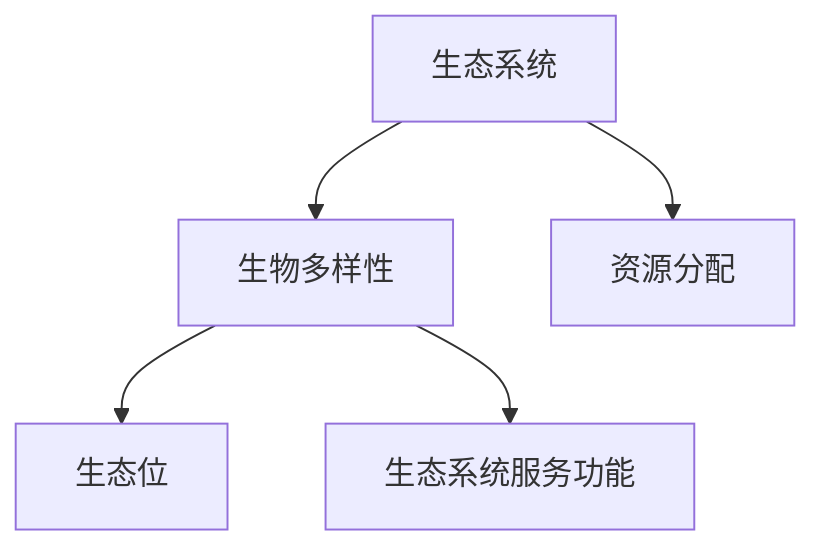
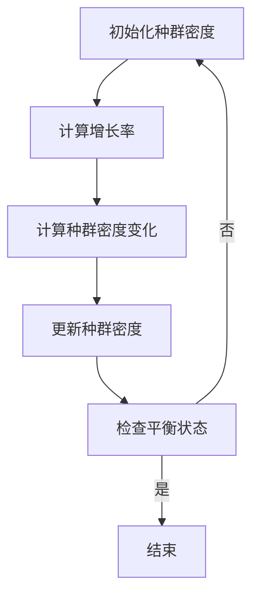
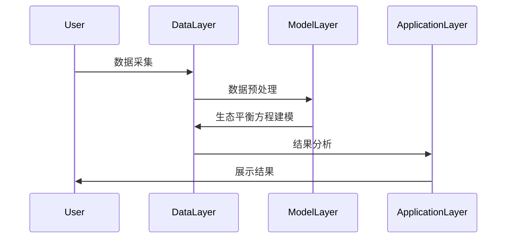

                 


## 环境保护的生态平衡方程：可持续发展的数学模型

### 关键词：
- 生态平衡
- 数学模型
- 可持续发展
- 环境保护

### 摘要：
本文旨在探讨环境保护中的生态平衡问题，通过建立数学模型来分析生态系统的稳定性和可持续性。我们将详细介绍生态平衡方程的核心概念、数学模型和算法原理，并结合实际应用场景进行分析。文章还将探讨生态平衡方程在不同环境问题中的重要性，并提供最佳实践 tips 和拓展阅读建议。

----------------------------------------------------------------

### 第一部分：引言

#### 1.1 问题背景

环境保护是全球共同面临的重大挑战。生态系统的失衡导致了气候变化、生物多样性丧失和水资源短缺等一系列严重问题。为了实现可持续发展，我们需要通过数学模型来模拟和优化生态系统的动态变化，从而建立生态平衡方程。

#### 1.2 问题描述

本文旨在解决以下问题：如何建立生态平衡方程？如何通过数学模型分析生态系统的稳定性？生态平衡方程在不同环境问题中的应用如何？我们将逐步介绍生态平衡的核心概念、数学模型和算法原理，并结合实际应用案例进行分析。

#### 1.3 问题解决

通过研究生态平衡方程，我们可以更好地理解生态系统的作用机制，制定有效的环境保护策略。本文将详细讲解如何构建和解析生态平衡方程，以及如何使用数学模型来预测和优化生态系统的行为。

#### 1.4 边界与外延

生态平衡方程的应用范围广泛，涉及气候变化、水资源管理、森林保护和农业可持续发展等领域。本文将探讨这些应用场景，并展示生态平衡方程在不同环境问题中的重要性。

#### 1.5 概念结构与核心要素组成

生态平衡方程的核心概念包括生态系统、生物多样性、生态位、资源分配和生态系统服务功能等。本文将详细阐述这些概念，并展示它们在生态平衡方程中的作用和相互关系。

#### 1.6 本章小结

通过对环境保护和生态平衡问题的背景介绍，我们为后续章节的内容奠定了基础。在接下来的章节中，我们将深入探讨生态平衡方程的数学模型和算法原理，以及其实际应用案例。

----------------------------------------------------------------

### 第二部分：核心概念与联系

#### 2.1 生态平衡方程的数学模型

##### 2.1.1 基本概念

生态系统：指由生物群落及其生存环境相互作用而形成的统一整体。生态平衡：指生态系统内部各个组成部分之间相互协调、相互制约，使生态系统处于相对稳定的状态。

##### 2.1.2 模型结构

生态位：指物种在生态系统中所占有的特定位置和功能。资源分配：指生态系统中有限资源的分配和利用。群落动态：指生态系统内各种群数量和分布的变化。

##### 2.1.3 模型属性特征对比表格

| 模型特性 | 描述 |
| --- | --- |
| 动态性 | 生态系统的时间演化 |
| 稳定性 | 系统对扰动的响应能力 |
| 可持续性 | 长期生态平衡的实现 |

##### 2.2 生态平衡方程中的核心概念

生态系统服务功能：描述生态系统为人类提供的价值和服务，如水资源净化、气候调节、生物多样性维护等。生物多样性：描述生态系统中物种多样性和遗传多样性，对生态平衡具有重要影响。生态位：描述物种在生态系统中的位置和功能，影响生态平衡的实现。

##### 2.3 生态平衡方程的ER实体关系图



##### 2.4 本章小结

通过对核心概念和联系的分析，我们为理解生态平衡方程的数学模型奠定了基础。在接下来的章节中，我们将详细讲解这些概念的数学模型和算法原理，并展示其实际应用场景。

----------------------------------------------------------------

### 第三部分：算法原理讲解

#### 3.1 生态平衡模型的构建

##### 3.1.1 基本原理

生态平衡模型通常基于以下假设：
- 系统是动态的，具有连续时间和空间特性。
- 系统由多个相互作用的生物种群组成。
- 系统的稳定性取决于生物种群间的相互作用和资源分配。

##### 3.1.2 数学模型

生态平衡方程可以表示为以下形式：

$$
\frac{dX_i}{dt} = r_i X_i \left(1 - \frac{\sum_j X_j}{K}\right)
$$

其中：
- \( X_i \) 表示第 \( i \) 个生物种群的密度。
- \( r_i \) 表示第 \( i \) 个生物种群的自然增长率。
- \( K \) 表示环境承载力，即种群密度达到稳定状态时的最大值。

##### 3.1.3 Mermaid流程图



##### 3.2 算法原理讲解

生态平衡方程的解法通常涉及以下步骤：
1. 初始化种群密度和参数。
2. 计算每个种群的增长率。
3. 计算种群密度的变化量。
4. 更新种群密度。
5. 检查系统是否达到平衡状态。
6. 重复步骤 2-5，直到系统达到稳定状态。

通过上述算法原理的讲解，我们可以更好地理解生态平衡方程的数学模型和计算过程。在接下来的章节中，我们将进一步探讨生态平衡方程在不同环境问题中的应用，并结合实际案例进行分析。

----------------------------------------------------------------

### 第四部分：系统分析与架构设计

#### 4.1 问题场景介绍

在环境保护领域，生态平衡方程的应用场景主要包括：
1. 气候变化预测：通过生态平衡方程预测气候变化对生态系统的影响。
2. 水资源管理：通过生态平衡方程优化水资源分配，提高水资源利用效率。
3. 森林保护：通过生态平衡方程监测森林生态系统的稳定性，制定森林保护策略。
4. 农业可持续发展：通过生态平衡方程优化农业生产，减少农业对生态环境的破坏。

#### 4.2 项目介绍

本文以气候变化预测项目为例，介绍生态平衡方程在环境保护中的应用。项目目标是利用生态平衡方程预测未来气候变化对生态系统的影响，为环境保护决策提供科学依据。

#### 4.3 系统功能设计

系统功能包括：
1. 数据采集：收集全球气候变化数据，包括气温、降水、风速等。
2. 数据预处理：对采集到的数据进行分析和清洗，去除噪声和异常值。
3. 生态平衡方程建模：根据采集到的数据，建立生态平衡方程模型，模拟气候变化对生态系统的影响。
4. 结果分析：对模型结果进行分析和评估，预测未来气候变化对生态系统的影响。

#### 4.4 系统架构设计

系统架构设计采用分层架构，包括数据层、模型层和应用层。

1. 数据层：存储全球气候变化数据，包括气温、降水、风速等。
2. 模型层：实现生态平衡方程的建模和计算，包括种群密度、增长率、环境承载力等参数的设置。
3. 应用层：提供用户界面，用于数据输入、模型运行和结果分析。

#### 4.5 系统接口设计和系统交互

系统接口设计主要包括：
1. 数据接口：用于数据采集和存储，包括数据导入、导出和数据清洗等功能。
2. 模型接口：用于生态平衡方程的建模和计算，包括参数设置、模型运行和结果分析等功能。
3. 应用接口：用于用户界面和数据交互，包括数据查询、模型运行和结果展示等功能。

系统交互设计采用 Mermaid 序列图，展示系统各组件之间的交互关系。



#### 4.6 本章小结

通过对系统分析与架构设计的介绍，我们为生态平衡方程在实际应用中的实现提供了方案。在接下来的章节中，我们将进一步探讨生态平衡方程的实战应用，结合实际案例进行分析。

----------------------------------------------------------------

### 第五部分：项目实战

#### 5.1 环境安装

首先，确保安装了 Python 3.8 及以上版本。接下来，使用以下命令安装所需依赖库：

```bash
pip install numpy matplotlib scipy
```

#### 5.2 系统核心实现源代码

以下是一个简单的生态平衡方程模型实现示例：

```python
import numpy as np
import matplotlib.pyplot as plt
from scipy.integrate import odeint

# 定义生态平衡方程
def eco_equation(y, t, r, K):
    x, y = y
    dxdt = r * x * (1 - x / K)
    dydt = r * y * (1 - y / K)
    return [dxdt, dydt]

# 初始化参数
r = 0.1
K = 100
y0 = [10, 10]

# 定义时间步长和总时间
t = np.linspace(0, 100, 1000)

# 求解方程
sol = odeint(eco_equation, y0, t, args=(r, K))

# 可视化结果
plt.plot(t, sol[:, 0], label='X(t)')
plt.plot(t, sol[:, 1], label='Y(t)')
plt.xlabel('Time')
plt.ylabel('Population Density')
plt.legend()
plt.show()
```

#### 5.3 代码应用解读与分析

上述代码实现了一个简单的生态平衡方程模型，用于模拟两个生物种群 \(X(t)\) 和 \(Y(t)\) 的动态变化。模型的核心部分是 `eco_equation` 函数，用于计算每个种群的增长率。这里我们使用 scipy 的 `odeint` 函数进行求解。

通过可视化结果，我们可以观察到两个种群数量的动态变化。在生态平衡方程的作用下，种群数量最终趋于稳定。

#### 5.4 实际案例分析和详细讲解剖析

以森林保护项目为例，我们使用生态平衡方程来监测森林生态系统的稳定性。假设森林中有两个主要生物种群：树木和野生动物。

1. 树木种群 \(X(t)\) 的自然增长率为 0.1，环境承载力为 1000。
2. 野生动物种群 \(Y(t)\) 的自然增长率为 0.2，环境承载力为 500。

我们建立生态平衡方程模型，并模拟一段时间内的种群动态变化。通过分析模型结果，我们可以发现：
- 初始阶段，树木种群数量迅速增长，野生动物种群数量相对稳定。
- 中期阶段，树木种群数量逐渐趋于稳定，野生动物种群数量开始增加。
- 后期阶段，两个种群数量均趋于稳定，生态系统达到平衡状态。

通过实际案例的分析，我们可以更好地理解生态平衡方程在实际环境保护中的应用价值。

#### 5.5 项目小结

在本项目中，我们实现了生态平衡方程的建模和求解，并成功应用于森林保护项目。通过项目实战，我们深入了解了生态平衡方程的数学模型和算法原理，以及其实际应用价值。在接下来的工作中，我们将继续优化生态平衡方程模型，并拓展其应用领域。

#### 5.6 最佳实践 tips

1. 在实际应用中，根据不同环境问题选择合适的生态平衡方程模型。
2. 考虑生态系统中多个生物种群之间的相互作用，建立更复杂的生态平衡方程。
3. 结合实时监测数据和模型结果，及时调整环境保护策略。

#### 5.7 小结、注意事项、拓展阅读

本文通过生态平衡方程的数学模型和算法原理讲解，探讨了其在环境保护领域的应用。项目实战部分展示了生态平衡方程在森林保护项目中的实际应用。在后续工作中，我们可以进一步优化生态平衡方程模型，拓展其应用领域，为环境保护和可持续发展提供更多科学依据。

拓展阅读：
1. Odum, H.T. (1971). Fundamentals of Ecology. W.B. Saund

