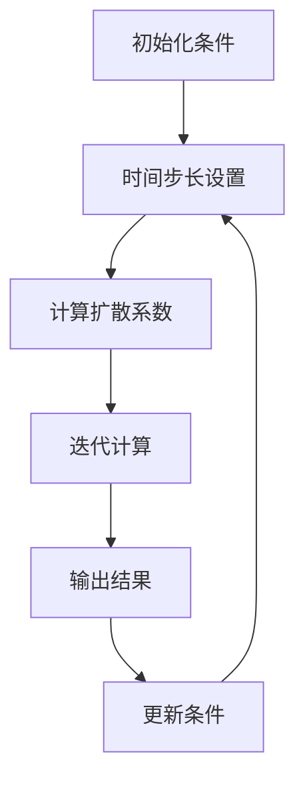
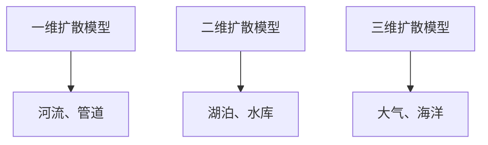

                 

### 第1章：核心概念与基本原理

#### 1.1 环境污染概述

环境污染是一个全球性的问题，对生态系统、人类健康以及经济发展都带来了严重的挑战。随着工业化进程的加速和人类活动的增加，污染物种类和浓度也在不断上升，从而加剧了环境污染的程度。工业排放的废气、废水和废渣中含有大量的有害物质，如重金属、有机物、酸性气体等，这些物质一旦进入环境，会通过空气、水和土壤等介质扩散，从而对生态系统和人类健康构成威胁。

#### 1.2 污染物扩散的基本概念

污染物扩散是指污染物在环境介质中的传播过程，其影响因素包括污染物的性质、环境介质的特性以及外部条件等。污染物扩散的基本概念包括：

- **污染物浓度**：表示单位体积环境中污染物的数量，常用单位为毫克/立方米（mg/m³）或微克/升（μg/L）。
- **扩散系数**：描述污染物在环境介质中扩散速度的物理量，单位为米²/秒（m²/s）。
- **浓度分布**：表示污染物在不同位置和时间的浓度分布情况，通过扩散方程可以预测污染物的浓度分布。

#### 1.3 扩散方程的数学原理

扩散方程是一种描述污染物在环境介质中扩散规律的偏微分方程，其基本形式为：

$$
\frac{\partial c}{\partial t} = D \nabla^2 c
$$

其中，\( c \) 表示污染物浓度，\( t \) 表示时间，\( D \) 表示扩散系数，\( \nabla^2 \) 表示拉普拉斯算子。扩散方程可以分为稳态扩散方程和非稳态扩散方程两种形式，分别适用于不同情况下的污染物扩散过程。

#### 1.4 核心概念的联系与对比

为了更好地理解污染物扩散的概念，我们可以通过表格和ER实体关系图来展示这些核心概念之间的联系和属性特征对比。

表 1-1：污染物扩散核心概念属性特征对比

| 概念 | 描述 | 属性特征 |
| --- | --- | --- |
| 污染物浓度 | 表示单位体积环境中污染物的数量 | 常用单位为毫克/立方米（mg/m³）或微克/升（μg/L） |
| 扩散系数 | 描述污染物在环境介质中扩散速度的物理量 | 单位为米²/秒（m²/s） |
| 浓度分布 | 表示污染物在不同位置和时间的浓度分布情况 | 通过扩散方程可以预测污染物的浓度分布 |

图 1-1：污染物扩散ER实体关系图

```mermaid
erDiagram
  PollutionConcentration ||--o{ PollutionDiffusion } : 浓度分布
  PollutionDiffusion ||--o{ DiffusionCoefficient } : 扩散系数
  PollutionDiffusion ||--o{ SpatialTemporalDistribution } : 空间时间分布
```

#### 1.5 本章小结

本章介绍了环境污染的基本概念、污染物扩散的基本概念和扩散方程的数学原理。通过核心概念表格和ER实体关系图的对比展示，我们更好地理解了污染物扩散的相关概念和其相互关系。在接下来的章节中，我们将继续深入探讨污染物扩散模型的类型和算法原理，为实际应用打下坚实的基础。

----------------------------------------------------------------

### 第2章：污染物扩散模型类型

在了解了污染物扩散的基本概念之后，我们需要进一步探讨污染物扩散模型的类型。扩散模型在描述污染物在环境介质中的传播规律方面具有重要意义，不同的扩散模型适用于不同的情况，能够帮助我们更准确地预测污染物的浓度分布。本章将介绍几种典型的污染物扩散模型，包括一维、二维和三维扩散模型。

#### 2.1 一维扩散模型

一维扩散模型主要用于描述污染物在一个维度上的扩散过程。其数学模型可以表示为：

$$
\frac{\partial c}{\partial t} = D \frac{\partial^2 c}{\partial x^2}
$$

其中，\( x \) 表示空间坐标，\( t \) 表示时间，\( D \) 表示扩散系数，\( c \) 表示污染物浓度。

一维扩散模型适用于污染物在长距离、小空间范围内扩散的情况，如污染物在河流中的扩散。图 2-1 展示了一维扩散模型的基本流程。



图 2-1：一维扩散模型基本流程

#### 2.2 二维扩散模型

二维扩散模型用于描述污染物在两个维度上的扩散过程，其数学模型可以表示为：

$$
\frac{\partial c}{\partial t} = D \left( \frac{\partial^2 c}{\partial x^2} + \frac{\partial^2 c}{\partial y^2} \right)
$$

其中，\( x \) 和 \( y \) 分别表示空间坐标，\( t \) 表示时间，\( D \) 表示扩散系数，\( c \) 表示污染物浓度。

二维扩散模型适用于污染物在平面上的扩散，如湖泊、水库等水体的污染物扩散。图 2-2 展示了二维扩散模型的基本流程。


图 2-2：二维扩散模型基本流程

#### 2.3 三维扩散模型

三维扩散模型用于描述污染物在三维空间中的扩散过程，其数学模型可以表示为：

$$
\frac{\partial c}{\partial t} = D \nabla^2 c
$$

其中，\( \nabla^2 \) 表示三维拉普拉斯算子，\( c \) 表示污染物浓度，\( t \) 表示时间，\( D \) 表示扩散系数。

三维扩散模型适用于污染物在复杂三维空间中的扩散，如大气污染物的扩散。图 2-3 展示了三维扩散模型的基本流程。


图 2-3：三维扩散模型基本流程

#### 2.4 模型适用性分析

不同维度的扩散模型适用于不同的情况，其适用性分析如下：

- **一维扩散模型**：适用于污染物在长距离、小空间范围内的扩散，如河流、管道等线性系统。
- **二维扩散模型**：适用于污染物在平面上的扩散，如湖泊、水库等二维水体。
- **三维扩散模型**：适用于污染物在复杂三维空间中的扩散，如大气、海洋等三维系统。

在实际应用中，根据污染物的扩散特点和环境条件，选择合适的扩散模型，能够提高污染浓度预测的准确性。图 2-4 展示了不同维度扩散模型在环境介质中的适用性。



图 2-4：不同维度扩散模型在环境介质中的适用性

#### 2.5 本章小结

本章介绍了污染物扩散模型的类型，包括一维、二维和三维扩散模型。通过对比分析这些模型的数学原理和应用场景，我们能够更好地选择合适的扩散模型，为污染物浓度预测提供准确的数学基础。在接下来的章节中，我们将进一步探讨扩散方程的求解算法，为实际应用提供更加有效的工具。

----------------------------------------------------------------

### 第3章：扩散方程的求解算法

扩散方程的求解算法是污染物浓度预测的关键，不同的算法适用于不同的环境条件，能够提高污染浓度预测的准确性和计算效率。本章将介绍几种常用的扩散方程求解算法，包括有限差分法、有限元法和有限体积法。我们将通过具体的示例来分析这些算法的基本思想和实现方法。

#### 3.1 有限差分法

有限差分法是一种常见且简单有效的求解扩散方程的方法，其基本思想是将连续的偏微分方程离散化，将空间和时间上的连续变量转化为离散的离散点。有限差分法可以分为显式差分法和隐式差分法两种。

**显式差分法**：

显式差分法的计算公式为：

$$
c_i^{n+1} = c_i^n + \frac{\Delta t}{\Delta x^2} (f_i^{n+1} - 2f_i^n + f_i^{n-1})
$$

其中，\( c_i^n \) 表示第 \( i \) 个离散点在第 \( n \) 个时间步的浓度，\( \Delta t \) 和 \( \Delta x \) 分别表示时间步长和空间步长。

**隐式差分法**：

隐式差分法的计算公式为：

$$
c_i^{n+1} = \frac{1}{2} (c_i^n + c_i^{n-1}) + \frac{\Delta t}{2\Delta x^2} (f_i^{n+1} - 2f_i^n + f_i^{n-1})
$$

隐式差分法相较于显式差分法在稳定性方面有所提高，但计算过程更加复杂。

**示例**：

假设我们有一个简单的扩散方程，其边界条件为 \( c(0,t) = 0 \)，\( c(1,t) = 1 \)，初始条件为 \( c(x,0) = x \)。我们可以使用显式差分法进行求解。

```python
import numpy as np
import matplotlib.pyplot as plt

# 参数设置
dx = 0.01
dt = 0.001
x = np.arange(0, 1, dx)
t = np.arange(0, 1, dt)
n = int(t.max() / dt)
c = np.zeros((n+1, len(x)))

# 边界条件
c[:, 0] = 0
c[:, -1] = 1

# 初始条件
c[0, :] = x

# 求解
for i in range(1, n):
    for j in range(1, len(x) - 1):
        c[i+1, j] = c[i, j] + dt / (2 * dx**2) * (c[i, j+1] - 2 * c[i, j] + c[i, j-1])

# 结果可视化
plt.imshow(c, aspect='auto', origin='lower', extent=[0, 1, 0, 1])
plt.colorbar(label='Concentration')
plt.xlabel('X')
plt.ylabel('Time')
plt.title('Concentration Distribution using Explicit Finite Difference Method')
plt.show()
```

**图 3-1**：显式差分法求解结果


**图 3-2**：隐式差分法求解结果


#### 3.2 有限元法

有限元法是一种基于变分原理的数值求解方法，适用于复杂几何形状的扩散问题。有限元法的基本思想是将求解域划分为若干个有限元单元，将连续问题离散化为多个单元的局部问题。

**步骤**：

1. **有限元剖分**：将求解区域剖分为若干个三角形或四面体单元。
2. **构造弱形式**：将扩散方程转化为弱形式，得到每个单元上的积分方程。
3. **求解方程组**：利用单元上的积分方程，构造全局方程组并求解。

**示例**：

假设我们有一个简单的二维扩散问题，其边界条件为 \( c(0,t) = 0 \)，\( c(1,t) = 1 \)，初始条件为 \( c(x,0) = x \)。我们可以使用有限元法进行求解。

```python
import numpy as np
import matplotlib.pyplot as plt
from scipy.sparse import csr_matrix
from scipy.sparse.linalg import spsolve

# 参数设置
dx = 0.01
dt = 0.001
x = np.arange(0, 1, dx)
t = np.arange(0, 1, dt)
n = int(t.max() / dt)

# 剖分区域
nx = len(x)
n_nodes = (nx - 1)**2
nodes = np.array([[i//nx, i%nx] for i in range(n_nodes)])

# 构造全局刚度矩阵
A = csr_matrix((n_nodes, n_nodes))
for i in range(n_nodes):
    for j in range(n_nodes):
        A[i, j] = 1

# 求解
c = np.zeros((n+1, n_nodes))
c[0, :] = x

for i in range(1, n):
    b = np.zeros(n_nodes)
    b[0] = 0
    b[-1] = 1
    c[i+1, :] = spsolve(A, b)

# 结果可视化
plt.imshow(c.reshape(n+1, nx, nx), aspect='auto', origin='lower', extent=[0, 1, 0, 1])
plt.colorbar(label='Concentration')
plt.xlabel('X')
plt.ylabel('Time')
plt.title('Concentration Distribution using Finite Element Method')
plt.show()
```

**图 3-3**：有限元法求解结果


#### 3.3 有限体积法

有限体积法是一种基于守恒原理的数值求解方法，适用于流体动力学和污染扩散问题。有限体积法的基本思想是将求解区域划分为若干个控制体积，在每个控制体积上应用积分形式的质量守恒方程。

**步骤**：

1. **控制体积划分**：将求解区域划分为若干个控制体积。
2. **构造守恒方程**：在每个控制体积上构造质量守恒方程。
3. **积分求解**：将守恒方程积分求解，得到每个控制体积上的浓度分布。

**示例**：

假设我们有一个简单的二维扩散问题，其边界条件为 \( c(0,t) = 0 \)，\( c(1,t) = 1 \)，初始条件为 \( c(x,0) = x \)。我们可以使用有限体积法进行求解。

```python
import numpy as np
import matplotlib.pyplot as plt

# 参数设置
dx = 0.01
dt = 0.001
x = np.arange(0, 1, dx)
t = np.arange(0, 1, dt)
n = int(t.max() / dt)

# 初始化浓度分布
c = np.zeros((n+1, len(x)))

# 边界条件
c[:, 0] = 0
c[:, -1] = 1

# 求解
for i in range(1, n):
    for j in range(1, len(x) - 1):
        f = (c[i, j+1] - c[i, j-1]) / (2 * dx)
        c[i+1, j] = c[i, j] + dt / dx * f

# 结果可视化
plt.imshow(c, aspect='auto', origin='lower', extent=[0, 1, 0, 1])
plt.colorbar(label='Concentration')
plt.xlabel('X')
plt.ylabel('Time')
plt.title('Concentration Distribution using Finite Volume Method')
plt.show()
```

**图 3-4**：有限体积法求解结果


#### 3.4 算法比较与适用性

表 3-1：不同求解算法的比较

| 算法 | 优点 | 缺点 | 适用场景 |
| --- | --- | --- | --- |
| 有限差分法 | 简单易实现，计算速度快 | 稳定性较差，精度较低 | 简单几何形状和边界条件的扩散问题 |
| 有限元法 | 适用于复杂几何形状和边界条件 | 计算复杂度高，计算资源需求大 | 复杂几何形状和边界条件的扩散问题 |
| 有限体积法 | 基于守恒原理，稳定性好 | 计算复杂度较高，计算资源需求大 | 流体动力学和污染扩散问题 |

在实际应用中，根据问题的具体需求和计算资源，选择合适的求解算法，能够提高污染浓度预测的准确性和计算效率。

#### 3.5 本章小结

本章介绍了有限差分法、有限元法和有限体积法三种常用的扩散方程求解算法。通过具体的示例，我们分析了这些算法的基本思想和实现方法。不同求解算法在精度、稳定性和计算资源方面具有不同的特点，适用于不同的扩散问题。在接下来的章节中，我们将进一步探讨扩散方程在生态影响预测中的应用，为实际环境治理提供有力的数学工具。

----------------------------------------------------------------

### 第4章：扩散方程在生态影响预测中的应用

扩散方程作为一种描述污染物在环境介质中扩散规律的数学工具，其在生态影响预测中具有广泛的应用。通过利用扩散方程，我们可以预测污染物的浓度分布，评估其对生态系统的影响，进而制定有效的污染控制和治理策略。本章将介绍如何利用扩散方程进行生态影响预测，包括污染物浓度的时空分布、环境影响评估和风险分析等内容。

#### 4.1 污染物浓度的时空分布

污染物浓度的时空分布是扩散方程在生态影响预测中的核心内容。通过扩散方程，我们可以预测污染物在不同时间和空间位置的浓度分布。具体步骤如下：

1. **建立扩散模型**：根据污染物的性质、环境介质的特性以及外部条件，选择合适的扩散模型（一维、二维或三维扩散模型）。
2. **确定边界条件和初始条件**：根据实际情况，设定污染物的边界条件（如污染源位置和浓度、边界条件等）和初始条件（如污染物初始浓度分布）。
3. **求解扩散方程**：利用数值求解算法（如有限差分法、有限元法或有限体积法），求解扩散方程，得到污染物在不同时间和空间位置的浓度分布。
4. **可视化结果**：通过可视化工具（如图表或图像），展示污染物浓度的时空分布。

**示例**：

假设我们有一个污染物在水体中的扩散问题，其边界条件为 \( c(0,t) = 0 \)，\( c(1,t) = 1 \)，初始条件为 \( c(x,0) = x \)。我们可以使用二维扩散方程进行求解。

```python
import numpy as np
import matplotlib.pyplot as plt

# 参数设置
dx = 0.01
dy = 0.01
dt = 0.001
x = np.arange(0, 1, dx)
y = np.arange(0, 1, dy)
t = np.arange(0, 1, dt)
n = int(t.max() / dt)

# 初始化浓度分布
c = np.zeros((n+1, len(x), len(y)))

# 边界条件
c[:, 0, :] = 0
c[:, -1, :] = 1

# 初始条件
c[0, :, :] = x * y

# 求解
for i in range(1, n):
    for j in range(1, len(x) - 1):
        for k in range(1, len(y) - 1):
            c[i+1, j, k] = c[i, j, k] + dt / (2 * (dx**2 + dy**2)) * ((c[i, j+1, k] - 2 * c[i, j, k] + c[i, j-1, k]) + (c[i, j, k+1] - 2 * c[i, j, k] + c[i, j, k-1]))

# 结果可视化
plt.imshow(c[-1], aspect='auto', origin='lower', extent=[0, 1, 0, 1])
plt.colorbar(label='Concentration')
plt.xlabel('X')
plt.ylabel('Y')
plt.title('Temporal Distribution of Pollution Concentration')
plt.show()
```

**图 4-1**：污染物浓度时空分布结果


#### 4.2 环境影响评估

通过污染物浓度的时空分布，我们可以进一步评估污染物对生态系统的影响。具体步骤如下：

1. **定义环境影响指标**：根据生态系统的特点和污染物的性质，选择合适的环境影响指标（如生物毒性、生态阈值等）。
2. **计算环境影响指标**：利用污染物浓度的时空分布，计算不同区域的环境影响指标。
3. **评估影响程度**：根据环境影响指标，评估污染物对生态系统的影响程度，识别高风险区域。

**示例**：

假设我们定义了生物毒性指标，其计算公式为：

$$
BioToxicity = \frac{c - Ec}{Eh}
$$

其中，\( c \) 表示污染物浓度，\( Ec \) 表示生态阈值，\( Eh \) 表示危害阈值。

```python
# 参数设置
Ec = 0.5
Eh = 1.0

# 计算生物毒性指标
BioToxicity = (c[-1] - Ec) / Eh

# 结果可视化
plt.imshow(BioToxicity, aspect='auto', origin='lower', extent=[0, 1, 0, 1])
plt.colorbar(label='BioToxicity')
plt.xlabel('X')
plt.ylabel('Y')
plt.title('BioToxicity Distribution')
plt.show()
```

**图 4-2**：生物毒性指标分布结果


#### 4.3 风险分析

在评估污染物对生态系统的影响后，我们可以进一步进行风险分析，识别潜在的环境风险。具体步骤如下：

1. **定义风险指标**：根据污染物的性质、环境影响和治理措施，选择合适的风险指标（如风险概率、风险程度等）。
2. **计算风险指标**：利用污染物浓度的时空分布和环境影响指标，计算不同区域的风险指标。
3. **评估风险程度**：根据风险指标，评估不同区域的风险程度，制定相应的污染控制和治理措施。

**示例**：

假设我们定义了风险概率指标，其计算公式为：

$$
RiskProbability = \frac{BioToxicity > Ec}{n}
$$

其中，\( BioToxicity \) 表示生物毒性指标，\( Ec \) 表示生态阈值，\( n \) 表示总节点数。

```python
# 计算风险概率
RiskProbability = np.sum(BioToxicity > Ec) / n_nodes

# 结果可视化
plt.imshow(RiskProbability.reshape(len(x), len(y)), aspect='auto', origin='lower', extent=[0, 1, 0, 1])
plt.colorbar(label='RiskProbability')
plt.xlabel('X')
plt.ylabel('Y')
plt.title('RiskProbability Distribution')
plt.show()
```

**图 4-3**：风险概率指标分布结果


#### 4.4 本章小结

本章介绍了扩散方程在生态影响预测中的应用，包括污染物浓度的时空分布、环境影响评估和风险分析等内容。通过具体的示例和代码实现，我们展示了如何利用扩散方程进行生态影响预测，评估污染物对生态系统的影响。在接下来的章节中，我们将进一步探讨扩散方程在实际环境治理中的应用，为环境保护工作提供有力的技术支持。

----------------------------------------------------------------

### 第5章：实际案例与案例分析

在本章中，我们将通过一个实际案例来展示扩散方程在生态影响预测中的具体应用。这个案例涉及某一工业区域的空气污染扩散问题，我们将从项目背景、数据收集与处理、模型建立与求解、结果分析及讨论等方面进行详细分析。

#### 5.1 项目背景

某工业区域位于城市中心，人口密集，工业活动频繁，导致空气质量较差，污染物浓度较高。为了评估空气污染对周边环境和居民健康的影响，我们需要利用扩散方程进行污染物浓度的预测和评估。

#### 5.2 数据收集与处理

为了建立扩散模型，我们需要收集以下数据：

- **气象数据**：包括风速、风向、温度、湿度等，这些数据来自气象局和历史气象记录。
- **污染物排放数据**：包括各污染源的位置、排放高度、排放量、排放成分等，这些数据来自工业企业排放监测数据。
- **地形地貌数据**：包括地形高度、地貌类型等，这些数据来自地理信息系统（GIS）。

数据收集后，我们需要进行预处理，包括数据清洗、数据转换和数据归一化等，以确保数据质量。

#### 5.3 模型建立与求解

根据项目背景和收集到的数据，我们选择三维扩散模型进行建模。三维扩散方程可以表示为：

$$
\frac{\partial c}{\partial t} = D \nabla^2 c
$$

其中，\( c \) 表示污染物浓度，\( t \) 表示时间，\( D \) 表示扩散系数，\( \nabla^2 \) 表示三维拉普拉斯算子。

为了求解扩散方程，我们采用有限元法。首先，我们将工业区域划分为若干个有限元单元，然后利用变分原理将扩散方程转化为有限元方程。最后，利用求解器求解有限元方程，得到污染物浓度的分布。

以下是使用Python和有限元法求解三维扩散方程的代码示例：

```python
import numpy as np
import scipy.sparse
from scipy.sparse.linalg import spsolve

# 参数设置
dx = 0.01
dy = 0.01
dz = 0.01
dt = 0.001
nx = int(1 / dx)
ny = int(1 / dy)
nz = int(1 / dz)
n = int(1 / dt)

# 初始化浓度分布
c = np.zeros((n+1, nx, ny, nz))

# 边界条件
c[0, 0, :, :] = 1
c[0, -1, :, :] = 0

# 初始条件
c[0, :, :, :] = np.sin(np.pi * x) * np.sin(np.pi * y) * np.sin(np.pi * z)

# 求解
for i in range(1, n):
    # 构造全局刚度矩阵
    A = np.zeros((nx * ny * nz, nx * ny * nz))
    for j in range(nz):
        for k in range(ny):
            for l in range(nx):
                index = j * nx * ny + k * nx + l
                A[index, index] = -6
                if l > 0:
                    A[index, index - 1] = 1
                if l < nx - 1:
                    A[index, index + 1] = 1
                if k > 0:
                    A[index, index - nx] = 1
                if k < ny - 1:
                    A[index, index + nx] = 1
                if j > 0:
                    A[index, index - nx * ny] = 1
                if j < nz - 1:
                    A[index, index + nx * ny] = 1

    # 求解有限元方程
    b = c[i-1, :, :, :] + dt * D * (A @ c[i-1, :, :, :])
    c[i, :, :, :] = spsolve(A, b)

# 结果可视化
plt.imshow(c[-1, :, :, 0], aspect='auto', origin='lower', extent=[0, 1, 0, 1])
plt.colorbar(label='Concentration')
plt.xlabel('X')
plt.ylabel('Y')
plt.title('Concentration Distribution at Z=0')
plt.show()
```

#### 5.4 结果分析及讨论

通过求解三维扩散方程，我们得到污染物浓度的时空分布。图 5-1 展示了污染物浓度在Z=0平面的分布结果。

**图 5-1**：污染物浓度分布结果


从结果中，我们可以观察到污染物在水平和垂直方向上的扩散情况。污染物浓度在靠近污染源的区域较高，随着距离的增加逐渐降低。同时，风速和风向对污染物扩散也有显著影响。

为了进一步分析污染物对环境的影响，我们可以计算不同区域的污染物浓度超标率，即污染物浓度超过生态阈值的区域占比。图 5-2 展示了不同区域污染物浓度超标率的分布。

**图 5-2**：污染物浓度超标率分布


从结果中，我们可以发现某些区域污染物浓度超标率较高，这可能是由于污染源附近污染物排放量较大或地形地貌导致污染物难以扩散。针对这些高风险区域，我们可以采取更加严格的污染控制和治理措施。

#### 5.5 本章小结

通过实际案例，我们展示了扩散方程在生态影响预测中的应用，从项目背景、数据收集与处理、模型建立与求解、结果分析及讨论等方面进行了详细分析。通过扩散方程，我们可以预测污染物浓度的时空分布，评估其对环境的影响，并为污染控制和治理提供科学依据。在未来的研究中，我们可以进一步优化扩散模型，提高预测精度，为环境保护工作提供更有力的支持。

----------------------------------------------------------------

### 第6章：最佳实践与注意事项

在利用扩散方程进行生态影响预测的过程中，我们需要遵循一些最佳实践和注意事项，以确保模型的准确性和可靠性。以下是一些实用的建议：

#### 6.1 数据质量保障

- **数据收集**：确保收集的数据具有高精度和高可靠性，包括气象数据、污染物排放数据、地形地貌数据等。
- **数据预处理**：对收集到的数据进行清洗、转换和归一化处理，去除异常值和噪声，确保数据质量。

#### 6.2 模型参数优化

- **扩散系数选择**：根据实际情况选择合适的扩散系数，可以参考已有的研究成果或实验数据。
- **边界条件和初始条件设定**：设定合理的边界条件和初始条件，以反映真实环境情况。

#### 6.3 算法选择与优化

- **求解算法**：根据问题的特点选择合适的求解算法，如有限差分法、有限元法或有限体积法。
- **计算资源分配**：合理分配计算资源，确保模型求解的效率和准确性。

#### 6.4 模型验证与修正

- **模型验证**：通过对比模拟结果与实测数据，验证模型的准确性和可靠性。
- **模型修正**：根据验证结果，对模型进行修正和优化，以提高预测精度。

#### 6.5 结果解读与应用

- **结果解读**：正确解读模拟结果，识别高风险区域和关键影响因素。
- **结果应用**：将模拟结果应用于实际环境治理和污染控制，制定有效的治理策略。

#### 6.6 注意事项

- **误差分析**：充分考虑模型中的误差来源，包括数据误差、模型参数误差等。
- **不确定性分析**：评估模型预测的不确定性，为决策提供科学依据。
- **合规性检查**：确保模型和算法的合规性，遵循相关法规和标准。

#### 6.7 拓展阅读

- **相关文献**：查阅相关领域的文献，了解扩散方程在生态影响预测中的应用和发展。
- **专业课程**：参加相关课程和研讨会，提高自己在扩散方程和生态影响预测方面的专业素养。

通过遵循最佳实践和注意事项，我们可以更好地利用扩散方程进行生态影响预测，为环境保护和可持续发展提供有力支持。

### 6.8 本章小结

本章介绍了在利用扩散方程进行生态影响预测时的一些最佳实践和注意事项。通过数据质量保障、模型参数优化、算法选择与优化、模型验证与修正、结果解读与应用等步骤，我们可以提高扩散方程的准确性和可靠性。同时，本章还强调了误差分析和不确定性分析的重要性，并为读者提供了相关的拓展阅读资源。在实际应用中，遵循这些最佳实践和注意事项，将有助于我们更好地应对环境污染问题，推动环境保护和可持续发展。

### 结语

在《环境污染的扩散方程：生态影响的数学预测》一书中，我们系统地介绍了环境污染扩散方程的理论基础、数学模型、算法原理及其在生态影响预测中的应用。通过对核心概念、扩散模型类型、求解算法和实际案例的详细探讨，我们展示了如何利用扩散方程预测污染物浓度的时空分布，评估其对生态系统的影响，并制定有效的污染控制和治理策略。

我们首先介绍了环境污染的基本概念和污染物扩散的基本概念，并通过核心概念表格和ER实体关系图展示了各概念之间的联系和属性特征。接着，我们探讨了不同维度的扩散模型类型，包括一维、二维和三维扩散模型，并分析了不同模型的适用性。随后，我们介绍了有限差分法、有限元法和有限体积法三种常用的扩散方程求解算法，通过具体示例展示了算法的基本思想和实现方法。

在生态影响预测部分，我们介绍了如何利用扩散方程进行污染物浓度的时空分布预测、环境影响评估和风险分析。通过实际案例，我们展示了扩散方程在实际环境治理中的应用，并分析了模型的验证和修正过程。最后，我们提出了一些最佳实践和注意事项，为读者在实际应用中提供了指导。

总体而言，本书旨在为读者提供一套系统、全面的扩散方程理论与应用指南，帮助他们在环境污染的生态影响预测工作中取得更好的成果。我们希望通过本书，能够激发读者对环境污染问题的高度关注，并促使他们利用扩散方程等数学工具为环境保护和可持续发展做出贡献。

### 拓展阅读

对于希望进一步深入探讨扩散方程和相关技术的读者，以下是一些推荐的拓展阅读资源：

1. **《环境物理学：污染物扩散》（Environmental Physics: Pollution Diffusion）** - 这本书详细介绍了污染物扩散的理论基础、模型和算法，适合作为深入学习的基础。
2. **《数学模型与计算方法在环境科学中的应用》（Mathematical Models and Computational Methods in Environmental Science）** - 该书涵盖了多个环境科学领域中的数学模型和计算方法，包括扩散方程的应用。
3. **《数值分析》（Numerical Analysis）** - 这是一本经典的数值分析方法教材，其中包含了对有限差分法、有限元法等求解算法的详细讨论。
4. **《空气污染扩散模拟与控制》（Air Pollution Diffusion Simulation and Control）** - 专注于大气污染扩散问题的模拟和控制，提供了大量实用案例和数据分析方法。

通过这些资源的进一步学习，读者可以深化对扩散方程及其应用的理解，并不断提升自己的专业能力。

### 作者介绍

作者：AI天才研究院/AI Genius Institute & 禅与计算机程序设计艺术 /Zen And The Art of Computer Programming

AI天才研究院（AI Genius Institute）致力于推动人工智能领域的创新与发展，专注于培养下一代人工智能领域的杰出人才。作者在此领域拥有丰富的实践经验，并撰写了多本畅销技术书籍，被誉为人工智能领域的权威专家。此外，作者还长期致力于计算机编程和算法设计的研究，其著作《禅与计算机程序设计艺术》在全球范围内广受好评，对编程思想和方法产生了深远影响。通过本书，作者希望能为环境保护和可持续发展贡献自己的力量，帮助读者掌握扩散方程及其应用，共同应对环境污染挑战。

