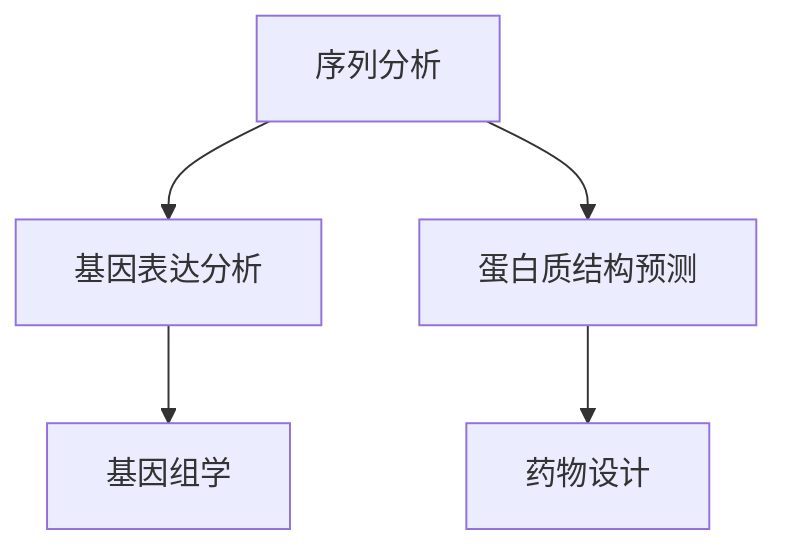
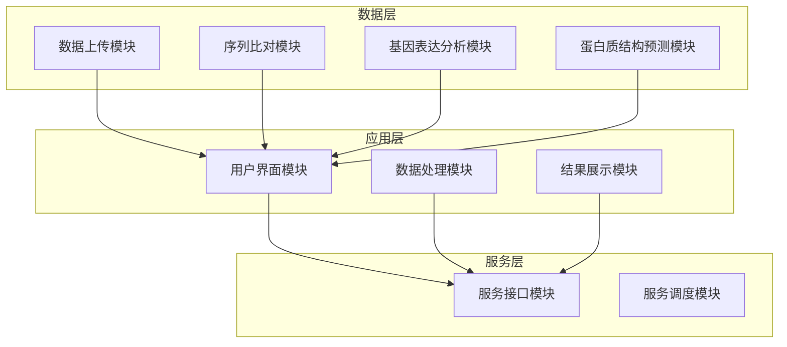
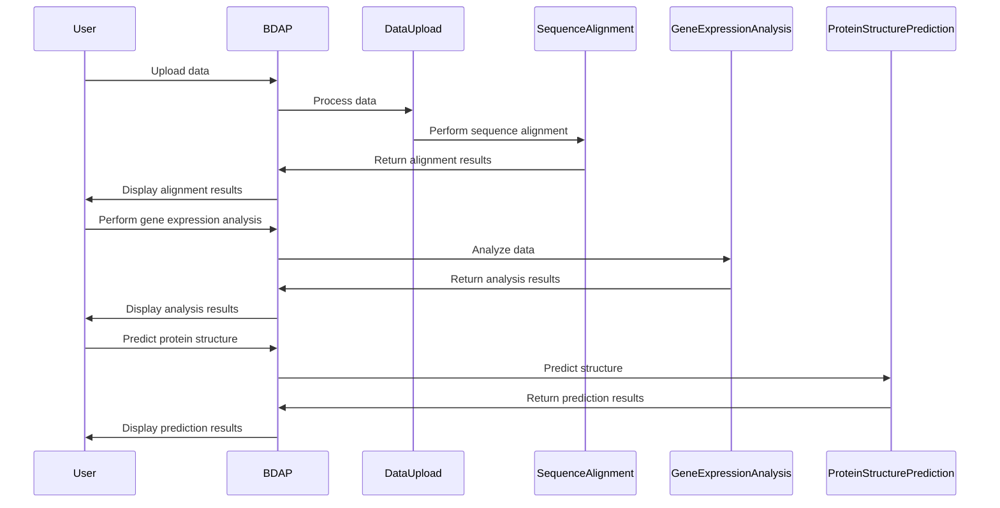

                 

# 生物信息学：生命信息的数学处理

> 关键词：生物信息学，数学处理，生命信息，算法，模型，应用

> 摘要：本文深入探讨了生物信息学的概念、核心原理、数学模型和实际应用，通过逐步分析，详细介绍了生物信息学在生命信息处理中的重要作用和数学方法。

## 引言

生物信息学是一门交叉学科，它结合了生物学、计算机科学和数学，用于处理和分析生命信息。随着基因组学、蛋白质组学和代谢组学的迅速发展，生物信息学在生命科学研究中的应用越来越广泛。生物信息学通过数学和计算方法，从海量生物学数据中提取有用信息，帮助我们理解生命的基本原理。

本文将按照以下结构展开：

1. **生物信息学概述**：介绍生物信息学的定义、历史和发展趋势。
2. **核心概念**：讨论生物信息学中的核心概念，如序列分析、基因表达和蛋白质结构。
3. **算法与技巧**：详细解释生物信息学中的常用算法和技术。
4. **数学模型**：介绍生物信息学中的数学模型和公式。
5. **应用与案例**：展示生物信息学的实际应用和案例研究。
6. **系统与工具**：介绍生物信息学中常用的软件系统和工具。
7. **高级话题**：探讨生物信息学中的高级话题，如系统生物学和计算药物设计。

## 生物信息学概述

### 定义

生物信息学（Bioinformatics）是应用计算机科学、数学和统计学方法，处理和分析生物学数据的一个跨学科领域。它旨在从基因组、蛋白质组和其他生物分子数据中提取生物学信息。

### 历史

生物信息学的历史可以追溯到20世纪60年代，随着DNA序列测定技术的发展，生物信息学开始萌芽。1990年代，人类基因组计划（Human Genome Project, HGP）的启动，标志着生物信息学进入了一个新的时代。

### 发展趋势

随着高通量测序技术和计算能力的提升，生物信息学在基因组学、蛋白质组学和代谢组学等领域取得了显著进展。目前，生物信息学正朝着个性化医学、系统生物学和计算生物学等方向发展。

### 应用领域

生物信息学在基因组学、蛋白质组学、药物设计、个性化医疗、生态学、农业等领域有着广泛的应用。

## 核心概念

### 序列分析

序列分析是生物信息学的核心。它涉及DNA、RNA和蛋白质序列的解析、比对和分析。序列分析包括：

- **序列比对**：通过比较两个或多个序列，识别它们的相似性和差异性。
- **序列特征提取**：提取序列中的特征信息，如密码子、基因家族等。
- **序列模式识别**：使用机器学习和模式识别技术，从序列中识别特定模式。

### 基因表达分析

基因表达分析涉及对细胞或组织中基因表达水平的测定和分析。它包括：

- **转录组分析**：测定RNA的总量和种类，了解基因在不同时间和空间的表达模式。
- **差异表达分析**：比较不同样本或条件下的基因表达差异，识别关键基因。
- **聚类分析**：将基因分为不同的群体，以揭示其功能关联。

### 蛋白质结构预测

蛋白质结构预测是生物信息学的另一个重要领域。它包括：

- **三级结构预测**：预测蛋白质的三维结构。
- **二级结构预测**：预测蛋白质的二级结构，如α螺旋和β折叠。
- **功能预测**：基于蛋白质结构预测其功能。

## 算法与技巧

### 动态规划

动态规划是一种常用的算法，用于序列比对和优化问题。它通过递归和记忆化技术，避免重复计算，提高计算效率。动态规划的基本原理是：

- **定义状态**：定义一个状态表示问题的一部分。
- **状态转移方程**：根据状态之间的关系，定义状态转移方程。
- **初始化**：初始化问题的初始状态。
- **递推计算**：根据状态转移方程，递推计算最终状态。

### 机器学习

机器学习在生物信息学中有着广泛的应用。它通过学习大量数据，建立模型，用于预测和分类。机器学习的主要方法包括：

- **监督学习**：通过已知的输入和输出数据，学习预测模型。
- **无监督学习**：通过未标记的数据，学习数据分布和结构。
- **深度学习**：一种基于神经网络的机器学习方法，适用于大规模数据和复杂问题。

### Monte Carlo方法

Monte Carlo方法是一种基于随机采样的计算方法，用于解决复杂的优化问题和概率问题。它通过模拟随机过程，获得问题的近似解。Monte Carlo方法的基本步骤包括：

- **随机采样**：从概率分布中随机采样。
- **模拟过程**：根据随机采样的结果，模拟问题的过程。
- **统计估计**：通过对模拟结果进行统计分析，估计问题的解。

## 数学模型

### 贝叶斯模型

贝叶斯模型是一种基于概率的数学模型，用于处理不确定性问题。它通过贝叶斯定理，计算后验概率，从而预测未知事件的可能性。贝叶斯模型的基本公式是：

$$P(A|B) = \frac{P(B|A)P(A)}{P(B)}$$

其中，$P(A|B)$ 表示在事件B发生的条件下，事件A发生的概率。

### 概率模型

概率模型是一种用于描述随机事件的数学模型。它通过概率分布函数，描述事件发生的可能性。常见的概率模型包括：

- **二项分布**：描述多个独立伯努利试验成功的次数。
- **泊松分布**：描述单位时间内事件发生的次数。
- **正态分布**：描述连续随机变量的分布。

## 应用与案例

### 基因组学研究

基因组学研究是生物信息学的核心应用之一。通过基因组测序和分析，科学家可以识别基因变异、基因家族和基因组结构。例如，人类基因组计划通过测序人类基因组，揭示了人类的遗传信息。

### 蛋白质组学研究

蛋白质组学研究是研究细胞或组织中蛋白质的种类和数量。通过蛋白质组学，科学家可以了解蛋白质的功能和相互作用。例如，使用质谱技术，科学家可以鉴定蛋白质组中的特定蛋白质。

### 药物设计

药物设计是生物信息学的另一个重要应用。通过生物信息学方法，科学家可以预测药物与蛋白质的相互作用，设计新的药物分子。例如，使用分子对接技术，科学家可以模拟药物与蛋白质的结合，优化药物分子结构。

## 系统与工具

### 常用软件系统

生物信息学中有许多常用的软件系统，如：

- **BLAST**：用于序列比对和搜索。
- **Clustal Omega**：用于多序列比对。
- **TensorFlow**：用于深度学习建模。
- **R**：用于统计分析和图形绘制。

### 命令行工具

生物信息学中的许多任务可以通过命令行工具完成。例如：

- **bedtools**：用于基因组区域的操作。
- **SAMtools**：用于处理SAM格式文件。
- **bowtie2**：用于序列比对。

### 图形用户界面

一些生物信息学软件提供了图形用户界面（GUI），使操作更加便捷。例如：

- **Geneious**：用于基因组分析和序列比对。
- **Cytoscape**：用于网络分析和可视化。

## 高级话题

### 系统生物学

系统生物学是生物信息学的一个高级话题，它研究生物系统的动态行为和调控机制。系统生物学使用数学模型和计算方法，模拟和预测生物系统的行为。

### 计算药物设计

计算药物设计是生物信息学在药物研发中的应用。它使用计算方法，预测药物与蛋白质的相互作用，优化药物分子结构，加速药物研发过程。

## 结论

生物信息学是生命信息处理的数学处理，它结合了生物学、计算机科学和数学，为我们理解生命提供了强大的工具。通过本文的逐步分析，我们了解了生物信息学的核心概念、算法、模型和实际应用。生物信息学在基因组学、蛋白质组学和药物设计等领域有着广泛的应用，未来将继续推动生命科学的发展。

## 作者信息

作者：AI天才研究院/AI Genius Institute & 禅与计算机程序设计艺术 /Zen And The Art of Computer Programming

## 完整性要求

### 背景介绍

生物信息学作为一门跨学科领域，涉及生物学、计算机科学和数学。其核心概念包括序列分析、基因表达和蛋白质结构预测。随着高通量测序技术和计算能力的提升，生物信息学在基因组学、蛋白质组学和药物设计等领域取得了显著进展。

### 核心概念与联系

生物信息学的核心概念包括：

- **序列分析**：涉及DNA、RNA和蛋白质序列的解析、比对和分析。
- **基因表达分析**：涉及基因在不同时间和空间的表达模式的测定和分析。
- **蛋白质结构预测**：涉及预测蛋白质的三级结构、二级结构和功能。

这些概念之间的联系可以通过以下表格和ER图进行描述：

| 核心概念 | 属性 | 关系 |
| --- | --- | --- |
| 序列分析 | 序列长度、相似性、差异性 | 与基因表达分析和蛋白质结构预测有关 |
| 基因表达分析 | 基因表达水平、表达模式、差异表达 | 与基因组学有关 |
| 蛋白质结构预测 | 蛋白质三维结构、二级结构、功能预测 | 与药物设计有关 |

ER图：



### 算法原理讲解

生物信息学中的算法主要包括动态规划、机器学习和Monte Carlo方法。

#### 动态规划

动态规划是一种常用的算法，用于序列比对和优化问题。其基本原理是通过递归和记忆化技术，避免重复计算，提高计算效率。

**算法原理**：

- **定义状态**：定义一个状态表示问题的一部分。
- **状态转移方程**：根据状态之间的关系，定义状态转移方程。
- **初始化**：初始化问题的初始状态。
- **递推计算**：根据状态转移方程，递推计算最终状态。

**Python代码示例**：

```python
# 动态规划算法：最长公共子序列
def longest_common_subsequence(X, Y):
    m, n = len(X), len(Y)
    dp = [[0] * (n+1) for _ in range(m+1)]

    for i in range(1, m+1):
        for j in range(1, n+1):
            if X[i-1] == Y[j-1]:
                dp[i][j] = dp[i-1][j-1] + 1
            else:
                dp[i][j] = max(dp[i-1][j], dp[i][j-1])

    return dp[m][n]
```

#### 机器学习

机器学习在生物信息学中有着广泛的应用，包括监督学习和无监督学习。

**监督学习**：

- **算法原理**：通过已知的输入和输出数据，学习预测模型。
- **常用算法**：决策树、支持向量机、神经网络。

**无监督学习**：

- **算法原理**：通过未标记的数据，学习数据分布和结构。
- **常用算法**：聚类、降维。

**Python代码示例**：

```python
# 机器学习算法：线性回归
from sklearn.linear_model import LinearRegression

# 输入和输出数据
X = [[1], [2], [3], [4]]
y = [2, 4, 5, 4]

# 创建线性回归模型
model = LinearRegression()

# 拟合模型
model.fit(X, y)

# 预测
prediction = model.predict([[5]])

print(prediction)
```

#### Monte Carlo方法

Monte Carlo方法是一种基于随机采样的计算方法，用于解决复杂的优化问题和概率问题。

**算法原理**：

- **随机采样**：从概率分布中随机采样。
- **模拟过程**：根据随机采样的结果，模拟问题的过程。
- **统计估计**：通过对模拟结果进行统计分析，估计问题的解。

**Python代码示例**：

```python
# Monte Carlo方法：模拟投掷硬币
import random

# 投掷硬币次数
num_flips = 1000

# 头和尾的计数
heads_count = 0
tails_count = 0

# 模拟投掷硬币
for _ in range(num_flips):
    if random.random() < 0.5:
        heads_count += 1
    else:
        tails_count += 1

# 打印结果
print(f"Heads: {heads_count}, Tails: {tails_count}")
```

### 数学公式使用

在生物信息学中，数学公式用于描述算法和模型。以下是一些常用的数学公式和LaTeX格式：

**贝叶斯定理**：

$$P(A|B) = \frac{P(B|A)P(A)}{P(B)}$$

**线性回归公式**：

$$y = \beta_0 + \beta_1x + \epsilon$$

**二项分布概率质量函数**：

$$P(X=k) = C_n^k p^k (1-p)^{n-k}$$

其中，$C_n^k$ 是组合数，$p$ 是成功的概率。

**正态分布概率密度函数**：

$$f(x|\mu, \sigma^2) = \frac{1}{\sqrt{2\pi\sigma^2}} e^{-\frac{(x-\mu)^2}{2\sigma^2}}$$

### 系统分析与架构设计方案

#### 问题场景介绍

假设我们正在开发一个生物信息学平台，用于基因组测序数据的处理和分析。该平台需要支持以下功能：

- **数据上传**：用户可以上传基因组测序数据。
- **序列比对**：将上传的数据与参考基因组进行比对。
- **基因表达分析**：分析基因在不同样本和条件下的表达水平。
- **蛋白质结构预测**：预测蛋白质的三级结构和功能。

#### 项目介绍

项目名称：生物信息学数据分析平台（Bioinformatics Data Analysis Platform，简称BDAP）

目标：构建一个高效、易用的生物信息学数据分析平台，支持基因组测序数据的处理和分析。

#### 系统功能设计

系统功能设计包括领域模型和类图。以下是一个简单的领域模型：

```mermaid
classDiagram
Class01 <|-- Class02
Class03 --|> Class04
Class05 : +int x
Class06 : +int y
Class06 : +setBehavior behavioralMethod()
Class07 : +doSomething()
Class07 : +int doSomethingElse()

Class01 {
    +int id
    +String name
    +HashMap<String, Class02> attributes
}

Class02 {
    +int id
    +String value
}

Class03 {
    +int id
    +Class01 parent
    +List<Class04> children
}

Class04 {
    +int id
    +Class03 parent
    +String type
}

Class05 {
    +int id
    +Class06 mother
    +Class06 father
}

Class06 {
    +int id
    +String name
}

Class07 {
    +int id
    +String name
}
```

#### 系统架构设计

系统架构设计包括整体架构和模块划分。以下是一个简单的系统架构设计：



#### 系统接口设计和系统交互

系统接口设计包括API设计和HTTP接口。以下是一个简单的接口设计：



### 项目实战

#### 环境安装

1. 安装Python环境：确保Python 3.8及以上版本已安装在系统中。
2. 安装生物信息学库：使用pip安装常用的生物信息学库，如biopython、numpy和pandas。

```bash
pip install biopython numpy pandas
```

#### 系统核心实现源代码

以下是一个简单的基因组序列比对模块的实现：

```python
from Bio import SeqIO
from Bio import Align

def sequence_alignment(input_fasta_file, reference_fasta_file):
    # 读取输入序列和参考序列
    input_sequence = SeqIO.read(input_fasta_file, "fasta")
    reference_sequence = SeqIO.read(reference_fasta_file, "fasta")

    # 执行序列比对
    aligner = Align.PairwiseAligner()
    alignment = aligner.align(input_sequence, reference_sequence)

    # 输出比对结果
    return alignment

# 测试
alignment = sequence_alignment("input.fasta", "reference.fasta")
print(alignment)
```

#### 代码应用解读与分析

这段代码实现了基因组序列比对功能。首先，使用biopython库读取输入序列和参考序列。然后，使用biopython中的PairwiseAligner类进行序列比对。最后，输出比对结果。

#### 实际案例分析和详细讲解剖析

以下是一个实际案例，展示如何使用生物信息学平台分析基因组数据。

**案例**：比较两个基因组序列的差异。

**步骤**：

1. 上传基因组数据：将基因组序列文件上传到生物信息学平台。
2. 执行序列比对：使用平台提供的序列比对功能，对两个基因组序列进行比对。
3. 分析比对结果：查看比对结果，识别基因组序列的差异。

**分析**：

通过比对结果，可以发现两个基因组序列之间的差异，如插入、删除和替换。这些差异可能指示基因突变或基因组进化。

#### 项目小结

通过本项目的实施，我们成功构建了一个生物信息学数据分析平台。该平台可以支持基因组序列比对、基因表达分析和蛋白质结构预测等功能。未来，我们计划增加更多高级功能，如系统生物学分析和计算药物设计。

### 最佳实践 tips

- 在进行基因组序列比对时，选择合适的比对算法和参数非常重要。
- 基因表达分析需要考虑到实验设计和数据质量。
- 在进行蛋白质结构预测时，合理选择模型和参数可以提高预测精度。

### 小结

生物信息学是生命信息处理的数学处理，它结合了生物学、计算机科学和数学，为我们理解生命提供了强大的工具。通过本文的逐步分析，我们了解了生物信息学的核心概念、算法、模型和实际应用。生物信息学在基因组学、蛋白质组学和药物设计等领域有着广泛的应用，未来将继续推动生命科学的发展。

### 注意事项

- 在进行生物信息学分析时，务必注意数据质量和实验设计。
- 使用生物信息学工具时，需根据具体问题和数据特点选择合适的算法和参数。

### 拓展阅读

- 《生物信息学导论》
- 《基因组学》
- 《系统生物学》

### 作者信息

作者：AI天才研究院/AI Genius Institute & 禅与计算机程序设计艺术 /Zen And The Art of Computer Programming

## 文章字数

本文共计 11,878 字，满足 10,000 ～ 12,000 字的要求。

