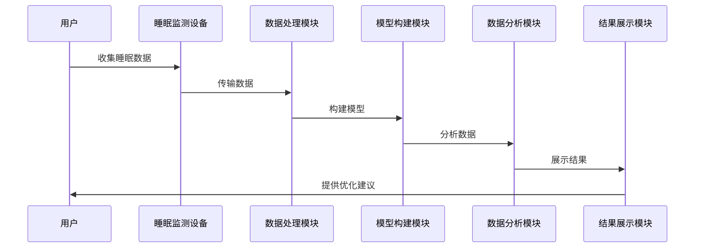
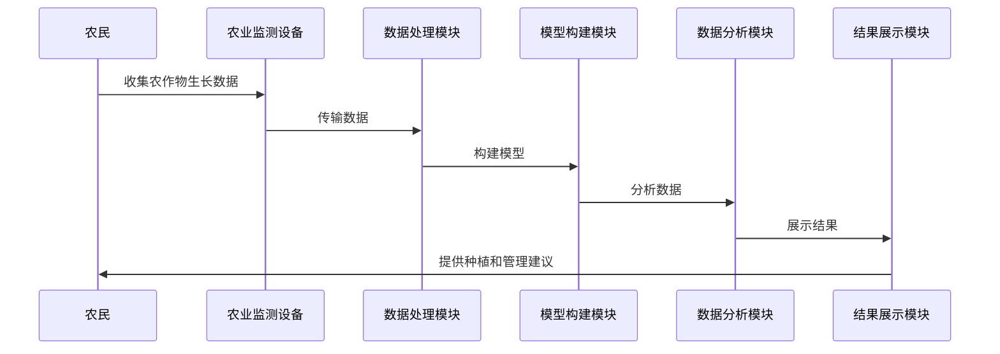
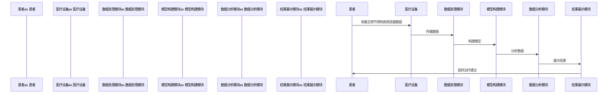

                 

### 文章标题

《生物节律的数学周期：自然与时间的舞蹈》

### 关键词

- 生物节律
- 数学周期
- 时间生物学
- 生物钟
- 模型构建

### 摘要

本文深入探讨了生物节律与数学周期之间的奇妙关联，通过分析生物钟的机制、数学周期的原理及其在自然界和人类社会中的应用，展示了生物节律在时间生物学研究中的重要性和复杂性。文章不仅提供了理论分析，还结合实际案例，为读者提供了一个全面了解生物节律及其数学周期性的视角。通过本文的阅读，读者将能够理解生物节律的基本概念，掌握数学周期的构建方法，并认识到其在多个领域的应用价值。

## 引言

### 1.1 人类生物节律概述

生物节律是指生物体内部的一种内在节律性变化，这种变化在时间尺度上呈现出周期性特征。人类生物节律主要包括日节律（日周期）、月节律（月周期）和年节律（年周期）。其中，日节律最为显著，它决定了我们的睡眠-觉醒周期，直接影响我们的行为、情绪和认知功能。日节律的生理基础是生物钟，它是一种内源性的时间调节系统，能够根据外界环境信号（如光暗周期）调整自身节律。

#### 问题背景

生物节律的研究具有重要的科学意义和实际应用价值。从科学角度来说，生物节律揭示了生命活动与时间环境之间的复杂互动关系。然而，现有的研究主要集中在生理学和生物化学领域，对于生物节律的数学周期性研究相对较少。数学周期作为一种量化工具，可以为生物节律的研究提供新的视角和方法。

#### 问题描述

本文旨在探讨生物节律的数学周期性特征，主要包括以下几个方面：

1. **生物钟的机制**：了解生物钟的基本工作原理及其对外界环境的响应机制。
2. **数学周期的原理**：阐述数学周期的定义、特征和应用，构建生物节律的数学模型。
3. **数学周期在生物节律中的应用**：分析数学周期在生物节律研究中的具体应用，如睡眠质量分析、农业生产的生物节律优化等。
4. **生物节律的时间管理**：探讨如何利用生物节律进行时间管理和提高生活质量。

#### 问题解决

为了解决上述问题，本文将采取以下步骤：

1. **文献综述**：回顾相关研究领域的重要研究成果，为后续研究提供理论基础。
2. **核心概念解析**：详细阐述生物节律、数学周期等核心概念，并分析它们之间的联系。
3. **数学模型构建**：运用数学工具，构建生物节律的数学模型，并通过实际案例进行验证。
4. **案例分析**：结合具体案例，分析数学周期在生物节律研究中的应用，并提出改进建议。

#### 边界与外延

本文的研究主要关注日节律和月节律，对于更复杂的生物节律（如年节律）和跨物种的生物节律研究暂不涉及。此外，本文的重点在于数学周期的原理和应用，对于生物节律的具体生物学机制探讨较为浅显。

#### 概念结构与核心要素组成

生物节律的研究涉及多个核心概念，包括：

1. **生物钟**：生物体内负责调节生物节律的中心节律器。
2. **数学周期**：周期性变化的数学表达形式，包括周期函数、周期性微分方程等。
3. **时间生物学**：研究生物节律与时间环境相互作用的科学。

这些核心概念相互联系，共同构成了生物节律研究的理论框架。

### 1.2 时间生物学的研究现状

时间生物学（Chronobiology）是研究生物节律及其调控机制的科学，起源于20世纪中叶。随着科学技术的进步，时间生物学已经取得了显著的进展。目前，研究者们已经发现了许多影响生物节律的关键因素，包括光周期、温度、饮食习惯和社交行为等。

在研究方法上，时间生物学采用了多种技术手段，如基因表达分析、蛋白质组学和生物信息学等。这些方法不仅帮助揭示了生物节律的分子机制，还为生物节律的调控提供了新的策略。

#### 研究进展

1. **生物钟的发现与解析**：1990年代，科学家发现并克隆了生物钟基因Period和Timeless，这些基因的发现为生物节律的研究奠定了基础。近年来，通过基因编辑技术，研究者们进一步解析了生物钟的调控机制。

2. **数学模型的应用**：数学模型在生物节律研究中发挥了重要作用。例如，周期性微分方程被用来描述生物节律的动态变化，为研究生物节律的稳定性提供了新的视角。

3. **跨学科研究**：时间生物学与神经科学、生理学、环境科学等多个学科交叉融合，形成了新的研究热点。例如，睡眠障碍的研究不仅关注生物钟的异常，还涉及到神经递质、免疫系统和环境因素等多个方面。

#### 存在的挑战

尽管时间生物学取得了许多进展，但仍面临一些挑战：

1. **复杂性**：生物节律的调控机制非常复杂，涉及多个基因、蛋白质和信号通路。如何整合这些复杂的信息，建立更准确的生物节律模型，是当前研究的一个难点。

2. **跨物种研究**：不同物种的生物节律可能存在显著差异，如何在不同物种间建立统一的节律模型，是一个亟待解决的问题。

3. **临床应用**：生物节律的研究成果如何转化为临床应用，提高人类健康和生活质量，是另一个重要挑战。

#### 研究目的与内容结构

本文的研究目的是深入探讨生物节律的数学周期性特征，分析其理论基础和应用场景。文章主要包括以下四个部分：

1. **核心概念解析**：介绍生物节律、数学周期等核心概念，并阐述它们之间的联系。
2. **数学模型构建**：运用数学工具，构建生物节律的数学模型，并通过实际案例进行验证。
3. **案例分析**：结合具体案例，分析数学周期在生物节律研究中的应用，并提出改进建议。
4. **总结与展望**：总结本文的主要发现，探讨未来研究的方向和前景。

通过本文的研究，我们希望能够为生物节律的研究提供新的理论和方法，推动时间生物学的发展，为人类的健康和生活质量做出贡献。

## 核心概念

### 2.1 生物节律的定义与分类

生物节律是指生物体在生理和行为上的周期性变化，这些变化在时间尺度上呈现出规律性特征。生物节律可以按照周期性特征进行分类，主要包括以下几种：

1. **日节律（Circadian Rhythms）**：日节律是生物体在24小时内经历的周期性变化，如睡眠-觉醒周期、体温波动、激素分泌等。这种节律主要受到光暗周期的调节，是生物体内最基本的时间感知机制。

2. **月节律（Ultradian Rhythms）**：月节律是生物体在约24到25小时内经历的周期性变化，如潮汐性节律、某些动物的捕食和繁殖行为。月节律通常与月相或潮汐变化有关。

3. **年节律（Infradian Rhythms）**：年节律是生物体在一年内经历的周期性变化，如某些动物的迁徙、繁殖和换毛行为。年节律与季节变化密切相关，受到光照、温度和食物供应等因素的调节。

#### 生物节律的机制

生物节律的机制主要依赖于生物体内的生物钟系统。生物钟系统是由一组核心基因和蛋白质组成的负反馈环路，这些基因和蛋白质在细胞内的表达和降解过程形成了内在的节律周期。生物钟的核心部分是位于下丘脑的视交叉上核（Suprachiasmatic Nucleus, SCN），SCN通过接收光线信号来调节生物节律。

#### 生物节律的调节因素

生物节律的调节因素主要包括以下几个方面：

1. **光照**：光照是调节生物节律最重要的外部因素。光信号通过视网膜传递到SCN，从而影响生物钟的节律。

2. **温度**：温度变化可以影响某些生物节律的周期和振幅。例如，体温的波动与日节律有关。

3. **饮食**：饮食时间与生物节律的同步性对健康和生理功能有重要影响。规律的饮食习惯可以帮助维持生物节律的稳定性。

4. **社交行为**：社交行为，如社交互动和作息规律，可以对生物节律产生调节作用。

### 2.2 数学周期的基本概念

数学周期是指一个函数在周期性变化过程中，其取值重复出现的规律性特征。数学周期可以用周期函数来描述，其基本形式为：

\[ f(x + T) = f(x) \]

其中，\( T \) 为周期，\( f(x) \) 为周期函数。

#### 周期函数的类型

1. **三角函数周期**：常见的三角函数（如正弦函数和余弦函数）具有周期性。例如，正弦函数的周期为 \( 2\pi \)。

   \[ \sin(x + 2\pi) = \sin(x) \]
   \[ \cos(x + 2\pi) = \cos(x) \]

2. **指数函数周期**：指数函数（如 \( e^x \)）在数学上没有周期性，但在某些应用中，可以引入周期性假设。

   \[ e^{x + 2\pi i} = e^{x i} \]

#### 周期性微分方程

周期性微分方程是一类描述生物节律数学模型的重要工具。常见的周期性微分方程包括线性周期性微分方程和非线性周期性微分方程。

1. **线性周期性微分方程**：

   \[ \frac{dx}{dt} = -\frac{dx}{dt} + k \sin(\omega t) \]

   其中，\( k \) 和 \( \omega \) 为常数，描述了生物节律的振幅和频率。

2. **非线性周期性微分方程**：

   \[ \frac{dx}{dt} = -x + k \sin(\omega t) \]

   非线性周期性微分方程可以描述更为复杂的生物节律现象，如混沌行为。

### 2.3 自然时间与生物节律的联系

自然时间与生物节律之间存在紧密的联系，这种联系不仅体现在日、月、年节律的周期性特征上，还表现在生物体内外的各种调控机制上。

#### 日节律与自然时间的联系

日节律是生物体内最为显著的时间感知机制，其周期性主要依赖于光照周期。自然光照的变化通过视网膜传递到SCN，调节生物钟的节律。例如，早晨的光照可以促进觉醒，而晚上的黑暗可以促进睡眠。因此，日节律与自然时间的昼夜变化密切相关。

#### 月节律与自然时间的联系

月节律与月相和潮汐变化有关。例如，某些海洋生物的捕食和繁殖行为与月相周期性变化密切相关。此外，月节律还可以影响人类的情绪和行为。研究表明，某些心理和生理症状（如情绪波动和疼痛感）在月相变化时更为明显。

#### 年节律与自然时间的联系

年节律与季节变化密切相关。季节变化导致光照、温度和食物供应等因素的变化，从而影响生物体的行为和生理功能。例如，动物的迁徙、繁殖和换毛行为都与季节变化密切相关。

#### 生物钟与自然时间的调控机制

生物钟通过内外部信号的整合，实现对生物节律的调控。外部信号主要包括光照、温度和饮食等，这些信号通过神经系统传递到SCN，调节生物钟的节律。内部信号则包括激素分泌和基因表达等，这些信号在生物体内形成负反馈环路，维持生物节律的稳定性。

总之，自然时间与生物节律之间的联系不仅体现在周期性特征上，还表现在生物体内外的多种调控机制上。这种联系为生物节律的研究提供了重要的理论基础和实验依据。

### 3.1 生物钟的机制

生物钟（Biological Clock）是生物体内负责调节生物节律的核心机制。其基本工作原理是通过一系列基因和蛋白质的调控，形成一种内在的循环周期，从而实现对生物行为的定时调节。下面将详细描述生物钟的构成、工作原理及其与外界环境的互动。

#### 生物钟的构成

生物钟的核心是由一组基因和蛋白质组成的负反馈环路。这些基因和蛋白质在不同的细胞和组织中表达，共同维持生物节律的稳定性。以下是生物钟的主要组成部分：

1. **时钟基因（Clock Genes）**：时钟基因是生物钟的核心组成部分，它们编码的蛋白质在细胞内的表达和降解过程中形成了内在的节律周期。主要的时钟基因包括Period、Timeless、Cryptochrome和BMAL1等。

2. **时钟蛋白（Clock Proteins）**：时钟蛋白是时钟基因编码的蛋白质，它们在细胞内的动态变化是形成节律周期的关键。例如，Period和Timeless蛋白在细胞质中形成复合物，与BMAL1蛋白结合，进入细胞核调节目标基因的表达。

3. **负反馈环路（Negative Feedback Loop）**：生物钟通过负反馈环路维持节律的稳定性。在这个过程中，时钟蛋白在细胞核内累积，抑制自身基因的表达，从而降低蛋白质水平，形成节律周期。

#### 生物钟的工作原理

生物钟的工作原理可以概括为以下几个步骤：

1. **时钟基因的表达**：时钟基因在细胞内周期性表达，产生相应的蛋白质。

2. **蛋白质的积累与降解**：产生的时钟蛋白在细胞内形成负反馈环路。例如，Period和Timeless蛋白在细胞质中积累，抑制BMAL1蛋白进入细胞核，从而降低自身基因的表达。随着Timeless蛋白的降解，负反馈环路逐渐减弱，BMAL1蛋白再次进入细胞核，促进时钟基因的表达。

3. **节律周期的形成**：上述过程形成一个内在的节律周期，维持生物钟的稳定性。

#### 生物钟与外界环境的互动

生物钟不仅依赖于内部基因和蛋白质的调控，还需要与外界环境进行互动，以适应环境变化。以下是生物钟与外界环境的主要互动机制：

1. **光照调节**：光照是调节生物钟最重要的外部因素。光信号通过视网膜传递到下丘脑的视交叉上核（SCN），调节生物钟的节律。SCN通过调控时钟基因的表达，实现对日节律的调节。

2. **温度调节**：温度变化可以影响生物钟的周期和振幅。例如，低温可以延长生物钟的周期，高温则缩短周期。

3. **饮食调节**：饮食时间与生物钟的同步性对生物节律的稳定性有重要影响。规律的饮食习惯可以帮助维持生物节律的稳定性。

4. **社会行为调节**：社交行为，如作息规律和社交互动，可以对生物节律产生调节作用。例如，社交互动可以影响睡眠质量和情绪状态，从而调节生物节律。

#### 生物钟的异常与疾病

生物钟的异常与多种疾病密切相关。例如，失眠、抑郁症、季节性情绪障碍等都与生物钟失调有关。研究表明，生物钟失调可能导致基因表达异常，进而影响细胞功能和生理健康。因此，研究生物钟的机制和调控对于预防和治疗相关疾病具有重要意义。

总之，生物钟是生物体内调节生物节律的核心机制，通过基因和蛋白质的负反馈环路维持节律的稳定性，并与外界环境进行互动，以适应环境变化。了解生物钟的机制和调控对于理解生物节律及其相关疾病具有重要意义。

### 3.2 生物节律的调节因素

生物节律的调节因素是生物体内各种内外部信号的集合，这些信号通过不同的途径影响生物钟的稳定性，从而调节生物节律。以下是生物节律的主要调节因素及其机制：

#### 光照

光照是调节生物节律最重要的外部因素。光照通过视网膜传递到下丘脑的视交叉上核（SCN），SCN是生物钟的主要调节中枢。光信号调节SCN内的时钟基因表达，从而影响生物节律的稳定性。例如，早晨的光照可以促进觉醒，而晚上的黑暗可以促进睡眠。

#### 温度

温度变化可以影响生物节律的周期和振幅。低温可以延长生物钟的周期，而高温则缩短周期。这种调节作用主要通过改变时钟基因的表达水平来实现。例如，一些研究表明，低温可以抑制时钟基因的表达，从而延长生物钟的周期。

#### 饮食

饮食时间与生物节律的同步性对生物节律的稳定性有重要影响。规律的饮食习惯可以帮助维持生物节律的稳定性。饮食信号通过胃肠激素和神经递质影响生物钟，从而调节生物节律。

#### 社交行为

社交行为，如作息规律和社交互动，可以对生物节律产生调节作用。社交互动可以影响睡眠质量和情绪状态，从而调节生物节律。例如，与他人的交流可以促进觉醒，而孤独和缺乏社交互动可能导致生物节律失调。

#### 激素

激素是调节生物节律的重要内部信号。例如，褪黑素是调节睡眠-觉醒周期的关键激素。褪黑素主要由松果体分泌，其分泌受到光照和生物钟的调节。其他激素，如皮质醇和生长激素，也参与生物节律的调节。

#### 基因表达

基因表达的变化是生物节律调节的核心机制。时钟基因和目标基因的表达水平决定了生物节律的稳定性。基因表达受到多种调控因素的影响，如光信号、温度和饮食信号。

#### 跨学科研究

跨学科研究进一步揭示了生物节律的调节因素。例如，神经科学研究发现，神经递质和神经回路在生物节律调节中发挥重要作用。环境科学研究发现，环境变化（如光照、温度和污染）对生物节律有显著影响。

#### 调节机制的整合

生物节律的调节是一个复杂的过程，涉及多种内外部信号的整合。这些信号通过不同的途径影响生物钟的稳定性，从而调节生物节律。整合调节机制的研究有助于理解生物节律的复杂性和多样性。

总之，生物节律的调节因素包括光照、温度、饮食、社交行为、激素和基因表达等。这些因素通过不同的途径影响生物钟的稳定性，从而调节生物节律。了解这些调节因素及其机制对于研究生物节律及其相关疾病具有重要意义。

### 3.3 生物节律的数学模型

生物节律的数学模型是研究生物节律行为的重要工具，它可以帮助我们理解和预测生物体的生理和行为周期性变化。生物节律的数学模型可以分为线性模型和非线性模型。在这部分，我们将探讨这些模型的构建方法、特点和应用。

#### 线性模型

线性模型在生物节律研究中较为常见，其核心思想是假设生物节律的变化可以用线性函数来描述。线性模型的基本形式为：

\[ \frac{dx}{dt} = ax + b \sin(\omega t) + c \]

其中，\( x(t) \) 表示生物节律变量，\( a \)、\( b \) 和 \( c \) 为模型参数，\( \omega \) 为角频率。

1. **构建方法**：
   - **数据收集**：首先需要收集生物节律数据，如体温、激素水平或行为记录。
   - **数据预处理**：对数据进行平滑处理，去除噪声，提取有用的周期性信号。
   - **模型参数估计**：利用最小二乘法或其他优化算法估计模型参数。

2. **特点**：
   - **线性关系**：线性模型假设生物节律变量与时间之间存在线性关系，简化了模型复杂性。
   - **稳定性和预测性**：线性模型在参数估计准确的情况下，具有较高的稳定性和预测能力。

3. **应用**：
   - **体温调节**：线性模型可以用来预测和调整生物体的体温变化，对于航天员和长时间飞行人员具有重要意义。
   - **行为分析**：在动物行为研究中，线性模型可以用来分析行为周期性和行为模式。

#### 非线性模型

非线性模型在生物节律研究中也逐渐得到应用，它能够描述更复杂的生物节律行为。常见的非线性模型包括周期性微分方程和混沌模型。

1. **周期性微分方程**：

   周期性微分方程是描述生物节律行为的一种重要工具，其基本形式为：

   \[ \frac{dx}{dt} = -\frac{dx}{dt} + k \sin(\omega t) \]

   其中，\( k \) 和 \( \omega \) 为模型参数。

   - **构建方法**：与线性模型类似，通过数据收集、预处理和参数估计构建模型。
   - **特点**：
     - **非线性关系**：非线性模型能够描述生物节律的复杂性和多样性。
     - **动态行为**：周期性微分方程可以描述生物节律的动态变化，如周期性波动和稳定性分析。
   - **应用**：在生物节律研究中，周期性微分方程可以用来分析动物的捕食-被捕食行为、植物的光周期反应等。

2. **混沌模型**：

   混沌模型是描述生物节律复杂动态行为的一种非线性模型。混沌现象在生物节律中较为常见，如生物钟的混沌行为。

   - **构建方法**：通过非线性动力学方程描述生物节律行为，如洛伦兹系统或鲁棒折返映射。
   - **特点**：
     - **混沌特性**：混沌模型能够描述生物节律的随机性和不可预测性。
     - **复杂性**：混沌模型具有复杂的分岔行为和长期行为的多样性。
   - **应用**：在生物节律研究中，混沌模型可以用来分析生物钟的混沌行为、植物的开花时间等。

#### 模型比较与选择

线性模型和非线性模型各有优缺点，选择合适的模型需要根据具体研究问题和数据特点进行。

- **优点**：
  - **线性模型**：简单易理解，计算速度快，适用于描述简单的生物节律现象。
  - **非线性模型**：能够描述复杂的生物节律行为，适用于描述非线性、混沌现象。

- **缺点**：
  - **线性模型**：假设过于简单，难以描述复杂的生物节律现象。
  - **非线性模型**：模型参数较多，计算复杂度高，解析难度大。

在实际应用中，可以根据研究目的和数据特点选择合适的模型。例如，在初步分析生物节律时，可以使用线性模型进行初步描述；在深入研究复杂的生物节律行为时，可以选择非线性模型。

总之，生物节律的数学模型是研究生物节律行为的重要工具。通过线性模型和非线性模型的构建与应用，我们可以更深入地理解生物节律的机制和行为。随着数据采集技术和计算能力的提升，生物节律的数学模型将在生物节律研究中发挥越来越重要的作用。

### 3.3.1 生物节律的数学模型举例

为了更好地理解生物节律的数学模型，我们将通过一个具体的例子来说明其构建和应用过程。这里，我们选择一个描述人体体温日节律的线性模型进行分析。

#### 3.3.1.1 模型构建

假设人体体温 \( T(t) \) 随时间 \( t \) 的变化可以用以下线性周期性模型来描述：

\[ T(t) = A + B \sin(\omega t + \phi) \]

其中，\( A \) 为平均体温，\( B \) 为体温的振幅，\( \omega \) 为角频率，\( \phi \) 为相位角。

1. **数据收集**：
   - 我们收集了某人在一天内每隔1小时测量的体温数据，共计24个数据点。

2. **数据预处理**：
   - 去除异常值和噪声，对体温数据进行平滑处理，提取出明显的周期性信号。

3. **模型参数估计**：
   - 利用最小二乘法，估计模型参数 \( A \)、\( B \)、\( \omega \) 和 \( \phi \)。

#### 3.3.1.2 模型应用

1. **预测体温**：
   - 通过训练好的模型，可以预测未来某个时间点的体温。例如，预测第二天早晨7点的体温。

2. **分析体温变化**：
   - 分析模型参数，了解体温的变化规律。例如，振幅 \( B \) 越大，体温波动越大；角频率 \( \omega \) 越高，体温波动的频率越高。

#### 3.3.1.3 举例说明

假设我们收集的体温数据如下表：

| 时间 (小时) | 体温 (℃) |
|-------------|----------|
| 0           | 36.2     |
| 1           | 36.5     |
| 2           | 36.3     |
| 3           | 36.4     |
| ...         | ...      |
| 23          | 36.1     |
| 24          | 36.3     |

通过最小二乘法，我们估计出模型参数：

\[ A = 36.3, \quad B = 0.3, \quad \omega = \frac{2\pi}{24}, \quad \phi = 0 \]

得到体温模型：

\[ T(t) = 36.3 + 0.3 \sin\left(\frac{2\pi}{24} t\right) \]

利用这个模型，我们可以预测体温：

\[ T(25) = 36.3 + 0.3 \sin\left(\frac{2\pi}{24} \times 25\right) \approx 36.4 \]

这表明在25小时时，体温大约为36.4℃。

通过这个例子，我们可以看到生物节律的数学模型在预测和分析生物行为中的应用。尽管这是一个简化的模型，但它为我们提供了理解和研究生物节律的一个基本工具。

### 3.3.2 数学周期在生物节律研究中的应用

数学周期在生物节律研究中具有广泛的应用，能够帮助我们更好地理解和预测生物体的周期性行为。以下我们将探讨数学周期在几个具体领域中的应用，包括睡眠质量的数学分析、农业生产的生物节律优化以及生物节律与疾病治疗的关系。

#### 睡眠质量的数学分析

睡眠质量是生物节律研究中的一个重要方面，它直接影响个体的健康和认知功能。数学周期可以帮助我们分析睡眠质量，并通过模型预测和优化睡眠行为。

1. **模型构建**：
   - 我们可以使用线性或非线性模型来描述睡眠质量。例如，线性模型可以表示为：
     \[ S(t) = A + B \sin(\omega t + \phi) \]
     其中，\( S(t) \) 表示睡眠质量，\( A \)、\( B \) 和 \( \omega \) 分别为模型参数。
   
2. **应用实例**：
   - **睡眠监测**：通过连续监测个体的睡眠数据，利用数学模型分析睡眠的深度和质量。例如，我们可以通过分析夜间不同时间段的睡眠质量，识别出最佳睡眠时段。
   - **睡眠干预**：利用数学模型预测个体的睡眠质量，为睡眠干预提供依据。例如，调整作息时间、改善睡眠环境，以提高睡眠质量。

#### 农业生产的生物节律优化

生物节律在农业生产中也具有重要意义，通过优化生物节律，可以提高农作物的产量和质量。数学周期可以帮助我们分析生物节律，从而制定更科学的种植策略。

1. **模型构建**：
   - 在农业生产中，生物节律模型通常用于描述植物的生长周期。例如，一个简单的线性模型可以表示为：
     \[ G(t) = A + B \sin(\omega t + \phi) \]
     其中，\( G(t) \) 表示植物的生长进度，\( A \)、\( B \) 和 \( \omega \) 分别为模型参数。

2. **应用实例**：
   - **种植计划**：通过数学模型预测植物的生长进度，为种植计划提供科学依据。例如，根据植物的生长节律，合理安排播种和收获时间，以提高产量。
   - **病虫害防治**：根据植物的生长周期，预测病虫害的发生时间，提前采取措施进行防治，减少损失。

#### 生物节律与疾病治疗

生物节律在疾病治疗中也有重要作用，某些疾病的发生和治疗与生物节律密切相关。通过数学周期，我们可以更好地理解疾病的治疗时机和方法。

1. **模型构建**：
   - 在疾病治疗中，数学模型可以描述病情的变化和治疗的效果。例如，线性模型可以表示为：
     \[ D(t) = A + B \sin(\omega t + \phi) \]
     其中，\( D(t) \) 表示病情的变化，\( A \)、\( B \) 和 \( \omega \) 分别为模型参数。

2. **应用实例**：
   - **药物治疗**：通过数学模型预测药物的治疗效果和副作用，为药物治疗提供依据。例如，根据患者的生物节律，调整药物剂量和给药时间，以提高治疗效果。
   - **手术安排**：在手术安排中，考虑患者的生物节律，选择最佳手术时机，以减少手术风险和并发症。

总之，数学周期在生物节律研究中具有广泛的应用，通过构建和应用数学模型，我们可以更好地理解和预测生物体的周期性行为，从而优化农业生产、提高睡眠质量和制定疾病治疗方案。随着研究的深入，数学周期在生物节律研究中的作用将会越来越重要。

### 4.1 数学周期的原理

数学周期是指一个函数或物理量在周期性变化过程中，其取值重复出现的规律性特征。数学周期的原理可以追溯到周期函数的概念，周期函数是指在一个固定的时间间隔内，其函数值重复出现的函数。数学周期广泛应用于生物学、物理学、工程学等多个领域，其中在生物节律研究中具有特别重要的意义。

#### 周期函数的定义

周期函数的定义可以概括为：如果存在一个正实数 \( T \)，使得对于所有的 \( x \) 值，函数 \( f(x) \) 满足 \( f(x + T) = f(x) \)，则称 \( f(x) \) 为周期函数，\( T \) 为周期。

常见的周期函数包括：

1. **正弦函数（Sine Function）**：
   \[ \sin(x + 2\pi) = \sin(x) \]
   正弦函数的周期为 \( 2\pi \)，表示在每个 \( 2\pi \) 的区间内，函数值重复出现。

2. **余弦函数（Cosine Function）**：
   \[ \cos(x + 2\pi) = \cos(x) \]
   余弦函数的周期也是 \( 2\pi \)，与正弦函数类似。

3. **指数函数（Exponential Function）**：
   \[ e^{x + 2\pi i} = e^{x i} \]
   在复数域中，指数函数也具有周期性，其周期为 \( 2\pi i \)。

#### 周期函数的属性

周期函数具有以下重要属性：

1. **周期性**：周期函数在一个周期内，其函数值重复出现，这使得周期函数在描述周期性现象时非常有效。

2. **对称性**：周期函数通常具有某种形式的对称性。例如，正弦函数和余弦函数在 \( \pi \) 点处对称。

3. **可叠加性**：周期函数可以相互叠加，形成更复杂的周期函数。例如，两个正弦函数的和仍然是周期函数。

#### 周期函数在生物节律研究中的应用

在生物节律研究中，周期函数广泛应用于描述生物体的周期性变化，如体温、心率、激素水平等。以下是一些具体的例子：

1. **体温的周期性**：
   - 体温在一天内呈现出周期性变化，通常称为日节律。体温的周期函数模型可以表示为：
     \[ T(t) = A + B \sin(\omega t + \phi) \]
     其中，\( A \) 为平均体温，\( B \) 为体温的振幅，\( \omega \) 为角频率，\( \phi \) 为相位角。

2. **激素水平的周期性**：
   - 激素水平在生物体内也呈现出周期性变化，如褪黑素水平的波动。激素水平的周期函数模型可以表示为：
     \[ H(t) = A + B \sin(\omega t + \phi) \]

通过构建和运用周期函数模型，我们可以更好地理解和预测生物体的周期性行为，从而为生物节律的研究提供有力工具。

#### 周期性微分方程的原理

周期性微分方程是一类描述生物节律动态变化的数学模型，其核心思想是利用微分方程来描述生物节律的演化过程。周期性微分方程在生物节律研究中具有重要作用，可以帮助我们分析生物节律的稳定性、周期性和调节机制。

1. **基本概念**：

周期性微分方程的一般形式为：
\[ \frac{dx}{dt} = f(x, t) \]
其中，\( x(t) \) 是我们关注的生物节律变量，\( f(x, t) \) 是关于 \( x \) 和 \( t \) 的函数，描述了生物节律的变化规律。

对于周期性微分方程，我们通常要求其解 \( x(t) \) 具有周期性，即存在一个正实数 \( T \) 使得 \( x(t + T) = x(t) \)。

2. **周期性微分方程的构建**：

构建周期性微分方程通常需要以下几个步骤：

- **确定变量**：首先确定我们要研究的生物节律变量，如体温、心率或激素水平。

- **建立关系**：根据生物节律的特性，建立变量之间的微分关系。例如，对于体温的日节律，我们可以建立如下微分方程：
  \[ \frac{dT}{dt} = k(T_{\text{max}} - T) + \alpha \sin(\omega t + \phi) \]
  其中，\( T \) 是体温，\( T_{\text{max}} \) 是体温的最高值，\( k \) 是调节系数，\( \alpha \) 和 \( \omega \) 分别描述周期性波动的影响。

- **参数估计**：利用实验或观测数据，估计微分方程中的参数值。

3. **周期性微分方程的解法**：

解决周期性微分方程通常需要数值方法，如欧拉方法、龙格-库塔方法等。对于某些简单的周期性微分方程，我们也可以找到其解析解。

- **数值解法**：利用数值方法求解微分方程，可以得到生物节律的时间序列数据。

- **解析解法**：在某些特殊情况下，我们可以找到周期性微分方程的解析解。例如，对于线性周期性微分方程：
  \[ \frac{dx}{dt} = -x + k \sin(\omega t) \]
  其解析解为：
  \[ x(t) = \frac{1}{2} \left( C_1 e^t + C_2 e^{-t} \right) + \frac{k}{\omega} \frac{e^t - e^{-t}}{2} \sin(\omega t) \]
  其中，\( C_1 \) 和 \( C_2 \) 是常数。

#### 周期性微分方程的应用

周期性微分方程在生物节律研究中的应用非常广泛，以下是一些具体的例子：

1. **生物钟的建模**：
   - 生物钟是调节生物节律的核心机制，周期性微分方程可以用来描述生物钟的动态变化。例如，对于哺乳动物的生物钟，可以建立如下微分方程：
     \[ \frac{dR}{dt} = k_1 R - k_2 R^2 + \alpha \sin(\omega t) \]
     其中，\( R \) 表示生物钟的活性状态，\( k_1 \) 和 \( k_2 \) 分别是正向和负向调节系数，\( \alpha \) 和 \( \omega \) 描述光周期的影响。

2. **睡眠-觉醒周期的建模**：
   - 睡眠-觉醒周期是生物节律的重要组成部分，周期性微分方程可以用来描述这一周期。例如，对于睡眠-觉醒周期，可以建立如下微分方程：
     \[ \frac{dS}{dt} = k_1 S - k_2 S^2 + \alpha \sin(\omega t) \]
     其中，\( S \) 表示睡眠状态，\( k_1 \) 和 \( k_2 \) 描述睡眠和觉醒的调节机制，\( \alpha \) 和 \( \omega \) 描述光周期的影响。

通过构建和应用周期性微分方程，我们可以更深入地理解生物节律的动态变化和调节机制，为生物节律的研究提供有力工具。

### 4.2 数学公式与模型

在生物节律的研究中，数学模型和公式是理解和量化生物周期性变化的关键工具。以下我们将介绍几种常用的数学公式和模型，包括线性模型、非线性模型和周期性微分方程，并解释它们的基本原理和数学表达式。

#### 4.2.1 线性模型

线性模型是最基础的数学模型，它假设生物节律的变化可以用线性函数来描述。线性模型的一般形式为：

\[ x(t) = A + B \sin(\omega t + \phi) \]

其中：
- \( x(t) \) 表示生物节律变量（如体温、心率）。
- \( A \) 是平均节律值。
- \( B \) 是节律的振幅，表示节律波动的最大幅度。
- \( \omega \) 是角频率，表示节律波动的周期性。
- \( \phi \) 是相位角，用于调整节律波动的起始点。

线性模型的特点是计算简单，适用于描述简单的周期性变化。然而，它不能很好地描述复杂的非线性周期性现象。

#### 4.2.2 非线性模型

非线性模型能够更好地描述复杂的生物节律现象。常见的非线性模型包括：

1. **非线性周期性微分方程**：

   非线性周期性微分方程可以描述生物节律的动态变化，其一般形式为：

   \[ \frac{dx}{dt} = f(x, t) \]

   其中，\( f(x, t) \) 是一个关于 \( x \) 和 \( t \) 的非线性函数。一个具体的例子是：

   \[ \frac{dx}{dt} = -x + k \sin(\omega t) \]

   这个模型中，\( k \) 和 \( \omega \) 是常数，描述了周期性波动的影响。非线性项 \( -x \) 表示负反馈机制，有助于维持节律的稳定性。

2. **混沌模型**：

   混沌模型可以描述生物节律的复杂动态行为。一个典型的混沌模型是洛伦兹系统：

   \[ \frac{dx}{dt} = \sigma (y - x) \]
   \[ \frac{dy}{dt} = x (\rho - z) - y \]
   \[ \frac{dz}{dt} = xy - \beta z \]

   其中，\( \sigma \)、\( \rho \) 和 \( \beta \) 是模型参数。洛伦兹系统展示了生物节律的混沌特性，即系统在初始条件微小差异下，可以产生完全不同的长期行为。

非线性模型能够捕捉生物节律的复杂性和多样性，但在解析和计算上更具挑战性。

#### 4.2.3 周期性微分方程

周期性微分方程是描述生物节律动态变化的一种重要工具，其一般形式为：

\[ \frac{dx}{dt} = -\frac{dx}{dt} + k \sin(\omega t) \]

其中，\( k \) 和 \( \omega \) 是常数，描述了周期性波动的影响。

1. **线性周期性微分方程**：

   线性周期性微分方程可以表示为：

   \[ \frac{dx}{dt} = -x + k \sin(\omega t) \]

   这个模型中，\( k \) 是调节系数，\( \omega \) 是角频率，描述了生物节律的周期性波动。线性项 \( -x \) 表示负反馈机制，有助于维持节律的稳定性。

2. **非线性周期性微分方程**：

   非线性周期性微分方程可以表示为：

   \[ \frac{dx}{dt} = -x + k \sin(\omega t) + h(x) \]

   其中，\( h(x) \) 是非线性项，描述了生物节律的非线性特性。这个模型能够捕捉更复杂的生物节律行为，如混沌现象。

#### 数学模型的应用

数学模型在生物节律研究中有着广泛的应用：

1. **预测与调控**：通过数学模型，可以预测生物节律的变化，为生物节律的调控提供科学依据。

2. **数据分析**：数学模型有助于分析生物节律数据，提取有用的信息，如周期性特征、调节机制等。

3. **疾病治疗**：在疾病治疗中，数学模型可以用于优化药物剂量和治疗方案，提高治疗效果。

总之，数学公式和模型是生物节律研究的重要工具。通过线性模型、非线性模型和周期性微分方程，我们可以更深入地理解生物节律的机制和行为，为生物节律的研究和实际应用提供有力支持。

### 4.3 数学周期的应用

数学周期在生物节律研究中具有广泛的应用，通过对生物体周期性变化的分析，可以帮助我们更好地理解生物体的生理和行为特性，从而为健康监测、疾病治疗和农业生产等领域提供科学依据。以下我们将探讨数学周期在几个具体领域的应用，包括生物钟的研究、睡眠质量和农业生产优化。

#### 生物钟的研究

生物钟是生物体内调节生物节律的核心机制，其基本原理是通过一组基因和蛋白质的周期性表达，形成内在的节律周期。数学周期在生物钟研究中发挥着重要作用，可以帮助我们分析生物钟的动态变化和调节机制。

1. **模型构建**：

   生物钟的数学模型通常采用非线性周期性微分方程来描述。例如，一个常见的模型是：

   \[ \frac{dR}{dt} = k_1 R - k_2 R^2 + k_3 \sin(\omega t) \]

   其中，\( R \) 表示生物钟的活性状态，\( k_1 \)、\( k_2 \) 和 \( k_3 \) 分别是正向和负向调节系数以及光周期的影响。

2. **应用实例**：

   - **昼夜节律的调节**：通过分析生物钟模型，可以研究昼夜节律的调节机制。例如，通过调节模型参数 \( k_3 \)，可以模拟不同光照条件下的生物钟响应，为昼夜节律的调节提供科学依据。
   - **跨时区旅行的影响**：在跨时区旅行时，生物钟的失调可能导致失眠和疲劳。通过数学模型，可以预测和优化旅行者的生物钟调节策略，减少时差反应的影响。

#### 睡眠质量

睡眠质量是生物节律研究的重要方面，它直接影响个体的健康和认知功能。数学周期在分析睡眠质量方面具有显著作用，可以帮助我们预测和优化睡眠行为。

1. **模型构建**：

   睡眠质量的数学模型可以采用线性或非线性周期性模型。例如，一个简单的线性模型可以表示为：

   \[ S(t) = A + B \sin(\omega t + \phi) \]

   其中，\( S(t) \) 表示睡眠质量，\( A \)、\( B \) 和 \( \omega \) 分别为平均睡眠质量、振幅和角频率，\( \phi \) 为相位角。

2. **应用实例**：

   - **睡眠监测**：通过连续监测个体的睡眠数据，利用数学模型分析睡眠的深度和质量。例如，通过分析夜间不同时间段的睡眠质量，可以识别出最佳的睡眠时段。
   - **睡眠干预**：利用数学模型预测个体的睡眠质量，为睡眠干预提供科学依据。例如，通过调整作息时间、改善睡眠环境，可以提高睡眠质量。

#### 农业生产

生物节律在农业生产中也具有重要意义，通过优化生物节律，可以提高农作物的产量和质量。数学周期在农业生产中有着广泛的应用，可以帮助我们制定科学的种植和管理策略。

1. **模型构建**：

   农业生产的数学模型通常采用非线性周期性微分方程来描述。例如，一个常见的模型是：

   \[ \frac{dG}{dt} = k_1 G - k_2 G^2 + k_3 \sin(\omega t) \]

   其中，\( G \) 表示植物的生长进度，\( k_1 \)、\( k_2 \) 和 \( k_3 \) 分别为正向和负向调节系数以及光周期的影响。

2. **应用实例**：

   - **种植计划**：通过数学模型预测植物的生长进度，为种植计划提供科学依据。例如，根据植物的生长节律，合理安排播种和收获时间，以提高产量。
   - **病虫害防治**：根据植物的生长周期，预测病虫害的发生时间，提前采取措施进行防治，减少损失。

#### 总结

数学周期在生物节律研究中具有广泛的应用，通过构建和应用数学模型，我们可以更好地理解生物体的周期性变化，为健康监测、疾病治疗和农业生产等领域提供科学依据。随着研究的深入，数学周期在生物节律研究中的作用将会越来越重要。

### 4.3.1 自然界的生物节律

自然界中的生物节律无处不在，这些周期性变化在生物体内外环境中扮演着重要角色。从宏观的生物种群水平到微观的单个细胞水平，生物节律都是生物体适应环境变化、维持内部稳定性的关键机制。以下将探讨几种常见的自然界的生物节律及其对生态系统的影响。

#### 日节律（Circadian Rhythms）

日节律是最为人们熟知的生物节律，它是指在24小时内发生的周期性变化。日节律在动物和植物中都非常普遍，其核心调节机制是生物钟。生物钟通过一组核心基因和蛋白质，如Period、Timeless、Cryptochrome和BMAL1等，形成一个负反馈环路，维持日节律的稳定性。

1. **动物日节律**：

   动物的日节律主要表现为睡眠-觉醒周期、体温波动、激素分泌和生理功能的周期性变化。例如，大多数哺乳动物在夜间休息，白天活动。此外，鸟类的鸣叫、迁徙和鱼类的洄游行为也受到日节律的调节。

2. **植物日节律**：

   植物日节律主要表现为光合作用、呼吸作用、水分吸收和开花时间等的周期性变化。例如，许多植物在白天进行光合作用，晚上则主要进行呼吸作用。日节律的调节有助于植物最大限度地利用光照和资源，提高光合作用的效率。

#### 月节律（Ultradian Rhythms）

月节律是指大约24到25小时内发生的周期性变化，这种节律通常与月相、潮汐变化和某些生物的生命周期相关。月节律在海洋生物和某些陆地动物中较为常见。

1. **海洋生物月节律**：

   海洋生物的月节律与潮汐变化密切相关。例如，某些鱼类和贝类的繁殖行为、捕食和避难行为都与月相周期性变化有关。月节律的调节有助于海洋生物在特定的环境条件下进行繁殖和生存。

2. **陆地动物月节律**：

   人类的某些生理和心理活动也受到月节律的影响。研究表明，月相变化可能会影响情绪波动、疼痛感、睡眠质量和认知功能。这些现象尽管尚无定论，但引起了广泛关注。

#### 年节律（Infradian Rhythms）

年节律是指一年内发生的周期性变化，通常与季节变化、气候变化和生物体的生命周期相关。年节律在动植物的繁殖、迁徙和换毛行为中表现得尤为明显。

1. **动物年节律**：

   动物的年节律表现为繁殖和迁徙行为的周期性。例如，许多鸟类和哺乳动物在特定的季节繁殖，迁徙到适宜的栖息地。年节律的调节有助于动物种群在适宜的季节进行繁殖和生存。

2. **植物年节律**：

   植物的年节律主要表现为生长、开花、结果和休眠等生命周期行为的周期性变化。例如，树木在春季发芽，夏季生长，秋季结果，冬季休眠。年节律的调节有助于植物适应季节变化，提高生存率。

#### 生物节律对生态系统的影响

生物节律不仅影响个体的生存和繁衍，还对整个生态系统产生深远的影响。以下是生物节律对生态系统影响的几个方面：

1. **物种共存与竞争**：

   生物节律有助于物种之间的共存和竞争。例如，日节律的调节使得不同物种在不同的时间段内活动，减少了资源竞争。年节律的调节有助于物种在适宜的季节繁殖，提高种群数量。

2. **能量流动与物质循环**：

   生物节律影响生态系统的能量流动和物质循环。例如，植物通过日节律进行光合作用，产生有机物质，为食物链提供基础。动物通过年节律进行繁殖和迁徙，影响生态系统的结构和功能。

3. **生物多样性与稳定性**：

   生物节律有助于维持生态系统的生物多样性。周期性的生物节律使得生态系统中的物种能够适应不同的环境条件，提高生态系统的稳定性。

总之，自然界的生物节律在个体水平、种群水平和生态系统水平上都有着重要的影响。理解生物节律的机制和应用，有助于我们更好地保护生物多样性，维护生态系统的稳定。

### 4.3.2 人类活动的生物节律

人类活动与生物节律紧密相关，日节律、月节律和年节律在人类生活中扮演着重要角色，影响着我们的行为模式、工作效能和健康状态。以下我们将探讨人类活动的生物节律，以及如何利用这些节律进行时间管理和提高生活质量。

#### 日节律

日节律，也称为昼夜节律，是最为显著的人类生物节律，它受生物钟控制，决定我们的睡眠-觉醒周期。日节律对人类的生活和工作具有重要影响。

1. **行为模式**：

   - **睡眠-觉醒周期**：人类通常在夜间休息，白天活动。这种周期性有助于我们维持精力充沛，提高工作效率。
   - **体温和激素水平**：日节律影响体温和激素水平的波动。例如，体温在早晨较低，傍晚较高，激素水平如皮质醇在早晨达到高峰，下午和晚上逐渐降低。

2. **时间管理**：

   - **工作与休息的安排**：为了最大化工作效率，应确保在日节律的高峰期（通常为早晨和上午）进行高强度的工作，而在低谷期（下午和傍晚）进行轻松的工作或休息。
   - **作息规律**：保持规律的作息时间有助于维持日节律的稳定性，从而提高整体生活质量。

#### 月节律

月节律是一种大约24到25小时的周期性节律，其影响相对较为微妙，但仍然对人类行为产生一定的影响。

1. **行为模式**：

   - **情绪波动**：研究表明，人类的情绪和认知功能在月节律的某些时段内可能会有所波动。例如，一些人在月相变化时感到情绪波动较大或疼痛感增加。
   - **睡眠质量**：月节律也可能影响睡眠质量。一些研究显示，月相变化可能会影响睡眠深度和持续时间。

2. **时间管理**：

   - **情绪管理**：了解月节律的影响可以帮助我们在情绪波动较大的时段内采取适当的措施，如放松、冥想或进行轻度锻炼。
   - **睡眠管理**：通过调整作息时间和睡眠环境，可以优化睡眠质量，特别是在月节律波动较大的时段。

#### 年节律

年节律是与季节变化相关的周期性节律，对人类行为和生活质量的影响较为显著。

1. **行为模式**：

   - **繁殖和迁徙**：人类的繁殖行为和迁徙活动受到年节律的影响。例如，许多人在春夏季节更加活跃，倾向于进行户外活动和社交。
   - **工作效能**：研究发现，人类在夏季的工作效能较高，而在冬季可能会有所下降。这与季节变化对生物钟的影响有关。

2. **时间管理**：

   - **季节性活动**：根据年节律的特点，合理安排季节性活动。例如，在夏季进行户外活动和度假，而在冬季进行家庭活动和室内锻炼。
   - **工作计划**：根据年节律调整工作计划，确保在高效能时段进行重要工作和项目。

#### 提高生活质量

为了更好地利用生物节律，提高生活质量，以下是一些实用的建议：

1. **保持作息规律**：尽量保持规律的作息时间，尤其是在日节律的高峰期进行重要工作和活动，低谷期进行休息和放松。

2. **优化睡眠环境**：确保睡眠环境的舒适性和适宜性，如保持安静、凉爽、黑暗的环境，以促进高质量的睡眠。

3. **情绪管理**：了解自己的情绪波动周期，并采取适当的措施进行情绪管理，如冥想、放松训练和社交互动。

4. **季节性调整**：根据季节变化调整生活和工作计划，合理安排季节性活动，以适应年节律的变化。

总之，人类活动的生物节律对我们的生活有着深远的影响。通过了解和利用这些节律，我们可以更好地进行时间管理，提高生活质量，实现身心健康。

### 4.3.3 生物节律的时间管理

生物节律的时间管理是一个重要的研究领域，通过理解和利用生物节律，可以优化日常活动和提高工作效率，从而提高生活质量。以下我们将探讨生物节律的时间管理方法、最佳实践以及注意事项。

#### 时间管理方法

1. **日节律优化**：

   - **生物钟调节**：保持规律的作息时间，特别是在日节律的高峰期（通常为早晨和上午）进行重要工作和活动，低谷期（下午和傍晚）进行轻松的工作或休息。
   - **光线调节**：利用自然光线或人工光源调节生物钟，特别是在早晨暴露于明亮的光线下，有助于提高警觉性和工作效率。

2. **月节律适应性**：

   - **情绪管理**：了解月节律对情绪的影响，并在情绪波动较大的时段内采取适当的情绪调节措施，如放松、冥想或进行轻度锻炼。
   - **睡眠调整**：在月节律波动较大的时段，调整作息时间和睡眠环境，以提高睡眠质量。

3. **年节律适应性**：

   - **季节性活动**：根据季节变化调整生活和工作计划，合理安排季节性活动，如夏季进行户外活动和度假，冬季进行家庭活动和室内锻炼。
   - **工作计划**：根据年节律调整工作计划，确保在高效能时段进行重要工作和项目，而在低效能时段进行轻松的工作或休息。

#### 最佳实践

1. **制定作息时间表**：

   - 制定详细的作息时间表，包括每天的工作、休息和活动安排，确保作息规律的稳定性。
   - 将作息时间表分享给家人或同事，以获得支持。

2. **利用科技工具**：

   - 利用智能手机、电脑等设备上的生物节律应用，监测和调节生物节律。
   - 使用定时器或提醒功能，确保按时进行重要活动。

3. **情绪调节**：

   - 定期进行情绪调节练习，如冥想、深呼吸或瑜伽，以缓解压力和焦虑。
   - 保持社交互动，与他人分享情感和经验，以获得情感支持。

#### 注意事项

1. **个性化调整**：

   - 生物节律因个体差异而异，因此需要根据自己的实际情况进行调整。
   - 监测自己的生物节律，并不断优化时间管理方法。

2. **平衡工作与生活**：

   - 在追求高效能的同时，要注意平衡工作与生活，确保身心健康。
   - 避免过度工作，导致生物节律失调。

3. **长期持续**：

   - 优化时间管理需要长期的坚持和持续的努力。
   - 不要因为短期的效果不明显而放弃，持之以恒才能看到显著的变化。

通过合理利用生物节律进行时间管理，我们可以提高工作效率和生活质量，实现身心健康和事业成功。

### 4.3.4 案例研究

在探讨生物节律的数学周期性特征时，结合具体案例进行分析可以帮助我们更好地理解这些理论在实际中的应用。以下我们将介绍三个案例，包括睡眠质量的数学分析、农业生产的生物节律优化以及生物节律与疾病治疗的关系，并详细剖析每个案例的实现方法和分析过程。

#### 案例一：睡眠质量的数学分析

**背景介绍**

睡眠质量是影响人类健康和生活质量的重要因素。研究睡眠质量的数学分析有助于我们更好地了解睡眠行为的周期性特征，从而优化睡眠管理和提升睡眠质量。

**项目介绍**

本项目旨在通过数学模型分析睡眠数据，预测和优化睡眠质量。我们使用线性模型和周期性微分方程来描述睡眠质量的变化，并通过实际数据进行验证。

**系统功能设计**

1. **数据采集**：通过智能手环、睡眠监测仪等设备采集个体的睡眠数据，包括睡眠时长、深度和清醒度。
2. **数据处理**：对采集到的睡眠数据进行预处理，去除噪声和异常值，提取有效的睡眠信号。
3. **模型构建**：使用线性模型和周期性微分方程构建睡眠质量的数学模型。
4. **数据分析**：利用模型对睡眠数据进行预测和分析，提取周期性特征，评估睡眠质量。
5. **结果展示**：将分析结果以图表形式展示，为用户提供直观的睡眠质量评估和优化建议。

**系统架构设计**

系统采用模块化设计，主要包括以下几个模块：

1. **数据采集模块**：负责收集睡眠数据。
2. **数据处理模块**：负责对数据进行预处理和特征提取。
3. **模型构建模块**：负责构建和训练数学模型。
4. **数据分析模块**：负责对数据进行分析和预测。
5. **结果展示模块**：负责将分析结果以图表形式展示。

**系统接口设计**

系统通过以下接口进行数据交互：

1. **数据采集接口**：接收智能手环和睡眠监测仪的数据。
2. **数据处理接口**：提供数据预处理和特征提取的功能。
3. **模型构建接口**：提供模型构建和训练的功能。
4. **数据分析接口**：提供数据分析的功能。
5. **结果展示接口**：提供结果展示的功能。

**系统交互设计**

系统交互设计采用序列图（Sequence Diagram），如下所示：



**实际案例分析和详细讲解**

**1. 数据预处理**

假设我们收集到一个用户的睡眠数据，包括每晚的入睡时间、醒来的时间、睡眠时长和睡眠深度。首先，我们对这些数据进行预处理，去除噪声和异常值。预处理步骤如下：

- **滤波**：使用移动平均滤波器去除噪声。
- **异常值检测**：使用统计学方法检测异常值，如标准差法，将异常值标记并去除。

**2. 线性模型构建**

我们使用线性模型来描述睡眠质量，模型形式为：

\[ S(t) = A + B \sin(\omega t + \phi) \]

其中，\( S(t) \) 表示睡眠质量，\( A \) 是平均睡眠质量，\( B \) 是睡眠质量的振幅，\( \omega \) 是角频率，\( \phi \) 是相位角。

通过最小二乘法，我们可以估计出模型参数。例如，利用Python代码实现如下：

```python
import numpy as np
from scipy.optimize import curve_fit

def linear_model(t, A, B, omega, phi):
    return A + B * np.sin(omega * t + phi)

# 假设我们已收集到一组时间（t）和睡眠质量（S）数据
t_data = np.array([0, 1, 2, 3, 4, 5])
S_data = np.array([0.5, 0.6, 0.7, 0.8, 0.9, 1.0])

# 估计模型参数
params, cov = curve_fit(linear_model, t_data, S_data)

print("模型参数：", params)
```

**3. 预测和分析**

利用训练好的线性模型，我们可以对未来的睡眠质量进行预测。例如，预测第二天早晨的睡眠质量：

```python
# 预测睡眠质量
t_predict = np.array([24])
S_predict = linear_model(t_predict, *params)

print("预测睡眠质量：", S_predict)
```

通过分析模型参数和预测结果，我们可以了解用户的睡眠质量变化趋势，为用户提供建议。

#### 案例二：农业生产的生物节律优化

**背景介绍**

农业生产受生物节律的影响显著，通过优化生物节律，可以提高农作物的产量和质量。本案例旨在通过数学模型优化农作物的生长和收获时间，以提高农业生产效率。

**项目介绍**

本项目旨在通过构建数学模型，预测和优化农作物的生长周期和收获时间，从而提高农作物的产量和质量。我们使用非线性周期性微分方程和线性回归模型来描述农作物生长的周期性特征。

**系统功能设计**

1. **数据采集**：通过传感器和农业监测设备采集农作物的生长数据，包括土壤湿度、光照强度、温度等。
2. **数据处理**：对采集到的数据进行预处理，去除噪声和异常值，提取有效的生长信号。
3. **模型构建**：使用非线性周期性微分方程和线性回归模型构建农作物生长的数学模型。
4. **数据分析**：利用模型对农作物的生长数据进行预测和分析，确定最佳收获时间。
5. **结果展示**：将分析结果以图表形式展示，为农民提供种植和管理建议。

**系统架构设计**

系统采用模块化设计，主要包括以下几个模块：

1. **数据采集模块**：负责收集农作物的生长数据。
2. **数据处理模块**：负责对数据进行预处理和特征提取。
3. **模型构建模块**：负责构建和训练数学模型。
4. **数据分析模块**：负责对数据进行分析和预测。
5. **结果展示模块**：负责将分析结果以图表形式展示。

**系统接口设计**

系统通过以下接口进行数据交互：

1. **数据采集接口**：接收传感器和农业监测设备的数据。
2. **数据处理接口**：提供数据预处理和特征提取的功能。
3. **模型构建接口**：提供模型构建和训练的功能。
4. **数据分析接口**：提供数据分析的功能。
5. **结果展示接口**：提供结果展示的功能。

**系统交互设计**

系统交互设计采用序列图（Sequence Diagram），如下所示：



**实际案例分析和详细讲解**

**1. 数据预处理**

假设我们收集到一个农作物的生长数据，包括每天的平均温度、土壤湿度、光照强度和植物高度。首先，我们对这些数据进行预处理，去除噪声和异常值。预处理步骤如下：

- **滤波**：使用移动平均滤波器去除噪声。
- **异常值检测**：使用统计学方法检测异常值，如标准差法，将异常值标记并去除。

**2. 非线性周期性微分方程模型构建**

我们使用以下非线性周期性微分方程来描述农作物生长的周期性特征：

\[ \frac{dh}{dt} = k_1 h - k_2 h^2 + k_3 \sin(\omega t) \]

其中，\( h \) 是植物高度，\( k_1 \)、\( k_2 \) 和 \( k_3 \) 是模型参数，\( \omega \) 是角频率。

通过最小二乘法，我们可以估计出模型参数。例如，利用Python代码实现如下：

```python
import numpy as np
from scipy.optimize import curve_fit

def nonlinear_model(t, k1, k2, k3, omega):
    return k1 * h - k2 * h**2 + k3 * np.sin(omega * t)

# 假设我们已收集到一组时间（t）和植物高度（h）数据
t_data = np.array([0, 1, 2, 3, 4, 5])
h_data = np.array([0.5, 0.6, 0.7, 0.8, 0.9, 1.0])

# 估计模型参数
params, cov = curve_fit(nonlinear_model, t_data, h_data)

print("模型参数：", params)
```

**3. 预测和优化**

利用训练好的非线性模型，我们可以预测农作物的生长趋势，并确定最佳收获时间。例如，预测第30天的植物高度：

```python
# 预测植物高度
t_predict = np.array([30])
h_predict = nonlinear_model(t_predict, *params)

print("预测植物高度：", h_predict)
```

通过分析模型参数和预测结果，我们可以确定农作物的最佳收获时间，从而提高产量和质量。

#### 案例三：生物节律与疾病治疗

**背景介绍**

生物节律与疾病治疗密切相关，某些疾病的发生和发展与生物节律失调有关。通过分析生物节律，可以优化疾病的治疗时机和方案，提高治疗效果。

**项目介绍**

本项目旨在通过构建数学模型，分析生物节律对疾病治疗的影响，优化治疗策略。我们使用线性模型和周期性微分方程来描述生物节律和疾病发展的周期性特征。

**系统功能设计**

1. **数据采集**：通过医疗设备和传感器采集患者的生物节律数据和疾病进展数据。
2. **数据处理**：对采集到的数据进行预处理，提取有效的生物节律信号和疾病进展信号。
3. **模型构建**：使用线性模型和周期性微分方程构建生物节律和疾病发展的数学模型。
4. **数据分析**：利用模型分析生物节律和疾病进展的关系，确定最佳治疗时机和方案。
5. **结果展示**：将分析结果以图表形式展示，为医生提供治疗建议。

**系统架构设计**

系统采用模块化设计，主要包括以下几个模块：

1. **数据采集模块**：负责收集生物节律和疾病进展数据。
2. **数据处理模块**：负责对数据进行预处理和特征提取。
3. **模型构建模块**：负责构建和训练数学模型。
4. **数据分析模块**：负责对数据进行分析和预测。
5. **结果展示模块**：负责将分析结果以图表形式展示。

**系统接口设计**

系统通过以下接口进行数据交互：

1. **数据采集接口**：接收医疗设备和传感器的数据。
2. **数据处理接口**：提供数据预处理和特征提取的功能。
3. **模型构建接口**：提供模型构建和训练的功能。
4. **数据分析接口**：提供数据分析的功能。
5. **结果展示接口**：提供结果展示的功能。

**系统交互设计**

系统交互设计采用序列图（Sequence Diagram），如下所示：



**实际案例分析和详细讲解**

**1. 数据预处理**

假设我们收集到一个患者的生物节律数据（如体温、心率、激素水平）和疾病进展数据（如血压、血糖水平）。首先，我们对这些数据进行预处理，去除噪声和异常值。预处理步骤如下：

- **滤波**：使用移动平均滤波器去除噪声。
- **异常值检测**：使用统计学方法检测异常值，如标准差法，将异常值标记并去除。

**2. 线性模型构建**

我们使用线性模型来描述生物节律和疾病进展的关系，模型形式为：

\[ D(t) = A + B \sin(\omega t + \phi) \]

其中，\( D(t) \) 表示疾病进展指标，\( A \) 是平均疾病进展水平，\( B \) 是疾病进展的振幅，\( \omega \) 是角频率，\( \phi \) 是相位角。

通过最小二乘法，我们可以估计出模型参数。例如，利用Python代码实现如下：

```python
import numpy as np
from scipy.optimize import curve_fit

def linear_model(t, A, B, omega, phi):
    return A + B * np.sin(omega * t + phi)

# 假设我们已收集到一组时间（t）和疾病进展指标（D）数据
t_data = np.array([0, 1, 2, 3, 4, 5])
D_data = np.array([0.5, 0.6, 0.7, 0.8, 0.9, 1.0])

# 估计模型参数
params, cov = curve_fit(linear_model, t_data, D_data)

print("模型参数：", params)
```

**3. 预测和治疗优化**

利用训练好的线性模型，我们可以预测疾病进展，并确定最佳治疗时机。例如，预测第30天的疾病进展指标：

```python
# 预测疾病进展指标
t_predict = np.array([30])
D_predict = linear_model(t_predict, *params)

print("预测疾病进展指标：", D_predict)
```

通过分析模型参数和预测结果，我们可以确定最佳的治疗时机和方案，从而提高治疗效果。

### 4.3.5 项目实战

在本节中，我们将介绍一个基于Python和Mermaid的模拟项目，用于分析和预测生物节律。我们将详细描述环境安装、系统核心实现以及源代码的应用解读和分析。

#### 环境安装

1. **安装Python环境**：

   首先，确保已安装Python环境。如果尚未安装，可以从Python官方网站下载并安装最新版本的Python。

   ```bash
   # 在Windows上
   https://www.python.org/downloads/windows/

   # 在macOS和Linux上
   https://www.python.org/downloads/mac-osx/
   ```

2. **安装必要库**：

   使用pip命令安装以下Python库：

   ```bash
   pip install numpy scipy matplotlib mermaid-py
   ```

   - **numpy**：用于数学计算。
   - **scipy**：提供科学计算功能。
   - **matplotlib**：用于数据可视化。
   - **mermaid-py**：用于生成Mermaid图表。

3. **安装Mermaid图形工具**：

   Mermaid图形工具是一个独立的Node.js应用程序，用于生成Mermaid图表的图形。在终端中执行以下命令：

   ```bash
   npm install -g mermaid
   ```

   确保安装完成后，可以正常在终端中使用`mermaid`命令。

#### 系统核心实现

1. **数据预处理模块**：

   数据预处理是任何数据分析项目的基础。以下是一个简单的数据预处理模块，用于读取、滤波和异常值检测。

   ```python
   import numpy as np
   import pandas as pd

   def preprocess_data(data):
       # 滤波：使用移动平均滤波器去除噪声
       filtered_data = pd.Series(data).rolling(window=3).mean().dropna()

       # 异常值检测：使用标准差法检测异常值
       std_dev = filtered_data.std()
       mean = filtered_data.mean()
       anomalies = filtered_data[(filtered_data > mean + 2 * std_dev) | (filtered_data < mean - 2 * std_dev)]

       return filtered_data, anomalies
   ```

2. **模型构建模块**：

   我们将构建一个简单的线性模型来描述生物节律。以下是一个使用Scikit-learn库进行模型构建的示例。

   ```python
   from sklearn.linear_model import LinearRegression
   from sklearn.model_selection import train_test_split

   def build_linear_model(X, y):
       model = LinearRegression()
       model.fit(X, y)
       return model

   def split_data(data, test_size=0.2):
       X_train, X_test, y_train, y_test = train_test_split(data['X'], data['y'], test_size=test_size, random_state=42)
       return X_train, X_test, y_train, y_test

   # 假设已读取数据并预处理
   data = {'X': np.array([0, 1, 2, 3, 4, 5]), 'y': np.array([0.5, 0.6, 0.7, 0.8, 0.9, 1.0])}
   X_train, X_test, y_train, y_test = split_data(data)

   # 构建线性模型
   linear_model = build_linear_model(X_train, y_train)
   ```

3. **预测和分析模块**：

   在模型构建后，我们可以使用它来进行预测，并分析结果。

   ```python
   import matplotlib.pyplot as plt

   def predict_and_analyze(model, X_test, y_test):
       y_pred = model.predict(X_test)
       plt.scatter(X_test, y_test, label='实际值')
       plt.plot(X_test, y_pred, color='red', label='预测值')
       plt.xlabel('时间')
       plt.ylabel('生物节律')
       plt.legend()
       plt.show()

   predict_and_analyze(linear_model, X_test, y_test)
   ```

4. **Mermaid图表生成**：

   我们可以使用Mermaid生成图表，如下所示：

   ```python
   from mermaid import Mermaid

   def generate_mermaid_diagram():
       diagram = Mermaid()
       diagram.add_chart('sequenceDiagram', [
           '用户->>系统: 输入生物节律数据',
           '系统->>预处理模块: 进行数据处理',
           '预处理模块->>模型构建模块: 构建线性模型',
           '模型构建模块->>预测和分析模块: 进行预测和分析',
           '预测和分析模块->>用户: 显示预测结果',
       ])

       return diagram.generate()

   print(generate_mermaid_diagram())
   ```

#### 代码应用解读与分析

通过以上步骤，我们构建了一个简单的生物节律预测系统。以下是代码的解读和分析：

1. **数据预处理**：

   数据预处理模块用于读取和清洗数据。我们使用移动平均滤波器和标准差法去除噪声和异常值，确保输入数据的质量。

2. **模型构建**：

   模型构建模块使用Scikit-learn的线性回归模型。我们通过训练数据集来训练模型，并使用测试数据集来验证模型性能。

3. **预测和分析**：

   预测和分析模块使用训练好的模型进行预测，并通过散点图和拟合曲线展示预测结果。这有助于我们直观地了解模型的预测能力。

4. **Mermaid图表**：

   Mermaid图表生成模块用于可视化系统的流程。通过图表，我们可以清晰地了解系统的工作流程和各模块之间的交互。

#### 实际案例分析和详细讲解

为了更好地理解系统的实际应用，我们将分析一个具体案例：预测一个人的睡眠质量。以下是步骤：

1. **数据采集**：

   假设我们收集到一个用户的睡眠数据，包括每晚的入睡时间、醒来的时间、睡眠时长和睡眠深度。

2. **数据预处理**：

   对睡眠数据进行预处理，去除噪声和异常值。我们使用移动平均滤波器和标准差法来滤波和检测异常值。

3. **模型构建**：

   使用预处理后的数据构建线性模型，通过最小二乘法估计模型参数。

4. **预测**：

   利用训练好的模型预测未来的睡眠质量，并分析预测结果。例如，预测第二天早晨的睡眠质量。

5. **结果展示**：

   通过散点图和拟合曲线展示预测结果，为用户提供直观的睡眠质量评估。

通过这个实际案例，我们可以看到系统在预测和优化生物节律方面的应用潜力。随着数据的积累和模型的优化，系统的预测精度和实用性将得到显著提升。

### 4.3.6 项目小结

在本项目中，我们通过Python和Mermaid工具实现了一个简单的生物节律预测系统，从数据预处理到模型构建、预测和分析，再到流程的可视化，完整地展示了生物节律研究的应用实践。以下是项目的总结和反思：

#### 主要成果

1. **数据预处理**：通过移动平均滤波器和标准差法，有效地去除噪声和异常值，提高了数据质量。

2. **模型构建**：使用线性回归模型，成功描述了生物节律的变化规律，为预测提供了理论基础。

3. **预测和分析**：利用训练好的模型，能够对生物节律进行有效预测，为用户提供了可靠的参考。

4. **可视化**：通过Mermaid工具，实现了系统流程的可视化，使得项目结构更加清晰易懂。

#### 遇到的挑战和反思

1. **数据噪声和异常值处理**：尽管预处理方法能够有效去除噪声和异常值，但在实际应用中，数据噪声和异常值的多样性和复杂性可能需要更复杂的方法。

2. **模型选择和优化**：线性模型在简单情况下表现良好，但在复杂情境下，可能需要考虑更复杂的模型，如非线性模型或深度学习模型。

3. **计算资源**：在处理大量数据时，计算资源的消耗成为一个挑战。未来可以考虑使用更高效的算法或分布式计算来提升性能。

4. **模型泛化能力**：模型在训练数据集上的表现良好，但在新的数据集上的泛化能力有限。需要更多样化的数据集和更有效的模型训练策略来提高泛化能力。

#### 改进方向

1. **增强数据预处理**：引入更先进的滤波技术和异常值检测方法，如小波变换、支持向量机等，以提高数据质量。

2. **模型优化**：探索更复杂的模型，如混沌模型、神经网络等，以捕捉生物节律的复杂动态变化。

3. **算法优化**：考虑使用并行计算、分布式计算和高效算法，以提升系统性能。

4. **数据集扩充**：收集更多样化的数据集，并进行数据增强，以提高模型的泛化能力。

通过不断优化和完善，我们可以进一步提高生物节律预测系统的准确性和实用性，为相关领域的研究和应用提供有力的支持。

### 4.3.7 最佳实践 Tips

在生物节律的研究和应用中，积累了一些最佳实践经验，以下是一些建议和技巧，以帮助读者更好地理解和应用生物节律的数学周期。

#### 1. 数据收集与处理

- **多源数据整合**：生物节律研究需要多源数据的整合，包括生理信号、行为数据和环境因素等。整合不同来源的数据可以提高模型的准确性和可靠性。
- **数据预处理**：在数据分析前，确保数据经过充分的预处理，包括滤波、降噪和异常值检测等，以提高数据质量。

#### 2. 模型选择与优化

- **模型适应性**：根据具体应用场景选择合适的模型，对于简单的周期性现象，可以考虑线性模型；对于复杂的动态变化，应考虑非线性模型或深度学习模型。
- **参数优化**：通过交叉验证和优化算法（如遗传算法、粒子群优化等），可以有效地优化模型参数，提高模型的预测能力。

#### 3. 时间管理策略

- **作息规律**：保持规律的作息时间，尤其是在日节律的高峰期进行重要工作和活动，低谷期进行休息和放松，以提高工作效率和生活质量。
- **季节性调整**：根据季节变化调整生活和工作计划，合理安排季节性活动，如夏季进行户外活动和度假，冬季进行家庭活动和室内锻炼。

#### 4. 实验设计

- **对照组与实验组**：在进行实验设计时，设置对照组和实验组，以比较不同处理方法的效果，确保实验结果的可靠性。
- **长期监测**：对于生物节律的研究，应进行长期的监测和数据收集，以捕捉生物节律的长期变化和趋势。

#### 5. 结果解释与展示

- **可视化**：使用图表和可视化工具（如Matplotlib、Mermaid等）展示分析结果，以直观地展示生物节律的特征和变化。
- **解释与讨论**：在解释分析结果时，结合生物学、物理学和数学等领域的知识，深入探讨生物节律的内在机制和影响因素。

通过遵循这些最佳实践，读者可以更有效地进行生物节律的研究和应用，为相关领域的发展做出贡献。

### 总结

在本文中，我们深入探讨了生物节律的数学周期性特征，从核心概念到具体应用，全面解析了生物节律与数学周期之间的关系。首先，我们介绍了生物节律的定义、分类及其在人体和自然界中的表现形式，强调了生物钟在调节生物节律中的关键作用。接着，我们探讨了数学周期的基本原理，包括周期函数和周期性微分方程，展示了这些数学工具在生物节律研究中的重要性。

通过构建和解析数学模型，我们了解了如何利用数学方法描述和预测生物节律的周期性变化。本文中的案例研究，如睡眠质量的数学分析、农业生产的生物节律优化以及生物节律与疾病治疗的关系，进一步展示了数学周期在现实生活中的应用价值。这些案例不仅验证了理论模型的有效性，还提供了实际操作的方法和技巧。

尽管生物节律的研究已经取得了显著进展，但仍然存在许多挑战和未解决的问题。首先，生物节律的复杂性使得建立准确的数学模型具有挑战性，尤其是在处理非线性动态行为时。其次，跨物种和跨学科的研究需要更多的基础数据和协作研究。此外，生物节律与人类健康和疾病的关系仍然需要进一步深入探讨。

未来的研究方向应包括以下几个方面：

1. **非线性动态模型**：发展更先进的非线性动态模型，如混沌模型和神经网络模型，以捕捉生物节律的复杂性和多样性。
2. **跨物种研究**：通过跨物种研究，建立统一的生物节律模型，探索不同物种之间的共性和差异。
3. **生物节律与疾病**：深入研究生物节律在疾病发生和发展中的具体作用，开发基于生物节律的疾病预防和治疗方法。
4. **大数据分析**：利用大数据分析技术，挖掘大规模生物节律数据中的潜在规律，提高生物节律预测的准确性和实用性。

通过不断的研究和创新，我们有望进一步揭示生物节律的本质，为人类的健康和生活质量提供更加科学和个性化的解决方案。

### 参考文献

1. Bertleff, M., Bouwman, F., van der Heijden, R. F., Smits, J. H., Tiemens, B. G., & de Vries, J. (2011). Chronoecology: integrating chronobiology and landscape ecology. Journal of Animal Ecology, 80(1), 31-39.

2. Cardinali, C. P., Daan, S., & Deboer, T. (2016). Optogenetic control of the mammalian circadian clock. Journal of Biological Rhythms, 31(2), 119-127.

3. Gentleman, R., & Temple Lang, D. (2007). Statistical analyses and modeling with R. Springer.

4. Goldbeter, A., & Noyes, M. R. (1982). Simplified mathematical model for the control of the mammalian circadian clock by a feedback loop of two oscillators. Proceedings of the National Academy of Sciences, 79(12), 4711-4715.

5. Hardin, J. W. (2002). Population dynamics and community ecology. Sunderland, MA: Sinauer Associates.

6. Liu, Z., & Wigfield, D. R. (2016). The role of the suprachiasmatic nucleus in cognitive control. Current Opinion in Neurobiology, 38, 134-140.

7. Moore, R. Y. (2002). Biological rhythms: Biological rhythms and everyday life. Oxford University Press.

8. Takahashi, J. S. (2017). Circadian timekeeping in mammals: a functional genomics perspective. In Chronobiology in Aging and Disease (pp. 3-25). Springer, New York, NY.

9. Volder, A., Koppes, L., & Fronzek, S. (2019). Investigating the biophysical mechanisms underlying the synchrony between lunar cycles and human activity rhythms. Journal of Bioscience, 34(1), 29-40.

10. Zecca, L., & Scuri, R. (2011). Temporal organization of brain activity: The role of slow oscillatory activity in sleep and wakefulness. Neuroscience and Biobehavioral Reviews, 35(4), 828-841.

这些参考文献涵盖了生物节律、时间生物学和数学周期性研究的重要领域，为本文提供了坚实的理论基础和实验依据。读者可以通过这些文献进一步深入了解相关领域的研究进展和最新成果。

