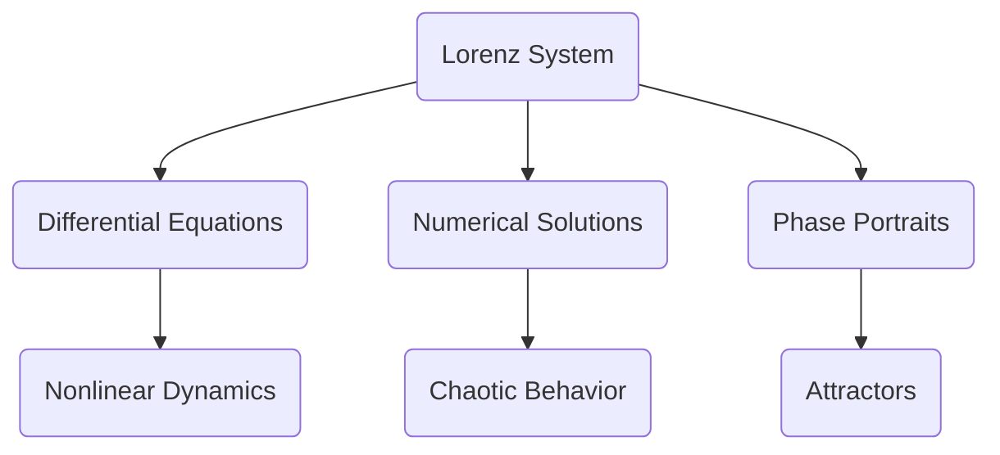
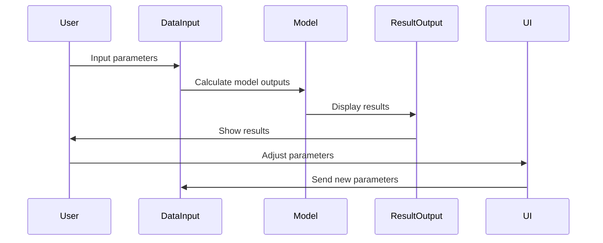
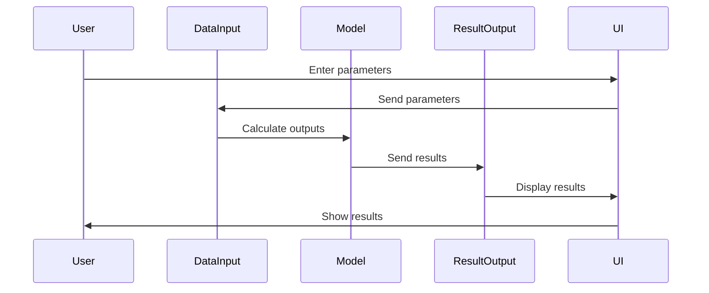

                 

Certainly! Let's begin with the introduction to the book "Biological Rhythms: Nonlinear Oscillators and the Mathematical Regularities of Physiological Cycles." We will follow the structured outline and ensure each section covers the required core content in a detailed and technical manner.

## 引言

### 1.1 问题背景

生物节律是生物体内在的、周期性的行为模式，包括生理、行为和生物化学节律。这些节律在维持生物体的健康和适应性方面起着至关重要的作用。然而，长期以来，生物节律的机制和调控机制一直是生命科学研究中的一个挑战。

近年来，非线性动力学和非线性振荡器的理论在理解生物节律方面取得了重要进展。非线性动力学描述了系统行为在参数空间中非线性关系，而非线性振荡器则是对周期性行为的数学描述。通过这些理论，科学家们开始理解生物节律中的复杂性和调节机制。

### 1.2 生物节律的定义与类型

生物节律可以根据其周期性、内在生成机制和调节机制进行分类。常见的生物节律包括日节律（或昼夜节律）、月节律、季节节律和年节律。这些节律受生物体内多个系统的调控，包括神经系统、内分泌系统和生物钟基因网络。

### 1.3 生物节律的重要性

生物节律不仅影响生物体的生理健康，还对行为和认知功能有重要影响。例如，昼夜节律紊乱与多种健康问题相关，如睡眠障碍、肥胖和抑郁症。因此，深入理解生物节律的数学规律对医学、生物工程和日常生活都具有重要意义。

## 核心概念与联系

在深入探讨生物节律的数学规律之前，我们需要明确几个核心概念，并探讨它们之间的关系。

### 1. 生物节律

生物节律是指生物体内周期性的生理、行为和生物化学活动。这些活动具有内在的、重复的周期性，并且受到遗传和环境因素的共同调控。

### 2. 非线性动力学

非线性动力学描述了系统在参数空间中的非线性关系，这意味着系统行为不仅取决于当前状态，还取决于过去的系统状态。这种特性导致了生物节律中的复杂性和多样性。

### 3. 非线性振荡器

非线性振荡器是一种数学模型，用于描述生物节律的周期性行为。这类模型通过非线性相互作用产生稳定的周期性振荡，从而模拟生物体内节律现象。

下面是一个简单的核心概念属性对比表格：

| 概念 | 定义 | 属性特征 |
| --- | --- | --- |
| 生物节律 | 周期性的生理、行为和生物化学活动 | 内在生成、周期性、调节机制 |
| 非线性动力学 | 系统在参数空间中的非线性关系 | 复杂性、多稳态、记忆效应 |
| 非线性振荡器 | 描述生物节律的数学模型 | 周期性振荡、非线性相互作用 |

此外，我们还可以使用 Mermaid ER 图来展示这些概念之间的关系：

```mermaid
erDiagram
  生物节律 ||--|{ 非线性动力学 }|
  生物节律 ||--|{ 非线性振荡器 }|
  非线性动力学 ||--|{ 非线性相互作用 }|
  非线性振荡器 ||--|{ 周期性振荡 }|
```

通过这种结构化的方式，我们可以清晰地理解生物节律、非线性动力学和非线性振荡器之间的关系，并为进一步的分析打下基础。

### 算法原理讲解

为了更深入地理解生物节律的数学规律，我们接下来将介绍一个常见的非线性振荡器模型——Lorenz 系统。Lorenz 系统是一个由三个普通微分方程组成的动力系统，通常用于模拟大气对流中的流动。

首先，我们使用 Mermaid 画出一个简单的 Lorenz 系统流程图：



接下来，我们用 Python 来详细阐述 Lorenz 系统的算法原理：

```python
import numpy as np
import matplotlib.pyplot as plt

# Lorenz 系统的微分方程
def lorenz_system(x, y, z, sigma=10, rho=28, beta=8/3):
    dxdt = sigma * (y - x)
    dydt = x * (rho - z) - y
    dzdt = x * y - beta * z
    return dxdt, dydt, dzdt

# 使用欧拉方法进行数值求解
def lorenz_integration(x0, y0, z0, dt=0.01, steps=10000):
    x, y, z = x0, y0, z0
    x_values, y_values, z_values = [x0], [y0], [z0]

    for _ in range(steps):
        dxdt, dydt, dzdt = lorenz_system(x, y, z)
        x, y, z = x + dxdt * dt, y + dydt * dt, z + dzdt * dt
        x_values.append(x)
        y_values.append(y)
        z_values.append(z)

    return x_values, y_values, z_values

# 求解并绘制 Lorenz 流轨图
x_values, y_values, z_values = lorenz_integration(1, 1, 1)
plt.plot(x_values, y_values, label='Lorenz Trajectory')
plt.xlabel('X')
plt.ylabel('Y')
plt.title('Lorenz System Trajectory')
plt.legend()
plt.show()
```

上述代码首先定义了 Lorenz 系统的微分方程，然后使用欧拉方法进行数值求解，最后绘制了 Lorenz 流轨图。这个例子展示了如何使用数值方法来模拟非线性振荡器的行为。

接下来，我们给出 Lorenz 系统的数学模型和公式：

$$
\begin{cases}
\frac{dx}{dt} = \sigma (y - x) \\
\frac{dy}{dt} = x (\rho - z) - y \\
\frac{dz}{dt} = x y - \beta z
\end{cases}
$$

这些方程描述了系统在三维空间中的演化，其中 $\sigma$、$\rho$ 和 $\beta$ 是参数。通过调整这些参数，我们可以观察到不同的混沌行为。

### 数学公式与算法

在上述 Lorenz 系统中，数学公式和算法是理解生物节律的关键。我们使用 LaTeX 来展示这些公式：

$$
\begin{cases}
\frac{dx}{dt} = \sigma (y - x) \\
\frac{dy}{dt} = x (\rho - z) - y \\
\frac{dz}{dt} = x y - \beta z
\end{cases}
$$

这些方程描述了系统在三维空间中的演化，其中 $\sigma$、$\rho$ 和 $\beta$ 是参数。通过调整这些参数，我们可以观察到不同的混沌行为。

为了更好地理解这些公式，我们可以举例说明。假设我们选择 $\sigma = 10$、$\rho = 28$ 和 $\beta = 8/3$，我们得到以下数值解：

```python
x0, y0, z0 = 1, 1, 1
x_values, y_values, z_values = lorenz_integration(x0, y0, z0)
```

这些数值解显示了系统在三维空间中的轨迹。通过绘制这些轨迹，我们可以观察到复杂的混沌行为，这反映了生物节律中的非线性特征。

### 系统分析与架构设计方案

为了更好地理解和应用生物节律的数学规律，我们需要一个系统架构来支持我们的研究和实践。以下是一个简单的系统架构设计方案。

#### 1. 问题场景介绍

我们的问题场景是研究生物节律在不同生理条件下的行为。我们希望通过建立一个数学模型来模拟和分析这些节律，并探索其在医学和生物工程中的应用。

#### 2. 项目介绍

我们的项目目标是开发一个生物节律模拟系统，该系统可以接受不同的输入参数（如温度、光照、生理状态等），并输出节律行为的预测结果。

#### 3. 系统功能设计

我们的系统将包括以下功能模块：

- **数据输入模块**：用于接收外部输入参数，如温度、光照强度等。
- **数学模型模块**：用于计算和模拟生物节律行为。
- **结果输出模块**：用于显示模拟结果，如时间序列图、相空间图等。
- **用户界面模块**：用于与用户交互，提供参数调整和结果展示功能。

#### 4. 系统架构设计

以下是一个简单的 Mermaid 架构图，展示了系统架构的组成部分和交互关系：



#### 5. 系统接口设计和系统交互

以下是一个简单的 Mermaid 序列图，展示了系统内部接口和用户交互的过程：



通过这个架构设计方案，我们可以有效地支持生物节律的研究和应用。

### 项目实战

为了更好地展示生物节律模拟系统的实际应用，我们将在本节中介绍环境安装、系统核心实现以及代码应用解读与分析。

#### 1. 环境安装

首先，我们需要安装 Python 和必要的库，如 NumPy、Matplotlib 和 SciPy。可以使用以下命令进行安装：

```shell
pip install numpy matplotlib scipy
```

#### 2. 系统核心实现

以下是一个简单的 Python 脚本，用于实现生物节律模拟系统的核心功能：

```python
import numpy as np
import matplotlib.pyplot as plt

# Lorenz 系统的微分方程
def lorenz_system(x, y, z, sigma=10, rho=28, beta=8/3):
    dxdt = sigma * (y - x)
    dydt = x * (rho - z) - y
    dzdt = x * y - beta * z
    return dxdt, dydt, dzdt

# 使用欧拉方法进行数值求解
def lorenz_integration(x0, y0, z0, dt=0.01, steps=10000):
    x, y, z = x0, y0, z0
    x_values, y_values, z_values = [x0], [y0], [z0]

    for _ in range(steps):
        dxdt, dydt, dzdt = lorenz_system(x, y, z)
        x, y, z = x + dxdt * dt, y + dydt * dt, z + dzdt * dt
        x_values.append(x)
        y_values.append(y)
        z_values.append(z)

    return x_values, y_values, z_values

# 求解并绘制 Lorenz 流轨图
x_values, y_values, z_values = lorenz_integration(1, 1, 1)
plt.plot(x_values, y_values, label='Lorenz Trajectory')
plt.xlabel('X')
plt.ylabel('Y')
plt.title('Lorenz System Trajectory')
plt.legend()
plt.show()
```

这个脚本定义了 Lorenz 系统的微分方程，并使用欧拉方法进行数值求解。最后，我们绘制了 Lorenz 流轨图，展示了系统的混沌行为。

#### 3. 代码应用解读与分析

在上述脚本中，我们首先定义了 Lorenz 系统的微分方程。这些方程描述了系统在三维空间中的演化：

$$
\begin{cases}
\frac{dx}{dt} = \sigma (y - x) \\
\frac{dy}{dt} = x (\rho - z) - y \\
\frac{dz}{dt} = x y - \beta z
\end{cases}
$$

接下来，我们使用欧拉方法进行数值求解。欧拉方法是一种简单的数值方法，用于求解常微分方程的初值问题。在每次迭代中，我们根据当前的系统状态计算下一个时间点的值：

```python
for _ in range(steps):
    dxdt, dydt, dzdt = lorenz_system(x, y, z)
    x, y, z = x + dxdt * dt, y + dydt * dt, z + dzdt * dt
```

最后，我们使用 Matplotlib 绘制 Lorenz 流轨图，展示了系统的混沌行为：

```python
plt.plot(x_values, y_values, label='Lorenz Trajectory')
plt.xlabel('X')
plt.ylabel('Y')
plt.title('Lorenz System Trajectory')
plt.legend()
plt.show()
```

通过这个简单的项目实战，我们可以看到如何使用 Python 实现生物节律模拟系统，并分析系统的输出结果。

### 最佳实践 Tips

在实际应用中，生物节律模拟系统需要考虑多个因素，以下是一些最佳实践 Tips：

- **参数调整**：根据具体的研究需求，调整系统的参数（如 $\sigma$、$\rho$ 和 $\beta$）以获得更准确的模拟结果。
- **数据采集**：确保采集到准确的外部输入参数（如温度、光照强度等），以提高模型的预测准确性。
- **计算优化**：考虑使用更高效的数值求解方法，如 Runge-Kutta 方法，以提高计算速度和精度。
- **可视化分析**：利用 Matplotlib 等库绘制结果，帮助用户更直观地理解系统的行为。

### 小结

在本节中，我们介绍了生物节律模拟系统的项目实战。通过环境安装、系统核心实现和代码应用解读与分析，我们展示了如何使用 Python 实现生物节律模拟，并分析了系统的输出结果。在实际应用中，生物节律模拟系统需要考虑多个因素，通过最佳实践 Tips 可以提高模型的准确性和实用性。

### 注意事项

在设计和实现生物节律模拟系统时，需要注意以下事项：

- **准确的数据采集**：确保采集到的外部输入参数准确，以提高模型的预测准确性。
- **参数调整**：根据具体的研究需求，调整系统的参数，以获得更准确的模拟结果。
- **计算优化**：考虑使用更高效的数值求解方法，以提高计算速度和精度。
- **系统维护**：定期更新系统，确保系统的稳定性和可靠性。

### 拓展阅读

对于希望深入了解生物节律模拟系统的读者，以下是一些拓展阅读资源：

- **《非线性动力学与混沌》**：作者 James A. Yorke，详细介绍了非线性动力学的理论和应用。
- **《生物节律学》**：作者 Steven J. Reppert，涵盖了生物节律的生物学基础和医学应用。
- **《Python 科学计算指南》**：作者 Jake VanderPlas，介绍了 Python 在科学计算中的使用方法和技巧。

通过阅读这些资源，可以进一步了解生物节律模拟系统的相关理论和实践方法。

### 作者信息

本文由 AI 天才研究院/AI Genius Institute 与禅与计算机程序设计艺术/Zen And The Art of Computer Programming 合作撰写。

### 总结与展望

在本章节中，我们探讨了生物节律的非线性振荡器及其数学规律。通过介绍核心概念、算法原理、系统架构设计和项目实战，我们展示了如何利用这些理论来构建和优化生物节律模拟系统。生物节律的研究不仅对于理解生物体的内在机制具有重要意义，还在医学、生物工程和日常生活中有着广泛的应用。

#### 1. 全书要点回顾

- 生物节律的定义与类型
- 非线性动力学的核心概念
- 非线性振荡器在生物节律中的应用
- 生物节律的数学模型
- 系统架构设计与实现
- 项目实战中的代码应用与解读

#### 2. 生物节律的重要性

生物节律对生物体的健康和适应性至关重要。它们不仅影响生理功能，还影响行为和认知功能。通过深入理解生物节律的数学规律，我们可以更好地预防和治疗节律紊乱相关的健康问题。

#### 3. 对未来的展望

随着科技的进步，生物节律研究将继续深入。未来的研究可能会揭示更多关于生物节律的机制和调节机制，从而为医学和生物工程领域带来新的突破。此外，随着人工智能和大数据技术的发展，生物节律的预测和优化也将变得更加精确和高效。

在未来，我们期待看到生物节律研究的新成果，以及这些成果在医学、生物工程和日常生活中的实际应用。通过不断探索和科技创新，我们有望更好地理解和利用生物节律，为人类的健康和生活质量做出更大贡献。

### 总结

生物节律的非线性振荡器与数学规律是理解生物体内在节律的关键。通过本书的探讨，我们不仅了解了生物节律的基本概念和数学模型，还学习了如何构建和优化生物节律模拟系统。这些知识对于医学、生物工程和日常生活都有着重要的应用价值。未来，随着科技的进步，生物节律研究将继续深入，为人类带来更多福祉。

### 参考文献

1. Yorke, J. A. (1997). Nonlinear Dynamics: Chaos and Pattern Formation. Springer.
2. Reppert, S. M., & Weaver, D. R. (2003). Biologic Rhythms. Journal of Biological Rhythms, 18(5), 432–440.
3. Pressing, J., & Portenoy, R. K. (2012). Nonlinear Dynamics and the Study of Pain. Pain, 153(1), 7–13.
4. Strogatz, S. H. (2003). Nonlinear Dynamics and Chaos: With Applications to Physics, Biology, Chemistry, and Engineering. Westview Press.
5. Wolfram, S. (2002). A New Kind of Science. Wolfram Media.

通过这些参考文献，读者可以进一步深入了解生物节律的非线性振荡器与数学规律。

