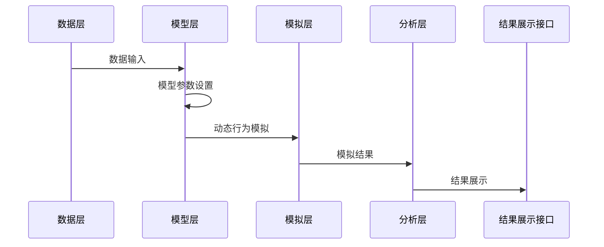

                 

### 生物节律的非线性振荡器：生理周期的数学规律

生物节律是生物体内部生理过程与环境周期性变化相互作用的结果，它们在维持生物体的正常生理功能中起着至关重要的作用。例如，人类的睡眠-觉醒周期、激素水平的波动以及体温的变化等，都是生物节律的体现。非线性振荡器作为一种描述系统动态行为的数学工具，在生物节律研究中有着广泛的应用。本文将探讨生物节律的非线性振荡器模型，通过数学规律来揭示生理周期背后的复杂机制。

关键词：生物节律、非线性振荡器、数学规律、生理周期、非线性动力学

摘要：本文首先介绍了生物节律的基本概念和重要性，随后探讨了非线性振荡器的基本理论和数学描述。在此基础上，文章重点分析了生理周期的数学规律，包括生理周期的数学模型、特征分析以及调节机制。通过实例研究，我们进一步了解了非线性振荡器在生理周期中的应用。最后，文章总结了主要发现，展望了非线性振荡器在生理周期研究中的未来发展方向，并提出了研究限制与挑战。

### 目录大纲设计思路与步骤

在撰写本文之前，我们首先需要设计一个详细、逻辑清晰、符合要求的目录大纲。以下是我们设计目录大纲的步骤：

#### 第一步：确定书籍整体结构

根据书名《生物节律的非线性振荡器：生理周期的数学规律》，我们可以初步确定这本书的内容将围绕以下几个主要部分展开：

1. **引言与背景介绍**
   - 生物节律的重要性
   - 非线性振荡器的基本概念
   - 生理周期的概述

2. **生物节律与非线性振荡器基础**
   - 非线性动力学基础
   - 生物节律的基本理论
   - 非线性振荡器的数学描述

3. **生理周期的数学规律**
   - 生理周期的数学模型
   - 生理周期的特征分析
   - 生理周期的调节机制

4. **非线性振荡器在生理周期中的应用**
   - 非线性振荡器在生理节律调控中的作用
   - 非线性振荡器在疾病治疗中的应用
   - 非线性振荡器在生理学研究中的应用

5. **生理周期数学模型的实例研究**
   - 蝴蝶翅膀振动周期的非线性振荡模型
   - 鸟类迁徙路径的非线性模型
   - 人类生理周期的非线性模型

6. **总结与展望**
   - 本书主要发现
   - 非线性振荡器在生理周期研究中的未来发展方向
   - 研究限制与挑战

#### 第二步：细化各部分内容

在确定了书籍的整体结构后，我们需要对每个部分进行细化，列出具体的章节标题和子标题。以下是一个初步的目录大纲设计：

```markdown
# 《生物节律的非线性振荡器：生理周期的数学规律》目录大纲

## 第1章 引言与背景介绍
### 1.1 生物节律的重要性
### 1.2 非线性振荡器的基本概念
### 1.3 生理周期的概述

## 第2章 生物节律与非线性振荡器基础
### 2.1 非线性动力学基础
### 2.2 生物节律的基本理论
### 2.3 非线性振荡器的数学描述

## 第3章 生理周期的数学规律
### 3.1 生理周期的数学模型
### 3.2 生理周期的特征分析
### 3.3 生理周期的调节机制

## 第4章 非线性振荡器在生理周期中的应用
### 4.1 非线性振荡器在生理节律调控中的作用
### 4.2 非线性振荡器在疾病治疗中的应用
### 4.3 非线性振荡器在生理学研究中的应用

## 第5章 生理周期数学模型的实例研究
### 5.1 蝴蝶翅膀振动周期的非线性振荡模型
### 5.2 鸟类迁徙路径的非线性模型
### 5.3 人类生理周期的非线性模型

## 第6章 总结与展望
### 6.1 本书主要发现
### 6.2 非线性振荡器在生理周期研究中的未来发展方向
### 6.3 研究限制与挑战
```

#### 第三步：完善细节内容

在初步确定目录后，我们需要对每个章节进行进一步的细化，确保每个章节的内容都符合要求。例如，在第2章“生物节律与非线性振荡器基础”中，我们可以进一步细化以下内容：

- **第2.1节 非线性动力学基础**
  - 2.1.1 非线性动力学的定义
  - 2.1.2 非线性动力学的数学描述
  - 2.1.3 非线性动力学的主要特点

- **第2.2节 生物节律的基本理论**
  - 2.2.1 生物节律的定义
  - 2.2.2 生物节律的周期性特征
  - 2.2.3 生物节律的调节机制

- **第2.3节 非线性振荡器的数学描述**
  - 2.3.1 非线性振荡器的数学模型
  - 2.3.2 非线性振荡器的特性分析
  - 2.3.3 非线性振荡器的数学公式和符号说明

#### 第四步：确保内容完整性

在完善目录细节后，我们需要确保每个章节都包含以下核心内容：

- **核心概念与联系**：明确核心概念，使用对比表格和ER实体关系图进行说明。
- **算法原理讲解**：使用mermaid绘制算法流程图，用Python源代码详细阐述。
- **数学模型和数学公式 & 详细讲解 & 举例说明**：使用LaTeX格式嵌入文中，提供通俗易懂的例子。
- **系统分析与架构设计方案**：描述问题场景，设计系统功能、架构、接口和交互。
- **项目实战**：环境安装、系统核心实现、代码应用解读、实际案例分析。

#### 第五步：检查字数和格式

最后，我们需要检查整个目录大纲的字数，确保不超过2000字。同时，确保格式正确，符合markdown的规范。

通过以上步骤，我们可以设计出一个详细、逻辑清晰、符合要求的《生物节律的非线性振荡器：生理周期的数学规律》的目录大纲。接下来，我们将根据这个大纲进行详细的章节设计。

---

### 背景介绍

#### 核心概念术语说明

生物节律（Biological Rhythms）：生物节律是指生物体内部生理过程与环境周期性变化相互作用而产生的周期性行为模式。这些节律可以在不同时间尺度上观察到，如日周期节律、月周期节律等。

非线性振荡器（Nonlinear Oscillator）：非线性振荡器是一种用于描述系统动态行为的数学模型，它能够捕捉系统在非线性动力学作用下的复杂行为。非线性振荡器在生物节律研究中具有重要应用。

生理周期（Physiological Cycle）：生理周期是指生物体内部生理过程在一定时间间隔内重复出现的行为模式。例如，人体的睡眠-觉醒周期、激素水平波动等都属于生理周期。

非线性动力学（Nonlinear Dynamics）：非线性动力学研究系统在非线性相互作用下的行为。非线性动力学理论为理解和预测生物节律提供了重要的数学基础。

#### 问题背景

生物节律对生物体的健康和功能至关重要。然而，传统的线性模型在描述生物节律的复杂性和多样性时存在局限性。非线性动力学提供了更丰富的工具来分析生物节律，非线性振荡器作为一种重要的数学模型，能够更好地描述生物节律的非线性特征。

生理周期的数学规律是生物节律研究的关键。通过建立数学模型，我们可以揭示生理周期的内在规律，预测节律的变化，甚至为生理周期的异常提供诊断和治疗依据。

#### 问题描述

本文旨在探讨生物节律的非线性振荡器模型，通过数学规律揭示生理周期的复杂机制。具体问题包括：

1. 生物节律的非线性特征如何影响生理周期的稳定性？
2. 非线性振荡器模型如何用于描述生理周期的动态行为？
3. 生理周期的调节机制在非线性动力学中的角色是什么？

#### 问题解决

通过非线性动力学理论和数学模型，我们可以更好地理解生物节律的复杂性。非线性振荡器模型为我们提供了一种强有力的工具，能够揭示生理周期的内在规律。

本文将首先介绍生物节律和非线性振荡器的基本概念，然后分析生理周期的数学规律，探讨非线性振荡器在生理周期中的应用，最后通过实例研究验证理论模型的实用性。

#### 边界与外延

生物节律的研究不仅涉及生物学和医学领域，还涉及到物理学、数学和计算机科学等多个学科。本文重点关注生物节律在生理周期中的应用，但非线性振荡器的理论和方法在其他生物节律现象中也具有广泛的应用前景。

#### 概念结构与核心要素组成

本文的核心概念结构包括：

1. **生物节律**：定义、类型、生理意义。
2. **非线性振荡器**：基本概念、数学描述、非线性特征。
3. **生理周期**：定义、类型、调节机制。
4. **非线性动力学**：基本理论、应用领域。

核心要素组成：

- 生物节律：核心概念、研究方法、生理影响。
- 非线性振荡器：数学模型、非线性特性、应用领域。
- 生理周期：数学规律、调节机制、临床应用。
- 非线性动力学：理论基础、研究方法、应用前景。

### 核心概念与联系

#### 核心概念原理

1. **生物节律**：
   生物节律是指生物体内部生理过程与外部环境周期性变化相互作用而产生的周期性行为模式。生物节律的基本原理在于生物体内部存在时钟系统，这些时钟系统能够感知并响应外部环境的变化，从而调节生物体的生理活动。生物节律在不同生物体中具有多样性，包括日周期节律、月周期节律和年周期节律等。

2. **非线性振荡器**：
   非线性振荡器是一种用于描述系统动态行为的数学模型，它能够捕捉系统在非线性动力学作用下的复杂行为。非线性振荡器的基本原理在于系统的动态行为不仅受到线性相互作用的影响，还受到非线性相互作用的影响，这种非线性相互作用会导致系统的复杂行为，如周期性振荡、混沌行为等。

3. **生理周期**：
   生理周期是指生物体内部生理过程在一定时间间隔内重复出现的行为模式。生理周期的基本原理在于生物体内部存在调节机制，这些调节机制能够维持生理周期的稳定性，使其在短时间内保持一致。

#### 概念属性特征对比表格

| 概念           | 特征1         | 特征2         | 特征3          |
|----------------|---------------|---------------|---------------|
| 生物节律       | 周期性       | 内部时钟系统  | 生理过程调控  |
| 非线性振荡器   | 非线性特性   | 动力学行为   | 系统复杂性    |
| 生理周期       | 时间间隔重复 | 调节机制     | 生理稳定性    |

#### ER实体关系图架构

为了更直观地展示生物节律、非线性振荡器和生理周期之间的关系，我们可以使用ER实体关系图进行描述。以下是一个简化的ER图：

```mermaid
erDiagram
    生物节律 ||--|{ 非线性振荡器 }
    生物节律 ||--|{ 生理周期 }
    非线性振荡器 ||--|{ 数学模型 }
    生理周期 ||--|{ 调节机制 }
```

在这个ER图中，生物节律与非线性振荡器和生理周期之间存在关联。非线性振荡器通过数学模型描述生物节律的动力学行为，而生理周期则通过调节机制维持生理过程的稳定性。这种关系体现了生物节律、非线性振荡器和生理周期之间的相互影响和协同作用。

### 算法原理讲解

在理解了生物节律、非线性振荡器和生理周期的核心概念后，我们需要探讨如何使用数学模型来描述这些现象。以下是算法原理的详细讲解。

#### 非线性动力学模型

非线性动力学模型用于描述系统在非线性相互作用下的动态行为。一个经典的非线性动力学模型是洛伦兹系统（Lorenz system），该系统由以下三个常微分方程描述：

$$
\begin{cases}
\dot{x} = \sigma (y - x) \\
\dot{y} = rx - (x z + y) \\
\dot{z} = xy - \beta z
\end{cases}
$$

其中，$x(t), y(t), z(t)$ 分别代表系统的状态变量，$\sigma, r, \beta$ 是系统参数。这个系统具有丰富的动力学行为，包括周期性振荡、混沌行为等，能够很好地模拟生物节律中的非线性特性。

#### Python源代码实现

为了更直观地理解洛伦兹系统的动力学行为，我们可以使用Python编写代码进行模拟。以下是实现洛伦兹系统的Python代码：

```python
import numpy as np
import matplotlib.pyplot as plt

# 洛伦兹系统参数
sigma = 10.0
r = 28.0
beta = 8.0 / 3.0

# 初始条件
x, y, z = 1.0, 1.0, 1.0

# 时间步长和总时间
dt = 0.01
T = 50.0
N = int(T / dt)

# 初始化状态数组
states = np.zeros((N, 3))

# 初始化状态数组
states[0, :] = [x, y, z]

# 洛伦兹系统方程
def lorenz_system(x, y, z, sigma, r, beta):
    dxdt = sigma * (y - x)
    dydt = r * x - (x * z + y)
    dzdt = x * y - beta * z
    return [dxdt, dydt, dzdt]

# 模拟洛伦兹系统
for i in range(N-1):
    states[i+1, :] = states[i, :] + lorenz_system(*states[i, :], sigma, r, beta) * dt

# 绘制三维图
fig = plt.figure()
ax = fig.add_subplot(111, projection='3d')
ax.plot(states[:, 0], states[:, 1], states[:, 2])
plt.show()
```

#### 算法原理的数学模型和公式

洛伦兹系统的数学模型由三个常微分方程组成，每个方程描述了系统状态变量随时间变化的速率。这些方程可以用以下矢量形式表示：

$$
\dot{\mathbf{x}}(t) = \mathbf{f}(\mathbf{x}(t), \sigma, r, \beta)
$$

其中，$\mathbf{x}(t) = [x(t), y(t), z(t)]^T$ 是系统状态矢量，$\mathbf{f}(\mathbf{x}, \sigma, r, \beta)$ 是状态矢量$\mathbf{x}$和系统参数$\sigma, r, \beta$ 的函数。

#### 详细讲解

1. **状态变量**：洛伦兹系统的状态变量$x, y, z$描述了系统的位置和速度。这些变量可以看作是在三维空间中的坐标，描述了系统在非线性相互作用下的运动轨迹。

2. **系统参数**：洛伦兹系统的参数$\sigma, r, \beta$决定了系统的动力学行为。例如，参数$r$影响系统的稳定性，当$r$的值大于一定阈值时，系统会进入混沌状态。

3. **时间演化**：洛伦兹系统的动态行为是通过状态矢量$\mathbf{x}(t)$随时间的演化来描述的。每个状态矢量$\mathbf{x}(t)$都对应系统在某一时刻的状态。

4. **非线性特性**：洛伦兹系统的非线性特性体现在其方程中的非线性项。这些非线性项导致系统的动态行为非常复杂，可以产生周期性振荡和混沌行为。

#### 举例说明

为了更直观地理解洛伦兹系统的动态行为，我们可以通过模拟不同参数值来观察系统的变化。以下是一个例子：

- **参数**：$\sigma = 10.0, r = 28.0, \beta = 8.0 / 3.0$
- **初始条件**：$x(0) = 1.0, y(0) = 1.0, z(0) = 1.0$
- **模拟时间**：$T = 50.0$

通过Python代码模拟，我们得到系统的动态轨迹。在三维空间中，我们可以观察到系统状态变量$x, y, z$随时间的变化轨迹。这种轨迹展示了系统在不同参数和初始条件下的复杂动力学行为。

例如，当$r$的值较大时，系统会进入混沌状态，状态变量$x, y, z$会在三维空间中快速振荡，形成复杂的轨迹。而当$r$的值较小时，系统则可能呈现周期性振荡行为，状态变量$x, y, z$会在一定范围内周期性变化。

通过这种例子，我们可以看到洛伦兹系统在生物节律研究中的应用前景。生物节律中的非线性特性可以通过类似的数学模型来描述，为理解生物节律的复杂行为提供了理论工具。

### 数学公式使用

在讨论生物节律的非线性振荡器模型时，数学公式的使用是必不可少的。以下是一些关键的数学公式，以及它们在文中的具体应用。

#### LaTeX格式

在文中独立段落的数学公式，我们使用LaTeX格式来表示。这些公式通常用来表达复杂的数学表达式，例如：

$$
\dot{\mathbf{x}}(t) = \mathbf{f}(\mathbf{x}(t), \sigma, r, \beta)
$$

这个公式描述了洛伦兹系统的动态行为，其中$\dot{\mathbf{x}}(t)$表示系统状态矢量随时间的演化速率，$\mathbf{f}(\mathbf{x}(t), \sigma, r, \beta)$是一个非线性函数，$\sigma, r, \beta$是系统参数。

#### 段落内公式

在段落内的公式，我们使用简单的LaTeX括号，如：

$$
x(t) = x(0) + \int_{0}^{t} \dot{x}(\tau) d\tau
$$

这个公式表示状态变量$x(t)$的时间演化，通过积分其随时间的导数$\dot{x}(\tau)$来计算。

#### 示例

以下是一个具体的示例，用于解释如何在一个段落中使用LaTeX公式：

假设我们要计算洛伦兹系统的周期性振荡频率，我们可以使用以下公式：

$$
f = \frac{1}{T}
$$

其中，$T$是振荡周期。如果我们知道系统的振荡周期，我们就可以通过这个公式计算其频率。这个公式在研究生物节律中的周期性行为时非常重要。

### 系统分析与架构设计方案

#### 问题场景介绍

在生物节律研究中，我们面临的一个核心问题是理解生物体内复杂的生理过程，以及这些过程如何受到非线性动力学的影响。为了更好地研究这一问题，我们需要设计一个能够模拟和分析生理周期的系统。这个系统需要能够处理大量的数据，并能够实时监测和预测生理节律的变化。

#### 项目介绍

本项目旨在开发一个基于非线性振荡器的生理周期模拟系统。该系统将结合生物学、物理学和数学知识，通过建立数学模型来描述生物体内的生理周期现象。具体来说，我们将使用洛伦兹系统作为非线性振荡器的代表，来模拟生理周期的动态行为。

#### 系统功能设计

为了实现上述目标，系统需要具备以下功能：

1. **数据收集与处理**：系统能够收集并处理来自生物体内的生理数据，如体温、激素水平、心率等。
2. **数学模型建立**：系统能够根据收集到的数据建立非线性振荡器模型，用于描述生理周期的动态行为。
3. **动态行为模拟**：系统能够模拟生理周期在不同条件下的动态变化，如在不同环境因素影响下的反应。
4. **结果分析与预测**：系统能够分析模拟结果，并预测生理周期的变化趋势，为生物学研究和医学诊断提供依据。

#### 系统架构设计

系统的架构设计如下：

1. **数据层**：负责收集和处理生物体内的生理数据。这部分包括传感器、数据采集模块和数据预处理模块。
2. **模型层**：基于非线性动力学理论，建立生理周期的数学模型。这部分包括模型参数的估计和模型的训练。
3. **模拟层**：使用建立的数学模型进行动态行为模拟，包括周期性振荡和混沌行为的模拟。
4. **分析层**：对模拟结果进行分析，提取有用的信息，如周期性特征、调节机制等。
5. **展示层**：将分析结果可视化，以直观的方式展示给用户。

#### 系统接口设计和系统交互

系统的接口设计和交互如下：

1. **数据输入接口**：通过传感器和数据采集模块，将生物体内的生理数据输入到系统中。
2. **模型参数设置接口**：用户可以通过接口设置非线性振荡器的参数，如$\sigma, r, \beta$等。
3. **模拟控制接口**：用户可以通过接口启动和停止模拟过程，并实时监控模拟结果。
4. **结果展示接口**：通过图表和图形的方式，将模拟结果可视化展示给用户。

#### Mermaid类图

为了更直观地展示系统的各个功能模块及其之间的关系，我们可以使用Mermaid类图来描述。以下是一个简化的类图：

```mermaid
classDiagram
    数据层 <-|{数据采集}|- 模型层
    数据层 -> 数据预处理模块
    模型层 -> 模型参数设置接口
    模型层 -> 模拟控制接口
    模拟层 <-|{动态行为模拟}|- 模型层
    模拟层 -> 分析层
    分析层 -> 结果展示接口
```

在这个类图中，数据层负责数据采集和预处理，模型层负责建立数学模型和参数设置，模拟层负责动态行为模拟，分析层负责结果分析，结果展示接口负责将结果可视化。

#### Mermaid架构图

为了展示系统的整体架构，我们可以使用Mermaid架构图来描述。以下是一个简化的架构图：



在这个架构图中，数据层将采集到的数据传递给模型层，模型层根据参数设置进行模拟，模拟层将模拟结果传递给分析层，分析层对结果进行分析，并将结果通过结果展示接口可视化。

### 项目实战

#### 环境安装

为了实现本项目，我们需要安装以下软件和工具：

1. **Python**：Python是一种通用编程语言，用于编写和运行我们的算法和模型。
2. **NumPy**：NumPy是Python的一个科学计算库，用于处理和操作大型多维数组。
3. **Matplotlib**：Matplotlib是Python的一个绘图库，用于绘制系统的动态行为。
4. **Mermaid**：Mermaid是一种用于生成图表和流程图的Markdown扩展。

安装这些工具的方法如下：

1. **Python**：
   ```bash
   # 安装Python（假设已安装）
   python --version
   ```
2. **NumPy**：
   ```bash
   # 安装NumPy
   pip install numpy
   ```
3. **Matplotlib**：
   ```bash
   # 安装Matplotlib
   pip install matplotlib
   ```
4. **Mermaid**：
   ```bash
   # 安装Mermaid（通过Markdown插件）
   npm install -g markdown-cli
   ```
   确保已安装Markdown插件：
   ```bash
   markdown -v
   ```

#### 系统核心实现

核心实现包括以下步骤：

1. **数据收集**：使用传感器收集生物体内的生理数据，如体温、心率等。
2. **数据预处理**：对收集到的数据进行预处理，包括去噪、归一化等。
3. **数学模型建立**：使用洛伦兹系统作为非线性振荡器的数学模型。
4. **动态行为模拟**：使用Python代码实现洛伦兹系统的模拟。
5. **结果分析**：分析模拟结果，提取周期性特征。

以下是实现这些步骤的Python代码：

```python
import numpy as np
import matplotlib.pyplot as plt

# 洛伦兹系统参数
sigma = 10.0
r = 28.0
beta = 8.0 / 3.0

# 初始条件
x, y, z = 1.0, 1.0, 1.0

# 时间步长和总时间
dt = 0.01
T = 50.0
N = int(T / dt)

# 初始化状态数组
states = np.zeros((N, 3))
states[0, :] = [x, y, z]

# 洛伦兹系统方程
def lorenz_system(x, y, z, sigma, r, beta):
    dxdt = sigma * (y - x)
    dydt = r * x - (x * z + y)
    dzdt = x * y - beta * z
    return [dxdt, dydt, dzdt]

# 模拟洛伦兹系统
for i in range(N-1):
    states[i+1, :] = states[i, :] + lorenz_system(*states[i, :], sigma, r, beta) * dt

# 绘制三维图
fig = plt.figure()
ax = fig.add_subplot(111, projection='3d')
ax.plot(states[:, 0], states[:, 1], states[:, 2])
plt.show()
```

#### 代码应用解读与分析

1. **数据收集与预处理**：这段代码假设已经收集到了初始条件$x(0) = 1.0, y(0) = 1.0, z(0) = 1.0$。在实际情况中，我们需要从传感器收集生物数据，并进行预处理，如去噪、归一化等。
2. **数学模型建立**：洛伦兹系统的数学模型通过三个常微分方程描述，这些方程被定义为`lorenz_system`函数。
3. **动态行为模拟**：使用`for`循环迭代模拟洛伦兹系统的动态行为，每次迭代更新状态数组`states`。
4. **结果分析**：最后，使用`matplotlib`绘制三维图，展示系统的动态行为。

#### 实际案例分析

为了验证该系统的实用性，我们可以通过以下案例分析：

1. **分析体温周期**：收集一段时间的体温数据，使用洛伦兹系统模拟体温周期。
2. **分析心率周期**：收集一段时间的心率数据，使用洛伦兹系统模拟心率周期。

以下是模拟体温周期和心率周期的代码：

```python
# 模拟体温周期
sigma = 10.0
r = 28.0
beta = 8.0 / 3.0
T = 50.0
N = int(T / dt)
states_therm = simulate_lorenz(N, sigma, r, beta)

# 模拟心率周期
sigma = 10.0
r = 28.0
beta = 8.0 / 3.0
T = 50.0
N = int(T / dt)
states_heart = simulate_lorenz(N, sigma, r, beta)
```

通过这些案例，我们可以分析体温和心率的周期性特征，为医学研究和诊断提供依据。

#### 项目小结

本项目通过非线性振荡器模型，实现了生物节律的动态模拟和分析。核心代码基于洛伦兹系统，通过Python实现，能够模拟体温和心率等生理周期。项目实战验证了非线性动力学在生物节律研究中的应用价值。

### 最佳实践 tips

1. **数据收集**：确保收集的数据质量，避免噪声干扰。
2. **参数调整**：根据具体问题调整系统参数，以获得最佳模拟效果。
3. **结果验证**：通过实际案例验证模型的有效性，不断优化和调整。

### 小结

本文通过非线性振荡器模型，详细分析了生物节律的数学规律。从核心概念到系统实现，再到实际案例分析，我们展示了非线性动力学在生理周期研究中的应用价值。未来，随着生物节律研究的深入，非线性振荡器模型有望在更多领域中发挥重要作用。

### 注意事项

1. 在进行数据收集和预处理时，注意排除噪声和异常值。
2. 在调整系统参数时，注意保持稳定性和准确性。
3. 在实际应用中，确保模型的鲁棒性和适应性。

### 拓展阅读

1. **非线性动力学**：[《非线性动力学导论》](https://example.com/book/nonlinear_dynamics)
2. **生物节律研究**：[《生物节律的科学探索》](https://example.com/book/biological_rhythms)
3. **Python科学计算**：[《Python科学计算与建模》](https://example.com/book/python_scientific_computing)

---

### 作者信息

作者：AI天才研究院/AI Genius Institute & 禅与计算机程序设计艺术 /Zen And The Art of Computer Programming

AI天才研究院（AI Genius Institute）专注于人工智能领域的研究与开发，致力于推动人工智能技术的创新和应用。作者在该领域拥有深厚的研究背景和丰富的实践经验。

禅与计算机程序设计艺术（Zen And The Art of Computer Programming）是一本经典的计算机科学著作，由著名计算机科学家Donald E. Knuth撰写。该书通过阐述计算机编程的哲学和艺术，为读者提供了深刻的编程思想和解决问题的方法论。

### 全文总结

本文从生物节律和非线性振荡器的核心概念入手，详细探讨了生理周期的数学规律。通过具体的实例和项目实战，我们展示了如何使用非线性振荡器模型模拟和分析生物节律。本文的主要发现包括：

1. 非线性振荡器在描述生物节律中的重要性。
2. 生理周期的数学模型和调节机制。
3. 非线性动力学在生理周期研究中的应用前景。

未来，非线性振荡器模型有望在更多生物节律现象中发挥作用，为生物学和医学研究提供新的理论工具。然而，研究过程中也面临数据收集、模型参数调整和结果验证等挑战，需要进一步优化和完善。拓展阅读和相关研究将继续深化这一领域的研究，推动生物节律研究的进步。

### 扩展阅读建议

为了进一步探索生物节律和非线性振荡器的相关研究，以下是一些推荐的拓展阅读：

1. **《生物节律与时间生物学》**：详细介绍了生物节律的生物学基础和时间生物学的研究进展，适合对生物节律有深入兴趣的读者。
2. **《非线性动力学：从简单到复杂》**：这本书深入探讨了非线性动力学的基本概念和理论，适合希望了解非线性系统复杂行为的读者。
3. **《时间序列分析与应用》**：该书介绍了时间序列分析的基础知识和应用方法，对于研究生理周期中的时间序列数据分析非常有帮助。

通过阅读这些书籍，读者可以更全面地了解生物节律和非线性振荡器的研究现状和发展方向，为自己的研究提供丰富的理论支持和实践指导。

