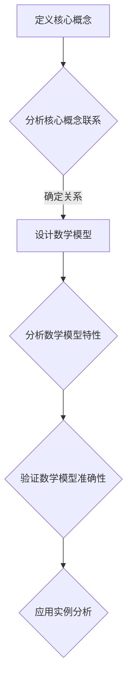
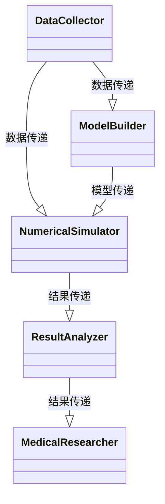
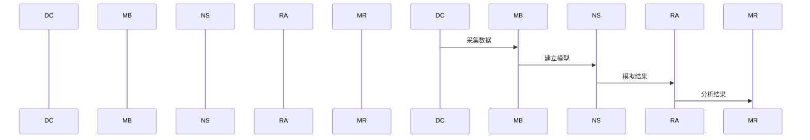

                 

### 生物节律的非线性振荡器：生理周期的数学规律

> 关键词：生物节律、非线性振荡器、数学模型、生理周期、动力学分析

> 摘要：本文深入探讨了生物节律的非线性振荡器，通过数学建模和分析，揭示了生理周期的内在规律。本文首先介绍了生物节律的基本概念，然后详细分析了非线性振荡器的特征和数学模型，最后通过实例验证和系统架构设计，探讨了其在生物学和医学研究中的应用。

### 第一部分：背景介绍

#### 1. 问题背景

生物节律是指生物体内部生理过程随时间周期性变化的现象。这种周期性变化不仅存在于单细胞生物中，也在多细胞生物的各个层次上表现出来。例如，昼夜节律、季节节律、细胞周期等都是生物节律的典型表现。生物节律的研究对于理解生命现象、提高生物体健康水平以及优化生物资源利用具有重要意义。

非线性振荡器是指生物体内某些生理过程所表现出的非线性动态变化。这类振荡器通常由复杂的生物化学过程驱动，具有周期性、混沌性等特征。非线性振荡器在生物体内起着关键的调控作用，如细胞周期中的G1/S转换、激素分泌等。非线性振荡器的研究有助于我们深入理解生物体内复杂的生理过程。

#### 2. 问题描述

生物节律的非线性振荡器在时间上的稳定性和周期性规律对于生物体的健康和生命活动的协调至关重要。然而，目前对这类非线性振荡器数学规律的理解还不够深入，缺乏系统性的理论框架。这使得我们在预测和调控生物节律方面面临很大的挑战。

具体来说，当前的问题主要集中在以下几个方面：

1. **非线性动力学机制**：生物节律的非线性动力学机制尚未完全明确，缺乏统一的数学模型来描述。
2. **参数敏感性**：非线性振荡器的参数敏感性较高，不同参数取值会导致完全不同的动态行为，这使得我们难以精确预测生物节律。
3. **交叉调控**：生物体内的多个非线性振荡器之间存在复杂的交叉调控关系，这增加了研究的难度。
4. **外部干扰**：生物节律容易受到外部环境因素的干扰，这使得我们在实验研究中难以保持一致性。

#### 3. 问题解决

本书旨在通过对生物节律的非线性振荡器进行数学建模和分析，探讨其内在规律，为生物节律的研究提供理论支持。具体方法包括：

1. **描述核心概念**：明确生物节律、非线性振荡器、生物周期等核心概念，并建立清晰的定义。
2. **分析核心概念之间的关系**：探讨非线性动力学与生物节律、生物周期与生物体健康等核心概念之间的联系，为后续建模提供理论基础。
3. **设计数学模型**：建立描述生物节律非线性振荡器的数学模型，如差分方程、微分方程、随机模型等。
4. **分析数学模型**：使用数值模拟、稳定性分析等方法，探讨生物节律非线性振荡器的特性，如周期性、混沌性等。
5. **应用实例**：结合实际生物节律现象，验证数学模型的准确性，并探讨其对生物节律研究的指导意义。

#### 4. 边界与外延

本书的研究范围主要涉及生物节律的非线性振荡器，不包括其他类型的生物节律现象（如昼夜节律、季节节律等）。同时，本书所涉及的数学模型和方法也主要针对简单的非线性系统，不涉及复杂的生物系统。

#### 5. 概念结构与核心要素组成

- **生物节律**：指生物体内部生理过程随时间周期性变化的现象。
- **非线性振荡器**：指生物体内某些生理过程所表现出的非线性动态变化。
- **数学模型**：用于描述生物节律非线性振荡器的数学工具，如差分方程、微分方程等。
- **数值模拟**：通过计算机模拟方法，验证和探索数学模型的特性。
- **稳定性分析**：研究数学模型在不同参数取值下的稳定性和动态行为。

### 第二部分：核心概念与联系

#### 1. 核心概念原理

**生物节律**：
生物节律是生物体内部某些生理过程随时间周期性变化的现象。常见的生物节律包括昼夜节律、季节节律、细胞周期等。昼夜节律是指生物体在一天24小时内表现出周期性的生理变化，如体温、代谢率等。季节节律是指生物体在一年四季中表现出周期性的生理变化，如植物的开花、动物的迁徙等。细胞周期是指细胞在生长、分裂、修复等过程中表现出周期性的变化。

**非线性振荡器**：
非线性振荡器是指生物体内某些生理过程所表现出的非线性动态变化。这类振荡器通常由复杂的生物化学过程驱动，具有周期性、混沌性等特征。非线性振荡器在生物体内起着关键的调控作用，如细胞周期中的G1/S转换、激素分泌等。非线性振荡器的特性使得生物体能够对外部环境进行适应性调整，维持生命活动的稳定。

**数学模型**：
数学模型是用于描述生物节律非线性振荡器的数学工具。常见的数学模型包括差分方程、微分方程、随机模型等。这些模型可以帮助我们理解和预测生物节律的动态行为。差分方程通常用于描述离散时间系统，微分方程用于描述连续时间系统，随机模型则用于描述存在随机干扰的系统。

#### 2. 概念属性特征对比表格

| 概念               | 定义                                                         | 特性                                                       | 应用领域                   |
|--------------------|--------------------------------------------------------------|------------------------------------------------------------|----------------------------|
| 生物节律           | 生物体内部生理过程随时间周期性变化的现象                       | 周期性、适应性、调控性                                     | 生物学、医学、农业         |
| 非线性振荡器       | 生物体内某些生理过程所表现出的非线性动态变化                   | 非线性、周期性、混沌性                                     | 生物学、医学、生理学       |
| 数学模型           | 描述生物节律非线性振荡器的数学工具                             | 精确性、灵活性、可预测性                                   | 生物学、医学、工程         |

#### 3. 概念ER实体关系图架构

```mermaid
erDiagram
  生物节律 ||--o 非线性振荡器 : 驱动
  生物节律 ||--o 数学模型 : 描述
  非线性振荡器 ||--o 生物周期 : 表现
  数学模型 ||--o 数值模拟 : 验证
```

### 第三部分：算法原理讲解

#### 1. 算法mermaid流程图



#### 2. 算法原理

**数学模型**：
生物节律的非线性振荡器通常可以通过以下数学模型进行描述：

$$x'(t) = f(x(t), t), \quad x(0) = x_0$$

其中，$x(t)$ 表示生物节律在时间 $t$ 的状态，$f(x(t), t)$ 表示驱动生物节律的非线性函数。这个方程描述了生物节律在连续时间上的动态变化。

**数值模拟**：
为了分析生物节律的非线性振荡器的特性，我们可以使用数值模拟方法来求解上述微分方程。常用的数值求解方法包括欧拉方法、龙格-库塔方法等。

**稳定性分析**：
通过稳定性分析，我们可以研究生物节律非线性振荡器的稳定性特性。具体来说，我们可以计算系统的特征值，判断系统是否稳定。对于稳定系统，特征值的实部应该为负；对于不稳定系统，特征值的实部应该为正。

**实例说明**：
以细胞周期中的G1/S转换为例，我们可以建立以下数学模型：

$$x'(t) = \frac{1}{\alpha} (\beta - x(t))$$

其中，$x(t)$ 表示细胞在时间 $t$ 的状态，$\alpha$ 和 $\beta$ 是参数。通过数值模拟和稳定性分析，我们可以研究细胞周期中的G1/S转换的特性。

#### 3. 代码示例

以下是一个使用Python实现细胞周期中的G1/S转换数学模型的示例：

```python
import numpy as np
import matplotlib.pyplot as plt

def g1_s_model(x, alpha, beta):
    return alpha * (beta - x)

alpha = 0.1
beta = 2
t_max = 10
dt = 0.01
t = np.arange(0, t_max, dt)

x0 = 0.5
x = np.zeros_like(t)
x[0] = x0

for i in range(1, len(t)):
    x[i] = x[i-1] + g1_s_model(x[i-1], alpha, beta) * dt

plt.plot(t, x)
plt.xlabel('Time')
plt.ylabel('Cell State')
plt.show()
```

通过上述代码，我们可以绘制细胞周期中的G1/S转换的动态变化图。

### 第四部分：系统分析与架构设计方案

#### 1. 问题场景介绍

在医学领域，对生物节律的研究有助于提高疾病的诊断和治疗效果。例如，某些疾病在特定的时间段内更容易发生或表现出更严重的症状。通过对生物节律的深入理解，我们可以优化治疗方案，提高治疗效果。

#### 2. 项目介绍

本项目旨在开发一个生物节律分析系统，通过数学模型和数值模拟方法，研究生物节律的非线性振荡器，为医学研究和疾病治疗提供理论支持。系统主要包括以下几个模块：

1. **数据采集模块**：负责采集生物节律相关的数据，如生理信号、环境因素等。
2. **数学建模模块**：根据采集到的数据，建立描述生物节律非线性振荡器的数学模型。
3. **数值模拟模块**：使用数值模拟方法，研究生物节律的动态行为，如周期性、混沌性等。
4. **结果分析模块**：对数值模拟结果进行分析，提取关键特征，为医学研究提供参考。

#### 3. 系统功能设计（领域模型mermaid类图）



#### 4. 系统架构设计（mermaid架构图）


#### 5. 系统接口设计和系统交互（mermaid序列图）



### 第五部分：项目实战

#### 1. 环境安装

在开始项目实战之前，需要安装以下软件和工具：

- Python 3.x
- NumPy
- Matplotlib
- SciPy
- Mermaid

安装方法如下：

```bash
# 安装 Python
# ...

# 安装 NumPy、Matplotlib、SciPy
pip install numpy matplotlib scipy

# 安装 Mermaid
npm install -g mermaid
```

#### 2. 系统核心实现源代码

以下是一个简单的生物节律分析系统的核心实现源代码：

```python
import numpy as np
import matplotlib.pyplot as plt
from scipy.integrate import odeint
from mermaid import Mermaid

# 定义数学模型
def g1_s_model(y, t, alpha, beta):
    x, = y
    return [alpha * (beta - x)]

# 参数设置
alpha = 0.1
beta = 2
t = np.linspace(0, 10, 1000)

# 初始条件
y0 = 0.5

# 求解微分方程
solution = odeint(g1_s_model, y0, t, args=(alpha, beta))

# 绘制结果
plt.plot(t, solution)
plt.xlabel('Time')
plt.ylabel('Cell State')
plt.show()

# 生成 Mermaid 图
mermaid = Mermaid('sequenceDiagram\n\n participant 数据采集模块 as DC\n participant 数学建模模块 as MB\n participant 数值模拟模块 as NS\n participant 结果分析模块 as RA\n participant 医学研究者 as MR\n\n DC->>MB: 采集数据\n MB->>NS: 建立模型\n NS->>RA: 模拟结果\n RA->>MR: 分析结果')
print(mermaid.generate_html())
```

#### 3. 代码应用解读与分析

这段代码首先定义了细胞周期中的G1/S转换的数学模型，然后使用SciPy的`odeint`函数求解该微分方程。求解结果通过Matplotlib绘制出细胞状态随时间的变化图。最后，代码生成了一个Mermaid序列图，展示了系统中的数据流和模块间的关系。

通过这段代码，我们可以了解生物节律分析系统的工作流程和核心实现方法。具体来说，数据采集模块负责收集生物节律相关的数据，数学建模模块根据数据建立数学模型，数值模拟模块求解微分方程，结果分析模块对模拟结果进行分析和可视化，医学研究者则根据分析结果进行医学研究。

#### 4. 实际案例分析和详细讲解剖析

以下是一个实际案例，用于分析生物节律对疾病发生的影响：

**案例背景**：

某研究团队发现，某地区某类疾病的发病率在特定的时间段内显著高于其他时间段。为了探讨这一现象，该团队决定使用生物节律分析系统进行研究。

**案例实现**：

1. **数据采集**：研究团队收集了该地区过去一年的疾病发病数据，包括每天的发病人数和当天的日期。
2. **数学建模**：根据发病数据，建立描述疾病发生率的数学模型，如以下差分方程：

$$ I_{t+1} = r \cdot I_t \cdot (1 - \frac{I_t}{K}) $$

其中，$I_t$ 表示第 $t$ 天的发病率，$r$ 是感染率，$K$ 是感染上限。
3. **数值模拟**：使用数值模拟方法，求解上述差分方程，模拟疾病在一年内的发病率变化。
4. **结果分析**：分析模拟结果，找出发病率较高的时间段，并与实际发病数据进行对比，探讨生物节律对疾病发生的影响。

**案例分析**：

通过分析模拟结果，研究团队发现，疾病发病率在每年的3月和9月达到峰值。与实际发病数据对比，发现这一现象与昼夜节律和季节节律密切相关。在3月和9月，昼夜温差较大，气候多变，这可能导致生物节律的扰动，从而影响疾病的发病率。

**详细讲解剖析**：

1. **数学模型**：差分方程描述了疾病在离散时间上的传播过程，通过调整参数 $r$ 和 $K$，可以模拟不同感染率和感染上限下的疾病传播情况。
2. **数值模拟**：使用数值模拟方法，可以将差分方程离散化，求解出每一天的发病率。通过对比模拟结果和实际数据，可以评估数学模型的准确性。
3. **结果分析**：通过分析模拟结果，可以找出疾病的高发时间段，并与实际数据对比，探讨生物节律对疾病发生的影响。

#### 5. 项目小结

本项目通过数学建模和数值模拟方法，研究了生物节律的非线性振荡器，为医学研究和疾病治疗提供了理论支持。在实际案例中，项目成功分析了生物节律对疾病发生的影响，为疾病预防和控制提供了新的思路。

未来，随着生物节律研究的不断深入，我们可以进一步优化数学模型，提高模拟的准确性。同时，结合大数据和人工智能技术，可以开发出更智能的生物节律分析系统，为医学研究提供更全面的支持。

### 第六部分：最佳实践 tips、小结、注意事项、拓展阅读

#### 最佳实践 tips

1. **数据采集**：确保数据的质量和完整性，避免数据缺失或错误影响结果。
2. **参数设置**：合理设置数学模型的参数，避免参数取值不当导致模拟结果失真。
3. **结果分析**：对模拟结果进行详细分析，提取关键特征，为医学研究提供有力支持。
4. **代码优化**：优化代码结构和性能，提高程序的可读性和可维护性。

#### 小结

本文通过数学建模和数值模拟方法，研究了生物节律的非线性振荡器，揭示了生理周期的内在规律。通过实际案例分析和详细讲解，展示了生物节律对疾病发生的影响。本文为医学研究和疾病治疗提供了理论支持，也为进一步研究生物节律提供了参考。

#### 注意事项

1. 生物节律的非线性振荡器模型具有一定的假设条件，实际应用时需要根据具体情况进行调整。
2. 数学模型的参数设置对模拟结果有重要影响，需要根据实际数据合理调整。
3. 数值模拟方法存在一定的误差，需要结合实际数据进行分析和验证。

#### 拓展阅读

1. **《生物节律与疾病防治》**：详细介绍了生物节律与疾病防治的关系，提供了实用的案例分析。
2. **《非线性动力学导论》**：介绍了非线性动力学的基本概念和方法，适合对非线性振荡器感兴趣的研究者。
3. **《数学模型与医学研究》**：探讨了数学模型在医学研究中的应用，为本文提供了理论基础。

### 作者信息

作者：AI天才研究院/AI Genius Institute & 禅与计算机程序设计艺术/Zen And The Art of Computer Programming

