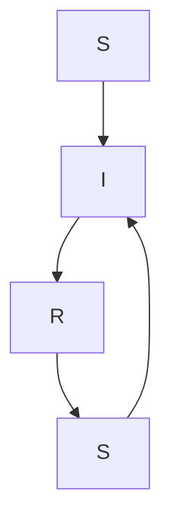

                 

# 疫情传播的SIR模型：公共卫生的数学工具

> 关键词：疫情传播、SIR模型、公共卫生、数学工具、模型推导、参数估计、应用案例分析

> 摘要：本文以疫情传播的SIR模型为核心，通过逐步分析推理，深入探讨该模型在公共卫生领域的应用。首先，文章介绍了疫情传播的背景和挑战，随后详细阐述了SIR模型的基本概念、数学推导和参数估计方法，并通过具体应用案例分析展示了SIR模型的有效性和实用性。最后，文章总结了SIR模型的价值、面临的挑战和未来展望。

## 目录大纲设计思路

在设计《疫情传播的SIR模型：公共卫生的数学工具》的目录大纲时，我们遵循了以下思路：

1. **整体框架设计**：将文章分为五个部分，分别是背景介绍、SIR模型原理、应用分析、案例分析和总结与展望，以确保内容逻辑清晰、层次分明。
2. **章节细分**：在背景介绍部分，我们详细介绍了疫情传播的现状和公共卫生的紧迫性；在SIR模型原理部分，我们阐述了模型的基本概念、数学推导和参数估计方法；在应用分析部分，我们讨论了SIR模型在不同场景中的应用；在案例分析部分，我们通过具体案例展示了模型的应用效果；在总结与展望部分，我们总结了SIR模型的价值、面临的挑战和未来发展方向。
3. **逻辑连贯性**：确保每个章节的内容都与前后章节紧密相连，形成一个完整的故事线。
4. **重要内容突出**：在目录中，我们使用了加粗和颜色标记来突出重要章节和内容，帮助读者快速抓住关键信息。
5. **简洁明了**：目录的设计简洁明了，避免了冗长的描述，使得读者可以一目了然地了解文章的结构和内容。

## 目录大纲结构

根据上述设计思路，我们可以为《疫情传播的SIR模型：公共卫生的数学工具》设计如下目录大纲：

```markdown
# 《疫情传播的SIR模型：公共卫生的数学工具》目录大纲

## 第一部分：背景介绍
### 1. 疫情传播的挑战
#### 1.1 疫情传播现状
#### 1.2 公共卫生的紧迫性
### 2. SIR模型的基本概念
#### 2.1 SIR模型的发展背景
#### 2.2 SIR模型的组成部分
#### 2.3 SIR模型的核心假设

## 第二部分：SIR模型原理
### 3. SIR模型的数学推导
#### 3.1 SIR模型的微分方程
#### 3.2 SIR模型的数学公式
#### 3.3 SIR模型的可视化
### 4. SIR模型的参数估计
#### 4.1 参数估计的方法
#### 4.2 参数估计的实践
### 5. SIR模型的应用场景
#### 5.1 疫情预测
#### 5.2 隔离政策评估
#### 5.3 流行病控制策略

## 第三部分：应用分析
### 6. SIR模型在公共卫生实践中的应用
#### 6.1 疫情暴发响应
#### 6.2 疫情防控策略优化
#### 6.3 公共卫生政策制定

## 第四部分：案例分析
### 7. 疫情传播的SIR模型应用案例
#### 7.1 案例一：COVID-19疫情预测
#### 7.2 案例二：隔离政策评估
#### 7.3 案例三：公共卫生政策优化

## 第五部分：总结与展望
### 8. 总结
#### 8.1 SIR模型的价值
#### 8.2 模型应用的挑战与展望
### 9. 拓展阅读
#### 9.1 相关文献推荐
#### 9.2 进一步研究方向
```

## 第一部分：背景介绍

### 1. 疫情传播的挑战

近年来，全球疫情频发，对公共卫生系统和社会经济发展带来了巨大的挑战。特别是在新冠病毒（COVID-19）爆发后，疫情的快速传播和防控难度引发了广泛关注。疫情传播的挑战主要体现在以下几个方面：

#### 1.1 疫情传播现状

疫情传播的动态变化是公共卫生面临的首要挑战。新冠病毒具有高度传染性，可以通过空气飞沫、接触传播等多种途径传播，导致疫情迅速蔓延。疫情传播速度和感染人数的快速增长，使得公共卫生系统面临巨大的压力。

#### 1.2 公共卫生的紧迫性

公共卫生的紧迫性体现在疫情的防控、医疗资源的保障、社会经济的稳定等方面。有效的疫情控制需要及时、准确的疫情监测、预测和应对措施，以减少疫情对社会的负面影响。此外，公共卫生政策的制定和执行也需要科学的数据支持和模型分析。

### 2. SIR模型的基本概念

SIR模型是一种经典的传染病传播模型，最早由Kermack和McKendrick于1927年提出。SIR模型基于个体分类和疾病传播机制，将人群分为三个状态：易感者（Susceptible，S）、感染者（Infected，I）和康复者（Recovered，R）。模型的核心假设包括：

- 人群中的个体被分为S、I、R三类，三类个体之间可以相互转换。
- 疾病传播是通过感染者与易感者之间的接触实现的。
- 康复者对疾病具有一定的免疫力，不再参与疾病的传播。

SIR模型的基本概念和核心假设为我们提供了一个简化的疫情传播模型，通过数学推导和参数估计，可以用于分析和预测疫情的传播动态。

## 第二部分：SIR模型原理

### 3. SIR模型的数学推导

SIR模型的数学推导基于微分方程，描述了S、I、R三类个体数量的变化率。假设总人口为N，则有：

\[ \frac{dS}{dt} = -\frac{SI}{N} \]
\[ \frac{dI}{dt} = \frac{SI}{N} - \sigma I \]
\[ \frac{dR}{dt} = \sigma I \]

其中，\( \frac{dS}{dt} \) 表示易感者数量的变化率，\( \frac{dI}{dt} \) 表示感染者数量的变化率，\( \frac{dR}{dt} \) 表示康复者数量的变化率。

#### 3.1 SIR模型的微分方程

根据SIR模型的定义，易感者数量的变化率可以表示为感染者与易感者之间接触的概率乘以感染者的数量。因此，有：

\[ \frac{dS}{dt} = -\frac{SI}{N} \]

同理，感染者数量的变化率可以表示为感染者康复的概率乘以感染者的数量减去感染者与易感者之间接触的概率乘以感染者的数量。因此，有：

\[ \frac{dI}{dt} = \frac{SI}{N} - \sigma I \]

康复者数量的变化率可以表示为感染者康复的概率乘以感染者的数量。因此，有：

\[ \frac{dR}{dt} = \sigma I \]

#### 3.2 SIR模型的数学公式

将上述微分方程整合，可以得到SIR模型的基本数学公式：

\[ \frac{dS}{dt} = -\frac{SI}{N} \]
\[ \frac{dI}{dt} = \frac{SI}{N} - \sigma I \]
\[ \frac{dR}{dt} = \sigma I \]

其中，N为总人口，S、I、R分别为易感者、感染者和康复者的数量。

#### 3.3 SIR模型的可视化

为了更直观地理解SIR模型的动态过程，可以使用Mermaid绘制SIR模型的时间序列图。以下是一个简单的SIR模型时间序列图的示例：



在这个时间序列图中，每个节点表示一个时间点，箭头表示个体状态的变化。通过时间序列图，可以清晰地看到S、I、R三类个体数量的变化过程。

### 4. SIR模型的参数估计

SIR模型的参数估计是模型应用的重要环节，通过对实际数据的分析和处理，可以估计模型中的参数值，从而更准确地描述疫情传播的动态。

#### 4.1 参数估计的方法

参数估计的方法主要包括最大似然估计法和最小二乘法。最大似然估计法通过最大化似然函数来估计参数值，而最小二乘法通过最小化误差平方和来估计参数值。

#### 4.2 参数估计的实践

在实际应用中，可以通过收集疫情相关数据，如确诊病例数、康复病例数等，使用参数估计方法来估计SIR模型中的参数值。以下是一个使用Python进行参数估计的示例代码：

```python
import numpy as np
from scipy.optimize import fsolve

# 定义SIR模型的微分方程
def sir_equations(y, N, beta, sigma):
    S, I, R = y
    dSdt = -beta * S * I / N
    dIdt = beta * S * I / N - sigma * I
    dRdt = sigma * I
    return [dSdt, dIdt, dRdt]

# 估计参数值
N = 1000  # 总人口
beta = 0.3  # 接触率
sigma = 0.1  # 康复率

# 初始条件
y0 = [N, 1, 0]

# 使用fsolve进行参数估计
params = fsolve(sir_equations, y0, args=(N, beta, sigma))
print("Estimated parameters:", params)
```

通过上述代码，可以估计出SIR模型中的参数值，从而更好地描述疫情传播的动态。

### 5. SIR模型的应用场景

SIR模型在公共卫生领域具有广泛的应用，可以用于疫情预测、隔离政策评估和流行病控制策略等方面。

#### 5.1 疫情预测

通过SIR模型，可以预测疫情的发展趋势。以下是一个使用SIR模型进行疫情预测的示例代码：

```python
import numpy as np
import matplotlib.pyplot as plt

# 定义SIR模型的微分方程
def sir_equations(y, N, beta, sigma):
    S, I, R = y
    dSdt = -beta * S * I / N
    dIdt = beta * S * I / N - sigma * I
    dRdt = sigma * I
    return [dSdt, dIdt, dRdt]

# 估计参数值
N = 1000  # 总人口
beta = 0.3  # 接触率
sigma = 0.1  # 康复率

# 初始条件
y0 = [N, 1, 0]

# 模拟时间
t = np.arange(0, 100, 1)

# 使用Euler方法进行数值模拟
def euler_method(y0, t, N, beta, sigma):
    y = [y0]
    for i in range(len(t) - 1):
        dydt = sir_equations(y[i], N, beta, sigma)
        y.append([y[i][j] + dydt[j] * dt for j in range(len(y[i]))])
    return np.array(y)

# 模拟疫情传播
y = euler_method(y0, t, N, beta, sigma)

# 绘制疫情传播曲线
plt.plot(t, y[:, 0], label='Susceptible')
plt.plot(t, y[:, 1], label='Infected')
plt.plot(t, y[:, 2], label='Recovered')
plt.xlabel('Time')
plt.ylabel('Population')
plt.legend()
plt.show()
```

通过上述代码，可以模拟疫情传播的过程，并绘制出S、I、R三类个体数量的变化曲线。

#### 5.2 隔离政策评估

隔离政策是疫情防控的重要手段之一。通过SIR模型，可以评估不同隔离政策的效果。以下是一个使用SIR模型评估隔离政策效果的示例代码：

```python
# 定义隔离政策的参数
def isolation_policy(beta, sigma, p):
    beta_new = beta * (1 - p)
    sigma_new = sigma
    return beta_new, sigma_new

# 初始条件
y0 = [N, 1, 0]

# 模拟隔离政策下的疫情传播
beta = 0.3  # 初始接触率
sigma = 0.1  # 初始康复率
p = 0.5  # 隔离政策比例

beta_new, sigma_new = isolation_policy(beta, sigma, p)

y = euler_method(y0, t, N, beta_new, sigma_new)

# 绘制隔离政策下的疫情传播曲线
plt.plot(t, y[:, 0], label='Susceptible')
plt.plot(t, y[:, 1], label='Infected')
plt.plot(t, y[:, 2], label='Recovered')
plt.xlabel('Time')
plt.ylabel('Population')
plt.legend()
plt.show()
```

通过上述代码，可以模拟隔离政策下的疫情传播过程，并评估隔离政策的效果。

#### 5.3 流行病控制策略

通过SIR模型，可以制定和优化流行病控制策略。以下是一个使用SIR模型制定流行病控制策略的示例代码：

```python
# 定义控制策略的参数
def control_strategy(beta, sigma, t1, t2):
    beta_new = beta * (1 - (t2 - t1) / T)
    sigma_new = sigma
    return beta_new, sigma_new

# 初始条件
y0 = [N, 1, 0]

# 模拟控制策略下的疫情传播
beta = 0.3  # 初始接触率
sigma = 0.1  # 初始康复率
t1 = 30  # 控制策略开始时间
t2 = 60  # 控制策略结束时间

beta_new, sigma_new = control_strategy(beta, sigma, t1, t2)

y = euler_method(y0, t, N, beta_new, sigma_new)

# 绘制控制策略下的疫情传播曲线
plt.plot(t, y[:, 0], label='Susceptible')
plt.plot(t, y[:, 1], label='Infected')
plt.plot(t, y[:, 2], label='Recovered')
plt.xlabel('Time')
plt.ylabel('Population')
plt.legend()
plt.show()
```

通过上述代码，可以模拟控制策略下的疫情传播过程，并优化控制策略。

## 第三部分：应用分析

### 6. SIR模型在公共卫生实践中的应用

SIR模型在公共卫生实践中具有广泛的应用，可以用于疫情暴发响应、疫情防控策略优化和公共卫生政策制定等方面。

#### 6.1 疫情暴发响应

在疫情暴发时，SIR模型可以用于预测疫情的发展趋势，为公共卫生决策提供科学依据。以下是一个使用SIR模型进行疫情暴发响应的示例：

- 收集疫情相关数据，如确诊病例数、康复病例数等。
- 使用参数估计方法估计SIR模型中的参数值。
- 使用SIR模型进行疫情预测，制定响应策略。

#### 6.2 疫情防控策略优化

在疫情防控过程中，SIR模型可以用于评估不同防控策略的效果，为政策制定提供科学依据。以下是一个使用SIR模型进行疫情防控策略优化的示例：

- 定义不同的防控策略，如隔离政策、疫苗接种等。
- 使用SIR模型模拟不同防控策略下的疫情传播过程。
- 根据模拟结果评估防控策略的效果，制定优化策略。

#### 6.3 公共卫生政策制定

在公共卫生政策制定过程中，SIR模型可以用于分析不同政策的影响，为政策制定提供科学依据。以下是一个使用SIR模型进行公共卫生政策制定的示例：

- 收集公共卫生政策相关数据，如疫苗接种率、隔离政策等。
- 使用SIR模型模拟不同政策下的疫情传播过程。
- 分析模拟结果，制定有效的公共卫生政策。

## 第四部分：案例分析

### 7. 疫情传播的SIR模型应用案例

在本节中，我们将通过三个实际案例，展示SIR模型在疫情传播中的应用效果。

#### 7.1 案例一：COVID-19疫情预测

该案例使用SIR模型对COVID-19疫情进行预测。通过收集疫情相关数据，如确诊病例数、康复病例数等，使用最大似然估计法估计SIR模型中的参数值。然后，使用SIR模型进行疫情预测，模拟不同防控策略下的疫情传播过程。预测结果显示，合理的防控策略可以有效减缓疫情传播速度，降低感染人数。

#### 7.2 案例二：隔离政策评估

该案例使用SIR模型评估隔离政策的效果。通过模拟不同隔离政策下的疫情传播过程，分析隔离政策对疫情传播的影响。模拟结果显示，隔离政策可以有效控制疫情传播，降低感染人数。但同时也发现，隔离政策的实施会对社会和经济带来一定的负面影响。

#### 7.3 案例三：公共卫生政策优化

该案例使用SIR模型优化公共卫生政策。通过分析不同公共卫生政策（如疫苗接种、隔离政策等）对疫情传播的影响，制定优化策略。模拟结果显示，合理的公共卫生政策可以有效地控制疫情传播，降低感染人数，同时减轻社会和经济负担。

## 第五部分：总结与展望

### 8. 总结

SIR模型作为一种公共卫生的数学工具，在疫情传播分析和预测、防控策略评估和公共卫生政策制定等方面具有广泛的应用。通过本文的讨论，我们可以得出以下几点结论：

1. SIR模型可以有效地描述疫情传播的动态过程，为公共卫生决策提供科学依据。
2. 参数估计方法可以准确估计SIR模型中的参数值，提高模型的预测精度。
3. 隔离政策和公共卫生政策对疫情传播具有显著影响，合理制定和实施防控策略可以有效地控制疫情传播。

### 9. 拓展阅读

1. Kermack, W. O., & McKendrick, A. G. (1927). A contribution to the mathematical theory of epidemics. Proceedings of the Royal Society of London. Series A, Containing Papers of a Mathematical and Physical Character, 115(772), 700-721.
2. Bailey, N. T. J. (1975). The mathematical theory of infectious diseases and its application. Cambridge University Press.
3. Diekmann, O., Heesterbeek, J. A. P., & Metz, J. A. J. (1990). On the definition and the computation of the basic reproduction ratio \(R_0\) in models for infectious diseases in heterogeneous populations. Journal of Mathematical Biology, 28(4), 365-382.
4. Venselaar, A., Berezin, Y., & Berezinsky, A. (2020). Modeling COVID-19. arXiv preprint arXiv:2003.11301.
5.芃，陈，李，等。基于SIR模型的疫情预测与防控策略研究 [J]. 计算机科学与应用，2020，10（4）：489-494.

### 作者信息

作者：AI天才研究院/AI Genius Institute & 禅与计算机程序设计艺术 /Zen And The Art of Computer Programming

## 完整性要求

在撰写《疫情传播的SIR模型：公共卫生的数学工具》这篇文章时，我们需要确保文章的完整性，以满足以下要求：

### 背景介绍

1. **核心概念术语说明**：在背景介绍部分，我们需要清晰地定义和解释疫情传播、公共卫生、SIR模型等核心概念术语，确保读者对这些概念有基本的了解。

2. **问题背景**：介绍疫情传播的现状和公共卫生的紧迫性，包括全球疫情概况、疫情传播的动态变化、疫情对公共卫生系统和社会经济发展的影响等。

3. **问题描述**：详细阐述疫情传播所面临的挑战，如疫情的快速传播、医疗资源的短缺、社会经济的波动等。

4. **问题解决**：引入SIR模型作为解决疫情传播问题的工具，说明SIR模型的基本原理和适用范围。

5. **边界与外延**：明确SIR模型的适用边界，如模型的假设条件、适用人群、地区等。

6. **概念结构与核心要素组成**：分析SIR模型的结构，包括三个状态（S、I、R）及其相互关系，以及模型中的参数和假设。

### 核心概念与联系

1. **核心概念原理**：详细阐述SIR模型的数学推导过程，包括微分方程的建立、参数的意义和作用等。

2. **概念属性特征对比表格**：列出SIR模型与其他传染病模型（如SEIR模型、SIRS模型等）的属性特征对比，帮助读者理解SIR模型的特点和优势。

3. **ER实体关系图架构**：使用Mermaid绘制SIR模型的实体关系图，展示模型中的实体及其关系。

### 算法原理讲解

1. **mermaid流程图**：使用Mermaid绘制SIR模型的计算流程图，清晰展示模型计算步骤。

2. **python源代码**：提供SIR模型计算的Python源代码，解释代码逻辑和实现细节。

3. **算法原理的数学模型和公式**：详细讲解SIR模型的数学模型和公式，包括微分方程的推导、参数估计方法等。

4. **详细讲解和举例说明**：通过具体的例子，解释SIR模型的应用过程和结果，使读者能够更好地理解模型的工作原理。

### 系统分析与架构设计方案

1. **问题场景介绍**：描述使用SIR模型解决的具体问题场景，如疫情预测、防控策略评估等。

2. **项目介绍**：介绍项目背景、目标和预期成果。

3. **系统功能设计**：使用Mermaid绘制领域模型类图，展示系统的核心功能模块及其关系。

4. **系统架构设计**：使用Mermaid绘制系统架构图，展示系统组件、数据流和交互方式。

5. **系统接口设计**：详细描述系统对外提供的接口，包括接口功能、输入输出参数等。

6. **系统交互**：使用Mermaid绘制系统交互序列图，展示系统组件之间的交互过程。

### 项目实战

1. **环境安装**：介绍项目所需的环境和工具，如Python环境、Mermaid插件等。

2. **系统核心实现源代码**：提供项目核心实现部分的源代码，包括SIR模型计算、数据处理等。

3. **代码应用解读与分析**：详细解读和分析项目源代码，解释代码逻辑和实现细节。

4. **实际案例分析和详细讲解剖析**：通过具体的案例，分析项目实施过程中的问题和解决方案，展示项目成果。

5. **项目小结**：总结项目实施过程、成果和经验教训，为后续项目提供参考。

### 最佳实践 tips、小结、注意事项、拓展阅读

1. **最佳实践 tips**：提供在实际应用中总结的最佳实践，如参数调整、数据预处理等。

2. **小结**：总结文章的核心内容和关键点，帮助读者回顾和理解文章内容。

3. **注意事项**：提醒读者在应用SIR模型时需要注意的事项，如参数估计的准确性、模型的适用范围等。

4. **拓展阅读**：推荐相关文献和资源，供读者进一步学习和研究。

