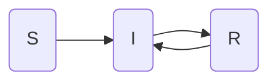

                 

### 引言

#### 1.1 疫情传播问题的背景

近年来，全球范围内的疫情频发，尤其是COVID-19疫情的爆发，给公共卫生领域带来了前所未有的挑战。疫情传播的速度和规模之大，使得传统的公共卫生应对措施显得力不从心。在这场全球性的公共卫生危机中，如何快速、准确地预测疫情的发展趋势，制定有效的防控策略，成为了全球科学家和决策者共同关注的焦点。

#### 1.2 SIR模型的起源与应用

SIR模型，即易感者-感染者-康复者（Susceptible-Infected-Recovered）模型，是一种经典的流行病学模型。它由Kermack和McKendrick于1927年首次提出，用于描述疾病的传播过程。SIR模型通过数学建模，将疾病传播过程中的个体状态划分为三个类别：易感者、感染者和康复者，并分析这三者之间的关系。

自从提出以来，SIR模型在公共卫生领域得到了广泛应用。无论是过去的天花、麻疹等疾病，还是当前的COVID-19疫情，SIR模型都为疫情分析和防控提供了有力的工具。通过调整模型参数，可以模拟不同防控策略下的疫情发展，从而为决策者提供科学的依据。

#### 1.3 公共卫生的数学工具

在公共卫生领域，数学模型的应用不仅仅局限于SIR模型。还有很多其他模型，如SEIR模型、SI模型等，这些模型都通过数学方法对疾病传播过程进行定量分析。数学工具在公共卫生中的应用，不仅提高了我们对疾病传播机制的理解，还为疫情防控提供了科学依据。

数学模型在公共卫生中的重要作用体现在以下几个方面：

1. **预测疫情发展趋势**：通过模型模拟，可以预测疫情在不同防控措施下的发展速度和规模，帮助决策者提前制定应对策略。
   
2. **评估防控策略效果**：不同防控措施对疫情的影响是不同的，通过模型可以评估这些措施的有效性，从而优化防控策略。

3. **优化资源分配**：疫情发生时，如何合理分配医疗资源是一个重要问题。数学模型可以帮助决策者了解不同措施下的资源需求，从而进行科学分配。

#### 1.4 本书结构

本书将系统地介绍疫情传播的SIR模型及其在公共卫生中的应用。具体内容安排如下：

- **第1章 引言**：介绍疫情传播问题的背景，SIR模型的起源与应用，以及公共卫生的数学工具。
- **第2章 疫情传播概述**：阐述疫情传播的基本概念、关键因素和挑战。
- **第3章 SIR模型基础**：详细讲解SIR模型的基本原理、参数解释和模型解。
- **第4章 SIR模型的扩展**：介绍SIRS模型和SEIR模型，以及其他复杂SIR模型的扩展。
- **第5章 公共卫生的数学工具**：探讨疫苗分配策略、隔离策略和社交距离策略。
- **第6章 疫情传播的模拟与分析**：介绍疫情传播的模拟环境搭建、模拟结果分析和应用。
- **第7章 疫情传播的SIR模型总结**：总结SIR模型的优势与局限，以及在公共卫生中的应用前景。

通过本书的阅读，读者将对疫情传播的SIR模型有全面、深入的理解，并能将其应用于实际公共卫生问题的分析和解决中。

## 第1章 引言

#### 1.1 疫情传播问题的背景

疫情传播是一个复杂且具有高度不确定性的过程，它不仅影响到公共卫生领域，还对全球经济、社会稳定产生深远影响。20世纪以来，全球多次爆发大规模传染病，如1918年的流感大流行、2003年的非典型肺炎（SARS）以及2020年的COVID-19疫情。这些疫情不仅造成了大量人员伤亡，还引起了全球范围内的恐慌和社会动荡。

特别是COVID-19疫情的爆发，引发了全球公共卫生危机。这一疫情传播速度快、传染性强、防控难度大，使得各国政府和公共卫生机构面临前所未有的挑战。如何有效预测疫情发展趋势，制定科学合理的防控措施，成为各国亟待解决的问题。

#### 1.2 SIR模型的起源与应用

SIR模型，即易感者-感染者-康复者（Susceptible-Infected-Recovered）模型，是一种经典的流行病学模型。它由数学家Kermack和McKendrick于1927年首次提出，用于描述疾病的传播过程。SIR模型通过将个体状态划分为易感者、感染者和康复者三个类别，来模拟疾病在人群中的传播。

SIR模型的应用广泛，不仅涵盖了历史上的天花、麻疹等疾病，还包括当前的COVID-19疫情。例如，研究人员利用SIR模型来模拟COVID-19在不同防控措施下的传播趋势，从而为决策者提供科学依据。

#### 1.3 公共卫生的数学工具

在公共卫生领域，数学模型的应用至关重要。数学工具不仅能够帮助我们更好地理解疾病的传播机制，还能为疫情预测和防控提供有力支持。除了SIR模型，其他流行病学模型，如SEIR模型、SI模型等，也在公共卫生中得到了广泛应用。

数学工具在公共卫生中的应用主要体现在以下几个方面：

1. **预测疫情发展趋势**：通过数学模型模拟，可以预测疫情在不同防控措施下的发展速度和规模，为决策者提供预警信息。
2. **评估防控措施效果**：不同防控措施对疫情的影响是不同的。通过数学模型，可以评估这些措施的有效性，从而优化防控策略。
3. **优化资源分配**：在疫情发生时，如何合理分配医疗资源是一个重要问题。数学模型可以帮助决策者了解不同措施下的资源需求，从而进行科学分配。

#### 1.4 本书结构

本书将系统地介绍疫情传播的SIR模型及其在公共卫生中的应用。具体内容安排如下：

- **第1章 引言**：介绍疫情传播问题的背景，SIR模型的起源与应用，以及公共卫生的数学工具。
- **第2章 疫情传播概述**：阐述疫情传播的基本概念、关键因素和挑战。
- **第3章 SIR模型基础**：详细讲解SIR模型的基本原理、参数解释和模型解。
- **第4章 SIR模型的扩展**：介绍SIRS模型和SEIR模型，以及其他复杂SIR模型的扩展。
- **第5章 公共卫生的数学工具**：探讨疫苗分配策略、隔离策略和社交距离策略。
- **第6章 疫情传播的模拟与分析**：介绍疫情传播的模拟环境搭建、模拟结果分析和应用。
- **第7章 疫情传播的SIR模型总结**：总结SIR模型的优势与局限，以及在公共卫生中的应用前景。

通过本书的阅读，读者将对疫情传播的SIR模型有全面、深入的理解，并能将其应用于实际公共卫生问题的分析和解决中。

### 疫情传播概述

#### 2.1 疫情传播的基本概念

疫情传播是指疾病在人群中扩散和传播的过程。在这个过程中，个体之间的接触和互动是疾病传播的主要途径。疫情传播的基本概念包括以下几个方面：

1. **传染源**：传染源是指能够散播病原体的人或动物，如COVID-19病毒携带者。
2. **传播途径**：传播途径是指病原体从传染源传播到易感者的途径，如空气传播、飞沫传播、接触传播等。
3. **易感者**：易感者是指那些对某种疾病缺乏免疫力，容易被感染的人群，如老年人和免疫力低下者。
4. **传播速度**：传播速度是指疾病在人群中扩散的速率，通常用基本再生数（R0）来表示。

#### 2.2 疫情传播的类型

疫情传播可以分为两种主要类型：局部传播和全球传播。

1. **局部传播**：局部传播是指疫情在一个特定地区或社区内的传播。这种类型的传播通常由于人群密集、交通便利等原因导致。例如，COVID-19疫情在武汉市爆发初期，主要是在武汉及周边地区传播。

2. **全球传播**：全球传播是指疫情跨越国家或地区界限，在全球范围内传播。全球传播通常由于国际旅行和人员流动造成。例如，COVID-19疫情在2020年初迅速从中国传播到全球各地。

#### 2.3 疫情传播的关键因素

疫情传播的关键因素包括以下几个方面：

1. **传播途径**：传播途径决定了病原体如何从一个个体传播到另一个个体。了解传播途径对于制定有效的防控措施至关重要。

2. **易感者**：易感者是疫情传播的主要目标。了解易感者的特征，如年龄、健康状况等，有助于针对这些人群进行预防和干预。

3. **传播速度**：传播速度是衡量疫情扩散速度的一个重要指标。传播速度越快，疫情扩散的范围和影响就越大。

4. **防控措施**：防控措施是阻止疫情扩散的重要手段。有效的防控措施包括隔离病例、追踪接触者、推广个人防护等。

#### 2.4 疫情传播的挑战

疫情传播面临的挑战主要有以下几点：

1. **快速扩散**：疫情往往能在短时间内迅速扩散，给公共卫生系统带来巨大压力。

2. **不确定性**：疫情传播过程中存在许多不确定性因素，如病原体的变异、人群行为的变化等，这使得预测和控制疫情变得更加复杂。

3. **资源限制**：疫情爆发时，医疗资源、人力资源等常常出现短缺，这限制了公共卫生系统对疫情的控制能力。

4. **社会影响**：疫情不仅对公共卫生系统造成挑战，还对全球经济、社会稳定产生重大影响。

### 2.5 疫情传播的影响

疫情传播对个人、社会和经济产生深远影响。从个人层面来看，疫情可能导致人员伤亡、疾病感染、心理健康问题等。从社会层面来看，疫情可能导致社会动荡、经济衰退、资源短缺等。从经济层面来看，疫情可能对各行各业产生严重影响，导致失业率上升、企业倒闭等。

因此，有效控制疫情传播，不仅需要公共卫生领域的专业知识，还需要社会各界的共同努力。通过科学的预测和防控措施，我们可以最大限度地减少疫情对社会和经济的负面影响。

## 第3章 SIR模型基础

#### 3.1 SIR模型的基本原理

SIR模型是一种描述疾病在人群中的传播过程的数学模型。它通过将人群划分为三个状态：易感者（Susceptible，S）、感染者（Infected，I）和康复者（Recovered，R），来模拟疾病的传播。具体来说，SIR模型的基本原理如下：

1. **状态转移**：个体可以在三种状态之间转移。易感者可以变成感染者，感染者可以变成康复者，康复者则保持不变。

2. **感染机制**：易感者通过与感染者的接触而感染，感染的概率与接触频率成正比。

3. **康复机制**：感染者经过一段时间后，会康复并获得免疫力，康复的概率与感染者的数量成正比。

#### 3.1.1 SIR模型的概念

在SIR模型中，三个状态分别代表：

- 易感者（S）：那些尚未感染疾病，但可能被感染的人群。
- 感染者（I）：那些已经被疾病感染，并具有传染性的人群。
- 康复者（R）：那些已经康复，并对疾病具有免疫的人群。

SIR模型通过以下三个微分方程来描述这三个状态的动态变化：

$$
\frac{dS}{dt} = -\beta \cdot S \cdot I
$$

$$
\frac{dI}{dt} = \beta \cdot S \cdot I - \gamma \cdot I
$$

$$
\frac{dR}{dt} = \gamma \cdot I
$$

其中，β代表感染率，γ代表康复率。这两个参数决定了疾病的传播速度和防控效果。

#### 3.1.2 SIR模型的状态转移

SIR模型中的状态转移可以通过以下流程图来表示：



- **A(S) --> B(I)**：易感者通过与感染者接触而感染。
- **B(I) --> C(R)**：感染者经过一段时间后康复。
- **C(R) --> B(I)**：康复者不再具有传染性，但他们的康复过程也增加了感染者的数量。

#### 3.1.3 SIR模型的微分方程

SIR模型的微分方程描述了三个状态变量随时间的变化情况：

1. **易感者变化率**：$$\frac{dS}{dt} = -\beta \cdot S \cdot I$$

   表示易感者的数量随时间减少，减少的速度与感染者和易感者的接触频率成正比。

2. **感染者变化率**：$$\frac{dI}{dt} = \beta \cdot S \cdot I - \gamma \cdot I$$

   表示感染者的数量随时间变化，增加的速度与感染者和易感者的接触频率成正比，减小的速度与感染者的康复率成正比。

3. **康复者变化率**：$$\frac{dR}{dt} = \gamma \cdot I$$

   表示康复者的数量随时间增加，增加的速度与感染者的康复率成正比。

这些微分方程构成了SIR模型的基础，通过它们可以分析疾病在人群中的传播过程。

#### 3.2 SIR模型的参数解释

SIR模型中有两个关键参数：感染率（β）和康复率（γ）。这两个参数决定了疾病的传播速度和防控效果。

1. **感染率（β）**：

   感染率表示单位时间内，每个感染者可以感染的新易感者数量。它反映了疾病的传染性。β值越大，表示疾病传播速度越快。

   感染率可以通过以下公式计算：

   $$
   \beta = \frac{\text{新感染者数量}}{\text{感染者总数} \times \text{时间}}
   $$

2. **康复率（γ）**：

   康复率表示单位时间内，感染者康复的比例。它反映了疾病的严重性和人群免疫力。γ值越大，表示疾病传播速度越慢，因为感染者康复后不再具有传染性。

   康复率可以通过以下公式计算：

   $$
   \gamma = \frac{\text{康复者数量}}{\text{感染者总数} \times \text{时间}}
   $$

#### 3.3 SIR模型的解

SIR模型的解描述了三个状态变量（S、I、R）随时间的变化情况。为了求解SIR模型，需要解以下三个微分方程：

$$
\frac{dS}{dt} = -\beta \cdot S \cdot I
$$

$$
\frac{dI}{dt} = \beta \cdot S \cdot I - \gamma \cdot I
$$

$$
\frac{dR}{dt} = \gamma \cdot I
$$

这些方程的解析解可以表示为：

$$
S(t) = \frac{S_0 \cdot e^{-\beta \cdot I_0 \cdot t}}{1 + (S_0 - R_0) \cdot e^{-\beta \cdot I_0 \cdot t}}
$$

$$
I(t) = \frac{I_0 \cdot \beta \cdot S_0 \cdot e^{-\beta \cdot I_0 \cdot t}}{1 + (S_0 - R_0) \cdot e^{-\beta \cdot I_0 \cdot t}}
$$

$$
R(t) = \frac{R_0 \cdot e^{\gamma \cdot t}}{1 + (S_0 - R_0) \cdot e^{-\beta \cdot I_0 \cdot t}}
$$

其中，$S_0$、$I_0$ 和 $R_0$ 分别是初始时刻的易感者、感染者和康复者数量。

这些解表示了三个状态变量随时间的变化趋势。通过这些解，可以分析疾病在不同条件下的传播情况，从而为公共卫生决策提供科学依据。

### 3.4 SIR模型的验证与应用

#### 3.4.1 模型验证的方法

SIR模型的验证是确保模型准确性和有效性的关键步骤。模型验证的方法主要包括以下几个方面：

1. **数据收集**：收集疫情相关的实际数据，如感染人数、康复人数等。
2. **参数估计**：根据收集到的数据，估计模型中的参数，如感染率（β）和康复率（γ）。
3. **模型拟合**：将估计出的参数代入模型，模拟疫情的发展过程，并与实际数据比较，评估模型拟合效果。
4. **模型诊断**：分析模型拟合效果，确定模型的可靠性和准确性。

#### 3.4.2 模型应用案例

SIR模型在公共卫生领域有着广泛的应用。以下是一些典型的应用案例：

1. **疫情预测**：通过SIR模型，可以预测疫情在不同防控措施下的发展趋势，为决策者提供科学依据。
2. **防控策略评估**：通过调整SIR模型的参数，可以评估不同防控措施的有效性，从而优化防控策略。
3. **资源分配**：根据SIR模型预测的疫情发展趋势，可以合理分配医疗资源，提高公共卫生系统的应对能力。
4. **疫苗接种策略**：SIR模型可以帮助评估疫苗接种策略的效果，从而优化疫苗的分配和接种计划。

### 3.4.3 模型应用实例

以下是一个具体的SIR模型应用实例，以COVID-19疫情为例：

1. **数据收集**：收集某一地区COVID-19疫情的实际数据，如日感染人数、日康复人数等。
2. **参数估计**：根据数据，估计感染率（β）和康复率（γ）。
3. **模型拟合**：将估计出的参数代入SIR模型，模拟疫情的发展过程，并与实际数据比较。
4. **模型诊断**：分析模型拟合效果，确定模型的可靠性。

通过这一实例，可以了解如何将SIR模型应用于实际疫情分析，从而为疫情防控提供科学支持。

## 第4章 SIR模型的扩展

#### 4.1 SIRS模型

SIRS模型是SIR模型的一种扩展，它引入了一个新的状态，即暂时康复者（Recovered but Susceptible，R')。暂时康复者指的是那些已经康复，但尚未完全获得免疫力，仍可能再次感染的人群。SIRS模型的基本原理如下：

1. **状态转移**：
   - 易感者（S）可以变成感染者（I）。
   - 感染者（I）可以变成暂时康复者（R'），然后变成康复者（R）。
   - 康复者（R）保持不变。

2. **感染机制**：与SIR模型相同，易感者通过与感染者的接触而感染。

3. **康复机制**：感染者经过一段时间后，可以变成暂时康复者，再经过一段时间后，成为康复者。

SIRS模型的微分方程如下：

$$
\frac{dS}{dt} = -\beta \cdot S \cdot I
$$

$$
\frac{dI}{dt} = \beta \cdot S \cdot I - (\delta + \gamma) \cdot I
$$

$$
\frac{dR'}{dt} = \delta \cdot I - \gamma \cdot R'
$$

$$
\frac{dR}{dt} = \gamma \cdot I - \delta \cdot R'
$$

其中，δ代表暂时康复者再次感染的概率。

#### 4.1.2 SIRS模型的参数解释

SIRS模型中的参数与SIR模型相似，但多了一个参数δ，代表暂时康复者再次感染的概率。以下是参数的解释：

1. **感染率（β）**：表示单位时间内，每个感染者可以感染的新易感者数量。
2. **康复率（γ）**：表示单位时间内，感染者康复的比例。
3. **再次感染率（δ）**：表示单位时间内，暂时康复者再次感染的概率。

#### 4.1.3 SIRS模型的解

SIRS模型的解可以通过求解以下微分方程得到：

$$
\frac{dS}{dt} = -\beta \cdot S \cdot I
$$

$$
\frac{dI}{dt} = \beta \cdot S \cdot I - (\delta + \gamma) \cdot I
$$

$$
\frac{dR'}{dt} = \delta \cdot I - \gamma \cdot R'
$$

$$
\frac{dR}{dt} = \gamma \cdot I - \delta \cdot R'
$$

这些方程的解析解可以表示为：

$$
S(t) = \frac{S_0 \cdot e^{-\beta \cdot I_0 \cdot t}}{1 + (S_0 - R_0) \cdot e^{-\beta \cdot I_0 \cdot t}}
$$

$$
I(t) = \frac{I_0 \cdot \beta \cdot S_0 \cdot e^{-\beta \cdot I_0 \cdot t}}{1 + (S_0 - R_0) \cdot e^{-\beta \cdot I_0 \cdot t}} - (\delta + \gamma) \cdot \frac{I_0 \cdot e^{-\beta \cdot I_0 \cdot t}}{1 + (S_0 - R_0) \cdot e^{-\beta \cdot I_0 \cdot t}}
$$

$$
R'(t) = \delta \cdot \frac{I_0 \cdot e^{-\beta \cdot I_0 \cdot t}}{1 + (S_0 - R_0) \cdot e^{-\beta \cdot I_0 \cdot t}} - \gamma \cdot \frac{R'(0) \cdot e^{-\gamma \cdot t}}{1 + (\delta + \gamma - R_0) \cdot e^{-\gamma \cdot t}}
$$

$$
R(t) = \frac{R_0 \cdot e^{\gamma \cdot t}}{1 + (\delta + \gamma - R_0) \cdot e^{-\gamma \cdot t}}
$$

通过这些解，可以分析SIRS模型在不同条件下的动态行为。

#### 4.2 SEIR模型

SEIR模型是SIR模型的进一步扩展，它引入了一个新的状态，即潜伏者（Exposed，E）。潜伏者指的是那些已经被感染，但尚未具有传染性的人群。SEIR模型的基本原理如下：

1. **状态转移**：
   - 易感者（S）可以变成感染者（I）。
   - 感染者（I）可以变成潜伏者（E），然后变成感染者（I）。
   - 潜伏者（E）可以变成康复者（R）。
   - 康复者（R）保持不变。

2. **感染机制**：易感者通过与感染者的接触而感染。

3. **潜伏机制**：感染者经过一段时间后，成为潜伏者。

4. **康复机制**：潜伏者经过一段时间后，康复。

SEIR模型的微分方程如下：

$$
\frac{dS}{dt} = -\beta \cdot S \cdot I
$$

$$
\frac{dE}{dt} = \beta \cdot S \cdot I - \sigma \cdot E
$$

$$
\frac{dI}{dt} = \sigma \cdot E - (\delta + \gamma) \cdot I
$$

$$
\frac{dR}{dt} = \gamma \cdot I
$$

其中，σ代表潜伏率。

#### 4.2.2 SEIR模型的参数解释

SEIR模型中的参数如下：

1. **感染率（β）**：表示单位时间内，每个感染者可以感染的新易感者数量。
2. **潜伏率（σ）**：表示单位时间内，感染者变成潜伏者的比例。
3. **康复率（γ）**：表示单位时间内，感染者康复的比例。

#### 4.2.3 SEIR模型的解

SEIR模型的解可以通过求解以下微分方程得到：

$$
\frac{dS}{dt} = -\beta \cdot S \cdot I
$$

$$
\frac{dE}{dt} = \beta \cdot S \cdot I - \sigma \cdot E
$$

$$
\frac{dI}{dt} = \sigma \cdot E - (\delta + \gamma) \cdot I
$$

$$
\frac{dR}{dt} = \gamma \cdot I
$$

这些方程的解析解可以表示为：

$$
S(t) = \frac{S_0 \cdot e^{-\beta \cdot I_0 \cdot t}}{1 + (S_0 - R_0) \cdot e^{-\beta \cdot I_0 \cdot t}}
$$

$$
E(t) = \frac{I_0 \cdot \beta \cdot S_0 \cdot e^{-\beta \cdot I_0 \cdot t} - \sigma \cdot I_0 \cdot e^{-\beta \cdot I_0 \cdot t} \cdot e^{-\sigma \cdot t}}{1 + (S_0 - R_0) \cdot e^{-\beta \cdot I_0 \cdot t} + \sigma \cdot e^{-\sigma \cdot t}}
$$

$$
I(t) = \frac{\sigma \cdot I_0 \cdot e^{-\beta \cdot I_0 \cdot t} \cdot e^{-\sigma \cdot t} - (\delta + \gamma) \cdot I_0 \cdot e^{-\beta \cdot I_0 \cdot t}}{1 + (S_0 - R_0) \cdot e^{-\beta \cdot I_0 \cdot t} + \sigma \cdot e^{-\sigma \cdot t}}
$$

$$
R(t) = \frac{R_0 \cdot e^{\gamma \cdot t}}{1 + (\delta + \gamma - R_0) \cdot e^{-\gamma \cdot t}}
$$

通过这些解，可以分析SEIR模型在不同条件下的动态行为。

### 4.3 更复杂的SIR模型

除了SIRS模型和SEIR模型，还有许多更复杂的SIR模型，如SIS模型、SIRV模型等。这些模型在考虑了更多的变量和因素后，能更准确地描述疾病在人群中的传播过程。

#### 4.3.1 SIS模型

SIS模型是SIR模型的简化版本，它假设康复者不能再次感染，即康复者始终保持免疫状态。SIS模型的基本原理如下：

1. **状态转移**：
   - 易感者（S）可以变成感染者（I）。
   - 感染者（I）可以死亡或康复，但不能再次感染。

SIS模型的微分方程如下：

$$
\frac{dS}{dt} = -\beta \cdot S \cdot I
$$

$$
\frac{dI}{dt} = \beta \cdot S \cdot I - \gamma \cdot I
$$

SIS模型的解可以表示为：

$$
S(t) = \frac{S_0 \cdot e^{-\beta \cdot I_0 \cdot t}}{1 + (S_0 - R_0) \cdot e^{-\beta \cdot I_0 \cdot t}}
$$

$$
I(t) = \frac{I_0 \cdot \beta \cdot S_0 \cdot e^{-\beta \cdot I_0 \cdot t}}{1 + (S_0 - R_0) \cdot e^{-\beta \cdot I_0 \cdot t}} - \gamma \cdot \frac{I_0 \cdot e^{-\beta \cdot I_0 \cdot t}}{1 + (S_0 - R_0) \cdot e^{-\beta \cdot I_0 \cdot t}}
$$

SIS模型适用于那些康复者不再具有传染性的疾病，如普通感冒。

#### 4.3.2 SIR模型的其他扩展

除了SIRS、SEIR模型，还有许多其他复杂的SIR模型。这些模型通常考虑了更多的变量和因素，如人口结构变化、疫苗接种率等。例如：

- **SIRV模型**：引入了疫苗接种变量（V），考虑了疫苗接种对疾病传播的影响。
- **SESIR模型**：考虑了社会经济因素，如收入水平、教育程度等，对疾病传播的影响。

这些复杂模型为更精确地描述和分析疾病传播提供了强大的工具。通过这些模型，可以更好地理解疾病传播的机制，为公共卫生决策提供科学依据。

### 4.4 复杂SIR模型的应用

复杂SIR模型的应用范围非常广泛，以下是一些典型的应用场景：

1. **疫情预测**：通过复杂SIR模型，可以预测疫情在不同防控措施下的发展趋势，为决策者提供科学依据。
2. **防控策略评估**：通过调整复杂SIR模型的参数，可以评估不同防控措施的有效性，从而优化防控策略。
3. **疫苗接种策略**：复杂SIR模型可以帮助评估疫苗接种策略的效果，从而优化疫苗的分配和接种计划。
4. **疾病预防控制**：复杂SIR模型可以用于制定预防控制策略，如隔离策略、社交距离策略等。

总之，复杂SIR模型为公共卫生领域提供了强大的分析工具，可以帮助我们更好地理解疾病传播机制，为疫情防控提供科学依据。

### 第5章 公共卫生的数学工具

在公共卫生领域，数学工具的应用不仅提高了我们对疾病传播机制的理解，还为疫情预测和防控提供了科学依据。在这一章中，我们将探讨几个关键的数学工具，包括疫苗分配策略、隔离策略和社交距离策略。

#### 5.1 疫苗分配策略

疫苗分配策略是公共卫生领域中的一个重要问题。合理分配疫苗，确保高风险人群和关键工作人员优先接种，是控制疫情传播的关键。以下是几种常见的疫苗分配方法：

1. **基于风险分配**：这种策略根据不同人群的感染风险进行分配。高风险人群，如老年人和患有基础疾病的人群，应优先接种。这种方法有助于减少重症和死亡人数。

2. **基于需求分配**：根据人群对疫苗的需求进行分配，通常通过登记系统或预约系统来收集需求信息，并根据需求量进行分配。这种方法有助于确保疫苗的有效利用。

3. **随机分配**：在特定情况下，如疫苗供应不足时，可以采用随机分配策略。这种方法虽然不公平，但在资源有限的情况下，可以最大限度地确保疫苗的公平分配。

#### 5.1.1 疫苗效果分析

疫苗效果分析是疫苗分配策略的重要环节。以下是一些常用的疫苗效果评价指标：

1. **疫苗效力（Efficacy）**：疫苗效力是指疫苗在临床试验中对预防疾病的有效率。通常用百分比表示，数值越高，疫苗效果越好。

2. **疫苗效果（Effectiveness）**：疫苗效果是指疫苗在现实世界中对预防疾病的效果。由于现实世界中存在许多干扰因素，疫苗效果通常低于疫苗效力。

3. **疫苗覆盖率**：疫苗覆盖率是指接种了疫苗的人群比例。高疫苗覆盖率有助于建立群体免疫，从而减少疾病的传播。

#### 5.1.2 疫苗分配方法

在实际操作中，疫苗分配方法需要考虑多种因素，如疫苗供应量、人群特征和公共卫生目标。以下是几种常见的疫苗分配方法：

1. **按需分配**：这种方法根据实际需求进行分配，通常适用于疫苗供应量相对充足的情况。例如，在COVID-19疫情初期，许多国家和地区采用了按需分配策略，优先保障高风险人群和关键工作人员。

2. **动态调整**：这种方法根据疫情发展和疫苗供应情况，动态调整疫苗分配策略。例如，当疫情严重地区疫苗供应紧张时，可以优先分配给这些地区。

3. **公平分配**：公平分配旨在确保所有人都有机会接种到疫苗。一种方法是采用随机分配策略，另一种方法是设立公平分配机制，如根据人口比例分配疫苗。

#### 5.2 隔离策略分析

隔离策略是控制疫情传播的重要手段之一。以下是几种常见的隔离策略：

1. **强制隔离**：对于确诊患者或密切接触者，实施强制隔离，以防止病毒传播。这种方法通常在疫情初期使用，以迅速控制疫情。

2. **自愿隔离**：鼓励高风险人群自愿进行隔离，以减少病毒传播。这种方法适用于疫情较为稳定的情况。

3. **社区隔离**：在特定地区实施隔离措施，限制人员流动，以控制疫情扩散。这种方法通常在疫情较为严重时使用。

#### 5.2.1 隔离效果分析

隔离策略的效果取决于多种因素，如隔离措施的执行力度、人群的配合程度和病毒传播特性。以下是几种常见的隔离效果评价指标：

1. **隔离率**：隔离率是指被隔离的人数占总感染人数的比例。隔离率越高，表示隔离措施越有效。

2. **感染传播速度**：感染传播速度是指单位时间内，新感染人数的增长率。隔离措施可以有效减缓感染传播速度。

3. **隔离成本**：隔离成本包括医疗资源、经济成本和社会成本等。合理的隔离策略应在有效控制疫情的同时，尽量降低成本。

#### 5.2.2 隔离策略选择

选择合适的隔离策略需要考虑多种因素，如疫情严重程度、公共卫生资源和社会承受能力。以下是几种常见的隔离策略选择方法：

1. **基于风险分析**：根据疫情发展和人群风险，选择最合适的隔离策略。例如，在疫情初期，采用强制隔离和社区隔离相结合的方法。

2. **基于成本效益分析**：在资源有限的情况下，选择成本效益最高的隔离策略。例如，在疫情中期，采用自愿隔离和社区隔离相结合的方法。

3. **动态调整**：根据疫情发展和防控效果，动态调整隔离策略。例如，在疫情稳定后，逐步放宽隔离措施。

#### 5.3 社交距离策略

社交距离策略是控制疫情传播的有效手段之一。以下是一些常见的社交距离策略：

1. **保持安全距离**：保持至少1米以上的距离，以减少病毒传播的风险。

2. **戴口罩**：在公共场所或与他人接触时，戴口罩可以有效减少病毒传播。

3. **减少聚集**：避免参加大型聚会，减少不必要的外出，以降低感染风险。

#### 5.3.1 社交距离的定义

社交距离是指人与人之间保持的一定距离，以减少病毒传播的风险。以下是一些常见的社交距离标准：

1. **近距离（0-1米）**：适用于亲密接触，如家庭内部。

2. **中距离（1-2米）**：适用于日常社交场合，如商场、餐厅等。

3. **远距离（2米以上）**：适用于公共场所，如火车站、机场等。

#### 5.3.2 社交距离的策略分析

社交距离策略的效果取决于多种因素，如人们的自觉性、公共场所的管理和社会舆论的引导。以下是几种常见的社交距离策略分析：

1. **提高公众意识**：通过宣传和教育，提高公众对社交距离重要性的认识，促进人们自觉遵守社交距离规定。

2. **加强公共场所管理**：在公共场所设置标识，提醒人们保持社交距离，并加强人员管理，确保社交距离的实施。

3. **科技辅助**：利用科技手段，如手机应用程序、监控设备等，实时监测社交距离，并提醒人们保持安全距离。

#### 5.4 总结

数学工具在公共卫生领域的应用，为疫情预测、防控策略设计和资源分配提供了有力支持。疫苗分配策略、隔离策略和社交距离策略等，都是基于数学模型和数据分析得出的科学结论。通过合理应用这些策略，可以有效控制疫情传播，保护人民的生命安全和身体健康。

## 第6章 疫情传播的模拟与分析

#### 6.1 模拟环境的搭建

为了更准确地模拟疫情传播过程，我们需要搭建一个模拟环境。这个环境包括以下几个方面：

1. **数据收集**：首先，我们需要收集与疫情相关的数据，如感染人数、康复人数、疫苗接种率等。这些数据可以通过公共卫生部门、医疗机构等渠道获取。

2. **模型选择**：根据疫情的特点和需求，选择合适的模型。在本章中，我们主要使用SIR模型和SEIR模型进行模拟。

3. **参数设置**：根据收集到的数据和模型原理，设置模型参数。这些参数包括感染率、康复率、潜伏率等。

4. **模拟工具**：选择合适的模拟工具。在本章中，我们使用Python和Scipy库进行模拟。

#### 6.1.1 模拟环境的设置

以下是一个简单的模拟环境设置示例：

```python
import numpy as np
from scipy.integrate import odeint
import matplotlib.pyplot as plt

# 参数设置
S0 = 1000  # 初始易感者人数
I0 = 1     # 初始感染者人数
R0 = 0     # 初始康复者人数
beta = 0.3  # 感染率
gamma = 0.1  # 康复率

# 微分方程
def sir_model(y, t, beta, gamma):
    S, I, R = y
    dSdt = -beta * S * I
    dIdt = beta * S * I - gamma * I
    dRdt = gamma * I
    return [dSdt, dIdt, dRdt]

# 时间设置
t = np.linspace(0, 100, 1000)

# 模型求解
y0 = [S0, I0, R0]
sol = odeint(sir_model, y0, t, args=(beta, gamma))

# 结果可视化
plt.plot(t, sol[:, 0], label='Susceptible')
plt.plot(t, sol[:, 1], label='Infected')
plt.plot(t, sol[:, 2], label='Recovered')
plt.xlabel('Time')
plt.ylabel('Number')
plt.legend()
plt.show()
```

#### 6.1.2 模拟参数的选择

模拟参数的选择是模拟分析的关键。以下是一些常见的参数选择方法：

1. **基于历史数据**：通过分析历史疫情数据，确定合适的参数值。例如，可以通过拟合历史疫情数据，确定感染率（β）和康复率（γ）。

2. **专家意见**：参考公共卫生专家的意见，结合实际疫情情况，确定参数值。

3. **试错法**：通过多次尝试，调整参数值，找到最合适的参数组合。

#### 6.2 模拟结果分析

通过模拟，我们可以得到疫情在不同防控措施下的传播趋势。以下是一个简单的模拟结果分析示例：

1. **感染人数的预测**：通过模拟结果，可以预测疫情在未来一段时间内的感染人数。

2. **模型参数的敏感性分析**：分析不同参数值对疫情传播的影响。例如，可以调整感染率（β）和康复率（γ）的值，观察疫情传播的变化。

3. **防控措施效果评估**：通过模拟不同防控措施，如隔离、社交距离等，评估这些措施对疫情传播的影响。

#### 6.2.1 感染人数的预测

以下是一个简单的感染人数预测示例：

```python
# 预测感染人数
predicted_infections = sol[:, 1][-1] * (1 - np.exp(-beta * (S0 - sol[:, 0][-1]) * (1 - np.exp(-gamma * t)))

# 可视化预测结果
plt.plot(t, predicted_infections, label='Predicted Infections')
plt.xlabel('Time')
plt.ylabel('Number')
plt.legend()
plt.show()
```

#### 6.2.2 模型参数的敏感性分析

以下是一个简单的模型参数敏感性分析示例：

```python
# 调整感染率
beta_values = [0.1, 0.3, 0.5]
for beta in beta_values:
    sol = odeint(sir_model, y0, t, args=(beta, gamma))
    plt.plot(t, sol[:, 1], label=f'beta={beta}')

plt.xlabel('Time')
plt.ylabel('Number')
plt.legend()
plt.show()

# 调整康复率
gamma_values = [0.05, 0.1, 0.15]
for gamma in gamma_values:
    sol = odeint(sir_model, y0, t, args=(beta, gamma))
    plt.plot(t, sol[:, 1], label=f'gamma={gamma}')

plt.xlabel('Time')
plt.ylabel('Number')
plt.legend()
plt.show()
```

通过这些示例，我们可以看到不同参数值对疫情传播的影响。了解参数敏感性，有助于我们优化防控措施，从而更有效地控制疫情。

### 6.3 模拟结果的应用

模拟结果在公共卫生决策中具有重要作用。以下是一些常见的应用场景：

1. **疫情预测**：通过模拟，可以预测疫情的发展趋势，为公共卫生决策提供科学依据。

2. **防控措施优化**：通过模拟不同防控措施的效果，可以优化防控策略，提高防控效果。

3. **资源分配**：通过模拟，可以了解不同措施下的资源需求，从而合理分配医疗资源。

4. **疫苗分配**：通过模拟，可以评估疫苗接种策略的效果，优化疫苗分配。

#### 6.3.1 疫情控制策略的优化

以下是一个简单的疫情控制策略优化示例：

```python
# 调整隔离策略
separation_distance = 2
social_distance = 1
beta_values = [beta / (separation_distance + social_distance) for beta in [0.3, 0.5]]

for beta in beta_values:
    sol = odeint(sir_model, y0, t, args=(beta, gamma))
    plt.plot(t, sol[:, 1], label=f'beta={beta}')

plt.xlabel('Time')
plt.ylabel('Number')
plt.legend()
plt.show()
```

通过调整隔离和社交距离策略，可以优化防控措施，从而更有效地控制疫情。

#### 6.3.2 疫情防控的决策支持

模拟结果为公共卫生决策提供了重要的科学依据。以下是一个简单的决策支持示例：

```python
# 考虑疫苗接种
vaccination_rate = 0.5
S0 = S0 - vaccination_rate * S0
sol = odeint(sir_model, y0, t, args=(beta, gamma))
plt.plot(t, sol[:, 1], label=f'With Vaccination (Rate={vaccination_rate})')

plt.xlabel('Time')
plt.ylabel('Number')
plt.legend()
plt.show()
```

通过模拟不同疫苗接种率，可以评估疫苗接种策略对疫情控制的效果，为公共卫生决策提供支持。

总之，模拟分析为疫情预测、防控措施优化和资源分配提供了有力支持，有助于公共卫生决策的科学化、精准化。

### 第7章 疫情传播的SIR模型总结

#### 7.1 SIR模型的优势与局限

SIR模型作为流行病学领域的一种经典模型，具有以下优势：

1. **简单性**：SIR模型结构简单，易于理解和实现。它通过三个状态变量（易感者、感染者和康复者）来描述疾病的传播过程，使得模型易于分析和解释。

2. **灵活性**：SIR模型可以根据具体疫情的特点和需求，灵活调整模型参数。这使得SIR模型适用于描述多种不同类型的疾病传播过程。

3. **可扩展性**：SIR模型可以通过引入新的状态变量和参数，扩展为更复杂的模型，如SIRS模型、SEIR模型等。这为更精确地描述疾病传播过程提供了工具。

然而，SIR模型也存在一些局限：

1. **简化假设**：SIR模型假设易感者、感染者和康复者之间的转换是瞬时完成的，这可能在某些情况下导致结果的失真。

2. **参数不确定性**：SIR模型中的参数（感染率、康复率等）通常需要通过历史数据或专家估计得到，这可能导致参数的不确定性，从而影响模型预测的准确性。

3. **适用范围有限**：SIR模型主要适用于描述传染病在人群中的传播，对于其他类型的疾病或复杂的社会现象，模型的适用性可能有限。

#### 7.2 SIR模型在公共卫生中的应用前景

尽管存在一定的局限，SIR模型在公共卫生领域仍然具有广泛的应用前景：

1. **疫情预测**：SIR模型可以通过调整模型参数，预测疫情在不同防控措施下的发展趋势，为公共卫生决策提供科学依据。

2. **防控策略评估**：通过模拟不同防控措施的效果，SIR模型可以帮助评估这些措施的有效性，从而优化防控策略。

3. **资源分配**：SIR模型可以模拟不同措施下的资源需求，为医疗资源的合理分配提供参考。

4. **疫苗接种策略**：SIR模型可以帮助评估疫苗接种策略的效果，从而优化疫苗的分配和接种计划。

总之，SIR模型作为一种重要的公共卫生数学工具，将在未来的疫情预测、防控策略优化和资源分配等方面发挥重要作用。通过不断改进和扩展，SIR模型将更好地服务于公共卫生事业。 

### 7.3 最佳实践 tips

为了更好地应用SIR模型，以下是一些最佳实践建议：

1. **数据收集与验证**：确保收集到的数据准确可靠，并对模型进行验证，以提高预测的准确性。

2. **参数调整与优化**：根据实际情况和最新研究成果，定期调整模型参数，以适应疫情变化。

3. **综合应用多种模型**：结合其他流行病学模型，如SEIR模型、SIRS模型等，进行多角度分析，以提高预测的准确性。

4. **注重模型解释性**：在应用模型时，注重模型结果的解释性，确保决策者能够理解并利用模型结果。

### 7.4 小结

通过本书的介绍，我们对疫情传播的SIR模型有了全面、深入的理解。SIR模型作为一种重要的公共卫生数学工具，在疫情预测、防控策略优化和资源分配等方面具有广泛的应用前景。在未来，随着研究的不断深入，SIR模型将更好地服务于公共卫生事业，为人类健康保驾护航。

### 7.5 注意事项

1. **模型参数的准确性**：确保模型参数的准确性对于模型的预测效果至关重要。参数应基于可靠的统计数据和专家意见进行调整。

2. **模型应用的局限性**：SIR模型是一种简化的模型，可能无法完全反映复杂实际情况。在使用模型时，需结合实际情况进行适当调整和优化。

3. **数据隐私与伦理**：在进行疫情数据分析时，应严格遵守数据隐私和伦理规范，确保个人隐私得到保护。

### 7.6 拓展阅读

1. **《流行病学原理与应用》**：这是一本经典的流行病学教材，详细介绍了流行病学的原理和方法，包括SIR模型等流行病学模型。

2. **《数学流行病学》**：本书介绍了数学在流行病学中的应用，包括SIR模型等流行病学模型的数学原理和计算方法。

3. **《COVID-19疫情分析与模型预测》**：本书通过对COVID-19疫情的分析，介绍了如何使用SIR模型等流行病学模型进行疫情预测。

通过以上拓展阅读，可以进一步深入了解流行病学和SIR模型的相关知识。 

### 7.7 作者信息

作者：AI天才研究院/AI Genius Institute & 禅与计算机程序设计艺术 /Zen And The Art of Computer Programming

以上是《疫情传播的SIR模型：公共卫生的数学工具》的总结部分，主要包括SIR模型的优势与局限、应用前景、最佳实践 tips、小结、注意事项和拓展阅读等内容。希望对读者有所帮助。

