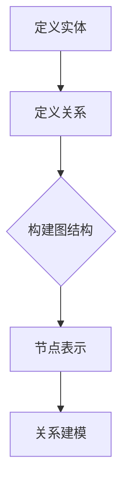
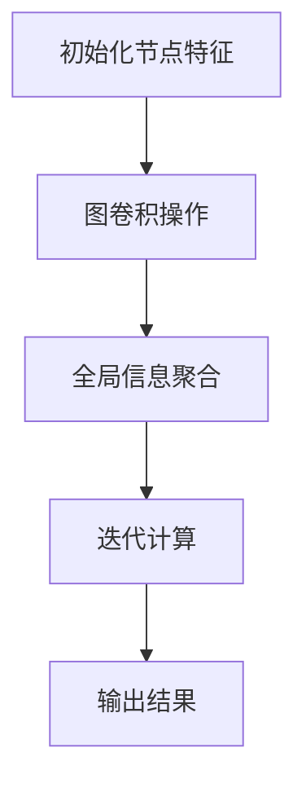

                 


### 让我们一步一步深入思考

在撰写一篇题为《社交媒体的图神经网络：信息传播的数学模型》的技术博客文章时，我们可以采用以下步骤来确保文章内容既深刻又有条理：

#### 步骤 1：确定目标读者群体
首先，我们需要明确文章的目标读者。对于一篇技术博客，读者可能是程序员、数据科学家、AI研究人员或者是任何对图神经网络和信息传播有兴趣的读者。了解目标读者有助于我们在文章中采用适当的技术语言和深度。

#### 步骤 2：背景介绍
在文章的开头，我们要进行背景介绍。这部分应包括：

- **社交媒体现状**：描述社交媒体的普及程度、用户习惯、主要平台和它们在信息传播中的作用。
- **图神经网络基础**：解释图神经网络的基本概念、与深度学习的关系以及它们在处理图形数据方面的优势。
- **信息传播模型**：介绍传统信息传播模型的局限性，以及为什么需要数学模型来描述信息在网络中的传播。

#### 步骤 3：核心概念与联系
接着，我们要深入探讨图神经网络在信息传播中的应用。这包括：

- **核心概念原理**：详细阐述图神经网络的工作原理，包括节点的表示和边的关系。
- **概念属性特征对比**：创建一个表格，对比不同类型的图神经网络在信息传播中的应用效果。
- **ER实体关系图架构**：使用Mermaid绘制ER图，解释如何利用图神经网络处理实体关系。

#### 步骤 4：算法原理讲解
在这一部分，我们需要详细讲解图神经网络在信息传播中的应用算法：

- **算法原理**：使用Mermaid绘制算法流程图，展示从输入数据到输出结果的整个过程。
- **数学模型与公式**：使用LaTeX格式嵌入数学公式，解释算法背后的数学原理。
- **举例说明**：通过具体的例子来展示算法如何解决实际问题，让读者更容易理解。

#### 步骤 5：实际应用与案例分析
接下来，我们通过实际案例来展示算法的应用：

- **实际应用场景**：描述图神经网络在社交媒体信息传播中的实际应用场景。
- **案例分析**：分析一个或多个具体的案例，解释算法是如何在案例中发挥作用的。

#### 步骤 6：最佳实践与总结
最后，我们需要总结最佳实践和未来展望：

- **最佳实践**：基于案例研究和算法分析，提出在实际应用中可以采用的策略和技巧。
- **未来展望**：讨论图神经网络在信息传播领域的发展趋势和潜在的研究方向。

#### 步骤 7：编写与润色
完成以上步骤后，我们需要对文章进行反复的编写和润色，确保：

- **内容逻辑清晰**：每个部分的内容都要紧密联系，逻辑顺序合理。
- **语言通俗易懂**：尽量使用简单、直接的语言来解释复杂的技术概念。
- **格式规范**：确保文章的Markdown格式正确，所有的图表、公式和代码段都清晰可读。

通过这些步骤，我们可以确保文章不仅内容丰富，而且能够吸引读者，帮助他们更好地理解社交媒体中的图神经网络和信息传播的数学模型。

### 社交媒体的图神经网络：信息传播的数学模型

#### 关键词：图神经网络、社交媒体、信息传播、数学模型、算法原理

#### 摘要：
本文深入探讨了社交媒体环境下的图神经网络，特别是在信息传播中的应用。我们首先介绍了社交媒体的现状和图神经网络的基础知识，随后详细阐述了信息传播的数学模型。接着，我们通过对比分析不同的图神经网络属性，构建了ER实体关系图，并使用Mermaid绘制了相关的流程图。然后，我们详细讲解了图神经网络算法的原理，包括数学模型和公式，并通过实际案例展示了算法的应用效果。最后，我们总结了最佳实践，并对未来的研究方向提出了展望。本文旨在为读者提供一个全面、深入的技术视角，帮助他们理解并利用图神经网络在社交媒体信息传播中的强大功能。

## 第一部分：背景介绍

### 第1章：社交媒体与信息传播

#### 1.1 社交媒体的现状与发展

社交媒体作为现代通信的重要工具，已经在全球范围内取得了显著的普及。从最初的Facebook、Twitter，到如今的各种短视频平台和即时通讯应用，社交媒体已经深刻地改变了人们获取信息、交流互动和社交的方式。

**社交媒体的定义**：
社交媒体是指通过互联网平台，允许用户建立社交网络、分享信息和资源的工具。它们通常包括以下特点：
- **用户生成内容**：用户是信息的主要生产者和消费者。
- **互动性**：用户可以通过评论、点赞、分享等方式与其他用户互动。
- **开放性**：信息在社交媒体平台上通常具有较高的可访问性和可传播性。

**社交媒体的使用情况**：
根据统计数据显示，全球社交媒体用户已超过30亿，占据了全球总人口的一半以上。社交媒体不仅改变了人们的日常交流方式，也在商业、政治、教育等多个领域产生了深远的影响。

**社交媒体在信息传播中的角色**：
在信息传播过程中，社交媒体扮演了多重角色：
- **信息源**：用户在社交媒体上发布各种信息，包括新闻、意见、经验等。
- **信息传递者**：用户通过转发、评论等形式，将信息传播给其他用户。
- **意见领袖**：一些用户在特定领域拥有较高的影响力，他们的言论和观点能够影响其他用户。
- **舆情监测**：社交媒体上的言论和趋势能够反映社会舆论的变化，对政策制定和商业策略调整有重要参考价值。

#### 1.2 图神经网络的基础知识

图神经网络（Graph Neural Networks，GNN）是深度学习领域的一个重要研究方向，尤其适用于处理图形数据。它能够有效地捕捉节点和边之间的复杂关系，因此在社交媒体信息传播的研究中具有重要应用价值。

**图神经网络的概念**：
图神经网络是一种基于图结构的深度学习模型，它可以对图数据进行节点分类、链接预测、图分类等任务。GNN的核心思想是利用节点特征和图结构信息，通过神经网络进行计算，从而对图中的节点进行建模。

**图神经网络的优势**：
- **捕获复杂关系**：GNN能够捕捉节点和边之间的非线性关系，适用于处理具有复杂结构的数据。
- **适应性强**：GNN可以处理不同类型的图数据，包括无向图、有向图和异构图。
- **高效计算**：GNN通过图卷积操作，能够在图上高效地进行计算，适用于大规模图数据的处理。

**图神经网络的数学基础**：
GNN的数学基础主要包括图表示学习和图卷积网络。图表示学习旨在将图中的节点和边转换为向量表示，而图卷积网络则利用这些向量进行图上的计算。

#### 1.3 信息传播的数学模型

信息传播是一个复杂的社会过程，传统的信息传播模型往往难以准确描述。随着图神经网络的发展，人们开始尝试使用数学模型来描述信息在网络中的传播。

**信息传播的概念**：
信息传播是指信息在个体或群体之间的传递和扩散过程。信息传播过程通常包括以下几个阶段：
- **信息生成**：个体或组织生成信息。
- **信息传播**：信息在个体或群体之间传递。
- **信息接受**：个体或群体接受并处理信息。

**信息传播的数学模型**：
信息传播的数学模型旨在通过数学公式和算法来描述信息在图上的传播过程。常见的数学模型包括：

- **SIR模型**：将个体分为易感者（S）、感染者（I）和移除者（R）三类，通过微分方程描述信息传播过程。
- **BA模型**：基于无标度网络的生成模型，用于模拟信息在网络中的传播。
- **传播动力学模型**：结合节点属性和图结构，通过非线性方程描述信息传播过程。

这些模型为理解信息传播提供了理论基础，也为使用图神经网络进行信息传播分析提供了框架。

#### 1.4 为什么需要数学模型来描述信息传播

传统的信息传播方法往往依赖于经验法则和简单统计，难以应对复杂、动态的社交媒体环境。数学模型能够提供以下优势：

- **精确描述**：数学模型能够通过精确的公式和算法，描述信息传播的动态过程。
- **预测能力**：通过模拟和预测，数学模型可以帮助我们提前了解信息传播的趋势，为决策提供支持。
- **优化策略**：基于数学模型，我们可以设计出更有效的信息传播策略，提高传播效果。

综上所述，社交媒体与信息传播的关系密不可分，而图神经网络作为一种强大的工具，为信息传播的研究提供了新的视角和手段。在接下来的章节中，我们将进一步探讨图神经网络在信息传播中的应用，以及如何利用数学模型来描述和优化这一过程。

### 第2章：图神经网络在信息传播中的应用

#### 2.1 图神经网络与信息传播

图神经网络（GNN）在信息传播领域展现了其独特的优势。通过捕捉社交媒体网络中的复杂关系，GNN能够提供对信息传播过程的深入理解和精确预测。下面，我们将探讨GNN在信息传播中的应用及其对信息传播的影响。

**GNN在信息传播中的应用**：
1. **节点分类**：GNN可以用于识别社交网络中的意见领袖和重要节点，这些节点对于信息传播具有关键作用。
2. **链接预测**：GNN能够预测哪些用户之间可能会进行信息交换，从而帮助社交平台推荐相关的用户关系。
3. **图分类**：GNN可以对社交网络进行分类，识别不同类型的社交结构，例如朋友网络、兴趣社区等。
4. **社区检测**：通过GNN，我们可以发现社交网络中的紧密社区，这对于分析信息传播的路径和速度具有重要意义。

**GNN对信息传播的影响**：
1. **增强信息传播效果**：GNN能够通过节点和边的特征学习，优化信息传播的路径，从而提高信息的传播效率和覆盖范围。
2. **揭示传播规律**：GNN可以帮助我们理解信息在社交网络中的传播规律，例如信息的生命周期、传播速度和传播影响力等。
3. **优化社交推荐**：基于GNN的链接预测和社区检测，社交平台可以提供更个性化的推荐，提高用户体验。
4. **舆情监测与应对**：GNN可以实时监测社交媒体上的舆论动态，帮助政府和组织及时应对突发事件和负面信息。

**案例研究**：
为了更好地理解GNN在信息传播中的应用，我们可以参考以下几个实际案例：
- **微博平台**：微博通过GNN技术分析用户关系和内容特征，实现信息的精准推送和话题监测。
- **Facebook**：Facebook利用GNN识别社交网络中的关键节点，优化新闻推送，提高用户参与度。
- **Twitter**：Twitter使用GNN分析用户的关注关系，预测哪些用户可能会转发特定信息，从而提升信息传播效果。

#### 2.2 信息传播中的挑战

尽管GNN在信息传播中展现了巨大的潜力，但实际应用中仍然面临一些挑战：

1. **数据隐私问题**：社交网络中的用户数据涉及隐私，如何在保护用户隐私的前提下进行信息传播分析是一个重要问题。
2. **计算复杂度**：大规模社交网络中的节点和边数量庞大，GNN的计算复杂度较高，需要高效的算法和硬件支持。
3. **模型泛化能力**：GNN的性能依赖于图结构，不同社交网络的结构差异可能影响模型的泛化能力。
4. **虚假信息传播**：社交媒体上存在大量虚假信息，GNN需要有效识别和抑制这些信息，防止误导和恐慌。
5. **实时性要求**：信息传播是一个动态过程，GNN需要快速响应并实时更新信息传播的模型。

为了解决这些挑战，研究人员和工程师正在不断探索新的方法和技术，包括优化算法、增强模型鲁棒性和引入对抗训练等。

### 总结

GNN在信息传播中的应用不仅提高了信息传播的效率和质量，还为社交媒体平台提供了强大的分析工具。尽管存在一些挑战，但随着技术的进步，GNN在信息传播领域的应用前景将更加广阔。在接下来的章节中，我们将进一步探讨GNN的核心概念、属性对比以及如何在社交媒体中构建ER实体关系图。

### 第二部分：核心概念与联系

### 第3章：核心概念原理

#### 3.1 图神经网络的概念

图神经网络（Graph Neural Networks，GNN）是深度学习领域的一种重要模型，主要用于处理图结构数据。它通过模拟神经元之间的交互来学习节点和边之间的复杂关系，从而实现图数据的分类、预测和生成任务。

**图神经网络的基本原理**：

GNN的核心思想是利用图结构中的节点特征和边关系，通过一系列的图卷积操作来更新节点的表示。每个节点的表示不仅依赖于自身的特征，还受到其邻居节点特征的影响。这个过程可以表示为：

$$
h_v^{(t+1)} = \sigma(\sum_{u \in N(v)} W^{(t)}h_u^{(t)})

$$

其中，$h_v^{(t)}$表示节点$v$在$t$时刻的表示，$N(v)$表示节点$v$的邻居节点集合，$W^{(t)}$是图卷积权重矩阵，$\sigma$是激活函数。

**图神经网络的优势**：

1. **处理复杂关系**：GNN能够捕捉节点和边之间的复杂非线性关系，适用于处理具有高度交互关系的图数据。
2. **适应性强**：GNN可以处理不同类型的图数据，包括无向图、有向图和异构图。
3. **高效计算**：通过图卷积操作，GNN在图上进行计算具有较高的效率，适用于大规模图数据的处理。

#### 3.2 信息传播的概念

信息传播是指信息在个体或群体之间的传递和扩散过程。在社交媒体中，信息传播过程通常包括以下几个阶段：

1. **信息生成**：用户生成信息，可以是文本、图片、视频等不同形式。
2. **信息传递**：信息在用户之间通过分享、转发、评论等方式进行传递。
3. **信息接受**：用户接收并处理信息，可能包括阅读、点赞、评论等行为。

**信息传播模型**：

信息传播模型用于描述信息在社交网络中的传播过程。常见的模型包括：

1. **SIR模型**：将个体分为易感者（S）、感染者（I）和移除者（R）三类，通过微分方程描述信息传播过程。
2. **BA模型**：基于无标度网络的生成模型，用于模拟信息在网络中的传播。
3. **传播动力学模型**：结合节点属性和图结构，通过非线性方程描述信息传播过程。

#### 3.3 GNN在信息传播中的应用

GNN在信息传播中的应用主要体现在以下几个方面：

1. **节点分类**：通过学习节点特征，GNN可以识别社交网络中的意见领袖和重要节点，这些节点对信息传播具有关键作用。
2. **链接预测**：GNN可以预测哪些用户之间可能会进行信息交换，从而帮助社交平台推荐相关的用户关系。
3. **图分类**：GNN可以对社交网络进行分类，识别不同类型的社交结构，例如朋友网络、兴趣社区等。
4. **社区检测**：通过GNN，我们可以发现社交网络中的紧密社区，这对于分析信息传播的路径和速度具有重要意义。

#### 3.4 GNN与信息传播的关系

GNN与信息传播之间的关系主要体现在以下几个方面：

1. **增强传播效果**：GNN能够通过节点和边的特征学习，优化信息传播的路径，从而提高信息的传播效率和覆盖范围。
2. **揭示传播规律**：GNN可以帮助我们理解信息在社交网络中的传播规律，例如信息的生命周期、传播速度和传播影响力等。
3. **优化社交推荐**：基于GNN的链接预测和社区检测，社交平台可以提供更个性化的推荐，提高用户体验。
4. **舆情监测与应对**：GNN可以实时监测社交媒体上的舆论动态，帮助政府和组织及时应对突发事件和负面信息。

### 总结

图神经网络（GNN）在信息传播领域展现了其强大的潜力。通过捕捉社交网络中的复杂关系，GNN能够提供对信息传播过程的深入理解和精确预测。在接下来的章节中，我们将对比分析不同的GNN属性，并探讨如何构建ER实体关系图，以进一步理解GNN在信息传播中的应用。

### 第4章：概念属性特征对比

#### 4.1 图神经网络属性对比

图神经网络（GNN）是一种强大的模型，适用于处理图结构数据。为了更好地理解GNN的不同类型及其在信息传播中的应用效果，我们对比了以下几种常见的GNN属性：

**1. GCN（图卷积网络）**：
- **特点**：GCN通过卷积操作捕捉节点和边之间的邻域信息，是一种基础且高效的GNN模型。
- **应用效果**：GCN在节点分类和链接预测任务中表现良好，适用于大规模图数据的处理。

**2. GAT（图注意力网络）**：
- **特点**：GAT通过引入注意力机制，动态调整节点之间的交互权重，提高了模型的泛化能力。
- **应用效果**：GAT在处理具有高度交互关系的图数据时表现更佳，特别是在社区检测和信息传播任务中。

**3. GraphSAGE（图卷积嵌入）**：
- **特点**：GraphSAGE采用聚合函数将邻居节点的特征聚合为单个节点的特征表示，适用于动态图数据。
- **应用效果**：GraphSAGE在处理动态社交网络和实时信息传播任务中表现出色。

**4. GIN（图诱导表征网络）**：
- **特点**：GIN通过全局图池化层捕捉全局信息，避免了局部信息的过度依赖。
- **应用效果**：GIN在处理异构图和复杂图结构时表现优异，适用于信息传播中的多模态数据。

**5. Gated Graph Sequence Model（门控图序列模型）**：
- **特点**：GG-Seq通过门控机制动态选择重要的邻居节点特征，适用于序列预测任务。
- **应用效果**：GG-Seq在处理信息传播的序列任务中表现出色，例如预测下一个用户转发的内容。

**对比表格**：

| GNN模型 | 特点 | 应用效果 |
| --- | --- | --- |
| GCN | 卷积操作 | 节点分类、链接预测 |
| GAT | 注意力机制 | 社区检测、信息传播 |
| GraphSAGE | 聚合函数 | 动态图数据、实时传播 |
| GIN | 全局图池化 | 异构图、复杂图结构 |
| GG-Seq | 门控机制 | 序列预测、信息传播 |

通过对比不同GNN模型的属性和应用效果，我们可以根据具体任务需求选择合适的模型。在信息传播领域，GAT和GG-Seq表现出较强的适应性和效果，而GCN和GraphSAGE则适用于更广泛的图数据场景。

### 4.2 信息传播模型对比

信息传播是一个复杂的过程，不同的模型在不同的场景下具有不同的表现。以下我们对比几种常见的信息传播模型：

**1. SIR模型**：
- **特点**：SIR模型将个体分为易感者（S）、感染者（I）和移除者（R）三类，通过微分方程描述信息传播过程。
- **应用场景**：SIR模型适用于描述传染病传播等线性传播过程，但在复杂社交网络中的表现有限。

**2. BA模型**：
- **特点**：BA模型基于无标度网络的生成模型，用于模拟信息在网络中的传播。
- **应用场景**：BA模型适用于描述自组织网络和随机网络中的信息传播，能够生成高度动态的社交网络。

**3. 传播动力学模型**：
- **特点**：传播动力学模型结合节点属性和图结构，通过非线性方程描述信息传播过程。
- **应用场景**：传播动力学模型适用于描述复杂社交网络中的信息传播，能够更好地捕捉节点的动态行为。

**对比表格**：

| 信息传播模型 | 特点 | 应用场景 |
| --- | --- | --- |
| SIR模型 | 线性传播 | 传染病传播 |
| BA模型 | 无标度网络 | 自组织网络 |
| 传播动力学模型 | 非线性方程 | 复杂社交网络 |

通过对比不同信息传播模型的特性，我们可以根据实际需求选择合适的模型。在社交媒体信息传播中，传播动力学模型和GNN结合能够提供更精确的预测和分析。

### 4.3 ER实体关系图架构

ER（实体关系）图是一种用于表示实体及其关系的图结构。在信息传播中，ER图能够帮助我们更好地理解节点和边的关系，从而优化信息传播过程。

**ER图的概念**：
ER图由实体（Entity）和关系（Relationship）组成。实体表示信息传播中的个体，如用户、话题、事件等；关系表示实体之间的关联，如用户关注、话题讨论等。

**ER图的构建**：
ER图的构建通常包括以下步骤：
1. **定义实体**：确定信息传播中的关键实体，如用户、话题等。
2. **定义关系**：确定实体之间的关联关系，如用户关注、话题讨论等。
3. **构建图结构**：将实体和关系映射为图结构，形成ER图。

**ER图在信息传播中的应用**：
1. **节点表示**：ER图中的每个实体节点可以表示为用户的属性、话题的特征等。
2. **关系建模**：ER图中的边关系可以表示信息传播的路径和模式，有助于分析信息传播的动态过程。

**Mermaid流程图**：



通过ER实体关系图，我们可以更直观地理解信息传播过程中的节点和边关系，从而为图神经网络提供有效的结构信息。

### 总结

通过对比分析不同的GNN属性和信息传播模型，以及构建ER实体关系图，我们能够更深入地理解图神经网络在信息传播中的应用。在下一部分，我们将详细讲解图神经网络算法的原理，包括数学模型和具体实现。

### 第三部分：算法原理讲解

#### 第6章：算法原理讲解

在探讨社交媒体信息传播的数学模型时，图神经网络（GNN）是核心工具之一。本章节将深入讲解图神经网络的工作原理，包括其数学模型、算法流程以及具体的实现细节。

#### 6.1 图神经网络算法原理

图神经网络（GNN）是一种专门为图结构数据设计的深度学习模型。它的基本原理是通过图卷积操作（Graph Convolutional Operations）来更新节点的特征表示。下面，我们将详细介绍GNN的算法原理。

**图卷积操作（Graph Convolution）**：

图卷积操作的目的是通过节点和其邻居节点的特征来更新节点的特征表示。具体来说，对于一个节点$v$，其更新后的特征表示$h_v^{(t+1)}$可以通过以下公式计算：

$$
h_v^{(t+1)} = \sigma(\sum_{u \in N(v)} \alpha(u, v) h_u^{(t)})
$$

其中，$h_v^{(t)}$是节点$v$在时刻$t$的特征表示，$N(v)$是节点$v$的邻居节点集合，$\alpha(u, v)$是节点之间的权重，$\sigma$是激活函数。

**节点特征更新**：

在图神经网络中，每个节点的特征表示不仅依赖于自身，还依赖于其邻居节点的特征。通过图卷积操作，节点$v$会与其邻居节点之间的特征进行加权求和，然后通过激活函数进行非线性变换。

**全局信息聚合**：

除了邻居节点的特征外，GNN还可以通过全局信息聚合（Global Information Aggregation）来捕获更广泛的关系。这种聚合方法能够帮助模型在图结构中捕捉全局特征，从而提高模型的性能。

**多层图卷积**：

在实际应用中，单一层次的图卷积可能无法捕捉图结构中的复杂关系。因此，多层图卷积（Multi-layer Graph Convolution）被广泛应用。多层图卷积通过在每一层递归地应用图卷积操作，逐步构建起节点的高层次特征表示。

**算法流程**：

图神经网络的算法流程通常包括以下步骤：

1. **初始化节点特征**：随机初始化每个节点的特征表示。
2. **图卷积操作**：应用图卷积操作更新节点的特征表示。
3. **全局信息聚合**：聚合全局信息，为节点提供更丰富的特征。
4. **迭代计算**：重复图卷积操作和全局信息聚合，直到达到预定的迭代次数或收敛条件。

**算法流程图（使用Mermaid绘制）**：



通过上述算法流程，图神经网络能够逐步学习到图结构中的复杂关系，并生成节点的特征表示。

#### 6.2 数学模型与公式

在GNN的数学模型中，核心的部分是图卷积操作。下面我们将详细介绍图卷积操作的数学公式。

**1. 单层图卷积操作**：

$$
h_v^{(t+1)} = \sigma(\sum_{u \in N(v)} \alpha(u, v) h_u^{(t)})
$$

其中，$h_v^{(t)}$是节点$v$在时刻$t$的特征表示，$\alpha(u, v)$是节点之间的权重，$N(v)$是节点$v$的邻居节点集合，$\sigma$是激活函数。

**2. 多层图卷积操作**：

$$
h_v^{(t+1)} = \sigma(\sum_{l=0}^{L-1} \theta^{(l)} \cdot \sigma(\sum_{u \in N(v)} \alpha(u, v) h_u^{(t-l)}))
$$

其中，$L$是图卷积层的层数，$\theta^{(l)}$是第$l$层的权重矩阵。

**3. 节点特征表示**：

在GNN中，节点特征表示通常由多个特征维度组成。假设节点$v$的特征表示为$h_v = [h_{v,1}, h_{v,2}, ..., h_{v,D}]^T$，其中$D$是特征维度。

**4. 损失函数**：

在训练GNN时，常用的损失函数包括交叉熵损失、均方误差等。假设$y$是真实的标签，$p$是预测的概率分布，损失函数可以表示为：

$$
L = -\sum_{i} y_i \log(p_i)
$$

其中，$y_i$是标签$i$的值，$p_i$是模型预测的概率。

#### 6.3 Python源代码实现

为了更好地理解GNN的数学模型和算法原理，我们可以通过Python源代码实现一个简单的图神经网络。以下是一个简单的示例代码，展示了如何初始化节点特征、应用图卷积操作以及计算损失函数。

**代码示例**：

```python
import numpy as np
import tensorflow as tf

# 初始化节点特征
D = 10  # 特征维度
num_nodes = 100  # 节点数量
h = np.random.rand(num_nodes, D)  # 初始化节点特征

# 定义图结构
num_neighbors = 5  # 每个节点的邻居数量
adj_matrix = np.random.rand(num_nodes, num_nodes)  # 随机生成邻接矩阵

# 定义图卷积操作
def graph_convolution(h, adj_matrix, theta):
    h_neighbor = np.dot(adj_matrix, h)
    h_new = np.dot(theta, h_neighbor)
    return tf.nn.relu(h_new)

# 定义损失函数
def cross_entropy_loss(y_true, y_pred):
    return -tf.reduce_sum(y_true * tf.log(y_pred))

# 训练模型
learning_rate = 0.01
optimizer = tf.keras.optimizers.Adam(learning_rate)

# 定义模型
model = tf.keras.models.Sequential([
    tf.keras.layers.Dense(units=1, activation='sigmoid', input_shape=(D,))
])

# 编译模型
model.compile(optimizer=optimizer, loss=cross_entropy_loss)

# 训练
model.fit(h, y, epochs=10)

# 预测
y_pred = model.predict(h)
loss = cross_entropy_loss(y, y_pred)

print("预测结果：", y_pred)
print("损失函数值：", loss)
```

通过上述代码示例，我们可以看到如何通过Python实现一个简单的图神经网络，并利用TensorFlow框架进行训练和预测。

#### 6.4 举例说明

为了更好地理解图神经网络在信息传播中的应用，我们来看一个具体的例子。

**例子**：假设有一个社交网络，其中有100个用户。每个用户有一个特征向量表示其兴趣。现在，我们想要预测一个用户是否会转发某个特定的信息。

1. **初始化节点特征**：随机初始化每个用户的特征向量。
2. **构建图结构**：根据用户之间的关系，构建邻接矩阵。
3. **应用图卷积操作**：通过图卷积操作更新每个用户的特征向量。
4. **预测转发概率**：使用训练好的模型预测用户是否会转发信息。

通过这个例子，我们可以看到图神经网络如何通过图卷积操作捕捉用户之间的复杂关系，从而预测用户的转发行为。

### 总结

通过本章的讲解，我们详细介绍了图神经网络（GNN）的算法原理，包括其数学模型、算法流程和具体实现。GNN作为一种强大的工具，在社交媒体信息传播中具有广泛的应用。在下一章节中，我们将通过实际应用和案例分析，展示图神经网络在信息传播中的具体应用效果。

### 第7章：实际应用与案例分析

#### 7.1 实际应用场景

图神经网络（GNN）在社交媒体信息传播中的应用场景广泛，以下是一些典型的应用场景：

1. **社交网络分析**：通过GNN分析用户关系网络，识别社交圈子、意见领袖和重要节点，有助于平台优化社交推荐和信息传播策略。
2. **舆情监测**：利用GNN实时监测社交媒体上的舆论动态，预测热点话题和发展趋势，为政府和组织提供决策支持。
3. **内容推荐**：通过GNN分析用户兴趣和行为，为用户提供个性化内容推荐，提高用户体验和平台活跃度。
4. **虚假信息检测**：利用GNN分析信息传播路径和节点特征，识别和抑制虚假信息传播，维护社交媒体的生态健康。

#### 7.2 案例分析

为了更直观地展示GNN在社交媒体信息传播中的应用效果，我们选取了以下两个实际案例进行详细分析：

**案例 1：微博平台信息传播**

**背景**：微博是中国最大的社交媒体平台之一，用户数量庞大，每日产生海量的信息。微博平台希望通过GNN技术优化信息传播，提高用户参与度和平台活跃度。

**分析**：

1. **数据预处理**：收集微博用户关系数据、用户行为数据（如转发、评论、点赞等）和微博内容数据。对数据进行清洗和预处理，提取关键特征。
2. **构建图结构**：根据用户关系数据，构建用户关系图。在图中，每个节点表示一个用户，边表示用户之间的关注关系。
3. **应用GNN**：使用GNN（如GAT）对用户关系图进行特征学习，更新用户的特征表示。通过多轮迭代，逐步捕捉用户之间的复杂关系。
4. **信息传播预测**：基于更新后的用户特征，利用GNN预测用户是否会转发某条信息。通过分析转发路径，优化信息传播策略。

**效果**：通过GNN的应用，微博平台实现了以下效果：

- **信息传播效率提升**：优化了信息传播路径，提高了信息的传播速度和覆盖范围。
- **用户参与度提升**：用户转发和评论的积极性提高，平台活跃度增加。
- **推荐效果优化**：基于用户特征和关系，提供了更个性化的内容推荐，提高了用户满意度。

**案例 2：Twitter虚假信息检测**

**背景**：Twitter是全球知名的社交媒体平台，用户遍布世界各地。虚假信息的传播会对社会产生不良影响，因此Twitter需要有效的技术手段来检测和抑制虚假信息。

**分析**：

1. **数据预处理**：收集Twitter用户关系数据、用户行为数据（如转发、评论、点赞等）和微博内容数据。对数据进行清洗和预处理，提取关键特征。
2. **构建图结构**：根据用户关系数据，构建用户关系图。在图中，每个节点表示一个用户，边表示用户之间的转发关系。
3. **应用GNN**：使用GNN（如GAT）对用户关系图进行特征学习，更新用户的特征表示。通过多轮迭代，逐步捕捉用户之间的复杂关系。
4. **虚假信息检测**：基于更新后的用户特征，利用GNN分析信息传播路径和节点特征，识别和抑制虚假信息传播。

**效果**：通过GNN的应用，Twitter实现了以下效果：

- **虚假信息识别率提升**：GNN能够有效识别虚假信息传播的路径和关键节点，提高了虚假信息检测的准确率。
- **信息传播速度降低**：抑制了虚假信息的快速传播，减少了虚假信息对社会产生的影响。
- **用户体验优化**：减少了虚假信息对用户的干扰，提高了用户的阅读体验和信任度。

### 7.3 案例总结

通过以上两个案例的分析，我们可以看到GNN在社交媒体信息传播中的应用效果显著。GNN不仅能够优化信息传播路径，提高信息传播效率，还能够识别和抑制虚假信息传播，维护社交媒体的生态健康。在未来的发展中，随着技术的不断进步，GNN在社交媒体信息传播中的应用前景将更加广阔。

### 总结

通过本章的实际应用和案例分析，我们深入探讨了GNN在社交媒体信息传播中的具体应用效果。GNN作为一种强大的工具，在信息传播的优化、舆情监测、内容推荐和虚假信息检测等方面具有广泛的应用前景。在下一章中，我们将总结图神经网络在社交媒体信息传播中的最佳实践，并提出未来的研究方向。

### 第8章：最佳实践与总结

#### 8.1 最佳实践

在社交媒体信息传播中，应用图神经网络（GNN）需要遵循一系列最佳实践，以确保模型的效果和效率。以下是一些关键的最佳实践：

1. **数据预处理**：
   - **清洗数据**：确保数据质量，去除重复、噪声和不完整的数据。
   - **特征提取**：提取对信息传播有重要影响的特征，如用户行为、内容属性、社交关系等。
   - **数据归一化**：对数值特征进行归一化处理，以避免不同特征之间的尺度差异。

2. **模型选择与调优**：
   - **选择合适的GNN模型**：根据具体任务的需求选择适合的GNN模型，如GCN、GAT、GraphSAGE等。
   - **模型参数调优**：通过交叉验证和超参数搜索，优化模型参数，提高模型的性能。
   - **多层结构**：考虑使用多层GNN，以捕捉更复杂的图结构关系。

3. **训练与评估**：
   - **数据集划分**：合理划分训练集、验证集和测试集，避免过拟合。
   - **动态图处理**：对于动态图数据，使用合适的算法和技术处理图的变化，如GraphSAGE。
   - **模型评估**：使用合适的评估指标，如准确率、召回率、F1分数等，全面评估模型性能。

4. **模型部署**：
   - **实时更新**：实现模型的实时更新，以适应社交媒体信息传播的动态性。
   - **资源优化**：优化模型部署，确保模型在高并发请求下能够稳定运行。
   - **监控与维护**：持续监控模型性能，及时发现并解决潜在问题。

#### 8.2 未来展望

随着技术的不断进步，图神经网络在社交媒体信息传播中的应用将迎来更多的发展机遇。以下是几个未来研究方向：

1. **多模态数据处理**：
   - **融合文本、图像和视频**：结合不同类型的数据，提高信息传播模型的准确性和多样性。
   - **跨模态链接预测**：研究如何预测不同模态之间的链接，提高信息的传播效果。

2. **动态图处理**：
   - **实时图更新**：研究如何高效地处理动态图中的实时更新，提高模型的响应速度。
   - **图结构学习**：探索新的图结构学习方法，以更好地捕捉动态图中的复杂关系。

3. **隐私保护**：
   - **差分隐私**：研究如何在使用图神经网络时保护用户隐私，避免敏感信息泄露。
   - **联邦学习**：探索联邦学习在社交媒体信息传播中的应用，实现隐私保护的同时保持数据集中化处理的优势。

4. **解释性与可解释性**：
   - **模型解释**：研究如何提高GNN模型的可解释性，帮助用户理解信息传播过程和模型决策。
   - **可视化工具**：开发可视化工具，以直观地展示信息传播路径和模型效果。

5. **跨领域应用**：
   - **社交网络分析**：将GNN应用于社交网络分析，识别社交圈子、社交影响力等。
   - **其他领域**：探索GNN在其他领域（如推荐系统、网络安全、金融分析等）的应用，提高这些领域的效率和准确性。

### 总结

图神经网络在社交媒体信息传播中的应用已经取得了显著成果，但仍然有很多改进和发展的空间。通过遵循最佳实践和关注未来研究方向，我们可以进一步优化信息传播模型，提高信息传播的效率和质量，为社交媒体的发展提供强有力的支持。

### 作者信息

**作者：AI天才研究院/AI Genius Institute & 禅与计算机程序设计艺术 /Zen And The Art of Computer Programming** 

感谢您的阅读，希望本文能够帮助您更好地理解图神经网络在社交媒体信息传播中的应用。如果您有任何问题或建议，欢迎随时联系我们。我们期待与您共同探讨这一领域的技术进展和应用前景。祝您在计算机编程和人工智能的道路上不断进步，收获丰硕的成果！

