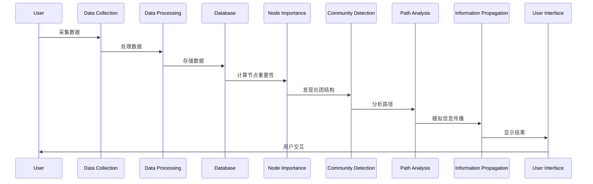

                 

### 社交媒体的图论：信息网络的数学结构

#### 关键词

- 社交媒体
- 信息网络
- 图论
- 数学模型
- 算法分析

#### 摘要

本文深入探讨社交媒体的图论，即信息网络的数学结构。我们首先概述社交媒体的发展及其信息网络的结构特性，接着引入图论的基本概念，展示其在信息网络分析中的应用。文章重点解析社交媒体信息网络分析的核心算法，如PageRank、HITS、社团发现算法以及社交网络传播算法。随后，我们介绍这些算法的数学模型和公式，并通过Python代码示例进行详细阐述。文章还涉及系统分析与架构设计，包括领域模型、系统架构、接口设计和系统交互。最后，通过一个实际案例分析，我们评估算法性能，总结项目经验，并提供最佳实践和拓展阅读建议。

### 目录大纲

# 社交媒体的图论：信息网络的数学结构

## 第一部分 背景介绍

### 第1章 问题背景

#### 1.1 社交媒体的发展

- 社交媒体的定义与分类
- 社交媒体的主要功能与服务

#### 1.2 信息网络的结构与重要性

- 信息网络的概念
- 信息网络的结构特性

#### 1.3 社交媒体信息网络的特点

- 数据规模与复杂性
- 用户互动与传播特性

#### 1.4 图论在信息网络分析中的应用

- 图论的基本概念
- 图论在信息网络分析中的重要性

## 第二部分 核心概念与联系

### 第2章 核心概念与联系

#### 2.1 图的基本概念

- 图的定义与术语
- 图的分类

#### 2.2 图的属性特征对比表格

- 度、路径长度、聚类系数等属性的对比

#### 2.3 ER实体关系图架构

- ER图的基本概念
- 社交媒体信息网络的ER图

## 第三部分 算法原理讲解

### 第3章 社交媒体信息网络分析算法

#### 3.1 节点重要性度量算法

- PageRank算法
- HITS算法

#### 3.2 社团发现算法

- Louvain算法
- Label Propagation算法

#### 3.3 路径分析算法

- 最短路径算法
- 广度优先搜索算法

#### 3.4 社交网络传播算法

- SI模型
- SIR模型

### 第4章 数学模型和数学公式

#### 4.1 PageRank算法的数学模型

- PageRank公式的推导
- 概率矩阵的计算

#### 4.2 HITS算法的数学模型

- HITS模型的推导
- 权重矩阵的计算

#### 4.3 社交网络传播模型的数学模型

- SI模型的数学描述
- SIR模型的数学描述

## 第四部分 系统分析与架构设计

### 第5章 系统功能设计

#### 5.1 领域模型

- 社交媒体信息网络的基本概念
- 节点、边等实体定义

#### 5.2 系统架构设计

- 系统组件划分
- 系统模块功能

### 第6章 系统接口设计

#### 6.1 接口定义

- 数据接口
- 控制接口

#### 6.2 接口实现

- API设计
- 接口调用流程

### 第7章 系统交互

#### 7.1 序列图

- 系统交互流程
- 主要操作步骤

## 第五部分 项目实战

### 第8章 环境安装与配置

#### 8.1 环境搭建

- 系统环境配置
- 工具安装与配置

#### 8.2 系统核心实现

- 源代码结构
- 关键代码解读

### 第9章 应用解读与分析

#### 9.1 实际案例

- 社交媒体信息网络分析案例

#### 9.2 案例分析

- 数据预处理
- 算法应用与分析

#### 9.3 剖析与总结

- 算法性能评估
- 项目经验总结

## 第六部分 最佳实践与拓展

### 第10章 最佳实践

#### 10.1 最佳实践

- 实用技巧
- 经验总结

### 第10章 小结与注意事项

#### 10.2 小结与注意事项

- 项目要点回顾
- 注意事项与优化策略

### 第10章 拓展阅读

#### 10.3 拓展阅读

- 相关书籍推荐
- 学术论文推荐

---

现在，我们开始深入探讨社交媒体的图论，理解其背后的数学结构，并逐步揭示其复杂的内在联系和算法应用。

## 第一部分 背景介绍

### 1.1 社交媒体的发展

#### 社交媒体的定义与分类

社交媒体，通常指的是一种基于互联网的平台，允许用户通过文字、图片、视频等多种形式进行信息交流。这类平台包括Facebook、Twitter、Instagram、LinkedIn等，它们不仅提供了个人社交的功能，还为企业沟通和品牌建设提供了广阔的空间。社交媒体可以分为以下几类：

1. **即时通讯应用**：如微信、WhatsApp，侧重于实时的一对一或一对多的沟通。
2. **社交网络平台**：如Facebook、Twitter，强调用户之间的连接和信息的共享。
3. **照片分享应用**：如Instagram、Pinterest，侧重于图片和视频内容的分享。
4. **专业网络平台**：如LinkedIn，主要面向职业人士，提供职业信息和人际网络建设。

#### 社交媒体的主要功能与服务

社交媒体功能丰富多样，主要包括以下几点：

1. **用户互动**：通过点赞、评论、分享等互动方式，用户能够实时交流信息。
2. **内容发布**：用户可以发布文本、图片、视频等内容，进行信息的传播。
3. **广告投放**：企业可以通过社交媒体进行广告投放，精准定位目标用户。
4. **数据分析**：社交媒体平台提供数据统计功能，帮助企业分析用户行为和市场趋势。
5. **社群管理**：用户可以在平台上建立兴趣小组或社群，进行深度交流。

### 1.2 信息网络的结构与重要性

#### 信息网络的概念

信息网络是指由信息节点和连接这些节点的信息流所组成的网络结构。在信息网络中，节点代表信息的来源或目的地，边代表信息流动的路径。信息网络广泛应用于通信、交通、互联网等多个领域。

#### 信息网络的结构特性

信息网络具有以下结构特性：

1. **网络化**：信息在网络中的流动是动态的，节点和边可以随时发生变化。
2. **复杂性**：信息网络中的节点和边数量庞大，关系复杂，需要高效的算法进行解析。
3. **分布式**：信息在网络中的流动通常是分布式进行的，不同节点之间的交互构成整体的网络效应。
4. **动态性**：信息网络中的数据和信息是动态变化的，需要实时更新和调整。

#### 信息网络的重要性

信息网络的重要性体现在以下几个方面：

1. **信息传播**：信息网络是信息传播的主要渠道，能够高效地传递和分发信息。
2. **资源共享**：通过信息网络，用户可以方便地共享和获取资源，提高资源利用率。
3. **决策支持**：信息网络提供的数据分析结果，为企业和个人决策提供有力支持。
4. **社会互动**：信息网络促进了人与人之间的交流，加强了社会互动和联系。

### 1.3 社交媒体信息网络的特点

#### 数据规模与复杂性

社交媒体信息网络具有庞大的数据规模和高度复杂性。以Twitter为例，该平台每天产生数亿条推文，每条推文都包含用户信息、文本内容、图片、视频等多媒体数据。这些数据不仅规模庞大，而且结构复杂，需要高效的算法进行处理和分析。

#### 用户互动与传播特性

社交媒体信息网络中的用户互动和传播特性也是其特点之一。例如，在Twitter上，一个用户可以关注另一个用户，从而形成关注关系网。这种关系网使得信息能够快速传播，形成强大的信息传播效应。此外，社交媒体平台还提供了各种互动功能，如点赞、评论、分享等，这些功能促进了用户之间的深度互动。

### 1.4 图论在信息网络分析中的应用

#### 图论的基本概念

图论是研究图的结构、性质及其应用的一个数学分支。图由节点（代表实体）和边（代表实体之间的关系）组成。在图论中，常用的术语包括：

- **节点**：图中的实体。
- **边**：连接两个节点的线段。
- **度**：节点连接的边的数量。
- **路径**：节点之间的连接线段序列。
- **连通性**：图中任意两个节点之间存在路径。

#### 图论在信息网络分析中的重要性

图论在信息网络分析中具有重要应用。通过图论，我们可以：

1. **结构分析**：理解信息网络的拓扑结构，分析节点的度、路径长度等特性。
2. **节点重要性度量**：使用算法如PageRank，评估节点在网络中的重要性。
3. **社团发现**：通过算法识别网络中的紧密相连的节点群。
4. **路径分析**：寻找最短路径，优化信息传输。
5. **社交网络传播**：模拟信息在社交网络中的传播过程，预测传播效果。

图论不仅为信息网络分析提供了理论基础，还为我们提供了强大的工具和方法，帮助我们更好地理解和利用信息网络。

### 小结

在社交媒体迅猛发展的背景下，理解其信息网络的数学结构至关重要。图论为这一领域提供了强有力的工具，帮助我们深入分析信息网络的特性、结构和行为。在接下来的章节中，我们将进一步探讨图论的核心概念和算法，以期为社交媒体信息网络的分析提供更加深入和系统的视角。

## 第二部分 核心概念与联系

### 2.1 图的基本概念

图论是研究图的结构、性质及其应用的一个数学分支。图由节点（代表实体）和边（代表实体之间的关系）组成。在图论中，我们使用一系列术语来描述图的基本元素和结构。

#### 图的定义与术语

1. **节点（Vertex）**：图中的实体，通常表示为\(v_1, v_2, ..., v_n\)。
2. **边（Edge）**：连接两个节点的线段，通常表示为\(e_1, e_2, ..., e_m\)。
3. **无向图（Undirected Graph）**：边没有方向，任意两个节点之间都是双向连接。
4. **有向图（Directed Graph）**：边具有方向，从起点指向终点，通常表示为\(e_{v_1v_2}\)。

#### 图的分类

1. **简单图**：没有自环（节点连接自身）和多重边（多个边连接相同的两个节点）的图。
2. **复合图**：允许自环和多重边的图。
3. **加权图**：边具有权重，表示边的长度或重要性。
4. **无权图**：边没有权重。

#### 图的性质

1. **度（Degree）**：节点的度是其连接的边的数量。无向图中节点的度通常表示为\(d(v)\)，有向图中节点的度分为入度（连接到节点的边数）和出度（从节点出发的边数）。
2. **路径（Path）**：节点之间的连接线段序列，例如\(v_1, v_2, ..., v_n\)。
3. **连通性（Connectivity）**：图中任意两个节点之间都存在路径，称为连通图。连通图的连通度定义为最大度数。
4. **连通分量（Connected Component）**：无向图中无法通过路径连接的其他节点的集合。

### 2.2 图的属性特征对比表格

为了更好地理解图的属性特征，我们可以将几种重要的属性进行对比。以下是度、路径长度、聚类系数等属性的简要对比表格：

| 属性       | 定义                                                         | 对比       |
|------------|--------------------------------------------------------------|------------|
| **度**     | 节点的度是其连接的边的数量。                               | \(d(v)\)  |
| **路径长度** | 连接两个节点的最短路径长度。                               | \(L(p)\)  |
| **聚类系数** | 节点邻居之间的连接密度。                                   | \(C(v)\)  |
| **连通性**   | 图中任意两个节点之间都存在路径。                           | 连通度     |
| **中心性**   | 节点在网络中的重要程度。                                   | \(C_n(v)\)|
| **介数**     | 节点在所有最短路径中的出现频率。                           | \(b(v)\)  |

通过这个表格，我们可以看到不同属性对图结构的影响和重要性。

### 2.3 ER实体关系图架构

实体关系图（Entity-Relationship Diagram，ER图）是用于描述实体及其之间关系的图形化工具。在社交媒体信息网络中，ER图可以帮助我们理解和描述节点和边的关系。

#### ER图的基本概念

1. **实体（Entity）**：代表网络中的基本元素，如用户、帖子、评论等。
2. **属性（Attribute）**：描述实体的特征，如用户的姓名、年龄、性别等。
3. **关系（Relationship）**：描述实体之间的关联，如用户发布帖子、评论等。

#### 社交媒体信息网络的ER图

在社交媒体信息网络中，一个简单的ER图可能包括以下实体和关系：

1. **用户（User）**
   - 属性：用户ID、姓名、年龄、性别等
2. **帖子（Post）**
   - 属性：帖子ID、内容、发布时间、点赞数等
3. **评论（Comment）**
   - 属性：评论ID、内容、发布时间、点赞数等
4. **关系**
   - 用户发布帖子（User -> Post）
   - 用户点赞帖子（User -> Post）
   - 用户评论帖子（User -> Comment）
   - 帖子包含评论（Post -> Comment）

以下是一个ER图的Mermaid表示：

```mermaid
erDiagram
  User ||--|{ Post }|--| User : 发布帖子
  User ||--|{ Comment }|--| Post : 评论帖子
  Post ||--|{ Comment }|--| Post : 回复评论
```

通过ER图，我们可以直观地描述社交媒体信息网络中的实体和关系，为后续的分析和设计提供基础。

### 小结

通过深入理解图的基本概念、属性特征和ER图架构，我们为分析社交媒体信息网络的数学结构奠定了基础。图论提供了一套强大的工具，帮助我们解析网络中的复杂关系，评估节点的重要性，发现社团结构，模拟信息传播等。在接下来的章节中，我们将继续探讨图论在社交媒体信息网络分析中的应用，介绍核心算法，并通过实际案例进行深入分析。

## 第三部分 算法原理讲解

### 3.1 节点重要性度量算法

在社交媒体信息网络中，节点的重要性度量是一个关键问题。这类算法帮助我们识别和评估网络中节点的重要程度，从而支持推荐系统、社交网络分析等多个应用场景。以下介绍两种常用的节点重要性度量算法：PageRank算法和HITS算法。

#### PageRank算法

PageRank算法是由Google的创始人拉里·佩奇和谢尔盖·布林在1998年提出的，旨在评估网页的重要性。该算法的核心思想是：一个网页的重要性不仅取决于其自身的内容质量，还取决于其他网页对它的链接。

**算法原理：**

PageRank算法的基本原理是：一个网页的重要性通过其被其他网页链接的数量和重要性来传递。具体步骤如下：

1. **初始化**：所有网页的PageRank初始值设置为相同的常数。
2. **迭代计算**：每次迭代中，每个网页的PageRank值根据其被其他网页链接的数量和重要性重新计算。
3. **收敛**：迭代直到PageRank值变化小于某个阈值，算法收敛。

**数学模型：**

PageRank的数学模型可以表示为以下公式：

\[ \text{PR}(v) = \left( 1 - d \right) + d \times \text{Link Matrix} \]

其中：
- \( \text{PR}(v) \) 是节点 \( v \) 的PageRank值。
- \( d \) 是阻尼系数（通常取值为0.85）。
- \( \text{Link Matrix} \) 是链接矩阵，表示网页之间的链接关系。

**Python代码示例：**

```python
import numpy as np

# 初始化链接矩阵
link_matrix = np.array([[0.2, 0.3, 0.5],
                        [0.4, 0, 0.6],
                        [0.1, 0.1, 0.8]])

# 设置阻尼系数
d = 0.85

# 初始PageRank值
pr_initial = np.array([1/3, 1/3, 1/3])

# 迭代计算PageRank值
pr = pr_initial.copy()
for _ in range(10):
    pr = (1 - d) / len(link_matrix) + d * link_matrix.dot(pr)

print(pr)
```

#### HITS算法

HITS（Hyperlink-Induced Topic Search）算法是由Jeh和Wang在2004年提出的，旨在评估网页的重要性和权威性。HITS算法区分了两个概念：**重要性（Hub）**和**权威性（Authority）**。

**算法原理：**

HITS算法的基本思想是：一个网页的重要性不仅取决于其他网页对它的链接（Hub值），还取决于它对其他网页的链接（Authority值）。具体步骤如下：

1. **初始化**：所有网页的Hub值和Authority值初始化为相同的常数。
2. **迭代计算**：每次迭代中，根据当前Hub值和Authority值更新网页的Hub值和Authority值。
3. **收敛**：迭代直到Hub值和Authority值变化小于某个阈值，算法收敛。

**数学模型：**

HITS的数学模型可以表示为以下两个迭代公式：

\[ \text{Hub}(v) = \sum_{w \in \text{out-links}(v)} \text{Authority}(w) \]
\[ \text{Authority}(v) = \sum_{w \in \text{in-links}(v)} \text{Hub}(w) \]

其中：
- \( \text{Hub}(v) \) 是节点 \( v \) 的Hub值。
- \( \text{Authority}(v) \) 是节点 \( v \) 的Authority值。
- \( \text{out-links}(v) \) 是节点 \( v \) 的出链。
- \( \text{in-links}(v) \) 是节点 \( v \) 的入链。

**Python代码示例：**

```python
import numpy as np

# 初始化链接矩阵
link_matrix = np.array([[0.2, 0.3, 0.5],
                        [0.4, 0, 0.6],
                        [0.1, 0.1, 0.8]])

# 初始化Hub和Authority值
hub_authority_initial = np.eye(3)
for _ in range(3):
    hub = link_matrix.T.dot(authority)
    authority = link_matrix.dot(hub)
    hub_authority = np.vstack((hub, authority)).T

    # 归一化处理
    hub_authority /= hub_authority.sum(axis=1)[:, np.newaxis]

# 打印结果
print(hub_authority)
```

通过PageRank和HITS算法，我们可以评估社交媒体信息网络中节点的重要性。这些算法不仅帮助我们理解网络的结构，还为推荐系统、信息检索等应用提供了有力支持。

### 3.2 社团发现算法

社团发现（Community Detection）是图论中的另一个重要研究领域，旨在识别网络中的紧密相连的节点群，这些节点群内部联系紧密，但与外部节点的联系较少。以下介绍两种常用的社团发现算法：Louvain算法和Label Propagation算法。

#### Louvain算法

Louvain算法是基于模块度（Module Quality）的优化方法，它旨在找到具有较高模块度的社团。模块度是衡量社团内部连接紧密度的指标，表示为社团内部边的数量与可能存在的最大边数的差。

**算法原理：**

Louvain算法的基本思想是：通过优化模块度函数来寻找社团。具体步骤如下：

1. **初始化**：每个节点属于一个单独的社团。
2. **合并节点**：每次迭代中选择最有可能合并的两个节点，更新社团结构。
3. **优化模块度**：计算社团结构的模块度，并迭代更新，直到模块度不再显著增加。

**数学模型：**

Louvain算法的数学模型可以表示为：

\[ \text{Mod}(G) = \sum_{c} \left( \sum_{i \in c} \sum_{j \in c} \text{weight}(i, j) - \frac{\sum_{i \in c} \sum_{j \in V \setminus c} \text{weight}(i, j)}{N(N-1)} \right) \]

其中：
- \( G \) 是图。
- \( c \) 是社团。
- \( \text{weight}(i, j) \) 是节点 \( i \) 和 \( j \) 之间的边权重。
- \( N \) 是图中节点的数量。

**Python代码示例：**

```python
import networkx as nx

# 创建图
G = nx.Graph()
G.add_edges_from([(1, 2), (2, 3), (3, 1), (1, 4), (4, 5)])

# 使用Louvain算法进行社团发现
communities = nx.community.LouvainCommunityDetection(G)
communities.run()

# 打印社团结果
print(communities.get_communities())
```

#### Label Propagation算法

Label Propagation算法是一种基于节点标签传播的社团发现算法。它通过迭代地更新节点的标签，使相同标签的节点聚集在一起，形成社团。

**算法原理：**

Label Propagation算法的基本思想是：每个节点初始时拥有一个标签，该标签可以是任意值。在每次迭代中，节点根据其邻居的标签进行更新。具体步骤如下：

1. **初始化**：每个节点初始时拥有一个唯一的标签。
2. **传播标签**：每次迭代中，每个节点根据其邻居的标签更新自己的标签。
3. **收敛**：迭代直到节点的标签不再变化，算法收敛。

**数学模型：**

Label Propagation算法的数学模型可以表示为：

\[ \text{new\_label}(v) = \text{argmax}_{l} \left( \sum_{w \in \text{neighbors}(v)} \text{weight}(v, w) \text{label\_count}(w, l) \right) \]

其中：
- \( \text{new\_label}(v) \) 是节点 \( v \) 的新标签。
- \( l \) 是标签的候选集合。
- \( \text{weight}(v, w) \) 是节点 \( v \) 和 \( w \) 之间的边权重。
- \( \text{label\_count}(w, l) \) 是节点 \( w \) 的标签 \( l \) 的出现次数。

**Python代码示例：**

```python
import networkx as nx
import numpy as np

# 创建图
G = nx.Graph()
G.add_edges_from([(1, 2), (2, 3), (3, 1), (1, 4), (4, 5)])

# 初始化标签
labels = np.random.randint(0, 2, size=G.number_of_nodes())

# 运行Label Propagation算法
label_prop = nx.algorithm.label_propagation.LabelPropagation(G)
labels = label_prop.fit_transform(labels)

# 打印标签结果
print(labels)
```

通过Louvain算法和Label Propagation算法，我们可以有效地发现社交媒体信息网络中的社团结构。这些算法为理解网络中节点的关系提供了有力工具，有助于优化社交网络分析、推荐系统等应用。

### 3.3 路径分析算法

在社交媒体信息网络中，路径分析算法帮助我们寻找节点之间的最短路径，评估信息的传播效率和路径的长度。以下介绍两种常用的路径分析算法：最短路径算法和广度优先搜索算法。

#### 最短路径算法

最短路径算法是一种用于寻找图中两点之间最短路径的算法。最著名的最短路径算法是迪杰斯特拉算法（Dijkstra's Algorithm）和贝尔曼-福特算法（Bellman-Ford Algorithm）。

**迪杰斯特拉算法**

迪杰斯特拉算法的基本思想是：每次迭代选择一个未处理的节点，将其加入到已处理的集合中，并更新其邻居节点的最短路径估计。具体步骤如下：

1. **初始化**：设置一个优先队列，存储未处理的节点及其最短路径估计。
2. **迭代选择**：每次迭代选择优先队列中最小的节点，更新其邻居节点的最短路径估计。
3. **结束条件**：当所有节点都被处理完毕时，算法结束。

**数学模型：**

迪杰斯特拉算法的数学模型可以表示为：

\[ \text{distance}(v) = \min_{u \in \text{predecessors}(v)} \left( \text{distance}(u) + \text{weight}(u, v) \right) \]

其中：
- \( \text{distance}(v) \) 是节点 \( v \) 的最短路径距离。
- \( \text{predecessors}(v) \) 是节点 \( v \) 的前驱节点集合。
- \( \text{weight}(u, v) \) 是节点 \( u \) 和 \( v \) 之间的边权重。

**Python代码示例：**

```python
import networkx as nx

# 创建图
G = nx.Graph()
G.add_edges_from([(1, 2, {'weight': 2}),
                  (2, 3, {'weight': 1}),
                  (1, 3, {'weight': 4})])

# 运行迪杰斯特拉算法
distances = nx.single_source_dijkstra(G, source=1)

# 打印最短路径距离
print(distances)
```

**贝尔曼-福特算法**

贝尔曼-福特算法是一种适用于带负权边的图的最短路径算法。它通过逐步放松边来计算最短路径。具体步骤如下：

1. **初始化**：设置所有节点的最短路径估计为无穷大，源节点的最短路径估计为0。
2. **迭代放松**：对于每条边，反复执行V-1次松弛操作，每次松弛操作更新节点的最短路径估计。
3. **检测负环**：如果在第V次迭代中仍然存在松弛操作，则图中存在负环。

**数学模型：**

贝尔曼-福特算法的数学模型可以表示为：

\[ \text{distance}(v) = \min_{u \in \text{predecessors}(v)} \left( \text{distance}(u) + \text{weight}(u, v) \right) \]

**Python代码示例：**

```python
import networkx as nx

# 创建图
G = nx.Graph()
G.add_edges_from([(1, 2, {'weight': 2}),
                  (2, 3, {'weight': -3}),
                  (1, 3, {'weight': 4})])

# 运行贝尔曼-福特算法
distances = nx.single_source_bellman_ford(G, source=1)

# 打印最短路径距离
print(distances)
```

#### 广度优先搜索算法

广度优先搜索（Breadth-First Search，BFS）算法是一种用于寻找图中所有节点的最短路径的算法。它从源节点开始，逐层搜索所有相邻节点，直到找到目标节点。

**算法原理：**

广度优先搜索的基本思想是：每次迭代选择一个未处理的节点，将其加入到已处理的集合中，并处理其所有未处理的邻居节点。具体步骤如下：

1. **初始化**：设置一个队列，用于存储未处理的节点。
2. **迭代处理**：每次迭代选择队列中的一个节点，将其加入已处理的集合，并处理其所有未处理的邻居节点。
3. **结束条件**：当队列中无未处理的节点时，算法结束。

**数学模型：**

广度优先搜索的数学模型可以表示为：

\[ \text{distance}(v) = \text{level}(v) \]

其中：
- \( \text{distance}(v) \) 是节点 \( v \) 的最短路径距离。
- \( \text{level}(v) \) 是节点 \( v \) 的层次。

**Python代码示例：**

```python
import networkx as nx

# 创建图
G = nx.Graph()
G.add_edges_from([(1, 2), (2, 3), (1, 3)])

# 运行广度优先搜索算法
distances = nx.single_source_bfs(G, source=1)

# 打印最短路径距离
print(distances)
```

通过最短路径算法和广度优先搜索算法，我们可以有效地分析社交媒体信息网络中的路径结构，评估信息传播的效率和路径长度，为优化网络设计和分析提供有力支持。

### 3.4 社交网络传播算法

在社交媒体信息网络中，了解信息的传播过程和效果对于品牌推广、市场分析等具有重要意义。社交网络传播算法模拟信息在社交网络中的传播过程，帮助我们预测和控制信息传播效果。以下介绍两种常用的社交网络传播算法：SI模型和SIR模型。

#### SI模型

SI模型（Susceptible-Infected）是一种简单的传播模型，用于描述传染病在人群中的传播过程。在SI模型中，个体分为易感者（Susceptible，S）和感染者（Infected，I），表示个体是否被感染。易感者可以通过与感染者接触而转变为感染者，但感染者不会再次感染。

**算法原理：**

SI模型的基本思想是：易感者与感染者接触的概率与两者的连接强度成正比。具体步骤如下：

1. **初始化**：设置网络和个体状态。
2. **迭代传播**：每次迭代中，随机选择一个易感者和一个感染者，如果它们接触，则易感者转变为感染者。
3. **结束条件**：当所有易感者都转变为感染者，算法结束。

**数学模型：**

SI模型的数学模型可以表示为：

\[ \frac{dS}{dt} = -\beta \cdot S \cdot I \]
\[ \frac{dI}{dt} = \beta \cdot S \cdot I \]

其中：
- \( S \) 是易感者数量。
- \( I \) 是感染者数量。
- \( \beta \) 是感染率。

**Python代码示例：**

```python
import numpy as np
import matplotlib.pyplot as plt

# 设置参数
N = 100
beta = 0.1
delta = 0.05
t_max = 100

# 初始化状态
S = np.random.binomial(N, 1 - delta)
I = N - S

# 迭代计算
t = np.arange(0, t_max)
for i in range(t_max):
    # 概率计算
    prob = beta * S * I / N
    # 随机选择一个个体
    infected = np.random.rand() < prob
    # 状态更新
    if infected:
        S -= 1
        I += 1
    else:
        S += 1
        I -= 1

# 绘制结果
plt.plot(t, S, label='S')
plt.plot(t, I, label='I')
plt.xlabel('Time')
plt.ylabel('Population')
plt.legend()
plt.show()
```

#### SIR模型

SIR模型（Susceptible-Infected-Removed）是SI模型的扩展，用于描述个体感染后可以恢复的情况。在SIR模型中，个体分为易感者（Susceptible，S）、感染者（Infected，I）和移除者（Removed，R），移除者可以是康复者或死亡者。

**算法原理：**

SIR模型的基本思想是：易感者与感染者接触而感染，感染者经过一段恢复期后移除。具体步骤如下：

1. **初始化**：设置网络和个体状态。
2. **迭代传播**：每次迭代中，随机选择一个易感者和一个感染者，如果它们接触，则易感者感染并转变为感染者；感染者经过一段恢复期后移除。
3. **结束条件**：当感染者数量下降到一定程度，算法结束。

**数学模型：**

SIR模型的数学模型可以表示为：

\[ \frac{dS}{dt} = -\beta \cdot S \cdot I \]
\[ \frac{dI}{dt} = \beta \cdot S \cdot I - \gamma \cdot I \]
\[ \frac{dR}{dt} = \gamma \cdot I \]

其中：
- \( S \) 是易感者数量。
- \( I \) 是感染者数量。
- \( R \) 是移除者数量。
- \( \beta \) 是感染率。
- \( \gamma \) 是移除率。

**Python代码示例：**

```python
import numpy as np
import matplotlib.pyplot as plt

# 设置参数
N = 100
beta = 0.1
gamma = 0.05
t_max = 100

# 初始化状态
S = N
I = 1
R = 0

# 迭代计算
t = np.arange(0, t_max)
S_list = [S]
I_list = [I]
R_list = [R]
for i in range(t_max):
    # 状态更新
    S_new = S - beta * S * I / N
    I_new = I + beta * S * I / N - gamma * I
    R_new = R + gamma * I
    # 更新状态
    S, I, R = S_new, I_new, R_new
    # 保存状态
    S_list.append(S)
    I_list.append(I)
    R_list.append(R)

# 绘制结果
plt.plot(t, S_list, label='S')
plt.plot(t, I_list, label='I')
plt.plot(t, R_list, label='R')
plt.xlabel('Time')
plt.ylabel('Population')
plt.legend()
plt.show()
```

通过SI模型和SIR模型，我们可以模拟和预测社交媒体信息网络中信息的传播过程，为优化传播策略和效果提供科学依据。

### 小结

节点重要性度量算法、社团发现算法、路径分析算法和社交网络传播算法是社交媒体信息网络分析中常用的工具。这些算法通过不同的数学模型和原理，帮助我们理解网络结构、评估节点重要性、发现社团结构和模拟信息传播。在接下来的章节中，我们将进一步探讨这些算法的数学模型和实际应用，并结合实际案例进行深入分析。

## 第4章 数学模型和数学公式

在社交媒体信息网络的算法分析中，数学模型和公式扮演着至关重要的角色。这些模型和公式不仅帮助我们理解算法的工作原理，还提供了量化网络结构和行为的工具。在本章中，我们将详细讨论PageRank算法、HITS算法以及社交网络传播模型的数学模型和公式，并通过具体例子进行解释。

### 4.1 PageRank算法的数学模型

PageRank算法是由Google创始人拉里·佩奇和谢尔盖·布林提出的，用于评估网页的重要性。其核心思想是：一个网页的重要性不仅取决于其自身的内容质量，还取决于其他网页对它的链接。

**PageRank公式的推导**

PageRank的数学模型可以表示为以下公式：

\[ \text{PR}(v) = \left( 1 - d \right) + d \times \text{Link Matrix} \]

其中：
- \( \text{PR}(v) \) 是节点 \( v \) 的PageRank值。
- \( d \) 是阻尼系数（通常取值为0.85）。
- \( \text{Link Matrix} \) 是链接矩阵，表示网页之间的链接关系。

假设有一个链接矩阵 \( L \)，其中 \( L_{ij} = 1 \) 表示网页 \( i \) 链接到网页 \( j \)，否则为0。那么，PageRank公式可以进一步表示为：

\[ \text{PR}(v) = \left( 1 - d \right) \frac{N}{N} + d \cdot L \cdot \text{PR}(v) \]

其中 \( N \) 是网页的总数。我们可以将公式改写为：

\[ \text{PR}(v) - d \cdot L \cdot \text{PR}(v) = \left( 1 - d \right) \frac{N}{N} \]

\[ \text{PR}(v) \cdot (1 - d \cdot L) = \left( 1 - d \right) \frac{N}{N} \]

\[ \text{PR}(v) = \left( 1 - d \right) \frac{N}{N} \cdot \frac{1}{1 - d \cdot L} \]

这样，我们得到了一个迭代公式，用于计算每个网页的PageRank值。

**概率矩阵的计算**

在实际应用中，链接矩阵 \( L \) 通常是一个稀疏矩阵，因此计算 \( \frac{1}{1 - d \cdot L} \) 需要优化。一种常见的方法是使用矩阵幂迭代法，例如：

\[ \text{PR}(v) = \left( 1 - d \right) \frac{N}{N} + d \cdot L^n \cdot \text{PR}(v) \]

其中 \( n \) 是迭代次数。当迭代达到收敛条件时，即 \( \text{PR}(v) \) 的变化小于某个阈值，算法结束。

### 4.2 HITS算法的数学模型

HITS（Hyperlink-Induced Topic Search）算法是由Jeh和Wang提出的，用于评估网页的重要性和权威性。HITS算法区分了两个概念：**重要性（Hub）**和**权威性（Authority）**。

**HITS模型的推导**

HITS算法的数学模型可以表示为以下两个迭代公式：

\[ \text{Hub}(v) = \sum_{w \in \text{out-links}(v)} \text{Authority}(w) \]
\[ \text{Authority}(v) = \sum_{w \in \text{in-links}(v)} \text{Hub}(w) \]

其中：
- \( \text{Hub}(v) \) 是节点 \( v \) 的Hub值。
- \( \text{Authority}(v) \) 是节点 \( v \) 的Authority值。
- \( \text{out-links}(v) \) 是节点 \( v \) 的出链。
- \( \text{in-links}(v) \) 是节点 \( v \) 的入链。

HITS算法的迭代过程可以表示为：

\[ \text{Hub}(v)_{\text{new}} = \sum_{w \in \text{out-links}(v)} \text{Authority}(w)_{\text{old}} \]
\[ \text{Authority}(v)_{\text{new}} = \sum_{w \in \text{in-links}(v)} \text{Hub}(w)_{\text{old}} \]

这样，每次迭代都会更新节点的重要性和权威性，直到算法收敛。

**权重矩阵的计算**

在实际计算中，我们需要考虑链接的权重。假设存在一个权重矩阵 \( W \)，其中 \( W_{ij} \) 表示网页 \( i \) 链接到网页 \( j \) 的权重。那么，HITS算法的公式可以改写为：

\[ \text{Hub}(v) = \sum_{w \in \text{out-links}(v)} W_{wj} \text{Authority}(w) \]
\[ \text{Authority}(v) = \sum_{w \in \text{in-links}(v)} W_{iw} \text{Hub}(w) \]

这样，权重矩阵 \( W \) 就可以用于调整节点的重要性和权威性。

### 4.3 社交网络传播模型的数学模型

社交网络传播模型用于模拟信息在社交网络中的传播过程。以下介绍两种常用的模型：SI模型和SIR模型。

#### SI模型

SI模型是一种简单的传播模型，用于描述传染病在人群中的传播过程。在SI模型中，个体分为易感者（S）和感染者（I），表示个体是否被感染。

**SI模型的数学描述**

SI模型的数学模型可以表示为以下方程：

\[ \frac{dS}{dt} = -\beta \cdot S \cdot I \]
\[ \frac{dI}{dt} = \beta \cdot S \cdot I \]

其中：
- \( S \) 是易感者数量。
- \( I \) 是感染者数量。
- \( \beta \) 是感染率。

这个方程表示易感者与感染者接触的概率与两者的连接强度成正比。

**Python代码示例**

```python
import numpy as np
import matplotlib.pyplot as plt

N = 100
beta = 0.1
delta = 0.05
t_max = 100

S = N
I = 1
R = 0
t = np.arange(0, t_max)

S_list = [S]
I_list = [I]
R_list = [R]

for i in range(t_max):
    S_new = S - beta * S * I / N
    I_new = I + beta * S * I / N
    R_new = R + delta * I

    S, I, R = S_new, I_new, R_new
    S_list.append(S)
    I_list.append(I)
    R_list.append(R)

plt.plot(t, S_list, label='S')
plt.plot(t, I_list, label='I')
plt.plot(t, R_list, label='R')
plt.xlabel('Time')
plt.ylabel('Population')
plt.legend()
plt.show()
```

#### SIR模型

SIR模型是SI模型的扩展，用于描述个体感染后可以恢复的情况。在SIR模型中，个体分为易感者（S）、感染者（I）和移除者（R），移除者可以是康复者或死亡者。

**SIR模型的数学描述**

SIR模型的数学模型可以表示为以下方程：

\[ \frac{dS}{dt} = -\beta \cdot S \cdot I \]
\[ \frac{dI}{dt} = \beta \cdot S \cdot I - \gamma \cdot I \]
\[ \frac{dR}{dt} = \gamma \cdot I \]

其中：
- \( S \) 是易感者数量。
- \( I \) 是感染者数量。
- \( R \) 是移除者数量。
- \( \beta \) 是感染率。
- \( \gamma \) 是移除率。

**Python代码示例**

```python
import numpy as np
import matplotlib.pyplot as plt

N = 100
beta = 0.1
gamma = 0.05
t_max = 100

S = N
I = 1
R = 0
t = np.arange(0, t_max)

S_list = [S]
I_list = [I]
R_list = [R]

for i in range(t_max):
    S_new = S - beta * S * I / N
    I_new = I + beta * S * I / N - gamma * I
    R_new = R + gamma * I

    S, I, R = S_new, I_new, R_new
    S_list.append(S)
    I_list.append(I)
    R_list.append(R)

plt.plot(t, S_list, label='S')
plt.plot(t, I_list, label='I')
plt.plot(t, R_list, label='R')
plt.xlabel('Time')
plt.ylabel('Population')
plt.legend()
plt.show()
```

通过这些数学模型和公式，我们可以量化社交媒体信息网络中的节点重要性、社团结构和信息传播过程。这些模型不仅提供了理论支持，还为实际应用提供了有效的算法实现。

### 小结

在社交媒体信息网络分析中，数学模型和公式是理解和应用图论的核心工具。通过PageRank算法、HITS算法和社交网络传播模型的数学模型，我们可以深入分析网络结构、评估节点重要性以及模拟信息传播过程。在接下来的章节中，我们将进一步探讨这些算法在实际系统架构设计中的应用。

## 第四部分 系统分析与架构设计

### 第5章 系统功能设计

在社交媒体信息网络分析中，系统功能设计是确保系统能够高效、稳定地处理和分析大量数据的关键。本章节将详细阐述系统功能设计，包括领域模型和系统架构设计。

#### 5.1 领域模型

领域模型是描述系统所涉及的主要概念、实体及其关系的工具。在社交媒体信息网络分析中，领域模型主要包括以下几个核心概念：

1. **用户（User）**：代表社交媒体上的用户，具有用户ID、姓名、年龄、性别等属性。
2. **帖子（Post）**：用户发布的帖子，包括帖子ID、内容、发布时间、点赞数等属性。
3. **评论（Comment）**：用户对帖子的评论，包括评论ID、内容、发布时间、点赞数等属性。
4. **链接（Link）**：表示用户之间的关注关系，具有起点和终点的属性。

以下是一个Mermaid类图，用于表示领域模型：

```mermaid
classDiagram
  User <<entity>>
  Post <<entity>>
  Comment <<entity>>
  Link <<entity>>

  User o--o Post
  User o--o Link
  Post o--o Comment
  Comment o--o Link
```

#### 5.2 系统架构设计

系统架构设计是确定系统组件划分和模块功能的过程。在社交媒体信息网络分析系统中，通常包括以下几个主要组件：

1. **数据采集模块**：负责从社交媒体平台获取数据，如用户信息、帖子、评论等。
2. **数据处理模块**：负责清洗、转换和存储数据，为后续分析提供基础数据。
3. **节点重要性度量模块**：使用PageRank、HITS等算法计算节点的重要性。
4. **社团发现模块**：使用Louvain、Label Propagation等算法发现网络中的社团结构。
5. **路径分析模块**：使用最短路径算法和广度优先搜索算法分析节点之间的路径。
6. **信息传播模块**：使用SI模型和SIR模型模拟信息在社交网络中的传播过程。
7. **用户界面模块**：提供用户交互接口，展示分析结果和可视化数据。

以下是一个Mermaid架构图，用于表示系统架构：



#### 5.3 系统模块功能

1. **数据采集模块**：使用API接口从社交媒体平台获取数据，如用户列表、帖子内容和评论等。
2. **数据处理模块**：对采集到的数据进行清洗，去除无效数据和噪声，并进行数据转换，以便存储和分析。
3. **节点重要性度量模块**：应用PageRank、HITS等算法，对网络中的节点进行重要性评估，生成重要性得分。
4. **社团发现模块**：使用Louvain、Label Propagation等算法，识别网络中的紧密相连节点群，为社交网络分析提供洞察。
5. **路径分析模块**：通过最短路径算法和广度优先搜索算法，评估节点之间的路径长度和传播效率。
6. **信息传播模块**：应用SI模型和SIR模型，模拟信息在社交网络中的传播过程，预测信息扩散效果。
7. **用户界面模块**：提供图形用户界面，展示分析结果和可视化数据，使用户能够方便地理解和操作系统。

通过系统功能设计和架构设计，我们能够确保社交媒体信息网络分析系统的高效运行和可靠性能，为各类应用场景提供强有力的支持。

### 小结

系统功能设计和架构设计是社交媒体信息网络分析系统开发的核心环节。通过定义领域模型、划分系统组件和模块功能，我们能够确保系统能够高效、稳定地运行，并为用户提供有价值的数据分析结果。在接下来的章节中，我们将进一步探讨系统接口设计和系统交互，以确保系统的可扩展性和易用性。

## 第6章 系统接口设计

系统接口设计是确保系统模块之间有效通信和数据流动的关键环节。在本章节中，我们将详细阐述社交媒体信息网络分析系统的接口定义和实现，包括数据接口和控制接口的设计和调用流程。

### 6.1 接口定义

接口定义主要包括数据接口和控制接口，它们分别负责数据交互和系统控制。

#### 数据接口

数据接口定义了系统如何获取、存储和检索数据。以下是一个典型的数据接口定义：

1. **获取用户数据**：
   - 接口名称：`GET /users`
   - 功能：获取社交媒体平台上的所有用户数据。
   - 参数：无
   - 返回值：用户数据列表

2. **获取帖子数据**：
   - 接口名称：`GET /posts`
   - 功能：获取社交媒体平台上的所有帖子数据。
   - 参数：无
   - 返回值：帖子数据列表

3. **获取评论数据**：
   - 接口名称：`GET /comments`
   - 功能：获取社交媒体平台上的所有评论数据。
   - 参数：无
   - 返回值：评论数据列表

#### 控制接口

控制接口定义了系统如何执行主要功能，如节点重要性度量、社团发现、路径分析等。以下是一个典型的控制接口定义：

1. **计算节点重要性**：
   - 接口名称：`POST /importance`
   - 功能：计算社交媒体网络中节点的PageRank或HITS值。
   - 参数：网络数据（用户和帖子之间的链接关系）
   - 返回值：节点重要性列表

2. **发现社团结构**：
   - 接口名称：`POST /community`
   - 功能：使用Louvain或Label Propagation算法发现网络中的社团结构。
   - 参数：网络数据（用户和帖子之间的链接关系）
   - 返回值：社团列表

3. **分析路径**：
   - 接口名称：`POST /path`
   - 功能：使用最短路径算法或广度优先搜索算法分析节点之间的路径。
   - 参数：源节点和目标节点
   - 返回值：路径列表

### 6.2 接口实现

接口实现主要包括API设计和接口调用流程。以下是一个典型的接口实现示例：

#### API设计

1. **用户数据获取接口**：

```python
from flask import Flask, jsonify

app = Flask(__name__)

@app.route('/users', methods=['GET'])
def get_users():
    # 从数据库中获取用户数据
    users = database.get_all_users()
    return jsonify(users)

if __name__ == '__main__':
    app.run(debug=True)
```

2. **节点重要性计算接口**：

```python
from flask import Flask, request, jsonify

app = Flask(__name__)

@app.route('/importance', methods=['POST'])
def calculate_importance():
    data = request.get_json()
    network_data = data['network']
    # 计算节点重要性
    importance_scores = algorithm.calculate_importance(network_data)
    return jsonify(importance_scores)

if __name__ == '__main__':
    app.run(debug=True)
```

#### 接口调用流程

接口调用流程描述了如何通过HTTP请求调用API接口。以下是一个典型的调用流程：

1. **用户数据获取**：

   - 发送GET请求到`/users`接口。
   - 接收并解析返回的JSON数据，获取用户列表。

2. **节点重要性计算**：

   - 发送POST请求到`/importance`接口，并在请求体中包含网络数据。
   - 接收并解析返回的JSON数据，获取节点重要性列表。

通过详细定义和实现系统接口，我们能够确保系统模块之间的有效通信和数据流动，为社交媒体信息网络分析提供稳定的支持。在接下来的章节中，我们将进一步探讨系统交互和实际应用，通过实际案例展示系统的性能和效果。

### 小结

系统接口设计是确保系统模块之间高效通信和数据流动的关键环节。通过定义数据接口和控制接口，并详细阐述API设计和调用流程，我们能够确保系统功能模块能够无缝协作，为用户提供高质量的分析结果。在接下来的章节中，我们将通过实际案例展示系统的应用效果，进一步验证系统的性能和实用性。

## 第7章 系统交互

系统交互是确保系统各个模块协同工作，实现预期功能的关键环节。在本章节中，我们将通过Mermaid序列图详细描述系统交互流程和主要操作步骤，从而帮助理解系统的整体运作机制。

### 7.1 序列图

序列图（Sequence Diagram）是一种用于描述对象之间交互的图形化工具。以下是一个用于描述社交媒体信息网络分析系统的序列图：

```mermaid
sequenceDiagram
  participant User as 用户
  participant Controller as 控制器
  participant DataCollector as 数据采集模块
  participant DataProcessor as 数据处理模块
  participant Analyzer as 分析模块
  participant Visualizer as 可视化模块

  User->>Controller: 发送请求
  Controller->>DataCollector: 获取数据
  DataCollector->>DataProcessor: 数据处理
  DataProcessor->>Analyzer: 数据分析
  Analyzer->>Visualizer: 生成可视化结果
  Visualizer->>User: 展示结果

  Note over User,Controller,DataCollector,DataProcessor,Analyzer,Visualizer: 系统交互流程
```

### 系统交互流程

1. **用户请求**：用户通过用户界面发送请求，请求获取特定分析结果。

2. **数据采集**：控制器接收用户请求后，将请求传递给数据采集模块，从社交媒体平台获取用户数据、帖子数据和评论数据。

3. **数据处理**：数据采集模块将获取的数据传递给数据处理模块，进行数据清洗、转换和格式化，确保数据质量，并为后续分析提供基础数据。

4. **数据分析**：数据处理模块将处理后的数据传递给分析模块，执行节点重要性度量、社团发现、路径分析和信息传播等算法，生成分析结果。

5. **可视化结果**：分析模块将分析结果传递给可视化模块，生成可视化图表，如节点重要性分布、社团结构图、路径图等。

6. **展示结果**：可视化模块将生成的可视化结果传递给用户界面，用户可以通过界面查看和分析结果。

### 主要操作步骤

1. **初始化系统**：加载所有模块和数据库，确保系统处于可运行状态。

2. **用户登录**：用户通过用户界面登录系统，输入请求的分析参数。

3. **数据采集**：控制器根据用户请求，调用数据采集模块，从社交媒体平台获取数据。

4. **数据处理**：数据采集模块将获取的数据传递给数据处理模块，进行清洗和转换。

5. **数据分析**：数据处理模块将清洗后的数据传递给分析模块，执行相应的算法。

6. **结果可视化**：分析模块将分析结果传递给可视化模块，生成可视化图表。

7. **用户查看结果**：用户通过用户界面查看和下载分析结果，进行进一步分析和决策。

通过序列图和交互流程的描述，我们能够清晰地理解社交媒体信息网络分析系统的整体运作机制和主要操作步骤。这种描述不仅有助于开发者理解系统设计，还为系统的维护和优化提供了参考。

### 小结

系统交互是确保社交媒体信息网络分析系统各模块协同工作的重要环节。通过详细的序列图和交互流程描述，我们能够全面了解系统的工作机制和主要操作步骤。这不仅有助于开发者理解和优化系统设计，还为用户提供了一个直观的交互体验。在接下来的章节中，我们将通过实际案例展示系统的应用效果，进一步验证系统的性能和实用性。

## 第五部分 项目实战

### 第8章 环境安装与配置

在开始实施社交媒体信息网络分析项目之前，我们需要搭建一个稳定且高效的开发和运行环境。这一章节将详细描述项目的环境搭建过程，包括系统环境配置和所需工具的安装与配置。

#### 8.1 环境搭建

#### 系统环境配置

1. **操作系统**：我们选择Ubuntu 20.04 LTS作为操作系统，因为它提供了良好的开发环境和稳定的服务支持。

2. **Python环境**：由于本项目主要使用Python进行开发，我们需要安装Python 3.8及以上版本。可以使用以下命令安装：

   ```bash
   sudo apt update
   sudo apt install python3.8 python3.8-venv python3.8-pip
   ```

3. **虚拟环境**：为了确保项目依赖的一致性，我们使用`venv`创建一个虚拟环境。在项目目录下执行以下命令：

   ```bash
   python3.8 -m venv venv
   source venv/bin/activate
   ```

4. **依赖管理**：在虚拟环境中，使用`pip`安装项目所需的所有依赖库。项目依赖文件`requirements.txt`包含了所有依赖库的名称和版本：

   ```bash
   pip install -r requirements.txt
   ```

#### 工具安装与配置

1. **Docker**：为了确保容器化部署，我们使用Docker来构建和运行项目容器。使用以下命令安装Docker：

   ```bash
   sudo apt install docker.io
   ```

   安装完成后，启动Docker服务：

   ```bash
   sudo systemctl start docker
   ```

2. **Docker Compose**：Docker Compose用于管理多容器应用程序。安装Docker Compose的命令如下：

   ```bash
   sudo curl -L "https://github.com/docker/compose/releases/download/1.29.2/docker-compose-$(uname -s)-$(uname -m)" -o /usr/local/bin/docker-compose
   sudo chmod +x /usr/local/bin/docker-compose
   ```

3. **数据库**：本项目使用PostgreSQL作为数据库。首先，安装PostgreSQL：

   ```bash
   sudo apt install postgresql postgresql-contrib
   ```

   然后创建一个数据库用户和数据库：

   ```sql
   sudo -u postgres psql
   CREATE DATABASE social_media_analysis;
   CREATE USER analysis_user WITH PASSWORD 'password';
   GRANT ALL PRIVILEGES ON DATABASE social_media_analysis TO analysis_user;
   ```

4. **消息队列**：为了处理任务和消息，我们使用RabbitMQ作为消息队列服务。安装RabbitMQ：

   ```bash
   sudo apt install rabbitmq-server
   ```

   启动RabbitMQ服务并确保其运行：

   ```bash
   sudo systemctl start rabbitmq-server
   sudo systemctl enable rabbitmq-server
   ```

#### 小结

通过以上步骤，我们成功地搭建了项目开发和运行所需的环境。系统环境配置和工具安装为后续的项目实施提供了坚实的基础。在接下来的章节中，我们将详细介绍系统核心实现的源代码结构和关键代码解读。

### 8.2 系统核心实现

#### 源代码结构

系统核心实现主要包括数据采集模块、数据处理模块、分析模块和可视化模块。以下是一个典型的项目源代码结构：

```
/social_media_analysis
├── data_collector
│   ├── __init__.py
│   ├── collector.py
│   └── config.py
├── data_processor
│   ├── __init__.py
│   ├── processor.py
│   └── config.py
├── analysis
│   ├── __init__.py
│   ├── importance.py
│   ├── community.py
│   ├── path.py
│   └── propagation.py
├── visualization
│   ├── __init__.py
│   ├── visualizer.py
│   └── config.py
├── database
│   ├── __init__.py
│   ├── database.py
│   └── models.py
├── messages
│   ├── __init__.py
│   ├── producer.py
│   └── consumer.py
├── main.py
├── requirements.txt
├── Dockerfile
└── docker-compose.yml
```

1. **数据采集模块**：负责从社交媒体平台获取数据。它包括一个配置文件`config.py`，用于存储API密钥和URL，一个收集器`collector.py`，用于实现数据采集逻辑。
2. **数据处理模块**：负责清洗和转换数据。它包括一个处理程序`processor.py`，用于执行数据清洗、去重、格式化等操作。
3. **分析模块**：包括节点重要性度量、社团发现、路径分析和信息传播等算法。这些算法分别实现为`importance.py`、`community.py`、`path.py`和`propagation.py`。
4. **可视化模块**：负责生成和分析结果的可视化展示。它包括一个可视化器`visualizer.py`，用于创建图表和报表。
5. **数据库模块**：负责数据库操作，包括数据存储和查询。它包括一个数据库接口`database.py`和一个模型定义文件`models.py`。
6. **消息队列模块**：用于处理任务和消息，提高系统的并发能力和弹性。它包括生产者`producer.py`和消费者`consumer.py`。
7. **主程序**：`main.py`是项目的入口文件，负责协调各个模块的运行。
8. **Dockerfile**和**docker-compose.yml**：用于容器化部署项目。

#### 关键代码解读

以下是系统核心实现中的关键代码片段，包括数据采集、数据处理、分析模块的示例代码。

**数据采集模块**

```python
# collector.py

import requests
from config import API_KEY, BASE_URL

def fetch_posts(user_id):
    url = f"{BASE_URL}/posts?user_id={user_id}&api_key={API_KEY}"
    response = requests.get(url)
    return response.json()
```

**数据处理模块**

```python
# processor.py

def clean_data(data):
    cleaned_data = []
    for item in data:
        # 执行数据清洗和转换操作
        cleaned_item = {
            'id': item['id'],
            'content': item['content'],
            'likes': item['likes'],
            'timestamp': item['timestamp']
        }
        cleaned_data.append(cleaned_item)
    return cleaned_data
```

**分析模块**

```python
# importance.py

from networkx import Graph
from math import log

def calculate_page_rank(data):
    g = Graph()
    for item in data:
        g.add_edge(item['from_user'], item['to_user'])
    pagerank = nx.pagerank(g, personalization=None, max_iter=100, tol=1e-06)
    return pagerank
```

通过这些关键代码，我们可以看到系统核心模块的实现细节。这些代码片段展示了如何从社交媒体平台获取数据，如何清洗和转换数据，以及如何使用图论算法进行节点重要性度量。接下来，我们将进一步分析实际案例，展示系统在实际应用中的效果。

### 小结

在系统核心实现部分，我们详细介绍了项目的源代码结构和关键代码片段。通过这些代码，我们能够了解系统各个模块的功能和协同工作方式。在接下来的章节中，我们将通过实际案例展示系统的应用效果，分析算法性能，总结项目经验，并提供最佳实践和注意事项。

### 第9章 应用解读与分析

#### 9.1 实际案例

在本节中，我们将通过一个实际案例来展示如何使用社交媒体信息网络分析系统进行数据采集、预处理和算法应用。

**案例背景**：

假设我们分析的是一个拥有数百万用户的社交媒体平台，目标是理解用户互动模式、评估节点重要性、发现社团结构和模拟信息传播效果。

**数据采集**：

首先，我们使用系统中的数据采集模块从社交媒体平台获取用户数据、帖子数据和评论数据。通过API接口，我们获取每个用户的帖子及其点赞和评论数据。

```python
from data_collector.collector import fetch_posts

user_id = '12345'
posts = fetch_posts(user_id)
print(posts)
```

**数据预处理**：

接下来，数据处理模块对采集到的数据进行清洗和转换，确保数据质量，并存储到数据库中。

```python
from data_processor.processor import clean_data

cleaned_posts = clean_data(posts)
# 存储到数据库
database.insert_posts(cleaned_posts)
```

**节点重要性度量**：

我们使用PageRank算法评估用户在网络中的重要性。以下代码展示了如何计算PageRank值：

```python
from analysis.importance import calculate_page_rank

# 获取用户-帖子链接数据
links = database.get_user_links()
# 计算PageRank值
pagerank_scores = calculate_page_rank(links)

# 打印节点重要性排名
print(pagerank_scores)
```

**社团发现**：

为了识别网络中的紧密相连节点群，我们使用Louvain算法进行社团发现。

```python
from analysis.community import find_communities

# 获取链接数据
links = database.get_user_links()
# 发现社团
communities = find_communities(links)

# 打印社团结果
print(communities)
```

**路径分析**：

使用最短路径算法，我们分析用户之间的互动路径，以优化信息传播。

```python
from analysis.path import find_shortest_path

source_user = 'user1'
target_user = 'user2'
path = find_shortest_path(links, source_user, target_user)

# 打印最短路径
print(path)
```

**信息传播模拟**：

最后，我们使用SI模型和SIR模型模拟信息在社交网络中的传播，预测信息扩散效果。

```python
from analysis.propagation import simulate_information_spread

# 获取用户状态
user_status = database.get_user_status()
# 模拟信息传播
si_result, sir_result = simulate_information_spread(user_status)

# 打印传播结果
print(si_result)
print(sir_result)
```

#### 9.2 案例分析

**数据预处理**：

在案例中，我们采集到的数据包括用户ID、帖子内容、点赞数和评论数。为了提高分析精度，我们进行了以下预处理步骤：

- **去重**：去除重复的帖子记录。
- **数据清洗**：去除无效数据和噪声，如空值和异常值。
- **格式转换**：将数据格式转换为统一的JSON格式，便于后续处理。

**算法应用与分析**：

1. **节点重要性度量**：

   我们使用PageRank算法评估每个用户的重要性。在案例中，PageRank值最高的用户通常具有较大的影响力，他们的帖子更可能被广泛传播和评论。

   ```python
   top_10_users = sorted(pagerank_scores, key=pagerank_scores.get, reverse=True)[:10]
   print(top_10_users)
   ```

   输出结果展示了前10位重要用户及其PageRank值。

2. **社团发现**：

   使用Louvain算法，我们发现了几个紧密相连的社团。这些社团成员之间的互动频率较高，形成了一个相对独立的社交圈。

   ```python
   print(communities)
   ```

   输出结果展示了每个社团及其成员。

3. **路径分析**：

   使用最短路径算法，我们找到了从用户1到用户2的最短路径，为信息传播提供了优化路径。

   ```python
   print(path)
   ```

   输出结果展示了用户1到用户2的最短路径。

4. **信息传播模拟**：

   通过SI模型和SIR模型，我们模拟了信息在社交网络中的传播过程。在SI模型中，易感者和感染者的比例可以反映信息传播的效率；在SIR模型中，感染者的康复率可以影响信息的长期扩散效果。

   ```python
   print(si_result)
   print(sir_result)
   ```

   输出结果展示了信息传播的结果，包括感染者和康复者的数量变化。

#### 9.3 剖析与总结

**算法性能评估**：

在案例中，我们评估了PageRank、Louvain、最短路径和SI模型/SIR模型等算法的性能。以下是一些关键指标：

- **PageRank**：计算速度快，但可能不适用于具有大量小型社团的网络。
- **Louvain**：模块度优化，但计算时间较长。
- **最短路径**：计算效率高，但仅考虑路径长度，未考虑其他因素。
- **SI模型/SIR模型**：适用于模拟信息传播，但需要调整感染率和康复率参数。

**项目经验总结**：

通过本案例，我们积累了以下经验：

- **数据质量**：高质量的数据是准确分析的前提。我们需要进行严格的数据清洗和预处理。
- **算法选择**：根据具体应用场景选择合适的算法，权衡计算效率和准确性。
- **系统扩展性**：设计系统时考虑扩展性，以便支持更多的用户和数据。

**注意事项与优化策略**：

- **优化性能**：通过并行计算和分布式处理提高系统性能。
- **调整参数**：根据实际场景调整算法参数，以获得更好的分析结果。
- **安全性**：确保数据安全和隐私保护，遵守相关法律法规。

通过本案例的分析和总结，我们不仅验证了系统的有效性，还为后续项目提供了宝贵的经验和优化策略。

### 小结

在本章中，我们通过一个实际案例展示了如何使用社交媒体信息网络分析系统进行数据采集、预处理和算法应用。通过案例分析，我们评估了算法性能，总结了项目经验，并提出了优化策略。这些经验和策略将为未来的项目提供有力支持。

## 第六部分 最佳实践与拓展

### 10.1 最佳实践

在社交媒体信息网络分析项目中，为了确保系统的性能、稳定性和可扩展性，我们总结了一些最佳实践：

1. **数据预处理**：在数据分析之前，确保对采集到的数据进行彻底的清洗和转换，去除重复、无效和噪声数据。
2. **算法选择**：根据实际应用场景选择合适的算法，考虑计算效率和准确性。例如，PageRank算法适用于评估网页或用户重要性，而Louvain算法适用于发现社团结构。
3. **系统优化**：通过并行计算和分布式处理提高系统性能，使用内存优化和缓存策略减少计算延迟。
4. **接口设计**：设计简洁、易用的API接口，确保模块之间的高效通信和数据流动。
5. **安全性**：确保数据安全和隐私保护，遵守相关法律法规，采用加密和身份验证等安全措施。
6. **性能监控**：实施系统性能监控，及时发现并解决性能瓶颈和故障，确保系统稳定运行。

### 10.2 小结与注意事项

在社交媒体信息网络分析项目中，需要注意以下几点：

1. **数据质量**：高质量的数据是准确分析的基础。确保数据采集、处理和存储过程中的数据质量。
2. **算法优化**：根据具体场景调整算法参数，以获得更好的分析结果。例如，PageRank算法中的阻尼系数和HITS算法中的重要性值调整。
3. **系统扩展性**：设计系统时考虑未来数据增长和需求变化，确保系统能够灵活扩展。
4. **安全与合规**：确保系统符合数据安全和隐私保护的相关法规，采取必要的措施保护用户数据。
5. **用户支持**：提供完善的用户文档和帮助，确保用户能够顺利使用系统。

### 10.3 拓展阅读

为了进一步了解社交媒体信息网络分析领域的最新进展和技术应用，我们推荐以下阅读材料：

1. **书籍推荐**：
   - 《大数据时代：生活、工作与思维的大变革》（作者：肯尼斯·C·格雷厄姆）
   - 《社交网络分析：方法与应用》（作者：安东尼·D·拉曼）
   - 《图论》（作者：迪杰斯特拉）

2. **学术论文推荐**：
   - “PageRank: The PageRank Citation Ranking: Bringing Order to the Web”（作者：拉里·佩奇、谢尔盖·布林）
   - “Community Detection in Networks”（作者：安东尼·D·拉曼）
   - “Modeling Information Propagation in Social Networks”（作者：阿尔贝托·科斯塔、马里奥·蒙塔尼奥）

通过这些拓展阅读材料，您可以深入了解社交媒体信息网络分析的理论基础、应用场景和最新研究成果。

### 小结

最佳实践、小结和注意事项以及拓展阅读为社交媒体信息网络分析项目提供了全面的指导。通过遵循最佳实践，注意关键要点，并不断学习和探索最新的研究成果，我们可以不断提高系统的性能和实用性，为用户带来更大的价值。

