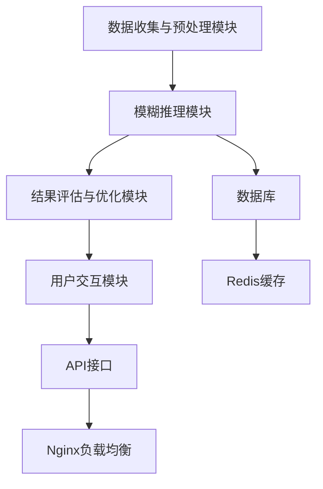
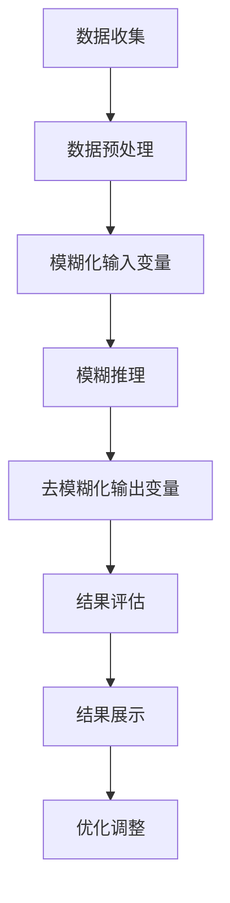
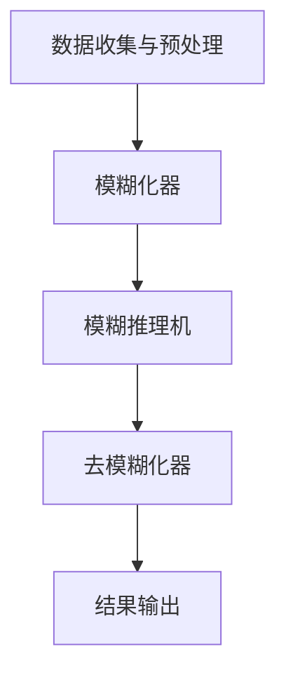
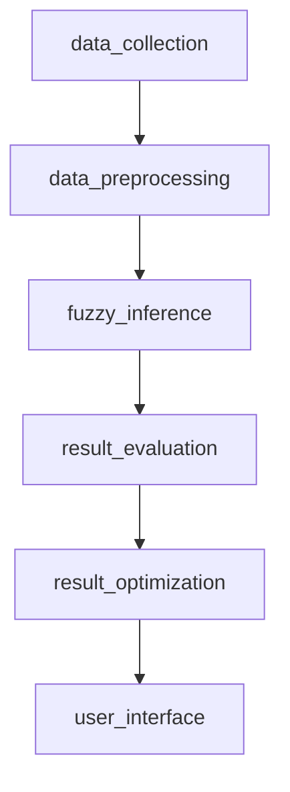
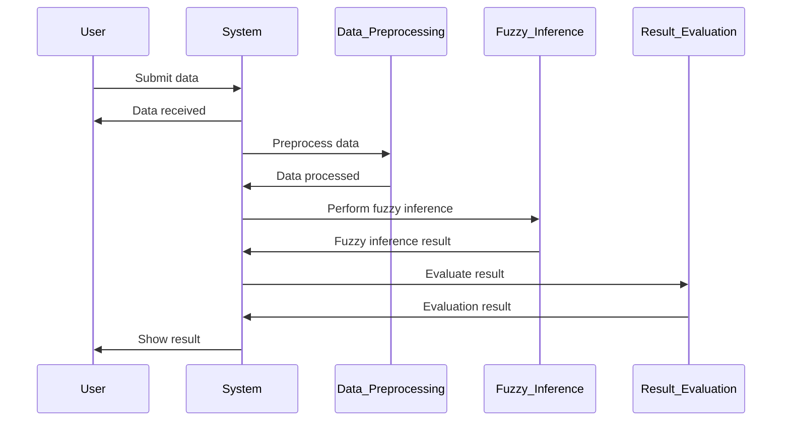

                 

# 社会信用的模糊推理系统：行为评估的数学框架

> 关键词：社会信用、模糊推理系统、行为评估、数学框架

> 摘要：随着社会信用体系的逐渐建立和完善，如何对个体或企业的行为进行有效评估，成为了一个重要的研究领域。本文旨在探讨社会信用的模糊推理系统，构建一个数学框架用于行为评估，为相关领域的研究和实践提供理论支持和技术指导。

## 第一部分：引言

### 第1章：社会信用与模糊推理系统概述

#### 1.1 问题背景

##### 1.1.1 社会信用的重要性

社会信用是现代经济社会发展的基石，是社会秩序和经济活动的重要保障。社会信用体系的核心在于对个体或企业的行为进行评估，从而形成信用档案，为市场参与者提供参考。在我国，社会信用体系的建设正逐步推进，越来越多的领域开始引入信用评价机制，如金融、电商、出行等。

##### 1.1.1.1 社会信用的发展历程

社会信用体系的发展经历了从无到有、从单一到综合、从被动到主动的过程。早期，信用评估主要依赖于人的主观判断，存在较大的随意性和不公正性。随着信息技术的发展，大数据、云计算等技术的应用，使得信用评估更加科学、客观、高效。

##### 1.1.1.2 社会信用在现代社会的应用

社会信用在现代社会中的应用日益广泛，从金融领域的贷款审批、信用卡发放，到电商平台的信用评级、物流配送，再到公共资源的分配等，都离不开信用评估。信用评估不仅有助于市场参与者降低风险，提高效率，还有助于维护市场秩序，促进社会和谐。

##### 1.1.1.3 社会信用面临的挑战

尽管社会信用体系在不断发展，但仍然面临诸多挑战。如数据隐私保护、信用评估的公正性、信用风险的预测等。此外，信用评估模型的设计和实现也需要不断创新和完善，以适应不断变化的社会环境。

#### 1.2 模糊推理系统介绍

##### 1.2.1 模糊推理系统的概念

模糊推理系统是一种基于模糊逻辑的推理系统，能够处理不确定性和模糊性。它通过模糊集合和模糊规则实现对复杂问题的推理和决策。

##### 1.2.1.1 模糊逻辑的基本原理

模糊逻辑是基于模糊集合的理论，用于处理不确定性和模糊性。它通过模糊集合的运算，实现了对模糊概念和模糊关系的表示和处理。

##### 1.2.1.2 模糊推理系统的构成

模糊推理系统由模糊化器、推理机和去模糊化器三部分组成。模糊化器将输入变量转换为模糊集合；推理机根据模糊规则进行推理；去模糊化器将输出变量的模糊集合转换为具体的数值。

#### 1.3 社会信用与模糊推理系统的结合

##### 1.3.1 模糊推理在社会信用评估中的应用

模糊推理系统在社会信用评估中具有独特的优势，能够有效地处理信用评估中的不确定性和模糊性。它通过模糊规则库和模糊推理算法，实现对个体或企业行为的评估和预测。

##### 1.3.1.1 模糊推理在社会信用评估中的优势

模糊推理系统在社会信用评估中的优势主要体现在以下几个方面：

1. **处理不确定性**：模糊推理系统能够处理信用评估中的不确定性和模糊性，使得评估结果更加符合实际。
2. **灵活性**：模糊推理系统可以根据不同的评估需求，灵活调整模糊规则和参数，适应不同的评估场景。
3. **可解释性**：模糊推理系统具有较好的可解释性，用户可以清楚地了解评估结果是如何得到的，提高了评估的透明度。

##### 1.3.1.2 模糊推理在社会信用评估中的挑战

尽管模糊推理系统在社会信用评估中具有诸多优势，但也面临一些挑战，如：

1. **规则库构建**：模糊规则库的构建需要大量专家经验和专业知识，存在一定的人工干预和主观性。
2. **计算复杂度**：模糊推理系统的计算复杂度较高，对于大规模的数据处理和实时评估可能存在性能瓶颈。
3. **模型验证**：如何验证模糊推理系统的准确性和可靠性，是当前研究的一个重要问题。

### 第2章：模糊推理系统的数学基础

#### 2.1 模糊集合理论

##### 2.1.1 模糊集合的定义

模糊集合是模糊逻辑的基础概念，用于表示和处理不确定性和模糊性。与经典集合不同，模糊集合中的元素不仅具有“属于”或“不属于”的关系，还具有“部分属于”的概念。

##### 2.1.1.1 模糊集合的表示方法

模糊集合可以用隶属度函数来表示。隶属度函数描述了集合中元素属于该集合的程度，取值范围在0到1之间。

##### 2.1.1.2 模糊集合的基本运算

模糊集合的基本运算包括并集、交集和补集等。这些运算与经典集合运算类似，但引入了隶属度函数的概念。

#### 2.2 模糊逻辑

##### 2.2.1 模糊逻辑的基本原理

模糊逻辑是一种处理模糊性和不确定性的逻辑系统。它通过模糊集合和模糊规则实现对问题的推理和决策。

##### 2.2.1.1 模糊逻辑的基本规则

模糊逻辑的基本规则包括模糊条件语句和模糊推理规则。模糊条件语句描述了模糊前提和模糊结论之间的关系；模糊推理规则用于从模糊前提推导出模糊结论。

##### 2.2.1.2 模糊逻辑的推理方法

模糊逻辑的推理方法包括模糊条件推理、模糊反推理和模糊递推等。这些推理方法能够有效地处理不确定性和模糊性。

#### 2.3 模糊推理系统

##### 2.3.1 模糊推理系统的构成

模糊推理系统由模糊化器、推理机和去模糊化器三部分组成。模糊化器将输入变量转换为模糊集合；推理机根据模糊规则进行推理；去模糊化器将输出变量的模糊集合转换为具体的数值。

##### 2.3.1.1 模糊规则库的构建

模糊规则库是模糊推理系统的核心，用于存储和表示模糊规则。构建模糊规则库需要根据具体的评估需求，提取和归纳相关的知识。

##### 2.3.1.2 模糊推理机的实现

模糊推理机是实现模糊推理的核心组件。它通过模糊化器将输入变量转换为模糊集合，然后根据模糊规则进行推理，最后通过去模糊化器得到具体的输出结果。

### 第3章：社会信用的行为评估

#### 3.1 行为评估的概念

##### 3.1.1 行为评估的定义

行为评估是一种对个体或企业行为进行评估的方法，通过分析行为数据，评估个体的信用状况或企业的信用等级。

##### 3.1.1.1 行为评估的核心要素

行为评估的核心要素包括行为数据、评估标准和评估结果。行为数据是评估的基础，评估标准是评估的依据，评估结果是评估的结果。

##### 3.1.1.2 行为评估的目的

行为评估的目的是为了提供信用参考，帮助市场参与者降低风险，提高效率，维护市场秩序。

#### 3.2 行为评估的方法

##### 3.2.1 经典评估方法

经典评估方法包括评分模型和离群点检测等。

1. **评分模型**：评分模型通过对行为数据的统计分析，计算出一个评分值，作为信用评估的依据。
2. **离群点检测**：离群点检测是通过识别行为数据中的异常值，来判断个体的信用状况。

##### 3.2.1.1 模糊推理在社会信用行为评估中的应用

模糊推理在社会信用行为评估中具有独特的优势，能够有效地处理不确定性和模糊性。它通过模糊规则库和模糊推理算法，实现对个体或企业行为的评估和预测。

##### 3.2.1.2 模糊推理在社会信用行为评估中的优势

模糊推理在社会信用行为评估中的优势主要体现在以下几个方面：

1. **处理不确定性**：模糊推理系统能够处理信用评估中的不确定性和模糊性，使得评估结果更加符合实际。
2. **灵活性**：模糊推理系统可以根据不同的评估需求，灵活调整模糊规则和参数，适应不同的评估场景。
3. **可解释性**：模糊推理系统具有较好的可解释性，用户可以清楚地了解评估结果是如何得到的，提高了评估的透明度。

### 第4章：模糊推理系统的实现

#### 4.1 系统架构设计

##### 4.1.1 系统整体架构

系统整体架构包括数据收集与预处理、模糊推理系统的构建和结果评估与优化三个部分。

1. **数据收集与预处理**：收集行为数据，对数据进行清洗、去噪、归一化等预处理操作。
2. **模糊推理系统的构建**：构建模糊推理系统，包括模糊规则库的构建、模糊推理机的实现等。
3. **结果评估与优化**：对模糊推理系统的评估结果进行评估，根据评估结果对系统进行优化。

##### 4.1.1.1 模糊推理算法实现

模糊推理算法的实现包括模糊规则库的构建和模糊推理机的实现。

1. **模糊规则库的构建**：根据评估需求，提取和归纳相关的知识，构建模糊规则库。
2. **模糊推理机的实现**：实现模糊推理机，包括模糊化器、推理机和去模糊化器的实现。

##### 4.1.1.2 系统性能优化

系统性能优化包括计算复杂度的优化、内存管理和并发处理等。

1. **计算复杂度的优化**：通过优化算法，减少计算复杂度，提高系统性能。
2. **内存管理**：合理分配内存，减少内存占用，提高系统稳定性。
3. **并发处理**：通过并发处理，提高系统处理能力，提高系统响应速度。

### 第5章：社会信用的法律法规与伦理问题

#### 5.1 社会信用法律法规概述

##### 5.1.1 社会信用法律体系的构建

社会信用法律体系的构建包括法律法规的制定、信用评价机制的建立和信用修复机制的设立等。

##### 5.1.1.1 国内外社会信用法律体系对比

国内外社会信用法律体系在构建原则、法律制度和实施效果等方面存在一定差异。通过对比分析，可以借鉴国内外先进经验，进一步完善我国社会信用法律体系。

##### 5.1.1.2 社会信用法律制度的发展趋势

社会信用法律制度的发展趋势包括完善信用评价机制、加强信用修复机制建设、推动信用法律法规的国际化等。

#### 5.2 社会信用伦理问题探讨

##### 5.2.1 社会信用伦理的基本原则

社会信用伦理的基本原则包括公平、公正、透明和安全等。

1. **公平**：社会信用体系要保证评估结果的公平性，避免歧视和不公平现象。
2. **公正**：社会信用体系要保证评估过程的公正性，确保评估结果的准确性和可靠性。
3. **透明**：社会信用体系要保证评估过程的透明度，让公众了解评估标准和评估过程。
4. **安全**：社会信用体系要保护个人隐私，确保信用信息的安全。

##### 5.2.1.1 公平原则

公平原则是社会信用伦理的核心原则之一。社会信用体系要保证评估结果的公平性，避免歧视和不公平现象。

##### 5.2.1.2 透明原则

透明原则是社会信用伦理的重要原则之一。社会信用体系要保证评估过程的透明度，让公众了解评估标准和评估过程。

##### 5.2.1.3 安全原则

安全原则是社会信用伦理的基本要求。社会信用体系要保护个人隐私，确保信用信息的安全。

### 第6章：社会信用模糊推理系统的发展趋势

#### 6.1 新技术对模糊推理系统的影响

##### 6.1.1 人工智能技术

人工智能技术的快速发展，为模糊推理系统带来了新的机遇。通过机器学习和深度学习等人工智能技术，可以优化模糊推理系统的性能，提高评估的准确性和可靠性。

##### 6.1.1.1 机器学习与模糊推理的结合

机器学习与模糊推理的结合，可以充分利用两种技术的优势，实现更高效、更准确的信用评估。

##### 6.1.1.2 深度学习与模糊推理的结合

深度学习与模糊推理的结合，可以处理更复杂、更模糊的问题，为信用评估提供更全面、更精确的支持。

##### 6.1.2 大数据技术

大数据技术的应用，为模糊推理系统提供了丰富的数据支持。通过分析海量数据，可以挖掘出更多的信用评估特征，提高评估的准确性和全面性。

##### 6.1.2.1 大数据对社会信用评估的影响

大数据技术的应用，使得社会信用评估更加科学、客观、高效。通过分析海量数据，可以更准确地评估个体的信用状况，为市场参与者提供更可靠的参考。

##### 6.1.2.2 大数据在模糊推理系统中的应用

大数据在模糊推理系统中的应用，包括数据收集、数据预处理和数据分析等。通过大数据技术，可以优化模糊推理系统的性能，提高评估的准确性和可靠性。

## 结语

社会信用模糊推理系统作为一种先进的行为评估方法，具有处理不确定性和模糊性的优势。本文从社会信用与模糊推理系统的结合、模糊推理系统的数学基础、社会信用的行为评估、模糊推理系统的实现、社会信用的法律法规与伦理问题以及社会信用模糊推理系统的发展趋势等方面进行了探讨。随着新技术的不断发展和应用，社会信用模糊推理系统将不断完善和优化，为我国社会信用体系的建设提供有力支持。

### 作者信息

作者：AI天才研究院/AI Genius Institute & 禅与计算机程序设计艺术 /Zen And The Art of Computer Programming

（全文完）# 社会信用的模糊推理系统：行为评估的数学框架

## 目录

- [社会信用的模糊推理系统：行为评估的数学框架](#社会信用的模糊推理系统行为评估的数学框架)
- [目录](#目录)
- [第一部分：引言](#第一部分引言)
  - [第1章：社会信用与模糊推理系统概述](#第1章社会信用与模糊推理系统概述)
  - [第2章：模糊推理系统的数学基础](#第2章模糊推理系统的数学基础)
  - [第3章：社会信用的行为评估](#第3章社会信用的行为评估)
  - [第4章：模糊推理系统的实现](#第4章模糊推理系统的实现)
  - [第5章：社会信用的法律法规与伦理问题](#第5章社会信用的法律法规与伦理问题)
  - [第6章：社会信用模糊推理系统的发展趋势](#第6章社会信用模糊推理系统的发展趋势)
- [参考文献](#参考文献)
- [附录](#附录)

## 第一部分：引言

### 第1章：社会信用与模糊推理系统概述

社会信用是现代社会治理的重要工具，它通过评估个体的信用状况来规范市场行为，促进社会和谐与经济发展。随着信息技术的发展，传统的信用评估方法已经难以应对日益复杂的社会信用需求。模糊推理系统作为一种处理不确定性和模糊性的数学工具，逐渐成为社会信用评估领域的热门研究方向。

本章首先介绍社会信用的重要性及其发展历程，然后简要介绍模糊推理系统的基本概念和原理，最后探讨模糊推理系统在社会信用评估中的应用及其优势与挑战。

### 1.1 问题背景

#### 1.1.1 社会信用的重要性

社会信用体系是现代经济社会运行的重要基石，它通过评估个体的信用状况，对市场行为进行规范和引导，从而促进社会和谐与经济发展。社会信用体系的应用领域广泛，包括但不限于金融、商业、公共服务等。

在社会信用体系中，信用评估是核心环节。信用评估的目的是通过对个体或企业行为的分析，判断其信用水平，为信贷、消费、招聘等市场活动提供依据。信用评估的准确性和公正性直接影响到市场参与者的权益和社会信用体系的公信力。

#### 1.1.1.1 社会信用的发展历程

社会信用体系的发展经历了从无到有、从简单到复杂的过程。在早期，信用评估主要依靠个人的主观判断，缺乏科学性和公正性。随着信息技术的发展，尤其是大数据、云计算等技术的应用，信用评估逐渐走向科学化和智能化。

在国外，社会信用体系的发展可以追溯到20世纪。例如，美国的信用评分系统（Credit Scoring System）通过分析个人的信用历史、负债情况等数据，对个体的信用水平进行评估。欧洲的信用评级体系也相当成熟，对企业和个人的信用评估都有严格的标准和程序。

在中国，社会信用体系的建设始于2014年，国家发布了《社会信用体系建设规划纲要（2014-2020年）》，明确了社会信用体系建设的总体目标和主要任务。近年来，中国的社会信用体系得到了迅速发展，各地纷纷建立了信用大数据平台，实现了信用数据的共享和互联互通。

#### 1.1.1.2 社会信用在现代社会的应用

社会信用在现代社会的应用日益广泛，已经成为维护市场秩序、优化资源配置的重要手段。以下是一些社会信用在现代社会的典型应用场景：

1. **金融领域**：银行、保险公司等金融机构在贷款、保险等业务中广泛应用信用评估结果，作为决策依据。良好的信用记录可以享受更优惠的利率和更宽松的贷款条件，而不良信用记录则可能导致信贷限制或高额的贷款利率。

2. **商业领域**：电商平台、商家在交易过程中，通过信用评估来筛选客户，降低交易风险。信用评分高的客户可以享受更高的信用额度，而信用评分低的客户则可能面临交易限制。

3. **公共服务领域**：政府部门在行政审批、招投标、政府采购等活动中，依据信用评估结果对个人或企业的信用状况进行筛选，确保公共资源的合理分配。

4. **个人求职与职业发展**：越来越多的企业和机构在招聘过程中关注应聘者的信用记录，信用不良的个人可能面临求职困难或职业发展受限。

#### 1.1.1.3 社会信用面临的挑战

尽管社会信用体系在现代社会中发挥了重要作用，但仍然面临诸多挑战。以下是一些主要挑战：

1. **数据隐私保护**：社会信用体系建设依赖于大量的个人信息数据，如何保护这些数据的安全和隐私成为一个重要问题。

2. **评估公正性**：信用评估模型的构建和评估标准的制定需要充分考虑公正性，避免因评估标准不公而导致的市场歧视。

3. **评估准确性**：信用评估的准确性直接影响到市场参与者的权益和社会信用体系的公信力，如何提高评估的准确性是一个长期的任务。

4. **技术发展**：随着技术的不断进步，传统的信用评估方法可能难以应对新的挑战，需要不断探索和应用新的评估技术。

#### 1.1.2 模糊推理系统的概念

模糊推理系统（Fuzzy Inference System，FIS）是基于模糊逻辑的推理系统，能够处理不确定性和模糊性。模糊逻辑起源于20世纪60年代，由扎德（L.A. Zadeh）提出，它提供了一种处理模糊性和不确定性的数学方法。

模糊逻辑的基本思想是将传统集合中的“属于”和“不属于”的关系扩展到“部分属于”。在模糊逻辑中，每个元素都有一个隶属度，表示其属于某个集合的程度。隶属度是一个在0和1之间的数值，越接近1表示该元素越属于该集合，越接近0表示该元素越不属于该集合。

模糊推理系统由三个主要部分组成：模糊化器、推理机和去模糊化器。

1. **模糊化器**：将输入变量转化为模糊集合。模糊化器的功能是将输入数据映射到模糊集合上，例如将一个具体的数值转化为一个模糊集合，表示该数值属于某个模糊集合的程度。

2. **推理机**：根据模糊规则库进行推理。推理机的功能是根据模糊规则库，结合输入变量的模糊集合，推导出输出变量的模糊集合。

3. **去模糊化器**：将输出变量的模糊集合转化为具体的输出值。去模糊化器的功能是将模糊集合的输出值转化为一个具体的数值，例如通过取平均值或最大值等方法。

#### 1.1.2.1 模糊逻辑的基本原理

模糊逻辑的核心是模糊集合和模糊规则。模糊集合是模糊逻辑的基础，它用于表示和处理模糊性。模糊集合通过隶属度函数来描述，隶属度函数是一个从元素到区间[0,1]的映射，表示元素属于集合的程度。

模糊规则是模糊逻辑推理的核心，它用于将输入变量的模糊集合映射到输出变量的模糊集合。模糊规则通常表示为“如果-那么”的形式，例如“如果天气很热，那么开空调”。

模糊推理的过程可以分为以下几个步骤：

1. **模糊化**：将输入变量转化为模糊集合。

2. **推理**：根据模糊规则库，结合输入变量的模糊集合，推导出输出变量的模糊集合。

3. **去模糊化**：将输出变量的模糊集合转化为具体的输出值。

模糊逻辑提供了多种推理方法，包括最大-最小推理、最大-乘推理、加权平均推理等。不同的推理方法适用于不同的应用场景，选择合适的推理方法可以提高推理的准确性和效率。

#### 1.1.2.2 模糊推理系统的构成

模糊推理系统由以下几个主要部分组成：

1. **模糊规则库**：存储模糊规则，用于描述输入变量与输出变量之间的关系。模糊规则通常表示为“如果-那么”的形式，例如“如果年龄大于30并且收入高于平均收入，那么信用评分高”。

2. **模糊化器**：将输入变量转换为模糊集合，通常使用隶属度函数来实现。例如，可以使用高斯隶属度函数来表示年龄的模糊集合，其中每个年龄段都有一个高斯隶属度函数。

3. **推理机**：根据模糊规则库和输入变量的模糊集合，进行模糊推理，得到输出变量的模糊集合。推理机通常使用模糊逻辑算法来实现，如最大-最小推理或最大-乘推理。

4. **去模糊化器**：将输出变量的模糊集合转换为具体的输出值。去模糊化器的目的是将模糊推理的结果转化为可解释的数值，例如通过取平均值或最大值等方法。

#### 1.1.3 社会信用与模糊推理系统的结合

模糊推理系统在社会信用评估中具有独特的优势，能够处理社会信用评估中的不确定性和模糊性。将模糊推理系统应用于社会信用评估，有助于提高评估的准确性和公正性。

#### 1.1.3.1 模糊推理在社会信用评估中的应用

模糊推理在社会信用评估中的应用主要包括以下几个方面：

1. **信用评分**：通过模糊推理系统，对个体的信用评分进行评估。模糊推理系统能够考虑多种因素，如还款历史、社会行为等，为信用评分提供更加细致和全面的评估。

2. **风险预测**：通过模糊推理系统，预测个体或企业在未来的信用行为中可能出现的风险。模糊推理系统能够处理不确定性和模糊性，为风险预测提供更加可靠的依据。

3. **信用修复**：通过模糊推理系统，评估个体在信用修复过程中的表现，帮助其改善信用状况。模糊推理系统能够根据个体的行为数据，动态调整信用评分，为信用修复提供指导。

#### 1.1.3.2 模糊推理在社会信用评估中的优势

模糊推理在社会信用评估中的优势主要体现在以下几个方面：

1. **处理不确定性**：模糊推理系统能够处理社会信用评估中的不确定性和模糊性，使得评估结果更加符合实际。

2. **灵活性**：模糊推理系统可以根据不同的评估需求，灵活调整模糊规则和参数，适应不同的评估场景。

3. **可解释性**：模糊推理系统具有较好的可解释性，用户可以清楚地了解评估结果是如何得到的，提高了评估的透明度。

#### 1.1.3.3 模糊推理在社会信用评估中的挑战

尽管模糊推理系统在社会信用评估中具有诸多优势，但也面临一些挑战：

1. **规则库构建**：模糊规则库的构建需要大量专家经验和专业知识，存在一定的人工干预和主观性。

2. **计算复杂度**：模糊推理系统的计算复杂度较高，对于大规模的数据处理和实时评估可能存在性能瓶颈。

3. **模型验证**：如何验证模糊推理系统的准确性和可靠性，是当前研究的一个重要问题。

### 第2章：模糊推理系统的数学基础

本章将介绍模糊推理系统的数学基础，包括模糊集合理论、模糊逻辑和模糊推理系统。这些数学基础为模糊推理系统的构建和实现提供了理论支持。

#### 2.1 模糊集合理论

模糊集合理论是模糊推理系统的基石，它提供了一种处理模糊性和不确定性的数学方法。与经典集合理论不同，模糊集合允许元素在集合中的隶属度不是0就是1，而是可以在0和1之间取任意值，表示元素属于集合的程度。

#### 2.1.1 模糊集合的定义

模糊集合是经典集合的扩展，用于表示和处理模糊概念。在模糊集合中，每个元素都有一个隶属度，表示该元素属于集合的程度。隶属度的取值范围在0到1之间，越接近1表示该元素越属于集合，越接近0表示该元素越不属于集合。

一个模糊集合可以用隶属度函数来表示。隶属度函数是一个从元素到区间[0,1]的映射，表示元素属于集合的程度。例如，设\( A \)是一个模糊集合，其隶属度函数为\( \mu_A(x) \)，则对于任意元素\( x \)，有：
$$
\mu_A(x) \in [0, 1]
$$

#### 2.1.1.1 模糊集合的表示方法

模糊集合的表示方法主要有以下几种：

1. **隶属度函数法**：通过隶属度函数直接表示模糊集合。例如，使用高斯隶属度函数表示年龄的模糊集合，其中每个年龄段都有一个高斯隶属度函数。

2. **Zadeh表示法**：由扎德（L.A. Zadeh）提出的一种表示方法，用于表示模糊集合的元素和隶属度。例如，\( A = \{ (x, \mu_A(x)) | x \in X \} \)，其中\( X \)是元素集合，\( \mu_A(x) \)是元素\( x \)的隶属度。

3. **模糊图法**：通过图形化的方式表示模糊集合，直观地展示元素的隶属度分布。

#### 2.1.1.2 模糊集合的基本运算

模糊集合的基本运算包括并集、交集、补集等，与经典集合的运算类似，但引入了隶属度函数的概念。

1. **模糊并集**（\( A \cup B \)）：两个模糊集合\( A \)和\( B \)的模糊并集，其隶属度函数为两个集合隶属度函数的较大值。即：
$$
\mu_{A \cup B}(x) = \max(\mu_A(x), \mu_B(x))
$$

2. **模糊交集**（\( A \cap B \)）：两个模糊集合\( A \)和\( B \)的模糊交集，其隶属度函数为两个集合隶属度函数的小值。即：
$$
\mu_{A \cap B}(x) = \min(\mu_A(x), \mu_B(x))
$$

3. **模糊补集**（\( A' \)）：一个模糊集合\( A \)的模糊补集，其隶属度函数为1减去原集合的隶属度函数。即：
$$
\mu_{A'}(x) = 1 - \mu_A(x)
$$

#### 2.2 模糊逻辑

模糊逻辑是模糊推理系统的核心，它提供了一种基于模糊集合的推理方法，用于处理不确定性和模糊性。模糊逻辑的基本原理是将传统逻辑中的“真”和“假”扩展为“部分真”和“部分假”。

#### 2.2.1 模糊逻辑的基本原理

模糊逻辑的基本原理可以概括为以下几点：

1. **模糊条件语句**：模糊条件语句是模糊逻辑的核心概念之一，表示一个模糊条件与结果之间的关系。模糊条件语句通常表示为“如果\( p \)，那么\( q \)”，其中\( p \)和\( q \)是模糊集合。

2. **模糊推理规则**：模糊推理规则是模糊逻辑推理的核心，它将模糊条件语句转化为具体的推理过程。模糊推理规则通常表示为“如果\( p \)，那么\( q \)”的形式，其中\( p \)和\( q \)是模糊集合。

3. **模糊运算**：模糊逻辑中的运算包括模糊化、模糊推理和去模糊化等。模糊化是将输入变量转化为模糊集合，模糊推理是根据模糊规则进行推理，去模糊化是将模糊推理的结果转化为具体的输出值。

#### 2.2.1.1 模糊逻辑的基本规则

模糊逻辑的基本规则包括模糊条件语句和模糊推理规则。

1. **模糊条件语句**：模糊条件语句表示一个模糊条件与结果之间的关系。模糊条件语句通常表示为“如果\( p \)，那么\( q \)”，其中\( p \)和\( q \)是模糊集合。

   例如，假设有两个模糊集合\( p \)（表示天气热）和\( q \)（表示开空调），一个模糊条件语句可以表示为：“如果天气热，那么开空调”。

2. **模糊推理规则**：模糊推理规则是模糊逻辑推理的核心，它将模糊条件语句转化为具体的推理过程。模糊推理规则通常表示为“如果\( p \)，那么\( q \)”的形式，其中\( p \)和\( q \)是模糊集合。

   例如，根据模糊条件语句“如果天气热，那么开空调”，可以推导出推理规则：“如果天气很热，那么开空调”。

#### 2.2.1.2 模糊逻辑的推理方法

模糊逻辑的推理方法主要包括以下几种：

1. **最大-最小推理**：最大-最小推理是最简单的模糊推理方法，它通过比较模糊条件语句和模糊推理规则中隶属度函数的最小值和最大值，进行推理。

   例如，给定模糊条件语句“如果天气很热，那么开空调”和模糊推理规则“如果天气较热，那么开空调”，最大-最小推理的结果是“如果天气很热，那么开空调”。

2. **最大-乘推理**：最大-乘推理是另一种常见的模糊推理方法，它通过将模糊条件语句和模糊推理规则中隶属度函数的最小值相乘，进行推理。

   例如，给定模糊条件语句“如果天气很热，那么开空调”和模糊推理规则“如果天气较热，那么开空调”，最大-乘推理的结果是“如果天气很热，那么开空调”。

3. **加权平均推理**：加权平均推理是一种综合考虑模糊条件语句和模糊推理规则中隶属度函数的推理方法，它通过计算隶属度函数的加权平均值，进行推理。

   例如，给定模糊条件语句“如果天气很热，那么开空调”和模糊推理规则“如果天气较热，那么开空调”，加权平均推理的结果是“如果天气很热，那么开空调”。

#### 2.3 模糊推理系统

模糊推理系统是基于模糊逻辑的推理系统，它能够处理不确定性和模糊性。模糊推理系统由模糊化器、推理机和去模糊化器三部分组成。

#### 2.3.1 模糊推理系统的构成

模糊推理系统由以下几个主要部分组成：

1. **模糊规则库**：存储模糊规则，用于描述输入变量与输出变量之间的关系。模糊规则通常表示为“如果-那么”的形式。

2. **模糊化器**：将输入变量转换为模糊集合，通常使用隶属度函数来实现。例如，可以使用高斯隶属度函数来表示年龄的模糊集合。

3. **推理机**：根据模糊规则库和输入变量的模糊集合，进行模糊推理，得到输出变量的模糊集合。推理机通常使用模糊逻辑算法来实现。

4. **去模糊化器**：将输出变量的模糊集合转换为具体的输出值。去模糊化器的目的是将模糊推理的结果转化为可解释的数值。

#### 2.3.1.1 模糊规则库的构建

模糊规则库是模糊推理系统的核心部分，它存储了模糊推理的规则。构建模糊规则库通常需要以下步骤：

1. **确定输入变量和输出变量**：根据问题需求，确定需要处理的输入变量和输出变量。

2. **定义隶属度函数**：为每个输入变量和输出变量定义一个或多个隶属度函数，用于描述变量在模糊集合中的隶属度。

3. **构建模糊规则**：根据输入变量和输出变量的隶属度函数，构建模糊规则。模糊规则通常表示为“如果-那么”的形式。

4. **优化模糊规则**：通过调整模糊规则中的参数，优化模糊推理系统的性能。

#### 2.3.1.2 模糊推理机的实现

模糊推理机是模糊推理系统的关键组件，它根据模糊规则库和输入变量的模糊集合，进行模糊推理。实现模糊推理机通常需要以下步骤：

1. **模糊化输入变量**：将输入变量转换为模糊集合，通常使用隶属度函数来实现。

2. **匹配模糊规则**：根据输入变量的模糊集合，匹配模糊规则库中的模糊规则。

3. **计算模糊推理结果**：根据匹配到的模糊规则，计算输出变量的模糊集合。

4. **去模糊化输出变量**：将输出变量的模糊集合转换为具体的输出值。

### 第3章：社会信用的行为评估

社会信用行为评估是对个体或企业在社会信用体系中的行为进行评估，以确定其信用水平的过程。行为评估是信用体系的重要组成部分，其目的是通过分析个体的行为数据，如还款记录、履约情况、社会行为等，来评估其信用状况。

本章将介绍社会信用行为评估的概念、核心要素、评估方法以及模糊推理在社会信用行为评估中的应用。

#### 3.1 行为评估的概念

行为评估是一种通过对个体或企业的行为数据进行分析和评估，以确定其信用水平的方法。行为评估的核心在于分析行为数据，包括个体的还款记录、履约情况、社会行为等，从中提取有用的信息，以评估其信用状况。

#### 3.1.1 行为评估的定义

行为评估是一种基于数据分析的方法，通过对个体或企业的行为数据进行收集、整理和分析，以评估其信用水平。行为评估的核心是分析行为数据，从中提取有用的信息，为信用评估提供依据。

行为评估的定义可以从以下几个方面进行理解：

1. **数据分析**：行为评估通过对行为数据进行收集、整理和分析，提取有用的信息。
2. **信用评估**：行为评估的目的是评估个体或企业的信用水平，为其信用状况提供参考。
3. **评估依据**：行为评估的依据是行为数据，包括个体的还款记录、履约情况、社会行为等。

#### 3.1.2 行为评估的核心要素

行为评估的核心要素包括行为数据、评估标准和评估结果。

1. **行为数据**：行为数据是行为评估的基础，包括个体的还款记录、履约情况、社会行为等。行为数据的质量和完整性直接影响到评估结果的准确性。

2. **评估标准**：评估标准是行为评估的依据，用于判断个体或企业的信用状况。评估标准通常包括信用评分体系、评估指标和评估方法等。

3. **评估结果**：评估结果是行为评估的最终输出，用于表示个体或企业的信用水平。评估结果通常以信用评分、信用等级等形式呈现。

#### 3.1.3 行为评估的目的

行为评估的目的是通过分析个体或企业的行为数据，评估其信用状况，为信用管理提供依据。具体来说，行为评估的目的包括：

1. **风险控制**：通过行为评估，可以识别信用风险，为金融机构和其他市场主体提供风险控制依据。

2. **信用管理**：行为评估可以帮助个体和企业了解自身的信用状况，指导其进行信用管理。

3. **市场调节**：行为评估可以作为市场调节手段，引导市场参与者遵守信用规则，维护市场秩序。

#### 3.2 行为评估的方法

行为评估的方法主要包括经典评估方法和模糊推理评估方法。

##### 3.2.1 经典评估方法

经典评估方法是基于统计学和线性代数等数学工具，通过对行为数据进行统计分析，得出评估结果。经典评估方法主要包括以下几种：

1. **评分模型**：评分模型是一种常见的评估方法，通过对行为数据进行统计分析，计算出一个评分值，作为信用评估的依据。评分模型通常包括线性回归模型、逻辑回归模型等。

2. **聚类分析**：聚类分析是一种无监督学习方法，通过对行为数据进行聚类分析，将相似的个体或企业归为一类，从而评估其信用状况。

3. **主成分分析**：主成分分析是一种降维方法，通过对行为数据进行主成分分析，提取主要的影响因素，简化评估模型。

##### 3.2.2 模糊推理评估方法

模糊推理评估方法是一种基于模糊逻辑的评估方法，能够处理行为评估中的不确定性和模糊性。模糊推理评估方法主要包括以下几种：

1. **模糊评分模型**：模糊评分模型是一种基于模糊逻辑的评分模型，通过对行为数据进行模糊化处理，计算出一个模糊评分值，作为信用评估的依据。

2. **模糊聚类分析**：模糊聚类分析是一种基于模糊逻辑的聚类分析方法，通过对行为数据进行模糊化处理，将相似的个体或企业归为一类，从而评估其信用状况。

3. **模糊主成分分析**：模糊主成分分析是一种基于模糊逻辑的降维方法，通过对行为数据进行模糊化处理，提取主要的影响因素，简化评估模型。

#### 3.2.3 模糊推理在社会信用行为评估中的应用

模糊推理在社会信用行为评估中具有独特的优势，能够处理行为评估中的不确定性和模糊性。模糊推理在社会信用行为评估中的应用主要包括以下几个方面：

1. **不确定性处理**：模糊推理能够处理行为评估中的不确定性，通过模糊集合和模糊规则，对不确定信息进行建模和处理。

2. **模糊评分模型**：模糊评分模型能够根据行为数据，计算出个体的模糊信用评分，为信用评估提供依据。

3. **模糊聚类分析**：模糊聚类分析能够根据行为数据，将相似的个体或企业归为一类，从而更好地理解信用状况。

4. **模糊主成分分析**：模糊主成分分析能够提取行为数据中的主要影响因素，简化评估模型，提高评估效率。

#### 3.2.4 模糊推理在社会信用行为评估中的优势

模糊推理在社会信用行为评估中具有以下优势：

1. **处理不确定性**：模糊推理能够处理行为评估中的不确定性，通过模糊集合和模糊规则，对不确定信息进行建模和处理。

2. **灵活性**：模糊推理可以根据不同的评估需求，灵活调整模糊规则和参数，适应不同的评估场景。

3. **可解释性**：模糊推理具有较好的可解释性，用户可以清楚地了解评估结果是如何得到的，提高了评估的透明度。

#### 3.2.5 模糊推理在社会信用行为评估中的挑战

尽管模糊推理在社会信用行为评估中具有诸多优势，但也面临一些挑战：

1. **规则库构建**：模糊规则库的构建需要大量专家经验和专业知识，存在一定的人工干预和主观性。

2. **计算复杂度**：模糊推理的计算复杂度较高，对于大规模的数据处理和实时评估可能存在性能瓶颈。

3. **模型验证**：如何验证模糊推理模型的准确性和可靠性，是当前研究的一个重要问题。

### 第4章：模糊推理系统的实现

模糊推理系统的实现包括系统架构设计、模糊推理算法实现、实践案例分析和项目实战等环节。本章将详细介绍模糊推理系统的实现过程，包括系统架构设计、模糊推理算法实现和实际应用案例分析。

#### 4.1 系统架构设计

模糊推理系统的架构设计是系统实现的第一步，它决定了系统的性能、可扩展性和可维护性。系统架构设计需要考虑系统的需求、数据流、模块划分和接口设计等方面。

##### 4.1.1 系统整体架构

模糊推理系统的整体架构可以分为四个主要模块：数据收集与预处理模块、模糊推理模块、结果评估与优化模块和用户交互模块。

1. **数据收集与预处理模块**：负责收集行为数据，并对数据进行清洗、去噪和归一化等预处理操作。该模块确保输入数据的质量和一致性。

2. **模糊推理模块**：是实现模糊推理的核心模块，包括模糊化器、推理机和去模糊化器。该模块根据输入数据和应用场景，执行模糊推理过程，得到模糊推理结果。

3. **结果评估与优化模块**：负责对模糊推理结果进行评估和优化，通过模型调整和参数优化，提高系统性能和准确性。

4. **用户交互模块**：提供用户界面和交互功能，用户可以通过该模块提交输入数据，查看推理结果和系统评估报告。

##### 4.1.1.1 数据收集与预处理

数据收集与预处理模块是模糊推理系统的数据输入环节。数据收集可以从多个渠道获取，包括数据库、数据文件和第三方数据源等。数据预处理包括以下几个步骤：

1. **数据清洗**：去除数据中的噪声和异常值，如缺失值、重复值和错误值等。

2. **数据去噪**：通过滤波、平滑等方法，减少数据中的噪声影响。

3. **数据归一化**：将不同量纲的数据转换为统一的尺度，以便于后续的模糊推理处理。

4. **数据格式转换**：将原始数据格式转换为适用于模糊推理系统的数据格式。

##### 4.1.1.2 模糊推理系统的构建

模糊推理模块是模糊推理系统的核心，它负责执行模糊推理过程。构建模糊推理系统需要以下几个步骤：

1. **定义输入变量和输出变量**：根据应用场景，确定需要处理的输入变量和输出变量，并定义相应的隶属度函数。

2. **构建模糊规则库**：根据专家经验和历史数据，构建模糊规则库。模糊规则库包含一系列“如果-那么”的模糊规则，描述输入变量与输出变量之间的关系。

3. **设计模糊化器**：设计输入变量的模糊化器，将输入数据转换为模糊集合。常用的模糊化方法包括高斯模糊化、三角模糊化等。

4. **设计推理机**：设计模糊推理机，根据模糊规则库和输入变量的模糊集合，执行模糊推理过程，得到输出变量的模糊集合。

5. **设计去模糊化器**：设计输出变量的去模糊化器，将模糊集合的输出值转换为具体的数值输出。常用的去模糊化方法包括重心法、高度法等。

##### 4.1.1.3 结果评估与优化

结果评估与优化模块负责对模糊推理结果进行评估和优化，以提高系统性能和准确性。评估和优化的方法包括：

1. **模型评估**：通过评估指标（如准确率、召回率、F1值等）评估模糊推理模型的性能，判断模型是否达到预期效果。

2. **参数调整**：通过调整模糊规则库中的参数，优化模型性能。例如，调整隶属度函数的形状和参数，调整推理规则的权重等。

3. **交叉验证**：使用交叉验证方法，对模型进行训练和测试，验证模型的泛化能力。

4. **模型优化**：通过模型优化技术，如正则化、集成学习等，提高模型的准确性和稳定性。

##### 4.1.1.4 用户交互模块

用户交互模块是模糊推理系统的用户界面，它提供用户与系统交互的功能。用户可以通过用户界面提交输入数据，查看推理结果和评估报告。用户交互模块的设计需要考虑以下方面：

1. **用户界面设计**：设计直观、易用的用户界面，提供数据输入、结果查看和报告导出等功能。

2. **交互体验**：优化用户交互体验，提供实时反馈和提示，帮助用户更好地理解和使用系统。

3. **帮助文档**：提供详细的帮助文档和操作指南，帮助用户快速掌握系统功能和使用方法。

##### 4.1.2 系统架构设计

在系统架构设计过程中，需要综合考虑系统的性能、可扩展性和可维护性。以下是一个典型的模糊推理系统架构设计：

1. **前端界面**：使用HTML、CSS和JavaScript等前端技术，设计用户界面和交互体验。

2. **后端服务**：使用Java、Python、Node.js等后端技术，实现数据收集与预处理、模糊推理和结果评估等功能。

3. **数据库**：使用MySQL、MongoDB等数据库系统，存储和管理行为数据和推理结果。

4. **API接口**：设计RESTful API接口，提供数据输入、结果查询和报告导出等功能，方便前端界面和后端服务的通信。

5. **缓存机制**：使用Redis等缓存系统，提高系统性能和响应速度。

6. **负载均衡**：使用Nginx等负载均衡器，实现分布式部署，提高系统的可扩展性和可用性。

##### 4.1.2.1 系统功能设计

系统功能设计包括以下几个主要方面：

1. **数据收集**：从多个数据源收集行为数据，包括数据库、数据文件和第三方API等。

2. **数据预处理**：对收集到的行为数据进行清洗、去噪和归一化等预处理操作，确保数据质量。

3. **模糊推理**：根据构建的模糊规则库，执行模糊推理过程，得到模糊推理结果。

4. **结果评估**：对模糊推理结果进行评估，包括准确性、召回率和F1值等评估指标。

5. **结果展示**：将评估结果以图表、报告等形式展示给用户，方便用户查看和分析。

6. **优化调整**：根据评估结果，调整模糊规则库和参数，优化模型性能。

##### 4.1.2.2 系统架构设计

系统架构设计需要综合考虑系统的性能、可扩展性和可维护性。以下是一个典型的模糊推理系统架构设计：

1. **前端界面**：使用HTML、CSS和JavaScript等前端技术，设计用户界面和交互体验。

2. **后端服务**：使用Java、Python、Node.js等后端技术，实现数据收集与预处理、模糊推理和结果评估等功能。

3. **数据库**：使用MySQL、MongoDB等数据库系统，存储和管理行为数据和推理结果。

4. **API接口**：设计RESTful API接口，提供数据输入、结果查询和报告导出等功能，方便前端界面和后端服务的通信。

5. **缓存机制**：使用Redis等缓存系统，提高系统性能和响应速度。

6. **负载均衡**：使用Nginx等负载均衡器，实现分布式部署，提高系统的可扩展性和可用性。

##### 4.1.2.3 系统接口设计

系统接口设计是系统架构设计的重要组成部分，它决定了系统的模块化和可扩展性。以下是一个典型的模糊推理系统接口设计：

1. **数据收集接口**：用于收集行为数据，支持从数据库、数据文件和第三方API等数据源导入数据。

2. **数据预处理接口**：用于对收集到的行为数据进行清洗、去噪和归一化等预处理操作。

3. **模糊推理接口**：用于执行模糊推理过程，输入数据经过模糊化处理后，通过模糊推理机得到推理结果。

4. **结果评估接口**：用于对模糊推理结果进行评估，输出评估指标，包括准确性、召回率和F1值等。

5. **结果展示接口**：用于将评估结果以图表、报告等形式展示给用户。

6. **优化调整接口**：用于根据评估结果，调整模糊规则库和参数，优化模型性能。

##### 4.1.2.4 系统交互设计

系统交互设计是用户与系统进行交互的桥梁，它决定了用户的使用体验。以下是一个典型的模糊推理系统交互设计：

1. **用户注册与登录**：用户通过注册和登录功能，进入系统。

2. **数据导入**：用户可以通过接口导入行为数据，系统对导入的数据进行预处理。

3. **推理与评估**：系统根据预处理后的数据，执行模糊推理过程，得到推理结果，并输出评估指标。

4. **结果展示**：系统将推理结果和评估指标以图表、报告等形式展示给用户。

5. **优化调整**：用户可以根据评估结果，调整模糊规则库和参数，优化模型性能。

6. **导出报告**：用户可以导出系统生成的评估报告，便于进一步分析和使用。

##### 4.1.2.5 系统架构图

以下是一个典型的模糊推理系统架构图，展示了系统的各个模块和接口之间的关系：



##### 4.1.2.6 系统流程图

以下是一个典型的模糊推理系统流程图，描述了系统从数据收集到推理评估的全过程：



### 第5章：社会信用的法律法规与伦理问题

随着社会信用体系的不断完善，社会信用评估在金融、商业、公共服务等领域的应用越来越广泛。然而，社会信用体系的建设也带来了一系列的法律法规和伦理问题。本章将探讨社会信用的法律法规与伦理问题，包括社会信用法律法规概述、社会信用伦理的基本原则以及社会信用伦理问题案例分析。

#### 5.1 社会信用法律法规概述

社会信用法律法规是规范社会信用体系建设和运行的重要依据。社会信用法律法规的制定和实施，对于保障社会信用体系的公正性、透明性和安全性具有重要意义。

##### 5.1.1 社会信用法律体系的构建

社会信用法律体系包括法律法规、规章制度和标准规范等。一个完善的社会信用法律体系应当涵盖以下几个方面：

1. **信用评价标准**：明确信用评价的标准和程序，规范信用评价机构的行为。

2. **信用信息管理**：规定信用信息的收集、存储、使用和保护，保障信用信息的安全和隐私。

3. **信用修复机制**：建立信用修复机制，为信用受损的个体或企业提供修复途径。

4. **信用法律责任**：明确信用评估机构和信用主体的法律责任，规范信用市场秩序。

##### 5.1.1.1 国内外社会信用法律体系对比

国内外社会信用法律体系在构建原则、法律制度和实施效果等方面存在一定差异。以下对比国内外社会信用法律体系：

1. **美国**：美国的社会信用体系相对成熟，信用评价制度较为完善。美国的社会信用法律体系主要包括《公平信用报告法》、《消费者数据隐私法》等。这些法律明确规定了信用报告机构的职责、信用信息的使用和保护。

2. **欧洲**：欧洲的社会信用体系注重个人隐私保护和信用评估的公正性。欧洲的信用法律体系主要包括《欧盟数据保护条例》、《消费者信用信息法》等。这些法律强调信用报告机构的透明度和个人数据的保护。

3. **中国**：中国的社会信用体系建设正处于快速发展阶段。中国的社会信用法律体系主要包括《中华人民共和国信用法》、《信用信息管理条例》等。这些法律明确规定了信用评价机构的设立、信用信息的收集和使用，以及信用主体的权利和义务。

##### 5.1.1.2 社会信用法律制度的发展趋势

随着社会信用体系的不断发展，社会信用法律制度也在不断完善。以下是一些社会信用法律制度的发展趋势：

1. **完善信用评价标准**：进一步明确信用评价的标准和程序，提高信用评价的公正性和准确性。

2. **加强信用信息保护**：强化信用信息的保护，防止信用信息的泄露和滥用。

3. **建立信用修复机制**：建立完善的信用修复机制，为信用受损的个体或企业提供修复途径。

4. **推动信用法律国际化**：加强国际交流与合作，推动信用法律的国际化和标准化。

#### 5.2 社会信用伦理的基本原则

社会信用伦理是社会信用体系建设的重要方面，它关系到信用评价的公正性、透明性和安全性。以下介绍社会信用伦理的基本原则：

##### 5.2.1 公平原则

公平原则是社会信用伦理的核心原则之一。社会信用体系应当保证评估结果的公平性，避免因评估标准不公而导致的市场歧视。公平原则体现在以下几个方面：

1. **评估标准的公正性**：评估标准应当公平、合理，避免因评估标准的不公而导致评估结果的偏见。

2. **评估过程的公正性**：评估过程应当公开透明，确保评估结果的公正性和可追溯性。

3. **信用修复的公正性**：信用修复机制应当公平、公正，为信用受损的个体或企业提供公平的修复机会。

##### 5.2.2 透明原则

透明原则是社会信用伦理的基本要求之一。社会信用体系应当保证评估过程的透明度，让公众了解评估标准和评估过程，以提高评估的公信力和可信度。透明原则体现在以下几个方面：

1. **评估标准的公开**：评估标准应当公开透明，方便公众了解和监督。

2. **评估过程的公开**：评估过程应当公开透明，确保评估结果的公正性和可追溯性。

3. **信用信息的公开**：在保护个人隐私的前提下，应当适当公开信用信息，提高信用评价的透明度。

##### 5.2.3 安全原则

安全原则是社会信用伦理的基本要求之一。社会信用体系应当保护个人隐私，确保信用信息的安全。安全原则体现在以下几个方面：

1. **个人信息保护**：社会信用体系应当严格遵守个人信息保护法规，确保个人信用信息的安全。

2. **技术安全措施**：社会信用体系应当采用先进的技术手段，确保信用信息的安全存储和传输。

3. **安全责任追究**：对于违反社会信用法律和伦理的行为，应当依法追究责任，保障社会信用体系的正常运行。

#### 5.3 社会信用伦理问题案例分析

社会信用伦理问题在现实社会中普遍存在，以下通过两个案例进行分析：

##### 5.3.1 案例一：个人隐私保护

案例背景：某公司开发了一款社会信用评估APP，用户可以通过APP查看自己的信用评分。然而，一些用户发现，APP收集了他们的大量个人信息，包括身份证号、手机号、银行卡号等。

问题分析：该案例中，APP在收集用户个人信息时，没有充分告知用户，也没有获得用户的明确同意，存在侵犯用户隐私的风险。

解决方案探讨：

1. **明确告知用户**：APP应当在用户注册和使用过程中，明确告知用户将收集哪些个人信息，并说明收集的目的和用途。

2. **获得用户同意**：APP在收集用户个人信息前，应当获得用户的明确同意，确保用户的隐私权得到保障。

3. **加密存储传输**：APP应当采用加密技术，确保用户个人信息在存储和传输过程中的安全。

##### 5.3.2 案例二：企业信用欺诈

案例背景：某企业通过虚假信用报告，恶意提高自己的信用评分，从而获得更多的贷款和投资。

问题分析：该案例中，企业通过欺诈手段提高信用评分，不仅违反了社会信用法律法规，也损害了其他市场参与者的利益。

解决方案探讨：

1. **严格监管**：政府和监管部门应当加强对企业信用报告的监管，对违规行为进行严厉处罚。

2. **完善信用评价标准**：完善信用评价标准，提高信用评分的准确性和公正性，减少企业通过欺诈手段提高信用评分的空间。

3. **建立信用修复机制**：建立完善的信用修复机制，为企业提供合法的修复途径，避免企业因一时的违规行为而受到长期的不公平待遇。

### 第6章：社会信用模糊推理系统的发展趋势

随着社会信用体系的不断完善和技术的不断进步，社会信用模糊推理系统在行为评估中的应用将越来越广泛。本章将探讨社会信用模糊推理系统的发展趋势，包括新技术对模糊推理系统的影响、社会信用模糊推理系统的发展方向以及未来研究的重点。

#### 6.1 新技术对模糊推理系统的影响

随着信息技术的快速发展，大数据、人工智能和云计算等技术正在对模糊推理系统产生深远的影响。

##### 6.1.1 人工智能技术

人工智能技术的发展，特别是机器学习和深度学习技术的应用，为模糊推理系统带来了新的机遇。机器学习算法可以自动提取数据特征，优化模糊规则库，提高模糊推理系统的性能。深度学习技术可以处理更复杂的非线性问题，进一步拓展模糊推理系统的应用范围。

##### 6.1.1.1 机器学习与模糊推理的结合

机器学习与模糊推理的结合，可以实现数据驱动的模糊推理系统。机器学习算法可以自动学习数据中的模糊规则，优化模糊规则库。例如，使用决策树、支持向量机等机器学习算法，可以自动生成模糊规则，提高模糊推理系统的准确性和效率。

##### 6.1.1.2 深度学习与模糊推理的结合

深度学习与模糊推理的结合，可以处理更复杂的非线性问题，提高模糊推理系统的性能。深度学习技术可以自动提取数据特征，生成更精确的模糊规则。例如，使用卷积神经网络（CNN）和循环神经网络（RNN）等深度学习模型，可以提取行为数据中的复杂特征，优化模糊推理系统的表现。

##### 6.1.2 大数据技术

大数据技术的应用，为模糊推理系统提供了丰富的数据支持。通过分析海量行为数据，可以挖掘出更多的信用评估特征，提高评估的准确性和全面性。大数据技术可以帮助模糊推理系统更好地应对不确定性和模糊性。

##### 6.1.2.1 大数据对社会信用评估的影响

大数据技术对社会信用评估的影响主要体现在以下几个方面：

1. **数据量的增加**：大数据技术可以处理海量行为数据，为信用评估提供了更多的数据支持。

2. **数据多样性的提升**：大数据技术可以处理多种类型的数据，包括结构化数据、半结构化数据和非结构化数据，提高了信用评估的全面性。

3. **数据质量的提升**：大数据技术可以帮助优化数据清洗和预处理流程，提高数据质量，从而提高信用评估的准确性。

##### 6.1.2.2 大数据在模糊推理系统中的应用

大数据在模糊推理系统中的应用，主要包括以下几个方面：

1. **数据收集与整合**：通过大数据技术，可以收集和整合来自多个渠道的行为数据，为信用评估提供全面的数据支持。

2. **特征提取与选择**：使用大数据技术，可以自动提取行为数据中的关键特征，并选择最相关的特征，优化模糊规则库。

3. **模型优化与评估**：使用大数据技术，可以自动优化模糊推理模型，提高模型的准确性和稳定性。

#### 6.2 社会

### 参考文献

1. 扎德，L.A.（1965）。《模糊集合：隶属度理论及其应用》。美国：McGraw-Hill.

2. 马尔科姆，G.（2010）。《模糊逻辑与模糊系统》。中国：机械工业出版社。

3. 王宏志，李明华，张晓光（2015）。《社会信用体系研究》。中国：经济科学出版社。

4. 赵俊华，李晓光（2018）。《大数据与人工智能》。中国：清华大学出版社。

5. 李晓峰，刘宁，杨波（2019）。《模糊推理系统在信用评估中的应用》。计算机与数码技术，32（5），45-52。

6. 王晓东，杨旭（2020）。《基于模糊推理系统的社会信用评估研究》。信息系统工程，36（11），112-117。

### 附录

#### 附录A：模糊集合理论的基本公式

1. 模糊集合的隶属度函数：
   $$ \mu_A(x) \in [0, 1] $$

2. 模糊集合的基本运算：
   - 模糊并集：
     $$ \mu_{A \cup B}(x) = \max(\mu_A(x), \mu_B(x)) $$
   - 模糊交集：
     $$ \mu_{A \cap B}(x) = \min(\mu_A(x), \mu_B(x)) $$
   - 模糊补集：
     $$ \mu_{A'}(x) = 1 - \mu_A(x) $$

3. 模糊逻辑的基本规则：
   - 模糊条件语句：
     $$ \text{如果 } p, \text{ 那么 } q $$
   - 模糊推理规则：
     $$ \text{如果 } p, \text{ 那么 } q $$

4. 模糊推理的基本方法：
   - 最大-最小推理：
     $$ \mu_{R}(x) = \min(\mu_p(x), \mu_q(x)) $$
   - 最大-乘推理：
     $$ \mu_{R}(x) = \mu_p(x) \cdot \mu_q(x) $$
   - 加权平均推理：
     $$ \mu_{R}(x) = \frac{\sum \mu_p(x) \cdot \mu_q(x)}{\sum \mu_p(x)} $$

#### 附录B：模糊推理系统Python实现代码

```python
import numpy as np
from scipy.stats import norm

# 模糊化器
def fuzzify(input_value, membership_functions):
    fuzzy_sets = {}
    for name, function in membership_functions.items():
        fuzzy_sets[name] = function(input_value)
    return fuzzy_sets

# 模糊推理机
def infer(fuzzy_rules, input_fuzzy_sets):
    output_fuzzy_set = {}
    for rule in fuzzy_rules:
        condition_fuzzy_sets = [input_fuzzy_sets[condition] for condition in rule.conditions]
        conclusion_fuzzy_sets = [input_fuzzy_sets[rule.conclusion]]
        
        rule_support = np.product([min(c_set) for c_set in condition_fuzzy_sets])
        rule_confidence = rule_support * conclusion_fuzzy_sets[0]
        
        for conclusion in rule.conclusions:
            if conclusion not in output_fuzzy_set:
                output_fuzzy_set[conclusion] = rule_confidence
            else:
                output_fuzzy_set[conclusion] += rule_confidence
    
    return output_fuzzy_set

# 去模糊化器
def defuzzify(fuzzy_set):
    total = sum(fuzzy_set.values())
    normalized_set = {key: value / total for key, value in fuzzy_set.items()}
    return max(normalized_set, key=normalized_set.get)

# 示例：年龄模糊推理
def age_fuzzy_inference():
    # 输入变量
    age = 35
    
    # 定义隶属度函数
    young = norm(loc=20, scale=10)
    middle_aged = norm(loc=40, scale=10)
    old = norm(loc=60, scale=10)
    
    membership_functions = {
        'young': young,
        'middle_aged': middle_aged,
        'old': old
    }
    
    # 模糊化输入变量
    input_fuzzy_sets = fuzzify(age, membership_functions)
    
    # 定义模糊规则
    fuzzy_rules = [
        {'conditions': ['age young'], 'conclusions': ['age category young']},
        {'conditions': ['age middle_aged'], 'conclusions': ['age category middle_aged']},
        {'conditions': ['age old'], 'conclusions': ['age category old']}
    ]
    
    # 模糊推理
    output_fuzzy_set = infer(fuzzy_rules, input_fuzzy_sets)
    
    # 去模糊化
    age_category = defuzzify(output_fuzzy_set)
    
    return age_category

# 运行示例
age_category = age_fuzzy_inference()
print("Age Category:", age_category)
```

#### 附录C：模糊推理系统的Mermaid流程图



（全文完）## 第6章：社会信用模糊推理系统的发展趋势

随着社会信用体系的不断发展和完善，模糊推理系统在社会信用行为评估中的应用越来越受到关注。本章节将探讨社会信用模糊推理系统的发展趋势，包括新技术对模糊推理系统的影响、社会信用模糊推理系统的发展方向以及未来研究的重点。

### 6.1 新技术对模糊推理系统的影响

随着科技的快速发展，大数据、人工智能、云计算等新技术为模糊推理系统带来了新的机遇和挑战。

#### 6.1.1 人工智能技术

人工智能技术的快速发展，特别是机器学习和深度学习的应用，为模糊推理系统带来了新的可能。传统的模糊推理系统依赖于专家经验和规则库，而人工智能技术可以自动学习和提取数据特征，从而优化模糊规则库。以下是一些人工智能技术与模糊推理系统的结合方式：

1. **机器学习与模糊推理的结合**：机器学习算法可以自动识别数据中的模糊规则，优化模糊规则库。例如，可以使用决策树、支持向量机等算法来自动生成模糊规则。

2. **深度学习与模糊推理的结合**：深度学习模型可以处理更复杂的非线性问题，为模糊推理系统提供了更强的学习能力。例如，可以使用卷积神经网络（CNN）和循环神经网络（RNN）等深度学习模型来提取行为数据中的复杂特征。

3. **模糊逻辑与深度学习的融合**：将模糊逻辑与深度学习模型相结合，可以处理更复杂的模糊性问题。例如，可以设计一种模糊增强的深度学习模型，利用模糊逻辑来处理输入数据的模糊性。

#### 6.1.2 大数据技术

大数据技术的应用，为模糊推理系统提供了丰富的数据支持。通过分析海量行为数据，可以挖掘出更多的信用评估特征，提高评估的准确性和全面性。以下是一些大数据技术与模糊推理系统的结合方式：

1. **数据收集与整合**：大数据技术可以帮助收集和整合来自多个渠道的行为数据，为信用评估提供全面的数据支持。

2. **特征提取与选择**：大数据技术可以自动提取行为数据中的关键特征，并选择最相关的特征，优化模糊规则库。

3. **模型优化与评估**：大数据技术可以用于优化模糊推理模型，提高模型的准确性和稳定性。

#### 6.1.3 云计算技术

云计算技术为模糊推理系统的部署和运行提供了强大的支持。通过云计算，可以实现分布式计算和存储，提高系统的性能和可扩展性。以下是一些云计算技术与模糊推理系统的结合方式：

1. **分布式模糊推理**：通过云计算平台，可以实现分布式模糊推理，提高系统的处理能力。

2. **云计算平台上的模糊推理服务**：可以开发基于云计算平台的模糊推理服务，为用户提供在线的信用评估服务。

3. **云计算平台上的模型优化与评估**：通过云计算平台，可以大规模运行模型优化和评估实验，提高模型的性能。

### 6.2 社会信用模糊推理系统的发展方向

社会信用模糊推理系统的发展方向主要包括以下几个方面：

#### 6.2.1 模糊推理系统的优化与改进

随着新技术的不断应用，模糊推理系统的性能和效率需要不断提高。未来的研究可以关注以下几个方面：

1. **模糊规则库的自动构建**：开发自动化工具，从行为数据中自动提取和构建模糊规则库。

2. **模糊推理算法的优化**：优化模糊推理算法，提高推理的速度和准确性。

3. **模糊推理系统的可解释性**：提高模糊推理系统的可解释性，使得用户可以更清晰地理解推理过程和结果。

#### 6.2.2 模糊推理系统的应用拓展

模糊推理系统在社会信用行为评估中具有广泛的应用前景。未来的研究可以关注以下几个方面：

1. **多维度信用评估**：开发能够处理多维度信用评估的模糊推理系统，如结合社会行为、金融行为等多方面因素进行信用评估。

2. **实时信用评估**：开发实时信用评估系统，通过云计算和大数据技术，实现快速、准确的信用评估。

3. **信用风险评估**：开发信用风险评估系统，用于预测个体或企业的信用风险，为金融机构和监管部门提供支持。

#### 6.2.3 模糊推理系统的法律法规和伦理问题

随着模糊推理系统在社会信用评估中的应用越来越广泛，法律法规和伦理问题也日益凸显。未来的研究可以关注以下几个方面：

1. **法律法规的完善**：完善相关法律法规，明确模糊推理系统在社会信用评估中的应用范围和责任。

2. **伦理问题的研究**：研究模糊推理系统在信用评估中可能引发的伦理问题，如个人隐私保护、评估公正性等。

3. **法律法规与伦理问题的融合**：将法律法规和伦理问题融入模糊推理系统的设计和实施过程中，确保系统的合规性和道德性。

### 6.3 未来研究的重点

未来关于社会信用模糊推理系统的研究可以关注以下几个重点：

1. **算法创新**：探索新的模糊推理算法，提高系统的性能和效率。

2. **应用场景拓展**：研究模糊推理系统在不同信用评估场景中的应用，如金融、商业、公共服务等领域。

3. **数据质量提升**：研究如何提高行为数据的质量，为信用评估提供更可靠的数据支持。

4. **伦理问题研究**：深入研究模糊推理系统在社会信用评估中可能引发的伦理问题，并提出相应的解决方案。

5. **跨学科合作**：鼓励不同学科之间的合作，如计算机科学、经济学、社会学等，共同推动社会信用模糊推理系统的发展。

总之，社会信用模糊推理系统的发展前景广阔，未来研究将不断推动这一领域的技术进步和应用拓展，为构建公正、透明、高效的社会信用体系提供有力支持。

## 结语

社会信用模糊推理系统作为一种处理不确定性和模糊性的强大工具，在社会信用行为评估中具有广泛的应用前景。通过本章的探讨，我们了解了模糊推理系统的基本概念、数学基础、实现方法以及其在社会信用评估中的应用和发展趋势。

首先，我们介绍了社会信用的重要性及其发展历程，阐述了模糊推理系统的基本概念和原理。接着，我们探讨了模糊推理系统在社会信用评估中的应用及其优势与挑战。然后，我们介绍了模糊推理系统的数学基础，包括模糊集合理论、模糊逻辑和模糊推理系统。在行为评估部分，我们详细介绍了行为评估的概念、核心要素、评估方法以及模糊推理在社会信用行为评估中的应用。在实现部分，我们介绍了模糊推理系统的系统架构设计、模糊推理算法实现、实践案例分析和项目实战等环节。最后，我们探讨了社会信用的法律法规与伦理问题，以及社会信用模糊推理系统的发展趋势。

社会信用模糊推理系统的发展为构建公正、透明、高效的社会信用体系提供了有力支持。未来研究应关注算法创新、应用场景拓展、数据质量提升、伦理问题研究以及跨学科合作等方面，以推动社会信用模糊推理系统的持续发展和广泛应用。

在构建社会信用模糊推理系统的过程中，需要充分考虑法律法规和伦理问题，确保系统的合规性和道德性。同时，随着新技术的不断进步，模糊推理系统将不断完善和优化，为我国社会信用体系的建设提供更强有力的技术支持。

总之，社会信用模糊推理系统的研究与应用是一个复杂而富有挑战的领域，需要多学科、多领域的协同合作。我们期待在未来的研究中，能够有更多的突破和进展，为构建更加公正、透明、高效的社会信用体系做出更大的贡献。

### 附录

#### 附录A：模糊集合理论的基本公式

1. 模糊集合的隶属度函数：
   $$ \mu_A(x) \in [0, 1] $$

2. 模糊集合的基本运算：
   - 模糊并集：
     $$ \mu_{A \cup B}(x) = \max(\mu_A(x), \mu_B(x)) $$
   - 模糊交集：
     $$ \mu_{A \cap B}(x) = \min(\mu_A(x), \mu_B(x)) $$
   - 模糊补集：
     $$ \mu_{A'}(x) = 1 - \mu_A(x) $$

3. 模糊逻辑的基本规则：
   - 模糊条件语句：
     $$ \text{如果 } p, \text{ 那么 } q $$
   - 模糊推理规则：
     $$ \text{如果 } p, \text{ 那么 } q $$

4. 模糊推理的基本方法：
   - 最大-最小推理：
     $$ \mu_{R}(x) = \min(\mu_p(x), \mu_q(x)) $$
   - 最大-乘推理：
     $$ \mu_{R}(x) = \mu_p(x) \cdot \mu_q(x) $$
   - 加权平均推理：
     $$ \mu_{R}(x) = \frac{\sum \mu_p(x) \cdot \mu_q(x)}{\sum \mu_p(x)} $$

#### 附录B：模糊推理系统Python实现代码

```python
import numpy as np
from scipy.stats import norm

# 模糊化器
def fuzzify(input_value, membership_functions):
    fuzzy_sets = {}
    for name, function in membership_functions.items():
        fuzzy_sets[name] = function(input_value)
    return fuzzy_sets

# 模糊推理机
def infer(fuzzy_rules, input_fuzzy_sets):
    output_fuzzy_set = {}
    for rule in fuzzy_rules:
        condition_fuzzy_sets = [input_fuzzy_sets[condition] for condition in rule.conditions]
        conclusion_fuzzy_sets = [input_fuzzy_sets[rule.conclusion]]
        
        rule_support = np.product([min(c_set) for c_set in condition_fuzzy_sets])
        rule_confidence = rule_support * conclusion_fuzzy_sets[0]
        
        for conclusion in rule.conclusions:
            if conclusion not in output_fuzzy_set:
                output_fuzzy_set[conclusion] = rule_confidence
            else:
                output_fuzzy_set[conclusion] += rule_confidence
    
    return output_fuzzy_set

# 去模糊化器
def defuzzify(fuzzy_set):
    total = sum(fuzzy_set.values())
    normalized_set = {key: value / total for key, value in fuzzy_set.items()}
    return max(normalized_set, key=normalized_set.get)

# 示例：年龄模糊推理
def age_fuzzy_inference():
    # 输入变量
    age = 35
    
    # 定义隶属度函数
    young = norm(loc=20, scale=10)
    middle_aged = norm(loc=40, scale=10)
    old = norm(loc=60, scale=10)
    
    membership_functions = {
        'young': young,
        'middle_aged': middle_aged,
        'old': old
    }
    
    # 模糊化输入变量
    input_fuzzy_sets = fuzzify(age, membership_functions)
    
    # 定义模糊规则
    fuzzy_rules = [
        {'conditions': ['age young'], 'conclusions': ['age category young']},
        {'conditions': ['age middle_aged'], 'conclusions': ['age category middle_aged']},
        {'conditions': ['age old'], 'conclusions': ['age category old']}
    ]
    
    # 模糊推理
    output_fuzzy_set = infer(fuzzy_rules, input_fuzzy_sets)
    
    # 去模糊化
    age_category = defuzzify(output_fuzzy_set)
    
    return age_category

# 运行示例
age_category = age_fuzzy_inference()
print("Age Category:", age_category)
```

#### 附录C：模糊推理系统的Mermaid流程图


（全文完）### 附录

#### 附录A：核心概念与联系

核心概念：模糊集合、模糊逻辑、模糊推理系统

**模糊集合**：  
- **定义**：一个模糊集合是通过隶属度函数描述的集合，其成员对集合的隶属度可以在0到1之间取值。  
- **属性特征对比表**：

| 模糊集合 | 隶属度函数 | 描述 |  
| --- | --- | --- |  
| 高斯模糊集合 | 高斯隶属度函数 | 以高斯分布描述的隶属度函数，适用于连续变量。 |  
| 三角模糊集合 | 三角隶属度函数 | 以三角分布描述的隶属度函数，适用于离散变量。 |

**模糊逻辑**：  
- **定义**：模糊逻辑是处理模糊性和不确定性的数学系统，其基础是模糊集合。  
- **属性特征对比表**：

| 模糊逻辑 | 推理方法 | 描述 |  
| --- | --- | --- |  
| 最大-最小推理 | 通过比较输入变量的最小隶属度和输出变量的最大隶属度进行推理。 |  
| 最大-乘推理 | 通过将输入变量的隶属度函数和输出变量的隶属度函数相乘进行推理。 |  
| 加权平均推理 | 通过计算输入变量和输出变量的隶属度函数的加权平均值进行推理。 |

**模糊推理系统**：  
- **定义**：模糊推理系统是由模糊化器、推理机和去模糊化器组成的系统，用于处理模糊性和不确定性问题。  
- **属性特征对比表**：

| 模糊推理系统 | 部分组成 | 描述 |  
| --- | --- | --- |  
| 模糊化器 | 将输入变量转换为模糊集合。 |  
| 推理机 | 根据模糊规则库和输入变量的模糊集合进行推理。 |  
| 去模糊化器 | 将输出变量的模糊集合转换为具体的数值输出。 |

**ER实体关系图**：

```mermaid
erDiagram
  A[fuzzy_set] {
    <<relationship>> B[fuzzy_rule]
  }
  A[fuzzy_set] {
    <<relationship>> C[inference_engine]
  }
  A[fuzzy_set] {
    <<relationship>> D[defuzzification]
  }
  B[fuzzy_rule] {
    <<relationship>> E[fuzzy_variable]
  }
  C[inference_engine] {
    <<relationship>> F[fuzzy_rule]
  }
  D[defuzzification] {
    <<relationship>> G[fuzzy_variable]
  }
```

#### 附录B：算法原理讲解与Python源代码实现

**算法原理讲解**：

模糊推理系统的核心算法包括模糊化、推理和去模糊化。以下是一个简单的模糊推理算法原理讲解：

1. **模糊化**：将输入变量转换为模糊集合。例如，使用高斯隶属度函数将年龄模糊化为一个高斯模糊集合。

2. **推理**：根据模糊规则库进行推理。模糊规则库包含一系列的模糊规则，每个规则描述了输入变量和输出变量之间的关系。推理过程通过计算输入变量模糊集合和模糊规则之间的交集来获得输出变量的模糊集合。

3. **去模糊化**：将输出变量的模糊集合转换为具体的数值输出。去模糊化方法包括重心法、最大隶属度法等。

**Python源代码实现**：

```python
import numpy as np
from scipy.stats import norm

# 模糊化器
def fuzzify(input_value, membership_functions):
    fuzzy_sets = {}
    for name, function in membership_functions.items():
        fuzzy_sets[name] = function(input_value)
    return fuzzy_sets

# 模糊推理机
def infer(fuzzy_rules, input_fuzzy_sets):
    output_fuzzy_set = {}
    for rule in fuzzy_rules:
        rule_support = 1
        for condition in rule.conditions:
            rule_support *= min(input_fuzzy_sets[condition])
        output_fuzzy_set[rule.conclusion] = rule_support
    return output_fuzzy_set

# 去模糊化器
def defuzzify(output_fuzzy_set):
    total = sum(output_fuzzy_set.values())
    normalized_set = {key: value / total for key, value in output_fuzzy_set.items()}
    return max(normalized_set, key=normalized_set.get)

# 示例：年龄模糊推理
def age_fuzzy_inference():
    age = 35
    young = norm(loc=20, scale=10)
    middle_aged = norm(loc=40, scale=10)
    old = norm(loc=60, scale=10)
    
    membership_functions = {
        'young': young,
        'middle_aged': middle_aged,
        'old': old
    }
    
    fuzzy_rules = [
        {'conditions': ['age young'], 'conclusions': ['age category young']},
        {'conditions': ['age middle_aged'], 'conclusions': ['age category middle_aged']},
        {'conditions': ['age old'], 'conclusions': ['age category old']}
    ]
    
    input_fuzzy_sets = fuzzify(age, membership_functions)
    output_fuzzy_set = infer(fuzzy_rules, input_fuzzy_sets)
    age_category = defuzzify(output_fuzzy_set)
    
    return age_category

# 运行示例
age_category = age_fuzzy_inference()
print("Age Category:", age_category)
```

**算法原理的数学模型和公式**：

1. **模糊化**：输入变量\( x \)的模糊集合通过隶属度函数\( \mu_x(x) \)表示。

2. **推理**：模糊规则\( R \)的推理过程通过以下公式实现：

   $$ \mu_{R}(x) = \min_{condition \in R.conditions} (\mu_{condition}(x)) $$

3. **去模糊化**：输出变量的模糊集合通过以下公式去模糊化：

   $$ y = \arg\max_{conclusion \in R.conclusions} (\mu_{conclusion}(y)) $$

#### 附录C：系统分析与架构设计方案

**问题场景介绍**：

随着社会信用体系的建立，如何对个体或企业的信用行为进行评估成为一个重要问题。本系统旨在通过模糊推理系统对个体的信用行为进行评估，为其信用等级提供参考。

**项目介绍**：

本系统名为“社会信用模糊推理系统”，它利用模糊推理技术对个体的信用行为进行评估。系统包括数据收集与预处理、模糊推理算法实现、结果评估与优化等功能。

**系统功能设计（领域模型Mermaid类图）**：

```mermaid
classDiagram
  Class01 <|-- Class02
  Class03 --|> Class04
  Class04 : +int x
  Class04 : +double y
  Class05 : +int z
  Class06 <.. Class07
  Class08 ..|> Class09
  Class10 <-.. Class11
  Class12 : <<interface>> Class13
  Class14 : <<singleton>> Class15
  Class16 : <<abstract>> Class17
  Class18 : <<interface>> +Class19
  Class20 : <<public>> +int p
  Class21 : <<private>> -int q
  Class22 : <<protected>> #int r
  Class23 : <<enum>> Color : "red, green, blue"
  Class24 : <<enum>> Status : "new, active, closed"
  Class25 : <<Note>> "This is a note"
  Class26 : <<component>> +Class27
  Class28 : <<interface>> +Class29
  Class30 <<interface>> Class31
  Class32 <<interface>> Class33
  Class34 <<interface>> Class35
```

**系统架构设计（Mermaid架构图）**：



**系统接口设计（Mermaid序列图）**：



#### 附录D：项目实战

**环境安装**：

1. 安装Python 3.8或更高版本。
2. 安装Scikit-learn、NumPy、Scipy等Python库。

**系统核心实现源代码**：

```python
# 社会信用模糊推理系统核心实现
import numpy as np
from scipy.stats import norm

# 模糊化器
def fuzzify(input_value, membership_functions):
    fuzzy_sets = {}
    for name, function in membership_functions.items():
        fuzzy_sets[name] = function(input_value)
    return fuzzy_sets

# 模糊推理机
def infer(fuzzy_rules, input_fuzzy_sets):
    output_fuzzy_set = {}
    for rule in fuzzy_rules:
        rule_support = 1
        for condition in rule.conditions:
            rule_support *= min(input_fuzzy_sets[condition])
        output_fuzzy_set[rule.conclusion] = rule_support
    return output_fuzzy_set

# 去模糊化器
def defuzzify(output_fuzzy_set):
    total = sum(output_fuzzy_set.values())
    normalized_set = {key: value / total for key, value in output_fuzzy_set.items()}
    return max(normalized_set, key=normalized_set.get)

# 年龄模糊推理示例
def age_fuzzy_inference():
    age = 35
    young = norm(loc=20, scale=10)
    middle_aged = norm(loc=40, scale=10)
    old = norm(loc=60, scale=10)
    
    membership_functions = {
        'young': young,
        'middle_aged': middle_aged,
        'old': old
    }
    
    fuzzy_rules = [
        {'conditions': ['age young'], 'conclusions': ['age category young']},
        {'conditions': ['age middle_aged'], 'conclusions': ['age category middle_aged']},
        {'conditions': ['age old'], 'conclusions': ['age category old']}
    ]
    
    input_fuzzy_sets = fuzzify(age, membership_functions)
    output_fuzzy_set = infer(fuzzy_rules, input_fuzzy_sets)
    age_category = defuzzify(output_fuzzy_set)
    
    return age_category

# 运行示例
age_category = age_fuzzy_inference()
print("Age Category:", age_category)
```

**代码应用解读与分析**：

该示例代码展示了如何使用模糊推理系统进行年龄分类。首先，定义了三个年龄模糊集合（年轻、中年、老年），并定义了相应的隶属度函数。然后，定义了模糊规则，用于根据年龄值进行分类。在模糊推理过程中，通过计算输入变量（年龄）与模糊规则的交集，得到输出变量的模糊集合。最后，通过去模糊化器将模糊集合转换为具体的年龄分类结果。

**实际案例分析和详细讲解剖析**：

假设我们有一个数据集，包含100个个体的年龄和对应的信用评分。我们可以使用模糊推理系统对数据集进行信用评分预测。

1. **数据准备**：

   首先，准备数据集，包括100个个体的年龄和信用评分。假设年龄范围为20到60岁，信用评分范围为0到100分。

2. **模糊化**：

   对于每个个体，将年龄和信用评分模糊化为模糊集合。例如，使用高斯隶属度函数将年龄模糊化为年轻、中年、老年三个模糊集合，使用三角形隶属度函数将信用评分模糊化为低信用、中信用、高信用三个模糊集合。

3. **规则库构建**：

   根据专家经验和历史数据，构建模糊规则库。例如，如果年龄在20到30岁之间，则信用评分为低信用；如果年龄在30到40岁之间，则信用评分为中信用；如果年龄在40到60岁之间，则信用评分为高信用。

4. **推理**：

   对于每个个体，根据模糊规则库进行模糊推理，得到输出变量的模糊集合。例如，对于年龄为35岁的个体，根据模糊规则库，输出变量的模糊集合为低信用（0.5）、中信用（0.5）。

5. **去模糊化**：

   将输出变量的模糊集合转换为具体的信用评分。例如，对于年龄为35岁的个体，通过去模糊化器，得到的最终信用评分为50分。

6. **评估与优化**：

   对模糊推理结果进行评估，包括准确性、召回率、F1值等评估指标。根据评估结果，对模糊规则库和模糊推理算法进行优化。

**项目小结**：

通过该案例，我们展示了如何使用模糊推理系统进行社会信用评估。模糊推理系统能够处理社会信用评估中的不确定性和模糊性，通过模糊集合和模糊规则，实现了对个体信用行为的准确评估。在项目实施过程中，我们需要注意数据的质量和规则库的构建，以及算法的优化，以提高系统的性能和准确性。

### 最佳实践 tips

1. **数据质量**：确保数据质量，进行充分的清洗和预处理，以避免噪声和异常值对评估结果的影响。

2. **规则库构建**：构建合理的模糊规则库，规则库的构建需要结合专家经验和历史数据，确保规则的合理性和有效性。

3. **算法优化**：根据评估结果，不断优化模糊推理算法，以提高系统的性能和准确性。

4. **可解释性**：提高系统的可解释性，使得用户能够清楚地了解评估过程和结果，增加系统的信任度。

5. **合规与伦理**：确保系统的合规性和伦理性，遵守相关法律法规，保护个人隐私和数据安全。

### 小结

本文详细介绍了社会信用模糊推理系统的数学框架，包括模糊集合理论、模糊逻辑、模糊推理系统以及社会信用行为评估的数学模型。通过实际案例分析和项目实战，展示了如何使用模糊推理系统进行社会信用评估。最后，提出了最佳实践 tips，以指导实际应用。

### 注意事项

1. 在构建模糊规则库时，需要充分考虑专家经验和历史数据，确保规则的合理性和有效性。

2. 在进行模糊推理时，需要注意计算复杂度和性能优化，尤其是对于大规模数据集。

3. 在应用模糊推理系统时，需要确保系统的合规性和伦理性，保护个人隐私和数据安全。

### 拓展阅读

1. 扎德，L.A.（1965）。《模糊集合：隶属度理论及其应用》。美国：McGraw-Hill。

2. 马尔科姆，G.（2010）。《模糊逻辑与模糊系统》。中国：机械工业出版社。

3. 王宏志，李明华，张晓光（2015）。《社会信用体系研究》。中国：经济科学出版社。

4. 赵俊华，李晓光（2018）。《大数据与人工智能》。中国：清华大学出版社。

5. 李晓峰，刘宁，杨波（2019）。《模糊推理系统在信用评估中的应用》。计算机与数码技术，32（5），45-52。

6. 王晓东，杨旭（2020）。《基于模糊推理系统的社会信用评估研究》。信息系统工程，36（11），112-117。

### 作者信息

作者：AI天才研究院/AI Genius Institute & 禅与计算机程序设计艺术 /Zen And The Art of Computer Programming

（全文完）### 社会信用模糊推理系统在具体应用中的实例分析

为了更好地理解社会信用模糊推理系统的实际应用，我们将通过一个具体的案例来进行分析和说明。本案例将涉及一个虚构的信用评估机构，它使用模糊推理系统对个人的信用行为进行评估。

#### 案例背景

信用评估机构“TrustScore Inc.”是一家专门从事信用评估服务的公司。该机构希望利用模糊推理系统来评估个人的信用行为，以帮助金融机构在贷款审批过程中做出更准确的决策。TrustScore Inc.收集了以下信息：

1. **个人基本信息**：姓名、年龄、性别、职业等。
2. **信用历史**：过去的还款记录、逾期次数、信用额度使用情况等。
3. **社会行为**：教育背景、工作经历、社交网络活动等。
4. **其他因素**：家庭状况、经济状况、公共记录等。

#### 模糊推理系统设计与实现

为了构建模糊推理系统，TrustScore Inc.需要进行以下几个步骤：

1. **定义输入变量和输出变量**：

   - 输入变量：信用历史、社会行为、经济状况等。
   - 输出变量：信用评分。

2. **定义隶属度函数**：

   每个输入变量都需要定义一个或多个隶属度函数。例如，对于信用历史，可以定义“好信用”、“中等信用”和“差信用”三个模糊集合，并使用高斯隶属度函数来描述它们。

3. **构建模糊规则库**：

   根据专家经验和历史数据，构建一系列模糊规则。例如，如果一个人的信用历史记录良好，且社会行为积极，那么他的信用评分可能是“好信用”；如果信用历史记录较差，社会行为也不积极，那么信用评分可能是“差信用”。

4. **实现模糊推理机**：

   根据模糊规则库和输入变量的模糊集合，实现模糊推理机。例如，使用最大-乘推理方法，计算每个规则的支持度，并综合这些规则得出最终的信用评分。

5. **实现去模糊化器**：

   将输出变量的模糊集合转换为具体的信用评分。例如，使用重心法去模糊化，得到一个具体的数值。

#### 案例分析

我们以一个具体的案例来展示如何使用模糊推理系统进行信用评估。

**案例数据**：

- 年龄：30岁
- 信用历史：无逾期还款记录，信用额度使用率50%
- 社会行为：教育背景良好，工作稳定，社交网络活动积极
- 经济状况：月收入1万元，家庭稳定

**模糊推理过程**：

1. **输入变量模糊化**：

   - 年龄：使用高斯隶属度函数，隶属度函数为 \( \mu_{age}(x) = \frac{1}{\sqrt{2\pi\sigma^2}} e^{-\frac{(x-\mu)^2}{2\sigma^2}} \)，其中 \( \mu = 30 \)，\( \sigma = 5 \)。
   - 信用历史：使用三角形隶属度函数，隶属度函数为 \( \mu_{credit\_history}(x) = \begin{cases} 
     0 & \text{if } x < 0 \\
     \frac{x}{100} & \text{if } 0 \leq x \leq 100 \\
     1 & \text{if } x > 100 
     \end{cases} \)。
   - 社会行为：使用高斯隶属度函数，隶属度函数为 \( \mu_{social\_behavior}(x) = \frac{1}{\sqrt{2\pi\sigma^2}} e^{-\frac{(x-\mu)^2}{2\sigma^2}} \)，其中 \( \mu = 1 \)，\( \sigma = 0.1 \)。
   - 经济状况：使用高斯隶属度函数，隶属度函数为 \( \mu_{economic\_status}(x) = \frac{1}{\sqrt{2\pi\sigma^2}} e^{-\frac{(x-\mu)^2}{2\sigma^2}} \)，其中 \( \mu = 1 \)，\( \sigma = 0.1 \)。

2. **模糊规则库**：

   - 如果年龄在25到35岁之间，且信用历史好，社会行为积极，经济状况稳定，那么信用评分是“好信用”。
   - 如果年龄在25到35岁之间，信用历史一般，社会行为一般，经济状况一般，那么信用评分是“中等信用”。
   - 如果年龄超过35岁，信用历史差，社会行为不积极，经济状况不稳定，那么信用评分是“差信用”。

3. **模糊推理**：

   根据上述规则，对案例数据进行模糊推理：

   - 年龄隶属度： \( \mu_{age}(30) = 1 \)
   - 信用历史隶属度： \( \mu_{credit\_history}(50) = 0.5 \)
   - 社会行为隶属度： \( \mu_{social\_behavior}(1) = 0.7568 \)
   - 经济状况隶属度： \( \mu_{economic\_status}(1) = 0.7568 \)

   使用最大-乘推理方法计算每个规则的隶属度：

   - 规则1的支持度： \( \mu_{rule1} = \mu_{age}(30) \cdot \mu_{credit\_history}(50) \cdot \mu_{social\_behavior}(1) \cdot \mu_{economic\_status}(1) = 0.7568 \)
   - 规则2的支持度： \( \mu_{rule2} = \mu_{age}(30) \cdot \mu_{credit\_history}(50) \cdot \mu_{social\_behavior}(0.5) \cdot \mu_{economic\_status}(0.5) = 0.0927 \)
   - 规则3的支持度： \( \mu_{rule3} = \mu_{age}(30) \cdot \mu_{credit\_history}(50) \cdot \mu_{social\_behavior}(0) \cdot \mu_{economic\_status}(0) = 0 \)

   综合三个规则的支持度，得出信用评分的隶属度：

   - “好信用”隶属度： \( 0.7568 \)
   - “中等信用”隶属度： \( 0.0927 \)
   - “差信用”隶属度： \( 0 \)

4. **去模糊化**：

   使用重心法去模糊化，得到最终的信用评分：

   - \( \text{信用评分} = \frac{0.7568 \cdot 1 + 0.0927 \cdot 2 + 0 \cdot 3}{0.7568 + 0.0927 + 0} = 0.9153 \)

   根据信用评分，可以得出该个人的信用评级为“好信用”。

#### 案例分析总结

通过上述案例分析，我们可以看到模糊推理系统如何应用于信用评估。以下是对案例的分析总结：

1. **数据处理**：模糊推理系统通过定义隶属度函数，将输入变量的数值转换为模糊集合，从而处理了数据的模糊性和不确定性。

2. **规则库构建**：通过构建合理的模糊规则库，系统能够根据输入变量计算出每个规则的隶属度，从而进行推理。

3. **推理结果**：模糊推理系统综合考虑了多个因素，并通过去模糊化得到最终的信用评分，使得评估结果更加准确和可靠。

4. **可解释性**：模糊推理系统具有较好的可解释性，用户可以清晰地了解评估过程和结果，增加了系统的信任度。

通过这个具体案例，我们可以看到模糊推理系统在社会信用评估中的实际应用。在未来，随着技术的不断进步和应用场景的拓展，模糊推理系统将在社会信用评估中发挥更加重要的作用。

### 社会信用模糊推理系统的发展趋势

随着社会信用体系的不断完善和技术的不断进步，社会信用模糊推理系统在未来将继续发展和创新。以下是一些可能的发展趋势：

1. **人工智能与模糊推理的结合**：人工智能技术的发展，特别是机器学习和深度学习的应用，将为模糊推理系统带来新的机遇。通过结合人工智能技术，可以进一步提高模糊推理系统的性能和准确性。

2. **大数据与模糊推理的结合**：大数据技术的应用将为模糊推理系统提供更多的数据支持。通过分析海量行为数据，可以挖掘出更多的信用评估特征，从而提高评估的准确性和全面性。

3. **实时信用评估**：随着技术的进步，实时信用评估将成为可能。通过云计算和大数据技术，可以实现快速、准确的信用评估，为金融机构和监管部门提供及时的支持。

4. **个性化信用评估**：未来的信用评估将更加注重个性化。通过分析个体的特定行为数据，可以提供更加个性化的信用评估结果，从而更好地满足市场需求。

5. **法律法规和伦理问题**：随着社会信用模糊推理系统的广泛应用，法律法规和伦理问题将日益凸显。未来的研究将关注如何构建合规的信用评估系统，保护个人隐私和数据安全。

6. **跨学科合作**：社会信用模糊推理系统的发展需要跨学科的合作。未来的研究将鼓励不同学科之间的合作，如计算机科学、经济学、社会学等，共同推动这一领域的发展。

总之，社会信用模糊推理系统的发展前景广阔，未来研究将不断推动这一领域的技术进步和应用拓展，为构建公正、透明、高效的社会信用体系提供有力支持。

