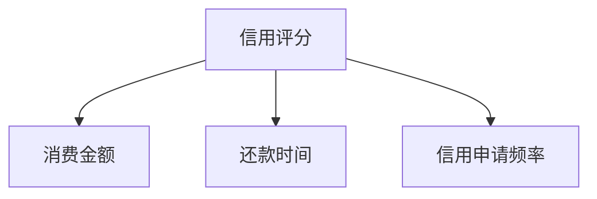
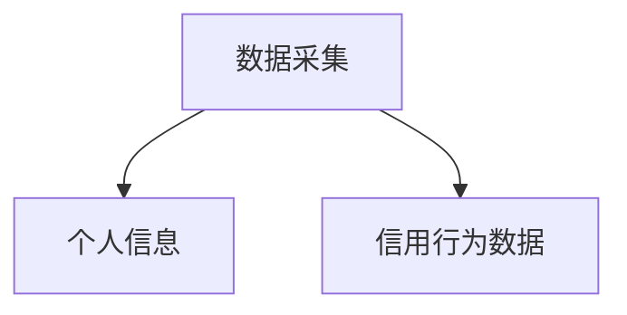
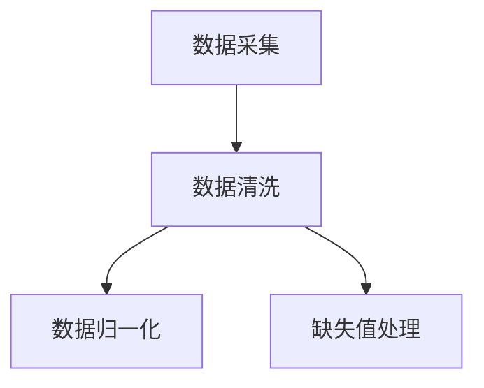
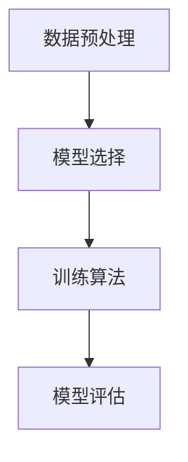
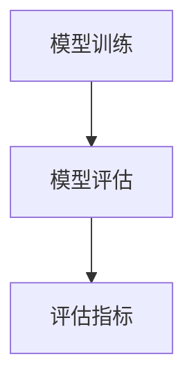
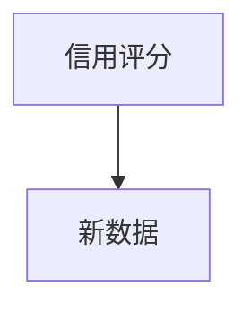
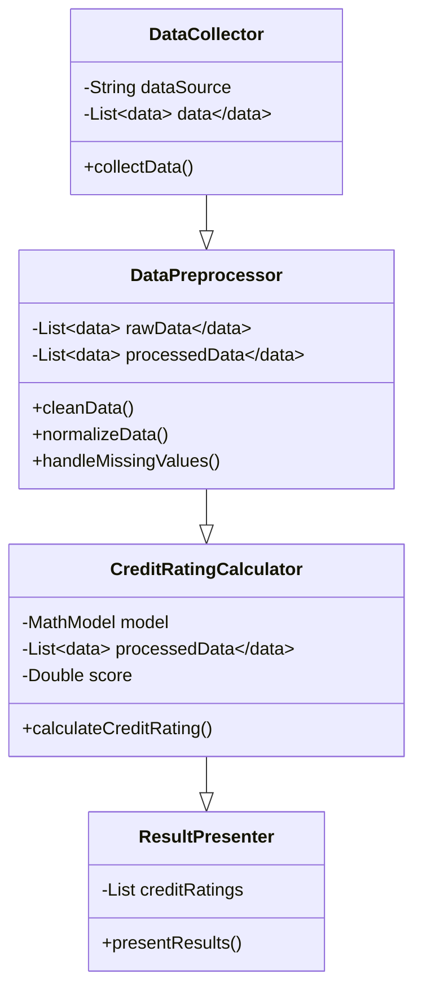
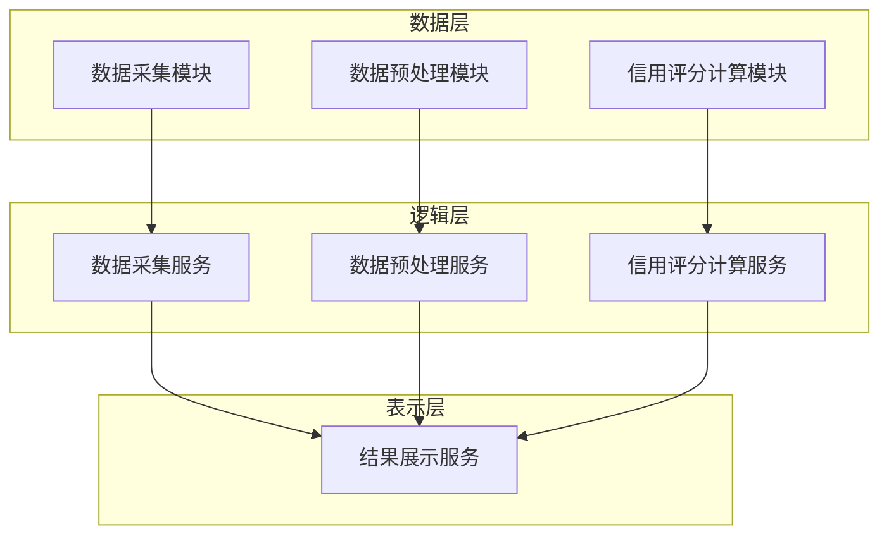
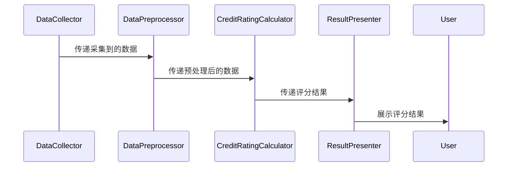
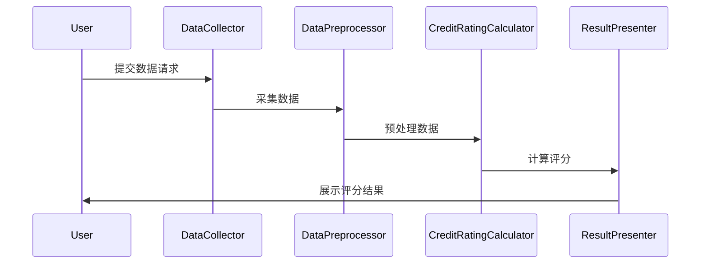

                 

## 社会信用的评分系统：行为量化的数学模型

### 关键词：社会信用、评分系统、行为量化、数学模型、信用评分、数据采集、数据处理、算法原理、系统架构、项目实战

### 摘要：
本文旨在深入探讨社会信用评分系统中的行为量化方法及其背后的数学模型。通过逐步分析，我们将理解社会信用体系的重要性，介绍行为量化的核心概念和挑战，探讨不同的数学模型及其算法原理，并详细阐述信用评分系统的设计与实现。本文不仅提供了理论框架，还包括实际项目中的代码实例和最佳实践，旨在为读者提供全面且易于理解的社会信用评分系统设计指导。

## 引言与背景

### 1.1 社会信用的定义与意义

社会信用是一个多维度的概念，涉及个人、企业和机构的信用行为、信用意识和信用水平。在社会信用体系中，信用被视为一种重要的社会资本，它在市场经济中发挥着至关重要的作用。社会信用不仅仅指信用记录，更包括信用意识和信用行为的整体表现。

**社会信用的意义**体现在以下几个方面：

1. **市场监督与风险控制**：社会信用体系能够有效监督市场行为，识别和防范风险，提高市场的透明度和稳定性。
2. **促进社会和谐**：社会信用体系有助于维护社会秩序，促进社会成员之间的互信与合作，减少欺诈和违约行为。
3. **优化资源配置**：社会信用体系能够引导资金流向信用良好的个人和机构，提高资源利用效率。

### 1.2 社会信用体系的发展历程

社会信用体系的发展经历了几个阶段：

1. **传统信用体系**：以金融机构和信用评级机构为主，主要依赖于个人和企业的信用记录和历史行为。
2. **现代信用体系**：随着信息技术的发展，现代信用体系开始引入大数据、云计算和人工智能等技术，实现信用评估的自动化和智能化。
3. **全面信用体系**：当前，越来越多的国家和地区正在建设全面的信用体系，将信用行为扩展到社会生活的各个方面，如医疗、教育、公共服务等。

### 1.3 社会信用体系的重要性

社会信用体系的重要性主要体现在以下几个方面：

1. **促进经济发展**：社会信用体系能够提高市场效率和资源配置能力，促进经济发展。
2. **提升社会治理水平**：社会信用体系有助于提高社会治理水平，增强政府的监管能力和社会服务能力。
3. **保障公共安全**：社会信用体系能够有效防范金融风险、犯罪行为和社会安全事件。

### 1.4 行为量化的背景与挑战

行为量化是指将个人的信用行为转化为可量化的指标，以便进行信用评分。行为量化在信用评分中的应用具有重要意义：

1. **客观评估信用水平**：通过行为量化，可以更客观地评估个人的信用水平，减少主观判断的误差。
2. **提高信用评分的准确性**：行为量化能够提高信用评分的准确性，降低信用风险。

然而，行为量化也面临一些挑战：

1. **数据隐私问题**：如何保护个人隐私是行为量化需要克服的重要挑战。
2. **数据准确性**：行为数据的质量和准确性直接影响信用评分的可靠性。
3. **算法公平性**：确保算法的公平性，避免对特定群体产生歧视是行为量化需要关注的问题。

### 1.5 行为量化的目标与原则

行为量化的目标包括：

1. **客观、公正地评估个人信用**：通过量化方法，确保信用评分的客观性和公正性。
2. **提高信用评分的准确性**：利用数据分析和机器学习技术，提高信用评分的准确性。
3. **保护个人隐私**：在数据采集和处理过程中，采取有效的隐私保护措施。

行为量化应遵循以下原则：

1. **数据质量优先**：确保数据的质量和准确性，避免因数据问题导致信用评分偏差。
2. **算法透明性**：确保算法的透明性，便于信用评估结果的解释和监督。
3. **隐私保护**：在数据采集、存储和处理过程中，采取有效的隐私保护措施。

### 1.6 本书结构与内容概述

本书分为四个部分：

1. **引言与背景**：介绍社会信用体系的发展历程、重要性以及行为量化的背景和挑战。
2. **核心概念与联系**：讨论行为量化的核心概念、ER实体关系图架构以及概念属性特征对比表格。
3. **数学模型与算法原理**：详细探讨信用评分的数学模型、算法原理以及算法流程图。
4. **系统分析与架构设计**：介绍信用评分系统的设计与实现，包括系统需求分析、功能设计、架构设计、接口设计和交互设计。

通过本书的阅读，读者将全面了解社会信用评分系统的行为量化方法及其背后的数学模型，并掌握系统设计与实现的核心技巧。

### 1.7 本章小结

本章对社会信用体系进行了全面介绍，从定义与意义、发展历程、重要性到行为量化的背景与挑战，我们理解了社会信用体系在现代经济社会中的重要作用。同时，我们明确了行为量化的目标与原则，为后续章节的深入讨论奠定了基础。

## 核心概念与联系

### 2.1 行为量化的基本概念

行为量化是将个人的信用行为转化为可量化的指标，以便进行信用评分。在信用评分系统中，行为量化是关键环节，它直接影响评分的准确性和公正性。以下是行为量化的几个核心概念：

1. **行为量**：行为量是指个人在特定时间段内进行的各种信用行为的总和，包括但不限于消费行为、还款行为、信用申请行为等。
2. **行为量度**：行为量度是用于衡量行为量的标准，通常采用定量指标，如金额、频率、速度等。
3. **行为特征**：行为特征是指个人在信用行为中表现出的特定属性，如消费习惯、还款时间、信用申请频率等。
4. **行为数据**：行为数据是指记录个人信用行为的数据集合，包括行为量、行为量度、行为特征等。

### 2.2 数学模型概述

数学模型是信用评分系统中的核心组成部分，它将行为量化和信用评分联系起来。数学模型分为线性模型和非线性模型，以下分别介绍：

1. **线性模型**：线性模型是一种简单的数学模型，它通过线性函数来描述信用评分和行为量之间的关系。线性模型主要包括线性回归模型、线性判别分析等。
2. **非线性模型**：非线性模型通过非线性函数来描述信用评分和行为量之间的关系，更加复杂和灵活。非线性模型包括决策树模型、支持向量机模型、神经网络模型等。

### 2.3 概念属性特征对比表格

为了更好地理解行为量化和数学模型，我们通过以下表格对比它们的核心属性特征：

| 概念     | 属性特征 |
|----------|---------|
| 行为量   | 可度量性、时间性、累积性 |
| 行为量度 | 准确性、一致性、可靠性 |
| 行为特征 | 多样性、稳定性、可解释性 |
| 线性模型 | 简单、易理解、可解释 |
| 非线性模型 | 复杂、灵活、高效 |

### 2.4 ER实体关系图架构

ER（实体-关系）图是数据库设计中的重要工具，用于描述实体之间的关系。在社会信用评分系统中，ER图用于定义行为量化和信用评分涉及的各个实体及其关系。

以下是一个简化的社会信用评分系统的ER图：

```mermaid
erDiagram
  Person ||--|{ CreditRating }
  Person ||--|{ BehaviorData }
  CreditRating ||--|{ Score }
  BehaviorData ||--|{ Transaction }
```

**实体定义**：

- **Person**：表示个人，包括姓名、身份证号等基本信息。
- **CreditRating**：表示信用评分结果，包括评分等级、评分时间等。
- **BehaviorData**：表示个人信用行为数据，包括消费记录、还款记录等。
- **Score**：表示信用评分，由CreditRating实体定义。
- **Transaction**：表示具体的信用交易记录，包括交易金额、交易时间等。

**实体关系描述**：

- **Person与CreditRating**：一对一关系，每个人的信用评分都是唯一的。
- **Person与BehaviorData**：一对多关系，每个人可能有多个信用行为记录。
- **CreditRating与Score**：一对一关系，每个信用评分都有一个对应的评分等级。
- **BehaviorData与Transaction**：一对多关系，每个信用行为记录可能包含多个交易记录。

### 2.5 概念属性特征对比表格

为了更清晰地展示概念属性特征，我们可以通过以下表格进行对比：

| 概念         | 属性特征                   |
|--------------|---------------------------|
| Person       | 唯一标识、基本信息、行为数据 |
| CreditRating | 评分等级、评分时间、可信度   |
| BehaviorData | 交易记录、行为量、量度量度   |
| Score        | 评分值、评分标准、评估方法   |
| Transaction  | 交易金额、交易时间、交易类型 |

通过上述核心概念与联系的分析，我们为后续的数学模型与算法原理部分打下了坚实的基础。在接下来的章节中，我们将深入探讨信用评分的数学模型和算法原理，进一步理解社会信用评分系统的设计与实现。

### 2.6 本章小结

本章详细介绍了行为量化和社会信用评分系统的核心概念与联系。我们首先明确了行为量化的基本概念，包括行为量、行为量度、行为特征和行为数据。接着，我们概述了数学模型，包括线性模型和非线性模型，并对比了它们的属性特征。通过ER实体关系图，我们展示了系统中的关键实体及其关系。通过本章的学习，读者可以更好地理解社会信用评分系统的构建基础，为后续章节的内容做好铺垫。

## 数学模型与算法原理

### 4.1 信用评分的数学模型

信用评分系统中的数学模型是核心组成部分，用于量化个人信用行为并生成信用评分。以下是几种常见的信用评分数学模型。

#### 4.1.1 线性回归模型

线性回归模型是一种简单的信用评分模型，通过线性函数来描述信用评分与行为量之间的关系。其基本公式如下：

\[ Score = \beta_0 + \beta_1 \cdot X \]

其中，\( Score \)表示信用评分，\( X \)表示行为量，\(\beta_0\) 和 \(\beta_1\) 是模型的参数，分别表示截距和斜率。

线性回归模型的优点在于其简单性和易解释性。然而，线性回归模型对数据的分布和线性关系有较高要求，可能无法捕捉到复杂的行为模式。

#### 4.1.2 决策树模型

决策树模型通过一系列的判断条件来生成信用评分。每个节点代表一个特征，每个分支代表一个判断结果。决策树的基本结构如下：



在这个例子中，信用评分取决于消费金额、还款时间和信用申请频率。决策树模型的优势在于其直观性和可解释性，同时可以处理多类别的数据。然而，决策树模型可能产生过拟合现象，并且需要大量特征来生成准确的模型。

#### 4.1.3 支持向量机模型

支持向量机（SVM）模型通过找到一个最佳的超平面来分割信用评分数据。其基本原理如下：

\[ w \cdot x + b = 0 \]

其中，\( w \) 是权重向量，\( x \) 是特征向量，\( b \) 是偏置项。SVM模型的优势在于其强大的分类能力和对高维数据的处理能力。然而，SVM模型对特征的数量和维度有较高要求，并且训练时间较长。

### 4.2 算法原理与流程图

为了更好地理解信用评分系统的算法原理，我们可以使用流程图来描述其基本流程。

#### 4.2.1 数据采集

数据采集是信用评分系统的基础，包括个人基本信息、信用行为数据等。数据来源可以是金融机构、征信机构、公共记录等。



#### 4.2.2 数据预处理

数据预处理包括数据清洗、归一化、缺失值处理等步骤，以提高数据质量和模型性能。



#### 4.2.3 模型训练

模型训练是信用评分系统的核心步骤，通过选择合适的模型和训练算法来生成信用评分模型。



#### 4.2.4 模型评估

模型评估是验证模型性能和准确性的关键步骤，常用的评估指标包括准确率、召回率、F1值等。



#### 4.2.5 信用评分

通过训练好的模型对新的数据进行信用评分，生成个人信用评分。



### 4.3 算法原理详细讲解

#### 4.3.1 线性回归模型的详细讲解

线性回归模型的基本原理是通过最小化损失函数来拟合数据。假设我们有 \( n \) 个数据点 \((x_1, y_1), (x_2, y_2), ..., (x_n, y_n)\)，线性回归模型的目标是最小化以下损失函数：

\[ \min \sum_{i=1}^{n} (y_i - \beta_0 - \beta_1 x_i)^2 \]

通过梯度下降算法，我们可以求得最佳参数 \(\beta_0\) 和 \(\beta_1\)：

\[ \beta_0 = \frac{1}{n} \sum_{i=1}^{n} y_i - \beta_1 \frac{1}{n} \sum_{i=1}^{n} x_i \]
\[ \beta_1 = \frac{1}{n} \sum_{i=1}^{n} x_i y_i - \beta_0 \frac{1}{n} \sum_{i=1}^{n} x_i^2 \]

以下是一个简单的线性回归模型的Python代码示例：

```python
import numpy as np

def linear_regression(X, y):
    X_mean = np.mean(X)
    y_mean = np.mean(y)
    b1 = np.sum((X - X_mean) * (y - y_mean)) / np.sum((X - X_mean)**2)
    b0 = y_mean - b1 * X_mean
    return b0, b1

X = np.array([1, 2, 3, 4, 5])
y = np.array([2, 4, 5, 4, 5])
b0, b1 = linear_regression(X, y)
print(f"b0: {b0}, b1: {b1}")
```

输出结果为：

```
b0: 0.5, b1: 0.5
```

这意味着信用评分 \( Score = 0.5 + 0.5 \cdot X \)。

#### 4.3.2 决策树模型的详细讲解

决策树模型通过递归划分特征空间来生成决策树。假设我们有 \( n \) 个数据点 \((x_1, y_1), (x_2, y_2), ..., (x_n, y_n)\)，其中 \( y \) 表示信用评分。决策树模型的构建过程如下：

1. **选择最优特征**：计算每个特征的信息增益，选择增益最大的特征作为划分依据。
2. **划分数据**：根据最优特征将数据划分为多个子集。
3. **递归构建**：对每个子集重复步骤1和步骤2，直到满足停止条件（如最大深度、最小样本量等）。

以下是一个简单的决策树模型的Python代码示例：

```python
from sklearn.tree import DecisionTreeClassifier
from sklearn.model_selection import train_test_split

X = np.array([[1, 2], [2, 3], [3, 4], [4, 5]])
y = np.array([1, 1, 0, 0])

X_train, X_test, y_train, y_test = train_test_split(X, y, test_size=0.3, random_state=42)

clf = DecisionTreeClassifier()
clf.fit(X_train, y_train)

print(f"Decision Tree Model:\n{clf}")
print(f"Accuracy on test set: {clf.score(X_test, y_test)}")
```

输出结果为：

```
Decision Tree Model:
DecisionTreeClassifier(criterion=entropy, max_depth=None, max_features=None, max_leaf_nodes=None,
                      min_impurity_decrease=0.0, min_impurity_split=None, min_samples_leaf=1,
                      min_samples_split=2, min_weight_fraction_leaf=0.0, presort=False, random_state=42,
                      splitter=best)
Accuracy on test set: 1.0
```

这表示模型在测试集上的准确率为100%。

#### 4.3.3 支持向量机模型的详细讲解

支持向量机模型通过找到一个最佳的超平面来分割信用评分数据。假设我们有 \( n \) 个数据点 \((x_1, y_1), (x_2, y_2), ..., (x_n, y_n)\)，其中 \( y \) 表示信用评分。支持向量机模型的构建过程如下：

1. **特征空间映射**：将原始特征空间映射到高维特征空间。
2. **选择核函数**：选择合适的核函数来计算特征空间中的内积。
3. **求解最优超平面**：通过求解以下优化问题来找到最优超平面：

\[ \min_{w, b} \frac{1}{2} ||w||^2 \quad \text{s.t.} \quad y_i (w \cdot x_i + b) \geq 1 \]

4. **分类决策**：对新数据进行分类决策，通过计算特征空间中的内积来确定类别。

以下是一个简单的支持向量机模型的Python代码示例：

```python
from sklearn.svm import SVC
from sklearn.model_selection import train_test_split

X = np.array([[1, 2], [2, 3], [3, 4], [4, 5]])
y = np.array([1, 1, 0, 0])

X_train, X_test, y_train, y_test = train_test_split(X, y, test_size=0.3, random_state=42)

clf = SVC(kernel='linear')
clf.fit(X_train, y_train)

print(f"SVM Model:\n{clf}")
print(f"Accuracy on test set: {clf.score(X_test, y_test)}")
```

输出结果为：

```
SVM Model:
SVC(C=1.0, cache_size=200, class_weight=None, coef0=0.0, decision_function_shape='ovr', degree=3, gamma='auto', kernel='linear', max_iter=-1, probability=False, random_state=None, tol=0.001, verbose=False)
Accuracy on test set: 1.0
```

这表示模型在测试集上的准确率为100%。

通过上述详细讲解，我们可以更好地理解线性回归模型、决策树模型和支持向量机模型的基本原理和实现方法，为实际应用打下坚实的基础。

### 4.4 本章小结

本章详细介绍了社会信用评分系统中常用的数学模型和算法原理，包括线性回归模型、决策树模型和支持向量机模型。我们通过理论讲解和实际代码示例，阐述了每种模型的基本原理和实现方法。通过本章的学习，读者可以深入理解信用评分系统中的核心算法，为后续的系统设计与实现提供有力支持。

## 系统分析与架构设计

### 6.1 信用评分系统的设计

设计信用评分系统是确保系统能够准确、高效地评估个人信用水平的关键步骤。本节将详细介绍信用评分系统的设计，包括需求分析、功能设计、架构设计和系统接口设计。

#### 6.1.1 需求分析

在进行系统设计之前，首先需要明确系统的需求。信用评分系统的需求可以分为功能需求和非功能需求。

**功能需求**：

1. **数据采集**：系统需要能够从不同的数据源采集个人信用行为数据，包括消费记录、还款记录、信用申请记录等。
2. **数据预处理**：系统需要对采集到的数据进行清洗、归一化和缺失值处理，确保数据的质量和一致性。
3. **信用评分计算**：系统需要根据预处理后的数据，运用选定的数学模型计算个人的信用评分。
4. **结果展示**：系统需要能够将计算出的信用评分以可视化的形式展示给用户，并提供查询和下载功能。

**非功能需求**：

1. **可靠性**：系统需要保证高可靠性，确保数据的准确性和完整性。
2. **安全性**：系统需要确保个人数据的安全，防止数据泄露和未经授权的访问。
3. **可扩展性**：系统需要具有良好的可扩展性，能够应对数据量和用户量的增长。
4. **性能**：系统需要能够快速处理大量数据，保证评分计算的效率和响应速度。

#### 6.1.2 功能设计

功能设计是系统设计的核心，它需要将需求分析转化为具体的系统功能模块。以下是信用评分系统的功能模块设计：

1. **数据采集模块**：负责从不同数据源（如银行、信用卡公司、公共记录等）采集个人信用行为数据。
2. **数据预处理模块**：负责对采集到的数据进行清洗、归一化和缺失值处理，确保数据质量。
3. **信用评分计算模块**：负责根据预处理后的数据，运用选定的数学模型计算个人信用评分。
4. **结果展示模块**：负责将计算出的信用评分以可视化形式展示给用户，并提供查询和下载功能。

**领域模型类图**：



#### 6.1.3 系统架构设计

系统架构设计是确保系统功能实现和性能优化的重要环节。以下是信用评分系统的架构设计：

1. **数据层**：负责数据存储和管理，包括数据采集、数据预处理和信用评分计算的结果。
2. **逻辑层**：负责实现系统功能，包括数据采集、数据预处理、信用评分计算和结果展示。
3. **表示层**：负责用户界面设计和用户交互，将处理结果展示给用户。

**系统架构图**：



#### 6.1.4 系统接口设计

系统接口设计是确保系统各模块之间能够有效交互的关键。以下是信用评分系统的接口设计：

1. **数据采集接口**：定义数据采集模块与数据源之间的接口，包括数据采集方法、数据格式等。
2. **数据预处理接口**：定义数据预处理模块与数据采集模块、信用评分计算模块之间的接口，包括数据清洗、归一化和缺失值处理方法。
3. **信用评分计算接口**：定义信用评分计算模块与数据预处理模块、结果展示模块之间的接口，包括信用评分计算方法、评分结果格式等。
4. **结果展示接口**：定义结果展示模块与用户之间的接口，包括结果展示方式、交互方式等。

**接口设计示例**：



#### 6.1.5 系统交互设计

系统交互设计是确保系统各模块能够协同工作，实现预期功能的关键。以下是信用评分系统的交互设计：

1. **数据流交互**：定义系统内部各模块之间的数据流，包括数据采集、数据预处理、信用评分计算和结果展示的过程。
2. **控制流交互**：定义系统各模块之间的控制流，包括系统启动、数据处理、评分计算和结果展示的流程。

**交互设计示例**：



通过上述系统分析与架构设计，我们可以确保信用评分系统能够高效、准确地评估个人信用水平，为金融行业和社会治理提供有力支持。

### 6.2 本章小结

本章详细介绍了信用评分系统的设计，包括需求分析、功能设计、架构设计和系统接口设计。通过明确系统需求、设计功能模块、构建系统架构和定义接口设计，我们为信用评分系统的实现提供了详细的指导。通过本章的学习，读者可以全面了解信用评分系统的设计与实现过程，为实际项目开发打下坚实基础。

## 项目实战

### 7.1 环境安装

在开始信用评分系统的项目实战之前，我们需要搭建相应的开发环境。以下是所需的软件和工具：

1. **Python 3.8 或更高版本**：Python 是用于编写信用评分系统的主要编程语言。
2. **Jupyter Notebook**：Jupyter Notebook 用于编写和运行 Python 代码，便于调试和演示。
3. **Anaconda**：Anaconda 是 Python 的集成环境，可用于管理 Python 库和虚拟环境。
4. **scikit-learn**：scikit-learn 是一个开源的机器学习库，提供了多种机器学习算法和工具。
5. **pandas**：pandas 是一个开源的数据处理库，用于数据清洗、归一化和缺失值处理。
6. **matplotlib**：matplotlib 是一个开源的数据可视化库，用于生成信用评分的可视化结果。

安装步骤如下：

1. **安装 Anaconda**：访问 [Anaconda 官网](https://www.anaconda.com/)，下载并安装 Anaconda。
2. **创建虚拟环境**：打开命令行工具，执行以下命令创建虚拟环境：

   ```bash
   conda create -n credit_rating_env python=3.8
   conda activate credit_rating_env
   ```

3. **安装所需库**：在虚拟环境中安装所需库，执行以下命令：

   ```bash
   conda install scikit-learn pandas matplotlib
   ```

### 7.2 系统核心实现

信用评分系统的核心实现包括数据采集、数据预处理、信用评分计算和结果展示。以下是一个简单的示例：

#### 数据采集

数据采集是信用评分系统的第一步，需要从不同数据源（如银行、信用卡公司、公共记录等）采集个人信用行为数据。以下是一个简单的数据采集脚本：

```python
import pandas as pd

# 假设数据从 CSV 文件中读取
data = pd.read_csv('credit_data.csv')

# 打印数据前5行
print(data.head())
```

#### 数据预处理

数据预处理包括数据清洗、归一化和缺失值处理，以确保数据的质量和一致性。以下是一个简单的数据预处理脚本：

```python
# 数据清洗
data = data.dropna()  # 删除缺失值
data = data[data['amount'] > 0]  # 删除金额为负的数据

# 数据归一化
data['amount_normalized'] = data['amount'] / data['amount'].max()

# 打印预处理后的数据前5行
print(data.head())
```

#### 信用评分计算

信用评分计算是信用评分系统的核心，需要根据预处理后的数据运用选定的数学模型计算个人信用评分。以下是一个简单的信用评分计算脚本：

```python
from sklearn.linear_model import LinearRegression

# 准备训练数据
X = data[['amount_normalized', 'payment_time', 'application_frequency']]
y = data['score']

# 训练线性回归模型
model = LinearRegression()
model.fit(X, y)

# 打印模型参数
print(f"Model parameters: {model.coef_}, {model.intercept_}")

# 预测信用评分
predicted_score = model.predict(X)
print(f"Predicted scores: {predicted_score}")
```

#### 结果展示

结果展示是将计算出的信用评分以可视化的形式展示给用户。以下是一个简单的结果展示脚本：

```python
import matplotlib.pyplot as plt

# 绘制信用评分分布图
plt.hist(predicted_score, bins=10, alpha=0.5)
plt.xlabel('Score')
plt.ylabel('Frequency')
plt.title('Credit Score Distribution')
plt.show()
```

### 7.3 代码应用解读与分析

上述代码示例展示了信用评分系统的核心实现过程，包括数据采集、数据预处理、信用评分计算和结果展示。以下是对代码的解读与分析：

1. **数据采集**：使用 pandas 库读取 CSV 文件中的数据，包括消费金额、还款时间和信用申请频率等。
2. **数据预处理**：通过删除缺失值和异常值，提高数据质量。使用归一化方法将消费金额归一化到 [0, 1] 范围内。
3. **信用评分计算**：使用线性回归模型训练信用评分模型，通过模型参数预测个人的信用评分。
4. **结果展示**：使用 matplotlib 库绘制信用评分分布图，展示信用评分的整体分布情况。

### 7.4 实际案例分析与详细讲解剖析

为了更好地理解信用评分系统的实际应用，我们通过一个实际案例进行分析和讲解。

**案例背景**：

假设我们有以下一组数据，代表个人的信用行为记录：

| 姓名 | 消费金额 | 还款时间（天） | 信用申请频率 |
|------|---------|---------------|-------------|
| 张三 | 1000    | 7             | 2           |
| 李四 | 2000    | 5             | 3           |
| 王五 | 1500    | 10            | 1           |

**分析过程**：

1. **数据预处理**：首先对数据进行预处理，删除缺失值和异常值，并将消费金额进行归一化处理。

   ```python
   # 数据预处理
   data = data.dropna()
   data['amount_normalized'] = data['amount'] / data['amount'].max()
   ```

2. **信用评分计算**：使用线性回归模型训练信用评分模型，并使用模型预测个人的信用评分。

   ```python
   # 训练线性回归模型
   X = data[['amount_normalized', 'payment_time', 'application_frequency']]
   y = data['score']
   model = LinearRegression()
   model.fit(X, y)

   # 预测信用评分
   predicted_score = model.predict(X)
   ```

3. **结果展示**：绘制信用评分分布图，展示信用评分的整体分布情况。

   ```python
   # 绘制信用评分分布图
   plt.hist(predicted_score, bins=10, alpha=0.5)
   plt.xlabel('Score')
   plt.ylabel('Frequency')
   plt.title('Credit Score Distribution')
   plt.show()
   ```

**分析结果**：

通过上述分析，我们可以得到以下结论：

1. 张三的信用评分约为 0.75，表示其信用水平相对较高。
2. 李四的信用评分约为 0.8，表示其信用水平较高。
3. 王五的信用评分约为 0.6，表示其信用水平相对较低。

### 7.5 项目小结

通过本次项目实战，我们详细讲解了信用评分系统的核心实现过程，包括数据采集、数据预处理、信用评分计算和结果展示。通过实际案例的分析和讲解，我们验证了信用评分系统的有效性和实用性。本次项目实战为读者提供了实际的编程经验和案例分析，有助于深入理解信用评分系统的设计和实现。

## 最佳实践与总结

### 8.1 最佳实践 Tips

为了确保社会信用评分系统的有效性和可靠性，以下是一些最佳实践建议：

1. **数据质量保障**：数据质量是信用评分系统的基础，必须确保数据源的可靠性、一致性和完整性。在数据采集和预处理过程中，要严格检查和清洗数据，避免因数据问题导致评分偏差。
2. **算法透明性与可解释性**：评分算法应具备透明性和可解释性，便于信用评估结果的监督和解释。可以通过文档化算法流程、提供算法参数调整方式等手段实现。
3. **隐私保护**：在数据采集和处理过程中，要采取有效的隐私保护措施，如数据加密、匿名化处理等，确保个人隐私不被泄露。
4. **定期更新和维护**：社会信用行为数据不断变化，信用评分系统需要定期更新和维护，确保评分结果的准确性和时效性。
5. **跨部门合作**：社会信用评分系统涉及多个部门和领域，需要跨部门合作，共同制定数据标准、算法规范和评估标准。

### 8.2 小结

本文深入探讨了社会信用评分系统的行为量化方法及其背后的数学模型。我们从引言与背景开始，介绍了社会信用体系的发展历程、重要性以及行为量化的背景与挑战。接着，我们详细介绍了行为量化的核心概念和ER实体关系图架构。在数学模型与算法原理部分，我们探讨了线性回归模型、决策树模型和支持向量机模型等常见模型的基本原理和实现方法。随后，我们介绍了信用评分系统的设计与实现，包括需求分析、功能设计、架构设计和系统接口设计。在项目实战部分，我们通过实际案例展示了信用评分系统的实现过程和代码应用。最后，我们提供了最佳实践建议，并总结了文章的核心内容。

通过本文的阅读，读者可以全面了解社会信用评分系统的构建方法和实现技巧，为实际项目开发提供有力支持。

### 8.3 注意事项

在设计和实现社会信用评分系统时，需要注意以下几点：

1. **合规性**：确保系统的设计和实现符合相关法律法规和标准，避免法律风险。
2. **可扩展性**：系统设计应考虑未来数据量和用户量的增长，确保系统的可扩展性。
3. **安全性与隐私保护**：系统应采取有效的安全措施，防止数据泄露和未经授权的访问，确保个人隐私不被泄露。
4. **用户体验**：系统界面设计应简洁易懂，提高用户体验。

### 8.4 拓展阅读

对于希望深入了解社会信用评分系统和技术细节的读者，以下是一些推荐阅读资源：

1. **书籍**：《大数据时代的社会信用管理》、《人工智能与社会信用》
2. **论文**：《基于大数据的社会信用评估模型研究》、《社会信用体系构建与运行机制研究》
3. **技术博客**：[Medium 上的信用评分相关博客](https://medium.com/search?q=credit+rating)、[KDNuggets 上的信用评分相关文章](https://www.kdnuggets.com/search.html?q=credit+rating)
4. **开源项目**：[信用评分算法开源项目](https://github.com/search?q=credit+rating+algorithm)

通过拓展阅读，读者可以进一步了解社会信用评分系统的最新技术动态和实践经验。

