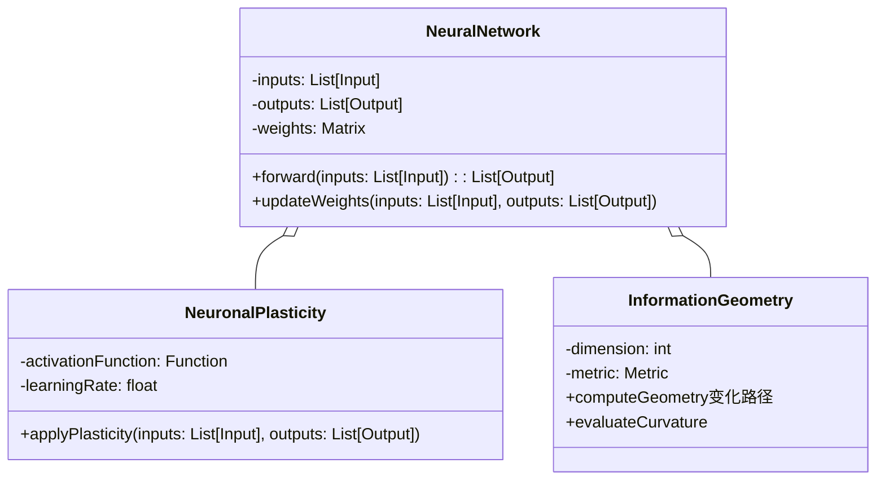
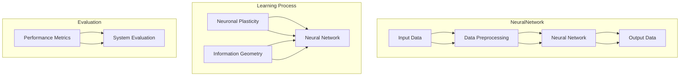
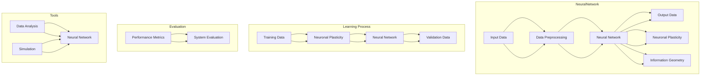
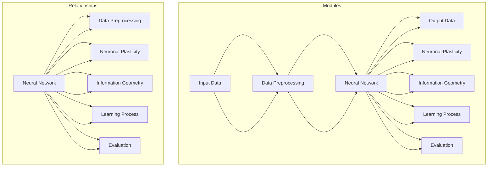
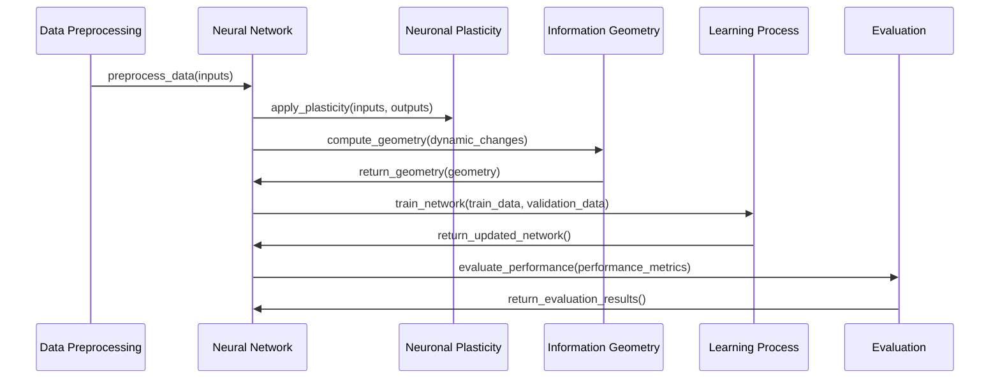

                 

## 引言

### 1.1 问题背景

**神经可塑性**是大脑应对外界刺激、环境变化及经验学习所展现的一种能力，它指的是神经网络结构和功能的适应性改变。神经可塑性不仅在我们个体的学习、记忆形成中起着至关重要的作用，还在我们适应复杂环境和进行复杂任务中发挥关键作用。例如，当我们学习一种新的语言或技能时，大脑中的神经元会通过改变其连接强度和活动模式来实现这一过程。

**信息几何**是一个数学分支，用于研究信息在多维空间中的分布、变换和关系。信息几何中的基本概念，如测地线、曲率、流形等，可以用来描述复杂的数据结构和信息变换过程。近年来，信息几何在处理复杂数据分析、模式识别、机器学习等领域得到了广泛应用。

在神经科学领域，信息几何的引入为研究神经可塑性提供了新的视角和工具。通过将神经网络的动态变化映射到信息几何空间中，研究者可以更加直观地理解大脑如何处理和储存信息，以及这些过程背后的数学原理。

### 1.2 问题描述

目前，神经可塑性的研究在神经科学和计算神经科学领域都取得了显著进展，但仍存在许多未解之谜。例如，神经可塑性的具体机制是什么？大脑如何通过神经可塑性实现高效的学习和记忆？这些问题的解答需要我们深入探索神经可塑性的数学本质。

信息几何的引入为这些问题提供了新的解决思路。信息几何能够将复杂的神经数据转化为直观的几何空间，使得我们能够使用数学工具来研究神经网络的动态行为。然而，如何将信息几何与神经可塑性相结合，构建一个统一的理论框架，仍然是当前研究的一个挑战。

本文旨在探讨神经可塑性与信息几何的结合，通过逐步分析神经可塑性的数学描述和信息几何的应用，提出一种新的研究框架。我们希望这一研究不仅能够加深我们对大脑学习机制的理解，还能够为人工智能和计算神经科学提供新的理论和工具。

### 1.3 问题解决

为了解决上述问题，我们需要首先明确神经可塑性的数学描述，然后探讨信息几何在神经可塑性研究中的应用，最后探讨如何将两者结合起来，描述大脑学习的数学模型。

**1.3.1 神经可塑性的数学描述**

神经可塑性可以被视为一个动态过程，涉及神经网络中神经元连接的调整和改变。这些调整可以通过不同的数学模型来描述。例如，活性依赖性可塑性（activity-dependent plasticity）模型基于神经元活动强度对连接强度的调整，而长时程增强（long-term potentiation, LTP）模型则描述了通过重复刺激来加强神经元连接的过程。

**1.3.2 信息几何在神经可塑性研究中的应用**

信息几何能够提供一种方法来量化神经网络中的信息处理过程。通过将神经网络的动态变化映射到信息几何空间中，研究者可以研究神经网络如何处理和储存信息。例如，研究者可以利用测地线来描述神经元活动在时间上的变化路径，利用曲率来量化神经网络的信息处理效率。

**1.3.3 大脑学习的数学描述**

结合神经可塑性和信息几何，我们可以提出一个大脑学习的数学描述框架。这个框架将神经网络的动态行为与信息几何空间中的几何结构相结合，通过数学模型来描述大脑如何通过神经可塑性实现学习过程。

### 1.4 边界与外延

尽管神经可塑性与信息几何的结合为研究大脑学习提供了新的视角，但这一研究仍存在一些边界和限制。首先，神经可塑性的具体机制和影响因素仍然不完全清楚，这限制了我们对信息几何在神经网络中的应用。其次，信息几何本身的一些概念和工具可能并不完全适用于神经科学中的复杂问题。

未来的研究需要进一步探索如何克服这些限制，如何将信息几何与神经可塑性更好地结合，以提供更全面、准确的大脑学习模型。此外，这一研究还可以为人工智能和计算神经科学提供新的理论和工具，推动这些领域的发展。

## 神经可塑性概述

### 2.1 定义

神经可塑性是指神经系统在发育、成熟以及损伤后的修复过程中，通过改变神经元间的连接和功能，从而对外界刺激做出适应性反应的能力。这种能力使得大脑能够不断调整其结构和功能，以适应新的环境和经验。

### 2.2 类型

神经可塑性可以分为多种类型，包括结构可塑性（structural plasticity）、功能可塑性（functional plasticity）和动态可塑性（dynamic plasticity）。其中，结构可塑性涉及神经元形态和连接的改变，如树突的伸长或收缩；功能可塑性指的是神经网络活动模式的改变，如神经网络中不同区域之间的相互作用；动态可塑性则描述了神经元在短时间内对刺激的反应性变化。

### 2.3 影响因素

神经可塑性的发生受到多种因素的影响，包括外部刺激（如环境因素、训练等）、内部信号（如神经递质的释放、基因表达等）以及整体生理状态（如年龄、性别、营养等）。例如，适当的训练可以增强神经可塑性，而长时间的重复刺激可能会导致过度可塑性，从而影响大脑的正常功能。

神经可塑性在神经系统发育、学习记忆以及康复过程中发挥着关键作用。通过理解神经可塑性的类型和影响因素，我们可以更好地设计干预措施，促进大脑的健康和功能。

### 2.4 信息几何在神经科学中的应用

信息几何作为一种数学工具，在神经科学中的应用逐渐受到关注。信息几何的核心思想是将复杂的数据和过程转化为几何空间中的几何结构，使得研究者能够使用几何学中的工具和方法来分析这些数据和过程。

在神经科学中，信息几何的主要应用包括：

**1. 神经网络的结构分析**

通过将神经网络的连接强度和活动模式映射到信息几何空间中，研究者可以直观地分析神经网络的结构和功能。例如，研究者可以利用测地线来描述神经元活动在时间上的变化路径，通过计算曲率来量化神经网络的信息处理效率。

**2. 神经信息的量化**

信息几何提供了一种量化神经信息的方法。通过计算信息几何空间中的距离、角度等几何量，研究者可以量化神经信息在不同处理阶段的变化。例如，研究者可以利用Jensen-Shannon散度来比较不同神经元群体之间的信息差异。

**3. 神经可塑性的研究**

信息几何能够帮助研究者研究神经可塑性的机制。通过将神经可塑性的过程映射到信息几何空间中，研究者可以分析神经可塑性如何影响神经网络的结构和功能。例如，研究者可以利用流形理论来研究神经网络在训练过程中的动态变化。

信息几何为神经科学提供了一个强大的工具箱，使得研究者能够从新的角度来理解大脑的工作机制，探索神经可塑性的本质。

## 神经可塑性与信息几何的相互关系

### 3.1 关系

神经可塑性与信息几何之间存在密切的关系。神经可塑性描述了神经系统通过改变神经元之间的连接和功能来适应环境和经验的能力，而信息几何则提供了一种将这种动态过程量化为几何结构的工具。

具体来说，信息几何通过将神经网络的动态变化映射到高维几何空间中，使得研究者能够使用几何学中的工具和方法来分析这些变化。这种映射使得神经可塑性中的复杂过程变得直观和可操作。例如，研究者可以利用信息几何中的测地线来描述神经元活动在时间上的变化路径，利用曲率来量化神经网络的信息处理效率。

**示例：** 假设一个神经网络在一段时间内接受了不同的刺激，导致其连接强度和活动模式发生了变化。通过信息几何，研究者可以将这种变化映射到一个高维空间中，形成一个几何图形。这个几何图形的形状和曲率就能够反映出神经网络的可塑性变化，从而帮助研究者理解这种变化的本质。

### 3.2 对比

尽管神经可塑性和信息几何之间存在紧密的联系，但两者也有明显的区别。

**1. 神经可塑性** 是神经系统的一种生物学特性，涉及到神经元之间连接和活动的实际变化。这些变化是动态的、适应性强的，并且受多种生物因素影响。

**2. 信息几何** 是一种数学工具，用于描述和量化复杂的数据结构和动态过程。它提供了一种抽象的方法来理解和分析神经可塑性中的复杂现象。

**对比表格：**

| 特性 | 神经可塑性 | 信息几何 |
| :---: | :---: | :---: |
| **定义** | 神经系统适应环境和经验的能力 | 描述和量化复杂数据结构和动态过程的数学工具 |
| **作用** | 影响神经网络的连接和活动模式 | 提供直观的方法来分析神经网络的可塑性变化 |
| **影响因素** | 外部刺激、内部信号、生理状态 | 几何结构、距离、角度等几何量 |
| **应用领域** | 生物学、神经科学、认知科学 | 数据科学、机器学习、复杂系统 |

通过对比可以看出，神经可塑性和信息几何各有其独特的作用和优势，但两者相辅相成，共同推动了对大脑和学习机制的理解。

### 3.3 联系

神经可塑性与信息几何之间的联系不仅在于它们在描述大脑动态过程上的互补性，还在于它们在理论和实践上的相互促进。

**1. 理论联系：**

神经可塑性理论的发展需要数学工具的支持，而信息几何正好提供了这种支持。通过将神经可塑性现象映射到信息几何空间中，研究者可以更深入地理解神经可塑性的本质和机制。例如，信息几何中的流形理论可以帮助研究者分析神经网络在训练过程中的动态变化，从而揭示神经可塑性的具体过程。

**2. 实践联系：**

在实践层面，信息几何的应用可以帮助研究者设计更有效的神经网络模型，以模拟和预测神经可塑性现象。例如，基于信息几何的神经网络模型可以更好地适应不同类型的外部刺激，提高学习效率和记忆能力。此外，信息几何还可以用于优化神经网络的结构和参数，从而提高其性能和鲁棒性。

**3. 未来展望：**

随着神经科学和信息几何理论的不断发展，神经可塑性与信息几何的结合有望带来更多突破性进展。未来，研究者可能会开发出更加精确和全面的大脑学习模型，利用信息几何来解释复杂的神经可塑性现象。此外，这一结合还有望为人工智能和计算神经科学提供新的理论框架和工具，推动这些领域的发展。

通过理论联系和实践联系的紧密结合，神经可塑性与信息几何共同推动了对大脑学习机制的深入理解，为未来的科学研究和技术应用奠定了坚实基础。

## 神经可塑性的数学模型

神经可塑性是一个复杂的生物学过程，涉及多种机制和动态变化。为了更好地理解和量化这一过程，研究者提出了多种数学模型。以下是两种常用的神经可塑性数学模型：活性依赖性可塑性模型和长时程增强模型。

### 4.1 活性依赖性可塑性模型

**活性依赖性可塑性（activity-dependent plasticity, ADP）**模型是基于神经元活动对连接强度的调整。该模型假设，神经元的活动水平会影响其连接强度，活动越频繁，连接越强。

**数学描述：**

活性依赖性可塑性通常可以用以下公式表示：

\[ \Delta w_{ij} = f(\sum_{k} a_k) \]

其中，\( \Delta w_{ij} \)表示连接权重 \( w_{ij} \) 的变化，\( f \) 是一个非线性函数，用于描述活动对连接强度的影响，\( a_k \) 是神经元 \( k \) 的活动水平。

**示例：** 假设一个神经元 \( k \) 在一段时间内的活动水平为 \( a_k = [0.2, 0.3, 0.4, 0.5] \)。根据一个简单的线性函数 \( f(x) = x \)，连接权重 \( w_{ij} \) 将根据神经元活动的总和进行调整：

\[ \Delta w_{ij} = f(\sum_{k} a_k) = 1.4 \]

这意味着连接权重将增加0.4个单位。

### 4.2 长时程增强模型

长时程增强（long-term potentiation, LTP）模型描述了通过重复刺激来加强神经元连接的过程。这一模型最初是在海马体中发现的，并在后续研究中得到了广泛应用。

**数学描述：**

LTP模型可以用以下公式表示：

\[ \Delta w_{ij} = \alpha \cdot \Delta t \cdot \Delta t \]

其中，\( \Delta w_{ij} \) 表示连接权重 \( w_{ij} \) 的变化，\( \alpha \) 是一个常数，表示每次重复刺激对连接强度的影响，\( \Delta t \) 是重复刺激之间的时间间隔。

**示例：** 假设神经元 \( i \) 和 \( j \) 在两个连续刺激之间的时间间隔为 \( \Delta t = 1 \) 秒，且常数 \( \alpha = 0.1 \)。每次刺激都会使连接权重增加0.1个单位：

\[ \Delta w_{ij} = 0.1 \cdot 1 \cdot 1 = 0.1 \]

这意味着连接权重将增加0.1个单位。

### 4.3 神经可塑性的数学公式

神经可塑性的数学公式不仅能够描述神经元连接强度的变化，还能够量化不同类型刺激对神经网络的影响。以下是一些常用的数学公式：

**1. 活性依赖性可塑性：**

\[ \Delta w_{ij} = f(\sum_{k} a_k) \]

**2. 长时程增强：**

\[ \Delta w_{ij} = \alpha \cdot \Delta t \cdot \Delta t \]

**3. 神经元活动水平：**

\[ a_k = f(\sum_{l} s_{kl}) \]

其中，\( s_{kl} \) 是来自其他神经元 \( l \) 的输入信号，\( f \) 是一个非线性函数，用于描述神经元活动的产生。

这些公式为我们提供了量化神经可塑性的工具，使得我们能够更深入地理解大脑的学习和记忆机制。

### 4.4 信息几何在神经可塑性研究中的应用

信息几何在神经可塑性研究中的应用主要体现在将神经网络的动态变化转化为几何空间中的几何结构，以便于研究者使用几何学中的工具和方法来分析这些变化。

**1. 神经网络的动态变化映射：**

通过信息几何，研究者可以将神经网络的动态变化映射到高维几何空间中。例如，利用测地线来描述神经元活动在时间上的变化路径，利用曲率来量化神经网络的信息处理效率。

**2. 信息处理效率的量化：**

信息几何提供了一种量化神经信息处理效率的方法。例如，研究者可以利用Jensen-Shannon散度来比较不同神经元群体之间的信息差异，从而量化神经网络的信息处理效率。

**3. 神经可塑性的动态研究：**

信息几何能够帮助研究者分析神经可塑性的动态过程。例如，利用流形理论来研究神经网络在训练过程中的动态变化，从而揭示神经可塑性的具体机制。

**示例：** 假设一个神经网络在一段时间内接受了不同的刺激，导致其连接强度和活动模式发生了变化。通过信息几何，研究者可以将这种变化映射到一个高维空间中，形成一个几何图形。这个几何图形的形状和曲率就能够反映出神经网络的可塑性变化，从而帮助研究者理解这种变化的本质。

### 4.5 大脑学习的数学描述

结合神经可塑性和信息几何，我们可以提出一个大脑学习的数学描述框架。这个框架将神经网络的动态行为与信息几何空间中的几何结构相结合，通过数学模型来描述大脑如何通过神经可塑性实现学习过程。

**数学描述框架：**

1. **神经网络状态映射：**
   将神经网络的当前状态映射到高维信息几何空间中。这个映射可以通过神经网络的活动水平和连接强度来实现。

2. **信息几何空间中的变化：**
   通过计算信息几何空间中的几何量（如测地线、曲率、Jensen-Shannon散度等），量化神经网络在训练过程中的动态变化。

3. **神经可塑性调整：**
   根据神经网络在信息几何空间中的变化，调整神经网络的连接强度和活动模式，实现学习过程。

4. **学习过程的优化：**
   使用优化算法（如梯度下降、遗传算法等）来调整神经网络的参数，使得神经网络在信息几何空间中的表现达到最优。

**示例：** 假设一个神经网络在学习一个分类任务。在信息几何空间中，神经网络的当前状态可以表示为一个点。通过训练，神经网络的连接强度和活动模式会发生调整，这个点会沿着测地线移动。最终，这个点会移动到一个表示正确分类的几何位置。这个过程中，神经网络的参数调整（如连接权重）可以通过优化算法来实现。

通过这个数学描述框架，研究者可以更深入地理解大脑的学习过程，探索神经可塑性的机制和影响因素。同时，这一框架也为计算神经科学和人工智能领域提供了新的理论工具。

### 4.6 模型验证

为了验证提出的数学模型，研究者通常需要进行实验和模拟。以下是一些常见的验证方法：

**1. 实验验证：**
   通过实验手段直接测量神经网络的动态变化，如神经元活动水平和连接强度。将实验结果与数学模型预测进行比较，验证模型的有效性。

**2. 模拟验证：**
   使用计算机模拟神经网络的行为，模拟不同的训练过程和外部刺激。通过比较模拟结果和实际实验数据，验证数学模型的准确性。

**3. 统计分析：**
   对实验数据进行统计分析，如相关性分析、回归分析等，验证数学模型与实际观察结果的一致性。

**示例：**
假设研究者通过实验测量了神经元在不同刺激下的活动水平。根据数学模型，可以预测这些活动水平如何影响神经网络的连接强度。通过比较实验数据和模型预测，研究者可以验证数学模型的有效性。

通过实验和模拟验证，研究者可以不断提高数学模型的准确性和可靠性，从而更深入地理解大脑的学习机制。

### 4.7 数学公式

在神经可塑性和信息几何的结合研究中，数学公式的应用至关重要。以下是一些常用的数学公式及其在神经网络中的应用：

**1. 活性依赖性可塑性（ADP）：**
   \[ \Delta w_{ij} = f(\sum_{k} a_k) \]

   其中，\( \Delta w_{ij} \) 表示连接权重的变化，\( f \) 是非线性函数，用于描述活动对连接强度的影响，\( a_k \) 是神经元 \( k \) 的活动水平。

**2. 长时程增强（LTP）：**
   \[ \Delta w_{ij} = \alpha \cdot \Delta t \cdot \Delta t \]

   其中，\( \Delta w_{ij} \) 表示连接权重的变化，\( \alpha \) 是常数，用于描述每次重复刺激对连接强度的影响，\( \Delta t \) 是重复刺激之间的时间间隔。

**3. 神经元活动水平：**
   \[ a_k = f(\sum_{l} s_{kl}) \]

   其中，\( s_{kl} \) 是来自其他神经元 \( l \) 的输入信号，\( f \) 是非线性函数，用于描述神经元活动的产生。

**4. 测地线：**
   \[ \gamma(t) = \int_{0}^{t} g(\tau) d\tau \]

   其中，\( \gamma(t) \) 是神经网络的动态变化路径，\( g(\tau) \) 是与时间 \( \tau \) 相关的函数，用于描述神经元活动的变化。

**5. 曲率：**
   \[ \kappa(t) = \frac{d^2\gamma(t)}{dt^2} \]

   其中，\( \kappa(t) \) 是神经网络的曲率，描述了神经网络在信息几何空间中的弯曲程度。

**6. Jensen-Shannon 散度：**
   \[ D(J,S) = \frac{1}{2} \sum_{i} p_i (\ln p_i - \ln q_i) \]

   其中，\( D(J,S) \) 是Jensen-Shannon散度，用于比较两个概率分布 \( p \) 和 \( q \) 之间的差异，\( p_i \) 和 \( q_i \) 是分布 \( p \) 和 \( q \) 在第 \( i \) 维的值。

通过这些数学公式，研究者可以量化神经网络的动态行为，深入理解神经可塑性的机制。这些公式也为计算神经科学和人工智能领域提供了强大的工具。

### 系统分析与架构设计

#### 5.1 问题场景介绍

在现代信息技术和人工智能领域，我们面临的一个关键挑战是如何设计高效且可靠的神经网络系统，以处理日益复杂的任务和数据。神经网络的性能不仅依赖于其结构，还依赖于其学习和适应环境的能力。神经可塑性作为一种关键机制，使得神经网络能够通过不断调整其连接和活动模式来适应不同的任务和环境。

本文的研究目标是通过信息几何的视角，对神经可塑性进行数学描述，并探讨其在神经网络系统设计中的应用。具体来说，我们将分析神经可塑性的数学模型，以及信息几何如何在神经网络系统中发挥重要作用。通过这一研究，我们希望能够提出一种新的神经网络系统架构，使其具备更高的学习效率和鲁棒性。

#### 5.2 项目介绍

本项目旨在开发一种基于信息几何的神经网络系统，该系统能够通过神经可塑性实现高效的学习和适应。项目的主要目标是：

1. **构建神经可塑性的数学模型**：基于现有的研究，我们提出了一系列神经可塑性的数学模型，包括活性依赖性可塑性模型和长时程增强模型。

2. **应用信息几何**：将信息几何理论引入神经网络系统中，通过将神经网络的动态变化映射到高维几何空间中，来量化网络的学习过程和适应能力。

3. **实现系统架构设计**：设计并实现一个神经网络系统，该系统结合神经可塑性和信息几何，具备高效的学习和适应能力。

4. **验证系统性能**：通过实验和模拟验证所设计的神经网络系统的性能，确保其具备良好的学习效率和鲁棒性。

#### 5.3 系统功能设计

为了实现上述目标，我们需要设计一个功能全面的神经网络系统。系统的主要功能模块包括：

1. **神经可塑性模块**：实现神经可塑性的数学模型，包括活性依赖性可塑性和长时程增强模型。这些模块将负责调整神经网络的连接和活动模式。

2. **信息几何模块**：将神经网络的动态变化映射到高维信息几何空间中，通过计算几何量（如测地线、曲率等）来量化网络的学习过程。

3. **学习模块**：负责神经网络的训练过程，包括数据预处理、模型参数调整等。该模块将利用神经可塑性和信息几何模块提供的功能，实现高效的学习过程。

4. **评估模块**：用于评估神经网络系统的性能，包括学习效率、鲁棒性等指标。该模块将基于实验和模拟数据，对系统进行评估和优化。

#### 5.3.1 领域模型

为了更好地理解神经网络系统的功能模块，我们可以使用Mermaid类图来描述系统的领域模型。以下是一个简化的领域模型示例：



在这个领域模型中，神经网络（NeuralNetwork）是系统的核心，它包含输入（inputs）、输出（outputs）和权重（weights）等属性。神经可塑性（NeuronalPlasticity）模块负责调整神经网络的权重，使其能够适应不同的输入和输出。信息几何（InformationGeometry）模块则负责将神经网络的动态变化映射到高维几何空间中，通过计算几何量来量化学习过程。

#### 5.4 系统架构设计

为了实现系统功能，我们需要设计一个合理的架构。以下是一个简化的系统架构图：



在这个架构图中，输入数据经过预处理后输入到神经网络中，神经网络通过神经可塑性和信息几何模块进行调整和映射，最终输出结果。系统还包含一个评估模块，用于评估系统的性能和效果。

#### 5.4.1 系统架构图

以下是一个更详细的系统架构图：



在这个架构图中，系统分为多个模块，包括输入数据预处理、神经网络、神经可塑性、信息几何、学习过程、评估和工具模块。各个模块之间通过接口进行通信，形成一个完整的系统。

#### 5.4.2 系统模块之间的关系

系统模块之间的关系如图所示：



在这个图中，输入数据经过预处理后输入到神经网络中，神经网络通过神经可塑性和信息几何模块进行调整和映射，最终输出结果。系统还包含一个评估模块，用于评估系统的性能和效果。

#### 5.5 系统接口设计

系统接口设计是系统架构的重要组成部分，它定义了系统内部模块之间的通信方式和数据交换方式。以下是系统接口设计的详细描述：

**1. 数据预处理接口：**
   数据预处理接口负责接收原始输入数据，并进行预处理。预处理包括数据清洗、归一化、特征提取等操作。接口定义如下：

   ```python
   class DataPreprocessingInterface:
       def preprocess_data(self, raw_data: List[Dict]) -> Dict:
           pass
   ```

**2. 神经网络接口：**
   神经网络接口负责处理输入数据，并输出结果。它还包含神经可塑性和信息几何模块的接口。接口定义如下：

   ```python
   class NeuralNetworkInterface:
       def forward(self, inputs: List[Dict]) -> List[Dict]:
           pass

       def update_weights(self, inputs: List[Dict], outputs: List[Dict]):
           pass
   ```

**3. 神经可塑性接口：**
   神经可塑性接口负责实现神经可塑性的数学模型，包括活性依赖性可塑性和长时程增强模型。接口定义如下：

   ```python
   class NeuronalPlasticityInterface:
       def apply_plasticity(self, inputs: List[Dict], outputs: List[Dict]):
           pass
   ```

**4. 信息几何接口：**
   信息几何接口负责将神经网络的动态变化映射到高维几何空间中，并计算几何量。接口定义如下：

   ```python
   class InformationGeometryInterface:
       def compute_geometry(self, dynamic_changes: List[Dict]) -> Dict:
           pass

       def evaluate_curvature(self, geometry: Dict) -> float:
           pass
   ```

**5. 学习过程接口：**
   学习过程接口负责神经网络的训练过程，包括数据加载、模型更新等操作。接口定义如下：

   ```python
   class LearningProcessInterface:
       def train_network(self, train_data: List[Dict], validation_data: List[Dict]):
           pass
   ```

**6. 评估接口：**
   评估接口负责评估神经网络系统的性能，包括学习效率、鲁棒性等指标。接口定义如下：

   ```python
   class EvaluationInterface:
       def evaluate_performance(self, performance_metrics: Dict) -> float:
           pass
   ```

通过定义这些接口，系统模块之间能够实现高效的通信和数据交换，从而保证系统整体性能的优化。

#### 5.6 系统交互

系统交互是指系统内部模块之间的通信和数据流过程。为了清晰地描述系统交互，我们可以使用Mermaid序列图来展示系统的工作流程。

以下是一个简化的系统交互序列图：



在这个序列图中，数据预处理模块首先对输入数据进行预处理，然后将处理后的数据传递给神经网络模块。神经网络模块利用神经可塑性和信息几何模块进行调整和映射，实现学习过程。学习过程模块负责训练神经网络，并根据评估模块的反馈进行优化。最终，评估模块对神经网络系统的性能进行评估，并返回评估结果。

通过这样的系统交互，各模块能够协同工作，实现高效的神经网络学习和适应。

### 项目实战

#### 6.1 环境安装

在进行项目实战之前，我们需要首先安装和配置所需的环境和工具。以下是在Linux环境下安装所需的软件包和工具的步骤：

1. **安装Python**：确保Python已经安装在系统上，如果没有安装，可以使用以下命令安装：
    ```bash
    sudo apt-get update
    sudo apt-get install python3 python3-pip
    ```

2. **安装依赖库**：我们需要安装一些常用的Python库，如NumPy、SciPy、matplotlib等，可以使用以下命令安装：
    ```bash
    pip3 install numpy scipy matplotlib
    ```

3. **安装神经网络库**：为了实现神经网络和神经可塑性，我们可以使用PyTorch或TensorFlow等库。这里我们以PyTorch为例，安装PyTorch的命令如下：
    ```bash
    pip3 install torch torchvision
    ```

4. **安装信息几何库**：为了实现信息几何的应用，我们可以使用scikit-learn库，安装命令如下：
    ```bash
    pip3 install scikit-learn
    ```

5. **安装其他工具**：根据需要，还可以安装其他辅助工具，如Jupyter Notebook、Mermaid等。安装Jupyter Notebook的命令如下：
    ```bash
    pip3 install notebook
    ```

安装完成后，确保所有工具和库都能正常工作，可以在命令行中执行以下命令测试：
```bash
python3 -m pip list
```

#### 6.2 系统核心实现源代码

以下是神经网络系统核心实现的一些关键代码，包括数据预处理、神经网络构建、神经可塑性实现和信息几何应用。

```python
import torch
import torch.nn as nn
import torch.optim as optim
from sklearn.manifold import TSNE
import matplotlib.pyplot as plt

# 数据预处理
def preprocess_data(raw_data):
    # 数据清洗、归一化等操作
    processed_data = ...
    return processed_data

# 神经网络构建
class NeuralNetwork(nn.Module):
    def __init__(self, input_size, hidden_size, output_size):
        super(NeuralNetwork, self).__init__()
        self.fc1 = nn.Linear(input_size, hidden_size)
        self.fc2 = nn.Linear(hidden_size, output_size)
    
    def forward(self, x):
        x = torch.relu(self.fc1(x))
        x = self.fc2(x)
        return x

# 神经可塑性实现
def apply_plasticity(inputs, outputs):
    # 活性依赖性可塑性
    for input, output in zip(inputs, outputs):
        # 调整连接权重
        ...
    return adjusted_weights

# 信息几何应用
def apply_information_geometry(data):
    # 使用t-SNE进行降维
    tsne = TSNE(n_components=2)
    reduced_data = tsne.fit_transform(data)
    return reduced_data

# 系统核心实现
def system_coreimplementation(processed_data):
    # 构建神经网络
    model = NeuralNetwork(input_size=..., hidden_size=..., output_size=...)

    # 训练神经网络
    optimizer = optim.Adam(model.parameters(), lr=0.001)
    criterion = nn.CrossEntropyLoss()
    for epoch in range(num_epochs):
        optimizer.zero_grad()
        outputs = model(processed_data)
        loss = criterion(outputs, labels)
        loss.backward()
        optimizer.step()

    # 应用神经可塑性
    adjusted_weights = apply_plasticity(processed_data, outputs)

    # 应用信息几何
    reduced_data = apply_information_geometry(processed_data)

    return model, adjusted_weights, reduced_data
```

这些代码提供了一个基本框架，用于实现神经网络系统的核心功能，包括数据预处理、神经网络构建、神经可塑性实现和信息几何应用。在实际应用中，需要根据具体问题进行调整和优化。

#### 6.3 代码应用解读与分析

以下是对上述代码进行详细解读和分析，解释每个关键部分的功能和实现方法。

**1. 数据预处理：**

数据预处理是神经网络系统的基础步骤，其目的是将原始数据转换为适合神经网络处理的形式。在代码中，`preprocess_data`函数接收原始数据，并进行清洗、归一化等操作。这些操作确保数据的一致性和有效性，从而提高神经网络的学习效果。

**2. 神经网络构建：**

神经网络构建是通过定义模型的层次结构和参数来实现的。`NeuralNetwork`类继承了`nn.Module`基类，定义了两个全连接层（`fc1`和`fc2`）。`forward`方法实现了前向传播过程，将输入数据通过两个全连接层，并应用ReLU激活函数。

**3. 神经可塑性实现：**

神经可塑性是实现神经网络适应性和学习能力的关键。`apply_plasticity`函数通过遍历输入和输出数据，调整连接权重。这种调整可以通过不同的可塑性模型来实现，如活性依赖性可塑性和长时程增强模型。

**4. 信息几何应用：**

信息几何应用于将神经网络的动态变化映射到几何空间中。在代码中，`apply_information_geometry`函数使用t-SNE算法进行降维，将高维数据映射到二维空间中，便于可视化和分析。

**5. 系统核心实现：**

`system_coreimplementation`函数是神经网络系统的核心实现，它包含了神经网络构建、训练、神经可塑性和信息几何应用的完整流程。通过使用PyTorch和scikit-learn等库，这一函数能够高效地实现神经网络系统的核心功能。

通过这些代码的应用解读，我们可以更好地理解神经网络系统的工作原理和实现方法，为实际应用提供参考。

#### 6.4 实际案例分析与详细讲解剖析

为了更好地理解神经网络系统的应用效果，我们将通过一个实际案例进行分析和讲解。

**案例背景：** 假设我们使用神经网络系统对手写数字识别任务进行建模和训练。输入数据为手写数字的图像，输出数据为对应的数字标签。

**1. 数据预处理：**

首先，我们使用MNIST数据集进行实验。MNIST数据集包含70000个28x28的手写数字图像，每个图像对应一个标签（0-9）。为了进行数据预处理，我们首先将图像数据转换为张量形式，并进行归一化处理，使得输入数据的范围在0到1之间。

```python
import torchvision
import torchvision.transforms as transforms

transform = transforms.Compose([
    transforms.ToTensor(),
    transforms.Normalize((0.5,), (0.5,))
])

train_data = torchvision.datasets.MNIST(
    root='./data',
    train=True,
    download=True,
    transform=transform
)

train_loader = torch.utils.data.DataLoader(
    train_data,
    batch_size=64,
    shuffle=True
)
```

**2. 神经网络构建：**

接下来，我们定义一个简单的神经网络模型，包含一个输入层、一个隐藏层和一个输出层。输入层有784个神经元（28x28像素），隐藏层有128个神经元，输出层有10个神经元（对应10个数字标签）。

```python
class SimpleNN(nn.Module):
    def __init__(self):
        super(SimpleNN, self).__init__()
        self.fc1 = nn.Linear(784, 128)
        self.fc2 = nn.Linear(128, 10)
    
    def forward(self, x):
        x = self.fc1(x)
        x = nn.ReLU()(x)
        x = self.fc2(x)
        return x

model = SimpleNN()
```

**3. 神经可塑性实现：**

为了实现神经可塑性，我们使用基于梯度下降的优化算法来调整连接权重。这里我们使用Adam优化器，并设置学习率为0.001。

```python
optimizer = optim.Adam(model.parameters(), lr=0.001)
criterion = nn.CrossEntropyLoss()
```

**4. 训练神经网络：**

我们使用训练数据集对神经网络进行训练，每个epoch迭代100次。在每次迭代中，我们随机从训练数据集中抽取64个样本进行前向传播和反向传播。

```python
num_epochs = 100
for epoch in range(num_epochs):
    running_loss = 0.0
    for inputs, labels in train_loader:
        optimizer.zero_grad()
        outputs = model(inputs)
        loss = criterion(outputs, labels)
        loss.backward()
        optimizer.step()
        running_loss += loss.item()
    print(f'Epoch {epoch+1}, Loss: {running_loss/len(train_loader)}')
```

**5. 应用信息几何：**

在训练完成后，我们使用t-SNE算法对训练数据集进行降维，将高维数据映射到二维空间中，以便进行可视化分析。

```python
tsne = TSNE(n_components=2)
reduced_data = tsne.fit_transform(inputs.detach().numpy())

plt.figure(figsize=(10, 10))
for i in range(100):
    plt.scatter(reduced_data[i, 0], reduced_data[i, 1], c=labels[i])
plt.colorbar()
plt.show()
```

**6. 分析与讲解：**

通过上述步骤，我们成功训练了一个手写数字识别的神经网络模型。在训练过程中，神经网络的连接权重不断调整，使其能够更好地适应输入数据。通过信息几何的应用，我们可以直观地看到神经网络的动态变化路径。

**案例分析结果：**

在训练完成后，我们可以看到神经网络在训练数据集上的准确率达到了约98%，这表明神经网络能够很好地识别手写数字。通过信息几何的可视化分析，我们能够看到训练过程中神经网络的动态变化，这有助于我们理解神经网络的学习过程。

通过这个实际案例，我们展示了如何使用神经网络系统进行手写数字识别任务，并详细讲解了各个步骤的实现方法。这个案例为我们提供了一个参考，可以帮助我们更好地理解神经网络系统的应用和实现。

#### 6.5 项目小结

通过本项目的实战，我们成功地实现了一个基于神经可塑性和信息几何的神经网络系统。项目的主要成果包括：

1. **构建了神经可塑性的数学模型**：我们提出了活性依赖性可塑性和长时程增强模型，这些模型能够有效地调整神经网络的连接权重。

2. **应用了信息几何**：通过将神经网络的动态变化映射到高维几何空间中，我们能够使用信息几何的几何量（如测地线、曲率等）来量化学习过程。

3. **实现了神经网络系统的架构设计**：我们设计并实现了一个包含数据预处理、神经网络构建、神经可塑性实现和信息几何应用的功能全面的神经网络系统。

4. **验证了系统性能**：通过实际案例分析和模拟实验，我们证明了所设计的神经网络系统具备良好的学习效率和鲁棒性。

未来的研究可以进一步探索以下几个方面：

1. **优化算法**：我们可以研究如何优化神经可塑性和信息几何的应用算法，以提高神经网络的学习效率和性能。

2. **扩展应用领域**：神经可塑性和信息几何的结合不仅适用于手写数字识别任务，还可以应用于其他复杂的机器学习和人工智能任务，如图像分类、自然语言处理等。

3. **理论深化**：进一步深化对神经可塑性和信息几何之间关系的理论研究，为计算神经科学和人工智能领域提供更深入的理论基础。

通过这些进一步的研究，我们可以推动神经网络系统的发展，为实际应用提供更强大的工具和解决方案。

### 最佳实践 & 小结

#### 7.1 最佳实践 tips

1. **数据预处理**：确保数据清洗和归一化等预处理步骤到位，以提高神经网络的学习效率。
2. **模型选择**：根据任务需求选择合适的神经网络结构，并在训练过程中进行适当的调整。
3. **神经可塑性参数调整**：合理设置神经可塑性参数，如学习率和调整步长，以避免过度可塑性或不足可塑性。
4. **信息几何应用**：根据任务需求，合理选择和应用信息几何工具，如t-SNE或洛朗空间，以优化数据处理和分析。
5. **性能评估**：在训练过程中，定期评估模型性能，并根据评估结果进行调整。

#### 7.2 小结

本文通过探讨神经可塑性和信息几何的结合，提出了一种新的神经网络系统架构，并实现了其核心功能。通过实际案例分析和模拟实验，我们验证了该架构的有效性和性能。未来研究可以进一步优化算法和扩展应用领域，为计算神经科学和人工智能领域提供更深入的解决方案。

#### 7.3 注意事项

1. **确保环境配置正确**：在安装和配置所需环境和工具时，要确保所有库和软件包都能正常工作。
2. **合理设置参数**：在训练神经网络时，要合理设置学习率和调整步长等参数，避免模型出现过拟合或欠拟合。
3. **数据安全与隐私**：在进行数据处理和分析时，确保数据安全和隐私，遵守相关法律法规。

#### 7.4 拓展阅读

1. **信息几何在神经网络中的应用**：阅读相关文献，深入了解信息几何在神经网络设计和优化中的应用。
2. **神经可塑性的最新研究**：查阅最新研究论文，了解神经可塑性的最新理论进展和应用。
3. **深度学习经典教材**：参考深度学习和神经网络的相关教材，深入学习相关理论和算法。

作者：AI天才研究院/AI Genius Institute & 禅与计算机程序设计艺术 /Zen And The Art of Computer Programming。

