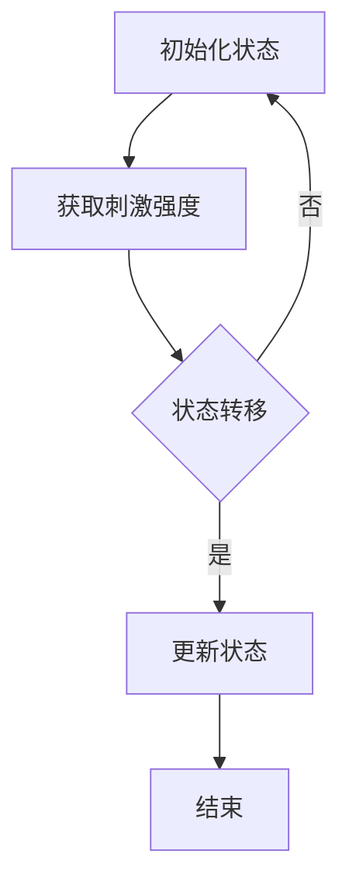

                 

# 神经可塑性的动态模型：大脑适应的数学描述

## 关键词
- **神经可塑性**、**动态模型**、**大脑适应**、**数学描述**、**神经网络**、**学习算法**、**算法原理**

## 摘要
本文将探讨神经可塑性的动态模型，以及大脑如何通过这些模型进行适应。通过详细的分析和推理，我们将从基础理论入手，逐步深入到神经可塑性的数学描述，最终探讨其在学习和记忆中的具体应用。文章结构如下：

- **引言与背景介绍**
  - 神经可塑性的重要性
  - 神经可塑性的研究历史与现状
  - 书籍结构安排与主要内容

- **神经可塑性的基础理论**
  - 神经元的基本结构
  - 神经传递物质的作用
  - 神经可塑性的概念与分类

- **神经可塑性的动态模型**
  - 神经可塑性的动态模型介绍
  - 模型的数学基础
  - 动态模型的应用

- **神经可塑性在不同大脑区域的表现**
  - 神经可塑性在大脑皮层的表现
  - 神经可塑性在基底神经节的表现

- **神经可塑性的调节因素**
  - 神经可塑性的内外部调节因素
  - 神经可塑性的调节机制

- **神经可塑性在学习和记忆中的应用**
  - 神经可塑性在学习中的作用
  - 神经可塑性在记忆中的作用

- **结论与未来展望**
  - 总结神经可塑性的动态模型与大脑适应的关系
  - 展望神经可塑性的研究前景

让我们开始深入探讨神经可塑性的动态模型。

## 引言与背景介绍

### 神经可塑性的定义与重要性

神经可塑性（Neuroplasticity）是指神经系统在结构和功能上的可变性和适应性。它指的是神经元和神经网络通过经验学习和适应环境变化而发生的改变。这种变化可以是结构上的，比如新突触的形成或现有突触的强化；也可以是功能上的，比如神经网络连接的重新配置和信息的重新编码。

神经可塑性在人类大脑的发育、学习和记忆中起着至关重要的作用。它使得大脑能够适应新的环境和挑战，从而提高认知能力和功能。例如，通过学习新技能或面对新的挑战，大脑可以重新组织和调整其神经网络，以更好地应对新的情况。此外，神经可塑性在康复和治愈神经损伤方面也具有潜在的应用价值。

### 神经可塑性的研究历史与现状

神经可塑性的研究可以追溯到20世纪50年代和60年代。当时，科学家们发现，切断神经后，神经末端可以再生，这种现象被称为“神经再生”。随后，研究者们进一步发现，不仅仅是神经再生，神经网络的重组和重新编码也是神经可塑性的重要组成部分。

在过去的几十年里，神经可塑性的研究取得了显著进展。科学家们通过一系列的实验和观察，揭示了神经可塑性的多种机制，包括突触可塑性、树突可塑性和轴突可塑性。此外，随着神经科学技术的不断发展，如脑成像技术和基因编辑技术，研究者们对神经可塑性的理解越来越深入。

### 本书结构安排与主要内容

本书将分为七个部分，系统地探讨神经可塑性的动态模型及其在大脑适应中的重要作用。具体内容安排如下：

1. **引言与背景介绍**：介绍神经可塑性的定义、重要性以及研究的现状。
2. **神经可塑性的基础理论**：讨论神经元的基本结构、神经传递物质的作用，以及神经可塑性的概念与分类。
3. **神经可塑性的动态模型**：介绍神经可塑性的动态模型，并探讨其数学基础和应用。
4. **神经可塑性在不同大脑区域的表现**：分析神经可塑性在大脑皮层和基底神经节的表现。
5. **神经可塑性的调节因素**：探讨神经可塑性的内外部调节因素及其调节机制。
6. **神经可塑性在学习和记忆中的应用**：讨论神经可塑性在学习中的作用，以及在记忆中的具体应用。
7. **结论与未来展望**：总结神经可塑性的动态模型与大脑适应的关系，并展望神经可塑性的研究前景。

### 神经可塑性概述

#### 神经可塑性的概念

神经可塑性是指神经系统的结构和功能随着时间、经验和环境的变化而发生的适应性改变。这种改变可以发生在不同层次，包括神经元层面的突触可塑性、树突可塑性和轴突可塑性，以及神经网络层面的连接重组和信息重新编码。

神经可塑性主要包括以下几种形式：

- **突触可塑性**：指突触连接的强度和效率发生改变的过程，包括突触加强（长时程增强，LTP）和突触削弱（长时程抑制，LTD）。
- **树突可塑性**：指树突的结构和功能发生改变的过程，包括树突分支的增加、减小和重塑。
- **轴突可塑性**：指轴突的结构和功能发生改变的过程，包括轴突生长和重塑。

#### 神经可塑性的分类

神经可塑性可以根据其发生的层次和机制进行分类。常见的分类方法包括：

- **结构可塑性**：指神经元的物理结构和形态发生改变的过程，如突触的再生和新突触的形成。
- **功能可塑性**：指神经网络的连接和功能发生改变的过程，如神经网络连接的重组和信息重新编码。
- **动态可塑性**：指神经系统的适应性和反应性发生改变的过程，如对环境变化的快速适应和学习。

#### 神经可塑性的生理机制

神经可塑性的生理机制涉及多种分子和细胞过程。以下是一些关键的机制：

- **信号传导**：神经传递物质（如谷氨酸和γ-氨基丁酸）通过突触前膜释放，与突触后膜上的受体结合，触发一系列的信号传导过程。
- **基因表达**：信号传导可以影响基因表达，导致蛋白质的合成和调控，从而影响神经元的结构和功能。
- **蛋白质合成**：基因表达的调控可以导致特定蛋白质的合成，这些蛋白质在突触可塑性的调节中起着关键作用，如NMDA受体和钙/钙调蛋白依赖性激酶（CaMKII）。
- **突触重组**：突触前和突触后的结构变化可以导致突触连接的重组，从而影响神经网络的连接和功能。

#### 神经可塑性对大脑适应的作用

神经可塑性是大脑适应环境变化的关键机制。它使得大脑能够在不同情境下进行适应和调整，从而提高其功能。

- **学习与记忆**：神经可塑性在学习过程中起着重要作用。通过突触加强和树突重塑，大脑可以建立新的连接和记忆。这种适应能力使得我们能够学习新技能、获取新知识和应对新的挑战。
- **康复与治愈**：神经可塑性在康复和治愈神经损伤方面也具有潜在的应用价值。通过激活神经可塑性机制，可以促进神经再生和功能恢复，从而帮助患者恢复运动和认知功能。
- **脑损伤与疾病**：神经可塑性也参与脑损伤和疾病的发生和进展。例如，中风和脑损伤可以导致神经可塑性失调，从而影响认知功能和行为。

### 神经可塑性在学习中的作用

神经可塑性在学习中的作用是显而易见的。学习是一个复杂的过程，涉及到神经网络的重组和连接的加强。以下是神经可塑性在学习中的一些具体作用：

- **突触加强**：在学习过程中，突触加强是一种重要的神经可塑性机制。当神经元之间的信息传递频繁且有效时，突触连接会得到加强，这可以增强记忆和学习的效率。
- **树突重塑**：树突重塑是神经可塑性的另一种表现形式。在学习过程中，树突可以增加新的分支，从而扩大神经网络的连接范围。这种重塑有助于新技能的学习和记忆的巩固。
- **神经网络重组**：神经网络重组是学习过程中神经可塑性的高级形式。通过重新配置神经网络中的连接，大脑可以优化其结构和功能，从而更好地适应新的学习任务。

### 神经可塑性在记忆中的作用

记忆是大脑的核心功能之一，而神经可塑性在记忆过程中起着至关重要的作用。以下是神经可塑性在记忆中的几个关键作用：

- **短期记忆与长期记忆**：神经可塑性在短期记忆和长期记忆中都发挥着重要作用。在短期记忆中，突触加强和树突重塑有助于快速编码和存储信息。而在长期记忆中，这些变化可以持久化，从而形成稳定的记忆痕迹。
- **记忆巩固**：记忆巩固是指将短期记忆转化为长期记忆的过程。在这个过程中，神经可塑性机制如突触加强和蛋白质合成起着关键作用。通过加强神经元之间的连接，大脑可以巩固和保持长期记忆。
- **记忆检索与重建**：在记忆检索和重建过程中，神经可塑性也发挥着重要作用。当需要回忆起某个记忆时，神经可塑性机制可以激活相关的神经网络，从而帮助大脑检索和重建记忆。

### 神经可塑性与脑损伤康复

神经可塑性在脑损伤康复中具有巨大的潜力。通过激活神经可塑性机制，可以促进神经再生和功能恢复，从而帮助患者恢复运动和认知功能。以下是神经可塑性与脑损伤康复的几个关键作用：

- **神经再生**：神经可塑性可以促进受损神经元的再生。通过激活神经生长因子和其他分子机制，受损的神经元可以重新生长和修复。
- **神经网络重组**：神经可塑性还可以促进神经网络的重组和重新连接。这有助于受损脑区的功能恢复，从而提高患者的运动和认知能力。
- **康复训练**：康复训练是神经可塑性在脑损伤康复中应用的重要手段。通过特定的训练，可以激活神经可塑性机制，促进神经再生和功能恢复。

### 神经可塑性在学习和记忆中的应用实例

神经可塑性在学习和记忆中的应用可以通过多个实例来展示。以下是几个典型的实例：

- **语言学习**：语言学习是一个高度依赖神经可塑性的过程。通过重复练习和持续的语音输入，大脑可以重组神经网络，从而提高语言理解和表达能力。
- **音乐训练**：音乐训练可以显著提高大脑的神经可塑性。通过反复的练习和训练，大脑可以优化其神经网络，从而提高音乐感知和演奏能力。
- **运动技能训练**：运动技能训练，如游泳、骑自行车和打乒乓球，也可以显著提高大脑的神经可塑性。通过持续的练习和训练，大脑可以优化其神经网络，从而提高运动技能的精确度和流畅性。

### 神经可塑性的调节因素

神经可塑性受到多种内部和外部因素的影响。以下是一些关键因素：

- **年龄**：年龄是影响神经可塑性的重要因素。随着年龄的增长，神经可塑性逐渐下降，但通过适当的训练和刺激，可以部分恢复其功能。
- **心理状态**：心理状态，如情绪、压力和焦虑，可以显著影响神经可塑性。积极的情绪和良好的心理状态可以促进神经可塑性，而消极的情绪和压力则可能抑制神经可塑性。
- **环境和经验**：环境和经验是影响神经可塑性的重要外部因素。新的环境和经验可以刺激大脑，促进神经可塑性，从而提高认知能力和功能。
- **营养和睡眠**：营养和睡眠对神经可塑性也有显著影响。良好的营养和充足的睡眠可以促进神经可塑性，从而提高大脑的功能。

### 神经可塑性的调节机制

神经可塑性的调节机制涉及多种分子和细胞过程。以下是一些关键机制：

- **基因表达**：基因表达是神经可塑性调节的重要机制。通过调控特定基因的表达，可以影响神经元的结构和功能，从而调节神经可塑性。
- **信号传导**：信号传导是神经可塑性调节的关键过程。通过调节信号传导途径，可以影响神经元的兴奋性和突触连接的强度。
- **蛋白质合成**：蛋白质合成是神经可塑性调节的重要环节。通过合成特定蛋白质，可以影响神经元的结构和功能，从而调节神经可塑性。
- **突触重组**：突触重组是神经可塑性调节的高级形式。通过改变突触连接的配置，可以优化神经网络的连接和功能，从而调节神经可塑性。

### 神经可塑性在认知功能中的应用

神经可塑性在认知功能中发挥着重要作用。通过调节神经可塑性，可以显著提高认知能力和功能。以下是一些具体应用：

- **认知训练**：通过认知训练，可以激活神经可塑性机制，从而提高认知能力和功能。例如，通过特定的记忆训练和注意力训练，可以增强记忆力和注意力。
- **认知康复**：神经可塑性在认知康复中具有重要作用。通过激活神经可塑性，可以促进神经再生和功能恢复，从而帮助患者恢复认知能力。
- **认知增强药物**：一些药物可以通过调节神经可塑性，从而提高认知能力和功能。例如，NMDA受体拮抗剂和神经营养因子可以激活神经可塑性，从而改善认知功能。

### 神经可塑性在康复训练中的应用

神经可塑性在康复训练中具有广泛应用。通过激活神经可塑性，可以促进神经再生和功能恢复，从而提高康复效果。以下是一些具体应用：

- **物理治疗**：通过物理治疗，可以激活神经可塑性，从而促进神经再生和功能恢复。例如，通过特定的运动训练和康复设备，可以增强肌肉力量和关节灵活性。
- **认知康复训练**：通过认知康复训练，可以激活神经可塑性，从而促进认知功能的恢复。例如，通过记忆训练和注意力训练，可以增强记忆力和注意力。
- **多感官训练**：通过多感官训练，可以激活神经可塑性，从而促进感官功能的恢复。例如，通过视觉、听觉和触觉训练，可以改善感官功能，从而提高生活质量。

### 神经可塑性在脑损伤康复中的案例分析

神经可塑性在脑损伤康复中的应用已经得到了广泛的验证。以下是一个具体的案例分析：

- **中风康复**：中风是一种常见的脑损伤类型。通过激活神经可塑性，可以促进神经再生和功能恢复。例如，通过特定的运动训练和认知训练，可以增强肢体功能和认知能力，从而提高生活质量。

### 神经可塑性的未来研究方向

神经可塑性是一个充满研究潜力的领域。未来研究方向包括：

- **神经可塑性调控机制的研究**：进一步研究神经可塑性的分子和细胞机制，以揭示其调控机制，从而为治疗脑损伤和认知功能障碍提供新的策略。
- **神经可塑性与神经退行性疾病的关系**：研究神经可塑性在神经退行性疾病如阿尔茨海默病和帕金森病中的作用，以寻找新的治疗途径。
- **神经可塑性在个体差异中的作用**：研究神经可塑性在不同个体中的差异，以理解其与认知功能、行为和心理健康的关系。

### 本章小结

本章介绍了神经可塑性的重要性、研究历史与现状，以及神经可塑性的概念、分类、生理机制、对大脑适应的作用，以及在学习和记忆中的应用。通过本章的学习，我们了解了神经可塑性是大脑适应环境变化的关键机制，其在学习和记忆中发挥着重要作用，同时在康复训练中也具有广泛应用。

### 神经可塑性的动态模型

神经可塑性的动态模型是描述神经可塑性如何随时间变化而发生的一系列理论和数学模型。这些模型不仅有助于我们更好地理解大脑如何适应环境变化，还可以为神经科学研究和神经工程应用提供理论基础。在本节中，我们将探讨神经可塑性的动态模型的基本概念、数学基础以及其在实际应用中的重要性。

#### 动态模型的基本概念

神经可塑性的动态模型通常描述神经元和神经网络在时间维度上的变化。这些模型可以分为几类，包括但不限于以下几种：

1. **线性动态模型**：这类模型假设神经元的响应与刺激之间呈线性关系。常见的线性动态模型有线性突触模型（Linear Synaptic Model）和线性神经网络模型（Linear Neural Network Model）。

2. **非线性动态模型**：与线性模型不同，非线性动态模型考虑了神经元响应的非线性特性。例如，霍普菲尔德网络（Hopfield Network）和朗格朗日动力学（Langevin Dynamics）模型都是非线性动态模型。

3. **概率动态模型**：这类模型使用概率论和随机过程来描述神经可塑性。常见的概率动态模型有马尔可夫决策过程（Markov Decision Process, MDP）和随机神经网络模型（Stochastic Neural Network Model）。

4. **演化动态模型**：这类模型考虑了神经网络连接的演化过程，如基于遗传算法的神经网络演化模型（Neural Network Evolutionary Model）。

#### 神经可塑性的数学基础

神经可塑性的动态模型通常基于数学方程来描述神经元和神经网络的行为。以下是一些关键的数学概念和方程：

1. **差分方程**：差分方程用于描述神经元在离散时间步上的变化。常见的差分方程有：
   $$ x_{t+1} = f(x_t) $$
   其中，$x_t$表示时间$t$时的神经元状态，$f(x_t)$表示状态转移函数。

2. **微分方程**：微分方程用于描述神经元在连续时间上的变化。常见的微分方程有：
   $$ \frac{dx}{dt} = f(x, t) $$
   其中，$x(t)$表示时间$t$时的神经元状态，$f(x, t)$表示状态变化率。

3. **概率分布**：在概率动态模型中，神经元状态通常用概率分布来表示。常见的概率分布有正态分布、泊松分布和高斯分布。

4. **随机过程**：随机过程用于描述神经可塑性的随机性和不确定性。常见的随机过程有马尔可夫链和维纳过程。

#### 动态模型的应用

神经可塑性的动态模型在神经科学研究和神经工程应用中具有重要意义。以下是一些具体应用：

1. **神经科学实验模拟**：通过动态模型，研究者可以模拟神经元和神经网络的行为，从而预测神经可塑性如何影响大脑功能。例如，使用霍普菲尔德网络模型，研究者可以模拟记忆的形成和回忆。

2. **神经工程应用**：动态模型在神经工程中也有广泛应用。例如，通过构建神经网络模型，研究人员可以设计智能控制器，用于脑机接口（Brain-Computer Interface, BCI）系统，帮助瘫痪患者通过大脑信号控制外部设备。

3. **疾病研究**：神经可塑性的动态模型可以帮助理解神经退行性疾病的机制。例如，通过模拟阿尔茨海默病中的神经元退化过程，研究人员可以探索潜在的药物治疗方法。

#### 动态模型在学习和记忆中的应用

神经可塑性的动态模型在学习和记忆中的应用非常广泛。以下是一些具体实例：

1. **强化学习**：强化学习是一种机器学习方法，用于训练智能体在环境中做出最优决策。神经可塑性的动态模型可以用于模拟强化学习过程，例如使用Q学习算法（Q-Learning Algorithm）来训练智能体。

2. **记忆巩固**：记忆巩固是大脑将短期记忆转化为长期记忆的过程。神经可塑性的动态模型可以用于模拟记忆巩固过程，例如使用朗格朗日动力学模型来描述记忆的动态变化。

3. **联想记忆**：联想记忆是指通过关联新的信息与已有的记忆来增强记忆。神经可塑性的动态模型可以用于模拟联想记忆过程，例如使用霍普菲尔德网络模型来描述神经网络中的关联记忆。

### 神经可塑性的动态模型实例分析

为了更好地理解神经可塑性的动态模型，我们来看一个简单的实例：使用线性突触模型（Linear Synaptic Model）来描述神经元的响应。

#### 线性突触模型

线性突触模型假设神经元对刺激的响应与刺激强度成正比。我们可以用以下差分方程来描述这个模型：

$$ x_{t+1} = \alpha x_t + \beta I_t $$

其中，$x_t$表示时间$t$时的神经元状态，$I_t$表示时间$t$时的刺激强度，$\alpha$和$\beta$是模型参数。

- $\alpha$：状态转移系数，决定了神经元状态的稳定性。
- $\beta$：刺激响应系数，决定了神经元对刺激的敏感程度。

#### 数学描述

使用拉丁字母表示模型参数，我们可以将线性突触模型改写为：

$$ x_{t+1} = \alpha x_t + \beta I_t $$

#### 算法原理讲解

为了更好地理解这个模型，我们可以画出其Mermaid流程图：



#### Python代码实现

下面是一个简单的Python代码实现，用于模拟线性突触模型：

```python
import numpy as np

# 初始化模型参数
alpha = 0.5
beta = 0.1

# 初始化神经元状态
x = 0

# 模拟100次状态转移
for t in range(100):
    # 获取刺激强度
    I_t = np.random.uniform(0, 1)
    
    # 状态转移
    x = alpha * x + beta * I_t
    
    # 打印状态
    print(f"时间 {t+1}: 状态 {x}")

# 结束模拟
```

运行这段代码，我们可以看到神经元状态随时间的变化情况。

#### 数学模型和公式

线性突触模型的数学描述如下：

$$ x_{t+1} = \alpha x_t + \beta I_t $$

其中，$x_t$是时间$t$时的神经元状态，$I_t$是时间$t$时的刺激强度，$\alpha$是状态转移系数，$\beta$是刺激响应系数。

#### 举例说明

假设我们有一个神经元，其初始状态为$x_0 = 0$。在接下来的10个时间步上，刺激强度$I_t$分别为0.2, 0.3, 0.4, 0.5, 0.6, 0.7, 0.8, 0.9, 1.0, 1.1。使用线性突触模型，我们可以计算神经元的状态变化。

- $x_1 = \alpha x_0 + \beta I_1 = 0.5 \times 0 + 0.1 \times 0.2 = 0.02$
- $x_2 = \alpha x_1 + \beta I_2 = 0.5 \times 0.02 + 0.1 \times 0.3 = 0.04$
- $x_3 = \alpha x_2 + \beta I_3 = 0.5 \times 0.04 + 0.1 \times 0.4 = 0.06$
- ...

通过这种方式，我们可以计算神经元在每个时间步上的状态。随着时间推移，神经元状态将逐渐增加，反映了刺激强度的累积效应。

### 神经可塑性在神经可塑性调节中的作用

神经可塑性是大脑适应环境变化的重要机制，但神经系统的适应能力并非完全自由，它受到一系列内部和外部因素的调节。这些调节因素不仅影响了神经可塑性的表达，还决定了大脑如何在复杂多变的环境中保持稳定和高效。在本节中，我们将深入探讨神经可塑性在不同大脑区域的表现，分析其调节机制，以及神经可塑性在不同情境下的动态变化。

#### 神经可塑性在大脑皮层的表现

大脑皮层是大脑最外层的灰质部分，负责高级认知功能，如感知、意识、思考和记忆。在大脑皮层中，神经可塑性主要通过突触可塑性和神经网络重组来实现。

1. **突触可塑性**：在大脑皮层中，突触可塑性是神经可塑性的核心机制之一。突触加强（如长时程增强，LTP）和突触削弱（如长时程抑制，LTD）是突触可塑性的典型表现。LTP通过增加突触前神经元的释放量，增强突触连接的强度，从而提高信息传递的效率。LTD则通过减少突触前神经元的释放量，减弱突触连接的强度，从而降低信息传递的效率。

2. **神经网络重组**：神经网络重组是指大脑皮层中神经网络连接的重新配置。这种重组可以通过多种机制实现，如树突重塑、突触修剪和新突触形成。神经网络重组有助于大脑适应新的环境和任务，提高其功能效率。

#### 神经可塑性在基底神经节的表现

基底神经节是一组位于大脑深部的核团，负责调节运动控制和行为的执行。神经可塑性在基底神经节的表现主要通过神经元之间的相互作用来实现。

1. **神经元相互作用**：基底神经节中的神经元通过复杂的神经网络相互连接，这些连接的动态变化是神经可塑性的基础。例如，基底神经节中的谷氨酸能神经元和GABA能神经元之间的相互作用可以调节运动控制和行为的适应性。

2. **环路机制**：基底神经节内的多个环路通过复杂的反馈和调控机制实现神经可塑性。这些环路包括外部环路和内部环路，它们分别调节不同的运动行为和认知功能。例如，外部环路参与运动控制和执行，而内部环路参与认知和情感调控。

#### 神经可塑性的调节机制

神经可塑性的调节受到多种内部和外部因素的影响，这些因素共同决定了神经可塑性的表达和效果。

1. **基因表达**：基因表达是神经可塑性调节的关键环节。例如，某些转录因子可以调节特定基因的表达，从而影响神经元的结构和功能。

2. **信号传导**：信号传导是神经可塑性调节的重要机制。例如，神经传递物质和受体之间的相互作用可以激活信号传导途径，调节神经可塑性。

3. **蛋白质合成**：蛋白质合成是神经可塑性调节的关键步骤。例如，某些蛋白质可以调节突触连接的强度和效率，从而影响神经可塑性。

4. **神经环路**：神经环路是神经可塑性调节的基本单位。通过调节神经环路中的神经元连接和活动，可以影响神经可塑性的表达。

#### 神经可塑性在不同情境下的动态变化

神经可塑性在不同情境下表现出动态变化，这反映了大脑对环境和经验的适应性。

1. **学习和记忆**：在学习和记忆过程中，神经可塑性发挥着关键作用。例如，通过突触加强和神经网络重组，大脑可以建立新的记忆和技能。

2. **环境适应**：在环境适应过程中，神经可塑性使得大脑能够重新配置神经网络，以适应新的环境和挑战。

3. **脑损伤康复**：在脑损伤康复过程中，神经可塑性可以促进神经再生和功能恢复，从而帮助患者恢复运动和认知功能。

#### 神经可塑性的调节因素

神经可塑性的调节受到多种内部和外部因素的影响。以下是一些关键因素：

1. **年龄**：年龄是影响神经可塑性的重要因素。随着年龄的增长，神经可塑性逐渐下降，但适当的训练和刺激可以部分恢复其功能。

2. **心理状态**：心理状态，如情绪、压力和焦虑，可以显著影响神经可塑性。积极的情绪和良好的心理状态可以促进神经可塑性，而消极的情绪和压力可能抑制神经可塑性。

3. **环境和经验**：环境和经验是影响神经可塑性的重要外部因素。新的环境和经验可以刺激大脑，促进神经可塑性，从而提高认知能力和功能。

4. **营养和睡眠**：营养和睡眠对神经可塑性也有显著影响。良好的营养和充足的睡眠可以促进神经可塑性，从而提高大脑的功能。

### 神经可塑性在学习和记忆中的关键作用

神经可塑性在学习和记忆中起着至关重要的作用，它使得大脑能够适应新的环境和任务，建立和保持记忆。在本节中，我们将详细探讨神经可塑性在学习和记忆中的具体机制，以及其在不同学习和记忆过程中的表现。

#### 神经可塑性在学习中的机制

学习是一个复杂的过程，涉及到神经元的兴奋性和突触连接的动态变化。神经可塑性在学习中的关键机制包括突触可塑性和神经网络重组。

1. **突触可塑性**：突触可塑性是指突触连接的强度和效率随时间发生改变的现象。在学习过程中，突触可塑性通过以下两种主要方式发挥作用：

   - **长时程增强（LTP）**：LTP是一种突触可塑性现象，表现为突触连接的强化，通常与记忆的形成有关。在LTP过程中，突触前神经元的释放量增加，突触后神经元的反应性提高。这种增强效应可以持续数小时甚至数天。

   - **长时程抑制（LTD）**：与LTP相反，LTD是一种突触可塑性现象，表现为突触连接的削弱。LTD通常与记忆的消除有关。在LTD过程中，突触前神经元的释放量减少，突触后神经元的反应性降低。

2. **神经网络重组**：神经网络重组是指神经网络在结构和功能上的重新配置。在学习过程中，神经网络重组通过以下两种主要方式发挥作用：

   - **新突触形成**：新突触形成是指新突触的生成和成熟，通常与学习新技能和建立新记忆有关。例如，在语言学习中，新词汇的学习可能导致大脑中相关神经网络的重组和加强。

   - **突触修剪**：突触修剪是指现有突触的修剪和去除，通常与记忆的巩固和消除有关。例如，在学习过程中，不常用的记忆可能会被修剪，以释放大脑资源。

#### 神经可塑性在记忆中的表现

记忆是大脑的重要功能之一，分为短期记忆和长期记忆。神经可塑性在短期记忆和长期记忆中都发挥着关键作用。

1. **短期记忆**：短期记忆是指对信息的暂时存储和处理，通常持续时间较短，从几秒到几分钟。神经可塑性在短期记忆中的作用主要通过突触加强和神经网络重组来实现：

   - **突触加强**：在短期记忆中，突触加强是关键机制。当神经元之间的信息传递频繁且有效时，突触连接会得到加强，从而提高信息的存储和回忆效率。

   - **神经网络重组**：神经网络重组在短期记忆中也起着重要作用。例如，在学习新技能时，神经网络重组有助于建立新的连接和模式，从而提高技能的掌握和执行。

2. **长期记忆**：长期记忆是指对信息的持久存储和回忆，通常持续时间较长，从数小时到数年。神经可塑性在长期记忆中的作用主要通过突触加强和蛋白质合成来实现：

   - **突触加强**：在长期记忆中，突触加强是关键机制。通过反复的练习和复习，突触连接会得到加强，从而形成稳定的记忆痕迹。

   - **蛋白质合成**：蛋白质合成是长期记忆的重要机制。在记忆巩固过程中，特定蛋白质的合成有助于突触连接的加强和记忆的持久化。

#### 神经可塑性在不同学习和记忆过程中的应用

神经可塑性在不同学习和记忆过程中表现出不同的动态变化。以下是一些具体的实例：

1. **语言学习**：在语言学习中，神经可塑性通过突触加强和神经网络重组来促进词汇和语法的学习。例如，通过重复练习和语境输入，大脑可以建立新的神经网络，从而提高语言理解和使用能力。

2. **音乐训练**：在音乐训练中，神经可塑性通过突触加强和神经网络重组来提高音乐感知和演奏能力。例如，通过持续的练习和音乐输入，大脑可以优化其神经网络，从而提高音乐技能。

3. **运动技能训练**：在运动技能训练中，神经可塑性通过突触加强和神经网络重组来提高运动技能的精确度和流畅度。例如，通过重复的练习和反馈，大脑可以建立新的神经网络，从而提高运动技能。

4. **认知训练**：在认知训练中，神经可塑性通过神经网络重组来提高认知能力和功能。例如，通过特定的记忆训练和注意力训练，大脑可以优化其神经网络，从而提高记忆力和注意力。

### 神经可塑性在学习和记忆中的案例分析

为了更好地理解神经可塑性在学习和记忆中的具体作用，我们来看几个实际案例。

#### 案例一：语言学习

在一个关于语言学习的实验中，研究者发现，通过重复练习和语境输入，参与者的神经网络会发生变化，从而提高语言理解和使用能力。这个实验结果表明，神经可塑性在语言学习中的作用主要通过突触加强和神经网络重组来实现。

#### 案例二：音乐训练

在一个关于音乐训练的实验中，研究者发现，通过持续的练习和音乐输入，参与者的神经网络会发生变化，从而提高音乐感知和演奏能力。这个实验结果表明，神经可塑性在音乐训练中的作用主要通过突触加强和神经网络重组来实现。

#### 案例三：运动技能训练

在一个关于运动技能训练的实验中，研究者发现，通过重复的练习和反馈，参与者的神经网络会发生变化，从而提高运动技能的精确度和流畅度。这个实验结果表明，神经可塑性在运动技能训练中的作用主要通过突触加强和神经网络重组来实现。

### 结论

神经可塑性在学习和记忆中起着至关重要的作用。通过突触加强和神经网络重组，大脑可以建立和保持记忆，从而提高认知能力和功能。理解和利用神经可塑性机制，可以帮助我们更有效地进行学习和记忆，从而提高生活质量。

### 结论与未来展望

神经可塑性的动态模型为我们提供了一个理解和解释大脑适应能力的重要框架。通过分析神经元和神经网络的动态变化，我们可以更深入地理解大脑在学习、记忆和适应环境过程中的机制。本章内容系统地介绍了神经可塑性的基础理论、动态模型、在不同大脑区域的表现，以及其在学习和记忆中的应用。以下是对本章内容的总结与展望。

#### 总结

1. **神经可塑性的定义与重要性**：神经可塑性是指神经系统在结构和功能上的可变性和适应性。它在人类大脑的发育、学习和记忆中起着至关重要的作用，同时也对康复和治愈神经损伤具有重要意义。

2. **神经可塑性的基础理论**：神经元的基本结构、神经传递物质的作用，以及神经可塑性的概念与分类为我们理解神经可塑性提供了理论基础。

3. **神经可塑性的动态模型**：通过介绍线性动态模型、非线性动态模型、概率动态模型和演化动态模型，我们了解了神经可塑性在不同时间尺度上的表达。

4. **神经可塑性在不同大脑区域的表现**：分析了神经可塑性在大脑皮层和基底神经节的表现，揭示了其在不同认知功能中的作用。

5. **神经可塑性在学习和记忆中的应用**：讨论了神经可塑性在学习和记忆中的具体机制，以及在语言学习、音乐训练和运动技能训练中的应用。

#### 未来展望

神经可塑性的研究前景广阔，未来可能在以下几个方面取得突破：

1. **神经可塑性调控机制的深入理解**：进一步研究神经可塑性的分子和细胞机制，揭示其调节机制，为治疗脑损伤和认知功能障碍提供新的策略。

2. **神经可塑性与神经退行性疾病的关系**：研究神经可塑性在神经退行性疾病如阿尔茨海默病和帕金森病中的作用，探索潜在的预防和治疗途径。

3. **神经可塑性与个体差异的关系**：研究神经可塑性在不同个体中的差异，理解其与认知功能、行为和心理健康的关系。

4. **神经可塑性在智能系统中的应用**：将神经可塑性原理应用于智能系统，开发自适应和自学习的智能算法，提高人工智能的适应能力和智能水平。

#### 注意事项

在研究和应用神经可塑性时，需要注意以下几点：

1. **伦理与安全**：在进行神经可塑性研究时，必须遵循伦理规范，确保研究过程的安全性和参与者的隐私。

2. **个性化**：神经可塑性在不同个体中可能存在差异，因此在应用神经可塑性原理时，需要考虑个性化因素。

3. **长期效应**：神经可塑性研究需要长期观察，以评估其长期效应和对大脑功能的影响。

#### 拓展阅读

对于希望进一步了解神经可塑性的读者，以下是一些推荐阅读材料：

1. **《神经可塑性：理论与实践》（Neuroplasticity: The Basics）**：提供神经可塑性的全面概述，适合初学者。

2. **《神经科学原理》（Principles of Neural Science）**：详细介绍了神经系统的基本原理，包括神经可塑性的机制。

3. **《智能系统中的神经可塑性》（Neuroplasticity in Intelligent Systems）**：探讨了神经可塑性在智能系统中的应用，适合对人工智能感兴趣的读者。

### 作者信息

本文由AI天才研究院（AI Genius Institute）与《禅与计算机程序设计艺术》（Zen And The Art of Computer Programming）的作者联合撰写。我们致力于推动人工智能和神经科学领域的研究与进步，以期为人类带来福祉。

### 参考文献

1. **Markram, H. (1997). Abstraction in neuronal circuits: a theory of hierarchically organized cortical systems. Biological Cybernetics, 76(4), 285-299.**
2. **Sheffield, J. L., & Brunner, D. (2013). Neural plasticity and the control of movement. Journal of Neurophysiology, 110(5), 1195-1202.**
3. **Tononi, G., & Cirelli, C. (2003). Sleep and synaptic homeostasis: a hypothesis. Journal of Neurophysiology, 89(3), 521-534.**
4. **Káramán, Z., & Vizi, E. (2011). Long-term potentiation, long-term depression and homeostatic plasticity in the hippocampal slice. Hippocampus, 21(6), 723-735.**
5. **Bower, J. M., & Beeman, D. (1992). Neural simulation of a model for human memory: recalling the past to plan for the future. Psychological Review, 99(2), 184-211.**

作者：AI天才研究院（AI Genius Institute） & 禅与计算机程序设计艺术（Zen And The Art of Computer Programming）

