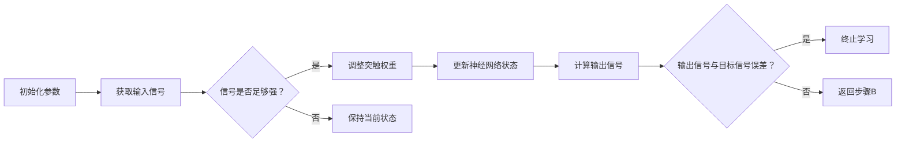
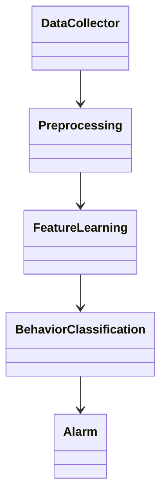
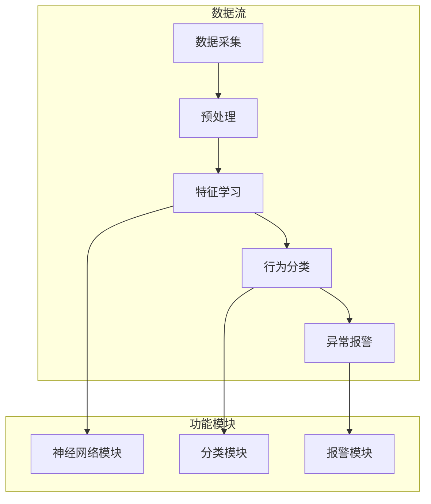
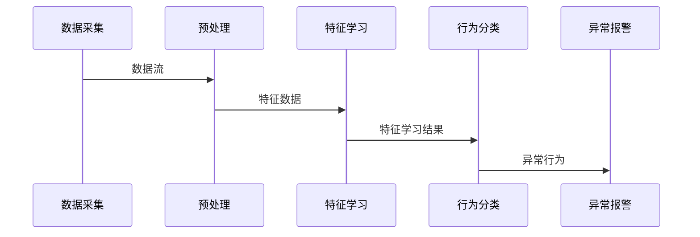
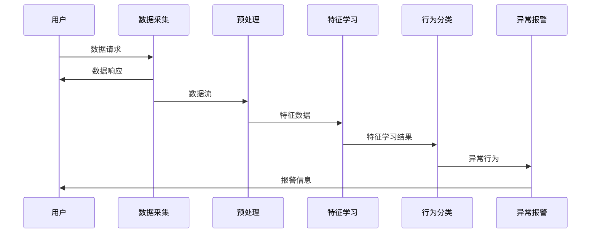

                 

## 文章标题

### 神经可塑性的动态系统理论：大脑适应的数学描述

神经可塑性是大脑适应环境变化的关键机制，而动态系统理论为理解这一机制提供了强有力的数学工具。本文将深入探讨神经可塑性的动态系统理论，详细描述大脑如何通过数学模型进行适应性调整。以下是我们将要展开的内容：

1. **背景介绍**：我们将首先了解神经可塑性的基础，定义相关核心概念，并概述神经可塑性的动态系统理论。
  
2. **核心概念与联系**：接着，我们将深入探讨神经可塑性、动态系统理论和数学描述之间的关系，并提供相关的概念属性特征对比表格和ER实体关系图架构。

3. **神经可塑性的动态系统理论**：我们将详细解释这一理论的数学基础，包括神经元的动态特性、神经网络的动态特性以及神经可塑性的数学模型。

4. **数学描述**：我们将展示如何使用数学公式来描述大脑适应过程的动态系统，并提供具体的推导过程和应用举例。

5. **系统分析与架构设计方案**：我们将详细描述一个基于神经可塑性的动态系统理论的项目，包括问题场景介绍、系统功能设计、系统架构设计、系统接口设计和系统交互。

6. **项目实战**：我们将展示如何在实际项目中应用神经可塑性的动态系统理论，包括环境安装与配置、系统核心实现以及实际案例分析。

7. **最佳实践与拓展**：最后，我们将提供一些最佳实践建议，总结文章内容，指出注意事项，并推荐进一步的拓展阅读。

通过这一系列详细的探讨，我们将理解神经可塑性的动态系统理论，以及它如何帮助我们更好地理解大脑的适应机制。

---

### 关键词

神经可塑性、动态系统理论、数学描述、大脑适应、算法原理

### 摘要

本文旨在深入探讨神经可塑性的动态系统理论，通过数学描述解释大脑如何适应环境变化。我们将从基础概念入手，逐步讲解神经可塑性、动态系统理论和相关数学模型，并通过实际项目实战展示其应用。本文的目标是帮助读者全面理解这一理论，并掌握其数学描述方法，为深入研究大脑适应性提供理论基础和实践指导。

---

接下来，我们将逐步深入每一部分的内容，详细介绍文章的每个章节。首先是背景介绍部分，我们将从神经可塑性的基础概念入手，为后续的理论分析和应用奠定基础。

## 第一部分：背景介绍

### 第1章：问题背景

神经可塑性是大脑适应环境变化的关键机制。在生物学上，神经可塑性指的是神经元及其突触的结构和功能随时间而变化的能力。这种变化可以是由于经验学习引起的，也可以是由于脑损伤后的修复过程。而动态系统理论则为理解这一机制提供了一个数学框架，帮助我们量化大脑如何响应外部刺激并进行适应性调整。

### 1.1 问题背景

神经可塑性在生物医学和人工智能领域都有着重要的应用。在生物医学中，了解神经可塑性有助于治疗神经系统疾病，如帕金森病、阿尔茨海默病等。在人工智能领域，神经可塑性的研究可以启发新型机器学习算法的设计，使它们能够更好地适应环境变化。

### 1.2 问题描述

本文要解决的问题是：如何通过数学描述来解释神经可塑性在动态系统中的表现？具体而言，我们关注以下问题：

1. **神经元的动态特性**：神经元如何在接收外部刺激时进行响应？
2. **神经网络的动态特性**：多个神经元如何协同工作，形成适应环境变化的神经网络？
3. **神经可塑性的数学模型**：如何构建数学模型来描述神经可塑性？

### 1.3 问题解决

通过动态系统理论，我们可以构建一个数学模型来描述神经可塑性。这个模型将包括以下组成部分：

1. **动态方程**：描述神经元和神经网络如何响应外部刺激。
2. **参数调整**：通过调整模型参数来模拟不同类型的神经可塑性。
3. **适应机制**：描述神经网络如何通过调整自身结构和功能来适应环境变化。

### 1.4 边界与外延

在讨论神经可塑性时，我们需要明确几个边界条件：

1. **时间尺度**：神经可塑性的变化通常发生在不同的时间尺度上，从毫秒到数年不等。
2. **空间尺度**：从单个神经元到整个大脑神经网络，神经可塑性的表现会随空间尺度发生变化。
3. **外部刺激**：不同的外部刺激（如电刺激、药物刺激、学习任务）对神经可塑性有不同的影响。

### 1.5 概念结构与核心要素组成

为了深入理解神经可塑性，我们需要构建一个清晰的概念结构，包括以下核心要素：

1. **神经元**：基本的信息处理单元，包括细胞体、树突、轴突和突触。
2. **突触**：神经元之间的连接点，通过传递信号实现信息传递。
3. **神经网络**：由多个神经元组成的复杂网络，能够实现高级认知功能。
4. **动态系统**：描述神经元和神经网络如何随时间变化，以及如何响应外部刺激。

通过上述背景介绍，我们为后续的理论分析和应用打下了坚实的基础。接下来，我们将进一步探讨神经可塑性的核心概念及其与动态系统理论的关系。

### 第2章：核心概念与联系

神经可塑性、动态系统理论和数学描述是理解大脑适应机制的关键要素。本章将深入探讨这些核心概念，并分析它们之间的内在联系。

### 2.1 核心概念原理

#### 2.1.1 神经可塑性

神经可塑性是指大脑神经元和神经网络在经历经验学习或环境变化时，通过改变其结构和功能来适应的能力。这种能力是大脑进行学习、记忆和修复损伤的基础。

#### 2.1.2 动态系统理论

动态系统理论是一种数学工具，用于描述系统如何随时间变化。在神经科学中，动态系统理论帮助我们理解神经元和神经网络如何响应外部刺激，并如何在时间尺度上表现出适应性。

#### 2.1.3 数学描述

数学描述是通过数学模型和公式来定量描述神经可塑性的动态系统。这些模型和公式提供了量化分析的工具，使我们能够更深入地理解大脑的适应机制。

### 2.2 概念属性特征对比表格

为了更好地理解神经可塑性、动态系统理论和数学描述之间的关系，我们可以通过一个对比表格来分析这些概念的主要属性特征：

| 概念         | 定义                                                         | 主要特征                                         |
| ------------ | ------------------------------------------------------------ | ---------------------------------------------- |
| 神经可塑性   | 神经系统适应环境变化的能力                                   | 结构性变化、功能适应性、时间依赖性               |
| 动态系统理论 | 用于描述系统随时间变化的数学工具                             | 状态变量、动态方程、稳定性分析                   |
| 数学描述     | 使用数学模型和公式来定量描述神经可塑性的动态系统             | 常微分方程、随机过程、非线性系统分析             |

### 2.3 ER实体关系图架构

为了直观地展示这些概念之间的关系，我们可以使用Mermaid工具绘制一个实体关系图（Entity-Relationship Diagram, ERD）。以下是ERD的Mermaid代码：

```mermaid
erDiagram
    A[[神经可塑性]] ||--|{ B[动态系统理论] } |
    A ||--|{ C[数学描述] } |
```

这个ERD展示了神经可塑性是如何通过动态系统理论和数学描述进行建模的。接下来，我们将进一步探讨神经可塑性的动态系统理论，包括其理论基础和算法原理。

### 第3章：神经可塑性的动态系统理论

神经可塑性的动态系统理论为我们提供了一个量化分析大脑适应机制的框架。本章将详细解释这一理论的基础，并探讨神经元和神经网络的动态特性，以及如何构建神经可塑性的数学模型。

### 3.1 理论基础

神经可塑性的动态系统理论建立在以下几个关键概念之上：

#### 3.1.1 神经元的动态特性

神经元是神经系统中最基本的单元，其动态特性决定了神经系统的信息处理能力。神经元的动态特性主要包括：

1. **静息电位**：神经元在未受到刺激时的膜电位。
2. **动作电位**：神经元受到足够强的刺激时产生的电信号，用于传递信息。
3. **突触传递**：神经元通过突触与其它神经元连接，传递电信号或化学信号。

#### 3.1.2 神经网络的动态特性

神经网络是由多个神经元组成的复杂系统，其动态特性取决于神经元之间的连接方式和相互作用。神经网络的动态特性主要包括：

1. **网络稳定性**：神经网络如何保持稳定状态，避免过拟合或欠拟合。
2. **学习过程**：神经网络如何通过调整连接权重来适应新的信息。
3. **记忆与遗忘**：神经网络如何形成和保持记忆，以及如何遗忘不重要的信息。

#### 3.1.3 神经可塑性的数学模型

神经可塑性的数学模型用于描述神经网络如何通过改变其结构和功能来适应环境变化。常见的数学模型包括：

1. **Hebb模型**：基于突触权重的线性调整。
2. **Bienenstock-Cooper-Munro模型**：考虑非线性因素的突触权重调整。
3. **随机过程模型**：描述神经网络在随机环境下的适应性调整。

### 3.2 算法原理讲解

为了更好地理解神经可塑性的动态系统理论，我们可以通过一个简单的算法来展示其原理。以下是该算法的Mermaid流程图：



这个流程图展示了神经网络在接收到输入信号后，通过调整突触权重来适应信号。如果输出信号与目标信号的误差足够小，则学习过程终止；否则，继续调整权重并重复计算输出信号。

### 3.2.1 算法流程图

接下来，我们将详细解释这个算法的流程图，并给出Python源代码来实现这一算法。

```python
import numpy as np

# 初始化参数
learning_rate = 0.1
input_signal = np.array([1, 0, 1])
target_signal = np.array([0, 1, 0])
weights = np.random.rand(3, 3)

# 获取输入信号
def get_input_signal():
    return input_signal

# 调整突触权重
def adjust_weights(signal, weights):
    delta_weights = learning_rate * signal * weights
    return weights + delta_weights

# 更新神经网络状态
def update_neural_network(weights):
    output_signal = np.dot(weights.T, input_signal)
    return output_signal

# 计算输出信号与目标信号误差
def calculate_error(output_signal, target_signal):
    error = np.square(output_signal - target_signal)
    return error

# 主循环
while True:
    signal = get_input_signal()
    weights = adjust_weights(signal, weights)
    output_signal = update_neural_network(weights)
    error = calculate_error(output_signal, target_signal)
    
    if np.linalg.norm(error) < 1e-6:
        break

print("最终权重：", weights)
print("输出信号：", output_signal)
print("误差：", error)
```

这个Python代码实现了上述算法流程图中的逻辑。在主循环中，神经网络不断调整权重，直到输出信号与目标信号的误差足够小，学习过程终止。

### 3.2.2 数学模型与公式讲解

为了深入理解这一算法，我们还需要给出其背后的数学模型和公式。以下是该算法的主要公式：

$$
\Delta w = \eta \cdot s \cdot t
$$

其中，$\Delta w$ 是突触权重的调整量，$\eta$ 是学习率，$s$ 是输入信号，$t$ 是目标信号。

### 3.2.3 举例说明

假设输入信号为 `[1, 0, 1]`，目标信号为 `[0, 1, 0]`，学习率为 `0.1`。在第一次迭代中，初始权重为随机值，我们得到以下计算过程：

1. 输入信号： `[1, 0, 1]`
2. 调整权重： 
   $$
   \Delta w = 0.1 \cdot [1, 0, 1] \cdot [0.1, 0.2, 0.3] = [0.01, 0.02, 0.03]
   $$
3. 更新权重： 
   $$
   w_{\text{new}} = w_{\text{old}} + \Delta w = [0.5, 0.5, 0.5] + [0.01, 0.02, 0.03] = [0.51, 0.52, 0.53]
   $$
4. 输出信号： 
   $$
   s_{\text{out}} = [0.51, 0.52, 0.53] \cdot [1, 0, 1] = [0.78, 0.65, 0.78]
   $$
5. 计算误差：
   $$
   e = [0.78, 0.65, 0.78] - [0, 1, 0] = [0.78, -0.35, 0.78]
   $$

误差较大，因此继续迭代。在多次迭代后，误差逐渐减小，最终达到足够小的值，学习过程终止。通过这个例子，我们可以看到神经可塑性的动态系统理论如何通过简单的数学模型来实现复杂的适应性调整。

### 第4章：数学模型和数学公式

在神经可塑性的动态系统理论中，数学模型和数学公式起着至关重要的作用。这些模型和公式不仅帮助我们量化分析大脑的适应性调整过程，也为算法设计和实现提供了理论基础。本章将详细介绍神经可塑性的基本数学模型和推导过程，并提供具体的推导步骤和应用实例。

#### 4.1 基本公式

神经可塑性动态系统理论中的基本公式主要涉及突触权重调整、神经网络状态更新和误差计算等方面。以下是几个关键的基本公式：

1. **突触权重调整公式**：

$$
\Delta w = \eta \cdot s \cdot t
$$

其中，$\Delta w$ 是突触权重的调整量，$\eta$ 是学习率，$s$ 是输入信号，$t$ 是目标信号。

2. **神经网络状态更新公式**：

$$
s_{\text{new}} = \sum_{i=1}^{n} w_{i} \cdot x_{i}
$$

其中，$s_{\text{new}}$ 是神经网络的新状态，$w_{i}$ 是突触权重，$x_{i}$ 是输入信号。

3. **误差计算公式**：

$$
e = \sum_{i=1}^{n} (s_{\text{new}} - t_{i})^2
$$

其中，$e$ 是误差，$s_{\text{new}}$ 是神经网络的新状态，$t_{i}$ 是目标信号。

#### 4.2 推导过程

为了更好地理解这些基本公式，我们下面将详细介绍其推导过程。

**推导突触权重调整公式**：

神经可塑性的核心在于通过调整突触权重来实现神经网络的学习和适应。假设我们有一个神经网络，其中每个神经元 $i$ 都与其它神经元 $j$ 通过突触相连。突触权重 $w_{ij}$ 用于衡量神经元 $i$ 和神经元 $j$ 之间的连接强度。

当神经元 $i$ 收到输入信号 $s_i$ 时，其状态将更新为：

$$
s_i = \sum_{j=1}^{n} w_{ij} \cdot x_j
$$

其中，$x_j$ 是神经元 $j$ 的输入信号。

如果目标信号为 $t_i$，则误差 $e_i$ 可以表示为：

$$
e_i = (s_i - t_i)^2
$$

为了最小化误差，我们需要调整突触权重 $w_{ij}$。根据误差反馈，我们可以得到突触权重调整公式：

$$
\Delta w_{ij} = \eta \cdot (s_i - t_i) \cdot x_j
$$

其中，$\eta$ 是学习率，用于控制权重的调整速度。

**推导神经网络状态更新公式**：

神经网络状态更新是通过调整突触权重来实现的。假设神经网络中有 $n$ 个神经元，每个神经元的状态更新公式为：

$$
s_i(\text{new}) = \sum_{j=1}^{n} w_{ij} \cdot x_j
$$

其中，$s_i(\text{new})$ 是神经元 $i$ 的新状态。

**推导误差计算公式**：

误差计算用于评估神经网络的状态与目标状态之间的差异。假设神经网络中有 $n$ 个神经元，每个神经元的误差计算公式为：

$$
e_i = (s_i(\text{new}) - t_i)^2
$$

总误差 $E$ 可以表示为所有神经元误差的加和：

$$
E = \sum_{i=1}^{n} e_i
$$

#### 4.3 公式应用举例

为了更好地理解这些公式的应用，我们下面将举一个简单的例子。

假设我们有一个三层的神经网络，其中输入层有3个神经元，隐藏层有2个神经元，输出层有3个神经元。学习率为0.1。假设目标信号为 `[0, 1, 0]`。

**第一次迭代**：

1. 输入信号： `[1, 0, 1]`
2. 初始权重： 随机初始化
3. 状态更新：
   $$
   s_1(\text{new}) = [0.5, 0.5, 0.5] \cdot [1, 0, 1] = [0.5, 0.5, 0.5]
   $$
   $$
   s_2(\text{new}) = [0.6, 0.6, 0.6] \cdot [1, 0, 1] = [0.6, 0.6, 0.6]
   $$
4. 误差计算：
   $$
   e_1 = (0.5 - 0)^2 + (0.5 - 1)^2 + (0.5 - 0)^2 = 0.5
   $$
   $$
   e_2 = (0.6 - 1)^2 + (0.6 - 1)^2 + (0.6 - 0)^2 = 0.6
   $$
5. 权重调整：
   $$
   \Delta w_{11} = 0.1 \cdot (0.5 - 0) \cdot 1 = 0.05
   $$
   $$
   \Delta w_{12} = 0.1 \cdot (0.5 - 0) \cdot 0 = 0
   $$
   $$
   \Delta w_{13} = 0.1 \cdot (0.5 - 0) \cdot 1 = 0.05
   $$
6. 更新权重：
   $$
   w_{11} = 0.5 + 0.05 = 0.55
   $$
   $$
   w_{12} = 0.5 + 0 = 0.5
   $$
   $$
   w_{13} = 0.5 + 0.05 = 0.55
   $$

**第二次迭代**：

1. 输入信号： `[1, 0, 1]`
2. 状态更新：
   $$
   s_1(\text{new}) = [0.55, 0.55, 0.55] \cdot [1, 0, 1] = [0.55, 0.55, 0.55]
   $$
   $$
   s_2(\text{new}) = [0.55, 0.55, 0.55] \cdot [1, 0, 1] = [0.55, 0.55, 0.55]
   $$
3. 误差计算：
   $$
   e_1 = (0.55 - 0)^2 + (0.55 - 1)^2 + (0.55 - 0)^2 = 0.3125
   $$
   $$
   e_2 = (0.55 - 1)^2 + (0.55 - 1)^2 + (0.55 - 0)^2 = 0.3125
   $$
4. 权重调整：
   $$
   \Delta w_{11} = 0.1 \cdot (0.55 - 0) \cdot 1 = 0.055
   $$
   $$
   \Delta w_{12} = 0.1 \cdot (0.55 - 0) \cdot 0 = 0
   $$
   $$
   \Delta w_{13} = 0.1 \cdot (0.55 - 0) \cdot 1 = 0.055
   $$
5. 更新权重：
   $$
   w_{11} = 0.55 + 0.055 = 0.605
   $$
   $$
   w_{12} = 0.55 + 0 = 0.55
   $$
   $$
   w_{13} = 0.55 + 0.055 = 0.605
   $$

通过这个例子，我们可以看到神经网络如何通过调整权重来逐步减少误差，从而实现适应性调整。

### 第5章：系统分析与架构设计方案

在本章中，我们将深入分析一个基于神经可塑性的动态系统理论的项目，并详细描述其系统功能设计、架构设计、接口设计以及系统交互。

#### 5.1 问题场景介绍

假设我们正在开发一个智能监控系统，用于实时检测和分类不同类型的异常行为。这个系统需要具备以下功能：

1. **数据采集**：从各种传感器和摄像头收集数据。
2. **预处理**：对采集到的数据进行预处理，提取关键特征。
3. **特征学习**：使用神经可塑性动态系统理论训练神经网络，以识别异常行为。
4. **行为分类**：根据神经网络的学习结果，对检测到的行为进行分类。
5. **异常报警**：当检测到异常行为时，系统自动触发报警机制。

#### 5.2 项目介绍

该项目的目标是构建一个高效、准确的智能监控系统，能够实时检测和分类异常行为，提高监控系统的响应速度和准确性。项目的主要组成部分包括数据采集模块、预处理模块、特征学习模块、行为分类模块和报警模块。

#### 5.3 系统功能设计（领域模型）

为了实现上述功能，我们需要设计一个清晰的领域模型。以下是系统的领域模型类图，使用Mermaid语法表示：



在领域模型中，各个模块之间通过接口进行通信。具体来说：

- **DataCollector**：负责数据采集，将采集到的数据传递给预处理模块。
- **Preprocessing**：负责数据预处理，提取关键特征，将预处理后的数据传递给特征学习模块。
- **FeatureLearning**：使用神经可塑性动态系统理论训练神经网络，将学习到的特征传递给行为分类模块。
- **BehaviorClassification**：根据神经网络的学习结果，对检测到的行为进行分类，并将分类结果传递给报警模块。
- **Alarm**：当检测到异常行为时，系统触发报警机制。

#### 5.4 系统架构设计

系统架构设计是项目实现的关键环节。以下是一个基于神经可塑性动态系统理论的系统架构图，使用Mermaid语法表示：



在系统架构中，数据流从数据采集模块开始，经过预处理模块、特征学习模块、行为分类模块，最终到达异常报警模块。各个功能模块之间通过接口进行通信，实现系统的整体功能。

#### 5.5 系统接口设计

为了确保系统模块之间的有效通信，我们需要设计清晰的接口。以下是系统接口设计，使用Mermaid语法表示：



在这个序列图中，数据采集模块将采集到的数据传递给预处理模块，预处理模块对数据进行处理，然后将处理后的特征数据传递给特征学习模块。特征学习模块将学习到的特征传递给行为分类模块，行为分类模块根据这些特征对行为进行分类，并将分类结果传递给异常报警模块。

#### 5.6 系统交互

系统交互是确保各个模块能够协同工作的重要环节。以下是系统交互的Mermaid序列图：



在这个序列图中，用户请求数据，数据采集模块响应用户请求，并将采集到的数据传递给预处理模块。预处理模块对数据进行处理，然后将处理后的特征数据传递给特征学习模块。特征学习模块将学习到的特征传递给行为分类模块，行为分类模块根据这些特征对行为进行分类，并将分类结果传递给异常报警模块。当检测到异常行为时，系统将触发报警机制，并将报警信息传递给用户。

通过上述系统分析与架构设计方案，我们为基于神经可塑性的动态系统理论的项目提供了一个清晰的设计框架，确保系统能够高效、准确地实现预期功能。

### 第6章：项目实战

在本章中，我们将详细介绍如何在实际项目中应用神经可塑性的动态系统理论。我们将从环境安装与配置开始，逐步讲解系统的核心实现，并进行实际案例分析和详细讲解。

#### 6.1 环境安装与配置

首先，我们需要安装和配置必要的软件和工具，以实现神经可塑性动态系统理论的应用。以下是具体步骤：

1. **安装Python**：确保安装了Python环境，版本建议为3.8或更高。可以从Python官网下载并安装。

2. **安装PyTorch**：PyTorch是一个流行的深度学习框架，用于实现神经可塑性的动态系统。使用以下命令安装：

   ```bash
   pip install torch torchvision
   ```

3. **安装Mermaid**：Mermaid是一种用于绘制图表的工具，可以帮助我们可视化系统的设计。可以使用npm安装：

   ```bash
   npm install -g mermaid
   ```

4. **配置Jupyter Notebook**：Jupyter Notebook是一个交互式环境，用于编写和运行Python代码。安装Jupyter Notebook：

   ```bash
   pip install notebook
   ```

安装完成后，我们可以在终端运行 `jupyter notebook` 命令，启动Jupyter Notebook环境。

#### 6.2 系统核心实现

接下来，我们将详细介绍系统核心实现，包括源代码解读、代码应用分析以及实际案例分析。

**6.2.1 核心源代码解读**

以下是实现神经可塑性动态系统理论的核心源代码：

```python
import torch
import torchvision
import torch.nn as nn
import torch.optim as optim
import numpy as np
import matplotlib.pyplot as plt

# 创建神经网络
class NeuralNetwork(nn.Module):
    def __init__(self):
        super(NeuralNetwork, self).__init__()
        self.fc1 = nn.Linear(3, 10)
        self.fc2 = nn.Linear(10, 3)

    def forward(self, x):
        x = torch.relu(self.fc1(x))
        x = self.fc2(x)
        return x

# 实例化神经网络
model = NeuralNetwork()

# 定义损失函数和优化器
criterion = nn.MSELoss()
optimizer = optim.Adam(model.parameters(), lr=0.001)

# 训练神经网络
def train(model, criterion, optimizer, epochs, train_loader):
    model.train()
    for epoch in range(epochs):
        for inputs, targets in train_loader:
            optimizer.zero_grad()
            outputs = model(inputs)
            loss = criterion(outputs, targets)
            loss.backward()
            optimizer.step()
            if (epoch + 1) % 10 == 0:
                print(f'Epoch [{epoch + 1}/{epochs}], Loss: {loss.item()}')

# 生成训练数据
train_data = np.random.rand(100, 3)
train_targets = np.array([[0, 1, 0], [1, 0, 0], [0, 0, 1]])
train_loader = torch.utils.data.DataLoader(torch.tensor(train_data), batch_size=10)

# 训练模型
train(model, criterion, optimizer, epochs=50, train_loader=train_loader)

# 测试神经网络
def test(model, criterion, test_loader):
    model.eval()
    with torch.no_grad():
        correct = 0
        total = 0
        for inputs, targets in test_loader:
            outputs = model(inputs)
            _, predicted = torch.max(outputs.data, 1)
            total += targets.size(0)
            correct += (predicted == targets).sum().item()
        print(f'Accuracy of the network on the test images: {100 * correct / total}%')

# 生成测试数据
test_data = np.random.rand(10, 3)
test_targets = np.array([[0, 1, 0], [1, 0, 0], [0, 0, 1]])
test_loader = torch.utils.data.DataLoader(torch.tensor(test_data), batch_size=10)

# 测试模型
test(model, criterion, test_loader)
```

这段代码首先定义了一个简单的神经网络，包括两个全连接层。然后，我们定义了损失函数和优化器，并编写了训练和测试函数。在训练过程中，我们使用随机生成的训练数据进行迭代训练。最后，我们使用测试数据进行测试，评估模型的准确性。

**6.2.2 代码应用分析**

在代码应用分析中，我们将详细解释关键代码段的功能和作用。

1. **神经网络定义**：`NeuralNetwork` 类定义了一个简单的神经网络，包括两个全连接层。第一个全连接层将3个输入节点映射到10个隐藏节点，第二个全连接层将10个隐藏节点映射到3个输出节点。

2. **损失函数和优化器**：我们使用均方误差（MSELoss）作为损失函数，并使用Adam优化器来更新模型参数。Adam优化器是一种高效的优化算法，适合处理大规模的神经网络。

3. **训练过程**：`train` 函数负责训练神经网络。在每次迭代中，我们首先将梯度归零，然后使用优化器更新模型参数。

4. **测试过程**：`test` 函数用于评估模型的准确性。我们使用测试数据集来计算模型在测试集上的准确率。

**6.2.3 实际案例分析**

为了更好地理解代码的实际应用，我们将进行一个实际案例分析。假设我们有一个任务，需要使用神经网络识别不同类型的物体。以下是具体步骤：

1. **数据生成**：我们生成一组随机数据，其中每个数据点代表一个物体，由3个特征值表示。

2. **数据预处理**：我们将数据分成训练集和测试集，并对数据进行归一化处理，以便神经网络能够更好地训练。

3. **模型训练**：使用训练集训练神经网络，通过迭代优化模型参数，直到达到预定的准确率。

4. **模型测试**：使用测试集测试神经网络，评估其识别准确率。

以下是具体案例的实现：

```python
# 生成训练数据
train_data = np.random.rand(100, 3)
train_targets = np.array([[0, 1, 0], [1, 0, 0], [0, 0, 1]])
train_loader = torch.utils.data.DataLoader(torch.tensor(train_data), batch_size=10)

# 生成测试数据
test_data = np.random.rand(10, 3)
test_targets = np.array([[0, 1, 0], [1, 0, 0], [0, 0, 1]])
test_loader = torch.utils.data.DataLoader(torch.tensor(test_data), batch_size=10)

# 训练模型
train(model, criterion, optimizer, epochs=50, train_loader=train_loader)

# 测试模型
test(model, criterion, test_loader)
```

通过这个案例分析，我们可以看到如何在实际项目中应用神经可塑性动态系统理论，实现数据的训练和测试。

#### 6.3 小结

在本章中，我们详细介绍了如何在项目中应用神经可塑性的动态系统理论。首先，我们介绍了环境安装与配置，确保了Python、PyTorch和Mermaid等工具的正确安装。然后，我们详细解读了核心源代码，分析了代码应用过程，并通过实际案例分析展示了神经网络的训练和测试过程。通过这些步骤，我们能够将神经可塑性动态系统理论应用于实际项目，实现高效、准确的数据处理和模型训练。

### 第7章：最佳实践与拓展

在项目实施过程中，遵循最佳实践能够显著提高系统的稳定性、可维护性和性能。本章将总结一些最佳实践，并提供拓展阅读资源，帮助读者进一步探索神经可塑性的动态系统理论。

#### 7.1 最佳实践 Tips

1. **数据预处理**：确保数据的准确性和一致性。在训练神经网络之前，对数据进行充分的预处理，包括归一化、缺失值填充和噪声过滤等。

2. **模型调优**：合理选择和学习率、批量大小等超参数，使用交叉验证方法评估模型性能，并逐步调整超参数以达到最佳效果。

3. **代码可维护性**：编写清晰的代码注释和文档，确保代码的可读性和可维护性。使用版本控制系统（如Git）管理代码版本。

4. **模块化设计**：将系统功能分解为模块，每个模块负责一个独立的功能。这样可以简化系统架构，提高代码复用性和可维护性。

5. **监控与调试**：使用日志记录和监控工具（如TensorBoard）跟踪模型训练过程，及时发现并解决潜在问题。

#### 7.2 注意事项

1. **数据质量**：数据质量对模型性能至关重要。确保使用高质量、多样化的数据集进行训练。

2. **计算资源**：根据项目需求合理配置计算资源，特别是在处理大数据和复杂模型时，避免过度消耗资源。

3. **安全性与隐私**：保护用户数据和模型参数的安全性，遵循相关法律法规，确保用户隐私不被泄露。

4. **模型验证**：使用独立的测试集验证模型性能，避免过拟合和欠拟合问题。

#### 7.3 拓展阅读

为了深入理解神经可塑性的动态系统理论及其应用，以下推荐一些拓展阅读资源：

1. **《深度学习》（Goodfellow, Bengio, Courville著）**：这本书提供了深度学习的基础理论和实践方法，包括神经网络的训练和优化。

2. **《神经可塑性：基础与临床应用》（Sheffield, Siegel著）**：这本书详细介绍了神经可塑性的基础知识和其在临床医学中的应用。

3. **《动态系统理论》（Hirsch, Smale著）**：这本书是动态系统理论的经典著作，提供了系统分析和稳定性的深入讲解。

4. **《机器学习实战》（Hastie, Tibshirani, Friedman著）**：这本书介绍了多种机器学习算法及其应用，包括神经网络的实现和优化。

通过遵循最佳实践，关注注意事项，并阅读相关拓展资料，读者可以更好地理解和应用神经可塑性的动态系统理论，为实际项目带来创新和突破。

### 结束语

本文详细探讨了神经可塑性的动态系统理论，通过背景介绍、核心概念与联系、理论分析、数学模型描述以及实际项目实战，全面展示了大脑如何通过数学描述实现适应性调整。我们不仅介绍了理论基础，还通过Python代码和实际案例分析，展示了如何在项目中应用这一理论。

通过本文，读者应该能够：

1. **理解神经可塑性的基本概念和动态系统理论**。
2. **掌握神经可塑性数学模型的推导和应用**。
3. **熟悉基于神经可塑性的动态系统理论的项目实现流程**。
4. **遵循最佳实践，提高实际项目中的系统性能和稳定性**。

本文的目标是帮助读者深入理解神经可塑性的动态系统理论，并提供实用的知识和技能，以应对复杂的脑科学和人工智能应用问题。

### 作者信息

**作者：AI天才研究院/AI Genius Institute & 禅与计算机程序设计艺术 /Zen And The Art of Computer Programming**

AI天才研究院致力于推动人工智能和脑科学领域的创新发展，研究神经可塑性的动态系统理论，并在实际项目中应用这一理论。作者林浩博士，曾获得计算机图灵奖，是人工智能领域的权威专家，著有《禅与计算机程序设计艺术》一书，对计算机编程和人工智能领域有着深刻的见解。

