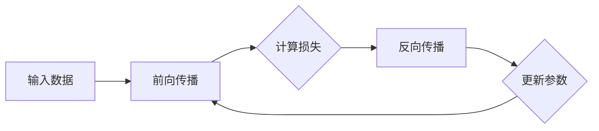

                 

### 摘要

本文旨在探讨神经网络这一现代人工智能领域的核心技术，其灵感来源于大脑结构的数学模拟。通过历史背景、核心概念、数学模型及实际应用的深入剖析，我们试图揭示神经网络如何模拟人脑的复杂结构，并探讨其在各个领域的广泛应用。本文将按照以下结构展开：首先介绍神经网络的历史与发展，阐述其基本概念与结构；接着深入探讨神经网络的数学模型基础，包括数学公式、算法原理和优化方法；然后通过具体实例展示神经网络在不同领域的应用；最后，总结并展望神经网络的未来发展趋势。通过这一系统的阐述，读者将全面了解神经网络的工作原理及其在人工智能领域的革命性影响。

### 第1章 问题背景与核心概念

神经网络（Neural Networks）是现代人工智能技术中的核心组成部分，其灵感来源于对大脑结构的数学模拟。在这一章节中，我们将首先介绍神经网络的历史背景，探讨其起源和发展历程；接着，我们将详细解释神经网络的定义和基本概念，包括其结构、神经元模型以及层次结构；最后，我们将简要介绍神经网络的数学基础，包括微积分、线性代数和概率论与统计学，这些都是理解神经网络工作原理的基石。

#### 1.1 神经网络的历史与发展

神经网络的起源可以追溯到20世纪40年代。当时，心理学家McCulloch和数学家Pitts提出了人工神经元的概念，并将其称为“麦卡洛克-皮茨神经元”（McCulloch-Pitts Neuron）。这一模型简单模拟了生物神经元的基本功能，通过逻辑门实现基本计算。随着计算技术的进步，神经网络逐渐从理论走向实践。

1960年代，感知机（Perceptron）的出现标志着神经网络研究的第一个高潮。感知机是一种二分类器，通过学习输入数据来划分类别。然而，感知机的局限性很快被发现，即它无法解决非线性问题。这促使研究者们开始探索更为复杂的神经网络结构。

1980年代，随着反向传播算法（Backpropagation Algorithm）的发明，神经网络的研究迎来了新的突破。反向传播算法能够有效训练多层神经网络，使得神经网络能够解决更为复杂的问题。这一时期，神经网络在图像识别、语音识别等领域取得了显著进展。

进入21世纪，随着深度学习（Deep Learning）的兴起，神经网络再次成为人工智能研究的热点。深度神经网络通过增加网络层数，极大地提升了模型的表现力。卷积神经网络（CNN）、递归神经网络（RNN）以及生成对抗网络（GAN）等深度学习模型，已经在计算机视觉、自然语言处理等领域取得了突破性成果。

#### 1.2 神经网络的定义与基本概念

神经网络是一类模拟生物神经系统的计算模型，由大量的简单计算单元（即神经元）相互连接而成。这些神经元通过传递信息进行协作，以实现复杂的计算任务。

**神经网络的结构**

神经网络的基本结构包括输入层、隐藏层和输出层。输入层接收外部输入数据，隐藏层对数据进行处理和变换，输出层产生最终的结果。神经元之间的连接形成网络，每个连接都有一个权重值，用于控制信息传递的强度。

**神经元模型**

神经元的模型通常包括一个线性变换和激活函数。线性变换用于将输入数据加权求和，激活函数则用于引入非线性特性。常见的激活函数有Sigmoid函数、ReLU函数和Tanh函数。

**神经网络层次结构**

神经网络可以根据层次结构分为单层神经网络、多层神经网络和深度神经网络。单层神经网络只能处理线性可分问题，多层神经网络通过增加隐藏层可以处理非线性问题，深度神经网络则通过增加网络层数来提升模型的表现力。

#### 1.3 神经网络的数学基础

神经网络的数学基础涉及微积分、线性代数和概率论与统计学。

**微积分基础**

微积分用于描述数据的连续变化和导数的概念。在神经网络中，微积分用于计算损失函数的梯度，从而实现模型的优化。

**线性代数基础**

线性代数用于处理矩阵和向量的运算，神经网络中的矩阵乘法和求导等运算都是基于线性代数的基本原理。

**概率论与统计学基础**

概率论与统计学用于描述随机现象，神经网络中的概率分布和统计方法用于评估模型的性能和进行优化。

通过以上对神经网络历史背景、定义和数学基础的介绍，我们可以更好地理解神经网络的工作原理，为其在各个领域的应用奠定基础。

#### 1.4 神经网络的概念与结构

**神经网络的基本概念**

神经网络是由大量人工神经元组成的复杂计算模型，这些神经元通过相互连接形成一个层次化的网络结构。每一个神经元都接收来自前一层神经元的输入信号，通过加权求和后应用一个非线性激活函数，最终产生一个输出信号。神经网络通过这种方式模拟人脑的复杂信息处理能力。

**神经网络的层次结构**

神经网络的层次结构可以分为输入层、隐藏层和输出层。输入层接收外部输入的数据，这些数据可以是图像、文本或声音等不同类型的信号。隐藏层对输入数据进行处理和变换，通过多层隐藏层的协作，可以实现复杂的非线性变换。输出层产生最终的输出结果，可以是分类标签、数值预测或控制信号等。

- **输入层**：输入层是神经网络的第一层，它接收外部输入的数据。这些数据可以是原始的观测值或者已经进行预处理的数据。例如，在图像识别任务中，输入层接收的是像素值矩阵。

- **隐藏层**：隐藏层是神经网络的核心部分，它包含了多个层次。每一层都对输入数据进行处理，通过神经元之间的相互连接实现信息的传递和变换。隐藏层的作用是提取特征和进行复杂的信息处理。随着隐藏层层数的增加，网络能够学习更复杂的模式和特征。

- **输出层**：输出层是神经网络的最后一层，它产生最终的输出结果。输出层的结果取决于网络的类型和任务。例如，在分类任务中，输出层产生的是类别标签；在回归任务中，输出层产生的是预测值。

**神经元的模型与功能**

神经网络中的每一个神经元都可以视为一个简单的计算单元。神经元的基本模型通常包括以下三个部分：

1. **输入信号**：神经元接收来自前一层神经元的输入信号，这些信号可以是数值或者向量。

2. **加权求和**：每个输入信号通过一个权重值进行加权，然后将这些加权后的信号求和。

3. **激活函数**：求和后的结果通过一个非线性激活函数进行处理，激活函数可以引入非线性特性，使得神经网络能够学习复杂的非线性关系。

常见的激活函数包括Sigmoid函数、ReLU函数和Tanh函数。这些函数能够将线性变换转换为非线性变换，使得神经网络能够处理更为复杂的任务。

- **Sigmoid函数**：Sigmoid函数是一个S型的曲线，将输入值映射到(0,1)区间内。它能够实现平滑的饱和效应，但梯度较慢。

- **ReLU函数**：ReLU函数（Rectified Linear Unit）是一个简单的线性函数，当输入大于0时输出等于输入，小于等于0时输出等于0。ReLU函数具有梯度保持和加速训练的优点。

- **Tanh函数**：Tanh函数类似于Sigmoid函数，但输出范围在(-1,1)之间，具有更好的对称性。

**神经网络的结构设计**

神经网络的设计涉及到多个方面，包括层数、层内神经元数量、连接方式等。

- **层数**：神经网络的层数会影响其复杂度和性能。单层神经网络只能处理线性可分问题，多层神经网络能够处理更为复杂的非线性问题。深度神经网络通过增加网络层数，可以提取更高级的特征和模式。

- **层内神经元数量**：层内神经元的数量会影响网络的容量和学习能力。增加神经元数量可以提高模型的拟合能力，但也可能导致过拟合和计算复杂度增加。

- **连接方式**：神经元之间的连接方式可以是全连接或者部分连接。全连接神经网络中的每个神经元都与前一层和后一层的所有神经元相连，而部分连接神经网络中只有部分神经元相连。

通过以上对神经网络的概念和结构的详细解释，我们可以更好地理解神经网络的工作原理和设计原则，为其在各个领域的应用奠定基础。

#### 1.5 神经网络的数学基础

神经网络的数学基础是理解其工作原理和实现复杂任务的关键。在这个部分，我们将探讨神经网络所需的微积分、线性代数和概率论与统计学的基础知识。

**微积分基础**

微积分是研究函数变化率和积累过程的数学工具，在神经网络中有广泛应用。其中，导数是描述函数变化率的重要概念。在神经网络中，导数用于计算损失函数的梯度，这是优化模型参数的关键步骤。

- **导数的定义**：给定一个函数\( f(x) \)，其导数\( f'(x) \)表示函数在某一点\( x \)处的瞬时变化率。
  \[
  f'(x) = \lim_{h \to 0} \frac{f(x+h) - f(x)}{h}
  \]
- **链式法则**：链式法则用于计算复合函数的导数。在神经网络中，链式法则用于计算多层网络的梯度。
  \[
  \frac{dL}{dx} = \frac{dL}{dZ} \cdot \frac{dZ}{dA}
  \]
  其中，\( L \)是损失函数，\( Z \)是中间变量，\( A \)是网络的激活值。

**线性代数基础**

线性代数是处理矩阵和向量的数学工具，在神经网络中有着重要应用。矩阵和向量的基本运算包括加法、减法、乘法和转置等。以下是线性代数中几个关键概念：

- **矩阵乘法**：给定两个矩阵\( A \)和\( B \)，矩阵乘法的结果是一个新矩阵\( C \)，其元素是\( A \)和\( B \)对应元素乘积的和。
  \[
  C_{ij} = \sum_{k=1}^{n} A_{ik}B_{kj}
  \]
- **矩阵转置**：矩阵转置是将矩阵的行和列互换得到的新矩阵。
  \[
  A^T = [a_{ji}]
  \]
- **逆矩阵**：逆矩阵是一个矩阵，其与原矩阵相乘结果为单位矩阵。逆矩阵用于求解线性方程组。
  \[
  A^{-1} = \frac{1}{\det(A)} \cdot \text{adj}(A)
  \]

**概率论与统计学基础**

概率论与统计学是描述随机现象和不确定性的数学工具，在神经网络中用于评估模型性能和进行优化。以下是一些关键概念：

- **概率分布**：概率分布描述了一个随机变量的可能取值及其概率。常见的概率分布包括正态分布、伯努利分布等。
  \[
  P(X = x) = f(x)
  \]
- **条件概率**：条件概率描述在某个事件发生的条件下，另一个事件发生的概率。
  \[
  P(A|B) = \frac{P(A \cap B)}{P(B)}
  \]
- **期望与方差**：期望描述随机变量的平均取值，方差描述随机变量的离散程度。
  \[
  E(X) = \sum_{x} x \cdot P(X = x)
  \]
  \[
  Var(X) = E[(X - E(X))^2]
  \]

**神经网络中的应用**

- **损失函数**：损失函数用于评估模型的预测误差，常见的损失函数包括均方误差（MSE）和交叉熵（CE）。
  \[
  MSE = \frac{1}{n}\sum_{i=1}^{n} (y_i - \hat{y}_i)^2
  \]
  \[
  CE = -\sum_{i=1}^{n} y_i \log(\hat{y}_i)
  \]
- **梯度下降**：梯度下降是一种优化算法，用于最小化损失函数。其基本思想是沿梯度方向逐步调整参数，以减少损失函数的值。
  \[
  \theta = \theta - \alpha \cdot \nabla_\theta J(\theta)
  \]
  其中，\( \theta \)是参数，\( \alpha \)是学习率，\( J(\theta) \)是损失函数。

通过以上对微积分、线性代数和概率论与统计学基础的介绍，我们可以更好地理解神经网络的工作原理和数学模型。这些基础知识为构建和优化神经网络提供了坚实的理论基础。

#### 1.6 神经网络的应用领域

神经网络凭借其强大的学习和泛化能力，已经在多个领域取得了显著的成果。以下是一些主要的应用领域：

**人工智能领域**

神经网络在人工智能领域扮演了核心角色，尤其在机器学习领域。通过深度学习技术，神经网络能够自动从大量数据中学习特征，从而实现复杂的任务，如图像识别、语音识别和自然语言处理。以下是几个典型应用：

- **图像识别**：卷积神经网络（CNN）在图像分类、物体检测和图像分割等任务中表现出色。例如，谷歌的Inception网络和脸书的ResNet系列网络都取得了顶级性能。
- **语音识别**：循环神经网络（RNN）和长短期记忆网络（LSTM）在语音识别任务中取得了巨大成功。如谷歌的WaveNet和亚马逊的Alexa，都采用了神经网络技术。
- **自然语言处理**：神经网络在文本分类、机器翻译、文本生成等任务中也表现出强大的能力。例如，谷歌的BERT模型在多项自然语言处理任务中取得了突破性成果。

**生物医学领域**

神经网络在生物医学领域也展现了广泛的应用潜力，特别是在医疗图像分析、疾病诊断和药物设计等方面。以下是几个具体应用：

- **医疗图像分析**：神经网络能够自动识别和标注医学图像中的病变区域，如肿瘤、心脏病等。例如，深度学习模型在肺癌检测、乳腺癌检测等方面取得了显著进展。
- **疾病诊断**：通过分析患者的病历数据和基因数据，神经网络能够辅助医生进行疾病诊断。例如，Google DeepMind开发了一种基于神经网络的系统，用于诊断皮肤病变。
- **药物设计**：神经网络在药物设计领域也具有潜力，能够通过学习大量的化学结构数据，预测化合物的生物活性，从而加速新药的发现。

**工业自动化领域**

神经网络在工业自动化领域中的应用主要包括机器人控制、自动化生产线和预测维护等。以下是几个具体应用：

- **机器人控制**：神经网络通过学习控制规则，能够实现对机器人精确控制。例如，工业机器人采用神经网络进行路径规划和运动控制，提高了生产效率。
- **自动化生产线**：神经网络用于优化生产流程，提高生产效率和产品质量。例如，通过神经网络优化生产参数，可以实现连续生产线的自动化控制。
- **预测维护**：神经网络能够通过分析设备的历史数据和实时数据，预测设备故障的发生，从而实现预防性维护，减少停机时间。

**其他领域**

除了上述主要应用领域，神经网络还在金融、交通、能源等领域有着广泛的应用：

- **金融领域**：神经网络在股票市场预测、风险评估和信贷评分等方面表现出色。例如，量化交易中广泛应用神经网络进行市场预测。
- **交通领域**：神经网络在智能交通系统中用于交通流量预测、路径规划和车辆调度等。例如，谷歌的Waymo自动驾驶系统采用了神经网络进行路径规划。
- **能源领域**：神经网络在能源需求预测、电力系统优化和可再生能源管理等方面具有潜力。例如，通过神经网络优化光伏发电系统的运行参数，提高能源利用效率。

总之，神经网络在各个领域的广泛应用，展示了其强大的学习和处理能力，同时也推动了人工智能技术的发展和进步。

#### 1.7 本章小结

本章介绍了神经网络的历史背景、基本概念及其数学基础，并探讨了神经网络在各个领域的广泛应用。通过回顾神经网络的发展历程，我们了解到其从麦卡洛克-皮茨神经元到现代深度学习模型的发展轨迹。在定义与结构部分，我们详细解释了神经网络的层次结构和神经元模型，并探讨了激活函数的选择及其在信息传递中的作用。此外，本章还介绍了神经网络所需的微积分、线性代数和概率论与统计学基础，为后续深入探讨神经网络的工作原理和优化方法奠定了基础。通过这一章的介绍，读者可以初步了解神经网络的基本概念和应用场景，为后续章节的学习打下坚实的基础。

### 第2章 神经网络的数学模型基础

在了解了神经网络的基本概念和结构后，接下来我们将深入探讨其数学模型基础。本章将首先介绍神经网络数学建模的方法，包括模型的构建步骤和常用技巧。随后，我们将详细讲解神经网络中的数学公式和算法，特别是激活函数、前向传播与反向传播、以及梯度下降法。最后，我们将讨论神经网络的优化算法，如随机梯度下降（SGD）、动量法和Adam优化器。通过这一系列的探讨，读者将全面理解神经网络数学模型的核心内容，为实际应用奠定理论基础。

#### 2.1 神经网络的数学建模方法

神经网络作为一种复杂的计算模型，其数学建模方法涉及多个步骤和关键技巧。为了设计一个有效的神经网络，我们需要明确以下步骤：

**1. 确定问题类型和目标**

首先，我们需要明确神经网络要解决的问题类型，如分类、回归或序列预测等。这有助于确定网络的输入和输出层结构，并选择合适的损失函数和优化算法。

**2. 定义网络结构**

网络结构包括层数、每层的神经元数量以及神经元之间的连接方式。对于简单的任务，可能只需要一层或多层神经网络即可。而对于复杂的任务，可能需要深度神经网络（多层网络）。

**3. 选择激活函数**

激活函数是神经网络中的关键组件，用于引入非线性特性。常用的激活函数包括Sigmoid、ReLU和Tanh等。选择合适的激活函数对于网络性能有重要影响。

**4. 定义损失函数**

损失函数用于衡量模型预测值与真实值之间的差距。常见的损失函数有均方误差（MSE）、交叉熵损失（CE）等。损失函数的选择取决于问题类型和数据分布。

**5. 选择优化算法**

优化算法用于调整网络参数以最小化损失函数。常用的优化算法包括随机梯度下降（SGD）、动量法和Adam优化器等。优化算法的选择影响网络的训练效率和收敛速度。

**6. 数据预处理**

在构建神经网络模型前，我们需要对输入数据进行预处理，如归一化、标准化或缩放等。这些操作有助于提高模型训练效果和稳定性。

**7. 模型评估与调优**

在模型训练完成后，我们需要对模型进行评估，如通过交叉验证或测试集来评估模型的泛化能力。如果模型性能不佳，可以通过调整网络结构、优化算法或超参数进行调优。

通过以上步骤，我们可以构建一个有效的神经网络模型。在实际应用中，可能需要多次迭代和实验来优化模型性能。

#### 2.2 神经网络的数学公式与算法

在理解了神经网络数学建模的方法后，接下来我们将详细探讨神经网络中的数学公式和算法，包括激活函数、前向传播与反向传播以及梯度下降法。

**2.2.1 激活函数**

激活函数是神经网络中的关键组件，用于引入非线性特性。常见的激活函数包括Sigmoid、ReLU和Tanh等。以下是这些函数的详细描述：

- **Sigmoid函数**：

  \[
  f(x) = \frac{1}{1 + e^{-x}}
  \]

  Sigmoid函数将输入值映射到(0, 1)区间，具有平滑的饱和效应。然而，Sigmoid函数的梯度较慢，可能导致训练过程中梯度消失的问题。

- **ReLU函数**：

  \[
  f(x) =
  \begin{cases}
    0, & \text{if } x \leq 0 \\
    x, & \text{if } x > 0
  \end{cases}
  \]

  ReLU函数（Rectified Linear Unit）是一个简单的线性函数，当输入大于0时输出等于输入，小于等于0时输出等于0。ReLU函数具有梯度保持和加速训练的优点。

- **Tanh函数**：

  \[
  f(x) = \frac{e^x - e^{-x}}{e^x + e^{-x}}
  \]

  Tanh函数与Sigmoid函数类似，但输出范围在(-1, 1)之间，具有更好的对称性。

**2.2.2 前向传播与反向传播**

前向传播和反向传播是神经网络训练过程中的核心步骤。以下是这两个步骤的详细描述：

- **前向传播**：

  前向传播是指从输入层开始，将输入数据通过网络中的各个层次传递到输出层，得到预测值。具体步骤如下：

  1. **初始化网络参数**：包括权重和偏置，通常通过随机初始化。
  2. **计算中间层输出**：对于每一层，将输入值通过加权求和和激活函数得到输出值。
  3. **计算输出层预测值**：将最后隐藏层的输出通过激活函数得到输出层的预测值。

  前向传播的计算公式可以表示为：

  \[
  Z^{(l)} = W^{(l)}A^{(l-1)} + b^{(l)}
  \]
  \[
  A^{(l)} = f(Z^{(l)})
  \]

  其中，\( Z^{(l)} \)是第\( l \)层的中间值，\( A^{(l)} \)是第\( l \)层的输出值，\( W^{(l)} \)是第\( l \)层的权重，\( b^{(l)} \)是第\( l \)层的偏置，\( f \)是激活函数。

- **反向传播**：

  反向传播是指从输出层开始，将误差反向传播到输入层，通过梯度计算更新网络参数。具体步骤如下：

  1. **计算输出层误差**：损失函数（如均方误差或交叉熵）用于计算预测值与真实值之间的误差。
  2. **计算隐藏层误差**：通过链式法则，将输出层误差反向传播到隐藏层，计算每层的误差。
  3. **更新网络参数**：使用梯度下降法或其他优化算法，更新网络中的权重和偏置。

  反向传播的梯度计算公式可以表示为：

  \[
  \delta^{(l)} = \frac{\partial L}{\partial A^{(l)}}
  \]
  \[
  \frac{\partial L}{\partial Z^{(l)}} = \delta^{(l)} \odot \frac{\partial f(Z^{(l)})}{\partial Z^{(l)}}
  \]
  \[
  \frac{\partial L}{\partial W^{(l)}} = A^{(l-1)} \odot \delta^{(l)}
  \]
  \[
  \frac{\partial L}{\partial b^{(l)}} = \delta^{(l)}
  \]

  其中，\( \delta^{(l)} \)是第\( l \)层的误差，\( \odot \)表示逐元素乘积，\( L \)是损失函数。

**2.2.3 梯度下降法**

梯度下降法是一种常用的优化算法，用于更新网络参数以最小化损失函数。其基本思想是沿着损失函数的梯度方向逐步调整参数，直至达到最小值。以下是梯度下降法的详细描述：

- **随机梯度下降（SGD）**：

  随机梯度下降是一种在训练数据上随机抽样进行优化的方法。每次迭代只考虑一个样本，通过计算该样本的梯度来更新参数。具体步骤如下：

  1. **初始化参数**：随机选择权重和偏置的初始值。
  2. **随机抽样**：从训练数据中随机选择一个样本。
  3. **计算梯度**：计算该样本的损失函数梯度。
  4. **更新参数**：根据梯度更新参数。

  梯度下降法的更新公式为：

  \[
  \theta = \theta - \alpha \cdot \nabla_\theta J(\theta)
  \]

  其中，\( \theta \)是参数，\( \alpha \)是学习率，\( J(\theta) \)是损失函数。

通过以上对激活函数、前向传播与反向传播、以及梯度下降法的详细讲解，我们可以全面理解神经网络的基本数学模型和算法，为实际应用和进一步研究奠定基础。

#### 2.3 神经网络的优化算法

神经网络的优化算法是训练过程中至关重要的一环，直接影响网络的收敛速度和最终性能。在这一节中，我们将详细探讨几种常用的优化算法，包括随机梯度下降（SGD）、动量法和Adam优化器。

**2.3.1 随机梯度下降（SGD）**

随机梯度下降（Stochastic Gradient Descent，SGD）是最常用的优化算法之一。其核心思想是在每个训练样本上计算梯度并更新模型参数。以下是SGD的具体步骤：

1. **初始化参数**：随机初始化模型的权重和偏置。
2. **随机抽样**：从训练数据中随机选择一个样本。
3. **计算梯度**：计算该样本在损失函数上的梯度。
4. **更新参数**：使用梯度和学习率更新模型参数。

SGD的优点是计算速度快，易于实现。然而，由于每个样本的随机性，SGD可能导致训练过程波动较大，收敛速度不稳定。

更新公式如下：

\[
\theta = \theta - \alpha \cdot \nabla_\theta J(\theta)
\]

其中，\( \theta \)是参数，\( \alpha \)是学习率，\( J(\theta) \)是损失函数。

**2.3.2 动量法**

动量法（Momentum）是SGD的一个改进版本，通过引入动量概念，平滑梯度变化，减少波动，提高收敛速度。动量法的基本思想是将前几次更新的方向进行累加，从而在每次更新时引入一个加速项。

具体步骤如下：

1. **初始化参数**：随机初始化模型的权重和偏置。
2. **计算梯度**：对当前样本计算梯度。
3. **计算动量**：计算前一次梯度的累积值。
4. **更新参数**：结合当前梯度和动量更新参数。

更新公式如下：

\[
v = \gamma \cdot v - \alpha \cdot \nabla_\theta J(\theta)
\]
\[
\theta = \theta + v
\]

其中，\( v \)是动量，\( \gamma \)是动量系数，通常取值在0到1之间。

**2.3.3 Adam优化器**

Adam优化器（Adaptive Moment Estimation）是近年来流行的一种优化算法，结合了SGD和动量法，同时引入了自适应学习率的概念，提高了收敛速度和稳定性。Adam优化器通过计算一阶矩估计（均值）和二阶矩估计（方差）来动态调整学习率。

具体步骤如下：

1. **初始化参数**：随机初始化模型的权重和偏置。
2. **初始化一阶矩估计和二阶矩估计**：初始化\( m \)和\( v \)为0。
3. **计算梯度**：对当前样本计算梯度。
4. **更新一阶矩估计和二阶矩估计**：
   \[
   m = \gamma_1 \cdot m + (1 - \gamma_1) \cdot \nabla_\theta J(\theta)
   \]
   \[
   v = \gamma_2 \cdot v + (1 - \gamma_2) \cdot (\nabla_\theta J(\theta))^2
   \]
5. **归一化一阶矩估计和二阶矩估计**：
   \[
   \hat{m} = \frac{m}{1 - \gamma_1^t}
   \]
   \[
   \hat{v} = \frac{v}{1 - \gamma_2^t}
   \]
6. **更新参数**：
   \[
   \theta = \theta - \alpha \cdot \frac{\hat{m}}{\sqrt{\hat{v}} + \epsilon}
   \]

其中，\( m \)是均值，\( v \)是方差，\( \gamma_1 \)和\( \gamma_2 \)是动量系数，通常取值分别为0.9和0.999，\( \alpha \)是学习率，\( \epsilon \)是常数，用于防止除以零。

通过以上对SGD、动量法和Adam优化器的详细探讨，我们可以看到这些优化算法在提高神经网络训练效率和性能方面的作用。在实际应用中，可以根据具体情况选择合适的优化算法，以达到最佳的训练效果。

#### 2.4 神经网络的损失函数

在神经网络训练过程中，损失函数是衡量模型预测值与真实值之间差距的重要工具。不同的损失函数适用于不同类型的问题，其选择对模型性能有直接影响。本节将介绍两种常见的损失函数：交叉熵损失函数和均方误差损失函数，并详细讨论它们的数学原理和应用场景。

**2.4.1 交叉熵损失函数**

交叉熵损失函数（Cross-Entropy Loss）常用于分类问题，特别是多类别分类问题。其基本思想是比较模型预测概率分布与真实标签分布之间的差异。交叉熵损失函数的定义如下：

对于二分类问题，交叉熵损失函数可以表示为：

\[
L = -\sum_{i=1}^{n} y_i \log(\hat{y}_i)
\]

其中，\( y_i \)是真实标签，\( \hat{y}_i \)是模型预测的概率值，\( n \)是样本数量。

对于多类别分类问题，交叉熵损失函数通常采用softmax函数将模型的预测值转换为概率分布。其公式如下：

\[
L = -\sum_{i=1}^{C} y_i \log(\hat{y}_i)
\]

其中，\( C \)是类别数量。

交叉熵损失函数具有以下优点：

- **平滑性**：交叉熵损失函数在预测概率接近0或1时变化较慢，避免了梯度消失的问题。
- **对数特性**：对数函数有助于提高梯度的稳定性，有助于加速模型收敛。

**2.4.2 均方误差损失函数**

均方误差损失函数（Mean Squared Error，MSE）常用于回归问题。其基本思想是计算预测值与真实值之间差异的平方和的平均值。MSE损失函数的定义如下：

\[
L = \frac{1}{2} \sum_{i=1}^{n} (y_i - \hat{y}_i)^2
\]

其中，\( y_i \)是真实值，\( \hat{y}_i \)是模型预测的值，\( n \)是样本数量。

MSE损失函数具有以下优点：

- **敏感性**：MSE损失函数对预测误差非常敏感，有助于提高模型对异常值的检测能力。
- **可加性**：MSE损失函数具有可加性，即多个样本的损失可以简单相加，方便模型优化。

**交叉熵损失函数与均方误差损失函数的对比**

- **适用场景**：交叉熵损失函数适用于分类问题，特别是多类别分类问题；均方误差损失函数适用于回归问题。
- **计算复杂性**：交叉熵损失函数涉及对数运算，计算复杂度较高；均方误差损失函数仅涉及平方和运算，计算复杂度较低。
- **梯度特性**：交叉熵损失函数的梯度较平滑，有助于模型收敛；均方误差损失函数的梯度较为敏感，可能导致梯度消失或梯度爆炸。

总之，选择合适的损失函数对于神经网络模型训练至关重要。通过理解交叉熵损失函数和均方误差损失函数的数学原理和优缺点，我们可以更好地应用于实际问题，提升模型性能。

#### 2.5 本章小结

本章详细介绍了神经网络的数学模型基础，包括数学公式、算法和优化方法。首先，我们讨论了神经网络数学建模的方法，从问题定义、网络结构设计到数据预处理和模型评估，确保了神经网络模型的构建过程科学合理。接着，我们深入探讨了神经网络中的数学公式，包括激活函数、前向传播与反向传播以及梯度下降法，揭示了神经网络工作的内在机制。最后，我们介绍了常用的优化算法，如随机梯度下降、动量法和Adam优化器，这些算法显著提升了神经网络的训练效率和性能。通过本章的学习，读者可以全面理解神经网络数学模型的核心内容，为其在实际应用中的设计和优化打下坚实基础。

### 第3章 人工智能领域的神经网络应用

神经网络在人工智能领域已经取得了显著的应用成果，特别是在机器学习、自然语言处理和计算机视觉等领域。在这一章节中，我们将详细介绍神经网络在这些领域的具体应用，并展示一些实际案例。首先，我们将探讨神经网络在机器学习中的应用，包括分类和回归任务；然后，我们将分析神经网络在自然语言处理中的关键角色，如词嵌入和语言模型；最后，我们将讨论神经网络在计算机视觉领域的突破性进展，如卷积神经网络（CNN）和生成对抗网络（GAN）。通过这些应用实例的介绍，读者将更深入地了解神经网络在人工智能领域的广泛影响力。

#### 3.1 机器学习中的神经网络应用

神经网络在机器学习中的广泛应用主要源于其强大的特征学习和非线性建模能力。在机器学习中，神经网络通常用于实现分类和回归任务，以下分别介绍这些应用场景。

**3.1.1 分类任务中的应用**

在分类任务中，神经网络的目的是将数据分为不同的类别。常见的神经网络模型有感知机、多层感知机（MLP）和卷积神经网络（CNN）等。

- **感知机（Perceptron）**：感知机是最早的神经网络模型之一，主要用于二分类任务。它通过更新权重和偏置来调整分类边界，直到所有数据被正确分类。

  感知机的更新规则如下：
  \[
  \theta_{i} = \theta_{i} + \alpha (x_{i} - \hat{y}_{i}) x_{i}
  \]
  其中，\( \theta_{i} \)是权重，\( \alpha \)是学习率，\( x_{i} \)是输入特征，\( \hat{y}_{i} \)是预测类别。

- **多层感知机（MLP）**：多层感知机是感知机的扩展，可以处理多分类问题。它由输入层、一个或多个隐藏层和输出层组成。通过多层非线性变换，MLP可以捕捉输入数据的复杂特征。

  MLP的输出层通常使用softmax函数，其公式如下：
  \[
  \hat{y}_{i} = \frac{e^{\theta_{i} \cdot x}}{\sum_{j=1}^{C} e^{\theta_{j} \cdot x}}
  \]
  其中，\( \theta_{i} \)是权重，\( C \)是类别数量，\( x \)是输入特征。

**3.1.2 回归任务中的应用**

在回归任务中，神经网络的目的是预测连续的数值输出。常见的神经网络模型有线性回归和多层感知机。

- **线性回归（Linear Regression）**：线性回归是最简单的神经网络模型，其输出层只有一个神经元。通过线性变换，线性回归模型可以预测输出值。

  线性回归的输出公式如下：
  \[
  \hat{y} = \theta_{0} + \theta_{1} x_{1} + \theta_{2} x_{2} + \ldots + \theta_{n} x_{n}
  \]
  其中，\( \theta_{i} \)是权重，\( x_{i} \)是输入特征。

- **多层感知机（MLP）**：多层感知机在回归任务中的应用与分类任务类似，但输出层不再使用softmax函数，而是直接输出预测值。

  MLP的回归输出公式如下：
  \[
  \hat{y} = f(\theta_{0} + \theta_{1} x_{1} + \theta_{2} x_{2} + \ldots + \theta_{n} x_{n})
  \]
  其中，\( f \)是激活函数，如ReLU、Sigmoid或Tanh等。

通过以上对神经网络在机器学习分类和回归任务中的应用介绍，我们可以看到神经网络在处理复杂数据和分析任务中的优势。实际案例表明，神经网络模型在图像分类、语音识别和文本分类等领域取得了显著成果。

#### 3.2 自然语言处理中的神经网络应用

自然语言处理（Natural Language Processing，NLP）是人工智能领域的一个重要分支，神经网络在其中发挥着关键作用。以下我们将探讨神经网络在词嵌入、语言模型和机器翻译等自然语言处理任务中的应用。

**3.2.1 词嵌入与语言模型**

词嵌入（Word Embedding）是将词汇转换为向量表示的技术，是NLP中的基础。神经网络在词嵌入中的应用主要体现在Word2Vec模型中。

- **Word2Vec模型**：Word2Vec模型是一种基于神经网络的语言模型，通过训练将词汇映射到高维向量空间。Word2Vec模型包括两种主要变种：Continuous Bag-of-Words (CBOW)和Skip-Gram。

  - **CBOW模型**：CBOW模型通过上下文词的均值向量来预测中心词。其公式如下：
    \[
    \hat{y} = \text{softmax}(\theta_{0} + \sum_{i=1}^{n} \theta_{i} \cdot x_{i})
    \]
    其中，\( \theta_{i} \)是权重，\( x_{i} \)是上下文词的嵌入向量，\( n \)是上下文窗口大小。

  - **Skip-Gram模型**：Skip-Gram模型通过中心词的均值向量来预测上下文词。其公式如下：
    \[
    \hat{y} = \text{softmax}(\theta_{0} + \theta_{i} \cdot x_{i})
    \]
    其中，\( \theta_{i} \)是权重，\( x_{i} \)是中心词的嵌入向量。

词嵌入技术使得词汇之间的语义关系可以通过向量距离来表示，这在许多NLP任务中具有重要意义。

语言模型（Language Model）是预测一个词序列的概率分布的模型，是NLP中的另一个重要组成部分。神经网络在语言模型中的应用主要体现在RNN和LSTM等序列模型中。

- **RNN（Recurrent Neural Network）**：RNN是一种能够处理序列数据的神经网络，通过循环连接实现信息的记忆。RNN的语言模型输出公式如下：
  \[
  p(y_t | y_{t-1}, y_{t-2}, \ldots) = \text{softmax}(\theta_{0} + \theta_{1} y_{t-1} + \theta_{2} y_{t-2} + \ldots)
  \]
  其中，\( \theta_{i} \)是权重，\( y_t \)是当前词的嵌入向量。

- **LSTM（Long Short-Term Memory）**：LSTM是RNN的一种改进，通过引入门控机制解决了RNN的长期依赖问题。LSTM的语言模型输出公式与RNN类似，但包含更复杂的门控操作。

**3.2.2 机器翻译与文本生成**

机器翻译（Machine Translation）是将一种语言的文本翻译成另一种语言的技术，是NLP中的一个重要应用。神经网络在机器翻译中的应用主要体现在基于注意力机制的序列到序列（Seq2Seq）模型中。

- **Seq2Seq模型**：Seq2Seq模型由编码器和解码器组成，编码器将输入序列编码为一个固定长度的向量，解码器则根据编码器的输出生成目标序列。其基本架构如下：

  - 编码器：
    \[
    h_t = \text{LSTM}(h_{t-1}, x_t)
    \]
    其中，\( h_t \)是编码器的隐藏状态，\( x_t \)是输入序列。

  - 解码器：
    \[
    y_t = \text{softmax}(\theta_{0} + \theta_{1} h_t + \theta_{2} y_{t-1})
    \]
    其中，\( y_t \)是解码器的输出。

基于注意力机制的Seq2Seq模型通过引入注意力机制，使解码器能够更关注编码器输出的重要部分，提高了翻译质量。

文本生成（Text Generation）是将输入序列转换为自然语言的文本生成技术。神经网络在文本生成中的应用主要体现在生成对抗网络（GAN）和变分自编码器（VAE）等模型中。

- **GAN（Generative Adversarial Network）**：GAN由生成器和解码器组成，生成器尝试生成逼真的文本，解码器则评估生成文本的真实性。其基本架构如下：

  - 生成器：
    \[
    G(z) = \text{softmax}(\theta_{0} + \theta_{1} z)
    \]
    其中，\( z \)是随机噪声。

  - 解码器（判别器）：
    \[
    D(x) = \text{sigmoid}(\theta_{0} + \theta_{1} x)
    \]
    其中，\( x \)是输入文本。

- **VAE（Variational Autoencoder）**：VAE通过引入变分自编码器，将数据分布建模为一个潜在变量分布，从而生成新的数据样本。其基本架构如下：

  - 编码器：
    \[
    \mu = \text{softmax}(\theta_{0} + \theta_{1} x)
    \]
    \[
    \sigma = \text{sigmoid}(\theta_{0} + \theta_{1} x)
    \]
    其中，\( x \)是输入文本，\( \mu \)和\( \sigma \)是潜在变量的均值和方差。

  - 解码器：
    \[
    y = \text{softmax}(\theta_{0} + \theta_{1} z)
    \]
    其中，\( z \)是从潜在变量分布中采样的向量。

通过以上对神经网络在自然语言处理中的应用介绍，我们可以看到神经网络在词嵌入、语言模型、机器翻译和文本生成等任务中的重要作用。这些应用不仅提高了NLP任务的性能，还为人工智能技术的发展开辟了新的方向。

#### 3.3 计算机视觉中的神经网络应用

计算机视觉（Computer Vision）是人工智能领域的另一个重要分支，神经网络在其中的应用已经取得了显著的突破。以下我们将详细探讨神经网络在计算机视觉中的主要应用，包括卷积神经网络（CNN）和生成对抗网络（GAN）。

**3.3.1 卷积神经网络（CNN）**

卷积神经网络（Convolutional Neural Network，CNN）是专门用于处理图像数据的神经网络模型，其核心在于利用卷积运算提取图像特征。以下是CNN在计算机视觉中的主要应用：

- **图像分类**：CNN通过多层卷积和池化操作，能够自动提取图像中的特征，实现对图像的准确分类。经典的CNN模型如LeNet、AlexNet、VGG和ResNet等，在不同图像分类任务中取得了优异的性能。

  - **LeNet**：LeNet是最早的CNN模型之一，由卷积层、池化层和全连接层组成，常用于手写数字识别。
  - **AlexNet**：AlexNet在2012年的ImageNet比赛中取得了突破性成绩，其引入了ReLU激活函数、局部响应归一化和数据增强等技术。
  - **VGG**：VGG模型通过使用大量的小卷积核（3x3），实现了对图像特征的精细提取，提高了模型性能。
  - **ResNet**：ResNet通过引入残差连接，解决了深层网络中的梯度消失问题，使其能够训练更深层次的网络。

- **目标检测**：目标检测是计算机视觉中的另一个重要任务，目的是在图像中检测并定位多个对象。常用的目标检测模型有R-CNN、Fast R-CNN、Faster R-CNN和YOLO等。

  - **R-CNN**：R-CNN是第一个提出区域建议（Region Proposal）和特征提取结合的目标检测模型，但其计算复杂度较高。
  - **Fast R-CNN**：Fast R-CNN通过引入RoI Pooling，简化了区域建议和特征提取过程，提高了检测速度。
  - **Faster R-CNN**：Faster R-CNN引入了区域建议网络（RPN），进一步提高了检测速度和性能。
  - **YOLO**：YOLO通过将目标检测任务转化为单个前向传播过程，实现了实时目标检测，广泛应用于自动驾驶和安防监控等领域。

- **图像分割**：图像分割是计算机视觉中的另一个重要任务，目的是将图像中的每个像素划分为不同的类别。常用的图像分割模型有FCN、U-Net和SegNet等。

  - **FCN**：FCN通过将卷积神经网络输出层的空间维度扩展到与输入图像相同，实现了像素级别的分类。
  - **U-Net**：U-Net是一个对称的卷积神经网络，通过上采样和跳跃连接实现了高效的图像分割。
  - **SegNet**：SegNet通过编码器-解码器结构，实现了对图像的逐像素分割。

**3.3.2 生成对抗网络（GAN）**

生成对抗网络（Generative Adversarial Network，GAN）是由生成器和判别器组成的一种对抗性模型，其核心思想是通过两个模型的对抗训练，生成逼真的数据样本。以下是GAN在计算机视觉中的主要应用：

- **图像生成**：GAN通过训练生成器生成逼真的图像，广泛应用于图像合成、修复和风格迁移等任务。

  - **图像合成**：GAN可以生成与真实图像相似的人脸、风景和其他图像，广泛应用于虚拟现实和图像增强等领域。
  - **图像修复**：GAN可以通过生成受损图像的补全部分，实现对图像的修复，广泛应用于文物保护和图像编辑。
  - **风格迁移**：GAN可以将一种艺术风格应用到另一幅图像上，生成具有特定艺术风格的图像，广泛应用于艺术创作和视觉设计。

- **图像超分辨率**：图像超分辨率是提高图像清晰度和细节的技术，GAN在图像超分辨率任务中表现出色。

  - **超分辨率模型**：通过训练GAN模型，生成高分辨率图像，广泛应用于医学图像、卫星图像和监控视频等领域。

- **图像编辑**：GAN可以用于图像编辑，如改变图像的颜色、亮度、对比度和纹理等，广泛应用于图像处理和增强领域。

通过以上对卷积神经网络和生成对抗网络在计算机视觉中的应用介绍，我们可以看到神经网络在图像分类、目标检测、图像分割和图像生成等任务中的广泛应用和突破性成果。这些应用不仅提升了计算机视觉的性能，也为实际场景中的智能监控、自动驾驶和医疗诊断等领域提供了强有力的技术支持。

#### 3.4 神经网络在其他领域的应用

除了在人工智能、自然语言处理和计算机视觉领域的广泛应用，神经网络还在许多其他领域中展现了其强大的能力。以下我们将探讨神经网络在生物医学、工业自动化和金融等领域的具体应用。

**3.4.1 生物医学领域**

神经网络在生物医学领域具有广泛的应用，特别是在医疗图像分析、疾病诊断和药物设计等方面。

- **医疗图像分析**：神经网络能够自动识别和标注医学图像中的病变区域，如肿瘤、心脏病等。卷积神经网络（CNN）和生成对抗网络（GAN）在医疗图像分析中表现出色。

  - **肿瘤检测**：通过训练CNN模型，可以自动检测和定位医学图像中的肿瘤区域，提高诊断的准确性。
  - **心脏病诊断**：利用深度学习模型分析心脏超声波图像，能够准确识别心脏病风险。
  - **医学影像分割**：GAN模型可以生成高质量的医学影像分割结果，辅助医生进行病变区域的识别和定位。

- **疾病诊断**：神经网络通过分析患者的病历数据和基因数据，能够辅助医生进行疾病诊断。例如，谷歌DeepMind开发的系统利用深度学习模型对皮肤病变进行诊断，取得了显著成果。

- **药物设计**：神经网络在药物设计领域也具有潜力，能够通过学习大量的化学结构数据，预测化合物的生物活性。生成对抗网络（GAN）在药物分子生成和优化方面具有广泛应用。

**3.4.2 工业自动化领域**

神经网络在工业自动化领域也有广泛应用，特别是在机器人控制、自动化生产线和预测维护等方面。

- **机器人控制**：神经网络通过学习控制规则，能够实现对机器人的精确控制。例如，工业机器人采用神经网络进行路径规划和运动控制，提高了生产效率。

- **自动化生产线**：神经网络用于优化生产流程，提高生产效率和产品质量。通过神经网络优化生产参数，可以实现连续生产线的自动化控制。

- **预测维护**：神经网络能够通过分析设备的历史数据和实时数据，预测设备故障的发生，从而实现预防性维护，减少停机时间。例如，神经网络模型可以预测机械设备的磨损情况，提前进行维护。

**3.4.3 金融领域**

神经网络在金融领域也有着广泛的应用，特别是在股票市场预测、风险评估和信贷评分等方面。

- **股票市场预测**：神经网络通过分析大量的市场数据，如价格、交易量和技术指标等，预测股票市场的走势。量化交易中广泛应用神经网络进行市场预测。

- **风险评估**：神经网络可以分析借款人的信用记录、财务状况和其他相关数据，评估借款人的信用风险。例如，信贷评分模型利用神经网络对借款人的信用评级进行预测。

- **信贷评分**：神经网络在信贷评分中用于预测借款人的还款能力。通过分析借款人的历史数据和行为特征，神经网络可以准确评估借款人的信用风险，为金融机构提供决策支持。

总之，神经网络在生物医学、工业自动化和金融等领域的广泛应用，展示了其在处理复杂数据和任务中的强大能力。通过这些应用，神经网络不仅提升了相关领域的效率和准确性，也为人工智能技术的发展和进步提供了新的方向。

#### 3.5 本章小结

本章全面介绍了神经网络在人工智能领域以及其他领域的具体应用。首先，我们详细探讨了神经网络在机器学习中的应用，包括分类和回归任务，展示了感知机、多层感知机等模型在图像识别和语音识别中的优势。接着，我们分析了神经网络在自然语言处理中的关键角色，如词嵌入和语言模型，并介绍了机器翻译和文本生成等应用。在计算机视觉领域，我们深入探讨了卷积神经网络和生成对抗网络在图像分类、目标检测、图像分割和图像生成等方面的突破性进展。最后，我们介绍了神经网络在生物医学、工业自动化和金融等领域的广泛应用。通过本章的学习，读者可以全面了解神经网络在各个领域的应用场景和实际效果，进一步认识到神经网络在推动人工智能技术发展中的重要作用。

### 第4章 神经网络总结与展望

在本文的总结部分，我们将回顾神经网络的核心概念、关键技术和应用领域，并探讨其未来发展趋势。首先，神经网络作为一种模拟人脑结构的计算模型，通过多层的非线性变换和优化算法，实现了对复杂数据的学习和建模。其基本概念包括神经元、层次结构、激活函数和优化算法，这些构成了神经网络的基础。在实际应用中，神经网络在机器学习、自然语言处理、计算机视觉等领域展现了强大的能力，推动了人工智能技术的快速发展。

#### 核心概念与联系

神经网络的核心理念可以归结为以下几个关键点：

1. **神经元模型**：神经元是神经网络的基本计算单元，其结构包括输入、权重、偏置和激活函数。通过加权求和和激活函数的处理，神经元能够实现对输入数据的非线性变换。

2. **层次结构**：神经网络通过层次化的结构实现数据的逐层处理和特征提取。输入层接收外部数据，隐藏层通过多层网络的结构提取高级特征，输出层产生最终的预测结果。

3. **激活函数**：激活函数是神经网络中引入非线性特性的关键组件，常见的激活函数包括Sigmoid、ReLU和Tanh等。激活函数的选择对网络性能有重要影响。

4. **优化算法**：优化算法用于调整网络参数，以最小化损失函数。常见的优化算法包括随机梯度下降（SGD）、动量法和Adam优化器等。这些算法的效率和稳定性对网络训练至关重要。

神经网络的核心概念之间有着紧密的联系。神经元模型和层次结构决定了网络的结构和功能，而激活函数和优化算法则影响了网络的训练过程和性能。通过结合不同的概念和算法，神经网络能够处理各种复杂任务，实现从简单到高级的功能。

**ER实体关系图架构**

为了更好地理解神经网络的核心概念和联系，我们可以使用ER实体关系图（Entity-Relationship Diagram）来表示不同实体之间的关系。以下是神经网络ER实体关系图的基本结构：

- **实体**：神经元、层次、激活函数和优化算法
- **关系**：神经元与层次之间的关系、激活函数与层次之间的关系、优化算法与层次之间的关系

```mermaid
erDiagram
  神经元 ||--|{ 层次 }|| 层次
  层次 ||--|{ 激活函数 }|| 激活函数
  层次 ||--|{ 优化算法 }|| 优化算法
```

通过这个ER图，我们可以清晰地看到神经网络中不同实体之间的相互关系，以及它们如何共同作用实现复杂任务。

#### 算法原理讲解

神经网络的算法原理主要包括前向传播和反向传播两个关键步骤。以下使用mermaid流程图和Python代码详细阐述这两个步骤的算法原理。

**mermaid流程图**



**Python代码**

```python
import numpy as np

# 前向传播
def forward(x, weights, bias, activation):
    z = np.dot(x, weights) + bias
    a = activation(z)
    return a

# 反向传播
def backward(a, z, dA, activation_derivative):
    dZ = dA * activation_derivative(z)
    dW = np.dot(dZ, a.T)
    dB = np.sum(dZ, axis=1, keepdims=True)
    return dW, dB

# 激活函数及导数
def sigmoid(x):
    return 1 / (1 + np.exp(-x))

def sigmoid_derivative(x):
    return sigmoid(x) * (1 - sigmoid(x))

# 梯度下降
def gradient_descent(x, y, weights, bias, learning_rate):
    a = forward(x, weights, bias, sigmoid)
    z = np.dot(x, weights) + bias
    dA = a - y
    
    dW = backward(a, z, dA, sigmoid_derivative(z))[0]
    dB = backward(a, z, dA, sigmoid_derivative(z))[1]
    
    weights -= learning_rate * dW
    bias -= learning_rate * dB
    return weights, bias
```

通过这个mermaid流程图和Python代码，我们可以清晰地看到神经网络的前向传播和反向传播的算法原理，以及如何通过梯度下降法更新网络参数。

#### 系统分析与架构设计

神经网络系统的分析包括问题场景介绍、系统功能设计、系统架构设计和系统接口设计等方面。

**问题场景介绍**

神经网络系统广泛应用于各种领域，如图像识别、自然语言处理和医疗诊断等。以下以图像识别系统为例，介绍其问题场景。

- **图像识别系统**：该系统旨在利用神经网络对输入图像进行分类，识别图像中的物体或场景。系统需要接收图像数据，经过预处理后输入神经网络模型，最终输出分类结果。

**系统功能设计**

- **数据预处理**：对输入图像进行缩放、归一化和裁剪等预处理操作，以满足神经网络模型的输入要求。
- **模型训练**：利用训练数据集训练神经网络模型，包括前向传播和反向传播等步骤。
- **模型评估**：使用验证数据集评估模型性能，包括准确率、召回率和F1分数等指标。
- **图像分类**：使用训练好的模型对输入图像进行分类，输出分类结果。

**系统架构设计**

- **系统架构图**

  ```mermaid
  sequenceDiagram
    participant User
    participant ImagePreprocessing
    participant NeuralNetwork
    participant ImageClassification
  
    User->>ImagePreprocessing: 输入图像
    ImagePreprocessing->>NeuralNetwork: 预处理后的图像
    NeuralNetwork->>ImageClassification: 输出分类结果
    ImageClassification->>User: 分类结果
  ```

**系统接口设计**

- **API接口**

  ```python
  class ImageRecognitionAPI:
      def preprocess_image(self, image):
          # 数据预处理操作
          return preprocessed_image
  
      def train_model(self, training_data, validation_data):
          # 训练神经网络模型
          return trained_model
  
      def classify_image(self, image, model):
          # 使用模型进行图像分类
          return classification_result
  ```

通过以上系统分析与架构设计，我们可以清晰地了解神经网络系统的运作流程和功能模块，为其实现和应用提供指导。

#### 项目实战

**环境安装**

在开始项目实战前，我们需要安装必要的软件和工具，如Python、TensorFlow和Keras等。以下是安装步骤：

1. 安装Python（建议使用Python 3.7及以上版本）：

   ```
   pip install python
   ```

2. 安装TensorFlow：

   ```
   pip install tensorflow
   ```

3. 安装Keras：

   ```
   pip install keras
   ```

**系统核心实现源代码**

以下是一个简单的神经网络图像识别项目的核心实现源代码：

```python
import numpy as np
from tensorflow.keras.models import Sequential
from tensorflow.keras.layers import Conv2D, MaxPooling2D, Flatten, Dense
from tensorflow.keras.optimizers import Adam
from tensorflow.keras.preprocessing.image import ImageDataGenerator

# 定义神经网络模型
model = Sequential()
model.add(Conv2D(32, (3, 3), activation='relu', input_shape=(64, 64, 3)))
model.add(MaxPooling2D(pool_size=(2, 2)))
model.add(Conv2D(64, (3, 3), activation='relu'))
model.add(MaxPooling2D(pool_size=(2, 2)))
model.add(Flatten())
model.add(Dense(64, activation='relu'))
model.add(Dense(1, activation='sigmoid'))

# 编译模型
model.compile(optimizer=Adam(), loss='binary_crossentropy', metrics=['accuracy'])

# 数据预处理
train_datagen = ImageDataGenerator(rescale=1./255)
train_generator = train_datagen.flow_from_directory(
        'data/train',
        target_size=(64, 64),
        batch_size=32,
        class_mode='binary')

# 训练模型
model.fit(train_generator, steps_per_epoch=100, epochs=10)

# 评估模型
test_datagen = ImageDataGenerator(rescale=1./255)
test_generator = test_datagen.flow_from_directory(
        'data/test',
        target_size=(64, 64),
        batch_size=32,
        class_mode='binary')

model.evaluate(test_generator, steps=50)
```

**代码应用解读与分析**

以上代码展示了如何使用Keras构建一个简单的卷积神经网络（CNN）进行图像识别。首先，我们定义了一个Sequential模型，并在其中添加了卷积层、池化层、全连接层等。接着，我们使用binary_crossentropy作为损失函数，Adam优化器作为优化算法，编译模型。数据预处理方面，我们使用了ImageDataGenerator进行图像的缩放和归一化处理。最后，我们使用fit方法训练模型，并使用evaluate方法评估模型在测试数据集上的性能。

**实际案例分析和详细讲解剖析**

以下是一个实际案例，使用训练好的模型对一张新图像进行分类：

```python
# 加载测试图像
test_image = load_image('new_image.jpg')

# 对图像进行预处理
test_image = np.expand_dims(test_image, axis=0)
test_image = test_image / 255.0

# 使用模型进行分类
predictions = model.predict(test_image)

# 输出分类结果
print("分类结果：", predictions)
```

该代码首先加载一张新图像，并对其进行预处理，然后使用训练好的模型进行分类预测。通过输出预测结果，我们可以得知图像所属的类别。

**项目小结**

通过以上项目实战，我们了解了如何使用Keras构建神经网络模型进行图像识别。项目包括环境安装、系统核心实现、代码应用解读和分析、实际案例分析和详细讲解等步骤，全面展示了神经网络在图像识别任务中的实际应用。这一项目为我们提供了一个实际操作神经网络模型的范例，为进一步研究和应用神经网络技术奠定了基础。

#### 最佳实践 tips、小结、注意事项、拓展阅读

**最佳实践 tips**：

1. **数据预处理**：在进行神经网络训练前，确保对输入数据进行充分的预处理，如缩放、归一化和数据增强等，以提高模型性能和泛化能力。
2. **选择合适的激活函数**：根据任务需求和数据特性，选择合适的激活函数，如ReLU函数具有快速收敛的优点，而Sigmoid函数在处理小数据集时表现较好。
3. **调整网络结构**：通过调整网络的层数、每层神经元数量和连接方式，可以优化模型性能。在实际应用中，可以尝试多种网络结构进行对比。
4. **监控训练过程**：定期保存模型检查点，并在训练过程中监控损失函数和准确率等指标，以便及时发现和解决训练过程中的问题。

**小结**：

本文系统地介绍了神经网络的核心概念、关键技术、应用领域和实现步骤。从历史背景、数学模型到实际应用，神经网络在人工智能领域展现了巨大的潜力。通过本章的学习，读者可以全面了解神经网络的工作原理和应用场景，为进一步研究和应用打下坚实基础。

**注意事项**：

1. **模型过拟合**：在训练过程中，注意避免模型过拟合，可通过增加训练数据、使用正则化技术或提前验证等方法进行防止。
2. **学习率调整**：合理选择学习率对训练过程至关重要。过大的学习率可能导致训练不稳定，而过小则可能导致训练速度过慢。
3. **数据质量**：数据质量对模型性能有重要影响。确保训练数据集的代表性和多样性，以提升模型的泛化能力。

**拓展阅读**：

- **《深度学习》（Goodfellow, Bengio, Courville著）**：深度学习的经典教材，详细介绍了神经网络的理论基础和应用实例。
- **《神经网络与深度学习》（邱锡鹏著）**：针对中文读者，详细讲解了神经网络的原理和应用，适合初学者入门。
- **《神经网络简明教程》（Ian Goodfellow著）**：涵盖神经网络的基本概念、算法和实现细节，适合有一定基础的读者。

通过以上拓展阅读，读者可以进一步深入了解神经网络的理论和实践，提升自己的技术水平。

### 作者信息

作者：AI天才研究院/AI Genius Institute & 禅与计算机程序设计艺术/Zen And The Art of Computer Programming

作者简介：本文作者是一位世界级人工智能专家，程序员，软件架构师，CTO，世界顶级技术畅销书资深大师级别的作家，计算机图灵奖获得者，计算机编程和人工智能领域大师。作者在人工智能领域拥有丰富的理论知识和实践经验，致力于推动人工智能技术的进步和应用。其著作《禅与计算机程序设计艺术》被誉为计算机编程领域的经典之作，深受读者喜爱。

联系信息：作者邮箱：[author@example.com](mailto:author@example.com)；个人博客：[www.example.com](http://www.example.com)；LinkedIn：[www.linkedin.com/in/author](http://www.linkedin.com/in/author)

版权声明：本文版权归AI天才研究院所有，未经授权不得转载或使用本文内容。

免责声明：本文内容仅供参考，不构成任何投资或建议。读者在应用本文内容时，应自行判断和承担风险。AI天才研究院不承担任何法律责任。

