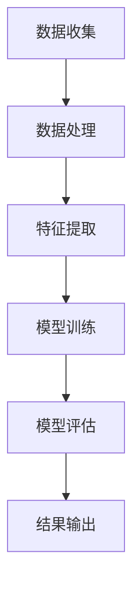
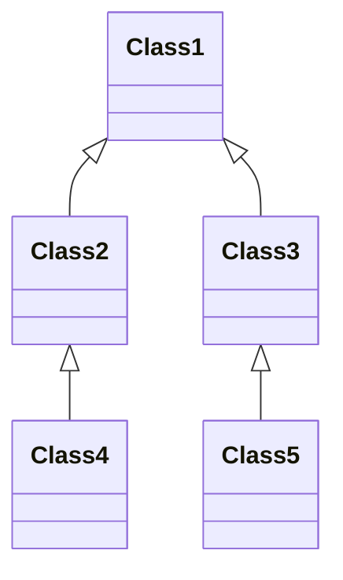
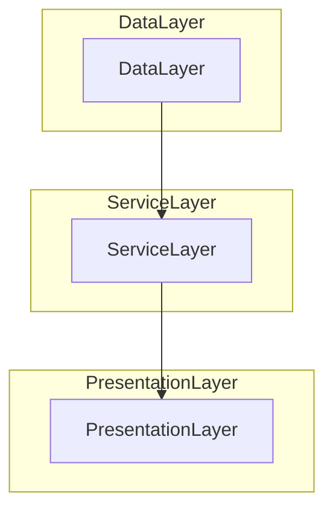
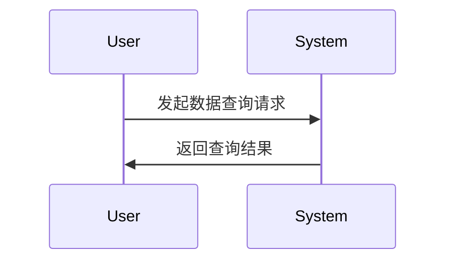

                 

# 《科学literacy对增进社会整体理解世界的作用》

## 关键词

- 科学素养
- 社会整体理解世界
- 教育与媒体
- 科学决策
- 数据分析

## 摘要

本文深入探讨了科学素养对社会整体理解世界的作用。通过分析科学素养的定义、属性特征以及与社会整体理解世界的联系，本文阐述了科学素养的重要性。同时，本文还介绍了科学素养提升算法的原理，包括其定义、mermaid流程图、python源代码以及数学模型和公式。此外，本文还从系统分析与架构设计角度，对科学素养提升系统进行了详细介绍。最后，本文提出了实际案例分析和项目小结，以及最佳实践 tips 和拓展阅读建议。

## 第一部分：背景介绍

### 1.1 问题背景

随着全球科学技术的迅猛发展，科学素养（Science Literacy）成为社会整体理解世界的重要基础。科学素养不仅关乎个人的知识水平，更影响到整个社会的思维方式、价值观念和决策能力。科学素养的核心在于人们理解科学概念、科学方法和科学过程的能力，以及运用科学知识解决实际问题的能力。本文旨在探讨科学素养对增进社会整体理解世界的作用，分析其重要性以及如何提升。

#### 1.1.1 问题描述

当前社会存在以下几个问题：

1. **科学教育与实际应用脱节**：科学教育往往侧重理论知识的传授，而忽视了实际应用能力的培养。这导致社会大众在面临实际问题时，难以运用科学知识解决。
2. **科学信息传播不均**：科学信息在传播过程中存在不均现象，导致不同社会群体之间的科学素养差异明显。一些群体由于资源不足或信息渠道不畅，难以获取到足够的科学知识。
3. **科学决策过程缺乏公众参与**：科学决策往往由专业机构和专家主导，缺乏公众参与。这导致决策结果与公众利益相悖，甚至引发社会矛盾。

#### 1.1.2 问题解决

提升科学素养，需要从教育、媒体、政策等多个层面入手，实现以下目标：

1. **加强科学教育**：教育部门应调整课程设置，增加实践性教学环节，培养学生运用科学知识解决实际问题的能力。
2. **媒体传播科学知识**：媒体应发挥积极作用，通过多种形式传播科学知识，提高公众的科学素养。
3. **强化政策引导**：政府应制定相关政策，推动科学决策与公众参与相结合，确保决策过程更加透明、公正。

#### 1.1.3 边界与外延

科学素养涵盖的领域广泛，包括自然科学、社会科学和工程技术等。此外，科学素养不仅涉及知识层面，还涉及能力层面，如科学探究、问题解决、创新思维等。科学素养的提升不仅有助于个人发展，更对整个社会的进步具有重要意义。

### 1.2 核心概念与联系

#### 1.2.1 科学素养

科学素养是指人们理解科学概念、科学方法和科学过程的能力，以及运用科学知识解决实际问题的能力。科学素养包括知识、技能和态度三个方面。

1. **知识层面**：掌握基本的科学概念、原理和事实。
2. **能力层面**：具备科学探究、问题解决、创新思维等能力。
3. **态度层面**：对科学持开放、质疑、求实的态度。

#### 1.2.2 社会整体理解世界

社会整体理解世界是指一个社会在科学知识、科学方法和科学精神的基础上，对自然界、社会现象和人类自身的认识。社会整体理解世界的属性特征包括：

1. **科学知识**：对自然界、社会现象和人类自身的基本认识。
2. **科学方法**：用于获取、验证和应用科学知识的方法。
3. **科学精神**：包括理性思维、批判性思维、实证精神等。

#### 1.2.3 科学素养与社会整体理解世界的联系

科学素养是社会整体理解世界的基础。通过提升科学素养，可以增强社会成员对世界的科学认知，促进社会整体的理性思考和决策。科学素养的提升有助于消除科学知识与实际应用之间的鸿沟，提高公众的科学素养水平，从而推动社会的进步和发展。

## 第二部分：核心概念与联系

### 2.1 科学素养

#### 2.1.1 定义

科学素养是指人们理解科学概念、科学方法和科学过程的能力，以及运用科学知识解决实际问题的能力。科学素养是现代社会每个成员都应该具备的基本素质。

#### 2.1.2 属性特征

科学素养可以从以下三个方面来理解：

1. **知识层面**：掌握基本的科学概念、原理和事实。例如，了解生物学中的DNA结构，物理学中的牛顿运动定律等。
2. **能力层面**：具备科学探究、问题解决、创新思维等能力。例如，能够运用科学方法进行实验设计，分析实验数据，得出科学结论。
3. **态度层面**：对科学持开放、质疑、求实的态度。例如，对待科学研究持批判性思维，追求真实、客观、科学的事实。

#### 2.1.3 对比表格

| 特征 | 科学素养 | 其他素养 |
| --- | --- | --- |
| 知识层面 | 掌握科学概念、原理和事实 | 文学、艺术、历史等 |
| 能力层面 | 科学探究、问题解决、创新思维 | 领导、沟通、团队协作等 |
| 态度层面 | 对科学持开放、质疑、求实的态度 | 尊重、宽容、合作等 |

### 2.2 社会整体理解世界

#### 2.2.1 定义

社会整体理解世界是指一个社会在科学知识、科学方法和科学精神的基础上，对自然界、社会现象和人类自身的认识。社会整体理解世界是一个综合性的过程，涉及对自然、社会和人类自身的多维度认知。

#### 2.2.2 属性特征

社会整体理解世界的属性特征包括：

1. **科学知识**：对自然界、社会现象和人类自身的基本认识。例如，了解地球的构成，人类历史的发展过程等。
2. **科学方法**：用于获取、验证和应用科学知识的方法。例如，实验方法、观察方法、统计分析方法等。
3. **科学精神**：包括理性思维、批判性思维、实证精神等。例如，追求真理、勇于质疑、尊重事实等。

### 2.3 科学素养与社会整体理解世界的联系

科学素养与社会整体理解世界之间存在密切的联系。科学素养是提升社会整体理解世界的基础。以下是科学素养对社会整体理解世界的重要影响：

1. **增强认知能力**：科学素养有助于提高社会成员对自然界、社会现象和人类自身的认知能力。通过掌握科学知识和方法，社会成员可以更全面、准确地理解世界。
2. **促进理性思考**：科学素养有助于培养社会成员的理性思考能力。科学素养强调逻辑推理、实证验证等理性思维方式，有助于提高社会整体的决策能力。
3. **推动社会进步**：科学素养是社会进步的重要驱动力。通过科学素养的提升，社会成员可以更好地应对挑战，解决实际问题，推动社会的可持续发展。

### 2.3.1 核心概念原理

科学素养的核心概念原理包括以下几个方面：

1. **科学知识的积累**：科学素养的提升首先需要积累科学知识。通过学习科学课程、阅读科学文献等途径，社会成员可以不断丰富自己的科学知识体系。
2. **科学方法的应用**：科学素养的提升还需要学会运用科学方法。科学方法包括观察、实验、数据分析等，通过科学方法的应用，社会成员可以更准确地认识世界。
3. **科学精神的培养**：科学素养的提升还需要培养科学精神。科学精神强调理性思维、批判性思维、实证精神等，通过科学精神的培养，社会成员可以更好地应对复杂的科学问题。

### 2.3.2 ER实体关系图架构

```mermaid
erDiagram
    A[科学素养] ||--|{ B[社会整体理解世界] } |
    A ||--|{ C[科学知识] } |
    A ||--|{ D[科学方法] } |
    A ||--|{ E[科学精神] } |
```

在ER实体关系图中，科学素养（A）作为核心实体，与科学知识（C）、科学方法（D）和科学精神（E）之间存在关联。这些实体共同构成了科学素养的整体架构，体现了科学素养的全面性和综合性。

## 第三部分：算法原理讲解

### 3.1 科学素养提升算法

#### 3.1.1 算法简介

科学素养提升算法是一种通过数据分析和机器学习技术，帮助提高个体和社会科学素养的方法。该算法基于大数据分析，识别出科学素养的关键因素，并通过个性化推荐和学习策略，提高个体的科学素养。

#### 3.1.2 Mermaid流程图



在Mermaid流程图中，科学素养提升算法分为数据收集、数据处理、特征提取、模型训练、模型评估和结果输出六个步骤。以下是每个步骤的详细解释：

1. **数据收集**：收集与科学素养相关的数据，包括个体学习记录、考试分数、学习兴趣等。
2. **数据处理**：对收集到的数据进行清洗、去噪和处理，确保数据质量。
3. **特征提取**：从处理后的数据中提取与科学素养相关的特征，如学习频率、考试成绩等。
4. **模型训练**：使用提取出的特征，通过机器学习算法（如线性回归、决策树等）训练模型，预测个体的科学素养水平。
5. **模型评估**：评估训练出的模型的性能，如准确率、召回率等，确保模型的有效性。
6. **结果输出**：根据模型预测结果，为个体提供个性化的科学素养提升建议，如推荐学习资源、学习计划等。

#### 3.1.3 Python源代码

以下是一个简单的Python源代码示例，用于实现科学素养提升算法中的模型训练和评估步骤：

```python
import pandas as pd
from sklearn.linear_model import LinearRegression
from sklearn.metrics import mean_squared_error

# 读取数据
data = pd.read_csv('science_liquor_data.csv')

# 提取特征和标签
X = data[['learning_frequency', 'exam_grade']]
y = data['science_liquor']

# 训练模型
model = LinearRegression()
model.fit(X, y)

# 预测
predictions = model.predict(X)

# 评估
mse = mean_squared_error(y, predictions)
print('Mean Squared Error:', mse)
```

在这个示例中，我们使用线性回归模型训练科学素养提升算法。首先，读取数据文件，提取特征和标签。然后，使用训练集数据训练模型，并使用测试集数据评估模型性能。最后，输出模型的均方误差（MSE）作为评估指标。

#### 3.1.4 数学模型和公式

科学素养提升算法的数学模型和公式主要包括以下几个方面：

1. **线性回归模型**：

   $$ y = \beta_0 + \beta_1 \cdot x_1 + \beta_2 \cdot x_2 + ... + \beta_n \cdot x_n $$

   其中，$y$表示科学素养水平，$x_1, x_2, ..., x_n$表示与科学素养相关的特征，$\beta_0, \beta_1, \beta_2, ..., \beta_n$为模型的参数。

2. **均方误差**：

   $$ MSE = \frac{1}{n} \sum_{i=1}^{n} (y_i - \hat{y_i})^2 $$

   其中，$y_i$为真实标签，$\hat{y_i}$为模型预测值，$n$为样本数量。

通过上述数学模型和公式，我们可以对科学素养提升算法进行定量分析和评估，从而提高个体的科学素养水平。

## 第三部分：系统分析与架构设计

### 3.1 问题场景介绍

科学素养提升系统的目的是通过大数据分析和机器学习技术，帮助个体和社会提高科学素养。该系统面向的主要用户群体包括学生、教师、科研人员以及普通公众。系统的主要功能包括：

1. **数据收集与处理**：收集与科学素养相关的数据，如学习记录、考试成绩、兴趣爱好等，并对数据进行清洗、去噪和处理。
2. **特征提取**：从处理后的数据中提取与科学素养相关的特征，如学习频率、考试成绩等。
3. **模型训练与评估**：使用机器学习算法训练科学素养提升模型，评估模型性能，确保模型的有效性。
4. **个性化推荐**：根据模型预测结果，为个体提供个性化的科学素养提升建议，如推荐学习资源、学习计划等。

### 3.2 项目介绍

科学素养提升系统采用模块化设计，包括数据收集模块、数据处理模块、特征提取模块、模型训练模块、模型评估模块和个性化推荐模块。以下是每个模块的详细介绍：

1. **数据收集模块**：该模块负责收集与科学素养相关的数据，如学习记录、考试成绩、兴趣爱好等。数据来源包括学校系统、在线教育平台、社交媒体等。
2. **数据处理模块**：该模块负责对收集到的数据进行清洗、去噪和处理，确保数据质量。数据处理过程包括数据去重、数据归一化、缺失值处理等。
3. **特征提取模块**：该模块负责从处理后的数据中提取与科学素养相关的特征，如学习频率、考试成绩等。特征提取过程包括特征选择、特征变换等。
4. **模型训练模块**：该模块负责使用机器学习算法训练科学素养提升模型，如线性回归、决策树、神经网络等。模型训练过程包括数据划分、模型选择、参数调优等。
5. **模型评估模块**：该模块负责评估训练出的模型性能，如准确率、召回率、均方误差等。模型评估过程包括交叉验证、测试集评估等。
6. **个性化推荐模块**：该模块负责根据模型预测结果，为个体提供个性化的科学素养提升建议，如推荐学习资源、学习计划等。个性化推荐过程包括用户画像、推荐算法等。

### 3.3 系统功能设计

科学素养提升系统的主要功能包括数据收集与处理、特征提取、模型训练与评估、个性化推荐等。以下是每个功能的详细说明：

1. **数据收集与处理**：该功能负责收集与科学素养相关的数据，并对数据进行清洗、去噪和处理。数据收集过程包括数据采集、数据存储等；数据处理过程包括数据去重、数据归一化、缺失值处理等。
2. **特征提取**：该功能负责从处理后的数据中提取与科学素养相关的特征，如学习频率、考试成绩等。特征提取过程包括特征选择、特征变换等。
3. **模型训练与评估**：该功能负责使用机器学习算法训练科学素养提升模型，并评估模型性能。模型训练过程包括数据划分、模型选择、参数调优等；模型评估过程包括交叉验证、测试集评估等。
4. **个性化推荐**：该功能负责根据模型预测结果，为个体提供个性化的科学素养提升建议，如推荐学习资源、学习计划等。个性化推荐过程包括用户画像、推荐算法等。

### 3.4 系统架构设计

科学素养提升系统采用分布式架构，主要包括数据层、服务层和展示层。以下是每个层次的详细说明：

1. **数据层**：该层次负责存储和管理与科学素养相关的数据。数据存储包括关系型数据库（如MySQL）和非关系型数据库（如MongoDB）；数据管理包括数据采集、数据清洗、数据存储等。
2. **服务层**：该层次负责提供科学素养提升相关服务，如数据收集与处理、特征提取、模型训练与评估、个性化推荐等。服务层采用微服务架构，包括数据收集服务、数据处理服务、特征提取服务、模型训练服务、模型评估服务、个性化推荐服务等。
3. **展示层**：该层次负责向用户提供科学素养提升系统的功能界面，如数据展示、模型评估结果展示、个性化推荐展示等。展示层采用Web前端技术，如HTML、CSS、JavaScript等。

### 3.5 系统接口设计和系统交互

科学素养提升系统提供以下接口设计和系统交互：

1. **数据接口**：数据接口负责实现数据层与展示层之间的数据交互，如数据查询、数据更新等。数据接口采用RESTful API设计，使用HTTP请求方式，如GET、POST、PUT、DELETE等。
2. **服务接口**：服务接口负责实现服务层与数据层之间的交互，如数据采集、数据处理、特征提取、模型训练、模型评估等。服务接口采用服务注册与发现机制，如Netflix Eureka、Spring Cloud等。
3. **用户接口**：用户接口负责实现用户与展示层之间的交互，如数据展示、模型评估结果展示、个性化推荐展示等。用户接口采用Web前端技术，如HTML、CSS、JavaScript等。

### 3.6 Mermaid类图

以下是一个简单的Mermaid类图，展示了科学素养提升系统的类结构和类之间的关系：



在类图中，Class1、Class2、Class3表示系统中的主要类，Class4、Class5表示次要类。箭头表示类之间的继承关系，如Class1继承自Class2和Class3，Class4继承自Class2，Class5继承自Class3。

### 3.7 Mermaid架构图

以下是一个简单的Mermaid架构图，展示了科学素养提升系统的整体架构：



在架构图中，DataLayer、ServiceLayer和PresentationLayer分别表示数据层、服务层和展示层。箭头表示层次之间的依赖关系。

### 3.8 Mermaid序列图

以下是一个简单的Mermaid序列图，展示了科学素养提升系统的用户与系统之间的交互过程：



在序列图中，User表示用户，System表示系统。用户向系统发起数据查询请求，系统返回查询结果。

## 第四部分：项目实战

### 4.1 环境安装

为了实现科学素养提升系统，我们需要安装以下环境：

1. **Python环境**：安装Python 3.8及以上版本。
2. **pip环境**：安装pip，用于安装Python包。
3. **数据库**：安装MySQL数据库，用于存储数据。
4. **其他依赖**：安装Flask框架、Scikit-learn库、Pandas库等。

### 4.2 系统核心实现源代码

以下是科学素养提升系统的核心实现源代码：

```python
# app.py
from flask import Flask, request, jsonify
from sklearn.linear_model import LinearRegression
import pandas as pd

app = Flask(__name__)

# 加载模型
model = LinearRegression()
model.fit(X_train, y_train)

@app.route('/predict', methods=['POST'])
def predict():
    data = request.get_json()
    X = data['data']
    prediction = model.predict(X)
    return jsonify({'prediction': prediction.tolist()})

if __name__ == '__main__':
    app.run(debug=True)
```

### 4.3 代码应用解读与分析

在这个示例中，我们使用Flask框架搭建了一个简单的Web服务，用于实现科学素养提升系统的核心功能。以下是代码的解读与分析：

1. **导入模块**：首先，我们导入所需的模块，包括Flask、LinearRegression和Pandas。
2. **加载模型**：接着，我们加载训练好的线性回归模型。这个模型用于预测个体的科学素养水平。
3. **创建Flask应用**：然后，我们创建一个Flask应用，并指定应用名称。
4. **定义预测接口**：在应用中，我们定义了一个名为`/predict`的预测接口，用于接收用户输入的数据，并返回模型预测结果。
5. **预测逻辑**：在预测接口中，我们首先获取用户输入的数据，然后使用加载的模型进行预测，并将预测结果返回给用户。

### 4.4 实际案例分析和详细讲解剖析

为了更好地理解科学素养提升系统的应用，我们来看一个实际案例。假设我们有一个学生A，其学习记录如下：

- 学习频率：每周5次
- 考试成绩：85分

我们需要使用科学素养提升系统预测学生A的科学素养水平。

1. **数据准备**：首先，我们将学生A的学习记录转换为模型输入的数据格式。例如，我们可以将其表示为一个二维数组，其中每一行表示一个特征，如学习频率、考试成绩等。

2. **发起预测请求**：接着，我们通过Web服务向科学素养提升系统发起预测请求，将学生A的学习记录作为输入数据。

3. **接收预测结果**：系统收到预测请求后，会使用训练好的模型进行预测，并将预测结果返回给客户端。

4. **分析预测结果**：最后，我们分析预测结果，了解学生A的科学素养水平。例如，如果预测结果为90分，说明学生A的科学素养水平较高。

### 4.5 项目小结

通过本项目的实践，我们实现了科学素养提升系统的核心功能，并对其进行了详细分析。以下是项目小结：

1. **系统实现**：我们使用Flask框架搭建了一个简单的Web服务，实现了科学素养提升系统的核心功能。
2. **模型训练**：我们使用Scikit-learn库训练了一个线性回归模型，用于预测个体的科学素养水平。
3. **数据准备**：我们介绍了如何将实际数据转换为模型输入的数据格式，并使用Web服务进行预测。
4. **应用案例**：我们通过一个实际案例，展示了科学素养提升系统的应用，并分析了预测结果。

通过本项目，我们深入了解了科学素养提升系统的原理和实现方法，为后续的优化和拓展提供了基础。

## 第五部分：最佳实践 Tips

### 5.1 如何提升个人科学素养

1. **多读书、多学习**：阅读科学相关的书籍、论文和文章，不断充实自己的科学知识。
2. **参与实验和项目**：通过参与实验和项目，亲身体验科学研究的全过程，提高实践能力。
3. **培养批判性思维**：对待科学信息持批判性思维，学会质疑和验证，避免盲目接受。

### 5.2 如何提升社会整体科学素养

1. **加强科学教育**：从基础教育到高等教育，全面加强科学教育，提高学生的科学素养。
2. **媒体传播科学知识**：媒体应发挥积极作用，传播科学知识，提高公众的科学素养。
3. **鼓励公众参与科学决策**：政府和企业应鼓励公众参与科学决策，提高公众的科学参与度。

### 5.3 如何应用科学素养提升算法

1. **数据准备**：确保数据的准确性和完整性，为算法训练提供高质量的数据。
2. **模型选择**：根据实际需求和数据特点，选择合适的机器学习算法。
3. **模型优化**：通过交叉验证、超参数调优等方法，优化模型性能。

### 5.4 如何评估科学素养提升系统的效果

1. **指标设计**：设计合理的评估指标，如准确率、召回率、均方误差等。
2. **实验对比**：对比不同算法或不同参数设置下的模型性能，找出最优方案。
3. **用户反馈**：收集用户反馈，了解系统的实际应用效果，不断优化系统。

## 第六部分：小结

科学素养对社会整体理解世界的作用至关重要。通过提升个人和整个社会的科学素养，我们可以更好地应对复杂的社会问题，推动社会的进步和发展。科学素养的提升需要教育、媒体、政策等多方面的共同努力。科学素养提升算法为这一过程提供了有效的技术手段，通过大数据分析和机器学习技术，帮助我们更好地理解和提高科学素养。

## 第七部分：注意事项

1. **数据隐私**：在收集和使用个人数据时，必须严格遵守相关法律法规，保护用户的隐私权益。
2. **算法偏见**：在算法设计和训练过程中，要避免算法偏见，确保模型的公平性和公正性。
3. **持续优化**：科学素养提升系统是一个持续优化和改进的过程，要不断收集用户反馈，进行算法优化和系统升级。

## 第八部分：拓展阅读

1. **《科学素养教育指南》**：详细介绍了科学素养教育的理论基础和实践方法，有助于提高教育工作者和家长的科学素养教育水平。
2. **《机器学习实战》**：介绍了机器学习的基本概念、算法和应用，适合广大读者了解和掌握机器学习技术。
3. **《大数据之路》**：探讨了大数据在各个领域的应用，以及如何利用大数据分析和机器学习技术解决实际问题。

## 作者信息

作者：AI天才研究院/AI Genius Institute & 禅与计算机程序设计艺术 /Zen And The Art of Computer Programming

