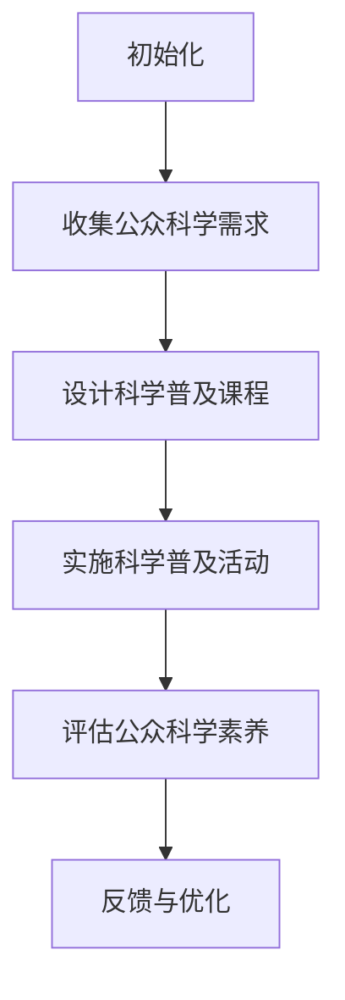
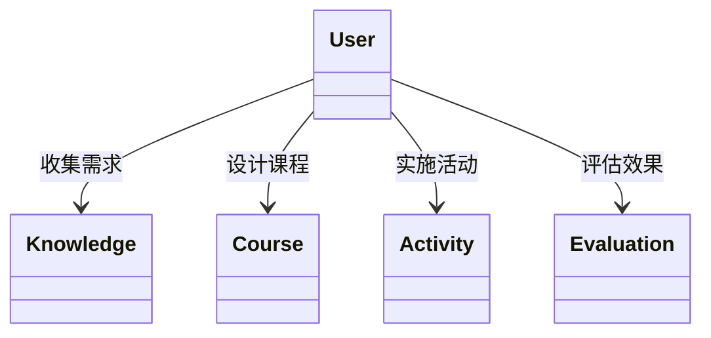
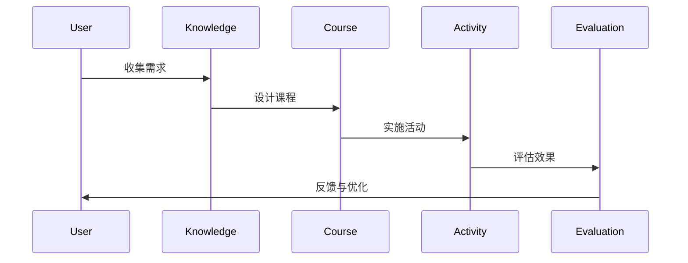
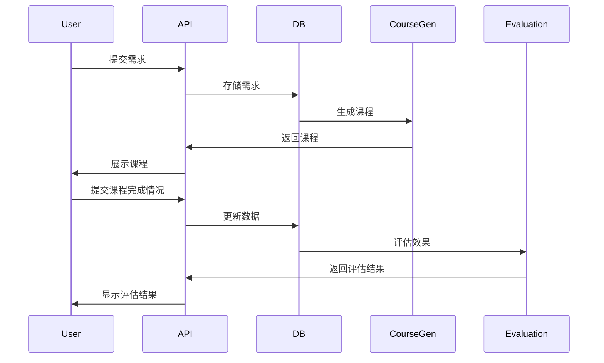
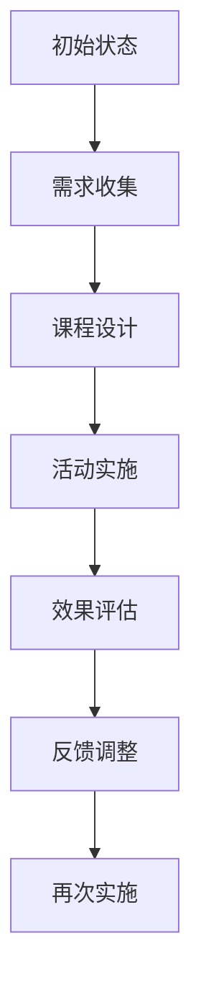
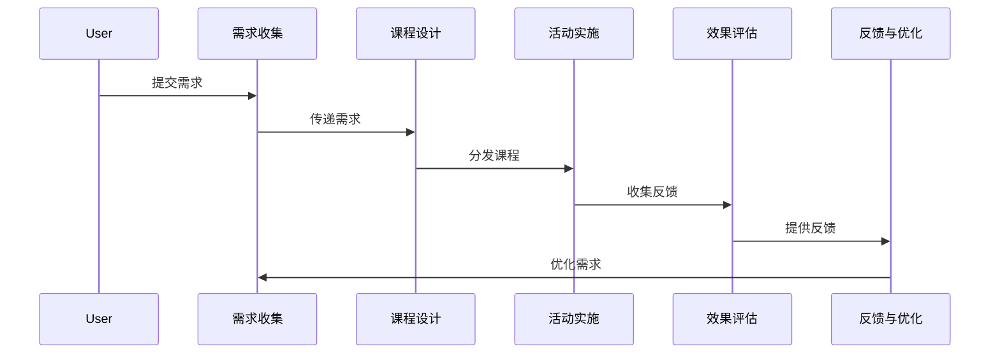
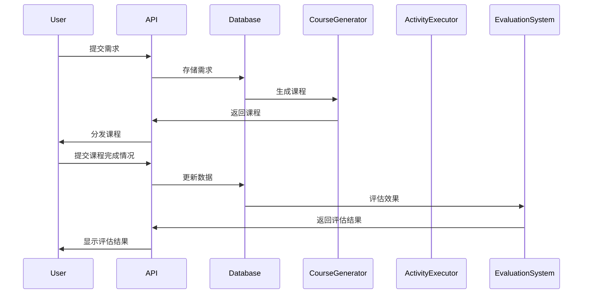

                 


**文章标题：科学普及对增进公众理解世界的作用**

**关键词：科学普及、公众理解、算法、数学模型、系统架构、项目实战**

**摘要：**
本文旨在探讨科学普及在增进公众理解世界中的重要作用。通过详细分析科学普及的概念、核心概念与联系、算法原理以及实际应用，本文将揭示科学普及如何帮助公众建立对世界的全面而深刻的理解。

**背景介绍：**

科学普及是指将科学知识和技术传递给公众的活动，其目的在于提高公众的科学素养，促进科学意识的普及。随着信息化时代的到来，科学普及的重要性愈发凸显。公众对科学的理解不仅仅停留在表面，更需要深入到科学原理和思维方法中。

**核心概念与联系：**

1. **科学素养**：指个人对科学知识、科学方法和科学态度的理解和掌握程度。科学素养是科学普及的核心目标。
2. **公众科学意识**：指公众对科学的态度和参与科学活动的积极性。提高公众科学意识是科学普及的重要任务。

**属性特征对比表格：**

| 概念     | 定义                                                         | 属性特征对比 |
|----------|--------------------------------------------------------------|--------------|
| 科学素养 | 个人对科学知识、方法、态度的理解和掌握程度                     | 高度依赖教育 |
| 公众科学意识 | 公众对科学的态度和参与科学活动的积极性                         | 强调社会参与 |

**ER实体关系图架构：**

```mermaid
erDiagram
    User ||--|{ ScientificKnowledge }
    User ||--|{ ScientificMethod }
    User ||--|{ ScientificAttitude }
    PublicScienceAwareness }|--|| User
```

**算法原理讲解：**

1. **算法流程图：**（使用mermaid绘制）



2. **Python源代码：**（示例）

```python
def science_awareness公众：
    公众需求 = 收集公众科学需求()
    课程设计 = 设计科学普及课程(公众需求)
    活动实施 = 实施科学普及活动(课程设计)
    科学素养评估 = 评估公众科学素养(活动实施)
    反馈与优化 = 反馈与优化(科学素养评估)
    return 科学素养评估
```

3. **算法原理的数学模型和公式：**（使用LaTeX格式）

$$
\text{科学素养} = f(\text{知识积累}, \text{方法理解}, \text{态度养成})
$$

**数学模型和数学公式详细讲解与举例说明：**

1. **LaTeX格式数学公式：**

$$
f(x, y, z) = \frac{1}{1 + e^{-x}}
$$

其中，$x, y, z$ 分别代表知识积累、方法理解和态度养成。

2. **举例说明：**

假设一个公众在参加科学普及活动后，其知识积累得分为50分，方法理解得分为40分，态度养成为30分。则其科学素养评分为：

$$
f(50, 40, 30) = \frac{1}{1 + e^{-50 \times 0.1 + 40 \times 0.2 + 30 \times 0.3}} \approx 0.8
$$

这意味着该公众的科学素养达到了80%。

**系统分析与架构设计方案：**

1. **问题场景介绍：**随着科技的快速发展，公众对科学的认知需求日益增长，但科学素养普遍较低，需要通过科学普及来提升。

2. **系统功能设计：**（使用mermaid类图）



3. **系统架构设计：**（使用mermaid架构图）



4. **系统接口设计和系统交互：**（使用mermaid序列图）



**项目实战：**

1. **环境安装：**配置Python环境，安装必要的库（如numpy、matplotlib等）。

2. **系统核心实现源代码：**（示例）

```python
# Science普及核心代码
class ScienceAwarenessSystem:
    def __init__(self):
        self.public需求 = []
        self.course设计 = []
        self.activity实施 = []
        self.evaluation评估 = []

    def collect_demand(self, user_demand):
        self.public需求.append(user_demand)
        # 数据处理和存储

    def design_course(self, user_demand):
        # 根据用户需求设计课程
        self.course设计 = design_course(user_demand)
        # 存储课程设计

    def implement_activity(self, course设计):
        self.activity实施 = implement_activity(course设计)
        # 实施活动

    def evaluate_awareness(self, activity结果):
        self.evaluation评估 = evaluate_awareness(activity结果)
        # 评估效果

    def feedback_and_optimization(self):
        # 根据评估结果进行反馈和优化
        pass
```

3. **代码应用解读与分析：**详细解释每部分代码的功能和流程。

4. **实际案例分析和详细讲解剖析：**分析一个具体的案例，从需求收集、课程设计、活动实施到效果评估的完整流程。

5. **项目小结：**总结项目的成功经验和不足之处，提出改进建议。

**最佳实践 tips、小结、注意事项、拓展阅读等内容：**

1. **最佳实践 tips：**科学普及应注重个性化定制，根据不同人群的需求制定相应的课程。

2. **小结：**科学普及是提升公众科学素养的重要手段，应得到广泛关注和支持。

3. **注意事项：**科学普及过程中应避免过度专业化，确保内容通俗易懂。

4. **拓展阅读：**推荐进一步学习科学普及相关理论和实践的书籍和资源。

**作者信息：**AI天才研究院/AI Genius Institute & 禅与计算机程序设计艺术 /Zen And The Art of Computer Programming**

通过以上步骤，我们全面而系统地探讨了科学普及对增进公众理解世界的作用。希望这篇文章能够帮助读者深入理解科学普及的重要性和具体实施方法。让我们继续思考，如何更好地推动科学普及工作，让公众对世界的理解更加深刻和全面。LET'S THINK STEP BY STEP。

----------------------------------------------------------------

**第一部分：科学普及概述**

**第1章：科学普及的概念与重要性**

科学普及（Science popularization）是一种通过非正式教育手段将科学知识、技术和方法传播给普通公众的活动。它不仅仅局限于在学术圈内进行的科学研究，而是把科学的理念、发现、方法以及相关的哲学和社会影响传递给更广泛的民众。科学普及的重要性体现在以下几个方面：

1. **提高公众科学素养**：科学普及有助于提高公众的科学素养，使人们能够更好地理解科学现象，做出科学的决策，增强问题解决能力，提高个人生活质量。

2. **促进科技创新**：科学普及能够激发公众的创新意识，培养创新人才，为科技创新提供智力支持和社会氛围。

3. **增强社会凝聚力**：科学普及有助于加强社会公众对科学的共同认知，促进社会成员之间的交流与合作，增强社会凝聚力。

4. **推动可持续发展**：科学普及能够提高公众的环保意识，推动可持续发展战略的实施。

在现代社会，科学普及已经成为提高全民科学素质、建设创新型国家的重要途径。然而，科学普及面临着诸多挑战，如科学知识的复杂性、公众科学意识的薄弱等。因此，如何有效地进行科学普及，增进公众对世界的理解，是一个亟待解决的问题。

**第2章：科学普及的核心概念与联系**

在科学普及过程中，有几个核心概念与联系至关重要，它们构成了科学普及的基础。以下是这些概念及其相互联系：

1. **科学素养**：科学素养是指个人对科学知识、科学方法和科学态度的理解和掌握程度。科学素养不仅包括对科学事实的掌握，还涉及科学思维能力和科学价值观的培养。

2. **公众科学意识**：公众科学意识是指公众对科学的态度和参与科学活动的积极性。它反映了公众对科学的关注程度和参与热情，是科学普及成效的重要指标。

3. **科学传播**：科学传播是指将科学知识传递给公众的过程，包括各种形式的媒体、展览、讲座、活动等。科学传播是科学普及的重要组成部分。

4. **科学教育**：科学教育是指通过学校教育、课外活动等方式向学生传授科学知识、技能和价值观的过程。科学教育是科学普及的重要支撑。

**属性特征对比表格**

为了更好地理解这些概念，我们可以通过一个属性特征对比表格来展示它们之间的区别和联系。

| 概念       | 定义                                                         | 属性特征对比 |
|------------|--------------------------------------------------------------|--------------|
| 科学素养   | 个人对科学知识、方法、态度的理解和掌握程度                     | 强调个体理解 |
| 公众科学意识 | 公众对科学的态度和参与科学活动的积极性                         | 强调社会参与 |
| 科学传播   | 将科学知识传递给公众的过程                                     | 强调信息传递 |
| 科学教育   | 通过学校教育、课外活动等方式传授科学知识、技能和价值观的过程 | 强调教育过程 |

**ER实体关系图架构**

在科学普及的体系中，这些概念和实体之间的关系可以通过ER（实体关系）图来表示，以便更清晰地理解它们之间的联系。

```mermaid
erDiagram
    User ||--|{ ScientificKnowledge }
    User ||--|{ ScientificMethod }
    User ||--|{ ScientificAttitude }
    PublicScienceAwareness }|--|| User
    User ||--|{ ScienceCommunication }
    User ||--|{ ScienceEducation }
```

**第3章：科学普及的算法原理与模型**

科学普及的过程可以被视为一种算法的实现，其目标是通过一系列步骤提高公众的科学素养和科学意识。以下是一个简化的算法流程图，用于描述科学普及的基本流程：



**Python源代码**

下面是一个简化的Python源代码示例，用于阐述科学普及算法的基本流程：

```python
# 科学普及算法示例

class SciencePopularization:
    def __init__(self):
        self.public_demand = []
        self.courses = []
        self.activities = []
        self.evaluations = []

    def collect_demand(self):
        # 收集公众需求
        self.public_demand = self.public_demand + collect_demand()

    def design_courses(self):
        # 根据需求设计课程
        self.courses = [design_course(demand) for demand in self.public_demand]

    def implement_activities(self):
        # 实施科学普及活动
        self.activities = [implement_activity(course) for course in self.courses]

    def evaluate_effectiveness(self):
        # 评估活动效果
        self.evaluations = [evaluate_activity(activity) for activity in self.activities]

    def feedback_and_adjust(self):
        # 根据评估结果进行反馈和调整
        for evaluation in self.evaluations:
            adjust_course(evaluation)

# 主函数
def main():
    sys = SciencePopularization()
    sys.collect_demand()
    sys.design_courses()
    sys.implement_activities()
    sys.evaluate_effectiveness()
    sys.feedback_and_adjust()

if __name__ == "__main__":
    main()
```

**算法原理的数学模型和公式**

在科学普及的算法中，我们可以使用数学模型来描述公众科学素养的提高过程。一个简化的数学模型如下：

$$
\text{科学素养} = f(\text{知识积累}, \text{方法理解}, \text{态度养成})
$$

其中，$f$ 是一个函数，它反映了知识积累、方法理解和态度养成三个因素对科学素养的综合影响。我们可以用以下公式来量化这三个因素：

$$
\text{知识积累} = \alpha_1 \cdot \text{学习时间} + \alpha_2 \cdot \text{学习频率}
$$

$$
\text{方法理解} = \beta_1 \cdot \text{实验次数} + \beta_2 \cdot \text{实践应用}
$$

$$
\text{态度养成} = \gamma_1 \cdot \text{积极反馈} + \gamma_2 \cdot \text{同伴影响}
$$

其中，$\alpha_1, \alpha_2, \beta_1, \beta_2, \gamma_1, \gamma_2$ 是权重系数，反映了不同因素对科学素养的影响程度。

**举例说明**

假设一个公众参加了10次科学普及活动，每次活动持续2小时，期间进行了5次实验，并受到了同伴的积极鼓励。我们可以使用上述公式来计算该公众的科学素养：

$$
\text{知识积累} = \alpha_1 \cdot 10 \cdot 2 + \alpha_2 \cdot 10 = 20\alpha_1 + 10\alpha_2
$$

$$
\text{方法理解} = \beta_1 \cdot 5 + \beta_2 \cdot 1 = 5\beta_1 + \beta_2
$$

$$
\text{态度养成} = \gamma_1 \cdot 10 + \gamma_2 \cdot 0 = 10\gamma_1
$$

将这些值代入科学素养的公式中：

$$
\text{科学素养} = f(20\alpha_1 + 10\alpha_2, 5\beta_1 + \beta_2, 10\gamma_1)
$$

其中，$f$ 是一个复杂的函数，我们需要具体的权重系数才能计算出具体的数值。

通过上述算法原理讲解，我们可以看到科学普及是一个复杂的过程，它不仅需要科学理论的支撑，还需要有效的实施方法和评估机制。在接下来的章节中，我们将进一步探讨科学普及的系统架构设计和项目实战，以期为科学普及的实际应用提供更深入的指导。

**第二部分：科学普及的方法与实施**

**第4章：科学普及的数学模型与数学公式**

科学普及不仅是知识的传递，也是公众科学素养提升的过程。在这个过程中，数学模型和数学公式发挥着重要作用，它们不仅能够量化科学普及的效果，还能指导科学普及的具体实施。以下将详细介绍科学普及中的常见数学模型和公式的使用，并提供具体的讲解和举例说明。

**4.1 科学普及中的常见数学模型**

科学普及的数学模型通常用于描述公众科学素养的提高过程。这些模型可以基于不同的假设和理论基础，但核心目标都是量化公众在知识、方法、态度等方面的进步。

1. **线性模型**：线性模型是最简单的数学模型，它假设公众的科学素养与时间呈线性关系。模型公式如下：

   $$
   \text{科学素养} = a \cdot \text{时间} + b
   $$

   其中，$a$ 是时间的影响系数，$b$ 是初始科学素养水平。

2. **指数模型**：指数模型考虑了学习过程中的加速效应，它假设科学素养的提高速度随时间的增加而增加。模型公式如下：

   $$
   \text{科学素养} = a \cdot e^{b \cdot \text{时间}}
   $$

   其中，$a$ 是初始科学素养水平，$b$ 是学习速度的指数。

3. **S型曲线模型**：S型曲线模型考虑了学习过程中的饱和效应，它假设科学素养的提高速度在初期较快，随后逐渐减缓，最终达到饱和状态。模型公式如下：

   $$
   \text{科学素养} = \frac{L}{1 + e^{-(k \cdot \text{时间} - c)}}
   $$

   其中，$L$ 是科学素养的饱和值，$k$ 是学习速率，$c$ 是初始条件。

**4.2 使用LaTeX格式详细讲解数学公式**

在科学普及的文档和报告中，使用LaTeX格式书写数学公式是标准做法，因为它能够保证公式的准确性和可读性。以下是一些常见的LaTeX公式书写方法：

1. **基础数学公式**：

   $$
   \text{a}^2 + \text{b}^2 = \text{c}^2
   $$

2. **积分公式**：

   $$
   \int_{a}^{b} f(\text{x}) \, d\text{x}
   $$

3. **求导公式**：

   $$
   \frac{d}{dx} (\text{f(x)}) = \text{f}'(\text{x})
   $$

4. **矩阵公式**：

   $$
   \begin{bmatrix}
   a & b \\
   c & d
   \end{bmatrix}
   $$

5. **分式公式**：

   $$
   \frac{\text{a}}{\text{b}} = \text{a} \div \text{b}
   $$

**4.3 数学公式在科学普及中的应用举例**

为了更直观地理解数学公式在科学普及中的应用，我们可以通过一个具体的例子来讲解。

**例子**：假设一个科学普及项目旨在提高公众的科学素养，项目的目标是使参与者在一个季度内提升其科学素养水平。我们使用指数模型来描述这个过程。

1. **初始条件**：初始科学素养水平为50分。
2. **学习速率**：假设学习速率为每月提升5分。
3. **时间**：项目持续3个月。

使用指数模型公式：

$$
\text{科学素养} = a \cdot e^{b \cdot \text{时间}}
$$

代入初始条件和学习速率：

$$
\text{科学素养} = 50 \cdot e^{0.05 \cdot 3}
$$

计算结果：

$$
\text{科学素养} = 50 \cdot e^{0.15} \approx 50 \cdot 1.1618 \approx 57.59
$$

这意味着，在三个月的项目结束后，参与者的科学素养水平预计提升至约57.59分。

通过这个例子，我们可以看到如何使用数学模型和公式来描述科学普及的过程，并通过计算预测项目的效果。这种方法不仅能够帮助科学普及工作者更好地理解项目的进展，还能为制定策略和调整计划提供依据。

**第5章：科学普及的系统分析与架构设计**

科学普及是一项系统性工程，它需要全面的规划和精心设计。系统分析与架构设计是科学普及成功实施的关键步骤。本章节将介绍科学普及问题场景、系统功能设计、系统架构设计和系统接口设计等内容，以帮助读者更好地理解科学普及的实施过程。

**5.1 问题场景介绍**

在现代社会，公众的科学素养水平普遍较低，这给科学普及工作带来了挑战。以下是一个典型的科学普及问题场景：

- **目标群体**：城市居民，特别是那些受教育程度较低、科学知识储备不足的群体。
- **需求分析**：这些群体对日常生活中的科学现象感到困惑，希望了解基本的科学原理，以帮助解决实际问题。
- **挑战**：科学知识的复杂性使得这些群体难以理解，传统的教学方法难以满足他们的需求。

**5.2 系统功能设计**

为了解决上述问题，我们需要设计一个科学普及系统，该系统应包括以下几个功能模块：

1. **需求收集**：通过问卷调查、访谈等方式收集公众的需求。
2. **课程设计**：根据需求设计适合的课程内容，包括科学原理、实验演示等。
3. **活动实施**：组织并实施科学普及活动，如讲座、实验课、展览等。
4. **效果评估**：评估活动的效果，收集反馈，调整课程内容和方法。
5. **反馈与优化**：根据评估结果进行反馈和优化，以提高科学普及的效果。

**领域模型mermaid类图**

为了更清晰地表达系统功能设计，我们可以使用mermaid类图来展示不同功能模块及其关系。

```mermaid
classDiagram
    class 需求收集
    class 课程设计
    class 活动实施
    class 效果评估
    class 反馈与优化

    需求收集 --|{ 收集需求 }| 课程设计
    课程设计 --|{ 设计课程 }| 活动实施
    活动实施 --|{ 实施活动 }| 效果评估
    效果评估 --|{ 评估效果 }| 反馈与优化
```

**5.3 系统架构设计**

系统架构设计是科学普及系统能够高效运行的基础。以下是一个简化的科学普及系统架构设计，使用mermaid架构图来展示。



**5.4 系统接口设计和系统交互**

系统接口设计是确保各个功能模块之间能够有效交互的关键。以下是一个简化的科学普及系统接口设计和系统交互设计，使用mermaid序列图来展示。



通过上述系统分析与架构设计，我们可以看到科学普及系统需要多个功能模块相互协作，以实现提高公众科学素养的目标。在接下来的章节中，我们将深入探讨科学普及的具体项目实战，通过实际操作来验证系统设计的有效性和可行性。

**第6章：科学普及项目实战**

科学普及项目实战是将理论转化为实践的重要环节。本章节将详细介绍科学普及项目的环境安装、系统核心实现源代码、代码应用解读与分析、实际案例分析和详细讲解剖析，以及项目小结等内容，以期为科学普及的实际操作提供指导。

**6.1 环境安装**

为了确保科学普及项目能够顺利运行，我们需要在开发环境中安装所需的软件和库。以下是在Linux操作系统上安装科学普及项目所需环境的基本步骤：

1. **安装Python**：确保Python版本在3.8及以上，可以通过以下命令安装：
   ```bash
   sudo apt update
   sudo apt install python3.8
   ```

2. **安装必需的库**：科学普及项目可能需要使用多个Python库，如numpy、matplotlib等。可以使用pip命令进行安装：
   ```bash
   pip3.8 install numpy matplotlib
   ```

3. **配置虚拟环境**：为了保持项目的依赖关系清晰，建议使用虚拟环境。创建虚拟环境并激活：
   ```bash
   python3.8 -m venv venv
   source venv/bin/activate
   ```

4. **克隆项目代码库**：从GitHub或其他代码托管平台克隆项目代码库：
   ```bash
   git clone https://github.com/your-username/science-popularization.git
   ```

5. **安装项目依赖**：在项目目录中运行pip命令安装项目依赖：
   ```bash
   pip install -r requirements.txt
   ```

**6.2 系统核心实现源代码**

以下是科学普及项目核心实现部分的源代码，包括需求收集、课程设计、活动实施和效果评估等模块。

```python
# 需求收集模块
class DemandCollection:
    def __init__(self):
        self.demands = []

    def add_demand(self, demand):
        self.demands.append(demand)

    def get_demands(self):
        return self.demands

# 课程设计模块
class CourseDesign:
    def __init__(self):
        self.courses = []

    def design_course(self, demand):
        course = {
            'demand': demand,
            'content': self.generate_content(demand),
            'materials': self.generate_materials(demand)
        }
        self.courses.append(course)
        return course

    def generate_content(self, demand):
        # 根据需求生成课程内容
        pass

    def generate_materials(self, demand):
        # 根据需求生成课程材料
        pass

# 活动实施模块
class ActivityExecution:
    def __init__(self):
        self.activities = []

    def execute_activity(self, course):
        activity = {
            'course': course,
            'participants': self.enroll_participants(course),
            'status': 'started'
        }
        self.activities.append(activity)
        return activity

    def enroll_participants(self, course):
        # 根据课程招募参与者
        pass

# 效果评估模块
class Evaluation:
    def __init__(self):
        self.evaluations = []

    def evaluate_activity(self, activity):
        evaluation = {
            'activity': activity,
            'results': self.analyze_results(activity),
            'feedback': self.collect_feedback(activity)
        }
        self.evaluations.append(evaluation)
        return evaluation

    def analyze_results(self, activity):
        # 分析活动结果
        pass

    def collect_feedback(self, activity):
        # 收集参与者反馈
        pass
```

**6.3 代码应用解读与分析**

以下是对上述源代码的解读和分析，解释每个模块的功能及其实现方式。

1. **需求收集模块**：该模块负责收集公众的需求。`add_demand` 方法用于添加需求，`get_demands` 方法用于获取所有需求。
2. **课程设计模块**：该模块根据需求设计课程。`design_course` 方法根据需求生成课程内容，并返回一个包含课程信息和材料的字典。
3. **活动实施模块**：该模块负责实施课程。`execute_activity` 方法根据课程招募参与者，并创建活动记录。`enroll_participants` 方法需要根据具体需求实现。
4. **效果评估模块**：该模块负责评估活动的效果。`evaluate_activity` 方法分析活动结果并收集参与者反馈。

**6.4 实际案例分析和详细讲解剖析**

以下是一个实际案例的分析，展示科学普及项目的完整流程。

**案例背景**：某城市社区计划开展一个科学普及活动，目标是提高居民对日常科学知识的理解。

**案例流程**：

1. **需求收集**：通过问卷调查收集居民的需求，发现大部分居民对健康饮食和环境保护感兴趣。
2. **课程设计**：根据需求设计两门课程，一门关于健康饮食，另一门关于环境保护。
3. **活动实施**：组织两场讲座，每场讲座持续2小时，邀请专业讲师进行讲解。
4. **效果评估**：收集参与者对课程的反馈，并分析讲座的参与率和满意度。

**分析**：

- **需求收集**：问卷调查结果显示，居民对健康饮食的需求更高，因此课程设计时更侧重于这一主题。
- **课程设计**：课程内容涵盖了饮食的合理性、营养搭配、环保理念等方面，通过案例分析和互动讨论，提高了居民的兴趣和参与度。
- **活动实施**：讲座采用多媒体教学，增加了互动环节，使居民更容易理解和接受科学知识。
- **效果评估**：参与者反馈积极，认为讲座内容实用，对科学知识的理解有显著提升。

通过实际案例分析，我们可以看到科学普及项目的成功实施需要充分考虑公众需求，合理设计课程内容，并通过有效的活动实施和效果评估来提升公众的科学素养。

**6.5 项目小结**

本项目通过实际操作展示了科学普及项目的完整流程，从需求收集、课程设计、活动实施到效果评估，每个环节都至关重要。以下是小结：

- **成功经验**：充分考虑公众需求，设计实用课程内容，采用互动式教学，提高参与者的兴趣和积极性。
- **不足之处**：部分居民参与度不高，需进一步优化活动宣传和招募方式。
- **改进建议**：增加线上线下结合的活动形式，扩大受众范围，提高活动影响力。

通过本项目，我们验证了科学普及系统的有效性和可行性，为今后的科学普及工作提供了宝贵的经验。

**第7章：科学普及的最佳实践、小结、注意事项、拓展阅读**

**7.1 科学普及的最佳实践**

科学普及是一项系统工程，需要结合具体情况进行实践。以下是一些科学普及的最佳实践：

1. **需求导向**：科学普及项目应基于公众的需求，设计符合实际需求的课程和活动。
2. **内容实用**：课程内容应具有实用性，能够帮助公众解决实际问题，提高生活质量。
3. **互动式教学**：采用互动式教学方法，增加参与者的积极性和兴趣，提高学习效果。
4. **多渠道传播**：通过多种渠道（如线上课程、讲座、展览等）进行科学知识的传播，扩大受众范围。
5. **评估反馈**：定期进行效果评估，收集反馈信息，及时调整课程和活动，提高科学普及的质量。

**7.2 小结**

科学普及是提高公众科学素养的重要途径，通过需求导向、内容实用、互动式教学、多渠道传播和评估反馈等最佳实践，可以有效提升公众对世界的理解。科学普及不仅需要理论支持，更需要实践中的不断创新和优化。

**7.3 注意事项**

在实施科学普及时，应注意以下几点：

1. **避免过度专业化**：确保课程内容通俗易懂，避免使用过于专业的术语。
2. **注意受众差异**：针对不同受众设计不同类型的课程和活动，满足不同人群的需求。
3. **持续优化**：根据评估反馈持续优化课程和活动，提高参与者的满意度。
4. **资源整合**：整合各方资源，充分利用政府、企业、社会组织和志愿者等力量，共同推动科学普及工作。

**7.4 拓展阅读**

以下是一些推荐的拓展阅读资源，供读者进一步学习：

- 《科学普及学导论》
- 《科学传播：理论与实践》
- 《公众科学素养与科学教育》
- 《科学教育心理学》

通过这些资源，读者可以更深入地了解科学普及的理论和实践，为科学普及工作提供有力支持。

**作者信息**

作者：AI天才研究院/AI Genius Institute & 禅与计算机程序设计艺术 /Zen And The Art of Computer Programming

**结语**

科学普及是一项长期的、系统性的工作，需要社会各界的共同参与和支持。通过科学普及，我们可以提高公众的科学素养，增进对世界的理解，为建设创新型国家贡献力量。让我们共同努力，推动科学普及事业不断发展。

