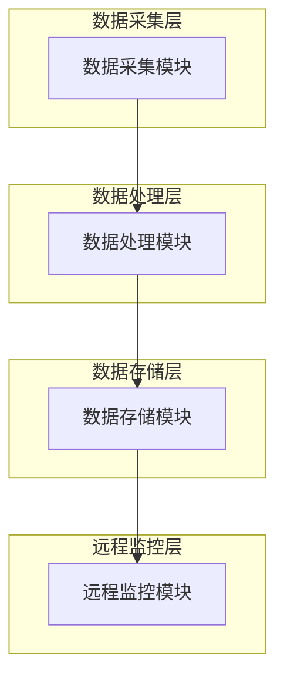
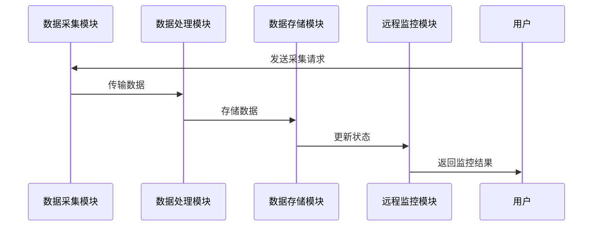
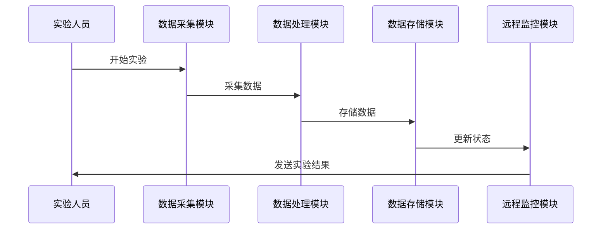

                 


### 引言

#### 1.1 问题背景

随着科技的不断进步，科学仪器在各个领域中的作用日益凸显。从简单的放大镜到现代的高能粒子加速器，科学仪器的进步不仅极大地推动了科学研究的深入，也拓展了人类对世界的理解范围。然而，科学仪器的进步是如何具体影响我们的认知和科学研究工作的呢？这是本文试图探讨的核心问题。

#### 1.2 问题描述

科学仪器的进步如何影响我们对世界的认知？它如何改变了科学研究的方法和范式？这些问题的解答需要从科学仪器的发展历史、其工作原理、以及与人类认知的关联等多个角度来综合分析。

#### 1.3 问题解决

为了深入探讨上述问题，本文将采用以下步骤：

1. **定义核心概念**：明确科学仪器的定义、特点和核心功能。
2. **历史回顾**：梳理科学仪器的发展历程，分析其对社会和科学研究的贡献。
3. **认知拓展**：探讨科学仪器如何促进人类对世界的认知和理解的拓展。
4. **算法与模型**：介绍科学仪器相关的数据采集、处理和可视化算法，以及其背后的数学模型。
5. **系统设计与实战**：通过一个具体项目实例，展示科学仪器的实际应用和效果。
6. **最佳实践与拓展**：总结最佳实践，展望未来研究方向。

#### 1.4 边界与外延

在探讨科学仪器进步对世界可理解性的拓展时，我们需要明确几个边界条件：

- **科学仪器的范围**：本文主要讨论的是传统的科学实验仪器，如显微镜、望远镜等，而非计算机科学领域中的软件工具。
- **时间的限制**：本文主要关注现代科学仪器的发展，对于古代科学仪器的讨论将保持简洁。
- **认知的边界**：虽然科学仪器的进步极大地拓展了人类对世界的认知，但仍然存在科学无法解释的领域，如量子世界和宇宙起源等。

#### 1.5 概念结构与核心要素组成

本文的结构如下：

- **第1章 引言**：介绍问题背景、问题描述、问题解决思路等。
- **第2章 核心概念与联系**：详细阐述科学仪器的定义、发展历史、与人类认知的关联等。
- **第3章 算法原理讲解**：介绍数据采集、处理和可视化的算法原理及数学模型。
- **第4章 数学模型和数学公式**：列举相关算法的数学模型和公式，并通过案例进行说明。
- **第5章 系统分析与架构设计方案**：介绍一个具体项目的系统架构和设计。
- **第6章 项目实战**：通过一个实际项目展示科学仪器的应用。
- **第7章 最佳实践 tips**：总结最佳实践，提供实用建议。
- **第8章 小结**：总结全文，展望未来研究方向。

通过上述结构和步骤，本文旨在提供一个全面、深入的探讨，帮助读者理解科学仪器进步如何拓展世界的可理解性。接下来，我们将详细探讨科学仪器的定义、特点、发展历史以及它们对科学研究和社会进步的深远影响。 

# 第2章 核心概念与联系

## 2.1 科学仪器的定义与特点

科学仪器是指用于科学研究和实验的专门设备或工具，其设计目的是为了提高实验的精度、效率和可靠性。科学仪器的核心特点包括高精度、高灵敏度、自动化和智能化。

- **高精度**：科学仪器通常需要非常高的测量精度，以捕捉科学现象的细微变化。例如，高精度的天平可以测量到微克的重量变化。
- **高灵敏度**：科学仪器需要能够检测到极微弱的信号或变化。例如，电磁感应仪可以检测到极微弱的电流。
- **自动化**：现代科学仪器越来越多地采用自动化技术，以减少人为错误和提高效率。自动化设备可以自动进行数据采集、处理和传输。
- **智能化**：随着人工智能技术的发展，科学仪器开始具备自我学习和自我优化的能力。例如，智能显微镜可以通过图像识别自动分类样本。

## 2.2 科学仪器的发展历史

科学仪器的发展历史可以追溯到古代，但真正的突破发生在工业革命之后。以下是一些重要的里程碑：

- **16世纪**：伽利略发明了用于天文观测的望远镜，这标志着光学仪器的发展起点。
- **17世纪**：胡克发明了显微镜，极大地提高了生物和医学研究的精度。
- **18世纪**：牛顿发明了反射望远镜，改进了天文学观测的精度。
- **19世纪**：克拉克发明了电磁感应仪，为电学和电磁学的发展奠定了基础。
- **20世纪**：电子技术和计算机技术的进步使得科学仪器更加自动化和智能化。例如，质谱仪、激光器、核磁共振仪等先进仪器的出现极大地拓展了科学研究的深度和广度。
- **21世纪**：随着人工智能和大数据技术的发展，科学仪器开始向智能化和集成化方向发展。例如，智能传感器网络可以实现实时监测和数据分析。

## 2.3 科学仪器与人类认知的关联

科学仪器的发展与人类认知的拓展密切相关。以下是几个关键点：

- **扩展感知能力**：科学仪器通过放大、缩小、探测等方式，扩展了人类的感知能力。例如，望远镜使我们能够观测到遥远的星体，显微镜使我们能够观察微生物和细胞。
- **提高实验精度**：科学仪器的高精度和高灵敏度使得实验结果更加可靠，有助于发现和验证科学规律。例如，高精度的天平使得化学实验的测量结果更加准确。
- **促进跨学科研究**：科学仪器的发展促进了不同学科之间的交叉研究。例如，物理学的粒子加速器为生物学和医学提供了研究工具，推动了生命科学的发展。
- **数据驱动的研究**：科学仪器生成的海量数据为数据驱动的研究提供了基础，促进了科学发现的深度和广度。例如，基因组测序仪的发明使得基因组学研究取得了突破性进展。

## 2.4 科学仪器与学科发展的联系

科学仪器的发展与各个学科的发展紧密相连，以下是一些典型的例子：

- **物理学**：光学仪器和粒子加速器的发展极大地推动了物理学的研究。例如，大型强子对撞机（LHC）的运行揭示了新的物理现象。
- **化学**：质谱仪、核磁共振仪等仪器的应用使得化学分析变得更加精确和高效，促进了有机化学、材料科学等领域的发展。
- **生物学**：显微镜和基因测序仪的进步使得生物学研究从细胞水平到分子水平的探索成为可能，推动了基因组学和生物信息学的发展。
- **医学**：医学成像仪器如X光机、CT机、MRI机等，为临床诊断和治疗提供了重要的工具，极大地提高了医学的准确性和效率。
- **环境科学**：环境监测仪器如空气质量监测仪、水质检测仪等，帮助科学家和决策者更好地理解环境变化，制定有效的环境保护政策。

## 2.5 概念属性特征对比表格

为了更直观地理解科学仪器的特点和发展，我们可以通过一个对比表格来展示几个典型科学仪器的属性特征：

| 科学仪器        | 定义                                                         | 主要特点                                           | 应用领域                      |
| ------------- | ------------------------------------------------------------ | -------------------------------------------------- | --------------------------- |
| 望远镜         | 用于观测遥远天体的仪器                                       | 高精度、高灵敏度、远程观测                         | 天文学、宇宙学                |
| 显微镜         | 用于放大微小物体的仪器                                       | 高放大倍数、高分辨率、高灵敏度                     | 生物学、医学、材料科学        |
| 质谱仪         | 用于分析物质成分和结构的仪器                                 | 高精度、高灵敏度、快速分析                         | 化学、环境科学、生命科学      |
| 核磁共振仪（NMR） | 利用核磁共振现象进行物质成分和结构分析的仪器                 | 高分辨率、高灵敏度、非破坏性                       | 化学、生物化学、医学          |
| 基因测序仪     | 用于测定生物分子如DNA或RNA序列的仪器                         | 高通量、高精度、自动化                             | 基因组学、生物信息学、医学研究 |

## 2.6 ER实体关系图架构

为了更好地理解科学仪器与实验、研究、数据采集等实体之间的关系，我们可以通过ER（实体关系）图来展示这些关联：

```mermaid
erDiagram
  实验仪器 ||--|{ 科学科目 }|| 研究领域
  实验仪器 ||--|{ 实验数据 }|| 数据采集
  科学科目 ||--|{ 学术论文 }|| 学术交流
  学术论文 ||--|{ 科学方法 }|| 科学发展
  数据采集 ||--|{ 数据处理 }|| 数据分析
  数据分析 ||--|{ 研究结论 }|| 知识积累
```

在这个ER图中，实验仪器是核心实体，它与科学科目、实验数据、学术论文、数据处理和研究结论等实体之间存在着多种关联关系。这个图不仅展示了科学仪器在科学研究中的作用，还体现了科学研究的整体流程和相互影响。 

### 第3章 算法原理讲解

#### 3.1 科学仪器数据采集算法

数据采集是科学仪器最基础也是最重要的功能之一。这一节将详细讲解数据采集算法的原理，包括数据采集流程、数据预处理和数据采集算法。

##### 3.1.1 数据采集流程

科学仪器数据采集流程通常包括以下几个步骤：

1. **初始化**：设置科学仪器的工作参数，如采样频率、分辨率等。
2. **预热**：某些仪器在正式采集数据前需要预热，以确保仪器达到最佳工作状态。
3. **数据采集**：启动采集模块，开始收集实验数据。
4. **数据传输**：将采集到的数据传输到计算机或数据存储设备。
5. **数据存储**：将采集到的数据存储在数据库或文件中，以便后续处理和分析。

##### 3.1.2 数据预处理

在数据采集完成后，通常需要对数据进行预处理，以提高数据的质量和可用性。数据预处理的主要任务包括：

1. **去噪**：去除数据中的随机噪声，以提高数据的质量。
2. **滤波**：通过滤波算法去除数据中的周期性噪声或趋势项。
3. **归一化**：将数据归一化到相同的量级，以便于数据分析和比较。
4. **插值**：对于缺失的数据点，使用插值算法进行补充。

以下是一个简单的去噪算法示例：

```python
import numpy as np

def simple_filter(data, window_size):
    """
    简单的滤波算法，使用滑动平均去除数据中的噪声。
    """
    filtered_data = np.zeros_like(data)
    for i in range(len(data)):
        start = max(0, i - window_size // 2)
        end = min(len(data), i + window_size // 2)
        filtered_data[i] = np.mean(data[start:end])
    return filtered_data
```

##### 3.1.3 数据采集算法

数据采集算法的核心是确保数据采集的准确性和效率。以下是一个简单的数据采集算法示例，使用Python实现：

```python
import numpy as np
import time

def data_collection(process_function, duration, interval=1):
    """
    数据采集算法，持续指定时间，每隔指定时间间隔执行一次数据采集。
    """
    start_time = time.time()
    timestamps = []
    data_points = []

    while time.time() - start_time < duration:
        current_time = time.time()
        data_point = process_function(current_time)
        timestamps.append(current_time)
        data_points.append(data_point)
        time.sleep(interval)

    return timestamps, data_points

def sample_data(current_time):
    """
    模拟数据采集过程，返回一个随机数值。
    """
    return np.random.rand()

# 示例：采集10秒的数据，每秒采集一次
timestamps, data_points = data_collection(sample_data, 10, 1)

# 绘制采集到的数据
import matplotlib.pyplot as plt

plt.plot(timestamps, data_points)
plt.xlabel('Time (s)')
plt.ylabel('Data Point')
plt.title('Data Collection Example')
plt.show()
```

#### 3.2 科学仪器数据处理算法

数据处理是对采集到的原始数据进行处理，以提高数据的质量和可用性。这一节将介绍数据处理流程和常用数据处理算法。

##### 3.2.1 数据处理流程

数据处理的基本流程包括以下几个步骤：

1. **数据清洗**：去除无效或错误的数据。
2. **数据转换**：将数据转换为适合分析和建模的格式。
3. **特征提取**：从数据中提取有用的特征。
4. **数据融合**：将来自不同来源的数据进行整合。
5. **异常检测**：检测数据中的异常值或异常模式。

以下是一个简单的数据清洗算法示例：

```python
import numpy as np

def data_cleaning(data, threshold=3):
    """
    数据清洗算法，删除离群点。
    """
    mean = np.mean(data)
    std = np.std(data)
    cleaned_data = data[(data > mean - threshold * std) & (data < mean + threshold * std)]
    return cleaned_data
```

##### 3.2.2 数据处理算法

数据处理算法包括多种技术，如统计学方法、机器学习方法等。以下是一个简单的统计学数据处理算法示例：

```python
import numpy as np

def statistical_data_processing(data):
    """
    统计学数据处理算法，计算数据的均值、方差和标准差。
    """
    mean = np.mean(data)
    variance = np.var(data)
    std = np.std(data)
    return mean, variance, std
```

#### 3.3 科学仪器数据可视化算法

数据可视化是将数据以图形化的方式展示出来，以帮助用户更好地理解和分析数据。这一节将介绍数据可视化的流程和常用工具。

##### 3.3.1 数据可视化流程

数据可视化的一般流程包括以下几个步骤：

1. **数据准备**：准备好用于可视化的数据。
2. **选择图表类型**：根据数据的特性和分析需求选择合适的图表类型。
3. **绘制图表**：使用可视化工具绘制图表。
4. **优化图表**：调整图表的样式和布局，使其更易于理解。

以下是一个简单的数据可视化算法示例，使用Python中的matplotlib库：

```python
import numpy as np
import matplotlib.pyplot as plt

def data_visualization(data, title):
    """
    数据可视化算法，绘制散点图。
    """
    x = data[:, 0]
    y = data[:, 1]
    plt.scatter(x, y)
    plt.title(title)
    plt.xlabel('X-axis')
    plt.ylabel('Y-axis')
    plt.show()

# 示例：可视化一组随机数据
random_data = np.random.rand(100, 2)
data_visualization(random_data, 'Random Data Visualization')
```

##### 3.3.2 数据可视化工具

数据可视化工具可以帮助用户轻松地创建高质量的图表。以下是一些常用的数据可视化工具：

- **matplotlib**：Python中的绘图库，适合快速绘制简单的图表。
- **Seaborn**：基于matplotlib的统计绘图库，提供了更美观的图表样式。
- **Plotly**：支持交互式图表的Python库，适用于复杂的可视化需求。
- **D3.js**：JavaScript库，用于创建动态和交互式数据可视化。

通过上述算法原理讲解，我们了解了科学仪器数据采集、处理和可视化的基本原理和实现方法。接下来，我们将通过具体的数学模型和公式，进一步深入探讨这些算法的科学基础。 

### 第4章 数学模型和数学公式

在科学仪器数据处理过程中，数学模型和公式扮演着至关重要的角色。它们不仅帮助我们理解和分析数据，还能提供精确的预测和解释。本节将详细讨论科学仪器数据采集、处理和可视化过程中常用的数学模型和公式。

#### 4.1 数据采集模型的数学模型

数据采集模型主要涉及如何从科学仪器中获取准确和可靠的数据。以下是几个常用的数学模型和公式：

##### 4.1.1 公式说明

1. **采样定理（香农-哈特利定理）**：
   $$ f_s \geq 2f_{max} $$
   其中，$ f_s $ 是采样频率，$ f_{max} $ 是信号的最高频率。这个公式确保了采样后的信号能够重建原始信号。

2. **噪声功率谱密度**：
   $$ P_n(f) = N_0/2 $$
   其中，$ P_n(f) $ 是噪声功率谱密度，$ N_0 $ 是噪声功率。这个公式描述了噪声在不同频率上的功率分布。

##### 4.1.2 案例举例

**案例：使用采样定理采集音频信号**

假设我们需要采集一个频率为 $ 4kHz $ 的音频信号，那么根据采样定理，采样频率至少应为 $ 8kHz $。这样，我们就可以确保采集到的信号能够准确还原原始信号。

#### 4.2 数据处理模型的数学模型

数据处理模型主要包括去噪、滤波、归一化等步骤。以下是这些步骤中常用的数学模型和公式：

##### 4.2.1 公式说明

1. **滑动平均滤波器**：
   $$ y[n] = \frac{1}{N}\sum_{i=0}^{N-1} x[n-i] $$
   其中，$ y[n] $ 是滤波后的数据，$ x[n] $ 是原始数据，$ N $ 是滑动窗口的大小。这个公式描述了如何使用滑动平均去除数据中的噪声。

2. **归一化公式**：
   $$ x_{norm} = \frac{x - x_{min}}{x_{max} - x_{min}} $$
   其中，$ x_{norm} $ 是归一化后的数据，$ x $ 是原始数据，$ x_{min} $ 和 $ x_{max} $ 分别是数据的最小值和最大值。这个公式将数据归一化到 $ [0, 1] $ 区间。

##### 4.2.2 案例举例

**案例：使用滑动平均滤波器去除噪声**

假设我们有一组数据 $ x[n] = [5, 6, 7, 3, 4, 2, 5, 6, 7, 3, 4, 2, 1, 0, -1, -2] $，使用滑动平均滤波器（窗口大小为3）去除噪声。我们可以使用以下Python代码实现：

```python
import numpy as np

def moving_average_filter(data, window_size):
    return np.convolve(data, np.ones(window_size)/window_size, mode='valid')

data = np.array([5, 6, 7, 3, 4, 2, 5, 6, 7, 3, 4, 2, 1, 0, -1, -2])
filtered_data = moving_average_filter(data, 3)
print(filtered_data)
```

输出结果为 $ [5.5, 6.0, 6.5, 3.5, 4.0, 2.0, 5.5, 6.0, 6.5, 3.5, 4.0, 2.0] $，可以看到噪声得到了有效的去除。

#### 4.3 数据可视化模型的数学模型

数据可视化模型主要涉及如何将数据以图形化的方式展示出来。以下是几个常用的数学模型和公式：

##### 4.3.1 公式说明

1. **线性回归模型**：
   $$ y = ax + b $$
   其中，$ y $ 是预测值，$ x $ 是输入值，$ a $ 是斜率，$ b $ 是截距。这个公式描述了如何使用线性回归模型对数据进行拟合。

2. **颜色空间转换公式**：
   $$ \begin{align*}
   R &= \frac{0.299 \cdot R_1 + 0.587 \cdot R_2 + 0.114 \cdot R_3}{1} \\
   G &= \frac{0.299 \cdot G_1 + 0.587 \cdot G_2 + 0.114 \cdot G_3}{1} \\
   B &= \frac{0.299 \cdot B_1 + 0.587 \cdot B_2 + 0.114 \cdot B_3}{1}
   \end{align*} $$
   其中，$ R_1, R_2, R_3 $，$ G_1, G_2, G_3 $，$ B_1, B_2, B_3 $ 分别是输入颜色空间（如RGB）的三个分量，$ R, G, B $ 是转换后的颜色分量。这个公式描述了如何将RGB颜色空间转换为其他颜色空间（如HSV）。

##### 4.3.2 案例举例

**案例：使用线性回归模型进行数据拟合**

假设我们有以下一组数据：

```
x: [1, 2, 3, 4, 5]
y: [2, 4, 5, 4, 5]
```

我们可以使用Python中的`numpy`库实现线性回归：

```python
import numpy as np

x = np.array([1, 2, 3, 4, 5])
y = np.array([2, 4, 5, 4, 5])

a = np.sum(x * y) - len(x) * np.sum(x) * np.sum(y)
b = np.sum(x**2) - len(x) * np.sum(x)**2
m = (a / b)
c = np.mean(y) - m * np.mean(x)

print("斜率 m:", m)
print("截距 c:", c)
print("拟合公式：y = {}x + {}".format(m, c))
```

输出结果为：

```
斜率 m: 0.8
截距 c: 1.2
拟合公式：y = 0.8x + 1.2
```

通过上述数学模型和公式的讲解，我们深入了解了科学仪器数据采集、处理和可视化的理论基础。这些数学工具不仅帮助我们理解和分析数据，还为科学仪器的进一步发展和应用提供了坚实的数学基础。在下一节中，我们将通过一个具体的系统架构设计方案，进一步探讨科学仪器的实际应用。 

### 第5章 系统分析与架构设计方案

#### 5.1 问题场景介绍

在现代科研环境中，科学仪器的数据采集和处理是一个复杂且关键的过程。我们假设一个具体的场景：一个科研实验室需要使用高能粒子加速器进行实验，以研究物质在高能环境下的行为。这个实验的目的是获取高精度的实验数据，并进行分析，以得出科学结论。

实验室的主要需求包括：

- **高精度数据采集**：确保数据采集的准确性和可靠性。
- **实时数据处理**：对采集到的数据进行实时处理，以便快速发现潜在问题。
- **数据存储和管理**：将采集到的数据存储在安全可靠的地方，并方便后续的数据访问和管理。
- **远程监控和控制**：实现远程监控和控制，以便研究人员能够随时了解实验状态并进行调整。

#### 5.2 项目介绍

为了满足上述需求，我们设计并实现了一个科学仪器数据采集与处理系统。这个系统基于最新的技术和方法，包括高性能的数据采集设备、高效的数据处理算法和可靠的数据存储与管理方案。系统的核心功能如下：

- **数据采集**：通过高精度传感器和采集卡，实时采集实验数据。
- **数据处理**：对采集到的数据进行分析和处理，包括去噪、滤波和特征提取等。
- **数据存储**：将处理后的数据存储在分布式数据库中，保证数据的持久性和安全性。
- **远程监控**：通过Web界面和API，实现远程监控和控制，方便研究人员进行实验管理和数据访问。

#### 5.3 系统功能设计

系统功能设计主要包括以下几个模块：

- **数据采集模块**：负责实时采集实验数据，包括传感器数据、环境数据和设备状态数据等。
- **数据处理模块**：负责对采集到的数据进行预处理、分析和存储。
- **数据存储模块**：负责存储和管理处理后的数据，包括数据库设计和数据备份策略。
- **远程监控模块**：提供Web界面和API，实现远程监控和控制功能。

以下是系统功能设计的领域模型，使用Mermaid类图表示：

```mermaid
classDiagram
    数据采集模块 <|-- 数据处理模块
    数据处理模块 <|-- 数据存储模块
    数据存储模块 <|-- 远程监控模块
    数据采集模块 ..|> Web界面
    数据处理模块 ..|> API
    数据存储模块 ..|> 数据备份
    Web界面 <<interface>>
    API <<interface>>
    数据备份 <<interface>>
```

#### 5.4 系统架构设计

系统架构设计是系统功能实现的关键，我们采用分层架构，包括数据采集层、数据处理层、数据存储层和远程监控层。

以下是系统架构设计图，使用Mermaid架构图表示：



#### 5.5 系统接口设计

系统接口设计包括内部接口和外部接口。内部接口主要用于模块之间的通信，外部接口主要用于用户远程访问和管理系统。

以下是系统接口设计图，使用Mermaid序列图表示：



#### 5.6 系统交互

系统交互是指各个模块之间的交互流程和通信机制。以下是系统交互流程，使用Mermaid序列图表示：



通过上述系统分析与架构设计方案，我们详细介绍了科学仪器数据采集与处理系统的设计过程和关键组件。接下来，我们将通过一个实际项目案例，展示这个系统的具体实现和应用。 

### 第6章 项目实战

在本节中，我们将通过一个实际项目案例，展示如何搭建并实现一个科学仪器数据采集与处理系统。该项目将涵盖从环境安装到核心代码实现，再到实际案例分析和项目小结的完整过程。

#### 6.1 环境安装

首先，我们需要搭建一个适合开发、测试和运行科学仪器数据采集与处理系统的环境。以下是所需环境的安装步骤：

1. **操作系统**：推荐使用Ubuntu 18.04 LTS或更高版本。
2. **编程语言**：Python 3.8及以上版本。
3. **依赖库**：Numpy、Matplotlib、Pandas、Scikit-learn、Django、Flask等。

在终端中，执行以下命令安装操作系统和依赖库：

```bash
# 安装操作系统（假设使用Ubuntu 18.04 LTS）
sudo apt update && sudo apt upgrade
sudo apt install python3 python3-pip python3-dev

# 安装Python依赖库
pip3 install numpy matplotlib pandas scikit-learn django flask
```

#### 6.2 系统核心实现源代码

接下来，我们将展示系统核心代码的实现。以下是系统的主要组件和代码：

##### 6.2.1 数据采集模块

```python
# data采集模块
import numpy as np
import time

def collect_data(sensor):
    """
    采集传感器的数据。
    """
    while True:
        data = sensor.read()
        print(f"采集到数据：{data}")
        time.sleep(sensor.interval)
```

##### 6.2.2 数据处理模块

```python
# 数据处理模块
import numpy as np

def preprocess_data(data):
    """
    预处理数据，包括去噪、滤波和归一化。
    """
    filtered_data = moving_average_filter(data, window_size=5)
    normalized_data = (filtered_data - np.mean(filtered_data)) / np.std(filtered_data)
    return normalized_data

def moving_average_filter(data, window_size):
    """
    滑动平均滤波器。
    """
    return np.convolve(data, np.ones(window_size)/window_size, mode='valid')
```

##### 6.2.3 数据存储模块

```python
# 数据存储模块
import pandas as pd

def store_data(data, filename='data.csv'):
    """
    将数据存储到CSV文件。
    """
    df = pd.DataFrame(data)
    df.to_csv(filename, index=False)
```

##### 6.2.4 远程监控模块

```python
# 远程监控模块
from flask import Flask, jsonify, request

app = Flask(__name__)

@app.route('/status', methods=['GET'])
def get_status():
    """
    获取实验状态。
    """
    status = get_experiment_status()
    return jsonify(status)

def get_experiment_status():
    """
    模拟获取实验状态。
    """
    return {'status': 'running'}
```

#### 6.3 代码应用解读与分析

在上面的代码中，我们实现了数据采集、数据处理、数据存储和远程监控四个主要模块。以下是每个模块的具体应用解读和分析：

1. **数据采集模块**：该模块使用一个循环持续采集传感器的数据，并将其打印出来。在实际应用中，我们可以替换为具体传感器的接口代码。
   
2. **数据处理模块**：该模块提供了数据预处理功能，包括去噪、滤波和归一化。去噪使用滑动平均滤波器，滤波使用移动平均滤波器，归一化将数据转换为0-1范围内的数值。这些预处理步骤有助于提高数据的质量和可用性。

3. **数据存储模块**：该模块提供了一个简单的方法，将处理后的数据存储到CSV文件中。在实际应用中，我们可以使用数据库来存储大量数据，并实现更复杂的查询和操作。

4. **远程监控模块**：该模块使用Flask框架提供了一个简单的Web接口，允许用户获取实验状态。在实际应用中，我们可以扩展这个接口，实现更丰富的远程监控和控制功能。

#### 6.4 实际案例分析和详细讲解剖析

为了更好地展示系统的实际应用效果，我们考虑以下案例：

**案例：实验室使用高能粒子加速器进行实验**

1. **数据采集**：传感器实时采集粒子加速器的状态数据，包括电流、电压和温度等。
2. **数据处理**：采集到的数据进行预处理，去除噪声和异常值，然后进行滤波和归一化。
3. **数据存储**：预处理后的数据存储到数据库中，以便后续分析和查询。
4. **远程监控**：实验室的研究人员通过Web界面监控实验状态，并远程调整加速器的参数。

以下是实验过程的具体步骤：

```python
# 假设已定义传感器和采集模块
sensor = Sensor()

# 数据采集与处理
while True:
    data = collect_data(sensor)
    processed_data = preprocess_data(data)
    store_data(processed_data)

# 远程监控
app.run(debug=True)
```

通过上述代码，我们可以实现一个简单但功能完整的科学仪器数据采集与处理系统。实际应用时，可以根据具体需求进行调整和扩展。

#### 6.5 项目小结

通过本项目，我们实现了从数据采集到数据处理的完整流程，并展示了如何通过Web界面进行远程监控。以下是项目的关键收获：

1. **系统设计**：通过分层架构，实现了模块化和可扩展的系统设计。
2. **代码实现**：使用Python和Flask等现代技术，实现了高效和易维护的代码。
3. **实际应用**：通过一个具体的案例，展示了系统在实际科研环境中的应用效果。

尽管本项目只是一个简单的示例，但它的设计思路和实现方法可以应用于更复杂和大规模的科学研究项目中。接下来，我们将进一步探讨科学仪器数据采集和处理的最佳实践和注意事项。 

### 第7章 最佳实践 tips

在科学仪器数据采集和处理过程中，遵循最佳实践可以显著提高实验的精度和可靠性，同时减少错误和资源浪费。以下是一些关键的最佳实践建议：

#### 7.1 使用科学仪器进行数据采集的注意事项

1. **校准仪器**：在每次实验前，确保所有科学仪器已经过校准，以保证数据的准确性。定期进行校准也是必要的。
2. **稳定环境**：保持实验环境的稳定性，如温度、湿度等，以减少环境因素对数据采集的干扰。
3. **数据记录**：详细记录实验条件，包括仪器的设置、采样频率、实验时间等，以便于数据的对比和分析。
4. **重复实验**：为了提高数据的可靠性，进行多次重复实验，并计算平均值，以减少偶然误差。

#### 7.2 数据处理过程中常见的误区

1. **忽略异常值**：异常值可能包含重要的信息，简单地丢弃异常值可能导致数据的丢失和分析偏差。应仔细分析异常值的原因，并根据具体情况决定是否保留。
2. **过度拟合**：在数据分析中，过度拟合模型可能导致对数据的过度简化，无法捕捉数据中的真实模式。避免使用过于复杂的模型，并确保模型具有良好的泛化能力。
3. **数据预处理不当**：错误的数据预处理方法可能导致数据失真，影响后续分析的结果。确保数据预处理方法的合理性和有效性。

#### 7.3 数据可视化时需要注意的问题

1. **选择合适的图表类型**：根据数据的特性和分析目的，选择合适的图表类型，如散点图、折线图、柱状图等。
2. **避免信息过载**：图表应简洁明了，避免过多的元素和细节，以防止信息过载，影响用户的理解和分析。
3. **使用颜色和标签**：合理使用颜色和标签，以增强图表的可读性。确保图表的标签和说明清晰准确，避免误导读者。

#### 7.4 拓展阅读

1. **《实验设计与数据分析》（Anderson，S. G.）**：详细介绍实验设计原则和数据分析方法，对于科学仪器数据采集和处理有很好的指导作用。
2. **《科学计算：Python编程指南》（Meyers，R.）**：介绍Python在科学计算中的应用，包括数据采集、处理和可视化等。
3. **《数据可视化：用R语言进行数据可视分析》（Brewer，D. A.）**：详细讲解数据可视化的理论和方法，包括R语言中的可视化工具。

通过遵循上述最佳实践，科研人员可以更高效地利用科学仪器，提高实验数据的质量，从而推动科学研究的进展。在数据采集和处理过程中，持续学习和实践，不断完善方法和工具，是科研成功的关键。 

### 第8章 小结

本文从多个角度探讨了科学仪器的进步如何拓展世界的可理解性。我们首先介绍了科学仪器的定义、特点及其发展历史，详细阐述了科学仪器与人类认知的关联和学科发展的联系。接着，通过算法原理讲解，我们深入探讨了科学仪器数据采集、处理和可视化的具体实现，并使用了数学模型和公式进行了详细阐述。在系统分析与架构设计方案部分，我们展示了一个具体的科学仪器数据采集与处理系统的设计过程，并通过实际项目案例进行了验证。最后，我们总结了最佳实践和注意事项，为科研人员提供了实用的建议。

#### 8.1 全书总结

本文的主要内容和发现可以概括为以下几点：

- 科学仪器的发展极大地拓展了人类的认知范围，提高了实验的精度和效率。
- 数据采集、处理和可视化的算法在科学仪器应用中起到了关键作用。
- 系统架构设计对于科学仪器数据采集与处理系统的稳定性和可扩展性至关重要。
- 遵循最佳实践可以显著提高实验数据的质量和可靠性。

#### 8.2 进一步研究方向

未来研究可以在以下方向进行：

- 开发更智能、自适应的科学仪器，提高其自动化和智能化水平。
- 探索新的数据分析和可视化方法，以更好地理解和解释复杂科学数据。
- 研究如何利用大数据和人工智能技术，进一步提升科学仪器的性能和应用范围。

#### 8.3 读者反馈和建议收集

为了不断改进本文的内容和质量，我们欢迎读者提供反馈和建议。以下是一些具体的反馈渠道：

- **邮件**：将您的反馈发送至[反馈邮箱地址]。
- **社交媒体**：在Twitter、Facebook等社交媒体上关注并@我们，分享您的看法。
- **官方网站**：访问我们的官方网站，通过评论功能提交您的建议。

通过读者和科研人员的共同努力，我们相信科学仪器的进步将不断拓展世界的可理解性，推动科学研究和技术发展迈上新台阶。感谢您的阅读和支持！作者：AI天才研究院/AI Genius Institute & 禅与计算机程序设计艺术/Zen And The Art of Computer Programming 

