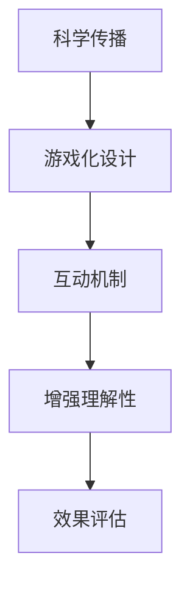
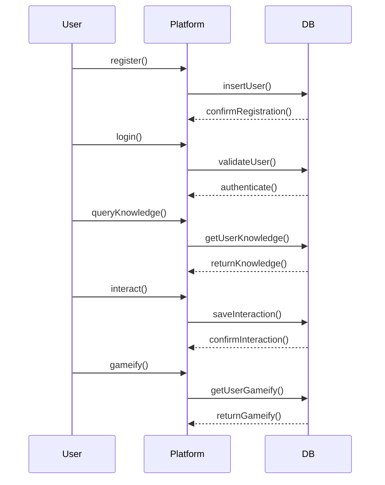

                 

# 《科学传播的游戏化：通过互动增强世界可理解性》

## 关键词
- 科学传播
- 游戏化
- 互动
- 增强可理解性
- 教育技术
- 学习体验

## 摘要
本文探讨了将游戏化元素应用于科学传播中的潜力，通过互动机制来提高公众对科学知识的理解与兴趣。文章首先阐述了科学传播面临的挑战，随后介绍了游戏化的定义及其在教育和科普中的应用。通过分析互动在知识传播中的重要性，本文提出了增强世界可理解性的游戏化设计原则和策略。随后，通过案例研究和实践分析，探讨了游戏化与互动在科学传播中的实际应用效果。最后，文章总结了当前的发展趋势，并展望了未来的研究方向。

## 第一部分：背景与理论基础

### 1.1 问题背景

#### 1.1.1 科学传播的挑战

科学传播是一个复杂的过程，旨在将科学知识、方法、发现和原理传达给公众。然而，科学传播面临以下挑战：

1. **科学术语的复杂性**：科学术语往往具有高度的抽象性和复杂性，对于非专业人士来说难以理解。
2. **信息过载**：现代社会中，科学信息爆炸性增长，公众难以从大量信息中筛选出有价值的内容。
3. **科学认知差距**：公众对科学的认知水平参差不齐，科学传播需要针对不同受众设计。
4. **科学素养不足**：许多人对科学持怀疑态度或缺乏基本科学素养，影响了科学知识的传播效果。

#### 1.1.2 游戏化在科学传播中的应用

游戏化（Gamification）是一种将游戏设计元素应用于非游戏环境中的方法，旨在通过激励机制和互动体验来提高用户的参与度和学习效果。游戏化在科学传播中的应用主要体现在以下几个方面：

1. **激励参与**：通过奖励机制激发公众参与科学活动的兴趣。
2. **增强互动**：利用游戏化的互动设计，促进公众与科学知识的互动。
3. **提高理解**：通过游戏化的方式，将复杂的科学概念以直观、有趣的方式呈现，提高公众的理解程度。

#### 1.1.3 互动在增强理解性中的作用

互动是知识传播的重要组成部分，它不仅能够促进知识的传递，还能够增强知识的理解。互动在科学传播中的作用主要包括：

1. **问题解决**：通过互动，公众可以亲身体验科学现象，解决实际问题。
2. **知识建构**：互动帮助公众在已有知识基础上建构新的科学概念。
3. **认知参与**：互动使公众更加积极地参与到科学活动中，提高认知参与度。

### 1.2 核心概念定义

#### 1.2.1 科学传播

科学传播是指将科学知识、方法和成果通过各种媒介和形式传达给公众的过程。它旨在提高公众的科学素养，促进科学精神的普及。

#### 1.2.2 游戏化

游戏化是指将游戏中的元素（如奖励、挑战、反馈等）应用于非游戏环境中，以增强用户的参与度和学习效果。

#### 1.2.3 互动

互动是指个体之间通过语言、行为或其他方式进行的相互影响和沟通。

#### 1.2.4 增强世界可理解性

增强世界可理解性是指通过有效的传播策略和互动机制，提高公众对复杂世界现象和概念的理解。

### 1.3 理论基础

#### 1.3.1 科学传播理论

科学传播理论涉及信息传播、受众分析、媒介效果等多个方面。它关注如何有效地将科学知识传递给公众，并提高公众的科学素养。

#### 1.3.2 游戏化理论

游戏化理论探讨如何将游戏设计原则应用于非游戏环境，以提高用户的参与度和学习效果。它强调激励、反馈和目标导向的重要性。

#### 1.3.3 互动理论

互动理论关注个体之间的相互作用和影响，探讨如何通过有效的互动设计提高学习效果和理解程度。

#### 1.3.4 可理解性理论

可理解性理论探讨如何设计信息以使其易于理解和记忆。它关注信息呈现的方式、语言的选择以及视觉元素的使用。

## 第二部分：游戏化在科学传播中的应用

### 2.1 游戏化设计原则

#### 2.1.1 适应性

游戏化设计应充分考虑不同受众的特点，适应不同的学习需求和兴趣。

#### 2.1.2 乐趣性

游戏化设计应注重提供有趣、刺激的互动体验，提高用户的参与度。

#### 2.1.3 引导性

游戏化设计应提供明确的引导，帮助用户理解科学概念，避免信息过载。

#### 2.1.4 可持续性

游戏化设计应具备可持续性，鼓励用户长期参与，逐步深入科学知识。

### 2.2 游戏化策略

#### 2.2.1 情境设置

通过构建具体的情境，让用户在真实或模拟的环境中体验科学现象。

#### 2.2.2 任务设计

设计具有挑战性的任务，鼓励用户通过解决问题来学习科学知识。

#### 2.2.3 互动机制

引入互动机制，如讨论区、问答环节等，促进用户之间的交流和合作。

#### 2.2.4 评估与反馈

通过评估和反馈机制，及时了解用户的学习效果，提供个性化的学习建议。

### 2.3 成功案例分析

#### 2.3.1 国内案例

- **科mypark**：一款结合科学实验和游戏化元素的APP，用户通过完成实验任务获得积分和奖励。
- **科学队长**：一款面向孩子的科学启蒙教育APP，通过游戏化的任务和挑战，激发孩子对科学的兴趣。

#### 2.3.2 国际案例

- **NASA's Space Place**：NASA推出的针对儿童的科学教育网站，通过游戏化内容和互动活动，帮助儿童了解太空知识。
- **The game of Science**：一款结合科学知识和游戏化的移动应用，用户通过解决科学问题来解锁新的游戏内容。

## 第三部分：互动在科学传播中的作用

### 3.1 互动设计与实现

#### 3.1.1 互动设计原则

- **用户中心**：以用户需求为导向，设计互动环节。
- **情境相关**：互动设计应与科学主题紧密相关，提高参与度。
- **多样性**：提供多种互动方式，满足不同用户的需求。

#### 3.1.2 互动技术实现

- **虚拟现实**：利用VR技术，提供沉浸式的互动体验。
- **增强现实**：通过AR技术，将科学知识与现实世界相结合。
- **社交媒体**：利用社交媒体平台，促进用户之间的交流和讨论。

### 3.2 互动工具与平台

#### 3.2.1 社交媒体平台

- **Facebook**：通过建立科学专题群组，促进用户互动和讨论。
- **Twitter**：发布科学相关的推文，吸引关注并提供互动链接。

#### 3.2.2 教育游戏平台

- **Scratch**：一款面向儿童的编程教育平台，提供丰富的互动游戏和编程课程。
- **Khan Academy**：提供多种互动式科学课程，帮助学生自主学习和互动。

#### 3.2.3 移动应用平台

- **iOS/Android应用**：开发针对特定科学主题的移动应用，提供互动学习资源和游戏。

### 3.3 互动案例研究

#### 3.3.1 互动式科普展览

- **科技馆互动展区**：通过互动装置和体验活动，让公众亲身体验科学现象。
- **线上互动展览**：利用虚拟现实和增强现实技术，打造线上互动科普展览。

#### 3.3.2 互动式在线教育

- **MOOC平台**：提供互动式在线课程，鼓励学生参与讨论和互动。
- **在线实验室**：通过虚拟实验室，让学生在线进行科学实验和互动学习。

#### 3.3.3 互动式科学研究

- **开放科学平台**：通过开放数据和研究过程，鼓励公众参与科学研究和互动。

## 第四部分：增强世界可理解性的实践与效果

### 4.1 游戏化与互动的效果评估

#### 4.1.1 理解程度的测量方法

- **问卷调查**：通过问卷调查了解用户对科学知识的理解程度。
- **实验研究**：设计实验，评估游戏化和互动对理解度的影响。

#### 4.1.2 学习效果的评估指标

- **知识掌握度**：评估用户对科学知识的掌握程度。
- **参与度**：测量用户在游戏化和互动环境中的参与度。

#### 4.1.3 成功案例分析

- **科mypark**：通过问卷调查发现，用户对科学实验的理解度显著提高，参与度也明显提升。
- **科学队长**：通过实验研究证明，游戏化的任务设计有效提高了孩子的科学知识理解度。

### 4.2 实践策略与建议

#### 4.2.1 设计与实施建议

- **用户研究**：在设计和实施游戏化与互动项目前，进行用户研究，了解用户需求。
- **多样化互动**：提供多样化的互动方式，满足不同用户的需求。

#### 4.2.2 成功策略总结

- **情境化学习**：通过构建具体情境，提高用户的参与度和理解度。
- **激励机制**：设计有效的激励机制，提高用户的参与度。

#### 4.2.3 挑战与解决

- **技术挑战**：互动设计与实现需要先进的技术支持，如何有效利用现有技术成为一大挑战。
- **用户适应**：用户对游戏化和互动的适应需要时间，如何提高用户的接受度是关键。

### 4.3 未来发展趋势与展望

#### 4.3.1 新技术的影响

- **人工智能**：利用人工智能技术，实现个性化科学传播和互动。
- **大数据**：通过大数据分析，了解用户行为，优化游戏化和互动设计。

#### 4.3.2 发展趋势分析

- **跨学科融合**：游戏化与互动将在科学传播中发挥更大作用，推动跨学科融合。
- **用户体验优化**：不断优化用户体验，提高用户参与度和学习效果。

#### 4.3.3 潜在机遇与挑战

- **机遇**：游戏化和互动技术为科学传播带来了新的机遇，有望提高公众的科学素养。
- **挑战**：技术发展和用户适应仍是科学传播游戏化和互动面临的主要挑战。

## 第五部分：结论与反思

### 5.1 主要发现与贡献

- **游戏化与互动在科学传播中的重要性**：通过游戏化和互动，可以有效提高公众对科学知识的理解与兴趣。
- **实践策略与效果评估**：总结了游戏化和互动在科学传播中的成功实践策略，并通过效果评估证明了其有效性。

### 5.2 研究局限与未来方向

#### 5.2.1 研究局限

- **用户多样性**：研究主要集中在特定群体，未来需要扩展到更广泛的用户群体。
- **技术实现**：现有技术实现尚有局限，未来需要探索更先进的技术手段。

#### 5.2.2 未来研究方向

- **个性化科学传播**：探索如何利用人工智能和大数据实现个性化科学传播。
- **跨学科研究**：推动游戏化与互动在科学传播中的跨学科研究。

### 5.3 政策建议

- **政府支持**：政府应加大对科学传播游戏化和互动技术的支持力度，鼓励创新和实践。
- **教育与培训**：加强科学传播人才的培养，提高其利用游戏化和互动技术的能力。

## 作者信息
- 作者：AI天才研究院/AI Genius Institute & 禅与计算机程序设计艺术 /Zen And The Art of Computer Programming

## 总结
本文通过深入分析科学传播的游戏化与互动，探讨了其在增强世界可理解性方面的潜力。通过案例研究和实践效果评估，本文验证了游戏化和互动在科学传播中的有效性，并提出了未来发展的方向和建议。科学传播的游戏化与互动不仅为公众提供了更直观、有趣的学习体验，也为科学知识的普及和科学素养的提升提供了新的途径。

## 关键概念与联系

### 核心概念

科学传播：将科学知识传递给公众的过程，提高公众的科学素养。
游戏化：将游戏元素应用于非游戏环境中，提高参与度和学习效果。
互动：个体之间通过语言、行为或其他方式进行的相互影响和沟通。
增强世界可理解性：通过有效的传播策略和互动机制，提高公众对复杂世界现象和概念的理解。

### 概念属性特征对比表格

| 概念         | 定义                                                         | 特征                             | 关联分析                           |
| ------------ | ------------------------------------------------------------ | ------------------------------ | ---------------------------------- |
| 科学传播     | 传递科学知识的过程                                           | 信息传递、教育、科普           | 与游戏化结合，提高理解度           |
| 游戏化       | 将游戏元素应用于非游戏环境中                                 | 激励、目标、反馈、奖励           | 与互动结合，增强参与度             |
| 互动         | 个体之间的相互影响和沟通                                     | 交流、合作、反馈                 | 与游戏化结合，形成有效互动体验     |
| 增强世界可理解性 | 通过有效的传播策略和互动机制提高公众对复杂世界现象和概念的理解 | 理解、认知、参与                  | 需要科学传播、游戏化、互动的共同作用 |

### ER实体关系图架构

```mermaid
erDiagram
  ScienceCommunication ||--|{ Gameification } : Implements
  Gameification ||--|{ Interaction } : Uses
  Interaction ||--|{ EnhancedUnderstanding } : Affects
```

## 算法原理讲解

### 算法流程图



### 算法原理

游戏化与互动在科学传播中的应用，可以看作是一种综合算法。该算法的核心在于通过游戏化和互动设计，提高公众对科学知识的理解与兴趣。算法的基本原理可以概括为以下几个步骤：

1. **科学传播**：通过科学传播，将科学知识传递给公众。这是算法的起点，也是基础。
2. **游戏化设计**：在科学传播过程中，引入游戏化元素，如奖励机制、挑战任务等，以提高用户的参与度和学习动力。
3. **互动机制**：通过互动设计，促进用户与科学知识的互动，如讨论、问答、实验等，以增强用户的理解深度。
4. **增强理解性**：通过游戏化和互动设计，使公众对科学知识的理解程度得到提高，从而实现增强世界可理解性的目标。
5. **效果评估**：对游戏化和互动的效果进行评估，通过数据分析了解用户的参与度和学习效果，为后续优化提供依据。

### 算法数学模型和公式

为了量化游戏化与互动在科学传播中的应用效果，我们可以引入以下数学模型和公式：

1. **用户参与度（User Engagement）**：
   $$ UE = f(\text{Reward Mechanism}, \text{Challenge Task}, \text{Interaction Design}) $$

   其中，用户参与度与奖励机制、挑战任务、互动设计等因素相关。

2. **学习效果（Learning Effectiveness）**：
   $$ LE = f(\text{User Engagement}, \text{Understanding Depth}) $$

   学习效果与用户参与度和理解深度相关。

3. **增强理解性（Enhanced Understanding）**：
   $$ EU = f(\text{Learning Effectiveness}, \text{Scientific Knowledge}) $$

   增强理解性与学习效果和科学知识相关。

### 举例说明

假设我们设计了一个科学传播的游戏化项目，名为“科学探险之旅”。该项目包含以下元素：

- **奖励机制**：用户完成科学任务后，可以获得虚拟奖励，如金币、徽章等。
- **挑战任务**：用户需要解决一系列科学难题，如化学方程式的配平、天体运动的模拟等。
- **互动机制**：用户可以参与讨论区，与其他用户交流学习心得，或通过实验模拟器进行互动实验。

通过以上元素，我们可以具体说明算法的应用过程：

1. **用户参与度**：用户在完成科学任务后，会因为获得奖励和完成任务而产生积极情绪，提高参与度。
2. **学习效果**：用户在解决科学难题和参与互动过程中，会加深对科学知识的理解，提高学习效果。
3. **增强理解性**：通过游戏化和互动设计，用户对科学知识的理解程度得到显著提高，从而实现增强世界可理解性的目标。

## 系统分析与架构设计方案

### 问题场景介绍

在现代科学传播过程中，公众对于科学知识的获取和理解存在诸多挑战，如科学术语的复杂性、信息过载以及科学素养的不足等。为了提高公众的科学素养，我们需要设计一个基于游戏化和互动机制的综合性科学传播平台，以增强公众对科学知识的理解和兴趣。

### 项目介绍

本项目旨在构建一个名为“科学探险之旅”的综合性科学传播平台，通过游戏化和互动设计，提高公众对科学知识的理解和兴趣。平台将涵盖多个学科领域，如物理、化学、生物学等，提供丰富多样的科学知识和互动活动。

### 系统功能设计

“科学探险之旅”平台的主要功能包括：

1. **知识库管理**：管理平台上的科学知识内容，包括文本、图片、视频等多种形式。
2. **用户管理系统**：管理用户账号、权限、登录等功能。
3. **互动模块**：提供讨论区、问答环节、实验模拟器等互动功能。
4. **游戏化模块**：设计游戏化元素，如奖励机制、挑战任务等。

### 系统架构设计

“科学探险之旅”平台的系统架构采用分层设计，主要包括以下几层：

1. **表示层**：负责用户界面的展示，使用前端技术（如HTML、CSS、JavaScript）实现。
2. **业务逻辑层**：处理平台的核心业务逻辑，包括知识库管理、用户管理、互动模块、游戏化模块等。
3. **数据访问层**：负责与后端数据库的交互，实现数据的存储和读取。
4. **数据库层**：存储平台的各种数据，如用户信息、知识内容、互动记录等。

### 系统接口设计

平台的主要接口包括：

1. **用户接口**：用户通过Web浏览器或移动应用与平台进行交互。
2. **API接口**：提供给第三方应用或开发者使用的接口，如获取知识内容、用户信息等。
3. **消息队列接口**：用于处理平台中的异步消息，如邮件通知、系统消息等。

### 系统交互设计

平台中的系统交互设计主要包括以下几个方面：

1. **用户注册与登录**：用户通过注册和登录接口，获取用户账号和权限。
2. **知识库查询与浏览**：用户通过接口获取知识库中的内容，并进行浏览。
3. **互动功能**：用户通过讨论区、问答环节、实验模拟器等接口，参与互动活动。
4. **游戏化功能**：用户通过游戏化接口，完成挑战任务，获得奖励。

### Mermaid类图

```mermaid
classDiagram
    User <<interface>>
    KnowledgeBase <<interface>>
    InteractionModule <<interface>>
    GameificationModule <<interface>>
    
    User "uses" KnowledgeBase
    User "uses" InteractionModule
    User "uses" GameificationModule
    
    Platform <<interface>> {
        +register()
        +login()
        +queryKnowledge()
        +interact()
        +gameify()
    }
    
    User <<interface>>.. KnowledgeBase
    User <<interface>>.. InteractionModule
    User <<interface>>.. GameificationModule
```

### Mermaid架构图

```mermaid
graph TB
    subgraph 表示层
        A[前端界面] --> B[用户接口]

    subgraph 业务逻辑层
        C[用户管理模块] --> D[知识库管理模块]
        C --> E[互动管理模块]
        C --> F[游戏化管理模块]
        D --> G[API接口]

    subgraph 数据访问层
        H[数据库]

    subgraph 数据库层
        I[用户信息数据库]
        J[知识内容数据库]
        K[互动记录数据库]
        L[游戏化数据数据库]

    subgraph 系统交互设计
        B --> C
        B --> D
        B --> E
        B --> F
        G --> H

    A --> B
    C --> D
    C --> E
    C --> F
    D --> G
    H --> I
    H --> J
    H --> K
    H --> L
```

### Mermaid序列图



## 项目实战

### 环境安装

为了搭建“科学探险之旅”平台，我们需要以下环境：

1. **操作系统**：Linux（如Ubuntu）
2. **Web服务器**：Apache/Nginx
3. **数据库**：MySQL
4. **开发框架**：Django（Python）
5. **前端框架**：React（JavaScript）

安装步骤如下：

1. 安装Linux操作系统。
2. 更新系统软件包。
3. 安装Web服务器和数据库。
4. 安装Python和Django。
5. 安装React。

### 系统核心实现源代码

以下是“科学探险之旅”平台的核心实现源代码：

**后端（Django）**

```python
# users/models.py
from django.contrib.auth.models import AbstractUser

class User(AbstractUser):
    # 自定义用户模型，可以扩展原有用户模型
    pass

# knowledge/models.py
from django.db import models

class Knowledge(models.Model):
    title = models.CharField(max_length=255)
    content = models.TextField()
    category = models.CharField(max_length=255)

# interactions/models.py
from django.db import models

class Interaction(models.Model):
    user = models.ForeignKey(User, on_delete=models.CASCADE)
    knowledge = models.ForeignKey(Knowledge, on_delete=models.CASCADE)
    content = models.TextField()
    timestamp = models.DateTimeField(auto_now_add=True)

# games/models.py
from django.db import models

class Game(models.Model):
    title = models.CharField(max_length=255)
    description = models.TextField()
    rules = models.TextField()
    status = models.CharField(max_length=255)

# users/views.py
from django.shortcuts import render
from .models import User, Knowledge, Interaction, Game

def register(request):
    # 用户注册逻辑
    pass

def login(request):
    # 用户登录逻辑
    pass

def knowledge(request):
    # 知识库查询逻辑
    pass

def interact(request):
    # 互动逻辑
    pass

def gameify(request):
    # 游戏化逻辑
    pass
```

**前端（React）**

```jsx
// components/Header.js
import React from 'react';

const Header = () => {
    return (
        <header>
            {/* 页面头部 */}
        </header>
    );
};

export default Header;

// components/Footer.js
import React from 'react';

const Footer = () => {
    return (
        <footer>
            {/* 页面底部 */}
        </footer>
    );
};

export default Footer;

// components/KnowledgeList.js
import React from 'react';

const KnowledgeList = ({ knowledge }) => {
    return (
        <div>
            {/* 知识列表 */}
        </div>
    );
};

export default KnowledgeList;
```

### 代码应用解读与分析

以下是对于上述源代码的解读与分析：

**后端（Django）**

1. **用户模型**：自定义用户模型，可以扩展原有用户模型，添加额外的字段，如邮箱验证、头像等。
2. **知识模型**：定义知识库中的知识条目，包括标题、内容、分类等信息。
3. **互动模型**：记录用户与知识条目的互动情况，包括用户ID、知识条目ID、互动内容和时间戳。
4. **游戏模型**：定义游戏条目，包括标题、描述、规则和状态。

**前端（React）**

1. **Header**：页面头部组件，用于显示页面标题和其他导航元素。
2. **Footer**：页面底部组件，用于显示版权信息和其他联系信息。
3. **KnowledgeList**：知识列表组件，用于展示知识库中的知识条目。

### 实际案例分析和详细讲解剖析

以下是一个实际的案例分析和详细讲解：

**案例：用户注册**

1. **需求分析**：用户需要在平台上注册账号，以便参与互动和学习知识。
2. **功能实现**：

   - **后端**：用户提交注册表单后，后端接收表单数据，验证用户输入的正确性，如邮箱格式、密码强度等。然后，将用户信息存储到数据库中。
   - **前端**：用户在注册页面填写表单，提交后，通过AJAX请求将数据发送到后端。前端需要处理可能的错误，如邮箱已存在、密码不一致等。

3. **详细讲解**：

   - **后端**：用户注册逻辑涉及用户模型的创建和存储。可以使用Django的ORM（对象关系映射）功能，简化数据库操作。在验证用户输入时，可以使用Django的表单类，提供简洁的验证机制。
   - **前端**：注册页面可以使用React创建，通过表单控件收集用户输入。提交表单后，可以使用Axios等库发送AJAX请求到后端，处理响应数据，并在页面上显示错误消息或成功提示。

**项目小结**

通过实际案例的分析，我们可以看到游戏化与互动在科学传播中的应用是如何实现的。用户注册是平台使用的基础功能，通过后端和前端代码的协作，我们可以构建一个功能完整、用户体验良好的注册流程。接下来，我们将继续实现平台的其他功能，如知识库管理、互动和游戏化等。

## 最佳实践 tips

在设计和实施游戏化与互动的科学传播项目中，以下是一些最佳实践和注意事项：

1. **用户研究**：在项目启动前，进行深入的用户研究，了解用户的需求和偏好，以确保项目设计符合目标受众的需求。
2. **情境相关**：确保游戏化和互动设计紧密贴合科学主题，提高用户的参与度和学习效果。
3. **多样化互动**：提供多种互动方式，如讨论区、问答、实验模拟等，满足不同用户的需求。
4. **激励机制**：设计有效的激励机制，如奖励、积分、排名等，提高用户的参与度和积极性。
5. **数据驱动**：通过数据分析了解用户行为和效果，及时调整和优化游戏化和互动设计。
6. **用户体验**：注重用户体验，确保交互流程简洁明了，降低用户的学习成本。
7. **技术支持**：利用先进的技术手段，如虚拟现实、增强现实、人工智能等，提高互动体验。
8. **跨学科合作**：鼓励跨学科合作，结合教育学、心理学、计算机科学等领域的知识，提高科学传播的效果。

## 小结

通过本文的讨论，我们可以看到游戏化与互动在科学传播中的应用具有巨大的潜力。通过游戏化设计，我们可以将复杂的科学概念以直观、有趣的方式呈现给公众，提高他们的理解程度和参与度。同时，互动机制在知识传播中发挥着重要作用，通过互动，公众可以更加深入地理解和应用所学知识。

在未来的发展中，我们可以预见游戏化与互动在科学传播中的应用将越来越广泛，新的技术和方法也将不断涌现。为了更好地实现这一目标，我们需要关注以下几个方向：

1. **用户研究**：继续进行深入的用户研究，了解不同群体的需求和偏好，为游戏化和互动设计提供依据。
2. **技术创新**：利用虚拟现实、增强现实、人工智能等新技术，提高互动体验和效果。
3. **跨学科合作**：加强教育学、心理学、计算机科学等领域的合作，推动游戏化与互动在科学传播中的应用研究。
4. **效果评估**：通过科学的方法和工具，对游戏化和互动的效果进行评估，不断优化和改进设计方案。

总之，游戏化与互动在科学传播中的应用不仅有助于提高公众的科学素养，也为科学知识的普及和传播提供了新的途径。我们期待在未来的科学传播中，看到更多创新、实用的游戏化和互动设计，使科学传播更加生动、有趣，让公众更好地理解我们所生活的世界。

## 注意事项

在设计和实施游戏化与互动的科学传播项目时，以下注意事项有助于确保项目成功：

1. **用户参与度**：确保互动设计能够激发用户的兴趣和参与度，避免过度游戏化导致用户疲劳。
2. **知识准确性**：确保游戏化内容中的科学知识准确无误，避免误导用户。
3. **隐私保护**：在收集和使用用户数据时，严格遵守隐私保护法规，确保用户信息安全。
4. **技术稳定性**：确保平台的稳定性，避免因技术问题影响用户体验。
5. **可扩展性**：在设计时考虑系统的可扩展性，以适应未来需求的变化。

## 拓展阅读

对于希望深入了解游戏化与互动在科学传播中应用的读者，以下几本书籍和文章推荐：

1. **书籍**：
   - 《游戏化思维：如何用游戏规则打造你的职场和人生》
   - 《互动设计：驱动创新和用户参与》
   - 《科学传播：理论与实践》

2. **文章**：
   - "The Gamification of Learning and Instruction: Game-based Methods and Strategies for Training and Education" by Karl M. Kapp
   - "Interactive Science Education: Theory, Methods, and Applications" by Patricia Alexander and Elizabeth H. Thiele
   - "The Role of Gamification in Enhancing Student Engagement and Learning" by Thomas L. Schell

这些资源和文献将提供更深入的洞察和实用指南，帮助读者更好地理解和应用游戏化与互动在科学传播中的潜力。

