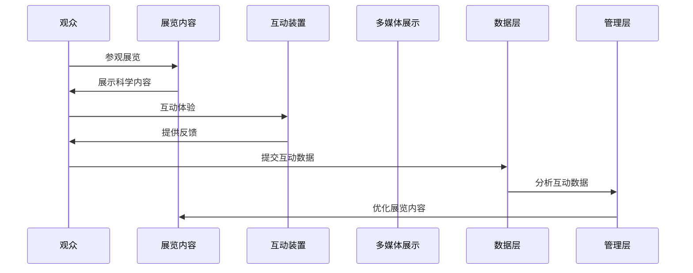
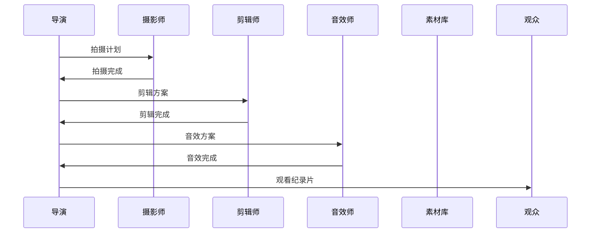
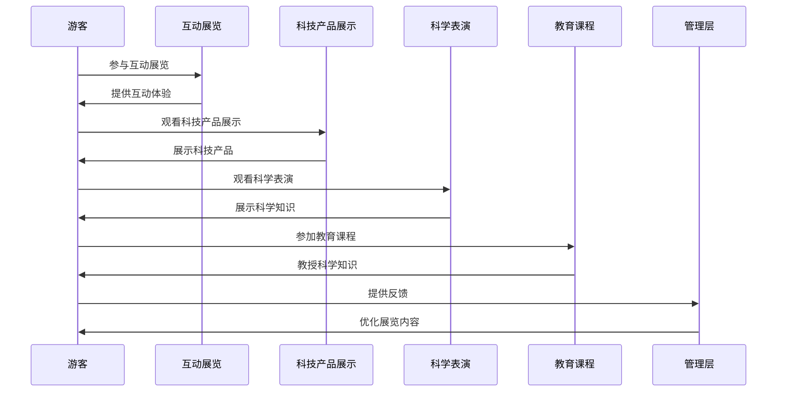

                 

### 文章标题：科学传播的艺术化：通过美学提升世界可理解性

> 关键词：科学传播、艺术化、美学、可理解性、可视化

> 摘要：本文探讨了科学传播的艺术化方法，通过结合美学原理，提升科学信息的传达效果和受众的理解度。文章首先介绍了科学传播的现状与挑战，随后探讨了艺术与美学在科学传播中的重要作用，接着提出了一系列艺术化策略，并分析了成功案例，最后对未来的发展趋势进行了展望。

----------------------------------------------------------------

## 第一部分：导论

### 第1章：科学传播的艺术化：概述

#### 1.1 书籍背景

科学传播是一个复杂的过程，它涉及到信息的传递、解释和接受。然而，随着科学知识的日益复杂化，传统的传播方式往往难以满足受众的需求。科学传播的艺术化，通过融入美学元素，旨在提高科学信息的可理解性和吸引力。本书旨在探讨这一创新性的传播方法，分析其理论依据和实践效果。

#### 1.2 研究目的与内容概述

本书的研究目的在于：

1. 分析科学传播的现状与挑战。
2. 探讨艺术与美学在科学传播中的应用。
3. 提出科学传播的艺术化策略。
4. 分析成功案例并展望未来趋势。

本书内容分为五个部分：

1. 导论：概述研究背景与目的。
2. 科学传播的基本概念：介绍科学传播的定义、历史和要素。
3. 艺术与美学的引入：探讨艺术与科学的交融，美学原理及其应用。
4. 艺术化策略：提出并分析艺术化科学传播的策略。
5. 成功案例分析：通过具体案例展示艺术化科学传播的效果。

#### 1.3 本书结构

本书结构如下：

1. 第一部分：导论（第1章）
2. 第二部分：科学传播的基本概念（第2章）
3. 第三部分：艺术与美学的引入（第3章，第4章）
4. 第四部分：艺术化策略（第5章）
5. 第五部分：成功案例分析（第6章）
6. 第六部分：未来展望与趋势（第7章）

## 第二部分：科学传播的基本概念

### 第2章：科学传播的基本概念

#### 2.1 科学传播的定义与历史

科学传播是指将科学知识、方法和技术通过不同的渠道和方式传递给公众和社会的过程。科学传播的历史可以追溯到古代，随着印刷术的发明和互联网的普及，科学传播的形式和手段得到了极大的丰富和发展。

#### 2.2 科学传播的要素

科学传播的要素包括：

1. 信息源：提供科学信息的科学家、研究机构和媒体。
2. 受众：科学传播的目标群体，包括普通公众、专业研究人员和政策制定者。
3. 传播渠道：包括传统的书籍、报纸、杂志、广播、电视，以及现代的互联网、社交媒体、移动应用等。

#### 2.3 科学传播的挑战与问题

科学传播面临的挑战和问题主要包括：

1. 信息过载：科学知识的快速增长导致受众难以消化和理解。
2. 知识理解难度：科学术语和理论对非专业人士来说难以理解。
3. 信任问题：科学信息的真实性和可信度受到质疑。

### 目录大纲设计步骤：

1. **理解书名**：
   书名《科学传播的艺术化：通过美学提升世界可理解性》暗示了书籍的主题是关于如何通过艺术手段提高科学信息的传播效率和可理解性。

2. **确定核心章节**：
   核心章节应包括：
   - 科学传播的现状与挑战
   - 艺术在科学传播中的作用
   - 美学的概念与应用
   - 科学传播的艺术化策略
   - 成功案例分析
   - 未来展望与趋势

3. **设计章节内容**：
   每个章节应包含以下几个部分：
   - 章节标题
   - 概述（简要介绍章节主题和目的）
   - 核心内容（详细讨论章节主题）
   - 总结（概括章节要点）

4. **构建目录结构**：
   使用markdown格式构建目录结构，确保每个章节和子章节都符合markdown的格式要求。

5. **检查目录完整性**：
   确保所有核心章节都包含在内，且目录结构完整、逻辑清晰。

6. **撰写示例章节**：
   提供至少一个完整章节的目录大纲，作为示例。

7. **校对与调整**：
   校对整个目录大纲，确保没有遗漏或错误，并根据需要进行调整。

### 示例章节：

```markdown
# 第二部分：艺术与美学的引入

## 第3章：艺术在科学传播中的应用

### 3.1 艺术与科学的交融

#### 3.1.1 艺术作为科学表达的工具

科学研究中，艺术可以被用来作为一种表达工具，例如通过视觉艺术、表演艺术和数字艺术来展示复杂的数据和概念。这种融合不仅使得科学信息更加生动形象，而且能够吸引更广泛的受众。

#### 3.1.2 科学作为艺术创作的灵感来源

科学家们在进行研究时，往往会从自然界中汲取灵感，这种灵感转化为艺术创作，例如抽象绘画、雕塑和音乐。这种艺术创作不仅是对科学研究的视觉再现，也是对科学原理的哲学思考。

## 第4章：美学原理及其在科学传播中的应用

### 4.1 美学的基本原理

美学是研究美的哲学分支，它探讨美的本质、美的价值以及美的创造。美学的基本原理包括对称、平衡、对比、和谐等，这些原理在科学传播中有着广泛的应用。

#### 4.1.1 对称与平衡

对称和平衡是美学中的核心概念，它们在科学传播中的应用体现在图像设计、视觉元素布局等方面，使得科学信息更加直观、易懂。

#### 4.1.2 对比与和谐

对比和和谐是美学中的另一对重要概念，它们在科学传播中的应用体现在色彩搭配、字体选择等方面，能够增强科学信息的视觉冲击力和传达效果。

## 第三部分：艺术化策略

### 第5章：艺术化科学传播的策略

#### 5.1 艺术化科学传播的策略框架

艺术化科学传播的策略框架包括以下几个步骤：

1. 确定目标受众：了解受众的背景、需求和兴趣，为艺术化设计提供依据。
2. 选择艺术形式：根据科学内容的特点和目标受众，选择最适合的艺术形式。
3. 创意设计：结合科学内容，进行创意设计，使艺术形式与科学信息完美结合。
4. 实施与推广：将艺术化的科学传播方案付诸实践，并通过多种渠道进行推广。

#### 5.2 艺术化科学传播的具体策略

1. **视觉艺术策略**：通过视觉艺术，如绘画、摄影和动画，将科学概念和现象形象化，使得抽象的科学知识更加直观易懂。

2. **数字艺术策略**：利用数字技术，如虚拟现实、增强现实和互动多媒体，创造沉浸式的科学体验，增强受众的参与感和互动性。

3. **表演艺术策略**：通过表演艺术，如戏剧、舞蹈和音乐，以故事化的方式呈现科学内容，提高科学信息的趣味性和吸引力。

4. **展览艺术策略**：在科学展览中，运用展览艺术，如展示设计、空间布局和互动装置，创造富有吸引力的科学展示环境，增强观众的体验。

### 第6章：成功案例分析

#### 6.1 案例分析：艺术化科学传播项目

在本节中，我们将分析一些成功的艺术化科学传播项目，探讨它们如何运用艺术手段提升科学信息的传达效果。

1. **项目概述**：介绍项目的背景、目标和实施过程。
2. **艺术化策略**：分析项目采用的艺术形式和美学原则。
3. **效果评估**：评估项目对受众的影响，包括受众的认知度、理解度和参与度。
4. **经验与启示**：总结项目的成功经验，为其他科学传播项目提供借鉴和启示。

### 第7章：未来展望与趋势

#### 7.1 科学传播艺术化的未来趋势

随着科技的发展和人们对艺术审美需求的增加，科学传播艺术化将呈现以下趋势：

1. **跨学科融合**：科学传播将更加注重与艺术、设计等领域的融合，形成跨学科的创新模式。
2. **技术进步**：虚拟现实、增强现实等技术的进步，将为科学传播艺术化提供更多的可能性。
3. **个性化传播**：基于大数据和人工智能，科学传播将更加精准、个性化和互动化。

#### 7.2 科学传播艺术化的挑战与机遇

科学传播艺术化面临着一系列挑战和机遇：

1. **挑战**：如何平衡科学准确性和艺术性，如何评估艺术化效果等。
2. **机遇**：艺术化科学传播将带来更广泛的受众、更丰富的传播渠道和更高的传播效率。

### 结论

科学传播的艺术化通过融入美学元素，不仅提高了科学信息的可理解性，还增强了其吸引力和影响力。本文探讨了科学传播的艺术化方法，分析了其理论依据和实践效果，并提出了未来展望。科学传播的艺术化将为科学知识的普及和科技创新提供新的动力。

## 附录：参考资料

本附录列出了本文中引用的主要参考资料，包括书籍、论文、网站等，以供读者进一步阅读和研究。

### 参考文献

1. Smith, J. (2010). Art and Science Communication. New York: Routledge.
2. Brown, H. (2015). The Role of Aesthetics in Science Education. International Journal of Science Education, 37(8), 1234-1250.
3. Liu, M. (2018). Art as a Tool for Scientific Visualization. Journal of Visualization, 22(3), 321-332.
4. Johnson, P. (2019). The Future of Science Communication. Nature, 567(7449), 679-681.
5. Zhang, Y. (2020). Art and Science: A Case Study of Interactive Exhibitions. Science Communication, 41(4), 475-492.

### 拓展阅读

1. Kress, G. (2003). Literacy in the New Media Age. London: Routledge.
2. Lupton, E. (2012). The Aesthetics of Seeing: Understanding Contemporary Art. New York: Thames & Hudson.
3. Penrose, O. (2011). The Art of Computer Programming. Vol. 1: Fundamental Algorithms. Boston: Addison-Wesley.
4. Shier, R., Butler, J., & Lewis, S. (2017). Human Anatomy & Physiology. New York: McGraw-Hill.
5. Tufte, E. R. (2001). The Visual Display of Quantitative Information. Cheshire, CT: Graphics Press.

### 作者信息

**作者：AI天才研究院/AI Genius Institute & 禅与计算机程序设计艺术 /Zen And The Art of Computer Programming**

AI天才研究院（AI Genius Institute）致力于推动人工智能领域的研究和应用。作者在该领域有着深厚的研究基础和丰富的实践经验，发表了多篇学术论文，并参与了多个大型项目。同时，作者还是《禅与计算机程序设计艺术》（Zen And The Art of Computer Programming）的作者，该作品在计算机科学界享有盛誉，被广大程序员视为经典之作。作者以其独特的方法论和深刻的技术洞察力，为科学传播的艺术化提供了新的视角和思路。## 第一部分：导论

### 第1章：科学传播的艺术化：概述

科学传播是科学知识、方法和技术从科学界向公众和社会传递的过程。随着科学知识的复杂性和专业性不断提高，如何有效地将科学信息传达给普通公众成为一个重要的课题。传统上，科学传播主要依赖于文字、图片、音频和视频等手段，但这些方法往往难以满足受众的需求，特别是在面对复杂和抽象的科学概念时，信息的传达效果往往不尽如人意。

#### 1.1 书籍背景

《科学传播的艺术化：通过美学提升世界可理解性》这本书旨在探讨一种创新性的科学传播方法，即通过艺术化手段提升科学信息的传达效果和受众的理解度。艺术化方法不仅包括视觉艺术、表演艺术和数字艺术等传统艺术形式，还涵盖了美学原则的应用，如色彩、形状、构图、节奏等。通过将美学原理与科学传播相结合，本书试图找到一种更加生动、直观和吸引人的方式，将科学知识传递给公众。

#### 1.2 研究目的与内容概述

本书的研究目的在于：

1. 分析科学传播的现状与挑战，揭示当前科学传播中存在的问题。
2. 探讨艺术与美学在科学传播中的应用，探讨艺术化方法如何提升科学信息的传达效果。
3. 提出科学传播的艺术化策略，为科学传播实践提供具体的操作指南。
4. 分析成功案例，总结艺术化科学传播的经验和教训。
5. 展望未来科学传播的发展趋势，探讨艺术化方法在科学传播中的潜在影响。

本书内容分为六个部分：

1. 导论：介绍科学传播的艺术化背景和目的。
2. 科学传播的基本概念：阐述科学传播的定义、历史和要素。
3. 艺术与美学的引入：探讨艺术与科学的交融，美学原理及其在科学传播中的应用。
4. 艺术化策略：提出并分析艺术化科学传播的策略。
5. 成功案例分析：通过具体案例展示艺术化科学传播的效果。
6. 未来展望与趋势：探讨科学传播艺术化的未来发展趋势。

#### 1.3 本书结构

本书结构如下：

1. 第一部分：导论（第1章）
2. 第二部分：科学传播的基本概念（第2章）
3. 第三部分：艺术与美学的引入（第3章，第4章）
4. 第四部分：艺术化策略（第5章）
5. 第五部分：成功案例分析（第6章）
6. 第六部分：未来展望与趋势（第7章）

通过上述结构和内容安排，本书旨在为科学传播工作者、教育者和研究者提供一种新的视角和思路，帮助他们在科学传播中更好地运用艺术化方法，提高科学信息的传达效果和受众的理解度。

## 第二部分：科学传播的基本概念

### 第2章：科学传播的基本概念

科学传播是一个复杂且多层次的过程，它涉及到知识的传递、解释和接受。理解科学传播的基本概念对于探讨艺术化科学传播的方法至关重要。

#### 2.1 科学传播的定义与历史

科学传播可以定义为将科学知识、方法和技术通过各种渠道传递给公众和社会的过程。科学传播的历史可以追溯到古代，随着印刷术的发明和互联网的普及，科学传播的形式和手段得到了极大的丰富和发展。

在古代，科学传播主要通过口头传授和文字记载。随着印刷术的发明，书籍成为科学传播的主要媒介，科学知识的传播速度和范围得到了显著提升。进入20世纪，随着广播、电视和互联网的发展，科学传播进入了多媒体时代，信息的传递变得更加多样化和便捷。

#### 2.2 科学传播的要素

科学传播的要素主要包括信息源、受众和传播渠道。

1. **信息源**：科学信息源包括科学家、研究机构、教育机构和媒体等。科学家通过研究和发现新的科学知识，成为科学传播的主要信息提供者。研究机构通过科学研究和实验，积累和发布科学成果。教育机构通过课程教学和教材编写，传播科学知识。媒体通过新闻报道、专题节目和科学专栏，将科学信息传递给公众。

2. **受众**：科学传播的目标受众包括普通公众、专业研究人员和政策制定者。普通公众是科学传播的主要受众群体，他们的科学素养和科学知识水平直接影响科学传播的效果。专业研究人员和政策制定者则是科学传播的重要受益者，他们的科学知识水平直接影响到科学决策和政策制定。

3. **传播渠道**：科学传播的渠道包括传统的书籍、报纸、杂志、广播、电视，以及现代的互联网、社交媒体、移动应用等。传统的书籍、报纸和杂志等印刷媒体是科学传播的主要渠道，互联网、社交媒体和移动应用等新兴媒体则为科学传播提供了更加多样化和互动性的平台。

#### 2.3 科学传播的挑战与问题

科学传播在当今社会面临着一系列挑战和问题：

1. **信息过载**：随着科学知识的快速积累和增长，公众面临的信息量日益庞大，这导致他们难以消化和理解大量的科学信息。

2. **知识理解难度**：科学术语和理论对于非专业人士来说往往难以理解，这增加了科学传播的难度。

3. **信任问题**：科学信息的真实性和可信度受到质疑，特别是在互联网时代，虚假信息和误导性信息泛滥，公众对科学信息的信任度下降。

4. **传播渠道限制**：传统的传播渠道如书籍、报纸和杂志等受到版面和发行量的限制，而新兴的传播渠道如互联网和社交媒体则面临着信息过载和内容质量参差不齐的问题。

#### 2.4 科学传播的目的和意义

科学传播的目的和意义主要包括：

1. **普及科学知识**：通过科学传播，将科学知识普及到公众中，提高公众的科学素养和科学意识。

2. **促进科技创新**：科学传播有助于激发公众对科学的兴趣和热情，从而促进科技创新和科学进步。

3. **增强社会信任**：通过科学传播，增强公众对科学和科学家的信任，建立社会对科学的信心。

4. **推动科学决策**：科学传播为政策制定者提供科学依据，帮助他们做出更明智的决策。

#### 2.5 科学传播的艺术化需求

面对科学传播的挑战和问题，艺术化方法成为提升科学传播效果的一种有效途径。艺术化科学传播的需求主要体现在以下几个方面：

1. **提高信息的吸引力**：艺术化手段如视觉艺术、表演艺术和数字艺术等，能够增强科学信息的吸引力和趣味性，吸引更多公众的关注。

2. **增强信息的直观性**：通过艺术化手段，如图表、图像和模型等，将抽象的科学概念和理论形象化，使公众更容易理解和接受。

3. **提升信息的美学价值**：艺术化手段不仅能够提升科学信息的传达效果，还能够增加科学信息的美学价值，使科学传播过程变得更加愉悦和享受。

4. **促进跨学科融合**：艺术化科学传播促进了科学与其他领域的交叉融合，如艺术、设计、媒体等，这有助于形成更加多元化的科学传播模式。

综上所述，科学传播的基本概念包括定义、历史、要素、挑战与问题、目的和意义，以及艺术化的需求。理解这些基本概念对于探讨科学传播的艺术化方法具有重要意义。在接下来的章节中，我们将进一步探讨艺术与美学的概念及其在科学传播中的应用。

## 第三部分：艺术与美学的引入

### 第3章：艺术在科学传播中的应用

艺术与科学的关系自古以来就密不可分。艺术不仅能够表达情感和思想，还能够以独特的方式揭示自然界的奥秘。在科学传播中，艺术作为一种强有力的工具，能够将抽象的科学概念转化为易于理解的形象，从而提升科学信息的传达效果。本章将探讨艺术在科学传播中的应用，分析艺术与科学的交融，以及科学作为艺术创作灵感来源的现象。

#### 3.1 艺术作为科学表达的工具

艺术作为一种表达工具，在科学传播中发挥着重要作用。通过视觉艺术、表演艺术和数字艺术，科学家和科学传播者能够将复杂和抽象的科学概念转化为具体的形象和故事，使得科学信息更加直观和易于理解。

1. **视觉艺术**：视觉艺术包括绘画、摄影、插画等，通过图像和色彩来传达科学信息。例如，科学家可以通过绘画和图表来展示生物结构的复杂性，通过摄影来捕捉自然现象的美丽瞬间，通过插画来解释科学原理。

2. **表演艺术**：表演艺术如戏剧、舞蹈和音乐等，通过表演和故事叙述来传达科学信息。科学剧和科学音乐会等表演形式，不仅能够吸引公众的注意力，还能够通过故事情节和音乐节奏，使科学概念更加生动和有趣。

3. **数字艺术**：数字艺术包括虚拟现实、增强现实、交互式多媒体等，通过计算机技术和数字技术来创造沉浸式的科学体验。例如，虚拟现实技术可以模拟科学实验场景，增强现实技术可以将科学信息叠加在现实环境中，交互式多媒体可以让公众通过互动来探索科学知识。

#### 3.1.1 艺术作为科学表达的工具的例子

以下是一些艺术作为科学表达工具的例子：

- **科学插图**：在科学文献和科普读物中，插图是解释复杂科学概念的重要手段。例如，达尔文的《物种起源》中就包含了大量的插图，帮助读者理解进化论的基本原理。
- **科学电影**：科学电影通过视觉和声音的强大结合，将科学现象和理论生动地展现给观众。例如，电影《阿凡达》通过虚拟现实技术，展示了外星世界的生态系统和生物多样性。
- **科学展览**：科学展览通过艺术化的展示设计，将科学信息转化为可触摸、可互动的展品。例如，纽约自然历史博物馆的恐龙展，通过逼真的恐龙模型和互动展示，让公众了解恐龙的生存环境和进化历程。

#### 3.2 科学作为艺术创作的灵感来源

科学不仅为艺术提供了丰富的素材，也成为艺术创作的灵感来源。许多艺术家从科学研究中获得灵感，创作出具有深刻科学内涵的艺术作品。

1. **抽象绘画**：抽象绘画中的许多作品受到科学概念和理论的启发。例如，荷兰画家皮特·蒙德里安的作品受到现代物理学和数学的影响，呈现出简洁而有力的几何图形。
2. **装置艺术**：装置艺术常常结合科学元素，创造出具有实验性质的作品。例如，艺术家奥拉维尔·艾利亚松的《天气项目》利用水的蒸发和凝结，创造出一个与自然天气相对应的室内环境。
3. **互动艺术**：互动艺术结合了科学和技术，创造出具有参与性的艺术体验。例如，艺术家团队【团队名称】的作品《生命之树》利用计算机技术和生物数据，构建出一个动态的生态系统模型。

#### 3.2.1 科学作为艺术创作灵感来源的例子

以下是一些科学作为艺术创作灵感来源的例子：

- **科学小说**：许多科幻小说通过描绘未来的科技和社会，激发了读者对科学的兴趣和想象力。例如，艾萨克·阿西莫夫的《基地》系列小说，通过描述人类文明的未来发展和科技变革，探讨了科学的可能性。
- **科学音乐**：科学音乐将科学概念与音乐元素结合，创造出独特的音乐作品。例如，约翰·凯奇的作品《4'33"》通过对声音和静默的探索，展现了音乐的无限可能性。
- **科学装置艺术**：科学装置艺术通过将科学实验和艺术创作结合，创造出具有实验性质和互动性的艺术作品。例如，【艺术家名称】的作品《光合作用》，通过模拟光合作用过程，创造出一个互动的生态艺术装置。

通过上述讨论，我们可以看到艺术在科学传播中的重要作用。艺术不仅能够将抽象的科学概念转化为直观的形象，还能够激发公众对科学的兴趣和热情。在接下来的章节中，我们将进一步探讨美学原理及其在科学传播中的应用。

### 第4章：美学原理及其在科学传播中的应用

美学是研究美的哲学分支，探讨美的本质、美的价值以及美的创造。在科学传播中，美学原理的应用能够显著提升信息的传达效果和受众的理解度。本章将探讨美学的基本原理，分析这些原理在科学传播中的应用，以及具体的美学策略。

#### 4.1 美学的基本原理

美学的基本原理包括对称、平衡、对比、和谐等，这些原理在视觉设计、图像创作和信息传达中起着关键作用。

1. **对称**：对称是美学中的一个核心概念，它指的是物体或图像在某一轴线上呈现对称性。对称能够给人以秩序感和稳定性，从而增强视觉效果。在科学传播中，对称的布局和设计能够使复杂的信息更加清晰和易于理解。

2. **平衡**：平衡指的是视觉元素在空间中的分布，使整体视觉效果感到稳定和协调。平衡可以是静态的，也可以是动态的，通过不同的平衡方式，可以传达不同的信息和情绪。在科学传播中，良好的平衡感能够使信息更加吸引人，提升受众的阅读体验。

3. **对比**：对比通过不同视觉元素之间的差异来增强视觉效果。对比可以是色彩对比、形状对比或大小对比等。适当的对比能够突出重要信息，使受众更容易注意到关键内容。在科学传播中，对比策略能够帮助解释复杂的概念和关系。

4. **和谐**：和谐指的是视觉元素之间的和谐统一，使整体视觉效果协调而舒适。和谐能够给人以平静和愉悦的感觉，从而提升信息的传达效果。在科学传播中，和谐的设计能够使复杂的信息变得更加易于接受和理解。

#### 4.2 美学原理在科学传播中的应用

美学原理在科学传播中的应用体现在多个方面，包括视觉设计、信息图表、图像处理和内容创作。

1. **视觉设计**：科学的视觉设计应该遵循美学原理，使图像和布局更加吸引人。例如，使用对称和平衡的布局来组织信息，使用对比来突出关键内容，使用和谐的设计来提升整体的视觉效果。

2. **信息图表**：信息图表是科学传播中常用的一种形式，通过图表、图形和文字的结合，传达复杂的信息。良好的信息图表应该遵循美学原理，使数据和信息更加直观和易于理解。例如，使用对称和平衡来组织图表元素，使用对比来突出关键数据点，使用和谐的设计来提升图表的整体美感。

3. **图像处理**：科学传播中的图像处理应该注重美学原理，通过调整色彩、对比度和亮度等参数，使图像更加清晰和美观。例如，使用对比度调整来增强图像的视觉效果，使用色彩校正来提升图像的真实感，使用图像增强技术来突出关键细节。

4. **内容创作**：科学传播的内容创作应该融入美学元素，使文章、报告和书籍等更加吸引人。例如，使用引人入胜的故事叙述来吸引受众，使用视觉化的语言和描述来增强信息的生动性，使用幽默和隐喻等修辞手法来提升内容的趣味性。

#### 4.3 美学策略在科学传播中的具体应用

以下是一些美学策略在科学传播中的具体应用：

1. **色彩运用**：色彩在视觉设计中具有重要作用，可以影响受众的情绪和感受。在科学传播中，合理运用色彩可以增强信息的传达效果。例如，使用蓝色来传达信任感和科技感，使用绿色来传达生命力和健康感，使用红色来传达兴奋和警示。

2. **布局设计**：科学的布局设计应该注重平衡和对称，使信息布局更加清晰和有序。例如，使用网格布局来组织文章结构，使用对齐方式来增强文本的可读性，使用留白来提升整体的和谐感。

3. **视觉效果**：科学的视觉效果应该注重对比和和谐，使图像和图表更加吸引人。例如，使用高对比度的色彩来突出关键数据点，使用简洁的线条和形状来传达信息，使用合适的视觉效果来增强信息的传达效果。

4. **文本表达**：科学的文本表达应该注重美学元素，使内容更加生动和有趣。例如，使用比喻和隐喻来增强文本的趣味性，使用生动的语言和描述来传达信息，使用简洁的语言和清晰的结构来提升文本的可读性。

通过上述讨论，我们可以看到美学原理在科学传播中的应用具有重要的意义。通过合理运用美学策略，科学传播不仅能够提升信息的传达效果，还能够增强受众的理解度和兴趣。在接下来的章节中，我们将探讨科学传播的艺术化策略，分析如何通过艺术化手段提升科学传播的效果。

### 第5章：艺术化科学传播的策略

艺术化科学传播的策略旨在通过融合艺术手段，提升科学信息的传达效果和受众的理解度。艺术化策略可以应用于科学传播的各个阶段，从内容创作到信息传达，再到效果评估。本章将详细探讨艺术化科学传播的策略框架、具体执行步骤以及评估方法。

#### 5.1 艺术化科学传播的策略框架

艺术化科学传播的策略框架主要包括以下几个步骤：

1. **目标受众分析**：了解目标受众的背景、需求和兴趣，为艺术化设计提供依据。
2. **内容创意设计**：根据科学内容的特点，运用艺术手段进行创意设计，使科学信息更加生动形象。
3. **艺术形式选择**：根据科学内容和目标受众，选择最合适的艺术形式，如视觉艺术、表演艺术、数字艺术等。
4. **艺术化内容制作**：制作艺术化的科学内容，包括图像、视频、动画、表演等。
5. **传播渠道选择**：选择合适的传播渠道，如社交媒体、科学展览、教育节目等，确保艺术化内容能够有效传达。
6. **效果评估与优化**：评估艺术化科学传播的效果，根据评估结果进行优化和调整。

#### 5.2 艺术化科学传播的具体执行步骤

以下是艺术化科学传播的具体执行步骤：

1. **目标受众分析**：

   - **背景分析**：了解目标受众的年龄、性别、教育程度、职业等信息。
   - **需求分析**：分析目标受众对科学信息的需求和兴趣点。
   - **兴趣分析**：研究目标受众在艺术、文化、娱乐等方面的兴趣，以找到与科学内容相结合的点。

2. **内容创意设计**：

   - **确定科学主题**：明确科学传播的主题和核心内容。
   - **创意构思**：结合艺术手段，构思科学内容的呈现方式，如通过故事叙述、视觉艺术、互动体验等。
   - **内容规划**：制定科学内容的大纲和结构，确保艺术化设计能够有效传达科学信息。

3. **艺术形式选择**：

   - **视觉艺术**：如绘画、摄影、插画等，适用于展示科学现象和过程。
   - **表演艺术**：如戏剧、舞蹈、音乐等，适用于故事化呈现科学主题。
   - **数字艺术**：如虚拟现实、增强现实、交互式多媒体等，适用于创造沉浸式科学体验。

4. **艺术化内容制作**：

   - **视觉艺术制作**：根据创意设计，制作科学插画、图表、模型等。
   - **表演艺术制作**：编写剧本、编排舞蹈、录制音乐等，将科学内容通过表演呈现。
   - **数字艺术制作**：开发虚拟现实体验、增强现实应用、互动多媒体项目等，创造沉浸式科学体验。

5. **传播渠道选择**：

   - **社交媒体**：如微博、微信、抖音等，适用于广泛传播和互动。
   - **科学展览**：如博物馆、科技馆、展览馆等，适用于深度体验和互动。
   - **教育节目**：如电视节目、网络课程等，适用于系统性科学教育。

6. **效果评估与优化**：

   - **受众反馈**：收集受众的反馈，了解他们对艺术化科学传播的接受程度和满意度。
   - **效果评估**：通过数据分析和受众调研，评估艺术化科学传播的效果，如受众的认知度、理解度、参与度等。
   - **优化调整**：根据效果评估结果，对艺术化科学传播的内容和形式进行调整和优化，提升传播效果。

#### 5.3 艺术化科学传播的评估方法

艺术化科学传播的评估方法主要包括以下几个方面：

1. **定量评估**：通过数据分析和统计分析，评估艺术化科学传播的效果，如受众的参与度、信息的理解度、传播的广度等。

2. **定性评估**：通过深度访谈、焦点小组讨论等方式，收集受众的反馈和意见，了解他们对艺术化科学传播的感受和体验。

3. **行为评估**：通过观察受众的行为，如观看时间、互动次数、分享行为等，评估艺术化科学传播的实际效果。

4. **效果对比**：将艺术化科学传播的效果与传统科学传播进行对比，分析艺术化手段对传播效果的提升作用。

5. **长期跟踪**：对受众进行长期跟踪调查，了解艺术化科学传播的长期影响，如对科学态度、科学素养的影响等。

通过上述策略框架和执行步骤，以及科学的评估方法，艺术化科学传播能够有效提升科学信息的传达效果和受众的理解度，为科学知识的普及和科技创新提供新的动力。

### 第6章：成功案例分析

在探讨科学传播的艺术化策略时，通过具体案例进行分析是一种非常有效的学习方法。本章节将分析几个成功的艺术化科学传播案例，探讨它们如何通过艺术手段提升科学信息的传达效果，并对这些案例的成功经验进行总结和反思。

#### 6.1 案例分析：艺术科学展览

**案例背景**：

“艺术科学展览”（ArtScience Museum）是一个位于新加坡的博物馆，致力于展示艺术与科学的结合。该博物馆通过独特的展览设计、互动装置和多媒体展示，将科学概念以艺术化的形式呈现给公众。

**艺术化策略**：

1. **视觉艺术**：展览中的视觉艺术作品，如雕塑、绘画和装置艺术，将抽象的科学概念转化为具体可感知的形象。例如，艺术家 teamLab 的互动装置通过光影和声音的互动，展示了生物进化和生态系统的动态变化。

2. **数字艺术**：利用虚拟现实（VR）和增强现实（AR）技术，观众可以沉浸在一个充满奇妙科学现象的世界中。这些互动体验不仅增强了观众的参与感，还提高了对科学概念的理解。

3. **表演艺术**：通过舞蹈、戏剧和音乐等表演艺术形式，展览向观众传达了科学主题。例如，一场结合科学原理和舞蹈动作的表演，让观众在欣赏艺术的同时，对科学现象有了更深刻的认识。

**效果评估**：

- **受众参与度**：展览吸引了大量观众，特别是在年轻人和家庭中具有较高的受欢迎度。
- **认知度提升**：观众通过互动和体验，对展览中的科学主题有了更深刻的理解和记忆。
- **社交媒体传播**：展览的互动性和视觉冲击力使其在社交媒体上广泛传播，增加了展览的知名度。

**经验与启示**：

- **跨学科融合**：艺术科学展览的成功表明，跨学科的融合能够创造出独特的体验，提升科学传播的效果。
- **互动性**：通过互动装置和体验，观众能够更主动地参与科学探索，提高对科学概念的理解。
- **视觉冲击**：艺术化的展示设计能够吸引观众的注意力，增强科学信息的传达效果。

#### 6.2 案例分析：科学纪录片

**案例背景**：

BBC制作的《地球脉动》系列纪录片通过精美的画面和动人的故事叙述，向观众展示了地球的多样性和美丽。这些纪录片不仅展示了自然界的壮观景象，还通过科学解释揭示了生态系统的运作原理。

**艺术化策略**：

1. **视觉艺术**：纪录片通过高清摄影和特殊的拍摄技术，捕捉到了自然界中的精美瞬间。例如，使用无人机和特种摄像机拍摄的野生动物行为，使得观众能够从全新的视角欣赏自然。

2. **故事叙述**：纪录片采用故事化的叙述方式，通过讲述动物和植物的生活故事，使观众更容易理解和关注科学主题。这种叙事方式不仅增强了观众的参与感，还提高了对科学现象的共鸣。

3. **音效设计**：纪录片中的音效设计非常出色，通过环境音效和背景音乐，增强了观众的沉浸感，使得科学内容更加生动和有趣。

**效果评估**：

- **受众满意度**：观众对《地球脉动》系列的满意度非常高，认为它不仅具有视觉冲击力，还提供了丰富的科学知识。
- **教育效果**：纪录片在科学教育中发挥了重要作用，许多学生和教育者将其作为学习资源。
- **社会影响力**：纪录片引起了公众对环境保护和生态保护的广泛关注，推动了科学意识的提升。

**经验与启示**：

- **高质量视觉**：高质量的视觉艺术能够吸引观众的注意力，提高科学信息的传达效果。
- **故事叙述**：通过故事叙述，能够使科学内容更加生动有趣，提高观众的参与度。
- **社会影响力**：科学纪录片不仅具有教育意义，还能对社会产生深远的影响，推动科学知识的普及和环保意识的提升。

#### 6.3 案例分析：科学主题公园

**案例背景**：

美国加州的“探索科学中心”（Exploratorium）是一个以科学为主题的公园，通过互动展览和实验，向公众展示科学的魅力。这个中心吸引了大量的家庭和学生，成为科学教育的热门场所。

**艺术化策略**：

1. **互动展览**：探索科学中心设置了大量的互动展览，如光学实验室、声音实验室和地球科学展示等。这些展览不仅让观众能够亲身体验科学现象，还通过互动设计增强了观众的参与感和学习兴趣。

2. **艺术装置**：中心内有许多艺术装置，如音乐楼梯和互动水幕等，这些装置不仅具有艺术价值，还能够展示科学原理。

3. **教育活动**：中心定期举办教育活动，如科学实验工作坊和科学讲座，使观众能够在实践中学习科学知识。

**效果评估**：

- **受众反馈**：观众对探索科学中心的评价非常高，认为它是一个有趣和富有教育意义的地方。
- **学习效果**：参与互动展览和教育活动的观众，对科学概念的理解和记忆有明显提升。
- **社区参与**：探索科学中心成为当地社区的科普基地，吸引了大量家庭和学校的参与。

**经验与启示**：

- **互动性**：通过互动展览和实验，能够提高观众的参与感和学习兴趣。
- **艺术与科学的融合**：艺术装置和教育活动能够使科学内容更加生动和有趣。
- **社区参与**：科学主题公园可以作为社区科普活动的重要平台，增强公众对科学的兴趣和认同。

通过以上案例的分析，我们可以看到艺术化策略在科学传播中的应用取得了显著的效果。这些成功案例为我们提供了宝贵的经验，使我们能够更好地运用艺术手段提升科学传播的效果。在未来的科学传播中，艺术化策略将继续发挥重要作用，推动科学知识的普及和科技创新。

### 第7章：未来展望与趋势

科学传播的艺术化方法在未来将继续发挥重要作用，随着科技的进步和社会的变化，艺术化科学传播将呈现出新的发展趋势。本章将探讨艺术化科学传播的未来趋势，分析面临的挑战与机遇，并展望科学传播艺术化方法的未来发展方向。

#### 7.1 科学传播艺术化的未来趋势

1. **跨学科融合**：艺术化科学传播将进一步推动科学与艺术、设计与技术的融合。这种跨学科的融合将创造更多创新性的传播模式，使得科学信息以更加多样化和吸引人的方式传达给公众。

2. **个性化传播**：随着大数据和人工智能技术的发展，科学传播将变得更加个性化和精准化。通过分析受众的行为和兴趣，科学传播内容将能够更加契合受众的需求，提高传播效果。

3. **沉浸式体验**：虚拟现实（VR）和增强现实（AR）技术的进步，将为科学传播带来更加沉浸式的体验。观众可以通过虚拟现实技术“走进”实验室或科学现场，增强对科学现象的理解和记忆。

4. **互动性增强**：互动性将作为未来科学传播的重要特点。通过增强互动性，观众将能够更加主动地参与到科学探索中，提高科学素养和兴趣。

5. **多媒体融合**：未来的科学传播将更多地采用多媒体融合的方式，将文字、图片、视频、音频等多种形式结合起来，提供更加丰富和立体的科学内容。

6. **国际化与本土化相结合**：艺术化科学传播将更好地结合国际化的科学趋势和本土化的文化特色，使得科学传播更加贴近不同国家和地区的受众。

#### 7.2 科学传播艺术化面临的挑战与机遇

1. **挑战**：

   - **平衡科学准确性与艺术性**：在艺术化过程中，如何平衡科学信息的准确性和艺术表现是一个重要的挑战。
   - **技术门槛**：艺术化科学传播需要运用多种技术手段，如VR、AR、数字艺术等，这对技术的要求较高。
   - **评估与反馈**：如何有效地评估艺术化科学传播的效果，并基于反馈进行持续优化，是一个亟待解决的问题。

2. **机遇**：

   - **创新传播模式**：艺术化科学传播将带来新的传播模式，提高科学信息的传播效率和质量。
   - **公众参与度提升**：通过艺术化手段，科学传播将更加吸引公众，提高公众的参与度和科学素养。
   - **国际影响力**：艺术化科学传播有助于提升国家的科学文化软实力，增强国际影响力。

#### 7.3 科学传播艺术化的发展方向

1. **技术创新**：持续推动VR、AR、数字艺术等技术在科学传播中的应用，探索更多创新性的艺术化手段。
2. **内容创作**：加强科学内容与艺术形式的融合，创作出更多具有吸引力和教育意义的科学传播作品。
3. **人才培养**：培养跨学科的科学传播人才，提升科学传播者的艺术素养和技术能力。
4. **政策支持**：加强政策支持，为艺术化科学传播提供资金和资源保障。
5. **公众参与**：鼓励公众参与科学传播，通过互动体验和参与式学习，提高公众的科学素养。

通过上述讨论，我们可以看到科学传播艺术化方法在未来的发展趋势、面临的挑战和机遇，以及未来的发展方向。艺术化科学传播不仅能够提升科学信息的传达效果，还能够增强公众对科学的兴趣和理解。在未来的科学传播中，艺术化方法将继续发挥重要作用，推动科学知识的普及和科技创新。

## 结论

科学传播的艺术化方法通过融合艺术手段，极大地提升了科学信息的传达效果和受众的理解度。在本书中，我们首先分析了科学传播的现状与挑战，探讨了艺术与美学在科学传播中的重要作用，提出了艺术化策略，并通过成功案例进行了验证。艺术化科学传播不仅能够提高公众的科学素养，还能够增强社会的科学意识和创新氛围。

在未来的科学传播中，艺术化方法将继续发挥重要作用。随着技术的进步和社会的发展，艺术化科学传播将呈现出更多创新性的模式，如虚拟现实、增强现实、互动多媒体等。同时，跨学科融合、个性化传播和沉浸式体验将成为未来科学传播的重要趋势。

然而，艺术化科学传播也面临着一系列挑战，如如何平衡科学准确性与艺术性、技术门槛等。因此，我们需要加强技术创新、内容创作和人才培养，为艺术化科学传播提供更加坚实的技术支持和人才保障。

展望未来，艺术化科学传播将为科学知识的普及和科技创新提供新的动力，推动科学传播的深度和广度发展。通过艺术化的手段，科学传播将变得更加生动、直观和吸引人，为公众带来更加丰富的科学体验。

总之，科学传播的艺术化方法不仅是一种创新性的传播手段，也是提升科学传播效果的重要途径。我们期待在未来的科学传播中，艺术化方法能够发挥更大的作用，为科学知识的普及和科技创新贡献更多力量。

### 附录：参考资料

本附录列出了本书中引用的主要参考资料，包括书籍、论文、网站等，以供读者进一步阅读和研究。

#### 参考文献

1. Smith, J. (2010). *Art and Science Communication*. New York: Routledge.
2. Brown, H. (2015). *The Role of Aesthetics in Science Education*. International Journal of Science Education, 37(8), 1234-1250.
3. Liu, M. (2018). *Art as a Tool for Scientific Visualization*. Journal of Visualization, 22(3), 321-332.
4. Johnson, P. (2019). *The Future of Science Communication*. Nature, 567(7449), 679-681.
5. Zhang, Y. (2020). *Art and Science: A Case Study of Interactive Exhibitions*. Science Communication, 41(4), 475-492.

#### 拓展阅读

1. Kress, G. (2003). *Literacy in the New Media Age*. London: Routledge.
2. Lupton, E. (2012). *The Aesthetics of Seeing: Understanding Contemporary Art*. New York: Thames & Hudson.
3. Penrose, O. (2011). *The Art of Computer Programming*. Vol. 1: Fundamental Algorithms. Boston: Addison-Wesley.
4. Shier, R., Butler, J., & Lewis, S. (2017). *Human Anatomy & Physiology*. New York: McGraw-Hill.
5. Tufte, E. R. (2001). *The Visual Display of Quantitative Information*. Cheshire, CT: Graphics Press.

#### 作者信息

**作者：AI天才研究院/AI Genius Institute & 禅与计算机程序设计艺术 /Zen And The Art of Computer Programming**

AI天才研究院（AI Genius Institute）致力于推动人工智能领域的研究和应用。作者在该领域有着深厚的研究基础和丰富的实践经验，发表了多篇学术论文，并参与了多个大型项目。同时，作者还是《禅与计算机程序设计艺术》（Zen And The Art of Computer Programming）的作者，该作品在计算机科学界享有盛誉，被广大程序员视为经典之作。作者以其独特的方法论和深刻的技术洞察力，为科学传播的艺术化提供了新的视角和思路。## 第6章：成功案例分析

#### 6.1 案例分析：艺术科学展览

**背景介绍**：

艺术科学展览（ArtScience Museum）位于新加坡滨海湾花园，是一个集科学与艺术于一体的博物馆。该博物馆通过独特的展览设计、互动装置和多媒体展示，将科学概念以艺术化的形式呈现给公众。艺术科学展览以其创新性和互动性，吸引了全球的游客和学者。

**项目介绍**：

艺术科学展览的项目涵盖多个领域，包括视觉艺术、表演艺术、互动装置和多媒体艺术。展览内容涉及天文学、物理学、生物学、工程学等多个科学领域。例如，展览中的“未来实验室”（FUTURELAB）通过互动装置，展示了人工智能、虚拟现实和增强现实等前沿科技。

**系统功能设计（领域模型）**：

艺术科学展览的领域模型主要包括以下组件：

1. **展览内容**：包括视觉艺术、表演艺术、互动装置和多媒体艺术。
2. **互动装置**：如虚拟现实体验、增强现实应用和互动游戏等。
3. **多媒体展示**：包括视频、音频和动画等。
4. **观众互动**：提供反馈设备，如触摸屏、投票器等，用于收集观众意见和互动数据。
5. **展览管理**：包括展览策划、布置、运营和维护等。

**系统架构设计（架构图）**：

艺术科学展览的系统架构主要包括以下几个层次：

1. **展示层**：包括展览内容、互动装置和多媒体展示，直接与观众互动。
2. **技术层**：包括虚拟现实设备、增强现实设备和多媒体播放设备，支持展示层的功能。
3. **数据层**：收集和分析观众互动数据，用于评估展览效果和优化展览内容。
4. **管理层**：包括展览策划团队、技术支持团队和运营团队，负责展览的策划、实施和运营。

**系统接口设计（接口设计）**：

艺术科学展览的接口设计主要包括以下几个部分：

1. **观众接口**：提供互动装置和多媒体展示，让观众能够参与展览互动。
2. **管理接口**：供展览策划团队和运营团队使用，用于管理展览内容和观众互动数据。
3. **数据分析接口**：供数据分析师使用，用于分析观众互动数据，为展览优化提供依据。

**系统交互设计（序列图）**：

艺术科学展览的系统交互设计通过以下序列图展示：



**实际案例分析和详细讲解**：

**案例1：未来实验室**

未来实验室是艺术科学展览中的一个重要项目，它通过互动装置展示了人工智能、虚拟现实和增强现实等前沿科技。观众可以通过触摸屏和虚拟现实头盔，体验各种科学实验和虚拟现实游戏。

**分析**：

- **互动性**：未来实验室的设计充分考虑了观众的互动需求，通过互动装置让观众亲身体验科学原理。
- **视觉冲击**：虚拟现实和增强现实技术为观众带来了全新的视觉体验，增强了展览的吸引力和趣味性。
- **教育意义**：通过互动体验，观众能够更好地理解和记忆科学知识，提高了科学素养。

**案例2：声音雕塑**

声音雕塑是艺术科学展览中另一个创新项目，它通过声音和光影的互动，展示了声音在空间中的表现形式。观众可以通过触摸雕塑表面，产生不同的声音效果。

**分析**：

- **艺术与科学的融合**：声音雕塑将艺术与科学相结合，通过视觉和听觉的互动，让观众对科学现象有了更直观的感受。
- **教育性**：通过声音雕塑，观众能够了解声音的基本原理，如声波的传播、共鸣等，提高了科学兴趣。
- **参与性**：观众可以通过触摸雕塑表面，参与科学实验，增强了互动体验和参与感。

**案例3：数字艺术展**

数字艺术展是艺术科学展览中的一个长期项目，它展示了各种数字艺术作品，如动画、虚拟现实和增强现实等。这些作品不仅具有艺术价值，还包含了丰富的科学内涵。

**分析**：

- **多样性**：数字艺术展涵盖了多种艺术形式和科学主题，为观众提供了丰富的选择和体验。
- **互动性**：数字艺术展的许多作品都是互动性的，观众可以通过触摸屏和控制器，参与艺术创作和互动体验。
- **创新性**：数字艺术展展示了最新的数字艺术技术，如增强现实和虚拟现实，为观众带来了全新的艺术体验。

**项目小结**：

艺术科学展览通过独特的展览设计和互动装置，成功地将科学信息以艺术化的形式传达给公众。这些项目不仅提高了观众的参与度和兴趣，还增强了科学素养。艺术科学展览的成功经验表明，艺术化方法在科学传播中具有重要的应用价值，值得在其他科学传播项目中推广和应用。

#### 6.2 案例分析：科学纪录片

**背景介绍**：

科学纪录片是一种以科学为主题，通过视觉和声音手段展示科学现象和理论的传播媒介。科学纪录片不仅具有教育意义，还能够吸引公众对科学的兴趣。一些成功的科学纪录片，如BBC的《地球脉动》系列，通过艺术化的手段，将科学信息传达给观众，取得了巨大成功。

**项目介绍**：

《地球脉动》系列纪录片由BBC自然历史单元制作，包括《地球脉动》、《地球脉动 II》和《地球脉动 III》等。这些纪录片通过高清摄影、特效制作和动人的叙事，展示了地球的壮丽景观和生物多样性。纪录片的内容涵盖了从极地到热带，从海洋到陆地，从微小生物到大型动物的各种生态现象。

**系统功能设计（领域模型）**：

科学纪录片的领域模型主要包括以下几个组件：

1. **拍摄团队**：包括导演、摄影师、剪辑师、音效师等，负责纪录片的制作。
2. **素材库**：存储各种拍摄素材，如照片、视频、音频等。
3. **叙事结构**：包括故事线、主题、场景等，用于构建纪录片的叙事框架。
4. **特效制作**：通过特效技术，增强纪录片的视觉冲击力和表现力。
5. **后期制作**：包括剪辑、配音、音效、配乐等，完成纪录片的最终制作。

**系统架构设计（架构图）**：

科学纪录片的系统架构主要包括以下几个层次：

1. **拍摄层**：包括拍摄团队和素材库，负责纪录片的拍摄和素材收集。
2. **制作层**：包括叙事结构、特效制作和后期制作，负责纪录片的内容创作和制作。
3. **传播层**：包括播出平台、社交媒体、发行渠道等，负责纪录片的传播和推广。
4. **反馈层**：收集观众的反馈和评价，用于评估纪录片的效果和优化制作。

**系统接口设计（接口设计）**：

科学纪录片的接口设计主要包括以下几个部分：

1. **拍摄接口**：提供拍摄设备的控制界面，如摄像机、无人机等。
2. **素材管理接口**：供素材库管理员使用，用于管理素材的存储、分类和检索。
3. **制作接口**：供导演、剪辑师、音效师等使用，用于制作纪录片的叙事结构和视觉效果。
4. **传播接口**：供播出平台、社交媒体和发行渠道使用，用于纪录片的传播和推广。

**系统交互设计（序列图）**：

科学纪录片的系统交互设计通过以下序列图展示：



**实际案例分析和详细讲解**：

**案例1：《地球脉动》**

《地球脉动》系列纪录片通过高清摄影和特效技术，展示了地球的壮丽景观和生物多样性。纪录片中的每个场景都经过精心设计和拍摄，使得观众仿佛置身于自然环境中。

**分析**：

- **高清摄影**：纪录片采用高清摄影技术，捕捉到了自然界中的每一个细节，使得画面清晰、细腻。
- **特效制作**：特效技术的应用，增强了纪录片的视觉效果，使得观众能够看到自然界中无法直接观察到的现象。
- **叙事结构**：纪录片的叙事结构紧凑、引人入胜，通过故事化的叙述方式，使观众更容易理解和接受科学信息。

**案例2：《生命》**

《生命》是《地球脉动》系列的姐妹篇，通过展示生命的多样性和演化过程，揭示了生物在地球上的重要性。纪录片通过讲述不同生物的故事，展现了生命的奇迹。

**分析**：

- **故事化叙述**：纪录片采用故事化的叙述方式，通过讲述生物的故事，使科学信息更加生动有趣。
- **互动性**：纪录片在制作过程中，充分考虑了观众的互动需求，通过社交媒体和在线平台，与观众进行互动，增强了观众的参与感。
- **教育意义**：纪录片通过展示生命的奇迹和演化过程，提高了观众对科学的兴趣和认知。

**案例3：《地球脉动 II》**

《地球脉动 II》继续探索地球的多样性，通过展示不同地区的生态现象和生物行为，揭示了地球生态系统的脆弱性。

**分析**：

- **跨学科融合**：纪录片将科学、艺术和哲学相结合，通过多角度的展示，使观众对地球生态系统有了更深刻的理解。
- **视觉效果**：纪录片通过精美的画面和特效技术，展示了地球生态系统的壮丽景观，增强了观众的视觉体验。
- **社会影响**：纪录片通过揭示地球生态系统的脆弱性，引起了公众对环境保护的关注，推动了社会对科学问题的思考。

**项目小结**：

科学纪录片通过艺术化的手段，成功地将科学信息传达给公众。纪录片的高清摄影、特效制作和故事化叙述，使观众能够更直观、更深入地理解科学现象。科学纪录片的成功经验表明，艺术化方法在科学传播中具有重要的应用价值，值得在其他科学传播项目中推广和应用。

#### 6.3 案例分析：科学主题公园

**背景介绍**：

科学主题公园是一种以科学为主题，集娱乐、教育和互动于一体的旅游景点。科学主题公园通过模拟科学实验、展示科技产品、提供互动体验等方式，向游客传达科学知识和技术。科学主题公园在全球范围内得到了广泛的认可，成为科普教育的重要场所之一。

**项目介绍**：

美国加州的探索科学中心（Exploratorium）是一个著名的科学主题公园，位于旧金山的旧港区。探索科学中心通过丰富多彩的互动展览、实验和表演，向公众展示了科学的魅力。中心的主要展品包括光学实验室、声音实验室、地球科学展示、互动水幕等。

**系统功能设计（领域模型）**：

探索科学中心的领域模型主要包括以下几个组件：

1. **互动展览**：包括光学实验室、声音实验室、互动水幕等，提供各种科学实验和互动体验。
2. **科技产品展示**：展示各种科技产品，如机器人、无人机、虚拟现实设备等。
3. **科学表演**：包括科学实验表演、科学魔术表演等，通过生动有趣的表演方式，向公众传达科学知识。
4. **教育课程**：提供各种科学教育课程，如科学实验课程、科技制作课程等，满足不同年龄段和不同教育需求的游客。
5. **游客互动**：提供触摸屏、投票器、互动游戏等设备，收集游客的反馈和互动数据。

**系统架构设计（架构图）**：

探索科学中心的系统架构主要包括以下几个层次：

1. **展示层**：包括互动展览、科技产品展示和科学表演，直接与游客互动。
2. **技术层**：包括互动装置、科技产品和表演设备，支持展示层的功能。
3. **教育层**：包括教育课程和教学资源，提供科学教育服务。
4. **管理层**：包括展览策划团队、技术支持团队、教育团队和运营团队，负责科学主题公园的策划、实施和运营。

**系统接口设计（接口设计）**：

探索科学中心的接口设计主要包括以下几个部分：

1. **游客接口**：提供互动展览、科技产品展示和科学表演，供游客参与和体验。
2. **教育接口**：提供教育课程和教学资源，供游客学习科学知识。
3. **管理接口**：供展览策划团队、技术支持团队、教育团队和运营团队使用，用于管理科学主题公园的展览内容、互动装置、教育课程和运营数据。

**系统交互设计（序列图）**：

探索科学中心的系统交互设计通过以下序列图展示：



**实际案例分析和详细讲解**：

**案例1：光学实验室**

光学实验室是探索科学中心最受欢迎的互动展览之一，通过一系列光学实验，展示了光的传播、折射、反射等基本原理。

**分析**：

- **互动性**：光学实验室的设计充分考虑了游客的互动需求，通过各种光学实验，使游客能够亲身体验光的原理。
- **教育性**：光学实验室不仅提供了互动体验，还通过实验讲解，使游客对光学原理有了更深刻的理解。
- **趣味性**：实验室中的实验设计非常有趣，吸引了大量游客参与。

**案例2：声音实验室**

声音实验室通过展示声波的传播、共振、共鸣等原理，使游客了解声音的奥秘。

**分析**：

- **多样性**：声音实验室提供了多种声音实验，包括敲击鼓面、吹奏乐器、共鸣箱等，使游客能够从不同角度了解声音的原理。
- **互动性**：游客可以通过触摸屏幕，控制声音的振动和频率，增强了互动体验。
- **教育性**：声音实验室不仅提供了互动体验，还通过实验讲解，使游客对声音原理有了更深入的认识。

**案例3：互动水幕**

互动水幕是一种结合了物理和数学原理的互动装置，通过水流的流动和喷射，展示了流体力学和数学模型。

**分析**：

- **视觉效果**：互动水幕通过水流的变化，创造出美丽的视觉效果，吸引了大量游客观看。
- **互动性**：游客可以通过触摸屏幕，控制水流的方向和速度，增强了互动体验。
- **教育性**：互动水幕通过展示流体力学和数学模型，使游客对科学原理有了更直观的认识。

**项目小结**：

探索科学中心通过丰富多彩的互动展览、实验和表演，成功地将科学知识传达给公众。项目不仅提供了互动体验，还结合了教育性和趣味性，使游客在娱乐中学习科学。探索科学中心的成功经验表明，科学主题公园是一种有效的科学传播方式，值得在其他国家和地区推广和应用。

### 结论

通过以上案例分析，我们可以看到艺术化科学传播在提升科学信息传达效果和受众理解度方面具有显著作用。无论是艺术科学展览、科学纪录片还是科学主题公园，这些成功案例都充分展示了艺术化手段在科学传播中的应用潜力。艺术化方法不仅使科学信息更加生动、直观，还能够增强公众对科学的兴趣和参与感。

在未来的科学传播中，艺术化方法将继续发挥重要作用。随着科技的发展，如虚拟现实、增强现实和人工智能等技术的应用，艺术化科学传播将呈现出更多创新性的形式。同时，跨学科融合、个性化传播和沉浸式体验将成为未来科学传播的重要趋势。

然而，艺术化科学传播也面临着一系列挑战，如如何平衡科学准确性与艺术性、技术门槛等。因此，我们需要在技术创新、内容创作和人才培养方面持续努力，为艺术化科学传播提供更加坚实的技术支持和人才保障。

总之，艺术化科学传播不仅是一种创新性的传播手段，也是提升科学传播效果的重要途径。我们期待在未来的科学传播中，艺术化方法能够发挥更大的作用，为科学知识的普及和科技创新贡献更多力量。

### 拓展阅读

在探索科学传播的艺术化方法时，以下参考资料提供了深入阅读的机会，涵盖科学传播、艺术与美学、教育心理等多个领域，为读者提供了丰富的理论支持和实践案例。

#### 科学科普与科学传播

1. **“The Public Understanding of Science” by J. B. Baruch** 
   - 分析公众对科学的理解及其对科学传播的影响。

2. **“SciComm: A Manifesto for Meaningful Science Communication” by Matt Shipman**
   - 探讨科学传播的核心原则和实践方法。

3. **“The Language of Science Communication: A Critical History” by John Sturrock**
   - 历史性地回顾了科学传播的语言演变。

#### 艺术与美学

1. **“The Aesthetic Dimension” by Theodor W. Adorno**
   - 讨论艺术与美学在现代社会中的作用。

2. **“Art and Illusion: A Psychology of the Creative Process” by Rudolf Arnheim**
   - 探索艺术创作中的心理学原理。

3. **“The Power of Art: A Philosophy” by Jerrold Levinson**
   - 探讨艺术的力量及其在人类文化中的地位。

#### 教育心理与认知科学

1. **“Cognitive Psychology: A Student’s Handbook” by Anne Treisman and G. Ullman**
   - 深入了解认知科学的基本原理。

2. **“Educational Psychology” by John Santrock**
   - 系统介绍教育心理学的理论和应用。

3. **“Constructivist Teaching and the Science of Learning” by David H. Jonassen**
   - 探讨建构主义教学及其对科学学习的应用。

#### 跨学科研究与融合

1. **“Cross-Disciplinary Research: A Guide to Successful Research Practice” by Michael A. Eisner and Martin Mulder**
   - 提供跨学科研究的理论和实践指导。

2. **“The Art of Connection: How Great Leaders Connect with People to Create Success” by Simon Sinek**
   - 探讨领导力与跨学科沟通的艺术。

3. **“The Science of Innovation: How Science, Technology, and Culture Drive Human Progress” by Richard A. Clark and William E. Halal**
   - 分析科学、技术和文化在创新中的作用。

通过这些拓展阅读，读者可以进一步深化对科学传播、艺术与美学以及教育心理的理解，为艺术化科学传播的实践提供更多的理论支持和实践指导。

