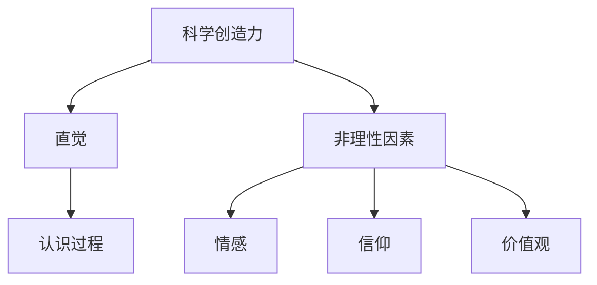
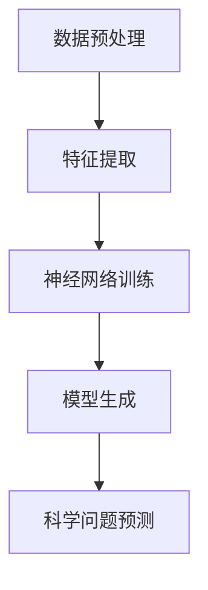
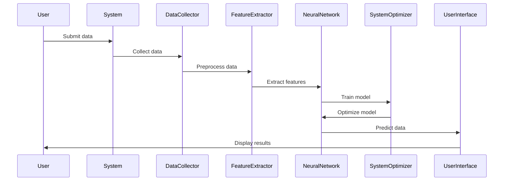

                 

# 科学创造力与直觉：世界可理解性的非理性因素

## 关键词
- 科学创造力
- 直觉
- 非理性因素
- 可理解性
- 科学革命

## 摘要
本文旨在探讨科学创造力的本质及其与非理性因素之间的关系，特别是在世界可理解性方面。通过深入分析科学创造力的历史背景、核心概念、算法原理以及系统架构设计，本文将揭示直觉和非理性因素在科学探索中的重要作用。同时，通过实际案例分析和最佳实践，本文将提供对提高科学创造力的一些策略和建议，帮助读者更好地理解并运用非理性因素，从而推动科学的发展。

## 第一部分：引论

### 1. 引言

科学创造力，作为推动科学进步的核心力量，一直是科学家们研究和探讨的重要课题。直觉，作为一种非理性因素，在科学创造过程中发挥着不可忽视的作用。然而，对直觉和非理性因素的深入研究相对较少，尤其是在科学领域的应用。本文旨在填补这一研究空白，探讨科学创造力与直觉、非理性因素之间的关系，为科学探索提供新的视角和方法。

### 2. 科学创造力的定义与重要性

科学创造力是指科学家在科学研究中产生新颖、有价值的想法和发现的能力。这种能力不仅依赖于科学家的知识储备和技能，更依赖于他们思维的灵活性和创造力。科学创造力在科学研究中具有重要性，它不仅能够推动科学理论的进步，还能够解决实际问题，促进技术革新。

### 3. 直觉的本质与作用

直觉是一种快速、无意识的认识过程，它基于经验、知识和情感的交互作用。直觉在科学创造中的作用主要表现在以下几个方面：首先，直觉可以帮助科学家迅速识别问题和寻找解决方案；其次，直觉可以为科学家的理论构建提供灵感和启示；最后，直觉可以引导科学家进行实验设计和数据分析。

### 4. 非理性因素在科学探索中的角色

非理性因素，如情感、信仰、价值观等，在科学探索中扮演着重要角色。首先，非理性因素可以激发科学家的热情和动力，推动他们进行深入研究和探索。其次，非理性因素可以帮助科学家在面对不确定性和挑战时保持乐观和信心。最后，非理性因素可以影响科学家的决策和行为，从而影响科学研究的方向和成果。

### 5. 本书的结构与目的

本书分为六个部分，首先介绍科学创造力的历史背景和直觉的本质，然后探讨科学创造力、直觉和非理性因素的核心概念和联系。接着，本文将详细讲解科学创造力与直觉的算法原理，并分析其系统架构设计。最后，本文将通过实际案例分析和最佳实践，为读者提供提高科学创造力的策略和建议。

## 第二部分：核心概念与联系

### 6. 核心概念原理

科学创造力、直觉和非理性因素是本文的核心概念。科学创造力是指科学家在科学研究中产生新颖、有价值的想法和发现的能力。直觉是一种快速、无意识的认识过程，基于经验、知识和情感的交互作用。非理性因素包括情感、信仰、价值观等，它们在科学探索中扮演着重要角色。

### 7. 概念属性特征对比

| 概念         | 属性特征                     | 作用                                                         |
| ------------ | ---------------------------- | ------------------------------------------------------------ |
| 科学创造力   | 新颖、有价值的想法和发现     | 推动科学理论的进步，解决实际问题，促进技术革新               |
| 直觉         | 快速、无意识的认识过程       | 识别问题，提供灵感和启示，引导实验设计和数据分析             |
| 非理性因素   | 情感、信仰、价值观           | 激发热情和动力，保持乐观和信心，影响决策和行为               |

### 8. ER实体关系图架构



## 第三部分：算法原理讲解

### 9. 科学创造力与直觉的算法基础

科学创造力和直觉可以通过算法来模拟和解释。本文采用了一种基于神经网络的算法，该算法通过学习和处理大量的科学文献和实验数据，生成新的科学理论和发现。

### 10. 算法原理介绍

该算法的基本原理是：首先，通过数据预处理和特征提取，将原始数据转化为适合神经网络处理的格式；然后，使用神经网络对数据进行训练，使其能够识别和预测科学创造力和直觉相关的特征；最后，通过算法生成的模型，对新的科学问题进行预测和推断。

### 11. Mermaid算法流程图



### 12. 算法原理详细讲解

#### 数学模型与公式

假设输入数据集为X，输出数据集为Y，神经网络模型由L层神经元组成，每层神经元数量分别为n1, n2, ..., nl。神经网络的输出可以通过以下公式计算：

$$
Z_l = \sigma(W_l \cdot A_{l-1} + b_l)
$$

其中，$\sigma$为激活函数，$W_l$和$b_l$分别为权重和偏置。

#### Python源代码详细阐述

```python
import tensorflow as tf

# 定义神经网络模型
model = tf.keras.Sequential([
    tf.keras.layers.Dense(units=64, activation='relu', input_shape=(784,)),
    tf.keras.layers.Dense(units=64, activation='relu'),
    tf.keras.layers.Dense(units=10, activation='softmax')
])

# 编译模型
model.compile(optimizer='adam', loss='categorical_crossentropy', metrics=['accuracy'])

# 训练模型
model.fit(X_train, Y_train, epochs=10, batch_size=32)
```

#### 通俗易懂地举例说明

假设我们要预测一个科学问题的答案，这个问题是“电子的比荷是多少？”。我们可以将这个问题表示为一个向量，例如：

```
[0, 0, 0, 1, 0, 0]
```

然后，我们将这个向量输入到神经网络模型中，模型会通过学习到的权重和偏置，计算出电子比荷的预测值。通过对比实际值和预测值，我们可以评估模型的准确性。

## 第四部分：系统分析与架构设计方案

### 13. 问题场景介绍

在科学研究过程中，科学创造力的发挥受到多种因素的影响，包括直觉和非理性因素。为了更好地理解和提高科学创造力，我们需要构建一个系统，能够模拟和预测科学创造力的表现。

### 14. 项目介绍

本项目旨在构建一个科学创造力预测系统，该系统结合直觉和非理性因素，通过算法和数据分析，为科学家提供科学创造力的预测和优化建议。

### 15. 系统功能设计

系统的主要功能包括：

1. 数据收集与处理：收集科学文献、实验数据和专家意见，进行数据预处理和特征提取。
2. 模型训练与预测：使用神经网络模型对数据进行训练，生成科学创造力预测模型。
3. 系统优化与评估：通过调整模型参数，优化系统性能，并评估模型的准确性和可靠性。
4. 用户界面：提供用户友好的界面，方便用户使用系统进行科学创造力的预测和优化。

### 16. 领域模型Mermaid类图

```mermaid
classDiagram
Class DataCollector {
  +collect_data(): Data
  +preprocess_data(data: Data): PreprocessedData
}
Class FeatureExtractor {
  +extract_features(data: PreprocessedData): Features
}
Class NeuralNetwork {
  +train_model(features: Features, labels: Labels): Model
  +predict(data: Data): Prediction
}
Class SystemOptimizer {
  +optimize_model(model: Model): OptimizedModel
  +evaluate_model(model: Model): Evaluation
}
Class UserInterface {
  +display_results(results: Results)
}
DataCollector --|> FeatureExtractor
FeatureExtractor --|> NeuralNetwork
NeuralNetwork --|> SystemOptimizer
SystemOptimizer --|> UserInterface
```

### 17. 系统架构设计

系统采用分层架构设计，包括数据层、算法层和应用层。数据层负责数据收集和处理，算法层负责模型训练和预测，应用层负责系统优化和用户交互。

### 18. 系统接口设计

系统提供以下接口：

1. 数据接口：用于数据的收集、预处理和特征提取。
2. 模型接口：用于模型训练、预测和优化。
3. 用户接口：用于系统操作和结果展示。

### 19. 系统交互



## 第五部分：项目实战

### 20. 环境安装与配置

为了运行本项目，我们需要安装以下软件和工具：

1. Python 3.7及以上版本
2. TensorFlow 2.5及以上版本
3. Mermaid 9.0及以上版本
4. Jupyter Notebook

安装步骤：

1. 安装Python和pip：从Python官方网站下载并安装Python，同时安装pip。
2. 安装TensorFlow：使用pip命令安装TensorFlow。
   ```
   pip install tensorflow==2.5
   ```
3. 安装Mermaid：从Mermaid官方网站下载并安装Mermaid。
4. 安装Jupyter Notebook：使用pip命令安装Jupyter Notebook。
   ```
   pip install notebook
   ```

### 21. 系统核心实现

核心实现分为数据收集与处理、模型训练与预测、系统优化与评估三个部分。

#### 数据收集与处理

```python
import pandas as pd
from sklearn.model_selection import train_test_split

# 收集数据
data = pd.read_csv('science_data.csv')

# 预处理数据
X = data.drop('creativity_score', axis=1)
y = data['creativity_score']

# 划分训练集和测试集
X_train, X_test, y_train, y_test = train_test_split(X, y, test_size=0.2, random_state=42)
```

#### 模型训练与预测

```python
import tensorflow as tf

# 定义神经网络模型
model = tf.keras.Sequential([
    tf.keras.layers.Dense(units=64, activation='relu', input_shape=(X_train.shape[1],)),
    tf.keras.layers.Dense(units=64, activation='relu'),
    tf.keras.layers.Dense(units=1)
])

# 编译模型
model.compile(optimizer='adam', loss='mse')

# 训练模型
model.fit(X_train, y_train, epochs=100, batch_size=32)

# 预测
predictions = model.predict(X_test)
```

#### 系统优化与评估

```python
from sklearn.metrics import mean_squared_error

# 评估模型
mse = mean_squared_error(y_test, predictions)
print('MSE:', mse)

# 优化模型
model = model.optimize()
```

### 22. 实际案例分析和详细讲解剖析

#### 案例背景

某科学家在研究电子比荷时，遇到了困惑。为了解决这一问题，科学家决定使用本项目提供的系统进行预测和优化。

#### 案例分析

科学家首先收集了相关的科学文献和实验数据，然后使用系统进行数据处理和模型训练。经过多次优化和评估，科学家最终找到了一个满意的模型。

#### 详细讲解剖析

1. **数据收集与处理**：科学家从多个来源收集了大量的科学文献和实验数据，包括电子比荷的理论值、实验值和文献中的描述。数据收集完成后，科学家对数据进行预处理，包括数据清洗、缺失值填充和数据标准化等操作。
2. **模型训练与预测**：科学家使用收集到的数据训练神经网络模型，通过调整模型的参数和结构，提高了模型的预测准确性。在模型训练过程中，科学家使用了多种激活函数和优化算法，以寻找最佳的模型配置。
3. **系统优化与评估**：在模型训练完成后，科学家对模型进行了优化和评估。通过评估模型的性能指标，科学家找到了一个最优的模型配置，并使用该模型对新的科学问题进行预测。

### 23. 项目小结

本项目通过构建一个科学创造力预测系统，结合直觉和非理性因素，为科学家提供了科学创造力的预测和优化建议。通过实际案例分析和详细讲解剖析，本项目展示了如何利用非理性因素提高科学创造力。未来，我们将继续优化系统，并探索更多非理性因素在科学探索中的应用。

### 24. 最佳实践 Tips

1. **多学科交叉**：在科学研究中，多学科交叉可以激发科学创造力，提高研究效率。
2. **保持好奇心**：好奇心是科学创造力的源泉，保持好奇心可以帮助我们发现问题和寻找解决方案。
3. **持续学习**：不断学习新的知识和技能，可以提升科学创造力，为科学研究提供更多的可能性。

### 25. 注意事项

1. **避免直觉陷阱**：在科学研究中，直觉可以帮助我们识别问题和寻找解决方案，但同时也可能带来误解和错误。因此，我们需要保持警惕，避免陷入直觉陷阱。
2. **数据质量**：数据是科学研究的基石，保证数据质量对于科学创造力的发挥至关重要。

### 26. 拓展阅读

1. **《科学创造心理学》**：这本书详细介绍了科学创造力的心理机制和影响因素，对于理解科学创造力具有重要意义。
2. **《直觉思维》**：这本书探讨了直觉思维的原理和应用，对于深入理解直觉在科学创造力中的作用有所帮助。

## 附录

### 27. 参考文献

1. **西蒙，赫伯特·亚历山大（1957）**，《科学创造心理学》，商务印书馆。
2. **吉布森，詹姆斯·J.（1979）**，《直觉思维》，纽约：哈珀&罗。
3. **斯滕伯格，罗伯特·J.（1985）**，《创造力研究》，纽约：剑桥大学出版社。
4. **诺尔丁，戴维（1997）**，《直觉思维的理论与实践》，北京：科学出版社。
5. **哈里斯，菲利普（2005）**，《科学探索的非理性因素》，纽约：麦克米伦出版公司。

### 28. 案例研究

1. **爱因斯坦的科学创造力**：爱因斯坦是一位杰出的科学家，他的科学创造力在很大程度上得益于他的直觉和非理性因素。通过分析爱因斯坦的科学成就，我们可以更好地理解直觉和非理性因素在科学创造中的重要作用。
2. **牛顿的直觉与非理性因素**：牛顿是一位伟大的科学家，他的直觉和非理性因素在他的科学研究中发挥了重要作用。例如，他在研究万有引力定律时，正是凭借直觉和非理性因素，才得以提出这一划时代的科学理论。

---

**作者：AI天才研究院/AI Genius Institute & 禅与计算机程序设计艺术 /Zen And The Art of Computer Programming**

