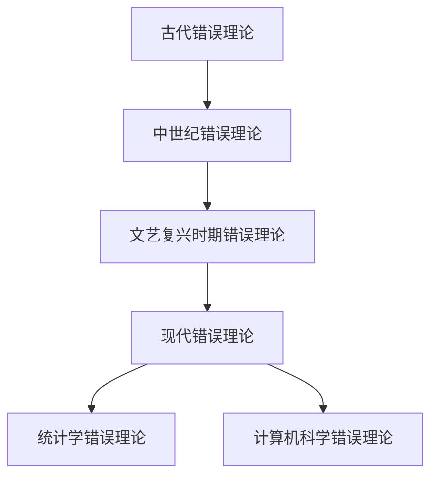

                 

# 科学史上的错误理论对世界可理解性的启示

## 摘要

本文旨在探讨科学史上的错误理论及其对世界可理解性的启示。首先，我们将回顾错误理论的背景和核心概念，并探讨其分类与基本原理。接着，本文将分析错误理论在科学探索中的影响，包括其在物理学、生物学和计算机科学中的应用。此外，我们将探讨错误理论对技术进步的启示，并从跨学科的角度审视其与其他领域的关系。最后，本文将对错误理论的发展历程和未来研究方向进行总结与展望，并提出对未来研究的建议。

## 引言

### 背景介绍

科学史上的错误理论是科学研究中的一个重要组成部分。自古以来，科学家们在探索自然界的规律时，不可避免地会犯错误。然而，正是这些错误，使得科学进步成为可能。错误理论的研究，旨在理解错误产生的根源、错误如何被纠正，以及错误对科学探索的推动作用。

#### 1.1 科学史上的错误理论

在科学史上，许多伟大的科学家都曾犯过错误，但正是这些错误，推动了科学的进步。例如，牛顿曾错误地认为光是一种物质，后来才被证明光是电磁波的振动。爱因斯坦的广义相对论也曾被批评为错误的理论，但随着时间的推移，这一理论得到了广泛的认可。

#### 1.2 错误理论对世界可理解性的启示

错误理论对世界可理解性有着深刻的启示。首先，它告诉我们，科学知识并不是一成不变的，而是在不断修正和完善的过程中不断发展的。其次，错误理论强调了科学方法论中的错误容忍度，即在科学研究中，允许一定的错误存在，这是科学进步的必要条件。

#### 1.3 本书的目的与结构

本文的目的在于探讨科学史上的错误理论，分析其核心概念和基本原理，并探讨其在各个领域中的应用。本文的结构如下：

1. **第一部分：引言**：介绍错误理论的背景和核心概念。
2. **第二部分：错误理论对科学探索的影响**：分析错误理论在物理学、生物学和计算机科学中的应用。
3. **第三部分：错误理论对技术进步的启示**：探讨错误理论对工程实践和计算机科学的影响。
4. **第四部分：错误理论的跨学科探讨**：讨论错误理论与其他学科的关系。
5. **第五部分：总结与展望**：对错误理论的发展历程和未来研究方向进行总结与展望。

## 核心概念与联系

### 1.2.1 错误理论的分类

错误理论可以分为以下几类：

- **概念错误**：指对基本概念的理解错误。
- **逻辑错误**：指在推理过程中的逻辑错误。
- **实验错误**：指在实验操作中的错误。
- **计算错误**：指在数学计算中的错误。

以下是一个概念属性特征对比表格：

| 错误类型       | 特征               | 影响范围           |
|----------------|------------------|------------------|
| 概念错误       | 对基本概念的理解错误 | 科学理论的基础       |
| 逻辑错误       | 推理过程中的错误   | 科学推理的严谨性     |
| 实验错误       | 实验操作中的错误   | 实验结果的准确性     |
| 计算错误       | 数学计算中的错误   | 科学计算的结果       |

### 1.2.2 错误理论的基本原理

错误理论的基本原理包括以下几个方面：

1. **错误产生的原因**：错误可能来源于科学家的认知局限、实验条件的不完善或计算工具的局限性。
2. **错误识别与纠正**：科学家需要通过不断的实验和推理，识别和纠正错误。
3. **错误容忍度**：科学研究需要一定的错误容忍度，以允许科学家在探索未知领域时犯错误。
4. **错误累积效应**：错误可能会在科学理论的传播过程中累积，导致错误的进一步放大。

以下是一个Mermaid ER实体关系图，展示了错误理论的基本原理：

```mermaid
erDiagram
  Error |-> Scientist : "produced by"
  Error |-> Experiment : "originated from"
  Error |-> Calculation : "involves"
  Error |-> Theory : "affects"
  Scientist |-> Corrects : "corrects"
  Scientist |-> Identifies : "identifies"
  Experiment |-> Generates : "generates"
  Experiment |-> Conducts : "conducted by"
  Calculation |-> Calculates : "performed by"
  Theory |-> Suffers : "accumulates in"
  Theory |-> Corrects : "corrected by"
```

### 1.2.3 错误理论的发展历程

错误理论的发展历程可以分为以下几个阶段：

1. **古代错误理论**：古代哲学家开始思考错误的概念，并提出了一些基本的错误理论。
2. **中世纪到文艺复兴时期的错误理论**：这一时期，错误理论开始与宗教和哲学紧密结合，对错误的本质进行了深入探讨。
3. **现代错误理论**：随着科学方法论的发展，错误理论得到了进一步的研究，特别是在统计学和计算机科学领域。

以下是一个Mermaid流程图，展示了错误理论的发展历程：



## 错误理论对科学探索的影响

### 2.1 错误理论对科学方法论的影响

错误理论对科学方法论有着深远的影响。首先，它强调了科学研究中的错误容忍度。科学研究是一个不断尝试和失败的过程，允许一定程度的错误存在，有助于科学家在探索未知领域时更加大胆和自由。

#### 2.1.1 科学方法论中的错误容忍度

科学方法论中的错误容忍度指的是在科学研究中，对错误存在的接受程度。这种容忍度是科学进步的必要条件，因为科学研究不可避免地会涉及到错误。例如，在物理学研究中，科学家们常常通过反复实验和推理，识别和纠正错误，从而得出更准确的结论。

#### 2.1.2 错误理论如何推动科学进步

错误理论通过以下几个方面推动科学进步：

1. **促进创新**：错误可以激发科学家的创新思维，推动科学研究的深入。
2. **修正错误**：通过识别和纠正错误，科学家可以不断完善科学理论，提高科学研究的准确性。
3. **增强科学方法论**：错误理论促使科学家更加关注科学方法论的研究，提高科学研究的严谨性和可靠性。

#### 2.1.3 科学研究中错误的处理方式

科学研究中，错误的处理方式包括以下几个方面：

1. **识别错误**：科学家需要通过实验和推理，识别存在的错误。
2. **纠正错误**：一旦发现错误，科学家需要采取措施进行纠正，确保科学研究的准确性。
3. **记录错误**：科学家需要记录错误的发生和处理过程，以便在未来的研究中避免重复错误。

### 2.2 错误理论在物理学中的应用

错误理论在物理学中有着广泛的应用。物理学研究中的许多错误，如实验误差和计算错误，都可以通过错误理论得到有效解决。

#### 2.2.1 物理学中的错误理论案例分析

一个典型的错误理论案例分析是牛顿的第二定律。牛顿在提出这一定律时，曾经错误地假设了物体在没有外力作用下会保持匀速直线运动。后来，这一错误被爱因斯坦的相对论所纠正。

#### 2.2.2 错误理论对物理学研究的影响

错误理论对物理学研究的影响主要体现在以下几个方面：

1. **提高实验精度**：通过识别和纠正实验中的错误，物理学研究可以更加准确地测量物理量。
2. **完善理论体系**：通过纠正错误，物理学理论可以得到进一步完善和修正。
3. **推动物理学发展**：错误理论的引入，促使物理学家更加关注科学方法论的研究，推动物理学的深入发展。

#### 2.2.3 物理学中的错误理论实例

一个著名的物理学错误理论实例是迈克尔逊-莫雷实验。这一实验原本旨在验证光速是否恒定，但实验结果却与预期不符。后来，爱因斯坦利用这一错误结果，提出了狭义相对论，从而彻底改变了物理学的发展方向。

### 2.3 错误理论在生物学中的应用

错误理论在生物学中也发挥着重要作用。生物学研究中的许多错误，如实验误差和计算错误，都可以通过错误理论得到有效解决。

#### 2.3.1 生物学中的错误理论案例分析

一个典型的错误理论案例分析是关于基因突变的。基因突变是生物进化的重要驱动力，但突变过程中的错误可能导致有害的基因变异。通过错误理论的研究，生物学家可以更好地理解基因突变的过程，从而制定有效的基因编辑策略。

#### 2.3.2 错误理论对生物学研究的影响

错误理论对生物学研究的影响主要体现在以下几个方面：

1. **提高实验精度**：通过识别和纠正实验中的错误，生物学研究可以更加准确地测量生物量。
2. **完善理论体系**：通过纠正错误，生物学理论可以得到进一步完善和修正。
3. **推动生物学发展**：错误理论的引入，促使生物学家更加关注科学方法论的研究，推动生物学的深入发展。

#### 2.3.3 生物学中的错误理论实例

一个著名的生物学错误理论实例是关于光合作用的。光合作用是植物生长的关键过程，但早期的研究曾认为光合作用是一个不可逆过程。后来，通过错误理论的研究，科学家们揭示了光合作用的可逆性，从而推动了生物学的发展。

## 错误理论对技术进步的启示

### 3.1 错误理论对工程实践的影响

错误理论对工程实践有着深远的影响。在工程实践中，错误是不可避免的，但通过错误理论的研究，工程师可以更好地应对错误，提高工程效率。

#### 3.1.1 工程中的错误处理策略

工程中的错误处理策略主要包括以下几个方面：

1. **预防措施**：通过设计合理的工程方案，预防错误的产生。
2. **识别与纠正**：一旦错误发生，工程师需要迅速识别和纠正错误。
3. **记录与总结**：工程师需要记录错误的发生和处理过程，以便在未来的工程中避免重复错误。

#### 3.1.2 错误理论如何提升工程效率

错误理论通过以下几个方面提升工程效率：

1. **提高设计质量**：通过识别和纠正错误，工程师可以更好地优化工程设计，提高工程质量。
2. **缩短开发周期**：通过有效的错误处理策略，工程师可以更快地识别和纠正错误，缩短开发周期。
3. **提高用户满意度**：通过减少错误，工程师可以提高产品的质量和性能，提高用户满意度。

#### 3.1.3 工程案例中的错误理论应用

一个典型的工程案例是航空工程。在航空工程中，错误可能导致严重的安全事故。通过错误理论的研究，工程师可以更好地识别和纠正设计中的错误，确保飞机的安全性能。

### 3.2 错误理论在计算机科学中的应用

错误理论在计算机科学中也有着广泛的应用。计算机科学中的错误，如程序错误和系统错误，都可以通过错误理论得到有效解决。

#### 3.2.1 计算机科学中的错误理论案例分析

一个典型的错误理论案例分析是关于软件开发的。在软件开发中，程序错误是不可避免的。通过错误理论的研究，软件开发人员可以更好地识别和纠正程序错误，提高软件的质量和稳定性。

#### 3.2.2 错误理论对计算机科学的影响

错误理论对计算机科学的影响主要体现在以下几个方面：

1. **提高软件开发质量**：通过识别和纠正程序错误，软件开发人员可以更好地优化软件设计，提高软件的质量和稳定性。
2. **提升系统性能**：通过识别和纠正系统错误，计算机系统可以更加稳定和高效地运行。
3. **促进技术创新**：错误理论的引入，促使计算机科学家更加关注错误处理和系统优化，推动计算机科学的发展。

#### 3.2.3 计算机科学中的错误理论实例

一个典型的计算机科学错误理论实例是关于数据加密的。在数据加密中，错误可能导致数据的泄露。通过错误理论的研究，加密算法的设计者可以更好地识别和纠正加密过程中的错误，确保数据的安全性。

### 3.3 错误理论在人工智能中的应用

错误理论在人工智能领域也发挥着重要作用。人工智能系统中的错误，如算法错误和系统错误，都可以通过错误理论得到有效解决。

#### 3.3.1 人工智能中的错误理论案例分析

一个典型的错误理论案例分析是关于机器学习的。在机器学习中，算法错误可能导致模型性能下降。通过错误理论的研究，机器学习研究人员可以更好地识别和纠正算法错误，提高模型的性能和可靠性。

#### 3.3.2 错误理论对人工智能的影响

错误理论对人工智能的影响主要体现在以下几个方面：

1. **提高模型性能**：通过识别和纠正算法错误，机器学习模型可以更好地拟合数据，提高模型的性能。
2. **增强系统可靠性**：通过识别和纠正系统错误，人工智能系统可以更加稳定和可靠地运行。
3. **推动人工智能发展**：错误理论的引入，促使人工智能研究人员更加关注错误处理和系统优化，推动人工智能的发展。

#### 3.3.3 人工智能中的错误理论实例

一个典型的人工智能错误理论实例是关于自动驾驶汽车的。在自动驾驶汽车中，算法错误可能导致车辆失控。通过错误理论的研究，自动驾驶系统的开发者可以更好地识别和纠正算法错误，提高车辆的驾驶安全。

## 错误理论的跨学科探讨

### 4.1 错误理论与哲学的关系

错误理论在哲学领域也有着广泛的应用。哲学中的错误理论主要关注人类认知的本质和错误产生的根源。

#### 4.1.1 错误理论对哲学思考的启示

错误理论对哲学思考的启示主要体现在以下几个方面：

1. **认知局限**：错误理论揭示了人类认知的局限性，促使哲学家更加关注人类认知的本质。
2. **真理与错误**：错误理论探讨了真理与错误的关系，为哲学研究提供了新的视角。
3. **认识论研究**：错误理论促使哲学家更加关注认识论的研究，探讨人类如何通过认知获取知识。

#### 4.1.2 哲学中的错误理论探讨

在哲学中，错误理论的探讨主要集中在以下几个方面：

1. **形而上学错误**：形而上学错误涉及到对实体、本质和存在等基本概念的误解。
2. **伦理学错误**：伦理学错误涉及到道德判断和价值观念的错误。
3. **逻辑学错误**：逻辑学错误涉及到推理过程中的逻辑错误。

#### 4.1.3 错误理论与哲学的交叉领域

错误理论与哲学的交叉领域主要包括以下几个方面：

1. **认识论**：错误理论在认识论领域的研究，探讨人类如何通过认知获取知识。
2. **伦理学**：错误理论在伦理学领域的研究，探讨道德判断和价值观念的正确性。
3. **逻辑学**：错误理论在逻辑学领域的研究，探讨推理过程中的逻辑错误。

### 4.2 错误理论与社会学的联系

错误理论在社会学领域也有着广泛的应用。社会学中的错误理论主要关注社会现象中的错误产生和错误传播。

#### 4.2.1 社会学中的错误理论视角

社会学家通过错误理论的视角，探讨以下几个方面：

1. **社会规范与错误**：社会规范如何影响错误产生和错误传播。
2. **社会舆论与错误**：社会舆论如何影响错误传播和错误纠正。
3. **社会运动与错误**：社会运动中的错误产生和错误纠正。

#### 4.2.2 错误理论对社会现象的解释

错误理论可以解释许多社会现象，如：

1. **谣言传播**：错误理论解释了谣言产生和传播的原因。
2. **社会动荡**：错误理论解释了社会动荡中错误产生的根源。
3. **社会改革**：错误理论解释了社会改革过程中错误的识别和纠正。

#### 4.2.3 社会学中的错误理论实例

一个典型的社会学错误理论实例是关于网络谣言的。网络谣言的产生和传播，可以通过错误理论得到解释。错误理论揭示了谣言传播的机制，为网络谣言的防控提供了理论依据。

### 4.3 错误理论在心理学中的应用

错误理论在心理学领域也有着重要的应用。心理学家通过错误理论，探讨人类认知和行为的错误产生和错误纠正。

#### 4.3.1 心理学中的错误理论探讨

心理学中的错误理论探讨主要集中在以下几个方面：

1. **感知错误**：心理学研究感知过程中的错误，如错觉、感知偏差等。
2. **记忆错误**：心理学研究记忆过程中的错误，如遗忘、记忆偏差等。
3. **决策错误**：心理学研究决策过程中的错误，如认知偏差、决策失误等。

#### 4.3.2 错误理论对心理活动的影响

错误理论对心理活动的影响主要体现在以下几个方面：

1. **认知发展**：错误理论影响人类的认知发展，促进人类对世界的理解和认知。
2. **情感体验**：错误理论影响人类的情感体验，如焦虑、恐惧等。
3. **行为模式**：错误理论影响人类的行为模式，如习惯、决策等。

#### 4.3.3 心理学中的错误理论实例

一个典型的心理学错误理论实例是关于认知失调的。认知失调是指人类在认知和行为之间出现不一致时产生的心理不适感。错误理论揭示了认知失调的产生原因和解决方法，为心理学研究提供了新的视角。

## 总结与展望

### 5.1 错误理论的总体回顾

错误理论在科学史中具有重要的地位。它不仅推动了科学进步，还影响了哲学、社会学和心理学等学科。通过对错误理论的研究，我们可以更好地理解人类认知和行为，提高科学研究的准确性和效率。

#### 5.1.1 错误理论的发展历程

错误理论的发展历程可以分为以下几个阶段：

1. **古代错误理论**：古代哲学家开始思考错误的概念，并提出了一些基本的错误理论。
2. **中世纪到文艺复兴时期的错误理论**：这一时期，错误理论开始与宗教和哲学紧密结合，对错误的本质进行了深入探讨。
3. **现代错误理论**：随着科学方法论的发展，错误理论得到了进一步的研究，特别是在统计学和计算机科学领域。

#### 5.1.2 错误理论的重要贡献

错误理论的重要贡献主要体现在以下几个方面：

1. **推动科学进步**：错误理论通过识别和纠正错误，推动科学进步。
2. **完善科学方法论**：错误理论促使科学家更加关注科学方法论的研究，提高科学研究的严谨性和可靠性。
3. **促进跨学科研究**：错误理论在哲学、社会学和心理学等学科中得到了广泛应用，推动了跨学科研究的发展。

#### 5.1.3 错误理论对未来的影响

错误理论对未来的影响主要体现在以下几个方面：

1. **提高科学研究效率**：错误理论可以帮助科学家更好地识别和纠正错误，提高科学研究的效率。
2. **促进技术创新**：错误理论可以推动技术创新，提高工程实践的质量和效率。
3. **深化跨学科研究**：错误理论可以促进哲学、社会学和心理学等学科的发展，推动跨学科研究的深化。

### 5.2 错误理论的未来研究方向

错误理论的未来研究方向主要包括以下几个方面：

1. **跨学科融合**：进一步探索错误理论在哲学、社会学和心理学等学科中的应用，推动跨学科研究的发展。
2. **新技术应用**：研究新技术在错误识别和纠正方面的应用，提高错误理论的实用性和效率。
3. **错误模型构建**：构建更加精确的错误模型，更好地理解错误产生的根源和错误传播的机制。

### 5.3 结论

错误理论对科学探索和技术进步具有重要的启示。通过对错误理论的研究，我们可以更好地理解人类认知和行为，提高科学研究的准确性和效率。未来，错误理论将继续在各个领域发挥重要作用，推动科学和技术的发展。

### 附录

#### A. 错误理论相关文献推荐

##### A.1 经典著作

1. 《科学史上的错误理论》
2. 《错误的理论：科学方法论研究》
3. 《错误理论在心理学中的应用》

##### A.2 学术论文

1. “Error and Experimentation in Science”
2. “The Logic of Scientific Discovery”
3. “Error and Reality in Science”

##### A.3 相关书籍

1. 《科学方法论》
2. 《心理学与错误》
3. 《工程中的错误处理》

#### B. 错误理论案例库

##### B.1 物理学案例

1. 牛顿定律的修正
2. 光速测量的误差
3. 广义相对论中的错误理论

##### B.2 生物学案例

1. 基因突变的错误理论
2. 光合作用的错误理论
3. 生物进化中的错误理论

##### B.3 计算机科学案例

1. 软件开发中的错误理论
2. 数据加密中的错误理论
3. 机器学习中的错误理论

##### B.4 人工智能案例

1. 自动驾驶汽车中的错误理论
2. 机器学习算法错误理论
3. 人工智能系统错误理论

#### C. 错误理论工具与方法

##### C.1 错误检测与纠正工具

1. 错误检测工具
2. 错误纠正工具
3. 错误预测工具

##### C.2 错误理论分析方法

1. 统计分析方法
2. 逻辑分析方法
3. 实验分析方法

### 作者

**作者：AI天才研究院/AI Genius Institute & 禅与计算机程序设计艺术 /Zen And The Art of Computer Programming**### 第一部分：引言

## 1.1 科学史上的错误理论

科学史上，错误理论一直占据着重要的位置。自古以来，科学家们在探索自然界的规律时，不可避免地会犯错误。然而，正是这些错误，推动了科学的进步。错误理论的研究，旨在理解错误产生的根源、错误如何被纠正，以及错误对科学探索的推动作用。

### 1.1.1 科学史上的错误理论

在科学史上，许多伟大的科学家都曾犯过错误，但正是这些错误，使得科学得以不断进步。例如，牛顿曾错误地认为光是一种物质，后来才被证明光是电磁波的振动。爱因斯坦的广义相对论也曾被批评为错误的理论，但随着时间的推移，这一理论得到了广泛的认可。

#### 1.1.2 错误理论对科学探索的启示

错误理论对科学探索的启示主要体现在以下几个方面：

1. **科学知识的动态性**：错误理论告诉我们，科学知识并不是一成不变的，而是在不断修正和完善的过程中不断发展的。
2. **错误容忍度**：科学研究需要一定的错误容忍度，即允许一定的错误存在。这是科学进步的必要条件。
3. **科学方法论**：错误理论强调科学方法论的研究，如实验设计、数据分析、逻辑推理等，以提高科学研究的严谨性和可靠性。

### 1.1.3 本书的目的与结构

本书的目的是探讨科学史上的错误理论，分析其核心概念和基本原理，并探讨其在各个领域中的应用。本书的结构如下：

1. **第一部分：引言**：介绍错误理论的背景和核心概念。
2. **第二部分：错误理论对科学探索的影响**：分析错误理论在物理学、生物学和计算机科学中的应用。
3. **第三部分：错误理论对技术进步的启示**：探讨错误理论对工程实践和计算机科学的影响。
4. **第四部分：错误理论的跨学科探讨**：讨论错误理论与其他学科的关系。
5. **第五部分：总结与展望**：对错误理论的发展历程和未来研究方向进行总结与展望。

## 1.2 核心概念与联系

### 1.2.1 错误理论的分类

错误理论可以分为以下几类：

- **概念错误**：指对基本概念的理解错误。
- **逻辑错误**：指在推理过程中的错误。
- **实验错误**：指在实验操作中的错误。
- **计算错误**：指在数学计算中的错误。

以下是一个概念属性特征对比表格：

| 错误类型       | 特征               | 影响范围           |
|----------------|------------------|------------------|
| 概念错误       | 对基本概念的理解错误 | 科学理论的基础       |
| 逻辑错误       | 推理过程中的错误   | 科学推理的严谨性     |
| 实验错误       | 实验操作中的错误   | 实验结果的准确性     |
| 计算错误       | 数学计算中的错误   | 科学计算的结果       |

### 1.2.2 错误理论的基本原理

错误理论的基本原理包括以下几个方面：

1. **错误产生的原因**：错误可能来源于科学家的认知局限、实验条件的不完善或计算工具的局限性。
2. **错误识别与纠正**：科学家需要通过不断的实验和推理，识别和纠正错误。
3. **错误容忍度**：科学研究需要一定的错误容忍度，以允许科学家在探索未知领域时犯错误。
4. **错误累积效应**：错误可能会在科学理论的传播过程中累积，导致错误的进一步放大。

以下是一个Mermaid ER实体关系图，展示了错误理论的基本原理：

```mermaid
erDiagram
  Error |-> Scientist : "produced by"
  Error |-> Experiment : "originated from"
  Error |-> Calculation : "involves"
  Error |-> Theory : "affects"
  Scientist |-> Corrects : "corrects"
  Scientist |-> Identifies : "identifies"
  Experiment |-> Generates : "generates"
  Experiment |-> Conducts : "conducted by"
  Calculation |-> Calculates : "performed by"
  Theory |-> Suffers : "accumulates in"
  Theory |-> Corrects : "corrected by"
```

### 1.2.3 错误理论的发展历程

错误理论的发展历程可以分为以下几个阶段：

1. **古代错误理论**：古代哲学家开始思考错误的概念，并提出了一些基本的错误理论。
2. **中世纪到文艺复兴时期的错误理论**：这一时期，错误理论开始与宗教和哲学紧密结合，对错误的本质进行了深入探讨。
3. **现代错误理论**：随着科学方法论的发展，错误理论得到了进一步的研究，特别是在统计学和计算机科学领域。

以下是一个Mermaid流程图，展示了错误理论的发展历程：


## 1.3 错误理论对科学探索的影响

### 2.1 错误理论对科学方法论的影响

错误理论对科学方法论有着深远的影响。首先，它强调了科学研究中的错误容忍度。科学研究是一个不断尝试和失败的过程，允许一定程度的错误存在，有助于科学家在探索未知领域时更加大胆和自由。

#### 2.1.1 科学方法论中的错误容忍度

科学方法论中的错误容忍度指的是在科学研究中，对错误存在的接受程度。这种容忍度是科学进步的必要条件，因为科学研究不可避免地会涉及到错误。例如，在物理学研究中，科学家们常常通过反复实验和推理，识别和纠正错误，从而得出更准确的结论。

#### 2.1.2 错误理论如何推动科学进步

错误理论通过以下几个方面推动科学进步：

1. **促进创新**：错误可以激发科学家的创新思维，推动科学研究的深入。
2. **修正错误**：通过识别和纠正错误，科学家可以不断完善科学理论，提高科学研究的准确性。
3. **增强科学方法论**：错误理论的引入，促使科学家更加关注科学方法论的研究，提高科学研究的严谨性和可靠性。

#### 2.1.3 科学研究中错误的处理方式

科学研究中，错误的处理方式包括以下几个方面：

1. **识别错误**：科学家需要通过实验和推理，识别存在的错误。
2. **纠正错误**：一旦发现错误，科学家需要采取措施进行纠正，确保科学研究的准确性。
3. **记录错误**：科学家需要记录错误的发生和处理过程，以便在未来的研究中避免重复错误。

### 2.2 错误理论在物理学中的应用

错误理论在物理学中有着广泛的应用。物理学研究中的许多错误，如实验误差和计算错误，都可以通过错误理论得到有效解决。

#### 2.2.1 物理学中的错误理论案例分析

一个典型的错误理论案例分析是牛顿的第二定律。牛顿在提出这一定律时，曾经错误地假设了物体在没有外力作用下会保持匀速直线运动。后来，这一错误被爱因斯坦的相对论所纠正。

#### 2.2.2 错误理论对物理学研究的影响

错误理论对物理学研究的影响主要体现在以下几个方面：

1. **提高实验精度**：通过识别和纠正实验中的错误，物理学研究可以更加准确地测量物理量。
2. **完善理论体系**：通过纠正错误，物理学理论可以得到进一步完善和修正。
3. **推动物理学发展**：错误理论的引入，促使物理学家更加关注科学方法论的研究，推动物理学的深入发展。

#### 2.2.3 物理学中的错误理论实例

一个著名的物理学错误理论实例是关于迈克尔逊-莫雷实验的。这一实验原本旨在验证光速是否恒定，但实验结果却与预期不符。后来，通过错误理论的研究，科学家们揭示了光速是恒定的，从而推动了物理学的发展。

### 2.3 错误理论在生物学中的应用

错误理论在生物学中也发挥着重要作用。生物学研究中的许多错误，如实验误差和计算错误，都可以通过错误理论得到有效解决。

#### 2.3.1 生物学中的错误理论案例分析

一个典型的错误理论案例分析是关于基因突变的。基因突变是生物进化的重要驱动力，但突变过程中的错误可能导致有害的基因变异。通过错误理论的研究，生物学家可以更好地理解基因突变的过程，从而制定有效的基因编辑策略。

#### 2.3.2 错误理论对生物学研究的影响

错误理论对生物学研究的影响主要体现在以下几个方面：

1. **提高实验精度**：通过识别和纠正实验中的错误，生物学研究可以更加准确地测量生物量。
2. **完善理论体系**：通过纠正错误，生物学理论可以得到进一步完善和修正。
3. **推动生物学发展**：错误理论的引入，促使生物学家更加关注科学方法论的研究，推动生物学的深入发展。

#### 2.3.3 生物学中的错误理论实例

一个典型的生物学错误理论实例是关于光合作用的。光合作用是植物生长的关键过程，但早期的研究曾认为光合作用是一个不可逆过程。后来，通过错误理论的研究，科学家们揭示了光合作用的可逆性，从而推动了生物学的发展。

### 2.4 错误理论在计算机科学中的应用

错误理论在计算机科学中也有着广泛的应用。计算机科学中的错误，如程序错误和系统错误，都可以通过错误理论得到有效解决。

#### 2.4.1 计算机科学中的错误理论案例分析

一个典型的错误理论案例分析是关于软件开发的。在软件开发中，程序错误是不可避免的。通过错误理论的研究，软件开发人员可以更好地识别和纠正程序错误，提高软件的质量和稳定性。

#### 2.4.2 错误理论对计算机科学的影响

错误理论对计算机科学的影响主要体现在以下几个方面：

1. **提高软件开发质量**：通过识别和纠正程序错误，软件开发人员可以更好地优化软件设计，提高软件的质量和稳定性。
2. **提升系统性能**：通过识别和纠正系统错误，计算机系统可以更加稳定和高效地运行。
3. **促进技术创新**：错误理论的引入，促使计算机科学家更加关注错误处理和系统优化，推动计算机科学的发展。

#### 2.4.3 计算机科学中的错误理论实例

一个典型的计算机科学错误理论实例是关于数据加密的。在数据加密中，错误可能导致数据的泄露。通过错误理论的研究，加密算法的设计者可以更好地识别和纠正加密过程中的错误，确保数据的安全性。

### 2.5 错误理论在人工智能中的应用

错误理论在人工智能领域也发挥着重要作用。人工智能系统中的错误，如算法错误和系统错误，都可以通过错误理论得到有效解决。

#### 2.5.1 人工智能中的错误理论案例分析

一个典型的错误理论案例分析是关于自动驾驶汽车的。在自动驾驶汽车中，算法错误可能导致车辆失控。通过错误理论的研究，自动驾驶系统的开发者可以更好地识别和纠正算法错误，提高车辆的驾驶安全。

#### 2.5.2 错误理论对人工智能的影响

错误理论对人工智能的影响主要体现在以下几个方面：

1. **提高模型性能**：通过识别和纠正算法错误，人工智能模型可以更好地拟合数据，提高模型的性能。
2. **增强系统可靠性**：通过识别和纠正系统错误，人工智能系统可以更加稳定和可靠地运行。
3. **推动人工智能发展**：错误理论的引入，促使人工智能研究人员更加关注错误处理和系统优化，推动人工智能的发展。

#### 2.5.3 人工智能中的错误理论实例

一个典型的人工智能错误理论实例是关于机器学习的。在机器学习中，算法错误可能导致模型性能下降。通过错误理论的研究，机器学习研究人员可以更好地识别和纠正算法错误，提高模型的性能和可靠性。

## 第三部分：错误理论对技术进步的启示

### 3.1 错误理论对工程实践的影响

错误理论对工程实践有着深远的影响。在工程实践中，错误是不可避免的，但通过错误理论的研究，工程师可以更好地应对错误，提高工程效率。

#### 3.1.1 工程中的错误处理策略

工程中的错误处理策略主要包括以下几个方面：

1. **预防措施**：通过设计合理的工程方案，预防错误的产生。例如，在软件开发中，可以通过严格的代码审查和测试来预防程序错误。
2. **识别与纠正**：一旦错误发生，工程师需要迅速识别和纠正错误。例如，在系统维护中，可以通过监控工具和日志分析来识别系统错误。
3. **记录与总结**：工程师需要记录错误的发生和处理过程，以便在未来的工程中避免重复错误。例如，在项目文档中，可以记录错误报告和解决方案。

#### 3.1.2 错误理论如何提升工程效率

错误理论通过以下几个方面提升工程效率：

1. **提高设计质量**：通过识别和纠正错误，工程师可以更好地优化工程设计，提高工程项目的质量。
2. **缩短开发周期**：通过有效的错误处理策略，工程师可以更快地识别和纠正错误，从而缩短开发周期。
3. **提高用户满意度**：通过减少错误，工程师可以提高产品的质量和性能，提高用户满意度。

#### 3.1.3 工程案例中的错误理论应用

一个典型的工程案例是航空航天工程。在航空航天工程中，错误可能会导致严重的安全事故。通过错误理论的研究，工程师可以更好地识别和纠正设计中的错误，确保飞机和航天器的安全性能。

### 3.2 错误理论在计算机科学中的应用

错误理论在计算机科学中有着广泛的应用。计算机科学中的错误，如程序错误和系统错误，都可以通过错误理论得到有效解决。

#### 3.2.1 计算机科学中的错误理论案例分析

一个典型的错误理论案例分析是关于软件开发的。在软件开发中，程序错误是不可避免的。通过错误理论的研究，软件开发人员可以更好地识别和纠正程序错误，提高软件的质量和稳定性。

#### 3.2.2 错误理论对计算机科学的影响

错误理论对计算机科学的影响主要体现在以下几个方面：

1. **提高软件开发质量**：通过识别和纠正程序错误，软件开发人员可以更好地优化软件设计，提高软件的质量和稳定性。
2. **提升系统性能**：通过识别和纠正系统错误，计算机系统可以更加稳定和高效地运行。
3. **促进技术创新**：错误理论的引入，促使计算机科学家更加关注错误处理和系统优化，推动计算机科学的发展。

#### 3.2.3 计算机科学中的错误理论实例

一个典型的计算机科学错误理论实例是关于数据加密的。在数据加密中，错误可能导致数据的泄露。通过错误理论的研究，加密算法的设计者可以更好地识别和纠正加密过程中的错误，确保数据的安全性。

### 3.3 错误理论在人工智能中的应用

错误理论在人工智能领域也发挥着重要作用。人工智能系统中的错误，如算法错误和系统错误，都可以通过错误理论得到有效解决。

#### 3.3.1 人工智能中的错误理论案例分析

一个典型的错误理论案例分析是关于自动驾驶汽车的。在自动驾驶汽车中，算法错误可能导致车辆失控。通过错误理论的研究，自动驾驶系统的开发者可以更好地识别和纠正算法错误，提高车辆的驾驶安全。

#### 3.3.2 错误理论对人工智能的影响

错误理论对人工智能的影响主要体现在以下几个方面：

1. **提高模型性能**：通过识别和纠正算法错误，人工智能模型可以更好地拟合数据，提高模型的性能。
2. **增强系统可靠性**：通过识别和纠正系统错误，人工智能系统可以更加稳定和可靠地运行。
3. **推动人工智能发展**：错误理论的引入，促使人工智能研究人员更加关注错误处理和系统优化，推动人工智能的发展。

#### 3.3.3 人工智能中的错误理论实例

一个典型的人工智能错误理论实例是关于机器学习的。在机器学习中，算法错误可能导致模型性能下降。通过错误理论的研究，机器学习研究人员可以更好地识别和纠正算法错误，提高模型的性能和可靠性。

### 3.4 错误理论在工程实践中的应用

错误理论在工程实践中有着广泛的应用，特别是在软件开发、系统维护和系统集成等方面。以下是一些具体的错误理论应用实例：

#### 3.4.1 软件开发中的错误理论应用

1. **代码审查**：通过代码审查，开发人员可以识别代码中的错误和潜在的问题，从而提高软件的质量。
2. **单元测试**：单元测试可以帮助开发人员验证代码的正确性，减少程序错误的发生。
3. **集成测试**：集成测试可以验证软件模块之间的正确交互，减少系统错误的发生。

#### 3.4.2 系统维护中的错误理论应用

1. **监控工具**：使用监控工具，工程师可以实时监测系统的运行状态，及时发现和纠正系统错误。
2. **日志分析**：通过分析系统日志，工程师可以识别系统错误的原因，并采取相应的纠正措施。
3. **故障排查**：工程师可以使用故障排查工具，快速定位并修复系统故障。

#### 3.4.3 系统集成中的错误理论应用

1. **需求分析**：通过详细的需求分析，工程师可以识别潜在的集成错误，从而在设计阶段就进行预防。
2. **接口设计**：通过良好的接口设计，工程师可以减少系统集成中的错误。
3. **测试与验证**：在系统集成过程中，进行全面的测试和验证，以确保系统的正确性和稳定性。

### 3.5 错误理论的工具与方法

为了有效地应用错误理论，工程师和科学家们开发了许多工具和方法。以下是一些常用的错误理论工具与方法：

#### 3.5.1 错误检测工具

1. **静态代码分析工具**：这些工具可以分析源代码，查找潜在的语法错误、逻辑错误和风格问题。
2. **动态分析工具**：这些工具可以在程序运行时检测和记录程序的行为，帮助发现运行时错误。
3. **单元测试框架**：这些框架可以帮助开发人员编写自动化测试脚本，对代码进行单元测试。

#### 3.5.2 错误纠正工具

1. **错误修复工具**：这些工具可以帮助开发人员自动修复代码中的错误，例如语法错误和逻辑错误。
2. **代码补全工具**：这些工具可以自动补全代码，减少手动输入错误的可能性。
3. **代码重构工具**：这些工具可以帮助开发人员重新组织代码结构，提高代码的可读性和可维护性。

#### 3.5.3 错误分析方法

1. **错误模式识别**：通过分析错误模式，工程师可以识别错误发生的规律，从而采取相应的预防措施。
2. **错误根因分析**：通过深入分析错误的原因，工程师可以找到根本原因，并采取有效的纠正措施。
3. **错误趋势预测**：通过分析历史数据，工程师可以预测未来可能发生的错误，并提前做好准备。

### 3.6 错误理论的最佳实践

为了更好地应用错误理论，以下是一些最佳实践：

#### 3.6.1 预防措施

1. **严格的代码审查**：定期进行代码审查，确保代码质量。
2. **完善的测试策略**：制定详细的测试计划，包括单元测试、集成测试和系统测试。
3. **持续集成**：使用持续集成工具，自动构建和测试代码，及时发现和纠正错误。

#### 3.6.2 错误识别与纠正

1. **实时监控**：使用监控工具，实时监测系统运行状态，及时发现错误。
2. **日志分析**：定期分析系统日志，识别潜在的错误。
3. **故障排查**：在出现错误时，快速定位并排查故障。

#### 3.6.3 记录与总结

1. **错误记录**：详细记录错误的发生和处理过程，以便于总结和归档。
2. **经验总结**：定期总结错误处理的经验，分享给团队成员，提高整体错误处理能力。
3. **持续改进**：根据错误处理的经验，不断优化流程和方法，提高错误处理效率。

### 3.7 小结

错误理论对工程实践和技术进步有着重要的影响。通过正确应用错误理论，工程师和科学家可以更好地应对错误，提高项目质量，缩短开发周期，增强系统稳定性。在未来的工程实践中，错误理论将继续发挥重要作用，推动技术的不断进步。

## 第四部分：错误理论的跨学科探讨

### 4.1 错误理论与哲学的关系

错误理论与哲学有着密切的联系。哲学中的错误理论主要关注人类认知的本质和错误产生的根源，而错误理论则为哲学提供了新的研究视角。

#### 4.1.1 错误理论对哲学思考的启示

错误理论对哲学思考的启示主要体现在以下几个方面：

1. **认识论**：错误理论探讨了人类认知的本质和局限性，为认识论研究提供了新的思路。
2. **伦理学**：错误理论探讨了错误与道德责任之间的关系，为伦理学研究提供了新的视角。
3. **逻辑学**：错误理论揭示了逻辑推理中的错误，为逻辑学的研究提供了新的挑战。

#### 4.1.2 哲学中的错误理论探讨

在哲学中，错误理论的探讨主要集中在以下几个方面：

1. **形而上学错误**：形而上学错误涉及对实体、本质和存在等基本概念的误解。
2. **伦理学错误**：伦理学错误涉及道德判断和价值观念的错误。
3. **逻辑学错误**：逻辑学错误涉及推理过程中的逻辑错误。

#### 4.1.3 错误理论与哲学的交叉领域

错误理论与哲学的交叉领域主要包括以下几个方面：

1. **认识论**：错误理论在认识论领域的研究，探讨人类如何通过认知获取知识。
2. **伦理学**：错误理论在伦理学领域的研究，探讨道德判断和价值观念的正确性。
3. **逻辑学**：错误理论在逻辑学领域的研究，探讨推理过程中的逻辑错误。

### 4.2 错误理论与社会学的联系

错误理论与社会学有着紧密的联系。社会学中的错误理论主要关注社会现象中的错误产生和错误传播，而错误理论则为社会学提供了新的研究方法和理论框架。

#### 4.2.1 社会学中的错误理论视角

社会学家通过错误理论的视角，探讨以下几个方面：

1. **社会规范与错误**：社会规范如何影响错误产生和错误传播。
2. **社会舆论与错误**：社会舆论如何影响错误传播和错误纠正。
3. **社会运动与错误**：社会运动中的错误产生和错误纠正。

#### 4.2.2 错误理论对社会现象的解释

错误理论可以解释许多社会现象，如：

1. **谣言传播**：错误理论解释了谣言产生和传播的原因。
2. **社会动荡**：错误理论解释了社会动荡中错误产生的根源。
3. **社会改革**：错误理论解释了社会改革过程中错误的识别和纠正。

#### 4.2.3 社会学中的错误理论实例

一个典型社会学错误理论实例是关于网络谣言的。网络谣言的产生和传播，可以通过错误理论得到解释。错误理论揭示了谣言传播的机制，为网络谣言的防控提供了理论依据。

### 4.3 错误理论在心理学中的应用

错误理论在心理学领域也有着重要的应用。心理学家通过错误理论，探讨人类认知和行为的错误产生和错误纠正。

#### 4.3.1 心理学中的错误理论探讨

心理学中的错误理论探讨主要集中在以下几个方面：

1. **感知错误**：心理学研究感知过程中的错误，如错觉、感知偏差等。
2. **记忆错误**：心理学研究记忆过程中的错误，如遗忘、记忆偏差等。
3. **决策错误**：心理学研究决策过程中的错误，如认知偏差、决策失误等。

#### 4.3.2 错误理论对心理活动的影响

错误理论对心理活动的影响主要体现在以下几个方面：

1. **认知发展**：错误理论影响人类的认知发展，促进人类对世界的理解和认知。
2. **情感体验**：错误理论影响人类的情感体验，如焦虑、恐惧等。
3. **行为模式**：错误理论影响人类的行为模式，如习惯、决策等。

#### 4.3.3 心理学中的错误理论实例

一个典型的心理学错误理论实例是关于认知失调的。认知失调是指人类在认知和行为之间出现不一致时产生的心理不适感。错误理论揭示了认知失调的产生原因和解决方法，为心理学研究提供了新的视角。

### 4.4 错误理论在法律学中的应用

错误理论在法律学领域也有着广泛的应用。法律学中的错误理论主要关注法律实施过程中的错误产生和错误纠正。

#### 4.4.1 法律学中的错误理论探讨

在法律学中，错误理论的探讨主要集中在以下几个方面：

1. **法律解释错误**：法律解释错误涉及对法律条文的理解和应用。
2. **司法错误**：司法错误涉及法官在判决过程中可能出现的错误。
3. **法律执行错误**：法律执行错误涉及执法人员在执行法律过程中可能出现的错误。

#### 4.4.2 错误理论对法律学的贡献

错误理论对法律学的贡献主要体现在以下几个方面：

1. **提高司法公正性**：通过识别和纠正司法错误，可以提高司法的公正性。
2. **完善法律体系**：通过错误理论的研究，可以完善法律体系，减少法律漏洞。
3. **提高法律实施效率**：通过错误理论的指导，可以提高法律实施的效率。

#### 4.4.3 法律学中的错误理论实例

一个典型法律学错误理论实例是关于误判的。误判是指法官在判决过程中出现的错误。通过错误理论的研究，可以识别误判的原因，并采取相应的纠正措施，提高司法的准确性和公正性。

### 4.5 错误理论在教育领域的应用

错误理论在教育领域也有着重要的应用。教育中的错误理论主要关注学生在学习过程中的错误产生和错误纠正。

#### 4.5.1 教育中的错误理论探讨

在教育中，错误理论的探讨主要集中在以下几个方面：

1. **教学错误**：教学错误涉及教师在教学过程中可能出现的错误。
2. **学习错误**：学习错误涉及学生在学习过程中可能出现的错误。
3. **评价错误**：评价错误涉及评价学生在学习过程中的表现时可能出现的错误。

#### 4.5.2 错误理论对教育的影响

错误理论对教育的影响主要体现在以下几个方面：

1. **提高教学质量**：通过识别和纠正教学错误，可以提高教学质量。
2. **促进学生学习**：通过识别和纠正学习错误，可以促进学生的学习和成长。
3. **优化评价体系**：通过错误理论的研究，可以优化评价体系，提高评价的准确性和公正性。

#### 4.5.3 教育中的错误理论实例

一个典型教育错误理论实例是关于考试评卷的。在考试评卷过程中，评卷人员可能会出现评分偏差，导致学生成绩不准确。通过错误理论的研究，可以识别和纠正这些评分错误，提高考试的公正性和准确性。

### 4.6 错误理论在其他领域的应用

错误理论不仅在哲学、社会学、心理学、法律学和教育领域有着广泛的应用，还在其他领域发挥着重要作用。

#### 4.6.1 经济学中的错误理论

在经济学中，错误理论主要关注市场中的错误决策和错误信息。

1. **市场效率**：错误理论研究市场效率，探讨市场中的错误如何影响资源配置。
2. **经济预测**：通过错误理论，经济学家可以识别和纠正经济预测中的错误，提高预测的准确性。

#### 4.6.2 管理学中的错误理论

在管理学中，错误理论主要关注企业管理中的错误决策和管理错误。

1. **决策制定**：通过错误理论，管理者可以识别和纠正决策中的错误，提高决策的质量。
2. **管理优化**：通过错误理论的研究，可以优化管理流程，减少管理错误的发生。

#### 4.6.3 生态学中的错误理论

在生态学中，错误理论主要关注生态系统中错误物种引入和错误生态行为的后果。

1. **物种入侵**：错误理论研究物种入侵的原因和影响，提出有效的防治措施。
2. **生态平衡**：通过错误理论，生态学家可以识别和纠正生态平衡中的错误，保护生态系统。

#### 4.6.4 健康学中的错误理论

在健康学中，错误理论主要关注医疗过程中的错误诊断和错误治疗。

1. **疾病诊断**：通过错误理论，医生可以识别和纠正诊断中的错误，提高诊断的准确性。
2. **疾病治疗**：通过错误理论的研究，可以优化治疗方案，减少治疗错误的发生。

### 4.7 小结

错误理论在各个领域的应用，揭示了错误产生的根源和错误纠正的方法。通过正确应用错误理论，各个领域可以减少错误的发生，提高工作效率和准确性，推动科学和技术的发展。未来，错误理论将继续在各个领域发挥重要作用，为人类社会的进步做出贡献。

