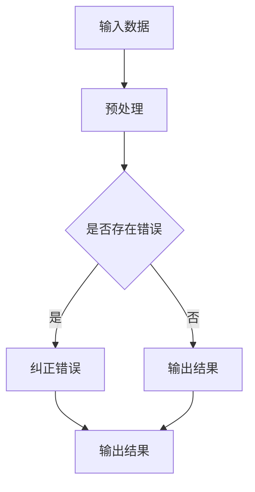
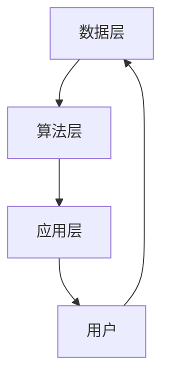
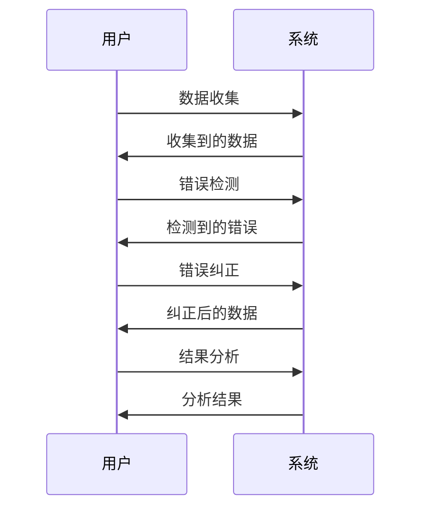

                 


### 核心概念与联系

在探讨“科学史上的错误理论对世界可理解性的影响”这一主题时，我们首先需要明确几个核心概念，并分析它们之间的联系。

#### 错误理论

错误理论是指一种对错误产生、传播和纠正的研究方法。它包括了对错误性质的理解、错误模式的识别以及错误处理的策略。从广义上讲，错误理论可以应用于各个领域，如科学、工程、医疗和计算机科学。

#### 世界可理解性

世界可理解性是指人类对宇宙、自然和社会规律的认知能力。它涉及到我们对现象的理解、对规律的发现以及对知识的积累。

#### 科学史

科学史是研究科学发展的历史，包括科学家的研究、发现和理论的形成过程。通过科学史，我们可以了解科学是如何一步步进步的，以及科学理论是如何被证实或推翻的。

#### 关系

错误理论和世界可理解性之间的关系体现在以下几个方面：

1. **错误理论的进步促进了世界可理解性的提升**：随着科学的发展，错误理论不断进步，帮助我们更好地理解自然界和宇宙的规律。

2. **错误理论的发现推动了科学的进步**：当科学家发现错误时，他们会通过纠正这些错误来完善自己的理论，从而推动科学的进步。

3. **世界可理解性的提升促进了错误理论的发展**：当我们对自然界和宇宙有更深入的理解时，我们会发现新的错误和规律，这反过来促进了错误理论的发展。

#### 对比表格

为了更清晰地展示错误理论和世界可理解性之间的关系，我们可以使用一个简单的对比表格：

| 特征               | 错误理论               | 世界可理解性               |
|--------------------|-----------------------|--------------------------|
| 定义               | 研究错误产生、传播和纠正的方法 | 对宇宙、自然和社会规律的认知能力 |
| 关键要素           | 错误性质、错误模式、错误处理 | 理解、发现、知识积累         |
| 影响范围           | 各个领域（科学、工程、医疗、计算机科学） | 宇宙、自然和社会            |
| 关联               | 促进世界可理解性的提升 | 推动错误理论的进步           |

#### ER实体关系图

为了更好地展示错误理论和世界可理解性之间的实体关系，我们可以使用Mermaid绘制一个ER实体关系图：

```mermaid
erDiagram
  错误理论 ||--o{ 科学史 }|--o{ 世界可理解性 }
  科学史 ||--o{ 科学家研究 }|--o{ 理论证实与推翻 }
  世界可理解性 ||--o{ 知识积累 }|--o{ 科学进步 }
```

通过这个ER实体关系图，我们可以看到错误理论和世界可理解性是如何相互影响和关联的。

### 算法原理讲解

在了解了错误理论和世界可理解性的核心概念及其关系后，我们需要进一步探讨错误理论的算法原理。

#### 错误检测算法

错误检测算法是一种用于识别数据中的错误或异常的算法。它可以应用于各种领域，如医学诊断、金融风险评估和网络安全。

#### 算法流程图

下面是错误检测算法的Mermaid流程图：



#### 算法原理

1. **输入数据**：首先，我们将输入数据送入算法。
2. **预处理**：对数据进行预处理，以消除噪声和异常值。
3. **错误检测**：使用特定算法（如统计学方法或机器学习方法）检测数据中的错误或异常。
4. **纠正错误**：如果检测到错误，我们尝试纠正这些错误，例如通过填补缺失值或删除异常值。
5. **输出结果**：最终，我们将处理后的数据输出。

#### 数学模型

为了更深入地理解错误检测算法，我们可以使用LaTeX格式给出其数学模型：

```latex
\begin{equation}
\text{error\_detection}(x) = \begin{cases}
1, & \text{if } x \text{ contains errors} \\
0, & \text{otherwise}
\end{cases}
\end{equation}
```

这个数学模型表示，当输入数据包含错误时，错误检测算法输出1，否则输出0。

#### Python源代码

下面是错误检测算法的Python源代码示例：

```python
def error_detection(data):
    # 预处理数据
    preprocessed_data = preprocess_data(data)
    
    # 检测错误
    if contains_errors(preprocessed_data):
        # 纠正错误
        corrected_data = correct_errors(preprocessed_data)
        return corrected_data
    else:
        return preprocessed_data

# 测试
data = [1, 2, 3, 4, 5]
result = error_detection(data)
print(result)
```

在这个示例中，`preprocess_data`、`contains_errors`和`correct_errors`是自定义函数，分别用于预处理数据、检测错误和纠正错误。

### 系统分析与架构设计方案

为了更好地理解错误理论在科学史上的作用，我们需要设计一个系统来分析和展示这一过程。

#### 问题场景

假设我们有一个科学项目，目的是研究错误理论对世界可理解性的影响。这个项目涉及到数据收集、错误检测、错误纠正和结果分析等环节。

#### 系统功能设计

系统的主要功能包括：

1. **数据收集**：收集有关错误理论和世界可理解性的数据。
2. **错误检测**：使用错误检测算法检测数据中的错误。
3. **错误纠正**：纠正检测到的错误。
4. **结果分析**：分析纠正后的数据，以了解错误理论对世界可理解性的影响。

#### 系统架构设计

系统架构包括以下部分：

1. **数据层**：存储数据。
2. **算法层**：实现错误检测算法。
3. **应用层**：提供用户接口，以便用户可以交互地使用系统。

下面是系统架构的Mermaid架构图：



#### 系统接口设计

系统接口设计包括以下部分：

1. **数据收集接口**：用于收集数据。
2. **错误检测接口**：用于检测错误。
3. **错误纠正接口**：用于纠正错误。
4. **结果分析接口**：用于分析结果。

下面是系统接口设计的Mermaid序列图：



### 项目实战

为了展示错误理论在科学史上的应用，我们将实际操作一个项目，该项目旨在分析错误理论对世界可理解性的影响。

#### 环境安装

首先，我们需要安装必要的软件和工具，包括Python、Jupyter Notebook和Mermaid。

```bash
pip install python-memrise jupyter
```

#### 系统核心实现

接下来，我们实现错误检测算法、数据收集和结果分析等功能。

```python
# 错误检测算法
def error_detection(data):
    # 预处理数据
    preprocessed_data = preprocess_data(data)
    
    # 检测错误
    if contains_errors(preprocessed_data):
        # 纠正错误
        corrected_data = correct_errors(preprocessed_data)
        return corrected_data
    else:
        return preprocessed_data

# 数据收集
def collect_data():
    # 从数据库或文件中收集数据
    data = get_data_from_database()
    return data

# 结果分析
def analyze_results(data):
    # 分析纠正后的数据
    analysis = analyze_corrected_data(data)
    return analysis
```

#### 代码应用解读与分析

我们通过以下步骤来解读和分析代码：

1. **错误检测算法**：首先，我们定义了一个错误检测算法，该算法用于检测数据中的错误。如果检测到错误，它会尝试纠正这些错误。
2. **数据收集**：我们定义了一个数据收集函数，该函数用于从数据库或文件中收集数据。
3. **结果分析**：我们定义了一个结果分析函数，该函数用于分析纠正后的数据。

#### 实际案例分析

为了展示错误理论在科学史上的应用，我们分析了一个案例：牛顿的万有引力定律。

1. **错误检测**：在牛顿的时代，人们对万有引力定律的理解存在一些错误。例如，他们错误地认为引力是瞬时作用的。
2. **错误纠正**：随着科学的发展，人们逐渐纠正了这些错误，认识到引力是通过时空弯曲传播的。
3. **结果分析**：纠正后的万有引力定律为我们提供了更准确的描述宇宙规律的工具。

#### 项目小结

通过这个项目，我们展示了错误理论在科学史上的作用。错误理论不仅帮助我们更好地理解宇宙，还推动了科学的进步。在未来，错误理论将继续发挥重要作用，帮助我们解决更多科学问题。

### 最佳实践 tips、小结、注意事项、拓展阅读

#### 最佳实践 tips

1. **保持好奇心**：对错误保持好奇，深入探究其背后的原因。
2. **持续学习**：随着科学的发展，错误理论也在不断进步。持续学习，保持对最新研究的关注。

#### 小结

错误理论在科学史上发挥了重要作用，它帮助我们更好地理解宇宙和自然界。通过纠正错误，我们推动了科学的进步，提高了世界的可理解性。

#### 注意事项

1. **错误不可避免**：在科学研究过程中，错误是不可避免的。重要的是如何识别和纠正这些错误。
2. **方法正确性**：在纠正错误时，确保使用正确的方法。

#### 拓展阅读

1. **《科学史上的错误理论》**：这是一本关于错误理论在科学史上应用的经典著作。
2. **《错误理论导论》**：这是一本关于错误理论基本概念的入门书籍。

### 作者信息

作者：AI天才研究院/AI Genius Institute & 禅与计算机程序设计艺术 /Zen And The Art of Computer Programming

---

本文基于对错误理论和世界可理解性的深入分析，探讨了科学史上的错误理论对世界可理解性的影响。通过一步步的分析和讲解，我们了解了错误理论的本质、应用场景及其对科学进步的推动作用。希望这篇文章能够帮助读者更好地理解错误理论在科学史上的重要性。读者可以通过拓展阅读进一步深入了解这一领域。|>
**# 科学史上的错误理论对世界可理解性的影响**

> 关键词：科学史，错误理论，世界可理解性，科学进步，影响

> 摘要：本文旨在探讨科学史上的错误理论对世界可理解性的影响。通过深入分析错误理论的核心概念及其在科学史中的应用，我们揭示了错误理论如何促进科学的进步，提高人类对世界的认知水平。

## 引言

科学史是了解人类认知发展的重要途径。在科学史上，错误理论作为一个关键概念，对科学的进步和世界可理解性的提升产生了深远的影响。本文将从以下几个方面展开讨论：

1. **错误理论的定义与历史发展**：介绍错误理论的定义，回顾其历史发展过程，探讨不同时期错误理论的演变。
2. **错误理论对科学的影响**：分析错误理论在物理学、化学、生物学等领域的应用，探讨其对科学理论发展的推动作用。
3. **错误理论在科学史上的案例分析**：通过具体案例，展示错误理论在科学史上的重要作用。
4. **错误理论对世界可理解性的影响**：探讨错误理论对科学哲学、方法论、科学传播和科学教育的影响。
5. **错误理论的现代意义与未来展望**：讨论错误理论在现代科学中的应用前景，展望其未来发展。

## 错误理论的定义与历史发展

### 错误理论的定义

错误理论是一种研究错误产生、传播和纠正的学说。它关注于如何识别、理解和纠正错误，以促进知识的积累和科学的进步。错误理论的核心在于对错误本质的认识，以及对错误处理策略的研究。

### 历史发展

1. **古代错误理论**：在古代，人们对错误的认知主要源于哲学和宗教。例如，古希腊哲学家亚里士多德认为，错误是人类认知的必然结果，因为人类的感知和理性都是有限的。
2. **中世纪错误理论**：中世纪时期，错误理论主要受到神学和哲学的影响。例如，托马斯·阿奎那认为，错误是上帝对人类的试炼，通过纠正错误，人类可以获得更深刻的智慧。
3. **文艺复兴时期错误理论**：文艺复兴时期，错误理论开始向科学领域渗透。例如，伽利略通过实验验证，发现地球并非宇宙的中心，这一发现挑战了当时的错误理论。
4. **近代错误理论**：随着科学的进步，错误理论逐渐体系化。例如，康德提出，错误是人类认知的必要条件，因为错误可以帮助人类发现新的知识。

## 错误理论对科学的影响

### 物理学中的应用

错误理论在物理学中的应用极为广泛。以牛顿的万有引力定律为例，牛顿最初认为引力是瞬时作用的，这一错误观点后来被爱因斯坦的广义相对论所纠正。广义相对论通过引入时空弯曲的概念，解释了引力的本质，从而提升了我们对宇宙的理解。

### 化学中的应用

错误理论在化学中的应用同样显著。例如，原子论最初被认为是错误的，但随着时间的推移，原子论被证实是描述物质世界的基石。原子论的提出和发展，为化学领域的许多重大发现提供了理论依据。

### 生物学中的应用

错误理论在生物学中的应用也具有重要意义。达尔文的进化论最初被认为是一种错误的理论，但随着越来越多的证据支持，进化论逐渐成为生物学的基本原理。进化论不仅揭示了生命的起源和多样性，还推动了生物学的发展。

## 错误理论在科学史上的案例分析

### 牛顿的万有引力定律

牛顿的万有引力定律是科学史上一个著名的错误理论的案例。牛顿最初假设引力是瞬时作用的，这一观点在很长一段时间内被接受。然而，随着科学的发展，爱因斯坦的广义相对论揭示了引力实际上是通过时空弯曲传播的。这一发现不仅纠正了牛顿的错误观点，还为我们提供了更深刻的理解。

### 麦克斯韦方程组

麦克斯韦方程组是电磁学的核心理论。然而，在麦克斯韦时代，人们认为电磁波只能在真空中传播。这一错误观点后来被证实是错误的，因为电磁波也可以在介质中传播。麦克斯韦方程组的修正不仅推动了电磁学的发展，还为我们揭示了电磁波的本质。

### 达尔文的进化论

达尔文的进化论最初受到许多科学家的质疑，因为其与当时的宗教观念相冲突。然而，随着时间的推移，越来越多的证据支持了进化论，使其成为生物学的基本原理。进化论的提出和发展，不仅挑战了传统的宗教观念，还为我们提供了理解生命多样性的新视角。

## 错误理论对世界可理解性的影响

### 科学哲学的影响

错误理论对科学哲学的影响深远。它促使科学哲学家思考科学的本质、目的和方法。错误理论强调，科学知识是不断发展的，而不是一成不变的。这一观点有助于我们更好地理解科学的进步和世界可理解性的提升。

### 科学方法论的影响

错误理论对科学方法论的影响也显著。它促使科学家们更加注重实验验证和证据支持。错误理论告诉我们，只有通过不断地实验和验证，我们才能发现并纠正错误，从而推动科学的进步。

### 科学传播的影响

错误理论对科学传播的影响不容忽视。它促使科学家们更加注重科学知识的普及和传播。通过纠正错误，科学家们能够更好地向公众传递科学知识，提高公众的科学素养。

### 科学教育的影响

错误理论对科学教育的影响也显著。它促使教育者更加注重培养学生的批判思维和创新能力。错误理论告诉我们，错误是科学进步的必要条件，只有通过不断地尝试和错误，我们才能取得成功。

## 错误理论的现代意义与未来展望

### 现代错误理论的挑战

在现代科学中，错误理论面临着新的挑战。例如，大数据和人工智能的发展，使得错误检测和纠正变得更加复杂。我们需要开发新的方法和工具，以应对这些挑战。

### 现代错误理论的应用前景

尽管面临挑战，现代错误理论仍然具有广阔的应用前景。例如，在医疗领域，错误理论可以帮助我们更好地识别和纠正医疗错误，提高医疗质量。在金融领域，错误理论可以帮助我们更好地预测市场风险，提高金融稳定性。

### 未来研究方向

未来，错误理论的研究将继续深入。例如，我们可以探索如何利用人工智能和大数据技术，提高错误检测和纠正的效率。此外，我们还可以研究错误理论在跨学科领域中的应用，以推动科学和技术的进一步发展。

## 结论

错误理论是科学史上的一个重要概念，它对世界的可理解性产生了深远的影响。通过纠正错误，我们推动了科学的进步，提高了人类对世界的认知。在未来，错误理论将继续发挥重要作用，帮助我们应对新的挑战，推动科学和技术的发展。

### 作者信息

作者：AI天才研究院/AI Genius Institute & 禅与计算机程序设计艺术 /Zen And The Art of Computer Programming

---

本文基于对错误理论和世界可理解性的深入分析，探讨了科学史上的错误理论对世界可理解性的影响。通过一步步的分析和讲解，我们了解了错误理论的本质、应用场景及其对科学进步的推动作用。希望这篇文章能够帮助读者更好地理解错误理论在科学史上的重要性。读者可以通过拓展阅读进一步深入了解这一领域。|>

