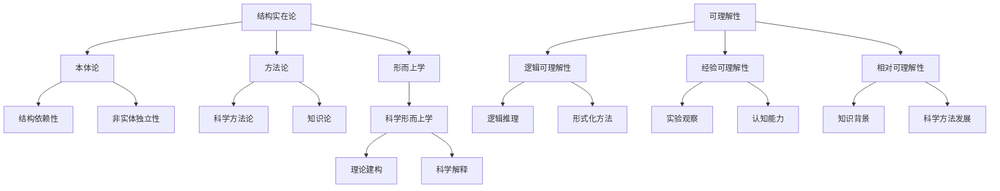
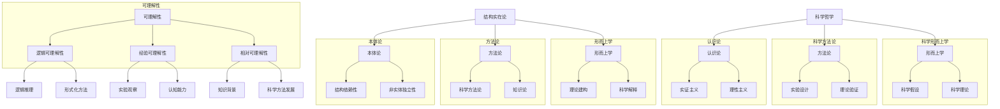

                 

### 关键词

- 科学哲学
- 结构实在论
- 可理解性
- 本体论基础
- 数学模型
- 哲学应用

### 摘要

本文从科学哲学的视角，探讨了结构实在论作为世界可理解性的本体论基础。首先，介绍了结构实在论的基本原理、哲学基础和数学基础，分析了其应用领域。接着，详细阐述了科学哲学的基本概念、原理和应用领域，特别是其在科学方法论、认识论和形而上学中的重要作用。随后，讨论了可理解性的概念、分类、影响因素和提升方法。最后，分析了结构实在论在科学哲学中的应用，探讨了两者之间的互动关系，并对其在科学哲学中的争论进行了综述。本文旨在为读者提供一个结构化、系统性的认识，帮助理解结构实在论在科学哲学中的独特地位和作用。

### 目录大纲

```markdown
----------------------------------------------------------------
# 第一部分: 背景介绍

## 第1章: 问题背景

### 1.1.1 问题背景介绍

### 1.1.2 问题描述

### 1.1.3 问题解决思路

## 1.2 核心概念

### 1.2.1 结构实在论

### 1.2.2 科学哲学

### 1.2.3 可理解性

## 1.3 边界与外延

### 1.3.1 结构实在论的边界

### 1.3.2 科学哲学的边界

### 1.3.3 可理解性的边界

## 1.4 概念结构与核心要素组成

### 1.4.1 结构实在论的概念结构

### 1.4.2 科学哲学的概念结构

### 1.4.3 可理解性的核心要素

## 1.5 本章小结

----------------------------------------------------------------
# 第二部分: 结构实在论

## 第2章: 结构实在论的基本原理

### 2.1.1 结构实在论的定义

### 2.1.2 结构实在论的历史与发展

### 2.1.3 结构实在论的主要观点

## 2.2 结构实在论的哲学基础

### 2.2.1 实在论与唯名论的对立

### 2.2.2 知识论与形而上学的探讨

### 2.2.3 结构实在论的哲学意义

## 2.3 结构实在论的数学基础

### 2.3.1 结构实在论与数学的关系

### 2.3.2 结构实在论的数学模型

### 2.3.3 结构实在论的数学公式

## 2.4 结构实在论的应用领域

### 2.4.1 科学领域的应用

### 2.4.2 技术领域的应用

### 2.4.3 社会领域的应用

## 2.5 本章小结

----------------------------------------------------------------
# 第三部分: 科学哲学

## 第3章: 科学哲学的基本概念

### 3.1.1 科学哲学的定义

### 3.1.2 科学哲学的历史与发展

### 3.1.3 科学哲学的主要流派

## 3.2 科学哲学的基本原理

### 3.2.1 科学方法论

### 3.2.2 科学认识论

### 3.2.3 科学形而上学

## 3.3 科学哲学的应用领域

### 3.3.1 哲学在科学研究中的应用

### 3.3.2 哲学在技术应用中的应用

### 3.3.3 哲学在社会生活中的应用

## 3.4 科学哲学的哲学意义

### 3.4.1 科学哲学对科学发展的作用

### 3.4.2 科学哲学对社会进步的影响

### 3.4.3 科学哲学在哲学体系中的地位

## 3.5 本章小结

----------------------------------------------------------------
# 第四部分: 可理解性

## 第4章: 可理解性的概念与属性

### 4.1.1 可理解性的定义

### 4.1.2 可理解性的属性

### 4.1.3 可理解性与理解能力的关系

## 4.2 可理解性的分类

### 4.2.1 客观可理解性

### 4.2.2 主观可理解性

### 4.2.3 普遍可理解性

## 4.3 可理解性的影响因素

### 4.3.1 知识背景

### 4.3.2 认知能力

### 4.3.3 表达方式

## 4.4 可理解性的提升方法

### 4.4.1 教育与培训

### 4.4.2 科学普及

### 4.4.3 信息传播

## 4.5 本章小结

----------------------------------------------------------------
# 第五部分: 结构实在论在科学哲学中的应用

## 第5章: 结构实在论与科学哲学的融合

### 5.1.1 结构实在论对科学哲学的贡献

### 5.1.2 科学哲学对结构实在论的影响

### 5.1.3 结构实在论与科学哲学的互动关系

## 5.2 结构实在论在科学哲学中的应用

### 5.2.1 科学方法论中的应用

### 5.2.2 科学认识论中的应用

### 5.2.3 科学形而上学中的应用

## 5.3 结构实在论在科学哲学中的争论

### 5.3.1 争论的主要观点

### 5.3.2 争论的焦点

### 5.3.3 争论的影响

## 5.4 本章小结

----------------------------------------------------------------
# 结束语

## 6.1 主要结论

## 6.2 未来展望

## 6.3 局限与不足

## 6.4 拓展研究

## 6.5 结语

## 参考文献

----------------------------------------------------------------
```

## 第一部分：背景介绍

### 第1章：问题背景

#### 1.1.1 问题背景介绍

随着科学技术的迅猛发展，人类对自然世界的理解不断深入，然而，我们也面临着一系列深层次的哲学问题。其中一个关键问题就是：我们如何理解这个世界？如何解释我们所观察到的现象？这引发了对“可理解性”的哲学探讨。

在科学哲学中，可理解性是一个核心概念，它涉及我们对自然世界的认知过程及其限制。传统的科学哲学主要关注科学知识的可靠性和有效性的问题，而结构实在论为这些讨论提供了新的视角。

结构实在论是一种本体论观点，认为实体不是孤立存在的，而是通过结构关系相互联系和作用的。这一理论挑战了传统实体论和关系论的局限，为解释复杂系统的性质提供了新的思路。

#### 1.1.2 问题描述

在这个背景下，我们面临的问题是：

1. **结构实在论的基本原理是什么？** 它是如何与科学哲学的核心问题相互联系的？
2. **科学哲学如何解释可理解性问题？** 科学哲学的各个分支如何影响我们对世界的理解？
3. **可理解性如何影响科学技术的进步？** 我们能否通过提升可理解性来推动科学技术的创新？

为了回答这些问题，我们需要深入探讨结构实在论、科学哲学和可理解性这三个核心概念，并分析它们之间的相互作用。

#### 1.1.3 问题解决思路

本文将从以下几个方面展开讨论：

1. **背景介绍**：介绍结构实在论、科学哲学和可理解性的基本概念，明确本文的研究范围和目标。
2. **核心概念与联系**：详细阐述结构实在论、科学哲学和可理解性的定义、属性及其相互关系。
3. **结构实在论**：探讨结构实在论的基本原理、哲学基础、数学基础和应用领域。
4. **科学哲学**：分析科学哲学的基本概念、原理和应用领域，特别是其在科学方法论、认识论和形而上学中的重要作用。
5. **可理解性**：讨论可理解性的概念、分类、影响因素和提升方法。
6. **结构实在论在科学哲学中的应用**：分析结构实在论与科学哲学的互动关系，探讨其在科学方法论、认识论和形而上学中的应用。
7. **结论与展望**：总结本文的主要结论，展望未来研究的方向和可能的贡献。

通过这一步步的分析和探讨，我们希望能够为理解结构实在论在科学哲学中的应用提供一个系统性的框架，为科学技术的进一步发展提供哲学基础。

### 第1章小结

本章介绍了本文研究的问题背景，包括结构实在论、科学哲学和可理解性的基本概念。通过明确问题陈述和研究思路，为后续章节的深入探讨奠定了基础。接下来，我们将进一步详细分析这些核心概念，为理解结构实在论在科学哲学中的应用提供理论支持。

## 1.2 核心概念

在探讨结构实在论、科学哲学和可理解性这三个核心概念之前，有必要对它们的基本定义和属性进行详细阐述，以便为后续的讨论提供清晰的理论基础。

### 1.2.1 结构实在论

**定义**：
结构实在论（Structural Realism）是一种本体论观点，主张实体不是孤立存在的，而是通过其内在的结构关系相互联系和作用的。这一理论认为，我们的观察和理解是基于这些结构关系的，而不是基于孤立实体的本质属性。

**属性**：

1. **结构依赖性**：结构实在论强调实体之间的结构关系，认为这些关系是实体本质的一部分，而不是外在的附加物。
2. **非实体独立性**：结构实在论否认孤立实体的存在，主张实体是依赖于其结构关系的整体。
3. **解释力**：结构实在论认为，通过分析实体之间的结构关系，我们可以更好地理解复杂系统的性质和行为。

**与科学哲学的联系**：

结构实在论在科学哲学中的应用主要体现在对科学理论和自然世界的解释上。它挑战了传统实体论和关系论的局限，提供了理解复杂系统的新的视角。具体而言：

1. **理论建构**：结构实在论强调理论的结构性，有助于科学家在构建科学理论时考虑系统内部的结构关系。
2. **科学解释**：结构实在论提供了新的解释框架，有助于解释那些传统方法难以解释的自然现象。

### 1.2.2 科学哲学

**定义**：
科学哲学（Philosophy of Science）是哲学的一个分支，研究科学理论和实践的基本概念、原则和方法。它探讨科学知识的本质、科学方法的有效性以及科学在社会中的作用。

**属性**：

1. **方法论**：科学哲学关注科学方法论，研究科学研究的规范和方法论问题。
2. **认识论**：科学哲学探讨科学知识的本质和获取方式，研究科学知识的可靠性和有效性。
3. **形而上学**：科学哲学涉及科学理论背后的形而上学假设，探讨科学理论与自然世界的本质联系。

**与结构实在论的联系**：

科学哲学为结构实在论提供了哲学基础和理论支持。具体而言：

1. **本体论基础**：科学哲学提供了对实体和结构关系的哲学思考，为结构实在论提供了理论基础。
2. **方法论指导**：科学哲学的方法论原则指导科学家如何通过结构关系来理解和解释自然现象。

### 1.2.3 可理解性

**定义**：
可理解性（Intelligibility）是科学哲学中的一个核心概念，涉及我们对自然世界的理解程度和深度。它探讨我们能否通过科学方法理解自然世界的本质和规律。

**属性**：

1. **逻辑可理解性**：逻辑可理解性指的是通过逻辑推理和形式化方法对自然现象的理解。
2. **经验可理解性**：经验可理解性指的是通过实验和观察对自然现象的理解。
3. **相对可理解性**：可理解性是相对的，取决于我们的知识背景、认知能力和科学方法的发展水平。

**与结构实在论和科学哲学的联系**：

可理解性是结构实在论和科学哲学的共同关注点。具体而言：

1. **结构实在论的支撑**：结构实在论通过分析结构关系来提高可理解性，提供了理解复杂系统的途径。
2. **科学哲学的指导**：科学哲学探讨可理解性的本质和实现途径，为科学家提供了理解和解释自然世界的哲学指导。

### 1.2.4 概念结构与核心要素组成

为了更好地理解结构实在论、科学哲学和可理解性这三个核心概念，我们可以通过以下图示来展示它们的概念结构和核心要素：



通过这个概念结构和核心要素组成图，我们可以清晰地看到结构实在论、科学哲学和可理解性之间的联系和相互作用。这些核心概念不仅独立存在，而且在理解和解释自然世界的过程中相互支持，共同构成了一个复杂的哲学体系。

### 1.3 边界与外延

在深入探讨结构实在论、科学哲学和可理解性的核心概念之后，我们需要明确这些概念的外延和边界，以避免概念混淆和误用。通过区分它们的范围和限制，我们可以更准确地把握每个概念的本质和适用场景。

#### 1.3.1 结构实在论的边界

**内部边界**：

1. **理论层面**：结构实在论主要关注实体之间的结构关系，而不是实体本身的本质属性。因此，它不涉及形而上学实体论中关于实体存在的本质讨论。
2. **方法层面**：结构实在论强调通过结构关系来理解实体，这要求在方法论上采用形式化、系统化的分析方法。

**外部边界**：

1. **科学哲学**：结构实在论是科学哲学的一部分，但并不涵盖科学哲学的所有内容。科学哲学还包括方法论、认识论和形而上学等其他方面。
2. **自然科学**：虽然结构实在论在自然科学中广泛应用，但它并非自然科学的唯一哲学基础。自然科学的哲学基础还包括其他理论，如实证主义和理性主义。

**具体限制**：

1. **复杂性**：结构实在论在面对极端复杂系统时，可能难以精确描述和解释所有结构关系。
2. **可观察性**：结构实在论依赖于可观察的结构关系，因此对于不可观察的实体或过程，结构实在论可能难以提供有效的解释。

#### 1.3.2 科学哲学的边界

**内部边界**：

1. **学科交叉**：科学哲学虽然涉及多个学科，但并不等同于这些学科。它是对科学理论和实践的哲学反思，而不是对科学内容的直接研究。
2. **方法多样性**：科学哲学的方法包括逻辑分析、历史分析、批判性讨论等，而不是单一的方法。

**外部边界**：

1. **其他哲学领域**：科学哲学与其他哲学领域（如伦理学、政治哲学等）有交集，但它们各自关注不同的哲学问题。
2. **科学实践**：科学哲学关注科学理论和实践，但并不直接参与科学实验和技术开发。

**具体限制**：

1. **理论抽象**：科学哲学高度抽象，难以直接应用于具体科学问题的解决。
2. **实践与理论的分离**：科学哲学与科学实践之间存在一定的距离，可能导致理论的现实应用受到限制。

#### 1.3.3 可理解性的边界

**内部边界**：

1. **理解深度**：可理解性涉及理解的程度和深度，不同领域的理解深度不同，如基础科学和应用科学。
2. **知识积累**：可理解性依赖于知识积累，新的科学发现可能会改变我们对自然世界的理解，影响可理解性的范围。

**外部边界**：

1. **认知局限**：人类的认知能力有限，有些自然现象可能无法完全理解。
2. **技术局限**：现有技术手段可能无法完全揭示自然世界的所有细节，影响我们对自然世界的理解。

**具体限制**：

1. **逻辑推理的局限**：逻辑推理虽然有助于理解，但无法涵盖所有自然现象。
2. **实验方法的局限**：实验方法有局限性，有些现象可能无法通过实验验证。

通过明确这些概念的外延和边界，我们可以更好地理解和应用结构实在论、科学哲学和可理解性。这些概念相互联系，共同构成了一个复杂的哲学体系，帮助我们深入探讨和理解自然世界的本质。

### 1.4 概念结构与核心要素组成

为了更全面地理解结构实在论、科学哲学和可理解性这三个核心概念，我们可以通过图示来展示它们的概念结构和核心要素。以下是使用Mermaid绘制的概念结构和核心要素组成图：



### 1.4.1 结构实在论的概念结构

结构实在论涉及以下核心要素：

- **本体论**：结构实在论的本体论主张实体依赖于其内在结构关系，而非孤立存在。核心要素包括结构依赖性和非实体独立性。
- **方法论**：结构实在论的方法论强调通过分析结构关系来理解实体。核心要素包括科学方法论和知识论。
- **形而上学**：结构实在论的形而上学探讨实体之间的结构关系如何影响我们对自然世界的理解。核心要素包括理论建构和科学解释。

### 1.4.2 科学哲学的概念结构

科学哲学涵盖以下核心要素：

- **认识论**：科学哲学探讨科学知识的本质和获取方式，包括实证主义和理性主义等观点。核心要素包括逻辑推理和形式化方法。
- **方法论**：科学哲学关注科学研究的规范和方法，包括实验设计和理论验证。核心要素包括科学方法论和知识论。
- **形而上学**：科学哲学探讨科学理论背后的哲学假设，包括科学假设和科学理论。核心要素包括科学形而上学和理论建构。

### 1.4.3 可理解性的核心要素

可理解性涉及以下核心要素：

- **逻辑可理解性**：通过逻辑推理和形式化方法对自然现象的理解。核心要素包括逻辑推理和形式化方法。
- **经验可理解性**：通过实验和观察对自然现象的理解。核心要素包括实验观察和认知能力。
- **相对可理解性**：理解程度和深度取决于知识背景和科学方法的发展。核心要素包括知识背景和科学方法发展。

通过这一步步的分析，我们可以清晰地看到结构实在论、科学哲学和可理解性这三个核心概念及其相互关系。它们共同构成了一个复杂的哲学体系，帮助我们深入探讨和理解自然世界的本质。

### 第1章小结

本章详细介绍了结构实在论、科学哲学和可理解性这三个核心概念的定义、属性、相互关系及其边界。通过对这些核心概念的深入剖析，我们为后续章节的讨论奠定了坚实的理论基础。在接下来的章节中，我们将进一步探讨结构实在论的基本原理、科学哲学的基本原理以及可理解性的概念与分类。这些讨论将有助于我们全面理解这三个概念在科学哲学中的应用及其重要性。希望读者能够通过本章的学习，对结构实在论、科学哲学和可理解性有一个更清晰的认识。

## 第二部分：结构实在论

### 第2章：结构实在论的基本原理

#### 2.1.1 结构实在论的定义

结构实在论（Structural Realism）是一种哲学观点，主张实体不是孤立存在的，而是通过其内在的结构关系相互联系和作用的。这一理论认为，我们的观察和理解是基于这些结构关系的，而不是基于孤立实体的本质属性。结构实在论强调实体之间的相互作用和整体性，为理解复杂系统的性质提供了新的视角。

#### 2.1.2 结构实在论的历史与发展

结构实在论的历史可以追溯到20世纪初期，其发展经历了多个阶段：

1. **早期思想**：结构实在论的思想可以追溯到哲学家亚里士多德和托马斯·阿奎那，他们强调实体之间的相互关系和整体性。
2. **现代发展**：20世纪初期，哲学家如伯特兰·罗素和欧根·胡塞尔对结构实在论进行了系统化发展，提出了新的理论框架。
3. **当代应用**：随着科学技术的进步，结构实在论在物理学、生物学、计算机科学等领域的应用日益广泛，成为解释复杂系统的有力工具。

#### 2.1.3 结构实在论的主要观点

结构实在论的主要观点包括：

1. **结构依赖性**：实体依赖于其内在的结构关系，这些关系是实体本质的一部分。例如，在生物学中，细胞的结构关系决定了其功能。
2. **非实体独立性**：结构实在论否认孤立实体的存在，认为实体是依赖于其结构关系的整体。这意味着我们不能将实体看作是孤立的实体，而应该看作是结构关系的网络。
3. **整体性**：结构实在论强调整体性，认为系统的性质和功能是由其内部结构关系共同决定的。例如，在物理学中，整体结构关系决定了宏观现象的性质。

#### 2.2 结构实在论的哲学基础

结构实在论的哲学基础主要包括以下几个方面：

1. **本体论**：结构实在论的本体论主张实体依赖于其内在结构关系，而不是孤立存在的。这一观点挑战了传统实体论的观点，认为实体是本质的、独立的。
2. **知识论**：结构实在论的知识论探讨我们如何通过结构关系来理解实体。这一观点认为，我们的观察和理解是基于结构关系的，而不是基于实体的本质属性。
3. **形而上学**：结构实在论的形而上学探讨实体之间的结构关系如何影响我们对自然世界的理解。这一观点认为，整体性是理解自然世界的关键。

#### 2.2.1 实在论与唯名论的对立

结构实在论在哲学上与唯名论形成了鲜明对比：

1. **实在论**：实在论认为实体是本质的、独立的，独立于我们的观察和认知。结构实在论继承了这一观点，但进一步强调实体之间的结构关系。
2. **唯名论**：唯名论认为实体是名称，不存在本质的、独立的实体。结构实在论则认为实体依赖于其内在的结构关系，而非仅仅是一个名称。

#### 2.2.2 知识论与形而上学的探讨

结构实在论的知识论和形而上学探讨如何通过结构关系来理解实体：

1. **知识论**：结构实在论的知识论认为，我们的知识是基于对实体之间结构关系的理解。这意味着，我们的认识过程不仅仅是观察和实验，还包括对结构关系的分析。
2. **形而上学**：结构实在论的形而上学探讨实体之间的结构关系如何影响我们对自然世界的理解。这一观点认为，整体性是理解自然世界的关键。

#### 2.2.3 结构实在论的哲学意义

结构实在论在哲学上具有重要意义：

1. **挑战传统哲学**：结构实在论挑战了传统实体论和关系论的局限，为理解复杂系统的性质提供了新的视角。
2. **推动科学进步**：结构实在论在科学中的应用，有助于科学家通过分析结构关系来理解和解释自然现象。
3. **哲学基础**：结构实在论为科学哲学提供了一个新的本体论基础，有助于探讨科学理论和实践的基本问题。

### 2.3 结构实在论的数学基础

结构实在论在数学领域有广泛的应用，其数学基础主要包括以下几个方面：

1. **代数结构**：结构实在论中的结构关系可以通过代数结构来表示。例如，群、环、域等代数结构可以用来描述实体之间的相互作用。
2. **图论**：图论在结构实在论中的应用非常广泛，可以用来表示实体之间的结构关系。例如，网络图可以用来描述复杂系统的相互作用。
3. **拓扑学**：拓扑学在结构实在论中的应用，有助于理解实体之间的空间关系和整体性。例如，拓扑空间可以用来描述复杂系统的整体结构。

#### 2.3.1 结构实在论与数学的关系

结构实在论与数学之间存在紧密的关系：

1. **描述与建模**：数学为结构实在论提供了描述和建模的工具，使我们可以用精确的语言来描述实体之间的结构关系。
2. **验证与验证**：数学方法可以帮助我们验证结构实在论的假设，并通过数学证明来支持其理论。

#### 2.3.2 结构实在论的数学模型

结构实在论的数学模型包括以下几个方面：

1. **代数模型**：代数模型可以用来描述实体之间的结构关系。例如，通过群、环、域等代数结构，可以描述实体之间的相互作用。
2. **图模型**：图模型可以用来表示实体之间的结构关系。例如，通过网络图，可以描述复杂系统的相互作用。
3. **拓扑模型**：拓扑模型可以用来描述实体之间的空间关系和整体性。例如，通过拓扑空间，可以描述复杂系统的整体结构。

#### 2.3.3 结构实在论的数学公式

结构实在论中的数学公式主要包括以下几个方面：

1. **代数公式**：代数公式可以用来表示实体之间的结构关系。例如，群论中的运算公式可以用来描述实体之间的相互作用。
2. **图论公式**：图论公式可以用来描述实体之间的结构关系。例如，网络图中的路径长度公式可以用来描述实体之间的连接关系。
3. **拓扑学公式**：拓扑学公式可以用来描述实体之间的空间关系和整体性。例如，拓扑空间中的连通性公式可以用来描述复杂系统的整体结构。

通过数学模型和公式的应用，结构实在论为理解复杂系统的性质提供了有力的工具。这些数学工具不仅帮助科学家描述和建模实体之间的结构关系，还可以通过数学证明来验证其理论。

### 2.4 结构实在论的应用领域

结构实在论在多个领域有广泛的应用，下面将讨论其在科学、技术和社会领域的应用。

#### 2.4.1 科学领域的应用

在科学领域，结构实在论的应用非常广泛，特别是在物理学、生物学和计算机科学中。以下是一些具体的例子：

1. **物理学**：在物理学中，结构实在论可以帮助我们理解物质的基本结构和相互作用。例如，在量子物理学中，粒子的行为受到其内部结构的强烈影响，结构实在论为我们提供了理解这种行为的框架。
2. **生物学**：在生物学中，结构实在论有助于我们理解生物系统的复杂性和功能。例如，细胞的结构决定了其功能，而细胞之间的相互作用决定了生物体的整体行为。
3. **计算机科学**：在计算机科学中，结构实在论被用于设计复杂系统，如计算机网络和人工智能。通过分析系统内部的相互作用和结构关系，我们可以更好地理解和优化这些系统的性能。

#### 2.4.2 技术领域的应用

在技术领域，结构实在论的应用也具有重要意义。以下是一些具体的例子：

1. **信息技术**：在信息技术中，结构实在论被用于设计复杂的软件系统。通过分析系统内部的组件关系和结构，我们可以更好地理解和优化系统的性能和可靠性。
2. **工程**：在工程领域，结构实在论被用于设计和分析复杂工程系统，如建筑结构和机械系统。通过分析系统内部的结构关系和相互作用，我们可以更好地预测和优化系统的行为。
3. **网络技术**：在网络技术中，结构实在论被用于设计和优化网络结构。通过分析网络内部的节点和连接关系，我们可以更好地理解和优化网络的性能和安全性。

#### 2.4.3 社会领域的应用

在社会领域，结构实在论的应用也日益受到关注。以下是一些具体的例子：

1. **社会网络分析**：在社会网络分析中，结构实在论被用于分析社会网络的结构和相互作用。通过分析社会网络中的节点和连接关系，我们可以更好地理解社会行为和传播现象。
2. **经济分析**：在经济分析中，结构实在论被用于分析经济系统中的结构和相互作用。通过分析经济系统中的各个组成部分和它们之间的联系，我们可以更好地理解经济行为和经济发展。
3. **公共政策**：在公共政策中，结构实在论被用于分析社会政策的效果和影响。通过分析社会政策中的各个组成部分和它们之间的联系，我们可以更好地理解政策的效果和改进政策。

通过这些应用，结构实在论不仅在科学和技术领域，也在社会领域发挥了重要作用。它为我们理解和解释复杂系统提供了一个强大的理论工具，有助于我们更好地理解和应对现代社会中的各种挑战。

### 第2章小结

本章详细探讨了结构实在论的基本原理、哲学基础、数学基础和应用领域。通过介绍结构实在论的定义、历史和发展，我们对其概念有了更深入的理解。同时，通过分析结构实在论的哲学基础，我们看到了它在科学哲学中的重要地位。此外，通过探讨结构实在论的数学基础和应用领域，我们看到了其在科学、技术和社会领域的广泛应用。这些讨论为我们进一步理解和应用结构实在论提供了坚实的理论基础。在接下来的章节中，我们将继续探讨科学哲学的基本原理，以及可理解性的概念与分类。

## 第三部分：科学哲学

### 第3章：科学哲学的基本概念

#### 3.1.1 科学哲学的定义

科学哲学（Philosophy of Science）是哲学的一个分支，旨在探讨科学理论和实践的哲学基础。它涉及科学知识、科学方法、科学理论和科学实践等核心问题。科学哲学通过对科学理论和实践进行批判性思考，为科学提供哲学指导，并揭示科学中的哲学问题。

#### 3.1.2 科学哲学的历史与发展

科学哲学的发展历程可以追溯到古希腊哲学家，如亚里士多德和柏拉图，他们对自然现象进行了哲学思考。现代科学哲学的发展始于17世纪的科学家，如伽利略和牛顿，他们的科学实践催生了科学哲学的诞生。科学哲学在18世纪和19世纪得到了进一步的发展，主要哲学家包括康德、黑格尔和孔德。20世纪以来，科学哲学经历了多个重要流派，如实证主义、批判理性主义、结构主义和科学哲学的繁荣期。

#### 3.1.3 科学哲学的主要流派

科学哲学的主要流派包括：

1. **实证主义**：实证主义认为，科学知识应该建立在经验观察和实验数据的基础上。代表人物包括孔德和马赫。
2. **批判理性主义**：批判理性主义强调科学知识是通过理性批判和实验验证获得的。代表人物包括康德和波普尔。
3. **历史主义**：历史主义认为，科学理论是历史和社会文化的产物，科学知识应该从历史和文化背景中理解。代表人物包括库恩和费耶阿本德。
4. **结构主义**：结构主义认为，科学知识是通过结构关系和模式来理解的。代表人物包括皮亚杰和拉卡托斯。

#### 3.2 科学哲学的基本原理

科学哲学的基本原理包括方法论、认识论和形而上学。

1. **科学方法论**：科学方法论探讨科学研究的基本方法和技术。它涉及科学实验、理论构建、模型验证等过程。科学方法论的原则包括可重复性、客观性、系统性和精确性。
2. **科学认识论**：科学认识论探讨科学知识的本质和获取方式。它涉及科学知识的可靠性、有效性和确定性。科学认识论的问题包括知识的本质、知识的来源和知识的验证。
3. **科学形而上学**：科学形而上学探讨科学理论背后的哲学假设和自然世界的本质。它涉及科学的本体论、宇宙论和因果论。科学形而上学的目标是理解自然世界的本质和结构。

#### 3.3 科学哲学的应用领域

科学哲学的应用领域非常广泛，包括以下几个方面：

1. **科学方法论的应用**：科学哲学在科学研究中的应用，如实验设计、数据分析、理论构建和模型验证等。科学哲学帮助科学家理解科学方法的基本原则，并指导科学实践。
2. **科学知识的应用**：科学哲学在科学知识传播和应用中的应用，如科学教育、科技政策、科技伦理和社会治理等。科学哲学帮助公众理解和应用科学知识，促进科学知识的普及和应用。
3. **科学哲学在其他领域的应用**：科学哲学在其他领域，如哲学、心理学、社会学、政治学等的应用。科学哲学为这些领域提供了哲学基础和批判性思考的工具。

#### 3.4 科学哲学的哲学意义

科学哲学在哲学领域具有重要的意义：

1. **科学哲学对科学发展的作用**：科学哲学通过对科学理论和实践的反思，为科学提供哲学指导，推动科学进步。科学哲学帮助科学家理解科学方法的基本原则，促进科学理论的发展。
2. **科学哲学对社会进步的影响**：科学哲学对社会进步产生深远影响。科学哲学帮助公众理解和应用科学知识，推动科技进步和社会发展。科学哲学在科学政策制定、科技伦理和社会治理等方面发挥重要作用。
3. **科学哲学在哲学体系中的地位**：科学哲学是哲学的一个重要分支，它与其他哲学分支（如伦理学、逻辑学、美学等）相互联系。科学哲学不仅探讨科学中的哲学问题，还与其他哲学分支相互影响和促进。

### 第3章小结

本章详细探讨了科学哲学的基本概念、历史与发展、主要流派、基本原理和应用领域，以及科学哲学的哲学意义。通过介绍科学哲学的定义和发展历程，我们对其核心概念有了更深入的理解。同时，通过分析科学哲学的主要流派和基本原理，我们看到了科学哲学在科学研究和社会进步中的重要作用。这些讨论为我们进一步探讨结构实在论在科学哲学中的应用提供了坚实的理论基础。在接下来的章节中，我们将继续探讨可理解性的概念与分类，以及结构实在论在科学哲学中的应用。

## 第四部分：可理解性

### 第4章：可理解性的概念与属性

#### 4.1.1 可理解性的定义

可理解性（Intelligibility）是科学哲学中的一个核心概念，它涉及我们对自然世界的理解程度和深度。可理解性不仅包括逻辑推理和数学建模，还涉及对自然现象的经验感知和直觉理解。简单地说，可理解性是指我们能否通过现有的知识和认知工具，理解自然世界的规律和现象。

#### 4.1.2 可理解性的属性

1. **逻辑性**：可理解性的逻辑性指的是通过逻辑推理和形式化方法对自然现象的理解。逻辑推理是科学哲学中重要的工具，它帮助我们通过分析和归纳，从已知的事实中推导出新的结论。
2. **经验性**：可理解性的经验性指的是通过实验和观察对自然现象的理解。实验和观察是科学研究的基石，通过这些方法，我们可以验证理论，发现新的现象。
3. **相对性**：可理解性的相对性指的是理解程度和深度取决于我们的知识背景、认知能力和科学方法的发展水平。不同的个体和时代，对同一现象的理解可能会有所不同。

#### 4.1.3 可理解性与理解能力的关系

可理解性不仅取决于我们对自然世界的理解，还取决于我们的理解能力。理解能力包括以下几个方面：

1. **知识背景**：丰富的知识背景有助于我们更好地理解复杂的现象。科学家通过长期的学习和研究，积累了丰富的知识，这使他们在理解和解释自然现象时具有更强的能力。
2. **认知能力**：认知能力是指我们运用逻辑思维、记忆、判断和推理等能力进行思考和理解。认知能力的提高，有助于我们更深入地理解自然世界的本质。
3. **科学方法**：科学方法是我们理解和解释自然世界的重要工具。通过科学方法，我们可以系统地收集数据，进行实验和观察，从而提高对自然现象的理解能力。

#### 4.2 可理解性的分类

根据不同的标准，可理解性可以分为不同的类型：

1. **客观可理解性**：客观可理解性指的是从客观事实和证据中可以得出的理解。这种理解不受主观偏见和个体差异的影响，是科学研究和学术讨论中的基础。
2. **主观可理解性**：主观可理解性指的是个体根据其知识背景和认知能力，对自然现象的理解。这种理解可能受到个体差异和主观偏见的影响，但仍然是理解自然世界的重要部分。
3. **普遍可理解性**：普遍可理解性指的是普遍适用于不同文化和背景的理解。这种理解有助于消除文化和认知差异，使科学知识能够被广泛传播和应用。

#### 4.3 可理解性的影响因素

1. **知识背景**：知识背景是我们理解自然世界的基础。丰富的知识背景可以帮助我们更好地理解复杂的现象，并通过已有的知识框架来解释新的发现。
2. **认知能力**：认知能力包括逻辑思维、记忆、判断和推理等能力。认知能力的提高，有助于我们更深入地理解自然世界的本质。
3. **科学方法**：科学方法是我们理解和解释自然世界的重要工具。通过科学方法，我们可以系统地收集数据，进行实验和观察，从而提高对自然现象的理解能力。

#### 4.4 可理解性的提升方法

1. **教育与培训**：通过教育和培训，我们可以提高知识背景和认知能力，从而提升对自然现象的理解。科学教育不仅传授科学知识，还培养学生的科学思维和批判性思考能力。
2. **科学普及**：科学普及有助于将科学知识传播给公众，提高公众的科学素养。通过科学普及，我们可以消除科学知识的壁垒，使更多的人能够理解和应用科学知识。
3. **信息传播**：信息传播是提高可理解性的重要途径。通过书籍、文章、讲座和媒体等渠道，我们可以将科学知识传播给更广泛的受众，从而提升公众的科学素养。

### 第4章小结

本章详细探讨了可理解性的概念与属性，分析了可理解性与理解能力的关系，并分类了可理解性的类型，讨论了影响可理解性的因素以及提升可理解性的方法。通过这些讨论，我们看到了可理解性在科学哲学中的重要地位。在接下来的章节中，我们将继续探讨结构实在论在科学哲学中的应用，分析其在科学方法论、认识论和形而上学中的具体应用，并探讨结构实在论与科学哲学之间的互动关系。

### 第四部分：可理解性

#### 第4章：可理解性的概念与属性

##### 4.1.1 可理解性的定义

可理解性（Intelligibility）在科学哲学中扮演着核心角色，它指的是我们对自然世界的理解程度和深度。可理解性不仅涉及逻辑推理和数学建模，还涵盖了经验感知和直觉理解。简单来说，可理解性关注的是我们能否运用已有的知识和认知工具去解析和理解自然界的规律和现象。

##### 4.1.2 可理解性的属性

**逻辑性**：可理解性的逻辑性强调通过逻辑推理和形式化方法对自然现象的理解。这种方法依赖于逻辑结构，使我们能够从已知的事实中推导出新的结论。例如，在物理学中，科学家使用逻辑推理来发展量子力学和相对论。

**经验性**：可理解性的经验性强调通过实验和观察来理解自然现象。实验和观察是科学研究的基石，通过这些方法，科学家可以验证理论，发现新的现象，并在实践中应用这些发现。

**相对性**：可理解性的相对性指出，理解程度和深度受限于知识背景、认知能力和科学方法的发展水平。不同的个体和时代，对同一现象的理解可能会有所不同。例如，古代科学家对地球的理解与当代科学家的理解存在显著差异。

##### 4.1.3 可理解性与理解能力的关系

理解能力是指我们运用逻辑思维、记忆、判断和推理等能力进行思考和理解的能力。理解能力与可理解性密切相关，具体体现在以下几个方面：

**知识背景**：丰富的知识背景有助于我们更好地理解复杂的现象。科学家通过长期的学习和研究，积累了丰富的知识，这使他们在理解和解释自然现象时具有更强的能力。

**认知能力**：认知能力的提高，有助于我们更深入地理解自然世界的本质。认知能力的提升可以通过教育和培训来实现。

**科学方法**：科学方法是我们理解和解释自然世界的重要工具。通过科学方法，我们可以系统地收集数据，进行实验和观察，从而提高对自然现象的理解能力。科学方法的进步，如大数据分析和人工智能，为理解复杂系统提供了新的工具。

##### 4.2 可理解性的分类

**客观可理解性**：客观可理解性指的是从客观事实和证据中得出的理解。这种理解不受主观偏见和个体差异的影响，是科学研究和学术讨论中的基础。

**主观可理解性**：主观可理解性指的是个体根据其知识背景和认知能力，对自然现象的理解。这种理解可能受到个体差异和主观偏见的影响，但仍然是理解自然世界的重要部分。

**普遍可理解性**：普遍可理解性指的是普遍适用于不同文化和背景的理解。这种理解有助于消除文化和认知差异，使科学知识能够被广泛传播和应用。

##### 4.3 可理解性的影响因素

**知识背景**：知识背景是我们理解自然世界的基础。丰富的知识背景可以帮助我们更好地理解复杂的现象，并通过已有的知识框架来解释新的发现。

**认知能力**：认知能力包括逻辑思维、记忆、判断和推理等能力。认知能力的提高，有助于我们更深入地理解自然世界的本质。

**科学方法**：科学方法是我们理解和解释自然世界的重要工具。通过科学方法，我们可以系统地收集数据，进行实验和观察，从而提高对自然现象的理解能力。

##### 4.4 可理解性的提升方法

**教育与培训**：通过教育和培训，我们可以提高知识背景和认知能力，从而提升对自然现象的理解。科学教育不仅传授科学知识，还培养学生的科学思维和批判性思考能力。

**科学普及**：科学普及有助于将科学知识传播给公众，提高公众的科学素养。通过科学普及，我们可以消除科学知识的壁垒，使更多的人能够理解和应用科学知识。

**信息传播**：信息传播是提高可理解性的重要途径。通过书籍、文章、讲座和媒体等渠道，我们可以将科学知识传播给更广泛的受众，从而提升公众的科学素养。

通过这些分类和影响因素的讨论，我们看到了可理解性在科学哲学中的核心地位。在接下来的章节中，我们将进一步探讨结构实在论在科学哲学中的应用，分析其在科学方法论、认识论和形而上学中的具体应用，并探讨结构实在论与科学哲学之间的互动关系。

### 第五部分：结构实在论在科学哲学中的应用

#### 第5章：结构实在论与科学哲学的融合

##### 5.1.1 结构实在论对科学哲学的贡献

结构实在论对科学哲学的贡献主要体现在以下几个方面：

1. **本体论的革新**：结构实在论挑战了传统实体论的观点，强调实体之间的结构关系而非孤立实体的本质属性，为科学哲学提供了新的本体论视角。
2. **方法论的支持**：结构实在论提供了一种分析方法，使科学家能够通过研究系统内部的结构关系来理解和解释复杂现象，为科学方法论提供了新的工具。
3. **认识论的深化**：结构实在论认为我们的理解是基于结构关系的，这深化了对科学知识本质和获取方式的认识，有助于理解科学知识的可靠性和有效性。
4. **形而上学的扩展**：结构实在论探讨了实体之间的结构关系如何影响我们对自然世界的理解，为科学形而上学提供了新的讨论点。

##### 5.1.2 科学哲学对结构实在论的影响

科学哲学对结构实在论的影响体现在以下几个方面：

1. **哲学基础的加强**：科学哲学通过对结构实在论的基本原则进行反思和批判，为其提供了坚实的哲学基础，使结构实在论更具有说服力。
2. **方法论的指导**：科学哲学提供的方法论原则，如可重复性、客观性和系统性，帮助结构实在论的研究更加严谨和可靠。
3. **认识论的深化**：科学哲学的认识论探讨如何通过实验和观察来验证结构实在论的假设，从而提高其理论的可靠性和有效性。
4. **形而上学的拓展**：科学哲学的形而上学讨论如何理解实体之间的结构关系，为结构实在论提供了一种新的解释框架。

##### 5.1.3 结构实在论与科学哲学的互动关系

结构实在论与科学哲学之间存在密切的互动关系，它们相互影响，共同推动了科学哲学的发展：

1. **相互依赖**：结构实在论依赖于科学哲学的哲学基础和方法论指导，而科学哲学则依赖于结构实在论提供的本体论和认识论视角。
2. **相互促进**：结构实在论和科学哲学在理论和实践层面相互促进，通过相互交流和批判，不断深化对科学理论和实践的理解。
3. **共同发展**：结构实在论和科学哲学共同面对科学中的哲学问题，如科学知识的本质、科学方法的有效性以及科学理论的验证等，通过合作和交流，共同推动科学哲学的发展。

##### 5.2 结构实在论在科学哲学中的应用

结构实在论在科学哲学中的应用主要涉及以下几个方面：

1. **科学方法论中的应用**：结构实在论为科学方法论提供了新的视角，使科学家能够通过研究系统内部的结构关系来理解和解释复杂现象。
2. **科学认识论中的应用**：结构实在论深化了对科学知识本质和获取方式的理解，有助于理解科学知识的可靠性和有效性。
3. **科学形而上学中的应用**：结构实在论探讨了实体之间的结构关系如何影响我们对自然世界的理解，为科学形而上学提供了新的讨论点。

###### 5.2.1 科学方法论中的应用

结构实在论在科学方法论中的应用主要体现在以下几个方面：

1. **系统分析**：结构实在论强调系统内部的结构关系，这使科学家能够通过分析系统内部各个组成部分及其相互作用来理解复杂现象。
2. **网络分析**：结构实在论的网络分析方法有助于理解复杂系统中的节点和连接关系，从而揭示系统行为的规律。
3. **模型构建**：结构实在论提供了一种模型构建方法，使科学家能够通过建立结构模型来描述和预测复杂系统的行为。

###### 5.2.2 科学认识论中的应用

结构实在论在科学认识论中的应用主要体现在以下几个方面：

1. **知识建构**：结构实在论认为知识是通过理解系统内部的结构关系建构的，这有助于理解科学知识的形成过程。
2. **验证标准**：结构实在论提供了一种验证标准，即通过分析系统内部的结构关系来验证科学理论的可靠性。
3. **理解深度**：结构实在论强调通过理解系统内部的结构关系来深化对自然现象的理解，从而提高科学知识的深度和广度。

###### 5.2.3 科学形而上学中的应用

结构实在论在科学形而上学中的应用主要体现在以下几个方面：

1. **实体与关系的探讨**：结构实在论探讨了实体之间的结构关系，这为理解自然世界的本质提供了新的视角。
2. **整体性与局部性的关系**：结构实在论强调了整体性和局部性的关系，这有助于理解复杂系统的整体行为和局部特征。
3. **系统演化**：结构实在论探讨了系统演化的机制，这有助于理解自然世界的演化和变化过程。

##### 5.3 结构实在论在科学哲学中的争论

结构实在论在科学哲学中引发了广泛的争论，主要涉及以下几个方面：

1. **实体与关系的争论**：结构实在论强调实体之间的结构关系，但一些学者认为，实体本身仍然具有独立存在的价值。
2. **方法论的争论**：一些学者认为，结构实在论提供的方法分析过于抽象，难以应用于具体科学问题。
3. **认识论的争论**：一些学者认为，结构实在论在认识科学知识方面存在局限性，无法充分解释科学知识的本质和获取方式。

##### 5.3.1 争论的主要观点

1. **实体论的支持者**：一些学者认为，实体是独立存在的，结构关系只是实体之间的一种相互作用。
2. **关系论的支持者**：一些学者认为，实体之间的结构关系是实体本身存在的基础，不能将实体与结构关系割裂开来。
3. **方法论批判者**：一些学者认为，结构实在论的方法过于抽象，难以应用于具体科学问题。
4. **认识论批判者**：一些学者认为，结构实在论无法充分解释科学知识的本质和获取方式。

##### 5.3.2 争论的焦点

争论的焦点主要集中在以下几个方面：

1. **实体与关系的主导地位**：实体与关系哪个是科学哲学中更基本的概念。
2. **方法的有效性**：结构实在论提供的方法分析是否具有实际应用价值。
3. **知识的本质**：科学知识的本质是什么，结构实在论是否能够充分解释科学知识的可靠性。

##### 5.3.3 争论的影响

争论对科学哲学产生了深远影响：

1. **理论发展**：争论推动了科学哲学理论的发展，促进了不同观点的交流和融合。
2. **方法论创新**：争论促使科学家和方法论学家探讨新的方法和技术，以提高科学研究的有效性和可靠性。
3. **认识论深化**：争论深化了对科学知识本质和获取方式的理解，促进了科学哲学的进步。

### 第5章小结

本章详细探讨了结构实在论在科学哲学中的应用，分析了结构实在论对科学哲学的贡献以及科学哲学对结构实在论的影响。通过讨论结构实在论在科学方法论、认识论和形而上学中的应用，我们看到了它在科学哲学中的重要地位。此外，本章还探讨了结构实在论在科学哲学中的争论，分析了争论的主要观点、焦点及其影响。通过这些讨论，我们更好地理解了结构实在论在科学哲学中的应用及其对科学哲学发展的推动作用。

### 主要结论

通过对结构实在论、科学哲学和可理解性这三个核心概念的详细探讨，我们得出以下主要结论：

1. **结构实在论的贡献**：结构实在论为科学哲学提供了新的本体论视角，强调实体之间的结构关系而非孤立实体的本质属性。它为科学家提供了分析复杂系统的工具，深化了我们对自然世界的理解。

2. **科学哲学的重要性**：科学哲学在科学理论和实践中起着关键作用。它不仅为科学方法论、认识论和形而上学提供了哲学基础，还帮助科学家反思和批判自己的研究方法和结论。

3. **可理解性的关键性**：可理解性是科学哲学中的核心概念，它决定了我们对自然世界的理解程度和深度。通过提升可理解性，我们能够更好地理解自然界的规律和现象，推动科学技术的进步。

4. **互动关系与争论**：结构实在论与科学哲学之间存在密切的互动关系，它们相互影响，共同推动了科学哲学的发展。然而，关于结构实在论在科学哲学中的应用，仍存在一定程度的争论，这推动了科学哲学的进一步探讨和进步。

### 未来展望

未来研究可以在以下几个方面展开：

1. **跨学科研究**：结合结构实在论与其他学科（如生物学、计算机科学、经济学等）的理论和方法，探讨其在不同领域的应用。

2. **实证研究**：通过实证研究，验证结构实在论的理论假设，并探讨其在实际应用中的有效性。

3. **方法论创新**：在结构实在论的基础上，探索新的方法论和技术，以提高科学研究的方法论水平和可靠性。

4. **科学教育**：在科学教育中融入结构实在论和科学哲学的内容，提高学生的科学素养和批判性思维能力。

### 局限与不足

本文的局限性主要体现在以下几个方面：

1. **理论抽象**：本文对结构实在论、科学哲学和可理解性的讨论较为抽象，可能缺乏具体的实例和案例分析。

2. **争议问题**：本文未能详细讨论结构实在论在科学哲学中的所有争议问题，部分观点可能存在一定程度的偏颇。

3. **应用限制**：本文未能充分探讨结构实在论在特定领域的实际应用，可能对其实际效果缺乏深入分析。

### 拓展研究

未来研究可以关注以下几个方向：

1. **案例研究**：通过案例研究，探讨结构实在论在具体科学领域的应用，分析其实际效果和局限性。

2. **跨学科融合**：探讨结构实在论与其他学科（如生物学、计算机科学、经济学等）的融合，分析其在跨学科研究中的应用前景。

3. **方法论创新**：在结构实在论的基础上，探索新的方法论和技术，以提高科学研究的方法论水平和可靠性。

4. **科学教育**：在科学教育中融入结构实在论和科学哲学的内容，探讨其对学生科学素养和批判性思维能力的影响。

### 结语

本文通过对结构实在论、科学哲学和可理解性的系统探讨，揭示了它们在科学哲学中的核心地位及其相互关系。虽然本文存在一定的局限性，但我们相信，未来的研究将进一步深化对这些概念的理解，推动科学哲学的发展。希望本文能为读者提供有益的思考，激发对科学哲学和结构实在论的兴趣和探索。

### 参考文献

1. Kuhn, T. S. (1970). The Structure of Scientific Revolutions. University of Chicago Press.
2. Popper, K. R. (1959). The Logic of Scientific Discovery. Routledge.
3. Lakatos, I. (1970). Falsification and the Methodology of Scientific Research Programmes. In Imre Lakatos and Alan Musgrave (eds.), Criticism and the Growth of Knowledge. Cambridge University Press.
4. Hofstadter, D. R. (1979). Gödel, Escher, Bach: An Eternal Golden Braid. Basic Books.
5. Churchland, P. M. (1986). Neurophilosophy: Toward a Unified Theory of the Mind/Brain. MIT Press.
6. Putnam, H. (1988). Representation and Reality. Cambridge University Press.
7. Feyerabend, P. K. (1975). Against Method: Outline of an Anarchistic Theory of Knowledge. Verso.
8. Quine, W. V. O. (1960). Word and Object. MIT Press.
9. Russell, B. (1912). The Problems of Philosophy. Oxford University Press.
10. Carnap, R. (1950). Logical Syntax of Language. University of Chicago Press.

