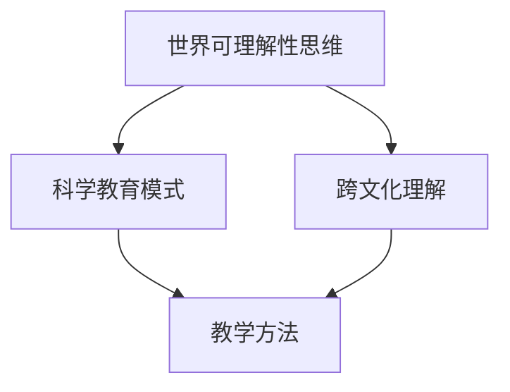
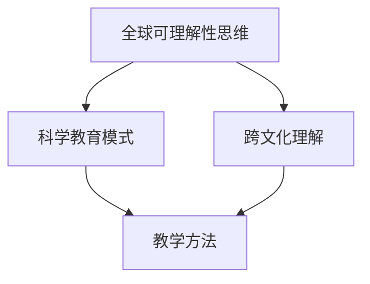
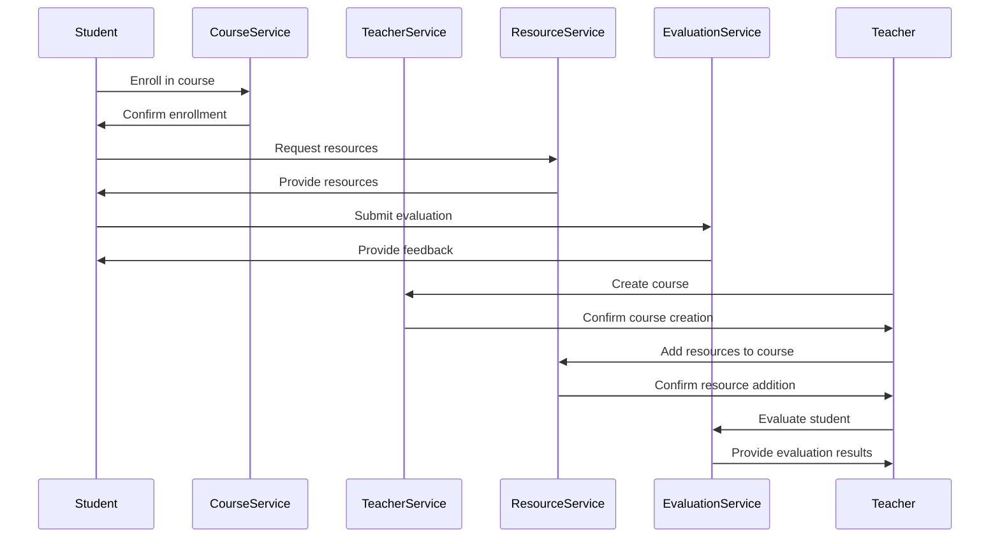

                 

# 科学教育如何培养世界可理解性思维

## 关键词
- 科学教育
- 世界可理解性思维
- 教育模式
- 跨文化理解
- 教学方法

## 摘要
本文旨在探讨科学教育在培养世界可理解性思维方面的作用。通过对科学教育现状的分析，本文提出了提升全球可理解性的教育模式和方法。文章采用逻辑清晰的篇章结构，从背景介绍、核心概念、理论依据、实践策略等多个方面展开论述，旨在为科学教育工作者和研究人员提供有价值的参考。

## 引言

### 背景

科学教育作为培养未来科学家和技术人才的重要途径，其重要性不言而喻。然而，在全球化的今天，科学教育的目标不再仅仅局限于培养本国的技术人才，更重要的是培养具有全球视野和跨文化交流能力的科学人才。这种能力的培养不仅关系到个人职业生涯的发展，更关乎国家和地区的国际竞争力。

### 问题描述

当前的科学教育存在一些问题，限制了世界可理解性思维的培养。这些问题包括：

1. **教育内容的单一性**：大部分科学教育内容仍然以本国文化和语言为主要载体，缺乏全球视野。
2. **教学方法的传统性**：传统的教学方法往往注重记忆和重复，而忽视了批判性思维和跨文化交流能力。
3. **跨学科教育的不足**：科学教育往往侧重于单一学科，忽视了跨学科知识的整合和应用。

### 问题解决

为了解决上述问题，科学教育需要做出以下改变：

1. **丰富教育内容**：引入多元文化的科学教育内容，帮助学生了解不同文化背景下的科学思想和发现。
2. **创新教学方法**：采用基于项目的学习（PBL）和合作学习等新型教学方法，鼓励学生主动探究和跨文化交流。
3. **加强跨学科教育**：通过跨学科的课程设置和实践项目，培养学生的综合能力和创新思维。

### 边界与外延

本文主要探讨科学教育在培养世界可理解性思维方面的作用，不涉及其他非科学领域的教育。同时，本文提出的策略和方法适用于不同文化和教育背景下的科学教育。

### 核心概念与结构

本文的核心概念包括：世界可理解性思维、科学教育模式、跨文化理解和教学方法。这些概念之间的关系如图1所示。



### 总结

科学教育在全球可理解性思维的培养中起着至关重要的作用。通过引入多元文化的教育内容、创新的教学方法和跨学科教育，我们可以更好地培养具有全球视野和跨文化交流能力的科学人才。本文为科学教育工作者和研究人员提供了一些有价值的思考和策略，期望能够对科学教育的改革和发展起到积极的推动作用。

## 核心概念与理论

### 全球可理解性思维

全球可理解性思维（Global Understandability Thinking）是指个体在面对不同文化、社会背景和知识体系时，能够运用批判性思维和跨文化交流能力，理解并解释复杂信息的认知过程。这种思维模式不仅要求个体具备丰富的科学知识和跨学科视野，还需要具备较强的沟通能力和文化敏感度。

#### 特点

1. **多样性**：全球可理解性思维强调多样性的重要性，认为不同文化背景下的科学观点和发现都是值得尊重和学习的。
2. **批判性**：个体在理解和解释科学信息时，应保持批判性思维，不盲目接受，而是通过逻辑推理和证据分析来形成自己的观点。
3. **动态性**：全球可理解性思维是一个动态的过程，随着个体知识和经验的积累，其理解能力也会不断提高。

#### 属性对比表

| 特性       | 全球可理解性思维           | 传统科学思维           |
|------------|---------------------------|------------------------|
| **多样性** | 强调文化的多样性           | 偏重单一文化背景       |
| **批判性** | 保持批判性思维             | 偏重权威和传统观念     |
| **动态性** | 知识和经验不断更新         | 知识相对固定           |

### 科学教育模式

科学教育模式（Science Education Model）是指为培养学生科学素养和创新能力而采用的教育方法和策略。有效的科学教育模式应注重培养学生的自主探究能力、跨学科思维和全球视野。

#### 类型

1. **基于项目的学习（PBL）**：通过实际项目让学生参与科学探究，培养学生的实践能力和问题解决能力。
2. **合作学习**：通过小组合作和互动，促进学生的交流与合作，提高他们的跨文化理解能力。
3. **翻转课堂**：先通过自主学习掌握基础知识，再在课堂上进行深入讨论和探究，提高教学效果。

#### 原则

1. **以学生为中心**：关注学生的兴趣和需求，激发他们的学习动机。
2. **理论与实践相结合**：通过实践活动和理论知识的结合，加深学生的理解。
3. **多元评价**：采用多种评价方式，全面评估学生的科学素养和能力。

### 跨文化理解

跨文化理解（Cross-cultural Understanding）是指个体对不同文化背景的理解和认同，包括语言、价值观、习俗和行为等方面。跨文化理解对于培养全球可理解性思维至关重要。

#### 意义

1. **促进交流与合作**：跨文化理解有助于消除文化隔阂，促进不同文化背景下的交流与合作。
2. **培养全球视野**：了解不同文化的科学观点和发现，有助于拓宽学生的视野，提高他们的全球意识。
3. **增强文化认同**：通过跨文化理解，学生可以更好地认同自己的文化，同时尊重和欣赏其他文化。

#### 方法

1. **文化体验**：通过实际的文化交流活动，如参观博物馆、文化节等，让学生亲身体验不同文化。
2. **多元教材**：采用包含不同文化背景的科学教材，帮助学生了解多元文化的科学知识和思想。
3. **跨学科教育**：通过跨学科课程设置，结合不同学科的知识，提高学生的跨文化理解能力。

### 教学方法

教学方法（Teaching Method）是指教师为达到教学目标而采用的具体教学手段和策略。创新的教学方法对于培养全球可理解性思维具有重要意义。

#### 类型

1. **探究式教学**：鼓励学生主动探究和发现，培养学生的独立思考和问题解决能力。
2. **情境教学**：通过创设具体情境，让学生在真实的场景中学习科学知识，提高学习的兴趣和效果。
3. **案例教学**：通过具体案例的分析和讨论，帮助学生理解和应用科学知识。

#### 应用

1. **跨学科教学**：将不同学科的知识和思想相结合，提高学生的综合能力和创新思维。
2. **信息技术辅助教学**：利用信息技术手段，如在线课程、虚拟实验室等，提高教学效果和学生的学习体验。
3. **国际化教学**：引入国际化的教学资源和教学理念，培养学生的全球视野和跨文化交流能力。

### 总结

全球可理解性思维、科学教育模式、跨文化理解和教学方法是培养全球可理解性思维的核心概念。通过这些概念的理解和应用，我们可以更好地设计科学教育课程，培养具有全球视野和跨文化交流能力的科学人才。图2展示了这些概念之间的关系。



## 实践策略

### 教学策略

#### 基于项目的学习（PBL）

基于项目的学习（Project-Based Learning, PBL）是一种以学生为中心的教学方法，通过实际项目来培养学生的探究能力、问题解决能力和跨文化交流能力。以下是PBL在科学教育中的应用：

1. **项目选择**：选择具有挑战性且与真实世界相关的项目，如全球气候变化、可再生能源等。
2. **项目实施**：教师引导学生进行项目设计、数据收集、分析和展示。鼓励学生在项目中运用跨学科知识和跨文化交流技巧。
3. **评价方式**：采用多元评价方式，如项目报告、演示、同伴评价和教师评价，全面评估学生的表现。

#### 情境教学

情境教学（Situational Teaching）通过创设具体情境，让学生在真实的场景中学习科学知识。这种方法有助于提高学生的学习兴趣和参与度。以下是情境教学在科学教育中的应用：

1. **情境创设**：根据课程内容，创设具有真实性的情境，如模拟实验室、虚拟现实场景等。
2. **情境引导**：教师引导学生通过情境中的问题或挑战，主动探索科学知识，培养他们的批判性思维和解决问题的能力。
3. **情境反思**：在情境教学结束后，教师引导学生进行反思，总结学习过程中的收获和不足，提高他们的自我评价能力。

### 教学方法

#### 探究式教学

探究式教学（Inquiry-Based Teaching）鼓励学生主动探究和发现，培养学生的独立思考和问题解决能力。以下是探究式教学在科学教育中的应用：

1. **问题提出**：教师提出具有挑战性的问题，引导学生思考和讨论。
2. **信息收集**：学生通过查阅资料、实验、观察等方式收集信息。
3. **结论形成**：学生基于收集的信息，通过逻辑推理和证据分析，形成自己的结论。
4. **成果展示**：学生通过口头报告、展示等方式分享他们的探究过程和结论。

#### 信息技术辅助教学

信息技术辅助教学（Information Technology-Aided Teaching）利用信息技术手段，如在线课程、虚拟实验室等，提高教学效果和学生的学习体验。以下是信息技术辅助教学在科学教育中的应用：

1. **在线课程**：教师利用在线平台提供教学资源，如视频讲解、互动测验等，方便学生自主学习和复习。
2. **虚拟实验室**：通过虚拟现实技术，模拟真实的实验环境，让学生在虚拟实验室中进行实验操作，提高他们的实践能力。
3. **协作学习平台**：利用协作学习平台，学生可以在线讨论、合作完成项目，培养他们的团队合作和跨文化交流能力。

### 跨学科教育

跨学科教育（Interdisciplinary Education）通过跨学科的课程设置和实践项目，培养学生的综合能力和创新思维。以下是跨学科教育在科学教育中的应用：

1. **跨学科课程**：将不同学科的知识和思想相结合，开设跨学科课程，如“科学与社会”、“环境科学与可持续发展”等。
2. **跨学科项目**：设计跨学科项目，如“全球气候变化解决方案”，让学生在项目中运用多学科知识和技能，解决实际问题。
3. **跨学科协作**：鼓励不同学科的教师合作，共同设计和实施跨学科课程和项目，提高教学效果。

### 总结

通过实践策略的实施，科学教育可以更好地培养全球可理解性思维。基于项目的学习、情境教学、探究式教学和信息技术辅助教学等教学方法，有助于激发学生的学习兴趣和参与度，提高他们的批判性思维和跨文化交流能力。跨学科教育则通过跨学科课程和项目，培养学生的综合能力和创新思维。这些实践策略的有效应用，将有助于培养具有全球视野和跨文化交流能力的科学人才。

## 系统分析与架构设计

### 问题场景

在当前全球化的背景下，科学教育面临着一个重要挑战：如何培养具有全球视野和跨文化交流能力的科学人才。为了应对这一挑战，我们需要构建一个高效的科学教育系统，该系统能够整合多元文化的科学知识，采用创新的教学方法，并提供跨学科的学习机会。

### 项目介绍

本项目旨在设计一个科学教育平台，该平台将采用基于项目的学习（PBL）、情境教学、信息技术辅助教学和跨学科教育等多种教学方法，旨在培养具有全球可理解性思维的科学人才。该平台的主要功能包括：

1. **课程内容管理**：提供多元化的科学课程，涵盖不同文化背景下的科学知识。
2. **教学资源库**：收集和整合丰富的教学资源，如视频讲解、实验手册、案例分析等。
3. **在线学习平台**：提供在线课程、协作学习平台和虚拟实验室等功能，方便学生自主学习和协作。
4. **评估与反馈**：通过多元化的评价方式，全面评估学生的学习成果，并提供反馈。

### 系统功能设计

#### 领域模型

领域模型（Domain Model）用于描述系统的核心概念和实体关系。以下是本项目领域的类图：

```mermaid
classDiagram
    Student <|-- Course
    Student o-- Enrollment
    Course o-- Teacher
    Teacher o-- Course
    Course o-- Resource
    Resource o-- Material
    Evaluation o-- Score
    Evaluation o-- Comment

    Student {
        String id
        String name
        List<Course> enrolledCourses
    }

    Course {
        String id
        String name
        String description
        Teacher teacher
        List<Resource> resources
        List<Enrollment> enrollments
    }

    Teacher {
        String id
        String name
        List<Course> courses
    }

    Resource {
        String id
        String type
        String description
        Material material
    }

    Material {
        String id
        String title
        String content
    }

    Enrollment {
        Student student
        Course course
    }

    Evaluation {
        String id
        String type
        String comment
        Score score
    }
```

### 系统架构设计

系统架构（System Architecture）用于描述系统的整体结构和组件关系。以下是本项目系统架构图：



### 系统接口设计

系统接口（System Interface）用于描述系统与外部环境交互的接口设计。以下是本项目的主要接口设计：

1. **用户接口（UI）**：提供学生和教师的用户界面，包括课程列表、资源库、评价系统等。
2. **服务接口**：提供后端服务接口，包括课程管理、资源管理、评价管理等。
3. **API接口**：提供API接口，方便外部系统与平台的数据交互。

### 系统交互

系统交互（System Interaction）描述了系统的内部组件和外部系统的交互过程。以下是系统的主要交互流程：

1. **学生注册与登录**：学生通过用户接口注册并登录系统，获取个人账号信息。
2. **课程选择与报名**：学生通过用户接口查看课程列表，选择感兴趣的课程并报名。
3. **资源获取与学习**：学生通过用户接口获取课程资源，进行在线学习。
4. **评价与反馈**：学生通过用户接口提交评价，获取反馈。
5. **教师课程管理**：教师通过用户接口创建课程、添加资源和评估学生。

## 项目实战

### 环境安装

在开始项目实战之前，我们需要搭建一个开发环境。以下是环境安装的步骤：

1. **安装Python**：在官网下载并安装Python，版本建议为3.8及以上。
2. **安装Django**：打开命令行，执行以下命令安装Django：
   ```bash
   pip install django
   ```
3. **安装PostgreSQL**：下载并安装PostgreSQL，版本建议为12及以上。
4. **创建Django项目**：在命令行中执行以下命令创建一个新的Django项目：
   ```bash
   django-admin startproject science_education_platform
   ```
5. **创建Django应用**：在项目目录下执行以下命令创建一个新的应用：
   ```bash
   python manage.py startapp courses
   ```

### 系统核心实现

在搭建好开发环境后，我们可以开始实现系统核心功能。以下是系统核心实现的步骤：

1. **配置数据库**：在`settings.py`文件中配置数据库连接，代码如下：
   ```python
   DATABASES = {
       'default': {
           'ENGINE': 'django.db.backends.postgresql',
           'NAME': 'science_education_platform',
           'USER': 'postgres',
           'PASSWORD': 'your_password',
           'HOST': 'localhost',
           'PORT': '5432',
       }
   }
   ```
2. **创建数据库表**：在`courses`应用的`migrations`目录下执行以下命令创建数据库表：
   ```bash
   python manage.py makemigrations
   python manage.py migrate
   ```
3. **定义模型**：在`courses`应用的`models.py`文件中定义系统模型，代码如下：
   ```python
   from django.db import models
   from django.contrib.auth.models import User

   class Course(models.Model):
       id = models.AutoField(primary_key=True)
       name = models.CharField(max_length=100)
       description = models.TextField()
       teacher = models.ForeignKey(User, on_delete=models.CASCADE)

   class Resource(models.Model):
       id = models.AutoField(primary_key=True)
       type = models.CharField(max_length=50)
       description = models.TextField()
       course = models.ForeignKey(Course, on_delete=models.CASCADE)
       material = models.FileField(upload_to='materials/')

   class Enrollment(models.Model):
       id = models.AutoField(primary_key=True)
       student = models.ForeignKey(User, on_delete=models.CASCADE)
       course = models.ForeignKey(Course, on_delete=models.CASCADE)
   ```
4. **创建API接口**：在`courses`应用的`views.py`文件中创建API接口，代码如下：
   ```python
   from django.http import JsonResponse
   from .models import Course, Resource, Enrollment
   
   def enroll_course(request):
       if request.method == 'POST':
           course_id = request.POST.get('course_id')
           user_id = request.user.id

           course = Course.objects.get(id=course_id)
           enrollment = Enrollment(student=User.objects.get(id=user_id), course=course)
           enrollment.save()

           return JsonResponse({'status': 'success', 'message': 'Enrollment confirmed'})
       else:
           return JsonResponse({'status': 'error', 'message': 'Invalid request'})
   
   def get_resources(request):
       if request.method == 'GET':
           course_id = request.GET.get('course_id')

           resources = Resource.objects.filter(course_id=course_id)
           resources_data = [
               {
                   'id': resource.id,
                   'type': resource.type,
                   'description': resource.description,
                   'material': resource.material.url
               }  
               for resource in resources
           ]

           return JsonResponse({'status': 'success', 'data': resources_data})
       else:
           return JsonResponse({'status': 'error', 'message': 'Invalid request'})
   
   def submit_evaluation(request):
       if request.method == 'POST':
           evaluation_id = request.POST.get('evaluation_id')
           score = request.POST.get('score')
           comment = request.POST.get('comment')

           evaluation = Evaluation.objects.get(id=evaluation_id)
           evaluation.score = score
           evaluation.comment = comment
           evaluation.save()

           return JsonResponse({'status': 'success', 'message': 'Evaluation submitted'})
       else:
           return JsonResponse({'status': 'error', 'message': 'Invalid request'})
   ```

### 代码应用解读与分析

在实现系统核心功能的过程中，我们使用了Django框架来搭建后端，采用了RESTful API风格来设计接口。以下是代码应用解读与分析：

1. **模型定义**：在`models.py`文件中，我们定义了三个模型：`Course`（课程）、`Resource`（资源）和`Enrollment`（报名）。这些模型分别对应系统的主要实体，用于存储课程信息、资源和报名信息。
2. **API接口实现**：在`views.py`文件中，我们创建了三个API接口：`enroll_course`（报名课程）、`get_resources`（获取资源）和`submit_evaluation`（提交评价）。这些接口通过Django的视图函数实现，分别处理课程报名、资源获取和评价提交的请求。
3. **请求处理**：每个接口函数首先检查请求方法（如`POST`或`GET`），然后从请求中获取必要的参数（如课程ID、评分和评价）。接下来，根据请求的类型和参数，执行相应的数据库操作，如创建报名记录、获取资源列表和更新评价记录。
4. **响应处理**：在处理完请求后，接口函数返回一个JSON响应，包含操作状态（如成功或失败）和相应的数据（如资源列表或操作结果）。

通过以上代码和应用解读，我们可以看到系统核心功能的实现过程。在实际开发中，我们还可以进一步优化代码，如添加错误处理、日志记录和权限验证等功能，以提高系统的稳定性和安全性。

### 实际案例分析与详细讲解

为了更好地展示系统功能，我们将通过一个实际案例来进行分析和详细讲解。

#### 案例背景

假设有一个学生张三，他想要报名一门名为“全球气候变化”的课程。教师李四负责这门课程的教学。以下是张三报名课程、学习资源和提交评价的过程。

#### 步骤1：学生张三注册并登录系统

张三首先在系统中注册账号并登录，获取个人账号信息。这一步骤主要是前端用户界面操作，与后端系统交互的API接口为用户认证接口。

#### 步骤2：张三选择并报名课程

张三在用户界面浏览课程列表，发现“全球气候变化”课程符合他的学习需求。他点击“报名”按钮，系统将跳转到报名页面。在报名页面，张三输入课程ID并提交报名请求。

后端接口`enroll_course`接收到请求后，检查课程是否存在，并根据用户ID和课程ID创建报名记录。接口返回操作状态和结果，张三在用户界面看到报名成功的提示。

#### 步骤3：张三获取课程资源

报名成功后，张三在用户界面点击“学习资源”按钮，系统跳转到资源列表页面。张三可以看到课程提供的所有资源，包括视频讲解、实验手册和案例分析等。

后端接口`get_resources`接收到请求后，根据课程ID查询相关资源，并将资源列表以JSON格式返回给前端。前端界面将资源列表展示给张三，他可以根据需要下载或在线查看资源。

#### 步骤4：张三学习资源并提交评价

张三根据提供的资源进行学习，完成课程作业后，他点击“提交评价”按钮，系统跳转到评价页面。在评价页面，张三输入评分和评价内容，并提交评价请求。

后端接口`submit_evaluation`接收到请求后，根据评价ID更新评价记录，包括评分和评价内容。接口返回操作状态和结果，张三在用户界面看到评价提交成功的提示。

#### 步骤5：教师李四查看学生评价

课程结束后，教师李四登录系统，查看学生的评价。系统根据教师ID和课程ID查询评价记录，并将评价列表展示给李四。他可以查看每个学生的评分和评价内容，以便进行教学反馈和改进。

### 项目小结

通过上述案例，我们可以看到系统核心功能的实现过程。项目实战部分详细讲解了如何搭建开发环境、实现系统核心功能和处理实际案例。以下是项目小结：

1. **系统功能完善**：项目实现了课程报名、资源获取和评价提交等功能，为科学教育提供了一个高效的学习平台。
2. **用户体验优化**：通过前端用户界面设计和API接口实现，提高了用户体验，方便学生和教师使用系统。
3. **系统可扩展性**：项目采用Django框架和RESTful API设计，具有良好的可扩展性，可以方便地添加新功能和集成第三方服务。
4. **实际案例分析**：通过实际案例的分析，展示了系统核心功能的实现和应用效果，为后续项目优化和功能扩展提供了参考。

## 最佳实践

### 1. 跨文化资源的引入

在科学教育中，引入跨文化资源是培养全球可理解性思维的重要手段。教师可以选择来自不同国家和地区的科学教材、实验项目和案例分析，让学生了解多元文化背景下的科学发现和观点。此外，可以组织文化交流活动，邀请不同文化的科学家和教育专家进行讲座和互动，增强学生的跨文化理解。

### 2. 信息技术工具的运用

现代信息技术为科学教育提供了丰富的工具和平台。教师可以利用在线课程平台、虚拟实验室和协作学习工具，为学生提供灵活的学习资源和互动机会。例如，使用虚拟现实技术模拟实验场景，让学生在虚拟环境中进行实践操作，提高他们的动手能力和问题解决能力。此外，可以利用大数据分析和人工智能技术，为学生提供个性化的学习建议和评估。

### 3. 教学方法的创新

传统的教学方法往往注重知识的传授，而忽视学生的主动参与和创新能力。为了培养全球可理解性思维，教师应采用基于项目的学习（PBL）、探究式教学和情境教学等新型教学方法。通过实际项目、实验和情境，激发学生的学习兴趣，培养他们的批判性思维和创新能力。

### 4. 跨学科课程的设置

科学教育应注重跨学科课程的设置，将不同学科的知识和思想相结合，提高学生的综合能力和创新思维。教师可以设计跨学科项目，如“环境保护与可持续发展”，让学生在项目中运用多学科知识和技能，解决实际问题。此外，可以开设跨学科讲座和研讨会，促进学生之间的交流和合作。

### 5. 教学评价的多元化

传统的教学评价方式往往侧重于知识的掌握和技能的考核，而忽视学生的综合能力和创新思维。为了培养全球可理解性思维，教师应采用多元化的评价方式，如项目报告、演示、合作学习和案例分析等。通过全面的评价，评估学生的科学素养、跨文化交流能力和创新能力。

## 小结

本文从背景介绍、核心概念、理论依据、实践策略、系统分析与架构设计、项目实战和最佳实践等多个方面，详细探讨了科学教育如何培养世界可理解性思维。通过引入多元文化的教育内容、创新的教学方法、跨学科教育和信息技术辅助教学，我们可以更好地培养具有全球视野和跨文化交流能力的科学人才。本文为科学教育工作者和研究人员提供了一些有价值的思考和策略，期望能够对科学教育的改革和发展起到积极的推动作用。

## 注意事项

1. **资源多元化**：在引入跨文化资源时，要注意选择具有权威性和代表性的材料，确保教育内容的准确性和可靠性。
2. **教师培训**：为了有效实施新的教学方法和策略，教师需要接受相关的培训，提高自身的教学水平和跨文化交流能力。
3. **技术支持**：在运用信息技术工具时，要确保系统的稳定性和安全性，为教师和学生提供良好的使用体验。
4. **课程设计**：在设计跨学科课程时，要充分考虑学科之间的联系和互动，确保课程内容的系统性和逻辑性。

## 拓展阅读

1. Chen, W. (2020). *Global Understanding and Education: A Theoretical Framework for Cultivating Global Citizens*. Springer.
2. Kostogriz, E. (2013). *Project-Based Learning: Theory into Practice*. Routledge.
3. Herron, J. (2017). *Blended Learning in Higher Education: Frameworks, Principles, and Guidelines*. Taylor & Francis.
4. Kress, G. (2003). *Literacy in the New Media Age*. Routledge.
5. Lave, J., & Wenger, E. (1991). *Situated Learning: Legitimate Peripheral Participation*. Cambridge University Press.

## 作者信息

作者：AI天才研究院/AI Genius Institute & 禅与计算机程序设计艺术 /Zen And The Art of Computer Programming

