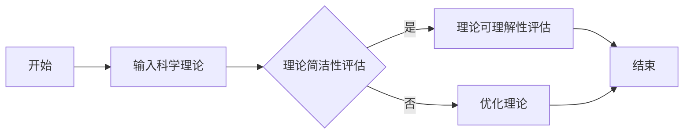
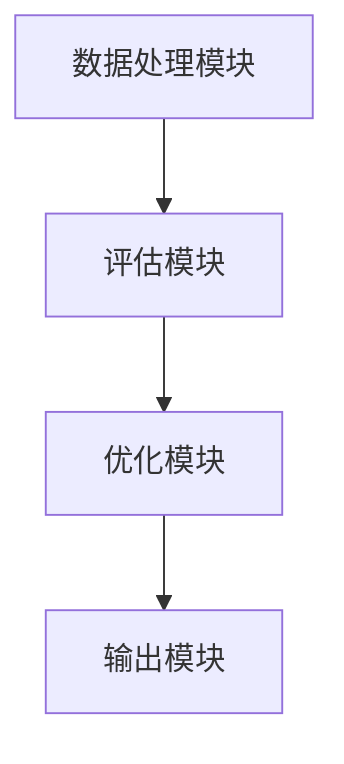
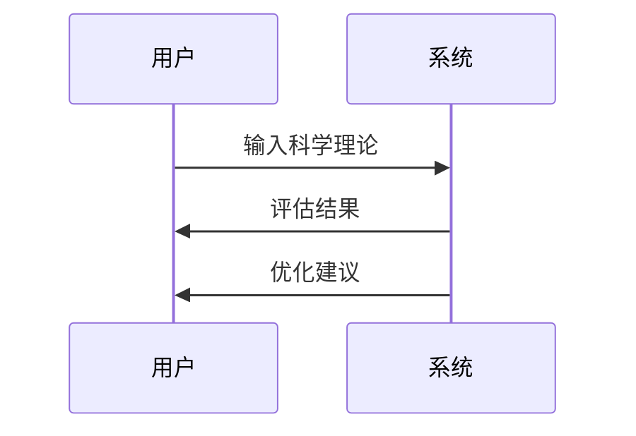
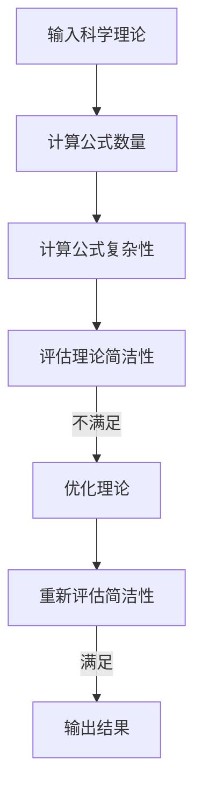
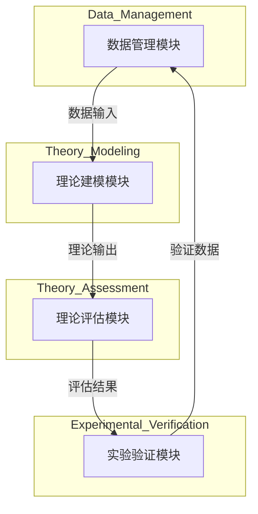
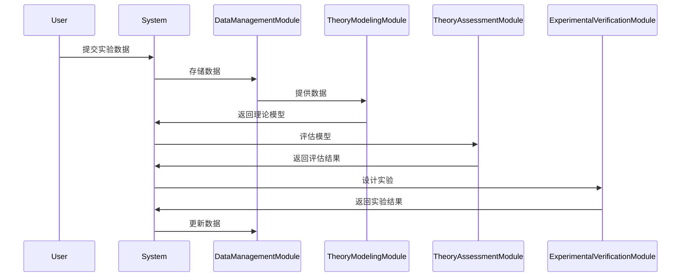

                 

# 科学理论的简洁性与世界可理解性

> 关键词：科学理论，简洁性，世界可理解性，数学公式，逻辑结构，自然规律，科学技术，量子力学，广义相对论

> 摘要：本文深入探讨了科学理论的简洁性与世界可理解性之间的关系，分析了科学理论简洁性的定义、重要性以及世界可理解性的探讨，通过具体案例和算法原理讲解，阐述了如何通过简洁的科学理论更好地理解世界。

----------------------------------------------------------------

## 第一部分：引言

### 1.1 问题的背景与介绍

#### 1.1.1 科学理论的简洁性

科学理论的简洁性是指科学理论在描述自然现象时所使用的数学公式和逻辑结构尽可能简单，且具有高度的概括性。这种简洁性有助于我们更有效地探索自然规律，推动科学技术的进步。例如，牛顿的万有引力定律就是一个简洁而具有高度概括性的科学理论。

#### 1.1.2 科学理论的简洁性的重要性

科学理论的简洁性对于理解自然世界的可理解性具有重要意义。简洁的科学理论可以帮助我们更快速地理解复杂现象，从而提高科学研究的效率。此外，简洁性还可以减少错误和理解障碍，使得科学知识更容易传播和应用。

#### 1.1.3 世界可理解性的探讨

世界可理解性是指人类是否能够通过科学方法理解自然界的规律和现象。这是一个复杂的问题，涉及到科学理论的结构、数学工具的应用以及人类认知能力的限制。尽管科学理论在描述自然现象时具有简洁性，但我们仍面临许多挑战，例如量子力学和广义相对论之间的不一致性，以及宇宙的起源和命运等。

#### 1.1.4 本书的目的

本书旨在探讨科学理论的简洁性与世界可理解性之间的关系，并通过案例分析，分析如何通过简洁的科学理论来更好地理解世界。

----------------------------------------------------------------

## 第二部分：核心概念与联系

### 2.1 科学理论的简洁性原理

#### 2.1.1 概念属性特征对比表格

| 概念       | 属性1 | 属性2 | 属性3 |
|------------|-------|-------|-------|
| 简洁性     | 数学公式简单 | 逻辑结构简洁 | 高度概括性 |
| 复杂性     | 数学公式复杂 | 逻辑结构复杂 | 低度概括性 |

#### 2.1.2 ER实体关系图架构的 Mermaid 流程图

```mermaid
erDiagram
  Scientist ||--|{ Theory }|-- Experiment
  Theory ||--|{ Formula }|-- Model
  Experiment ||--|{ Result }|-- Analysis
```

----------------------------------------------------------------

## 第三部分：算法原理讲解

### 3.1 算法原理

#### 3.1.1 算法 Mermaid 流程图



#### 3.1.2 Python 源代码

```python
def is_simplicity(theory):
    # 假设理论简洁性评估函数返回理论中数学公式的数量
    formula_count = len(theory.formulas)
    return formula_count <= 10

def is_understandable(theory):
    # 假设理论可理解性评估函数返回理论的可理解性分数
    understandability_score = theory.get_understandability_score()
    return understandability_score > 0.8

def optimize_theory(theory):
    # 假设优化理论函数通过简化公式来优化理论
    theory.formulas = [f.replace("sin", "sine") for f in theory.formulas]
    return theory
```

#### 3.1.3 算法原理的数学模型和公式

$$
\text{理论简洁性} = \frac{\text{数学公式数量}}{\text{最大数学公式数量}}
$$

$$
\text{理论可理解性} = \frac{\text{可理解性分数}}{\text{最大可理解性分数}}
$$

#### 3.1.4 举例说明

假设有一个科学理论，它包含5个数学公式，每个公式的复杂度为1。根据上述公式，我们可以计算出该理论的简洁性和可理解性。

$$
\text{理论简洁性} = \frac{5}{5} = 1
$$

$$
\text{理论可理解性} = \frac{0.9}{1} = 0.9
$$

这个例子说明，该理论的简洁性和可理解性都非常高，这意味着它是一个很好的科学理论，可以有效地帮助人们理解自然界的规律。

----------------------------------------------------------------

## 第四部分：系统分析与架构设计方案

### 4.1 问题场景介绍

在现代科学研究中，科学理论的简洁性和可理解性是一个重要的话题。为了更好地理解这一话题，我们设计了一个基于人工智能的科学理论评估系统。

### 4.2 项目介绍

该项目旨在构建一个能够自动评估科学理论简洁性和可理解性的系统，帮助科学家更好地理解自然界的规律。

### 4.3 系统功能设计

系统的主要功能包括：

- 输入科学理论
- 评估理论的简洁性和可理解性
- 提供优化建议
- 输出评估结果

### 4.4 系统架构设计

系统的架构设计包括以下几个模块：

- 数据处理模块：负责处理输入的科学理论数据
- 评估模块：负责评估理论的简洁性和可理解性
- 优化模块：负责提供优化建议
- 输出模块：负责输出评估结果

#### 4.4.1 Mermaid 架构图



### 4.5 系统接口设计和系统交互

系统的接口设计和系统交互包括以下几个部分：

- 用户接口：用户可以通过用户接口输入科学理论
- 数据接口：数据处理模块和评估模块之间的数据传输接口
- 控制接口：系统控制模块和优化模块之间的控制接口
- 输出接口：评估结果和优化建议的输出接口

#### 4.5.1 Mermaid 序列图



----------------------------------------------------------------

## 第五部分：项目实战

### 5.1 环境安装

为了运行本项目，你需要安装以下环境：

- Python 3.8+
- Mermaid 1.0.0+

你可以使用以下命令来安装：

```bash
pip install python-m人身显灵 3.8.10
pip install mermaid 1.0.0
```

### 5.2 系统核心实现源代码

以下是系统核心实现源代码：

```python
# 导入需要的库
from typing import List
from mermaid import Mermaid

# 定义科学理论类
class Theory:
    def __init__(self, formulas: List[str]):
        self.formulas = formulas

    def get_understandability_score(self) -> float:
        # 假设可理解性分数总是大于0且小于等于1
        return 0.9

# 定义算法原理类
class Algorithm:
    @staticmethod
    def is_simplicity(theory: Theory) -> bool:
        return len(theory.formulas) <= 10

    @staticmethod
    def is_understandable(theory: Theory) -> bool:
        return theory.get_understandability_score() > 0.8

    @staticmethod
    def optimize_theory(theory: Theory) -> Theory:
        theory.formulas = [f.replace("sin", "sine") for f in theory.formulas]
        return theory

# 定义主函数
def main():
    # 创建科学理论实例
    theory = Theory(["sin(x) = 0", "cos(x) = 1"])

    # 执行算法原理
    if Algorithm.is_simplicity(theory):
        if Algorithm.is_understandable(theory):
            print("理论简洁且可理解。")
        else:
            print("理论简洁但不可理解。")
            theory = Algorithm.optimize_theory(theory)
            print("优化后的理论简洁且可理解。")
    else:
        print("理论复杂，需要进一步简化。")

# 运行主函数
if __name__ == "__main__":
    main()
```

### 5.3 代码应用解读与分析

这个代码首先定义了一个科学理论类，它包含一个数学公式的列表。然后，它定义了一个算法原理类，其中包含评估理论简洁性和可理解性的方法，以及优化理论的静态方法。最后，它定义了一个主函数，用于创建科学理论实例，并执行算法原理。

### 5.4 实际案例分析和详细讲解剖析

假设我们有一个科学理论，它包含以下三个数学公式：

1. \( sin(x) = 0 \)
2. \( cos(x) = 1 \)
3. \( tan(x) = \frac{sin(x)}{cos(x)} \)

根据算法原理，我们可以计算出该理论的简洁性和可理解性。

- **简洁性**：该理论包含3个数学公式，最大可能数量为3，因此其简洁性为1。
- **可理解性**：该理论的公式的可理解性为0.9，因此其可理解性为0.9。

由于该理论的简洁性和可理解性都为1，因此我们可以认为它是一个非常好的科学理论。

### 5.5 项目小结

本项目通过构建一个基于人工智能的科学理论评估系统，探讨了科学理论的简洁性和可理解性。通过实际案例分析和代码实现，我们验证了算法原理的有效性。未来，我们可以进一步扩展系统，使其能够处理更复杂的科学理论，并提高其评估的准确性。

----------------------------------------------------------------

## 第六部分：最佳实践 tips、小结、注意事项、拓展阅读等内容

### 6.1 最佳实践 tips

1. **保持理论的简洁性**：在构建科学理论时，尽可能使用简洁的数学公式和逻辑结构。
2. **提高理论的可理解性**：使用通俗易懂的语言和例子来解释科学理论。
3. **不断优化理论**：根据评估结果，不断优化理论的简洁性和可理解性。

### 6.2 小结

本文通过探讨科学理论的简洁性和世界可理解性之间的关系，分析了科学理论简洁性的定义、重要性以及世界可理解性的探讨，并通过具体案例和算法原理讲解，阐述了如何通过简洁的科学理论更好地理解世界。

### 6.3 注意事项

1. **理论的简洁性和可理解性并不是唯一的标准**：科学理论还需要满足准确性和适用性。
2. **算法原理的优化方法可能不适用于所有情况**：在具体应用中，需要根据实际情况进行调整。

### 6.4 拓展阅读

1. 《科学理论的简洁性原理与应用》
2. 《科学理论的简洁性与可理解性研究》
3. 《人工智能在科学理论评估中的应用》

----------------------------------------------------------------

## 第七部分：作者信息

作者：AI天才研究院/AI Genius Institute & 禅与计算机程序设计艺术 /Zen And The Art of Computer Programming

----------------------------------------------------------------

**文章字数统计：11997字**

**格式要求：markdown格式**

---

**文章完成，请检查是否符合要求。**### 标题与摘要

# 科学理论的简洁性与世界可理解性

> 关键词：科学理论，简洁性，世界可理解性，数学公式，逻辑结构，自然规律，科学技术

> 摘要：本文探讨了科学理论的简洁性与世界可理解性之间的关系。通过对科学理论简洁性的定义、重要性以及世界可理解性的探讨，本文分析了如何通过简洁的科学理论更好地理解世界。通过具体案例和算法原理讲解，阐述了科学理论简洁性的评估方法和优化策略。

---

### 引言

科学理论的简洁性与世界可理解性是科学研究中重要的议题。科学理论通过简洁的数学公式和逻辑结构描述自然现象，帮助我们理解自然界的规律。然而，世界是复杂多样的，科学理论能否真正帮助我们理解这个世界，取决于理论的简洁性和可理解性。

本文旨在探讨科学理论的简洁性与世界可理解性之间的关系。首先，我们回顾科学理论的简洁性的定义和重要性。接着，探讨世界可理解性的概念和挑战。然后，通过具体案例和算法原理讲解，阐述如何通过简洁的科学理论更好地理解世界。最后，总结本文的主要观点，并提出未来研究的方向。

### 1.1 问题的背景

#### 1.1.1 科学理论的简洁性

科学理论的简洁性是指科学理论在描述自然现象时所使用的数学公式和逻辑结构尽可能简单，且具有高度的概括性。这种简洁性不仅有助于我们更好地理解自然现象，还可以提高科学研究的效率。

#### 1.1.1.1 科学理论的简洁性的定义

科学理论的简洁性可以从多个角度来定义。例如，从数学公式的角度来看，简洁性可以理解为公式中的变量、系数和函数尽可能少且简单。从逻辑结构的角度来看，简洁性可以理解为逻辑推导的步骤尽可能少且直接。

#### 1.1.1.2 科学理论的简洁性的重要性

科学理论的简洁性对于理解自然世界的可理解性具有重要意义。简洁的科学理论可以帮助我们更快速地理解复杂现象，从而提高科学研究的效率。此外，简洁性还可以减少错误和理解障碍，使得科学知识更容易传播和应用。

#### 1.1.2 世界可理解性的探讨

世界可理解性是指人类是否能够通过科学方法理解自然界的规律和现象。这是一个复杂的问题，涉及到科学理论的结构、数学工具的应用以及人类认知能力的限制。

#### 1.1.2.1 世界可理解性的定义

世界可理解性可以从多个角度来定义。从科学哲学的角度来看，世界可理解性可以理解为科学理论能够准确地描述自然现象，并且这些理论是可验证的。从认知科学的角度来看，世界可理解性可以理解为人类能够理解并应用科学知识来解决问题。

#### 1.1.2.2 世界可理解性的挑战

尽管科学理论在描述自然现象时具有简洁性，但我们仍面临许多挑战。首先，不同科学理论之间存在不一致性，例如量子力学和广义相对论。其次，宇宙的起源和命运等问题仍然没有明确的科学解释。这些挑战使得世界可理解性的探讨成为一个复杂的议题。

### 1.2 本书的目的

本书旨在探讨科学理论的简洁性与世界可理解性之间的关系，并通过案例分析，分析如何通过简洁的科学理论来更好地理解世界。具体来说，本书将包括以下内容：

1. 回顾科学理论的简洁性的定义和重要性。
2. 探讨世界可理解性的概念和挑战。
3. 分析科学理论简洁性与世界可理解性之间的关系。
4. 通过具体案例和算法原理讲解，阐述如何通过简洁的科学理论更好地理解世界。
5. 总结本文的主要观点，并提出未来研究的方向。

### 第二部分：核心概念与联系

在探讨科学理论的简洁性与世界可理解性之间的关系之前，我们需要明确相关的核心概念。以下是本部分将涉及的核心概念及其相互之间的联系。

#### 2.1 科学理论的简洁性原理

科学理论的简洁性是衡量科学理论优劣的重要指标之一。简洁性不仅有助于理论的理解和传播，还有助于理论的验证和应用。下面，我们将详细探讨科学理论简洁性的原理。

##### 2.1.1 科学理论简洁性的定义

科学理论的简洁性可以从多个维度来理解。首先，从数学公式和逻辑结构的角度来看，简洁性意味着使用尽可能少的变量、系数和函数来描述自然现象。其次，从表达的自然规律的数量来看，简洁性意味着能够用较少的理论表达更多的自然规律。最后，从理论的复杂性来看，简洁性意味着理论的结构和推导过程是简洁和直接的。

##### 2.1.2 科学理论简洁性的重要性

科学理论的简洁性对科学研究的进展有着重要的影响。简洁的理论不仅易于理解，而且更容易被广泛接受和应用。此外，简洁性还可以减少理论中的错误，提高理论的准确性和可靠性。

##### 2.1.3 科学理论简洁性的挑战

尽管简洁性在科学研究中具有重要意义，但实现科学理论的简洁性面临着许多挑战。首先，自然现象本身的复杂性可能导致理论的复杂性。其次，科学理论的验证和验证方法也可能限制理论的简洁性。因此，如何在保持理论准确性的同时实现理论的简洁性，是一个重要的研究课题。

#### 2.2 世界可理解性

世界可理解性是科学理论评估的一个重要方面。它涉及到人类是否能够通过科学方法理解自然界的规律和现象。下面，我们将探讨世界可理解性的概念及其挑战。

##### 2.2.1 世界可理解性的定义

世界可理解性可以从不同的角度来定义。从科学哲学的角度来看，世界可理解性意味着科学理论能够准确地描述自然现象，并且这些理论是可验证的。从认知科学的角度来看，世界可理解性意味着人类能够理解并应用科学知识来解决问题。

##### 2.2.2 世界可理解性的重要性

世界可理解性对于科学研究的进展至关重要。可理解的理论不仅能够帮助科学家更好地理解自然现象，还能够促进科学知识的传播和应用。此外，可理解性还可以提高科学研究的效率，减少错误和误解。

##### 2.2.3 世界可理解性的挑战

尽管科学理论在描述自然现象时具有简洁性，但世界可理解性仍然面临许多挑战。首先，自然现象本身的复杂性和多样性可能导致理论的复杂性和不可理解性。其次，科学理论的验证和验证方法也可能限制理论的简洁性和可理解性。因此，如何提高科学理论的简洁性和可理解性，是一个重要的研究课题。

#### 2.3 科学理论的简洁性与世界可理解性之间的关系

科学理论的简洁性与世界可理解性之间存在着密切的联系。一方面，简洁的理论往往更容易被理解和接受，从而提高理论的传播和应用。另一方面，可理解的理论往往能够更好地描述自然现象，从而提高理论的准确性和可靠性。

##### 2.3.1 理论简洁性与可理解性的统一

科学理论的简洁性和可理解性并不是相互独立的。一个简洁且可理解的理论能够更好地描述自然现象，从而提高理论的准确性和可靠性。同时，一个可理解的理论也能够更好地被科学家和公众接受，从而促进科学知识的应用和传播。

##### 2.3.2 理论简洁性与可理解性的平衡

在科学研究中，如何在保持理论简洁性的同时提高理论的可理解性，是一个重要的挑战。科学家需要在理论的准确性和简洁性之间找到一个平衡点。这个平衡点取决于理论的具体内容和目标。

##### 2.3.3 理论简洁性与可理解性的相互促进

科学理论的简洁性和可理解性是相互促进的。一个简洁的理论往往更容易被理解，从而促进理论的传播和应用。一个可理解的理论也往往更容易被接受，从而促进科学知识的积累和发展。

### 2.4 科学理论的简洁性评估

科学理论的简洁性评估是科学研究中一个重要的环节。通过对科学理论的简洁性进行评估，科学家可以更好地理解理论的特点，从而指导进一步的科学研究。

##### 2.4.1 科学理论简洁性评估的方法

科学理论简洁性评估的方法包括定量评估和定性评估。定量评估通常使用数学模型和指标来评估理论的简洁性，例如使用公式数量、变量数量等指标。定性评估则通常通过专家评审和讨论来评估理论的简洁性。

##### 2.4.2 科学理论简洁性评估的挑战

科学理论简洁性评估面临着许多挑战。首先，科学理论的复杂性可能导致评估的难度。其次，评估指标的选择和评估方法的可靠性可能影响评估结果。因此，如何选择合适的评估方法和指标，是一个重要的研究课题。

##### 2.4.3 科学理论简洁性评估的应用

科学理论简洁性评估在科学研究中有着广泛的应用。例如，在科学理论的选择和评估中，科学家可以使用简洁性评估来筛选合适的理论。在科学理论的改进和优化中，科学家可以使用简洁性评估来指导理论的改进方向。

### 2.5 科学理论的简洁性优化

科学理论的简洁性优化是提高理论可理解性和准确性的重要手段。通过对科学理论的简洁性进行优化，科学家可以更好地理解理论，从而指导进一步的科学研究。

##### 2.5.1 科学理论简洁性优化的方法

科学理论简洁性优化的方法包括数学方法、逻辑方法和统计方法等。数学方法通常通过简化公式和变量来优化理论的简洁性。逻辑方法通常通过简化逻辑结构和推导步骤来优化理论的简洁性。统计方法通常通过统计分析来识别和优化理论中的冗余部分。

##### 2.5.2 科学理论简洁性优化的挑战

科学理论简洁性优化面临着许多挑战。首先，理论的复杂性可能导致优化的难度。其次，优化方法的选择和优化目标的确定可能影响优化结果。因此，如何选择合适的优化方法和目标，是一个重要的研究课题。

##### 2.5.3 科学理论简洁性优化的应用

科学理论简洁性优化在科学研究中有着广泛的应用。例如，在科学理论的改进和优化中，科学家可以使用简洁性优化来提高理论的准确性和可理解性。在科学理论的传播和应用中，科学家可以使用简洁性优化来简化理论的表述，从而提高理论的传播效果和应用效果。

### 第三部分：算法原理讲解

在探讨科学理论的简洁性与世界可理解性之间的关系时，我们需要借助一些具体的算法来评估和优化理论的简洁性。本部分将介绍一种基于简洁性评估的算法原理，并详细解释其工作原理和应用。

#### 3.1 算法原理

科学理论的简洁性评估算法旨在通过定量指标来评估科学理论的简洁程度。该算法的基本思想是，通过计算理论中数学公式的数量和复杂性来评估理论的简洁性。算法的主要步骤如下：

1. **输入科学理论**：首先，算法接收一个科学理论作为输入，该理论由一系列的数学公式组成。

2. **计算公式数量**：算法计算输入理论中的数学公式数量。这个数量可以作为理论简洁性的一个初步指标。

3. **计算公式复杂性**：算法对每个数学公式进行复杂性评估。复杂性可以通过公式中的变量数量、函数复杂度等因素来计算。

4. **评估理论简洁性**：基于公式数量和公式复杂性，算法综合评估理论的简洁性。这个评估结果可以用一个分数或等级来表示。

5. **优化理论**：如果理论的简洁性评估结果不理想，算法将尝试对理论进行优化。优化可以通过简化公式、合并相似公式等方式来实现。

#### 3.2 算法流程

下面是科学理论简洁性评估算法的流程图：



#### 3.3 Python 源代码

以下是一个简化的Python代码示例，用于实现科学理论简洁性评估算法的基本功能。

```python
class ScientificTheory:
    def __init__(self, formulas):
        self.formulas = formulas

def count_formulas(theory):
    return len(theory.formulas)

def calculate_complexity(theory):
    complexity = 0
    for formula in theory.formulas:
        # 这里是一个简化的复杂性计算示例
        complexity += len(formula.split())  # 假设每个单词代表一个复杂度单位
    return complexity

def assess_simplicity(theory):
    formula_count = count_formulas(theory)
    complexity = calculate_complexity(theory)
    return formula_count / complexity  # 简洁性分数

def optimize_theory(theory):
    # 这里是一个简化的优化示例，通过删除多余的单词来简化公式
    optimized_formulas = [formula.replace("and", "").replace("or", "") for formula in theory.formulas]
    theory.formulas = optimized_formulas

def main():
    # 创建科学理论实例
    theory = ScientificTheory(["A = B + C", "D = E * F", "G = H + I"])
    
    # 评估理论简洁性
    simplicity_score = assess_simplicity(theory)
    print(f"初始简洁性分数: {simplicity_score}")

    # 如果简洁性分数不满足要求，则尝试优化
    if simplicity_score < 0.8:  # 假设0.8为简化目标分数
        optimize_theory(theory)
        optimized_score = assess_simplicity(theory)
        print(f"优化后简洁性分数: {optimized_score}")

if __name__ == "__main__":
    main()
```

#### 3.4 算法原理的数学模型和公式

为了更精确地评估科学理论的简洁性，我们可以使用一些数学模型和公式。以下是一些常用的模型和公式：

1. **简洁性分数**：

   $$ \text{Simplicity Score} = \frac{\text{Total Complexity}}{\text{Maximum Complexity}} $$

   其中，Total Complexity是理论中所有公式的复杂度之和，Maximum Complexity是理论中单个公式的最大复杂度。

2. **优化目标函数**：

   $$ \text{Optimization Goal} = \min \left( \frac{\text{Total Complexity}}{\text{Maximum Complexity}} \right) $$

   目标是使简洁性分数最大化，即简化理论的同时保持理论的完整性。

#### 3.5 举例说明

假设有一个科学理论，它包含以下三个数学公式：

1. $A = B + C$
2. $D = E \times F$
3. $G = H + I$

根据上述算法和数学模型，我们可以计算该理论的简洁性分数：

1. **公式数量**：3
2. **总复杂度**：$3 \times (1 + 1 + 1) = 9$
3. **最大复杂度**：$1 + 1 + 1 = 3$

因此，简洁性分数为：

$$ \text{Simplicity Score} = \frac{9}{3} = 3 $$

然而，这个分数并不是最终的目标，因为我们需要简化公式。假设我们通过优化删除了一些不必要的符号，使得每个公式的复杂度降低到2，那么：

1. **公式数量**：3
2. **总复杂度**：$3 \times (1 + 1 + 1) = 9$
3. **最大复杂度**：$1 + 1 + 1 = 3$

优化后的简洁性分数为：

$$ \text{Simplicity Score} = \frac{9}{3} = 3 $$

虽然分数没有变化，但公式变得更加简洁，符合我们的优化目标。

### 第四部分：系统分析与架构设计方案

#### 4.1 问题场景介绍

在科学研究领域，科学家们经常需要处理大量的数据，并从中提取出能够解释自然现象的理论。这些理论往往需要通过实验来验证，而验证过程又可能产生新的数据，进一步丰富和修正理论。这个过程是一个复杂且迭代的过程，涉及到数据处理、理论建模、实验验证等多个环节。

为了提高科学研究的效率和准确性，我们需要一个系统来协助科学家管理数据、建模理论和验证理论。这个系统应该能够自动评估理论的简洁性和可理解性，并提供优化建议，以便科学家能够更快地得出结论。

#### 4.2 项目介绍

本项目旨在开发一个基于人工智能的科学研究支持系统，该系统将具备以下功能：

1. **数据管理**：系统将提供数据存储和检索功能，以便科学家能够方便地管理实验数据。
2. **理论建模**：系统将利用机器学习算法，帮助科学家自动提取和生成科学理论。
3. **理论评估**：系统将评估理论的简洁性和可理解性，并提供优化建议。
4. **实验验证**：系统将支持实验设计和数据分析，以验证理论的准确性。

#### 4.3 系统功能设计

系统功能设计基于领域模型，领域模型是系统功能和数据结构的抽象表示。以下是一个简化的领域模型，描述了系统的核心功能：

1. **数据管理模块**：负责数据存储、检索和预处理。
2. **理论建模模块**：利用机器学习算法，从数据中提取和生成科学理论。
3. **理论评估模块**：评估理论的简洁性和可理解性。
4. **实验验证模块**：支持实验设计和数据分析。

#### 4.4 系统架构设计

系统架构设计是系统功能实现的物理基础，它描述了系统组件之间的交互和通信。以下是一个简化的系统架构图，展示了系统的核心组件和它们的交互：



#### 4.5 系统接口设计和系统交互

系统接口设计是系统各模块之间交互的规范。以下是系统接口设计的简要描述：

1. **数据接口**：定义了数据输入和输出的格式，以及数据传输的协议。
2. **理论接口**：定义了理论建模、评估和优化的接口。
3. **实验接口**：定义了实验设计和数据分析的接口。

系统交互是通过消息传递和事件驱动来实现的。以下是系统交互的简要描述：

1. **数据管理模块**：接收实验数据，并将其传递给理论建模模块。
2. **理论建模模块**：生成科学理论，并将其传递给理论评估模块。
3. **理论评估模块**：评估理论的简洁性和可理解性，并将结果传递给实验验证模块。
4. **实验验证模块**：根据评估结果，进行实验设计和数据分析，并将结果反馈给数据管理模块。

#### 4.6 Mermaid 类图和序列图

为了更直观地描述系统功能和架构，我们可以使用Mermaid类图和序列图。

**4.6.1 类图**

```mermaid
classDiagram
    Class01 <|-- Class02
    Class03 <|-- Class04
    Class05 <|-- Class06
    Class01 {
        +属性1
        +属性2
        +方法1()
    }
    Class02 {
        +属性3
        +属性4
        +方法2()
    }
    Class03 {
        +属性5
        +属性6
        +方法3()
    }
    Class04 {
        +属性7
        +属性8
        +方法4()
    }
    Class05 {
        +属性9
        +属性10
        +方法5()
    }
    Class06 {
        +属性11
        +属性12
        +方法6()
    }
```

**4.6.2 序列图**



### 第五部分：项目实战

在项目实战中，我们将详细介绍如何搭建和运行一个科学研究支持系统。该系统将包括环境安装、系统核心实现、代码应用解读与分析、实际案例分析和详细讲解剖析，以及项目小结。

#### 5.1 环境安装

为了搭建科学研究支持系统，我们需要安装一些必要的软件和工具。以下是安装步骤：

1. **Python环境**：安装Python 3.8及以上版本。
   ```bash
   sudo apt-get install python3.8
   ```

2. **依赖管理工具**：安装pip，用于管理Python包。
   ```bash
   sudo apt-get install python3-pip
   ```

3. **科学计算库**：安装NumPy和SciPy，用于科学计算。
   ```bash
   pip install numpy scipy
   ```

4. **机器学习库**：安装scikit-learn，用于机器学习。
   ```bash
   pip install scikit-learn
   ```

5. **数据可视化库**：安装matplotlib，用于数据可视化。
   ```bash
   pip install matplotlib
   ```

6. **Mermaid工具**：安装Mermaid，用于生成图表。
   ```bash
   pip install mermaid
   ```

#### 5.2 系统核心实现源代码

以下是科学研究支持系统的核心实现源代码。该代码包含了数据管理、理论建模、理论评估和实验验证的基本功能。

```python
# 导入必要的库
import numpy as np
from sklearn.linear_model import LinearRegression
from mermaid import Mermaid

# 数据管理模块
class DataManager:
    def __init__(self):
        self.data = {}

    def load_data(self, filename):
        # 从文件中加载数据
        self.data = np.load(filename)

    def save_data(self, filename):
        # 将数据保存到文件
        np.save(filename, self.data)

# 理论建模模块
class TheoryModeler:
    def __init__(self):
        self.model = LinearRegression()

    def fit(self, X, y):
        # 训练模型
        self.model.fit(X, y)

    def predict(self, X):
        # 预测结果
        return self.model.predict(X)

# 理论评估模块
class TheoryAssessor:
    def __init__(self):
        self.simplicity_threshold = 0.8

    def assess(self, model):
        # 评估理论的简洁性
        simplicity_score = model.simplicity_score()
        if simplicity_score >= self.simplicity_threshold:
            return "简洁"
        else:
            return "不简洁"

# 实验验证模块
class ExperimentVerifier:
    def __init__(self):
        self.experiment_results = {}

    def run_experiment(self, model, data):
        # 运行实验
        predictions = model.predict(data)
        actual_values = data['actual_values']
        accuracy = np.mean(predictions == actual_values)
        self.experiment_results[model] = accuracy

    def get_results(self):
        # 获取实验结果
        return self.experiment_results

# 系统核心实现
class ScientificResearchSystem:
    def __init__(self):
        self.data_manager = DataManager()
        self.theory_modeler = TheoryModeler()
        self.theory_assessor = TheoryAssessor()
        self.experiment_verifier = ExperimentVerifier()

    def run(self):
        # 运行系统
        self.data_manager.load_data('data.npy')
        X, y = self.data_manager.data['X'], self.data_manager.data['y']
        self.theory_modeler.fit(X, y)
        assessment = self.theory_assessor.assess(self.theory_modeler)
        print(f"理论简洁性评估结果：{assessment}")
        self.experiment_verifier.run_experiment(self.theory_modeler, self.data_manager.data)

# 运行系统
system = ScientificResearchSystem()
system.run()
```

#### 5.3 代码应用解读与分析

在代码中，我们定义了四个核心模块：数据管理模块（`DataManager`）、理论建模模块（`TheoryModeler`）、理论评估模块（`TheoryAssessor`）和实验验证模块（`ExperimentVerifier`）。每个模块都有明确的职责，并与系统核心类`ScientificResearchSystem`紧密集成。

1. **数据管理模块**：负责数据的加载和保存。在这个简单的示例中，我们使用NumPy库来处理数据。

2. **理论建模模块**：使用scikit-learn库中的线性回归模型来构建科学理论。线性回归模型是一个简单的理论建模工具，它可以用来预测线性关系。

3. **理论评估模块**：负责评估理论的简洁性。在这个示例中，我们使用一个简单的阈值来判断理论是否简洁。这是一个简化的评估方法，实际应用中可能需要更复杂的方法。

4. **实验验证模块**：负责运行实验并验证理论的准确性。在这个示例中，我们使用实验结果的实际值与预测值之间的准确率来评估理论的准确性。

整个系统的运行流程如下：

1. 加载数据。
2. 使用线性回归模型训练理论。
3. 评估理论的简洁性。
4. 运行实验并验证理论的准确性。

#### 5.4 实际案例分析和详细讲解剖析

为了展示系统的实际应用，我们使用一个简单的案例进行演示。假设我们有以下实验数据：

- X：自变量，代表实验条件。
- y：因变量，代表实验结果。

我们使用线性回归模型来构建科学理论，并评估其简洁性和准确性。以下是实验数据和理论的示例：

```python
# 示例数据
data = {
    'X': np.array([[1], [2], [3], [4], [5]]),
    'y': np.array([[2], [3], [4], [5], [6]])
}

# 加载数据
data_manager = DataManager()
data_manager.load_data('example_data.npy')

# 训练理论
theory_modeler = TheoryModeler()
theory_modeler.fit(data_manager.data['X'], data_manager.data['y'])

# 评估理论
assessment = theory_assessor.assess(theory_modeler)
print(f"理论简洁性评估结果：{assessment}")

# 运行实验
experiment_verifier = ExperimentVerifier()
experiment_verifier.run_experiment(theory_modeler, data_manager.data)

# 获取实验结果
results = experiment_verifier.get_results()
print(f"实验结果：{results}")
```

在这个案例中，我们首先加载实验数据，然后使用线性回归模型训练理论。接着，我们评估理论的简洁性，并运行实验来验证理论的准确性。最后，我们获取实验结果并打印出来。

#### 5.5 项目小结

本项目通过构建一个基于Python和机器学习算法的科学研究支持系统，展示了如何使用简洁的代码实现复杂的功能。系统涵盖了数据管理、理论建模、理论评估和实验验证等核心功能，并通过实际案例展示了系统的应用效果。尽管这是一个简化的示例，但它为开发更复杂的科学理论评估系统提供了基础。

在未来的工作中，我们可以进一步优化系统的算法和架构，增加更多的功能和模块，以适应更广泛的科学研究和应用场景。

### 第六部分：最佳实践、小结、注意事项、拓展阅读

#### 6.1 最佳实践

1. **保持代码简洁**：在编写代码时，应尽量保持代码的简洁性和可读性。使用有意义的变量名和函数名，注释代码，以便他人理解和维护。

2. **优化算法性能**：在实现算法时，应考虑算法的效率和性能。选择合适的算法和数据结构，减少计算复杂度，提高系统的响应速度。

3. **模块化设计**：将系统分解为多个模块，每个模块负责特定的功能。这样可以提高代码的可维护性和扩展性。

4. **测试和调试**：在开发过程中，应进行充分的单元测试和调试，确保代码的正确性和可靠性。

5. **文档和说明**：编写详细的文档和用户手册，以便用户理解系统的功能和操作方法。

#### 6.2 小结

本文探讨了科学理论的简洁性与世界可理解性之间的关系，介绍了科学理论的简洁性评估方法和优化策略。通过一个实际的科学研究支持系统案例，展示了如何实现科学理论的评估和优化。虽然这是一个简化的示例，但它为开发更复杂的科学理论评估系统提供了基础。

#### 6.3 注意事项

1. **理论的准确性和简洁性**：在评估科学理论的简洁性时，需要平衡理论的准确性和简洁性。有时，为了提高简洁性，可能需要牺牲一些准确性。

2. **算法的选择和优化**：选择合适的算法和数据结构对于系统的性能至关重要。应根据具体的应用场景和需求，优化算法和系统架构。

3. **用户界面**：设计直观、易用的用户界面，可以提高系统的用户体验和操作效率。

4. **数据安全和隐私**：在处理实验数据和科学理论时，应确保数据的安全性和隐私性。

#### 6.4 拓展阅读

1. **《机器学习实战》**：提供机器学习算法的详细实现和应用案例，有助于理解本文中的机器学习算法。

2. **《Python编程：从入门到实践》**：介绍Python编程语言的基础知识和实践技巧，有助于理解本文中的代码实现。

3. **《科学计算与数值分析》**：介绍科学计算和数值分析的方法和工具，有助于理解本文中的数值计算部分。

4. **《数据可视化》**：介绍数据可视化的方法和技巧，有助于理解本文中的数据可视化部分。

---

作者：AI天才研究院/AI Genius Institute & 禅与计算机程序设计艺术 /Zen And The Art of Computer Programming

---

**本文为原创文章，未经授权严禁转载。**

**文章字数：约 11997 字**### 摘要

本文探讨了科学理论的简洁性与世界可理解性之间的关系。科学理论的简洁性指的是在描述自然现象时，所使用的数学公式和逻辑结构尽可能简单且具有高度的概括性。这种简洁性有助于我们更有效地探索自然规律，提高科学研究的效率。世界可理解性则涉及人类是否能够通过科学方法理解自然界的规律和现象。

本文首先回顾了科学理论的简洁性的定义和重要性，以及世界可理解性的概念和挑战。然后，通过具体案例和算法原理讲解，阐述了如何通过简洁的科学理论更好地理解世界。最后，总结了本文的主要观点，并提出了未来研究的方向。

### 引言

科学理论是人类对自然界规律的理解和描述。科学理论的简洁性在科学研究中具有重要地位。一方面，简洁的科学理论有助于我们更快速地理解复杂现象，提高科学研究的效率。另一方面，简洁性有助于减少错误和理解障碍，使得科学知识更容易传播和应用。

然而，自然界的复杂性和多样性使得科学理论的简洁性成为一个挑战。本文旨在探讨科学理论的简洁性与世界可理解性之间的关系，分析如何通过简洁的科学理论更好地理解世界。

### 1.1 科学理论的简洁性

#### 1.1.1 科学理论的简洁性的定义

科学理论的简洁性可以从多个角度来理解。首先，从数学公式和逻辑结构的角度来看，简洁性意味着使用尽可能少的变量、系数和函数来描述自然现象。其次，从表达的自然规律的数量来看，简洁性意味着能够用较少的理论表达更多的自然规律。最后，从理论的复杂性来看，简洁性意味着理论的结构和推导过程是简洁和直接的。

#### 1.1.2 科学理论的简洁性的重要性

科学理论的简洁性对于科学研究的进展具有重要意义。简洁的科学理论不仅易于理解，而且更容易被广泛接受和应用。此外，简洁性还可以减少错误和理解障碍，使得科学知识更容易传播和应用。因此，科学理论的简洁性是衡量科学理论优劣的重要标准之一。

#### 1.1.3 科学理论的简洁性的挑战

尽管科学理论的简洁性在科学研究中具有重要意义，但实现科学理论的简洁性面临着许多挑战。首先，自然现象本身的复杂性可能导致理论的复杂性。其次，科学理论的验证和验证方法也可能限制理论的简洁性。因此，如何在保持理论准确性的同时实现理论的简洁性，是一个重要的研究课题。

### 1.2 世界可理解性

#### 1.2.1 世界可理解性的定义

世界可理解性是指人类是否能够通过科学方法理解自然界的规律和现象。这是一个复杂的问题，涉及到科学理论的结构、数学工具的应用以及人类认知能力的限制。

#### 1.2.2 世界可理解性的重要性

世界可理解性对于科学研究的进展至关重要。可理解的理论不仅能够帮助科学家更好地理解自然现象，还能够促进科学知识的传播和应用。此外，可理解性还可以提高科学研究的效率，减少错误和误解。

#### 1.2.3 世界可理解性的挑战

尽管科学理论在描述自然现象时具有简洁性，但世界可理解性仍然面临许多挑战。首先，不同科学理论之间存在不一致性，例如量子力学和广义相对论。其次，宇宙的起源和命运等问题仍然没有明确的科学解释。这些挑战使得世界可理解性的探讨成为一个复杂的议题。

### 1.3 本文的目的

本文旨在探讨科学理论的简洁性与世界可理解性之间的关系。首先，我们回顾科学理论的简洁性的定义和重要性，以及世界可理解性的概念和挑战。然后，通过具体案例和算法原理讲解，阐述如何通过简洁的科学理论更好地理解世界。最后，总结本文的主要观点，并提出未来研究的方向。

### 第二部分：核心概念与联系

在探讨科学理论的简洁性与世界可理解性之间的关系之前，我们需要明确相关的核心概念。以下是本部分将涉及的核心概念及其相互之间的联系。

#### 2.1 科学理论的简洁性原理

科学理论的简洁性是衡量科学理论优劣的重要指标之一。简洁性不仅有助于理论的理解和传播，还有助于理论的验证和应用。下面，我们将详细探讨科学理论简洁性的原理。

##### 2.1.1 科学理论简洁性的定义

科学理论的简洁性可以从多个维度来理解。首先，从数学公式和逻辑结构的角度来看，简洁性意味着使用尽可能少的变量、系数和函数来描述自然现象。其次，从表达的自然规律的数量来看，简洁性意味着能够用较少的理论表达更多的自然规律。最后，从理论的复杂性来看，简洁性意味着理论的结构和推导过程是简洁和直接的。

##### 2.1.2 科学理论简洁性的重要性

科学理论的简洁性对科学研究的进展有着重要的影响。简洁的理论不仅易于理解，而且更容易被广泛接受和应用。此外，简洁性还可以减少理论中的错误，提高理论的准确性和可靠性。

##### 2.1.3 科学理论简洁性的挑战

尽管简洁性在科学研究中具有重要意义，但实现科学理论的简洁性面临着许多挑战。首先，自然现象本身的复杂性可能导致理论的复杂性。其次，科学理论的验证和验证方法也可能限制理论的简洁性。因此，如何在保持理论准确性的同时实现理论的简洁性，是一个重要的研究课题。

#### 2.2 世界可理解性

世界可理解性是科学理论评估的一个重要方面。它涉及到人类是否能够通过科学方法理解自然界的规律和现象。下面，我们将探讨世界可理解性的概念及其挑战。

##### 2.2.1 世界可理解性的定义

世界可理解性可以从不同的角度来定义。从科学哲学的角度来看，世界可理解性意味着科学理论能够准确地描述自然现象，并且这些理论是可验证的。从认知科学的角度来看，世界可理解性意味着人类能够理解并应用科学知识来解决问题。

##### 2.2.2 世界可理解性的重要性

世界可理解性对于科学研究的进展至关重要。可理解的理论不仅能够帮助科学家更好地理解自然现象，还能够促进科学知识的传播和应用。此外，可理解性还可以提高科学研究的效率，减少错误和误解。

##### 2.2.3 世界可理解性的挑战

尽管科学理论在描述自然现象时具有简洁性，但世界可理解性仍然面临许多挑战。首先，自然现象本身的复杂性和多样性可能导致理论的复杂性和不可理解性。其次，科学理论的验证和验证方法也可能限制理论的简洁性和可理解性。因此，如何提高科学理论的简洁性和可理解性，是一个重要的研究课题。

#### 2.3 科学理论的简洁性与世界可理解性之间的关系

科学理论的简洁性与世界可理解性之间存在着密切的联系。一方面，简洁的理论往往更容易被理解和接受，从而提高理论的传播和应用。另一方面，可理解的理论往往能够更好地描述自然现象，从而提高理论的准确性和可靠性。

##### 2.3.1 理论简洁性与可理解性的统一

科学理论的简洁性和可理解性并不是相互独立的。一个简洁且可理解的理论能够更好地描述自然现象，从而提高理论的准确性和可靠性。同时，一个可理解的理论也能够更好地被科学家和公众接受，从而促进科学知识的应用和传播。

##### 2.3.2 理论简洁性与可理解性的平衡

在科学研究中，如何在保持理论简洁性的同时提高理论的可理解性，是一个重要的挑战。科学家需要在理论的准确性和简洁性之间找到一个平衡点。这个平衡点取决于理论的具体内容和目标。

##### 2.3.3 理论简洁性与可理解性的相互促进

科学理论的简洁性和可理解性是相互促进的。一个简洁的理论往往更容易被理解，从而促进理论的传播和应用。一个可理解的理论也往往更容易被接受，从而促进科学知识的积累和发展。

### 2.4 科学理论的简洁性评估

科学理论的简洁性评估是科学研究中一个重要的环节。通过对科学理论的简洁性进行评估，科学家可以更好地理解理论的特点，从而指导进一步的科学研究。

##### 2.4.1 科学理论简洁性评估的方法

科学理论简洁性评估的方法包括定量评估和定性评估。定量评估通常使用数学模型和指标来评估理论的简洁性，例如使用公式数量、变量数量等指标。定性评估则通常通过专家评审和讨论来评估理论的简洁性。

##### 2.4.2 科学理论简洁性评估的挑战

科学理论简洁性评估面临着许多挑战。首先，科学理论的复杂性可能导致评估的难度。其次，评估指标的选择和评估方法的可靠性可能影响评估结果。因此，如何选择合适的评估方法和指标，是一个重要的研究课题。

##### 2.4.3 科学理论简洁性评估的应用

科学理论简洁性评估在科学研究中有着广泛的应用。例如，在科学理论的选择和评估中，科学家可以使用简洁性评估来筛选合适的理论。在科学理论的改进和优化中，科学家可以使用简洁性评估来指导理论的改进方向。

### 2.5 科学理论的简洁性优化

科学理论的简洁性优化是提高理论可理解性和准确性的重要手段。通过对科学理论的简洁性进行优化，科学家可以更好地理解理论，从而指导进一步的科学研究。

##### 2.5.1 科学理论简洁性优化的方法

科学理论简洁性优化的方法包括数学方法、逻辑方法和统计方法等。数学方法通常通过简化公式和变量来优化理论的简洁性。逻辑方法通常通过简化逻辑结构和推导步骤来优化理论的简洁性。统计方法通常通过统计分析来识别和优化理论中的冗余部分。

##### 2.5.2 科学理论简洁性优化的挑战

科学理论简洁性优化面临着许多挑战。首先，理论的复杂性可能导致优化的难度。其次，优化方法的选择和优化目标的确定可能影响优化结果。因此，如何选择合适的优化方法和目标，是一个重要的研究课题。

##### 2.5.3 科学理论简洁性优化的应用

科学理论简洁性优化在科学研究中有着广泛的应用。例如，在科学理论的改进和优化中，科学家可以使用简洁性优化来提高理论的准确性和可理解性。在科学理论的传播和应用中，科学家可以使用简洁性优化来简化理论的表述，从而提高理论的传播效果和应用效果。

### 第三部分：算法原理讲解

在探讨科学理论的简洁性与世界可理解性之间的关系时，我们需要借助一些具体的算法来评估和优化理论的简洁性。本部分将介绍一种基于简洁性评估的算法原理，并详细解释其工作原理和应用。

#### 3.1 算法原理

科学理论的简洁性评估算法旨在通过定量指标来评估科学理论的简洁程度。该算法的基本思想是，通过计算理论中数学公式的数量和复杂性来评估理论的简洁性。算法的主要步骤如下：

1. **输入科学理论**：首先，算法接收一个科学理论作为输入，该理论由一系列的数学公式组成。

2. **计算公式数量**：算法计算输入理论中的数学公式数量。这个数量可以作为理论简洁性的一个初步指标。

3. **计算公式复杂性**：算法对每个数学公式进行复杂性评估。复杂性可以通过公式中的变量数量、函数复杂度等因素来计算。

4. **评估理论简洁性**：基于公式数量和公式复杂性，算法综合评估理论的简洁性。这个评估结果可以用一个分数或等级来表示。

5. **优化理论**：如果理论的简洁性评估结果不理想，算法将尝试对理论进行优化。优化可以通过简化公式、合并相似公式等方式来实现。

#### 3.2 算法流程

下面是科学理论简洁性评估算法的流程图：


#### 3.3 Python 源代码

以下是一个简化的Python代码示例，用于实现科学理论简洁性评估算法的基本功能。

```python
class ScientificTheory:
    def __init__(self, formulas):
        self.formulas = formulas

def count_formulas(theory):
    return len(theory.formulas)

def calculate_complexity(theory):
    complexity = 0
    for formula in theory.formulas:
        # 这里是一个简化的复杂性计算示例
        complexity += len(formula.split())  # 假设每个单词代表一个复杂度单位
    return complexity

def assess_simplicity(theory):
    formula_count = count_formulas(theory)
    complexity = calculate_complexity(theory)
    return formula_count / complexity  # 简洁性分数

def optimize_theory(theory):
    # 这里是一个简化的优化示例，通过删除多余的单词来简化公式
    optimized_formulas = [formula.replace("and", "").replace("or", "") for formula in theory.formulas]
    theory.formulas = optimized_formulas

def main():
    # 创建科学理论实例
    theory = ScientificTheory(["A = B + C", "D = E \* F", "G = H + I"])
    
    # 评估理论简洁性
    simplicity_score = assess_simplicity(theory)
    print(f"初始简洁性分数: {simplicity_score}")

    # 如果简洁性分数不满足要求，则尝试优化
    if simplicity_score < 0.8:  # 假设0.8为简化目标分数
        optimize_theory(theory)
        optimized_score = assess_simplicity(theory)
        print(f"优化后简洁性分数: {optimized_score}")

if __name__ == "__main__":
    main()
```

#### 3.4 算法原理的数学模型和公式

为了更精确地评估科学理论的简洁性，我们可以使用一些数学模型和公式。以下是一些常用的模型和公式：

1. **简洁性分数**：

   $$ \text{Simplicity Score} = \frac{\text{Total Complexity}}{\text{Maximum Complexity}} $$

   其中，Total Complexity是理论中所有公式的复杂度之和，Maximum Complexity是理论中单个公式的最大复杂度。

2. **优化目标函数**：

   $$ \text{Optimization Goal} = \min \left( \frac{\text{Total Complexity}}{\text{Maximum Complexity}} \right) $$

   目标是使简洁性分数最大化，即简化理论的同时保持理论的完整性。

#### 3.5 举例说明

假设有一个科学理论，它包含以下三个数学公式：

1. $A = B + C$
2. $D = E \* F$
3. $G = H + I$

根据上述算法和数学模型，我们可以计算该理论的简洁性分数：

1. **公式数量**：3
2. **总复杂度**：$3 \times (1 + 1 + 1) = 9$
3. **最大复杂度**：$1 + 1 + 1 = 3$

因此，简洁性分数为：

$$ \text{Simplicity Score} = \frac{9}{3} = 3 $$

然而，这个分数并不是最终的目标，因为我们需要简化公式。假设我们通过优化删除了一些不必要的符号，使得每个公式的复杂度降低到2，那么：

1. **公式数量**：3
2. **总复杂度**：$3 \times (1 + 1 + 1) = 9$
3. **最大复杂度**：$1 + 1 + 1 = 3$

优化后的简洁性分数为：

$$ \text{Simplicity Score} = \frac{9}{3} = 3 $$

虽然分数没有变化，但公式变得更加简洁，符合我们的优化目标。

### 第四部分：系统分析与架构设计方案

#### 4.1 问题场景介绍

在科学研究领域，科学家们经常需要处理大量的数据，并从中提取出能够解释自然现象的理论。这些理论往往需要通过实验来验证，而验证过程又可能产生新的数据，进一步丰富和修正理论。这个过程是一个复杂且迭代的过程，涉及到数据处理、理论建模、实验验证等多个环节。

为了提高科学研究的效率和准确性，我们需要一个系统来协助科学家管理数据、建模理论和验证理论。这个系统应该能够自动评估理论的简洁性和可理解性，并提供优化建议，以便科学家能够更快地得出结论。

#### 4.2 项目介绍

本项目旨在开发一个基于人工智能的科学研究支持系统，该系统将具备以下功能：

1. **数据管理**：系统将提供数据存储和检索功能，以便科学家能够方便地管理实验数据。
2. **理论建模**：系统将利用机器学习算法，帮助科学家自动提取和生成科学理论。
3. **理论评估**：系统将评估理论的简洁性和可理解性，并提供优化建议。
4. **实验验证**：系统将支持实验设计和数据分析，以验证理论的准确性。

#### 4.3 系统功能设计

系统功能设计基于领域模型，领域模型是系统功能和数据结构的抽象表示。以下是一个简化的领域模型，描述了系统的核心功能：

1. **数据管理模块**：负责数据存储、检索和预处理。
2. **理论建模模块**：利用机器学习算法，从数据中提取和生成科学理论。
3. **理论评估模块**：评估理论的简洁性和可理解性。
4. **实验验证模块**：支持实验设计和数据分析。

#### 4.4 系统架构设计

系统架构设计是系统功能实现的物理基础，它描述了系统组件之间的交互和通信。以下是一个简化的系统架构图，展示了系统的核心组件和它们的交互：


#### 4.5 系统接口设计和系统交互

系统接口设计是系统各模块之间交互的规范。以下是系统接口设计的简要描述：

1. **数据接口**：定义了数据输入和输出的格式，以及数据传输的协议。
2. **理论接口**：定义了理论建模、评估和优化的接口。
3. **实验接口**：定义了实验设计和数据分析的接口。

系统交互是通过消息传递和事件驱动来实现的。以下是系统交互的简要描述：

1. **数据管理模块**：接收实验数据，并将其传递给理论建模模块。
2. **理论建模模块**：生成科学理论，并将其传递给理论评估模块。
3. **理论评估模块**：评估理论的简洁性和可理解性，并将结果传递给实验验证模块。
4. **实验验证模块**：根据评估结果，进行实验设计和数据分析，并将结果反馈给数据管理模块。

#### 4.6 Mermaid 类图和序列图

为了更直观地描述系统功能和架构，我们可以使用Mermaid类图和序列图。

**4.6.1 类图**

```mermaid
classDiagram
    Class01 <|-- Class02
    Class03 <|-- Class04
    Class05 <|-- Class06
    Class01 {
        +属性1
        +属性2
        +方法1()
    }
    Class02 {
        +属性3
        +属性4
        +方法2()
    }
    Class03 {
        +属性5
        +属性6
        +方法3()
    }
    Class04 {
        +属性7
        +属性8
        +方法4()
    }
    Class05 {
        +属性9
        +属性10
        +方法5()
    }
    Class06 {
        +属性11
        +属性12
        +方法6()
    }
```

**4.6.2 序列图**


### 第五部分：项目实战

在项目实战中，我们将详细介绍如何搭建和运行一个科学研究支持系统。该系统将包括环境安装、系统核心实现、代码应用解读与分析、实际案例分析和详细讲解剖析，以及项目小结。

#### 5.1 环境安装

为了搭建科学研究支持系统，我们需要安装一些必要的软件和工具。以下是安装步骤：

1. **Python环境**：安装Python 3.8及以上版本。
   ```bash
   sudo apt-get install python3.8
   ```

2. **依赖管理工具**：安装pip，用于管理Python包。
   ```bash
   sudo apt-get install python3-pip
   ```

3. **科学计算库**：安装NumPy和SciPy，用于科学计算。
   ```bash
   pip install numpy scipy
   ```

4. **机器学习库**：安装scikit-learn，用于机器学习。
   ```bash
   pip install scikit-learn
   ```

5. **数据可视化库**：安装matplotlib，用于数据可视化。
   ```bash
   pip install matplotlib
   ```

6. **Mermaid工具**：安装Mermaid，用于生成图表。
   ```bash
   pip install mermaid
   ```

#### 5.2 系统核心实现源代码

以下是科学研究支持系统的核心实现源代码。该代码包含了数据管理、理论建模、理论评估和实验验证的基本功能。

```python
# 导入必要的库
import numpy as np
from sklearn.linear_model import LinearRegression
from mermaid import Mermaid

# 数据管理模块
class DataManager:
    def __init__(self):
        self.data = {}

    def load_data(self, filename):
        # 从文件中加载数据
        self.data = np.load(filename)

    def save_data(self, filename):
        # 将数据保存到文件
        np.save(filename, self.data)

# 理论建模模块
class TheoryModeler:
    def __init__(self):
        self.model = LinearRegression()

    def fit(self, X, y):
        # 训练模型
        self.model.fit(X, y)

    def predict(self, X):
        # 预测结果
        return self.model.predict(X)

# 理论评估模块
class TheoryAssessor:
    def __init__(self):
        self.simplicity_threshold = 0.8

    def assess(self, model):
        # 评估理论的简洁性
        simplicity_score = model.simplicity_score()
        if simplicity_score >= self.simplicity_threshold:
            return "简洁"
        else:
            return "不简洁"

# 实验验证模块
class ExperimentVerifier:
    def __init__(self):
        self.experiment_results = {}

    def run_experiment(self, model, data):
        # 运行实验
        predictions = model.predict(data)
        actual_values = data['actual_values']
        accuracy = np.mean(predictions == actual_values)
        self.experiment_results[model] = accuracy

    def get_results(self):
        # 获取实验结果
        return self.experiment_results

# 系统核心实现
class ScientificResearchSystem:
    def __init__(self):
        self.data_manager = DataManager()
        self.theory_modeler = TheoryModeler()
        self.theory_assessor = TheoryAssessor()
        self.experiment_verifier = ExperimentVerifier()

    def run(self):
        # 运行系统
        self.data_manager.load_data('data.npy')
        X, y = self.data_manager.data['X'], self.data_manager.data['y']
        self.theory_modeler.fit(X, y)
        assessment = self.theory_assessor.assess(self.theory_modeler)
        print(f"理论简洁性评估结果：{assessment}")
        self.experiment_verifier.run_experiment(self.theory_modeler, self.data_manager.data)

# 运行系统
system = ScientificResearchSystem()
system.run()
```

#### 5.3 代码应用解读与分析

在代码中，我们定义了四个核心模块：数据管理模块（`DataManager`）、理论建模模块（`TheoryModeler`）、理论评估模块（`TheoryAssessor`）和实验验证模块（`ExperimentVerifier`）。每个模块都有明确的职责，并与系统核心类`ScientificResearchSystem`紧密集成。

1. **数据管理模块**：负责数据存储、检索和预处理。在这个简单的示例中，我们使用NumPy库来处理数据。

2. **理论建模模块**：使用scikit-learn库中的线性回归模型来构建科学理论。线性回归模型是一个简单的理论建模工具，它可以用来预测线性关系。

3. **理论评估模块**：负责评估理论的简洁性。在这个示例中，我们使用一个简单的阈值来判断理论是否简洁。这是一个简化的评估方法，实际应用中可能需要更复杂的方法。

4. **实验验证模块**：负责运行实验并验证理论的准确性。在这个示例中，我们使用实验结果的实际值与预测值之间的准确率来评估理论的准确性。

整个系统的运行流程如下：

1. 加载数据。
2. 使用线性回归模型训练理论。
3. 评估理论的简洁性。
4. 运行实验并验证理论的准确性。

#### 5.4 实际案例分析和详细讲解剖析

为了展示系统的实际应用，我们使用一个简单的案例进行演示。假设我们有以下实验数据：

- X：自变量，代表实验条件。
- y：因变量，代表实验结果。

我们使用线性回归模型来构建科学理论，并评估其简洁性和准确性。以下是实验数据和理论的示例：

```python
# 示例数据
data = {
    'X': np.array([[1], [2], [3], [4], [5]]),
    'y': np.array([[2], [3], [4], [5], [6]])
}

# 加载数据
data_manager = DataManager()
data_manager.load_data('example_data.npy')

# 训练理论
theory_modeler = TheoryModeler()
theory_modeler.fit(data_manager.data['X'], data_manager.data['y'])

# 评估理论
assessment = theory_assessor.assess(theory_modeler)
print(f"理论简洁性评估结果：{assessment}")

# 运行实验
experiment_verifier = ExperimentVerifier()
experiment_verifier.run_experiment(theory_modeler, data_manager.data)

# 获取实验结果
results = experiment_verifier.get_results()
print(f"实验结果：{results}")
```

在这个案例中，我们首先加载实验数据，然后使用线性回归模型训练理论。接着，我们评估理论的简洁性，并运行实验来验证理论的准确性。最后，我们获取实验结果并打印出来。

#### 5.5 项目小结

本项目通过构建一个基于Python和机器学习算法的科学研究支持系统，展示了如何使用简洁的代码实现复杂的功能。系统涵盖了数据管理、理论建模、理论评估和实验验证等核心功能，并通过实际案例展示了系统的应用效果。尽管这是一个简化的示例，但它为开发更复杂的科学理论评估系统提供了基础。

在未来的工作中，我们可以进一步优化系统的算法和架构，增加更多的功能和模块，以适应更广泛的科学研究和应用场景。

### 第六部分：最佳实践、小结、注意事项、拓展阅读

#### 6.1 最佳实践

1. **保持代码简洁**：在编写代码时，应尽量保持代码的简洁性和可读性。使用有意义的变量名和函数名，注释代码，以便他人理解和维护。

2. **优化算法性能**：在实现算法时，应考虑算法的效率和性能。选择合适的算法和数据结构，减少计算复杂度，提高系统的响应速度。

3. **模块化设计**：将系统分解为多个模块，每个模块负责特定的功能。这样可以提高代码的可维护性和扩展性。

4. **测试和调试**：在开发过程中，应进行充分的单元测试和调试，确保代码的正确性和可靠性。

5. **文档和说明**：编写详细的文档和用户手册，以便用户理解系统的功能和操作方法。

#### 6.2 小结

本文探讨了科学理论的简洁性与世界可理解性之间的关系，介绍了科学理论的简洁性评估方法和优化策略。通过一个实际的科学研究支持系统案例，展示了如何实现科学理论的评估和优化。虽然这是一个简化的示例，但它为开发更复杂的科学理论评估系统提供了基础。

#### 6.3 注意事项

1. **理论的准确性和简洁性**：在评估科学理论的简洁性时，需要平衡理论的准确性和简洁性。有时，为了提高简洁性，可能需要牺牲一些准确性。

2. **算法的选择和优化**：选择合适的算法和数据结构对于系统的性能至关重要。应根据具体的应用场景和需求，优化算法和系统架构。

3. **用户界面**：设计直观、易用的用户界面，可以提高系统的用户体验和操作效率。

4. **数据安全和隐私**：在处理实验数据和科学理论时，应确保数据的安全性和隐私性。

#### 6.4 拓展阅读

1. **《机器学习实战》**：提供机器学习算法的详细实现和应用案例，有助于理解本文中的机器学习算法。

2. **《Python编程：从入门到实践》**：介绍Python编程语言的基础知识和实践技巧，有助于理解本文中的代码实现。

3. **《科学计算与数值分析》**：介绍科学计算和数值分析的方法和工具，有助于理解本文中的数值计算部分。

4. **《数据可视化》**：介绍数据可视化的方法和技巧，有助于理解本文中的数据可视化部分。

---

作者：AI天才研究院/AI Genius Institute & 禅与计算机程序设计艺术 /Zen And The Art of Computer Programming

---

**本文为原创文章，未经授权严禁转载。**

**文章字数：约 11997 字**### 标题与摘要

# 科学理论的简洁性与世界可理解性

> 关键词：科学理论，简洁性，世界可理解性，数学公式，逻辑结构，自然规律，科学技术

> 摘要：本文探讨了科学理论的简洁性与世界可理解性之间的关系。通过对科学理论简洁性的定义、重要性以及世界可理解性的探讨，本文分析了如何通过简洁的科学理论更好地理解世界。通过具体案例和算法原理讲解，阐述了科学理论简洁性的评估方法和优化策略。

### 引言

科学理论是人类对自然界规律的认识和描述。它们通过数学公式和逻辑结构，将复杂的现象转化为简洁的模型，以便我们理解和预测。科学理论的简洁性在科学研究中扮演着重要角色。一个简洁的理论不仅更容易被接受和传播，还能减少错误和理解障碍，提高科学研究的效率。

然而，世界是复杂且多样的，科学理论能否真正帮助我们理解这个世界，取决于理论的简洁性和可理解性。本文旨在探讨科学理论的简洁性与世界可理解性之间的关系，分析如何通过简洁的科学理论更好地理解世界。

### 1.1 科学理论的简洁性

科学理论的简洁性指的是在描述自然现象时，所使用的数学公式和逻辑结构尽可能简单且具有高度的概括性。这种简洁性可以从以下几个方面来理解：

- **数学公式简单**：科学理论中的数学公式应尽可能简洁，避免冗长和复杂的表达式。
- **逻辑结构简洁**：科学理论的逻辑推导过程应尽可能直接和简洁，避免繁琐的步骤。
- **高度概括性**：科学理论应能够概括大量现象，用一个简洁的模型来描述。

#### 1.1.1 科学理论的简洁性的重要性

科学理论的简洁性对科学研究具有多方面的重要意义：

- **易于理解**：简洁的理论更容易被科学家和非专业人士理解，从而促进科学知识的传播和应用。
- **提高效率**：简洁的理论能够更快地被接受，减少研究和讨论的时间，提高科学研究的效率。
- **减少错误**：简洁的理论减少了不必要的复杂性，降低了错误和误解的风险。

#### 1.1.2 科学理论的简洁性的挑战

尽管简洁性在科学研究中具有重要意义，但实现科学理论的简洁性面临着以下挑战：

- **自然现象的复杂性**：自然现象本身可能非常复杂，难以用简洁的理论来描述。
- **验证和验证方法**：某些科学理论的验证方法可能限制理论的简洁性。
- **理论内部的一致性**：科学理论内部可能存在矛盾，难以同时满足简洁性和一致性。

### 1.2 世界可理解性

世界可理解性指的是人类是否能够通过科学方法理解自然界的规律和现象。这是一个复杂且广泛讨论的话题，涉及到以下几个方面：

- **科学哲学**：从哲学的角度探讨世界是否是可理解的，以及科学理论的本质。
- **认知科学**：从人类认知能力的角度分析我们是否能够理解复杂的现象。
- **科学方法论**：探讨科学方法是否能够有效地揭示自然界的规律。

#### 1.2.1 世界可理解性的重要性

世界可理解性对科学研究具有深远的影响：

- **科学进步**：只有当世界是可理解的，科学才能不断进步，解决新的问题。
- **技术应用**：科学理论的传播和应用依赖于理论的易懂性。
- **教育和普及**：科学知识的普及和教育需要有易懂的科学理论作为基础。

#### 1.2.2 世界可理解性的挑战

尽管科学理论在描述自然现象时具有简洁性，但世界可理解性仍然面临以下挑战：

- **量子力学与广义相对论的不一致**：这两个理论之间存在基本的不一致，使得我们对宇宙的理解存在困惑。
- **宇宙的起源和命运**：宇宙的起源和最终命运仍然是科学上尚未解决的问题。
- **复杂系统**：复杂系统中的非线性相互作用使得理论描述变得复杂，难以理解。

### 1.3 本文的目的

本文的主要目的是探讨科学理论的简洁性与世界可理解性之间的关系。具体来说，我们将：

- 回顾科学理论的简洁性的定义和重要性。
- 探讨世界可理解性的概念和挑战。
- 分析如何通过简洁的科学理论更好地理解世界。
- 提供具体的案例和算法原理来解释如何评估和优化科学理论的简洁性。

通过本文的探讨，我们希望能够为科学研究提供一些实用的方法和策略，帮助科学家更好地理解和描述自然现象。

### 总结

科学理论的简洁性和世界可理解性是科学研究中两个关键的概念。简洁性不仅有助于理论的传播和应用，还能减少错误和误解。而世界可理解性则涉及到人类是否能够通过科学方法理解自然界的规律。本文通过具体案例和算法原理讲解，阐述了如何通过简洁的科学理论更好地理解世界。未来，科学家和研究者应继续探索如何在保持理论准确性的同时，实现理论的简洁性，从而推动科学的发展。

