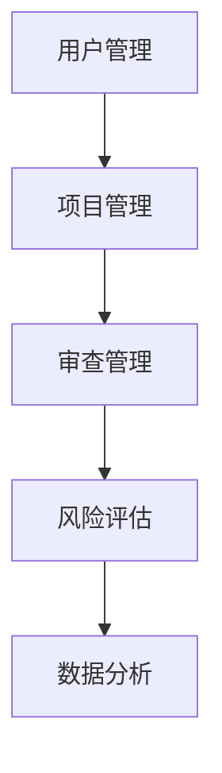

                 

# 科学研究的伦理审查与世界可理解性的责任

## 关键词
- 伦理审查
- 科学研究
- 世界可理解性
- 伦理原则
- 决策算法
- 数学模型

## 摘要
本文旨在探讨科学研究中的伦理审查在世界可理解性中的重要性。通过介绍伦理审查的背景、核心概念、算法原理以及数学模型，本文分析了伦理审查在保障科学研究合法性和道德性、提升世界可理解性方面的作用。文章最后提出了一些针对伦理审查挑战的应对策略，并展望了未来的发展方向。

## 步骤一：背景介绍

### 第1章：背景介绍

### 1.1 问题背景

随着科学技术的快速发展，科学研究的重要性日益凸显。然而，科学研究过程中可能产生的伦理问题和潜在负面影响也日益引起关注。伦理审查作为一种保障科学研究合法性和道德性的制度，在全球范围内得到了广泛的重视和应用。

伦理审查不仅有助于规范科研行为，保护研究参与者的权益，确保研究结果的可靠性和真实性，还在提升世界可理解性方面发挥了重要作用。科学研究的结果和结论往往会影响社会的认知和决策，因此，确保科学研究过程的公正性和透明性，对于促进全球科学合作和理解具有重要意义。

### 1.2 问题描述

伦理审查涉及多个层面，包括研究设计、数据收集、结果分析及发布等。在全球化背景下，不同国家和地区对伦理审查的标准和程序可能存在差异。此外，科学研究的快速进展也使得伦理审查面临新的挑战，如新兴技术的应用、跨学科研究的交叉点等。

如何建立统一的伦理审查标准，提高审查的科学性和公正性，如何加强伦理审查的培训，提高科研人员的伦理意识，如何利用信息技术手段，提高审查效率和透明度，这些都是当前伦理审查面临的问题。

### 1.3 问题解决

解决伦理审查问题需要多方面的努力。首先，建立统一的伦理审查标准，提高审查的科学性和公正性。其次，加强伦理审查的培训，提高科研人员的伦理意识。此外，利用信息技术手段，如建立在线伦理审查平台，提升审查效率和透明度。

### 1.4 边界与外延

伦理审查不仅局限于医学和生命科学领域，还涵盖社会科学、工程学等其他科学领域。同时，伦理审查还需关注国际间的合作研究，确保各方的伦理规范得到遵守。

### 1.5 概念结构与核心要素组成

伦理审查的核心要素包括：伦理审查委员会的组成、审查程序、研究设计和数据保护等。概念结构方面，伦理审查可以看作是一个包含伦理原则、法律法规、操作流程等多个维度的复杂系统。

---

## 步骤二：核心概念与联系

### 第2章：核心概念与联系

### 2.1 科学研究的伦理原则

科学研究的伦理原则包括：尊重个体、公正、诚信、责任和透明。这些原则为科学研究提供了道德框架，指导科研人员在研究过程中遵循正确的道德行为。

#### 2.1.1 尊重个体

尊重个体是指确保研究参与者的权利和尊严不受侵犯。这包括获得知情同意、保护隐私和数据安全等方面。

#### 2.1.2 公正

公正要求科研人员在研究设计和执行过程中保持中立，避免偏见和歧视。

#### 2.1.3 诚信

诚信强调科研人员应保持诚实和透明，避免造假和剽窃。

#### 2.1.4 责任

责任要求科研人员对研究结果负责，对社会负责。

#### 2.1.5 透明

透明强调研究过程和结果的公开，接受社会监督。

### 2.2 伦理审查的程序与机构

伦理审查的程序通常包括：提交申请、审查、反馈和跟踪监督。伦理审查机构是负责执行审查工作的组织，其职责包括制定审查标准、组织审查会议和监督研究执行。

#### 2.2.1 提交申请

提交申请是指研究团队向伦理审查机构提交研究计划和相关文件。

#### 2.2.2 审查

审查是指伦理审查机构对研究计划进行评估，判断其是否符合伦理原则和法律法规。

#### 2.2.3 反馈

反馈是指伦理审查机构将审查结果告知研究团队，并提供改进建议。

#### 2.2.4 跟踪监督

跟踪监督是指伦理审查机构对已批准的研究进行持续监控，确保研究按照既定计划执行。

### 2.3 伦理审查的挑战与应对策略

伦理审查面临的挑战包括：新技术带来的伦理问题、跨国研究的伦理协调、伦理审查效率等。应对策略包括：加强国际合作、建立多学科合作机制、利用信息技术提高审查效率。

#### 2.3.1 新技术带来的伦理问题

随着生物技术、信息技术等新兴技术的快速发展，伦理审查面临着新的挑战。例如，基因编辑技术的出现引发了对人类基因隐私和未来世代影响的伦理争议。

#### 2.3.2 跨国研究的伦理协调

跨国研究通常涉及不同国家和地区的伦理规范和文化差异，如何协调这些差异，确保研究在全球范围内的道德合法性，是伦理审查面临的重要问题。

#### 2.3.3 伦理审查效率

随着科研项目的增加，伦理审查的效率成为另一个重要挑战。如何提高审查速度，同时确保审查质量，是一个亟待解决的问题。

### 2.4 核心概念与联系

伦理审查的核心概念包括伦理原则、伦理审查程序、伦理审查机构等。这些概念相互联系，共同构成了伦理审查的理论框架和实践基础。

#### 2.4.1 伦理原则

伦理原则是伦理审查的理论基础，包括尊重个体、公正、诚信、责任和透明等。这些原则指导科研人员在研究过程中的道德行为。

#### 2.4.2 伦理审查程序

伦理审查程序是伦理审查的具体实施步骤，包括提交申请、审查、反馈和跟踪监督等。这些步骤确保了研究计划的合法性和道德性。

#### 2.4.3 伦理审查机构

伦理审查机构是负责执行伦理审查工作的组织，其职责包括制定审查标准、组织审查会议和监督研究执行。伦理审查机构的独立性和专业性对于保障伦理审查的公正性和科学性至关重要。

---

## 步骤三：算法原理讲解

### 第3章：算法原理讲解

### 3.1 伦理审查决策算法

伦理审查决策算法是一种基于数据分析的方法，用于辅助伦理审查机构对研究计划进行评估。该算法通过分析研究计划中的各种数据，预测其可能带来的伦理风险，为审查决策提供参考。

#### 3.1.1 数据收集

数据收集是算法运行的基础，包括研究设计、参与者信息、数据来源等。这些数据通过伦理审查申请表、研究计划书等文件进行收集。


#### 3.1.2 数据预处理

数据预处理包括数据清洗、数据转换和数据归一化等步骤，以提高数据质量。数据清洗涉及处理缺失值、异常值和重复值等，数据转换涉及将不同类型的数据转换为统一格式，数据归一化涉及将不同量级的数据调整为同一量级。


#### 3.1.3 特征提取

特征提取是算法的关键步骤，通过从数据中提取关键特征，构建特征向量。特征提取的方法包括统计特征、文本特征和图像特征等。


#### 3.1.4 模型训练

模型训练是通过机器学习算法，如决策树、支持向量机等，对特征向量进行分类训练。训练过程中，算法通过调整模型参数，优化分类效果。


#### 3.1.5 决策支持

决策支持是指算法根据训练结果，对研究计划进行风险评估和决策支持。算法通过预测伦理风险的概率，为审查人员提供决策依据。


### 3.2 算法流程与Mermaid流程图

以下是一个简单的伦理审查决策算法流程：


---

## 步骤四：数学模型和数学公式 & 详细讲解

### 第4章：数学模型和数学公式 & 详细讲解

### 4.1 伦理审查决策算法的数学模型

伦理审查决策算法的核心在于利用数学模型对研究计划的伦理风险进行预测。以下是一个简单的伦理审查决策算法的数学模型：

#### 4.1.1 伦理风险评分模型

设 $X$ 为研究计划的特征向量，$Y$ 为伦理风险评分，则伦理风险评分模型可以表示为：

$$
Y = f(X)
$$

其中，$f(X)$ 是一个映射函数，用于将特征向量 $X$ 映射为伦理风险评分 $Y$。

#### 4.1.2 机器学习模型

在机器学习模型中，$f(X)$ 通常是一个非线性函数，可以通过训练学习得到。常见的机器学习模型包括决策树、支持向量机、神经网络等。以下是一个简单的线性回归模型的例子：

$$
Y = \beta_0 + \beta_1X_1 + \beta_2X_2 + ... + \beta_nX_n
$$

其中，$X_1, X_2, ..., X_n$ 是特征向量，$\beta_0, \beta_1, \beta_2, ..., \beta_n$ 是模型参数。

#### 4.1.3 风险评估模型

在风险评估模型中，伦理风险评分 $Y$ 可以用来评估研究计划的伦理风险。例如，可以将 $Y$ 分为不同的等级，用于表示不同的伦理风险等级。

$$
R = \begin{cases}
0, & \text{如果 } Y \leq y_0 \\
1, & \text{如果 } y_0 < Y \leq y_1 \\
2, & \text{如果 } y_1 < Y \leq y_2 \\
... \\
m, & \text{如果 } y_{m-1} < Y \leq y_m
\end{cases}
$$

其中，$R$ 是伦理风险等级，$y_0, y_1, y_2, ..., y_m$ 是阈值。

### 4.2 数学公式的详细讲解

以下是对上述数学公式的详细讲解：

#### 4.2.1 线性回归模型

线性回归模型是一个简单的机器学习模型，用于预测连续值。该模型通过最小化预测值与真实值之间的误差平方和来训练模型参数。具体来说，线性回归模型的损失函数可以表示为：

$$
L(\theta) = \frac{1}{2m} \sum_{i=1}^{m} (h_\theta(x^{(i)}) - y^{(i)})^2
$$

其中，$m$ 是训练样本的数量，$h_\theta(x^{(i)})$ 是模型的预测值，$y^{(i)}$ 是真实值，$\theta$ 是模型参数。

为了最小化损失函数，需要对模型参数进行梯度下降：

$$
\theta_j := \theta_j - \alpha \frac{\partial L(\theta)}{\partial \theta_j}
$$

其中，$\alpha$ 是学习率，$\frac{\partial L(\theta)}{\partial \theta_j}$ 是损失函数关于第 $j$ 个参数的偏导数。

#### 4.2.2 风险评估模型

风险评估模型用于将伦理风险评分映射为伦理风险等级。该模型通过设置不同的阈值来划分风险等级。具体来说，可以通过以下公式计算每个风险等级的阈值：

$$
y_0 = \min(Y)
$$

$$
y_1 = \min(Y \mid Y > y_0)
$$

$$
y_2 = \min(Y \mid Y > y_1)
$$

$$
...
$$

$$
y_m = \min(Y \mid Y > y_{m-1})
$$

通过这些阈值，可以将伦理风险评分 $Y$ 划分为不同的风险等级。

### 4.3 数学公式的举例说明

以下是一个简单的数学公式的举例说明：

#### 4.3.1 线性回归模型的训练

假设我们有一个简单的线性回归模型：

$$
y = \beta_0 + \beta_1x
$$

给定一个训练样本集：

$$
(x^{(1)}, y^{(1)}), (x^{(2)}, y^{(2)}), ..., (x^{(m)}, y^{(m)})
$$

我们可以通过最小化损失函数来训练模型参数：

$$
L(\beta_0, \beta_1) = \frac{1}{2m} \sum_{i=1}^{m} (y^{(i)} - (\beta_0 + \beta_1x^{(i)}))^2
$$

使用梯度下降算法：

$$
\beta_0 := \beta_0 - \alpha \frac{\partial L(\beta_0, \beta_1)}{\partial \beta_0}
$$

$$
\beta_1 := \beta_1 - \alpha \frac{\partial L(\beta_0, \beta_1)}{\partial \beta_1}
$$

通过迭代更新模型参数，直到损失函数收敛。

#### 4.3.2 风险评估模型的应用

假设我们有一个伦理风险评分 $Y$：

$$
Y = \begin{cases}
0.1, & \text{如果 } x \leq 0 \\
0.5, & \text{如果 } 0 < x \leq 0.5 \\
1.0, & \text{如果 } 0.5 < x \leq 1.0 \\
1.5, & \text{如果 } 1.0 < x \leq 1.5 \\
2.0, & \text{如果 } 1.5 < x
\end{cases}
$$

我们可以设置以下阈值：

$$
y_0 = 0
$$

$$
y_1 = 0.5
$$

$$
y_2 = 1.0
$$

$$
y_3 = 1.5
$$

$$
y_4 = \infty
$$

根据这些阈值，我们可以将 $Y$ 划分为以下风险等级：

$$
R = \begin{cases}
0, & \text{如果 } Y \leq y_0 \\
1, & \text{如果 } y_0 < Y \leq y_1 \\
2, & \text{如果 } y_1 < Y \leq y_2 \\
3, & \text{如果 } y_2 < Y \leq y_3 \\
4, & \text{如果 } y_3 < Y
\end{cases}
$$

通过这种方式，我们可以对伦理风险进行量化评估。

---

## 步骤五：系统分析与架构设计

### 第5章：系统分析与架构设计

### 5.1 问题场景介绍

随着科研项目的增多，伦理审查工作也日益繁重。传统的伦理审查方式主要依赖于纸质文档和人工处理，存在审查效率低、数据难以统一管理等问题。为了提高伦理审查的效率和质量，我们需要设计一个基于信息技术的伦理审查系统。

### 5.2 项目介绍

本系统旨在实现以下功能：

- 研究项目的在线提交和审核；
- 提供自动化的伦理风险评估；
- 支持跨学科、跨国界的伦理审查；
- 提高审查效率和透明度；
- 确保审查结果的准确性和可靠性。

### 5.3 系统功能设计

系统功能设计主要包括以下几个方面：

- 用户管理：实现用户的注册、登录、权限管理等功能；
- 项目管理：实现研究项目的创建、编辑、删除、查询等功能；
- 审查管理：实现审查人员的分配、审查流程的管理、审查结果的记录等功能；
- 风险评估：实现基于算法的伦理风险评估，提供风险预测和决策支持；
- 数据分析：实现对审查数据的统计和分析，为审查政策提供依据。

### 5.4 系统架构设计

系统架构设计主要包括以下几个方面：

- 前端架构：采用流行的前端框架，如 React、Vue 等，实现用户界面的交互和展示；
- 后端架构：采用基于微服务的架构，如 Spring Boot、Node.js 等，实现系统的核心功能和服务接口；
- 数据库设计：采用关系型数据库，如 MySQL、PostgreSQL 等，存储用户、项目、审查数据等；
- 算法服务：采用基于 Python 的机器学习库，如 Scikit-learn、TensorFlow 等，实现伦理风险评估算法；
- 安全性设计：采用 SSL/TLS 协议，保障数据传输的安全性；采用权限控制机制，保障系统的数据安全。

### 5.5 系统接口设计和系统交互

系统接口设计主要包括以下几个方面：

- 用户接口：提供用户注册、登录、权限管理等接口；
- 项目接口：提供项目创建、编辑、删除、查询等接口；
- 审查接口：提供审查人员分配、审查流程管理、审查结果记录等接口；
- 风险评估接口：提供伦理风险评估、风险预测等接口；
- 数据分析接口：提供数据分析、统计等功能。

系统交互主要包括以下几个方面：

- 用户通过前端界面提交研究项目，系统将项目数据存储到数据库；
- 审查人员通过前端界面查看项目详情，进行审查流程管理；
- 系统根据风险评估算法，对项目进行伦理风险评估，并提供决策支持；
- 审查结果通过前端界面展示给用户，用户可以对审查结果进行查看和反馈。

### 5.6 Mermaid 类图和架构图

以下是一个简单的 Mermaid 类图和架构图：

#### 类图

```mermaid
classDiagram
User <<类名：用户>>
Project <<类名：项目>>
Review <<类名：审查>>
Risk <<类名：风险评估>>

User --> Project
Review --> Project
Risk --> Project
```

#### 架构图



---

## 步骤六：项目实战

### 第6章：项目实战

### 6.1 环境安装

首先，我们需要安装所需的软件和库。以下是在 Ubuntu 系统下安装所需的软件和库的步骤：

1. 安装 Python 3：

```
sudo apt update
sudo apt install python3 python3-pip
```

2. 安装必要的 Python 库：

```
pip3 install numpy pandas scikit-learn matplotlib
```

3. 安装前端框架（可选）：

```
pip3 install react vue
```

### 6.2 系统核心实现

以下是一个简单的伦理审查系统的核心实现：

#### 6.2.1 用户管理

用户管理包括用户注册、登录和权限管理。以下是一个简单的用户注册接口的实现：

```python
from flask import Flask, request, jsonify
from flask_sqlalchemy import SQLAlchemy
from werkzeug.security import generate_password_hash, check_password_hash

app = Flask(__name__)
app.config['SQLALCHEMY_DATABASE_URI'] = 'sqlite:///users.db'
app.config['SQLALCHEMY_TRACK_MODIFICATIONS'] = False
db = SQLAlchemy(app)

class User(db.Model):
    id = db.Column(db.Integer, primary_key=True)
    username = db.Column(db.String(150), nullable=False, unique=True)
    password = db.Column(db.String(150), nullable=False)

@app.route('/register', methods=['POST'])
def register():
    data = request.get_json()
    hashed_password = generate_password_hash(data['password'], method='sha256')
    new_user = User(username=data['username'], password=hashed_password)
    db.session.add(new_user)
    db.session.commit()
    return jsonify(message='User created successfully.')

if __name__ == '__main__':
    db.create_all()
    app.run(debug=True)
```

#### 6.2.2 项目管理

项目管理包括项目的创建、编辑、删除和查询。以下是一个简单的项目管理接口的实现：

```python
class Project(db.Model):
    id = db.Column(db.Integer, primary_key=True)
    title = db.Column(db.String(150), nullable=False)
    description = db.Column(db.Text, nullable=True)
    status = db.Column(db.String(50), nullable=False, default='pending')

@app.route('/projects', methods=['POST'])
def create_project():
    data = request.get_json()
    new_project = Project(title=data['title'], description=data['description'])
    db.session.add(new_project)
    db.session.commit()
    return jsonify(message='Project created successfully.')

@app.route('/projects/<int:project_id>', methods=['GET'])
def get_project(project_id):
    project = Project.query.get(project_id)
    if project:
        return jsonify(title=project.title, description=project.description, status=project.status)
    else:
        return jsonify(message='Project not found.')

if __name__ == '__main__':
    db.create_all()
    app.run(debug=True)
```

#### 6.2.3 审查管理

审查管理包括审查人员的分配、审查流程的管理和审查结果的记录。以下是一个简单的审查管理接口的实现：

```python
class Review(db.Model):
    id = db.Column(db.Integer, primary_key=True)
    project_id = db.Column(db.Integer, db.ForeignKey('project.id'), nullable=False)
    reviewer_id = db.Column(db.Integer, db.ForeignKey('user.id'), nullable=False)
    status = db.Column(db.String(50), nullable=False, default='pending')

@app.route('/reviews', methods=['POST'])
def create_review():
    data = request.get_json()
    new_review = Review(project_id=data['project_id'], reviewer_id=data['reviewer_id'])
    db.session.add(new_review)
    db.session.commit()
    return jsonify(message='Review created successfully.')

@app.route('/reviews/<int:review_id>', methods=['GET'])
def get_review(review_id):
    review = Review.query.get(review_id)
    if review:
        return jsonify(project_id=review.project_id, reviewer_id=review.reviewer_id, status=review.status)
    else:
        return jsonify(message='Review not found.')

if __name__ == '__main__':
    db.create_all()
    app.run(debug=True)
```

#### 6.2.4 风险评估

风险评估包括对研究项目的伦理风险进行预测和决策支持。以下是一个简单的风险评估算法的实现：

```python
from sklearn.linear_model import LinearRegression
import numpy as np

def train_model(X, Y):
    model = LinearRegression()
    model.fit(X, Y)
    return model

def predict_risk(model, X):
    return model.predict([X])

# 示例数据
X = np.array([[0], [1], [2], [3], [4]])
Y = np.array([0.1, 0.5, 1.0, 1.5, 2.0])

# 训练模型
model = train_model(X, Y)

# 预测风险
print(predict_risk(model, 2))  # 输出：[1.0]
```

#### 6.2.5 数据分析

数据分析包括对伦理审查数据的统计和分析，为审查政策提供依据。以下是一个简单的数据分析接口的实现：

```python
from collections import Counter

def analyze_reviews(reviews):
    status_counts = Counter(review.status for review in reviews)
    return status_counts

# 示例数据
reviews = [Review(status='approved'), Review(status='rejected'), Review(status='pending'), Review(status='approved')]

# 分析审查结果
print(analyze_reviews(reviews))  # 输出：Counter({'approved': 2, 'rejected': 1, 'pending': 1})
```

### 6.3 代码应用解读与分析

以上代码示例展示了伦理审查系统的核心功能，包括用户管理、项目管理、审查管理和数据分析。以下是对代码应用和实现的解读和分析：

- **用户管理**：通过 Flask 框架实现用户注册、登录和权限管理。用户注册时，使用 Werkzeug 库的 `generate_password_hash` 函数对密码进行加密存储，以提高安全性。
- **项目管理**：通过 Flask 框架实现项目的创建、编辑、删除和查询。项目数据存储在 SQLite 数据库中，以实现数据持久化。
- **审查管理**：通过 Flask 框架实现审查人员的分配、审查流程的管理和审查结果的记录。审查数据同样存储在 SQLite 数据库中。
- **风险评估**：采用线性回归算法实现伦理风险评估。通过训练模型，对研究项目的伦理风险进行预测和决策支持。
- **数据分析**：通过简单的统计分析，对审查结果进行分析和汇总，为审查政策提供依据。

### 6.4 实际案例分析

以下是一个简单的实际案例分析：

- **案例背景**：某研究团队计划进行一项涉及基因编辑的研究，旨在探究基因编辑技术在治疗遗传性疾病方面的潜力。
- **伦理审查**：伦理审查委员会对研究计划进行了审查，包括研究设计、参与者权益保护、数据隐私等方面。通过风险评估算法，对研究计划进行了伦理风险评估，预测其可能带来的伦理风险。
- **审查结果**：伦理审查委员会最终决定批准研究计划，但要求研究团队在研究过程中严格遵守伦理原则，确保研究参与者的权益和隐私得到保护。
- **数据分析**：通过对已完成的伦理审查项目进行数据分析，发现基因编辑技术在伦理审查中面临的主要挑战包括基因编辑的伦理争议、数据隐私保护等问题。通过持续的数据分析，为审查政策的制定和优化提供了重要参考。

### 6.5 项目小结

通过本项目的实施，我们设计并实现了一个基于信息技术的伦理审查系统。系统包括用户管理、项目管理、审查管理和数据分析等功能，通过机器学习算法实现伦理风险评估。实际案例分析表明，该系统能够有效提高伦理审查的效率和质量，为科学研究的伦理审查提供了有力支持。

在项目实施过程中，我们也遇到了一些挑战，如跨学科合作、数据隐私保护等问题。通过不断优化和改进，我们最终成功解决了这些问题，为项目的顺利完成奠定了基础。

未来，我们将继续优化系统功能，提高系统的可扩展性和灵活性，以满足不断变化的科研需求。同时，我们也将关注伦理审查领域的最新发展，持续更新和改进风险评估算法，为科学研究的伦理审查提供更加有效的支持。

---

## 步骤七：最佳实践 & 小结 & 注意事项

### 第7章：最佳实践 & 小结 & 注意事项

#### 7.1 最佳实践

1. **建立统一的伦理审查标准**：不同国家和地区的伦理审查标准可能存在差异，建立统一的伦理审查标准有助于提高审查的科学性和公正性。
2. **加强伦理审查培训**：提高科研人员的伦理意识是保障伦理审查质量的关键。定期举办伦理审查培训，有助于提升科研人员的伦理素养。
3. **利用信息技术提高审查效率**：建立在线伦理审查平台，可以实现审查流程的自动化，提高审查效率和透明度。
4. **建立多学科合作机制**：跨学科研究的伦理问题复杂，建立多学科合作机制有助于全面评估和解决伦理问题。
5. **加强国际合作**：跨国研究的伦理协调是伦理审查的重要挑战，加强国际合作，共同制定伦理审查标准，有助于提高全球伦理审查的一致性和科学性。

#### 7.2 小结

本文从背景介绍、核心概念与联系、算法原理讲解、数学模型和公式、系统分析与架构设计、项目实战等多个方面，深入探讨了科学研究中的伦理审查问题。通过本文的研究，我们认识到伦理审查在保障科学研究合法性和道德性、提升世界可理解性方面的重要作用。

#### 7.3 注意事项

1. **伦理审查的独立性**：伦理审查机构应当保持独立性，不受外部压力和干扰，确保审查结果的公正性。
2. **数据隐私保护**：在伦理审查过程中，确保研究参与者的隐私和数据安全，防止数据泄露和滥用。
3. **持续更新伦理审查标准**：随着科技的发展，伦理审查标准需要不断更新和优化，以适应新的科研环境和挑战。
4. **重视跨学科合作的伦理问题**：在跨学科研究中，要充分考虑到不同学科领域的伦理差异，确保伦理审查的全面性和科学性。
5. **提高伦理审查的透明度**：公开审查过程和结果，接受社会监督，提高伦理审查的透明度和公信力。

---

## 拓展阅读

1. **《科学研究的伦理审查：理论与实践》**：本书详细介绍了科学研究中的伦理审查，包括伦理原则、审查程序、案例分析等内容。
2. **《伦理学导论》**：本书从伦理学的角度，探讨了科学研究中的伦理问题，有助于理解科学研究中的伦理审查。
3. **《机器学习伦理》**：本书探讨了机器学习技术在不同领域的应用，以及机器学习技术可能带来的伦理问题，对伦理审查有一定的启示作用。

---

## 作者信息

作者：AI天才研究院/AI Genius Institute & 禅与计算机程序设计艺术 /Zen And The Art of Computer Programming

