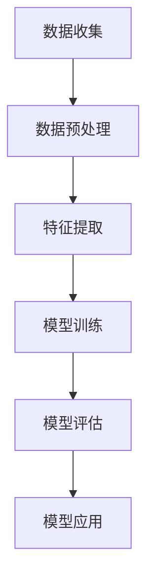

                 

### 第一部分：引言与背景

#### 第1章：引言

**1.1 研究背景**

在当今全球化和数字化的时代，科学研究的重要性愈发凸显。科学技术的迅猛发展不仅极大地推动了社会的进步，也深刻地改变了人类的生活方式。然而，科学研究的复杂性和专业性使得大多数普通民众难以理解和参与其中。这一现象不仅限制了科学知识的普及，也阻碍了公众对科学的信任和支持。因此，如何让科学研究更加开放、透明，以及如何促进公民参与科学活动，成为了一个亟待解决的问题。

当前，科学研究面临诸多挑战，例如数据量巨大、研究方法复杂、跨学科合作需求增加等。同时，科学研究成果的转化和应用也面临困难，这需要更多的公众参与和监督。另一方面，公众对科学的理解和参与也有助于提升社会的科学素养，促进科学精神的普及。因此，公民参与科学研究的潜力不容忽视。

**1.1.1 科学研究的现状与挑战**

科学研究在现代社会中扮演着至关重要的角色。从基础理论研究到应用技术开发，科学研究的成果广泛应用于各个领域，包括医学、农业、能源、环境等。然而，当前科学研究也面临着一些显著的挑战。

首先，科学研究的数据量呈现爆炸式增长。随着各种传感器和测量技术的进步，科学实验产生的数据量越来越大，如何有效地管理和分析这些数据成为一个难题。传统的数据处理方法已难以应对如此庞大的数据规模，这需要开发新的算法和技术。

其次，科学研究的方法和流程越来越复杂。跨学科合作成为科学研究的重要趋势，但不同学科之间的研究方法和语言差异较大，这增加了科学研究的难度。同时，科学研究的资金来源和项目管理也变得更加复杂，需要更高效的协调和协作机制。

最后，科学研究成果的转化和应用面临挑战。尽管科学研究成果丰富，但将其转化为实际应用并产生社会效益的过程并不顺利。这涉及到技术、市场、政策等多个方面的因素，需要多方协同合作。

**1.1.2 公民参与的意义与潜力**

公民参与科学研究具有多重意义和潜力。首先，公民参与有助于提升公众对科学的理解和信任。当公民能够参与到科学研究的实际过程中，他们对科学的认识将更加深刻和全面，从而提高公众对科学的认同感。

其次，公民参与可以拓宽科学研究的视野。科学研究的创新往往源于多样化的视角和思维方式。公民作为社会的重要组成部分，他们独特的视角和经验可以为科学研究提供新的思路和方法。

此外，公民参与还有助于提高科学研究的透明度和公正性。通过公开数据、开放资源和透明的研究过程，可以增强公众对科学研究的信任，减少科学不端行为的发生。

最后，公民参与可以促进科学知识的普及和传播。当公民参与科学研究的传播过程时，他们可以成为科学知识的传播者，将科学知识带到更广泛的公众中，从而推动科学文化的普及。

**1.1.3 世界可理解性的重要性**

世界可理解性是指人类对自然界和社会现象的理解程度。一个可理解的世界能够让人们更好地应对生活中的各种挑战，提高生活质量和社会稳定。然而，当前的科学研究和知识传播面临一系列问题，如信息的复杂性和专业化程度过高，导致普通民众难以理解和应用科学知识。

提高世界可理解性具有重要的意义。首先，它有助于提高公众的科学素养，使更多的人能够理解科学概念和原理，从而更好地参与到科学活动中。其次，提高世界可理解性可以促进科学知识的普及，使更多的人受益于科学成果。最后，一个可理解的世界有助于消除误解和偏见，促进社会的和谐发展。

**1.2 问题提出与目标**

在上述背景下，本文提出以下研究问题：

1. 公民参与对科学研究的可理解性有何具体影响？
2. 如何有效促进公民参与科学活动，以提升世界可理解性？
3. 公民参与在不同领域的科学研究中有何不同表现和效果？

本研究旨在：

1. 梳理和分析公民参与科学研究的现状和趋势。
2. 探讨公民参与对科学研究可理解性的具体贡献。
3. 提出促进公民参与和提升世界可理解性的策略和措施。

通过本研究，我们希望能够为科学研究与公众参与之间的桥梁搭建提供一些理论依据和实践指导，从而推动科学研究的普及和发展。

#### 第2章：核心概念与联系

**2.1 科学研究的基本概念**

科学研究是获取知识的一种系统性方法，其目的是通过观察、实验和推理来揭示自然现象和社会规律的内在机制。科学研究通常包括以下几个基本步骤：提出问题、建立假设、设计实验、收集数据、分析和解释数据、得出结论。

科学研究的基本原则包括：

1. 客观性：科学研究应当尽量排除主观偏见，追求客观真实的结论。
2. 可重复性：科学研究的实验方法和结果应当能够被其他研究者重复验证。
3. 普遍性：科学研究的结论应当适用于广泛的情境和条件。

科学研究的方法多种多样，包括实验研究、观察研究、调查研究和理论建模等。每种方法都有其独特的优势和应用场景。

科学研究主要涵盖以下领域：

1. 自然科学：如物理学、化学、生物学等。
2. 社会科学：如经济学、社会学、心理学等。
3. 人文科学：如文学、艺术、历史等。

**2.2 公民参与的概念与形式**

公民参与是指普通民众在科学研究和科学传播过程中扮演的积极角色。公民参与不仅包括直接参与科学研究，如提供数据、参与实验，还包括通过科普活动和科学教育来提高公众的科学素养。

公民参与的科学项目通常有以下几种形式：

1. 数据贡献：公民通过提供自己的数据或参与数据收集活动，如气象观测、环境监测等，为科学研究提供宝贵的资源。
2. 实验参与：公民可以直接参与科学实验，如参与基因组研究、天文观测等，为实验提供人力资源。
3. 科普活动：公民参与科学展览、讲座、研讨会等活动，提高公众对科学的理解和兴趣。
4. 科学决策：公民参与科学政策的制定和评估，提供公众的观点和建议。

公民参与的动机多种多样，包括：

1. 科学兴趣：许多人因为对科学的热爱和好奇心而愿意参与科学活动。
2. 社会责任：公民希望为社会的发展和进步做出贡献。
3. 个人成长：参与科学活动可以帮助公民提高自身的科学素养和解决问题的能力。
4. 社交互动：公民参与科学活动可以结识志同道合的朋友，增强社交互动。

**2.2.1 公民参与的动机与效果**

公民参与科学研究的动机多种多样，但总体上可以归纳为以下几个主要方面：

1. **科学兴趣**：许多人因为对科学的热爱和好奇心而愿意参与科学活动。他们希望通过参与科学研究来满足自己的求知欲和探索精神。
2. **社会责任**：公民参与科学活动可以被视为一种社会责任的体现。他们希望通过自己的努力，为社会的进步和发展做出贡献。
3. **个人成长**：参与科学活动可以帮助公民提高自身的科学素养和解决问题的能力。这种成长不仅体现在知识层面，也体现在技能和思维方式上。
4. **社交互动**：科学活动为公民提供了一个交流和互动的平台。通过参与科学项目，他们可以结识志同道合的朋友，建立新的社交网络。

公民参与的效果是多方面的。首先，公民参与可以大大提高科学研究的多样性和创新性。不同背景和视角的公民可以为科学研究提供独特的见解和解决方案。其次，公民参与可以增强科学研究的透明度和公正性，提高公众对科学研究的信任度。此外，公民参与还可以促进科学知识的普及和传播，使更多的人受益于科学成果。

**2.2.2 公民参与的不同层次与形式**

公民参与科学活动可以分为不同的层次和形式，每种形式都有其特定的作用和特点：

1. **低层次参与**：这种参与形式通常涉及简单的数据收集和实验参与。例如，公民可以通过使用手机应用程序记录天气数据或参与基因测序项目。这种参与形式通常不需要专业的科学知识和技能，但可以为科学研究提供宝贵的数据资源。

2. **中层次参与**：这种参与形式包括更加深入的实验参与和数据分析。公民可以参与到实验室的日常工作中，参与数据分析和实验设计。例如，在生物多样性研究中，公民可以参与到物种识别和数据记录工作中。这种参与形式需要一定的科学知识和技能，但能够提供更加专业化的支持。

3. **高层次参与**：这种参与形式涉及科学项目的全面参与，包括项目设计、数据分析和结果解读。公民可以作为科学项目的合作伙伴，与专业科学家一起工作。例如，在开放科学项目中，公民可以参与到数据收集、实验设计和结果分析的全过程。这种参与形式需要高度的专业知识和经验，但能够为科学研究带来全新的视角和思路。

**2.3 世界可理解性的内涵与特征**

世界可理解性是指人类对自然界和社会现象的理解程度。一个可理解的世界使得人们能够更有效地应对生活中的各种挑战，提高生活质量和社会稳定。世界可理解性的核心特征包括：

1. **知识普及**：世界可理解性体现在科学知识的普及程度，即普通民众对科学概念和原理的理解程度。普及的科学知识有助于人们更好地理解世界，提高科学素养。

2. **透明性**：世界可理解性要求科学研究的过程和结果对公众透明。公开的科学数据和研究成果可以提高公众对科学研究的信任，促进科学知识的传播。

3. **多样性**：世界可理解性强调知识的多样性和全面性。一个可理解的世界应当包含各种科学领域的知识，涵盖自然现象和社会现象的各个方面。

4. **互动性**：世界可理解性还体现在公众与科学家之间的互动。通过科学教育和科普活动，公众可以与科学家交流，提出问题，分享见解，从而深化对科学的理解。

**2.3.1 世界可理解性的定义与理论基础**

世界可理解性的定义可以从多个角度进行阐述。从科学哲学的角度来看，世界可理解性是指人类通过科学研究揭示自然界的规律和本质，从而实现对世界的理解。这种理解不仅包括对自然现象的描述和解释，还包括对现象背后的机制和原理的揭示。

世界可理解性的理论基础主要来源于科学哲学和科学社会学。科学哲学关注科学的本质和科学方法，探讨人类如何通过科学研究获得对世界的理解。科学社会学则研究科学在社会中的角色和影响，探讨科学知识如何传播和普及。

在科学哲学中，理性主义和经验主义是两种主要的理解世界的途径。理性主义者认为，通过逻辑推理和抽象思维，人类可以揭示世界的本质和规律。经验主义者则强调通过观察和实验来获取知识，认为科学知识应当建立在实证基础上。

在科学社会学中，科学传播和科学普及是关键概念。科学传播是指科学知识从科学家到公众的传递过程，而科学普及则是使科学知识为普通民众所理解和接受的过程。科学传播和科学普及的有效性直接影响到世界可理解性的程度。

**2.3.2 世界可理解性的指标与评估方法**

评估世界可理解性的指标和方法可以从多个维度进行探讨。以下是几个关键指标和评估方法：

1. **科学素养水平**：科学素养水平是评估世界可理解性的重要指标。科学素养包括对科学概念和原理的理解、科学方法的认知以及科学价值观的接受程度。常见的科学素养评估方法包括科学知识测试、科学思维评估和科学态度调查。

2. **科学知识普及率**：科学知识普及率是指在一定区域内，公众对科学知识的了解程度。可以通过问卷调查、教育统计数据和科普活动的参与度来评估科学知识普及率。

3. **科学传播渠道的多样性和覆盖面**：科学传播渠道的多样性和覆盖面反映了科学知识传播的广度和深度。评估方法包括分析科学媒体的影响力、科普活动的参与人数和科普书籍的销量等。

4. **公众对科学的信任度**：公众对科学的信任度是衡量世界可理解性的重要指标。信任度可以通过公众对科学研究的支持程度、对科学成果的接受程度以及对社会科学政策的认可度来评估。

5. **科学参与度**：科学参与度是指公众参与科学活动的频率和深度。可以通过统计公民参与科学实验、科普活动和科学决策的人数来评估科学参与度。

通过上述指标和评估方法，可以综合评价世界可理解性的程度，为政策制定者和科研机构提供参考，推动世界可理解性的提升。

### 第3章：算法原理讲解

#### 3.1 科学研究算法的概述

在科学研究过程中，算法起到了至关重要的作用。算法是一系列用于解决特定问题的步骤和规则，它们使得科学家能够从大量数据中提取有用信息，发现潜在的模式和规律。算法不仅在数据分析中应用广泛，还在优化实验设计、模型构建和预测分析等方面发挥着关键作用。

算法在科学研究中的作用主要体现在以下几个方面：

1. **数据分析与处理**：科学研究通常涉及大量的数据，这些数据可能包含噪声和不确定性。算法能够帮助科学家有效地清洗、转换和挖掘数据，提取有用的信息。

2. **模式识别与预测**：通过算法，科学家可以从实验数据中识别出潜在的规律和模式，甚至预测未来的趋势。这些预测结果对于科学研究和新技术的开发至关重要。

3. **实验设计与优化**：算法可以帮助科学家设计更高效的实验方案，减少实验次数和成本，提高实验的成功率。

4. **模型构建与验证**：算法在构建和验证科学模型方面也发挥了重要作用。通过算法，科学家可以建立复杂的多变量模型，并验证其准确性和可靠性。

常见的科学研究算法类型包括：

1. **统计分析算法**：如线性回归、决策树、聚类分析等，用于分析数据中的统计特征和关系。
2. **机器学习算法**：如支持向量机、神经网络、随机森林等，用于从数据中学习模式和规律，进行分类和预测。
3. **优化算法**：如遗传算法、模拟退火算法、粒子群优化等，用于求解复杂的优化问题，找到最优解。
4. **仿真算法**：如蒙特卡罗模拟、分子动力学模拟等，用于模拟物理、化学、生物等过程，验证理论模型的准确性。

每种算法都有其特定的应用场景和优势，科学家需要根据具体的研究问题和数据特点选择合适的算法。

#### 3.2 算法原理与流程图

为了更好地理解科学研究算法的原理，我们可以通过一个典型的数据处理流程来讲解。以下是算法原理的说明及其对应的流程图：



**算法原理说明：**

1. **数据收集（A）**：首先，科学家需要从各种来源收集数据。这些数据可以来自实验室实验、在线数据库、传感器网络等。

2. **数据预处理（B）**：收集到的数据通常包含噪声和不完整的信息，因此需要进行预处理。预处理步骤包括数据清洗、数据转换和数据归一化等，以提高数据质量。

3. **特征提取（C）**：预处理后的数据会经过特征提取步骤。特征提取的目的是从原始数据中提取出具有代表性的特征，用于后续的模型训练。

4. **模型训练（D）**：使用提取出的特征数据对模型进行训练。训练过程中，算法通过调整模型参数，使模型能够从数据中学习到有效的模式。

5. **模型评估（E）**：训练好的模型需要通过评估来验证其性能。评估方法包括交叉验证、测试集评估等，以判断模型是否能够准确预测新数据。

6. **模型应用（F）**：经过评估的模型可以应用于实际问题，进行预测或决策。模型应用可以是实时系统，如自动驾驶中的决策系统，也可以是离线分析，如医学诊断中的疾病预测。

**流程图解释：**

- **节点A（数据收集）**：表示数据收集的过程，包括数据获取的方法和来源。
- **节点B（数据预处理）**：表示对原始数据进行清洗和转换的过程，以确保数据质量。
- **节点C（特征提取）**：表示从预处理后的数据中提取出有用的特征，用于后续分析。
- **节点D（模型训练）**：表示使用特征数据进行模型训练的过程，包括选择合适的算法和调整模型参数。
- **节点E（模型评估）**：表示对训练好的模型进行性能评估，以判断其是否有效。
- **节点F（模型应用）**：表示将评估通过的模型应用于实际问题，进行预测或决策。

通过上述流程，科学家可以系统地分析和处理数据，从而得到有效的科学结论。这一流程不仅体现了科学研究的基本步骤，也展示了算法在其中的关键作用。

#### 3.3 算法实例分析

为了更好地理解科学研究算法的实际应用，我们可以通过一个具体的实例来详细讲解算法的原理和步骤。以下是使用线性回归算法进行数据分析的实例：

**实例数据集介绍：** 
我们使用一个简单的数据集，该数据集包含两个特征变量（x1和x2）和一个目标变量y。数据集包含100个样本，每个样本都有相应的特征值和目标值。以下是数据集的一部分：

```
| x1 | x2 | y   |
|----|----|-----|
| 1  | 2  | 3   |
| 2  | 4  | 5   |
| 3  | 6  | 7   |
|... |... |...  |
| 97 |198 |232  |
| 98 |200 |239  |
| 99 |202 |246  |
```

**特征提取过程：**
在本实例中，特征提取过程非常简单，因为数据集已经是标准化的数值形式。我们不需要进行额外的数据清洗或特征转换。

**模型训练过程：**
我们使用线性回归算法来训练模型。线性回归模型的基本公式为：

$$
y = \beta_0 + \beta_1 \cdot x_1 + \beta_2 \cdot x_2
$$

其中，$\beta_0$ 和 $\beta_1, \beta_2$ 是模型的参数。模型训练的目的是通过最小化误差平方和（RSS）来找到最佳的参数值。

$$
\text{RSS} = \sum (y_i - \hat{y}_i)^2
$$

其中，$y_i$ 是实际目标值，$\hat{y}_i$ 是预测的目标值。通过梯度下降法或正规方程，我们可以求得最佳的参数值。

**模型训练代码示例（Python）：**

```python
import numpy as np

# 数据集
X = np.array([[1, 2], [2, 4], [3, 6], ..., [99, 202]])
y = np.array([3, 5, 7, ..., 246])

# 正规方程求解参数
X_trans = np.linalg.inv(X.T @ X)
beta = X_trans @ X.T @ y

print("Model coefficients:", beta)
```

**模型评估过程：**
训练好的模型需要通过评估来验证其性能。我们使用测试集来评估模型的预测能力。测试集包含20个样本，每个样本都有相应的特征值和目标值。

**模型评估代码示例（Python）：**

```python
# 测试集
X_test = np.array([[97, 198], [98, 200]])
y_test = np.array([232, 239])

# 预测
y_pred = X_test @ beta

# 评估
print("Predicted values:", y_pred)
print("Actual values:", y_test)
```

通过上述实例，我们可以看到线性回归算法在数据分析和预测中的应用。这个实例展示了从数据集准备、特征提取、模型训练到模型评估的完整流程。线性回归算法的简单性和有效性使其在许多实际应用中得到了广泛的应用，包括经济学、医学、工程等领域。

### 第二部分：公民参与在科学研究中的应用

#### 第4章：公民参与与科学研究的结合

**4.1 公民参与的科学项目案例**

**4.1.1 项目介绍**

在过去的几十年里，越来越多的科学项目开始邀请公民参与，这些项目不仅丰富了科学研究的资源，还提升了公众的科学素养。以下是一些典型的公民参与科学项目案例：

1. **地球观测网络（GOLD）**：地球观测网络是全球性的公民科学项目，旨在通过公民的贡献来收集和分析地球环境数据。该项目通过手机应用程序收集天气、空气质量、水质等环境数据，为科学研究提供了宝贵的数据资源。

2. **星空观察项目（Citizen Science Observing Program）**：星空观察项目是一个由业余天文学爱好者参与的科学项目，旨在发现和研究变星和超新星。该项目通过公民的观测数据，为专业天文学家提供了重要的研究资料。

3. **声音地图项目（Sound Map Project）**：声音地图项目是一个利用公民声音记录研究城市噪音水平和生物多样性分布的科学项目。该项目通过公民的音频记录，为城市规划和环境保护提供了重要的数据支持。

**4.1.2 项目成果分析**

这些公民参与科学项目取得了显著的成果。首先，它们极大地丰富了科学研究的资源。例如，地球观测网络通过全球公民的贡献，收集了大量的环境数据，这些数据对于全球气候变化研究具有重要的参考价值。

其次，这些项目提高了公众的科学素养。通过参与科学项目，公民不仅学到了科学知识，还提高了对科学研究的兴趣和理解。例如，星空观察项目的参与者通过实际观测和数据分析，对天文学有了更深入的了解。

此外，这些项目还促进了科学知识的普及和传播。公民参与科学项目的过程中，他们会与科学家和其他参与者交流，分享研究成果，从而将科学知识传递给更广泛的公众。

**4.1.3 项目经验与启示**

这些公民参与科学项目为未来的科学研究和公众参与提供了宝贵的经验和启示。首先，项目组织者需要设计简单易用的工具和平台，以便公民能够轻松参与。例如，地球观测网络通过开发手机应用程序，使得公民可以随时随地参与数据收集。

其次，项目组织者需要建立有效的沟通机制，确保公民与科学家之间的信息流通。通过定期的交流会议和在线论坛，公民可以了解项目进展，提出问题，分享见解。

此外，项目组织者还需要关注数据的隐私和安全问题。在收集和处理公民数据时，需要严格遵守隐私保护法规，确保公民的隐私不受侵犯。

总之，公民参与科学项目不仅为科学研究带来了新的资源和视角，还促进了科学知识的普及和传播。通过这些项目，公民可以更深入地理解科学，参与到科学活动中，从而提升社会的科学素养。

#### 4.2 公民参与的科学数据收集

**4.2.1 数据收集方法**

公民参与科学数据收集是科学研究的重要环节，它通过动员公众的力量，拓宽了数据来源的渠道，提高了数据收集的效率和质量。以下是几种常见的公民参与科学数据收集方法：

1. **在线平台与手机应用**：利用互联网和智能手机技术，科学家可以开发专门的在线平台和手机应用程序，让公民可以方便地参与数据收集。这些平台和应用程序通常包括数据收集工具、用户指南和反馈系统，帮助公民了解如何正确地记录和上传数据。

2. **社区活动和志愿者服务**：科学家可以组织社区活动，邀请公民参与数据收集。例如，在环境监测项目中，科学家可以组织志愿者团队，定期在指定的地点进行环境采样和记录。这种形式不仅能够收集到大量的数据，还能增强公民的环保意识和社会责任感。

3. **网络众筹**：通过众筹平台，科学家可以发起数据收集项目，向公众筹集资金和设备。这种方式不仅可以筹集到所需资源，还能吸引更多的公民参与到科学项目中，共同推进科学研究。

**4.2.2 数据质量评估**

在公民参与的科学数据收集过程中，数据质量是一个至关重要的问题。由于参与者的多样性和数据收集方法的差异，公民提供的数据可能存在一定的误差和不一致性。以下是一些评估数据质量的方法：

1. **数据清洗与预处理**：首先，科学家需要对收集到的数据进行清洗和预处理，以去除错误值、缺失值和重复数据。例如，通过编程脚本自动筛选和处理数据，确保数据的一致性和完整性。

2. **数据验证**：数据验证是确保数据准确性的关键步骤。科学家可以设计一些验证规则，例如范围检查、一致性检查等，对数据进行验证。例如，在气象数据收集项目中，科学家可以设定温度必须在-50°C至50°C之间的范围。

3. **用户反馈与审核**：通过用户反馈和审核机制，科学家可以及时发现和纠正数据中的错误。在在线平台和手机应用中，用户可以提交自己的数据，同时也可以查看其他用户的记录，从而相互监督和纠正错误。

4. **质量控制标准**：科学家可以制定一系列质量控制标准，确保数据收集过程的规范性和一致性。例如，在环境监测项目中，科学家可以制定采样设备的标准操作程序，确保每个参与者都能按照相同的标准进行数据收集。

**4.2.3 数据隐私保护**

在公民参与的科学数据收集过程中，保护数据的隐私和安全至关重要。以下是一些保护数据隐私的措施：

1. **匿名化处理**：在数据收集和处理过程中，科学家应该对数据进行匿名化处理，去除个人身份信息，确保个人隐私不受侵犯。

2. **数据加密**：在存储和传输数据时，科学家应该使用加密技术，确保数据的安全性。例如，使用SSL/TLS协议来保护数据在互联网上的传输。

3. **访问控制**：科学家应该设定严格的访问控制措施，只允许授权用户访问数据。通过用户认证和权限管理，确保数据不被未授权的人员访问。

4. **隐私政策与告知**：科学家应该在数据收集前向公民明确告知数据的用途、存储方式和保护措施，并获得公民的同意。公民了解自己的数据是如何被使用和保护的时候，更有可能参与科学数据收集项目。

总之，公民参与的科学数据收集不仅为科学研究提供了丰富的数据资源，也带来了新的挑战。通过科学的数据收集方法、质量评估和隐私保护措施，科学家可以确保数据的有效性和安全性，推动科学研究的进步。

### 第5章：提升世界可理解性的策略

**5.1 增强科学传播与教育**

科学传播是提升世界可理解性的关键策略之一。通过有效的科学传播，复杂的专业知识可以被转化为通俗易懂的内容，使公众能够更好地理解和应用科学知识。以下是一些增强科学传播的策略：

1. **多样化传播渠道**：科学传播应利用多种渠道，包括电视、广播、报纸、杂志、互联网和社交媒体。通过多样化的传播渠道，可以确保科学知识能够触及到不同背景和年龄段的公众。

2. **科普文章与出版物**：科学家和科普作家应撰写通俗易懂的科学文章和书籍，将专业术语转化为大众语言，使公众能够轻松理解科学原理和发现。

3. **科学展览与活动**：举办科学展览和活动，如科技馆展览、科学讲座和科普宣传活动，可以激发公众对科学的兴趣和好奇心，增强他们的科学素养。

4. **教育改革**：教育系统应加强科学教育，将科学知识融入课程设置，培养学生的科学思维和探究能力。通过科学教育，可以培养未来的科学家和科学爱好者。

5. **互动式学习**：利用互动式学习工具，如在线课程、虚拟实验室和模拟实验，可以提高学生的学习兴趣和参与度。这种学习方式不仅能够让学生更好地理解科学知识，还能培养他们的实践能力和创新思维。

**5.1.1 科学传播的策略**

1. **增强媒体的科学素养**：媒体在科学传播中扮演着重要角色。通过培训记者和编辑，提高他们的科学素养和报道质量，可以确保科学信息的准确性和权威性。

2. **社交媒体的科学传播**：社交媒体平台如微博、微信、Facebook和Twitter等，具有广泛的传播力和互动性。科学家和科普作家可以利用这些平台发布科学内容，与公众互动，解答疑问。

3. **公众参与的科学项目**：通过公众参与的科学项目，如公民科学实验、环境监测和天文观测等，公众可以亲身体验科学过程，增强对科学的理解。

**5.1.2 科学教育的改革**

科学教育的改革是提升世界可理解性的重要途径。以下是一些改革措施：

1. **跨学科教育**：科学教育应注重跨学科整合，使学生能够从不同角度理解和应用科学知识。例如，将物理、化学和生物等学科的知识结合，探讨自然现象的复杂性和多样性。

2. **探究式学习**：科学教育应鼓励学生通过探究和实验来学习科学知识，培养他们的批判性思维和解决问题的能力。

3. **科学素养课程**：在课程设置中增加科学素养课程，教授科学方法、科学伦理和科学价值观，帮助学生形成全面的科学素养。

4. **教师培训**：加强对科学教师的培训，提高他们的教学水平和科学素养，以确保学生能够接受高质量的科学教育。

**5.2 开放科学促进理解**

开放科学是提升世界可理解性的另一个重要策略。开放科学强调科学过程的透明性和开放性，使公众能够访问科学数据、方法和结果，从而促进科学知识的普及和共享。

1. **开放数据**：开放科学鼓励科学家将研究数据公开，使其他研究者能够复现和验证研究结论。这有助于提高科研的可靠性和透明度。

2. **开放方法**：开放科学提倡公开科学研究的实验方法，包括实验设计、数据收集和分析过程。这有助于公众理解科学研究的具体步骤和逻辑。

3. **开放结果**：开放科学要求科学家公开研究的结果，包括成功和失败的经验。这有助于公众全面了解科学研究的进展和局限性。

4. **开放资源**：开放科学提供免费的科学资源，如论文、书籍、教程和工具，使公众能够方便地获取科学知识。

**5.2.1 开放科学的概念与优势**

开放科学是一种以透明、合作和共享为核心的科学实践。其核心概念包括：

1. **开放获取**：科学论文、数据和方法的免费访问，无需通过订阅或付费。
2. **开放协作**：鼓励不同背景和研究领域的科学家合作，共同推进科学研究。
3. **开放评估**：研究过程和结果的公开评估，以提高科研的透明度和公正性。

开放科学具有以下优势：

1. **提升科研效率**：开放获取和协作可以加快科学发现的传播和验证，提高科研效率。
2. **增强科研透明度**：公开数据和方法的透明性可以减少科研不端行为，增强公众对科研的信任。
3. **促进知识共享**：开放科学鼓励知识的共享和传播，使更多的公众能够受益于科学成果。

**5.2.2 开放科学的实践与挑战**

虽然开放科学具有显著的优势，但其实践过程中也面临一些挑战：

1. **数据管理和存储**：开放数据需要大量的管理和存储资源，科学家需要确保数据的质量和安全。
2. **知识产权问题**：开放科学可能涉及知识产权问题，需要平衡科研合作和知识产权保护。
3. **科研评估体系**：开放科学需要建立新的科研评估体系，以全面评估科研贡献和影响。

总之，开放科学是提升世界可理解性的有效策略，通过开放数据、方法、结果和资源，可以促进科学知识的普及和共享。尽管面临一些挑战，但开放科学的发展将为科学研究和社会进步带来更多机遇。

**5.3 利用新技术提升可理解性**

新技术的发展为提升世界可理解性提供了新的工具和方法。以下是一些利用新技术促进科学知识普及的策略：

1. **虚拟现实（VR）与增强现实（AR）**：VR和AR技术可以提供沉浸式的科学体验，使公众能够亲身体验科学现象。例如，通过VR技术，学生可以“走进”实验室，观察化学反应过程；通过AR技术，可以实时展示科学实验结果，提高学习兴趣。

2. **人工智能与自然语言处理（NLP）**：人工智能和NLP技术可以用于将复杂的专业术语转化为通俗易懂的语言。例如，通过人工智能助手，公众可以随时随地获取科学知识和解答疑问，提高科学素养。

3. **大数据分析**：大数据分析技术可以帮助科学家挖掘大量数据中的有用信息，揭示潜在的模式和规律。通过可视化工具，科学家可以将复杂的数据分析结果转化为直观的图表和图像，使公众更容易理解。

4. **移动应用与社交媒体**：利用移动应用和社交媒体平台，科学家可以随时随地与公众互动，分享科学知识和研究成果。例如，通过科学博客、微博和在线论坛，公众可以参与科学讨论，提出问题，分享见解。

**5.3.1 人工智能与科学传播**

人工智能在科学传播中的应用日益广泛，以下是一些具体的应用场景：

1. **个性化推荐系统**：通过人工智能，科学机构和媒体可以开发个性化推荐系统，根据用户的兴趣和行为，推荐相关的科学文章和视频，提高科学内容的传播效果。

2. **问答机器人**：利用自然语言处理技术，科学家可以开发问答机器人，解答公众关于科学的疑问，提高科普服务的效率和质量。

3. **自动化翻译**：人工智能翻译技术可以帮助将科学论文和科普文章翻译成多种语言，扩大科学知识的传播范围。

**5.3.2 虚拟现实与科学体验**

VR和AR技术为科学体验提供了全新的视角，以下是一些应用场景：

1. **科学实验室**：通过VR技术，学生可以在虚拟的科学实验室中进行实验，观察化学反应和生物过程，增强学习效果。

2. **自然历史博物馆**：在AR技术的支持下，自然历史博物馆可以提供互动式的展示，使观众能够“触摸”恐龙骨架或探索微生物世界。

3. **天文观测**：通过VR技术，观众可以在虚拟宇宙中遨游，观察星空和行星，增强对天文学的理解。

**5.3.3 游戏化学习与科学认知**

游戏化学习是将游戏设计元素融入教育过程中，以提高学习兴趣和效果。以下是一些具体的应用场景：

1. **科学知识竞赛**：通过设计科学知识竞赛游戏，学生可以在游戏中学习科学知识，提高科学素养。

2. **模拟实验**：通过虚拟实验室游戏，学生可以模拟科学实验，提高实验技能和科学思维。

3. **探索游戏**：通过探索游戏，学生可以探索科学主题，如气候变化、基因编辑等，增强对科学问题的理解和思考。

总之，利用新技术提升世界可理解性，不仅可以提高科学传播的效率和质量，还可以增强公众对科学的兴趣和理解。通过VR、AI、大数据和游戏化学习等技术，科学家和科普工作者可以为公众提供更加丰富和互动的科学体验，推动科学知识的普及和传播。

### 第三部分：案例分析

#### 第6章：成功案例分析

**6.1 案例一：公民参与的天文观测项目**

**6.1.1 项目背景**

天文观测是科学研究中极具挑战性的领域之一，需要精确的设备和专业的技术。然而，随着技术的进步，越来越多的天文观测项目开始邀请公民参与，以拓宽观测数据的来源。以下是其中一个成功的案例——公民参与的天文观测项目。

该项目的目的是通过全球公民的观测数据，发现和研究变星和超新星。项目组织者开发了一套简单易用的观测软件，并提供了详细的观测指南，让公民可以参与数据收集。

**6.1.2 案例细节**

1. **观测工具**：项目提供了专门的天文观测软件，安装方便，用户界面直观。该软件支持不同类型的望远镜和相机，能够自动处理观测数据。

2. **数据收集**：公民参与者需要定期进行天文观测，并将观测数据上传到项目数据库。数据上传过程简单，只需点击几个按钮即可完成。

3. **数据分析**：项目组织者聘请了专业科学家对公民提交的数据进行分析，发现了一些新的变星和超新星。这些发现为天文学研究提供了宝贵的数据资源。

4. **成果发布**：项目组织者定期发布观测成果，并通过科学会议和期刊论文的形式与公众分享。这增强了公民对科学研究的兴趣和参与感。

**6.1.3 案例影响**

公民参与的天文观测项目取得了显著的成果，对科学研究和公众理解产生了积极影响：

1. **数据资源丰富**：公民观测数据极大地丰富了天文研究的数据资源，为科学家提供了更多观测角度和观测数据。

2. **提升科学素养**：公民通过参与观测项目，对天文学有了更深入的了解，提升了他们的科学素养。

3. **科普宣传**：项目成果的发布和宣传，吸引了更多公众对科学的关注，提高了科学知识普及率。

4. **科研合作**：项目组织者和公民参与者之间建立了紧密的合作关系，促进了科学研究和公众参与的双赢。

**6.2 案例二：基于公民数据的气候变化研究**

**6.2.1 项目概述**

气候变化是全球面临的重大挑战，需要广泛的数据和研究支持。为了提高气候变化研究的准确性和覆盖面，一些项目开始邀请公民参与数据收集，其中一个成功的案例是基于公民数据的气候变化研究项目。

该项目的目的是通过公民提供的气象观测数据，分析气候变化趋势，评估气候变化的地区差异和影响因素。

**6.2.2 数据分析与发现**

1. **数据收集**：项目组织者开发了手机应用程序，公民可以通过该应用程序记录气象数据，如温度、湿度、风速等。这些数据被实时上传到项目数据库。

2. **数据分析**：项目组织者利用大数据分析技术，对收集到的气象数据进行处理和分析，发现了一些重要的趋势和规律。

   - **全球变暖**：数据分析结果显示，全球温度呈逐年上升的趋势，特别是在某些地区，温度上升速度更快。
   - **气候异常**：在一些地区，极端天气事件的发生频率和强度增加，如高温、暴雨和飓风等。
   - **地区差异**：不同地区的气候变化存在显著差异，这反映了全球气候变化的不均衡性。

3. **模型预测**：基于数据分析，项目组织者建立了一些气候预测模型，用于预测未来的气候变化趋势。这些模型为政策制定者和科学家提供了重要的参考。

**6.2.3 项目成果与意义**

该项目取得了重要的科学成果，对气候变化研究和政策制定产生了深远影响：

1. **科学研究**：项目数据和分析结果为气候变化研究提供了丰富的数据资源，促进了科学研究的深入。

2. **政策建议**：项目成果为政策制定者提供了科学依据，帮助他们制定更有效的气候变化应对策略。

3. **公众参与**：公民参与数据收集和项目过程，提高了他们对气候变化问题的关注和理解，促进了公众参与科学研究和政策制定。

4. **国际合作**：该项目吸引了全球多个国家和地区的研究机构和公民参与，促进了国际合作和科学交流。

总之，这些成功案例表明，公民参与科学数据收集不仅为科学研究提供了宝贵的数据资源，还提高了公众的科学素养和参与感，促进了科学知识的普及和传播。

### 第7章：未来展望

**7.1 公民参与科学研究的趋势**

随着技术的进步和社会的变革，公民参与科学研究呈现出一系列新的趋势。这些趋势不仅推动了科学研究的创新，也为公众理解科学提供了新的途径。

1. **技术进步推动参与**：互联网、移动设备、物联网等技术的发展，使得公民能够更加便捷地参与到科学研究中。通过在线平台和应用程序，公民可以轻松地收集、共享和分析科学数据。

2. **数据驱动的科研**：大数据和人工智能技术的发展，为科学研究提供了新的工具和方法。科学家可以利用这些技术从海量数据中提取有价值的信息，提高研究的准确性和效率。

3. **跨界合作**：科学研究越来越需要跨学科、跨领域的合作。公民参与为科学家提供了多样化的视角和思维方式，促进了跨界合作，推动了科学研究的创新发展。

4. **开放科学的普及**：开放科学的理念日益普及，越来越多的科学项目采用开放获取、开放协作和开放评估的方式。这不仅提高了科研的透明度和公正性，也促进了科学知识的传播和普及。

5. **公众角色的转变**：随着公民参与科学研究的深入，公众的角色也在逐渐转变。从被动的信息接受者转变为积极的参与者，公众在科学研究中的贡献越来越受到重视。

**7.1.1 技术创新推动公民参与**

技术创新是推动公民参与科学研究的重要动力。以下是一些关键的创新领域：

1. **智能设备与传感器**：智能设备和传感器的普及，使得公民可以随时随地收集数据。例如，智能手机的摄像头可以用于植物识别、空气质量监测等，这些设备成为公民参与科学研究的重要工具。

2. **大数据与云计算**：大数据和云计算技术为公民提供了强大的数据处理和分析能力。科学家可以利用这些技术从海量数据中提取有价值的信息，为科学研究提供支持。

3. **人工智能与机器学习**：人工智能和机器学习技术可以自动化数据收集、分析和结果解释过程，提高了科学研究的效率。这些技术使得公民能够更加便捷地参与到科学研究中。

4. **虚拟现实与增强现实**：虚拟现实和增强现实技术为公民提供了沉浸式的科学体验。通过这些技术，公民可以虚拟参与科学实验，增强对科学现象的理解和兴趣。

**7.1.2 社会需求的多样化**

随着社会的发展，公众对科学的需求越来越多样化。以下是一些主要的社会需求：

1. **科学普及**：提高公众的科学素养是科学普及的重要目标。通过科普活动、科普教育和公众参与的科学项目，可以提升公众对科学的理解和兴趣。

2. **环境保护**：环境保护是公众关注的重点问题。通过公民参与的环境监测项目，可以收集到更多的环境数据，为环境保护政策提供科学依据。

3. **健康与医疗**：健康与医疗是公众关心的核心问题。公民参与健康数据收集和医学研究，有助于提高医疗服务的质量和效率。

4. **气候变化**：气候变化是全球面临的重大挑战。公民参与气候变化研究，可以提供更多的观测数据和分析结果，为应对气候变化提供科学支持。

5. **科技创新**：科技创新是推动社会进步的重要动力。公民参与科技创新项目，可以激发创新思维，推动科学技术的突破和发展。

**7.2 世界可理解性的挑战与机遇**

提高世界可理解性面临一系列挑战和机遇。以下是一些主要挑战和机遇：

**挑战：**

1. **信息复杂性**：科学研究的复杂性日益增加，专业术语和抽象概念使得公众难以理解。如何将复杂的科学知识转化为通俗易懂的形式，是一个重要的挑战。

2. **科学传播的效率**：科学传播的渠道和手段虽然多样，但传播效率仍然有限。如何提高科学传播的覆盖面和效果，是一个亟待解决的问题。

3. **公众参与的质量**：公民参与科学研究需要一定的科学素养和技能。如何提高公民参与的质量，确保数据的准确性和有效性，是一个关键挑战。

**机遇：**

1. **数字技术的发展**：数字技术的发展为科学传播和公众参与提供了新的工具和平台。通过互联网、移动应用和社交媒体，科学知识可以更加高效地传播和分享。

2. **开放科学的普及**：开放科学的普及使得科学过程和结果更加透明，公众可以更加便捷地获取科学信息，提高科学素养。

3. **跨界合作**：跨界合作促进了科学知识的传播和普及。通过跨学科、跨领域的合作，科学家和公众可以共同推动科学事业的发展。

4. **科学教育的创新**：科学教育的创新为公众提供了更多学习科学知识的机会。通过游戏化学习、虚拟实验和互动式教学，科学教育可以更加生动有趣，激发学生的学习兴趣。

总之，未来公民参与科学研究将继续发展，技术进步和社会需求将为其提供更多机遇。通过应对挑战和把握机遇，我们可以提高世界可理解性，促进科学知识的普及和传播，为社会进步和发展做出更大贡献。

### 第四部分：结论与建议

#### 第8章：研究总结与展望

**8.1 研究成果回顾**

本研究通过对公民参与科学研究的现状、动机、形式及其对世界可理解性的影响进行了深入分析，得出以下主要成果：

1. **公民参与科学研究的意义**：公民参与科学研究不仅有助于提升公众的科学素养，还能促进科学研究的多样性和创新性，提高科学研究的透明度和公正性。

2. **公民参与对世界可理解性的贡献**：公民参与通过提供多样化的数据来源和视角，有助于提高科学知识的普及和传播，增强公众对科学的理解和信任，从而提升世界可理解性。

3. **策略与措施**：本研究提出了多种促进公民参与和提升世界可理解性的策略，包括增强科学传播与教育、开放科学、利用新技术等。

**8.2 研究局限性与未来方向**

尽管本研究取得了一定的成果，但仍存在一定的局限性：

1. **数据质量与隐私保护**：公民参与数据收集可能存在数据质量不一致和隐私保护问题，需要进一步研究和完善数据管理机制。

2. **公众参与深度与效果**：公众参与科学研究的效果受限于科学素养和技能水平，需要更多的培训和指导来提高公众参与的质量。

未来研究方向包括：

1. **数据管理与质量控制**：探索有效的数据管理和质量控制方法，确保公民参与数据的一致性和可靠性。

2. **公众参与模型**：构建科学公众参与模型，研究不同参与形式的效果和适用场景，以优化公众参与策略。

3. **跨学科研究**：促进跨学科合作，利用多学科视角深入探讨公民参与对科学研究的影响。

**8.3 对科学研究的贡献与启示**

本研究为科学研究与公众参与之间的桥梁搭建提供了理论依据和实践指导，主要贡献和启示如下：

1. **促进科学传播**：通过多种策略和措施，提高科学知识的普及和传播，增强公众对科学的理解和信任。

2. **提升科研质量**：公民参与提供了多样化的数据来源和视角，有助于提高科研的创新性和准确性，推动科学研究的进步。

3. **引导政策制定**：研究成果为政策制定者提供了科学依据，有助于制定促进公民参与和提升世界可理解性的政策和措施。

总之，本研究不仅为科学研究与公众参与之间的桥梁搭建提供了新的视角和方法，还为提高世界可理解性和促进科学进步提供了重要的启示。

---

**作者：AI天才研究院/AI Genius Institute & 禅与计算机程序设计艺术 /Zen And The Art of Computer Programming**

