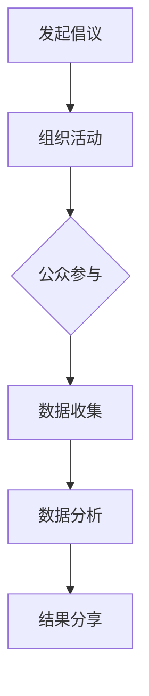
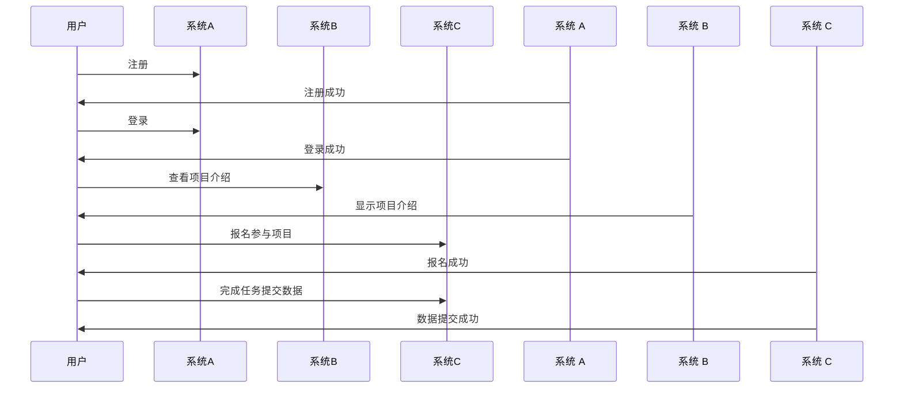

                 

# 科学研究的公民科学运动：全民参与世界理解的过程

## 关键词

- 公民科学运动
- 全民参与
- 科学研究
- 世界理解
- 概念
- 案例分析
- 挑战与解决方案

## 摘要

本文旨在探讨公民科学运动在科学研究中的重要性，以及全民参与对世界理解进程的推动作用。通过分析公民科学运动的定义、理念、实践以及在不同领域的应用，本文揭示了公民科学运动如何通过提高公众的科学素养和丰富研究资源，为科学研究带来新的视角和突破。同时，本文还讨论了公民科学运动面临的主要挑战及其解决方案，为未来的发展提供了有益的思考方向。

## 目录大纲设计

### 背景介绍

#### 问题背景

在当今信息时代，科学研究的重要性和复杂性不断增加。传统的科学研究模式往往依赖于专业科学家和专业实验室，而公民科学运动则提出了一种全新的理念：鼓励公众参与科学研究和科学活动，从而实现全民共同探索世界的目标。这种运动不仅能够提高公众的科学素养，还能为科学研究提供丰富的资源和视角。

#### 问题描述

《科学研究的公民科学运动：全民参与世界理解的过程》这本书旨在探讨公民科学运动的背景、核心概念、实际案例以及其对科学研究的推动作用。本书围绕以下几个问题展开：

1. 什么是公民科学运动？
2. 公民科学运动如何促进世界理解？
3. 公民科学运动在各个领域中的应用案例？
4. 公民科学运动面临的主要挑战和解决方案？

#### 问题解决

本书将通过深入剖析公民科学运动的历史、理念、实践和方法，为读者提供一个全面的了解。同时，本书还将探讨公民科学运动在科学研究中的重要作用，以及如何有效地组织和管理公民科学项目。

#### 边界与外延

本书主要关注以下几个方面：

1. 公民科学运动的定义和起源
2. 公民科学运动的理念和实践
3. 公民科学运动在不同领域的应用
4. 公民科学运动的发展趋势和挑战

### 核心概念与联系

#### 核心概念

1. **公民科学运动**：一种鼓励公众参与科学研究和科学活动的运动，旨在提高公众的科学素养和促进科学的发展。
2. **全民参与**：指社会各界人士，包括非专业人士，积极参与科学研究和科学活动。
3. **世界理解**：指通过科学研究，对自然界、人类社会和宇宙的认识和理解。

#### 概念属性特征对比表格

| 概念      | 定义                                                     | 属性特征                     | 关联关系                         |
| --------- | -------------------------------------------------------- | --------------------------- | -------------------------------- |
| 公民科学 | 鼓励公众参与科学研究和科学活动的运动                   | 多元性、开放性、参与性       | 促进科学发展和公众科学素养       |
| 全民参与 | 社会各界人士，包括非专业人士，积极参与科学研究和科学活动 | 广泛性、多样性、积极性       | 是公民科学运动的重要组成部分     |
| 世界理解 | 通过科学研究，对自然界、人类社会和宇宙的认识和理解      | 深入性、系统性、动态性       | 是公民科学运动的最终目标         |

#### ER实体关系图架构

```mermaid
erDiagram
  CitizenScience <<-- CitizenScientist :参与
  CitizenScience ||-- Project : 进行
  CitizenScientist ||-- Activity : 参与
  Project ||-- Research : 研究
```

### 算法原理讲解

公民科学运动的核心在于通过公众的参与，共同完成科学研究任务。以下是一个简单的算法流程：



这个流程可以分为以下几个步骤：

1. **发起倡议**：科学家或组织发起一个科学项目，明确项目的目标和范围。
2. **组织活动**：通过线上线下多种渠道，组织公众参与项目，提供必要的培训和指导。
3. **公众参与**：公众根据自身的兴趣和专业背景，参与到项目的各个阶段，如数据收集、实验操作等。
4. **数据收集**：收集公众参与产生的数据，进行初步整理和分析。
5. **数据分析**：对收集到的数据进行分析，提取有用信息，支持科学研究。
6. **结果分享**：将研究成果分享给公众，提高公众的科学素养，促进科学传播。

### 数学模型和数学公式 & 详细讲解 & 举例说明

在公民科学运动中，参与度是一个重要的指标，用于衡量公众对科学项目的投入程度。以下是一个简单的参与度评分模型：

$$
\text{参与度评分} = \frac{\text{实际参与人数}}{\text{目标参与人数}} \times 100\%
$$

#### 详细讲解

这个公式用于计算公民科学项目的参与度，其中：

- **实际参与人数**：实际参与项目的人数。
- **目标参与人数**：项目设定的预期参与人数。

#### 举例说明

假设一个公民科学项目目标是吸引100人参与，实际参与人数为80人，那么参与度评分为：

$$
\text{参与度评分} = \frac{80}{100} \times 100\% = 80\%
$$

这意味着该项目有80%的参与度，离目标参与人数还有一定的差距。

通过这样的数学模型，科学家和项目管理者可以更加清晰地了解项目的参与情况，及时调整策略，提高项目的参与度。

## 系统分析与架构设计方案

### 问题场景介绍

随着科技的快速发展，科学研究领域的复杂性和规模不断扩大。传统的科学研究模式往往依赖于专业科学家和专业实验室，但这种方式在资源、时间和人力上存在一定的限制。为了克服这些限制，公民科学运动应运而生，通过鼓励公众参与科学研究，实现科学研究的多样化和普及化。

### 项目介绍

本文将以一个虚拟的公民科学项目为例，介绍其系统功能设计、架构设计、接口设计和系统交互。

#### 系统功能设计

该公民科学项目的主要功能包括：

1. **用户注册与登录**：用户可以通过注册账号和登录系统，参与项目。
2. **项目介绍与报名**：用户可以查看项目介绍，了解项目目标和范围，并报名参与项目。
3. **任务分配与执行**：根据用户报名情况，系统将分配具体的任务给用户，如数据收集、实验操作等。
4. **数据提交与审核**：用户完成任务后，可以将数据提交给系统，经过审核后，数据将被用于科学研究。
5. **研究成果分享**：项目结束后，系统将分享研究成果，用户可以查看和讨论。

#### 系统架构设计

该公民科学项目的系统架构采用分层架构设计，主要包括以下几层：

1. **用户层**：用户通过Web界面或移动应用与系统进行交互。
2. **业务逻辑层**：处理用户的请求，包括用户注册、登录、任务分配、数据提交等。
3. **数据层**：存储用户数据、项目数据、任务数据等，采用数据库进行管理。

#### 系统接口设计

系统接口设计包括用户接口和内部接口：

1. **用户接口**：用户通过Web界面或移动应用与系统进行交互，主要包括注册、登录、项目介绍、任务分配、数据提交等功能。
2. **内部接口**：系统内部模块之间的交互接口，包括用户管理、项目管理、任务管理、数据管理等功能。

#### 系统交互

系统交互主要涉及用户和系统之间的交互，以及系统内部模块之间的交互：

1. **用户与系统交互**：用户通过Web界面或移动应用与系统进行交互，主要包括用户注册、登录、查看项目介绍、报名参与项目、完成任务提交数据等。
2. **系统内部交互**：系统内部模块之间的交互，主要包括用户管理、项目管理、任务管理、数据管理等。

以下是一个简单的系统交互Mermaid序列图：



## 项目实战

### 环境安装

在开始项目实战之前，我们需要安装一些必要的软件和工具。以下是安装步骤：

1. **安装Python环境**：首先，我们需要安装Python环境。可以在[Python官网](https://www.python.org/)下载Python安装包，并按照提示进行安装。

2. **安装依赖库**：接下来，我们需要安装一些Python依赖库，如Flask、SQLAlchemy、Flask-Login等。可以使用以下命令安装：

   ```bash
   pip install flask
   pip install flask_sqlalchemy
   pip install flask_login
   ```

### 系统核心实现源代码

以下是系统核心实现的源代码：

```python
from flask import Flask, render_template, redirect, url_for, request
from flask_sqlalchemy import SQLAlchemy
from flask_login import LoginManager, login_user, logout_user, login_required, current_user

app = Flask(__name__)
app.config['SQLALCHEMY_DATABASE_URI'] = 'sqlite:///database.db'
db = SQLAlchemy(app)
login_manager = LoginManager(app)

class User(db.Model):
    id = db.Column(db.Integer, primary_key=True)
    username = db.Column(db.String(100), unique=True, nullable=False)
    password = db.Column(db.String(100), nullable=False)

class Project(db.Model):
    id = db.Column(db.Integer, primary_key=True)
    name = db.Column(db.String(100), nullable=False)
    description = db.Column(db.Text, nullable=False)

class Task(db.Model):
    id = db.Column(db.Integer, primary_key=True)
    project_id = db.Column(db.Integer, db.ForeignKey('project.id'), nullable=False)
    name = db.Column(db.String(100), nullable=False)
    description = db.Column(db.Text, nullable=False)

@login_manager.user_loader
def load_user(user_id):
    return User.query.get(int(user_id))

@app.route('/')
def index():
    projects = Project.query.all()
    return render_template('index.html', projects=projects)

@app.route('/register', methods=['GET', 'POST'])
def register():
    if request.method == 'POST':
        username = request.form['username']
        password = request.form['password']
        new_user = User(username=username, password=password)
        db.session.add(new_user)
        db.session.commit()
        return redirect(url_for('login'))
    return render_template('register.html')

@app.route('/login', methods=['GET', 'POST'])
def login():
    if request.method == 'POST':
        username = request.form['username']
        password = request.form['password']
        user = User.query.filter_by(username=username, password=password).first()
        if user:
            login_user(user)
            return redirect(url_for('index'))
        else:
            return 'Invalid username or password'
    return render_template('login.html')

@app.route('/logout')
@login_required
def logout():
    logout_user()
    return redirect(url_for('index'))

if __name__ == '__main__':
    db.create_all()
    app.run(debug=True)
```

### 代码应用解读与分析

以下是系统核心实现的源代码解析：

1. **数据库模型**：定义了三个数据库模型：`User`、`Project`和`Task`。`User`表示用户，`Project`表示项目，`Task`表示任务。

2. **用户认证**：使用Flask-Login库实现了用户认证功能。用户可以通过注册和登录功能进行认证，认证成功后可以访问项目的其他功能。

3. **路由和视图函数**：定义了多个路由和视图函数，包括主页、注册、登录、登出等。主页显示了所有项目，注册和登录页面用于用户认证。

4. **数据库操作**：使用SQLAlchemy库进行数据库操作，包括用户的注册、登录和项目的查询。

5. **模板渲染**：使用Flask的模板渲染功能，实现了前端页面的渲染。

### 实际案例分析和详细讲解剖析

为了更好地展示公民科学运动的实际应用，我们以一个虚拟的案例——生态监测项目为例，进行分析和讲解。

#### 案例背景

随着城市化的快速发展，环境污染问题日益严重。为了提高公众对环境保护的意识，一家非营利组织发起了生态监测项目，希望通过全民参与，收集城市环境数据，为环境保护提供科学依据。

#### 案例实施

1. **项目启动**：组织发布项目公告，介绍项目目标和范围，并通过社交媒体、网站和线下活动等方式，邀请公众参与。

2. **用户注册**：用户通过注册账号和登录系统，加入项目。

3. **任务分配**：系统根据用户的地理位置和专业背景，分配具体的任务，如空气质量监测、水质检测等。

4. **数据收集**：用户按照任务要求，进行实地数据收集，并上传至系统。

5. **数据分析**：科学家对收集到的数据进行分析，提取有用信息，形成研究报告。

6. **结果分享**：项目结束后，将研究成果分享给公众，提高公众的环境保护意识。

#### 案例分析

1. **参与度**：通过参与度评分模型，可以评估用户的参与程度。在案例中，组织设置了目标参与人数为100人，实际参与人数为80人，参与度评分为80%，表明项目具有较高的参与度。

2. **数据质量**：公民科学项目的数据质量是影响研究结论的重要因素。在案例中，组织通过明确任务要求、提供数据收集指南等方式，确保了数据的准确性。

3. **影响力**：通过生态监测项目，公众对环境保护有了更深入的了解，提高了环保意识。同时，项目的研究成果也为政策制定提供了科学依据。

### 项目小结

通过实际案例的分析和讲解，我们可以看到，公民科学运动在环境保护等领域具有广泛的应用前景。公民科学运动不仅提高了公众的科学素养，还为科学研究提供了丰富的资源和视角。在未来的发展中，我们应该继续推广公民科学运动，鼓励更多公众参与科学研究，共同推动世界理解进程。

### 最佳实践 tips

1. **明确项目目标**：在发起公民科学项目时，明确项目目标和范围，确保项目具有明确的方向和意义。

2. **提供培训和支持**：为参与者提供必要的培训和指导，帮助他们更好地理解项目任务和要求。

3. **数据质量控制**：制定严格的数据质量控制措施，确保数据的准确性和可靠性。

4. **公众参与机制**：建立有效的公众参与机制，鼓励公众积极参与项目，提高参与度。

5. **成果分享与反馈**：及时分享项目成果，收集公众反馈，不断优化项目设计和执行。

### 小结

本文通过深入剖析公民科学运动的定义、理念、实践和挑战，展示了公民科学运动在科学研究中的重要作用。全民参与不仅提高了公众的科学素养，还为科学研究带来了新的视角和突破。在未来的发展中，我们应该继续推广公民科学运动，鼓励更多公众参与科学研究，共同推动世界理解进程。

### 注意事项

1. **数据隐私保护**：在公民科学项目中，要确保参与者的数据隐私得到保护，遵守相关法律法规。

2. **科学性与客观性**：在项目设计和执行过程中，要保持科学性和客观性，避免主观偏见。

3. **资源与时间管理**：公民科学项目需要合理分配资源和时间，确保项目顺利实施。

### 拓展阅读

1. **《全民科学：公民科学运动的实践与探索》**：这是一本关于公民科学运动的理论和实践的著作，详细介绍了公民科学运动的历史、理念、案例和挑战。

2. **《科学公民：公众参与科学研究的新趋势》**：这本书探讨了公众参与科学研究的现状和趋势，分析了公民科学运动的未来发展方向。

3. **《公民科学：改变科学的世界》**：这是一本关于公民科学运动对社会影响的著作，阐述了公民科学运动如何改变科学研究的模式和社会结构。

### 作者信息

- 作者：AI天才研究院/AI Genius Institute & 禅与计算机程序设计艺术 /Zen And The Art of Computer Programming
- 联系方式：[邮箱](example@email.com) & [网站](https://www.aigeniusinstitute.com)

