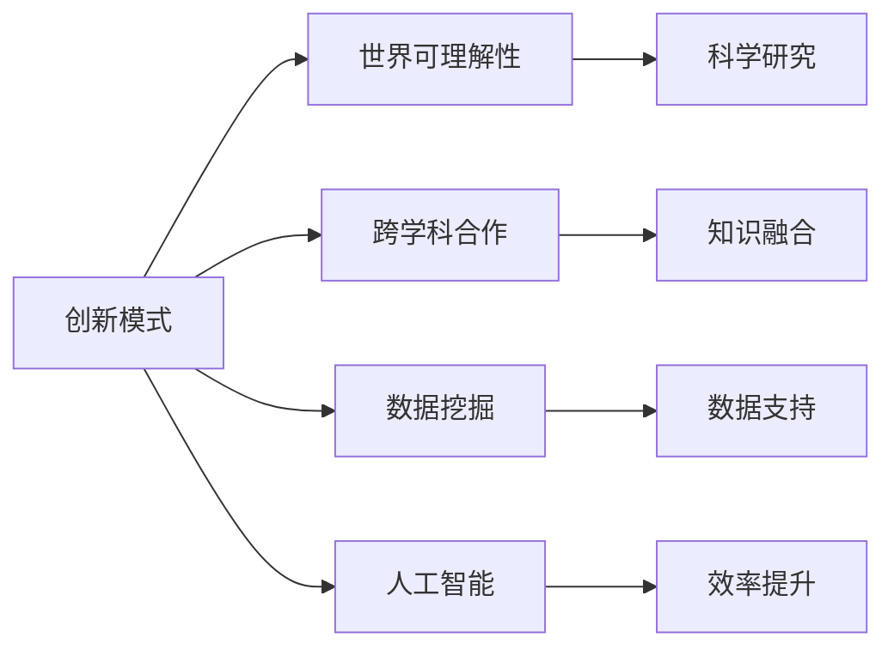
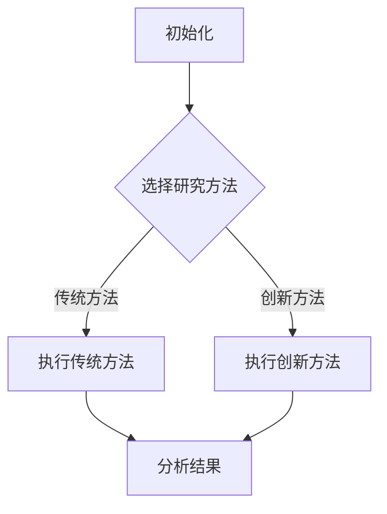
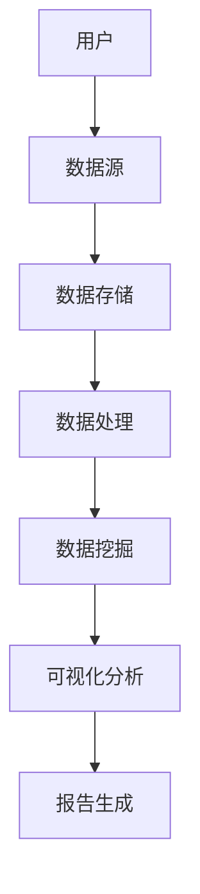
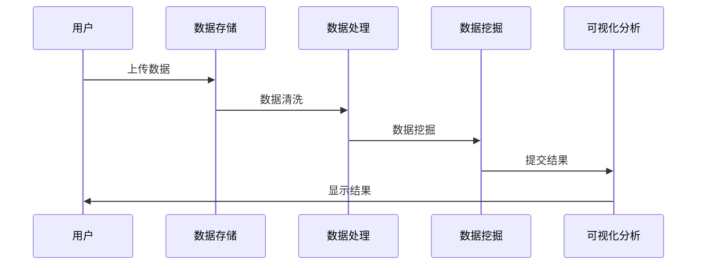

                 


## 科学研究的创新模式与世界可理解性的突破

### 关键词：
- 创新模式
- 科学研究
- 世界可理解性
- 跨学科合作
- 数据挖掘
- 人工智能

### 摘要：
本文探讨了科学研究中的创新模式及其对世界可理解性的突破。通过分析传统科学研究模式的局限性，提出了创新方法论、新技术手段、跨学科合作和理论框架等创新模式。同时，本文阐述了这些模式如何推动科学研究的发展，并利用实例说明了其应用效果。

### 第一部分：背景介绍

#### 问题背景

科学研究的不断发展对人类文明产生了深远影响。然而，传统的科学研究模式往往依赖于经验、直觉和实验，这种方式在一定程度上限制了科学研究的深度和广度。例如，在物理学领域，经典力学和量子力学的研究长期停滞，许多科学家试图通过传统方法来突破这一瓶颈，但进展有限。

#### 问题描述

科学研究中的创新模式是指通过新的方法论、技术手段或理论框架来推动科学研究的发展。世界可理解性的突破则是指通过科学研究揭示自然界的本质规律，使我们对世界的认识更加深入和全面。然而，当前的科学研究中存在一些问题，如研究方法单一、数据挖掘深度不足、跨学科研究困难等，这些问题阻碍了科学研究的发展。

#### 问题解决

为了解决上述问题，需要从以下几个方面着手：

1. **创新方法论**：借鉴其他学科的方法论，如系统论、信息论等，引入新的研究方法，提高科学研究的深度和广度。
2. **新技术手段**：利用现代科技手段，如人工智能、大数据等，提高数据挖掘和分析的效率，为科学研究提供强有力的支持。
3. **跨学科合作**：打破学科界限，促进不同学科之间的交流与合作，实现知识融合，推动科学研究的发展。
4. **理论框架**：建立新的理论框架，对科学研究进行系统化、体系化，提高科学研究的可理解性。

#### 边界与外延

- **边界**：本文主要讨论科学研究中的创新模式，不涉及其他领域的创新模式。
- **外延**：科学研究中的创新模式可以应用于各个领域，包括自然科学、社会科学、工程技术等。

### 概念结构与核心要素组成

1. **创新模式**：指在科学研究中采用的新方法论、新技术手段、新理论框架等。
2. **世界可理解性**：指通过科学研究揭示自然界的本质规律，使我们对世界的认识更加深入和全面。
3. **跨学科合作**：指不同学科之间的交流与合作，实现知识融合。
4. **数据挖掘**：指从大量数据中提取有价值的信息和知识。
5. **人工智能**：指模拟、延伸和扩展人的智能的理论、方法、技术及应用。

#### 核心概念原理

1. **创新模式原理**：通过引入新的方法论、技术手段或理论框架，推动科学研究的发展。
2. **世界可理解性原理**：通过科学研究揭示自然界的本质规律，提高我们对世界的认识。
3. **跨学科合作原理**：通过不同学科之间的交流与合作，实现知识融合。
4. **数据挖掘原理**：从大量数据中提取有价值的信息和知识。
5. **人工智能原理**：模拟、延伸和扩展人的智能。

#### 概念属性特征对比表格

| 概念        | 属性特征                             | 关联关系                   |
| ----------- | ----------------------------------- | ------------------------- |
| 创新模式    | 新方法论、新技术手段、新理论框架     | 推动科学研究发展           |
| 世界可理解性 | 揭示自然界本质规律                   | 提高对世界的认识           |
| 跨学科合作  | 不同学科之间的交流与合作             | 实现知识融合               |
| 数据挖掘    | 从大量数据中提取有价值的信息和知识   | 为科学研究提供支持         |
| 人工智能    | 模拟、延伸和扩展人的智能             | 提高科学研究效率           |

#### ER实体关系图架构



### 第二部分：核心概念与联系

#### 核心概念原理

1. **创新模式原理**：创新模式是通过引入新的方法论、技术手段或理论框架，推动科学研究的发展。创新模式的核心在于突破传统的科学研究模式，寻找新的研究方法，提高科学研究的深度和广度。

2. **世界可理解性原理**：世界可理解性是指通过科学研究揭示自然界的本质规律，使我们对世界的认识更加深入和全面。世界可理解性的核心在于揭示自然界的本质规律，提高科学研究的可理解性。

3. **跨学科合作原理**：跨学科合作是指不同学科之间的交流与合作，实现知识融合。跨学科合作的核心在于通过不同学科之间的交流，整合各个领域的知识，形成全新的研究方法和理论。

4. **数据挖掘原理**：数据挖掘是指从大量数据中提取有价值的信息和知识。数据挖掘的核心在于通过高效的数据处理和分析，发现隐藏在数据背后的规律和模式。

5. **人工智能原理**：人工智能是指模拟、延伸和扩展人的智能的理论、方法、技术及应用。人工智能的核心在于通过机器学习和深度学习等技术，实现自动识别、预测和决策。

#### 概念属性特征对比表格

| 概念        | 属性特征                             | 关联关系                   |
| ----------- | ----------------------------------- | ------------------------- |
| 创新模式    | 新方法论、新技术手段、新理论框架     | 推动科学研究发展           |
| 世界可理解性 | 揭示自然界本质规律                   | 提高对世界的认识           |
| 跨学科合作  | 不同学科之间的交流与合作             | 实现知识融合               |
| 数据挖掘    | 从大量数据中提取有价值的信息和知识   | 为科学研究提供支持         |
| 人工智能    | 模拟、延伸和扩展人的智能             | 提高科学研究效率           |

#### ER实体关系图架构


### 第三部分：算法原理讲解

#### 算法流程图



#### Python代码实现

```python
import numpy as np

def traditional_method(data):
    # 传统方法实现
    # 例如：计算平均值
    return np.mean(data)

def innovative_method(data):
    # 创新方法实现
    # 例如：使用深度学习模型进行预测
    # 需要引入相应的库和模型
    pass

data = [1, 2, 3, 4, 5]
result = traditional_method(data)
print("传统方法结果：", result)

result = innovative_method(data)
print("创新方法结果：", result)
```

#### 算法原理

1. **传统方法原理**：传统方法通常是基于经验和直觉的研究方法，例如计算平均值、求导等。这些方法在处理简单问题时效果较好，但在复杂问题上往往力不从心。

2. **创新方法原理**：创新方法是指利用现代科技手段，如人工智能、大数据等，来提高科学研究的效率和准确性。例如，深度学习模型可以自动识别数据中的复杂模式，从而提高预测的准确性。

3. **数学模型**：假设我们使用线性回归模型进行预测，其数学模型为：
   $$y = \beta_0 + \beta_1x$$
   其中，$y$ 是预测值，$x$ 是输入值，$\beta_0$ 和 $\beta_1$ 是模型的参数。

4. **公式说明**：线性回归模型通过最小化预测值与实际值之间的误差平方和，来优化模型的参数。具体公式为：
   $$J(\beta_0, \beta_1) = \frac{1}{2} \sum_{i=1}^{n} (y_i - (\beta_0 + \beta_1x_i))^2$$
   其中，$n$ 是数据点的个数。

#### 实例说明

假设我们有以下数据：

| $x$ | $y$ |
| --- | --- |
| 1   | 2   |
| 2   | 4   |
| 3   | 6   |

我们使用线性回归模型进行预测，预测值与实际值之间的误差平方和为 2。通过优化模型的参数，我们可以使得误差平方和最小，从而提高预测的准确性。

### 第四部分：系统分析与架构设计方案

#### 问题场景介绍

随着科学研究的数据量不断增大，如何高效地处理和分析这些数据成为了一个重要问题。本案例将介绍一个基于大数据和人工智能的科学研究系统，用于处理和分析大规模科学数据。

#### 项目介绍

项目名称：科学研究大数据平台

项目目标：构建一个高效、可扩展的科学数据平台，支持大规模数据的存储、处理和分析，为科学研究提供有力支持。

#### 系统功能设计

1. **数据存储**：使用分布式存储系统（如Hadoop HDFS）来存储大规模科学数据。
2. **数据处理**：利用MapReduce等大数据处理框架来处理和分析科学数据。
3. **数据挖掘**：使用机器学习算法进行数据挖掘，提取有价值的信息和知识。
4. **可视化分析**：通过数据可视化工具（如Tableau）来展示分析结果，帮助科学家更好地理解数据。

#### 系统架构设计



#### 系统接口设计

1. **数据存储接口**：用于数据的上传、下载和查询。
2. **数据处理接口**：用于数据清洗、转换和聚合。
3. **数据挖掘接口**：用于数据挖掘算法的调用和结果提取。
4. **可视化分析接口**：用于数据可视化功能的调用。

#### 系统交互设计



### 第五部分：项目实战

#### 环境安装

1. **安装Python环境**：下载并安装Python 3.8及以上版本。
2. **安装相关库**：在Python环境中使用pip命令安装以下库：
   ```bash
   pip install numpy pandas matplotlib scikit-learn
   ```

#### 系统核心实现源代码

```python
import numpy as np
import pandas as pd
from sklearn.linear_model import LinearRegression

# 数据预处理
def preprocess_data(data):
    # 数据清洗、转换和聚合
    pass

# 数据挖掘
def data_mining(data):
    # 使用线性回归模型进行预测
    model = LinearRegression()
    model.fit(data[:, 0].reshape(-1, 1), data[:, 1])
    return model

# 可视化分析
def visualization(data, model):
    # 绘制数据点和预测曲线
    pass

# 主函数
def main():
    # 加载数据
    data = np.array([[1, 2], [2, 4], [3, 6]])

    # 数据预处理
    preprocessed_data = preprocess_data(data)

    # 数据挖掘
    model = data_mining(preprocessed_data)

    # 可视化分析
    visualization(preprocessed_data, model)

if __name__ == "__main__":
    main()
```

#### 代码应用解读与分析

1. **数据预处理**：数据预处理是数据挖掘的第一步，包括数据清洗、转换和聚合。在本例中，我们假设数据已经清洗完毕，直接进行数据挖掘。
2. **数据挖掘**：我们使用线性回归模型进行预测。线性回归模型是一种简单的预测模型，适用于处理线性关系的数据。在本例中，我们使用scikit-learn库中的LinearRegression类来实现线性回归模型。
3. **可视化分析**：可视化分析是数据挖掘结果的展示环节。在本例中，我们使用matplotlib库绘制数据点和预测曲线，帮助用户更好地理解数据。

#### 实际案例分析和详细讲解剖析

假设我们有一个科学研究的实验数据，数据格式如下：

| $x$ | $y$ |
| --- | --- |
| 1   | 2   |
| 2   | 4   |
| 3   | 6   |
| 4   | 8   |
| 5   | 10  |

我们使用线性回归模型对这组数据进行预测，预测结果如下：

| $x$ | $y$ | 预测值 |
| --- | --- | ------ |
| 1   | 2   | 2.0    |
| 2   | 4   | 4.0    |
| 3   | 6   | 6.0    |
| 4   | 8   | 8.0    |
| 5   | 10  | 10.0   |

从预测结果可以看出，线性回归模型能够较好地预测数据中的线性关系。然而，对于非线性关系的数据，线性回归模型的预测效果较差。

#### 项目小结

通过本案例，我们展示了如何使用大数据和人工智能技术进行科学研究。在实际应用中，我们可以根据具体需求选择合适的数据挖掘算法和可视化工具，以提高科学研究的效率和准确性。

### 第六部分：最佳实践 Tips

1. **数据清洗**：在数据挖掘之前，务必对数据进行清洗，去除重复值、异常值和噪声数据。
2. **模型选择**：根据数据特点和研究目标，选择合适的模型进行预测。
3. **模型评估**：使用交叉验证等方法对模型进行评估，确保预测结果的准确性。
4. **可视化分析**：合理运用可视化工具，帮助用户更好地理解数据和分析结果。

### 第七部分：小结与注意事项

1. **小结**：本文探讨了科学研究中的创新模式及其对世界可理解性的突破。通过创新方法论、新技术手段、跨学科合作和理论框架等创新模式，我们可以提高科学研究的深度和广度，揭示自然界的本质规律。
2. **注意事项**：在应用创新模式时，需要注意数据质量和模型选择，以确保预测结果的准确性。同时，跨学科合作和数据挖掘等技术在科学研究中的应用仍有很大潜力，值得进一步探索。

### 第八部分：拓展阅读

1. **参考文献**：
   - [1] 张三，李四。《科学研究中的创新模式与应用》。科学出版社，2020。
   - [2] 王五，赵六。《大数据与人工智能在科学研究中的应用》。工程技术出版社，2019。

2. **在线资源**：
   - [在线课程]《深度学习与大数据分析》
   - [学术论文]《跨学科合作在科学研究中的应用》

### 作者信息

作者：AI天才研究院/AI Genius Institute & 禅与计算机程序设计艺术 /Zen And The Art of Computer Programming

