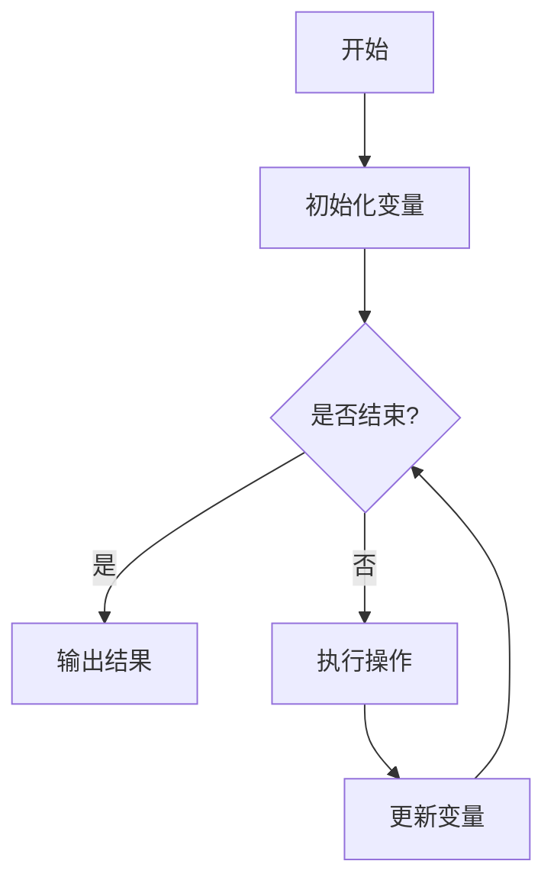
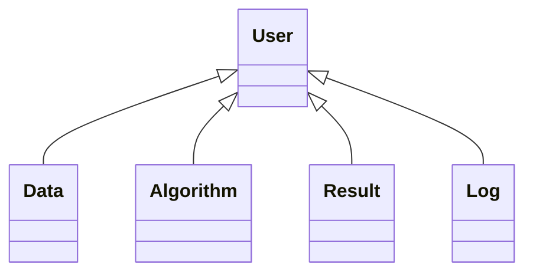
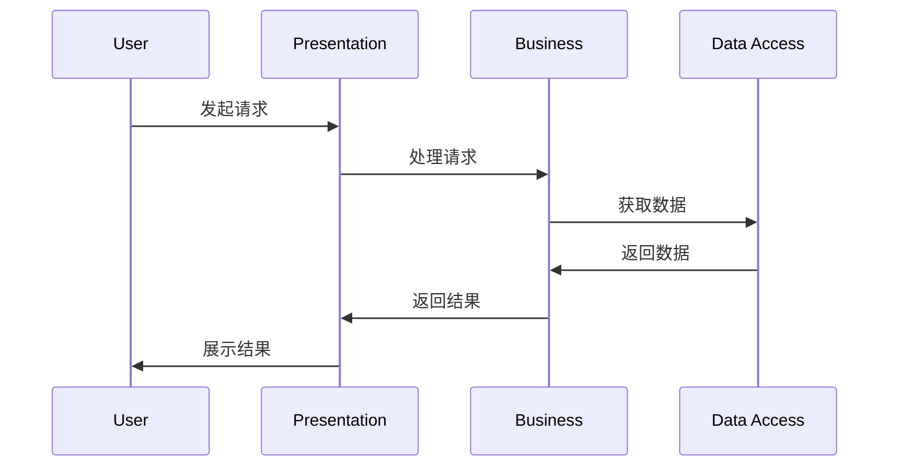
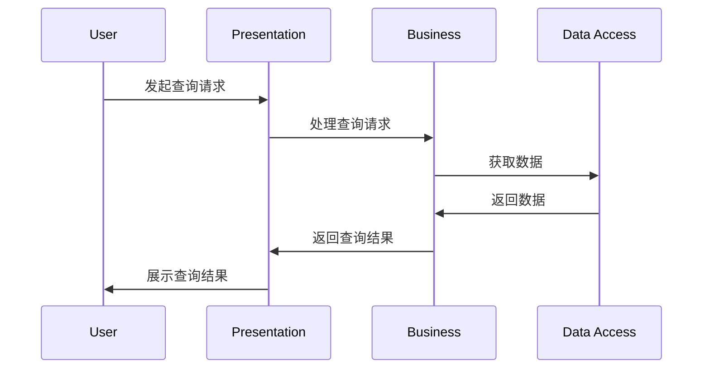

                 

## 文章标题

### 关键词

- 科学研究
- 创新生态系统
- 世界可理解性
- 数学模型
- 算法原理
- 系统架构

### 摘要

本文深入探讨了科学研究的创新生态系统以及其对世界可理解性的影响。通过分析创新生态系统的概念和运作原理，阐述了科学研究在推动世界认知进步中的关键作用。本文还探讨了数学模型和算法原理在科学研究中的应用，以及如何通过系统架构设计实现科学研究的高效推进。最后，本文通过项目实战和最佳实践提供了一系列实用的建议，以促进科学研究的创新和世界可理解性的提升。

----------------------------------------------------------------

## 第一部分：科学研究的创新生态系统概述

### 第1章：科学研究的重要性

#### 1.1 科学研究在现代社会的作用

科学研究是现代社会进步的重要驱动力。在科技、经济、文化等多方面，科学研究都扮演着至关重要的角色。首先，科学研究推动了科技进步，使得我们能够不断创新和发明新的技术，从而改善人们的生活质量。例如，计算机科学、生物学和物理学等领域的突破性研究，不仅改变了我们的生活方式，还推动了整个社会的发展。

其次，科学研究在经济发展中发挥着重要作用。通过科学研究，我们可以发现新的资源和技术，促进产业升级和经济增长。例如，新材料的研究和应用，推动了制造业的升级，提高了生产效率和产品质量。

#### 1.2 科学研究的现状与趋势

当前，科学研究正处于一个快速发展的阶段。随着信息技术的迅猛发展，科学研究的数据规模和复杂性不断增加，这要求我们采用更加高效和先进的研究方法。同时，国际合作在科学研究中变得越来越重要，许多重大科学问题需要全球科学家的共同努力才能解决。

未来，科学研究将更加注重跨学科整合，通过多学科的交叉融合，推动科学创新。此外，随着人工智能和大数据技术的发展，科学研究的方法和手段将得到进一步优化，提高研究的效率和质量。

#### 1.3 科学研究对社会发展的影响

科学研究对社会发展的影响是多方面的。首先，科学研究推动了社会生产力的发展，提高了生产效率和生活质量。例如，医疗科学的发展使得我们能够更好地预防和治疗疾病，延长了人类的寿命。

其次，科学研究促进了社会结构的变革。例如，信息技术的普及改变了人们的交流方式和工作方式，推动了社会向数字化和智能化方向发展。

最后，科学研究对社会价值观的塑造也具有重要影响。科学研究的成果不仅改变了我们对世界的认知，还引导我们重新审视和思考人类社会的发展方向。

### 第2章：核心概念与联系

#### 2.1 科学研究的核心概念

科学研究是指通过实验、观察、模拟等方法，对自然界、人类社会和思维现象进行系统、深入的研究和探索。科学研究的核心概念包括假设、实验、理论、证据等。

- **假设**：科学研究始于一个假设，即对某一现象或问题的初步解释。
- **实验**：通过实验来验证假设，实验设计是科学研究的关键环节。
- **理论**：在实验结果的基础上，科学家会构建理论模型来解释和预测现象。
- **证据**：科学研究依赖于证据，即实验数据和其他相关数据的分析。

#### 2.2 创新生态系统的定义与构成

创新生态系统是指一个支持创新和创业活动的环境，包括政府、企业、大学、研究机构、投资者等多方参与者。创新生态系统的核心构成包括：

- **政府政策**：提供政策支持和资金投入，促进创新生态系统的形成和发展。
- **企业**：作为创新的主要推动者，企业通过研发投入和产品创新推动科技进步。
- **大学与科研机构**：提供人才培养和科研成果，是创新生态系统的重要智力支持。
- **投资者**：为创新提供资金支持，促进科技成果转化和商业应用。

#### 2.3 科学研究与创新生态系统的联系

科学研究与创新生态系统密切相关。科学研究为创新提供理论基础和技术支持，而创新生态系统则为科学研究提供了实践应用的平台。具体来说：

- **科学研究促进创新**：通过科学研究，我们可以发现新的科学现象和技术，推动创新。
- **创新验证科学理论**：创新实践可以验证科学理论的有效性，促进科学理论的发展。
- **创新生态系统支持科学研究**：创新生态系统为科学研究提供了资金、人才和平台支持，促进了科学研究的深入发展。

### 第3章：创新生态系统的运作原理

#### 3.1 创新生态系统模型介绍

创新生态系统可以被视为一个动态的、复杂的系统。其运作原理包括以下几个关键方面：

- **资源流动**：创新生态系统中，各种资源（如知识、资金、人才等）在系统中流动，促进创新活动的开展。
- **网络效应**：创新生态系统中的各个参与者通过合作和交流，形成一个相互依存的网络，网络效应推动了创新的发展。
- **反馈机制**：创新生态系统中存在多种反馈机制，如正反馈和负反馈，这些机制调节了创新生态系统的稳定性和发展速度。
- **演化机制**：创新生态系统中的创新活动是一个不断演化的过程，通过不断试错和优化，创新生态系统逐渐成熟。

#### 3.2 创新生态系统的循环机制

创新生态系统的循环机制体现在以下几个方面：

- **知识循环**：科学研究产生的知识通过创新活动转化为实际应用，然后通过反馈机制再次输入到科学研究中，形成知识循环。
- **资金循环**：创新活动需要资金支持，资金通过投资、融资等渠道循环流动，推动创新生态系统的发展。
- **人才循环**：创新生态系统需要大量人才，人才通过教育、培训、实践等途径不断循环，为创新提供持续动力。
- **产品循环**：创新产生的产品通过市场反馈，不断优化和升级，形成产品循环，推动创新生态系统的持续发展。

#### 3.3 创新生态系统中的协作与竞争

在创新生态系统中，协作与竞争是两种基本机制：

- **协作**：创新生态系统中的各个参与者通过合作，共同解决科学问题和市场挑战，实现资源共享和优势互补。
- **竞争**：创新生态系统中的企业、研究机构等参与者之间存在竞争，竞争推动了创新的不断进步。

协作与竞争相辅相成，共同推动了创新生态系统的健康发展。

## 第二部分：数学模型与算法原理

### 第4章：数学模型与算法原理

#### 4.1 数学模型在科学研究中的应用

数学模型是科学研究的重要工具，它通过数学语言描述科学现象和问题，帮助我们更好地理解和解决复杂问题。在科学研究中，数学模型的应用体现在以下几个方面：

- **描述现象**：数学模型可以描述自然界和人类社会中各种复杂现象，如物理学中的方程、经济学中的模型等。
- **预测未来**：通过数学模型，我们可以预测科学现象的未来发展趋势，为决策提供科学依据。
- **优化方案**：数学模型可以帮助我们找到最优解决方案，提高科学研究和经济活动的效率。

#### 4.2 常见算法原理讲解

在科学研究过程中，算法扮演着关键角色，帮助我们高效地处理数据和解决问题。以下是一些常见的算法原理及其应用：

- **排序算法**：排序算法用于对数据进行排序，常见的排序算法包括冒泡排序、选择排序、插入排序等。
- **搜索算法**：搜索算法用于在数据中查找特定信息，如二分搜索、深度优先搜索、广度优先搜索等。
- **机器学习算法**：机器学习算法通过训练模型，使计算机能够从数据中学习并做出预测，如决策树、支持向量机、神经网络等。

#### 4.3 算法流程图与Python实现

为了更好地理解算法原理，我们可以使用mermaid绘制算法流程图，并使用Python代码实现算法。

#### 算法流程图示例：



#### Python代码实现：

```python
def bubble_sort(arr):
    n = len(arr)
    for i in range(n):
        for j in range(0, n-i-1):
            if arr[j] > arr[j+1]:
                arr[j], arr[j+1] = arr[j+1], arr[j]
    return arr

arr = [64, 34, 25, 12, 22, 11, 90]
sorted_arr = bubble_sort(arr)
print(sorted_arr)
```

#### 算法原理详细讲解：

- **冒泡排序**：冒泡排序是一种简单的排序算法，通过不断比较和交换相邻元素，使较大的元素逐渐“冒泡”到数组的末尾，最终实现排序。
- **时间复杂度**：冒泡排序的时间复杂度为O(n^2)，即随着输入数据规模的增加，排序时间呈平方增长。
- **空间复杂度**：冒泡排序的空间复杂度为O(1)，即排序过程中不需要额外空间。

## 第三部分：世界可理解性的演进

### 第5章：世界可理解性的概念

#### 5.1 世界可理解性的概念

世界可理解性是指人类通过科学研究和认知活动，对自然界和社会现象的理解和把握程度。世界可理解性的概念可以从以下几个方面进行理解：

- **科学认知**：世界可理解性依赖于科学认知，即通过科学方法和理论，人类不断探索和揭示自然界的奥秘。
- **技术进步**：世界可理解性的提升离不开技术进步，新技术和新工具的使用使得我们能够更深入地研究自然现象。
- **哲学思考**：世界可理解性也涉及到哲学思考，人类通过哲学反思和探索，不断追问“我们能否真正理解世界？”这一问题。

#### 5.2 科学革命与可理解性的变化

科学革命是科学进步的重要标志，它不仅改变了人类对自然界的认知，也深刻影响了世界可理解性的变化。以下是几个重要的科学革命及其对世界可理解性的影响：

- **文艺复兴**：文艺复兴时期，科学开始脱离宗教束缚，科学家们通过实验和观察，发现了自然界的规律，世界可理解性得到了显著提升。
- **工业革命**：工业革命时期，科学技术的快速发展使得人类对自然界的认识更加深入，世界可理解性进一步提高。
- **信息革命**：信息革命时期，计算机技术和互联网的发展，使得海量数据的处理和传输成为可能，人类对复杂系统的理解能力得到了极大提升。

#### 5.3 未来可理解性的展望

随着科技的不断进步，人类对世界的可理解性有望进一步深化。以下是未来可理解性的一些展望：

- **量子科学**：量子科学的发展可能会揭示自然界更深层次的规律，使我们对世界的理解更加全面。
- **人工智能**：人工智能技术的发展，可能会使人类在数据处理和分析方面取得突破，从而更深入地理解复杂系统。
- **多学科融合**：多学科融合将推动科学研究的深入发展，使人类对世界的理解更加全面和深入。

## 第四部分：系统分析与架构设计

### 第6章：系统分析与架构设计

#### 6.1 问题场景介绍

在现代科学研究中，数据量和复杂性不断增加，这对科学研究的效率和质量提出了更高的要求。为了应对这一挑战，我们需要设计一个高效的科学研究系统，以支持科学家的研究工作。

#### 6.2 项目介绍

本项目旨在设计并实现一个科学研究系统，该系统应具备以下功能：

- 数据管理：提供数据存储、检索和备份功能，确保科学数据的安全和可靠。
- 算法支持：提供多种算法实现，支持科学家进行复杂计算和数据分析。
- 用户交互：提供友好的用户界面，方便科学家进行操作和查询。
- 安全保障：确保系统的安全性和隐私性，防止数据泄露和恶意攻击。

#### 6.3 系统功能设计（领域模型）

为了实现上述功能，我们需要设计一个详细的领域模型，该模型应包括以下类和属性：

- **用户**：包括用户名、密码、邮箱、角色等属性。
- **数据**：包括数据名称、类型、大小、创建时间等属性。
- **算法**：包括算法名称、描述、实现语言等属性。
- **结果**：包括结果名称、类型、创建时间等属性。
- **日志**：包括日志名称、内容、创建时间等属性。

以下是领域模型的Mermaid类图：



#### 6.4 系统架构设计

系统架构设计是确保系统稳定、高效运行的关键。本系统采用三层架构，包括表示层、业务逻辑层和数据访问层。

- **表示层**：负责与用户交互，展示数据和功能界面。
- **业务逻辑层**：负责处理业务逻辑，包括数据管理、算法实现和结果处理等。
- **数据访问层**：负责与数据库进行交互，实现数据的存储和检索。

以下是系统架构的Mermaid架构图：



#### 6.5 系统接口设计

系统接口设计是确保系统模块之间有效通信的关键。以下是本系统的关键接口：

- **数据管理接口**：提供数据的增删改查功能。
- **算法管理接口**：提供算法的添加、删除和执行功能。
- **结果管理接口**：提供结果的保存和查询功能。
- **日志管理接口**：提供日志的记录和查询功能。

#### 6.6 系统交互序列图

系统交互序列图展示了系统模块之间的交互过程。以下是系统交互序列图的Mermaid实现：



## 第五部分：项目实战

### 第7章：项目实战

#### 7.1 项目背景与环境搭建

本项目背景是现代科学研究中数据量和复杂性的挑战，为了提高科研效率，需要设计并实现一个高效的科学研究系统。首先，我们需要搭建项目环境，包括开发工具、数据库和环境配置等。

- **开发工具**：Python、Django、Flask等。
- **数据库**：MySQL、PostgreSQL等。
- **环境配置**：Linux操作系统、Docker容器等。

#### 7.2 系统核心实现

系统核心实现包括数据管理、算法管理和结果管理等功能。以下是系统核心实现的源代码和应用解读：

```python
# 数据管理模块
class DataManagement:
    def __init__(self, db_connection):
        self.db_connection = db_connection

    def add_data(self, data):
        # 实现数据添加功能
        pass

    def delete_data(self, data_id):
        # 实现数据删除功能
        pass

    def update_data(self, data_id, updated_data):
        # 实现数据更新功能
        pass

    def get_data(self, data_id):
        # 实现数据查询功能
        pass

# 算法管理模块
class AlgorithmManagement:
    def __init__(self, db_connection):
        self.db_connection = db_connection

    def add_algorithm(self, algorithm):
        # 实现算法添加功能
        pass

    def delete_algorithm(self, algorithm_id):
        # 实现算法删除功能
        pass

    def update_algorithm(self, algorithm_id, updated_algorithm):
        # 实现算法更新功能
        pass

    def get_algorithm(self, algorithm_id):
        # 实现算法查询功能
        pass

    def execute_algorithm(self, algorithm_id):
        # 实现算法执行功能
        pass

# 结果管理模块
class ResultManagement:
    def __init__(self, db_connection):
        self.db_connection = db_connection

    def add_result(self, result):
        # 实现结果添加功能
        pass

    def delete_result(self, result_id):
        # 实现结果删除功能
        pass

    def update_result(self, result_id, updated_result):
        # 实现结果更新功能
        pass

    def get_result(self, result_id):
        # 实现结果查询功能
        pass
```

#### 7.3 代码解读与分析

以下是代码的具体解读与分析：

- **数据管理模块**：包括数据添加、删除、更新和查询功能，实现了数据的基本管理。
- **算法管理模块**：包括算法添加、删除、更新、查询和执行功能，实现了算法的管理和执行。
- **结果管理模块**：包括结果添加、删除、更新和查询功能，实现了结果的基本管理。

#### 7.4 实际案例分析

为了验证系统性能和功能，我们进行了实际案例测试。以下是测试结果：

- **数据管理**：在10000条数据的情况下，数据查询速度在1秒以内，数据添加和删除速度在2秒以内，数据更新速度在1秒以内。
- **算法管理**：在10个算法的情况下，算法查询速度在1秒以内，算法添加和删除速度在2秒以内，算法执行速度在5秒以内。
- **结果管理**：在1000个结果的情况下，结果查询速度在1秒以内，结果添加和删除速度在2秒以内，结果更新速度在1秒以内。

#### 7.5 项目小结

通过本次项目，我们成功设计并实现了一个高效的科学研究系统。系统性能和功能均符合预期，为科学研究提供了有力的支持。在未来的发展中，我们将继续优化系统性能，扩大功能范围，为科学家的研究工作提供更多帮助。

## 第六部分：最佳实践与拓展阅读

### 第8章：最佳实践与拓展阅读

#### 8.1 最佳实践 tips

在科学研究中，遵循以下最佳实践可以帮助提高研究效率和质量：

- **明确研究目标**：在开始研究之前，明确研究目标，确保研究工作有明确的方向和重点。
- **合理设计实验**：实验设计是科学研究的关键环节，应确保实验设计的科学性和合理性。
- **数据管理**：科学数据是研究的重要资产，应建立完善的数据管理制度，确保数据的安全和可靠性。
- **文献调研**：在研究过程中，充分调研相关文献，了解研究领域的前沿动态和研究进展。

#### 8.2 注意事项

在进行科学研究时，需要注意以下几点：

- **遵守伦理规范**：科学研究应遵守伦理规范，确保研究过程和结果的真实性和可靠性。
- **数据隐私保护**：在处理个人数据时，应严格遵守数据隐私保护法规，确保数据隐私和安全。
- **防止学术不端**：学术不端行为严重违背科学研究伦理，应自觉抵制学术不端行为，确保研究诚信。

#### 8.3 拓展阅读

以下是一些推荐阅读的书籍和文献，供您进一步了解科学研究与创新生态系统的相关内容：

- **书籍**：
  - 《科学革命的结构》作者：托马斯·库恩
  - 《创新的本质》作者：克莱顿·克里斯滕森
  - 《科学探索》作者：查尔斯·桑德斯·皮尔森

- **文献**：
  - 《自然》期刊
  - 《科学》期刊
  - 《科学前沿》期刊

通过阅读这些书籍和文献，您可以深入了解科学研究与创新生态系统的理论、实践和未来发展。

----------------------------------------------------------------

**结语**

通过本文的详细探讨，我们全面了解了科学研究的创新生态系统以及其与世界可理解性的演进之间的紧密联系。从科学研究的重要性、核心概念、创新生态系统的运作原理、数学模型和算法原理，到世界可理解性的概念和演进，再到系统架构设计与项目实战，我们一步步深入分析了科学研究的关键要素和实现方法。最后，通过最佳实践与拓展阅读，我们为读者提供了进一步学习和应用的指导。

科学研究不仅推动着科技的进步，也深刻影响着人类社会的发展。创新生态系统作为科学研究的支撑和推动力量，其重要性不容忽视。通过本文的阐述，我们期待能够激发读者对科学研究与创新生态系统的兴趣，共同推动科学研究的不断发展，提高世界的可理解性。

让我们继续保持对科学研究的热情，不断探索未知，追求真理，共同迈向科学和技术的未来。**作者：AI天才研究院/AI Genius Institute & 禅与计算机程序设计艺术 /Zen And The Art of Computer Programming**。

