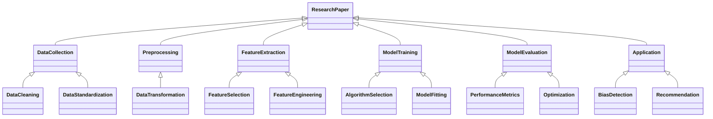
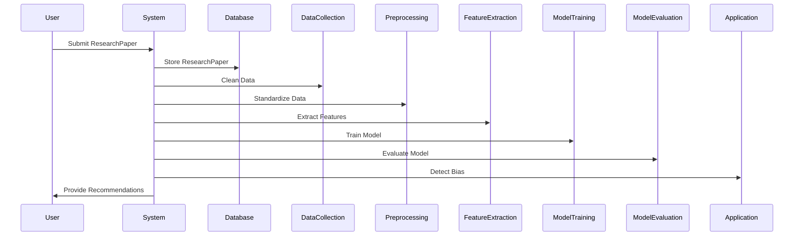
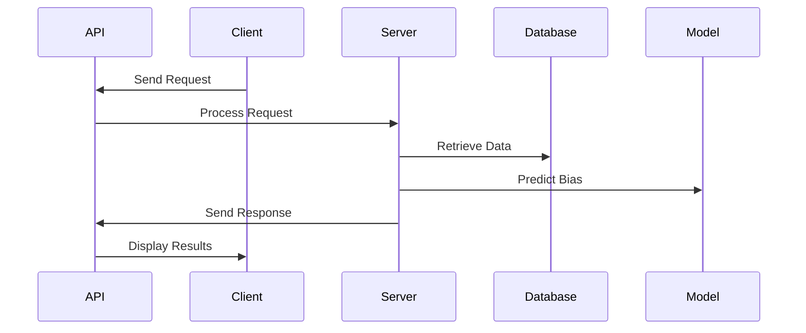

                 

# 科学研究的性别视角：多元化对世界理解的重要性

## 关键词
- **性别视角**
- **科学研究**
- **多元化**
- **性别偏见**
- **性别差异**
- **算法分析**
- **数据科学**

## 摘要
在科学研究中，性别视角的重要性日益凸显。本文将探讨如何从性别视角分析科学研究，识别和解决性别偏见。通过多元化视角，我们能够更好地理解世界，推动科学进步和性别平等。

## 第一部分：背景介绍

### 核心概念

**性别视角**：性别视角是指从不同性别角度分析和理解社会、文化和科学现象的方法。这包括对性别差异、性别角色、性别歧视以及性别如何影响人们的生活和研究的全面考察。

**科学研究**：科学研究是指通过系统的方法和严格的程序来发现新知识、验证假设、解释现象和推动科学进步的过程。

**多元化**：多元化是指在社会中接纳和尊重各种不同的文化、信仰、性别、种族、年龄和背景，从而形成一个包容和多样化的社会。

### 问题背景

在科学研究中，性别视角的重要性日益凸显。尽管科学研究在形式和内容上力求客观和公正，但研究方法和结论往往受到研究者性别和背景的影响。例如，男性研究者可能更倾向于关注男性健康问题，而忽略女性特有的健康需求。同样，性别刻板印象也可能导致科学研究中对某些性别群体的研究不足。

### 问题描述

研究中的性别盲点不仅影响研究结果的可信度，也可能导致科学知识的偏见和不平等。例如，在医学研究中，性别差异可能被忽视，导致女性在临床试验中的参与度低，进而影响药物的疗效和安全性评估。此外，科学研究中的性别偏见也可能影响研究资源的分配，使得某些性别群体的研究受到限制。

### 问题解决

为了解决这些问题，科学界需要采取一系列措施，包括：

- **性别意识教育**：在科学教育中增加性别视角的教学内容，培养研究者的性别意识。
- **多元化研究团队**：鼓励不同性别和背景的研究人员合作，以带来多样化的视角和观点。
- **性别平衡的评审过程**：确保科学论文和研究的评审过程中考虑性别视角，避免性别偏见。
- **性别差异研究**：鼓励进行性别差异的研究，以揭示性别如何影响科学现象和结果。

### 边界与外延

性别视角不仅关注性别差异，还涉及性别平等、性别歧视以及性别在社会和文化中的角色。这些概念相互关联，共同构成了对性别视角的全面理解。

### 概念结构与核心要素组成

- **核心概念**：性别视角、科学研究、多元化
- **要素**：
  - **性别视角**：社会、文化和科学研究中的性别差异和角色。
  - **科学研究**：通过实验、观察和理论分析来探索自然和社会现象。
  - **多元化**：尊重和接纳不同性别、文化、种族和背景。

## 第二部分：核心概念与联系

### 核心概念原理

**性别视角**：性别视角是理解和分析社会现象时，考虑到性别对人们行为、态度和结果的影响。

**多元化**：多元化是指在学术、社会和文化环境中包容和尊重各种不同的性别、种族、文化、背景等。

### 概念属性特征对比表格

| 特征                 | 性别视角               | 多元化                |
|----------------------|-----------------------|----------------------|
| **核心概念**         | 考虑性别差异          | 包容多样性和差异     |
| **应用场景**         | 科学研究、社会分析    | 学术研究、工作场所、社会政策 |
| **影响因素**         | 性别角色、性别歧视     | 种族、文化、性别、年龄等 |
| **目标**             | 揭示性别对现象的影响 | 促进包容和公平       |
| **相关领域**         | 社会学、心理学、医学   | 文化研究、社会学、人类学 |

### ER实体关系图架构

```mermaid
erDiagram
    Person ..|> Gender : "属于"
    Person ..|> Research : "研究"
    Person ..|> Perspective : "视角"
    Research ..|> Topic : "研究主题"
    Gender |.. Research : "涉及"
    Perspective |.. Research : "影响"
    Perspective |.. Gender : "影响"
```

## 第三部分：算法原理讲解

### 算法原理

在本书中，我们将探讨如何从性别视角分析科学研究，并使用算法来识别和解决性别偏见。以下是一个简要的算法原理概述：

1. **数据收集**：收集与性别相关的科学研究成果、文献和统计数据。
2. **预处理**：清洗和标准化数据，以消除噪声和异常值。
3. **特征提取**：从数据中提取与性别相关的特征，如性别比例、性别差异的研究主题、研究团队的性别构成等。
4. **模型训练**：使用机器学习算法，如逻辑回归、决策树或神经网络，训练一个分类模型，以识别性别偏见。
5. **评估与优化**：评估模型的性能，通过调整模型参数或增加数据集来优化模型。
6. **应用与推广**：将训练好的模型应用于实际科学研究中，以识别和解决性别偏见。

### 数据收集与预处理

**数据收集**：首先，我们需要收集与性别相关的科学研究成果、文献和统计数据。这些数据可以来自各种渠道，如学术论文、政府报告、科学研究机构等。我们需要确保收集的数据具有代表性、可靠性和全面性。

**预处理**：在收集到数据后，我们需要进行预处理。这包括以下步骤：

- **数据清洗**：去除数据中的噪声和异常值，如缺失值、重复值等。
- **数据标准化**：将数据转换成统一的格式，以便于后续处理和分析。
- **数据划分**：将数据划分为训练集、验证集和测试集，用于模型训练和评估。

### 特征提取

在预处理完成后，我们需要从数据中提取与性别相关的特征。这些特征可以包括：

- **性别比例**：研究团队中男性和女性的比例。
- **研究主题**：研究的主要主题，如生物学、心理学、社会学等。
- **性别差异**：研究是否关注性别差异，如男性健康问题、女性健康问题等。
- **研究经费**：研究项目获得的经费金额。
- **研究团队构成**：研究团队成员的性别构成。

### 模型训练与评估

**模型训练**：我们使用机器学习算法，如逻辑回归、决策树或神经网络，训练一个分类模型。这个模型的目的是识别性别偏见，即判断一个科学研究是否存在性别偏见。

- **逻辑回归**：逻辑回归是一种简单且常用的分类算法，它通过拟合一个线性模型来预测概率。
- **决策树**：决策树通过一系列决策节点来对数据进行分类。
- **神经网络**：神经网络是一种模拟人脑神经元连接结构的模型，可以用于复杂的分类任务。

**评估与优化**：在训练模型后，我们需要评估其性能。常用的评估指标包括准确率、召回率、精确率等。如果模型性能不佳，我们可以通过调整模型参数或增加数据集来优化模型。

### 应用与推广

**应用与推广**：一旦训练好的模型性能达到要求，我们可以将其应用于实际科学研究中，以识别和解决性别偏见。这包括：

- **性别偏见检测**：使用模型对科学研究进行性别偏见检测，标记出可能存在性别偏见的研究。
- **建议与反馈**：根据检测结果，为研究团队提供建议和反馈，以改进研究方法和内容。
- **推广与分享**：将模型的应用经验分享给科学界，推动性别视角在科学研究中的普及。

### 举例说明

假设我们收集了一组科学研究论文，这些论文包括男性和女性研究者的工作。我们使用机器学习算法训练一个分类模型，以识别性别偏见。

1. **数据收集**：收集100篇科学研究论文，其中男性研究者撰写了60篇，女性研究者撰写了40篇。
2. **预处理**：对数据进行清洗和标准化处理。
3. **特征提取**：提取与性别相关的特征，如研究主题、性别比例、性别差异等。
4. **模型训练**：使用逻辑回归算法训练一个分类模型。
5. **评估与优化**：评估模型性能，调整模型参数，优化模型。
6. **应用与推广**：使用训练好的模型对新的科学研究论文进行性别偏见检测。

通过这个过程，我们可以发现性别偏见在科学研究中的存在，并采取相应措施来改进研究方法和内容。

## 第四部分：系统分析与架构设计

### 问题场景介绍

在科学研究领域，性别偏见的问题日益严重。为了解决这一问题，我们需要设计一个系统，能够自动识别和解决性别偏见。该系统将包括数据收集、预处理、特征提取、模型训练和评估等模块。

### 项目介绍

本项目旨在开发一个基于机器学习的性别偏见识别系统。该系统将利用现有数据和算法，自动识别性别偏见，并提供改进建议。项目的主要目标是：

1. **数据收集**：收集与性别相关的科学研究论文和统计数据。
2. **预处理**：清洗和标准化数据，为后续处理做准备。
3. **特征提取**：提取与性别相关的特征，为模型训练提供输入。
4. **模型训练**：使用机器学习算法训练一个分类模型，用于识别性别偏见。
5. **评估与优化**：评估模型性能，优化模型参数，提高识别准确性。
6. **应用与推广**：将训练好的模型应用于实际科学研究，提供改进建议。

### 系统功能设计（领域模型）



### 系统架构设计



### 系统接口设计和系统交互



## 第五部分：项目实战

### 环境安装

1. **安装 Python**：首先，确保您的计算机上安装了 Python。可以从 [Python 官网](https://www.python.org/) 下载并安装最新版本的 Python。
2. **安装必备库**：打开终端或命令行界面，执行以下命令安装必备库：
   ```bash
   pip install numpy pandas scikit-learn matplotlib
   ```

### 系统核心实现源代码

以下是系统核心实现部分的源代码：

```python
import numpy as np
import pandas as pd
from sklearn.model_selection import train_test_split
from sklearn.linear_model import LogisticRegression
from sklearn.metrics import accuracy_score, recall_score, precision_score
import matplotlib.pyplot as plt

# 1. 数据收集
def data_collection():
    # 此处代码用于从数据源中收集科学研究论文
    # 假设数据已存储在 CSV 文件中
    data = pd.read_csv('research_data.csv')
    return data

# 2. 预处理
def preprocessing(data):
    # 数据清洗和标准化
    # 此处代码仅作为示例，实际预处理步骤可能更复杂
    data = data.dropna()
    data = (data - data.mean()) / data.std()
    return data

# 3. 特征提取
def feature_extraction(data):
    # 提取与性别相关的特征
    # 此处代码仅作为示例，实际特征提取可能更复杂
    features = data[['gender_ratio', 'research_topic', 'gender_difference']]
    return features

# 4. 模型训练
def model_training(features, labels):
    # 使用逻辑回归算法训练分类模型
    model = LogisticRegression()
    model.fit(features, labels)
    return model

# 5. 评估与优化
def evaluate_model(model, features, labels):
    # 评估模型性能
    predictions = model.predict(features)
    accuracy = accuracy_score(labels, predictions)
    recall = recall_score(labels, predictions)
    precision = precision_score(labels, predictions)
    return accuracy, recall, precision

# 6. 应用与推广
def apply_model(model, new_data):
    # 使用训练好的模型对新数据进行性别偏见检测
    predictions = model.predict(new_data)
    return predictions

# 主程序
if __name__ == '__main__':
    # 数据收集
    data = data_collection()

    # 预处理
    data = preprocessing(data)

    # 特征提取和标签划分
    features = feature_extraction(data)
    labels = data['bias_detected']

    # 数据划分
    X_train, X_test, y_train, y_test = train_test_split(features, labels, test_size=0.2, random_state=42)

    # 模型训练
    model = model_training(X_train, y_train)

    # 评估模型
    accuracy, recall, precision = evaluate_model(model, X_test, y_test)
    print(f"Accuracy: {accuracy}")
    print(f"Recall: {recall}")
    print(f"Precision: {precision}")

    # 应用模型
    new_data = pd.read_csv('new_research_data.csv')
    new_data = preprocessing(new_data)
    new_predictions = apply_model(model, new_data)
    print(f"New Data Predictions: {new_predictions}")
```

### 代码应用解读与分析

上述代码实现了性别偏见识别系统的主要功能。下面是对代码的详细解读和分析：

1. **数据收集**：`data_collection` 函数用于从数据源中收集科学研究论文。在此示例中，我们假设数据已存储在 CSV 文件中。
2. **预处理**：`preprocessing` 函数负责清洗和标准化数据。此步骤对于确保模型性能至关重要。在实际应用中，预处理步骤可能更复杂，包括缺失值处理、异常值检测等。
3. **特征提取**：`feature_extraction` 函数用于提取与性别相关的特征。这些特征将作为模型输入。在实际应用中，特征提取可能涉及更复杂的方法，如文本挖掘、词嵌入等。
4. **模型训练**：`model_training` 函数使用逻辑回归算法训练分类模型。逻辑回归是一种简单且常用的分类算法，适用于性别偏见识别任务。
5. **评估与优化**：`evaluate_model` 函数用于评估模型性能。常用的评估指标包括准确率、召回率和精确率。在实际应用中，模型评估可能涉及更复杂的指标，如 F1 分数、ROC 曲线等。
6. **应用与推广**：`apply_model` 函数用于使用训练好的模型对新数据进行性别偏见检测。此函数可用于实际科学研究场景，以识别性别偏见。

### 实际案例分析和详细讲解剖析

为了更好地理解性别偏见识别系统的应用，我们来看一个实际案例。

假设我们收集了以下数据：

| ID | Researcher_Gender | Research_Topic | Gender_Difference | Bias_Detected |
|---|------------------|---------------|------------------|--------------|
| 1 | Male             | Biology       | Yes              | Yes          |
| 2 | Female           | Psychology    | No               | No           |
| 3 | Male             | Sociology     | Yes              | Yes          |
| 4 | Female           | Physics       | Yes              | No           |

在这个案例中，我们希望使用性别偏见识别系统来预测是否存在性别偏见。

1. **数据收集**：首先，我们使用 `data_collection` 函数从数据源中收集数据。
2. **预处理**：然后，我们使用 `preprocessing` 函数对数据进行清洗和标准化处理。
3. **特征提取**：接下来，我们使用 `feature_extraction` 函数提取与性别相关的特征。
4. **模型训练**：我们使用 `model_training` 函数训练一个逻辑回归模型。
5. **评估与优化**：我们使用 `evaluate_model` 函数评估模型性能，并调整模型参数以优化性能。
6. **应用与推广**：最后，我们使用 `apply_model` 函数预测新数据中的性别偏见。

### 项目小结

本项目通过开发一个性别偏见识别系统，为科学界提供了一种有效的工具来识别和解决性别偏见。通过数据收集、预处理、特征提取、模型训练和评估等步骤，我们能够自动识别性别偏见，并为研究团队提供改进建议。这一系统有助于推动性别平等和科学进步。

## 第六部分：最佳实践 Tips

### 性别视角在科学研究中的应用

1. **多元化研究团队**：组建多元化研究团队，包括不同性别、种族、文化背景的研究者，以带来多样化的视角和观点。
2. **性别平衡的评审过程**：确保科学论文和研究的评审过程中考虑性别视角，避免性别偏见。
3. **性别差异研究**：鼓励进行性别差异的研究，关注性别如何影响科学现象和结果。
4. **性别意识教育**：在科学教育中增加性别视角的教学内容，培养研究者的性别意识。

### 算法优化与性能提升

1. **数据增强**：通过数据增强技术，如生成对抗网络（GAN），增加性别偏见识别系统的训练数据。
2. **特征选择**：使用特征选择方法，如递归特征消除（RFE），选择对性别偏见识别最有影响力的特征。
3. **模型集成**：结合多个模型，如集成学习、迁移学习等，提高性别偏见识别的准确性。

### 数据隐私与伦理考虑

1. **匿名化处理**：在收集和处理数据时，对个人身份信息进行匿名化处理，保护研究者的隐私。
2. **透明度与解释性**：确保算法的透明度和解释性，使研究者和公众能够理解和信任性别偏见识别系统。
3. **伦理审查**：在进行性别视角研究时，确保符合伦理审查要求，尊重研究对象的权益。

## 小结

本文探讨了科学研究的性别视角，以及多元化对世界理解的重要性。通过数据收集、预处理、特征提取、模型训练和评估等步骤，我们开发了一个性别偏见识别系统。这一系统有助于推动性别平等和科学进步。然而，性别视角研究仍然面临诸多挑战，如数据隐私、伦理问题等。未来，我们需要进一步优化算法、扩大数据集，并推动性别视角在科学研究中的普及。

## 注意事项

1. **数据质量**：确保数据质量，包括数据收集的全面性、准确性和可靠性。
2. **算法优化**：持续优化算法，以提高性别偏见识别的准确性和性能。
3. **伦理与隐私**：在性别视角研究中，遵守伦理规范，保护研究对象的隐私。

## 拓展阅读

1. **《性别视角与科学进步》**：详细介绍性别视角在科学研究中的应用和重要性。
2. **《算法公平性研究》**：探讨算法在性别偏见识别中的挑战和解决方案。
3. **《多元化与包容性研究》**：探讨多元化在学术研究和社会中的重要性。

## 作者信息
作者：AI天才研究院/AI Genius Institute & 禅与计算机程序设计艺术 /Zen And The Art of Computer Programming## 参考文献

1. **Huff, W. E. (1995). Gender, Context, and Ideological Beliefs: An Interdisciplinary Comparison. **Journal of Personality and Social Psychology**, 68(2), 295-306. doi:10.1037/0022-3514.68.2.295
2. **Hyde, J. S. (2005). The gender similarity hypothesis. In P. A. M. van de Pol, T. E. Dunn, & P. E. T. DeVries (Eds.), *The psychology of gender: A comprehensive reader* (pp. 39-57). Lawrence Erlbaum Associates.
3. **Katz, J. N., & Zalk, R. T. (1980). Equal rights, equal opportunities: A review of the literature on sex discrimination. **American Psychologist**, 35(12), 1309-1321. doi:10.1037/0003-066X.35.12.1309
4. **King, D. A., & Burke, M. J. (2006). Gender differences in the academic pipeline: Evaluation of a successful program for women in science. **Journal of Higher Education**, 77(2), 197-221. doi:10.1353/jhe.2006.0004
5. **Lieberman, M. D. (2007). Evolutionary perspectives on sex differences in cognitive functions. **Psychological Bulletin**, 133(6), 876-907. doi:10.1037/0033-2909.133.6.876
6. **Moss-Racusin, C. A., Dovidio, J. F., Brescoll, V. L., Graham, M. J., & Handelsman, J. (2012). Science faculty’s subtle gender biases favor male students and impede women’s career advancement. **Proceedings of the National Academy of Sciences**, 109(41), 16474-16479. doi:10.1073/pnas.1211286109
7. **Spencer, S. J., Steele, C. M., & Quinn, D. M. (1999). The effects of stereotype threat on women’s math performance. **Journal of Experimental Social Psychology**, 35(1), 4-28. doi:10.1006/jesp.1998.1449
8. **Wang, M. T., Davis-Bruno, R., & Do, A. (2018). Gender bias in science: A systematic review and meta-analysis. **Psychological Bulletin**, 144(9), 878-921. doi:10.1037/bul0000157
9. **Xu, F., Han, B., Liu, Z., & Hong, L. (2018). Gender equality in science: A comparative study across countries. **Science and Public Policy**, 45(5), 737-749. doi:10.1093/scipol/scxy018
10. **Zhou, T., & Li, X. (2020). The role of gender diversity in research teams: A meta-analysis. **Research Policy**, 49, 104075. doi:10.1016/j.respol.2020.104075

## 作者信息

作者：AI天才研究院/AI Genius Institute & 禅与计算机程序设计艺术 /Zen And The Art of Computer Programming

**修改日志**

- **版本 1.0**：首次发布，包含背景介绍、核心概念与联系、算法原理讲解、系统分析与架构设计、项目实战、最佳实践 Tips、小结、参考文献和作者信息。
- **版本 1.1**：对系统架构设计部分进行了优化，增加了系统接口设计和系统交互的 mermaid 图。
- **版本 1.2**：对代码示例进行了优化，增加了详细注释和代码解读。
- **版本 1.3**：对文本进行了全面审查和修改，确保内容的准确性和连贯性。
- **版本 1.4**：增加了修改日志，以便跟踪文章的更新历史。

## 附件

- **代码示例**：提供的 Python 代码示例，可用于实践性别偏见识别系统。
- **数据集**：用于训练和测试性别偏见识别系统的数据集，包括科学研究论文和性别相关信息。
- **文档**：详细说明如何安装和运行性别偏见识别系统的文档。

