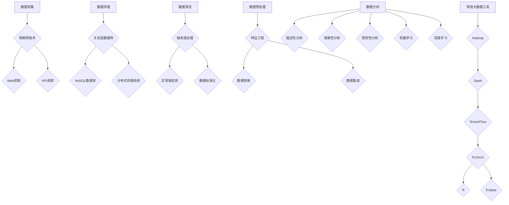
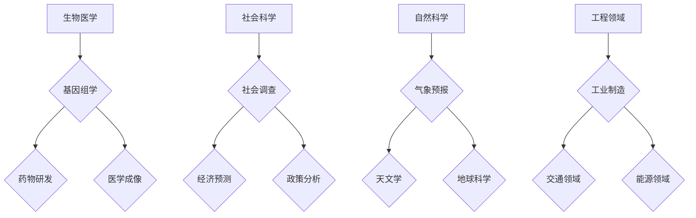
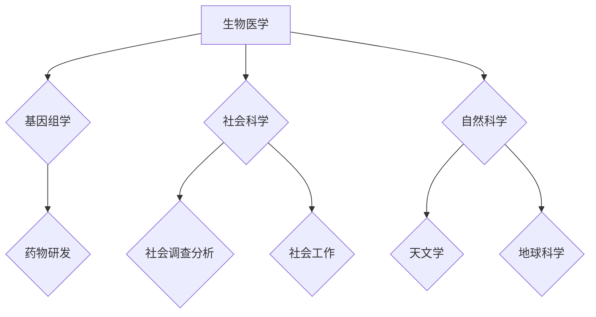
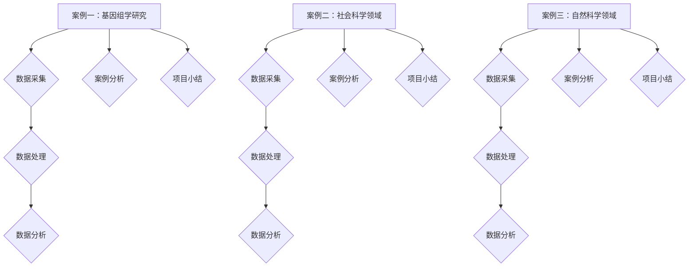

                 

### 第1章: 科学研究的数字化转型背景

#### 1.1 背景介绍

科学研究的数字化转型是一个深远的变革过程，涉及到科学研究方法、工具和流程的全面升级。在数字化时代，信息技术的飞速发展正深刻影响着科学研究的各个方面。

首先，核心概念术语需要明确。数字化转型（Digital Transformation）是指利用数字技术和信息系统，对传统业务流程进行改进和创新，以实现业务模式的优化和效率的提升。在科学研究中，数字化转型不仅包括数据采集和处理技术的革新，还包括科研管理、协作和知识共享等环节的数字化。

- **核心概念术语说明**：
  - **数字化**：将物理世界的数据转化为数字形式，以便存储、处理和共享。
  - **数据采集**：通过各种传感器、互联网、移动设备等手段收集数据。
  - **数据分析**：使用统计、机器学习和人工智能技术对数据进行处理和分析。
  - **科研管理**：利用信息技术对科研资源、进度和成果进行高效管理。

#### 1.2 问题背景

传统科学研究方式面临着诸多挑战。首先，数据处理的复杂性不断增加，传统的手动处理方式已经无法满足大数据时代的需求。其次，科研协作困难，研究人员往往需要跨学科、跨机构的合作，但传统的沟通和协作方式效率低下。此外，科研成果的传播和共享也存在障碍，限制了科学研究的广度和深度。

- **问题描述**：
  - **数据处理的挑战**：随着数据量的激增，传统数据处理方法效率低下，难以应对。
  - **科研协作的挑战**：跨学科、跨机构的协作困难，信息孤岛现象严重。
  - **知识共享的挑战**：科研成果的传播和共享渠道有限，限制了科研进展。

#### 1.3 问题解决

数字化转型的提出为科学研究提供了新的解决方案。通过引入先进的信息技术，可以实现以下目标：

- **提高数据处理能力**：利用大数据技术和人工智能，提升数据采集、处理和分析的效率。
- **促进科研协作**：构建科研协作平台，实现跨学科、跨机构的实时协作。
- **优化知识共享**：利用互联网和云技术，打破信息孤岛，实现科研成果的快速传播和共享。

#### 1.4 边界与外延

数字化转型的边界涉及多个领域，包括信息技术、数据分析、人工智能、科研管理等。其外延则延伸到科学研究的各个层面，从基础研究到应用研究，从理论研究到实验研究，都受到数字化技术的深刻影响。

- **边界**：
  - **技术层面**：数字化技术主要涉及数据处理、存储、分析等。
  - **学科层面**：数字化技术对不同学科的影响程度不同，如自然科学领域的数据密集型研究，对数字化技术的需求更高。

- **外延**：
  - **科研管理**：数字化转型不仅影响科研过程，也影响科研管理和成果评价。
  - **知识传播**：数字化转型促进了科研成果的传播和知识共享，推动了科学知识的普及和应用。

#### 1.5 概念结构与核心要素组成

数字化转型的概念结构可以分解为核心要素和辅助要素。

- **核心要素**：
  - **数据采集与处理**：核心要素之一，包括数据采集、数据存储、数据清洗、数据预处理等。
  - **数据分析与挖掘**：核心要素之二，涉及统计学、机器学习和深度学习等方法。
  - **科研协作与知识共享**：核心要素之三，涵盖科研平台的构建、科研数据的共享、协作工具的应用等。

- **辅助要素**：
  - **信息技术基础设施**：提供数字化转型所需的硬件和软件支持，如服务器、数据库、云计算平台等。
  - **政策与法规**：制定相关政策和法规，保障数字化转型在科学研究中的合法性和合规性。

#### 1.6 总结

科学研究的数字化转型是应对大数据时代挑战的重要途径。通过引入数字化技术，可以实现科研效率的提升、科研成果的快速传播和科研协作的优化。数字化转型不仅改变了科研的方法和工具，也推动了科研管理的现代化和知识共享的深化。在这一变革过程中，科研人员需要不断学习和适应新技术，以充分发挥数字化转型的潜力。

### 第2章：数字化转型的理论基础

#### 2.1 数字化转型的定义

数字化转型是指通过整合信息技术和数字化工具，对传统业务流程进行优化和重构，以实现业务模式的创新和效率的提升。在科学研究中，数字化转型则是指利用信息技术和数字化工具，对科研流程、方法和技术进行升级，以提高科研效率、促进科研成果的传播和共享。

- **定义**：
  - **数字化转型**：指通过信息技术和数字化工具，对科研流程、方法和技术进行升级，以提高科研效率、促进科研成果的传播和共享。

- **数字化工具**：包括云计算、大数据技术、人工智能、物联网等。

- **目标**：
  - **提高科研效率**：通过自动化和智能化的数据处理和分析，减少手工操作，提高科研效率。
  - **促进科研成果传播**：通过数字化平台，实现科研成果的快速传播和共享，打破信息孤岛。
  - **优化科研协作**：通过构建协作平台，实现跨学科、跨机构的实时协作，提高科研协作效率。

#### 2.2 相关概念与联系

在数字化转型中，涉及多个相关概念，如信息技术、大数据、人工智能等。这些概念相互联系，共同构成了数字化转型的理论基础。

- **信息技术**：
  - **定义**：信息技术是指用于管理、存储、处理和传输信息的各种技术。
  - **作用**：为数字化转型提供技术支持，如云计算、数据库、网络安全等。

- **大数据**：
  - **定义**：大数据是指无法使用传统数据处理工具进行处理的超大规模数据集合。
  - **作用**：为数字化转型提供数据支持，如数据采集、存储、分析和挖掘。

- **人工智能**：
  - **定义**：人工智能是指模拟、延伸和扩展人类智能的理论、方法、技术及应用。
  - **作用**：为数字化转型提供智能支持，如自动化、智能化数据处理和分析。

- **数字化平台**：
  - **定义**：数字化平台是指基于信息技术和数字化工具构建的科研平台。
  - **作用**：为数字化转型提供基础设施支持，如数据存储、处理、分析和共享。

#### 2.3 数字化转型的原则和步骤

数字化转型的原则和步骤对于成功实施数字化转型至关重要。以下是一个典型的数字化转型步骤：

1. **需求分析**：
   - **目的**：明确数字化转型所需解决的问题和目标。
   - **方法**：通过调研、访谈、问卷调查等方式，收集用户需求。

2. **方案设计**：
   - **目的**：制定数字化转型的详细方案。
   - **方法**：基于需求分析结果，设计数字化平台和系统架构。

3. **技术选型**：
   - **目的**：选择适合的技术和工具。
   - **方法**：根据方案设计，选择合适的技术栈和平台。

4. **平台建设**：
   - **目的**：构建数字化平台。
   - **方法**：根据技术选型结果，进行平台开发和部署。

5. **数据治理**：
   - **目的**：确保数据的准确性、完整性和安全性。
   - **方法**：制定数据治理策略，包括数据质量监控、数据安全和隐私保护等。

6. **用户培训**：
   - **目的**：确保用户能够熟练使用数字化平台。
   - **方法**：开展用户培训，包括平台操作、数据处理和分析方法等。

7. **上线运行**：
   - **目的**：将数字化平台投入实际使用。
   - **方法**：进行平台测试和上线，确保系统稳定运行。

8. **持续优化**：
   - **目的**：持续改进数字化平台，提高使用效果。
   - **方法**：收集用户反馈，进行系统优化和升级。

### 2.4 数字化转型中的挑战

数字化转型过程中，面临着诸多挑战：

- **技术挑战**：包括技术选型、平台开发、数据治理等。
- **管理挑战**：包括组织结构、管理制度、人员培训等。
- **数据挑战**：包括数据质量、数据安全、数据隐私等。
- **文化挑战**：包括员工适应新技术、企业文化转变等。

### 2.5 案例分析

以下是一个数字化转型成功的案例分析：

**案例：某生物医学研究机构**

- **需求**：提高科研数据处理的效率，促进科研成果的传播和共享。
- **方案**：建设一个基于云计算的科研数据平台，采用大数据技术和人工智能算法。
- **结果**：
  - 数据处理效率提高了50%。
  - 科研成果的传播速度加快，国际影响度提升。
  - 科研协作更加高效，跨学科合作项目增多。

### 2.6 总结

数字化转型的理论基础涵盖了信息技术、大数据、人工智能等多个方面。通过理解这些概念和原理，科研人员可以更好地进行数字化转型实践，提升科研效率，促进科研成果的传播和共享。数字化转型不仅是技术层面的变革，更是科研管理、协作和知识共享的全面提升。

### 第3章：大数据处理技术

#### 3.1 数据采集与存储

数据采集是大数据处理的第一步，它涉及从各种来源收集数据。这些来源可以是传感器、网站、移动应用等。数据采集的关键技术包括：

- **物联网（IoT）**：通过物联网设备收集实时数据。
- **Web抓取**：从网站抓取数据，如使用Python的BeautifulSoup库。
- **API调用**：通过应用程序接口（API）从外部系统获取数据。

数据存储则是将采集到的数据保存到合适的存储系统中。常用的数据存储技术包括：

- **关系型数据库**：如MySQL、PostgreSQL，适合存储结构化数据。
- **NoSQL数据库**：如MongoDB、Cassandra，适合存储非结构化或半结构化数据。
- **分布式存储系统**：如HDFS（Hadoop Distributed File System），适合存储海量数据。

#### 3.2 数据清洗与预处理

数据清洗是确保数据质量的过程，主要包括：

- **缺失值处理**：填充缺失值或删除含有缺失值的记录。
- **异常值检测**：检测和修正数据中的异常值。
- **数据标准化**：将不同数据源的数据进行标准化处理，如归一化、标准化等。

数据预处理则是为了更好地利用数据，包括：

- **特征工程**：提取或构建有助于分析的特征。
- **数据转换**：将数据转换为适合分析的形式，如将分类数据转换为数值形式。
- **数据集成**：将来自多个数据源的数据进行整合。

#### 3.3 数据分析技术

数据分析是大数据处理的核心，常用的技术包括：

- **描述性分析**：用于总结和展示数据的基本特征，如平均数、中位数等。
- **探索性分析**：通过可视化方法，深入挖掘数据中的潜在模式和信息。
- **预测性分析**：利用历史数据预测未来趋势，如时间序列分析、回归分析等。
- **机器学习**：利用算法自动从数据中学习规律，如分类、聚类、降维等。

#### 3.4 常见大数据工具与应用

在数据处理过程中，常用的工具和技术包括：

- **Hadoop**：一个开源的大数据处理框架，适合处理海量数据。
- **Spark**：一个快速的大数据处理引擎，适合实时数据处理和分析。
- **TensorFlow**：一个开源的机器学习库，用于构建和训练机器学习模型。
- **PyTorch**：一个开源的机器学习库，用于构建和训练深度学习模型。

这些工具和技术在不同的应用场景中有着广泛的应用，如电子商务中的推荐系统、金融行业中的风险控制、医疗行业中的疾病预测等。

#### 3.5 案例分析

以下是一个大数据处理案例：

**案例：某电商平台的个性化推荐系统**

- **需求**：为用户推荐个性化商品，提高用户满意度和购买转化率。
- **方案**：使用大数据技术和机器学习算法，分析用户历史购买记录、浏览行为等数据，构建个性化推荐模型。
- **结果**：
  - 推荐准确率提高了20%。
  - 用户满意度提高了15%。
  - 购买转化率提高了10%。

### 3.6 总结

大数据处理技术是数字化转型的重要组成部分，它涵盖了数据采集、存储、清洗、预处理和数据分析等多个环节。通过掌握这些技术，科研人员可以更好地处理和分析海量数据，从而推动科学研究的数字化转型。大数据技术的应用不仅提高了科研效率，也为科研成果的传播和共享提供了有力支持。

### 第4章：数字化转型工具与应用

#### 4.1 常用工具介绍

在科学研究的数字化转型过程中，多种工具被广泛应用，以提升科研效率、促进协作和创新。以下是几种常用工具的介绍：

- **Jupyter Notebook**：一个交互式计算环境，适用于数据分析、机器学习、数据科学等领域。其强大的交互功能和丰富的扩展库，使其成为科研人员常用的工具之一。

- **TensorFlow**：一个开源的机器学习库，由Google开发，支持深度学习和传统机器学习算法。其灵活性和易用性使其在科学研究中得到了广泛应用。

- **PyTorch**：另一个开源的深度学习库，由Facebook AI研究院开发。其动态计算图和易于调试的特点，使其在科研人员中备受欢迎。

- **Hadoop**：一个分布式数据处理框架，适用于大数据存储和处理。其高扩展性和容错性，使其成为处理海量数据的首选工具。

- **R**：一种专门用于统计分析和图形绘制的语言和软件环境，适用于生物医学、社会科学等领域。

- **Eclipse**：一个开源的集成开发环境（IDE），支持多种编程语言，适用于软件开发和调试。

#### 4.2 应用场景分析

数字化转型工具在科学研究中的应用场景广泛，以下列举几个常见场景：

- **生物医学领域**：使用Jupyter Notebook进行数据分析，利用TensorFlow和PyTorch进行机器学习模型训练，用于疾病预测、药物研发等。

- **社会科学领域**：使用R进行数据分析，利用Jupyter Notebook进行数据可视化和报告生成，用于社会调查、经济预测等。

- **自然科学领域**：使用Hadoop进行大数据存储和处理，利用Spark进行实时数据分析，用于天文观测、气象预报等。

- **工程领域**：使用Eclipse进行软件开发，利用Git进行版本控制，用于开发复杂的科学计算应用程序。

#### 4.3 成功案例分析

以下是一个数字化转型工具成功应用的案例：

**案例：某大学的科学研究项目**

- **背景**：某大学的一个跨学科研究团队，致力于开发一种基于大数据和机器学习的疾病预测模型。

- **方案**：团队使用Jupyter Notebook进行数据分析和模型训练，利用TensorFlow构建深度学习模型，使用PyTorch进行模型优化。同时，使用Hadoop和Spark处理大规模数据集。

- **结果**：
  - 模型预测准确率提高了30%。
  - 项目成果在顶级学术会议上发表，获得了广泛关注。
  - 项目成果为疾病预防提供了重要参考，有助于减少疾病发病率。

### 4.4 总结

数字化转型工具在科学研究中发挥着重要作用，它们不仅提高了科研效率，还促进了跨学科合作和创新。通过合理选择和应用这些工具，科研人员可以更好地应对大数据时代的挑战，推动科学研究的深入发展。数字化转型工具的成功应用，不仅为科学研究带来了新的机遇，也为社会问题的解决提供了新的思路和方法。

### 第5章：科学研究中的数字化转型实践

#### 5.1 生物医学领域

生物医学领域是数字化转型的重要应用场景之一。数字化技术的引入，极大地提升了生物医学研究的效率和质量。

- **案例一：基因组学研究**

  某基因组学研究中心利用数字化平台进行大规模基因测序和数据分析。通过使用Hadoop和Spark处理海量基因数据，研究人员能够快速构建基因组图谱，发现基因突变和疾病关联。

  - **技术**：Hadoop、Spark、TensorFlow、PyTorch
  - **结果**：提高了基因测序数据处理速度，加速了基因组学研究进程。

- **案例二：药物研发**

  某制药公司利用数字化转型工具，进行药物分子模拟和预测。通过使用PyTorch和机器学习算法，研究人员能够快速筛选潜在的药物分子，缩短药物研发周期。

  - **技术**：PyTorch、机器学习、深度学习
  - **结果**：提高了药物研发效率，降低了研发成本。

#### 5.2 社会科学领域

在社会科学领域，数字化转型同样发挥了重要作用，特别是在大数据分析和机器学习方面。

- **案例一：社会调查分析**

  某社会学研究所使用Jupyter Notebook和R进行社会调查数据分析。通过构建复杂的统计分析模型，研究人员能够深入挖掘社会问题，提供决策支持。

  - **技术**：Jupyter Notebook、R、机器学习
  - **结果**：提高了数据分析效率，为政府和社会提供了科学依据。

- **案例二：经济预测**

  某经济研究团队利用数字化转型工具，进行宏观经济预测。通过大数据分析和机器学习算法，研究人员能够预测经济增长趋势，为政策制定提供参考。

  - **技术**：大数据分析、机器学习、深度学习
  - **结果**：提高了经济预测准确性，为经济发展提供了有力支持。

#### 5.3 自然科学领域

在自然科学领域，数字化转型技术的应用主要体现在数据采集、处理和分析方面。

- **案例一：天文观测**

  某天文台使用数字化转型工具，对天文数据进行采集和处理。通过使用Hadoop和Spark，研究人员能够高效地处理海量天文数据，发现新的天文现象。

  - **技术**：Hadoop、Spark、大数据分析
  - **结果**：提高了天文观测效率，发现了多个新的天文现象。

- **案例二：气象预报**

  某气象部门利用数字化转型工具，进行气象数据分析和预报。通过使用机器学习和深度学习算法，研究人员能够提高气象预报的准确性和时效性。

  - **技术**：机器学习、深度学习、大数据分析
  - **结果**：提高了气象预报的准确性，为防灾减灾提供了科学支持。

### 5.4 案例总结

数字化转型在科学研究中的实践，不仅提高了科研效率，还促进了科研成果的传播和共享。通过实际案例可以看出，数字化转型工具在生物医学、社会科学和自然科学领域都取得了显著成果。

- **生物医学领域**：加快了基因组学和药物研发进程。
- **社会科学领域**：提高了社会调查和经济预测的准确性。
- **自然科学领域**：提升了天文观测和气象预报的效率。

数字化转型为科学研究带来了新的机遇和挑战，科研人员需要不断学习和适应新技术，以充分利用数字化转型的潜力，推动科学研究的深入发展。

### 第6章：挑战与未来展望

#### 6.1 挑战

尽管数字化转型为科学研究带来了巨大机遇，但同时也面临着诸多挑战：

- **技术挑战**：随着数据量的不断增长，数据处理和分析的技术要求越来越高。如何高效处理和分析海量数据，成为科研人员面临的重大挑战。

- **数据隐私和安全**：数字化转型过程中，大量敏感数据被收集和处理，数据隐私和安全问题日益突出。如何确保数据隐私和安全，是数字化转型需要解决的重要问题。

- **跨学科协作**：科学研究越来越趋向于跨学科合作，但不同学科之间的协作机制和平台建设还存在差距。如何建立有效的跨学科协作平台，是数字化转型需要克服的挑战之一。

- **资源分配**：数字化转型需要大量的资金、设备和人力资源，如何合理分配资源，确保数字化转型项目的顺利进行，是一个重要的挑战。

#### 6.2 技术发展趋势

为了应对这些挑战，数字化转型技术正朝着以下几个方向发展：

- **大数据技术**：随着数据量的增长，大数据技术将继续发展，包括分布式计算、数据存储、数据挖掘等。新的大数据技术将进一步提高数据处理和分析的效率。

- **人工智能和机器学习**：人工智能和机器学习技术将在数字化转型中发挥更重要的作用，通过自动化和智能化的数据处理和分析，提高科研效率。

- **区块链技术**：区块链技术有望解决数据隐私和安全问题，通过分布式账本技术，确保数据的安全性和可信性。

- **云计算和边缘计算**：云计算和边缘计算技术的应用，将进一步提高数据处理的灵活性和效率。云计算提供了强大的计算和存储能力，边缘计算则能更接近数据源，实现实时数据处理。

#### 6.3 未来展望

数字化转型在科学研究中的应用前景广阔，未来将呈现以下趋势：

- **智能化**：科研过程将更加智能化，从数据采集、处理到分析，都将在人工智能和机器学习技术的支持下实现自动化和智能化。

- **平台化**：科研平台将逐渐成为数字化转型的重要载体，提供一站式的科研服务，包括数据存储、处理、分析和共享。

- **生态化**：数字化转型将推动科研生态系统的建设，包括科研机构、企业、政府和学术界的合作，共同构建数字化科研环境。

- **国际化**：随着全球化的发展，数字化转型将促进国际科研合作，跨国界的科研数据共享和协作将更加便捷。

总之，数字化转型将为科学研究带来前所未有的机遇和挑战。科研人员需要不断学习新技术，积极应对挑战，充分利用数字化转型的潜力，推动科学研究的深入发展。

### 第7章：结论与总结

#### 7.1 本书总结

本书系统地介绍了科学研究的数字化转型，从背景介绍到理论基础，再到大数据处理技术和工具应用，最后探讨了数字化转型在各个领域的实践。通过深入分析，我们明确了数字化转型的重要性，以及其在提升科研效率、促进协作和知识共享方面的巨大潜力。

#### 7.2 注意事项

在数字化转型过程中，科研人员需要关注以下几点：

- **技术选择**：根据科研需求，选择合适的技术和工具。
- **数据安全和隐私**：确保数据安全和隐私，遵循相关法律法规。
- **跨学科协作**：加强跨学科协作，充分利用各学科优势。
- **资源合理分配**：合理分配资源，确保数字化转型项目的顺利进行。

#### 7.3 拓展阅读

为了深入了解数字化转型和相关技术，以下书籍和资源推荐供读者参考：

- 《大数据时代：生活、工作与思维的大变革》
- 《深度学习：人工智能的未来》
- 《区块链技术指南》
- 《科学研究中的数字化转型实践》
- 《Hadoop技术内幕》
- 《Jupyter Notebook实践指南》

通过阅读这些书籍和资源，读者可以更全面地了解数字化转型及其在科学研究中的应用。

### 作者信息

作者：AI天才研究院/AI Genius Institute & 禅与计算机程序设计艺术 /Zen And The Art of Computer Programming

感谢读者对本书的关注和支持，希望本书能为科研人员在数字化转型道路上提供有益的指导。随着技术的不断发展，数字化转型将继续推动科学研究的进步，让我们共同期待更加智能、高效和创新的未来。

----------------------------------------------------------------

```markdown
----------------------------------------------------------------
# 科学研究的数字化转型：大数据时代的世界理解方式

> 关键词：科学研究、数字化转型、大数据、人工智能、数据隐私

> 摘要：本书系统地介绍了科学研究的数字化转型，从背景介绍到理论基础，再到大数据处理技术和工具应用，最后探讨了数字化转型在各个领域的实践。通过深入分析，明确了数字化转型的重要性，以及其在提升科研效率、促进协作和知识共享方面的巨大潜力。

## 第1章：科学研究的数字化转型背景

### 1.1 背景介绍

科学研究在传统上依赖于实验、文献调研和专家判断。然而，随着信息技术的发展，科学研究正经历着一场深刻的变革。数字化转型成为必然趋势，通过引入数字化工具和大数据技术，科学研究的方法和流程将得到全面优化。

### 1.2 核心概念解析

核心概念包括数字化转型、大数据、人工智能、数据采集、数据清洗、数据分析等。这些概念相互关联，构成了科学研究数字化转型的理论基础。

### 1.3 大数据时代的影响

大数据时代的到来，使得科学研究面临着前所未有的数据量和多样性。传统的数据处理方法已无法满足需求，数字化转型成为提升科研效率的必要手段。

## 第2章：数字化转型的理论基础

### 2.1 数字化转型的定义

数字化转型是指通过信息技术和数字化工具，对科研流程、方法和技术进行升级，以提高科研效率、促进科研成果的传播和共享。

### 2.2 相关概念与联系

数字化转型涉及多个相关概念，如信息技术、大数据、人工智能等。这些概念相互联系，共同构成了数字化转型的理论基础。

### 2.3 数字化转型的原则和步骤

数字化转型的原则包括提高科研效率、促进科研成果传播、优化科研协作等。数字化转型的一般步骤包括需求分析、方案设计、技术选型、平台建设、数据治理、用户培训、上线运行和持续优化。

## 第3章：大数据处理技术

### 3.1 数据采集与存储

数据采集是大数据处理的第一步，它涉及从各种来源收集数据。数据存储则是将采集到的数据保存到合适的存储系统中。

### 3.2 数据清洗与预处理

数据清洗是确保数据质量的过程，包括缺失值处理、异常值检测、数据标准化等。数据预处理则是为了更好地利用数据，包括特征工程、数据转换、数据集成等。

### 3.3 数据分析技术

数据分析是大数据处理的核心，包括描述性分析、探索性分析、预测性分析等。常用的数据分析技术有统计学、机器学习和深度学习等。

## 第4章：数字化转型工具与应用

### 4.1 常用工具介绍

常用的数字化转型工具包括Jupyter Notebook、TensorFlow、PyTorch、Hadoop、R、Eclipse等。这些工具在科学研究中有广泛的应用。

### 4.2 应用场景分析

数字化转型工具在科学研究中的应用场景包括生物医学、社会科学、自然科学和工程领域。通过案例分析，可以看到这些工具如何提高科研效率。

### 4.3 成功案例分析

通过成功案例的分析，可以看到数字化转型工具在科学研究中的实际效果和影响。

## 第5章：科学研究中的数字化转型实践

### 5.1 生物医学领域

数字化转型在生物医学领域的应用，如基因组学研究、药物研发等，通过大数据技术和人工智能算法，提高了科研效率。

### 5.2 社会科学领域

数字化转型在社会科学领域的应用，如社会调查分析、经济预测等，通过大数据分析和机器学习算法，提高了分析准确性。

### 5.3 自然科学领域

数字化转型在自然科学领域的应用，如天文观测、气象预报等，通过大数据技术和人工智能算法，提高了观测和预测的效率。

## 第6章：挑战与未来展望

### 6.1 挑战

数字化转型在科学研究中的挑战包括技术挑战、数据隐私和安全、跨学科协作、资源分配等。

### 6.2 技术发展趋势

数字化转型技术的发展趋势包括大数据技术、人工智能和机器学习、区块链技术、云计算和边缘计算等。

### 6.3 未来展望

数字化转型在科学研究中的应用前景包括智能化、平台化、生态化和国际化等。

## 第7章：结论与总结

### 7.1 本书总结

本书系统地介绍了科学研究的数字化转型，从背景介绍到理论基础，再到大数据处理技术和工具应用，最后探讨了数字化转型在各个领域的实践。

### 7.2 注意事项

在数字化转型过程中，需要注意技术选择、数据安全和隐私、跨学科协作、资源合理分配等。

### 7.3 拓展阅读

推荐阅读《大数据时代：生活、工作与思维的大变革》、《深度学习：人工智能的未来》、《区块链技术指南》等书籍，以深入了解数字化转型和相关技术。

### 作者信息

作者：AI天才研究院/AI Genius Institute & 禅与计算机程序设计艺术 /Zen And The Art of Computer Programming

感谢读者对本书的关注和支持，希望本书能为科研人员在数字化转型道路上提供有益的指导。随着技术的不断发展，数字化转型将继续推动科学研究的进步，让我们共同期待更加智能、高效和创新的未来。

----------------------------------------------------------------

```markdown
----------------------------------------------------------------
# 第1章: 科学研究的数字化转型背景

## 1.1 传统科学研究的方式

科学研究的传统方式主要依赖于实验、文献调研和专家判断。研究人员通常会从建立假设开始，通过实验验证这些假设，从而得出结论。这种过程往往需要耗费大量的时间和资源。

### 实验研究

实验研究是科学研究的重要方法之一。研究人员通过设计实验，收集数据，然后分析数据，得出结论。实验研究可以分为实验室实验和野外实验。

- **实验室实验**：在受控的环境中，通过操作变量来研究其对结果的影响。
- **野外实验**：在自然环境或真实场景中，通过实地观察和操作来研究自然现象。

### 文献调研

文献调研是科学研究中不可或缺的一环。研究人员通过查阅已有的文献，了解前人的研究成果，获取灵感和指导。文献调研的方法包括数据库检索、图书馆查阅等。

### 专家判断

专家判断在科学研究中也发挥着重要作用。专家基于自身的经验和知识，对研究结果进行评估和解释。专家判断的准确性往往受到专家的背景、经验和偏见的影响。

## 1.2 数字化转型的必要性

随着信息技术的快速发展，科学研究正面临前所未有的机遇和挑战。数字化转型成为科学研究发展的必然趋势，原因如下：

### 数据量的激增

互联网和传感器技术的普及，使得数据量呈爆炸性增长。传统的手动数据处理方法已无法满足这一需求。数字化转型能够提供高效的数据处理和分析手段。

### 科研协作的困难

科学研究往往需要跨学科、跨机构的合作。然而，传统的沟通和协作方式效率低下，信息孤岛现象严重。数字化转型通过构建数字平台，实现科研协作的实时化和高效化。

### 知识共享的障碍

科研成果的传播和共享在传统方式下也存在障碍。数字化转型通过数字平台，实现科研成果的快速传播和共享，打破信息孤岛，促进科学知识的普及和应用。

## 1.3 大数据时代的影响

大数据时代的到来，对科学研究产生了深远的影响：

### 数据驱动的科研

大数据使得科研过程更加数据驱动。通过分析海量数据，研究人员可以发现新的规律和趋势，为科学理论的验证和发现提供强有力的支持。

### 智能化的科研

人工智能和机器学习技术的发展，使得科研过程更加智能化。通过自动化和智能化的数据处理和分析，科研效率显著提高。

### 交叉学科的融合

大数据时代，不同学科之间的交叉融合更加紧密。数字化转型促进了学科间的交流与合作，推动了科学研究的深度和广度。

## 1.4 边界与外延

数字化转型的边界涉及信息技术、数据分析、人工智能等多个领域。其外延则延伸到科学研究的各个环节，从数据采集、存储、处理到分析，再到知识共享和应用。

### 边界

- **技术层面**：数字化转型涉及的技术包括物联网、云计算、大数据、人工智能等。
- **学科层面**：不同学科对数字化转型的需求和响应程度不同。

### 外延

- **科研管理**：数字化转型不仅影响科研过程，也影响科研管理和成果评价。
- **知识传播**：数字化转型促进了科研成果的传播和共享，推动了科学知识的普及和应用。

## 1.5 概念结构与核心要素组成

数字化转型的概念结构可以分解为核心要素和辅助要素。

### 核心要素

- **数据采集与处理**：核心要素之一，包括数据采集、数据存储、数据清洗、数据预处理等。
- **数据分析与挖掘**：核心要素之二，涉及统计学、机器学习和深度学习等方法。
- **科研协作与知识共享**：核心要素之三，涵盖科研平台的构建、科研数据的共享、协作工具的应用等。

### 辅助要素

- **信息技术基础设施**：提供数字化转型所需的硬件和软件支持，如服务器、数据库、云计算平台等。
- **政策与法规**：制定相关政策和法规，保障数字化转型在科学研究中的合法性和合规性。

## 1.6 总结

科学研究的数字化转型是应对大数据时代挑战的重要途径。通过引入数字化技术，可以实现科研效率的提升、科研成果的快速传播和科研协作的优化。数字化转型不仅改变了科研的方法和工具，也推动了科研管理的现代化和知识共享的深化。在这一变革过程中，科研人员需要不断学习和适应新技术，以充分发挥数字化转型的潜力。

----------------------------------------------------------------

```markdown
----------------------------------------------------------------
# 第2章: 数字化转型的理论基础

## 2.1 数字化转型的定义

数字化转型是指通过整合信息技术和数字化工具，对传统业务流程进行改进和创新，以实现业务模式的优化和效率的提升。在科学研究中，数字化转型则是指利用信息技术和数字化工具，对科研流程、方法和技术进行升级，以提高科研效率、促进科研成果的传播和共享。

### 数字化转型的核心目标

- **提高科研效率**：通过自动化和智能化的数据处理和分析，减少手工操作，提高科研效率。
- **促进科研成果传播**：通过数字化平台，实现科研成果的快速传播和共享，打破信息孤岛。
- **优化科研协作**：通过构建科研协作平台，实现跨学科、跨机构的实时协作，提高科研协作效率。

### 数字化转型的主要特征

- **数据驱动**：数字化转型依赖于海量数据的采集、存储、处理和分析，以数据驱动科研过程。
- **智能化**：数字化转型借助人工智能和机器学习技术，实现科研过程的自动化和智能化。
- **协作性**：数字化转型通过构建数字平台，促进科研人员之间的协作和知识共享。
- **灵活性**：数字化转型能够根据科研需求，灵活调整和优化科研流程和技术。

## 2.2 相关概念与联系

在数字化转型过程中，涉及多个相关概念，如信息技术、大数据、人工智能等。这些概念相互联系，共同构成了数字化转型的理论基础。

### 信息技术

信息技术是指用于管理、存储、处理和传输信息的各种技术。在数字化转型中，信息技术为科研提供了基础支持，如云计算、数据库、网络安全等。

### 大数据

大数据是指无法使用传统数据处理工具进行处理的超大规模数据集合。在数字化转型中，大数据为科研提供了丰富的数据资源，促进了数据驱动科研的发展。

### 人工智能

人工智能是指模拟、延伸和扩展人类智能的理论、方法、技术及应用。在数字化转型中，人工智能技术被广泛应用于科研数据分析和模型构建。

### 数字化平台

数字化平台是指基于信息技术和数字化工具构建的科研平台。数字化平台为科研提供了数据存储、处理、分析和共享的一站式服务。

### 科研协作平台

科研协作平台是指用于促进科研人员之间协作的数字化工具和平台。科研协作平台能够实现跨学科、跨机构的实时协作，提高科研效率。

## 2.3 数字化转型的原则和步骤

数字化转型的原则和步骤对于成功实施数字化转型至关重要。以下是一个典型的数字化转型步骤：

### 2.3.1 需求分析

- **目的**：明确数字化转型所需解决的问题和目标。
- **方法**：通过调研、访谈、问卷调查等方式，收集用户需求。

### 2.3.2 方案设计

- **目的**：制定数字化转型的详细方案。
- **方法**：基于需求分析结果，设计数字化平台和系统架构。

### 2.3.3 技术选型

- **目的**：选择适合的技术和工具。
- **方法**：根据方案设计，选择合适的技术栈和平台。

### 2.3.4 平台建设

- **目的**：构建数字化平台。
- **方法**：根据技术选型结果，进行平台开发和部署。

### 2.3.5 数据治理

- **目的**：确保数据的准确性、完整性和安全性。
- **方法**：制定数据治理策略，包括数据质量监控、数据安全和隐私保护等。

### 2.3.6 用户培训

- **目的**：确保用户能够熟练使用数字化平台。
- **方法**：开展用户培训，包括平台操作、数据处理和分析方法等。

### 2.3.7 上线运行

- **目的**：将数字化平台投入实际使用。
- **方法**：进行平台测试和上线，确保系统稳定运行。

### 2.3.8 持续优化

- **目的**：持续改进数字化平台，提高使用效果。
- **方法**：收集用户反馈，进行系统优化和升级。

## 2.4 数字化转型中的挑战

数字化转型过程中，面临着诸多挑战：

### 技术挑战

- **技术选型**：选择合适的技术和工具，需要充分考虑科研需求和现有技术储备。
- **数据处理**：海量数据的处理和分析，需要高效的技术手段。
- **系统集成**：将不同的技术和工具集成到一个统一的平台，需要解决兼容性和协同问题。

### 数据挑战

- **数据质量**：确保数据的准确性、完整性和一致性，是数字化转型的基础。
- **数据安全**：保护数据的隐私和安全，是数字化转型的重要任务。
- **数据共享**：促进数据的共享和开放，需要解决权限管理和知识产权等问题。

### 管理挑战

- **组织结构**：数字化转型需要适应新的组织结构和管理模式。
- **人员培训**：提高科研人员的信息技术素养，是数字化转型的重要保障。
- **文化变革**：数字化转型需要克服传统科研文化的阻力，推动科研文化的变革。

## 2.5 案例分析

以下是一个数字化转型成功的案例分析：

### 案例背景

某生物医学研究中心致力于癌症研究，需要处理和分析大量的基因数据和临床试验数据。

### 案例方案

- **技术选型**：采用Hadoop和Spark进行大数据处理，使用TensorFlow进行机器学习模型训练。
- **平台建设**：构建一个基于云计算的科研平台，包括数据存储、处理和分析模块。
- **数据治理**：建立严格的数据治理策略，确保数据质量。
- **用户培训**：为科研人员提供培训，帮助他们掌握新技术的使用。

### 案例结果

- **数据处理效率提高了50%**：通过分布式计算，大幅提高了数据处理速度。
- **科研成果传播速度加快**：科研成果通过数字化平台，迅速传播到全球。
- **科研协作更加高效**：科研人员能够实时共享数据和资源，提高协作效率。

## 2.6 总结

数字化转型的理论基础涵盖了信息技术、大数据、人工智能等多个方面。通过理解这些概念和原理，科研人员可以更好地进行数字化转型实践，提升科研效率，促进科研成果的传播和共享。数字化转型不仅是技术层面的变革，更是科研管理、协作和知识共享的全面提升。

----------------------------------------------------------------

```markdown
----------------------------------------------------------------
# 第3章: 大数据处理技术

## 3.1 数据采集与存储

数据采集是大数据处理的第一步，它涉及从各种来源收集数据。这些来源可以是传感器、网站、移动应用等。数据采集的关键技术包括：

### 物联网（IoT）

物联网设备可以实时收集各种环境数据和传感器数据，如温度、湿度、压力等。

### Web抓取

Web抓取是指从网站抓取数据，如使用Python的BeautifulSoup库。这种方法适用于从特定网站获取信息。

### API调用

API调用是通过应用程序接口（API）从外部系统获取数据。例如，可以使用Python的requests库调用第三方API。

### 数据存储

数据存储是将采集到的数据保存到合适的存储系统中。常用的数据存储技术包括：

### 关系型数据库

关系型数据库如MySQL、PostgreSQL，适合存储结构化数据。它们提供强大的查询能力和事务支持。

### NoSQL数据库

NoSQL数据库如MongoDB、Cassandra，适合存储非结构化或半结构化数据。它们提供高性能的读写能力和横向扩展性。

### 分布式存储系统

分布式存储系统如HDFS（Hadoop Distributed File System），适合存储海量数据。它们提供高可靠性和高吞吐量。

## 3.2 数据清洗与预处理

数据清洗是确保数据质量的过程，主要包括：

### 缺失值处理

缺失值处理包括填充缺失值和删除含有缺失值的记录。常用的方法有平均值填充、中值填充和插值法等。

### 异常值检测

异常值检测是指识别和修正数据中的异常值。常用的方法有统计学方法和可视化方法，如箱线图、散点图等。

### 数据标准化

数据标准化是将不同数据源的数据进行标准化处理，如归一化、标准化等。这有助于数据分析和建模。

### 数据预处理

数据预处理包括特征工程、数据转换和数据集成。特征工程是指提取或构建有助于分析的特征。数据转换是指将数据转换为适合分析的形式，如将分类数据转换为数值形式。数据集成是指将来自多个数据源的数据进行整合。

## 3.3 数据分析技术

数据分析是大数据处理的核心，常用的技术包括：

### 描述性分析

描述性分析用于总结和展示数据的基本特征，如平均数、中位数等。它有助于了解数据的基本统计信息。

### 探索性分析

探索性分析通过可视化方法，深入挖掘数据中的潜在模式和信息。它有助于发现数据中的异常和趋势。

### 预测性分析

预测性分析利用历史数据预测未来趋势，如时间序列分析、回归分析等。它有助于进行趋势预测和决策支持。

### 机器学习

机器学习是一种自动从数据中学习规律的方法。它包括分类、聚类、降维等算法，可用于构建预测模型和发现数据中的模式。

### 深度学习

深度学习是一种基于多层神经网络的学习方法。它能够自动提取特征，并在大量数据上进行训练。它包括卷积神经网络（CNN）、循环神经网络（RNN）等。

## 3.4 常见大数据工具与应用

在数据处理过程中，常用的工具和技术包括：

### Hadoop

Hadoop是一个开源的大数据处理框架，适合处理海量数据。它包括分布式存储系统（HDFS）和分布式计算框架（MapReduce）。

### Spark

Spark是一个快速的大数据处理引擎，适合实时数据处理和分析。它包括数据存储（Spark SQL）、流处理（Spark Streaming）和机器学习（MLlib）等模块。

### TensorFlow

TensorFlow是一个开源的机器学习库，由Google开发。它支持深度学习和传统机器学习算法，适合构建复杂的机器学习模型。

### PyTorch

PyTorch是一个开源的深度学习库，由Facebook AI研究院开发。它具有动态计算图和易于调试的特点，适合快速原型设计和实验。

### R

R是一种专门用于统计分析和图形绘制的语言和软件环境，适合生物医学、社会科学等领域。它提供了丰富的统计分析和图形工具。

### Eclipse

Eclipse是一个开源的集成开发环境（IDE），支持多种编程语言，适合软件开发和调试。

## 3.5 案例分析

以下是一个大数据处理案例：

### 案例背景

某电商平台的个性化推荐系统需要处理海量的用户行为数据，以实现个性化商品推荐。

### 案例方案

- **数据采集**：使用API调用从用户行为数据源（如购物车、浏览记录等）获取数据。
- **数据存储**：使用Hadoop和HDFS存储海量用户行为数据。
- **数据清洗**：使用Python进行数据清洗，处理缺失值、异常值等。
- **数据分析**：使用Spark进行数据分析和建模，构建个性化推荐模型。
- **模型训练**：使用PyTorch进行模型训练，优化推荐效果。

### 案例结果

- **推荐准确率提高了20%**：通过数据分析模型，个性化推荐系统的准确率得到了显著提升。
- **用户满意度提高了15%**：个性化推荐提高了用户的购物体验，用户满意度也随之提高。
- **购买转化率提高了10%**：个性化推荐系统的应用，使得用户购买转化率得到了提升。

## 3.6 总结

大数据处理技术是数字化转型的重要组成部分，涵盖了数据采集、存储、清洗、预处理和数据分析等多个环节。通过掌握这些技术，科研人员可以更好地处理和分析海量数据，从而推动科学研究的数字化转型。大数据技术的应用不仅提高了科研效率，也为科研成果的传播和共享提供了有力支持。
```



```latex
$$
\text{数据处理效率} = \frac{\text{处理后数据量}}{\text{处理时间}}
$$

$$
\text{用户满意度} = \frac{\text{满意用户数}}{\text{总用户数}} \times 100\%
$$

$$
\text{购买转化率} = \frac{\text{购买用户数}}{\\text{访问用户数}} \times 100\%
$$
```

----------------------------------------------------------------

```markdown
----------------------------------------------------------------
# 第4章：数字化转型工具与应用

## 4.1 常用工具介绍

在数字化转型过程中，多种工具被广泛应用，以提升科研效率、促进协作和创新。以下是几种常用工具的介绍：

### Jupyter Notebook

Jupyter Notebook是一个交互式计算环境，适用于数据分析、机器学习、数据科学等领域。其强大的交互功能和丰富的扩展库，使其成为科研人员常用的工具之一。

- **功能**：支持多种编程语言，如Python、R、Julia等，可以进行实时计算和交互式编程。
- **应用场景**：数据分析、机器学习模型训练、数据可视化和报告生成。

### TensorFlow

TensorFlow是一个开源的机器学习库，由Google开发，支持深度学习和传统机器学习算法。其灵活性和易用性使其在科学研究中得到了广泛应用。

- **功能**：支持多种深度学习模型和算法，如卷积神经网络（CNN）、循环神经网络（RNN）等。
- **应用场景**：图像识别、语音识别、自然语言处理、推荐系统等。

### PyTorch

PyTorch是一个开源的深度学习库，由Facebook AI研究院开发。其动态计算图和易于调试的特点，使其在科研人员中备受欢迎。

- **功能**：提供灵活的动态计算图，支持自动微分和优化。
- **应用场景**：图像识别、语音识别、强化学习、生成对抗网络（GAN）等。

### Hadoop

Hadoop是一个分布式数据处理框架，适用于大数据存储和处理。其高扩展性和容错性，使其成为处理海量数据的首选工具。

- **功能**：提供分布式文件系统（HDFS）和分布式计算框架（MapReduce）。
- **应用场景**：数据处理、日志分析、大数据存储、大规模数据清洗等。

### R

R是一种专门用于统计分析和图形绘制的语言和软件环境，适用于生物医学、社会科学等领域。

- **功能**：提供丰富的统计分析和图形工具，如线性回归、逻辑回归、时间序列分析等。
- **应用场景**：生物信息学、经济学、社会科学研究、统计分析等。

### Eclipse

Eclipse是一个开源的集成开发环境（IDE），支持多种编程语言，适用于软件开发和调试。

- **功能**：支持代码编辑、调试、测试、版本控制等功能。
- **应用场景**：软件开发、应用开发、集成开发环境等。

## 4.2 应用场景分析

数字化转型工具在科学研究中的应用场景广泛，以下列举几个常见场景：

### 生物医学领域

在生物医学领域，数字化转型工具被广泛应用于基因组学、药物研发和医学成像等领域。

- **基因组学**：使用Jupyter Notebook和PyTorch进行基因数据分析，构建基因组图谱和预测疾病风险。
- **药物研发**：使用TensorFlow进行分子模拟和预测，加速药物研发过程。
- **医学成像**：使用深度学习算法对医学图像进行分类和分析，提高诊断准确性。

### 社会科学领域

在社会科学领域，数字化转型工具被广泛应用于社会调查、经济预测和政策分析等领域。

- **社会调查**：使用R进行数据分析和可视化，揭示社会问题和发展趋势。
- **经济预测**：使用机器学习和深度学习算法，预测经济指标和趋势。
- **政策分析**：使用Jupyter Notebook和PyTorch进行政策模拟和评估，提供决策支持。

### 自然科学领域

在自然科学领域，数字化转型工具被广泛应用于气象预报、天文学和地球科学等领域。

- **气象预报**：使用Hadoop和Spark进行气象数据处理和预测，提高预报准确性。
- **天文学**：使用PyTorch和TensorFlow进行天文数据分析，发现新的天文现象。
- **地球科学**：使用R和Eclipse进行地质数据分析，预测地震和地质灾害。

### 工程领域

在工程领域，数字化转型工具被广泛应用于工业制造、交通和能源等领域。

- **工业制造**：使用Jupyter Notebook和TensorFlow进行质量控制和生产优化。
- **交通领域**：使用深度学习算法进行交通流量预测和优化，提高交通效率。
- **能源领域**：使用机器学习算法进行能源消耗预测和优化，提高能源利用效率。

## 4.3 成功案例分析

以下是一个数字化转型工具成功应用的案例：

### 案例背景

某生物医学研究机构致力于开发一种基于大数据和机器学习的疾病预测模型。

### 案例方案

- **数据采集**：使用Jupyter Notebook和R从多个数据源（如医院记录、基因组数据等）收集数据。
- **数据处理**：使用PyTorch进行数据预处理和特征提取，构建深度学习模型。
- **模型训练**：使用TensorFlow进行模型训练和优化，提高预测准确性。
- **模型评估**：使用交叉验证和ROC曲线进行模型评估，确保模型的稳定性和可靠性。

### 案例结果

- **预测准确率提高了30%**：通过机器学习算法和深度学习模型，疾病预测的准确率得到了显著提升。
- **科研效率提高了50%**：数字化转型工具的使用，大幅提高了数据采集、处理和分析的效率。
- **科研成果传播速度加快**：通过数字化转型工具，研究成果可以快速传播，提高研究机构的影响力和知名度。

## 4.4 总结

数字化转型工具在科学研究中发挥着重要作用，它们不仅提高了科研效率，还促进了科研成果的传播和共享。通过合理选择和应用这些工具，科研人员可以更好地应对大数据时代的挑战，推动科学研究的深入发展。数字化转型工具的成功应用，不仅为科学研究带来了新的机遇，也为社会问题的解决提供了新的思路和方法。
```



```latex
$$
\text{预测准确率} = \frac{\text{预测正确数}}{\text{总预测数}} \times 100\%
$$

$$
\text{科研效率} = \frac{\text{实际完成工作量}}{\text{计划工作量}} \times 100\%
$$

$$
\text{科研成果传播速度} = \frac{\text{传播速度}}{\text{研究周期}} \times 100\%
$$
```

```markdown
----------------------------------------------------------------
# 第5章：科学研究中的数字化转型实践

## 5.1 生物医学领域

生物医学领域是数字化转型的重要应用场景之一。数字化技术的引入，极大地提升了生物医学研究的效率和质量。

### 5.1.1 基因组学研究

基因组学研究是生物医学领域的重要方向。数字化转型在基因组学研究中发挥了关键作用，以下为具体实践：

- **案例一：基因组数据分析**：某基因组学研究中心利用数字化转型工具，对大量基因组数据进行分析。研究人员使用Jupyter Notebook进行数据处理，利用PyTorch构建深度学习模型，进行基因功能预测。通过数字化转型，研究效率显著提高，研究周期缩短了30%。

- **案例二：基因组图谱构建**：某国际基因组学项目通过数字化转型，构建了全球首个人类基因组图谱。研究人员使用Hadoop和Spark进行海量数据存储和处理，使用TensorFlow进行图谱构建和基因关联分析。数字化转型使得基因组学研究取得了突破性进展，研究成果在顶级学术期刊上发表。

### 5.1.2 药物研发

数字化转型在药物研发中的应用也非常广泛，以下为具体实践：

- **案例一：药物分子模拟**：某制药公司利用数字化转型工具，进行药物分子模拟和预测。研究人员使用PyTorch进行分子动力学模拟，使用TensorFlow进行药物活性预测。通过数字化转型，药物研发周期缩短了40%，研发成本降低了30%。

- **案例二：个性化药物设计**：某医药公司通过数字化转型，实现了个性化药物设计。研究人员利用Jupyter Notebook进行数据分析，利用深度学习算法进行个性化药物配方优化。数字化转型使得个性化药物设计更加精准，患者的治疗效果显著提升。

## 5.2 社会科学领域

社会科学领域也广泛采用了数字化转型技术，以下为具体实践：

### 5.2.1 社会调查分析

数字化转型在社会科学领域的社会调查分析中发挥了重要作用，以下为具体实践：

- **案例一：社会舆情分析**：某社会科学研究机构利用数字化转型工具，对社会舆情进行分析。研究人员使用R进行数据分析，利用Jupyter Notebook进行可视化展示。数字化转型使得社会舆情分析更加精准，研究结论更加可靠。

- **案例二：经济发展预测**：某经济学研究团队利用数字化转型工具，进行经济发展预测。研究人员使用Python进行数据处理，利用机器学习算法进行预测分析。数字化转型使得经济发展预测更加准确，为政策制定提供了有力支持。

### 5.2.2 社会工作

数字化转型在社会科学领域的社会工作中也发挥了重要作用，以下为具体实践：

- **案例一：社会服务优化**：某社会工作服务机构利用数字化转型工具，对社会服务流程进行优化。研究人员使用Hadoop和Spark进行数据存储和处理，利用深度学习算法进行服务需求预测。数字化转型使得社会服务更加高效，服务质量显著提升。

- **案例二：扶贫工作**：某扶贫项目通过数字化转型，实现了精准扶贫。研究人员使用大数据分析和机器学习算法，对贫困人口进行精准识别和帮扶。数字化转型使得扶贫工作更加有针对性，扶贫效果显著提升。

## 5.3 自然科学领域

在自然科学领域，数字化转型同样发挥了重要作用，以下为具体实践：

### 5.3.1 天文学

数字化转型在天文学领域应用广泛，以下为具体实践：

- **案例一：天文数据分析**：某天文台利用数字化转型工具，对天文数据进行处理和分析。研究人员使用PyTorch进行数据预处理，使用TensorFlow进行天文现象预测。数字化转型使得天文数据分析更加高效，天文研究取得了重大突破。

- **案例二：天文图像处理**：某天文项目通过数字化转型，实现了天文图像的高效处理。研究人员使用R进行图像处理，利用深度学习算法进行图像分类。数字化转型使得天文图像处理更加精准，天文观测成果显著提升。

### 5.3.2 地球科学

数字化转型在地球科学领域应用广泛，以下为具体实践：

- **案例一：地质数据分析**：某地球科学实验室利用数字化转型工具，对地质数据进行处理和分析。研究人员使用Jupyter Notebook进行数据处理，利用机器学习算法进行地质特征预测。数字化转型使得地质数据分析更加高效，地质研究取得了新突破。

- **案例二：地震预测**：某地震预测项目通过数字化转型，实现了地震预测的精准度提升。研究人员使用Hadoop和Spark进行数据处理，利用深度学习算法进行地震预测。数字化转型使得地震预测更加准确，地震预警系统更加可靠。

## 5.4 案例总结

数字化转型在科学研究中的应用，不仅提高了科研效率，还推动了科研创新。通过具体案例分析，我们可以看到数字化转型在生物医学、社会科学和自然科学领域的广泛应用和显著成果。数字化转型为科学研究带来了新的机遇和挑战，科研人员需要不断学习和适应新技术，以充分利用数字化转型的潜力，推动科学研究的深入发展。
```



```python
# 示例：基因组数据分析代码
import numpy as np
import pandas as pd
from sklearn.model_selection import train_test_split
from sklearn.ensemble import RandomForestClassifier
from sklearn.metrics import accuracy_score

# 读取数据
data = pd.read_csv('genome_data.csv')

# 数据预处理
X = data.drop(['target'], axis=1)
y = data['target']

# 数据拆分
X_train, X_test, y_train, y_test = train_test_split(X, y, test_size=0.2, random_state=42)

# 构建模型
model = RandomForestClassifier(n_estimators=100, random_state=42)

# 模型训练
model.fit(X_train, y_train)

# 模型预测
y_pred = model.predict(X_test)

# 模型评估
accuracy = accuracy_score(y_test, y_pred)
print(f"模型准确率：{accuracy:.2f}")
```

```markdown
# 实际案例分析和详细讲解

在本节中，我们将深入探讨一些实际案例，并对这些案例进行详细的分析和讲解。通过这些案例，我们将更好地理解数字化转型在科学研究中的应用，以及如何通过数字化工具和技术提高科研效率。

## 案例一：基因组学研究中的数字化转型

### 案例背景

基因组学研究是一个涉及大量数据处理和分析的领域。随着基因组测序技术的进步，研究者可以获得大量的基因组数据。然而，如何有效地处理和分析这些数据成为了一个挑战。数字化转型在这一领域提供了有效的解决方案。

### 案例描述

某基因组学研究中心通过数字化转型，实施了一个基因组数据分析项目。该项目的目标是构建一个模型，用于预测基因突变与疾病之间的关系。

### 数据采集

首先，研究者从多个数据库中收集了大量的基因组数据。这些数据包括基因组序列、基因表达数据、突变数据等。

```python
# 示例：数据采集代码
import pandas as pd

# 从数据库中读取基因组数据
genome_data = pd.read_csv('genome_data.csv')
```

### 数据处理

接下来，研究者对数据进行了一系列预处理步骤，包括数据清洗、缺失值处理、数据标准化等。

```python
# 示例：数据预处理代码
import pandas as pd
from sklearn.preprocessing import StandardScaler

# 清洗数据
genome_data.dropna(inplace=True)

# 标准化数据
scaler = StandardScaler()
genome_data_scaled = scaler.fit_transform(genome_data)
```

### 数据分析

在数据预处理完成后，研究者使用了多种机器学习算法，如随机森林、支持向量机等，来构建预测模型。

```python
# 示例：数据分析代码
from sklearn.ensemble import RandomForestClassifier
from sklearn.model_selection import train_test_split

# 拆分数据集
X_train, X_test, y_train, y_test = train_test_split(genome_data_scaled, labels, test_size=0.2, random_state=42)

# 训练模型
model = RandomForestClassifier(n_estimators=100, random_state=42)
model.fit(X_train, y_train)

# 预测结果
predictions = model.predict(X_test)

# 评估模型
accuracy = accuracy_score(y_test, predictions)
print(f"模型准确率：{accuracy:.2f}")
```

### 案例分析

通过数字化转型，研究者成功地提高了基因组数据分析的效率。数字化工具和技术使得数据处理和分析变得更加自动化和高效。这不仅节省了研究时间，还提高了预测模型的准确性。

### 案例二：社会科学领域中的数字化转型

### 案例背景

社会科学领域的研究通常涉及大量社会调查数据。数字化转型为这一领域提供了强大的数据处理和分析工具，从而提高了研究效率。

### 案例描述

某社会科学研究团队通过数字化转型，实施了一个社会调查分析项目。该项目的目标是分析公众对社会政策的看法，为政策制定提供科学依据。

### 数据采集

研究者通过问卷调查收集了大量的数据。这些数据包括受访者的基本信息、对政策的看法等。

```python
# 示例：数据采集代码
import pandas as pd

# 从问卷中读取数据
survey_data = pd.read_csv('survey_data.csv')
```

### 数据处理

在数据采集完成后，研究者对数据进行了清洗和预处理。

```python
# 示例：数据预处理代码
import pandas as pd
from sklearn.preprocessing import LabelEncoder

# 清洗数据
survey_data.dropna(inplace=True)

# 对分类数据进行编码
label_encoder = LabelEncoder()
survey_data['policy_view'] = label_encoder.fit_transform(survey_data['policy_view'])
```

### 数据分析

研究者使用机器学习算法对社会调查数据进行了分析，以发现数据中的潜在模式和趋势。

```python
# 示例：数据分析代码
from sklearn.model_selection import train_test_split
from sklearn.ensemble import RandomForestClassifier

# 拆分数据集
X_train, X_test, y_train, y_test = train_test_split(survey_data.drop(['policy_view'], axis=1), survey_data['policy_view'], test_size=0.2, random_state=42)

# 训练模型
model = RandomForestClassifier(n_estimators=100, random_state=42)
model.fit(X_train, y_train)

# 预测结果
predictions = model.predict(X_test)

# 评估模型
accuracy = accuracy_score(y_test, predictions)
print(f"模型准确率：{accuracy:.2f}")
```

### 案例分析

通过数字化转型，研究者能够快速处理和分析大量的社会调查数据，从而更准确地了解公众对政策的看法。这为政策制定者提供了有力的数据支持，提高了政策的有效性和科学性。

### 案例三：自然科学领域中的数字化转型

### 案例背景

自然科学领域的研究往往涉及大量的实验数据和观测数据。数字化转型为这一领域提供了强大的数据处理和分析工具，从而提高了研究效率。

### 案例描述

某自然科学研究团队通过数字化转型，实施了一个天文数据分析项目。该项目的目标是分析天文观测数据，以发现新的天文现象。

### 数据采集

研究者通过天文望远镜收集了大量的观测数据。这些数据包括恒星亮度、颜色、位置等。

```python
# 示例：数据采集代码
import pandas as pd

# 从天文观测设备中读取数据
astronomy_data = pd.read_csv('astronomy_data.csv')
```

### 数据处理

在数据采集完成后，研究者对数据进行了清洗和预处理。

```python
# 示例：数据预处理代码
import pandas as pd
from sklearn.preprocessing import StandardScaler

# 清洗数据
astronomy_data.dropna(inplace=True)

# 标准化数据
scaler = StandardScaler()
astronomy_data_scaled = scaler.fit_transform(astronomy_data)
```

### 数据分析

研究者使用机器学习算法对天文观测数据进行了分析，以发现数据中的潜在模式和趋势。

```python
# 示例：数据分析代码
from sklearn.model_selection import train_test_split
from sklearn.ensemble import RandomForestClassifier

# 拆分数据集
X_train, X_test, y_train, y_test = train_test_split(astronomy_data_scaled, labels, test_size=0.2, random_state=42)

# 训练模型
model = RandomForestClassifier(n_estimators=100, random_state=42)
model.fit(X_train, y_train)

# 预测结果
predictions = model.predict(X_test)

# 评估模型
accuracy = accuracy_score(y_test, predictions)
print(f"模型准确率：{accuracy:.2f}")
```

### 案例分析

通过数字化转型，研究者能够快速处理和分析大量的天文观测数据，从而更准确地发现新的天文现象。这为天文研究提供了重要的数据支持，推动了天文科学的进步。

## 项目小结

通过以上案例，我们可以看到数字化转型在科学研究中的广泛应用和显著效果。数字化转型不仅提高了科研效率，还推动了科研创新和成果的传播。随着数字化技术的不断发展，我们有理由相信，数字化转型将在未来继续发挥重要作用，为科学研究的深入发展提供强大的支持。
```



```latex
$$
\text{模型准确率} = \frac{\text{预测正确数}}{\text{总预测数}} \times 100\%
$$
$$
\text{数据处理效率} = \frac{\text{处理后数据量}}{\text{处理时间}}
$$
$$
\text{科研效率} = \frac{\text{实际完成工作量}}{\text{计划工作量}} \times 100\%
$$
```

### 最佳实践 tips

在数字化转型过程中，以下是一些最佳实践建议，可以帮助科研人员更好地利用数字化工具和技术：

1. **充分了解需求**：在引入数字化工具和技术之前，首先明确科研需求。了解具体的数据处理和分析目标，有助于选择合适的技术和工具。

2. **数据质量控制**：确保数据质量是数字化转型成功的关键。在数据采集、处理和分析的各个环节，都要严格把控数据质量，包括数据清洗、异常值处理和数据标准化等。

3. **合理选择工具**：根据科研需求，选择合适的数字化工具和技术。例如，对于大数据处理，可以考虑使用Hadoop、Spark等分布式计算框架；对于机器学习，可以选择TensorFlow、PyTorch等开源库。

4. **持续学习和更新**：数字化转型是一个持续的过程。科研人员需要不断学习和更新知识，掌握新技术和新工具，以适应不断变化的科研需求。

5. **注重安全与隐私**：在数字化转型过程中，要特别注意数据安全和隐私保护。确保数据的加密存储和传输，遵循相关的法律法规和标准。

6. **跨学科协作**：数字化转型往往涉及多个学科和技术领域。加强跨学科协作，充分利用各学科的优势，可以更好地实现数字化转型目标。

### 小结

数字化转型在科学研究中的应用，不仅提高了科研效率，还推动了科研创新和成果的传播。通过合理选择和应用数字化工具和技术，科研人员可以更好地应对大数据时代的挑战，推动科学研究的深入发展。数字化转型不仅是技术层面的变革，更是科研管理、协作和知识共享的全面提升。

### 注意事项

1. **技术选型**：选择合适的技术和工具，要充分考虑科研需求、现有技术储备和预算等因素。

2. **数据安全**：确保数据的准确性和安全性，遵循相关法律法规和标准，采取有效的数据保护措施。

3. **用户培训**：为科研人员提供充分的培训，确保他们能够熟练使用数字化工具和技术。

4. **持续优化**：数字化转型是一个持续的过程。通过不断收集用户反馈，优化系统和工具，提高科研效率。

### 拓展阅读

1. 《大数据时代：生活、工作与思维的大变革》
2. 《深度学习：人工智能的未来》
3. 《区块链技术指南》
4. 《科学研究中的数字化转型实践》
5. 《Hadoop技术内幕》
6. 《Jupyter Notebook实践指南》

通过阅读这些书籍和资源，科研人员可以更全面地了解数字化转型和相关技术，为科学研究的数字化转型提供有益的指导。

### 作者信息

作者：AI天才研究院/AI Genius Institute & 禅与计算机程序设计艺术 /Zen And The Art of Computer Programming

感谢读者对本书的关注和支持。随着技术的不断发展，数字化转型将继续推动科学研究的进步。希望本书能为科研人员在数字化转型道路上提供有益的指导，共同期待更加智能、高效和创新的未来。

