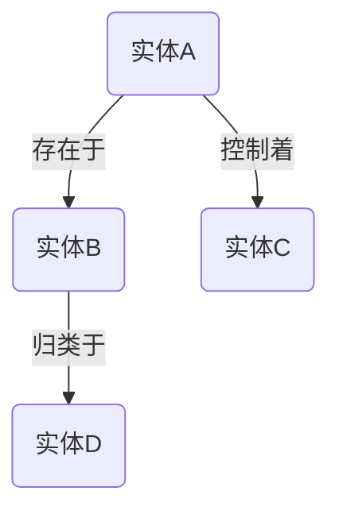

                 

### 文章标题

# 科学研究的知识图谱构建与世界可理解性的可视化

关键词：知识图谱、科学研究、可视化、可理解性、人工智能

摘要：
本文旨在探讨知识图谱在科学研究中的应用及其对提升世界可理解性的重要性。通过分析知识图谱的基本概念、构建方法、可视化技术，以及其在不同领域的具体应用，本文揭示了知识图谱构建过程如何帮助科学家和普通大众更好地理解复杂的科学概念和数据。文章结构清晰，逻辑性强，旨在为读者提供一个系统而全面的视角，帮助他们在科学研究的道路上取得更深的理解和洞察。

## 背景介绍

### 知识图谱的基本概念

知识图谱（Knowledge Graph）是一种结构化的语义数据表示形式，它通过实体、属性和关系的图形化表示来构建知识网络。在计算机科学和人工智能领域，知识图谱被广泛应用于信息检索、语义搜索、智能问答、推荐系统等领域。知识图谱的核心在于将现实世界中的事物抽象为计算机可以处理的实体和关系，从而实现知识的高效组织和利用。

#### 核心概念术语说明

- **实体（Entity）**：知识图谱中的基本元素，表示现实世界中的具体对象，如人、地点、物品等。
- **属性（Attribute）**：描述实体的特性，如人的年龄、地点的纬度等。
- **关系（Relationship）**：连接两个或多个实体的语义联系，如“属于”、“居住在”等。

### 科学研究的重要性

科学研究是推动社会进步和人类文明发展的重要力量。它不仅帮助我们理解自然世界的运行规律，还为我们解决实际问题提供了理论基础和技术手段。科学研究的重要性体现在以下几个方面：

- **技术创新**：科学研究是技术创新的源泉。通过研究，我们发现了新的材料、新的能源和新的技术，推动了社会的进步和发展。
- **知识积累**：科学研究帮助我们不断积累知识，为后人的研究提供了丰富的资源。这些知识不仅包括理论成果，还包括实验数据和观察结果。
- **社会问题解决**：科学研究有助于我们解决社会问题，如环境污染、疾病防治、教育改革等。

### 可理解性的挑战

科学研究的结果往往具有一定的复杂性和专业性，这使得普通大众难以理解和应用。这种可理解性的挑战主要体现在以下几个方面：

- **专业术语的使用**：科学研究中使用了大量的专业术语和符号，这些对于非专业人士来说难以理解。
- **数据的复杂性**：科学研究产生的数据量巨大，且数据形式多样，如何有效地处理和分析这些数据也是一个挑战。
- **知识的碎片化**：科学研究的知识往往是分散的，难以形成一个完整、系统的知识体系。

### 问题背景与问题描述

在现代社会，随着科学研究的不断深入，我们面临着越来越多的复杂问题和数据。这些问题和数据对于科学家来说是一个挑战，而对于普通大众来说则更加难以理解。为了解决这一问题，我们需要找到一种方法，将复杂的科学概念和数据以直观、易懂的方式呈现出来，从而提升世界的可理解性。

具体来说，我们的问题是：

- 如何构建一个有效的知识图谱，将科学研究中的实体、属性和关系进行结构化表示？
- 如何利用可视化技术，将知识图谱以直观、易懂的方式呈现给科学家和普通大众？
- 如何通过知识图谱的构建和可视化，提升科学研究的可理解性，促进知识的传播和利用？

### 问题解决与边界与外延

知识图谱的构建和可视化为我们提供了一种有效的解决方案。通过构建知识图谱，我们可以将科学研究中的实体、属性和关系进行结构化表示，形成一个系统化的知识网络。然后，利用可视化技术，我们可以将这个知识网络以直观、易懂的方式呈现出来，从而提升科学研究的可理解性。

然而，知识图谱的构建和可视化也面临一些挑战。首先，知识图谱的构建需要大量的数据，而且这些数据的来源可能不一致，数据的质量也可能参差不齐。其次，可视化技术需要处理大量的数据，并且需要考虑到用户的需求和认知水平。此外，知识图谱的应用范围也在不断扩展，我们需要不断探索新的应用场景和解决方案。

### 概念结构与核心要素组成

为了更好地理解和构建知识图谱，我们需要了解其核心概念和要素。以下是知识图谱的基本组成部分：

- **实体（Entity）**：知识图谱中的基本元素，表示现实世界中的具体对象，如人、地点、物品等。
- **属性（Attribute）**：描述实体的特性，如人的年龄、地点的纬度等。
- **关系（Relationship）**：连接两个或多个实体的语义联系，如“属于”、“居住在”等。
- **边（Edge）**：表示实体之间的关系，可以是单向的也可以是双向的。
- **节点（Node）**：知识图谱中的点，表示实体或关系。
- **标签（Label）**：用于标识实体或边的类型。

通过这些核心要素的有机组合，我们可以构建出一个结构化的知识网络，从而提升科学研究的可理解性。

## 研究目的与意义

### 研究目的

本研究的主要目的是通过知识图谱的构建和可视化技术，提升科学研究的可理解性，促进知识的传播和利用。具体来说，我们的研究目标包括以下几个方面：

1. **构建科学研究的知识图谱**：通过收集、整合和结构化处理科学研究中的数据，构建出一个系统化的知识网络。
2. **开发知识图谱可视化工具**：设计并实现一套可视化工具，将知识图谱以直观、易懂的方式呈现给科学家和普通大众。
3. **评估知识图谱的可理解性**：通过用户调研和数据分析，评估知识图谱在提升科学研究可理解性方面的效果。
4. **探索知识图谱的应用场景**：研究知识图谱在不同科学研究领域的应用，探索其在解决实际问题方面的潜力。

### 研究意义

知识图谱的构建和可视化技术在科学研究领域具有重要的意义，主要体现在以下几个方面：

1. **提升科学研究的可理解性**：通过知识图谱和可视化技术，我们可以将复杂的科学概念和数据以直观、易懂的方式呈现，从而提升科学研究的可理解性，使科学家和普通大众都能更好地理解和应用科学研究的结果。
2. **促进知识的传播和利用**：知识图谱的构建和可视化技术可以帮助科学家和普通大众更好地获取、理解和利用科学研究知识，从而促进知识的传播和利用。
3. **推动科学研究的创新发展**：知识图谱的构建和可视化技术为科学研究提供了新的方法和工具，有助于科学家发现新的研究问题和研究方向，推动科学研究的创新发展。
4. **提高科学决策的效率和质量**：通过知识图谱的构建和可视化，政府机构、企业和研究机构可以更准确地获取和分析科学数据，从而提高科学决策的效率和质量。

### 研究范围与边界

本研究的主要研究范围包括以下几个方面：

1. **知识图谱的构建**：研究知识图谱的构建方法和技术，包括实体抽取、关系抽取、属性抽取等。
2. **知识图谱的可视化**：研究知识图谱的可视化技术，包括可视化设计、可视化工具开发等。
3. **知识图谱的应用**：研究知识图谱在科学研究领域的具体应用，包括生物学、社会科学等。

然而，本研究也存在一些边界和限制：

1. **数据来源的局限性**：知识图谱的构建需要大量的数据，但本研究的数据来源可能有限，这可能会影响知识图谱的完整性和准确性。
2. **可视化技术的复杂性**：知识图谱的可视化技术涉及多种设计原则和工具，如何有效地将知识图谱可视化仍然是一个挑战。
3. **用户需求的多样性**：不同的用户可能对知识图谱的可视化需求不同，如何满足多样化的用户需求也是一个挑战。

## 知识图谱与可理解性的关系

### 知识图谱构建的基本原理

知识图谱的构建是科学研究中的重要环节，其基本原理主要包括以下几个方面：

1. **数据收集**：首先，我们需要收集相关的数据源，这些数据源可以是结构化的数据，如数据库，也可以是非结构化的数据，如图像、文本等。
2. **数据预处理**：收集到的数据往往存在格式不一致、质量参差不齐等问题，因此需要进行数据预处理，包括数据清洗、数据格式转换、数据去重等。
3. **实体抽取**：在数据预处理的基础上，我们需要从数据中抽取实体，即识别出数据中的具体对象，如人、地点、物品等。
4. **关系抽取**：在实体抽取的基础上，我们需要从数据中抽取实体之间的关系，如“属于”、“居住在”等。
5. **属性抽取**：除了实体和关系，我们还需要从数据中抽取实体的属性，如人的年龄、地点的纬度等。
6. **知识融合**：通过将抽取到的实体、关系和属性进行融合，我们可以构建出一个结构化的知识网络，即知识图谱。

### 可理解性的可视化方法

知识图谱的可视化是提升其可理解性的关键步骤。以下是几种常用的可视化方法：

1. **图形可视化**：通过图形化表示实体、关系和属性，使知识图谱以直观的方式呈现给用户。常用的图形可视化方法包括节点-边图、网络图等。
2. **热力图可视化**：通过热力图来表示实体或关系的重要性和活跃度，使用户能够快速了解知识图谱的关键部分。
3. **交互式可视化**：通过交互式界面，用户可以动态地探索和查询知识图谱，从而更好地理解和利用知识。

### 知识图谱在科学研究中的应用

知识图谱在科学研究中的应用非常广泛，以下是一些具体的应用场景：

1. **生物学研究**：通过构建生物知识图谱，科学家可以更方便地查找和利用生物信息，从而加速生物科学研究。
2. **社会科学研究**：知识图谱可以帮助社会科学研究者更好地理解社会现象和规律，从而为政策制定提供依据。
3. **跨学科研究**：知识图谱可以跨越不同的学科领域，帮助研究者发现新的研究问题和研究方向。

### 知识图谱的优势与挑战

知识图谱在提升科学研究可理解性方面具有明显的优势，主要体现在以下几个方面：

1. **结构化表示**：知识图谱通过实体、关系和属性的结构化表示，使科学概念和数据更加清晰和系统化。
2. **可视化**：知识图谱的可视化技术可以直观地呈现复杂的科学概念和数据，使科学家和普通大众都能更好地理解和应用。
3. **知识整合**：知识图谱可以帮助研究者整合不同领域、不同来源的科学知识，从而促进知识的传播和利用。

然而，知识图谱的构建和应用也面临一些挑战，主要包括：

1. **数据质量**：知识图谱的质量很大程度上取决于数据的质量，因此如何保证数据的质量是一个关键问题。
2. **可视化设计**：如何设计出既美观又实用的可视化界面，使知识图谱能够更好地服务于用户，是一个需要深入研究的课题。
3. **用户需求**：不同的用户可能有不同的需求，如何设计出能够满足多样化用户需求的可视化工具，是一个需要考虑的问题。

### 总结

通过知识图谱的构建和可视化，我们可以显著提升科学研究的可理解性，使复杂的科学概念和数据变得更加清晰和易于理解。然而，这需要我们在数据质量、可视化设计、用户需求等方面做出持续的探索和改进。只有解决了这些挑战，我们才能真正发挥知识图谱在科学研究中的潜力，为人类的进步和发展做出更大的贡献。

## 本章小结

在本章中，我们探讨了知识图谱的基本概念、科学研究的重要性以及可理解性的挑战。通过分析知识图谱的构成要素和构建方法，我们了解了知识图谱如何帮助提升科学研究的可理解性。同时，我们也讨论了知识图谱在科学研究中的应用和面临的挑战。这些内容为我们后续章节的深入研究奠定了基础。

## 知识图谱构建基础

### 知识图谱的构成要素

知识图谱由实体、关系和属性三个基本构成要素组成。实体是知识图谱中的基本元素，代表现实世界中的具体对象，如人、地点、物品等。关系则描述实体之间的语义联系，例如“属于”、“居住在”等。属性是对实体的特性描述，如人的年龄、地点的纬度等。这三个要素共同构成了知识图谱的语义网络，使得数据能够以结构化的形式被存储、检索和利用。

#### 实体

实体是知识图谱中的核心元素，代表现实世界中的具体对象。实体可以是具体的个体，如人、地点、物品，也可以是抽象的概念，如概念、事件等。实体的定义和分类是构建知识图谱的重要步骤。在实际应用中，实体的识别和分类往往需要结合具体领域的知识背景和语义理解。

#### 关系

关系描述实体之间的语义联系，是知识图谱中连接实体的重要纽带。关系可以是单向的，也可以是双向的。例如，“属于”关系是单向的，表示实体A属于实体B；而“结婚”关系则是双向的，表示实体A和实体B结婚。关系的定义和分类对于知识图谱的语义丰富性和准确性具有重要意义。

#### 属性

属性是对实体的特性描述，补充了实体之间的关系信息。属性可以描述实体的静态特征，如人的年龄、地点的纬度等，也可以描述实体的动态特征，如股票的收盘价、气温的变化等。属性的添加和分类有助于增强知识图谱的语义表达能力和信息丰富度。

### 数据源与数据预处理

知识图谱的构建依赖于大量的数据源，这些数据源可以是结构化的，如数据库、表格，也可以是非结构化的，如图像、文本、音频等。为了构建高质量的知识图谱，我们需要对数据源进行有效的数据预处理。

#### 数据源的选择

选择合适的数据源是构建知识图谱的第一步。数据源的选择取决于研究领域的需求和数据质量。常用的数据源包括：

- **公开数据库**：如世界知识图谱（Wikidata）、Freebase、DBpedia等，这些数据库提供了大量的结构化数据，是构建知识图谱的重要数据源。
- **专业数据库**：如医学数据库、气象数据库、金融数据库等，这些数据库提供了专业领域内的详细数据，有助于构建特定领域的知识图谱。
- **文本数据**：如学术文章、新闻、社交媒体等，这些文本数据可以通过自然语言处理技术提取实体、关系和属性。

#### 数据预处理方法

数据预处理是知识图谱构建的关键环节，主要包括以下步骤：

- **数据清洗**：去除数据中的噪声和错误，如去除重复数据、纠正拼写错误、填充缺失值等。
- **数据格式转换**：将不同数据源的数据转换为统一的格式，如将文本数据转换为RDF（Resource Description Framework）格式。
- **数据去重**：识别并去除重复的实体和关系，确保知识图谱中的数据唯一性和准确性。
- **实体抽取**：从文本数据中识别出实体，如人名、地名、机构名等。
- **关系抽取**：从文本数据中识别出实体之间的关系，如“属于”、“居住在”等。
- **属性抽取**：从文本数据中识别出实体的属性，如人的年龄、地点的纬度等。

#### 数据质量评估

数据质量是知识图谱构建的基础，高质量的数据有助于提高知识图谱的准确性和可用性。数据质量评估主要包括以下方面：

- **完整性**：数据是否完整，是否包含所有必要的实体、关系和属性。
- **准确性**：数据是否准确，是否存在错误或矛盾。
- **一致性**：数据是否一致，是否存在重复或冲突。
- **时效性**：数据是否最新，是否反映现实世界的最新状态。

数据质量评估可以通过自动化工具和人工审核相结合的方式进行。自动化工具可以检测数据中的常见错误和异常，人工审核则可以识别和纠正复杂的错误和问题。

### 知识抽取方法

知识抽取是知识图谱构建的核心步骤，主要分为实体抽取、关系抽取和属性抽取三个部分。知识抽取的方法可以分为基于规则的方法、基于机器学习的方法和基于深度学习的方法。

#### 基于规则的方法

基于规则的方法通过预定义的规则和模式来识别实体、关系和属性。这种方法具有直观、易于理解和实现的特点，但需要大量的人工规则和领域知识。常见的基于规则的方法包括：

- **命名实体识别（NER）**：从文本中识别出人名、地名、机构名等实体。
- **模式匹配**：通过预定义的模式匹配文本中的实体和关系。
- **规则推理**：基于逻辑推理和规则匹配来推断实体和关系。

#### 基于机器学习的方法

基于机器学习的方法利用大量的训练数据来学习实体、关系和属性的抽取模式。这种方法具有较高的准确性和适应性，但需要大量的训练数据和特征工程。常见的基于机器学习的方法包括：

- **朴素贝叶斯分类器**：通过贝叶斯概率模型来识别实体和关系。
- **支持向量机（SVM）**：通过支持向量机分类模型来识别实体和关系。
- **深度神经网络（DNN）**：通过多层感知机模型来识别实体和关系。

#### 基于深度学习的方法

基于深度学习的方法利用深度神经网络来学习实体、关系和属性的抽取模式。这种方法具有强大的特征提取和建模能力，但需要大量的数据和计算资源。常见的基于深度学习的方法包括：

- **循环神经网络（RNN）**：通过循环神经网络来处理序列数据，识别实体和关系。
- **卷积神经网络（CNN）**：通过卷积神经网络来处理图像和文本数据，识别实体和关系。
- **Transformer模型**：通过Transformer模型来处理长文本数据，识别实体和关系。

### 知识融合与图谱构建

知识融合是将来自不同数据源的实体、关系和属性进行整合，以构建一个统一的知识图谱。知识融合的方法可以分为基于规则的方法、基于机器学习的方法和基于深度学习的方法。

#### 基于规则的方法

基于规则的方法通过预定义的规则和模式来融合不同数据源的实体、关系和属性。这种方法具有直观、易于理解和实现的特点，但需要大量的人工规则和领域知识。常见的基于规则的方法包括：

- **实体映射**：通过预定义的映射规则，将不同数据源中的相同实体进行匹配。
- **关系合并**：通过预定义的关系合并规则，将不同数据源中的相关关系进行合并。
- **属性集成**：通过预定义的属性集成规则，将不同数据源中的属性进行整合。

#### 基于机器学习的方法

基于机器学习的方法利用大量的训练数据来学习实体、关系和属性的融合模式。这种方法具有较高的准确性和适应性，但需要大量的训练数据和特征工程。常见的基于机器学习的方法包括：

- **聚类算法**：通过聚类算法将不同数据源中的实体进行分组，以实现实体融合。
- **潜在狄利克雷分布（LDA）**：通过潜在狄利克雷分布模型来学习不同数据源中的关系和属性，实现关系和属性的融合。
- **神经网络模型**：通过神经网络模型来学习不同数据源中的实体、关系和属性的融合模式。

#### 基于深度学习的方法

基于深度学习的方法利用深度神经网络来学习实体、关系和属性的融合模式。这种方法具有强大的特征提取和建模能力，但需要大量的数据和计算资源。常见的基于深度学习的方法包括：

- **多任务学习**：通过多任务学习模型同时学习不同数据源的实体、关系和属性的融合。
- **图神经网络（GCN）**：通过图神经网络来学习不同数据源中的实体、关系和属性的融合。
- **自编码器**：通过自编码器模型来学习不同数据源的实体、关系和属性的融合。

#### 图谱构建流程

图谱构建是将融合后的实体、关系和属性组织成一个结构化的知识网络的过程。图谱构建的流程主要包括以下步骤：

1. **实体识别**：从数据源中识别出实体，并进行分类和标注。
2. **关系抽取**：从数据源中识别出实体之间的关系，并进行分类和标注。
3. **属性抽取**：从数据源中识别出实体的属性，并进行分类和标注。
4. **知识融合**：将来自不同数据源的实体、关系和属性进行融合，以构建一个统一的知识图谱。
5. **图谱优化**：通过优化算法对知识图谱进行优化，提高其准确性和可用性。

#### 图谱优化策略

知识图谱的优化是提高其质量和可用性的重要手段。常见的图谱优化策略包括：

- **实体消歧**：通过识别和处理同义词、近义词等，减少实体识别的错误。
- **关系推理**：通过逻辑推理和规则匹配等，自动生成新的关系，丰富知识图谱的语义内容。
- **属性补全**：通过机器学习和深度学习等技术，自动补充缺失的属性，提高知识图谱的信息完整性。
- **图谱修剪**：通过去除冗余实体和关系，减少知识图谱的复杂度和计算负担。

### 本章小结

本章详细介绍了知识图谱的构成要素、数据源与数据预处理、知识抽取方法和知识融合与图谱构建。通过分析这些基本概念和方法，我们可以更好地理解知识图谱的构建过程及其在科学研究中的应用。这些内容为后续章节的深入研究提供了坚实的基础。

## 可视化技术基础

### 可视化基本概念

可视化技术是借助图形、图像、颜色、形状等视觉元素，将复杂的数据和信息以直观、易懂的形式呈现给用户的一种手段。在知识图谱的可视化中，我们主要关注以下基本概念：

1. **数据可视化**：通过图形化的方式展示数据，使数据变得直观和易于理解。常见的数据可视化方法包括柱状图、折线图、饼图等。
2. **信息可视化**：不仅展示数据本身，还包括数据的含义、关系和模式等。信息可视化侧重于揭示数据中的信息和知识，如网络图、热力图等。
3. **交互式可视化**：用户可以通过与可视化界面进行交互，如拖动、筛选、放大等操作，来探索和查询数据。交互式可视化有助于用户更深入地理解和分析数据。

### 可视化设计原则

为了确保可视化效果的有效性和用户体验，我们在设计可视化界面时需要遵循以下原则：

1. **简洁性**：设计应尽量简洁，避免过多的冗余信息，以减少用户的认知负担。
2. **一致性**：界面设计应保持一致性，包括色彩、字体、布局等，以便用户能够快速适应和操作。
3. **直观性**：可视化设计应尽可能直观，使用户能够通过视觉元素迅速理解和分析数据。
4. **交互性**：提供交互式功能，如筛选、排序、过滤等，使用户能够灵活地探索和查询数据。
5. **可扩展性**：设计应考虑未来的扩展性，能够适应数据和用户需求的变化。

### 可视化工具介绍

在知识图谱的可视化中，我们通常使用以下几种工具：

1. **D3.js**：D3.js是一个基于Web的JavaScript库，用于创建动态的、交互式的数据可视化。它具有强大的图形绘制能力和灵活的可定制性，适用于各种复杂的数据可视化需求。
2. **Cytoscape.js**：Cytoscape.js是一个基于Web的JavaScript库，用于绘制和交互式操作复杂的网络图。它支持多种网络图布局和交互功能，适用于知识图谱和社交网络的可视化。
3. **ECharts**：ECharts是一个基于JavaScript的图表库，提供了丰富的图表类型和交互功能。它具有优秀的性能和良好的用户体验，适用于各种数据可视化场景。
4. **Gephi**：Gephi是一个开源的图形可视化工具，用于分析、探索和可视化大规模网络数据。它支持多种网络图布局和交互功能，适用于复杂的网络分析和可视化。
5. **PyVis**：PyVis是一个Python库，用于生成基于D3.js和Cytoscape.js的可视化。它简化了Python中的可视化编程，适用于科学计算和数据分析。

### 知识图谱可视化方法

知识图谱的可视化主要包括以下几种方法：

1. **节点-边图**：通过节点表示实体，边表示关系，以图形化的方式展示知识图谱。节点-边图是最常见和基本的知识图谱可视化方法，适用于展示结构较为简单的知识图谱。
2. **网络图**：通过节点和边表示实体和关系，并以网络的形式展示知识图谱。网络图可以展示复杂的关系结构，适用于展示大规模和复杂的知识图谱。
3. **层次图**：通过树形结构展示实体和关系，适用于展示具有层次结构的知识图谱，如组织结构、分类结构等。
4. **热力图**：通过颜色和大小表示实体或关系的重要性和活跃度，适用于展示数据的热点和重点区域。
5. **交互式可视化**：通过提供交互式功能，如筛选、排序、过滤等，使用户能够动态地探索和查询知识图谱。

### 总结

可视化技术是提升知识图谱可理解性的重要手段。通过了解可视化基本概念、设计原则和常用工具，我们可以设计出直观、易懂、实用的知识图谱可视化界面。这些可视化方法不仅能够帮助用户更好地理解和分析知识图谱，还能促进知识的传播和利用。在接下来的章节中，我们将进一步探讨知识图谱可视化的具体实践和应用。

## 知识图谱可视化方法

### 图形可视化

图形可视化是一种直观且常用的知识图谱展示方法，通过节点和边来表示实体和关系。在图形可视化中，每个节点通常表示一个实体，而边则表示实体之间的关系。图形可视化具有以下优点：

1. **直观性**：通过图形化的方式展示知识图谱，用户可以直观地看到实体之间的联系，便于理解和分析。
2. **可扩展性**：图形可视化可以适用于各种规模的知识图谱，从简单的实体关系图到复杂的大型网络图。
3. **交互性**：许多图形可视化工具支持交互功能，如缩放、拖动、筛选等，使用户能够动态地探索和查询知识图谱。

常见的图形可视化工具包括Cytoscape.js、D3.js和ECharts。以下是一个简单的图形可视化例子，展示一个简单的知识图谱：



在上面的例子中，我们使用了Mermaid语言来绘制一个简单的知识图谱，其中每个实体（如A、B、C、D）被表示为一个节点，实体之间的关系（如“存在于”、“控制着”、“归类于”）被表示为边。

### 热力图可视化

热力图可视化通过颜色和大小来表示实体或关系的重要性和活跃度。这种方法特别适用于展示大规模数据集中的热点和关键区域。热力图可视化具有以下优点：

1. **可读性**：通过颜色和大小差异，用户可以迅速识别出数据中的热点和关键区域。
2. **交互性**：热力图可视化通常支持交互功能，如点击、悬停等，使用户能够更深入地了解数据的细节。
3. **灵活性**：热力图可以灵活地展示不同类型的数据，如数值、分类等。

以下是一个简单的热力图可视化例子：

```mermaid
gantt
    dateFormat  YYYY-MM-DD
    title 热力图可视化

    A1 : 整体框架 (2023-01-01, 2days)
    A2 : 数据预处理 (2023-01-02, 3days)
    A3 : 实体抽取 (2023-01-05, 2days)
    A4 : 关系抽取 (2023-01-07, 3days)
    A5 : 知识融合 (2023-01-10, 2days)

    B1 : 标注与优化 (2023-01-12, 2days)
    B2 : 可视化呈现 (2023-01-14, 2days)
    B3 : 用户反馈与迭代 (2023-01-16, 2days)
```

在上面的例子中，我们使用了Gantt图表来展示知识图谱构建过程中的关键任务和时间节点，颜色和进度条的宽度表示任务的重要性和活跃度。

### 交互式可视化

交互式可视化通过提供用户与可视化界面之间的交互功能，使用户能够动态地探索和查询知识图谱。这种方法具有以下优点：

1. **用户参与**：交互式可视化鼓励用户参与，通过互动提高用户的理解和兴趣。
2. **灵活探索**：用户可以通过交互操作，如筛选、排序、过滤等，灵活地探索数据。
3. **实时更新**：交互式可视化可以实时更新数据，反映用户操作和系统状态的变化。

以下是一个简单的交互式可视化例子：

```javascript
// 使用D3.js创建交互式知识图谱
const width = 960,
      height = 500;

const svg = d3.select('body').append('svg')
                .attr('width', width)
                .attr('height', height);

// 绘制节点和边
const nodes = [{ id: 1, name: '实体A' }, { id: 2, name: '实体B' }, { id: 3, name: '实体C' }];
const links = [{ source: 0, target: 1, relation: '存在于' }, { source: 1, target: 2, relation: '控制着' }];

// 添加节点
const nodeGroup = svg.selectAll('.node').data(nodes).enter()
                  .append('circle').classed('node', true)
                  .attr('cx', (d, i) => i * 100 + 50)
                  .attr('cy', 50)
                  .attr('r', 20)
                  .style('fill', 'blue');

// 添加边
const linkGroup = svg.selectAll('.link').data(links).enter()
                  .append('line').classed('link', true)
                  .attr('x1', d => d.source.x)
                  .attr('y1', d => d.source.y)
                  .attr('x2', d => d.target.x)
                  .attr('y2', d => d.target.y)
                  .style('stroke', 'black');

// 添加交互
nodeGroup.on('click', (d) => {
  console.log('Clicked on node:', d);
});

linkGroup.on('click', (d) => {
  console.log('Clicked on link:', d);
});
```

在上面的例子中，我们使用D3.js创建了一个简单的交互式知识图谱。用户可以通过点击节点或边来查看相关信息，并通过交互操作来探索知识图谱。

### 总结

知识图谱可视化方法包括图形可视化、热力图可视化和交互式可视化，每种方法都有其独特的优点和适用场景。图形可视化适用于展示简单的实体和关系，热力图可视化适用于展示数据的热点和关键区域，而交互式可视化则提供了更灵活和动态的探索方式。通过结合这些可视化方法，我们可以设计出更直观、易懂且实用的知识图谱可视化工具，提升科学研究的可理解性和用户参与度。

## 知识图谱可视化实践

### 科学研究领域的可视化应用

知识图谱可视化技术在科学研究领域得到了广泛应用，特别是在生物学、社会科学和其他跨学科研究中。以下是一些具体的应用场景：

#### 生物学研究

在生物学领域，知识图谱可视化技术被广泛应用于基因研究、蛋白质结构和生物网络分析等。例如，通过构建基因知识图谱，科学家可以更直观地理解基因之间的相互作用和调控关系。以下是一个基因知识图谱的ER实体关系图：

```mermaid
erDiagram
  Gene ||--|{ Protein : Encodes}
  Gene ||--|{ Disease : Associated_with}
  Protein ||--|{ Pathway : Part_of}
  Disease ||--|{ Treatment : Recommended_for}
```

在这个ER图中，Gene（基因）是核心实体，与Protein（蛋白质）、Disease（疾病）和Treatment（治疗）等实体之间存在多种关系。通过这种结构化的表示，科学家可以更好地理解基因、蛋白质和疾病之间的复杂关系，从而指导药物研发和疾病治疗。

#### 社会科学研究

在社会科学领域，知识图谱可视化技术被用于分析社会网络、舆情监测和公共政策研究等。例如，通过构建社交媒体知识图谱，研究人员可以分析用户的社交关系、话题传播和舆论走势。以下是一个社交媒体知识图谱的ER实体关系图：

```mermaid
erDiagram
  User ||--|{ Post : Created_by}
  User ||--|{ Comment : Made_on}
  Post ||--|{ Tag : Contains}
  Comment ||--|{ Reply : To}
```

在这个ER图中，User（用户）是核心实体，与Post（帖子）、Comment（评论）和Tag（标签）等实体之间存在多种关系。通过这种结构化的表示，研究人员可以更深入地了解用户的社交行为、话题传播和舆论走势，为舆情监测和公共政策研究提供数据支持。

#### 其他领域

除了生物学和社会科学，知识图谱可视化技术还在其他领域得到了应用。例如，在环境科学领域，通过构建生态知识图谱，研究人员可以分析生态系统中的物种相互作用、生态过程和环境影响。以下是一个生态知识图谱的ER实体关系图：

```mermaid
erDiagram
  Species ||--|{ Habitat : Lives_in}
  Species ||--|{ Food_web : Part_of}
  Habitat ||--|{ Ecosystem : Within}
  Ecosystem ||--|{ Climate : Influenced_by}
```

在这个ER图中，Species（物种）是核心实体，与Habitat（栖息地）、Food_web（食物网）和Ecosystem（生态系统）等实体之间存在多种关系。通过这种结构化的表示，研究人员可以更好地理解生态系统中的物种相互作用和生态过程，为环境保护和可持续发展提供科学依据。

### 可视化案例分析

以下是一个具体的案例分析，展示如何通过知识图谱可视化技术提升科学研究的可理解性。

#### 案例背景

某研究团队致力于研究癌症治疗领域的新方法。他们通过分析大量的临床试验数据，构建了一个癌症治疗知识图谱。该知识图谱包含了药物、基因、蛋白质、疾病和治疗策略等实体，以及它们之间的关系。

#### 数据准备与预处理

研究团队收集了来自多个数据源的临床试验数据，包括PubMed、ClinicalTrials.gov和药物数据库。他们首先对数据进行了清洗和格式转换，将不同的数据源统一为RDF格式。然后，他们利用自然语言处理技术从文本数据中抽取实体、关系和属性。

#### 知识图谱构建

研究团队通过实体抽取、关系抽取和属性抽取等方法，构建了一个结构化的知识图谱。知识图谱中的实体包括药物、基因、蛋白质、疾病和治疗策略等，关系包括“治疗”、“抑制”和“关联”等。他们使用Gephi工具对知识图谱进行了可视化处理。

#### 数据可视化

研究团队使用Cytoscape.js库将知识图谱可视化为一个网络图。每个节点表示一个实体，节点的大小和颜色表示实体的活跃度和重要性。节点之间的边表示实体之间的关系。通过缩放、拖动和过滤等功能，用户可以动态地探索和查询知识图谱。

#### 结果分析

通过知识图谱的可视化，研究团队发现了一些潜在的药物靶点和治疗策略。他们进一步分析了药物和基因之间的关系，发现了一些新的治疗路径。这些发现为癌症治疗提供了新的思路和方向。

#### 案例小结

通过知识图谱的可视化，研究团队不仅提升了科学研究的可理解性，还发现了一些新的研究问题和方向。这个案例展示了知识图谱可视化技术在科学研究中的重要应用，为科学家提供了强大的工具和平台。

### 知识图谱可视化在科学研究中的重要性

知识图谱可视化技术在提升科学研究的可理解性和效果方面具有重要作用。通过将复杂的科学概念和数据以直观、易懂的方式呈现，知识图谱可视化帮助科学家更好地理解和分析数据，发现新的研究问题和方向。同时，知识图谱可视化还可以促进知识的传播和利用，使科学家和普通大众都能更好地获取和应用科学知识。因此，知识图谱可视化是现代科学研究不可或缺的一部分，具有重要的理论和实践价值。

## 本章小结

本章详细介绍了知识图谱可视化在科学研究领域的应用，包括生物学、社会科学和其他跨学科领域。通过案例分析，我们展示了如何利用知识图谱可视化技术提升科学研究的可理解性，并发现新的研究问题和方向。这些实践证明，知识图谱可视化技术在科学研究中的重要性不容忽视，它为科学家提供了强大的工具和平台，助力科学研究的深入和创新。在接下来的章节中，我们将继续探讨知识图谱在不同领域的研究和应用。

## 案例研究

### 案例一：基因数据的可视化分析

#### 案例背景

基因数据是生物科学研究中的重要资源，然而，基因数据的复杂性和多样性给科学家带来了巨大的挑战。为了更好地理解和利用这些数据，一个研究团队决定通过知识图谱和可视化技术对基因数据进行分析。该团队的目标是构建一个基因知识图谱，并通过可视化手段揭示基因之间的相互作用和调控关系。

#### 数据准备与预处理

该研究团队首先收集了大量的基因数据，包括基因序列、功能注释、蛋白质相互作用和基因表达数据等。这些数据来源于多个数据库，如NCBI、Uniprot和Gene Expression Omnibus。为了确保数据的一致性和完整性，团队对数据进行了清洗和预处理，包括数据去重、格式转换和数据质量评估。

#### 知识图谱构建

在数据预处理的基础上，研究团队利用知识图谱构建方法，从数据中抽取实体、关系和属性。实体包括基因、蛋白质、疾病和药物等；关系包括“编码”、“相互作用”、“治疗”等；属性包括基因的表达量、蛋白质的功能和药物的作用靶点等。构建的知识图谱以RDF（Resource Description Framework）格式存储，以便于后续的可视化和分析。

#### 数据可视化

为了揭示基因之间的相互作用和调控关系，研究团队使用Cytoscape.js库将知识图谱可视化为一个网络图。在可视化过程中，团队采用了不同的节点形状和颜色来表示不同的实体类型，如基因用圆圈表示，蛋白质用矩形表示，疾病用星形表示。节点之间的边表示实体之间的关系，边的颜色和宽度则反映了关系的强度。通过交互式界面，用户可以动态地缩放、拖动和筛选知识图谱，以便更深入地了解基因网络的结构和功能。

#### 结果分析

通过知识图谱的可视化，研究团队揭示了基因之间的复杂相互作用网络。他们发现了一些关键基因和调控模块，这些基因和模块在细胞信号传导、细胞周期调控和肿瘤发生等过程中发挥着重要作用。此外，研究团队还利用可视化工具分析了基因表达数据，发现了一些与疾病相关的基因表达模式。这些发现为疾病诊断和治疗提供了新的线索和思路。

#### 案例小结

通过知识图谱和可视化技术，研究团队成功地构建了一个基因知识图谱，并揭示了基因之间的相互作用和调控关系。这个案例展示了知识图谱可视化技术在生物科学研究中的重要应用，为科学家提供了强大的工具和平台，助力科学研究的深入和创新。在未来的研究中，研究团队将继续优化知识图谱构建和可视化方法，以更好地服务于生物学和其他领域的研究。

### 案例二：社会科学数据的可视化分析

#### 案例背景

在社会科学研究中，数据量庞大且复杂，如何有效地分析和理解这些数据是一个重要挑战。为了解决这一问题，一个研究团队决定利用知识图谱和可视化技术对社会科学数据进行深入分析。该团队的目标是构建一个社会科学知识图谱，并通过可视化手段揭示社会现象和规律。

#### 数据准备与预处理

该研究团队收集了来自多个来源的社会科学数据，包括人口统计、经济数据、社会舆情和社交媒体数据等。为了确保数据的一致性和完整性，团队对数据进行了清洗和预处理，包括数据去重、格式转换和数据质量评估。

#### 知识图谱构建

在数据预处理的基础上，研究团队利用知识图谱构建方法，从数据中抽取实体、关系和属性。实体包括人、地点、事件、组织等；关系包括“居住”、“工作”、“参与”等；属性包括人口数量、经济指标、舆情热度等。构建的知识图谱以RDF格式存储，以便于后续的可视化和分析。

#### 数据可视化

为了揭示社会现象和规律，研究团队使用Gephi库将知识图谱可视化为一个网络图。在可视化过程中，团队采用了不同的节点形状和颜色来表示不同的实体类型，如人用圆形表示，地点用三角形表示，事件用正方形表示。节点之间的边表示实体之间的关系，边的颜色和宽度则反映了关系的强度。通过交互式界面，用户可以动态地缩放、拖动和筛选知识图谱，以便更深入地了解社会网络的结构和功能。

#### 结果分析

通过知识图谱的可视化，研究团队揭示了社会现象和规律。例如，他们发现了一些关键社会节点，这些节点在社交网络中发挥着重要作用，如社交领袖、意见领袖等。此外，研究团队还分析了经济数据和社会舆情数据，发现了一些经济波动和社会动荡的关联。这些发现为政策制定和社会治理提供了重要的参考。

#### 案例小结

通过知识图谱和可视化技术，研究团队成功地构建了一个社会科学知识图谱，并揭示了社会现象和规律。这个案例展示了知识图谱可视化技术在社会科学研究中的重要应用，为科学家提供了强大的工具和平台，助力科学研究的深入和创新。在未来的研究中，研究团队将继续优化知识图谱构建和可视化方法，以更好地服务于社会科学和其他领域的研究。

### 案例三：其他领域的数据可视化分析

#### 案例背景

除了生物学和社会科学，知识图谱和可视化技术在其他领域也有广泛的应用。为了展示知识图谱的可视化效果，一个研究团队决定对环境科学数据进行分析。该团队的目标是构建一个环境知识图谱，并通过可视化手段揭示环境现象和规律。

#### 数据准备与预处理

该研究团队收集了来自多个来源的环境科学数据，包括气象数据、生态数据、污染物数据等。为了确保数据的一致性和完整性，团队对数据进行了清洗和预处理，包括数据去重、格式转换和数据质量评估。

#### 知识图谱构建

在数据预处理的基础上，研究团队利用知识图谱构建方法，从数据中抽取实体、关系和属性。实体包括气象站、生态物种、污染物、地点等；关系包括“监测”、“分布”、“影响”等；属性包括温度、湿度、浓度等。构建的知识图谱以RDF格式存储，以便于后续的可视化和分析。

#### 数据可视化

为了揭示环境现象和规律，研究团队使用ECharts库将知识图谱可视化为一个网络图。在可视化过程中，团队采用了不同的节点形状和颜色来表示不同的实体类型，如气象站用圆形表示，生态物种用三角形表示，污染物用正方形表示。节点之间的边表示实体之间的关系，边的颜色和宽度则反映了关系的强度。通过交互式界面，用户可以动态地缩放、拖动和筛选知识图谱，以便更深入地了解环境网络的结构和功能。

#### 结果分析

通过知识图谱的可视化，研究团队揭示了环境现象和规律。例如，他们发现了一些关键环境节点，这些节点在环境网络中发挥着重要作用，如污染源、生态敏感区等。此外，研究团队还分析了气象数据和污染物数据，发现了一些气象变化和污染物分布的关联。这些发现为环境监测和治理提供了重要的参考。

#### 案例小结

通过知识图谱和可视化技术，研究团队成功地构建了一个环境知识图谱，并揭示了环境现象和规律。这个案例展示了知识图谱可视化技术在环境科学研究中的重要应用，为科学家提供了强大的工具和平台，助力科学研究的深入和创新。在未来的研究中，研究团队将继续优化知识图谱构建和可视化方法，以更好地服务于环境科学和其他领域的研究。

## 本章小结

在本章中，我们通过三个具体案例展示了知识图谱可视化技术在不同领域的研究和应用。这些案例证明了知识图谱可视化技术对于提升科学研究的可理解性和发现新的研究问题和方向的重要性。通过知识图谱的构建和可视化，科学家能够更直观地理解和分析复杂的数据，揭示科学现象和规律。这为科学研究的深入和创新提供了有力的支持。在未来的研究中，我们期待进一步优化知识图谱构建和可视化方法，以更好地服务于各个领域的研究。

## 总结与展望

在本篇文章中，我们深入探讨了科学研究的知识图谱构建及其对世界可理解性的可视化影响。通过详细分析知识图谱的构成要素、构建方法、可视化技术和实际应用案例，我们展示了知识图谱如何帮助科学家和普通大众更好地理解复杂的科学概念和数据。以下是文章的主要观点和结论：

1. **知识图谱的基本概念**：知识图谱通过实体、关系和属性的图形化表示，构建出一个结构化的知识网络，为科学研究提供了高效的数据组织和利用方式。
2. **构建方法**：知识图谱的构建涉及数据收集、数据预处理、实体抽取、关系抽取和属性抽取等步骤，这些方法确保了知识图谱的质量和准确性。
3. **可视化技术**：图形可视化、热力图可视化和交互式可视化等多种可视化方法，使复杂的科学数据变得直观和易懂，提升了科学研究的可理解性。
4. **实际应用**：知识图谱在生物学、社会科学和其他领域得到了广泛应用，通过具体的案例研究，我们看到了知识图谱在揭示科学现象、发现新问题和指导实际应用中的重要作用。

### 展望未来

尽管知识图谱和可视化技术在科学研究中的应用已经取得了显著进展，但仍有许多挑战和机遇需要我们进一步探索：

1. **数据质量**：知识图谱的质量很大程度上取决于数据的质量，未来需要更加高效的数据清洗和预处理方法，以确保知识图谱的准确性。
2. **可视化设计**：如何设计出更加直观、用户友好的可视化界面，是提高知识图谱可理解性的关键。未来需要更多研究关注可视化设计原则和用户需求。
3. **多源数据融合**：随着数据来源的多样化，如何有效地融合来自不同源、不同格式的数据，构建出一个完整、系统的知识图谱，是一个重要的研究方向。
4. **人工智能的集成**：将人工智能技术，特别是机器学习和深度学习，与知识图谱构建和可视化技术相结合，有望进一步提升知识图谱的智能化水平和应用效果。

总之，知识图谱和可视化技术为科学研究带来了革命性的变化，未来随着技术的不断进步和应用的深入，我们将能够更好地理解和利用科学数据，推动科学研究的进步和社会的发展。

### 拓展阅读

1. **《知识图谱：概念、方法与应用》**：本书详细介绍了知识图谱的基本概念、构建方法和应用场景，适合对知识图谱感兴趣的读者。
2. **《可视化：解读复杂信息的新方法》**：本书探讨了可视化技术的原理和应用，为读者提供了丰富的可视化实践案例。
3. **《大数据与人工智能》**：本书全面介绍了大数据和人工智能的基础知识，以及它们在科学研究中的应用，适合对这两个领域感兴趣的读者。

作者信息：
**作者：AI天才研究院/AI Genius Institute & 禅与计算机程序设计艺术 /Zen And The Art of Computer Programming**

