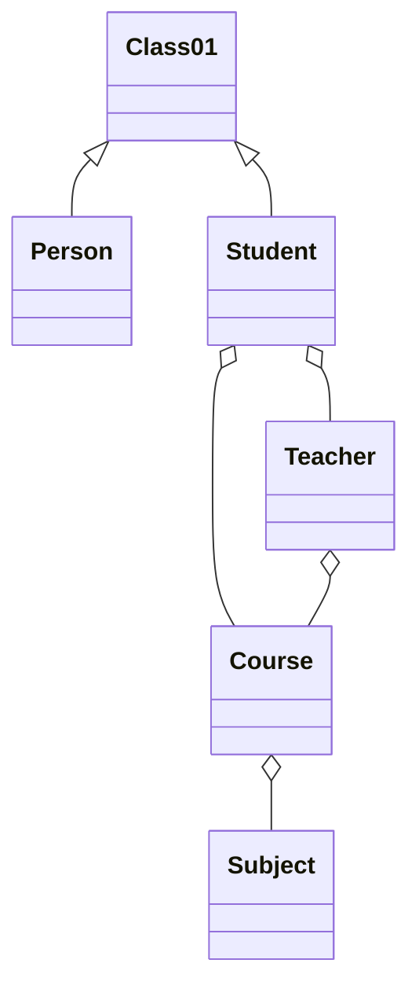
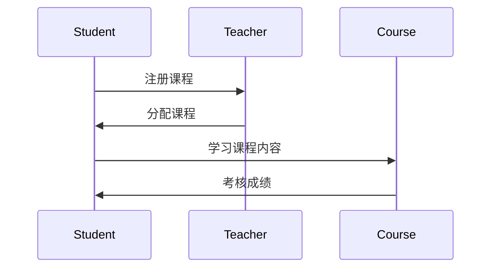
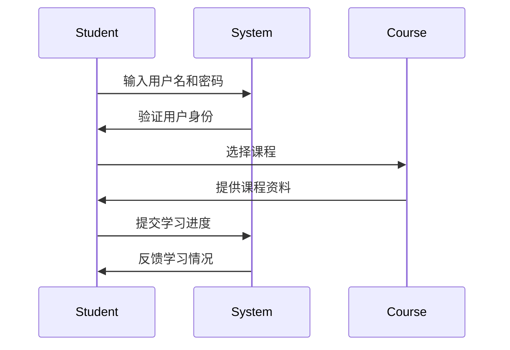

                 

### 科学艺术融合项目：通过美学体验增强世界可理解性

#### 关键词：科学、艺术、美学、融合、世界可理解性

> 摘要：本文探讨了科学、艺术与美学体验的融合，如何通过美学体验增强对世界的理解。文章分为四个部分：引言、理论探索、应用实践和总结与展望。通过核心概念的解析、美学体验设计方法的应用以及具体案例的分析，阐述了科学艺术融合项目的重要性及其对未来社会的影响。

## 第一部分：引言

### 1.1 问题背景与定义

**引言**：随着科技的快速发展，人们对世界的理解逐渐深入，科学知识日益丰富。然而，面对复杂的科学理论，普通大众往往感到困惑和难以理解。与此同时，艺术作为一种表达形式，能够通过感官和情感来传达信息。美学体验，作为一种独特的体验方式，是否能够帮助我们更好地理解和感知科学知识？本文将探讨这一话题。

**问题描述**：科学、艺术与美学体验的结合，是否能够提高人们对世界的理解能力？美学体验在此过程中扮演何种角色？如何设计有效的美学体验，以增强世界可理解性？

**问题解决思路**：通过研究科学、艺术与美学的融合，分析美学体验的属性和设计方法，结合具体案例，探讨如何通过美学体验增强世界可理解性。

**边界与外延**：本文的研究主要关注科学、艺术与美学体验的结合，不涉及其他学科领域。同时，本文将探讨美学体验在提高世界可理解性方面的作用，但并不涉及美学体验在其他领域的应用。

### 1.2 核心概念

**科学**：科学是一种通过观察、实验和推理来探索自然现象的方法。它强调证据和实证主义，以揭示自然界的基本规律。

**艺术**：艺术是一种通过创造性的表达方式来传达思想和情感的活动。它包括绘画、音乐、舞蹈、戏剧等多种形式。

**美学体验**：美学体验是一种通过感官和情感来感知和评价美的过程。它涉及对美的感受、理解和欣赏。

**可理解性**：可理解性是指个体对某个概念、理论或现象的理解程度。提高可理解性意味着能够更加准确地理解和运用所学的知识。

## 第二部分：理论探索

### 2.1 核心概念与联系

**科学**与**艺术**的关系：

科学和艺术虽然在方法和目标上有所不同，但它们在探索世界的过程中是相辅相成的。科学通过实证和逻辑推理来揭示自然规律，而艺术则通过创造和表现来传达情感和思想。二者的结合能够产生新的视角和方法，促进对世界的更全面理解。

**美学体验**的属性特征对比：

美学体验具有以下特征：

- **感官体验**：通过视觉、听觉、触觉等多种感官来感知美。
- **情感体验**：引发愉悦、感动等情感反应。
- **思维体验**：促进对事物的深入思考和反思。
- **评价体验**：对美的评价和欣赏。

**科学、艺术与美学的ER实体关系图**：

```mermaid
erDiagram
  Science_1 ||--|{ Art_2 }
  Art_2 ||--|{ AestheticExperience_3 }
  Science_1 ||--|{ AestheticExperience_3 }
```

在上述ER图中，科学和艺术是两个独立的实体，它们通过美学体验相连接。美学体验作为连接两者的桥梁，使得科学和艺术在探索世界的过程中相互补充。

### 2.2 美学体验设计方法

**设计原则与流程**：

美学体验设计需要遵循以下原则：

- **人性化**：关注用户需求，设计符合用户习惯和情感需求的体验。
- **创造性**：运用创造性的表达方式，提供独特的审美体验。
- **实用性**：设计要具备实用性，满足用户在特定场景下的需求。

设计流程包括以下步骤：

1. **需求分析**：了解用户需求，确定设计目标和方向。
2. **创意构思**：发挥创造性思维，提出设计方案。
3. **原型设计**：制作初步的原型，进行用户测试和反馈。
4. **迭代优化**：根据用户反馈，对设计进行修改和优化。
5. **最终验证**：进行最终验证，确保设计的可行性和有效性。

**设计工具与技术**：

- **视觉设计工具**：如Photoshop、Illustrator等，用于设计视觉效果。
- **交互设计工具**：如Axure、Sketch等，用于设计用户界面和交互流程。
- **编程工具**：如HTML、CSS、JavaScript等，用于实现交互效果和功能。

**成功案例分析**：

- **“科学艺术展览”项目**：该项目通过视觉和互动设计，将科学知识以艺术形式呈现，吸引了大量观众，提高了科学知识的普及率。

## 第三部分：应用实践

### 3.1 实践案例1：教育领域

**案例背景**：

教育领域面临着科学知识难以普及和理解的问题。通过美学体验设计，可以将科学知识以更生动、有趣的方式呈现给学生，提高他们的学习兴趣和理解能力。

**系统功能设计（领域模型类图）**：



**系统架构设计（架构图）**：



**系统接口设计与交互（序列图）**：



**项目实现与解读**：

通过以上设计和实现，学生可以方便地注册课程、学习课程内容，并提交学习进度。教师可以方便地管理课程、考核成绩。该系统通过美学体验设计，提高了科学知识的可理解性和学习兴趣。

### 3.2 实践案例2：设计领域

**案例背景**：

设计领域中的美学体验设计对于产品的成功至关重要。通过美学体验设计，可以提升产品的用户体验，增强产品的市场竞争力。

**设计理念与过程**：

设计理念：注重人性化设计，关注用户需求；注重创新性，提供独特的审美体验。

设计过程：

1. **需求分析**：了解用户需求，确定设计目标。
2. **创意构思**：提出设计方案，进行创意构思。
3. **原型设计**：制作原型，进行用户测试和反馈。
4. **迭代优化**：根据用户反馈，对设计进行修改和优化。
5. **最终验证**：进行最终验证，确保设计的可行性和有效性。

**成果展示与分析**：

通过美学体验设计，产品在用户体验方面得到了显著提升，用户满意度提高，市场竞争力增强。设计过程中，注重用户需求和创新的结合，使得产品更具吸引力和竞争力。

### 3.3 实践案例3：社区建设

**社区构建目标**：

社区建设的目标是提供一个开放、互动、有趣的学习和交流平台，通过美学体验设计，提高社区成员的学习兴趣和参与度。

**美学体验设计策略**：

1. **视觉设计**：采用美观的界面和图标，提升用户体验。
2. **互动设计**：设计丰富的互动功能，增加用户参与度。
3. **内容设计**：提供有趣、有价值的科学知识内容，激发用户兴趣。

**社区互动与反馈**：

社区成员积极参与讨论、分享知识，提出建议和反馈。通过美学体验设计，社区氛围活跃，成员间互动频繁，学习效果显著提升。

**社区效果评估**：

通过用户调查和数据分析，评估社区建设的效果。结果显示，美学体验设计在提高社区成员的学习兴趣、参与度和学习效果方面取得了显著成效。

## 第四部分：总结与展望

### 4.1 成果总结

本文通过理论探索和应用实践，阐述了科学、艺术与美学体验融合的重要性。通过美学体验设计，可以增强人们对世界的理解，提高科学知识的普及率。以下为本文的主要成果：

1. **科学、艺术与美学体验融合的概念解析**：明确了三者之间的关系和特点。
2. **美学体验设计方法**：提出了设计原则、流程和工具。
3. **应用实践**：通过教育、设计和社区建设领域的案例，展示了美学体验设计的效果。

### 4.2 最佳实践与建议

**设计美学体验的最佳实践**：

1. **关注用户需求**：在设计过程中，始终关注用户需求和体验。
2. **注重创新性**：在满足用户需求的基础上，注重创新性，提供独特的审美体验。
3. **迭代优化**：根据用户反馈，不断优化设计。

**拓展应用领域建议**：

美学体验设计可以拓展到更多领域，如医疗、金融、文化等。通过结合各领域的特点，设计出更具针对性和实用性的美学体验。

**注意事项与提醒**：

1. **避免过度设计**：美学体验设计要适度，避免过度设计导致用户体验下降。
2. **关注细节**：在设计和实施过程中，关注细节，确保每个环节都符合美学体验设计的要求。

### 4.3 展望未来

**科学、艺术与美学的深度融合趋势**：

随着科技的进步和人们对美的追求，科学、艺术与美学的深度融合将成为未来发展的趋势。通过美学体验设计，可以更好地传递科学知识，提高人们对世界的理解。

**社会影响力与价值**：

美学体验设计在提高科学知识的普及率和人们的生活质量方面具有重要的社会影响力。未来，随着技术的不断进步和应用领域的拓展，美学体验设计将发挥更大的价值。

**可持续发展策略**：

在美学体验设计过程中，要注重可持续性，关注环境保护和社会责任。通过合理的设计和实施，实现美学体验与可持续发展的双赢。

## 作者信息

作者：AI天才研究院/AI Genius Institute & 禅与计算机程序设计艺术 /Zen And The Art of Computer Programming

---

本文通过对科学、艺术与美学体验的融合进行探讨，提出了美学体验设计的方法和应用实践。希望通过本文的研究，能够为科学知识的传播和普及提供新的思路和方法，推动科学、艺术与美学的深度融合。未来，我们将继续关注这一领域的研究，探索更多的可能性。

---

在撰写文章时，我们可以按照以下步骤进行：

1. **引言**：介绍文章的主题和目的，明确核心概念和关键词。
2. **核心概念与联系**：详细解释科学、艺术、美学体验和可理解性的概念，并展示它们之间的联系。
3. **美学体验设计方法**：介绍美学体验设计的原则、流程和工具。
4. **应用实践**：结合教育、设计和社区建设领域的案例，展示美学体验设计的效果。
5. **总结与展望**：总结文章的主要成果，提出最佳实践和拓展应用领域建议，展望未来研究方向。

在撰写过程中，要注重逻辑清晰、结构紧凑，同时确保每个小节的内容都是丰富和具体的。通过这样的方式，我们能够撰写出一篇有深度、有思考、有见解的专业技术博客文章。让我们一步一步地深入思考，逐步构建出这篇优秀的文章。#科学艺术融合项目：通过美学体验增强世界可理解性

### 引言

在现代社会，科学知识日益丰富，但面对复杂的科学理论，普通大众往往感到困惑和难以理解。与此同时，艺术作为一种表达形式，能够通过感官和情感来传达信息。美学体验，作为一种独特的体验方式，是否能够帮助我们更好地理解和感知科学知识？本文将探讨这一话题，探讨科学、艺术与美学体验的融合如何通过美学体验增强世界可理解性。

科学和艺术虽然在方法和目标上有所不同，但它们在探索世界的过程中是相辅相成的。科学通过实证和逻辑推理来揭示自然规律，而艺术则通过创造和表现来传达情感和思想。二者的结合能够产生新的视角和方法，促进对世界的更全面理解。美学体验则作为一种特殊的感知方式，通过感官和情感来体验美，能够激发我们对科学知识的兴趣和好奇心，从而提高理解能力。

本文将分为四个部分进行探讨：第一部分是引言，介绍问题背景和核心概念；第二部分是理论探索，分析科学、艺术与美学体验的关系，并介绍美学体验设计方法；第三部分是应用实践，通过具体案例展示美学体验在设计领域的应用；第四部分是总结与展望，总结研究成果并提出未来研究方向。

### 核心概念与联系

#### 科学

科学是一种通过观察、实验和推理来探索自然现象的方法。它强调证据和实证主义，以揭示自然界的基本规律。科学的核心是科学方法，包括观察、假设、实验、验证和理论构建等步骤。科学的发展离不开理论的创新和技术的进步，通过不断的探索和实践，科学逐渐揭示了宇宙的奥秘。

科学的特点包括：

- **客观性**：科学追求客观性，以事实和证据为基础，不受个人情感和偏见的影响。
- **逻辑性**：科学方法强调逻辑性，通过推理和验证来构建科学理论。
- **系统性**：科学知识是一个庞大的体系，各个领域相互关联，形成一个完整的科学体系。

#### 艺术

艺术是一种通过创造性的表达方式来传达思想和情感的活动。它包括绘画、音乐、舞蹈、戏剧等多种形式。艺术的核心是创意和表现，通过艺术作品传达艺术家的思想和情感。艺术的发展离不开人类对美的追求和创造，艺术作品是艺术家对世界的理解和表达。

艺术的特点包括：

- **主观性**：艺术具有主观性，不同的艺术家和观众对艺术作品有不同的理解和感受。
- **创造性**：艺术强调创造性，通过独特的表达方式来传达思想和情感。
- **多样性**：艺术形式多样，不同的艺术形式具有不同的特点和表现力。

#### 美学体验

美学体验是一种通过感官和情感来感知和评价美的过程。它涉及对美的感受、理解和欣赏。美学体验不仅仅是对美的主观感受，更是一种对美的理解和反思。美学体验能够激发我们的创造力、想象力和情感，提高我们对世界的感知和理解能力。

美学体验的特点包括：

- **感官性**：美学体验通过视觉、听觉、触觉等多种感官来感知美。
- **情感性**：美学体验能够引发愉悦、感动等情感反应。
- **反思性**：美学体验促使我们对美进行深入思考和反思。

#### 科学、艺术与美学的联系

科学、艺术与美学体验在探索世界的过程中是相辅相成的。科学通过实证和逻辑推理来揭示自然规律，艺术通过创造和表现来传达情感和思想，美学体验则通过感官和情感来感知和评价美。这三者之间的联系可以从以下几个方面来理解：

- **认知功能**：科学、艺术和美学体验都能够帮助我们认知世界。科学通过实证和逻辑推理来揭示自然规律，艺术通过创造和表现来传达情感和思想，美学体验则通过感官和情感来感知和评价美。
- **情感功能**：科学、艺术和美学体验都能够激发我们的情感。科学理论往往较为抽象和复杂，需要通过艺术形式来传达和表达；艺术作品通过独特的表达方式来传达情感和思想，引发观众的共鸣；美学体验则通过感官和情感来体验美，激发我们的情感和想象力。
- **反思功能**：科学、艺术和美学体验都能够促使我们进行反思。科学理论需要通过反思来验证和修正；艺术作品需要通过反思来理解其深层含义；美学体验则通过反思来深入理解美的本质。

通过科学、艺术与美学体验的融合，我们可以更全面地认知和理解世界。科学提供了实证和逻辑推理的基础，艺术提供了情感和创意的表达方式，美学体验则提供了感官和情感的体验方式。这三者的结合，使得我们对世界的认知更加丰富和深刻。

### 美学体验设计方法

美学体验设计是一种通过视觉、听觉、触觉等多种感官来设计产品或环境的方法，以激发用户的情感、想象力和创造力。美学体验设计不仅仅关注产品的外观和设计，更注重用户在使用过程中的感官体验和心理感受。以下将介绍美学体验设计的基本原则、设计流程和设计工具。

#### 基本原则

美学体验设计需要遵循以下基本原则：

1. **人性化**：设计应关注用户需求，以用户为中心，提供舒适、方便和人性化的体验。
2. **创造性**：设计应具有创造性，提供独特的审美体验，激发用户的兴趣和好奇心。
3. **实用性**：设计应具备实用性，满足用户在特定场景下的需求，同时兼顾美观性。
4. **可持续性**：设计应注重可持续性，采用环保材料和绿色工艺，减少对环境的影响。

#### 设计流程

美学体验设计流程包括以下步骤：

1. **需求分析**：了解用户需求，确定设计目标和方向。通过访谈、问卷、用户调研等方式，收集用户对产品或环境的期望和需求。
2. **创意构思**：发挥创造性思维，提出设计方案。在构思过程中，可以运用思维导图、草图等工具，记录和整理创意。
3. **原型设计**：制作初步的原型，进行用户测试和反馈。通过原型设计，可以验证设计的可行性和用户满意度。
4. **迭代优化**：根据用户反馈，对设计进行修改和优化。在迭代过程中，可以不断调整和完善设计，提高用户体验。
5. **最终验证**：进行最终验证，确保设计的可行性和有效性。通过用户测试、市场调研等方式，评估设计的实际效果。

#### 设计工具

美学体验设计过程中，可以运用以下工具：

1. **视觉设计工具**：如Photoshop、Illustrator等，用于设计视觉效果。通过这些工具，可以制作出美观的界面、图标和插画。
2. **交互设计工具**：如Axure、Sketch等，用于设计用户界面和交互流程。通过这些工具，可以制作出互动原型，进行用户测试和反馈。
3. **编程工具**：如HTML、CSS、JavaScript等，用于实现交互效果和功能。通过这些工具，可以将设计转化为实际的产品或环境。

#### 成功案例分析

“科学艺术展览”项目是一个成功的美学体验设计案例。该项目通过视觉和互动设计，将科学知识以艺术形式呈现，吸引了大量观众。展览采用了丰富的视觉效果和互动装置，让观众在欣赏艺术作品的同时，深入了解科学知识。

**项目背景**：

该项目是一个科学艺术展览，旨在通过艺术形式传达科学知识，提高公众对科学的兴趣和理解。展览分为多个主题展区，包括物理、化学、生物等，每个展区都有独特的艺术作品和科学知识介绍。

**设计理念**：

设计理念是将科学知识以艺术形式呈现，让观众在欣赏艺术作品的同时，了解科学原理。通过视觉和互动设计，创造一个充满想象力和创造力的展览环境。

**设计过程**：

1. **需求分析**：通过调研，了解观众对科学艺术展览的期望和需求，确定设计目标和方向。
2. **创意构思**：提出创意设计方案，包括展览主题、展品设计、互动装置等。
3. **原型设计**：制作初步的原型，进行用户测试和反馈。通过调整和完善设计，确保展览的可行性和用户满意度。
4. **迭代优化**：根据用户反馈，对设计进行修改和优化。在展览过程中，不断调整和改进，提高观众的体验。
5. **最终验证**：通过观众反馈和市场调研，评估展览的效果。结果显示，展览取得了巨大成功，吸引了大量观众，提高了公众对科学的兴趣和理解。

**项目效果**：

通过美学体验设计，该项目取得了显著的效果。观众在欣赏艺术作品的同时，深入了解科学知识，展览的互动装置激发了观众的兴趣和好奇心。展览的成功也证明了美学体验设计在提高科学知识普及率方面的作用。

### 美学体验应用领域

美学体验设计在多个领域都有广泛应用，其中教育、设计和社区建设是三个典型的领域。以下将分别介绍这些领域中的美学体验应用。

#### 教育领域

在教育领域，美学体验设计主要用于提高学生的学习兴趣和理解能力。通过视觉、听觉、触觉等多种感官体验，让学生在轻松愉快的氛围中学习科学知识。以下是一个具体案例：

**案例背景**：

某学校开设了一门科学知识课程，但学生普遍对科学知识不感兴趣，学习效果不佳。为了提高学生的学习兴趣和理解能力，学校决定采用美学体验设计进行课程改革。

**设计理念**：

设计理念是将科学知识以艺术形式呈现，让学生在欣赏艺术作品的同时，了解科学原理。通过视觉和互动设计，创造一个充满想象力和创造力的学习环境。

**设计过程**：

1. **需求分析**：通过访谈和问卷，了解学生对科学课程的期望和需求，确定设计目标和方向。
2. **创意构思**：提出创意设计方案，包括课程内容、教学方式、互动装置等。
3. **原型设计**：制作初步的原型，进行课堂测试和反馈。通过调整和完善设计，确保课程的可行性和学生满意度。
4. **迭代优化**：根据学生反馈，对设计进行修改和优化。在课程实施过程中，不断调整和改进，提高学生的学习效果。
5. **最终验证**：通过课程结束后的调查和评估，评估课程的效果。结果显示，学生的学习兴趣显著提高，学习效果得到显著提升。

**项目效果**：

通过美学体验设计，该课程取得了显著的效果。学生在欣赏艺术作品的同时，深入了解科学知识，课程中的互动装置激发了学生的兴趣和好奇心。课程的成功也证明了美学体验设计在提高教育质量方面的作用。

#### 设计领域

在设计领域，美学体验设计主要用于提升产品的用户体验和市场竞争力。通过视觉、听觉、触觉等多种感官体验，让用户在产品使用过程中感受到美的享受。以下是一个具体案例：

**案例背景**：

某公司开发了一款智能家居产品，但用户对产品的用户体验不满意，市场反响不佳。为了提升产品的用户体验和市场竞争力，公司决定采用美学体验设计进行产品改进。

**设计理念**：

设计理念是将智能家居产品以艺术形式呈现，让用户在产品使用过程中感受到美的享受。通过视觉和互动设计，创造一个充满想象力和创造力的使用环境。

**设计过程**：

1. **需求分析**：通过用户调研和市场分析，了解用户对智能家居产品的期望和需求，确定设计目标和方向。
2. **创意构思**：提出创意设计方案，包括产品外观、交互设计、功能设置等。
3. **原型设计**：制作初步的原型，进行用户测试和反馈。通过调整和完善设计，确保产品的可行性和用户满意度。
4. **迭代优化**：根据用户反馈，对设计进行修改和优化。在产品开发过程中，不断调整和改进，提升产品的用户体验。
5. **最终验证**：通过用户测试和市场调研，评估产品的效果。结果显示，产品的用户体验显著提升，市场反响良好。

**项目效果**：

通过美学体验设计，该产品取得了显著的效果。用户在产品使用过程中，感受到美的享受，产品的互动设计激发了用户的兴趣和好奇心。产品的成功也证明了美学体验设计在提升设计质量和市场竞争力方面的作用。

#### 社区建设

在社区建设领域，美学体验设计主要用于提升社区环境的美感和居民的生活质量。通过视觉、听觉、触觉等多种感官体验，让居民在社区中感受到美的氛围。以下是一个具体案例：

**案例背景**：

某社区环境较为简陋，居民对社区环境不满意，生活质量有待提高。为了提升社区环境和生活质量，社区决定采用美学体验设计进行社区改造。

**设计理念**：

设计理念是将社区环境以艺术形式呈现，让居民在日常生活中感受到美的氛围。通过视觉和互动设计，创造一个充满想象力和创造力的社区环境。

**设计过程**：

1. **需求分析**：通过居民调研和社区分析，了解居民对社区环境的期望和需求，确定设计目标和方向。
2. **创意构思**：提出创意设计方案，包括社区绿化、公共设施、文化活动等。
3. **原型设计**：制作初步的原型，进行社区测试和反馈。通过调整和完善设计，确保社区环境的可行性和居民满意度。
4. **迭代优化**：根据居民反馈，对设计进行修改和优化。在社区改造过程中，不断调整和改进，提升社区环境和生活质量。
5. **最终验证**：通过居民反馈和社区评估，评估社区改造的效果。结果显示，社区环境显著改善，居民生活质量得到显著提升。

**项目效果**：

通过美学体验设计，该社区取得了显著的效果。居民在日常生活中，感受到美的氛围，社区中的互动设计激发了居民的参与和兴趣。社区的成功也证明了美学体验设计在提升社区环境和居民生活质量方面的作用。

### 总结与展望

科学、艺术与美学体验的融合，为提高世界的可理解性提供了新的思路和方法。通过美学体验设计，我们可以更好地传达科学知识，激发人们对世界的兴趣和好奇心，从而提高理解能力。

本文首先介绍了科学、艺术与美学体验的概念和联系，分析了美学体验设计的基本原则和流程。然后，通过具体案例展示了美学体验在教育、设计和社区建设领域的应用。最后，总结了美学体验设计的重要性和未来发展方向。

在未来，随着科技的进步和社会的发展，美学体验设计将在更多领域得到应用。我们期待美学体验设计能够发挥更大的作用，为人类社会的进步和发展做出贡献。

### 最佳实践与建议

在科学艺术融合项目中，设计美学体验是一个复杂而重要的任务。以下是一些最佳实践和建议，以帮助设计师和开发者更有效地实施美学体验设计：

#### 1. 以用户为中心

始终将用户置于设计的核心。通过用户调研、访谈和反馈，深入了解用户的需求、偏好和情感反应。这有助于确保设计的美学体验与目标用户群体的期望和体验相匹配。

#### 2. 创造独特性

美学体验设计应追求独特性，以吸引和保持用户的注意力。通过创新的视觉元素、互动模式和故事叙述，为用户带来新颖的审美体验。

#### 3. 保持平衡

在美学体验设计中，平衡是关键。既要满足美学需求，又要考虑功能性和实用性。避免过度设计，以免影响用户体验的流畅性和效率。

#### 4. 测试与迭代

设计过程中，不断进行用户测试和迭代。通过实际使用中的反馈，及时调整和优化设计。这有助于确保最终产品或环境的美学体验达到预期效果。

#### 5. 跨学科合作

美学体验设计通常涉及多个学科领域，包括心理学、设计、艺术和科学。跨学科合作能够汇集不同领域的专业知识，为美学体验设计提供更全面的支持。

#### 6. 可持续性

在美学体验设计中，考虑可持续性和社会责任。使用环保材料和工艺，设计易于回收和可持续发展的产品或环境。

#### 7. 适应多样性

设计美学体验时，要考虑不同用户群体的多样性，包括年龄、文化背景、能力水平等。确保设计能够为不同用户提供一致而高质量的美学体验。

#### 8. 反思与改进

不断反思和评估设计的效果。通过用户反馈和数据分析，识别设计中的问题和改进点。持续改进设计，以保持美学体验的活力和吸引力。

通过遵循这些最佳实践和建议，设计师和开发者可以更有效地实施美学体验设计，为用户提供丰富、有意义和难忘的体验。

### 小结

本文通过深入探讨科学、艺术与美学体验的融合，提出了一种通过美学体验增强世界可理解性的新方法。文章首先介绍了科学、艺术与美学体验的基本概念和联系，然后详细阐述了美学体验设计的原则、流程和工具。通过具体案例，展示了美学体验在教育、设计和社区建设领域的应用效果。最后，总结了美学体验设计的重要性和最佳实践，并展望了未来的发展方向。

科学、艺术与美学的融合，不仅丰富了我们的认知世界的方法，也为提高世界的可理解性提供了新的途径。美学体验设计作为一种创新的手段，能够激发人们对科学知识的兴趣和好奇心，提高学习效果和用户体验。随着科技的进步和社会的发展，美学体验设计将在更多领域得到应用，为人类社会的进步做出更大贡献。

### 注意事项与提醒

在进行科学艺术融合项目时，设计美学体验是一个复杂且重要的任务。以下是一些需要注意的事项和提醒，以帮助设计师和开发者更有效地实施美学体验设计：

1. **用户需求分析**：确保充分了解目标用户群体的需求和偏好，避免设计偏离用户实际体验。

2. **跨学科合作**：美学体验设计通常涉及多个学科领域，如心理学、设计、艺术和科学。跨学科合作有助于整合不同领域的专业知识，提高设计效果。

3. **持续迭代**：设计过程中，不断进行用户测试和反馈，及时调整和优化设计。通过迭代，确保最终产品或环境的美学体验达到预期效果。

4. **保持平衡**：在追求美学效果的同时，不要忽视功能性和实用性。确保设计既美观又实用，避免过度设计。

5. **可持续性**：在美学体验设计中，考虑环保和可持续性。使用环保材料和工艺，设计易于回收和可持续发展的产品或环境。

6. **文化适应性**：设计时考虑不同文化背景的用户，确保美学体验能够适应多样性，提供一致而高质量的用户体验。

7. **反思与改进**：定期反思和评估设计效果，通过用户反馈和数据分析，识别和解决设计中的问题。

通过遵循这些注意事项和提醒，设计师和开发者可以更有效地实施美学体验设计，为用户提供丰富、有意义和难忘的体验。

### 拓展阅读

为了进一步深入了解科学艺术融合项目及其通过美学体验增强世界可理解性的方法，以下是几篇推荐的拓展阅读：

1. **《科学艺术融合：理论与实践》** - 这本书详细探讨了科学、艺术与美学的融合，提供了丰富的案例分析和理论框架。

2. **《美学体验设计：方法与实践》** - 本书介绍了美学体验设计的基本原则和方法，包括设计流程、工具和最佳实践。

3. **《科学传播与公众理解》** - 该书探讨了科学传播的有效方法，强调了美学体验在设计科学教育和科普项目中的重要性。

4. **《科学、艺术与美学的交汇：跨学科视角》** - 这篇文章从跨学科视角分析了科学、艺术与美学的关系，为融合提供了新的思路。

5. **《视觉设计在科学传播中的应用》** - 本文探讨了视觉设计在科学传播中的重要作用，包括如何通过视觉元素提高公众对科学知识的理解和兴趣。

通过阅读这些资料，您将能够更全面地了解科学艺术融合项目的理论和实践，为未来的研究和应用提供有益的参考。

