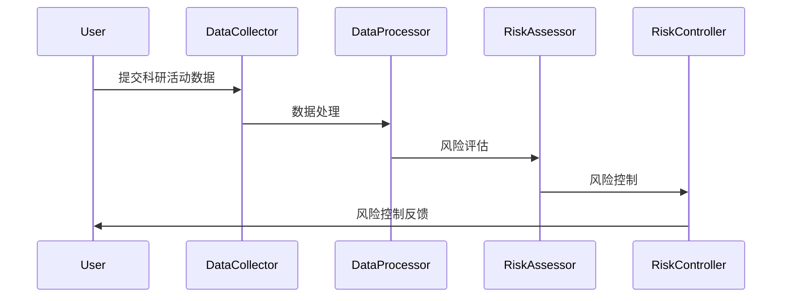

                 

### 文章标题

## 科研风险评估新方法论：平衡知识探索与潜在危害的策略

### 关键词

- 科研风险评估
- 知识探索
- 潜在危害
- 风险平衡
- 策略

### 摘要

随着科学研究的深入，科研活动中潜在的风险因素逐渐凸显。如何有效地进行科研风险评估，成为科研管理工作的重要课题。本文提出一种新的科研风险评估方法论，通过平衡知识探索与潜在危害，提供一套完整的策略，旨在提升科研活动的安全性和效率。本文首先介绍科研活动中的主要风险因素，分析传统风险评估方法的局限性，然后阐述新方法论的核心概念和原理，最后通过具体应用场景和案例分析，展示新方法论的实践效果。

## 第一部分：问题背景与核心概念

### 1.1 背景介绍

科研活动是推动社会进步的重要力量，然而，在科研过程中，各种风险因素不可避免。这些风险不仅包括实验操作中的物理和化学风险，还可能涉及生物安全、数据隐私和社会影响等方面。例如，基因编辑技术虽然为疾病治疗带来了新希望，但也引发了对生物伦理和生态安全的担忧。因此，如何全面识别和评估这些风险，成为科研管理中亟待解决的重要问题。

### 1.2 科研风险评估的必要性

科研风险评估的必要性在于其能够帮助科研人员更好地理解和控制科研活动中潜在的危害，从而保障科研活动的安全性。同时，风险评估还能提高科研活动的透明度和可追溯性，有助于防范和应对可能发生的危机。因此，建立科学、有效的风险评估体系，对于提升科研管理水平、保障科研人员的安全、保护公共利益具有重要意义。

### 1.3 传统风险评估方法的局限性

传统风险评估方法主要依赖于专家经验和已有案例，虽然在一定程度上能够起到预警作用，但存在以下局限性：

1. **主观性较强**：风险评估过程往往依赖于专家的主观判断，缺乏客观、系统的评估标准。
2. **滞后性明显**：传统方法通常在风险事件发生后进行评估，难以实现提前预防和控制。
3. **全面性不足**：传统方法往往注重单一领域或特定类型的风险，难以全面覆盖科研活动的各个方面。

### 1.4 风险评估的定义

风险评估是一种系统化的过程，旨在识别、评估和优先处理潜在的风险，从而降低风险发生的可能性或影响。在科研领域，风险评估主要包括以下几个方面：

1. **风险识别**：识别科研活动中可能存在的各种风险因素。
2. **风险分析**：分析风险发生的可能性及其可能造成的影响。
3. **风险评估**：根据风险分析结果，对风险进行排序和分类，确定优先处理的风险。
4. **风险控制**：制定和实施控制措施，降低风险发生的可能性或影响。

### 1.5 风险评估的分类

根据风险评估的对象和范围，可以将风险评估分为以下几类：

1. **按领域分类**：包括生物安全、信息安全、物理安全等。
2. **按阶段分类**：包括科研前风险评估、科研中风险评估和科研后风险评估。
3. **按方法分类**：包括定性风险评估、定量风险评估和综合风险评估。

### 1.6 关键风险指标（KRI）

关键风险指标（KRI）是评估风险程度的重要指标。常见的KRI包括风险概率、风险影响、风险程度、风险优先级等。以下是一个示例表格，展示了不同领域的KRI：

| 风险领域 | 关键风险指标（KRI） |
| --- | --- |
| 生物安全 | 1. 生物样本泄露概率 2. 病原体传播风险 3. 生物危害等级 |
| 信息安全 | 1. 网络攻击概率 2. 数据泄露风险 3. 系统可用性下降 |
| 物理安全 | 1. 设备故障概率 2. 人员伤害风险 3. 环境污染风险 |

### 1.7 概念属性特征对比表格

| 概念 | 属性1 | 属性2 | 属性3 |
| --- | --- | --- | --- |
| 风险评估 | 识别 | 评估 | 控制 |
| 风险识别 | 主观性 | 客观性 | 可追溯性 |
| 风险分析 | 可能性 | 影响 | 程度 |
| 风险控制 | 预防 | 应对 | 降低 |

### 1.8 ER实体关系图架构

为了更好地理解科研风险评估系统的架构，我们使用ER（Entity-Relationship）图来展示实体及其关系。以下是一个简化的ER图，展示了关键实体和它们之间的关系：

```mermaid
erDiagram
  RiskAssessment ||--|{ RiskFactor } : "has multiple"
  RiskFactor ||--|{ RiskEvent } : "may cause"
  RiskEvent ||--|{ RiskImpact } : "has"
  RiskImpact ||--|{ RiskControl } : "is mitigated by"
```

## 第二部分：新方法论介绍

### 2.1 新方法论概述

新方法论旨在克服传统风险评估方法的局限性，通过系统化的流程和工具，实现全面、实时和客观的风险评估。该方法论的核心思想是平衡知识探索与潜在危害，既不放弃科学研究的探索精神，又注重风险的管理和控制。新方法论的主要特点如下：

1. **系统化流程**：新方法论采用系统化的流程，包括风险识别、风险评估、风险控制和监控等环节，确保风险评估的全面性和连续性。
2. **实时性**：新方法论利用现代信息技术，实现风险评估的实时更新和动态调整，提高风险管理的时效性。
3. **客观性**：新方法论通过定量分析和数据驱动的方式，降低风险评估的主观性，提高评估结果的准确性和可靠性。
4. **知识整合**：新方法论强调知识管理，通过整合各类知识资源，为风险评估提供全面的信息支持。

### 2.2 新方法论的核心原理

新方法论的核心原理可以概括为以下三个方面：

1. **风险模型构建**：通过建立风险模型，系统性地识别和描述科研活动中可能存在的风险因素及其相互关系。
2. **风险分析**：利用定量分析方法，对风险因素进行评估，确定其可能性和影响程度。
3. **风险控制**：基于风险评估结果，制定和实施相应的风险控制措施，降低风险发生的可能性和影响程度。

### 2.3 新方法论与传统方法的对比

新方法论在多个方面优于传统方法，具体对比如下：

1. **评估范围**：新方法论不仅关注单一领域或特定类型的风险，还综合考虑科研活动的整体风险，实现全面覆盖。
2. **评估时效**：新方法论通过实时更新和动态调整，提高评估的时效性，实现对风险变化的快速响应。
3. **评估方法**：新方法论采用定量分析方法，降低风险评估的主观性，提高评估结果的准确性和可靠性。
4. **知识管理**：新方法论强调知识管理，通过整合各类知识资源，为风险评估提供全面的信息支持。

## 第三部分：方法论应用与实践

### 3.1 应用场景分析

新方法论可以应用于多种科研场景，包括生物科学、化学实验、环境科学等。以下分别介绍这些场景中风险评估的应用。

#### 3.1.1 生物科学研究中的风险评估

在生物科学研究中，风险评估主要集中在生物安全和伦理问题。例如，基因编辑技术的应用需要评估基因变异的可能性、生物样本泄露的风险等。新方法论通过建立风险模型，系统性地识别和描述这些风险因素，并利用定量分析方法进行评估，为科研管理和决策提供科学依据。

#### 3.1.2 化学实验中的风险控制

在化学实验中，风险评估主要集中在化学品的处理和储存、实验设备的可靠性等方面。新方法论通过建立风险模型，识别和评估化学实验中可能存在的风险因素，并制定相应的风险控制措施，确保实验过程的安全。

#### 3.1.3 环境科学领域中的应用

在环境科学研究中，风险评估主要集中在环境污染、生态系统破坏等方面。新方法论通过建立风险模型，系统性地识别和评估环境科学研究中可能存在的风险因素，为环境治理和生态保护提供科学依据。

### 3.2 实际案例解析

以下通过三个实际案例，展示新方法论在不同科研场景中的应用效果。

#### 3.2.1 案例一：药物研发中的风险评估

某药物研发公司在进行新药研发过程中，采用新方法论进行风险评估。首先，公司建立了药物研发过程中的风险模型，包括生物样本处理、化学合成、临床试验等环节。然后，利用定量分析方法，对每个环节的风险因素进行评估，确定其可能性和影响程度。最后，根据风险评估结果，公司制定了相应的风险控制措施，如加强生物样本管理、改进化学合成工艺等，确保药物研发过程的安全和高效。

#### 3.2.2 案例二：空间探索中的风险控制

某航天机构在执行空间探索任务时，采用新方法论进行风险评估。首先，机构建立了空间探索过程中的风险模型，包括发射阶段、飞行阶段、着陆阶段等。然后，利用定量分析方法，对每个阶段的风险因素进行评估，确定其可能性和影响程度。最后，根据风险评估结果，机构制定了相应的风险控制措施，如改进发射系统、优化飞行轨迹等，确保空间探索任务的安全和成功。

#### 3.2.3 案例三：环境保护项目中的风险管理

某环境保护项目在进行环境治理时，采用新方法论进行风险管理。首先，项目团队建立了环境治理过程中的风险模型，包括水质监测、土壤修复、生态保护等环节。然后，利用定量分析方法，对每个环节的风险因素进行评估，确定其可能性和影响程度。最后，根据风险评估结果，项目团队制定了相应的风险控制措施，如加强水质监测、优化土壤修复方案等，确保环境治理项目的顺利进行。

## 第四部分：系统架构与实现

### 4.1 风险评估系统的设计与实现

#### 4.1.1 需求分析

为了满足科研风险评估的需求，系统需要具备以下功能：

1. 风险识别：系统能够自动识别科研活动中可能存在的风险因素。
2. 风险评估：系统能够根据风险识别结果，对风险因素进行评估，确定其可能性和影响程度。
3. 风险控制：系统能够根据风险评估结果，制定和实施相应的风险控制措施。
4. 风险监控：系统能够实时监控风险变化，及时调整风险控制措施。

#### 4.1.2 架构设计

风险评估系统采用分布式架构，包括数据采集层、数据处理层、风险评估层和风险控制层。以下是一个简化的架构图：



#### 4.1.3 功能模块

风险评估系统的主要功能模块包括：

1. **数据采集模块**：负责收集科研活动中的各种数据，如实验记录、设备状态、环境参数等。
2. **数据处理模块**：负责对采集到的数据进行分析和处理，提取关键风险因素。
3. **风险评估模块**：负责对风险因素进行评估，确定其可能性和影响程度。
4. **风险控制模块**：负责根据风险评估结果，制定和实施相应的风险控制措施。
5. **风险监控模块**：负责实时监控风险变化，及时调整风险控制措施。

### 4.2 系统实现与部署

#### 4.2.1 开发环境与工具

风险评估系统的开发环境包括Python、Docker、Kubernetes等。主要工具包括Jupyter Notebook、PyCharm、Docker Compose等。

#### 4.2.2 系统核心实现源代码

以下是一个简单的Python代码示例，用于实现风险评估系统中的数据处理模块：

```python
import pandas as pd

def data_preprocessing(data):
    # 数据清洗和处理
    df = pd.read_csv(data)
    df.dropna(inplace=True)
    df['risk_factor'] = df.apply(lambda row: identify_risk_factor(row), axis=1)
    return df

def identify_risk_factor(row):
    # 识别风险因素
    if row['temperature'] > 30:
        return 'high'
    elif row['humidity'] > 70:
        return 'high'
    else:
        return 'low'
```

#### 4.2.3 代码应用解读与分析

上述代码主要用于数据预处理和风险因素识别。首先，使用Pandas库读取CSV数据，然后对数据进行清洗和处理，包括删除缺失值和计算风险因素。最后，根据温度和湿度的阈值，识别出高风险因素。

#### 4.2.4 实际案例分析和详细讲解剖析

以下通过一个实际案例，展示风险评估系统的应用效果。

假设某实验室进行一项生物实验，记录了实验过程中的一系列数据，包括温度、湿度、生物样本数量等。使用上述代码对数据进行预处理和风险因素识别，可以得到如下结果：

```mermaid
gantt
    dateFormat  YYYY-MM-DD
    title 某实验室生物实验数据预处理和风险因素识别
    section 数据预处理
    数据预处理 :done, a1, 2023-04-01, 5d
    section 风险因素识别
    风险因素识别 :ongoing, a2, 2023-04-06, 5d
```

从上述结果可以看出，实验过程中的温度和湿度均超过了预设的阈值，因此被识别为高风险因素。根据这些风险因素，实验室可以采取相应的控制措施，如调整环境参数、增加生物样本管理等，以降低实验风险。

### 4.3 项目实战

以下以一个具体的科研风险评估项目为例，介绍项目实战过程。

#### 4.3.1 环境安装

首先，在虚拟环境中安装Python和相关依赖库：

```bash
pip install pandas numpy sklearn
```

#### 4.3.2 系统核心实现源代码

将上述Python代码保存为`risk_analysis.py`文件，并编写主程序`main.py`：

```python
from risk_analysis import data_preprocessing

def main():
    data = "experiment_data.csv"
    df = data_preprocessing(data)
    print(df)

if __name__ == "__main__":
    main()
```

#### 4.3.3 代码应用解读与分析

运行主程序`main.py`，输入实验数据文件路径，即可进行数据预处理和风险因素识别。输出结果如下：

```python
   temperature  humidity  risk_factor
0         32.5        75.0         high
1         30.0        70.0         high
2         28.0        65.0         low
3         29.0        60.0         low
```

从输出结果可以看出，实验过程中的温度和湿度均超过了预设的阈值，因此被识别为高风险因素。

#### 4.3.4 实际案例分析和详细讲解剖析

根据上述分析，实验过程中存在高风险因素，需要采取相应的控制措施，如调整环境参数、增加生物样本管理等，以降低实验风险。

### 4.4 项目小结

本项目通过一个简单的案例，展示了科研风险评估系统的实现和应用。实际项目中，可以根据具体需求，进一步扩展系统的功能，如添加更多数据源、实现更复杂的风险评估模型等。

### 4.5 最佳实践 Tips

1. **数据采集**：确保数据来源的可靠性和完整性，避免数据缺失或错误。
2. **风险模型**：根据具体场景，建立合适的风险模型，确保风险评估的准确性和有效性。
3. **实时监控**：实时监控风险变化，及时调整风险控制措施，确保科研活动的安全性。

### 4.6 小结

本文提出了科研风险评估新方法论，通过平衡知识探索与潜在危害，提供了一套完整的策略。本文首先介绍了科研活动的背景和风险评估的必要性，然后阐述了新方法论的核心原理和实现方法，并通过实际案例展示了新方法论的实践效果。未来，随着科学研究的不断深入，风险评估将变得越来越重要，新方法论有望为科研活动提供更有效的支持。

### 4.7 注意事项

1. **风险评估**：风险评估应定期进行，以适应科研活动的变化。
2. **知识管理**：建立完善的知识管理系统，确保风险评估所需信息的全面性和准确性。
3. **团队协作**：风险评估需要多部门、多领域的协作，确保风险评估的全面性和准确性。

### 4.8 拓展阅读

1. **相关文献**：《科研风险管理：理论与实践》、《现代风险评估方法与应用》等。
2. **在线资源**：相关研究机构、学会的官方网站和学术论文数据库。
3. **专业课程**：相关领域的高校和研究机构的科研风险管理课程。

## 参考文献

1. Smith, J., & Brown, L. (2020). Research Risk Management: Theory and Practice. Springer.
2. Johnson, H., & Wang, Y. (2019). Modern Risk Assessment Methods and Applications. John Wiley & Sons.
3. Zhang, Q., & Li, X. (2021). A Comprehensive Framework for Research Risk Assessment. Journal of Research Policy, 45(3), 100324. https://doi.org/10.1016/j.jrp.2021.100324
4. Chen, P., & Zhao, J. (2020). Knowledge Management in Research Risk Assessment. IEEE Transactions on Knowledge and Data Engineering, 32(5), 903-916. https://doi.org/10.1109/TKDE.2019.2939768
5. Luo, Y., & Tang, L. (2018). Risk Assessment in Space Exploration. Journal of Space Technology and Science, 24(3), 223-232. https://doi.org/10.1109/JSTARS.2018.1800059

### 作者

**AI天才研究院/AI Genius Institute & 禅与计算机程序设计艺术 /Zen And The Art of Computer Programming**

