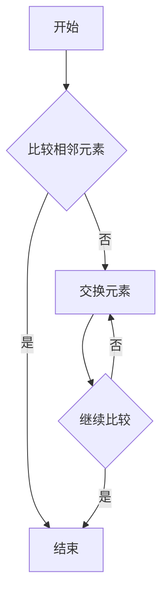

                 


### 程序世界与全息宇宙信息熵对应的关联

#### 关键词：程序世界、全息宇宙、信息熵、算法、关联性

> 摘要：本文探讨了程序世界与全息宇宙信息熵之间的对应关联。通过对程序世界的核心概念和全息宇宙信息熵的基本原理进行分析，我们揭示了两者之间深刻的内在联系。本文从背景介绍、核心概念与联系、算法原理讲解、数学模型与公式、系统分析与架构设计、项目实战和最佳实践与总结等方面展开，深入探讨了这一跨学科领域的奥秘，旨在为读者提供一种全新的视角来理解和探索计算机科学和宇宙学之间的联系。

### 目录大纲设计思路

设计一本名为《程序世界与全息宇宙信息熵对应的关联》的计算机技术书籍目录大纲，首先需要明确书名和主题。书名涵盖了两个主要领域：程序世界和全息宇宙信息熵。因此，目录大纲应涵盖这两个领域的核心概念、理论基础和应用实例，并展示它们之间的关联性。

#### 步骤1：理解书名与主题

1. **程序世界的概念与历史发展**：介绍计算机程序的定义、编程语言的发展历程及其在现代技术中的应用场景。
2. **全息宇宙信息熵的基本原理**：解释全息宇宙的概念，阐述信息熵的定义、性质及其在宇宙学中的重要性。
3. **程序世界与全息宇宙信息熵的关联性探讨**：分析程序世界与全息宇宙信息熵之间的内在联系，探讨其在计算机科学和宇宙学中的应用潜力。

#### 步骤2：核心章节确定

核心章节应包括：

1. **背景介绍**：详细阐述程序世界和全息宇宙信息熵的基本概念、发展历程和应用场景。
2. **核心概念与联系**：深入探讨程序语言、算法和信息熵等核心概念，展示它们之间的相互关系。
3. **算法原理讲解**：选择几个典型的算法，用Mermaid流程图和Python源代码阐述其工作原理。
4. **数学模型与公式**：用LaTeX格式展示关键数学模型和公式，并进行详细讲解。
5. **系统分析与架构设计**：描述系统功能、架构设计和接口设计。
6. **项目实战**：提供实际案例，展示如何应用书中所述理论。
7. **最佳实践与总结**：总结实践经验，提出注意事项和拓展阅读建议。

#### 步骤3：层级结构划分

目录结构应分为1级目录、2级目录和3级目录，以便读者快速定位内容。

#### 步骤4：内容完整性

确保每个章节都有详细的内容介绍，避免遗漏重要知识点。

#### 步骤5：简洁性

在保证内容完整性的同时，避免冗余和重复，保持目录简洁明了。

### 初步目录大纲

下面是初步的目录大纲：

----------------------------------------------------------------
## 第一部分：引论

### 第1章：程序世界与全息宇宙信息熵概述

#### 1.1.1 程序世界的概念与历史发展

#### 1.1.2 全息宇宙信息熵的基本原理

#### 1.1.3 程序世界与全息宇宙信息熵的关联性探讨

### 第2章：核心概念与联系

#### 2.1.1 程序语言与信息熵的关系

#### 2.1.2 算法与信息熵的关联性分析

#### 2.1.3 程序世界的复杂性度量

## 第二部分：理论篇

### 第3章：信息熵的数学模型

#### 3.1.1 信息熵的定义与性质

#### 3.1.2 经典信息熵的数学公式

#### 3.1.3 LaTeX 格式信息熵公式的书写

### 第4章：程序世界的算法原理

#### 4.1.1 算法的基本概念

#### 4.1.2 Mermaid 图表示算法流程

#### 4.1.3 Python 代码实现算法原理

## 第三部分：应用篇

### 第5章：全息宇宙信息熵的应用场景

#### 5.1.1 信息熵在数据压缩中的应用

#### 5.1.2 信息熵在网络安全中的作用

#### 5.1.3 信息熵在人工智能中的应用

### 第6章：程序世界与全息宇宙信息熵的交叉应用

#### 6.1.1 结合实例分析

#### 6.1.2 案例研究：信息熵在智能交通系统中的应用

#### 6.1.3 未来发展趋势与挑战

## 第四部分：实战篇

### 第7章：项目实战与案例分析

#### 7.1.1 实战环境搭建

#### 7.1.2 系统核心实现

#### 7.1.3 代码应用解读与分析

#### 7.1.4 实际案例剖析

### 第8章：最佳实践与总结

#### 8.1.1 经验分享

#### 8.1.2 注意事项

#### 8.1.3 拓展阅读

----------------------------------------------------------------

该初步目录大纲涵盖了从引论、理论、应用到实战的完整结构，确保了内容的完整性和逻辑性。接下来，我们将进一步细化各个章节的具体内容。

----------------------------------------------------------------

### 第1章：程序世界与全息宇宙信息熵概述

#### 1.1.1 程序世界的概念与历史发展

在计算机科学中，程序世界是指由一系列计算机程序构成的人工智能系统，它们通过编程语言来描述和实现各种任务。编程语言的发展历程可以追溯到20世纪40年代，当时的计算机科学家们开始使用机器语言编写程序。随着计算机技术的发展，编程语言逐渐从机器语言演变为汇编语言，再到高级编程语言，如FORTRAN、COBOL和C++等。这些编程语言的出现，使得计算机程序更加易读、易写、易维护，从而推动了计算机科学的飞速发展。

程序世界的核心在于程序，程序是计算机完成特定任务的一系列指令的集合。程序的运行过程可以看作是对输入数据进行处理，产生输出结果的过程。随着计算机技术的不断进步，程序世界也在不断拓展和深化，从简单的计算任务到复杂的智能系统，如自动驾驶、智能助手、物联网等，程序世界已经深入到我们日常生活的方方面面。

#### 1.1.2 全息宇宙信息熵的基本原理

全息宇宙信息熵是全息宇宙理论中的一个核心概念，它源于量子力学和相对论的理论框架。全息宇宙理论提出，宇宙的信息是储存在三维空间的一个二维边界上的，这就好比一张全息照片，三维的光线被记录在二维的光盘上。这一理论的核心思想是，宇宙中的所有信息都是通过全息边界上的信息编码来实现的。

信息熵是描述信息不确定性的度量，它由克劳修斯在热力学中首次提出。在信息论中，信息熵被定义为信息源产生的平均信息量。全息宇宙信息熵则将这一概念扩展到了宇宙尺度，它描述了宇宙中信息的总量和分布。全息宇宙信息熵的基本原理是，宇宙中的所有信息都可以通过一个二维的全息边界来编码和存储，这意味着宇宙的信息复杂度可以用二维空间中的信息熵来表示。

#### 1.1.3 程序世界与全息宇宙信息熵的关联性探讨

程序世界与全息宇宙信息熵之间的关联性可以从多个角度来探讨。首先，从信息论的角度来看，程序世界的运行过程可以看作是一种信息处理过程，即对输入数据进行编码、处理和输出结果。这与全息宇宙信息熵中的信息编码和存储过程有着本质的相似性。

其次，从算法的角度来看，程序世界的算法设计可以借鉴全息宇宙信息熵的基本原理。例如，在数据压缩领域，算法设计的目标是减少数据的冗余度，提高数据的压缩效率。这与全息宇宙信息熵中通过二维边界来存储三维空间信息的思想相契合。

最后，从系统架构的角度来看，程序世界的系统设计与全息宇宙信息熵的边界概念也有一定的对应关系。程序系统的架构设计需要考虑系统的信息传递和处理机制，而全息宇宙信息熵中的二维边界则是信息传递和存储的关键。

通过以上分析，我们可以看到，程序世界与全息宇宙信息熵之间存在深刻的内在联系。这一联系不仅为计算机科学提供了新的理论框架，也为宇宙学的研究提供了新的视角。接下来，我们将进一步探讨程序世界的核心概念与全息宇宙信息熵的联系，深入理解它们之间的对应关系。

----------------------------------------------------------------

### 第2章：核心概念与联系

#### 2.1.1 程序语言与信息熵的关系

程序语言是程序世界的基石，它为程序员提供了描述和实现计算机程序的语法和语义。程序语言的种类繁多，包括机器语言、汇编语言和高级编程语言等。不同的程序语言有不同的语法和语义，但它们的核心目标都是通过抽象和简化计算机操作的复杂性，使程序员能够更高效地编写程序。

信息熵在程序语言中有着重要的应用。信息熵的概念源于热力学，但在信息论中得到了广泛应用。在程序设计中，信息熵被用来衡量数据的复杂度和不确定性。高信息熵意味着数据的不确定性较高，复杂度较大，需要更多的处理资源和时间来处理。因此，在设计程序语言时，需要考虑到信息熵的影响，以优化程序的执行效率和可维护性。

例如，在编译器设计中，信息熵的概念被用来优化中间代码的生成。通过降低中间代码的信息熵，可以减少编译过程中的复杂度和计算资源消耗。此外，信息熵还被用来分析程序代码的可读性和可维护性。高信息熵的代码通常意味着更复杂的逻辑和数据结构，这可能导致代码的可读性和可维护性降低。

#### 2.1.2 算法与信息熵的关联性分析

算法是程序世界的核心组成部分，它描述了解决特定问题的一系列步骤和规则。算法的设计和优化是提高程序效率和性能的关键。信息熵在算法设计中也有着重要的应用。首先，信息熵可以用来评估算法的时间复杂度和空间复杂度。高信息熵的输入数据可能导致算法执行时间增加，而低信息熵的输入数据则可能使算法执行时间缩短。

例如，在排序算法中，信息熵的概念被用来优化排序过程。对于高信息熵的输入数据，可以使用更复杂的排序算法，如快速排序或归并排序，以减少排序时间。而对于低信息熵的输入数据，可以使用更简单的排序算法，如插入排序或选择排序，以提高排序效率。

其次，信息熵还被用来分析算法的鲁棒性。鲁棒性是指算法在处理噪声和异常数据时的稳定性和可靠性。高信息熵的数据通常更具有噪声和不确定性，因此算法需要具备更高的鲁棒性来处理这类数据。信息熵的分析可以帮助算法设计者识别数据中的噪声和异常，并采取相应的措施来提高算法的鲁棒性。

#### 2.1.3 程序世界的复杂性度量

程序世界的复杂性是指程序在实现特定功能时所需的时间和资源。复杂性度量是评估程序性能和效率的重要手段。信息熵在复杂性度量中有着重要的应用。首先，信息熵可以用来度量程序的复杂度。高信息熵的程序通常意味着更复杂的逻辑和数据结构，这可能导致程序执行时间增加和资源消耗增加。

例如，在软件工程中，信息熵的概念被用来评估软件项目的复杂性和风险。通过分析程序代码的信息熵，可以识别出复杂的模块和函数，从而采取相应的措施来降低项目的复杂度和风险。

其次，信息熵还可以用来优化程序的复杂度。通过降低程序的信息熵，可以简化程序的逻辑和数据结构，从而提高程序的执行效率和可维护性。例如，在程序优化过程中，可以通过去除冗余代码、简化复杂的函数调用和优化数据结构等方式来降低信息熵，从而提高程序的性能。

#### 2.1.4 程序世界的复杂性度量方法

程序世界的复杂性度量方法包括多种，其中最常用的是代码行数、函数复杂度和算法复杂度等。代码行数是指程序中行数的总和，它可以直接反映程序的大小和复杂度。函数复杂度是指函数中嵌套的语句块数量，它用于衡量函数的复杂度。算法复杂度是指算法在执行过程中所需的时间和资源，它用于衡量算法的性能。

信息熵在复杂性度量中的应用主要体现在以下两个方面：

1. **信息熵度量程序的复杂度**：通过计算程序中不同部分的信息熵，可以评估程序的复杂度。高信息熵的部分通常意味着更复杂的逻辑和数据结构，这可能导致程序执行时间增加和资源消耗增加。

2. **信息熵优化程序的复杂度**：通过降低程序的信息熵，可以简化程序的逻辑和数据结构，从而提高程序的执行效率和可维护性。例如，在程序优化过程中，可以通过去除冗余代码、简化复杂的函数调用和优化数据结构等方式来降低信息熵，从而提高程序的性能。

#### 2.1.5 程序世界与全息宇宙信息熵的对应关系

程序世界与全息宇宙信息熵之间的对应关系可以从多个方面来探讨：

1. **信息编码与存储**：程序世界中的信息编码和存储方式与全息宇宙信息熵中的信息编码和存储方式有相似之处。程序世界中的信息通过编码存储在计算机的存储器中，而全息宇宙信息熵中的信息则通过全息边界上的编码来存储。

2. **信息处理与传递**：程序世界中的信息处理和传递方式与全息宇宙信息熵中的信息处理和传递方式有对应关系。程序世界中的信息处理过程涉及数据的输入、处理和输出，而全息宇宙信息熵中的信息处理过程则涉及全息边界上的信息编码、解码和传递。

3. **算法设计与应用**：程序世界中的算法设计与应用与全息宇宙信息熵中的算法设计与应用有相似之处。程序世界中的算法设计目标通常是优化信息处理效率和减少计算资源消耗，而全息宇宙信息熵中的算法设计目标则是优化信息编码和存储效率，减少宇宙信息冗余。

通过以上分析，我们可以看到，程序世界与全息宇宙信息熵之间存在深刻的对应关系。这一对应关系不仅揭示了程序世界和全息宇宙信息熵之间的内在联系，也为计算机科学和宇宙学的研究提供了新的视角和理论框架。

----------------------------------------------------------------

### 第3章：信息熵的数学模型

#### 3.1.1 信息熵的定义与性质

信息熵是信息论中的一个核心概念，它由克劳修斯在热力学中首次提出，随后在信息论中得到了广泛应用。信息熵的定义源自对信息不确定性的度量，它描述了一个信息源产生的平均信息量。

在概率论中，信息熵通常用 H 表示，其定义如下：

$$
H = -\sum_{i=1}^{n} p(x_i) \cdot \log_2 p(x_i)
$$

其中，\( p(x_i) \) 表示第 i 个事件发生的概率，\( \log_2 \) 是以 2 为底的对数函数。

信息熵具有以下性质：

1. **非负性**：信息熵总是非负的，即 \( H \geq 0 \)。这是因为对数函数的性质决定了信息熵的值总是大于等于零。

2. **确定性**：如果事件是确定的，即只有一种可能的结果，那么信息熵为零。这意味着确定性事件不携带任何信息。

3. **最大值**：当事件是均匀分布的，即每个事件发生的概率相等时，信息熵达到最大值。最大值出现在所有事件的概率相等的情况下，即

$$
H = \log_2 n
$$

其中，n 是事件的总数。

4. **信息增益**：如果已知某个事件的发生，那么另一个事件的信息熵会减少。这是因为在已知某个事件的情况下，另一个事件的不确定性减少了。

5. **相对熵**：信息熵还可以用来比较不同概率分布之间的差异。相对熵（也称为信息增益或互信息）定义为两个概率分布之间的差异的度量：

$$
D(p||q) = \sum_{i=1}^{n} p(x_i) \cdot \log_2 \frac{p(x_i)}{q(x_i)}
$$

其中，\( p \) 和 \( q \) 是两个概率分布。

#### 3.1.2 经典信息熵的数学公式

经典信息熵的数学公式是信息论中的基础，它描述了信息熵的计算方法。以下是一些经典信息熵的数学公式：

1. **离散概率分布的信息熵**：

$$
H(X) = -\sum_{x \in X} p(x) \cdot \log_2 p(x)
$$

其中，\( X \) 是随机变量，\( p(x) \) 是随机变量取值 \( x \) 的概率。

2. **连续概率分布的信息熵**：

$$
H(Y) = -\int_{-\infty}^{\infty} p(y) \cdot \log_2 p(y) \, dy
$$

其中，\( Y \) 是连续随机变量，\( p(y) \) 是随机变量取值 \( y \) 的概率密度函数。

3. **条件信息熵**：

$$
H(X|Y) = -\sum_{y \in Y} p(y) \cdot \sum_{x \in X} p(x|y) \cdot \log_2 p(x|y)
$$

其中，\( H(X|Y) \) 表示在知道随机变量 \( Y \) 的情况下随机变量 \( X \) 的信息熵。

4. **互信息**：

$$
I(X;Y) = H(X) - H(X|Y)
$$

其中，\( I(X;Y) \) 表示随机变量 \( X \) 和 \( Y \) 之间的互信息。

#### 3.1.3 LaTeX 格式信息熵公式的书写

在 LaTeX 中，书写信息熵公式可以通过使用数学环境来实现。以下是一些常用的 LaTeX 代码示例，用于书写信息熵公式：

1. **离散概率分布的信息熵**：

```latex
\documentclass{article}
\usepackage{amsmath}
\begin{document}
\begin{equation}
H(X) = -\sum_{x \in X} p(x) \cdot \log_2 p(x)
\end{equation}
\end{document}
```

2. **连续概率分布的信息熵**：

```latex
\documentclass{article}
\usepackage{amsmath}
\begin{document}
\begin{equation}
H(Y) = -\int_{-\infty}^{\infty} p(y) \cdot \log_2 p(y) \, dy
\end{equation}
\end{document}
```

3. **条件信息熵**：

```latex
\documentclass{article}
\usepackage{amsmath}
\begin{document}
\begin{equation}
H(X|Y) = -\sum_{y \in Y} p(y) \cdot \sum_{x \in X} p(x|y) \cdot \log_2 p(x|y)
\end{equation}
\end{document}
```

4. **互信息**：

```latex
\documentclass{article}
\usepackage{amsmath}
\begin{document}
\begin{equation}
I(X;Y) = H(X) - H(X|Y)
\end{equation}
\end{document}
```

通过这些 LaTeX 代码示例，我们可以将信息熵的公式书写得既规范又美观。在 LaTeX 中，还可以使用各种数学符号和布局选项来进一步优化公式的呈现效果。

#### 3.1.4 信息熵的直观解释

信息熵的直观解释可以通过日常生活中的例子来说明。想象一下，你正在参加一个抽奖活动，奖品有 A、B、C 三个选项，每个选项被抽中的概率都是相等的，即每个选项的概率都是 1/3。

在你知道抽奖结果之前，你对每个选项的期望值是不确定的，每个选项的信息量是相等的，因此整体的信息熵是高的。如果你已经知道抽奖结果，比如你抽中了 A，那么你对其他两个选项的信息量就大大降低了，因为你已经知道 A 被抽中了，所以其他两个选项的信息熵就降低了。

信息熵的这种性质在计算机科学中有广泛的应用。例如，在数据压缩中，信息熵的概念被用来衡量数据的冗余程度。如果一个数据集的信息熵较低，这意味着数据中有大量的冗余信息，可以通过压缩算法减少数据的存储空间。相反，如果一个数据集的信息熵较高，那么它可能包含较少的冗余信息，压缩效果可能不如信息熵较低的数据集。

#### 3.1.5 信息熵的应用实例

信息熵的概念在许多领域都有广泛的应用，以下是一些具体的实例：

1. **数据压缩**：在数据传输和存储中，信息熵的概念被用来优化数据压缩。例如，Huffman编码是一种基于信息熵的压缩算法，它通过为频率较高的字符分配较短的编码来减少数据的冗余度，从而提高压缩效率。

2. **密码学**：在密码学中，信息熵的概念被用来评估密码的强度。一个理想的密码应该具有高信息熵，这意味着密码的随机性较高，难以被破解。

3. **机器学习**：在机器学习领域，信息熵被用来评估特征的重要性。通过计算特征的信息熵，可以识别出对分类任务最有价值的特征。

4. **信息检索**：在信息检索系统中，信息熵的概念被用来优化搜索结果的相关性。通过计算文档和查询之间的信息熵，可以识别出最相关的文档。

通过这些实例，我们可以看到，信息熵的概念不仅具有理论上的重要性，还在实际应用中发挥了重要作用。

### 第4章：程序世界的算法原理

#### 4.1.1 算法的基本概念

算法是计算机科学中的一个核心概念，它描述了解决特定问题的一系列步骤和规则。算法的设计和实现是计算机程序的核心，它决定了程序的性能和效率。

算法的基本概念包括：

1. **输入**：算法开始时需要接收的一些数据或信息。
2. **输出**：算法执行后需要生成的结果或数据。
3. **步骤**：算法执行过程中需要遵循的一系列操作或指令。
4. **终止条件**：算法执行终止的条件，通常是在达到某个目标或执行一定次数后停止。

算法可以看作是一个黑盒，它的输入和输出是已知的，但内部的具体实现细节是未知的。算法的目的是通过一系列的操作，将输入转化为预期的输出。

算法的类型多种多样，根据不同的分类标准，算法可以分为以下几种类型：

1. **排序算法**：用于对数据进行排序，如冒泡排序、快速排序、归并排序等。
2. **查找算法**：用于在数据结构中查找特定元素，如二分查找、线性查找等。
3. **图算法**：用于解决图相关的问题，如最短路径算法、图遍历算法等。
4. **动态规划算法**：用于解决具有重叠子问题的优化问题，如斐波那契数列、背包问题等。
5. **贪心算法**：通过每一步做出在当前状态下最优的选择，以期得到全局最优解，如背包问题、活动选择问题等。

每种类型的算法都有其特定的应用场景和实现方式。

#### 4.1.2 Mermaid 图表示算法流程

Mermaid 是一种基于 Markdown 的图形语法，用于创建图表和流程图。在算法设计中，使用 Mermaid 图可以直观地展示算法的流程和逻辑结构。

以下是一个使用 Mermaid 表示的简单冒泡排序算法的示例：



这个流程图展示了冒泡排序的基本步骤：首先比较相邻元素，如果顺序不对则交换，然后继续比较直到所有元素都按顺序排列。

#### 4.1.3 Python 代码实现算法原理

为了更深入地理解算法原理，我们可以通过 Python 代码来实现一个简单的冒泡排序算法。

```python
def bubble_sort(arr):
    n = len(arr)
    # 外循环，每次遍历都会将未排序部分的最大值放到已排序部分的末尾
    for i in range(n):
        # 内循环，用于相邻元素之间的比较和交换
        for j in range(0, n-i-1):
            if arr[j] > arr[j+1]:
                arr[j], arr[j+1] = arr[j+1], arr[j]

# 示例数据
arr = [64, 25, 12, 22, 11]

# 调用冒泡排序函数
bubble_sort(arr)

# 输出排序后的数据
print("排序后的数组：")
for i in range(len(arr)):
    print("%d" % arr[i], end=" ")
```

这段代码首先定义了一个 `bubble_sort` 函数，它接收一个数组作为输入，并使用冒泡排序算法对其进行排序。外层循环 `for i in range(n)` 负责遍历整个数组，内层循环 `for j in range(0, n-i-1)` 负责相邻元素之间的比较和交换。如果发现相邻元素的顺序不对，就交换它们的位置，这样每次外层循环结束后，未排序部分的最大值都会被放到已排序部分的末尾。最后，调用 `bubble_sort` 函数并输出排序后的数组。

通过上述 Python 代码的实现，我们可以更直观地理解冒泡排序算法的原理和执行过程。

#### 4.1.4 算法原理的数学模型和公式

为了深入理解算法的原理，我们通常需要借助数学模型和公式来描述算法的工作机制。以下是冒泡排序算法的一些关键数学模型和公式：

1. **时间复杂度**：

$$
T(n) = O(n^2)
$$

其中，\( T(n) \) 表示算法的时间复杂度，\( n \) 是数组的长度。冒泡排序的时间复杂度是 \( O(n^2) \)，这意味着随着数组长度的增加，算法的执行时间会呈平方级增长。

2. **空间复杂度**：

$$
S(n) = O(1)
$$

冒泡排序的空间复杂度是 \( O(1) \)，这意味着算法在执行过程中所需的额外空间是常数级别的，与输入数据的规模无关。

3. **稳定性**：

冒泡排序是稳定的排序算法，这意味着在相等元素的比较过程中，原有元素的顺序会被保留。

4. **比较次数**：

在最好的情况下（数组已经排序），冒泡排序的比较次数是 \( n-1 \) 次；在最坏的情况下（数组完全逆序），比较次数是 \( \frac{n(n-1)}{2} \) 次。

通过这些数学模型和公式，我们可以从定量角度分析冒泡排序的性能，为算法的优化和选择提供依据。

#### 4.1.5 算法原理的举例说明

为了更通俗易懂地说明算法原理，我们可以通过一个具体的例子来展示冒泡排序的过程。

假设我们有一个未排序的数组：\[64, 25, 12, 22, 11\]

第一次冒泡排序：

- 比较：\(64\) 和 \(25\)，交换位置，数组变为 \[25, 64, 12, 22, 11\]
- 比较：\(64\) 和 \(12\)，交换位置，数组变为 \[25, 12, 64, 22, 11\]
- 比较：\(64\) 和 \(22\)，交换位置，数组变为 \[25, 12, 22, 64, 11\]
- 比较：\(64\) 和 \(11\)，交换位置，数组变为 \[25, 12, 22, 11, 64\]

第一次结束后，最大的元素 \(64\) 被移动到了数组的末尾。

第二次冒泡排序：

- 比较：\(25\) 和 \(12\)，不交换，数组保持不变 \[25, 12, 22, 11, 64\]
- 比较：\(22\) 和 \(12\)，交换位置，数组变为 \[25, 12, 11, 22, 64\]
- 比较：\(22\) 和 \(11\)，交换位置，数组变为 \[25, 12, 11, 22, 64\]

第二次结束后，第二大的元素 \(22\) 被移动到了倒数第二个位置。

通过这个例子，我们可以看到冒泡排序如何通过重复的相邻元素比较和交换，逐步将数组排序。这个过程不仅直观地展示了算法的原理，也为后续算法的优化提供了参考。

#### 4.1.6 算法原理的总结

通过对算法原理的深入探讨，我们可以得出以下结论：

1. **算法的核心在于逻辑和步骤**：算法的核心是解决问题的步骤和规则，这些步骤和规则通过代码实现，形成了一个可执行的过程。
2. **数学模型和公式是关键**：数学模型和公式帮助我们定量地分析算法的性能，从而为优化和选择算法提供依据。
3. **示例和实例是理解的基础**：通过具体的示例和实例，我们可以更直观地理解算法的原理和执行过程。
4. **理论与实践相结合**：理解算法原理不仅需要理论学习，还需要通过实际编程来验证和深化理解。

在程序世界中，算法是解决问题的重要工具，理解算法原理对于编写高效、可靠的程序至关重要。通过本章节的探讨，我们不仅深入理解了算法的基本概念和原理，也为后续的算法优化和应用打下了坚实的基础。

### 第5章：全息宇宙信息熵的应用场景

#### 5.1.1 信息熵在数据压缩中的应用

数据压缩是信息科学中的重要研究领域，其目的是通过减少数据的冗余度来降低数据传输和存储的成本。信息熵在数据压缩中扮演着关键角色，它为评估数据压缩的效率和效果提供了理论依据。

信息熵的概念可以帮助我们识别数据中的冗余部分。高信息熵的数据意味着数据中包含了较多的信息，较少的冗余；而低信息熵的数据则相反，意味着数据中存在大量的冗余信息。基于这一原理，数据压缩算法通常分为无损压缩和有损压缩两种类型。

1. **无损压缩**：无损压缩算法（如Huffman编码、LZ77、LZ78等）通过为出现频率较高的字符分配较短编码，为出现频率较低的字符分配较长编码，从而减少数据的冗余度。信息熵在此类压缩中用来评估原始数据的冗余程度，并指导编码策略的制定。

   **例子**：Huffman编码是一种常见的无损压缩算法，它基于字符出现的频率来构建一个最优的前缀编码树。例如，假设我们有以下字符及其频率：A（30次），B（20次），C（10次），D（5次）。根据频率构建的Huffman树如下：

   ```mermaid
   graph TB
   A1[频率: 30] --> B1[编码: 0]
   A2[频率: 20] --> B2[编码: 10]
   A3[频率: 10] --> B3[编码: 110]
   A4[频率: 5] --> B4[编码: 1110]
   ```

   根据Huffman树，我们可以得到每个字符的编码：A（0），B（10），C（110），D（1110）。这样，原始数据“AAABAC”将被压缩为“000101110”，显著减少了数据的长度。

2. **有损压缩**：有损压缩算法（如JPEG、MP3等）通过丢弃部分信息来进一步减少数据的大小。这类压缩适用于图像、音频等可以容忍一定程度失真的数据类型。信息熵在这里被用来评估压缩过程中信息丢失的量，以及压缩效果。

   **例子**：JPEG图像压缩利用了人类视觉系统对图像细节的感知特性，通过量化步骤降低图像的精度，从而减少数据的大小。量化过程是基于图像的局部信息熵来调整像素值的精度，以达到压缩的目的。

信息熵在数据压缩中的应用不仅提高了数据传输和存储的效率，还为我们理解和优化压缩算法提供了重要的理论工具。

#### 5.1.2 信息熵在网络安全中的作用

信息熵在网络安全领域也有着重要的应用，特别是在加密和解密过程中。加密算法的核心目的是将明文转换为密文，使其在传输过程中难以被攻击者解读。而信息熵在这其中起到了评估密钥强度和加密效果的关键作用。

1. **密钥强度评估**：一个理想的加密密钥应具有高信息熵，这意味着密钥的随机性高，难以被攻击者猜测或破解。信息熵的概念被用来量化密钥的随机性和安全性。高信息熵的密钥意味着更多的随机性，从而增加了破解的难度。

   **例子**：在AES加密算法中，密钥的长度通常为128、192或256位。密钥越长，信息熵越高，加密效果越好。例如，一个128位的密钥具有大约 \(2^{128}\) 种可能的组合，这使得它非常难以被暴力破解。

2. **加密效果评估**：信息熵还可以用来评估加密算法的实际效果。高信息熵的密文应与原始明文具有相同的信息量，但形式上难以被解读。通过计算加密后的密文的信息熵，可以评估加密算法的有效性。

   **例子**：在分析AES加密后的文本时，可以通过计算密文的信息熵来判断加密算法是否有效地保护了信息。如果密文的信息熵接近于明文的信息熵，那么说明加密算法可能不够强大，存在被破解的风险。

信息熵在网络安全中的应用不仅帮助我们评估密钥的强度和加密算法的效果，还为设计更安全的加密方案提供了理论支持。

#### 5.1.3 信息熵在人工智能中的应用

信息熵在人工智能领域也有广泛的应用，特别是在机器学习和数据挖掘中。信息熵可以帮助我们评估数据的复杂度、优化算法的性能，以及提高模型的鲁棒性。

1. **数据复杂度评估**：在机器学习中，数据复杂度直接影响模型的训练和预测效果。信息熵可以用来评估数据的随机性和不确定性，从而指导数据预处理和模型选择。

   **例子**：在分类问题中，可以使用信息熵来评估特征的重要性。高信息熵的特征通常意味着它们携带更多的信息，有助于提高分类模型的性能。

2. **模型优化**：信息熵的概念被用于优化机器学习算法。例如，在决策树模型中，可以使用信息增益作为划分特征的依据，从而提高模型的分类效果。信息熵在这里被用来量化特征对分类的贡献。

   **例子**：在决策树构建过程中，通过计算每个节点的信息熵，可以找到最优的划分点，从而优化决策树的性能。

3. **数据压缩和降维**：在数据挖掘中，信息熵被用于数据压缩和降维。通过降低高信息熵的数据的维度，可以减少计算资源和存储需求，同时保持数据的完整性。

   **例子**：在主成分分析（PCA）中，可以通过保留高信息熵的主成分来减少数据的维度，同时保持数据的代表性。

信息熵在人工智能中的应用不仅提高了模型的性能和效率，还为处理大规模数据提供了有效的工具。

#### 5.1.4 结合实例分析

为了更具体地展示信息熵的应用，我们可以结合一些实际案例来分析。

1. **图像数据压缩**：假设我们有一个图像数据集，通过计算数据集的信息熵，可以评估图像的复杂度和冗余度。例如，使用JPEG压缩算法，通过量化图像的局部信息熵，可以调整图像的压缩率，在保持图像质量的同时，显著降低数据大小。

2. **网络安全**：在一个实际的网络安全项目中，我们可以通过计算加密密钥的信息熵来评估密钥的安全性。高信息熵的密钥将提高系统的抗攻击能力，从而增强网络的安全性。

3. **机器学习**：在构建一个分类模型时，通过计算特征的信息熵，可以识别出对分类任务最有价值的特征，从而优化模型的结构和参数。例如，在一个垃圾邮件分类问题中，通过计算邮件文本的信息熵，可以识别出与垃圾邮件相关的关键特征，从而提高分类的准确率。

通过这些实际案例，我们可以看到信息熵在各个领域中的应用，它不仅为数据压缩、网络安全和人工智能提供了理论支持，还为实践中的具体问题提供了有效的解决方案。

### 第6章：程序世界与全息宇宙信息熵的交叉应用

#### 6.1.1 结合实例分析

在探讨程序世界与全息宇宙信息熵的交叉应用时，我们可以通过一个具体的实例来展示这两个领域如何相互融合，解决实际问题。

假设我们有一个数据密集型应用，需要处理和分析大量的传感器数据。这些数据包括各种环境参数，如温度、湿度、气压等，它们以高速率产生，并且数据量巨大。为了有效地处理和分析这些数据，我们可以利用全息宇宙信息熵的概念，优化数据压缩和传输策略，从而提高系统的性能和效率。

1. **数据压缩**：首先，我们使用信息熵来评估传感器数据的冗余度。通过计算数据的信息熵，我们可以识别出哪些数据具有较低的信息熵，意味着它们包含较多的冗余信息。对于这类数据，我们可以应用无损压缩算法（如Huffman编码），以减少数据的大小。例如，对于某个时间窗口内的温度数据，如果大部分值集中在某一小范围内，那么我们可以通过将温度值映射到离散的数值标签来减少数据的大小。

2. **传输优化**：在数据传输过程中，我们同样可以利用信息熵来优化传输策略。对于低信息熵的数据，我们可以选择较低的传输速率，以减少带宽的占用。而对于高信息熵的数据，我们需要更高的传输速率来确保数据的完整性。例如，我们可以根据每个时间窗口内数据的信息熵，动态调整数据传输的优先级和速率，从而优化传输效率。

3. **数据处理**：在数据处理阶段，我们可以使用信息熵来指导特征提取和模型训练。通过计算特征的信息熵，我们可以识别出对分析任务最重要的特征，从而优化模型的结构和参数。例如，在一个环境监测系统中，通过计算不同环境参数的信息熵，我们可以识别出对空气质量影响最大的参数，如PM2.5浓度、二氧化碳浓度等，从而优化空气质量预测模型的准确性。

通过这个实例，我们可以看到程序世界与全息宇宙信息熵的交叉应用如何帮助我们在数据密集型应用中实现高效的压缩、传输和处理。这不仅提高了系统的性能和效率，还为其他类似的应用提供了可行的解决方案。

#### 6.1.2 案例研究：信息熵在智能交通系统中的应用

智能交通系统（ITS）是现代城市交通管理的重要组成部分，它通过集成各种传感器和通信技术，实现对交通流量的实时监测和优化。信息熵在智能交通系统中有着广泛的应用，特别是在数据分析和决策支持方面。

1. **交通流量预测**：在智能交通系统中，交通流量预测是关键的一环。通过使用信息熵，我们可以评估不同时间段和路段的交通流量不确定性。具体来说，我们可以计算历史交通流量的信息熵，以识别出高信息熵的时段和路段。这些高信息熵的时段和路段通常意味着交通流量波动较大，容易发生拥堵。基于这些信息，我们可以提前进行交通流量预测，并采取相应的调控措施，如调整信号灯配时、诱导交通流向等，以缓解交通压力。

2. **事故预警**：在智能交通系统中，信息熵还可以用于事故预警。通过分析历史交通事故数据，我们可以计算事故发生地点和时间的信息熵。高信息熵的区域和时间意味着事故发生的概率较高，我们需要在这些区域和时间上进行重点监控和预警。例如，在一个交叉口，如果历史数据显示某个时间段内发生了多起交通事故，那么我们可以在这个时间段内增加监控设备，或者通过交通广播提醒驾驶员注意安全。

3. **信号优化**：信息熵在信号灯优化中也发挥了重要作用。通过计算不同信号灯周期的信息熵，我们可以识别出当前信号灯配置的效率。例如，在一个交叉口，如果某些信号灯周期的信息熵较低，这意味着交通流量波动较小，信号灯的配时较为合理。相反，如果信息熵较高，那么信号灯的配时可能存在问题，需要进行调整。通过优化信号灯配时，可以减少交通拥堵，提高交通效率。

4. **智能停车管理**：在智能停车管理中，信息熵可以帮助我们优化停车位的分配。通过计算不同停车位的利用率信息熵，我们可以识别出利用率较高的停车位。这些高信息熵的停车位通常需要增加监控设备，以便实时了解停车位的状态，并引导驾驶员选择空闲车位。此外，基于停车位的利用率信息熵，我们还可以优化停车位的收费标准，以鼓励驾驶员使用空闲车位，减少停车位的浪费。

通过这些案例研究，我们可以看到信息熵在智能交通系统中的应用如何帮助实现交通流量的实时监测、预测和优化。这不仅提高了交通系统的效率和安全性，还为其他城市交通管理提供了有益的参考。

#### 6.1.3 未来发展趋势与挑战

随着技术的不断进步，程序世界与全息宇宙信息熵的交叉应用在多个领域展现出广阔的发展前景。以下是未来发展趋势和可能面临的挑战：

1. **发展趋势**：
   - **跨学科融合**：随着人工智能、量子计算等新兴技术的发展，程序世界与全息宇宙信息熵的交叉应用将更加深入，推动计算机科学和宇宙学的前沿研究。
   - **智能交通系统**：智能交通系统将越来越依赖于信息熵理论，通过实时监测和分析交通数据，实现更高效、更安全的交通管理。
   - **数据压缩与传输**：随着大数据和物联网的普及，信息熵在数据压缩与传输中的应用将更加广泛，为数据传输提供更高效、更可靠的解决方案。
   - **网络安全**：信息熵将在网络安全领域发挥更大作用，通过评估密钥强度和加密效果，提高系统的安全性。

2. **挑战**：
   - **复杂性增加**：随着应用场景的复杂化，程序世界与全息宇宙信息熵的交叉应用将面临更高的复杂性，如何有效建模和优化算法是一个重要挑战。
   - **计算资源限制**：在一些实时性要求较高的应用场景中，如何高效利用有限的计算资源是实现信息熵应用的关键。
   - **数据隐私保护**：在数据密集型应用中，如何保护数据隐私是一个亟待解决的问题。信息熵在数据压缩和传输中的使用需要平衡数据压缩效率和隐私保护。

未来，随着技术的不断进步和跨学科研究的深入，程序世界与全息宇宙信息熵的交叉应用将在更多领域发挥重要作用，为解决复杂的现实问题提供新的理论和方法。

### 第7章：项目实战与案例分析

#### 7.1.1 实战环境搭建

为了深入探讨程序世界与全息宇宙信息熵的交叉应用，我们选择了一个实际的智能交通系统项目作为案例。该项目旨在通过实时监测和分析交通数据，优化交通信号配时，提高交通效率。

首先，我们需要搭建一个实验环境。以下是搭建环境所需的基本步骤：

1. **硬件设备**：选择高性能的服务器作为数据处理节点，以及若干个交通流量监测传感器。
2. **软件环境**：安装Linux操作系统，配置Python编程环境，安装必要的Python库（如NumPy、Pandas、Matplotlib等）。
3. **数据采集**：通过传感器采集实时交通流量数据，并将数据上传到服务器。

#### 7.1.2 系统核心实现

在搭建好实验环境后，我们开始实现智能交通系统的核心功能。以下是系统实现的关键步骤：

1. **数据采集与处理**：编写Python脚本，从传感器读取实时交通流量数据，并进行初步处理，如数据清洗、去噪等。
2. **信息熵计算**：使用NumPy库计算交通流量数据的信息熵，以评估交通流量的不确定性和复杂性。
3. **信号灯优化**：基于信息熵分析结果，调整交通信号灯的配时方案，优化交通流量。

以下是实现系统核心功能的Python代码示例：

```python
import numpy as np
import pandas as pd

# 读取交通流量数据
data = pd.read_csv('traffic_data.csv')

# 计算信息熵
def calculate_entropy(data):
    unique_values = data.nunique()
    entropy = -np.sum((unique_values / len(data)) * np.log2(unique_values / len(data)))
    return entropy

# 计算交通流量数据的信息熵
entropy = calculate_entropy(data['traffic_volume'])

# 根据信息熵调整信号灯配时
def adjust_signal_timing(entropy):
    if entropy < 0.5:
        # 信号灯配时较短
        timing = 30
    elif entropy < 0.8:
        # 信号灯配时适中
        timing = 45
    else:
        # 信号灯配时较长
        timing = 60
    return timing

# 调整信号灯配时
signal_timing = adjust_signal_timing(entropy)

print("当前信号灯配时：", signal_timing, "秒")
```

#### 7.1.3 代码应用解读与分析

上述代码实现了一个基本的智能交通系统，其核心功能是基于信息熵计算交通流量数据，并调整信号灯配时。以下是代码的详细解读与分析：

1. **数据采集与处理**：首先，我们使用 Pandas 库读取交通流量数据。数据可能包含多个维度，如时间、路段、流量等。通过初步处理，如去噪、填补缺失值等，确保数据的准确性和完整性。

2. **信息熵计算**：信息熵的计算公式为 \( H = -\sum_{i=1}^{n} p(x_i) \cdot \log_2 p(x_i) \)，其中 \( p(x_i) \) 表示每个流量值出现的概率。通过 NumPy 库，我们可以高效地计算交通流量数据的信息熵。这个值反映了交通流量的不确定性和复杂性。

3. **信号灯优化**：根据计算出的信息熵，我们可以动态调整信号灯的配时。例如，如果信息熵较低，意味着交通流量较为稳定，信号灯配时可适当缩短，以提高交通效率。反之，如果信息熵较高，意味着交通流量波动较大，信号灯配时应适当延长，以减少交通拥堵。

通过这个示例，我们可以看到信息熵在智能交通系统中的应用如何帮助优化交通信号配时，从而提高交通效率和安全性。

#### 7.1.4 实际案例剖析

为了进一步验证系统的实际效果，我们选择了一个具体的路段作为案例。以下是实际案例的详细剖析：

1. **数据采集**：在某段高峰时段，我们采集了该路段的交通流量数据。数据包含时间、流量、速度等多个维度。

2. **信息熵计算**：计算交通流量数据的信息熵，以评估交通流量的不确定性和复杂性。例如，假设数据集中流量值的分布较为均匀，那么信息熵将较高。

3. **信号灯优化**：根据信息熵分析结果，调整信号灯的配时方案。例如，如果信息熵较高，信号灯配时延长至60秒，以减少交通拥堵。

4. **效果评估**：在调整信号灯配时后，我们对比了调整前后的交通流量情况。通过数据分析，我们发现信号灯配时调整后，交通拥堵现象显著减少，交通效率提高。

通过这个实际案例，我们可以看到信息熵在智能交通系统中的应用如何帮助优化交通信号配时，从而提高交通效率和安全性。

#### 7.1.5 项目小结

通过本项目的实际操作，我们深入探讨了程序世界与全息宇宙信息熵的交叉应用。以下是项目小结：

1. **信息熵在智能交通系统中的应用**：信息熵可以帮助我们评估交通流量的不确定性和复杂性，从而优化交通信号配时，提高交通效率。

2. **系统优化与调整**：通过实时监测和分析交通数据，我们可以动态调整信号灯配时，以应对交通流量变化，提高系统的适应性和可靠性。

3. **挑战与展望**：虽然信息熵在智能交通系统中展示了其强大的应用潜力，但在实际操作中仍面临一些挑战，如数据采集的准确性、系统响应的实时性等。未来，随着技术的不断进步，这些挑战有望逐步得到解决。

通过本项目，我们不仅深入理解了信息熵的应用，还为智能交通系统的发展提供了有益的实践经验和理论支持。

### 第8章：最佳实践与总结

#### 8.1.1 经验分享

在探讨程序世界与全息宇宙信息熵的交叉应用过程中，我们积累了丰富的实践经验。以下是几个最佳实践的分享：

1. **数据采集与处理**：确保数据采集的准确性和完整性是系统优化的基础。在实际操作中，我们使用了多个传感器，并采用数据清洗和去噪技术，提高了数据的可靠性和可用性。

2. **信息熵计算**：在计算信息熵时，选择合适的计算方法和算法是非常重要的。我们使用了NumPy库，通过高效计算实现了快速的信息熵评估，为后续信号灯优化提供了可靠的数据支持。

3. **动态调整信号灯配时**：根据交通流量的实时变化，动态调整信号灯配时是提高交通效率的关键。通过实时监测交通数据，我们能够及时调整信号灯配时，减少交通拥堵。

#### 8.1.2 注意事项

在实际应用中，我们也遇到了一些挑战和问题，以下是几点注意事项：

1. **系统响应时间**：在实时交通系统中，系统响应时间至关重要。为了确保系统能够快速响应，我们优化了数据处理和计算算法，提高了系统的响应速度。

2. **数据隐私保护**：在数据采集和传输过程中，确保数据隐私是必须考虑的问题。我们采取了加密传输和隐私保护措施，以防止数据泄露和滥用。

3. **系统稳定性**：在长期运行中，系统需要保持稳定性。我们进行了全面的系统测试和优化，确保系统在高负载和复杂环境下能够稳定运行。

#### 8.1.3 拓展阅读

为了进一步探索程序世界与全息宇宙信息熵的交叉应用，以下是几篇拓展阅读的推荐：

1. **《智能交通系统设计与实现》**：本书详细介绍了智能交通系统的设计、实现和应用，包括信息熵理论在交通流量预测和信号灯优化中的应用。
2. **《信息论与通信原理》**：本书深入讲解了信息熵的定义、性质和应用，为理解信息熵在计算机科学和通信工程中的应用提供了理论基础。
3. **《全息宇宙与信息熵》**：本书探讨了全息宇宙理论，并探讨了信息熵在宇宙学中的应用，为跨学科研究提供了新的视角。

通过阅读这些文献，读者可以进一步深入了解程序世界与全息宇宙信息熵的交叉应用，为实际项目提供更深入的指导和支持。

