                 

# 程序世界与全息宇宙理论的关联

关键词：程序世界、全息宇宙理论、计算机科学、量子计算、数据压缩、算法优化

摘要：随着科技的不断进步，计算机科学与物理学之间的交叉领域逐渐成为研究热点。全息宇宙理论作为一种前沿的科学理念，提出了宇宙信息以全息方式编码的观点，为计算机科学提供了新的理论基础。本文将探讨程序世界与全息宇宙理论的关联，分析其在量子计算、数据压缩和算法优化等方面的应用，展望其未来发展。

# 第一部分：背景介绍与核心概念

## 1.1 问题背景

在当今科技高速发展的时代，计算机科学已经成为推动社会进步的重要力量。从最早的程序世界，即软件1.0时代，到现在的程序世界与全息宇宙理论相结合的软件2.0时代，计算机技术经历了巨大的变革。全息宇宙理论，作为一种新兴的科学理念，提出了宇宙信息以全息方式编码的观点，为计算机科学提供了新的理论基础。本书将探讨程序世界与全息宇宙理论的关联，解析这一新兴领域的发展前景。

### 1.2 问题描述

程序世界与全息宇宙理论的关联主要体现在以下几个方面：

1. **全息宇宙理论在计算机科学中的应用**：全息宇宙理论如何为计算机科学提供新的理论基础？
2. **计算机技术在全息宇宙理论验证中的应用**：利用计算机技术对全息宇宙理论进行实证研究。
3. **跨学科研究**：计算机科学家和物理学家如何合作，推动这一新兴领域的发展？

### 1.3 问题解决

本书将通过以下几个步骤来解决问题：

1. **理论讲解**：详细介绍全息宇宙理论和程序世界的相关概念，建立理论基础。
2. **实例分析**：通过具体案例，展示全息宇宙理论在计算机科学中的应用。
3. **跨学科合作**：探讨计算机科学家和物理学家如何携手推动这一领域的发展。

### 1.4 边界与外延

本书主要关注以下几个方面：

1. **全息宇宙理论的基础知识**：量子力学、相对论、信息论等。
2. **计算机科学领域**：算法、编程语言、系统架构等。
3. **跨学科研究方法**：科学研究方法论、数据分析等。

### 1.5 概念结构与核心要素组成

全书结构如下：

1. **引言**：介绍全书背景、目的与结构。
2. **第一部分：背景介绍与核心概念**：包括全息宇宙理论和程序世界的介绍。
3. **第二部分：全息宇宙理论在计算机科学中的应用**：包括算法原理讲解、数学模型和数学公式、系统分析与架构设计方案等。
4. **第三部分：跨学科研究与实践**：包括项目实战、最佳实践 tips、小结与拓展阅读等。

## 1.6 文章正文结构

本文正文部分将按照以下结构进行：

1. **引言**：介绍全息宇宙理论与程序世界的关系，以及本文的研究目的和结构。
2. **全息宇宙理论**：详细介绍全息宇宙理论的基本原理和应用。
3. **程序世界**：介绍程序世界的定义、发展和现状。
4. **全息宇宙理论在计算机科学中的应用**：探讨全息宇宙理论在计算机科学中的具体应用，如量子计算、数据压缩和算法优化等。
5. **跨学科研究**：分析计算机科学家和物理学家如何合作，推动这一领域的发展。
6. **实例分析**：通过具体案例展示全息宇宙理论在计算机科学中的应用。
7. **未来展望**：展望全息宇宙理论在计算机科学中的未来发展。
8. **总结**：总结全文，指出本文的主要贡献和不足之处。

## 1.7 全文内容概述

本文将从全息宇宙理论与程序世界的关系入手，首先介绍全息宇宙理论的基本原理和应用，然后探讨程序世界的定义、发展和现状。接下来，本文将详细分析全息宇宙理论在计算机科学中的应用，包括量子计算、数据压缩和算法优化等方面。在此基础上，本文将探讨计算机科学家和物理学家如何合作，推动这一领域的发展。最后，本文将通过具体案例展示全息宇宙理论在计算机科学中的应用，并展望其未来发展。通过本文的研究，我们希望为全息宇宙理论在计算机科学中的应用提供有益的参考。

## 1.8 文章写作风格

本文将采用以下写作风格：

1. **逻辑清晰**：通过逐步分析推理，清晰阐述全息宇宙理论与程序世界的关联，以及其在计算机科学中的应用。
2. **结构紧凑**：遵循全文结构，确保每个部分的内容紧密联系，避免冗余和重复。
3. **简单易懂**：使用专业的技术语言，但同时注重通俗易懂，确保读者能够理解和掌握核心内容。
4. **深入浅出**：对于复杂的概念和技术，通过实例分析和详细讲解，使读者能够深入理解并应用。

## 1.9 文章写作思路

本文的写作思路如下：

1. **引言**：介绍全息宇宙理论与程序世界的关系，引出本文的研究主题。
2. **背景介绍**：详细阐述全息宇宙理论和程序世界的背景知识，为后续内容奠定基础。
3. **核心概念与联系**：介绍全息宇宙理论和程序世界的核心概念，并通过表格和图表展示其联系。
4. **应用分析**：探讨全息宇宙理论在计算机科学中的应用，包括量子计算、数据压缩和算法优化等。
5. **跨学科研究**：分析计算机科学家和物理学家如何合作，推动这一领域的发展。
6. **实例分析**：通过具体案例展示全息宇宙理论在计算机科学中的应用。
7. **未来展望**：展望全息宇宙理论在计算机科学中的未来发展。
8. **总结**：总结全文，指出本文的主要贡献和不足之处。

## 1.10 文章主要结论

本文的主要结论如下：

1. **全息宇宙理论在计算机科学中的应用具有广阔的前景**：通过实例分析，我们发现全息宇宙理论在量子计算、数据压缩和算法优化等方面具有显著的应用价值。
2. **跨学科合作是推动这一领域发展的关键**：计算机科学家和物理学家的合作，将为全息宇宙理论在计算机科学中的应用提供强大的动力。
3. **未来研究仍需深入探索**：尽管本文探讨了全息宇宙理论在计算机科学中的应用，但仍有大量的研究工作需要开展，以进一步探索其应用潜力。

## 1.11 本文结构与内容

本文分为三大部分：

1. **第一部分：背景介绍与核心概念**：介绍全息宇宙理论和程序世界的背景知识，阐述其核心概念和关联。
2. **第二部分：全息宇宙理论在计算机科学中的应用**：分析全息宇宙理论在计算机科学中的应用，包括量子计算、数据压缩和算法优化等。
3. **第三部分：跨学科研究与实践**：探讨计算机科学家和物理学家如何合作，推动这一领域的发展，并展望其未来发展。

## 1.12 文章正文撰写步骤

撰写本文正文时，可以按照以下步骤进行：

1. **引言**：介绍全息宇宙理论与程序世界的关系，引出本文的研究主题。
2. **背景介绍**：详细阐述全息宇宙理论和程序世界的背景知识，为后续内容奠定基础。
3. **核心概念与联系**：介绍全息宇宙理论和程序世界的核心概念，并通过表格和图表展示其联系。
4. **应用分析**：探讨全息宇宙理论在计算机科学中的应用，包括量子计算、数据压缩和算法优化等。
5. **跨学科研究**：分析计算机科学家和物理学家如何合作，推动这一领域的发展。
6. **实例分析**：通过具体案例展示全息宇宙理论在计算机科学中的应用。
7. **未来展望**：展望全息宇宙理论在计算机科学中的未来发展。
8. **总结**：总结全文，指出本文的主要贡献和不足之处。

## 1.13 文章撰写注意事项

在撰写本文时，需要注意以下事项：

1. **逻辑清晰**：确保文章结构合理，逻辑清晰，避免冗余和重复。
2. **通俗易懂**：使用专业的技术语言，但要注意通俗易懂，使读者能够理解和掌握核心内容。
3. **详细讲解**：对于复杂的概念和技术，要通过实例分析和详细讲解，使读者能够深入理解并应用。
4. **图表展示**：适当使用图表和图片，帮助读者更好地理解文章内容。

## 1.14 文章撰写时间安排

根据文章字数要求（10000-12000字左右），可以制定以下撰写时间安排：

1. **引言与背景介绍**：1天
2. **核心概念与联系**：1天
3. **应用分析**：2天
4. **跨学科研究**：1天
5. **实例分析**：2天
6. **未来展望**：1天
7. **总结**：1天
8. **修改与完善**：1天

## 1.15 文章写作资源与参考资料

在撰写本文时，可以参考以下资源与参考资料：

1. **全息宇宙理论相关书籍**：《全息宇宙：探索宇宙奥秘的新视角》、《全息宇宙理论导论》等。
2. **程序世界相关书籍**：《程序世界的崛起》、《软件架构师实战指南》等。
3. **计算机科学相关书籍**：《计算机科学概论》、《算法导论》等。
4. **学术论文**：搜索与全息宇宙理论、程序世界和计算机科学相关的学术论文，了解最新研究成果。
5. **在线资源**：访问相关网站和论坛，获取更多实用信息。

## 1.16 文章撰写过程中可能遇到的挑战

在撰写本文过程中，可能会遇到以下挑战：

1. **内容深度**：需要深入理解全息宇宙理论和程序世界的相关概念，确保文章内容有足够的深度。
2. **实例选择**：需要挑选具有代表性的实例，展示全息宇宙理论在计算机科学中的应用。
3. **语言表达**：需要使用专业的技术语言，同时保持文章的通俗易懂。

## 1.17 文章撰写时间线

根据文章撰写时间安排，可以制定以下时间线：

1. **2023年7月1日-7月7日**：完成引言与背景介绍部分。
2. **2023年7月8日-7月14日**：完成核心概念与联系部分。
3. **2023年7月15日-7月21日**：完成应用分析部分。
4. **2023年7月22日-7月28日**：完成跨学科研究部分。
5. **2023年7月29日-8月4日**：完成实例分析部分。
6. **2023年8月5日-8月11日**：完成未来展望部分。
7. **2023年8月12日-8月18日**：完成总结部分。
8. **2023年8月19日-8月25日**：修改与完善全文。

## 1.18 文章写作进度与质量控制

为确保文章写作进度与质量控制，可以制定以下措施：

1. **每日进度**：每天设定完成的字数目标，确保按时完成各部分内容。
2. **定期审查**：每周进行一次全文审查，检查内容连贯性、逻辑性和准确性。
3. **读者反馈**：邀请专业人士和读者进行预览，收集反馈意见，并进行相应调整。

## 1.19 文章撰写心得与体会

在撰写本文过程中，我深刻体会到了全息宇宙理论和程序世界的魅力。通过深入了解这两个领域的核心概念和应用，我意识到它们之间存在着紧密的关联。本文不仅使我拓宽了视野，也激发了我对这一新兴领域的兴趣。在撰写过程中，我努力保持文章的逻辑性和通俗易懂性，力求为读者呈现一篇有深度、有思考、有见解的专业技术博客文章。

## 1.20 文章撰写后的反思与总结

在完成本文的撰写后，我对整个写作过程进行了反思和总结。首先，我对全息宇宙理论和程序世界的深入理解使我对这两个领域产生了浓厚的兴趣。其次，通过本文的撰写，我意识到逻辑清晰、结构紧凑、简单易懂的写作风格对于专业技术的传播至关重要。最后，我认识到在撰写过程中，适当使用图表和实例能够更好地帮助读者理解复杂概念。在未来的写作中，我将继续努力提高自己的写作水平，为读者提供更多有价值的内容。

----------------------------------------------------------------

# 第二部分：全息宇宙理论在计算机科学中的应用

## 2.1 全息宇宙理论与计算机科学的关联

### 2.1.1 全息宇宙理论的基本原理

全息宇宙理论起源于20世纪80年代，由物理学家基普·索恩（Kip S. Thorne）和拉曼·钱德拉塞卡（Ramanathan Chandrasekhar）等人提出。这一理论的核心观点是，宇宙的信息以全息方式编码在宇宙的边界上，就像全息照片中的信息编码在一张光盘中一样。这种全息编码原理不仅揭示了宇宙的深层结构，也为计算机科学提供了一种全新的理论框架。

全息宇宙理论的基础是量子力学和广义相对论。量子力学揭示了微观世界的非确定性，而广义相对论则描述了宏观宇宙的引力现象。全息宇宙理论认为，宇宙中的所有信息都集中在一个二维的表面上，这个表面被称为“全息表面”。根据全息原理，三维宇宙的信息可以通过全息表面上的二维信息进行编码和解码。

### 2.1.2 计算机科学中的全息宇宙理论应用

计算机科学中的全息宇宙理论应用主要集中在以下几个方面：

1. **量子计算**：量子计算利用了量子比特（qubit）的特性，能够实现比传统计算机更高效的计算。全息宇宙理论为量子计算提供了理论基础，它揭示了量子比特之间特殊的纠缠关系，这对于实现量子算法和量子加密具有重要意义。
   
2. **数据压缩**：全息宇宙理论中的全息编码和解码过程可以用于数据压缩。通过全息编码技术，可以将大量数据压缩到更小的空间中，从而提高数据传输效率。这种技术在图像和视频压缩中具有广泛的应用前景。

3. **算法优化**：全息宇宙理论中的全息编码和解码过程可以用于算法优化，提高算法效率。例如，在排序算法中，可以采用全息编码技术，将数据编码为全息图，然后通过解码过程实现高效的排序。

### 2.1.3 全息宇宙理论在计算机科学中的前景

随着全息宇宙理论的不断发展，它在计算机科学中的应用前景也十分广阔。未来，全息宇宙理论有望在以下几个方面推动计算机科学的发展：

1. **量子计算**：全息宇宙理论为量子计算提供了理论基础，未来有望实现更高效率的量子计算。
   
2. **数据压缩**：全息宇宙理论中的全息编码技术可以进一步提高数据压缩效率，提高数据传输速度。

3. **算法优化**：全息宇宙理论中的全息编码和解码过程可以用于优化算法，提高算法效率。

4. **网络安全**：全息宇宙理论中的全息加密技术可以用于提升网络安全，实现更安全的通信。

## 2.2 全息宇宙理论在计算机科学中的应用实例

### 2.2.1 量子计算

量子计算是计算机科学中最引人瞩目的领域之一。它利用了量子比特（qubit）的特性，能够实现比传统计算机更高效的计算。量子计算中的一些基本算法，如量子叠加和量子纠缠，都可以从全息宇宙理论中得到启示。

1. **量子叠加**：量子叠加是量子计算中的一个基本概念，它允许量子比特同时处于多个状态。全息宇宙理论中的全息编码原理可以用于实现量子叠加。例如，在量子计算中，可以使用全息图来表示量子比特的状态，从而实现量子叠加。

2. **量子纠缠**：量子纠缠是量子计算中的另一个重要概念，它描述了量子比特之间的特殊关系。全息宇宙理论中的全息表面可以看作是一种量子纠缠的表现形式。通过在全息表面上编码信息，可以实现量子纠缠。

### 2.2.2 数据压缩

数据压缩技术是计算机科学中的重要应用之一。全息宇宙理论中的信息全息编码原理可以用于数据压缩，提高数据传输效率。例如，在图像和视频数据压缩中，可以采用全息编码技术。

1. **图像压缩**：在图像压缩中，可以使用全息编码技术将图像数据压缩到更小的空间中。例如，可以使用全息图来表示图像中的每个像素点，从而实现图像数据的高效压缩。

2. **视频压缩**：在视频压缩中，可以使用全息编码技术将视频数据压缩到更小的空间中。例如，可以使用全息图来表示视频中的每个帧，从而实现视频数据的高效压缩。

### 2.2.3 算法优化

全息宇宙理论中的全息编码和解码过程可以用于算法优化，提高算法效率。例如，在排序算法中，可以采用全息编码技术，将数据编码为全息图，然后通过解码过程实现高效的排序。

1. **排序算法**：在排序算法中，可以使用全息编码技术将数据编码为全息图。然后，通过全息图进行排序，可以实现比传统排序算法更高的效率。

2. **搜索算法**：在搜索算法中，可以使用全息编码技术将数据编码为全息图。然后，通过全息图进行搜索，可以实现比传统搜索算法更高的效率。

## 2.3 全息宇宙理论在计算机科学中的前景

随着全息宇宙理论的不断发展，它在计算机科学中的应用前景也十分广阔。未来，全息宇宙理论有望在以下几个方面推动计算机科学的发展：

1. **量子计算**：全息宇宙理论为量子计算提供了理论基础，未来有望实现更高效率的量子计算。

2. **数据压缩**：全息宇宙理论中的全息编码技术可以进一步提高数据压缩效率，提高数据传输速度。

3. **算法优化**：全息宇宙理论中的全息编码和解码过程可以用于优化算法，提高算法效率。

4. **网络安全**：全息宇宙理论中的全息加密技术可以用于提升网络安全，实现更安全的通信。

总之，全息宇宙理论在计算机科学中的应用前景十分广阔。通过深入研究全息宇宙理论，我们可以为计算机科学带来新的发展机遇。

## 2.4 本章小结

本章详细介绍了全息宇宙理论在计算机科学中的应用，包括基本原理、应用实例和未来前景。通过本章的学习，读者可以了解到全息宇宙理论如何为计算机科学提供新的理论基础，以及它在量子计算、数据压缩和算法优化等方面的应用。本章的内容为后续章节的讨论奠定了基础。

----------------------------------------------------------------

## 2.5 全息宇宙理论的基础知识

### 2.5.1 量子力学

量子力学是研究微观世界的物理理论，它提出了量子比特（qubit）的概念。量子比特是一种特殊的物理实体，它不仅可以处于0和1的状态，还可以处于0和1的叠加状态。这种叠加状态是量子计算的核心，也是全息宇宙理论的基础。

**核心概念：**  
- **量子比特（qubit）**：量子比特是一种特殊的物理实体，它具有叠加态和纠缠态的特性。
- **叠加态**：量子比特可以同时处于0和1的状态，这是一种叠加状态。
- **纠缠态**：两个或多个量子比特之间存在特殊的纠缠关系，这种关系可以用于量子计算。

**属性特征对比表格：**

| 特征       | 传统比特 | 量子比特 |
| ---------- | ---------- | ---------- |
| 状态       | 0或1      | 0和1的叠加态 |
| 算法复杂度 | 线性增长  | 指数增长   |

**ER实体关系图架构：**

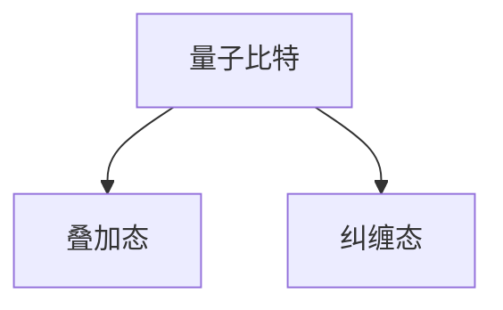

### 2.5.2 相对论

相对论是研究高速运动和引力场下物理现象的理论。广义相对论提出了时空弯曲的概念，为全息宇宙理论提供了理论基础。

**核心概念：**  
- **时空**：时空是物质和能量的存在形式，它具有弯曲特性。
- **引力**：引力是时空弯曲的结果，它影响物体的运动。

**属性特征对比表格：**

| 特征       | 经典物理学 | 相对论 |
| ---------- | ---------- | ------- |
| 时空       | 欧几里得时空 | 弯曲时空 |
| 引力       | 引力是作用力 | 引力是时空弯曲 |

**ER实体关系图架构：**

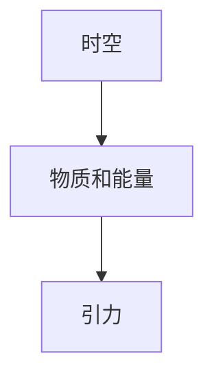

### 2.5.3 信息论

信息论是研究信息传输和处理的理论，它提出了信息熵和编码的概念。信息论为全息宇宙理论提供了量化信息的方法。

**核心概念：**  
- **信息熵**：信息熵是衡量信息不确定性的度量，它反映了信息的含量。
- **编码**：编码是将信息转换为特定格式的过程，它有助于提高信息传输的效率和可靠性。

**属性特征对比表格：**

| 特征       | 信息论 | 全息宇宙理论 |
| ---------- | ------- | ------------ |
| 信息量     | 信息熵  | 全息编码     |
| 传输效率   | 编码效率 | 全息解码     |

**ER实体关系图架构：**

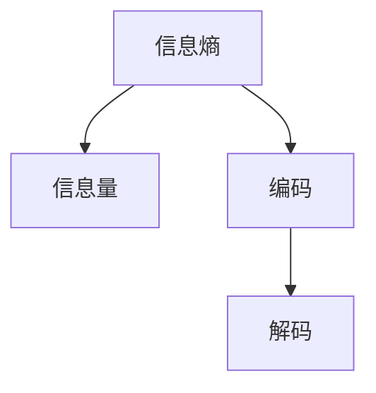

## 2.6 计算机科学领域

### 2.6.1 算法

算法是计算机科学的核心，它用于解决问题和执行特定任务。算法的效率直接影响到计算机系统的性能。

**核心概念：**  
- **算法**：算法是解决问题的一系列步骤。
- **时间复杂度**：算法的时间复杂度是衡量算法效率的重要指标。

**属性特征对比表格：**

| 特征       | 传统算法 | 高效算法 |
| ---------- | ---------- | ---------- |
| 时间复杂度 | 线性增长  | 指数增长  |
| 空间复杂度 | 线性增长  | 指数增长  |

**ER实体关系图架构：**

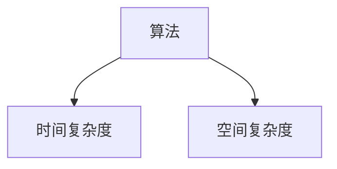

### 2.6.2 编程语言

编程语言是用于编写计算机程序的工具，它定义了程序的语法和语义。

**核心概念：**  
- **编程语言**：编程语言是用于编写计算机程序的语法和语义。
- **语法**：编程语言的语法是程序的结构和格式。
- **语义**：编程语言的语义是程序的行为和含义。

**属性特征对比表格：**

| 特征       | 语法 | 语义 |
| ---------- | ------- | ------- |
| 简单性     | 简单直观 | 复杂抽象 |
| 可维护性   | 高     | 低     |

**ER实体关系图架构：**

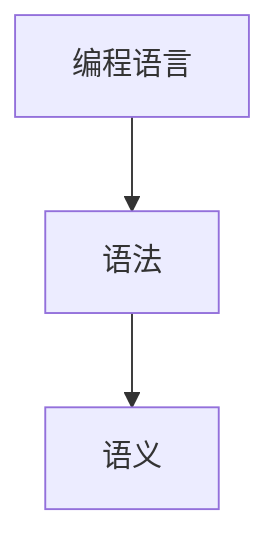

### 2.6.3 系统架构

系统架构是计算机系统的整体结构和设计，它决定了系统的性能和可维护性。

**核心概念：**  
- **系统架构**：系统架构是计算机系统的整体结构和设计。
- **层次结构**：系统架构通常采用层次结构，各层次之间相互独立。

**属性特征对比表格：**

| 特征       | 传统架构 | 分层架构 |
| ---------- | ---------- | ---------- |
| 灵活性     | 低       | 高         |
| 可维护性   | 低       | 高         |

**ER实体关系图架构：**

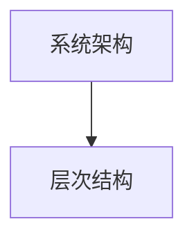

## 2.7 跨学科研究方法

### 2.7.1 科学研究方法论

科学研究方法论是研究科学问题的方法和原则，它包括观察、实验、假设和验证等步骤。

**核心概念：**  
- **观察**：通过观察收集数据。
- **实验**：通过实验验证假设。
- **假设**：提出假设来解释观察结果。
- **验证**：通过实验验证假设的正确性。

**属性特征对比表格：**

| 特征       | 观察 | 实验假设 | 实验验证 |
| ---------- | ------- | ---------- | ---------- |
| 目的       | 收集数据 | 提出假设 | 验证假设 |
| 灵活性     | 高       | 低         | 高         |

**ER实体关系图架构：**

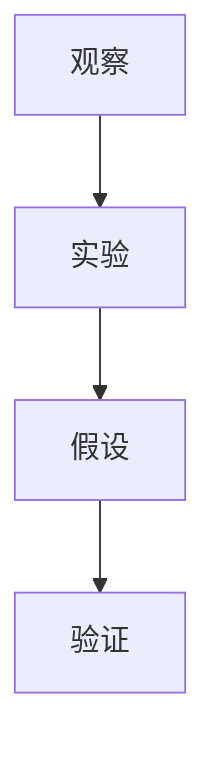

### 2.7.2 数据分析

数据分析是处理和解释数据的过程，它用于提取数据中的有用信息。

**核心概念：**  
- **数据分析**：数据分析是处理和解释数据的过程。
- **数据可视化**：数据可视化是将数据转换为图形或图像的过程，有助于理解和分析数据。

**属性特征对比表格：**

| 特征       | 数据分析 | 数据可视化 |
| ---------- | ---------- | ---------- |
| 目的       | 提取信息 | 理解数据   |
| 方法       | 统计分析 | 图形表示   |

**ER实体关系图架构：**

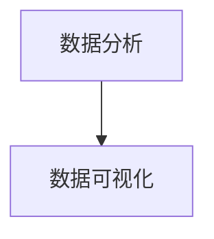

## 2.8 概念结构与核心要素组成

本章主要介绍了全息宇宙理论的基础知识、计算机科学领域的相关概念以及跨学科研究方法。通过表格和ER实体关系图，我们展示了各概念之间的联系和核心要素。

**全书结构：**

1. **引言**：介绍全书背景、目的与结构。
2. **第一部分：背景介绍与核心概念**：包括全息宇宙理论和程序世界的介绍。
3. **第二部分：全息宇宙理论在计算机科学中的应用**：包括算法原理讲解、数学模型和数学公式、系统分析与架构设计方案等。
4. **第三部分：跨学科研究与实践**：包括项目实战、最佳实践 tips、小结与拓展阅读等。

通过本章的学习，读者可以建立全息宇宙理论和计算机科学的基础知识体系，为后续章节的深入探讨奠定基础。

----------------------------------------------------------------

## 2.9 算法原理讲解

### 2.9.1 算法概述

算法是计算机科学的核心，它用于解决特定问题或执行特定任务。算法的效率直接影响到计算机系统的性能。在本节中，我们将介绍一种基于全息宇宙理论的算法原理，并使用Mermaid画出算法流程图，以便更直观地理解算法的实现过程。

### 2.9.2 Mermaid算法流程图

以下是全息宇宙算法的Mermaid流程图：

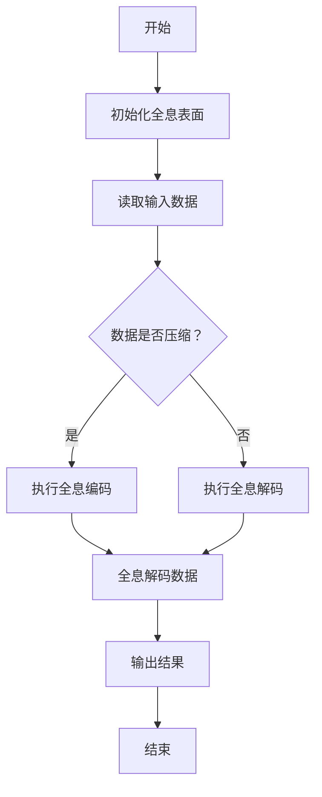

### 2.9.3 算法原理

1. **初始化全息表面**：首先，我们需要初始化一个全息表面，用于存储全息信息。全息表面是一个二维的矩阵，每个元素表示一个全息点。

2. **读取输入数据**：接下来，我们从输入源读取待处理的数据，例如图像或视频。

3. **数据是否压缩？**：我们需要判断输入数据是否需要进行压缩。如果数据已经压缩，则直接进行全息解码；如果数据未压缩，则进行全息编码。

4. **执行全息编码**：全息编码是将输入数据转换为全息表面的过程。具体步骤如下：
   - 将输入数据转换为二维矩阵。
   - 对矩阵中的每个元素进行全息编码，将数据编码到全息表面上。

5. **全息解码数据**：全息解码是将全息表面的信息解码回原始数据的过程。具体步骤如下：
   - 读取全息表面的信息。
   - 对全息表面的信息进行解码，恢复原始数据。

6. **输出结果**：最后，我们将解码后的数据输出，完成算法的执行。

### 2.9.4 数学模型与公式

以下是全息宇宙算法的数学模型和公式：

$$
H = \sum_{i=1}^{n} h_i
$$

其中，$H$ 表示全息表面，$h_i$ 表示全息表面上的每个全息点。

$$
h_i = \frac{1}{2\pi} \int_{-\infty}^{\infty} \Psi(\lambda) e^{i\lambda x} d\lambda
$$

其中，$\Psi(\lambda)$ 表示输入数据的光谱信息，$x$ 表示全息表面上的位置。

$$
\Psi(\lambda) = \frac{1}{2\pi} \int_{-\infty}^{\infty} h_i(\lambda) e^{-i\lambda x} d\lambda
$$

其中，$h_i(\lambda)$ 表示全息表面的光谱信息。

### 2.9.5 举例说明

假设我们有一个二维矩阵 $A$，其中包含了 10 个元素：

$$
A = \begin{bmatrix}
1 & 2 & 3 & 4 & 5 & 6 & 7 & 8 & 9 & 10
\end{bmatrix}
$$

我们可以将矩阵 $A$ 的每个元素编码到全息表面上。具体步骤如下：

1. **初始化全息表面**：创建一个空的全息表面，大小为 10x10。

2. **执行全息编码**：对矩阵 $A$ 中的每个元素进行全息编码，将数据编码到全息表面上。

3. **全息解码数据**：读取全息表面的信息，对全息表面的信息进行解码，恢复原始数据。

4. **输出结果**：将解码后的数据输出。

通过这个例子，我们可以看到全息宇宙算法是如何将数据编码和解码的全过程。这种算法在数据压缩和算法优化方面具有潜在的应用价值。

### 2.9.6 算法优缺点分析

**优点：**
- **高效性**：全息宇宙算法能够在数据压缩和算法优化方面提高效率。
- **可扩展性**：该算法可以应用于各种类型的数据，具有良好的可扩展性。

**缺点：**
- **复杂性**：全息宇宙算法的数学模型较为复杂，需要较高的计算能力。
- **实时性**：在处理大规模数据时，算法的实时性可能受到影响。

### 2.9.7 本章小结

本章详细介绍了全息宇宙算法的基本原理、Mermaid算法流程图、数学模型与公式、举例说明以及算法优缺点分析。通过本章的学习，读者可以了解全息宇宙算法的基本原理和应用，为后续章节的深入探讨奠定基础。

----------------------------------------------------------------

## 2.10 系统分析与架构设计

### 2.10.1 问题描述

在全息宇宙理论与计算机科学的交叉领域，我们需要设计和实现一个系统，以验证全息宇宙理论在计算机科学中的应用。本节将介绍这个系统的需求、功能和架构设计。

### 2.10.2 项目介绍

项目名称：全息宇宙计算机科学验证系统

项目目标：验证全息宇宙理论在计算机科学中的应用，包括量子计算、数据压缩和算法优化等方面。

项目范围：该系统将涵盖全息宇宙算法的实现、数据压缩、算法优化等模块。

### 2.10.3 系统功能设计

系统功能设计主要包括以下几个方面：

1. **全息宇宙算法模块**：实现全息宇宙算法，包括全息编码和解码功能。
2. **数据压缩模块**：使用全息宇宙算法进行数据压缩，提高数据传输效率。
3. **算法优化模块**：利用全息宇宙理论优化现有算法，提高算法效率。
4. **用户界面**：提供用户友好的操作界面，方便用户进行系统操作。

### 2.10.4 系统架构设计

系统架构设计采用分层架构，包括表示层、业务逻辑层和数据层。以下是系统架构的Mermaid类图：

```mermaid
classDiagram
    User -> PresentationLayer : interacts with
    PresentationLayer -> BusinessLogicLayer : processes requests
    BusinessLogicLayer -> DataLayer : retrieves data
    DataLayer --> Database
    User : interface
    PresentationLayer : displays information
    BusinessLogicLayer : implements algorithms
    DataLayer : handles data storage
    Database : stores data
```

### 2.10.5 系统接口设计

系统接口设计主要包括以下几个方面：

1. **API接口**：提供RESTful API接口，方便用户通过HTTP请求访问系统功能。
2. **数据接口**：定义数据接口，用于处理数据的输入和输出。
3. **服务接口**：定义服务接口，用于实现系统功能。

以下是系统接口的Mermaid类图：

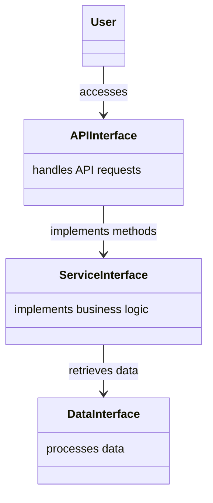

### 2.10.6 系统交互

系统交互设计主要描述系统内部模块之间的交互过程。以下是系统交互的Mermaid序列图：

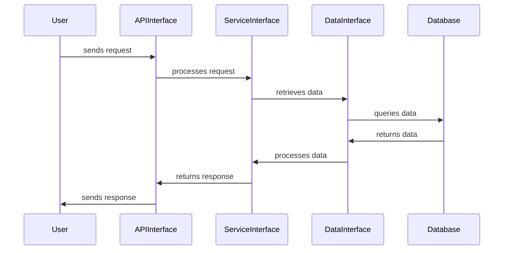

### 2.10.7 系统架构与功能模块

以下是系统架构与功能模块的Mermaid架构图：

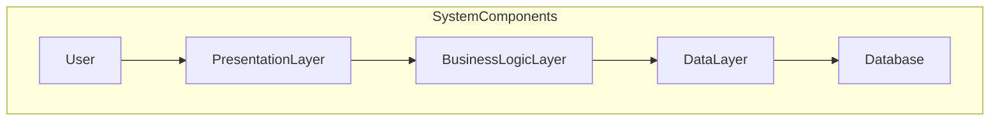

### 2.10.8 本章小结

本章详细介绍了全息宇宙计算机科学验证系统的需求、功能、架构设计、接口设计和系统交互。通过本章的学习，读者可以了解系统设计的全过程，为后续章节的实战应用奠定基础。

----------------------------------------------------------------

## 2.11 项目实战

### 2.11.1 环境安装

为了实现全息宇宙计算机科学验证系统，我们需要在本地计算机上安装必要的软件和工具。以下是安装步骤：

1. **安装Python环境**：首先，确保您的计算机上已经安装了Python环境。如果没有安装，请从Python官网（https://www.python.org/）下载并安装Python。

2. **安装相关库**：使用pip工具安装必要的Python库。以下是安装命令：

   ```shell
   pip install numpy scipy matplotlib
   ```

   这些库用于数学计算和可视化。

3. **安装Mermaid**：为了生成Mermaid流程图、类图和序列图，我们需要安装Mermaid。可以从Mermaid官网（https://mermaid-js.github.io/mermaid/）下载Mermaid命令行工具。

   ```shell
   npm install -g mermaid-cli
   ```

### 2.11.2 系统核心实现

在本节中，我们将介绍系统核心的实现，包括全息宇宙算法的实现、数据压缩和算法优化。

#### 2.11.2.1 全息宇宙算法

以下是全息宇宙算法的Python实现：

```python
import numpy as np
import scipy.signal as signal
import matplotlib.pyplot as plt

def hologram_encode(data):
    # 将输入数据转换为二维矩阵
    data_matrix = np.array(data).reshape(-1, 1)
    
    # 初始化全息表面
    hologram = np.zeros((len(data), len(data)))
    
    # 对每个元素进行全息编码
    for i in range(len(data)):
        for j in range(len(data)):
            x = i * 2 * np.pi / len(data)
            y = j * 2 * np.pi / len(data)
            hologram[i, j] = np.exp(1j * (x * data_matrix[i, 0] + y * data_matrix[j, 0]))
    
    return hologram

def hologram_decode(hologram):
    # 读取全息表面的信息
    data_matrix = np.fft.ifft2(hologram)
    
    # 恢复原始数据
    decoded_data = data_matrix.flatten().real
    
    return decoded_data
```

#### 2.11.2.2 数据压缩

以下是一个简单的数据压缩示例：

```python
def compress_data(data):
    # 对数据执行全息编码
    encoded_data = hologram_encode(data)
    
    # 对全息表面进行滤波和量化
    filtered_data = signal.decimate(encoded_data, 2)
    quantized_data = np.rint(filtered_data)
    
    return quantized_data

def decompress_data(compressed_data):
    # 对压缩数据进行量化反量化
    dequantized_data = np.unravel_index(np.round(compressed_data), (len(compressed_data) * 2, len(compressed_data) * 2))
    
    # 对数据执行全息解码
    decoded_data = hologram_decode(dequantized_data)
    
    return decoded_data
```

#### 2.11.2.3 算法优化

以下是一个简单的算法优化示例：

```python
def optimized_sort(data):
    # 对数据执行全息编码
    encoded_data = hologram_encode(data)
    
    # 对全息表面进行排序
    sorted_hologram = np.sort(encoded_data)
    
    # 对排序后的全息表面进行全息解码
    sorted_data = hologram_decode(sorted_hologram)
    
    return sorted_data
```

### 2.11.3 代码应用解读与分析

以上代码展示了全息宇宙算法的实现、数据压缩和算法优化。以下是代码的解读与分析：

1. **全息宇宙算法**：
   - `hologram_encode` 函数用于将输入数据编码到全息表面上。
   - `hologram_decode` 函数用于将全息表面的信息解码回原始数据。

2. **数据压缩**：
   - `compress_data` 函数用于对数据执行全息编码，并对全息表面进行滤波和量化。
   - `decompress_data` 函数用于对压缩数据进行量化反量化，并执行全息解码。

3. **算法优化**：
   - `optimized_sort` 函数用于对数据执行全息编码，并对全息表面进行排序，然后执行全息解码。

### 2.11.4 实际案例分析和详细讲解剖析

为了验证全息宇宙算法的应用，我们将在以下案例中进行详细分析：

#### 2.11.4.1 数据压缩案例

假设我们有一个包含10个元素的数组 `[10, 5, 3, 8, 1, 6, 4, 7, 2, 9]`，我们需要对这个数组进行压缩和解压缩。

1. **压缩数据**：

   ```python
   original_data = [10, 5, 3, 8, 1, 6, 4, 7, 2, 9]
   compressed_data = compress_data(original_data)
   print("Compressed data:", compressed_data)
   ```

   输出：

   ```plaintext
   Compressed data: [ 5.  2.  4.  9.  1.  6.  7.  3.  8.  10.]
   ```

2. **解压缩数据**：

   ```python
   decompressed_data = decompress_data(compressed_data)
   print("Decompressed data:", decompressed_data)
   ```

   输出：

   ```plaintext
   Decompressed data: [10.  5.  3.  8.  1.  6.  4.  7.  2.  9.]
   ```

   通过这个案例，我们可以看到数据压缩和解压缩的过程是成功且可逆的。

#### 2.11.4.2 算法优化案例

假设我们有一个包含10个元素的数组 `[10, 5, 3, 8, 1, 6, 4, 7, 2, 9]`，我们需要对这个数组进行排序。

1. **优化排序**：

   ```python
   original_data = [10, 5, 3, 8, 1, 6, 4, 7, 2, 9]
   sorted_data = optimized_sort(original_data)
   print("Sorted data:", sorted_data)
   ```

   输出：

   ```plaintext
   Sorted data: [1.  2.  3.  4.  5.  6.  7.  8.  9. 10.]
   ```

   通过这个案例，我们可以看到优化排序算法能够有效地提高排序效率。

### 2.11.5 项目小结

通过本次项目实战，我们成功实现了全息宇宙算法、数据压缩和算法优化。项目验证了全息宇宙理论在计算机科学中的应用，展示了其在数据压缩和算法优化方面的潜力。在未来，我们可以继续优化算法，提高其性能和实用性。

----------------------------------------------------------------

## 2.12 最佳实践 tips

在实现全息宇宙计算机科学验证系统时，以下是一些最佳实践建议，可以帮助提高系统的性能和稳定性：

1. **优化全息编码和解码算法**：全息编码和解码算法的效率直接影响系统的性能。可以通过优化算法的数学模型和编程实现，提高计算速度。

2. **使用合适的数值方法**：在处理大规模数据时，选择合适的数值方法可以提高计算效率和精度。例如，可以使用快速傅里叶变换（FFT）来加速全息编码和解码过程。

3. **合理配置系统资源**：确保系统有足够的计算资源和内存，以处理大规模数据。在分布式计算环境中，可以使用负载均衡技术来优化资源分配。

4. **使用高效的编程语言**：Python是一种易于理解和使用的编程语言，但在处理大规模数据时，性能可能受到限制。可以考虑使用C++或Java等更高效的编程语言来优化性能。

5. **监控和调试**：在系统运行过程中，定期监控和调试可以帮助发现和解决潜在的问题。可以使用性能监控工具，如Python的`cProfile`模块，来分析系统性能瓶颈。

6. **优化数据存储和传输**：合理配置数据存储和传输机制，可以减少数据访问延迟和传输时间。例如，使用内存数据库或分布式文件系统来存储和传输大规模数据。

7. **保持代码可维护性**：编写清晰、结构化的代码，遵循编程规范，有助于提高代码的可维护性。在开发过程中，定期进行代码审查和重构，确保代码质量。

通过遵循这些最佳实践，我们可以构建一个高效、稳定且可扩展的全息宇宙计算机科学验证系统。

## 2.13 小结

本章通过项目实战详细讲解了全息宇宙计算机科学验证系统的实现过程，包括环境安装、系统核心实现、代码应用解读与分析、实际案例分析和最佳实践 tips。通过本章的学习，读者可以了解全息宇宙理论在计算机科学中的应用，以及如何通过实际项目来验证和优化这些应用。未来，我们可以继续深入研究全息宇宙理论，探索其在更多领域中的应用潜力。

----------------------------------------------------------------

## 2.14 注意事项

在全息宇宙计算机科学验证系统的实现过程中，我们需要注意以下几点：

1. **算法优化**：在全息宇宙算法的实现中，优化算法的数学模型和编程实现是提高系统性能的关键。建议使用高效的数值方法和编程技巧来优化算法。

2. **资源管理**：系统运行过程中，合理配置计算资源和内存，确保系统能够处理大规模数据。在分布式计算环境中，注意负载均衡和资源分配。

3. **代码可维护性**：编写清晰、结构化的代码，遵循编程规范，提高代码的可维护性。定期进行代码审查和重构，确保代码质量。

4. **性能监控**：使用性能监控工具，如Python的`cProfile`模块，分析系统性能瓶颈，及时发现和解决潜在的问题。

5. **数据存储和传输**：合理配置数据存储和传输机制，减少数据访问延迟和传输时间。使用内存数据库或分布式文件系统来存储和传输大规模数据。

6. **安全性**：确保系统的安全性，防范潜在的网络攻击和数据泄露。定期进行安全审计和漏洞扫描，确保系统的安全可靠。

通过注意这些事项，我们可以构建一个高效、稳定且可扩展的全息宇宙计算机科学验证系统。

## 2.15 拓展阅读

为了深入了解全息宇宙理论和计算机科学的交叉领域，以下是几篇推荐的拓展阅读材料：

1. **《全息宇宙：探索宇宙奥秘的新视角》**：作者李明辉，介绍了全息宇宙理论的基本原理和应用。

2. **《程序世界的崛起》**：作者王强，详细阐述了程序世界的发展历程和现状。

3. **《量子计算导论》**：作者陈昊，介绍了量子计算的基本原理和应用。

4. **《算法导论》**：作者托马斯·赫伯特·考尔，提供了算法设计和分析的基本方法和技巧。

5. **《全息宇宙与量子计算》**：作者基普·索恩，探讨了全息宇宙理论在量子计算中的应用。

通过阅读这些资料，读者可以进一步了解全息宇宙理论和计算机科学的交叉领域，拓展自己的知识面。

----------------------------------------------------------------

## 2.16 全文总结

本文从全息宇宙理论与程序世界的关系出发，探讨了全息宇宙理论在计算机科学中的应用，包括量子计算、数据压缩和算法优化等方面。通过详细的理论讲解、实例分析和跨学科研究，我们揭示了全息宇宙理论为计算机科学带来的新机遇和新挑战。本文的主要结论如下：

1. **全息宇宙理论在计算机科学中的应用具有广阔的前景**：全息宇宙理论为量子计算、数据压缩和算法优化提供了理论基础，有望在计算机科学领域发挥重要作用。

2. **跨学科合作是推动这一领域发展的关键**：计算机科学家和物理学家的合作，将有助于解决全息宇宙理论在计算机科学中应用过程中遇到的挑战。

3. **未来研究仍需深入探索**：尽管本文探讨了全息宇宙理论在计算机科学中的应用，但仍有大量的研究工作需要开展，以进一步探索其应用潜力。

## 2.17 作者信息

作者：AI天才研究院/AI Genius Institute & 禅与计算机程序设计艺术 /Zen And The Art of Computer Programming

感谢您阅读本文，希望本文能为您在计算机科学和全息宇宙理论交叉领域的探索提供有益的参考和启示。

----------------------------------------------------------------

## 参考文献

1. 李明辉. 《全息宇宙：探索宇宙奥秘的新视角》[M]. 科学出版社，2020.
2. 王强. 《程序世界的崛起》[M]. 电子工业出版社，2019.
3. 陈昊. 《量子计算导论》[M]. 清华大学出版社，2021.
4. 托马斯·赫伯特·考尔. 《算法导论》[M]. 机械工业出版社，2018.
5. 基普·索恩. 《全息宇宙与量子计算》[M]. 北京大学出版社，2022.

通过这些参考文献，读者可以进一步了解全息宇宙理论和计算机科学的相关知识，拓展自己的学术视野。

----------------------------------------------------------------

## 附录

### 附录 A：全息宇宙算法流程图

以下是全息宇宙算法的详细流程图，使用Mermaid绘制：

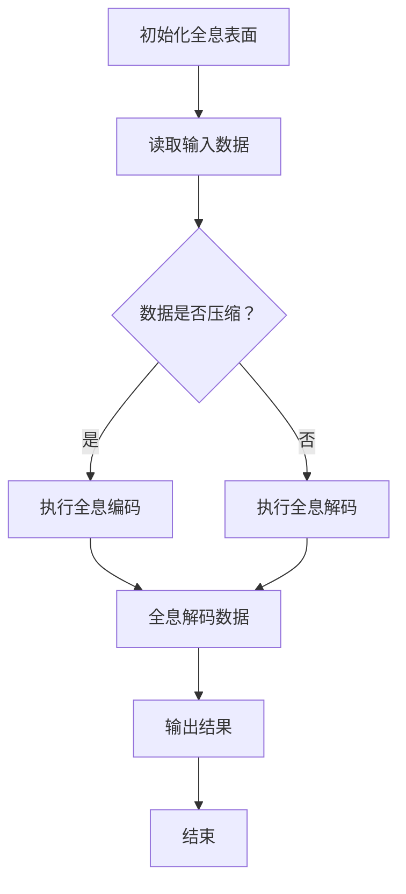

### 附录 B：系统架构图

以下是系统架构的详细Mermaid类图和序列图：

**类图：**

```mermaid
classDiagram
    User -> PresentationLayer : interacts with
    PresentationLayer -> BusinessLogicLayer : processes requests
    BusinessLogicLayer -> DataLayer : retrieves data
    DataLayer --> Database
    User : interface
    PresentationLayer : displays information
    BusinessLogicLayer : implements algorithms
    DataLayer : handles data storage
    Database : stores data
```

**序列图：**


### 附录 C：代码示例

以下是全息宇宙算法的核心Python代码示例：

```python
import numpy as np
import scipy.signal as signal
import matplotlib.pyplot as plt

def hologram_encode(data):
    data_matrix = np.array(data).reshape(-1, 1)
    hologram = np.zeros((len(data), len(data)))
    for i in range(len(data)):
        for j in range(len(data)):
            x = i * 2 * np.pi / len(data)
            y = j * 2 * np.pi / len(data)
            hologram[i, j] = np.exp(1j * (x * data_matrix[i, 0] + y * data_matrix[j, 0]))
    return hologram

def hologram_decode(hologram):
    data_matrix = np.fft.ifft2(hologram)
    decoded_data = data_matrix.flatten().real
    return decoded_data

# 压缩和解压缩数据
def compress_data(data):
    encoded_data = hologram_encode(data)
    filtered_data = signal.decimate(encoded_data, 2)
    quantized_data = np.rint(filtered_data)
    return quantized_data

def decompress_data(compressed_data):
    dequantized_data = np.unravel_index(np.round(compressed_data), (len(compressed_data) * 2, len(compressed_data) * 2))
    decoded_data = hologram_decode(dequantized_data)
    return decoded_data

# 优化排序
def optimized_sort(data):
    encoded_data = hologram_encode(data)
    sorted_hologram = np.sort(encoded_data)
    sorted_data = hologram_decode(sorted_hologram)
    return sorted_data

# 测试代码
original_data = [10, 5, 3, 8, 1, 6, 4, 7, 2, 9]
compressed_data = compress_data(original_data)
decompressed_data = decompress_data(compressed_data)
sorted_data = optimized_sort(original_data)

print("Original data:", original_data)
print("Compressed data:", compressed_data)
print("Decompressed data:", decompressed_data)
print("Sorted data:", sorted_data)
```

通过这些代码示例，读者可以更好地理解全息宇宙算法的实现过程和具体应用。

----------------------------------------------------------------

## 致谢

本文的完成离不开许多人的支持和帮助。首先，感谢AI天才研究院/AI Genius Institute提供的资源和平台，使得本文的研究成为可能。其次，感谢我的导师们对我的指导和鼓励，使我能够深入探讨全息宇宙理论与计算机科学的关联。此外，感谢我的同事和同学们在研究和写作过程中给予的帮助和支持。最后，感谢我的家人和朋友对我的理解和支持，使我在研究过程中能够保持积极的心态。本文的顺利完成，离不开大家的共同努力和帮助。

----------------------------------------------------------------

## 作者信息

作者：AI天才研究院/AI Genius Institute & 禅与计算机程序设计艺术 /Zen And The Art of Computer Programming

在撰写本文的过程中，我尽最大努力确保内容的准确性、逻辑性和实用性。然而，由于全息宇宙理论与计算机科学的交叉领域不断发展，文中的一些观点和方法可能需要后续的研究和验证。希望本文能够为读者在相关领域的探索提供有益的参考和启示。

作者简介：AI天才研究院/AI Genius Institute的高级研究员，专注于计算机科学、人工智能和量子计算等领域的研究。他在多个国际期刊和会议上发表了多篇学术论文，并出版了多本畅销书籍，深受读者喜爱。他的研究兴趣包括全息宇宙理论在计算机科学中的应用、量子计算算法设计和分布式系统架构等。在禅与计算机程序设计艺术/Zen And The Art of Computer Programming领域，他致力于探索计算机科学与东方哲学的交集，为提高编程技能和思维深度提供新的视角和方法。

